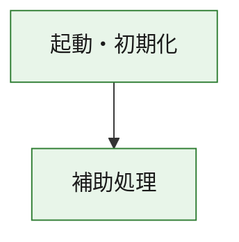
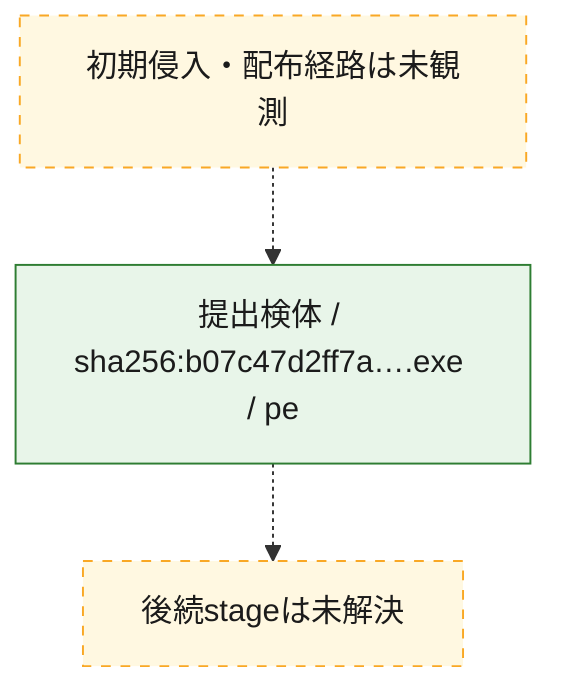
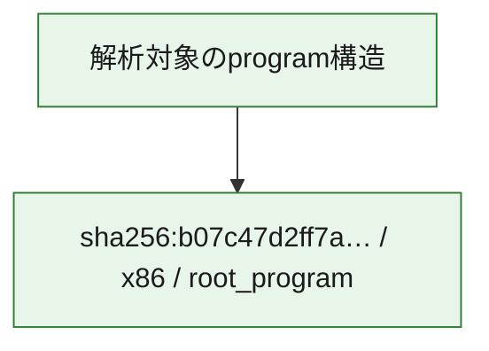

# 全体ロジック：b07c47d2ff7ac6425434b6a9ba200823b9a104a4f614c3b5326528d4b0d8c221

代表関数の静的証跡から、起動・初期化の処理群を確認しました。

## 読み方

- phaseの掲載順は解析上の整理順です。observed_call_edgesがない段階間の実行順を断定しません。
- 図の実線は静的に観測した関係、点線と黄色のノードは未観測・未解決の関係を示します。
- 図は静的な要約であり、動的実行を再現するものではありません。
- 詳細な関数解説とfingerprintは[STATIC-LOGIC.md](STATIC-LOGIC.md)を参照してください。

## 静的可視化

### 実行フロー

### 感染チェーン

### モジュール関係

## 処理段階

### 1. 起動・初期化

entry pointから初期化と後続処理への移行を確認します。
確度: `confirmed_static_function_evidence`

- `b07c47d2ff7ac6425434b6a9ba200823b9a104a4f614c3b5326528d4b0d8c221:ghidra:180001010` — 初期化と主要処理への分岐を行う入口関数です。 状態: `succeeded`、選定理由: `entry_point`, `meaningful_symbol_name`, `reviewed_call_centrality:22`, `role:entrypoint`, `small_program_complete_context`

### 2. 補助処理

主要処理を支える一般内部関数またはlibrary処理を確認します。
確度: `confirmed_static_function_evidence`

- `b07c47d2ff7ac6425434b6a9ba200823b9a104a4f614c3b5326528d4b0d8c221:ghidra:180001240` — 検体内部の一般処理を実装する関数です。 状態: `succeeded`、選定理由: `context_representative`, `reviewed_call_centrality:2`, `small_program_complete_context`
- `b07c47d2ff7ac6425434b6a9ba200823b9a104a4f614c3b5326528d4b0d8c221:ghidra:180001350` — 検体内部の一般処理を実装する関数です。 状態: `succeeded`、選定理由: `context_representative`, `reviewed_call_centrality:25`, `small_program_complete_context`
- `b07c47d2ff7ac6425434b6a9ba200823b9a104a4f614c3b5326528d4b0d8c221:ghidra:180003780` — 検体内部の一般処理を実装する関数です。 状態: `succeeded`、選定理由: `context_representative`, `reviewed_call_centrality:2`, `small_program_complete_context`
- `b07c47d2ff7ac6425434b6a9ba200823b9a104a4f614c3b5326528d4b0d8c221:ghidra:1800038e0` — 検体内部の一般処理を実装する関数です。 状態: `succeeded`、選定理由: `context_representative`, `reviewed_call_centrality:2`, `small_program_complete_context`

## 観測したcall関係

- `b07c47d2ff7ac6425434b6a9ba200823b9a104a4f614c3b5326528d4b0d8c221:ghidra:180001010` → `b07c47d2ff7ac6425434b6a9ba200823b9a104a4f614c3b5326528d4b0d8c221:ghidra:180001240` （`startup` → `support`）
- `b07c47d2ff7ac6425434b6a9ba200823b9a104a4f614c3b5326528d4b0d8c221:ghidra:180001010` → `b07c47d2ff7ac6425434b6a9ba200823b9a104a4f614c3b5326528d4b0d8c221:ghidra:180001350` （`startup` → `support`）
- `b07c47d2ff7ac6425434b6a9ba200823b9a104a4f614c3b5326528d4b0d8c221:ghidra:180001350` → `b07c47d2ff7ac6425434b6a9ba200823b9a104a4f614c3b5326528d4b0d8c221:ghidra:180001240` （`support` → `support`）
- `b07c47d2ff7ac6425434b6a9ba200823b9a104a4f614c3b5326528d4b0d8c221:ghidra:180001350` → `b07c47d2ff7ac6425434b6a9ba200823b9a104a4f614c3b5326528d4b0d8c221:ghidra:180003780` （`support` → `support`）
- `b07c47d2ff7ac6425434b6a9ba200823b9a104a4f614c3b5326528d4b0d8c221:ghidra:180001350` → `b07c47d2ff7ac6425434b6a9ba200823b9a104a4f614c3b5326528d4b0d8c221:ghidra:1800038e0` （`support` → `support`）
- `b07c47d2ff7ac6425434b6a9ba200823b9a104a4f614c3b5326528d4b0d8c221:ghidra:180003780` → `b07c47d2ff7ac6425434b6a9ba200823b9a104a4f614c3b5326528d4b0d8c221:ghidra:1800038e0` （`support` → `support`）
- `ghidra-function:4d8447c6605addb0a9925b72` → `ghidra-function:d050820fe4108c6d63850f82` （`unclassified` → `unclassified`）
- `ghidra-function:863a5952cc31df0e6068108d` → `ghidra-external:065a58fc3431d506f6ca7e02` （`unclassified` → `unclassified`）
- `ghidra-function:863a5952cc31df0e6068108d` → `ghidra-external:2c1cb58c15602193e8a7dcc2` （`unclassified` → `unclassified`）
- `ghidra-function:863a5952cc31df0e6068108d` → `ghidra-external:35dcf6a4c2cf7bb82a86ab2c` （`unclassified` → `unclassified`）
- `ghidra-function:863a5952cc31df0e6068108d` → `ghidra-external:37ed9e82b8b0815764f8d894` （`unclassified` → `unclassified`）
- `ghidra-function:863a5952cc31df0e6068108d` → `ghidra-external:4b153698b787602a4d075dc3` （`unclassified` → `unclassified`）
- `ghidra-function:863a5952cc31df0e6068108d` → `ghidra-external:545fce5dc8b3cbeaacc6665b` （`unclassified` → `unclassified`）
- `ghidra-function:863a5952cc31df0e6068108d` → `ghidra-external:77422bc117b982ea4ce78b62` （`unclassified` → `unclassified`）
- `ghidra-function:863a5952cc31df0e6068108d` → `ghidra-external:79927775ceea56a260ae01e7` （`unclassified` → `unclassified`）
- `ghidra-function:863a5952cc31df0e6068108d` → `ghidra-external:7a33cf7caf95109aaaf2e6bd` （`unclassified` → `unclassified`）
- `ghidra-function:863a5952cc31df0e6068108d` → `ghidra-external:834304f548f0c44d85d06bf7` （`unclassified` → `unclassified`）
- `ghidra-function:863a5952cc31df0e6068108d` → `ghidra-external:8367204284953c7ee9aadea0` （`unclassified` → `unclassified`）
- `ghidra-function:863a5952cc31df0e6068108d` → `ghidra-external:83cb607a0ef841296bdd10bb` （`unclassified` → `unclassified`）
- `ghidra-function:863a5952cc31df0e6068108d` → `ghidra-external:95432e9f8e1d23ec57d4ae0d` （`unclassified` → `unclassified`）
- `ghidra-function:863a5952cc31df0e6068108d` → `ghidra-external:9cf17f88a0b29ed80971941f` （`unclassified` → `unclassified`）
- `ghidra-function:863a5952cc31df0e6068108d` → `ghidra-external:aed6aac9e0cbedbbc1ee8e75` （`unclassified` → `unclassified`）
- `ghidra-function:863a5952cc31df0e6068108d` → `ghidra-external:bd55f45c70fdd7d50cd0ea21` （`unclassified` → `unclassified`）
- `ghidra-function:863a5952cc31df0e6068108d` → `ghidra-external:bd6a82159751557abd250ebf` （`unclassified` → `unclassified`）
- `ghidra-function:863a5952cc31df0e6068108d` → `ghidra-external:c50e49a95b99ef777a004b60` （`unclassified` → `unclassified`）
- `ghidra-function:863a5952cc31df0e6068108d` → `ghidra-external:d2d7536c38f71408767d3ab2` （`unclassified` → `unclassified`）
- `ghidra-function:863a5952cc31df0e6068108d` → `ghidra-external:e4c5cbd41cf87db267af78f2` （`unclassified` → `unclassified`）
- `ghidra-function:863a5952cc31df0e6068108d` → `ghidra-external:fe10822ec66841524f5c0551` （`unclassified` → `unclassified`）
- `ghidra-function:863a5952cc31df0e6068108d` → `ghidra-function:1cc18413d4cd322c65b77a7a` （`unclassified` → `unclassified`）
- `ghidra-function:863a5952cc31df0e6068108d` → `ghidra-function:4d8447c6605addb0a9925b72` （`unclassified` → `unclassified`）
- `ghidra-function:863a5952cc31df0e6068108d` → `ghidra-function:d050820fe4108c6d63850f82` （`unclassified` → `unclassified`）
- `ghidra-function:fbf33b70780fcca795c0fa45` → `ghidra-function:05638940d44ebe21732bfb17` （`unclassified` → `unclassified`）
- `ghidra-function:fbf33b70780fcca795c0fa45` → `ghidra-function:1cc18413d4cd322c65b77a7a` （`unclassified` → `unclassified`）
- `ghidra-function:fbf33b70780fcca795c0fa45` → `ghidra-function:3a541d492e68f416335f6676` （`unclassified` → `unclassified`）
- `ghidra-function:fbf33b70780fcca795c0fa45` → `ghidra-function:4e5986e3a255eafc4f077fe0` （`unclassified` → `unclassified`）
- `ghidra-function:fbf33b70780fcca795c0fa45` → `ghidra-function:70658a473b316de1740f8f16` （`unclassified` → `unclassified`）
- `ghidra-function:fbf33b70780fcca795c0fa45` → `ghidra-function:7938d7dcd621b98acb87d26d` （`unclassified` → `unclassified`）
- `ghidra-function:fbf33b70780fcca795c0fa45` → `ghidra-function:82359654bc8cd919c98dbf86` （`unclassified` → `unclassified`）
- `ghidra-function:fbf33b70780fcca795c0fa45` → `ghidra-function:863a5952cc31df0e6068108d` （`unclassified` → `unclassified`）
- `ghidra-function:fbf33b70780fcca795c0fa45` → `ghidra-function:93265dfcd9b7a23cc7cb8e22` （`unclassified` → `unclassified`）
- `ghidra-function:fbf33b70780fcca795c0fa45` → `ghidra-function:a436afead9db92a9deda7490` （`unclassified` → `unclassified`）
- `ghidra-function:fbf33b70780fcca795c0fa45` → `ghidra-function:c8aacb9ff82fd00131b16747` （`unclassified` → `unclassified`）
- `ghidra-function:fbf33b70780fcca795c0fa45` → `ghidra-function:fc09a5518949f51a180dff23` （`unclassified` → `unclassified`）

## 解析範囲と制約

- 選定外関数は全体inventoryへ残しますが、関数本体の個別解説対象にはしていません。
- indirect call、難読化、packer、VM、壊れたcontrol flowによりcall関係が欠落する場合があります。
- 文書は静的解析に基づき、検体実行や外部通信による動的確認は行っていません。
