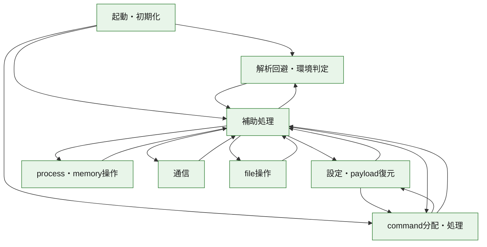

# 全体ロジック：b085658b938d2a29af85370acbf788d29d4a85760f54fb3db59449a6ff333589

代表関数の静的証跡から、起動・初期化、設定・payload復元、解析回避・環境判定、process・memory操作、通信、command分配・処理、file操作の処理群を確認しました。

## 読み方

- phaseの掲載順は解析上の整理順です。observed_call_edgesがない段階間の実行順を断定しません。
- 図の実線は静的に観測した関係、点線と黄色のノードは未観測・未解決の関係を示します。
- 図は静的な要約であり、動的実行を再現するものではありません。
- 詳細な関数解説とfingerprintは[STATIC-LOGIC.md](STATIC-LOGIC.md)を参照してください。

## 静的可視化

### 実行フロー

### 感染チェーン

```mermaid
flowchart TD
  chain_initial["初期侵入・配布経路は未観測"]
  chain_01["提出検体 / sha256:b085658b938d….exe / pe"]
  chain_02["静的復元層 1 / sha256:b085658b938d….exe::pyinstaller-pe_name_candidate-013-asyn / pe"]
  chain_03["静的復元層 1 / sha256:b085658b938d….exe::pyinstaller-pe_name_candidate-014-bz2. / pe"]
  chain_04["静的復元層 1 / sha256:b085658b938d….exe::pyinstaller-pe_name_candidate-015-cffi / pe"]
  chain_05["静的復元層 1 / sha256:b085658b938d….exe::pyinstaller-pe_name_candidate-016-ctyp / pe"]
  chain_06["静的復元層 1 / sha256:b085658b938d….exe::pyinstaller-pe_name_candidate-017-curs / pe"]
  chain_07["静的復元層 1 / sha256:b085658b938d….exe::pyinstaller-pe_name_candidate-018-deci / pe"]
  chain_08["静的復元層 1 / sha256:b085658b938d….exe::pyinstaller-pe_name_candidate-019-elem / pe"]
  chain_09["静的復元層 1 / sha256:b085658b938d….exe::pyinstaller-pe_name_candidate-020-hash / pe"]
  chain_10["静的復元層 1 / sha256:b085658b938d….exe::pyinstaller-pe_name_candidate-021-lzma / pe"]
  chain_11["静的復元層 1 / sha256:b085658b938d….exe::pyinstaller-pe_name_candidate-022-mult / pe"]
  chain_12["静的復元層 1 / sha256:b085658b938d….exe::pyinstaller-pe_name_candidate-023-over / pe"]
  chain_13["静的復元層 1 / sha256:b085658b938d….exe::pyinstaller-pe_name_candidate-024-queu / pe"]
  chain_14["静的復元層 1 / sha256:b085658b938d….exe::pyinstaller-pe_name_candidate-025-sock / pe"]
  chain_15["静的復元層 1 / sha256:b085658b938d….exe::pyinstaller-pe_name_candidate-026-ssl. / pe"]
  chain_16["静的復元層 1 / sha256:b085658b938d….exe::pyinstaller-pe_name_candidate-027-tkin / pe"]
  chain_01 -->|pyinstaller-pe_name_candidate-01| chain_02
  chain_01 -->|pyinstaller-pe_name_candidate-01| chain_03
  chain_01 -->|pyinstaller-pe_name_candidate-01| chain_04
  chain_01 -->|pyinstaller-pe_name_candidate-01| chain_05
  chain_01 -->|pyinstaller-pe_name_candidate-01| chain_06
  chain_01 -->|pyinstaller-pe_name_candidate-01| chain_07
  chain_01 -->|pyinstaller-pe_name_candidate-01| chain_08
  chain_01 -->|pyinstaller-pe_name_candidate-02| chain_09
  chain_01 -->|pyinstaller-pe_name_candidate-02| chain_10
  chain_01 -->|pyinstaller-pe_name_candidate-02| chain_11
  chain_01 -->|pyinstaller-pe_name_candidate-02| chain_12
  chain_01 -->|pyinstaller-pe_name_candidate-02| chain_13
  chain_01 -->|pyinstaller-pe_name_candidate-02| chain_14
  chain_01 -->|pyinstaller-pe_name_candidate-02| chain_15
  chain_01 -->|pyinstaller-pe_name_candidate-02| chain_16
  chain_initial -.-> chain_01
  chain_more["その他113層はstatic-layers.jsonを参照"]
  chain_02 -.-> chain_more
  chain_03 -.-> chain_more
  chain_04 -.-> chain_more
  chain_05 -.-> chain_more
  chain_06 -.-> chain_more
  chain_07 -.-> chain_more
  chain_08 -.-> chain_more
  chain_09 -.-> chain_more
  chain_10 -.-> chain_more
  chain_11 -.-> chain_more
  chain_12 -.-> chain_more
  chain_13 -.-> chain_more
  chain_14 -.-> chain_more
  chain_15 -.-> chain_more
  chain_16 -.-> chain_more
  class chain_more unresolved
  class chain_01,chain_02,chain_03,chain_04,chain_05,chain_06,chain_07,chain_08,chain_09,chain_10,chain_11,chain_12,chain_13,chain_14,chain_15,chain_16 confirmed
  class chain_initial unresolved
  classDef confirmed fill:#e8f5e9,stroke:#2e7d32,color:#1b1b1b
  classDef unresolved fill:#fff8e1,stroke:#f9a825,color:#1b1b1b,stroke-dasharray:5 5
```

### モジュール関係

```mermaid
flowchart TD
  module_scope["解析対象のprogram構造"]
  module_01["sha256:c191a43029ed… / x86 / statically_recovered_program"]
  module_02["sha256:349c7fbe9ae2… / x86 / statically_recovered_program"]
  module_03["sha256:b537313413f8… / x86 / statically_recovered_program"]
  module_04["sha256:80a229b2917f… / x86 / statically_recovered_program"]
  module_05["sha256:9dc115ac4aad… / x86 / statically_recovered_program"]
  module_06["sha256:56bd0c02c734… / x86 / statically_recovered_program"]
  module_07["sha256:5e61d755616c… / x86 / statically_recovered_program"]
  module_08["sha256:9a4595dbb128… / x86 / statically_recovered_program"]
  module_09["sha256:0e80a2e256d1… / x86 / statically_recovered_program"]
  module_10["sha256:260c6250ef9b… / x86 / statically_recovered_program"]
  module_11["sha256:2805a18724a2… / x86 / statically_recovered_program"]
  module_12["sha256:55a30d92d163… / x86 / statically_recovered_program"]
  module_parent_unknown["復元元・親moduleは未特定"]
  module_parent_unknown -.-> module_01
  module_parent_unknown -.-> module_02
  module_parent_unknown -.-> module_03
  module_parent_unknown -.-> module_04
  module_parent_unknown -.-> module_05
  module_parent_unknown -.-> module_06
  module_parent_unknown -.-> module_07
  module_parent_unknown -.-> module_08
  module_parent_unknown -.-> module_09
  module_parent_unknown -.-> module_10
  module_parent_unknown -.-> module_11
  module_parent_unknown -.-> module_12
  class module_parent_unknown unresolved
  module_more["その他104moduleはstatic-logic.jsonを参照"]
  module_scope -.-> module_more
  class module_more unresolved
  class module_scope confirmed
  class module_01,module_02,module_03,module_04,module_05,module_06,module_07,module_08,module_09,module_10,module_11,module_12 confirmed
  classDef confirmed fill:#e8f5e9,stroke:#2e7d32,color:#1b1b1b
  classDef unresolved fill:#fff8e1,stroke:#f9a825,color:#1b1b1b,stroke-dasharray:5 5
```

## 処理段階

### 1. 起動・初期化

entry pointから初期化と後続処理への移行を確認します。
確度: `confirmed_static_function_evidence_with_limits`

- `5f805f4fade5cd44177d9355a45e8eac82e2c6527d858c9e4773ef61c510ec6b:ghidra:180001420` — 初期化と主要処理への分岐を行う入口関数です。 状態: `succeeded`、選定理由: `entry_point`, `meaningful_symbol_name`, `reviewed_call_centrality:5`, `role:entrypoint`
- `bafdf1758831946e03a1bc910eafe5aa92ed59910c6ec54a1d0282d9c923fc62:ghidra:180001d80` — 初期化と主要処理への分岐を行う入口関数です。 状態: `succeeded`、選定理由: `entry_point`, `meaningful_symbol_name`, `reviewed_call_centrality:5`, `role:entrypoint`
- `a072efc1fad616cebfdf8c59e92c05c695e082dbdff5100410756f8e022ca0e9:ghidra:180001d40` — 初期化と主要処理への分岐を行う入口関数です。 状態: `succeeded`、選定理由: `entry_point`, `meaningful_symbol_name`, `reviewed_call_centrality:5`, `role:entrypoint`
- `8e035ba34ea1b60b200012152f62861e690a26c386d4e8267e12f1ae6789f540:ghidra:180002300` — 初期化と主要処理への分岐を行う入口関数です。 状態: `succeeded`、選定理由: `entry_point`, `meaningful_symbol_name`, `reviewed_call_centrality:5`, `role:entrypoint`
- `ce316d62c4bb44e063bdc0f72ed710e39e5436d71b1e09e72fd0e5165c5ff8d9:ghidra:1800027f0` — 初期化と主要処理への分岐を行う入口関数です。 状態: `succeeded`、選定理由: `entry_point`, `meaningful_symbol_name`, `reviewed_call_centrality:5`, `role:entrypoint`
- `55b590ade3b5a4b9876b1d200d769a841d93f5ca4ea92027e990e54503d6c6d8:ghidra:18000280c` — 初期化と主要処理への分岐を行う入口関数です。 状態: `succeeded`、選定理由: `entry_point`, `meaningful_symbol_name`, `reviewed_call_centrality:5`, `role:entrypoint`
- `eb22fc95044ce939910d41857445bd0ecc4fc4d810ba30cc6b5f7f55b48ac8ed:ghidra:180004c54` — 初期化と主要処理への分岐を行う入口関数です。 状態: `succeeded`、選定理由: `entry_point`, `meaningful_symbol_name`, `reviewed_call_centrality:4`, `role:entrypoint`
- `eab9f58e074d15b6284592e2d5f2328c0da77490ab7d631eccde2d15a5c3bf72:ghidra:180005220` — 初期化と主要処理への分岐を行う入口関数です。 状態: `succeeded`、選定理由: `entry_point`, `meaningful_symbol_name`, `reviewed_call_centrality:5`, `role:entrypoint`
- `8ba3c84887a20aa37fc6abb3827c2e263b5c624bf48d66e7911a55ba0a23a6c1:ghidra:180005230` — 初期化と主要処理への分岐を行う入口関数です。 状態: `succeeded`、選定理由: `entry_point`, `meaningful_symbol_name`, `reviewed_call_centrality:5`, `role:entrypoint`
- `8e96f68fdf07d0fbfb0ad7a035e4006f3f96f36336c72959c6943a0de9046eee:ghidra:180005e50` — 初期化と主要処理への分岐を行う入口関数です。 状態: `succeeded`、選定理由: `entry_point`, `meaningful_symbol_name`, `reviewed_call_centrality:5`, `role:entrypoint`
- `5c7bb66dab5656fd51cf13860b8b1d20f3cec4603f563d11cfd5dbad5d562f55:ghidra:180007b40` — 初期化と主要処理への分岐を行う入口関数です。 状態: `succeeded`、選定理由: `entry_point`, `meaningful_symbol_name`, `reviewed_call_centrality:5`, `role:entrypoint`
- `ae3e72174f94b4e1fffb03a85f2d434aa2d3ca6877c83b0e8dc7243c6aad8f15:ghidra:180006fe0` — 初期化と主要処理への分岐を行う入口関数です。 状態: `succeeded`、選定理由: `entry_point`, `meaningful_symbol_name`, `reviewed_call_centrality:5`, `role:entrypoint`
- `009477772630c4b1b0e1d94a0bcdeee3bb44e55a528a379fc13ce0aa043510e9:ghidra:1800098b0` — 初期化と主要処理への分岐を行う入口関数です。 状態: `succeeded`、選定理由: `entry_point`, `meaningful_symbol_name`, `reviewed_call_centrality:5`, `role:entrypoint`
- `25a4aae35dd89709620106db311af5bca7c868182b961e106a895ae14d2fc98a:ghidra:18000dec4` — 初期化と主要処理への分岐を行う入口関数です。 状態: `succeeded`、選定理由: `entry_point`, `meaningful_symbol_name`, `reviewed_call_centrality:4`, `role:entrypoint`
- `620e2719bdd4e518b927037fdeb8ce4f0f836962d84f8e375d784bb2c0515798:ghidra:180008340` — 初期化と主要処理への分岐を行う入口関数です。 状態: `succeeded`、選定理由: `entry_point`, `meaningful_symbol_name`, `reviewed_call_centrality:5`, `role:entrypoint`
- `8dbfd6ef7374a831158bddccb79e3d5665e9625c81af557f15b4150b7877f687:ghidra:18000d944` — 初期化と主要処理への分岐を行う入口関数です。 状態: `failed_empty`、選定理由: `entry_point`, `meaningful_symbol_name`, `role:entrypoint`
- `02c6aa0e6e624411a9f19b0360a7865ab15908e26024510e5c38a9c08362c35a:ghidra:18000f4a0` — 初期化と主要処理への分岐を行う入口関数です。 状態: `succeeded`、選定理由: `entry_point`, `meaningful_symbol_name`, `reviewed_call_centrality:5`, `role:entrypoint`
- `bb4ab3ebfcd442ab75425a3deb0f4ca5ee4305858f862848f3ddfaa41691f8c5:ghidra:180011b10` — 初期化と主要処理への分岐を行う入口関数です。 状態: `succeeded`、選定理由: `entry_point`, `meaningful_symbol_name`, `reviewed_call_centrality:5`, `role:entrypoint`
- `546f7e1081be72eadad66b4dac04104c2910a4ebaae7853435e66589b92bd983:ghidra:180012f30` — 初期化と主要処理への分岐を行う入口関数です。 状態: `succeeded`、選定理由: `entry_point`, `meaningful_symbol_name`, `reviewed_call_centrality:5`, `role:entrypoint`
- `9af5e4f68a41f26b726f2e9424f9d58a4f5666189f6a48be95f406b257102aec:ghidra:18001af04` — 初期化と主要処理への分岐を行う入口関数です。 状態: `succeeded`、選定理由: `entry_point`, `meaningful_symbol_name`, `reviewed_call_centrality:5`, `role:entrypoint`
- `39313e1ad276bb365019994cb5846c4b2620700f21561b0a267491f5d658221a:ghidra:18000c7cc` — 初期化と主要処理への分岐を行う入口関数です。 状態: `succeeded`、選定理由: `entry_point`, `meaningful_symbol_name`, `reviewed_call_centrality:5`, `role:entrypoint`
- `b8cf9fe6d3eaaff6fcebce37947660297762f2f4dde503f7f56ce6475c439abd:ghidra:180020b24` — 初期化と主要処理への分岐を行う入口関数です。 状態: `succeeded`、選定理由: `entry_point`, `meaningful_symbol_name`, `reviewed_call_centrality:4`, `role:entrypoint`
- `a6372ad5020f22b41a74cc1cf0a246c922fe5ad95cc093ec5c3aa1c8c6d8ba88:ghidra:180035f2c` — 初期化と主要処理への分岐を行う入口関数です。 状態: `succeeded`、選定理由: `entry_point`, `meaningful_symbol_name`, `reviewed_call_centrality:5`, `role:entrypoint`
- `e82bc0776358be497e47eedd079f42dbf3c1fb4afabcb51dd2ab05624580f7b1:ghidra:1800365a0` — 初期化と主要処理への分岐を行う入口関数です。 状態: `succeeded`、選定理由: `entry_point`, `meaningful_symbol_name`, `reviewed_call_centrality:5`, `role:entrypoint`
- `a9169d9b4350c934570c6912614dc76edadfae64469de802d5529b65f73f706c:ghidra:29a191320` — 初期化と主要処理への分岐を行う入口関数です。 状態: `succeeded`、選定理由: `entry_point`, `meaningful_symbol_name`, `reviewed_call_centrality:5`, `role:entrypoint`
- `9e8d504ec2e7d1a47afc69295934055d21fe2030a0be5d06b193dc4ee9d6045e:ghidra:180003f40` — 初期化と主要処理への分岐を行う入口関数です。 状態: `succeeded`、選定理由: `entry_point`, `meaningful_symbol_name`, `reviewed_call_centrality:5`, `role:entrypoint`
- `d404dc9aa843d53d7e276dd078b2cac8d7aa905e2838a1fe8385278e19ba3810:ghidra:18005f860` — 初期化と主要処理への分岐を行う入口関数です。 状態: `succeeded`、選定理由: `entry_point`, `meaningful_symbol_name`, `reviewed_call_centrality:13`, `role:entrypoint`
- `d404dc9aa843d53d7e276dd078b2cac8d7aa905e2838a1fe8385278e19ba3810:ghidra:18008ce50` — 初期化と主要処理への分岐を行う入口関数です。 状態: `succeeded`、選定理由: `entry_point`, `meaningful_symbol_name`, `role:entrypoint`
- `d404dc9aa843d53d7e276dd078b2cac8d7aa905e2838a1fe8385278e19ba3810:ghidra:18008db50` — 初期化と主要処理への分岐を行う入口関数です。 状態: `succeeded`、選定理由: `entry_point`, `meaningful_symbol_name`, `reviewed_call_centrality:3`, `role:entrypoint`
- `d404dc9aa843d53d7e276dd078b2cac8d7aa905e2838a1fe8385278e19ba3810:ghidra:180093560` — 初期化と主要処理への分岐を行う入口関数です。 状態: `succeeded`、選定理由: `entry_point`, `meaningful_symbol_name`, `reviewed_call_centrality:3`, `role:entrypoint`
- `d404dc9aa843d53d7e276dd078b2cac8d7aa905e2838a1fe8385278e19ba3810:ghidra:180093800` — 初期化と主要処理への分岐を行う入口関数です。 状態: `succeeded`、選定理由: `entry_point`, `meaningful_symbol_name`, `reviewed_call_centrality:2`, `role:entrypoint`
- `a834c088405f485d50e4c0f03421941efdea728dd54ffeee5c06d7d367c0a632:ghidra:18010156c` — 初期化と主要処理への分岐を行う入口関数です。 状態: `succeeded`、選定理由: `entry_point`, `meaningful_symbol_name`, `reviewed_call_centrality:5`, `role:entrypoint`
- `aaa0445afe3ab50b473e546b4ab3df4557c4d2a24a4b497bba84ac1cf0934c63:ghidra:1800da360` — 初期化と主要処理への分岐を行う入口関数です。 状態: `succeeded`、選定理由: `entry_point`, `meaningful_symbol_name`, `reviewed_call_centrality:50`, `role:entrypoint`
- `9c069dec902628c5e37f532a06f171c5b82333a3614e57db0d1429d70abc9892:ghidra:254521320` — 初期化と主要処理への分岐を行う入口関数です。 状態: `succeeded`、選定理由: `entry_point`, `meaningful_symbol_name`, `reviewed_call_centrality:5`, `role:entrypoint`
- `d5c15f80afcd0679cfe6c82e80fcd30469bc7a54a6d466e161a10a9a57e7e479:ghidra:180090060` — 初期化と主要処理への分岐を行う入口関数です。 状態: `failed_empty`、選定理由: `entry_point`, `meaningful_symbol_name`, `role:entrypoint`
- `b085658b938d2a29af85370acbf788d29d4a85760f54fb3db59449a6ff333589:ghidra:14000e310` — 初期化と主要処理への分岐を行う入口関数です。 状態: `succeeded`、選定理由: `entry_point`, `meaningful_symbol_name`, `reviewed_call_centrality:21`, `role:entrypoint`
- `a4b308d6b2af4cc2d3102fc9f29725a0d34773a24a1824fe08c7843f4274b574:ghidra:1800040b0` — 初期化と主要処理への分岐を行う入口関数です。 状態: `succeeded`、選定理由: `entry_point`, `meaningful_symbol_name`, `reviewed_call_centrality:5`, `role:entrypoint`

### 2. 設定・payload復元

設定、resource、payload、暗号化データの復元・変換を確認します。
確度: `confirmed_static_function_evidence_with_limits`

- `c7e91bd148ed22ee1ff8ebd3e58b199a30af90aa37499bcf8da34409672f2ed9:cil:0x06000005` — 設定、resource、payloadなどの解析・変換を行う関数です。 状態: `succeeded`、選定理由: `reviewed_call_centrality:4`, `role:config_or_data_transform`, `small_program_complete_context`
- `c7e91bd148ed22ee1ff8ebd3e58b199a30af90aa37499bcf8da34409672f2ed9:cil:0x06000006` — 設定、resource、payloadなどの解析・変換を行う関数です。 状態: `succeeded`、選定理由: `role:config_or_data_transform`, `small_program_complete_context`
- `c7e91bd148ed22ee1ff8ebd3e58b199a30af90aa37499bcf8da34409672f2ed9:cil:0x06000007` — 設定、resource、payloadなどの解析・変換を行う関数です。 状態: `succeeded`、選定理由: `reviewed_call_centrality:6`, `role:config_or_data_transform`, `small_program_complete_context`
- `c7e91bd148ed22ee1ff8ebd3e58b199a30af90aa37499bcf8da34409672f2ed9:cil:0x0600000d` — 設定、resource、payloadなどの解析・変換を行う関数です。 状態: `succeeded`、選定理由: `reviewed_call_centrality:2`, `role:config_or_data_transform`, `small_program_complete_context`
- `c7e91bd148ed22ee1ff8ebd3e58b199a30af90aa37499bcf8da34409672f2ed9:cil:0x06000012` — 暗号、hash、encoding、または復号処理に関係する関数です。 状態: `succeeded`、選定理由: `reviewed_call_centrality:4`, `role:cryptographic_transform`, `small_program_complete_context`
- `c7e91bd148ed22ee1ff8ebd3e58b199a30af90aa37499bcf8da34409672f2ed9:cil:0x06000014` — 暗号、hash、encoding、または復号処理に関係する関数です。 状態: `succeeded`、選定理由: `reviewed_call_centrality:2`, `role:cryptographic_transform`, `small_program_complete_context`
- `b84b93be455cc7d14ec0c88ce08dafac7b6aac2e549c969e7126eb48c31f8b1c:cil:0x06000009` — 設定、resource、payloadなどの解析・変換を行う関数です。 状態: `succeeded`、選定理由: `large_function:instructions=73`, `reviewed_call_centrality:26`, `role:config_or_data_transform`
- `b84b93be455cc7d14ec0c88ce08dafac7b6aac2e549c969e7126eb48c31f8b1c:cil:0x06000034` — 設定、resource、payloadなどの解析・変換を行う関数です。 状態: `succeeded`、選定理由: `role:config_or_data_transform`
- `b84b93be455cc7d14ec0c88ce08dafac7b6aac2e549c969e7126eb48c31f8b1c:cil:0x06000035` — 設定、resource、payloadなどの解析・変換を行う関数です。 状態: `succeeded`、選定理由: `role:config_or_data_transform`
- `da18d61bb6b7d35c56cb4f392fae0844cca73f72a043a08994beccb531ff3b77:cil:0x06000001` — 設定、resource、payloadなどの解析・変換を行う関数です。 状態: `succeeded`、選定理由: `reviewed_call_centrality:4`, `role:config_or_data_transform`
- `da18d61bb6b7d35c56cb4f392fae0844cca73f72a043a08994beccb531ff3b77:cil:0x06000002` — 設定、resource、payloadなどの解析・変換を行う関数です。 状態: `succeeded`、選定理由: `role:config_or_data_transform`
- `da18d61bb6b7d35c56cb4f392fae0844cca73f72a043a08994beccb531ff3b77:cil:0x06000003` — 設定、resource、payloadなどの解析・変換を行う関数です。 状態: `succeeded`、選定理由: `reviewed_call_centrality:6`, `role:config_or_data_transform`
- `da18d61bb6b7d35c56cb4f392fae0844cca73f72a043a08994beccb531ff3b77:cil:0x06000049` — 設定、resource、payloadなどの解析・変換を行う関数です。 状態: `succeeded`、選定理由: `reviewed_call_centrality:2`, `role:config_or_data_transform`
- `da18d61bb6b7d35c56cb4f392fae0844cca73f72a043a08994beccb531ff3b77:cil:0x06000085` — 設定、resource、payloadなどの解析・変換を行う関数です。 状態: `succeeded`、選定理由: `reviewed_call_centrality:6`, `role:config_or_data_transform`
- `da18d61bb6b7d35c56cb4f392fae0844cca73f72a043a08994beccb531ff3b77:cil:0x0600009c` — 設定、resource、payloadなどの解析・変換を行う関数です。 状態: `succeeded`、選定理由: `reviewed_call_centrality:4`, `role:config_or_data_transform`
- `da18d61bb6b7d35c56cb4f392fae0844cca73f72a043a08994beccb531ff3b77:cil:0x060000a3` — 設定、resource、payloadなどの解析・変換を行う関数です。 状態: `succeeded`、選定理由: `reviewed_call_centrality:12`, `role:config_or_data_transform`
- `da18d61bb6b7d35c56cb4f392fae0844cca73f72a043a08994beccb531ff3b77:cil:0x06000152` — 暗号、hash、encoding、または復号処理に関係する関数です。 状態: `succeeded`、選定理由: `role:cryptographic_transform`
- `da18d61bb6b7d35c56cb4f392fae0844cca73f72a043a08994beccb531ff3b77:cil:0x06000173` — 設定、resource、payloadなどの解析・変換を行う関数です。 状態: `succeeded`、選定理由: `large_function:instructions=174`, `reviewed_call_centrality:24`, `role:config_or_data_transform`
- `da18d61bb6b7d35c56cb4f392fae0844cca73f72a043a08994beccb531ff3b77:cil:0x06000174` — 設定、resource、payloadなどの解析・変換を行う関数です。 状態: `succeeded`、選定理由: `large_function:instructions=118`, `reviewed_call_centrality:14`, `role:config_or_data_transform`
- `da18d61bb6b7d35c56cb4f392fae0844cca73f72a043a08994beccb531ff3b77:cil:0x06000175` — 設定、resource、payloadなどの解析・変換を行う関数です。 状態: `succeeded`、選定理由: `large_function:instructions=235`, `reviewed_call_centrality:16`, `role:config_or_data_transform`
- `da18d61bb6b7d35c56cb4f392fae0844cca73f72a043a08994beccb531ff3b77:cil:0x06000176` — 設定、resource、payloadなどの解析・変換を行う関数です。 状態: `succeeded`、選定理由: `large_function:instructions=406`, `reviewed_call_centrality:14`, `role:config_or_data_transform`
- `1c7bff6f16bb618648e699b723aeafe511515cd6aad699c25faae2a507e22811:cil:0x06000001` — 設定、resource、payloadなどの解析・変換を行う関数です。 状態: `succeeded`、選定理由: `reviewed_call_centrality:4`, `role:config_or_data_transform`
- `1c7bff6f16bb618648e699b723aeafe511515cd6aad699c25faae2a507e22811:cil:0x06000002` — 設定、resource、payloadなどの解析・変換を行う関数です。 状態: `succeeded`、選定理由: `role:config_or_data_transform`
- `1c7bff6f16bb618648e699b723aeafe511515cd6aad699c25faae2a507e22811:cil:0x06000003` — 設定、resource、payloadなどの解析・変換を行う関数です。 状態: `succeeded`、選定理由: `reviewed_call_centrality:6`, `role:config_or_data_transform`
- `1c7bff6f16bb618648e699b723aeafe511515cd6aad699c25faae2a507e22811:cil:0x06000037` — 設定、resource、payloadなどの解析・変換を行う関数です。 状態: `succeeded`、選定理由: `reviewed_call_centrality:2`, `role:config_or_data_transform`
- `1c7bff6f16bb618648e699b723aeafe511515cd6aad699c25faae2a507e22811:cil:0x060001ce` — 設定、resource、payloadなどの解析・変換を行う関数です。 状態: `succeeded`、選定理由: `reviewed_call_centrality:2`, `role:config_or_data_transform`
- `1c7bff6f16bb618648e699b723aeafe511515cd6aad699c25faae2a507e22811:cil:0x06000205` — 暗号、hash、encoding、または復号処理に関係する関数です。 状態: `deferred_resource_budget`、選定理由: `role:cryptographic_transform`
- `b8cf9fe6d3eaaff6fcebce37947660297762f2f4dde503f7f56ce6475c439abd:ghidra:180003b90` — 設定、resource、payloadなどの解析・変換を行う関数です。 状態: `succeeded`、選定理由: `entry_point`, `meaningful_symbol_name`, `reviewed_call_centrality:2`, `role:config_or_data_transform`
- `b8cf9fe6d3eaaff6fcebce37947660297762f2f4dde503f7f56ce6475c439abd:ghidra:180004fa0` — 設定、resource、payloadなどの解析・変換を行う関数です。 状態: `succeeded`、選定理由: `entry_point`, `meaningful_symbol_name`, `reviewed_call_centrality:5`, `role:config_or_data_transform`
- `b8cf9fe6d3eaaff6fcebce37947660297762f2f4dde503f7f56ce6475c439abd:ghidra:180006d90` — 設定、resource、payloadなどの解析・変換を行う関数です。 状態: `succeeded`、選定理由: `entry_point`, `meaningful_symbol_name`, `reviewed_call_centrality:2`, `role:config_or_data_transform`
- `b8cf9fe6d3eaaff6fcebce37947660297762f2f4dde503f7f56ce6475c439abd:ghidra:1800076c0` — 設定、resource、payloadなどの解析・変換を行う関数です。 状態: `succeeded`、選定理由: `entry_point`, `meaningful_symbol_name`, `reviewed_call_centrality:3`, `role:config_or_data_transform`
- `b8cf9fe6d3eaaff6fcebce37947660297762f2f4dde503f7f56ce6475c439abd:ghidra:180007b30` — 設定、resource、payloadなどの解析・変換を行う関数です。 状態: `succeeded`、選定理由: `entry_point`, `meaningful_symbol_name`, `reviewed_call_centrality:3`, `role:config_or_data_transform`
- `b8cf9fe6d3eaaff6fcebce37947660297762f2f4dde503f7f56ce6475c439abd:ghidra:1800095b0` — 設定、resource、payloadなどの解析・変換を行う関数です。 状態: `succeeded`、選定理由: `entry_point`, `meaningful_symbol_name`, `reviewed_call_centrality:4`, `role:config_or_data_transform`
- `b8cf9fe6d3eaaff6fcebce37947660297762f2f4dde503f7f56ce6475c439abd:ghidra:180009ed0` — 暗号、hash、encoding、または復号処理に関係する関数です。 状態: `succeeded`、選定理由: `entry_point`, `meaningful_symbol_name`, `reviewed_call_centrality:2`, `role:cryptographic_transform`
- `b8cf9fe6d3eaaff6fcebce37947660297762f2f4dde503f7f56ce6475c439abd:ghidra:180009fc0` — 設定、resource、payloadなどの解析・変換を行う関数です。 状態: `succeeded`、選定理由: `entry_point`, `meaningful_symbol_name`, `reviewed_call_centrality:7`, `role:config_or_data_transform`
- `b8cf9fe6d3eaaff6fcebce37947660297762f2f4dde503f7f56ce6475c439abd:ghidra:18000a340` — 暗号、hash、encoding、または復号処理に関係する関数です。 状態: `succeeded`、選定理由: `entry_point`, `meaningful_symbol_name`, `reviewed_call_centrality:2`, `role:cryptographic_transform`
- `b8cf9fe6d3eaaff6fcebce37947660297762f2f4dde503f7f56ce6475c439abd:ghidra:18000a3e0` — 暗号、hash、encoding、または復号処理に関係する関数です。 状態: `succeeded`、選定理由: `entry_point`, `meaningful_symbol_name`, `reviewed_call_centrality:1`, `role:cryptographic_transform`
- `b8cf9fe6d3eaaff6fcebce37947660297762f2f4dde503f7f56ce6475c439abd:ghidra:18000bad0` — 設定、resource、payloadなどの解析・変換を行う関数です。 状態: `succeeded`、選定理由: `entry_point`, `meaningful_symbol_name`, `reviewed_call_centrality:3`, `role:config_or_data_transform`
- `b8cf9fe6d3eaaff6fcebce37947660297762f2f4dde503f7f56ce6475c439abd:ghidra:180011690` — 設定、resource、payloadなどの解析・変換を行う関数です。 状態: `succeeded`、選定理由: `entry_point`, `meaningful_symbol_name`, `reviewed_call_centrality:1`, `role:config_or_data_transform`
- `b8cf9fe6d3eaaff6fcebce37947660297762f2f4dde503f7f56ce6475c439abd:ghidra:180011740` — 設定、resource、payloadなどの解析・変換を行う関数です。 状態: `succeeded`、選定理由: `entry_point`, `meaningful_symbol_name`, `reviewed_call_centrality:1`, `role:config_or_data_transform`
- `b8cf9fe6d3eaaff6fcebce37947660297762f2f4dde503f7f56ce6475c439abd:ghidra:180012df0` — 設定、resource、payloadなどの解析・変換を行う関数です。 状態: `succeeded`、選定理由: `entry_point`, `meaningful_symbol_name`, `reviewed_call_centrality:3`, `role:config_or_data_transform`
- `e82bc0776358be497e47eedd079f42dbf3c1fb4afabcb51dd2ab05624580f7b1:ghidra:180001c80` — 設定、resource、payloadなどの解析・変換を行う関数です。 状態: `succeeded`、選定理由: `entry_point`, `meaningful_symbol_name`, `reviewed_call_centrality:5`, `role:config_or_data_transform`
- `e82bc0776358be497e47eedd079f42dbf3c1fb4afabcb51dd2ab05624580f7b1:ghidra:1800024c0` — 設定、resource、payloadなどの解析・変換を行う関数です。 状態: `succeeded`、選定理由: `entry_point`, `meaningful_symbol_name`, `reviewed_call_centrality:3`, `role:config_or_data_transform`
- `e82bc0776358be497e47eedd079f42dbf3c1fb4afabcb51dd2ab05624580f7b1:ghidra:1800030a0` — 暗号、hash、encoding、または復号処理に関係する関数です。 状態: `succeeded`、選定理由: `entry_point`, `meaningful_symbol_name`, `role:cryptographic_transform`
- `648e6b415be8f45018af71f377aa3a97772799b353ac3a5e8612a99313de4907:cil:0x0600000f` — 設定、resource、payloadなどの解析・変換を行う関数です。 状態: `succeeded`、選定理由: `reviewed_call_centrality:4`, `role:config_or_data_transform`
- `648e6b415be8f45018af71f377aa3a97772799b353ac3a5e8612a99313de4907:cil:0x06000039` — 設定、resource、payloadなどの解析・変換を行う関数です。 状態: `succeeded`、選定理由: `reviewed_call_centrality:14`, `role:config_or_data_transform`
- `648e6b415be8f45018af71f377aa3a97772799b353ac3a5e8612a99313de4907:cil:0x060000ef` — 暗号、hash、encoding、または復号処理に関係する関数です。 状態: `succeeded`、選定理由: `reviewed_call_centrality:2`, `role:cryptographic_transform`
- `648e6b415be8f45018af71f377aa3a97772799b353ac3a5e8612a99313de4907:cil:0x0600013a` — 暗号、hash、encoding、または復号処理に関係する関数です。 状態: `succeeded`、選定理由: `reviewed_call_centrality:2`, `role:cryptographic_transform`
- `648e6b415be8f45018af71f377aa3a97772799b353ac3a5e8612a99313de4907:cil:0x06000159` — 暗号、hash、encoding、または復号処理に関係する関数です。 状態: `succeeded`、選定理由: `role:cryptographic_transform`
- `648e6b415be8f45018af71f377aa3a97772799b353ac3a5e8612a99313de4907:cil:0x0600015a` — 暗号、hash、encoding、または復号処理に関係する関数です。 状態: `succeeded`、選定理由: `role:cryptographic_transform`
- `648e6b415be8f45018af71f377aa3a97772799b353ac3a5e8612a99313de4907:cil:0x0600019b` — 暗号、hash、encoding、または復号処理に関係する関数です。 状態: `succeeded`、選定理由: `role:cryptographic_transform`
- `648e6b415be8f45018af71f377aa3a97772799b353ac3a5e8612a99313de4907:cil:0x0600019c` — 暗号、hash、encoding、または復号処理に関係する関数です。 状態: `succeeded`、選定理由: `role:cryptographic_transform`
- `648e6b415be8f45018af71f377aa3a97772799b353ac3a5e8612a99313de4907:cil:0x060001e2` — 暗号、hash、encoding、または復号処理に関係する関数です。 状態: `succeeded`、選定理由: `role:cryptographic_transform`
- `648e6b415be8f45018af71f377aa3a97772799b353ac3a5e8612a99313de4907:cil:0x060001e3` — 暗号、hash、encoding、または復号処理に関係する関数です。 状態: `succeeded`、選定理由: `role:cryptographic_transform`
- `648e6b415be8f45018af71f377aa3a97772799b353ac3a5e8612a99313de4907:cil:0x0600024e` — 暗号、hash、encoding、または復号処理に関係する関数です。 状態: `deferred_resource_budget`、選定理由: `role:cryptographic_transform`
- `648e6b415be8f45018af71f377aa3a97772799b353ac3a5e8612a99313de4907:cil:0x0600024f` — 暗号、hash、encoding、または復号処理に関係する関数です。 状態: `deferred_resource_budget`、選定理由: `role:cryptographic_transform`
- `648e6b415be8f45018af71f377aa3a97772799b353ac3a5e8612a99313de4907:cil:0x06000268` — 暗号、hash、encoding、または復号処理に関係する関数です。 状態: `deferred_resource_budget`、選定理由: `role:cryptographic_transform`
- `648e6b415be8f45018af71f377aa3a97772799b353ac3a5e8612a99313de4907:cil:0x06000269` — 暗号、hash、encoding、または復号処理に関係する関数です。 状態: `deferred_resource_budget`、選定理由: `role:cryptographic_transform`
- `648e6b415be8f45018af71f377aa3a97772799b353ac3a5e8612a99313de4907:cil:0x060002c1` — 暗号、hash、encoding、または復号処理に関係する関数です。 状態: `deferred_resource_budget`、選定理由: `role:cryptographic_transform`
- `648e6b415be8f45018af71f377aa3a97772799b353ac3a5e8612a99313de4907:cil:0x060002c2` — 暗号、hash、encoding、または復号処理に関係する関数です。 状態: `deferred_resource_budget`、選定理由: `role:cryptographic_transform`
- `648e6b415be8f45018af71f377aa3a97772799b353ac3a5e8612a99313de4907:cil:0x0600032d` — 暗号、hash、encoding、または復号処理に関係する関数です。 状態: `deferred_resource_budget`、選定理由: `role:cryptographic_transform`
- `648e6b415be8f45018af71f377aa3a97772799b353ac3a5e8612a99313de4907:cil:0x0600032e` — 暗号、hash、encoding、または復号処理に関係する関数です。 状態: `deferred_resource_budget`、選定理由: `role:cryptographic_transform`
- `648e6b415be8f45018af71f377aa3a97772799b353ac3a5e8612a99313de4907:cil:0x06000347` — 暗号、hash、encoding、または復号処理に関係する関数です。 状態: `deferred_resource_budget`、選定理由: `role:cryptographic_transform`
- `648e6b415be8f45018af71f377aa3a97772799b353ac3a5e8612a99313de4907:cil:0x06000348` — 暗号、hash、encoding、または復号処理に関係する関数です。 状態: `deferred_resource_budget`、選定理由: `role:cryptographic_transform`
- `a9169d9b4350c934570c6912614dc76edadfae64469de802d5529b65f73f706c:ghidra:29a1a4450` — 暗号、hash、encoding、または復号処理に関係する関数です。 状態: `succeeded`、選定理由: `entry_point`, `meaningful_symbol_name`, `reviewed_call_centrality:3`, `role:cryptographic_transform`
- `a9169d9b4350c934570c6912614dc76edadfae64469de802d5529b65f73f706c:ghidra:29a1a4a40` — 暗号、hash、encoding、または復号処理に関係する関数です。 状態: `succeeded`、選定理由: `entry_point`, `meaningful_symbol_name`, `role:cryptographic_transform`
- `a9169d9b4350c934570c6912614dc76edadfae64469de802d5529b65f73f706c:ghidra:29a1a4a70` — 暗号、hash、encoding、または復号処理に関係する関数です。 状態: `succeeded`、選定理由: `entry_point`, `meaningful_symbol_name`, `role:cryptographic_transform`
- `a9169d9b4350c934570c6912614dc76edadfae64469de802d5529b65f73f706c:ghidra:29a1a4a90` — 暗号、hash、encoding、または復号処理に関係する関数です。 状態: `succeeded`、選定理由: `entry_point`, `meaningful_symbol_name`, `role:cryptographic_transform`
- `a9169d9b4350c934570c6912614dc76edadfae64469de802d5529b65f73f706c:ghidra:29a1a4ab0` — 暗号、hash、encoding、または復号処理に関係する関数です。 状態: `succeeded`、選定理由: `entry_point`, `meaningful_symbol_name`, `reviewed_call_centrality:1`, `role:cryptographic_transform`
- `a9169d9b4350c934570c6912614dc76edadfae64469de802d5529b65f73f706c:ghidra:29a1a4ae0` — 暗号、hash、encoding、または復号処理に関係する関数です。 状態: `succeeded`、選定理由: `entry_point`, `meaningful_symbol_name`, `role:cryptographic_transform`
- `a9169d9b4350c934570c6912614dc76edadfae64469de802d5529b65f73f706c:ghidra:29a1a4b00` — 暗号、hash、encoding、または復号処理に関係する関数です。 状態: `succeeded`、選定理由: `entry_point`, `meaningful_symbol_name`, `role:cryptographic_transform`
- `a9169d9b4350c934570c6912614dc76edadfae64469de802d5529b65f73f706c:ghidra:29a1a4b10` — 暗号、hash、encoding、または復号処理に関係する関数です。 状態: `succeeded`、選定理由: `entry_point`, `meaningful_symbol_name`, `role:cryptographic_transform`
- `a9169d9b4350c934570c6912614dc76edadfae64469de802d5529b65f73f706c:ghidra:29a1a4df0` — 暗号、hash、encoding、または復号処理に関係する関数です。 状態: `limited_bad_instruction_or_flow`、選定理由: `entry_point`, `meaningful_symbol_name`, `role:cryptographic_transform`
- `a9169d9b4350c934570c6912614dc76edadfae64469de802d5529b65f73f706c:ghidra:29a1a4e10` — 暗号、hash、encoding、または復号処理に関係する関数です。 状態: `succeeded`、選定理由: `entry_point`, `meaningful_symbol_name`, `role:cryptographic_transform`
- `a9169d9b4350c934570c6912614dc76edadfae64469de802d5529b65f73f706c:ghidra:29a1a4e50` — 暗号、hash、encoding、または復号処理に関係する関数です。 状態: `succeeded`、選定理由: `entry_point`, `meaningful_symbol_name`, `role:cryptographic_transform`
- `a9169d9b4350c934570c6912614dc76edadfae64469de802d5529b65f73f706c:ghidra:29a1a4f00` — 暗号、hash、encoding、または復号処理に関係する関数です。 状態: `succeeded`、選定理由: `entry_point`, `meaningful_symbol_name`, `role:cryptographic_transform`
- `a9169d9b4350c934570c6912614dc76edadfae64469de802d5529b65f73f706c:ghidra:29a1a4fa0` — 暗号、hash、encoding、または復号処理に関係する関数です。 状態: `succeeded`、選定理由: `entry_point`, `meaningful_symbol_name`, `role:cryptographic_transform`
- `a9169d9b4350c934570c6912614dc76edadfae64469de802d5529b65f73f706c:ghidra:29a1a50e0` — 暗号、hash、encoding、または復号処理に関係する関数です。 状態: `limited_bad_instruction_or_flow`、選定理由: `entry_point`, `meaningful_symbol_name`, `reviewed_call_centrality:3`, `role:cryptographic_transform`
- `a9169d9b4350c934570c6912614dc76edadfae64469de802d5529b65f73f706c:ghidra:29a1a5120` — 暗号、hash、encoding、または復号処理に関係する関数です。 状態: `succeeded`、選定理由: `entry_point`, `meaningful_symbol_name`, `role:cryptographic_transform`
- `a9169d9b4350c934570c6912614dc76edadfae64469de802d5529b65f73f706c:ghidra:29a1a53b0` — 暗号、hash、encoding、または復号処理に関係する関数です。 状態: `succeeded`、選定理由: `entry_point`, `meaningful_symbol_name`, `role:cryptographic_transform`
- `a9169d9b4350c934570c6912614dc76edadfae64469de802d5529b65f73f706c:ghidra:29a1ad5e0` — 暗号、hash、encoding、または復号処理に関係する関数です。 状態: `succeeded`、選定理由: `entry_point`, `meaningful_symbol_name`, `reviewed_call_centrality:2`, `role:cryptographic_transform`
- `a9169d9b4350c934570c6912614dc76edadfae64469de802d5529b65f73f706c:ghidra:29a1ad680` — 暗号、hash、encoding、または復号処理に関係する関数です。 状態: `succeeded`、選定理由: `entry_point`, `meaningful_symbol_name`, `reviewed_call_centrality:6`, `role:cryptographic_transform`
- `a9169d9b4350c934570c6912614dc76edadfae64469de802d5529b65f73f706c:ghidra:29a1ad760` — 暗号、hash、encoding、または復号処理に関係する関数です。 状態: `succeeded`、選定理由: `entry_point`, `meaningful_symbol_name`, `reviewed_call_centrality:6`, `role:cryptographic_transform`
- `a9169d9b4350c934570c6912614dc76edadfae64469de802d5529b65f73f706c:ghidra:29a1b0e10` — 暗号、hash、encoding、または復号処理に関係する関数です。 状態: `succeeded`、選定理由: `entry_point`, `meaningful_symbol_name`, `role:cryptographic_transform`
- `a9169d9b4350c934570c6912614dc76edadfae64469de802d5529b65f73f706c:ghidra:29a1b0e50` — 暗号、hash、encoding、または復号処理に関係する関数です。 状態: `succeeded`、選定理由: `entry_point`, `meaningful_symbol_name`, `role:cryptographic_transform`
- `a9169d9b4350c934570c6912614dc76edadfae64469de802d5529b65f73f706c:ghidra:29a1b4410` — 暗号、hash、encoding、または復号処理に関係する関数です。 状態: `succeeded`、選定理由: `entry_point`, `meaningful_symbol_name`, `reviewed_call_centrality:7`, `role:cryptographic_transform`
- `a9169d9b4350c934570c6912614dc76edadfae64469de802d5529b65f73f706c:ghidra:29a1b6350` — 設定、resource、payloadなどの解析・変換を行う関数です。 状態: `succeeded`、選定理由: `entry_point`, `meaningful_symbol_name`, `reviewed_call_centrality:15`, `role:config_or_data_transform`
- `a834c088405f485d50e4c0f03421941efdea728dd54ffeee5c06d7d367c0a632:ghidra:18002a0c0` — 設定、resource、payloadなどの解析・変換を行う関数です。 状態: `succeeded`、選定理由: `entry_point`, `meaningful_symbol_name`, `reviewed_call_centrality:10`, `role:config_or_data_transform`
- `a834c088405f485d50e4c0f03421941efdea728dd54ffeee5c06d7d367c0a632:ghidra:180048ab0` — 設定、resource、payloadなどの解析・変換を行う関数です。 状態: `succeeded`、選定理由: `entry_point`, `meaningful_symbol_name`, `role:config_or_data_transform`
- `a834c088405f485d50e4c0f03421941efdea728dd54ffeee5c06d7d367c0a632:ghidra:180049020` — 設定、resource、payloadなどの解析・変換を行う関数です。 状態: `succeeded`、選定理由: `entry_point`, `meaningful_symbol_name`, `reviewed_call_centrality:3`, `role:config_or_data_transform`
- `a834c088405f485d50e4c0f03421941efdea728dd54ffeee5c06d7d367c0a632:ghidra:180049680` — 設定、resource、payloadなどの解析・変換を行う関数です。 状態: `succeeded`、選定理由: `entry_point`, `meaningful_symbol_name`, `role:config_or_data_transform`
- `a834c088405f485d50e4c0f03421941efdea728dd54ffeee5c06d7d367c0a632:ghidra:180059670` — 設定、resource、payloadなどの解析・変換を行う関数です。 状態: `succeeded`、選定理由: `entry_point`, `meaningful_symbol_name`, `reviewed_call_centrality:12`, `role:config_or_data_transform`
- `a834c088405f485d50e4c0f03421941efdea728dd54ffeee5c06d7d367c0a632:ghidra:18005a280` — 設定、resource、payloadなどの解析・変換を行う関数です。 状態: `succeeded`、選定理由: `entry_point`, `meaningful_symbol_name`, `role:config_or_data_transform`
- `a834c088405f485d50e4c0f03421941efdea728dd54ffeee5c06d7d367c0a632:ghidra:1800d2a20` — 設定、resource、payloadなどの解析・変換を行う関数です。 状態: `succeeded`、選定理由: `entry_point`, `meaningful_symbol_name`, `reviewed_call_centrality:2`, `role:config_or_data_transform`
- `a834c088405f485d50e4c0f03421941efdea728dd54ffeee5c06d7d367c0a632:ghidra:1800d2c80` — 設定、resource、payloadなどの解析・変換を行う関数です。 状態: `succeeded`、選定理由: `entry_point`, `meaningful_symbol_name`, `reviewed_call_centrality:2`, `role:config_or_data_transform`
- `a834c088405f485d50e4c0f03421941efdea728dd54ffeee5c06d7d367c0a632:ghidra:1800d2da0` — 設定、resource、payloadなどの解析・変換を行う関数です。 状態: `succeeded`、選定理由: `entry_point`, `meaningful_symbol_name`, `reviewed_call_centrality:7`, `role:config_or_data_transform`
- `a834c088405f485d50e4c0f03421941efdea728dd54ffeee5c06d7d367c0a632:ghidra:1800d3390` — 設定、resource、payloadなどの解析・変換を行う関数です。 状態: `succeeded`、選定理由: `entry_point`, `meaningful_symbol_name`, `reviewed_call_centrality:1`, `role:config_or_data_transform`
- `aaa0445afe3ab50b473e546b4ab3df4557c4d2a24a4b497bba84ac1cf0934c63:ghidra:18006f9c0` — 設定、resource、payloadなどの解析・変換を行う関数です。 状態: `succeeded`、選定理由: `entry_point`, `meaningful_symbol_name`, `reviewed_call_centrality:22`, `role:config_or_data_transform`
- `aaa0445afe3ab50b473e546b4ab3df4557c4d2a24a4b497bba84ac1cf0934c63:ghidra:180076f00` — 設定、resource、payloadなどの解析・変換を行う関数です。 状態: `succeeded`、選定理由: `entry_point`, `meaningful_symbol_name`, `reviewed_call_centrality:21`, `role:config_or_data_transform`
- `aaa0445afe3ab50b473e546b4ab3df4557c4d2a24a4b497bba84ac1cf0934c63:ghidra:1800aabb0` — 暗号、hash、encoding、または復号処理に関係する関数です。 状態: `limited_bad_instruction_or_flow`、選定理由: `entry_point`, `meaningful_symbol_name`, `reviewed_call_centrality:21`, `role:cryptographic_transform`
- `aaa0445afe3ab50b473e546b4ab3df4557c4d2a24a4b497bba84ac1cf0934c63:ghidra:1800aac80` — 暗号、hash、encoding、または復号処理に関係する関数です。 状態: `succeeded`、選定理由: `entry_point`, `meaningful_symbol_name`, `reviewed_call_centrality:15`, `role:cryptographic_transform`
- `aaa0445afe3ab50b473e546b4ab3df4557c4d2a24a4b497bba84ac1cf0934c63:ghidra:1800aaf40` — 暗号、hash、encoding、または復号処理に関係する関数です。 状態: `succeeded`、選定理由: `entry_point`, `meaningful_symbol_name`, `reviewed_call_centrality:5`, `role:cryptographic_transform`
- `aaa0445afe3ab50b473e546b4ab3df4557c4d2a24a4b497bba84ac1cf0934c63:ghidra:1800acdd0` — 設定、resource、payloadなどの解析・変換を行う関数です。 状態: `succeeded`、選定理由: `entry_point`, `meaningful_symbol_name`, `reviewed_call_centrality:14`, `role:config_or_data_transform`
- `9c069dec902628c5e37f532a06f171c5b82333a3614e57db0d1429d70abc9892:ghidra:254524540` — 暗号、hash、encoding、または復号処理に関係する関数です。 状態: `succeeded`、選定理由: `entry_point`, `meaningful_symbol_name`, `reviewed_call_centrality:1`, `role:cryptographic_transform`
- `9c069dec902628c5e37f532a06f171c5b82333a3614e57db0d1429d70abc9892:ghidra:254524580` — 暗号、hash、encoding、または復号処理に関係する関数です。 状態: `succeeded`、選定理由: `entry_point`, `meaningful_symbol_name`, `reviewed_call_centrality:1`, `role:cryptographic_transform`
- `9c069dec902628c5e37f532a06f171c5b82333a3614e57db0d1429d70abc9892:ghidra:2545245c0` — 暗号、hash、encoding、または復号処理に関係する関数です。 状態: `succeeded`、選定理由: `entry_point`, `meaningful_symbol_name`, `reviewed_call_centrality:1`, `role:cryptographic_transform`
- `9c069dec902628c5e37f532a06f171c5b82333a3614e57db0d1429d70abc9892:ghidra:254524600` — 暗号、hash、encoding、または復号処理に関係する関数です。 状態: `succeeded`、選定理由: `entry_point`, `meaningful_symbol_name`, `reviewed_call_centrality:2`, `role:cryptographic_transform`
- `9c069dec902628c5e37f532a06f171c5b82333a3614e57db0d1429d70abc9892:ghidra:254524620` — 暗号、hash、encoding、または復号処理に関係する関数です。 状態: `succeeded`、選定理由: `entry_point`, `meaningful_symbol_name`, `reviewed_call_centrality:10`, `role:cryptographic_transform`
- `9c069dec902628c5e37f532a06f171c5b82333a3614e57db0d1429d70abc9892:ghidra:2545249a0` — 暗号、hash、encoding、または復号処理に関係する関数です。 状態: `succeeded`、選定理由: `entry_point`, `meaningful_symbol_name`, `reviewed_call_centrality:10`, `role:cryptographic_transform`
- `9c069dec902628c5e37f532a06f171c5b82333a3614e57db0d1429d70abc9892:ghidra:254525280` — 暗号、hash、encoding、または復号処理に関係する関数です。 状態: `succeeded`、選定理由: `entry_point`, `meaningful_symbol_name`, `role:cryptographic_transform`
- `9c069dec902628c5e37f532a06f171c5b82333a3614e57db0d1429d70abc9892:ghidra:254525290` — 暗号、hash、encoding、または復号処理に関係する関数です。 状態: `succeeded`、選定理由: `entry_point`, `meaningful_symbol_name`, `reviewed_call_centrality:1`, `role:cryptographic_transform`
- `9c069dec902628c5e37f532a06f171c5b82333a3614e57db0d1429d70abc9892:ghidra:2545252c0` — 暗号、hash、encoding、または復号処理に関係する関数です。 状態: `succeeded`、選定理由: `entry_point`, `meaningful_symbol_name`, `reviewed_call_centrality:1`, `role:cryptographic_transform`
- `9c069dec902628c5e37f532a06f171c5b82333a3614e57db0d1429d70abc9892:ghidra:2545252f0` — 暗号、hash、encoding、または復号処理に関係する関数です。 状態: `succeeded`、選定理由: `entry_point`, `meaningful_symbol_name`, `reviewed_call_centrality:1`, `role:cryptographic_transform`
- `9c069dec902628c5e37f532a06f171c5b82333a3614e57db0d1429d70abc9892:ghidra:2545442a0` — 設定、resource、payloadなどの解析・変換を行う関数です。 状態: `succeeded`、選定理由: `entry_point`, `meaningful_symbol_name`, `reviewed_call_centrality:4`, `role:config_or_data_transform`
- `9c069dec902628c5e37f532a06f171c5b82333a3614e57db0d1429d70abc9892:ghidra:25454ccb0` — 設定、resource、payloadなどの解析・変換を行う関数です。 状態: `succeeded`、選定理由: `entry_point`, `meaningful_symbol_name`, `reviewed_call_centrality:1`, `role:config_or_data_transform`
- `9c069dec902628c5e37f532a06f171c5b82333a3614e57db0d1429d70abc9892:ghidra:25454ccd0` — 設定、resource、payloadなどの解析・変換を行う関数です。 状態: `succeeded`、選定理由: `entry_point`, `meaningful_symbol_name`, `reviewed_call_centrality:1`, `role:config_or_data_transform`
- `9c069dec902628c5e37f532a06f171c5b82333a3614e57db0d1429d70abc9892:ghidra:25454fc60` — 設定、resource、payloadなどの解析・変換を行う関数です。 状態: `succeeded`、選定理由: `entry_point`, `meaningful_symbol_name`, `reviewed_call_centrality:4`, `role:config_or_data_transform`
- `9c069dec902628c5e37f532a06f171c5b82333a3614e57db0d1429d70abc9892:ghidra:25454fcd0` — 設定、resource、payloadなどの解析・変換を行う関数です。 状態: `succeeded`、選定理由: `entry_point`, `meaningful_symbol_name`, `reviewed_call_centrality:4`, `role:config_or_data_transform`
- `9c069dec902628c5e37f532a06f171c5b82333a3614e57db0d1429d70abc9892:ghidra:25455f630` — 設定、resource、payloadなどの解析・変換を行う関数です。 状態: `succeeded`、選定理由: `entry_point`, `meaningful_symbol_name`, `role:config_or_data_transform`
- `9c069dec902628c5e37f532a06f171c5b82333a3614e57db0d1429d70abc9892:ghidra:254562d40` — 設定、resource、payloadなどの解析・変換を行う関数です。 状態: `succeeded`、選定理由: `entry_point`, `meaningful_symbol_name`, `reviewed_call_centrality:7`, `role:config_or_data_transform`
- `d5c15f80afcd0679cfe6c82e80fcd30469bc7a54a6d466e161a10a9a57e7e479:ghidra:1800f5390` — 暗号、hash、encoding、または復号処理に関係する関数です。 状態: `succeeded`、選定理由: `entry_point`, `meaningful_symbol_name`, `reviewed_call_centrality:2`, `role:cryptographic_transform`
- `d5c15f80afcd0679cfe6c82e80fcd30469bc7a54a6d466e161a10a9a57e7e479:ghidra:1800f5c70` — 暗号、hash、encoding、または復号処理に関係する関数です。 状態: `succeeded`、選定理由: `entry_point`, `meaningful_symbol_name`, `reviewed_call_centrality:2`, `role:cryptographic_transform`
- `d5c15f80afcd0679cfe6c82e80fcd30469bc7a54a6d466e161a10a9a57e7e479:ghidra:18010adc0` — 設定、resource、payloadなどの解析・変換を行う関数です。 状態: `succeeded`、選定理由: `entry_point`, `meaningful_symbol_name`, `reviewed_call_centrality:8`, `role:config_or_data_transform`
- `d5c15f80afcd0679cfe6c82e80fcd30469bc7a54a6d466e161a10a9a57e7e479:ghidra:18010b220` — 設定、resource、payloadなどの解析・変換を行う関数です。 状態: `succeeded`、選定理由: `entry_point`, `meaningful_symbol_name`, `reviewed_call_centrality:2`, `role:config_or_data_transform`
- `d5c15f80afcd0679cfe6c82e80fcd30469bc7a54a6d466e161a10a9a57e7e479:ghidra:180125860` — 暗号、hash、encoding、または復号処理に関係する関数です。 状態: `succeeded`、選定理由: `entry_point`, `meaningful_symbol_name`, `reviewed_call_centrality:2`, `role:cryptographic_transform`
- `d5c15f80afcd0679cfe6c82e80fcd30469bc7a54a6d466e161a10a9a57e7e479:ghidra:180125c80` — 暗号、hash、encoding、または復号処理に関係する関数です。 状態: `succeeded`、選定理由: `entry_point`, `meaningful_symbol_name`, `reviewed_call_centrality:3`, `role:cryptographic_transform`
- `d5c15f80afcd0679cfe6c82e80fcd30469bc7a54a6d466e161a10a9a57e7e479:ghidra:180125f50` — 暗号、hash、encoding、または復号処理に関係する関数です。 状態: `succeeded`、選定理由: `entry_point`, `meaningful_symbol_name`, `reviewed_call_centrality:6`, `role:cryptographic_transform`
- `d5c15f80afcd0679cfe6c82e80fcd30469bc7a54a6d466e161a10a9a57e7e479:ghidra:180129d10` — 暗号、hash、encoding、または復号処理に関係する関数です。 状態: `succeeded`、選定理由: `entry_point`, `meaningful_symbol_name`, `reviewed_call_centrality:1`, `role:cryptographic_transform`
- `d5c15f80afcd0679cfe6c82e80fcd30469bc7a54a6d466e161a10a9a57e7e479:ghidra:180133890` — 設定、resource、payloadなどの解析・変換を行う関数です。 状態: `succeeded`、選定理由: `entry_point`, `meaningful_symbol_name`, `reviewed_call_centrality:1`, `role:config_or_data_transform`
- `d5c15f80afcd0679cfe6c82e80fcd30469bc7a54a6d466e161a10a9a57e7e479:ghidra:180133970` — 設定、resource、payloadなどの解析・変換を行う関数です。 状態: `succeeded`、選定理由: `entry_point`, `meaningful_symbol_name`, `reviewed_call_centrality:2`, `role:config_or_data_transform`
- `d5c15f80afcd0679cfe6c82e80fcd30469bc7a54a6d466e161a10a9a57e7e479:ghidra:180133ae0` — 設定、resource、payloadなどの解析・変換を行う関数です。 状態: `succeeded`、選定理由: `entry_point`, `meaningful_symbol_name`, `reviewed_call_centrality:1`, `role:config_or_data_transform`
- `d5c15f80afcd0679cfe6c82e80fcd30469bc7a54a6d466e161a10a9a57e7e479:ghidra:180133c50` — 設定、resource、payloadなどの解析・変換を行う関数です。 状態: `succeeded`、選定理由: `entry_point`, `meaningful_symbol_name`, `reviewed_call_centrality:1`, `role:config_or_data_transform`
- `d5c15f80afcd0679cfe6c82e80fcd30469bc7a54a6d466e161a10a9a57e7e479:ghidra:180133da0` — 設定、resource、payloadなどの解析・変換を行う関数です。 状態: `succeeded`、選定理由: `entry_point`, `meaningful_symbol_name`, `reviewed_call_centrality:1`, `role:config_or_data_transform`
- `d5c15f80afcd0679cfe6c82e80fcd30469bc7a54a6d466e161a10a9a57e7e479:ghidra:180133ed0` — 設定、resource、payloadなどの解析・変換を行う関数です。 状態: `succeeded`、選定理由: `entry_point`, `meaningful_symbol_name`, `reviewed_call_centrality:2`, `role:config_or_data_transform`
- `d5c15f80afcd0679cfe6c82e80fcd30469bc7a54a6d466e161a10a9a57e7e479:ghidra:1801346f0` — 設定、resource、payloadなどの解析・変換を行う関数です。 状態: `succeeded`、選定理由: `entry_point`, `meaningful_symbol_name`, `reviewed_call_centrality:1`, `role:config_or_data_transform`
- `d5c15f80afcd0679cfe6c82e80fcd30469bc7a54a6d466e161a10a9a57e7e479:ghidra:180164580` — 暗号、hash、encoding、または復号処理に関係する関数です。 状態: `succeeded`、選定理由: `entry_point`, `meaningful_symbol_name`, `reviewed_call_centrality:1`, `role:cryptographic_transform`
- `d5c15f80afcd0679cfe6c82e80fcd30469bc7a54a6d466e161a10a9a57e7e479:ghidra:1801645b0` — 暗号、hash、encoding、または復号処理に関係する関数です。 状態: `limited_bad_instruction_or_flow`、選定理由: `entry_point`, `meaningful_symbol_name`, `reviewed_call_centrality:3`, `role:cryptographic_transform`
- `d5c15f80afcd0679cfe6c82e80fcd30469bc7a54a6d466e161a10a9a57e7e479:ghidra:180175940` — 設定、resource、payloadなどの解析・変換を行う関数です。 状態: `succeeded`、選定理由: `entry_point`, `meaningful_symbol_name`, `reviewed_call_centrality:2`, `role:config_or_data_transform`
- `d5c15f80afcd0679cfe6c82e80fcd30469bc7a54a6d466e161a10a9a57e7e479:ghidra:1801aa780` — 設定、resource、payloadなどの解析・変換を行う関数です。 状態: `succeeded`、選定理由: `entry_point`, `meaningful_symbol_name`, `reviewed_call_centrality:14`, `role:config_or_data_transform`
- `d5c15f80afcd0679cfe6c82e80fcd30469bc7a54a6d466e161a10a9a57e7e479:ghidra:1801ab930` — 設定、resource、payloadなどの解析・変換を行う関数です。 状態: `succeeded`、選定理由: `entry_point`, `meaningful_symbol_name`, `reviewed_call_centrality:9`, `role:config_or_data_transform`
- `d5c15f80afcd0679cfe6c82e80fcd30469bc7a54a6d466e161a10a9a57e7e479:ghidra:1801ab970` — 設定、resource、payloadなどの解析・変換を行う関数です。 状態: `succeeded`、選定理由: `entry_point`, `meaningful_symbol_name`, `reviewed_call_centrality:9`, `role:config_or_data_transform`
- `d5c15f80afcd0679cfe6c82e80fcd30469bc7a54a6d466e161a10a9a57e7e479:ghidra:1801ab9e0` — 設定、resource、payloadなどの解析・変換を行う関数です。 状態: `succeeded`、選定理由: `entry_point`, `meaningful_symbol_name`, `reviewed_call_centrality:23`, `role:config_or_data_transform`
- `d5c15f80afcd0679cfe6c82e80fcd30469bc7a54a6d466e161a10a9a57e7e479:ghidra:1801ac7b0` — 設定、resource、payloadなどの解析・変換を行う関数です。 状態: `succeeded`、選定理由: `entry_point`, `meaningful_symbol_name`, `reviewed_call_centrality:20`, `role:config_or_data_transform`
- `d5c15f80afcd0679cfe6c82e80fcd30469bc7a54a6d466e161a10a9a57e7e479:ghidra:1801adb40` — 設定、resource、payloadなどの解析・変換を行う関数です。 状態: `succeeded`、選定理由: `entry_point`, `meaningful_symbol_name`, `reviewed_call_centrality:1`, `role:config_or_data_transform`
- `d5c15f80afcd0679cfe6c82e80fcd30469bc7a54a6d466e161a10a9a57e7e479:ghidra:1801b0c90` — 設定、resource、payloadなどの解析・変換を行う関数です。 状態: `succeeded`、選定理由: `entry_point`, `meaningful_symbol_name`, `reviewed_call_centrality:1`, `role:config_or_data_transform`
- `d5c15f80afcd0679cfe6c82e80fcd30469bc7a54a6d466e161a10a9a57e7e479:ghidra:1801b0cb0` — 設定、resource、payloadなどの解析・変換を行う関数です。 状態: `succeeded`、選定理由: `entry_point`, `meaningful_symbol_name`, `reviewed_call_centrality:2`, `role:config_or_data_transform`
- `d5c15f80afcd0679cfe6c82e80fcd30469bc7a54a6d466e161a10a9a57e7e479:ghidra:1801b0f30` — 設定、resource、payloadなどの解析・変換を行う関数です。 状態: `succeeded`、選定理由: `entry_point`, `meaningful_symbol_name`, `reviewed_call_centrality:1`, `role:config_or_data_transform`
- `d5c15f80afcd0679cfe6c82e80fcd30469bc7a54a6d466e161a10a9a57e7e479:ghidra:1801b1700` — 設定、resource、payloadなどの解析・変換を行う関数です。 状態: `succeeded`、選定理由: `entry_point`, `meaningful_symbol_name`, `reviewed_call_centrality:1`, `role:config_or_data_transform`

### 3. 解析回避・環境判定

debugger、sandbox、仮想環境、時間差などの判定を確認します。
確度: `confirmed_static_function_evidence`

- `5f805f4fade5cd44177d9355a45e8eac82e2c6527d858c9e4773ef61c510ec6b:ghidra:1800015dc` — debugger、仮想環境、sandbox、または時間差の確認に関係する関数です。 状態: `succeeded`、選定理由: `context_representative`, `reviewed_call_centrality:10`, `role:anti_analysis`
- `5f805f4fade5cd44177d9355a45e8eac82e2c6527d858c9e4773ef61c510ec6b:ghidra:180001a30` — debugger、仮想環境、sandbox、または時間差の確認に関係する関数です。 状態: `succeeded`、選定理由: `context_representative`, `reviewed_call_centrality:21`, `role:anti_analysis`
- `bafdf1758831946e03a1bc910eafe5aa92ed59910c6ec54a1d0282d9c923fc62:ghidra:180001f3c` — debugger、仮想環境、sandbox、または時間差の確認に関係する関数です。 状態: `succeeded`、選定理由: `context_representative`, `reviewed_call_centrality:10`, `role:anti_analysis`
- `a072efc1fad616cebfdf8c59e92c05c695e082dbdff5100410756f8e022ca0e9:ghidra:180001efc` — debugger、仮想環境、sandbox、または時間差の確認に関係する関数です。 状態: `succeeded`、選定理由: `context_representative`, `reviewed_call_centrality:10`, `role:anti_analysis`
- `8e035ba34ea1b60b200012152f62861e690a26c386d4e8267e12f1ae6789f540:ghidra:1800024bc` — debugger、仮想環境、sandbox、または時間差の確認に関係する関数です。 状態: `succeeded`、選定理由: `context_representative`, `reviewed_call_centrality:10`, `role:anti_analysis`
- `ce316d62c4bb44e063bdc0f72ed710e39e5436d71b1e09e72fd0e5165c5ff8d9:ghidra:1800029ac` — debugger、仮想環境、sandbox、または時間差の確認に関係する関数です。 状態: `succeeded`、選定理由: `context_representative`, `reviewed_call_centrality:10`, `role:anti_analysis`

### 4. process・memory操作

process、thread、module、memory操作と実行移行を確認します。
確度: `confirmed_static_function_evidence_with_limits`

- `5f805f4fade5cd44177d9355a45e8eac82e2c6527d858c9e4773ef61c510ec6b:ghidra:180001460` — process、thread、module、またはmemory操作に関係する関数です。 状態: `limited_bad_instruction_or_flow`、選定理由: `context_representative`, `reviewed_call_centrality:9`, `role:process_or_memory_operation`
- `bafdf1758831946e03a1bc910eafe5aa92ed59910c6ec54a1d0282d9c923fc62:ghidra:180001dc0` — process、thread、module、またはmemory操作に関係する関数です。 状態: `limited_bad_instruction_or_flow`、選定理由: `context_representative`, `reviewed_call_centrality:10`, `role:process_or_memory_operation`
- `a072efc1fad616cebfdf8c59e92c05c695e082dbdff5100410756f8e022ca0e9:ghidra:180001d80` — process、thread、module、またはmemory操作に関係する関数です。 状態: `limited_bad_instruction_or_flow`、選定理由: `context_representative`, `reviewed_call_centrality:10`, `role:process_or_memory_operation`
- `8e035ba34ea1b60b200012152f62861e690a26c386d4e8267e12f1ae6789f540:ghidra:180002340` — process、thread、module、またはmemory操作に関係する関数です。 状態: `limited_bad_instruction_or_flow`、選定理由: `context_representative`, `reviewed_call_centrality:10`, `role:process_or_memory_operation`
- `ce316d62c4bb44e063bdc0f72ed710e39e5436d71b1e09e72fd0e5165c5ff8d9:ghidra:180002830` — process、thread、module、またはmemory操作に関係する関数です。 状態: `limited_bad_instruction_or_flow`、選定理由: `context_representative`, `reviewed_call_centrality:10`, `role:process_or_memory_operation`
- `55b590ade3b5a4b9876b1d200d769a841d93f5ca4ea92027e990e54503d6c6d8:ghidra:1800016a0` — process、thread、module、またはmemory操作に関係する関数です。 状態: `succeeded`、選定理由: `context_representative`, `reviewed_call_centrality:41`, `role:process_or_memory_operation`
- `55b590ade3b5a4b9876b1d200d769a841d93f5ca4ea92027e990e54503d6c6d8:ghidra:180001d40` — process、thread、module、またはmemory操作に関係する関数です。 状態: `succeeded`、選定理由: `context_representative`, `reviewed_call_centrality:5`, `role:process_or_memory_operation`
- `eb22fc95044ce939910d41857445bd0ecc4fc4d810ba30cc6b5f7f55b48ac8ed:ghidra:180002b40` — process、thread、module、またはmemory操作に関係する関数です。 状態: `succeeded`、選定理由: `context_representative`, `reviewed_call_centrality:11`, `role:process_or_memory_operation`
- `9af5e4f68a41f26b726f2e9424f9d58a4f5666189f6a48be95f406b257102aec:ghidra:1800026e0` — process、thread、module、またはmemory操作に関係する関数です。 状態: `succeeded`、選定理由: `context_representative`, `reviewed_call_centrality:12`, `role:process_or_memory_operation`
- `a9169d9b4350c934570c6912614dc76edadfae64469de802d5529b65f73f706c:ghidra:29a1de5e0` — process、thread、module、またはmemory操作に関係する関数です。 状態: `succeeded`、選定理由: `entry_point`, `meaningful_symbol_name`, `reviewed_call_centrality:5`, `role:process_or_memory_operation`

### 5. 通信

通信初期化、endpoint処理、送受信の役割を確認します。
確度: `confirmed_static_function_evidence_with_limits`

- `8e035ba34ea1b60b200012152f62861e690a26c386d4e8267e12f1ae6789f540:ghidra:180001080` — 通信初期化、送受信、またはendpoint処理に関係する関数です。 状態: `succeeded`、選定理由: `context_representative`, `reviewed_call_centrality:24`, `role:network_communication`
- `8e035ba34ea1b60b200012152f62861e690a26c386d4e8267e12f1ae6789f540:ghidra:1800011c0` — 通信初期化、送受信、またはendpoint処理に関係する関数です。 状態: `succeeded`、選定理由: `context_representative`, `reviewed_call_centrality:26`, `role:network_communication`
- `eab9f58e074d15b6284592e2d5f2328c0da77490ab7d631eccde2d15a5c3bf72:ghidra:180001070` — 通信初期化、送受信、またはendpoint処理に関係する関数です。 状態: `succeeded`、選定理由: `context_representative`, `reviewed_call_centrality:13`, `role:network_communication`
- `620e2719bdd4e518b927037fdeb8ce4f0f836962d84f8e375d784bb2c0515798:ghidra:180001780` — 通信初期化、送受信、またはendpoint処理に関係する関数です。 状態: `succeeded`、選定理由: `context_representative`, `reviewed_call_centrality:25`, `role:network_communication`
- `620e2719bdd4e518b927037fdeb8ce4f0f836962d84f8e375d784bb2c0515798:ghidra:180002d30` — 通信初期化、送受信、またはendpoint処理に関係する関数です。 状態: `failed`、選定理由: `context_representative`, `reviewed_call_centrality:23`, `role:network_communication`
- `648e6b415be8f45018af71f377aa3a97772799b353ac3a5e8612a99313de4907:cil:0x06000230` — 通信初期化、送受信、またはendpoint処理に関係する関数です。 状態: `deferred_resource_budget`、選定理由: `role:network_communication`
- `648e6b415be8f45018af71f377aa3a97772799b353ac3a5e8612a99313de4907:cil:0x06000231` — 通信初期化、送受信、またはendpoint処理に関係する関数です。 状態: `deferred_resource_budget`、選定理由: `role:network_communication`
- `648e6b415be8f45018af71f377aa3a97772799b353ac3a5e8612a99313de4907:cil:0x0600030f` — 通信初期化、送受信、またはendpoint処理に関係する関数です。 状態: `deferred_resource_budget`、選定理由: `role:network_communication`
- `648e6b415be8f45018af71f377aa3a97772799b353ac3a5e8612a99313de4907:cil:0x06000310` — 通信初期化、送受信、またはendpoint処理に関係する関数です。 状態: `deferred_resource_budget`、選定理由: `role:network_communication`
- `a9169d9b4350c934570c6912614dc76edadfae64469de802d5529b65f73f706c:ghidra:29a194a10` — 通信初期化、送受信、またはendpoint処理に関係する関数です。 状態: `succeeded`、選定理由: `entry_point`, `meaningful_symbol_name`, `reviewed_call_centrality:10`, `role:network_communication`
- `a9169d9b4350c934570c6912614dc76edadfae64469de802d5529b65f73f706c:ghidra:29a194af0` — 通信初期化、送受信、またはendpoint処理に関係する関数です。 状態: `succeeded`、選定理由: `entry_point`, `meaningful_symbol_name`, `reviewed_call_centrality:11`, `role:network_communication`
- `a9169d9b4350c934570c6912614dc76edadfae64469de802d5529b65f73f706c:ghidra:29a1afdc0` — 通信初期化、送受信、またはendpoint処理に関係する関数です。 状態: `limited_bad_instruction_or_flow`、選定理由: `entry_point`, `meaningful_symbol_name`, `reviewed_call_centrality:15`, `role:network_communication`
- `a9169d9b4350c934570c6912614dc76edadfae64469de802d5529b65f73f706c:ghidra:29a1b00b0` — 通信初期化、送受信、またはendpoint処理に関係する関数です。 状態: `succeeded`、選定理由: `entry_point`, `meaningful_symbol_name`, `reviewed_call_centrality:7`, `role:network_communication`
- `a9169d9b4350c934570c6912614dc76edadfae64469de802d5529b65f73f706c:ghidra:29a1b4c70` — 通信初期化、送受信、またはendpoint処理に関係する関数です。 状態: `succeeded`、選定理由: `entry_point`, `meaningful_symbol_name`, `role:network_communication`
- `9c069dec902628c5e37f532a06f171c5b82333a3614e57db0d1429d70abc9892:ghidra:2545676d0` — 通信初期化、送受信、またはendpoint処理に関係する関数です。 状態: `succeeded`、選定理由: `entry_point`, `meaningful_symbol_name`, `reviewed_call_centrality:12`, `role:network_communication`
- `9c069dec902628c5e37f532a06f171c5b82333a3614e57db0d1429d70abc9892:ghidra:25456a5c0` — 通信初期化、送受信、またはendpoint処理に関係する関数です。 状態: `succeeded`、選定理由: `entry_point`, `meaningful_symbol_name`, `reviewed_call_centrality:7`, `role:network_communication`
- `9c069dec902628c5e37f532a06f171c5b82333a3614e57db0d1429d70abc9892:ghidra:25456a620` — 通信初期化、送受信、またはendpoint処理に関係する関数です。 状態: `failed_empty`、選定理由: `entry_point`, `meaningful_symbol_name`, `role:network_communication`
- `9c069dec902628c5e37f532a06f171c5b82333a3614e57db0d1429d70abc9892:ghidra:25456aac0` — 通信初期化、送受信、またはendpoint処理に関係する関数です。 状態: `failed_empty`、選定理由: `entry_point`, `meaningful_symbol_name`, `role:network_communication`
- `9c069dec902628c5e37f532a06f171c5b82333a3614e57db0d1429d70abc9892:ghidra:25456ac80` — 通信初期化、送受信、またはendpoint処理に関係する関数です。 状態: `failed_empty`、選定理由: `entry_point`, `meaningful_symbol_name`, `reviewed_call_centrality:1`, `role:network_communication`
- `9c069dec902628c5e37f532a06f171c5b82333a3614e57db0d1429d70abc9892:ghidra:25456ad20` — 通信初期化、送受信、またはendpoint処理に関係する関数です。 状態: `failed_empty`、選定理由: `entry_point`, `meaningful_symbol_name`, `role:network_communication`
- `9c069dec902628c5e37f532a06f171c5b82333a3614e57db0d1429d70abc9892:ghidra:25456add0` — 通信初期化、送受信、またはendpoint処理に関係する関数です。 状態: `failed_empty`、選定理由: `entry_point`, `meaningful_symbol_name`, `role:network_communication`
- `9c069dec902628c5e37f532a06f171c5b82333a3614e57db0d1429d70abc9892:ghidra:25456e3f0` — 通信初期化、送受信、またはendpoint処理に関係する関数です。 状態: `failed_empty`、選定理由: `entry_point`, `meaningful_symbol_name`, `role:network_communication`
- `9c069dec902628c5e37f532a06f171c5b82333a3614e57db0d1429d70abc9892:ghidra:25456e400` — 通信初期化、送受信、またはendpoint処理に関係する関数です。 状態: `failed_empty`、選定理由: `entry_point`, `meaningful_symbol_name`, `role:network_communication`
- `9c069dec902628c5e37f532a06f171c5b82333a3614e57db0d1429d70abc9892:ghidra:2545734d0` — 通信初期化、送受信、またはendpoint処理に関係する関数です。 状態: `failed_empty`、選定理由: `entry_point`, `meaningful_symbol_name`, `role:network_communication`
- `9c069dec902628c5e37f532a06f171c5b82333a3614e57db0d1429d70abc9892:ghidra:2545734e0` — 通信初期化、送受信、またはendpoint処理に関係する関数です。 状態: `failed_empty`、選定理由: `entry_point`, `meaningful_symbol_name`, `role:network_communication`
- `d5c15f80afcd0679cfe6c82e80fcd30469bc7a54a6d466e161a10a9a57e7e479:ghidra:1800f9ab0` — 通信初期化、送受信、またはendpoint処理に関係する関数です。 状態: `limited_bad_instruction_or_flow`、選定理由: `entry_point`, `meaningful_symbol_name`, `reviewed_call_centrality:3`, `role:network_communication`

### 6. command分配・処理

受信commandやtaskの解釈、分配、個別handlerへの移行を確認します。
確度: `confirmed_static_function_evidence_with_limits`

- `b84b93be455cc7d14ec0c88ce08dafac7b6aac2e549c969e7126eb48c31f8b1c:cil:0x06000020` — commandの解釈、分配、または個別処理を担当する関数です。 状態: `succeeded`、選定理由: `reviewed_call_centrality:12`, `role:command_dispatch_or_handler`
- `b84b93be455cc7d14ec0c88ce08dafac7b6aac2e549c969e7126eb48c31f8b1c:cil:0x06000021` — commandの解釈、分配、または個別処理を担当する関数です。 状態: `succeeded`、選定理由: `reviewed_call_centrality:14`, `role:command_dispatch_or_handler`
- `02c6aa0e6e624411a9f19b0360a7865ab15908e26024510e5c38a9c08362c35a:ghidra:1800059c0` — commandの解釈、分配、または個別処理を担当する関数です。 状態: `succeeded`、選定理由: `entry_point`, `meaningful_symbol_name`, `reviewed_call_centrality:1`, `role:command_dispatch_or_handler`
- `02c6aa0e6e624411a9f19b0360a7865ab15908e26024510e5c38a9c08362c35a:ghidra:1800059f0` — commandの解釈、分配、または個別処理を担当する関数です。 状態: `succeeded`、選定理由: `entry_point`, `meaningful_symbol_name`, `reviewed_call_centrality:2`, `role:command_dispatch_or_handler`
- `1c7bff6f16bb618648e699b723aeafe511515cd6aad699c25faae2a507e22811:cil:0x0600016e` — commandの解釈、分配、または個別処理を担当する関数です。 状態: `succeeded`、選定理由: `reviewed_call_centrality:2`, `role:command_dispatch_or_handler`
- `1c7bff6f16bb618648e699b723aeafe511515cd6aad699c25faae2a507e22811:cil:0x0600016f` — commandの解釈、分配、または個別処理を担当する関数です。 状態: `succeeded`、選定理由: `reviewed_call_centrality:2`, `role:command_dispatch_or_handler`
- `1c7bff6f16bb618648e699b723aeafe511515cd6aad699c25faae2a507e22811:cil:0x06000186` — commandの解釈、分配、または個別処理を担当する関数です。 状態: `succeeded`、選定理由: `reviewed_call_centrality:2`, `role:command_dispatch_or_handler`
- `1c7bff6f16bb618648e699b723aeafe511515cd6aad699c25faae2a507e22811:cil:0x0600018f` — commandの解釈、分配、または個別処理を担当する関数です。 状態: `succeeded`、選定理由: `reviewed_call_centrality:2`, `role:command_dispatch_or_handler`
- `1c7bff6f16bb618648e699b723aeafe511515cd6aad699c25faae2a507e22811:cil:0x06000190` — commandの解釈、分配、または個別処理を担当する関数です。 状態: `succeeded`、選定理由: `reviewed_call_centrality:2`, `role:command_dispatch_or_handler`
- `1c7bff6f16bb618648e699b723aeafe511515cd6aad699c25faae2a507e22811:cil:0x06000191` — commandの解釈、分配、または個別処理を担当する関数です。 状態: `succeeded`、選定理由: `reviewed_call_centrality:2`, `role:command_dispatch_or_handler`
- `1c7bff6f16bb618648e699b723aeafe511515cd6aad699c25faae2a507e22811:cil:0x06000192` — commandの解釈、分配、または個別処理を担当する関数です。 状態: `succeeded`、選定理由: `reviewed_call_centrality:2`, `role:command_dispatch_or_handler`
- `1c7bff6f16bb618648e699b723aeafe511515cd6aad699c25faae2a507e22811:cil:0x06000193` — commandの解釈、分配、または個別処理を担当する関数です。 状態: `succeeded`、選定理由: `reviewed_call_centrality:2`, `role:command_dispatch_or_handler`
- `648e6b415be8f45018af71f377aa3a97772799b353ac3a5e8612a99313de4907:cil:0x0600000d` — commandの解釈、分配、または個別処理を担当する関数です。 状態: `succeeded`、選定理由: `reviewed_call_centrality:6`, `role:command_dispatch_or_handler`
- `648e6b415be8f45018af71f377aa3a97772799b353ac3a5e8612a99313de4907:cil:0x0600000e` — commandの解釈、分配、または個別処理を担当する関数です。 状態: `succeeded`、選定理由: `reviewed_call_centrality:20`, `role:command_dispatch_or_handler`
- `648e6b415be8f45018af71f377aa3a97772799b353ac3a5e8612a99313de4907:cil:0x0600005e` — commandの解釈、分配、または個別処理を担当する関数です。 状態: `succeeded`、選定理由: `reviewed_call_centrality:6`, `role:command_dispatch_or_handler`
- `648e6b415be8f45018af71f377aa3a97772799b353ac3a5e8612a99313de4907:cil:0x0600005f` — commandの解釈、分配、または個別処理を担当する関数です。 状態: `succeeded`、選定理由: `large_function:instructions=320`, `reviewed_call_centrality:64`, `role:command_dispatch_or_handler`
- `648e6b415be8f45018af71f377aa3a97772799b353ac3a5e8612a99313de4907:cil:0x06000076` — commandの解釈、分配、または個別処理を担当する関数です。 状態: `succeeded`、選定理由: `reviewed_call_centrality:4`, `role:command_dispatch_or_handler`
- `648e6b415be8f45018af71f377aa3a97772799b353ac3a5e8612a99313de4907:cil:0x06000077` — commandの解釈、分配、または個別処理を担当する関数です。 状態: `succeeded`、選定理由: `reviewed_call_centrality:4`, `role:command_dispatch_or_handler`
- `d404dc9aa843d53d7e276dd078b2cac8d7aa905e2838a1fe8385278e19ba3810:ghidra:18000f4b0` — commandの解釈、分配、または個別処理を担当する関数です。 状態: `succeeded`、選定理由: `entry_point`, `meaningful_symbol_name`, `reviewed_call_centrality:5`, `role:command_dispatch_or_handler`
- `d404dc9aa843d53d7e276dd078b2cac8d7aa905e2838a1fe8385278e19ba3810:ghidra:18000f530` — commandの解釈、分配、または個別処理を担当する関数です。 状態: `succeeded`、選定理由: `entry_point`, `meaningful_symbol_name`, `reviewed_call_centrality:6`, `role:command_dispatch_or_handler`
- `d404dc9aa843d53d7e276dd078b2cac8d7aa905e2838a1fe8385278e19ba3810:ghidra:1800165f0` — commandの解釈、分配、または個別処理を担当する関数です。 状態: `succeeded`、選定理由: `entry_point`, `meaningful_symbol_name`, `reviewed_call_centrality:2`, `role:command_dispatch_or_handler`
- `d404dc9aa843d53d7e276dd078b2cac8d7aa905e2838a1fe8385278e19ba3810:ghidra:18007c6a0` — commandの解釈、分配、または個別処理を担当する関数です。 状態: `succeeded`、選定理由: `entry_point`, `meaningful_symbol_name`, `reviewed_call_centrality:1`, `role:command_dispatch_or_handler`
- `d404dc9aa843d53d7e276dd078b2cac8d7aa905e2838a1fe8385278e19ba3810:ghidra:18007f730` — commandの解釈、分配、または個別処理を担当する関数です。 状態: `succeeded`、選定理由: `entry_point`, `meaningful_symbol_name`, `reviewed_call_centrality:1`, `role:command_dispatch_or_handler`
- `d404dc9aa843d53d7e276dd078b2cac8d7aa905e2838a1fe8385278e19ba3810:ghidra:180081680` — commandの解釈、分配、または個別処理を担当する関数です。 状態: `succeeded`、選定理由: `entry_point`, `meaningful_symbol_name`, `reviewed_call_centrality:3`, `role:command_dispatch_or_handler`
- `d404dc9aa843d53d7e276dd078b2cac8d7aa905e2838a1fe8385278e19ba3810:ghidra:18008b5d0` — commandの解釈、分配、または個別処理を担当する関数です。 状態: `succeeded`、選定理由: `entry_point`, `meaningful_symbol_name`, `reviewed_call_centrality:5`, `role:command_dispatch_or_handler`
- `d404dc9aa843d53d7e276dd078b2cac8d7aa905e2838a1fe8385278e19ba3810:ghidra:18008e3b0` — commandの解釈、分配、または個別処理を担当する関数です。 状態: `succeeded`、選定理由: `entry_point`, `meaningful_symbol_name`, `reviewed_call_centrality:5`, `role:command_dispatch_or_handler`
- `d404dc9aa843d53d7e276dd078b2cac8d7aa905e2838a1fe8385278e19ba3810:ghidra:180094b40` — commandの解釈、分配、または個別処理を担当する関数です。 状態: `succeeded`、選定理由: `entry_point`, `meaningful_symbol_name`, `reviewed_call_centrality:3`, `role:command_dispatch_or_handler`
- `d404dc9aa843d53d7e276dd078b2cac8d7aa905e2838a1fe8385278e19ba3810:ghidra:1800b2610` — commandの解釈、分配、または個別処理を担当する関数です。 状態: `succeeded`、選定理由: `entry_point`, `meaningful_symbol_name`, `role:command_dispatch_or_handler`
- `d404dc9aa843d53d7e276dd078b2cac8d7aa905e2838a1fe8385278e19ba3810:ghidra:1800b2640` — commandの解釈、分配、または個別処理を担当する関数です。 状態: `succeeded`、選定理由: `entry_point`, `meaningful_symbol_name`, `reviewed_call_centrality:2`, `role:command_dispatch_or_handler`
- `d404dc9aa843d53d7e276dd078b2cac8d7aa905e2838a1fe8385278e19ba3810:ghidra:1800ba520` — commandの解釈、分配、または個別処理を担当する関数です。 状態: `succeeded`、選定理由: `entry_point`, `meaningful_symbol_name`, `reviewed_call_centrality:3`, `role:command_dispatch_or_handler`
- `d404dc9aa843d53d7e276dd078b2cac8d7aa905e2838a1fe8385278e19ba3810:ghidra:1800ba560` — commandの解釈、分配、または個別処理を担当する関数です。 状態: `succeeded`、選定理由: `entry_point`, `meaningful_symbol_name`, `reviewed_call_centrality:3`, `role:command_dispatch_or_handler`
- `d404dc9aa843d53d7e276dd078b2cac8d7aa905e2838a1fe8385278e19ba3810:ghidra:1800bcb70` — commandの解釈、分配、または個別処理を担当する関数です。 状態: `succeeded`、選定理由: `entry_point`, `meaningful_symbol_name`, `reviewed_call_centrality:3`, `role:command_dispatch_or_handler`
- `d404dc9aa843d53d7e276dd078b2cac8d7aa905e2838a1fe8385278e19ba3810:ghidra:1800bcb80` — commandの解釈、分配、または個別処理を担当する関数です。 状態: `succeeded`、選定理由: `entry_point`, `meaningful_symbol_name`, `reviewed_call_centrality:3`, `role:command_dispatch_or_handler`
- `d404dc9aa843d53d7e276dd078b2cac8d7aa905e2838a1fe8385278e19ba3810:ghidra:1800bcc40` — commandの解釈、分配、または個別処理を担当する関数です。 状態: `succeeded`、選定理由: `entry_point`, `meaningful_symbol_name`, `reviewed_call_centrality:1`, `role:command_dispatch_or_handler`
- `d404dc9aa843d53d7e276dd078b2cac8d7aa905e2838a1fe8385278e19ba3810:ghidra:1800bdd90` — commandの解釈、分配、または個別処理を担当する関数です。 状態: `succeeded`、選定理由: `entry_point`, `meaningful_symbol_name`, `reviewed_call_centrality:1`, `role:command_dispatch_or_handler`
- `d404dc9aa843d53d7e276dd078b2cac8d7aa905e2838a1fe8385278e19ba3810:ghidra:1800c16e0` — commandの解釈、分配、または個別処理を担当する関数です。 状態: `succeeded`、選定理由: `entry_point`, `meaningful_symbol_name`, `reviewed_call_centrality:1`, `role:command_dispatch_or_handler`
- `d404dc9aa843d53d7e276dd078b2cac8d7aa905e2838a1fe8385278e19ba3810:ghidra:1800c1720` — commandの解釈、分配、または個別処理を担当する関数です。 状態: `succeeded`、選定理由: `entry_point`, `meaningful_symbol_name`, `reviewed_call_centrality:1`, `role:command_dispatch_or_handler`
- `d404dc9aa843d53d7e276dd078b2cac8d7aa905e2838a1fe8385278e19ba3810:ghidra:1800d7140` — commandの解釈、分配、または個別処理を担当する関数です。 状態: `succeeded`、選定理由: `entry_point`, `meaningful_symbol_name`, `reviewed_call_centrality:10`, `role:command_dispatch_or_handler`
- `d404dc9aa843d53d7e276dd078b2cac8d7aa905e2838a1fe8385278e19ba3810:ghidra:1800db160` — commandの解釈、分配、または個別処理を担当する関数です。 状態: `succeeded`、選定理由: `entry_point`, `meaningful_symbol_name`, `reviewed_call_centrality:9`, `role:command_dispatch_or_handler`
- `a834c088405f485d50e4c0f03421941efdea728dd54ffeee5c06d7d367c0a632:ghidra:180060c60` — commandの解釈、分配、または個別処理を担当する関数です。 状態: `succeeded`、選定理由: `entry_point`, `meaningful_symbol_name`, `role:command_dispatch_or_handler`
- `a834c088405f485d50e4c0f03421941efdea728dd54ffeee5c06d7d367c0a632:ghidra:180060d40` — commandの解釈、分配、または個別処理を担当する関数です。 状態: `succeeded`、選定理由: `entry_point`, `meaningful_symbol_name`, `role:command_dispatch_or_handler`
- `a834c088405f485d50e4c0f03421941efdea728dd54ffeee5c06d7d367c0a632:ghidra:180060e00` — commandの解釈、分配、または個別処理を担当する関数です。 状態: `succeeded`、選定理由: `entry_point`, `meaningful_symbol_name`, `reviewed_call_centrality:1`, `role:command_dispatch_or_handler`
- `a834c088405f485d50e4c0f03421941efdea728dd54ffeee5c06d7d367c0a632:ghidra:180060ec0` — commandの解釈、分配、または個別処理を担当する関数です。 状態: `succeeded`、選定理由: `entry_point`, `meaningful_symbol_name`, `reviewed_call_centrality:1`, `role:command_dispatch_or_handler`
- `a834c088405f485d50e4c0f03421941efdea728dd54ffeee5c06d7d367c0a632:ghidra:180060f80` — commandの解釈、分配、または個別処理を担当する関数です。 状態: `succeeded`、選定理由: `entry_point`, `meaningful_symbol_name`, `role:command_dispatch_or_handler`
- `a834c088405f485d50e4c0f03421941efdea728dd54ffeee5c06d7d367c0a632:ghidra:180061000` — commandの解釈、分配、または個別処理を担当する関数です。 状態: `succeeded`、選定理由: `entry_point`, `meaningful_symbol_name`, `role:command_dispatch_or_handler`
- `a834c088405f485d50e4c0f03421941efdea728dd54ffeee5c06d7d367c0a632:ghidra:180061060` — commandの解釈、分配、または個別処理を担当する関数です。 状態: `succeeded`、選定理由: `entry_point`, `meaningful_symbol_name`, `role:command_dispatch_or_handler`
- `a834c088405f485d50e4c0f03421941efdea728dd54ffeee5c06d7d367c0a632:ghidra:1800610e0` — commandの解釈、分配、または個別処理を担当する関数です。 状態: `succeeded`、選定理由: `entry_point`, `meaningful_symbol_name`, `role:command_dispatch_or_handler`
- `a834c088405f485d50e4c0f03421941efdea728dd54ffeee5c06d7d367c0a632:ghidra:180061d90` — commandの解釈、分配、または個別処理を担当する関数です。 状態: `succeeded`、選定理由: `entry_point`, `meaningful_symbol_name`, `role:command_dispatch_or_handler`
- `a834c088405f485d50e4c0f03421941efdea728dd54ffeee5c06d7d367c0a632:ghidra:180061e30` — commandの解釈、分配、または個別処理を担当する関数です。 状態: `succeeded`、選定理由: `entry_point`, `meaningful_symbol_name`, `role:command_dispatch_or_handler`
- `a834c088405f485d50e4c0f03421941efdea728dd54ffeee5c06d7d367c0a632:ghidra:18006b0d0` — commandの解釈、分配、または個別処理を担当する関数です。 状態: `succeeded`、選定理由: `entry_point`, `meaningful_symbol_name`, `role:command_dispatch_or_handler`
- `a834c088405f485d50e4c0f03421941efdea728dd54ffeee5c06d7d367c0a632:ghidra:1800a7a60` — commandの解釈、分配、または個別処理を担当する関数です。 状態: `succeeded`、選定理由: `entry_point`, `meaningful_symbol_name`, `reviewed_call_centrality:2`, `role:command_dispatch_or_handler`
- `a834c088405f485d50e4c0f03421941efdea728dd54ffeee5c06d7d367c0a632:ghidra:1800a7c00` — commandの解釈、分配、または個別処理を担当する関数です。 状態: `succeeded`、選定理由: `entry_point`, `meaningful_symbol_name`, `role:command_dispatch_or_handler`
- `aaa0445afe3ab50b473e546b4ab3df4557c4d2a24a4b497bba84ac1cf0934c63:ghidra:180018660` — commandの解釈、分配、または個別処理を担当する関数です。 状態: `succeeded`、選定理由: `entry_point`, `meaningful_symbol_name`, `reviewed_call_centrality:12`, `role:command_dispatch_or_handler`
- `aaa0445afe3ab50b473e546b4ab3df4557c4d2a24a4b497bba84ac1cf0934c63:ghidra:180018990` — commandの解釈、分配、または個別処理を担当する関数です。 状態: `succeeded`、選定理由: `entry_point`, `meaningful_symbol_name`, `reviewed_call_centrality:11`, `role:command_dispatch_or_handler`
- `aaa0445afe3ab50b473e546b4ab3df4557c4d2a24a4b497bba84ac1cf0934c63:ghidra:180018c80` — commandの解釈、分配、または個別処理を担当する関数です。 状態: `succeeded`、選定理由: `entry_point`, `meaningful_symbol_name`, `reviewed_call_centrality:10`, `role:command_dispatch_or_handler`
- `aaa0445afe3ab50b473e546b4ab3df4557c4d2a24a4b497bba84ac1cf0934c63:ghidra:180018ee0` — commandの解釈、分配、または個別処理を担当する関数です。 状態: `succeeded`、選定理由: `entry_point`, `meaningful_symbol_name`, `reviewed_call_centrality:5`, `role:command_dispatch_or_handler`
- `aaa0445afe3ab50b473e546b4ab3df4557c4d2a24a4b497bba84ac1cf0934c63:ghidra:180019220` — commandの解釈、分配、または個別処理を担当する関数です。 状態: `succeeded`、選定理由: `entry_point`, `meaningful_symbol_name`, `reviewed_call_centrality:5`, `role:command_dispatch_or_handler`
- `aaa0445afe3ab50b473e546b4ab3df4557c4d2a24a4b497bba84ac1cf0934c63:ghidra:180019390` — commandの解釈、分配、または個別処理を担当する関数です。 状態: `succeeded`、選定理由: `entry_point`, `meaningful_symbol_name`, `reviewed_call_centrality:12`, `role:command_dispatch_or_handler`
- `aaa0445afe3ab50b473e546b4ab3df4557c4d2a24a4b497bba84ac1cf0934c63:ghidra:180019710` — commandの解釈、分配、または個別処理を担当する関数です。 状態: `succeeded`、選定理由: `entry_point`, `meaningful_symbol_name`, `reviewed_call_centrality:20`, `role:command_dispatch_or_handler`
- `aaa0445afe3ab50b473e546b4ab3df4557c4d2a24a4b497bba84ac1cf0934c63:ghidra:180019b50` — commandの解釈、分配、または個別処理を担当する関数です。 状態: `succeeded`、選定理由: `entry_point`, `meaningful_symbol_name`, `reviewed_call_centrality:1`, `role:command_dispatch_or_handler`
- `aaa0445afe3ab50b473e546b4ab3df4557c4d2a24a4b497bba84ac1cf0934c63:ghidra:180019c50` — commandの解釈、分配、または個別処理を担当する関数です。 状態: `succeeded`、選定理由: `entry_point`, `meaningful_symbol_name`, `reviewed_call_centrality:1`, `role:command_dispatch_or_handler`
- `aaa0445afe3ab50b473e546b4ab3df4557c4d2a24a4b497bba84ac1cf0934c63:ghidra:180019d60` — commandの解釈、分配、または個別処理を担当する関数です。 状態: `succeeded`、選定理由: `entry_point`, `meaningful_symbol_name`, `reviewed_call_centrality:2`, `role:command_dispatch_or_handler`
- `aaa0445afe3ab50b473e546b4ab3df4557c4d2a24a4b497bba84ac1cf0934c63:ghidra:180019e30` — commandの解釈、分配、または個別処理を担当する関数です。 状態: `succeeded`、選定理由: `entry_point`, `meaningful_symbol_name`, `reviewed_call_centrality:5`, `role:command_dispatch_or_handler`
- `aaa0445afe3ab50b473e546b4ab3df4557c4d2a24a4b497bba84ac1cf0934c63:ghidra:180019e70` — commandの解釈、分配、または個別処理を担当する関数です。 状態: `succeeded`、選定理由: `entry_point`, `meaningful_symbol_name`, `reviewed_call_centrality:6`, `role:command_dispatch_or_handler`
- `aaa0445afe3ab50b473e546b4ab3df4557c4d2a24a4b497bba84ac1cf0934c63:ghidra:1800208b0` — commandの解釈、分配、または個別処理を担当する関数です。 状態: `succeeded`、選定理由: `entry_point`, `meaningful_symbol_name`, `reviewed_call_centrality:1`, `role:command_dispatch_or_handler`
- `aaa0445afe3ab50b473e546b4ab3df4557c4d2a24a4b497bba84ac1cf0934c63:ghidra:18008b6d0` — commandの解釈、分配、または個別処理を担当する関数です。 状態: `succeeded`、選定理由: `entry_point`, `meaningful_symbol_name`, `reviewed_call_centrality:10`, `role:command_dispatch_or_handler`
- `aaa0445afe3ab50b473e546b4ab3df4557c4d2a24a4b497bba84ac1cf0934c63:ghidra:18008bcc0` — commandの解釈、分配、または個別処理を担当する関数です。 状態: `succeeded`、選定理由: `entry_point`, `meaningful_symbol_name`, `reviewed_call_centrality:6`, `role:command_dispatch_or_handler`
- `aaa0445afe3ab50b473e546b4ab3df4557c4d2a24a4b497bba84ac1cf0934c63:ghidra:180091fd0` — commandの解釈、分配、または個別処理を担当する関数です。 状態: `limited_bad_instruction_or_flow`、選定理由: `entry_point`, `meaningful_symbol_name`, `reviewed_call_centrality:7`, `role:command_dispatch_or_handler`
- `aaa0445afe3ab50b473e546b4ab3df4557c4d2a24a4b497bba84ac1cf0934c63:ghidra:180092050` — commandの解釈、分配、または個別処理を担当する関数です。 状態: `limited_bad_instruction_or_flow`、選定理由: `entry_point`, `meaningful_symbol_name`, `reviewed_call_centrality:4`, `role:command_dispatch_or_handler`
- `aaa0445afe3ab50b473e546b4ab3df4557c4d2a24a4b497bba84ac1cf0934c63:ghidra:1800920d0` — commandの解釈、分配、または個別処理を担当する関数です。 状態: `succeeded`、選定理由: `entry_point`, `meaningful_symbol_name`, `reviewed_call_centrality:6`, `role:command_dispatch_or_handler`
- `aaa0445afe3ab50b473e546b4ab3df4557c4d2a24a4b497bba84ac1cf0934c63:ghidra:1800921a0` — commandの解釈、分配、または個別処理を担当する関数です。 状態: `succeeded`、選定理由: `entry_point`, `meaningful_symbol_name`, `reviewed_call_centrality:7`, `role:command_dispatch_or_handler`
- `aaa0445afe3ab50b473e546b4ab3df4557c4d2a24a4b497bba84ac1cf0934c63:ghidra:1800b34d0` — commandの解釈、分配、または個別処理を担当する関数です。 状態: `succeeded`、選定理由: `entry_point`, `meaningful_symbol_name`, `reviewed_call_centrality:3`, `role:command_dispatch_or_handler`
- `aaa0445afe3ab50b473e546b4ab3df4557c4d2a24a4b497bba84ac1cf0934c63:ghidra:1800b35a0` — commandの解釈、分配、または個別処理を担当する関数です。 状態: `succeeded`、選定理由: `entry_point`, `meaningful_symbol_name`, `reviewed_call_centrality:16`, `role:command_dispatch_or_handler`
- `aaa0445afe3ab50b473e546b4ab3df4557c4d2a24a4b497bba84ac1cf0934c63:ghidra:1800b5570` — commandの解釈、分配、または個別処理を担当する関数です。 状態: `succeeded`、選定理由: `entry_point`, `meaningful_symbol_name`, `reviewed_call_centrality:3`, `role:command_dispatch_or_handler`
- `aaa0445afe3ab50b473e546b4ab3df4557c4d2a24a4b497bba84ac1cf0934c63:ghidra:1800b55d0` — commandの解釈、分配、または個別処理を担当する関数です。 状態: `succeeded`、選定理由: `entry_point`, `meaningful_symbol_name`, `reviewed_call_centrality:16`, `role:command_dispatch_or_handler`
- `aaa0445afe3ab50b473e546b4ab3df4557c4d2a24a4b497bba84ac1cf0934c63:ghidra:1800bd5f0` — commandの解釈、分配、または個別処理を担当する関数です。 状態: `succeeded`、選定理由: `entry_point`, `meaningful_symbol_name`, `reviewed_call_centrality:5`, `role:command_dispatch_or_handler`
- `9c069dec902628c5e37f532a06f171c5b82333a3614e57db0d1429d70abc9892:ghidra:2546aeb10` — commandの解釈、分配、または個別処理を担当する関数です。 状態: `failed_empty`、選定理由: `entry_point`, `meaningful_symbol_name`, `role:command_dispatch_or_handler`
- `d5c15f80afcd0679cfe6c82e80fcd30469bc7a54a6d466e161a10a9a57e7e479:ghidra:18019b9d0` — commandの解釈、分配、または個別処理を担当する関数です。 状態: `succeeded`、選定理由: `entry_point`, `meaningful_symbol_name`, `reviewed_call_centrality:3`, `role:command_dispatch_or_handler`

### 7. file操作

fileやdirectoryの作成、読書き、削除を確認します。
確度: `confirmed_static_function_evidence`

- `55b590ade3b5a4b9876b1d200d769a841d93f5ca4ea92027e990e54503d6c6d8:ghidra:1800010c0` — fileまたはdirectoryの読書き・管理に関係する関数です。 状態: `succeeded`、選定理由: `context_representative`, `reviewed_call_centrality:36`, `role:file_operation`
- `eab9f58e074d15b6284592e2d5f2328c0da77490ab7d631eccde2d15a5c3bf72:ghidra:1800019a0` — fileまたはdirectoryの読書き・管理に関係する関数です。 状態: `succeeded`、選定理由: `context_representative`, `reviewed_call_centrality:14`, `role:file_operation`
- `eab9f58e074d15b6284592e2d5f2328c0da77490ab7d631eccde2d15a5c3bf72:ghidra:180003510` — fileまたはdirectoryの読書き・管理に関係する関数です。 状態: `succeeded`、選定理由: `context_representative`, `reviewed_call_centrality:26`, `role:file_operation`
- `da18d61bb6b7d35c56cb4f392fae0844cca73f72a043a08994beccb531ff3b77:cil:0x06000059` — fileまたはdirectoryの読書き・管理に関係する関数です。 状態: `succeeded`、選定理由: `reviewed_call_centrality:4`, `role:file_operation`
- `da18d61bb6b7d35c56cb4f392fae0844cca73f72a043a08994beccb531ff3b77:cil:0x0600006d` — fileまたはdirectoryの読書き・管理に関係する関数です。 状態: `succeeded`、選定理由: `large_function:instructions=108`, `reviewed_call_centrality:28`, `role:file_operation`

### 8. 補助処理

主要処理を支える一般内部関数またはlibrary処理を確認します。
確度: `confirmed_static_function_evidence_with_limits`

- `17423b1dfc0d5c9246a1b4c50bce5af931b186ad66268761b2611e611d9adbb3:ghidra:180004000` — 外部APIまたはthunkであり、検体固有の関数本体を持ちません。 状態: `excluded_external_or_thunk`、選定理由: `context_representative`, `no_internal_body_structural_fallback`
- `17423b1dfc0d5c9246a1b4c50bce5af931b186ad66268761b2611e611d9adbb3:ghidra:180004008` — 外部APIまたはthunkであり、検体固有の関数本体を持ちません。 状態: `excluded_external_or_thunk`、選定理由: `context_representative`, `no_internal_body_structural_fallback`
- `17423b1dfc0d5c9246a1b4c50bce5af931b186ad66268761b2611e611d9adbb3:ghidra:180004010` — 外部APIまたはthunkであり、検体固有の関数本体を持ちません。 状態: `excluded_external_or_thunk`、選定理由: `context_representative`, `no_internal_body_structural_fallback`
- `17423b1dfc0d5c9246a1b4c50bce5af931b186ad66268761b2611e611d9adbb3:ghidra:180004018` — 外部APIまたはthunkであり、検体固有の関数本体を持ちません。 状態: `excluded_external_or_thunk`、選定理由: `context_representative`, `no_internal_body_structural_fallback`
- `23a1324112574ad2f7d903a881592354e8fe915ba3086e830b9dc49cfbf7154c:ghidra:180004000` — 外部APIまたはthunkであり、検体固有の関数本体を持ちません。 状態: `excluded_external_or_thunk`、選定理由: `context_representative`, `no_internal_body_structural_fallback`
- `23a1324112574ad2f7d903a881592354e8fe915ba3086e830b9dc49cfbf7154c:ghidra:180004008` — 外部APIまたはthunkであり、検体固有の関数本体を持ちません。 状態: `excluded_external_or_thunk`、選定理由: `context_representative`, `no_internal_body_structural_fallback`
- `2d577cdae281cd49141a87340d21ee3b372a297ef9ce35e82cf449dd352f380d:ghidra:180004000` — 外部APIまたはthunkであり、検体固有の関数本体を持ちません。 状態: `excluded_external_or_thunk`、選定理由: `context_representative`, `no_internal_body_structural_fallback`
- `2d577cdae281cd49141a87340d21ee3b372a297ef9ce35e82cf449dd352f380d:ghidra:180004008` — 外部APIまたはthunkであり、検体固有の関数本体を持ちません。 状態: `excluded_external_or_thunk`、選定理由: `context_representative`, `no_internal_body_structural_fallback`
- `2d577cdae281cd49141a87340d21ee3b372a297ef9ce35e82cf449dd352f380d:ghidra:180004010` — 外部APIまたはthunkであり、検体固有の関数本体を持ちません。 状態: `excluded_external_or_thunk`、選定理由: `context_representative`, `no_internal_body_structural_fallback`
- `2d577cdae281cd49141a87340d21ee3b372a297ef9ce35e82cf449dd352f380d:ghidra:180004018` — 外部APIまたはthunkであり、検体固有の関数本体を持ちません。 状態: `excluded_external_or_thunk`、選定理由: `context_representative`, `no_internal_body_structural_fallback`
- `3c0893659c504d16984d6b87c61c98fa050d60473ff77e294f69fdb7fae155bb:ghidra:180004000` — 外部APIまたはthunkであり、検体固有の関数本体を持ちません。 状態: `excluded_external_or_thunk`、選定理由: `context_representative`, `no_internal_body_structural_fallback`
- `3c0893659c504d16984d6b87c61c98fa050d60473ff77e294f69fdb7fae155bb:ghidra:180004008` — 外部APIまたはthunkであり、検体固有の関数本体を持ちません。 状態: `excluded_external_or_thunk`、選定理由: `context_representative`, `no_internal_body_structural_fallback`
- `3c0893659c504d16984d6b87c61c98fa050d60473ff77e294f69fdb7fae155bb:ghidra:180004010` — 外部APIまたはthunkであり、検体固有の関数本体を持ちません。 状態: `excluded_external_or_thunk`、選定理由: `context_representative`, `no_internal_body_structural_fallback`
- `3c0893659c504d16984d6b87c61c98fa050d60473ff77e294f69fdb7fae155bb:ghidra:180004018` — 外部APIまたはthunkであり、検体固有の関数本体を持ちません。 状態: `excluded_external_or_thunk`、選定理由: `context_representative`, `no_internal_body_structural_fallback`
- `4efdca4ac7819401a586e2abebc3b858ba8ba0b13ad296c6afacd583500f2575:ghidra:180004000` — 外部APIまたはthunkであり、検体固有の関数本体を持ちません。 状態: `excluded_external_or_thunk`、選定理由: `context_representative`, `no_internal_body_structural_fallback`
- `4efdca4ac7819401a586e2abebc3b858ba8ba0b13ad296c6afacd583500f2575:ghidra:180004008` — 外部APIまたはthunkであり、検体固有の関数本体を持ちません。 状態: `excluded_external_or_thunk`、選定理由: `context_representative`, `no_internal_body_structural_fallback`
- `4efdca4ac7819401a586e2abebc3b858ba8ba0b13ad296c6afacd583500f2575:ghidra:180004010` — 外部APIまたはthunkであり、検体固有の関数本体を持ちません。 状態: `excluded_external_or_thunk`、選定理由: `context_representative`, `no_internal_body_structural_fallback`
- `4efdca4ac7819401a586e2abebc3b858ba8ba0b13ad296c6afacd583500f2575:ghidra:180004018` — 外部APIまたはthunkであり、検体固有の関数本体を持ちません。 状態: `excluded_external_or_thunk`、選定理由: `context_representative`, `no_internal_body_structural_fallback`
- `63a56aa00ca3bec9225e516ccd336003fc4145c1c1439c7d4d9925d8be24c0e7:ghidra:180004000` — 外部APIまたはthunkであり、検体固有の関数本体を持ちません。 状態: `excluded_external_or_thunk`、選定理由: `context_representative`, `no_internal_body_structural_fallback`
- `63a56aa00ca3bec9225e516ccd336003fc4145c1c1439c7d4d9925d8be24c0e7:ghidra:180004008` — 外部APIまたはthunkであり、検体固有の関数本体を持ちません。 状態: `excluded_external_or_thunk`、選定理由: `context_representative`, `no_internal_body_structural_fallback`
- `63a56aa00ca3bec9225e516ccd336003fc4145c1c1439c7d4d9925d8be24c0e7:ghidra:180004010` — 外部APIまたはthunkであり、検体固有の関数本体を持ちません。 状態: `excluded_external_or_thunk`、選定理由: `context_representative`, `no_internal_body_structural_fallback`
- `63a56aa00ca3bec9225e516ccd336003fc4145c1c1439c7d4d9925d8be24c0e7:ghidra:180004018` — 外部APIまたはthunkであり、検体固有の関数本体を持ちません。 状態: `excluded_external_or_thunk`、選定理由: `context_representative`, `no_internal_body_structural_fallback`
- `924099811552d0e9623d220fd9f9348a14d44ef08694a15d442010193574b1fe:ghidra:180004000` — 外部APIまたはthunkであり、検体固有の関数本体を持ちません。 状態: `excluded_external_or_thunk`、選定理由: `context_representative`, `no_internal_body_structural_fallback`
- `924099811552d0e9623d220fd9f9348a14d44ef08694a15d442010193574b1fe:ghidra:180004008` — 外部APIまたはthunkであり、検体固有の関数本体を持ちません。 状態: `excluded_external_or_thunk`、選定理由: `context_representative`, `no_internal_body_structural_fallback`
- `924099811552d0e9623d220fd9f9348a14d44ef08694a15d442010193574b1fe:ghidra:180004010` — 外部APIまたはthunkであり、検体固有の関数本体を持ちません。 状態: `excluded_external_or_thunk`、選定理由: `context_representative`, `no_internal_body_structural_fallback`
- `924099811552d0e9623d220fd9f9348a14d44ef08694a15d442010193574b1fe:ghidra:180004018` — 外部APIまたはthunkであり、検体固有の関数本体を持ちません。 状態: `excluded_external_or_thunk`、選定理由: `context_representative`, `no_internal_body_structural_fallback`
- `9dae313de05c31ab6583545323e422dd1bdaec4aa26e81cbea0d5b69b632fd0c:ghidra:180004000` — 外部APIまたはthunkであり、検体固有の関数本体を持ちません。 状態: `excluded_external_or_thunk`、選定理由: `context_representative`, `no_internal_body_structural_fallback`
- `9dae313de05c31ab6583545323e422dd1bdaec4aa26e81cbea0d5b69b632fd0c:ghidra:180004008` — 外部APIまたはthunkであり、検体固有の関数本体を持ちません。 状態: `excluded_external_or_thunk`、選定理由: `context_representative`, `no_internal_body_structural_fallback`
- `9dae313de05c31ab6583545323e422dd1bdaec4aa26e81cbea0d5b69b632fd0c:ghidra:180004010` — 外部APIまたはthunkであり、検体固有の関数本体を持ちません。 状態: `excluded_external_or_thunk`、選定理由: `context_representative`, `no_internal_body_structural_fallback`
- `9dae313de05c31ab6583545323e422dd1bdaec4aa26e81cbea0d5b69b632fd0c:ghidra:180004018` — 外部APIまたはthunkであり、検体固有の関数本体を持ちません。 状態: `excluded_external_or_thunk`、選定理由: `context_representative`, `no_internal_body_structural_fallback`
- `dc75e73ff3f294ada7e9646b51b2ed137f5c26364cbbd71f36a8f5029a3111db:ghidra:180004000` — 外部APIまたはthunkであり、検体固有の関数本体を持ちません。 状態: `excluded_external_or_thunk`、選定理由: `context_representative`, `no_internal_body_structural_fallback`
- `dc75e73ff3f294ada7e9646b51b2ed137f5c26364cbbd71f36a8f5029a3111db:ghidra:180004008` — 外部APIまたはthunkであり、検体固有の関数本体を持ちません。 状態: `excluded_external_or_thunk`、選定理由: `context_representative`, `no_internal_body_structural_fallback`
- `dc75e73ff3f294ada7e9646b51b2ed137f5c26364cbbd71f36a8f5029a3111db:ghidra:180004010` — 外部APIまたはthunkであり、検体固有の関数本体を持ちません。 状態: `excluded_external_or_thunk`、選定理由: `context_representative`, `no_internal_body_structural_fallback`
- `dc75e73ff3f294ada7e9646b51b2ed137f5c26364cbbd71f36a8f5029a3111db:ghidra:180004018` — 外部APIまたはthunkであり、検体固有の関数本体を持ちません。 状態: `excluded_external_or_thunk`、選定理由: `context_representative`, `no_internal_body_structural_fallback`
- `3182765b6cae55cf4c67b9cb5b6f0b037f323585950ff9b6301b59e5e5acf780:ghidra:180004000` — 外部APIまたはthunkであり、検体固有の関数本体を持ちません。 状態: `excluded_external_or_thunk`、選定理由: `context_representative`, `no_internal_body_structural_fallback`
- `3182765b6cae55cf4c67b9cb5b6f0b037f323585950ff9b6301b59e5e5acf780:ghidra:180004008` — 外部APIまたはthunkであり、検体固有の関数本体を持ちません。 状態: `excluded_external_or_thunk`、選定理由: `context_representative`, `no_internal_body_structural_fallback`
- `3182765b6cae55cf4c67b9cb5b6f0b037f323585950ff9b6301b59e5e5acf780:ghidra:180004010` — 外部APIまたはthunkであり、検体固有の関数本体を持ちません。 状態: `excluded_external_or_thunk`、選定理由: `context_representative`, `no_internal_body_structural_fallback`
- `3182765b6cae55cf4c67b9cb5b6f0b037f323585950ff9b6301b59e5e5acf780:ghidra:180004018` — 外部APIまたはthunkであり、検体固有の関数本体を持ちません。 状態: `excluded_external_or_thunk`、選定理由: `context_representative`, `no_internal_body_structural_fallback`
- `371442d516a47a8949945f85c6bb0fe3c3b88731de07a4ff457c2b041c928cfd:ghidra:180004000` — 外部APIまたはthunkであり、検体固有の関数本体を持ちません。 状態: `excluded_external_or_thunk`、選定理由: `context_representative`, `no_internal_body_structural_fallback`
- `371442d516a47a8949945f85c6bb0fe3c3b88731de07a4ff457c2b041c928cfd:ghidra:180004008` — 外部APIまたはthunkであり、検体固有の関数本体を持ちません。 状態: `excluded_external_or_thunk`、選定理由: `context_representative`, `no_internal_body_structural_fallback`
- `371442d516a47a8949945f85c6bb0fe3c3b88731de07a4ff457c2b041c928cfd:ghidra:180004010` — 外部APIまたはthunkであり、検体固有の関数本体を持ちません。 状態: `excluded_external_or_thunk`、選定理由: `context_representative`, `no_internal_body_structural_fallback`
- `371442d516a47a8949945f85c6bb0fe3c3b88731de07a4ff457c2b041c928cfd:ghidra:180004018` — 外部APIまたはthunkであり、検体固有の関数本体を持ちません。 状態: `excluded_external_or_thunk`、選定理由: `context_representative`, `no_internal_body_structural_fallback`
- `6599741ffe12d3e90ef2b456b64cee90425ff995bc0d1c3cd9c754ddba6697ae:ghidra:180004000` — 外部APIまたはthunkであり、検体固有の関数本体を持ちません。 状態: `excluded_external_or_thunk`、選定理由: `context_representative`, `no_internal_body_structural_fallback`
- `82bb3c053e3c8f4ed9127d3a4d0d5bea73d13b98a023073ea0f039ca96405c09:ghidra:180004000` — 外部APIまたはthunkであり、検体固有の関数本体を持ちません。 状態: `excluded_external_or_thunk`、選定理由: `context_representative`, `no_internal_body_structural_fallback`
- `82bb3c053e3c8f4ed9127d3a4d0d5bea73d13b98a023073ea0f039ca96405c09:ghidra:180004008` — 外部APIまたはthunkであり、検体固有の関数本体を持ちません。 状態: `excluded_external_or_thunk`、選定理由: `context_representative`, `no_internal_body_structural_fallback`
- `82bb3c053e3c8f4ed9127d3a4d0d5bea73d13b98a023073ea0f039ca96405c09:ghidra:180004010` — 外部APIまたはthunkであり、検体固有の関数本体を持ちません。 状態: `excluded_external_or_thunk`、選定理由: `context_representative`, `no_internal_body_structural_fallback`
- `82bb3c053e3c8f4ed9127d3a4d0d5bea73d13b98a023073ea0f039ca96405c09:ghidra:180004018` — 外部APIまたはthunkであり、検体固有の関数本体を持ちません。 状態: `excluded_external_or_thunk`、選定理由: `context_representative`, `no_internal_body_structural_fallback`
- `c29c1592af0578c58f2f37e77a044573e8c9fda4daba184c3ac5032b061693a5:ghidra:180004000` — 外部APIまたはthunkであり、検体固有の関数本体を持ちません。 状態: `excluded_external_or_thunk`、選定理由: `context_representative`, `no_internal_body_structural_fallback`
- `c29c1592af0578c58f2f37e77a044573e8c9fda4daba184c3ac5032b061693a5:ghidra:180004008` — 外部APIまたはthunkであり、検体固有の関数本体を持ちません。 状態: `excluded_external_or_thunk`、選定理由: `context_representative`, `no_internal_body_structural_fallback`
- `c29c1592af0578c58f2f37e77a044573e8c9fda4daba184c3ac5032b061693a5:ghidra:180004010` — 外部APIまたはthunkであり、検体固有の関数本体を持ちません。 状態: `excluded_external_or_thunk`、選定理由: `context_representative`, `no_internal_body_structural_fallback`
- `c29c1592af0578c58f2f37e77a044573e8c9fda4daba184c3ac5032b061693a5:ghidra:180004018` — 外部APIまたはthunkであり、検体固有の関数本体を持ちません。 状態: `excluded_external_or_thunk`、選定理由: `context_representative`, `no_internal_body_structural_fallback`
- `da65cf54767305c74eaf35e39ac8b7ff472c2df5e22a84e4fc465e2448d2fea3:ghidra:180004000` — 外部APIまたはthunkであり、検体固有の関数本体を持ちません。 状態: `excluded_external_or_thunk`、選定理由: `context_representative`, `no_internal_body_structural_fallback`
- `da65cf54767305c74eaf35e39ac8b7ff472c2df5e22a84e4fc465e2448d2fea3:ghidra:180004008` — 外部APIまたはthunkであり、検体固有の関数本体を持ちません。 状態: `excluded_external_or_thunk`、選定理由: `context_representative`, `no_internal_body_structural_fallback`
- `da65cf54767305c74eaf35e39ac8b7ff472c2df5e22a84e4fc465e2448d2fea3:ghidra:180004010` — 外部APIまたはthunkであり、検体固有の関数本体を持ちません。 状態: `excluded_external_or_thunk`、選定理由: `context_representative`, `no_internal_body_structural_fallback`
- `da65cf54767305c74eaf35e39ac8b7ff472c2df5e22a84e4fc465e2448d2fea3:ghidra:180004018` — 外部APIまたはthunkであり、検体固有の関数本体を持ちません。 状態: `excluded_external_or_thunk`、選定理由: `context_representative`, `no_internal_body_structural_fallback`
- `1d2f1efefd0a802190f0257aac7e1589d08ffbaea550c561c69c1827e57b55e7:ghidra:180004000` — 外部APIまたはthunkであり、検体固有の関数本体を持ちません。 状態: `excluded_external_or_thunk`、選定理由: `context_representative`, `no_internal_body_structural_fallback`
- `1d2f1efefd0a802190f0257aac7e1589d08ffbaea550c561c69c1827e57b55e7:ghidra:180004008` — 外部APIまたはthunkであり、検体固有の関数本体を持ちません。 状態: `excluded_external_or_thunk`、選定理由: `context_representative`, `no_internal_body_structural_fallback`
- `1d2f1efefd0a802190f0257aac7e1589d08ffbaea550c561c69c1827e57b55e7:ghidra:180004010` — 外部APIまたはthunkであり、検体固有の関数本体を持ちません。 状態: `excluded_external_or_thunk`、選定理由: `context_representative`, `no_internal_body_structural_fallback`
- `1d2f1efefd0a802190f0257aac7e1589d08ffbaea550c561c69c1827e57b55e7:ghidra:180004018` — 外部APIまたはthunkであり、検体固有の関数本体を持ちません。 状態: `excluded_external_or_thunk`、選定理由: `context_representative`, `no_internal_body_structural_fallback`
- `2cfc2c7c376630b595e3582ccd2dda019f82ae5dc1665d34d3621e2c62e1a868:ghidra:180004000` — 外部APIまたはthunkであり、検体固有の関数本体を持ちません。 状態: `excluded_external_or_thunk`、選定理由: `context_representative`, `no_internal_body_structural_fallback`
- `2cfc2c7c376630b595e3582ccd2dda019f82ae5dc1665d34d3621e2c62e1a868:ghidra:180004008` — 外部APIまたはthunkであり、検体固有の関数本体を持ちません。 状態: `excluded_external_or_thunk`、選定理由: `context_representative`, `no_internal_body_structural_fallback`
- `2cfc2c7c376630b595e3582ccd2dda019f82ae5dc1665d34d3621e2c62e1a868:ghidra:180004010` — 外部APIまたはthunkであり、検体固有の関数本体を持ちません。 状態: `excluded_external_or_thunk`、選定理由: `context_representative`, `no_internal_body_structural_fallback`
- `2cfc2c7c376630b595e3582ccd2dda019f82ae5dc1665d34d3621e2c62e1a868:ghidra:180004018` — 外部APIまたはthunkであり、検体固有の関数本体を持ちません。 状態: `excluded_external_or_thunk`、選定理由: `context_representative`, `no_internal_body_structural_fallback`
- `2fb638be18863ef6077fef2b7f4ebda92527b8e19d2e5b39eba27b3bf96a7fed:ghidra:180004000` — 外部APIまたはthunkであり、検体固有の関数本体を持ちません。 状態: `excluded_external_or_thunk`、選定理由: `context_representative`, `no_internal_body_structural_fallback`
- `2fb638be18863ef6077fef2b7f4ebda92527b8e19d2e5b39eba27b3bf96a7fed:ghidra:180004008` — 外部APIまたはthunkであり、検体固有の関数本体を持ちません。 状態: `excluded_external_or_thunk`、選定理由: `context_representative`, `no_internal_body_structural_fallback`
- `2fb638be18863ef6077fef2b7f4ebda92527b8e19d2e5b39eba27b3bf96a7fed:ghidra:180004010` — 外部APIまたはthunkであり、検体固有の関数本体を持ちません。 状態: `excluded_external_or_thunk`、選定理由: `context_representative`, `no_internal_body_structural_fallback`
- `2fb638be18863ef6077fef2b7f4ebda92527b8e19d2e5b39eba27b3bf96a7fed:ghidra:180004018` — 外部APIまたはthunkであり、検体固有の関数本体を持ちません。 状態: `excluded_external_or_thunk`、選定理由: `context_representative`, `no_internal_body_structural_fallback`
- `3746169e2226c52c7b930bbffc8f3e263283d559d3237c4e193cbb07abaced1c:ghidra:180004000` — 外部APIまたはthunkであり、検体固有の関数本体を持ちません。 状態: `excluded_external_or_thunk`、選定理由: `context_representative`, `no_internal_body_structural_fallback`
- `3746169e2226c52c7b930bbffc8f3e263283d559d3237c4e193cbb07abaced1c:ghidra:180004008` — 外部APIまたはthunkであり、検体固有の関数本体を持ちません。 状態: `excluded_external_or_thunk`、選定理由: `context_representative`, `no_internal_body_structural_fallback`
- `3746169e2226c52c7b930bbffc8f3e263283d559d3237c4e193cbb07abaced1c:ghidra:180004010` — 外部APIまたはthunkであり、検体固有の関数本体を持ちません。 状態: `excluded_external_or_thunk`、選定理由: `context_representative`, `no_internal_body_structural_fallback`
- `3746169e2226c52c7b930bbffc8f3e263283d559d3237c4e193cbb07abaced1c:ghidra:180004018` — 外部APIまたはthunkであり、検体固有の関数本体を持ちません。 状態: `excluded_external_or_thunk`、選定理由: `context_representative`, `no_internal_body_structural_fallback`
- `60675dfc2cb2af87456032d28d454baa4821d6b1921cb03f12a2891def445fd6:ghidra:180004000` — 外部APIまたはthunkであり、検体固有の関数本体を持ちません。 状態: `excluded_external_or_thunk`、選定理由: `context_representative`, `no_internal_body_structural_fallback`
- `60675dfc2cb2af87456032d28d454baa4821d6b1921cb03f12a2891def445fd6:ghidra:180004008` — 外部APIまたはthunkであり、検体固有の関数本体を持ちません。 状態: `excluded_external_or_thunk`、選定理由: `context_representative`, `no_internal_body_structural_fallback`
- `60675dfc2cb2af87456032d28d454baa4821d6b1921cb03f12a2891def445fd6:ghidra:180004010` — 外部APIまたはthunkであり、検体固有の関数本体を持ちません。 状態: `excluded_external_or_thunk`、選定理由: `context_representative`, `no_internal_body_structural_fallback`
- `60675dfc2cb2af87456032d28d454baa4821d6b1921cb03f12a2891def445fd6:ghidra:180004018` — 外部APIまたはthunkであり、検体固有の関数本体を持ちません。 状態: `excluded_external_or_thunk`、選定理由: `context_representative`, `no_internal_body_structural_fallback`
- `7aacd77d48b5a7595c59ef95c09d65bd9ee6644206b0878a8108398563b09515:ghidra:180004000` — 外部APIまたはthunkであり、検体固有の関数本体を持ちません。 状態: `excluded_external_or_thunk`、選定理由: `context_representative`, `no_internal_body_structural_fallback`
- `7aacd77d48b5a7595c59ef95c09d65bd9ee6644206b0878a8108398563b09515:ghidra:180004008` — 外部APIまたはthunkであり、検体固有の関数本体を持ちません。 状態: `excluded_external_or_thunk`、選定理由: `context_representative`, `no_internal_body_structural_fallback`
- `7aacd77d48b5a7595c59ef95c09d65bd9ee6644206b0878a8108398563b09515:ghidra:180004010` — 外部APIまたはthunkであり、検体固有の関数本体を持ちません。 状態: `excluded_external_or_thunk`、選定理由: `context_representative`, `no_internal_body_structural_fallback`
- `7aacd77d48b5a7595c59ef95c09d65bd9ee6644206b0878a8108398563b09515:ghidra:180004018` — 外部APIまたはthunkであり、検体固有の関数本体を持ちません。 状態: `excluded_external_or_thunk`、選定理由: `context_representative`, `no_internal_body_structural_fallback`
- `7ad9720c4999b88c8b8db1dcb1ee765f374900b489b2f09bb40e4951b68b0aab:ghidra:180004000` — 外部APIまたはthunkであり、検体固有の関数本体を持ちません。 状態: `excluded_external_or_thunk`、選定理由: `context_representative`, `no_internal_body_structural_fallback`
- `7ad9720c4999b88c8b8db1dcb1ee765f374900b489b2f09bb40e4951b68b0aab:ghidra:180004008` — 外部APIまたはthunkであり、検体固有の関数本体を持ちません。 状態: `excluded_external_or_thunk`、選定理由: `context_representative`, `no_internal_body_structural_fallback`
- `7ad9720c4999b88c8b8db1dcb1ee765f374900b489b2f09bb40e4951b68b0aab:ghidra:180004010` — 外部APIまたはthunkであり、検体固有の関数本体を持ちません。 状態: `excluded_external_or_thunk`、選定理由: `context_representative`, `no_internal_body_structural_fallback`
- `7ad9720c4999b88c8b8db1dcb1ee765f374900b489b2f09bb40e4951b68b0aab:ghidra:180004018` — 外部APIまたはthunkであり、検体固有の関数本体を持ちません。 状態: `excluded_external_or_thunk`、選定理由: `context_representative`, `no_internal_body_structural_fallback`
- `869ec6bc79d1da594b0db2cfa510472ca781ffd826acbe7716198415ea3a3605:ghidra:180004000` — 外部APIまたはthunkであり、検体固有の関数本体を持ちません。 状態: `excluded_external_or_thunk`、選定理由: `context_representative`, `no_internal_body_structural_fallback`
- `869ec6bc79d1da594b0db2cfa510472ca781ffd826acbe7716198415ea3a3605:ghidra:180004008` — 外部APIまたはthunkであり、検体固有の関数本体を持ちません。 状態: `excluded_external_or_thunk`、選定理由: `context_representative`, `no_internal_body_structural_fallback`
- `869ec6bc79d1da594b0db2cfa510472ca781ffd826acbe7716198415ea3a3605:ghidra:180004010` — 外部APIまたはthunkであり、検体固有の関数本体を持ちません。 状態: `excluded_external_or_thunk`、選定理由: `context_representative`, `no_internal_body_structural_fallback`
- `869ec6bc79d1da594b0db2cfa510472ca781ffd826acbe7716198415ea3a3605:ghidra:180004018` — 外部APIまたはthunkであり、検体固有の関数本体を持ちません。 状態: `excluded_external_or_thunk`、選定理由: `context_representative`, `no_internal_body_structural_fallback`
- `9ab3de163dd167a9423946c308a6f225e22172e8547ccf154e0269d258588df7:ghidra:180004000` — 外部APIまたはthunkであり、検体固有の関数本体を持ちません。 状態: `excluded_external_or_thunk`、選定理由: `context_representative`, `no_internal_body_structural_fallback`
- `9ab3de163dd167a9423946c308a6f225e22172e8547ccf154e0269d258588df7:ghidra:180004008` — 外部APIまたはthunkであり、検体固有の関数本体を持ちません。 状態: `excluded_external_or_thunk`、選定理由: `context_representative`, `no_internal_body_structural_fallback`
- `9ab3de163dd167a9423946c308a6f225e22172e8547ccf154e0269d258588df7:ghidra:180004010` — 外部APIまたはthunkであり、検体固有の関数本体を持ちません。 状態: `excluded_external_or_thunk`、選定理由: `context_representative`, `no_internal_body_structural_fallback`
- `9ab3de163dd167a9423946c308a6f225e22172e8547ccf154e0269d258588df7:ghidra:180004018` — 外部APIまたはthunkであり、検体固有の関数本体を持ちません。 状態: `excluded_external_or_thunk`、選定理由: `context_representative`, `no_internal_body_structural_fallback`
- `c184419f20f5ea131239e627dcad237da804a5fd21b446846f5c0d60b06a7b49:ghidra:180004000` — 外部APIまたはthunkであり、検体固有の関数本体を持ちません。 状態: `excluded_external_or_thunk`、選定理由: `context_representative`, `no_internal_body_structural_fallback`
- `c184419f20f5ea131239e627dcad237da804a5fd21b446846f5c0d60b06a7b49:ghidra:180004008` — 外部APIまたはthunkであり、検体固有の関数本体を持ちません。 状態: `excluded_external_or_thunk`、選定理由: `context_representative`, `no_internal_body_structural_fallback`
- `c184419f20f5ea131239e627dcad237da804a5fd21b446846f5c0d60b06a7b49:ghidra:180004010` — 外部APIまたはthunkであり、検体固有の関数本体を持ちません。 状態: `excluded_external_or_thunk`、選定理由: `context_representative`, `no_internal_body_structural_fallback`
- `c184419f20f5ea131239e627dcad237da804a5fd21b446846f5c0d60b06a7b49:ghidra:180004018` — 外部APIまたはthunkであり、検体固有の関数本体を持ちません。 状態: `excluded_external_or_thunk`、選定理由: `context_representative`, `no_internal_body_structural_fallback`
- `d627df017ddcf7472c761f9796cb55fc7a2347f05cc897bf6c7c29aee8e4dd0c:ghidra:180004000` — 外部APIまたはthunkであり、検体固有の関数本体を持ちません。 状態: `excluded_external_or_thunk`、選定理由: `context_representative`, `no_internal_body_structural_fallback`
- `d627df017ddcf7472c761f9796cb55fc7a2347f05cc897bf6c7c29aee8e4dd0c:ghidra:180004008` — 外部APIまたはthunkであり、検体固有の関数本体を持ちません。 状態: `excluded_external_or_thunk`、選定理由: `context_representative`, `no_internal_body_structural_fallback`
- `d627df017ddcf7472c761f9796cb55fc7a2347f05cc897bf6c7c29aee8e4dd0c:ghidra:180004010` — 外部APIまたはthunkであり、検体固有の関数本体を持ちません。 状態: `excluded_external_or_thunk`、選定理由: `context_representative`, `no_internal_body_structural_fallback`
- `d627df017ddcf7472c761f9796cb55fc7a2347f05cc897bf6c7c29aee8e4dd0c:ghidra:180004018` — 外部APIまたはthunkであり、検体固有の関数本体を持ちません。 状態: `excluded_external_or_thunk`、選定理由: `context_representative`, `no_internal_body_structural_fallback`
- `f5b2cd5c8fbe89ac55a09b6939cfacdd0861ff47e1fc3df300412603fa96e00b:ghidra:180004000` — 外部APIまたはthunkであり、検体固有の関数本体を持ちません。 状態: `excluded_external_or_thunk`、選定理由: `context_representative`, `no_internal_body_structural_fallback`
- `f5b2cd5c8fbe89ac55a09b6939cfacdd0861ff47e1fc3df300412603fa96e00b:ghidra:180004008` — 外部APIまたはthunkであり、検体固有の関数本体を持ちません。 状態: `excluded_external_or_thunk`、選定理由: `context_representative`, `no_internal_body_structural_fallback`
- `f5b2cd5c8fbe89ac55a09b6939cfacdd0861ff47e1fc3df300412603fa96e00b:ghidra:180004010` — 外部APIまたはthunkであり、検体固有の関数本体を持ちません。 状態: `excluded_external_or_thunk`、選定理由: `context_representative`, `no_internal_body_structural_fallback`
- `f5b2cd5c8fbe89ac55a09b6939cfacdd0861ff47e1fc3df300412603fa96e00b:ghidra:180004018` — 外部APIまたはthunkであり、検体固有の関数本体を持ちません。 状態: `excluded_external_or_thunk`、選定理由: `context_representative`, `no_internal_body_structural_fallback`
- `1b384401b534ca9a61dce7f51c8d54b9eabb625f86569bf09e449be5724c6ca0:ghidra:180004000` — 外部APIまたはthunkであり、検体固有の関数本体を持ちません。 状態: `excluded_external_or_thunk`、選定理由: `context_representative`, `no_internal_body_structural_fallback`
- `1b384401b534ca9a61dce7f51c8d54b9eabb625f86569bf09e449be5724c6ca0:ghidra:180004008` — 外部APIまたはthunkであり、検体固有の関数本体を持ちません。 状態: `excluded_external_or_thunk`、選定理由: `context_representative`, `no_internal_body_structural_fallback`
- `1b384401b534ca9a61dce7f51c8d54b9eabb625f86569bf09e449be5724c6ca0:ghidra:180004010` — 外部APIまたはthunkであり、検体固有の関数本体を持ちません。 状態: `excluded_external_or_thunk`、選定理由: `context_representative`, `no_internal_body_structural_fallback`
- `1b384401b534ca9a61dce7f51c8d54b9eabb625f86569bf09e449be5724c6ca0:ghidra:180004018` — 外部APIまたはthunkであり、検体固有の関数本体を持ちません。 状態: `excluded_external_or_thunk`、選定理由: `context_representative`, `no_internal_body_structural_fallback`
- `220a7cee500b92a005b58d45006b1b98545fcd2040dda5d3d750fe2e6de5c62b:ghidra:180004000` — 外部APIまたはthunkであり、検体固有の関数本体を持ちません。 状態: `excluded_external_or_thunk`、選定理由: `context_representative`, `no_internal_body_structural_fallback`
- `220a7cee500b92a005b58d45006b1b98545fcd2040dda5d3d750fe2e6de5c62b:ghidra:180004008` — 外部APIまたはthunkであり、検体固有の関数本体を持ちません。 状態: `excluded_external_or_thunk`、選定理由: `context_representative`, `no_internal_body_structural_fallback`
- `220a7cee500b92a005b58d45006b1b98545fcd2040dda5d3d750fe2e6de5c62b:ghidra:180004010` — 外部APIまたはthunkであり、検体固有の関数本体を持ちません。 状態: `excluded_external_or_thunk`、選定理由: `context_representative`, `no_internal_body_structural_fallback`
- `220a7cee500b92a005b58d45006b1b98545fcd2040dda5d3d750fe2e6de5c62b:ghidra:180004018` — 外部APIまたはthunkであり、検体固有の関数本体を持ちません。 状態: `excluded_external_or_thunk`、選定理由: `context_representative`, `no_internal_body_structural_fallback`
- `3c2bc1ebdcb4c6fedefc5b82419a1a4b5ba035c3f5453e9d083dccdbfe2d9e95:ghidra:180004000` — 外部APIまたはthunkであり、検体固有の関数本体を持ちません。 状態: `excluded_external_or_thunk`、選定理由: `context_representative`, `no_internal_body_structural_fallback`
- `3c2bc1ebdcb4c6fedefc5b82419a1a4b5ba035c3f5453e9d083dccdbfe2d9e95:ghidra:180004008` — 外部APIまたはthunkであり、検体固有の関数本体を持ちません。 状態: `excluded_external_or_thunk`、選定理由: `context_representative`, `no_internal_body_structural_fallback`
- `3c2bc1ebdcb4c6fedefc5b82419a1a4b5ba035c3f5453e9d083dccdbfe2d9e95:ghidra:180004010` — 外部APIまたはthunkであり、検体固有の関数本体を持ちません。 状態: `excluded_external_or_thunk`、選定理由: `context_representative`, `no_internal_body_structural_fallback`
- `3c2bc1ebdcb4c6fedefc5b82419a1a4b5ba035c3f5453e9d083dccdbfe2d9e95:ghidra:180004018` — 外部APIまたはthunkであり、検体固有の関数本体を持ちません。 状態: `excluded_external_or_thunk`、選定理由: `context_representative`, `no_internal_body_structural_fallback`
- `4324863a74391b29229e5376020de3e1a04f436abbd4604e305307fde4601fa7:ghidra:180004000` — 外部APIまたはthunkであり、検体固有の関数本体を持ちません。 状態: `excluded_external_or_thunk`、選定理由: `context_representative`, `no_internal_body_structural_fallback`
- `4324863a74391b29229e5376020de3e1a04f436abbd4604e305307fde4601fa7:ghidra:180004008` — 外部APIまたはthunkであり、検体固有の関数本体を持ちません。 状態: `excluded_external_or_thunk`、選定理由: `context_representative`, `no_internal_body_structural_fallback`
- `4324863a74391b29229e5376020de3e1a04f436abbd4604e305307fde4601fa7:ghidra:180004010` — 外部APIまたはthunkであり、検体固有の関数本体を持ちません。 状態: `excluded_external_or_thunk`、選定理由: `context_representative`, `no_internal_body_structural_fallback`
- `4324863a74391b29229e5376020de3e1a04f436abbd4604e305307fde4601fa7:ghidra:180004018` — 外部APIまたはthunkであり、検体固有の関数本体を持ちません。 状態: `excluded_external_or_thunk`、選定理由: `context_representative`, `no_internal_body_structural_fallback`
- `5a3d41a750d1d6714232448193e57ab7d8fd718ba9cec24c7afc71f69886dae3:ghidra:180004000` — 外部APIまたはthunkであり、検体固有の関数本体を持ちません。 状態: `excluded_external_or_thunk`、選定理由: `context_representative`, `no_internal_body_structural_fallback`
- `5a3d41a750d1d6714232448193e57ab7d8fd718ba9cec24c7afc71f69886dae3:ghidra:180004008` — 外部APIまたはthunkであり、検体固有の関数本体を持ちません。 状態: `excluded_external_or_thunk`、選定理由: `context_representative`, `no_internal_body_structural_fallback`
- `5a3d41a750d1d6714232448193e57ab7d8fd718ba9cec24c7afc71f69886dae3:ghidra:180004010` — 外部APIまたはthunkであり、検体固有の関数本体を持ちません。 状態: `excluded_external_or_thunk`、選定理由: `context_representative`, `no_internal_body_structural_fallback`
- `5a3d41a750d1d6714232448193e57ab7d8fd718ba9cec24c7afc71f69886dae3:ghidra:180004018` — 外部APIまたはthunkであり、検体固有の関数本体を持ちません。 状態: `excluded_external_or_thunk`、選定理由: `context_representative`, `no_internal_body_structural_fallback`
- `7e32a4463c99e54dd1366658b4284020e1a3384c4c366761116309dae49ee831:ghidra:180004000` — 外部APIまたはthunkであり、検体固有の関数本体を持ちません。 状態: `excluded_external_or_thunk`、選定理由: `context_representative`, `no_internal_body_structural_fallback`
- `7e32a4463c99e54dd1366658b4284020e1a3384c4c366761116309dae49ee831:ghidra:180004008` — 外部APIまたはthunkであり、検体固有の関数本体を持ちません。 状態: `excluded_external_or_thunk`、選定理由: `context_representative`, `no_internal_body_structural_fallback`
- `7e32a4463c99e54dd1366658b4284020e1a3384c4c366761116309dae49ee831:ghidra:180004010` — 外部APIまたはthunkであり、検体固有の関数本体を持ちません。 状態: `excluded_external_or_thunk`、選定理由: `context_representative`, `no_internal_body_structural_fallback`
- `7e32a4463c99e54dd1366658b4284020e1a3384c4c366761116309dae49ee831:ghidra:180004018` — 外部APIまたはthunkであり、検体固有の関数本体を持ちません。 状態: `excluded_external_or_thunk`、選定理由: `context_representative`, `no_internal_body_structural_fallback`
- `819976a22a6648536ba0c184d80d093d867d513849baa8f7011fade104a7f8c0:ghidra:180004000` — 外部APIまたはthunkであり、検体固有の関数本体を持ちません。 状態: `excluded_external_or_thunk`、選定理由: `context_representative`, `no_internal_body_structural_fallback`
- `819976a22a6648536ba0c184d80d093d867d513849baa8f7011fade104a7f8c0:ghidra:180004008` — 外部APIまたはthunkであり、検体固有の関数本体を持ちません。 状態: `excluded_external_or_thunk`、選定理由: `context_representative`, `no_internal_body_structural_fallback`
- `819976a22a6648536ba0c184d80d093d867d513849baa8f7011fade104a7f8c0:ghidra:180004010` — 外部APIまたはthunkであり、検体固有の関数本体を持ちません。 状態: `excluded_external_or_thunk`、選定理由: `context_representative`, `no_internal_body_structural_fallback`
- `819976a22a6648536ba0c184d80d093d867d513849baa8f7011fade104a7f8c0:ghidra:180004018` — 外部APIまたはthunkであり、検体固有の関数本体を持ちません。 状態: `excluded_external_or_thunk`、選定理由: `context_representative`, `no_internal_body_structural_fallback`
- `83ca55315263d7a42d16cf032e67b79359052321c43c5df97d687c2f4d84a79c:ghidra:180004000` — 外部APIまたはthunkであり、検体固有の関数本体を持ちません。 状態: `excluded_external_or_thunk`、選定理由: `context_representative`, `no_internal_body_structural_fallback`
- `83ca55315263d7a42d16cf032e67b79359052321c43c5df97d687c2f4d84a79c:ghidra:180004008` — 外部APIまたはthunkであり、検体固有の関数本体を持ちません。 状態: `excluded_external_or_thunk`、選定理由: `context_representative`, `no_internal_body_structural_fallback`
- `83ca55315263d7a42d16cf032e67b79359052321c43c5df97d687c2f4d84a79c:ghidra:180004010` — 外部APIまたはthunkであり、検体固有の関数本体を持ちません。 状態: `excluded_external_or_thunk`、選定理由: `context_representative`, `no_internal_body_structural_fallback`
- `83ca55315263d7a42d16cf032e67b79359052321c43c5df97d687c2f4d84a79c:ghidra:180004018` — 外部APIまたはthunkであり、検体固有の関数本体を持ちません。 状態: `excluded_external_or_thunk`、選定理由: `context_representative`, `no_internal_body_structural_fallback`
- `ac5a66b65ead96dfbc63afd947601bd276c1c5ede2a7acc0d580b02ef104892a:ghidra:180004000` — 外部APIまたはthunkであり、検体固有の関数本体を持ちません。 状態: `excluded_external_or_thunk`、選定理由: `context_representative`, `no_internal_body_structural_fallback`
- `ac5a66b65ead96dfbc63afd947601bd276c1c5ede2a7acc0d580b02ef104892a:ghidra:180004008` — 外部APIまたはthunkであり、検体固有の関数本体を持ちません。 状態: `excluded_external_or_thunk`、選定理由: `context_representative`, `no_internal_body_structural_fallback`
- `ac5a66b65ead96dfbc63afd947601bd276c1c5ede2a7acc0d580b02ef104892a:ghidra:180004010` — 外部APIまたはthunkであり、検体固有の関数本体を持ちません。 状態: `excluded_external_or_thunk`、選定理由: `context_representative`, `no_internal_body_structural_fallback`
- `ac5a66b65ead96dfbc63afd947601bd276c1c5ede2a7acc0d580b02ef104892a:ghidra:180004018` — 外部APIまたはthunkであり、検体固有の関数本体を持ちません。 状態: `excluded_external_or_thunk`、選定理由: `context_representative`, `no_internal_body_structural_fallback`
- `cae99f910874288afbf810968d13b79d755cd4b2006609ec036ea4934181cba5:cil:0x06000001` — 検体内部の一般処理を実装する関数です。 状態: `succeeded`、選定理由: `reviewed_call_centrality:4`, `small_program_complete_context`
- `cae99f910874288afbf810968d13b79d755cd4b2006609ec036ea4934181cba5:cil:0x06000002` — 検体内部の一般処理を実装する関数です。 状態: `succeeded`、選定理由: `reviewed_call_centrality:4`, `small_program_complete_context`
- `cae99f910874288afbf810968d13b79d755cd4b2006609ec036ea4934181cba5:cil:0x06000003` — 検体内部の一般処理を実装する関数です。 状態: `succeeded`、選定理由: `reviewed_call_centrality:2`, `small_program_complete_context`
- `cae99f910874288afbf810968d13b79d755cd4b2006609ec036ea4934181cba5:cil:0x06000004` — 検体内部の一般処理を実装する関数です。 状態: `succeeded`、選定理由: `reviewed_call_centrality:2`, `small_program_complete_context`
- `cae99f910874288afbf810968d13b79d755cd4b2006609ec036ea4934181cba5:cil:0x06000005` — 検体内部の一般処理を実装する関数です。 状態: `succeeded`、選定理由: `context_representative`, `small_program_complete_context`
- `cae99f910874288afbf810968d13b79d755cd4b2006609ec036ea4934181cba5:cil:0x06000006` — 検体内部の一般処理を実装する関数です。 状態: `succeeded`、選定理由: `context_representative`, `small_program_complete_context`
- `5f805f4fade5cd44177d9355a45e8eac82e2c6527d858c9e4773ef61c510ec6b:ghidra:180001000` — 検体内部の一般処理を実装する関数です。 状態: `succeeded`、選定理由: `context_representative`, `reviewed_call_centrality:11`
- `5f805f4fade5cd44177d9355a45e8eac82e2c6527d858c9e4773ef61c510ec6b:ghidra:180001090` — 検体内部の一般処理を実装する関数です。 状態: `succeeded`、選定理由: `context_representative`, `reviewed_call_centrality:2`
- `5f805f4fade5cd44177d9355a45e8eac82e2c6527d858c9e4773ef61c510ec6b:ghidra:1800010e0` — 検体内部の一般処理を実装する関数です。 状態: `succeeded`、選定理由: `context_representative`, `reviewed_call_centrality:6`
- `5f805f4fade5cd44177d9355a45e8eac82e2c6527d858c9e4773ef61c510ec6b:ghidra:180001100` — 検体内部の一般処理を実装する関数です。 状態: `succeeded`、選定理由: `context_representative`, `reviewed_call_centrality:25`
- `5f805f4fade5cd44177d9355a45e8eac82e2c6527d858c9e4773ef61c510ec6b:ghidra:180001150` — 検体内部の一般処理を実装する関数です。 状態: `succeeded`、選定理由: `context_representative`, `reviewed_call_centrality:15`
- `5f805f4fade5cd44177d9355a45e8eac82e2c6527d858c9e4773ef61c510ec6b:ghidra:180001268` — 検体内部の一般処理を実装する関数です。 状態: `succeeded`、選定理由: `context_representative`, `reviewed_call_centrality:11`
- `5f805f4fade5cd44177d9355a45e8eac82e2c6527d858c9e4773ef61c510ec6b:ghidra:1800012ec` — 検体内部の一般処理を実装する関数です。 状態: `succeeded`、選定理由: `context_representative`, `reviewed_call_centrality:4`
- `5f805f4fade5cd44177d9355a45e8eac82e2c6527d858c9e4773ef61c510ec6b:ghidra:180001494` — 検体内部の一般処理を実装する関数です。 状態: `failed_empty`、選定理由: `context_representative`
- `5f805f4fade5cd44177d9355a45e8eac82e2c6527d858c9e4773ef61c510ec6b:ghidra:180001568` — 検体内部の一般処理を実装する関数です。 状態: `succeeded`、選定理由: `context_representative`, `reviewed_call_centrality:7`
- `5f805f4fade5cd44177d9355a45e8eac82e2c6527d858c9e4773ef61c510ec6b:ghidra:180001688` — 検体内部の一般処理を実装する関数です。 状態: `succeeded`、選定理由: `context_representative`, `reviewed_call_centrality:4`
- `5f805f4fade5cd44177d9355a45e8eac82e2c6527d858c9e4773ef61c510ec6b:ghidra:1800016d8` — 検体内部の一般処理を実装する関数です。 状態: `succeeded`、選定理由: `context_representative`, `reviewed_call_centrality:4`
- `5f805f4fade5cd44177d9355a45e8eac82e2c6527d858c9e4773ef61c510ec6b:ghidra:1800016f4` — 検体内部の一般処理を実装する関数です。 状態: `succeeded`、選定理由: `context_representative`, `reviewed_call_centrality:6`
- `5f805f4fade5cd44177d9355a45e8eac82e2c6527d858c9e4773ef61c510ec6b:ghidra:180001730` — 検体内部の一般処理を実装する関数です。 状態: `succeeded`、選定理由: `context_representative`, `reviewed_call_centrality:7`
- `5f805f4fade5cd44177d9355a45e8eac82e2c6527d858c9e4773ef61c510ec6b:ghidra:180001764` — 検体内部の一般処理を実装する関数です。 状態: `succeeded`、選定理由: `context_representative`, `reviewed_call_centrality:3`
- `5f805f4fade5cd44177d9355a45e8eac82e2c6527d858c9e4773ef61c510ec6b:ghidra:18000177c` — 検体内部の一般処理を実装する関数です。 状態: `succeeded`、選定理由: `context_representative`, `reviewed_call_centrality:3`
- `5f805f4fade5cd44177d9355a45e8eac82e2c6527d858c9e4773ef61c510ec6b:ghidra:1800017a4` — 検体内部の一般処理を実装する関数です。 状態: `succeeded`、選定理由: `context_representative`, `reviewed_call_centrality:2`
- `5f805f4fade5cd44177d9355a45e8eac82e2c6527d858c9e4773ef61c510ec6b:ghidra:1800017bc` — 検体内部の一般処理を実装する関数です。 状態: `limited_bad_instruction_or_flow`、選定理由: `context_representative`, `reviewed_call_centrality:4`
- `5f805f4fade5cd44177d9355a45e8eac82e2c6527d858c9e4773ef61c510ec6b:ghidra:18000181c` — 検体内部の一般処理を実装する関数です。 状態: `limited_bad_instruction_or_flow`、選定理由: `context_representative`, `reviewed_call_centrality:7`
- `5f805f4fade5cd44177d9355a45e8eac82e2c6527d858c9e4773ef61c510ec6b:ghidra:18000184c` — 検体内部の一般処理を実装する関数です。 状態: `succeeded`、選定理由: `context_representative`, `reviewed_call_centrality:3`
- `5f805f4fade5cd44177d9355a45e8eac82e2c6527d858c9e4773ef61c510ec6b:ghidra:180001860` — 検体内部の一般処理を実装する関数です。 状態: `succeeded`、選定理由: `context_representative`, `reviewed_call_centrality:5`
- `5f805f4fade5cd44177d9355a45e8eac82e2c6527d858c9e4773ef61c510ec6b:ghidra:1800018ac` — 検体内部の一般処理を実装する関数です。 状態: `succeeded`、選定理由: `context_representative`, `reviewed_call_centrality:5`
- `5f805f4fade5cd44177d9355a45e8eac82e2c6527d858c9e4773ef61c510ec6b:ghidra:180001938` — 検体内部の一般処理を実装する関数です。 状態: `succeeded`、選定理由: `context_representative`, `reviewed_call_centrality:4`
- `5f805f4fade5cd44177d9355a45e8eac82e2c6527d858c9e4773ef61c510ec6b:ghidra:1800019d0` — 検体内部の一般処理を実装する関数です。 状態: `succeeded`、選定理由: `context_representative`, `reviewed_call_centrality:6`
- `5f805f4fade5cd44177d9355a45e8eac82e2c6527d858c9e4773ef61c510ec6b:ghidra:1800019f4` — 検体内部の一般処理を実装する関数です。 状態: `succeeded`、選定理由: `context_representative`, `reviewed_call_centrality:3`
- `5f805f4fade5cd44177d9355a45e8eac82e2c6527d858c9e4773ef61c510ec6b:ghidra:180001b7c` — 検体内部の一般処理を実装する関数です。 状態: `succeeded`、選定理由: `context_representative`, `reviewed_call_centrality:3`
- `5f805f4fade5cd44177d9355a45e8eac82e2c6527d858c9e4773ef61c510ec6b:ghidra:180001bb8` — 検体内部の一般処理を実装する関数です。 状態: `succeeded`、選定理由: `context_representative`, `reviewed_call_centrality:3`
- `5f805f4fade5cd44177d9355a45e8eac82e2c6527d858c9e4773ef61c510ec6b:ghidra:180001bf8` — 検体内部の一般処理を実装する関数です。 状態: `succeeded`、選定理由: `context_representative`, `reviewed_call_centrality:7`
- `5f805f4fade5cd44177d9355a45e8eac82e2c6527d858c9e4773ef61c510ec6b:ghidra:180001e0c` — 検体内部の一般処理を実装する関数です。 状態: `succeeded`、選定理由: `context_representative`, `reviewed_call_centrality:1`
- `c7e91bd148ed22ee1ff8ebd3e58b199a30af90aa37499bcf8da34409672f2ed9:cil:0x06000001` — 検体内部の一般処理を実装する関数です。 状態: `succeeded`、選定理由: `reviewed_call_centrality:2`, `small_program_complete_context`
- `c7e91bd148ed22ee1ff8ebd3e58b199a30af90aa37499bcf8da34409672f2ed9:cil:0x06000002` — 検体内部の一般処理を実装する関数です。 状態: `succeeded`、選定理由: `reviewed_call_centrality:2`, `small_program_complete_context`
- `c7e91bd148ed22ee1ff8ebd3e58b199a30af90aa37499bcf8da34409672f2ed9:cil:0x06000003` — 検体内部の一般処理を実装する関数です。 状態: `succeeded`、選定理由: `reviewed_call_centrality:2`, `small_program_complete_context`
- `c7e91bd148ed22ee1ff8ebd3e58b199a30af90aa37499bcf8da34409672f2ed9:cil:0x06000004` — 検体内部の一般処理を実装する関数です。 状態: `succeeded`、選定理由: `reviewed_call_centrality:2`, `small_program_complete_context`
- `c7e91bd148ed22ee1ff8ebd3e58b199a30af90aa37499bcf8da34409672f2ed9:cil:0x06000008` — 検体内部の一般処理を実装する関数です。 状態: `succeeded`、選定理由: `reviewed_call_centrality:8`, `small_program_complete_context`
- `c7e91bd148ed22ee1ff8ebd3e58b199a30af90aa37499bcf8da34409672f2ed9:cil:0x06000009` — 検体内部の一般処理を実装する関数です。 状態: `succeeded`、選定理由: `reviewed_call_centrality:6`, `small_program_complete_context`
- `c7e91bd148ed22ee1ff8ebd3e58b199a30af90aa37499bcf8da34409672f2ed9:cil:0x0600000a` — 検体内部の一般処理を実装する関数です。 状態: `succeeded`、選定理由: `reviewed_call_centrality:6`, `small_program_complete_context`
- `c7e91bd148ed22ee1ff8ebd3e58b199a30af90aa37499bcf8da34409672f2ed9:cil:0x0600000b` — 検体内部の一般処理を実装する関数です。 状態: `succeeded`、選定理由: `reviewed_call_centrality:6`, `small_program_complete_context`
- `c7e91bd148ed22ee1ff8ebd3e58b199a30af90aa37499bcf8da34409672f2ed9:cil:0x0600000c` — 検体内部の一般処理を実装する関数です。 状態: `succeeded`、選定理由: `reviewed_call_centrality:2`, `small_program_complete_context`
- `c7e91bd148ed22ee1ff8ebd3e58b199a30af90aa37499bcf8da34409672f2ed9:cil:0x0600000e` — 検体内部の一般処理を実装する関数です。 状態: `succeeded`、選定理由: `reviewed_call_centrality:12`, `small_program_complete_context`
- `c7e91bd148ed22ee1ff8ebd3e58b199a30af90aa37499bcf8da34409672f2ed9:cil:0x0600000f` — compiler生成処理または汎用library処理とみられる関数です。 状態: `succeeded`、選定理由: `reviewed_call_centrality:2`, `small_program_complete_context`
- `c7e91bd148ed22ee1ff8ebd3e58b199a30af90aa37499bcf8da34409672f2ed9:cil:0x06000010` — 検体内部の一般処理を実装する関数です。 状態: `succeeded`、選定理由: `reviewed_call_centrality:2`, `small_program_complete_context`
- `c7e91bd148ed22ee1ff8ebd3e58b199a30af90aa37499bcf8da34409672f2ed9:cil:0x06000011` — 検体内部の一般処理を実装する関数です。 状態: `succeeded`、選定理由: `reviewed_call_centrality:2`, `small_program_complete_context`
- `c7e91bd148ed22ee1ff8ebd3e58b199a30af90aa37499bcf8da34409672f2ed9:cil:0x06000013` — 検体内部の一般処理を実装する関数です。 状態: `succeeded`、選定理由: `reviewed_call_centrality:2`, `small_program_complete_context`
- `6f997e4a9837f42295fa25f45cb564f5efa93c99768e2a2e2643008ecffe97b0:ghidra:180005000` — 外部APIまたはthunkであり、検体固有の関数本体を持ちません。 状態: `excluded_external_or_thunk`、選定理由: `context_representative`, `no_internal_body_structural_fallback`
- `6f997e4a9837f42295fa25f45cb564f5efa93c99768e2a2e2643008ecffe97b0:ghidra:180005008` — 外部APIまたはthunkであり、検体固有の関数本体を持ちません。 状態: `excluded_external_or_thunk`、選定理由: `context_representative`, `no_internal_body_structural_fallback`
- `6f997e4a9837f42295fa25f45cb564f5efa93c99768e2a2e2643008ecffe97b0:ghidra:180005010` — 外部APIまたはthunkであり、検体固有の関数本体を持ちません。 状態: `excluded_external_or_thunk`、選定理由: `context_representative`, `no_internal_body_structural_fallback`
- `6f997e4a9837f42295fa25f45cb564f5efa93c99768e2a2e2643008ecffe97b0:ghidra:180005018` — 外部APIまたはthunkであり、検体固有の関数本体を持ちません。 状態: `excluded_external_or_thunk`、選定理由: `context_representative`, `no_internal_body_structural_fallback`
- `3a7bdd492a945a962eb18f486ae7bcddc2bbd5b43a12eb461057a6cdc5657f5f:ghidra:180005000` — 外部APIまたはthunkであり、検体固有の関数本体を持ちません。 状態: `excluded_external_or_thunk`、選定理由: `context_representative`, `no_internal_body_structural_fallback`
- `3a7bdd492a945a962eb18f486ae7bcddc2bbd5b43a12eb461057a6cdc5657f5f:ghidra:180005008` — 外部APIまたはthunkであり、検体固有の関数本体を持ちません。 状態: `excluded_external_or_thunk`、選定理由: `context_representative`, `no_internal_body_structural_fallback`
- `3a7bdd492a945a962eb18f486ae7bcddc2bbd5b43a12eb461057a6cdc5657f5f:ghidra:180005010` — 外部APIまたはthunkであり、検体固有の関数本体を持ちません。 状態: `excluded_external_or_thunk`、選定理由: `context_representative`, `no_internal_body_structural_fallback`
- `3a7bdd492a945a962eb18f486ae7bcddc2bbd5b43a12eb461057a6cdc5657f5f:ghidra:180005018` — 外部APIまたはthunkであり、検体固有の関数本体を持ちません。 状態: `excluded_external_or_thunk`、選定理由: `context_representative`, `no_internal_body_structural_fallback`
- `0b337649b564a760abb57e21fb2a755cff080a604034b71c3e8a3cc48c7da71d:ghidra:180005000` — 外部APIまたはthunkであり、検体固有の関数本体を持ちません。 状態: `excluded_external_or_thunk`、選定理由: `context_representative`, `no_internal_body_structural_fallback`
- `0b337649b564a760abb57e21fb2a755cff080a604034b71c3e8a3cc48c7da71d:ghidra:180005008` — 外部APIまたはthunkであり、検体固有の関数本体を持ちません。 状態: `excluded_external_or_thunk`、選定理由: `context_representative`, `no_internal_body_structural_fallback`
- `0b337649b564a760abb57e21fb2a755cff080a604034b71c3e8a3cc48c7da71d:ghidra:180005010` — 外部APIまたはthunkであり、検体固有の関数本体を持ちません。 状態: `excluded_external_or_thunk`、選定理由: `context_representative`, `no_internal_body_structural_fallback`
- `0b337649b564a760abb57e21fb2a755cff080a604034b71c3e8a3cc48c7da71d:ghidra:180005018` — 外部APIまたはthunkであり、検体固有の関数本体を持ちません。 状態: `excluded_external_or_thunk`、選定理由: `context_representative`, `no_internal_body_structural_fallback`
- `5e9837abf4517eb8f74edcf7ea08a3d32916e253d9c24663869dda40cf7b0280:ghidra:180005000` — 外部APIまたはthunkであり、検体固有の関数本体を持ちません。 状態: `excluded_external_or_thunk`、選定理由: `context_representative`, `no_internal_body_structural_fallback`
- `5e9837abf4517eb8f74edcf7ea08a3d32916e253d9c24663869dda40cf7b0280:ghidra:180005008` — 外部APIまたはthunkであり、検体固有の関数本体を持ちません。 状態: `excluded_external_or_thunk`、選定理由: `context_representative`, `no_internal_body_structural_fallback`
- `5e9837abf4517eb8f74edcf7ea08a3d32916e253d9c24663869dda40cf7b0280:ghidra:180005010` — 外部APIまたはthunkであり、検体固有の関数本体を持ちません。 状態: `excluded_external_or_thunk`、選定理由: `context_representative`, `no_internal_body_structural_fallback`
- `5e9837abf4517eb8f74edcf7ea08a3d32916e253d9c24663869dda40cf7b0280:ghidra:180005018` — 外部APIまたはthunkであり、検体固有の関数本体を持ちません。 状態: `excluded_external_or_thunk`、選定理由: `context_representative`, `no_internal_body_structural_fallback`
- `f2a7e41ededd62b2c192fe6381c8cc33f9bd223164ffc8b38623c9220c009ccb:ghidra:180005000` — 外部APIまたはthunkであり、検体固有の関数本体を持ちません。 状態: `excluded_external_or_thunk`、選定理由: `context_representative`, `no_internal_body_structural_fallback`
- `f2a7e41ededd62b2c192fe6381c8cc33f9bd223164ffc8b38623c9220c009ccb:ghidra:180005008` — 外部APIまたはthunkであり、検体固有の関数本体を持ちません。 状態: `excluded_external_or_thunk`、選定理由: `context_representative`, `no_internal_body_structural_fallback`
- `f2a7e41ededd62b2c192fe6381c8cc33f9bd223164ffc8b38623c9220c009ccb:ghidra:180005010` — 外部APIまたはthunkであり、検体固有の関数本体を持ちません。 状態: `excluded_external_or_thunk`、選定理由: `context_representative`, `no_internal_body_structural_fallback`
- `f2a7e41ededd62b2c192fe6381c8cc33f9bd223164ffc8b38623c9220c009ccb:ghidra:180005018` — 外部APIまたはthunkであり、検体固有の関数本体を持ちません。 状態: `excluded_external_or_thunk`、選定理由: `context_representative`, `no_internal_body_structural_fallback`
- `930fbbcfd3fbd97bfc2c0174f059ff48f33fa54274e409ed6d629a7230e45aa0:ghidra:180006000` — 外部APIまたはthunkであり、検体固有の関数本体を持ちません。 状態: `excluded_external_or_thunk`、選定理由: `context_representative`, `no_internal_body_structural_fallback`
- `930fbbcfd3fbd97bfc2c0174f059ff48f33fa54274e409ed6d629a7230e45aa0:ghidra:180006008` — 外部APIまたはthunkであり、検体固有の関数本体を持ちません。 状態: `excluded_external_or_thunk`、選定理由: `context_representative`, `no_internal_body_structural_fallback`
- `930fbbcfd3fbd97bfc2c0174f059ff48f33fa54274e409ed6d629a7230e45aa0:ghidra:180006010` — 外部APIまたはthunkであり、検体固有の関数本体を持ちません。 状態: `excluded_external_or_thunk`、選定理由: `context_representative`, `no_internal_body_structural_fallback`
- `930fbbcfd3fbd97bfc2c0174f059ff48f33fa54274e409ed6d629a7230e45aa0:ghidra:180006018` — 外部APIまたはthunkであり、検体固有の関数本体を持ちません。 状態: `excluded_external_or_thunk`、選定理由: `context_representative`, `no_internal_body_structural_fallback`
- `bafdf1758831946e03a1bc910eafe5aa92ed59910c6ec54a1d0282d9c923fc62:ghidra:180001000` — 検体内部の一般処理を実装する関数です。 状態: `succeeded`、選定理由: `context_representative`, `reviewed_call_centrality:3`
- `bafdf1758831946e03a1bc910eafe5aa92ed59910c6ec54a1d0282d9c923fc62:ghidra:180001070` — 検体内部の一般処理を実装する関数です。 状態: `succeeded`、選定理由: `context_representative`, `reviewed_call_centrality:9`
- `bafdf1758831946e03a1bc910eafe5aa92ed59910c6ec54a1d0282d9c923fc62:ghidra:180001210` — 検体内部の一般処理を実装する関数です。 状態: `succeeded`、選定理由: `context_representative`, `reviewed_call_centrality:9`
- `bafdf1758831946e03a1bc910eafe5aa92ed59910c6ec54a1d0282d9c923fc62:ghidra:180001310` — 検体内部の一般処理を実装する関数です。 状態: `succeeded`、選定理由: `context_representative`, `reviewed_call_centrality:46`
- `bafdf1758831946e03a1bc910eafe5aa92ed59910c6ec54a1d0282d9c923fc62:ghidra:180001760` — 検体内部の一般処理を実装する関数です。 状態: `succeeded`、選定理由: `context_representative`, `reviewed_call_centrality:3`
- `bafdf1758831946e03a1bc910eafe5aa92ed59910c6ec54a1d0282d9c923fc62:ghidra:1800017f0` — 検体内部の一般処理を実装する関数です。 状態: `succeeded`、選定理由: `context_representative`, `reviewed_call_centrality:2`
- `bafdf1758831946e03a1bc910eafe5aa92ed59910c6ec54a1d0282d9c923fc62:ghidra:180001870` — 検体内部の一般処理を実装する関数です。 状態: `succeeded`、選定理由: `context_representative`, `reviewed_call_centrality:4`
- `bafdf1758831946e03a1bc910eafe5aa92ed59910c6ec54a1d0282d9c923fc62:ghidra:180001910` — 検体内部の一般処理を実装する関数です。 状態: `succeeded`、選定理由: `context_representative`, `reviewed_call_centrality:4`
- `bafdf1758831946e03a1bc910eafe5aa92ed59910c6ec54a1d0282d9c923fc62:ghidra:1800019b0` — 検体内部の一般処理を実装する関数です。 状態: `succeeded`、選定理由: `context_representative`, `reviewed_call_centrality:6`
- `bafdf1758831946e03a1bc910eafe5aa92ed59910c6ec54a1d0282d9c923fc62:ghidra:180001a40` — 検体内部の一般処理を実装する関数です。 状態: `succeeded`、選定理由: `context_representative`, `reviewed_call_centrality:6`
- `bafdf1758831946e03a1bc910eafe5aa92ed59910c6ec54a1d0282d9c923fc62:ghidra:180001a60` — 検体内部の一般処理を実装する関数です。 状態: `succeeded`、選定理由: `context_representative`, `reviewed_call_centrality:25`
- `bafdf1758831946e03a1bc910eafe5aa92ed59910c6ec54a1d0282d9c923fc62:ghidra:180001ab0` — 検体内部の一般処理を実装する関数です。 状態: `succeeded`、選定理由: `context_representative`, `reviewed_call_centrality:15`
- `bafdf1758831946e03a1bc910eafe5aa92ed59910c6ec54a1d0282d9c923fc62:ghidra:180001bc8` — 検体内部の一般処理を実装する関数です。 状態: `succeeded`、選定理由: `context_representative`, `reviewed_call_centrality:11`
- `bafdf1758831946e03a1bc910eafe5aa92ed59910c6ec54a1d0282d9c923fc62:ghidra:180001c4c` — 検体内部の一般処理を実装する関数です。 状態: `succeeded`、選定理由: `context_representative`, `reviewed_call_centrality:4`
- `bafdf1758831946e03a1bc910eafe5aa92ed59910c6ec54a1d0282d9c923fc62:ghidra:180001df4` — 検体内部の一般処理を実装する関数です。 状態: `succeeded`、選定理由: `context_representative`, `reviewed_call_centrality:5`
- `bafdf1758831946e03a1bc910eafe5aa92ed59910c6ec54a1d0282d9c923fc62:ghidra:180001ec8` — 検体内部の一般処理を実装する関数です。 状態: `succeeded`、選定理由: `context_representative`, `reviewed_call_centrality:8`
- `bafdf1758831946e03a1bc910eafe5aa92ed59910c6ec54a1d0282d9c923fc62:ghidra:180001fe8` — 検体内部の一般処理を実装する関数です。 状態: `succeeded`、選定理由: `context_representative`, `reviewed_call_centrality:4`
- `bafdf1758831946e03a1bc910eafe5aa92ed59910c6ec54a1d0282d9c923fc62:ghidra:180002038` — 検体内部の一般処理を実装する関数です。 状態: `succeeded`、選定理由: `context_representative`, `reviewed_call_centrality:4`
- `bafdf1758831946e03a1bc910eafe5aa92ed59910c6ec54a1d0282d9c923fc62:ghidra:180002054` — 検体内部の一般処理を実装する関数です。 状態: `succeeded`、選定理由: `context_representative`, `reviewed_call_centrality:6`
- `bafdf1758831946e03a1bc910eafe5aa92ed59910c6ec54a1d0282d9c923fc62:ghidra:180002090` — 検体内部の一般処理を実装する関数です。 状態: `succeeded`、選定理由: `context_representative`, `reviewed_call_centrality:7`
- `bafdf1758831946e03a1bc910eafe5aa92ed59910c6ec54a1d0282d9c923fc62:ghidra:1800020c4` — 検体内部の一般処理を実装する関数です。 状態: `succeeded`、選定理由: `context_representative`, `reviewed_call_centrality:3`
- `bafdf1758831946e03a1bc910eafe5aa92ed59910c6ec54a1d0282d9c923fc62:ghidra:1800020dc` — 検体内部の一般処理を実装する関数です。 状態: `succeeded`、選定理由: `context_representative`, `reviewed_call_centrality:3`
- `bafdf1758831946e03a1bc910eafe5aa92ed59910c6ec54a1d0282d9c923fc62:ghidra:180002104` — 検体内部の一般処理を実装する関数です。 状態: `succeeded`、選定理由: `context_representative`, `reviewed_call_centrality:2`
- `bafdf1758831946e03a1bc910eafe5aa92ed59910c6ec54a1d0282d9c923fc62:ghidra:18000211c` — 検体内部の一般処理を実装する関数です。 状態: `limited_bad_instruction_or_flow`、選定理由: `context_representative`, `reviewed_call_centrality:4`
- `bafdf1758831946e03a1bc910eafe5aa92ed59910c6ec54a1d0282d9c923fc62:ghidra:18000217c` — 検体内部の一般処理を実装する関数です。 状態: `limited_bad_instruction_or_flow`、選定理由: `context_representative`, `reviewed_call_centrality:7`
- `bafdf1758831946e03a1bc910eafe5aa92ed59910c6ec54a1d0282d9c923fc62:ghidra:1800021ac` — 検体内部の一般処理を実装する関数です。 状態: `succeeded`、選定理由: `context_representative`, `reviewed_call_centrality:3`
- `bafdf1758831946e03a1bc910eafe5aa92ed59910c6ec54a1d0282d9c923fc62:ghidra:1800021c0` — 検体内部の一般処理を実装する関数です。 状態: `succeeded`、選定理由: `context_representative`, `reviewed_call_centrality:5`
- `bafdf1758831946e03a1bc910eafe5aa92ed59910c6ec54a1d0282d9c923fc62:ghidra:18000220c` — 検体内部の一般処理を実装する関数です。 状態: `succeeded`、選定理由: `context_representative`, `reviewed_call_centrality:5`
- `bafdf1758831946e03a1bc910eafe5aa92ed59910c6ec54a1d0282d9c923fc62:ghidra:180002298` — 検体内部の一般処理を実装する関数です。 状態: `succeeded`、選定理由: `context_representative`, `reviewed_call_centrality:4`
- `b84b93be455cc7d14ec0c88ce08dafac7b6aac2e549c969e7126eb48c31f8b1c:cil:0x06000001` — compiler生成処理または汎用library処理とみられる関数です。 状態: `succeeded`、選定理由: `reviewed_call_centrality:10`
- `b84b93be455cc7d14ec0c88ce08dafac7b6aac2e549c969e7126eb48c31f8b1c:cil:0x06000002` — 検体内部の一般処理を実装する関数です。 状態: `succeeded`、選定理由: `reviewed_call_centrality:2`
- `b84b93be455cc7d14ec0c88ce08dafac7b6aac2e549c969e7126eb48c31f8b1c:cil:0x06000003` — 検体内部の一般処理を実装する関数です。 状態: `succeeded`、選定理由: `reviewed_call_centrality:4`
- `b84b93be455cc7d14ec0c88ce08dafac7b6aac2e549c969e7126eb48c31f8b1c:cil:0x06000006` — 検体内部の一般処理を実装する関数です。 状態: `succeeded`、選定理由: `reviewed_call_centrality:10`
- `b84b93be455cc7d14ec0c88ce08dafac7b6aac2e549c969e7126eb48c31f8b1c:cil:0x06000007` — 検体内部の一般処理を実装する関数です。 状態: `succeeded`、選定理由: `reviewed_call_centrality:4`
- `b84b93be455cc7d14ec0c88ce08dafac7b6aac2e549c969e7126eb48c31f8b1c:cil:0x06000008` — 検体内部の一般処理を実装する関数です。 状態: `succeeded`、選定理由: `context_representative`
- `b84b93be455cc7d14ec0c88ce08dafac7b6aac2e549c969e7126eb48c31f8b1c:cil:0x06000019` — 検体内部の一般処理を実装する関数です。 状態: `succeeded`、選定理由: `reviewed_call_centrality:4`
- `b84b93be455cc7d14ec0c88ce08dafac7b6aac2e549c969e7126eb48c31f8b1c:cil:0x0600001a` — 検体内部の一般処理を実装する関数です。 状態: `succeeded`、選定理由: `reviewed_call_centrality:4`
- `b84b93be455cc7d14ec0c88ce08dafac7b6aac2e549c969e7126eb48c31f8b1c:cil:0x0600001b` — 検体内部の一般処理を実装する関数です。 状態: `succeeded`、選定理由: `reviewed_call_centrality:2`
- `b84b93be455cc7d14ec0c88ce08dafac7b6aac2e549c969e7126eb48c31f8b1c:cil:0x0600001c` — compiler生成処理または汎用library処理とみられる関数です。 状態: `succeeded`、選定理由: `reviewed_call_centrality:2`
- `b84b93be455cc7d14ec0c88ce08dafac7b6aac2e549c969e7126eb48c31f8b1c:cil:0x0600001d` — compiler生成処理または汎用library処理とみられる関数です。 状態: `succeeded`、選定理由: `reviewed_call_centrality:6`
- `b84b93be455cc7d14ec0c88ce08dafac7b6aac2e549c969e7126eb48c31f8b1c:cil:0x0600001e` — 検体内部の一般処理を実装する関数です。 状態: `succeeded`、選定理由: `reviewed_call_centrality:6`
- `b84b93be455cc7d14ec0c88ce08dafac7b6aac2e549c969e7126eb48c31f8b1c:cil:0x0600001f` — 検体内部の一般処理を実装する関数です。 状態: `succeeded`、選定理由: `reviewed_call_centrality:6`
- `b84b93be455cc7d14ec0c88ce08dafac7b6aac2e549c969e7126eb48c31f8b1c:cil:0x06000022` — 検体内部の一般処理を実装する関数です。 状態: `succeeded`、選定理由: `reviewed_call_centrality:2`
- `b84b93be455cc7d14ec0c88ce08dafac7b6aac2e549c969e7126eb48c31f8b1c:cil:0x06000023` — 検体内部の一般処理を実装する関数です。 状態: `succeeded`、選定理由: `reviewed_call_centrality:12`
- `b84b93be455cc7d14ec0c88ce08dafac7b6aac2e549c969e7126eb48c31f8b1c:cil:0x06000024` — 検体内部の一般処理を実装する関数です。 状態: `succeeded`、選定理由: `reviewed_call_centrality:2`
- `b84b93be455cc7d14ec0c88ce08dafac7b6aac2e549c969e7126eb48c31f8b1c:cil:0x06000025` — 検体内部の一般処理を実装する関数です。 状態: `succeeded`、選定理由: `reviewed_call_centrality:10`
- `b84b93be455cc7d14ec0c88ce08dafac7b6aac2e549c969e7126eb48c31f8b1c:cil:0x06000026` — 検体内部の一般処理を実装する関数です。 状態: `succeeded`、選定理由: `large_function:instructions=67`, `reviewed_call_centrality:32`
- `b84b93be455cc7d14ec0c88ce08dafac7b6aac2e549c969e7126eb48c31f8b1c:cil:0x06000027` — compiler生成処理または汎用library処理とみられる関数です。 状態: `succeeded`、選定理由: `reviewed_call_centrality:2`
- `b84b93be455cc7d14ec0c88ce08dafac7b6aac2e549c969e7126eb48c31f8b1c:cil:0x06000028` — 検体内部の一般処理を実装する関数です。 状態: `succeeded`、選定理由: `reviewed_call_centrality:2`
- `b84b93be455cc7d14ec0c88ce08dafac7b6aac2e549c969e7126eb48c31f8b1c:cil:0x0600002a` — compiler生成処理または汎用library処理とみられる関数です。 状態: `succeeded`、選定理由: `reviewed_call_centrality:2`
- `b84b93be455cc7d14ec0c88ce08dafac7b6aac2e549c969e7126eb48c31f8b1c:cil:0x0600002b` — compiler生成処理または汎用library処理とみられる関数です。 状態: `succeeded`、選定理由: `reviewed_call_centrality:4`
- `b84b93be455cc7d14ec0c88ce08dafac7b6aac2e549c969e7126eb48c31f8b1c:cil:0x0600002d` — 検体内部の一般処理を実装する関数です。 状態: `succeeded`、選定理由: `large_function:instructions=104`, `reviewed_call_centrality:14`
- `b84b93be455cc7d14ec0c88ce08dafac7b6aac2e549c969e7126eb48c31f8b1c:cil:0x0600002f` — 検体内部の一般処理を実装する関数です。 状態: `succeeded`、選定理由: `reviewed_call_centrality:2`
- `b84b93be455cc7d14ec0c88ce08dafac7b6aac2e549c969e7126eb48c31f8b1c:cil:0x06000031` — 検体内部の一般処理を実装する関数です。 状態: `succeeded`、選定理由: `reviewed_call_centrality:4`
- `b84b93be455cc7d14ec0c88ce08dafac7b6aac2e549c969e7126eb48c31f8b1c:cil:0x06000032` — 検体内部の一般処理を実装する関数です。 状態: `succeeded`、選定理由: `reviewed_call_centrality:2`
- `b84b93be455cc7d14ec0c88ce08dafac7b6aac2e549c969e7126eb48c31f8b1c:cil:0x06000033` — compiler生成処理または汎用library処理とみられる関数です。 状態: `succeeded`、選定理由: `reviewed_call_centrality:4`
- `a072efc1fad616cebfdf8c59e92c05c695e082dbdff5100410756f8e022ca0e9:ghidra:180001000` — 検体内部の一般処理を実装する関数です。 状態: `succeeded`、選定理由: `context_representative`, `reviewed_call_centrality:2`
- `a072efc1fad616cebfdf8c59e92c05c695e082dbdff5100410756f8e022ca0e9:ghidra:180001030` — 検体内部の一般処理を実装する関数です。 状態: `succeeded`、選定理由: `context_representative`, `reviewed_call_centrality:10`
- `a072efc1fad616cebfdf8c59e92c05c695e082dbdff5100410756f8e022ca0e9:ghidra:1800010d0` — 検体内部の一般処理を実装する関数です。 状態: `succeeded`、選定理由: `context_representative`
- `a072efc1fad616cebfdf8c59e92c05c695e082dbdff5100410756f8e022ca0e9:ghidra:180001120` — 検体内部の一般処理を実装する関数です。 状態: `succeeded`、選定理由: `context_representative`, `reviewed_call_centrality:29`
- `a072efc1fad616cebfdf8c59e92c05c695e082dbdff5100410756f8e022ca0e9:ghidra:180001390` — 検体内部の一般処理を実装する関数です。 状態: `succeeded`、選定理由: `context_representative`
- `a072efc1fad616cebfdf8c59e92c05c695e082dbdff5100410756f8e022ca0e9:ghidra:1800013e0` — 検体内部の一般処理を実装する関数です。 状態: `succeeded`、選定理由: `context_representative`, `reviewed_call_centrality:2`
- `a072efc1fad616cebfdf8c59e92c05c695e082dbdff5100410756f8e022ca0e9:ghidra:180001440` — 検体内部の一般処理を実装する関数です。 状態: `limited_bad_instruction_or_flow`、選定理由: `context_representative`, `reviewed_call_centrality:2`
- `a072efc1fad616cebfdf8c59e92c05c695e082dbdff5100410756f8e022ca0e9:ghidra:1800014a0` — 検体内部の一般処理を実装する関数です。 状態: `succeeded`、選定理由: `context_representative`, `reviewed_call_centrality:14`
- `a072efc1fad616cebfdf8c59e92c05c695e082dbdff5100410756f8e022ca0e9:ghidra:1800015e0` — 検体内部の一般処理を実装する関数です。 状態: `succeeded`、選定理由: `context_representative`, `reviewed_call_centrality:9`
- `a072efc1fad616cebfdf8c59e92c05c695e082dbdff5100410756f8e022ca0e9:ghidra:1800016d0` — 検体内部の一般処理を実装する関数です。 状態: `succeeded`、選定理由: `context_representative`, `reviewed_call_centrality:6`
- `a072efc1fad616cebfdf8c59e92c05c695e082dbdff5100410756f8e022ca0e9:ghidra:180001780` — 検体内部の一般処理を実装する関数です。 状態: `succeeded`、選定理由: `context_representative`, `reviewed_call_centrality:5`
- `a072efc1fad616cebfdf8c59e92c05c695e082dbdff5100410756f8e022ca0e9:ghidra:180001870` — 検体内部の一般処理を実装する関数です。 状態: `succeeded`、選定理由: `context_representative`, `reviewed_call_centrality:25`
- `a072efc1fad616cebfdf8c59e92c05c695e082dbdff5100410756f8e022ca0e9:ghidra:1800018c0` — 検体内部の一般処理を実装する関数です。 状態: `succeeded`、選定理由: `context_representative`, `reviewed_call_centrality:2`
- `a072efc1fad616cebfdf8c59e92c05c695e082dbdff5100410756f8e022ca0e9:ghidra:1800018f0` — 検体内部の一般処理を実装する関数です。 状態: `succeeded`、選定理由: `context_representative`, `reviewed_call_centrality:4`
- `a072efc1fad616cebfdf8c59e92c05c695e082dbdff5100410756f8e022ca0e9:ghidra:180001930` — 検体内部の一般処理を実装する関数です。 状態: `succeeded`、選定理由: `context_representative`, `reviewed_call_centrality:8`
- `a072efc1fad616cebfdf8c59e92c05c695e082dbdff5100410756f8e022ca0e9:ghidra:180001a00` — 検体内部の一般処理を実装する関数です。 状態: `succeeded`、選定理由: `context_representative`, `reviewed_call_centrality:6`
- `a072efc1fad616cebfdf8c59e92c05c695e082dbdff5100410756f8e022ca0e9:ghidra:180001a20` — 検体内部の一般処理を実装する関数です。 状態: `succeeded`、選定理由: `context_representative`, `reviewed_call_centrality:25`
- `a072efc1fad616cebfdf8c59e92c05c695e082dbdff5100410756f8e022ca0e9:ghidra:180001a70` — 検体内部の一般処理を実装する関数です。 状態: `succeeded`、選定理由: `context_representative`, `reviewed_call_centrality:15`
- `a072efc1fad616cebfdf8c59e92c05c695e082dbdff5100410756f8e022ca0e9:ghidra:180001b88` — 検体内部の一般処理を実装する関数です。 状態: `succeeded`、選定理由: `context_representative`, `reviewed_call_centrality:11`
- `a072efc1fad616cebfdf8c59e92c05c695e082dbdff5100410756f8e022ca0e9:ghidra:180001c0c` — 検体内部の一般処理を実装する関数です。 状態: `succeeded`、選定理由: `context_representative`, `reviewed_call_centrality:4`
- `a072efc1fad616cebfdf8c59e92c05c695e082dbdff5100410756f8e022ca0e9:ghidra:180001db4` — 検体内部の一般処理を実装する関数です。 状態: `succeeded`、選定理由: `context_representative`, `reviewed_call_centrality:5`
- `a072efc1fad616cebfdf8c59e92c05c695e082dbdff5100410756f8e022ca0e9:ghidra:180001e88` — 検体内部の一般処理を実装する関数です。 状態: `succeeded`、選定理由: `context_representative`, `reviewed_call_centrality:8`
- `a072efc1fad616cebfdf8c59e92c05c695e082dbdff5100410756f8e022ca0e9:ghidra:180001fa8` — 検体内部の一般処理を実装する関数です。 状態: `succeeded`、選定理由: `context_representative`, `reviewed_call_centrality:4`
- `a072efc1fad616cebfdf8c59e92c05c695e082dbdff5100410756f8e022ca0e9:ghidra:180001ff8` — 検体内部の一般処理を実装する関数です。 状態: `succeeded`、選定理由: `context_representative`, `reviewed_call_centrality:4`
- `a072efc1fad616cebfdf8c59e92c05c695e082dbdff5100410756f8e022ca0e9:ghidra:180002014` — 検体内部の一般処理を実装する関数です。 状態: `succeeded`、選定理由: `context_representative`, `reviewed_call_centrality:6`
- `a072efc1fad616cebfdf8c59e92c05c695e082dbdff5100410756f8e022ca0e9:ghidra:180002050` — 検体内部の一般処理を実装する関数です。 状態: `succeeded`、選定理由: `context_representative`, `reviewed_call_centrality:7`
- `a072efc1fad616cebfdf8c59e92c05c695e082dbdff5100410756f8e022ca0e9:ghidra:180002084` — 検体内部の一般処理を実装する関数です。 状態: `succeeded`、選定理由: `context_representative`, `reviewed_call_centrality:3`
- `a072efc1fad616cebfdf8c59e92c05c695e082dbdff5100410756f8e022ca0e9:ghidra:18000209c` — 検体内部の一般処理を実装する関数です。 状態: `succeeded`、選定理由: `context_representative`, `reviewed_call_centrality:3`
- `a072efc1fad616cebfdf8c59e92c05c695e082dbdff5100410756f8e022ca0e9:ghidra:1800020c4` — 検体内部の一般処理を実装する関数です。 状態: `succeeded`、選定理由: `context_representative`, `reviewed_call_centrality:2`
- `8e035ba34ea1b60b200012152f62861e690a26c386d4e8267e12f1ae6789f540:ghidra:180001000` — 検体内部の一般処理を実装する関数です。 状態: `limited_bad_instruction_or_flow`、選定理由: `context_representative`, `reviewed_call_centrality:14`
- `8e035ba34ea1b60b200012152f62861e690a26c386d4e8267e12f1ae6789f540:ghidra:180001320` — 検体内部の一般処理を実装する関数です。 状態: `succeeded`、選定理由: `context_representative`, `reviewed_call_centrality:6`
- `8e035ba34ea1b60b200012152f62861e690a26c386d4e8267e12f1ae6789f540:ghidra:1800013b0` — 検体内部の一般処理を実装する関数です。 状態: `succeeded`、選定理由: `context_representative`, `reviewed_call_centrality:14`
- `8e035ba34ea1b60b200012152f62861e690a26c386d4e8267e12f1ae6789f540:ghidra:1800014c0` — 検体内部の一般処理を実装する関数です。 状態: `succeeded`、選定理由: `context_representative`, `reviewed_call_centrality:5`
- `8e035ba34ea1b60b200012152f62861e690a26c386d4e8267e12f1ae6789f540:ghidra:1800015b0` — 検体内部の一般処理を実装する関数です。 状態: `succeeded`、選定理由: `context_representative`, `reviewed_call_centrality:32`
- `8e035ba34ea1b60b200012152f62861e690a26c386d4e8267e12f1ae6789f540:ghidra:1800018a0` — 検体内部の一般処理を実装する関数です。 状態: `succeeded`、選定理由: `context_representative`, `reviewed_call_centrality:6`
- `8e035ba34ea1b60b200012152f62861e690a26c386d4e8267e12f1ae6789f540:ghidra:1800019e0` — 検体内部の一般処理を実装する関数です。 状態: `limited_bad_instruction_or_flow`、選定理由: `context_representative`, `reviewed_call_centrality:4`
- `8e035ba34ea1b60b200012152f62861e690a26c386d4e8267e12f1ae6789f540:ghidra:180001a20` — 検体内部の一般処理を実装する関数です。 状態: `succeeded`、選定理由: `context_representative`, `reviewed_call_centrality:8`
- `8e035ba34ea1b60b200012152f62861e690a26c386d4e8267e12f1ae6789f540:ghidra:180001ac0` — 検体内部の一般処理を実装する関数です。 状態: `succeeded`、選定理由: `context_representative`, `reviewed_call_centrality:8`
- `8e035ba34ea1b60b200012152f62861e690a26c386d4e8267e12f1ae6789f540:ghidra:180001b90` — 検体内部の一般処理を実装する関数です。 状態: `succeeded`、選定理由: `context_representative`, `reviewed_call_centrality:3`
- `8e035ba34ea1b60b200012152f62861e690a26c386d4e8267e12f1ae6789f540:ghidra:180001be0` — 検体内部の一般処理を実装する関数です。 状態: `succeeded`、選定理由: `context_representative`, `reviewed_call_centrality:33`
- `8e035ba34ea1b60b200012152f62861e690a26c386d4e8267e12f1ae6789f540:ghidra:180001de0` — 検体内部の一般処理を実装する関数です。 状態: `limited_bad_instruction_or_flow`、選定理由: `context_representative`, `reviewed_call_centrality:11`
- `8e035ba34ea1b60b200012152f62861e690a26c386d4e8267e12f1ae6789f540:ghidra:180001ea0` — 検体内部の一般処理を実装する関数です。 状態: `succeeded`、選定理由: `context_representative`, `reviewed_call_centrality:1`
- `8e035ba34ea1b60b200012152f62861e690a26c386d4e8267e12f1ae6789f540:ghidra:180001f10` — 検体内部の一般処理を実装する関数です。 状態: `succeeded`、選定理由: `context_representative`, `reviewed_call_centrality:8`
- `8e035ba34ea1b60b200012152f62861e690a26c386d4e8267e12f1ae6789f540:ghidra:180001f70` — 検体内部の一般処理を実装する関数です。 状態: `succeeded`、選定理由: `context_representative`
- `8e035ba34ea1b60b200012152f62861e690a26c386d4e8267e12f1ae6789f540:ghidra:180001fc0` — 検体内部の一般処理を実装する関数です。 状態: `succeeded`、選定理由: `context_representative`, `reviewed_call_centrality:6`
- `8e035ba34ea1b60b200012152f62861e690a26c386d4e8267e12f1ae6789f540:ghidra:180001fe0` — 検体内部の一般処理を実装する関数です。 状態: `succeeded`、選定理由: `context_representative`, `reviewed_call_centrality:25`
- `8e035ba34ea1b60b200012152f62861e690a26c386d4e8267e12f1ae6789f540:ghidra:180002030` — 検体内部の一般処理を実装する関数です。 状態: `succeeded`、選定理由: `context_representative`, `reviewed_call_centrality:15`
- `8e035ba34ea1b60b200012152f62861e690a26c386d4e8267e12f1ae6789f540:ghidra:180002148` — 検体内部の一般処理を実装する関数です。 状態: `succeeded`、選定理由: `context_representative`, `reviewed_call_centrality:11`
- `8e035ba34ea1b60b200012152f62861e690a26c386d4e8267e12f1ae6789f540:ghidra:1800021cc` — 検体内部の一般処理を実装する関数です。 状態: `succeeded`、選定理由: `context_representative`, `reviewed_call_centrality:4`
- `8e035ba34ea1b60b200012152f62861e690a26c386d4e8267e12f1ae6789f540:ghidra:180002374` — 検体内部の一般処理を実装する関数です。 状態: `succeeded`、選定理由: `context_representative`, `reviewed_call_centrality:5`
- `8e035ba34ea1b60b200012152f62861e690a26c386d4e8267e12f1ae6789f540:ghidra:180002448` — 検体内部の一般処理を実装する関数です。 状態: `succeeded`、選定理由: `context_representative`, `reviewed_call_centrality:8`
- `8e035ba34ea1b60b200012152f62861e690a26c386d4e8267e12f1ae6789f540:ghidra:180002568` — 検体内部の一般処理を実装する関数です。 状態: `succeeded`、選定理由: `context_representative`, `reviewed_call_centrality:4`
- `8e035ba34ea1b60b200012152f62861e690a26c386d4e8267e12f1ae6789f540:ghidra:1800025b8` — 検体内部の一般処理を実装する関数です。 状態: `succeeded`、選定理由: `context_representative`, `reviewed_call_centrality:4`
- `8e035ba34ea1b60b200012152f62861e690a26c386d4e8267e12f1ae6789f540:ghidra:1800025d4` — 検体内部の一般処理を実装する関数です。 状態: `succeeded`、選定理由: `context_representative`, `reviewed_call_centrality:6`
- `8e035ba34ea1b60b200012152f62861e690a26c386d4e8267e12f1ae6789f540:ghidra:180002610` — 検体内部の一般処理を実装する関数です。 状態: `succeeded`、選定理由: `context_representative`, `reviewed_call_centrality:7`
- `8e035ba34ea1b60b200012152f62861e690a26c386d4e8267e12f1ae6789f540:ghidra:180002644` — 検体内部の一般処理を実装する関数です。 状態: `succeeded`、選定理由: `context_representative`, `reviewed_call_centrality:3`
- `ce316d62c4bb44e063bdc0f72ed710e39e5436d71b1e09e72fd0e5165c5ff8d9:ghidra:180001000` — 検体内部の一般処理を実装する関数です。 状態: `succeeded`、選定理由: `context_representative`, `reviewed_call_centrality:9`
- `ce316d62c4bb44e063bdc0f72ed710e39e5436d71b1e09e72fd0e5165c5ff8d9:ghidra:180001140` — 検体内部の一般処理を実装する関数です。 状態: `succeeded`、選定理由: `context_representative`, `reviewed_call_centrality:9`
- `ce316d62c4bb44e063bdc0f72ed710e39e5436d71b1e09e72fd0e5165c5ff8d9:ghidra:1800012b0` — 検体内部の一般処理を実装する関数です。 状態: `succeeded`、選定理由: `context_representative`, `reviewed_call_centrality:10`
- `ce316d62c4bb44e063bdc0f72ed710e39e5436d71b1e09e72fd0e5165c5ff8d9:ghidra:180001400` — 検体内部の一般処理を実装する関数です。 状態: `succeeded`、選定理由: `context_representative`, `reviewed_call_centrality:20`
- `ce316d62c4bb44e063bdc0f72ed710e39e5436d71b1e09e72fd0e5165c5ff8d9:ghidra:180001690` — 検体内部の一般処理を実装する関数です。 状態: `succeeded`、選定理由: `context_representative`, `reviewed_call_centrality:19`
- `ce316d62c4bb44e063bdc0f72ed710e39e5436d71b1e09e72fd0e5165c5ff8d9:ghidra:1800017b0` — 検体内部の一般処理を実装する関数です。 状態: `succeeded`、選定理由: `context_representative`, `reviewed_call_centrality:11`
- `ce316d62c4bb44e063bdc0f72ed710e39e5436d71b1e09e72fd0e5165c5ff8d9:ghidra:180001850` — 検体内部の一般処理を実装する関数です。 状態: `succeeded`、選定理由: `context_representative`, `reviewed_call_centrality:21`
- `ce316d62c4bb44e063bdc0f72ed710e39e5436d71b1e09e72fd0e5165c5ff8d9:ghidra:1800019f0` — 検体内部の一般処理を実装する関数です。 状態: `succeeded`、選定理由: `context_representative`, `reviewed_call_centrality:29`
- `ce316d62c4bb44e063bdc0f72ed710e39e5436d71b1e09e72fd0e5165c5ff8d9:ghidra:180001c00` — 検体内部の一般処理を実装する関数です。 状態: `succeeded`、選定理由: `context_representative`, `reviewed_call_centrality:19`
- `ce316d62c4bb44e063bdc0f72ed710e39e5436d71b1e09e72fd0e5165c5ff8d9:ghidra:180001dc0` — 検体内部の一般処理を実装する関数です。 状態: `succeeded`、選定理由: `context_representative`, `reviewed_call_centrality:6`
- `ce316d62c4bb44e063bdc0f72ed710e39e5436d71b1e09e72fd0e5165c5ff8d9:ghidra:180001e20` — 検体内部の一般処理を実装する関数です。 状態: `succeeded`、選定理由: `context_representative`
- `ce316d62c4bb44e063bdc0f72ed710e39e5436d71b1e09e72fd0e5165c5ff8d9:ghidra:180001e40` — 検体内部の一般処理を実装する関数です。 状態: `succeeded`、選定理由: `context_representative`, `reviewed_call_centrality:16`
- `ce316d62c4bb44e063bdc0f72ed710e39e5436d71b1e09e72fd0e5165c5ff8d9:ghidra:180002000` — 検体内部の一般処理を実装する関数です。 状態: `succeeded`、選定理由: `context_representative`, `reviewed_call_centrality:16`
- `ce316d62c4bb44e063bdc0f72ed710e39e5436d71b1e09e72fd0e5165c5ff8d9:ghidra:180002230` — 検体内部の一般処理を実装する関数です。 状態: `succeeded`、選定理由: `context_representative`, `reviewed_call_centrality:8`
- `ce316d62c4bb44e063bdc0f72ed710e39e5436d71b1e09e72fd0e5165c5ff8d9:ghidra:1800022c0` — 検体内部の一般処理を実装する関数です。 状態: `succeeded`、選定理由: `context_representative`
- `ce316d62c4bb44e063bdc0f72ed710e39e5436d71b1e09e72fd0e5165c5ff8d9:ghidra:1800022e0` — 検体内部の一般処理を実装する関数です。 状態: `succeeded`、選定理由: `context_representative`, `reviewed_call_centrality:6`
- `ce316d62c4bb44e063bdc0f72ed710e39e5436d71b1e09e72fd0e5165c5ff8d9:ghidra:180002370` — 検体内部の一般処理を実装する関数です。 状態: `succeeded`、選定理由: `context_representative`, `reviewed_call_centrality:2`
- `ce316d62c4bb44e063bdc0f72ed710e39e5436d71b1e09e72fd0e5165c5ff8d9:ghidra:1800023d0` — 検体内部の一般処理を実装する関数です。 状態: `succeeded`、選定理由: `context_representative`, `reviewed_call_centrality:4`
- `ce316d62c4bb44e063bdc0f72ed710e39e5436d71b1e09e72fd0e5165c5ff8d9:ghidra:180002430` — 検体内部の一般処理を実装する関数です。 状態: `limited_bad_instruction_or_flow`、選定理由: `context_representative`, `reviewed_call_centrality:4`
- `ce316d62c4bb44e063bdc0f72ed710e39e5436d71b1e09e72fd0e5165c5ff8d9:ghidra:1800024b0` — 検体内部の一般処理を実装する関数です。 状態: `succeeded`、選定理由: `context_representative`, `reviewed_call_centrality:5`
- `ce316d62c4bb44e063bdc0f72ed710e39e5436d71b1e09e72fd0e5165c5ff8d9:ghidra:1800024d0` — 検体内部の一般処理を実装する関数です。 状態: `succeeded`、選定理由: `context_representative`, `reviewed_call_centrality:25`
- `ce316d62c4bb44e063bdc0f72ed710e39e5436d71b1e09e72fd0e5165c5ff8d9:ghidra:180002520` — 検体内部の一般処理を実装する関数です。 状態: `succeeded`、選定理由: `context_representative`, `reviewed_call_centrality:15`
- `ce316d62c4bb44e063bdc0f72ed710e39e5436d71b1e09e72fd0e5165c5ff8d9:ghidra:180002638` — 検体内部の一般処理を実装する関数です。 状態: `succeeded`、選定理由: `context_representative`, `reviewed_call_centrality:11`
- `ce316d62c4bb44e063bdc0f72ed710e39e5436d71b1e09e72fd0e5165c5ff8d9:ghidra:1800026bc` — 検体内部の一般処理を実装する関数です。 状態: `succeeded`、選定理由: `context_representative`, `reviewed_call_centrality:4`
- `ce316d62c4bb44e063bdc0f72ed710e39e5436d71b1e09e72fd0e5165c5ff8d9:ghidra:180002864` — 検体内部の一般処理を実装する関数です。 状態: `succeeded`、選定理由: `context_representative`, `reviewed_call_centrality:5`
- `ce316d62c4bb44e063bdc0f72ed710e39e5436d71b1e09e72fd0e5165c5ff8d9:ghidra:180002938` — 検体内部の一般処理を実装する関数です。 状態: `succeeded`、選定理由: `context_representative`, `reviewed_call_centrality:8`
- `ce316d62c4bb44e063bdc0f72ed710e39e5436d71b1e09e72fd0e5165c5ff8d9:ghidra:180002a58` — 検体内部の一般処理を実装する関数です。 状態: `succeeded`、選定理由: `context_representative`, `reviewed_call_centrality:4`
- `ce316d62c4bb44e063bdc0f72ed710e39e5436d71b1e09e72fd0e5165c5ff8d9:ghidra:180002aa8` — 検体内部の一般処理を実装する関数です。 状態: `succeeded`、選定理由: `context_representative`, `reviewed_call_centrality:4`
- `ce316d62c4bb44e063bdc0f72ed710e39e5436d71b1e09e72fd0e5165c5ff8d9:ghidra:180002ac4` — 検体内部の一般処理を実装する関数です。 状態: `succeeded`、選定理由: `context_representative`, `reviewed_call_centrality:6`
- `55b590ade3b5a4b9876b1d200d769a841d93f5ca4ea92027e990e54503d6c6d8:ghidra:180001010` — 検体内部の一般処理を実装する関数です。 状態: `succeeded`、選定理由: `context_representative`, `reviewed_call_centrality:5`
- `55b590ade3b5a4b9876b1d200d769a841d93f5ca4ea92027e990e54503d6c6d8:ghidra:180001a0e` — 検体内部の一般処理を実装する関数です。 状態: `limited_bad_instruction_or_flow`、選定理由: `meaningful_symbol_name`, `reviewed_call_centrality:1`
- `55b590ade3b5a4b9876b1d200d769a841d93f5ca4ea92027e990e54503d6c6d8:ghidra:180001a1a` — 検体内部の一般処理を実装する関数です。 状態: `limited_bad_instruction_or_flow`、選定理由: `context_representative`, `reviewed_call_centrality:1`
- `55b590ade3b5a4b9876b1d200d769a841d93f5ca4ea92027e990e54503d6c6d8:ghidra:180001a93` — 検体内部の一般処理を実装する関数です。 状態: `limited_bad_instruction_or_flow`、選定理由: `meaningful_symbol_name`, `reviewed_call_centrality:1`
- `55b590ade3b5a4b9876b1d200d769a841d93f5ca4ea92027e990e54503d6c6d8:ghidra:180001a9f` — 検体内部の一般処理を実装する関数です。 状態: `limited_bad_instruction_or_flow`、選定理由: `meaningful_symbol_name`, `reviewed_call_centrality:1`
- `55b590ade3b5a4b9876b1d200d769a841d93f5ca4ea92027e990e54503d6c6d8:ghidra:180001aab` — 検体内部の一般処理を実装する関数です。 状態: `limited_bad_instruction_or_flow`、選定理由: `meaningful_symbol_name`, `reviewed_call_centrality:1`
- `55b590ade3b5a4b9876b1d200d769a841d93f5ca4ea92027e990e54503d6c6d8:ghidra:180001ab7` — 検体内部の一般処理を実装する関数です。 状態: `limited_bad_instruction_or_flow`、選定理由: `meaningful_symbol_name`, `reviewed_call_centrality:1`
- `55b590ade3b5a4b9876b1d200d769a841d93f5ca4ea92027e990e54503d6c6d8:ghidra:180001ac4` — 検体内部の一般処理を実装する関数です。 状態: `succeeded`、選定理由: `context_representative`, `reviewed_call_centrality:2`
- `55b590ade3b5a4b9876b1d200d769a841d93f5ca4ea92027e990e54503d6c6d8:ghidra:180001b70` — 検体内部の一般処理を実装する関数です。 状態: `succeeded`、選定理由: `context_representative`, `reviewed_call_centrality:6`
- `55b590ade3b5a4b9876b1d200d769a841d93f5ca4ea92027e990e54503d6c6d8:ghidra:180001c0c` — 検体内部の一般処理を実装する関数です。 状態: `succeeded`、選定理由: `context_representative`, `reviewed_call_centrality:8`
- `55b590ade3b5a4b9876b1d200d769a841d93f5ca4ea92027e990e54503d6c6d8:ghidra:180001ca4` — 検体内部の一般処理を実装する関数です。 状態: `succeeded`、選定理由: `context_representative`, `reviewed_call_centrality:1`
- `55b590ade3b5a4b9876b1d200d769a841d93f5ca4ea92027e990e54503d6c6d8:ghidra:180001dd0` — 検体内部の一般処理を実装する関数です。 状態: `succeeded`、選定理由: `context_representative`, `reviewed_call_centrality:2`
- `55b590ade3b5a4b9876b1d200d769a841d93f5ca4ea92027e990e54503d6c6d8:ghidra:180001e64` — 検体内部の一般処理を実装する関数です。 状態: `succeeded`、選定理由: `context_representative`, `reviewed_call_centrality:22`
- `55b590ade3b5a4b9876b1d200d769a841d93f5ca4ea92027e990e54503d6c6d8:ghidra:180002150` — 検体内部の一般処理を実装する関数です。 状態: `succeeded`、選定理由: `context_representative`, `reviewed_call_centrality:13`
- `55b590ade3b5a4b9876b1d200d769a841d93f5ca4ea92027e990e54503d6c6d8:ghidra:1800022f0` — 検体内部の一般処理を実装する関数です。 状態: `succeeded`、選定理由: `context_representative`, `reviewed_call_centrality:1`
- `55b590ade3b5a4b9876b1d200d769a841d93f5ca4ea92027e990e54503d6c6d8:ghidra:180002340` — 検体内部の一般処理を実装する関数です。 状態: `succeeded`、選定理由: `context_representative`, `reviewed_call_centrality:2`
- `55b590ade3b5a4b9876b1d200d769a841d93f5ca4ea92027e990e54503d6c6d8:ghidra:180002390` — 検体内部の一般処理を実装する関数です。 状態: `limited_bad_instruction_or_flow`、選定理由: `context_representative`, `reviewed_call_centrality:3`
- `55b590ade3b5a4b9876b1d200d769a841d93f5ca4ea92027e990e54503d6c6d8:ghidra:1800023e0` — 検体内部の一般処理を実装する関数です。 状態: `succeeded`、選定理由: `context_representative`, `reviewed_call_centrality:4`
- `55b590ade3b5a4b9876b1d200d769a841d93f5ca4ea92027e990e54503d6c6d8:ghidra:180002440` — 検体内部の一般処理を実装する関数です。 状態: `succeeded`、選定理由: `context_representative`, `reviewed_call_centrality:3`
- `55b590ade3b5a4b9876b1d200d769a841d93f5ca4ea92027e990e54503d6c6d8:ghidra:180002480` — 検体内部の一般処理を実装する関数です。 状態: `succeeded`、選定理由: `context_representative`, `reviewed_call_centrality:8`
- `55b590ade3b5a4b9876b1d200d769a841d93f5ca4ea92027e990e54503d6c6d8:ghidra:1800024a8` — 検体内部の一般処理を実装する関数です。 状態: `succeeded`、選定理由: `context_representative`, `reviewed_call_centrality:6`
- `55b590ade3b5a4b9876b1d200d769a841d93f5ca4ea92027e990e54503d6c6d8:ghidra:1800024ec` — 検体内部の一般処理を実装する関数です。 状態: `succeeded`、選定理由: `context_representative`, `reviewed_call_centrality:25`
- `55b590ade3b5a4b9876b1d200d769a841d93f5ca4ea92027e990e54503d6c6d8:ghidra:18000253c` — 検体内部の一般処理を実装する関数です。 状態: `succeeded`、選定理由: `context_representative`, `reviewed_call_centrality:15`
- `55b590ade3b5a4b9876b1d200d769a841d93f5ca4ea92027e990e54503d6c6d8:ghidra:180002654` — 検体内部の一般処理を実装する関数です。 状態: `succeeded`、選定理由: `context_representative`, `reviewed_call_centrality:11`
- `55b590ade3b5a4b9876b1d200d769a841d93f5ca4ea92027e990e54503d6c6d8:ghidra:1800026d8` — 検体内部の一般処理を実装する関数です。 状態: `succeeded`、選定理由: `context_representative`, `reviewed_call_centrality:4`
- `55b590ade3b5a4b9876b1d200d769a841d93f5ca4ea92027e990e54503d6c6d8:ghidra:180002850` — 検体内部の一般処理を実装する関数です。 状態: `succeeded`、選定理由: `context_representative`, `reviewed_call_centrality:6`
- `55b590ade3b5a4b9876b1d200d769a841d93f5ca4ea92027e990e54503d6c6d8:ghidra:18000288c` — 検体内部の一般処理を実装する関数です。 状態: `succeeded`、選定理由: `context_representative`, `reviewed_call_centrality:7`
- `55b590ade3b5a4b9876b1d200d769a841d93f5ca4ea92027e990e54503d6c6d8:ghidra:1800028c0` — 検体内部の一般処理を実装する関数です。 状態: `succeeded`、選定理由: `context_representative`, `reviewed_call_centrality:3`
- `eb22fc95044ce939910d41857445bd0ecc4fc4d810ba30cc6b5f7f55b48ac8ed:ghidra:180001000` — 検体内部の一般処理を実装する関数です。 状態: `succeeded`、選定理由: `context_representative`, `reviewed_call_centrality:4`
- `eb22fc95044ce939910d41857445bd0ecc4fc4d810ba30cc6b5f7f55b48ac8ed:ghidra:180001360` — 検体内部の一般処理を実装する関数です。 状態: `succeeded`、選定理由: `context_representative`, `reviewed_call_centrality:11`
- `eb22fc95044ce939910d41857445bd0ecc4fc4d810ba30cc6b5f7f55b48ac8ed:ghidra:180001bb0` — 検体内部の一般処理を実装する関数です。 状態: `succeeded`、選定理由: `context_representative`, `reviewed_call_centrality:12`
- `eb22fc95044ce939910d41857445bd0ecc4fc4d810ba30cc6b5f7f55b48ac8ed:ghidra:180001f50` — 検体内部の一般処理を実装する関数です。 状態: `succeeded`、選定理由: `entry_point`, `meaningful_symbol_name`, `reviewed_call_centrality:3`
- `eb22fc95044ce939910d41857445bd0ecc4fc4d810ba30cc6b5f7f55b48ac8ed:ghidra:180002000` — 検体内部の一般処理を実装する関数です。 状態: `succeeded`、選定理由: `entry_point`, `meaningful_symbol_name`, `reviewed_call_centrality:12`
- `eb22fc95044ce939910d41857445bd0ecc4fc4d810ba30cc6b5f7f55b48ac8ed:ghidra:180002030` — 検体内部の一般処理を実装する関数です。 状態: `succeeded`、選定理由: `entry_point`, `meaningful_symbol_name`, `reviewed_call_centrality:1`
- `eb22fc95044ce939910d41857445bd0ecc4fc4d810ba30cc6b5f7f55b48ac8ed:ghidra:1800020a0` — 検体内部の一般処理を実装する関数です。 状態: `succeeded`、選定理由: `entry_point`, `meaningful_symbol_name`, `reviewed_call_centrality:1`
- `eb22fc95044ce939910d41857445bd0ecc4fc4d810ba30cc6b5f7f55b48ac8ed:ghidra:1800022d0` — 検体内部の一般処理を実装する関数です。 状態: `failed_empty`、選定理由: `context_representative`, `reviewed_call_centrality:4`
- `eb22fc95044ce939910d41857445bd0ecc4fc4d810ba30cc6b5f7f55b48ac8ed:ghidra:1800023e0` — 検体内部の一般処理を実装する関数です。 状態: `succeeded`、選定理由: `context_representative`, `reviewed_call_centrality:4`
- `eb22fc95044ce939910d41857445bd0ecc4fc4d810ba30cc6b5f7f55b48ac8ed:ghidra:1800027f0` — 検体内部の一般処理を実装する関数です。 状態: `succeeded`、選定理由: `context_representative`, `reviewed_call_centrality:6`
- `eb22fc95044ce939910d41857445bd0ecc4fc4d810ba30cc6b5f7f55b48ac8ed:ghidra:180002e60` — 検体内部の一般処理を実装する関数です。 状態: `succeeded`、選定理由: `context_representative`, `reviewed_call_centrality:4`
- `eb22fc95044ce939910d41857445bd0ecc4fc4d810ba30cc6b5f7f55b48ac8ed:ghidra:1800036e0` — 検体内部の一般処理を実装する関数です。 状態: `succeeded`、選定理由: `entry_point`, `meaningful_symbol_name`
- `eb22fc95044ce939910d41857445bd0ecc4fc4d810ba30cc6b5f7f55b48ac8ed:ghidra:1800037e0` — 検体内部の一般処理を実装する関数です。 状態: `succeeded`、選定理由: `entry_point`, `meaningful_symbol_name`, `reviewed_call_centrality:4`
- `eb22fc95044ce939910d41857445bd0ecc4fc4d810ba30cc6b5f7f55b48ac8ed:ghidra:180003880` — 検体内部の一般処理を実装する関数です。 状態: `succeeded`、選定理由: `entry_point`, `meaningful_symbol_name`, `reviewed_call_centrality:3`
- `eb22fc95044ce939910d41857445bd0ecc4fc4d810ba30cc6b5f7f55b48ac8ed:ghidra:1800038f0` — 検体内部の一般処理を実装する関数です。 状態: `succeeded`、選定理由: `entry_point`, `meaningful_symbol_name`, `reviewed_call_centrality:4`
- `eb22fc95044ce939910d41857445bd0ecc4fc4d810ba30cc6b5f7f55b48ac8ed:ghidra:180003a20` — 検体内部の一般処理を実装する関数です。 状態: `succeeded`、選定理由: `entry_point`, `meaningful_symbol_name`, `reviewed_call_centrality:1`
- `eb22fc95044ce939910d41857445bd0ecc4fc4d810ba30cc6b5f7f55b48ac8ed:ghidra:180003a70` — 検体内部の一般処理を実装する関数です。 状態: `succeeded`、選定理由: `entry_point`, `meaningful_symbol_name`, `reviewed_call_centrality:1`
- `eb22fc95044ce939910d41857445bd0ecc4fc4d810ba30cc6b5f7f55b48ac8ed:ghidra:180003af0` — 検体内部の一般処理を実装する関数です。 状態: `succeeded`、選定理由: `entry_point`, `meaningful_symbol_name`, `reviewed_call_centrality:1`
- `eb22fc95044ce939910d41857445bd0ecc4fc4d810ba30cc6b5f7f55b48ac8ed:ghidra:180003b20` — 検体内部の一般処理を実装する関数です。 状態: `succeeded`、選定理由: `entry_point`, `meaningful_symbol_name`, `reviewed_call_centrality:6`
- `eb22fc95044ce939910d41857445bd0ecc4fc4d810ba30cc6b5f7f55b48ac8ed:ghidra:180003be0` — 検体内部の一般処理を実装する関数です。 状態: `succeeded`、選定理由: `entry_point`, `meaningful_symbol_name`, `reviewed_call_centrality:1`
- `eb22fc95044ce939910d41857445bd0ecc4fc4d810ba30cc6b5f7f55b48ac8ed:ghidra:180003c90` — 検体内部の一般処理を実装する関数です。 状態: `succeeded`、選定理由: `entry_point`, `meaningful_symbol_name`, `reviewed_call_centrality:1`
- `eb22fc95044ce939910d41857445bd0ecc4fc4d810ba30cc6b5f7f55b48ac8ed:ghidra:180003da0` — 検体内部の一般処理を実装する関数です。 状態: `succeeded`、選定理由: `entry_point`, `meaningful_symbol_name`, `reviewed_call_centrality:1`
- `eb22fc95044ce939910d41857445bd0ecc4fc4d810ba30cc6b5f7f55b48ac8ed:ghidra:180003df0` — 検体内部の一般処理を実装する関数です。 状態: `succeeded`、選定理由: `entry_point`, `meaningful_symbol_name`, `reviewed_call_centrality:1`
- `eb22fc95044ce939910d41857445bd0ecc4fc4d810ba30cc6b5f7f55b48ac8ed:ghidra:180003e40` — 検体内部の一般処理を実装する関数です。 状態: `succeeded`、選定理由: `entry_point`, `meaningful_symbol_name`, `reviewed_call_centrality:1`
- `eb22fc95044ce939910d41857445bd0ecc4fc4d810ba30cc6b5f7f55b48ac8ed:ghidra:180003fa0` — 検体内部の一般処理を実装する関数です。 状態: `succeeded`、選定理由: `entry_point`, `meaningful_symbol_name`, `reviewed_call_centrality:4`
- `eb22fc95044ce939910d41857445bd0ecc4fc4d810ba30cc6b5f7f55b48ac8ed:ghidra:180004080` — 検体内部の一般処理を実装する関数です。 状態: `succeeded`、選定理由: `entry_point`, `meaningful_symbol_name`, `reviewed_call_centrality:1`
- `eb22fc95044ce939910d41857445bd0ecc4fc4d810ba30cc6b5f7f55b48ac8ed:ghidra:180004200` — 検体内部の一般処理を実装する関数です。 状態: `succeeded`、選定理由: `entry_point`, `meaningful_symbol_name`, `reviewed_call_centrality:3`
- `eb22fc95044ce939910d41857445bd0ecc4fc4d810ba30cc6b5f7f55b48ac8ed:ghidra:180004420` — 検体内部の一般処理を実装する関数です。 状態: `succeeded`、選定理由: `entry_point`, `meaningful_symbol_name`, `reviewed_call_centrality:3`
- `eb22fc95044ce939910d41857445bd0ecc4fc4d810ba30cc6b5f7f55b48ac8ed:ghidra:180004680` — 検体内部の一般処理を実装する関数です。 状態: `succeeded`、選定理由: `entry_point`, `meaningful_symbol_name`, `reviewed_call_centrality:1`
- `eb22fc95044ce939910d41857445bd0ecc4fc4d810ba30cc6b5f7f55b48ac8ed:ghidra:1800047a8` — 検体内部の一般処理を実装する関数です。 状態: `succeeded`、選定理由: `entry_point`, `meaningful_symbol_name`, `reviewed_call_centrality:1`
- `eab9f58e074d15b6284592e2d5f2328c0da77490ab7d631eccde2d15a5c3bf72:ghidra:180001000` — 検体内部の一般処理を実装する関数です。 状態: `limited_bad_instruction_or_flow`、選定理由: `context_representative`, `reviewed_call_centrality:11`
- `eab9f58e074d15b6284592e2d5f2328c0da77490ab7d631eccde2d15a5c3bf72:ghidra:180001360` — 検体内部の一般処理を実装する関数です。 状態: `limited_bad_instruction_or_flow`、選定理由: `context_representative`, `reviewed_call_centrality:4`
- `eab9f58e074d15b6284592e2d5f2328c0da77490ab7d631eccde2d15a5c3bf72:ghidra:180001390` — 検体内部の一般処理を実装する関数です。 状態: `succeeded`、選定理由: `context_representative`, `reviewed_call_centrality:9`
- `eab9f58e074d15b6284592e2d5f2328c0da77490ab7d631eccde2d15a5c3bf72:ghidra:1800014b0` — 検体内部の一般処理を実装する関数です。 状態: `succeeded`、選定理由: `context_representative`, `reviewed_call_centrality:23`
- `eab9f58e074d15b6284592e2d5f2328c0da77490ab7d631eccde2d15a5c3bf72:ghidra:1800015d0` — 検体内部の一般処理を実装する関数です。 状態: `succeeded`、選定理由: `context_representative`, `reviewed_call_centrality:18`
- `eab9f58e074d15b6284592e2d5f2328c0da77490ab7d631eccde2d15a5c3bf72:ghidra:180001740` — 検体内部の一般処理を実装する関数です。 状態: `succeeded`、選定理由: `context_representative`, `reviewed_call_centrality:21`
- `eab9f58e074d15b6284592e2d5f2328c0da77490ab7d631eccde2d15a5c3bf72:ghidra:180001a80` — 検体内部の一般処理を実装する関数です。 状態: `succeeded`、選定理由: `context_representative`, `reviewed_call_centrality:14`
- `eab9f58e074d15b6284592e2d5f2328c0da77490ab7d631eccde2d15a5c3bf72:ghidra:180001b70` — 検体内部の一般処理を実装する関数です。 状態: `succeeded`、選定理由: `context_representative`, `reviewed_call_centrality:15`
- `eab9f58e074d15b6284592e2d5f2328c0da77490ab7d631eccde2d15a5c3bf72:ghidra:180001d90` — 検体内部の一般処理を実装する関数です。 状態: `succeeded`、選定理由: `context_representative`
- `eab9f58e074d15b6284592e2d5f2328c0da77490ab7d631eccde2d15a5c3bf72:ghidra:180001e80` — 検体内部の一般処理を実装する関数です。 状態: `succeeded`、選定理由: `context_representative`, `reviewed_call_centrality:20`
- `eab9f58e074d15b6284592e2d5f2328c0da77490ab7d631eccde2d15a5c3bf72:ghidra:180002010` — 検体内部の一般処理を実装する関数です。 状態: `succeeded`、選定理由: `context_representative`, `reviewed_call_centrality:20`
- `eab9f58e074d15b6284592e2d5f2328c0da77490ab7d631eccde2d15a5c3bf72:ghidra:180002150` — 検体内部の一般処理を実装する関数です。 状態: `succeeded`、選定理由: `context_representative`, `reviewed_call_centrality:18`
- `eab9f58e074d15b6284592e2d5f2328c0da77490ab7d631eccde2d15a5c3bf72:ghidra:1800022e0` — 検体内部の一般処理を実装する関数です。 状態: `succeeded`、選定理由: `context_representative`, `reviewed_call_centrality:20`
- `eab9f58e074d15b6284592e2d5f2328c0da77490ab7d631eccde2d15a5c3bf72:ghidra:1800024c0` — 検体内部の一般処理を実装する関数です。 状態: `limited_bad_instruction_or_flow`、選定理由: `context_representative`, `reviewed_call_centrality:14`
- `eab9f58e074d15b6284592e2d5f2328c0da77490ab7d631eccde2d15a5c3bf72:ghidra:180002580` — 検体内部の一般処理を実装する関数です。 状態: `limited_bad_instruction_or_flow`、選定理由: `context_representative`, `reviewed_call_centrality:16`
- `eab9f58e074d15b6284592e2d5f2328c0da77490ab7d631eccde2d15a5c3bf72:ghidra:1800026b0` — 検体内部の一般処理を実装する関数です。 状態: `succeeded`、選定理由: `context_representative`, `reviewed_call_centrality:26`
- `eab9f58e074d15b6284592e2d5f2328c0da77490ab7d631eccde2d15a5c3bf72:ghidra:180002870` — 検体内部の一般処理を実装する関数です。 状態: `limited_bad_instruction_or_flow`、選定理由: `context_representative`, `reviewed_call_centrality:14`
- `eab9f58e074d15b6284592e2d5f2328c0da77490ab7d631eccde2d15a5c3bf72:ghidra:180002930` — 検体内部の一般処理を実装する関数です。 状態: `limited_bad_instruction_or_flow`、選定理由: `context_representative`, `reviewed_call_centrality:14`
- `eab9f58e074d15b6284592e2d5f2328c0da77490ab7d631eccde2d15a5c3bf72:ghidra:1800029f0` — 検体内部の一般処理を実装する関数です。 状態: `succeeded`、選定理由: `context_representative`, `reviewed_call_centrality:19`
- `eab9f58e074d15b6284592e2d5f2328c0da77490ab7d631eccde2d15a5c3bf72:ghidra:180002b70` — 検体内部の一般処理を実装する関数です。 状態: `succeeded`、選定理由: `context_representative`, `reviewed_call_centrality:12`
- `eab9f58e074d15b6284592e2d5f2328c0da77490ab7d631eccde2d15a5c3bf72:ghidra:180002c70` — 検体内部の一般処理を実装する関数です。 状態: `succeeded`、選定理由: `context_representative`, `reviewed_call_centrality:16`
- `eab9f58e074d15b6284592e2d5f2328c0da77490ab7d631eccde2d15a5c3bf72:ghidra:180002e00` — 検体内部の一般処理を実装する関数です。 状態: `limited_bad_instruction_or_flow`、選定理由: `context_representative`, `reviewed_call_centrality:10`
- `eab9f58e074d15b6284592e2d5f2328c0da77490ab7d631eccde2d15a5c3bf72:ghidra:180002ed0` — 検体内部の一般処理を実装する関数です。 状態: `succeeded`、選定理由: `context_representative`, `reviewed_call_centrality:7`
- `eab9f58e074d15b6284592e2d5f2328c0da77490ab7d631eccde2d15a5c3bf72:ghidra:180002f60` — 検体内部の一般処理を実装する関数です。 状態: `succeeded`、選定理由: `context_representative`, `reviewed_call_centrality:13`
- `eab9f58e074d15b6284592e2d5f2328c0da77490ab7d631eccde2d15a5c3bf72:ghidra:180003060` — 検体内部の一般処理を実装する関数です。 状態: `succeeded`、選定理由: `context_representative`, `reviewed_call_centrality:17`
- `eab9f58e074d15b6284592e2d5f2328c0da77490ab7d631eccde2d15a5c3bf72:ghidra:180003210` — 検体内部の一般処理を実装する関数です。 状態: `succeeded`、選定理由: `context_representative`, `reviewed_call_centrality:13`
- `eab9f58e074d15b6284592e2d5f2328c0da77490ab7d631eccde2d15a5c3bf72:ghidra:180003330` — 検体内部の一般処理を実装する関数です。 状態: `succeeded`、選定理由: `context_representative`, `reviewed_call_centrality:19`
- `eab9f58e074d15b6284592e2d5f2328c0da77490ab7d631eccde2d15a5c3bf72:ghidra:180003730` — 検体内部の一般処理を実装する関数です。 状態: `succeeded`、選定理由: `context_representative`, `reviewed_call_centrality:28`
- `8ba3c84887a20aa37fc6abb3827c2e263b5c624bf48d66e7911a55ba0a23a6c1:ghidra:180001040` — 検体内部の一般処理を実装する関数です。 状態: `limited_bad_instruction_or_flow`、選定理由: `context_representative`, `reviewed_call_centrality:4`
- `8ba3c84887a20aa37fc6abb3827c2e263b5c624bf48d66e7911a55ba0a23a6c1:ghidra:1800010a0` — 検体内部の一般処理を実装する関数です。 状態: `succeeded`、選定理由: `context_representative`, `reviewed_call_centrality:24`
- `8ba3c84887a20aa37fc6abb3827c2e263b5c624bf48d66e7911a55ba0a23a6c1:ghidra:180001150` — 検体内部の一般処理を実装する関数です。 状態: `succeeded`、選定理由: `context_representative`, `reviewed_call_centrality:17`
- `8ba3c84887a20aa37fc6abb3827c2e263b5c624bf48d66e7911a55ba0a23a6c1:ghidra:180001220` — 検体内部の一般処理を実装する関数です。 状態: `succeeded`、選定理由: `context_representative`, `reviewed_call_centrality:17`
- `8ba3c84887a20aa37fc6abb3827c2e263b5c624bf48d66e7911a55ba0a23a6c1:ghidra:1800012f0` — 検体内部の一般処理を実装する関数です。 状態: `succeeded`、選定理由: `context_representative`, `reviewed_call_centrality:22`
- `8ba3c84887a20aa37fc6abb3827c2e263b5c624bf48d66e7911a55ba0a23a6c1:ghidra:1800014c0` — 検体内部の一般処理を実装する関数です。 状態: `succeeded`、選定理由: `context_representative`, `reviewed_call_centrality:26`
- `8ba3c84887a20aa37fc6abb3827c2e263b5c624bf48d66e7911a55ba0a23a6c1:ghidra:180001680` — 検体内部の一般処理を実装する関数です。 状態: `succeeded`、選定理由: `context_representative`, `reviewed_call_centrality:10`
- `8ba3c84887a20aa37fc6abb3827c2e263b5c624bf48d66e7911a55ba0a23a6c1:ghidra:1800017c0` — 検体内部の一般処理を実装する関数です。 状態: `succeeded`、選定理由: `context_representative`, `reviewed_call_centrality:5`
- `8ba3c84887a20aa37fc6abb3827c2e263b5c624bf48d66e7911a55ba0a23a6c1:ghidra:1800018b0` — 検体内部の一般処理を実装する関数です。 状態: `succeeded`、選定理由: `context_representative`, `reviewed_call_centrality:5`
- `8ba3c84887a20aa37fc6abb3827c2e263b5c624bf48d66e7911a55ba0a23a6c1:ghidra:1800019a0` — 検体内部の一般処理を実装する関数です。 状態: `succeeded`、選定理由: `context_representative`, `reviewed_call_centrality:5`
- `8ba3c84887a20aa37fc6abb3827c2e263b5c624bf48d66e7911a55ba0a23a6c1:ghidra:180001a90` — 検体内部の一般処理を実装する関数です。 状態: `succeeded`、選定理由: `context_representative`, `reviewed_call_centrality:5`
- `8ba3c84887a20aa37fc6abb3827c2e263b5c624bf48d66e7911a55ba0a23a6c1:ghidra:180001b80` — 検体内部の一般処理を実装する関数です。 状態: `succeeded`、選定理由: `context_representative`, `reviewed_call_centrality:5`
- `8ba3c84887a20aa37fc6abb3827c2e263b5c624bf48d66e7911a55ba0a23a6c1:ghidra:180001c70` — 検体内部の一般処理を実装する関数です。 状態: `succeeded`、選定理由: `context_representative`, `reviewed_call_centrality:5`
- `8ba3c84887a20aa37fc6abb3827c2e263b5c624bf48d66e7911a55ba0a23a6c1:ghidra:180001d60` — 検体内部の一般処理を実装する関数です。 状態: `succeeded`、選定理由: `context_representative`, `reviewed_call_centrality:5`
- `8ba3c84887a20aa37fc6abb3827c2e263b5c624bf48d66e7911a55ba0a23a6c1:ghidra:180001e50` — 検体内部の一般処理を実装する関数です。 状態: `succeeded`、選定理由: `context_representative`, `reviewed_call_centrality:5`
- `8ba3c84887a20aa37fc6abb3827c2e263b5c624bf48d66e7911a55ba0a23a6c1:ghidra:180001f40` — 検体内部の一般処理を実装する関数です。 状態: `succeeded`、選定理由: `context_representative`, `reviewed_call_centrality:5`
- `8ba3c84887a20aa37fc6abb3827c2e263b5c624bf48d66e7911a55ba0a23a6c1:ghidra:180002030` — 検体内部の一般処理を実装する関数です。 状態: `succeeded`、選定理由: `context_representative`, `reviewed_call_centrality:5`
- `8ba3c84887a20aa37fc6abb3827c2e263b5c624bf48d66e7911a55ba0a23a6c1:ghidra:180002120` — 検体内部の一般処理を実装する関数です。 状態: `succeeded`、選定理由: `context_representative`, `reviewed_call_centrality:5`
- `8ba3c84887a20aa37fc6abb3827c2e263b5c624bf48d66e7911a55ba0a23a6c1:ghidra:180002210` — 検体内部の一般処理を実装する関数です。 状態: `succeeded`、選定理由: `context_representative`, `reviewed_call_centrality:5`
- `8ba3c84887a20aa37fc6abb3827c2e263b5c624bf48d66e7911a55ba0a23a6c1:ghidra:180002300` — 検体内部の一般処理を実装する関数です。 状態: `succeeded`、選定理由: `context_representative`, `reviewed_call_centrality:21`
- `8ba3c84887a20aa37fc6abb3827c2e263b5c624bf48d66e7911a55ba0a23a6c1:ghidra:180002600` — 検体内部の一般処理を実装する関数です。 状態: `succeeded`、選定理由: `context_representative`, `reviewed_call_centrality:33`
- `8ba3c84887a20aa37fc6abb3827c2e263b5c624bf48d66e7911a55ba0a23a6c1:ghidra:180002bc0` — 検体内部の一般処理を実装する関数です。 状態: `succeeded`、選定理由: `context_representative`, `reviewed_call_centrality:26`
- `8ba3c84887a20aa37fc6abb3827c2e263b5c624bf48d66e7911a55ba0a23a6c1:ghidra:180002e60` — 検体内部の一般処理を実装する関数です。 状態: `succeeded`、選定理由: `context_representative`, `reviewed_call_centrality:30`
- `8ba3c84887a20aa37fc6abb3827c2e263b5c624bf48d66e7911a55ba0a23a6c1:ghidra:180003140` — 検体内部の一般処理を実装する関数です。 状態: `succeeded`、選定理由: `context_representative`, `reviewed_call_centrality:22`
- `8ba3c84887a20aa37fc6abb3827c2e263b5c624bf48d66e7911a55ba0a23a6c1:ghidra:1800031d0` — 検体内部の一般処理を実装する関数です。 状態: `succeeded`、選定理由: `context_representative`, `reviewed_call_centrality:3`
- `8ba3c84887a20aa37fc6abb3827c2e263b5c624bf48d66e7911a55ba0a23a6c1:ghidra:180003270` — 検体内部の一般処理を実装する関数です。 状態: `succeeded`、選定理由: `context_representative`, `reviewed_call_centrality:17`
- `8ba3c84887a20aa37fc6abb3827c2e263b5c624bf48d66e7911a55ba0a23a6c1:ghidra:180003360` — 検体内部の一般処理を実装する関数です。 状態: `succeeded`、選定理由: `context_representative`, `reviewed_call_centrality:17`
- `8ba3c84887a20aa37fc6abb3827c2e263b5c624bf48d66e7911a55ba0a23a6c1:ghidra:180003450` — 検体内部の一般処理を実装する関数です。 状態: `succeeded`、選定理由: `context_representative`, `reviewed_call_centrality:6`
- `8ba3c84887a20aa37fc6abb3827c2e263b5c624bf48d66e7911a55ba0a23a6c1:ghidra:180003490` — 検体内部の一般処理を実装する関数です。 状態: `succeeded`、選定理由: `context_representative`, `reviewed_call_centrality:3`
- `8ba3c84887a20aa37fc6abb3827c2e263b5c624bf48d66e7911a55ba0a23a6c1:ghidra:1800034e0` — 検体内部の一般処理を実装する関数です。 状態: `succeeded`、選定理由: `context_representative`, `reviewed_call_centrality:25`
- `8ba3c84887a20aa37fc6abb3827c2e263b5c624bf48d66e7911a55ba0a23a6c1:ghidra:1800035c0` — 検体内部の一般処理を実装する関数です。 状態: `limited_bad_instruction_or_flow`、選定理由: `context_representative`, `reviewed_call_centrality:8`
- `8e96f68fdf07d0fbfb0ad7a035e4006f3f96f36336c72959c6943a0de9046eee:ghidra:180001000` — 検体内部の一般処理を実装する関数です。 状態: `succeeded`、選定理由: `context_representative`, `reviewed_call_centrality:4`
- `8e96f68fdf07d0fbfb0ad7a035e4006f3f96f36336c72959c6943a0de9046eee:ghidra:180001060` — 検体内部の一般処理を実装する関数です。 状態: `succeeded`、選定理由: `context_representative`, `reviewed_call_centrality:17`
- `8e96f68fdf07d0fbfb0ad7a035e4006f3f96f36336c72959c6943a0de9046eee:ghidra:180001250` — 検体内部の一般処理を実装する関数です。 状態: `succeeded`、選定理由: `context_representative`, `reviewed_call_centrality:3`
- `8e96f68fdf07d0fbfb0ad7a035e4006f3f96f36336c72959c6943a0de9046eee:ghidra:1800012f0` — 検体内部の一般処理を実装する関数です。 状態: `succeeded`、選定理由: `context_representative`, `reviewed_call_centrality:10`
- `8e96f68fdf07d0fbfb0ad7a035e4006f3f96f36336c72959c6943a0de9046eee:ghidra:1800013b0` — 検体内部の一般処理を実装する関数です。 状態: `limited_bad_instruction_or_flow`、選定理由: `context_representative`, `reviewed_call_centrality:4`
- `8e96f68fdf07d0fbfb0ad7a035e4006f3f96f36336c72959c6943a0de9046eee:ghidra:1800013e0` — 検体内部の一般処理を実装する関数です。 状態: `succeeded`、選定理由: `context_representative`, `reviewed_call_centrality:4`
- `8e96f68fdf07d0fbfb0ad7a035e4006f3f96f36336c72959c6943a0de9046eee:ghidra:180001430` — 検体内部の一般処理を実装する関数です。 状態: `succeeded`、選定理由: `context_representative`, `reviewed_call_centrality:9`
- `8e96f68fdf07d0fbfb0ad7a035e4006f3f96f36336c72959c6943a0de9046eee:ghidra:180001600` — 検体内部の一般処理を実装する関数です。 状態: `succeeded`、選定理由: `context_representative`, `reviewed_call_centrality:8`
- `8e96f68fdf07d0fbfb0ad7a035e4006f3f96f36336c72959c6943a0de9046eee:ghidra:180001660` — 検体内部の一般処理を実装する関数です。 状態: `succeeded`、選定理由: `context_representative`, `reviewed_call_centrality:9`
- `8e96f68fdf07d0fbfb0ad7a035e4006f3f96f36336c72959c6943a0de9046eee:ghidra:180001740` — 検体内部の一般処理を実装する関数です。 状態: `succeeded`、選定理由: `context_representative`, `reviewed_call_centrality:10`
- `8e96f68fdf07d0fbfb0ad7a035e4006f3f96f36336c72959c6943a0de9046eee:ghidra:180001940` — 検体内部の一般処理を実装する関数です。 状態: `succeeded`、選定理由: `context_representative`, `reviewed_call_centrality:8`
- `8e96f68fdf07d0fbfb0ad7a035e4006f3f96f36336c72959c6943a0de9046eee:ghidra:180001990` — 検体内部の一般処理を実装する関数です。 状態: `succeeded`、選定理由: `context_representative`, `reviewed_call_centrality:7`
- `8e96f68fdf07d0fbfb0ad7a035e4006f3f96f36336c72959c6943a0de9046eee:ghidra:180001a20` — 検体内部の一般処理を実装する関数です。 状態: `succeeded`、選定理由: `context_representative`, `reviewed_call_centrality:16`
- `8e96f68fdf07d0fbfb0ad7a035e4006f3f96f36336c72959c6943a0de9046eee:ghidra:180001b80` — 検体内部の一般処理を実装する関数です。 状態: `limited_bad_instruction_or_flow`、選定理由: `context_representative`, `reviewed_call_centrality:17`
- `8e96f68fdf07d0fbfb0ad7a035e4006f3f96f36336c72959c6943a0de9046eee:ghidra:180001c30` — 検体内部の一般処理を実装する関数です。 状態: `succeeded`、選定理由: `context_representative`, `reviewed_call_centrality:7`
- `8e96f68fdf07d0fbfb0ad7a035e4006f3f96f36336c72959c6943a0de9046eee:ghidra:180001ca0` — 検体内部の一般処理を実装する関数です。 状態: `succeeded`、選定理由: `context_representative`, `reviewed_call_centrality:20`
- `8e96f68fdf07d0fbfb0ad7a035e4006f3f96f36336c72959c6943a0de9046eee:ghidra:180001da0` — 検体内部の一般処理を実装する関数です。 状態: `succeeded`、選定理由: `context_representative`, `reviewed_call_centrality:28`
- `8e96f68fdf07d0fbfb0ad7a035e4006f3f96f36336c72959c6943a0de9046eee:ghidra:180001ee0` — 検体内部の一般処理を実装する関数です。 状態: `succeeded`、選定理由: `context_representative`, `reviewed_call_centrality:1`
- `8e96f68fdf07d0fbfb0ad7a035e4006f3f96f36336c72959c6943a0de9046eee:ghidra:180001f20` — 検体内部の一般処理を実装する関数です。 状態: `succeeded`、選定理由: `context_representative`, `reviewed_call_centrality:19`
- `8e96f68fdf07d0fbfb0ad7a035e4006f3f96f36336c72959c6943a0de9046eee:ghidra:180002000` — 検体内部の一般処理を実装する関数です。 状態: `succeeded`、選定理由: `context_representative`, `reviewed_call_centrality:25`
- `8e96f68fdf07d0fbfb0ad7a035e4006f3f96f36336c72959c6943a0de9046eee:ghidra:180002300` — 検体内部の一般処理を実装する関数です。 状態: `limited_bad_instruction_or_flow`、選定理由: `context_representative`, `reviewed_call_centrality:15`
- `8e96f68fdf07d0fbfb0ad7a035e4006f3f96f36336c72959c6943a0de9046eee:ghidra:180002430` — 検体内部の一般処理を実装する関数です。 状態: `limited_bad_instruction_or_flow`、選定理由: `context_representative`, `reviewed_call_centrality:15`
- `8e96f68fdf07d0fbfb0ad7a035e4006f3f96f36336c72959c6943a0de9046eee:ghidra:180002570` — 検体内部の一般処理を実装する関数です。 状態: `succeeded`、選定理由: `context_representative`, `reviewed_call_centrality:15`
- `8e96f68fdf07d0fbfb0ad7a035e4006f3f96f36336c72959c6943a0de9046eee:ghidra:180002700` — 検体内部の一般処理を実装する関数です。 状態: `succeeded`、選定理由: `context_representative`, `reviewed_call_centrality:17`
- `8e96f68fdf07d0fbfb0ad7a035e4006f3f96f36336c72959c6943a0de9046eee:ghidra:1800028e0` — 検体内部の一般処理を実装する関数です。 状態: `succeeded`、選定理由: `context_representative`, `reviewed_call_centrality:14`
- `8e96f68fdf07d0fbfb0ad7a035e4006f3f96f36336c72959c6943a0de9046eee:ghidra:180002a20` — 検体内部の一般処理を実装する関数です。 状態: `succeeded`、選定理由: `context_representative`, `reviewed_call_centrality:7`
- `8e96f68fdf07d0fbfb0ad7a035e4006f3f96f36336c72959c6943a0de9046eee:ghidra:180002af0` — 検体内部の一般処理を実装する関数です。 状態: `succeeded`、選定理由: `context_representative`, `reviewed_call_centrality:13`
- `8e96f68fdf07d0fbfb0ad7a035e4006f3f96f36336c72959c6943a0de9046eee:ghidra:180002c40` — 検体内部の一般処理を実装する関数です。 状態: `succeeded`、選定理由: `context_representative`, `reviewed_call_centrality:15`
- `8e96f68fdf07d0fbfb0ad7a035e4006f3f96f36336c72959c6943a0de9046eee:ghidra:180002db0` — 検体内部の一般処理を実装する関数です。 状態: `limited_bad_instruction_or_flow`、選定理由: `context_representative`, `reviewed_call_centrality:15`
- `8e96f68fdf07d0fbfb0ad7a035e4006f3f96f36336c72959c6943a0de9046eee:ghidra:180002ef0` — 検体内部の一般処理を実装する関数です。 状態: `succeeded`、選定理由: `context_representative`, `reviewed_call_centrality:15`
- `8e96f68fdf07d0fbfb0ad7a035e4006f3f96f36336c72959c6943a0de9046eee:ghidra:180003060` — 検体内部の一般処理を実装する関数です。 状態: `limited_bad_instruction_or_flow`、選定理由: `context_representative`, `reviewed_call_centrality:15`
- `5c7bb66dab5656fd51cf13860b8b1d20f3cec4603f563d11cfd5dbad5d562f55:ghidra:180001000` — 検体内部の一般処理を実装する関数です。 状態: `succeeded`、選定理由: `context_representative`, `reviewed_call_centrality:15`
- `5c7bb66dab5656fd51cf13860b8b1d20f3cec4603f563d11cfd5dbad5d562f55:ghidra:180001120` — 検体内部の一般処理を実装する関数です。 状態: `succeeded`、選定理由: `context_representative`, `reviewed_call_centrality:14`
- `5c7bb66dab5656fd51cf13860b8b1d20f3cec4603f563d11cfd5dbad5d562f55:ghidra:180001160` — 検体内部の一般処理を実装する関数です。 状態: `succeeded`、選定理由: `context_representative`, `reviewed_call_centrality:10`
- `5c7bb66dab5656fd51cf13860b8b1d20f3cec4603f563d11cfd5dbad5d562f55:ghidra:1800011f0` — 検体内部の一般処理を実装する関数です。 状態: `succeeded`、選定理由: `context_representative`, `reviewed_call_centrality:28`
- `5c7bb66dab5656fd51cf13860b8b1d20f3cec4603f563d11cfd5dbad5d562f55:ghidra:1800014e0` — 検体内部の一般処理を実装する関数です。 状態: `succeeded`、選定理由: `context_representative`, `reviewed_call_centrality:9`
- `5c7bb66dab5656fd51cf13860b8b1d20f3cec4603f563d11cfd5dbad5d562f55:ghidra:180001560` — 検体内部の一般処理を実装する関数です。 状態: `succeeded`、選定理由: `context_representative`, `reviewed_call_centrality:54`
- `5c7bb66dab5656fd51cf13860b8b1d20f3cec4603f563d11cfd5dbad5d562f55:ghidra:180001ad0` — 検体内部の一般処理を実装する関数です。 状態: `succeeded`、選定理由: `context_representative`, `reviewed_call_centrality:6`
- `5c7bb66dab5656fd51cf13860b8b1d20f3cec4603f563d11cfd5dbad5d562f55:ghidra:180001b40` — 検体内部の一般処理を実装する関数です。 状態: `succeeded`、選定理由: `context_representative`, `reviewed_call_centrality:3`
- `5c7bb66dab5656fd51cf13860b8b1d20f3cec4603f563d11cfd5dbad5d562f55:ghidra:180001b90` — 検体内部の一般処理を実装する関数です。 状態: `succeeded`、選定理由: `context_representative`, `reviewed_call_centrality:3`
- `5c7bb66dab5656fd51cf13860b8b1d20f3cec4603f563d11cfd5dbad5d562f55:ghidra:180001bd0` — 検体内部の一般処理を実装する関数です。 状態: `succeeded`、選定理由: `context_representative`, `reviewed_call_centrality:7`
- `5c7bb66dab5656fd51cf13860b8b1d20f3cec4603f563d11cfd5dbad5d562f55:ghidra:180001c60` — 検体内部の一般処理を実装する関数です。 状態: `limited_bad_instruction_or_flow`、選定理由: `context_representative`, `reviewed_call_centrality:4`
- `5c7bb66dab5656fd51cf13860b8b1d20f3cec4603f563d11cfd5dbad5d562f55:ghidra:180001df0` — 検体内部の一般処理を実装する関数です。 状態: `limited_bad_instruction_or_flow`、選定理由: `context_representative`, `reviewed_call_centrality:54`
- `5c7bb66dab5656fd51cf13860b8b1d20f3cec4603f563d11cfd5dbad5d562f55:ghidra:180002240` — 検体内部の一般処理を実装する関数です。 状態: `succeeded`、選定理由: `context_representative`, `reviewed_call_centrality:25`
- `5c7bb66dab5656fd51cf13860b8b1d20f3cec4603f563d11cfd5dbad5d562f55:ghidra:180002370` — 検体内部の一般処理を実装する関数です。 状態: `limited_bad_instruction_or_flow`、選定理由: `context_representative`, `reviewed_call_centrality:40`
- `5c7bb66dab5656fd51cf13860b8b1d20f3cec4603f563d11cfd5dbad5d562f55:ghidra:180002670` — 検体内部の一般処理を実装する関数です。 状態: `limited_bad_instruction_or_flow`、選定理由: `context_representative`, `reviewed_call_centrality:5`
- `5c7bb66dab5656fd51cf13860b8b1d20f3cec4603f563d11cfd5dbad5d562f55:ghidra:1800026f0` — 検体内部の一般処理を実装する関数です。 状態: `succeeded`、選定理由: `context_representative`, `reviewed_call_centrality:10`
- `5c7bb66dab5656fd51cf13860b8b1d20f3cec4603f563d11cfd5dbad5d562f55:ghidra:180002860` — 検体内部の一般処理を実装する関数です。 状態: `succeeded`、選定理由: `context_representative`, `reviewed_call_centrality:17`
- `5c7bb66dab5656fd51cf13860b8b1d20f3cec4603f563d11cfd5dbad5d562f55:ghidra:1800028f0` — 検体内部の一般処理を実装する関数です。 状態: `succeeded`、選定理由: `context_representative`, `reviewed_call_centrality:14`
- `5c7bb66dab5656fd51cf13860b8b1d20f3cec4603f563d11cfd5dbad5d562f55:ghidra:1800029d0` — 検体内部の一般処理を実装する関数です。 状態: `succeeded`、選定理由: `context_representative`, `reviewed_call_centrality:36`
- `5c7bb66dab5656fd51cf13860b8b1d20f3cec4603f563d11cfd5dbad5d562f55:ghidra:180002cc0` — 検体内部の一般処理を実装する関数です。 状態: `succeeded`、選定理由: `context_representative`, `reviewed_call_centrality:51`
- `5c7bb66dab5656fd51cf13860b8b1d20f3cec4603f563d11cfd5dbad5d562f55:ghidra:180003000` — 検体内部の一般処理を実装する関数です。 状態: `succeeded`、選定理由: `context_representative`, `reviewed_call_centrality:26`
- `5c7bb66dab5656fd51cf13860b8b1d20f3cec4603f563d11cfd5dbad5d562f55:ghidra:1800031e0` — 検体内部の一般処理を実装する関数です。 状態: `succeeded`、選定理由: `context_representative`, `reviewed_call_centrality:26`
- `5c7bb66dab5656fd51cf13860b8b1d20f3cec4603f563d11cfd5dbad5d562f55:ghidra:1800033c0` — 検体内部の一般処理を実装する関数です。 状態: `succeeded`、選定理由: `context_representative`, `reviewed_call_centrality:26`
- `5c7bb66dab5656fd51cf13860b8b1d20f3cec4603f563d11cfd5dbad5d562f55:ghidra:1800035b0` — 検体内部の一般処理を実装する関数です。 状態: `succeeded`、選定理由: `context_representative`, `reviewed_call_centrality:8`
- `5c7bb66dab5656fd51cf13860b8b1d20f3cec4603f563d11cfd5dbad5d562f55:ghidra:180003700` — 検体内部の一般処理を実装する関数です。 状態: `succeeded`、選定理由: `context_representative`, `reviewed_call_centrality:18`
- `5c7bb66dab5656fd51cf13860b8b1d20f3cec4603f563d11cfd5dbad5d562f55:ghidra:1800037f0` — 検体内部の一般処理を実装する関数です。 状態: `limited_bad_instruction_or_flow`、選定理由: `context_representative`, `reviewed_call_centrality:27`
- `5c7bb66dab5656fd51cf13860b8b1d20f3cec4603f563d11cfd5dbad5d562f55:ghidra:180003970` — 検体内部の一般処理を実装する関数です。 状態: `succeeded`、選定理由: `context_representative`, `reviewed_call_centrality:29`
- `5c7bb66dab5656fd51cf13860b8b1d20f3cec4603f563d11cfd5dbad5d562f55:ghidra:180003da0` — 検体内部の一般処理を実装する関数です。 状態: `succeeded`、選定理由: `context_representative`, `reviewed_call_centrality:25`
- `5c7bb66dab5656fd51cf13860b8b1d20f3cec4603f563d11cfd5dbad5d562f55:ghidra:180003f70` — 検体内部の一般処理を実装する関数です。 状態: `succeeded`、選定理由: `context_representative`, `reviewed_call_centrality:27`
- `5c7bb66dab5656fd51cf13860b8b1d20f3cec4603f563d11cfd5dbad5d562f55:ghidra:180004250` — 検体内部の一般処理を実装する関数です。 状態: `succeeded`、選定理由: `context_representative`, `reviewed_call_centrality:12`
- `5c7bb66dab5656fd51cf13860b8b1d20f3cec4603f563d11cfd5dbad5d562f55:ghidra:180007420` — 検体内部の一般処理を実装する関数です。 状態: `succeeded`、選定理由: `entry_point`, `meaningful_symbol_name`, `reviewed_call_centrality:37`
- `ae3e72174f94b4e1fffb03a85f2d434aa2d3ca6877c83b0e8dc7243c6aad8f15:ghidra:180001000` — 検体内部の一般処理を実装する関数です。 状態: `succeeded`、選定理由: `context_representative`, `reviewed_call_centrality:2`
- `ae3e72174f94b4e1fffb03a85f2d434aa2d3ca6877c83b0e8dc7243c6aad8f15:ghidra:180001040` — 検体内部の一般処理を実装する関数です。 状態: `succeeded`、選定理由: `context_representative`, `reviewed_call_centrality:3`
- `ae3e72174f94b4e1fffb03a85f2d434aa2d3ca6877c83b0e8dc7243c6aad8f15:ghidra:180001110` — 検体内部の一般処理を実装する関数です。 状態: `succeeded`、選定理由: `context_representative`, `reviewed_call_centrality:3`
- `ae3e72174f94b4e1fffb03a85f2d434aa2d3ca6877c83b0e8dc7243c6aad8f15:ghidra:180001200` — 検体内部の一般処理を実装する関数です。 状態: `succeeded`、選定理由: `context_representative`, `reviewed_call_centrality:5`
- `ae3e72174f94b4e1fffb03a85f2d434aa2d3ca6877c83b0e8dc7243c6aad8f15:ghidra:1800012d0` — 検体内部の一般処理を実装する関数です。 状態: `succeeded`、選定理由: `context_representative`, `reviewed_call_centrality:5`
- `ae3e72174f94b4e1fffb03a85f2d434aa2d3ca6877c83b0e8dc7243c6aad8f15:ghidra:1800013a0` — 検体内部の一般処理を実装する関数です。 状態: `succeeded`、選定理由: `context_representative`, `reviewed_call_centrality:7`
- `ae3e72174f94b4e1fffb03a85f2d434aa2d3ca6877c83b0e8dc7243c6aad8f15:ghidra:1800014d0` — 検体内部の一般処理を実装する関数です。 状態: `succeeded`、選定理由: `context_representative`, `reviewed_call_centrality:3`
- `ae3e72174f94b4e1fffb03a85f2d434aa2d3ca6877c83b0e8dc7243c6aad8f15:ghidra:180001560` — 検体内部の一般処理を実装する関数です。 状態: `succeeded`、選定理由: `context_representative`, `reviewed_call_centrality:7`
- `ae3e72174f94b4e1fffb03a85f2d434aa2d3ca6877c83b0e8dc7243c6aad8f15:ghidra:1800016f0` — 検体内部の一般処理を実装する関数です。 状態: `succeeded`、選定理由: `context_representative`, `reviewed_call_centrality:2`
- `ae3e72174f94b4e1fffb03a85f2d434aa2d3ca6877c83b0e8dc7243c6aad8f15:ghidra:180001760` — 検体内部の一般処理を実装する関数です。 状態: `limited_bad_instruction_or_flow`、選定理由: `context_representative`, `reviewed_call_centrality:6`
- `ae3e72174f94b4e1fffb03a85f2d434aa2d3ca6877c83b0e8dc7243c6aad8f15:ghidra:1800017d0` — 検体内部の一般処理を実装する関数です。 状態: `succeeded`、選定理由: `context_representative`, `reviewed_call_centrality:6`
- `ae3e72174f94b4e1fffb03a85f2d434aa2d3ca6877c83b0e8dc7243c6aad8f15:ghidra:180001990` — 検体内部の一般処理を実装する関数です。 状態: `limited_bad_instruction_or_flow`、選定理由: `context_representative`, `reviewed_call_centrality:6`
- `ae3e72174f94b4e1fffb03a85f2d434aa2d3ca6877c83b0e8dc7243c6aad8f15:ghidra:180001a00` — 検体内部の一般処理を実装する関数です。 状態: `succeeded`、選定理由: `context_representative`, `reviewed_call_centrality:8`
- `ae3e72174f94b4e1fffb03a85f2d434aa2d3ca6877c83b0e8dc7243c6aad8f15:ghidra:180001bc0` — 検体内部の一般処理を実装する関数です。 状態: `succeeded`、選定理由: `context_representative`, `reviewed_call_centrality:4`
- `ae3e72174f94b4e1fffb03a85f2d434aa2d3ca6877c83b0e8dc7243c6aad8f15:ghidra:180001ca0` — 検体内部の一般処理を実装する関数です。 状態: `succeeded`、選定理由: `context_representative`, `reviewed_call_centrality:5`
- `ae3e72174f94b4e1fffb03a85f2d434aa2d3ca6877c83b0e8dc7243c6aad8f15:ghidra:180001df0` — 検体内部の一般処理を実装する関数です。 状態: `succeeded`、選定理由: `context_representative`, `reviewed_call_centrality:4`
- `ae3e72174f94b4e1fffb03a85f2d434aa2d3ca6877c83b0e8dc7243c6aad8f15:ghidra:180001e70` — 検体内部の一般処理を実装する関数です。 状態: `succeeded`、選定理由: `context_representative`, `reviewed_call_centrality:1`
- `ae3e72174f94b4e1fffb03a85f2d434aa2d3ca6877c83b0e8dc7243c6aad8f15:ghidra:180001ec0` — 検体内部の一般処理を実装する関数です。 状態: `succeeded`、選定理由: `context_representative`, `reviewed_call_centrality:3`
- `ae3e72174f94b4e1fffb03a85f2d434aa2d3ca6877c83b0e8dc7243c6aad8f15:ghidra:180001f10` — 検体内部の一般処理を実装する関数です。 状態: `succeeded`、選定理由: `context_representative`, `reviewed_call_centrality:6`
- `ae3e72174f94b4e1fffb03a85f2d434aa2d3ca6877c83b0e8dc7243c6aad8f15:ghidra:180001fe0` — 検体内部の一般処理を実装する関数です。 状態: `succeeded`、選定理由: `context_representative`, `reviewed_call_centrality:4`
- `ae3e72174f94b4e1fffb03a85f2d434aa2d3ca6877c83b0e8dc7243c6aad8f15:ghidra:180002090` — 検体内部の一般処理を実装する関数です。 状態: `succeeded`、選定理由: `context_representative`, `reviewed_call_centrality:6`
- `ae3e72174f94b4e1fffb03a85f2d434aa2d3ca6877c83b0e8dc7243c6aad8f15:ghidra:180002160` — 検体内部の一般処理を実装する関数です。 状態: `succeeded`、選定理由: `context_representative`, `reviewed_call_centrality:4`
- `ae3e72174f94b4e1fffb03a85f2d434aa2d3ca6877c83b0e8dc7243c6aad8f15:ghidra:180002210` — 検体内部の一般処理を実装する関数です。 状態: `succeeded`、選定理由: `context_representative`, `reviewed_call_centrality:3`
- `ae3e72174f94b4e1fffb03a85f2d434aa2d3ca6877c83b0e8dc7243c6aad8f15:ghidra:1800022c0` — 検体内部の一般処理を実装する関数です。 状態: `succeeded`、選定理由: `context_representative`, `reviewed_call_centrality:3`
- `ae3e72174f94b4e1fffb03a85f2d434aa2d3ca6877c83b0e8dc7243c6aad8f15:ghidra:180002370` — 検体内部の一般処理を実装する関数です。 状態: `succeeded`、選定理由: `context_representative`, `reviewed_call_centrality:3`
- `ae3e72174f94b4e1fffb03a85f2d434aa2d3ca6877c83b0e8dc7243c6aad8f15:ghidra:180002400` — 検体内部の一般処理を実装する関数です。 状態: `succeeded`、選定理由: `context_representative`, `reviewed_call_centrality:11`
- `ae3e72174f94b4e1fffb03a85f2d434aa2d3ca6877c83b0e8dc7243c6aad8f15:ghidra:180002560` — 検体内部の一般処理を実装する関数です。 状態: `succeeded`、選定理由: `context_representative`, `reviewed_call_centrality:14`
- `ae3e72174f94b4e1fffb03a85f2d434aa2d3ca6877c83b0e8dc7243c6aad8f15:ghidra:180002630` — 検体内部の一般処理を実装する関数です。 状態: `succeeded`、選定理由: `context_representative`, `reviewed_call_centrality:8`
- `ae3e72174f94b4e1fffb03a85f2d434aa2d3ca6877c83b0e8dc7243c6aad8f15:ghidra:1800026d0` — 検体内部の一般処理を実装する関数です。 状態: `succeeded`、選定理由: `context_representative`, `reviewed_call_centrality:5`
- `ae3e72174f94b4e1fffb03a85f2d434aa2d3ca6877c83b0e8dc7243c6aad8f15:ghidra:1800027c0` — 検体内部の一般処理を実装する関数です。 状態: `succeeded`、選定理由: `context_representative`, `reviewed_call_centrality:6`
- `ae3e72174f94b4e1fffb03a85f2d434aa2d3ca6877c83b0e8dc7243c6aad8f15:ghidra:180002a40` — 検体内部の一般処理を実装する関数です。 状態: `succeeded`、選定理由: `context_representative`, `reviewed_call_centrality:16`
- `009477772630c4b1b0e1d94a0bcdeee3bb44e55a528a379fc13ce0aa043510e9:ghidra:180001000` — 検体内部の一般処理を実装する関数です。 状態: `succeeded`、選定理由: `context_representative`, `reviewed_call_centrality:4`
- `009477772630c4b1b0e1d94a0bcdeee3bb44e55a528a379fc13ce0aa043510e9:ghidra:180001240` — 検体内部の一般処理を実装する関数です。 状態: `succeeded`、選定理由: `context_representative`, `reviewed_call_centrality:2`
- `009477772630c4b1b0e1d94a0bcdeee3bb44e55a528a379fc13ce0aa043510e9:ghidra:180001350` — 検体内部の一般処理を実装する関数です。 状態: `succeeded`、選定理由: `context_representative`, `reviewed_call_centrality:8`
- `009477772630c4b1b0e1d94a0bcdeee3bb44e55a528a379fc13ce0aa043510e9:ghidra:1800013b0` — 検体内部の一般処理を実装する関数です。 状態: `succeeded`、選定理由: `context_representative`, `reviewed_call_centrality:5`
- `009477772630c4b1b0e1d94a0bcdeee3bb44e55a528a379fc13ce0aa043510e9:ghidra:180001430` — 検体内部の一般処理を実装する関数です。 状態: `limited_bad_instruction_or_flow`、選定理由: `context_representative`, `reviewed_call_centrality:6`
- `009477772630c4b1b0e1d94a0bcdeee3bb44e55a528a379fc13ce0aa043510e9:ghidra:1800014c0` — 検体内部の一般処理を実装する関数です。 状態: `succeeded`、選定理由: `context_representative`, `reviewed_call_centrality:13`
- `009477772630c4b1b0e1d94a0bcdeee3bb44e55a528a379fc13ce0aa043510e9:ghidra:1800015e0` — 検体内部の一般処理を実装する関数です。 状態: `succeeded`、選定理由: `context_representative`
- `009477772630c4b1b0e1d94a0bcdeee3bb44e55a528a379fc13ce0aa043510e9:ghidra:180001640` — 検体内部の一般処理を実装する関数です。 状態: `succeeded`、選定理由: `context_representative`, `reviewed_call_centrality:20`
- `009477772630c4b1b0e1d94a0bcdeee3bb44e55a528a379fc13ce0aa043510e9:ghidra:180001790` — 検体内部の一般処理を実装する関数です。 状態: `succeeded`、選定理由: `context_representative`, `reviewed_call_centrality:10`
- `009477772630c4b1b0e1d94a0bcdeee3bb44e55a528a379fc13ce0aa043510e9:ghidra:180001920` — 検体内部の一般処理を実装する関数です。 状態: `succeeded`、選定理由: `context_representative`, `reviewed_call_centrality:13`
- `009477772630c4b1b0e1d94a0bcdeee3bb44e55a528a379fc13ce0aa043510e9:ghidra:180001a60` — 検体内部の一般処理を実装する関数です。 状態: `succeeded`、選定理由: `context_representative`, `reviewed_call_centrality:6`
- `009477772630c4b1b0e1d94a0bcdeee3bb44e55a528a379fc13ce0aa043510e9:ghidra:180001b00` — 検体内部の一般処理を実装する関数です。 状態: `succeeded`、選定理由: `context_representative`, `reviewed_call_centrality:5`
- `009477772630c4b1b0e1d94a0bcdeee3bb44e55a528a379fc13ce0aa043510e9:ghidra:180001b80` — 検体内部の一般処理を実装する関数です。 状態: `succeeded`、選定理由: `context_representative`, `reviewed_call_centrality:4`
- `009477772630c4b1b0e1d94a0bcdeee3bb44e55a528a379fc13ce0aa043510e9:ghidra:180001c00` — 検体内部の一般処理を実装する関数です。 状態: `succeeded`、選定理由: `context_representative`, `reviewed_call_centrality:13`
- `009477772630c4b1b0e1d94a0bcdeee3bb44e55a528a379fc13ce0aa043510e9:ghidra:180001d50` — 検体内部の一般処理を実装する関数です。 状態: `succeeded`、選定理由: `context_representative`
- `009477772630c4b1b0e1d94a0bcdeee3bb44e55a528a379fc13ce0aa043510e9:ghidra:180001e20` — 検体内部の一般処理を実装する関数です。 状態: `succeeded`、選定理由: `context_representative`, `reviewed_call_centrality:3`
- `009477772630c4b1b0e1d94a0bcdeee3bb44e55a528a379fc13ce0aa043510e9:ghidra:180001eb0` — 検体内部の一般処理を実装する関数です。 状態: `succeeded`、選定理由: `context_representative`, `reviewed_call_centrality:15`
- `009477772630c4b1b0e1d94a0bcdeee3bb44e55a528a379fc13ce0aa043510e9:ghidra:180001fc0` — 検体内部の一般処理を実装する関数です。 状態: `succeeded`、選定理由: `context_representative`, `reviewed_call_centrality:6`
- `009477772630c4b1b0e1d94a0bcdeee3bb44e55a528a379fc13ce0aa043510e9:ghidra:180002110` — 検体内部の一般処理を実装する関数です。 状態: `succeeded`、選定理由: `context_representative`, `reviewed_call_centrality:18`
- `009477772630c4b1b0e1d94a0bcdeee3bb44e55a528a379fc13ce0aa043510e9:ghidra:1800023c0` — 検体内部の一般処理を実装する関数です。 状態: `succeeded`、選定理由: `context_representative`, `reviewed_call_centrality:10`
- `009477772630c4b1b0e1d94a0bcdeee3bb44e55a528a379fc13ce0aa043510e9:ghidra:180002530` — 検体内部の一般処理を実装する関数です。 状態: `succeeded`、選定理由: `context_representative`, `reviewed_call_centrality:15`
- `009477772630c4b1b0e1d94a0bcdeee3bb44e55a528a379fc13ce0aa043510e9:ghidra:180002b90` — 検体内部の一般処理を実装する関数です。 状態: `succeeded`、選定理由: `context_representative`, `reviewed_call_centrality:11`
- `009477772630c4b1b0e1d94a0bcdeee3bb44e55a528a379fc13ce0aa043510e9:ghidra:180002d00` — 検体内部の一般処理を実装する関数です。 状態: `succeeded`、選定理由: `context_representative`, `reviewed_call_centrality:12`
- `009477772630c4b1b0e1d94a0bcdeee3bb44e55a528a379fc13ce0aa043510e9:ghidra:180002e80` — 検体内部の一般処理を実装する関数です。 状態: `succeeded`、選定理由: `context_representative`, `reviewed_call_centrality:2`
- `009477772630c4b1b0e1d94a0bcdeee3bb44e55a528a379fc13ce0aa043510e9:ghidra:180002ed0` — 検体内部の一般処理を実装する関数です。 状態: `succeeded`、選定理由: `context_representative`, `reviewed_call_centrality:2`
- `009477772630c4b1b0e1d94a0bcdeee3bb44e55a528a379fc13ce0aa043510e9:ghidra:180002f40` — 検体内部の一般処理を実装する関数です。 状態: `limited_bad_instruction_or_flow`、選定理由: `context_representative`, `reviewed_call_centrality:8`
- `009477772630c4b1b0e1d94a0bcdeee3bb44e55a528a379fc13ce0aa043510e9:ghidra:180002fd0` — 検体内部の一般処理を実装する関数です。 状態: `succeeded`、選定理由: `context_representative`, `reviewed_call_centrality:12`
- `009477772630c4b1b0e1d94a0bcdeee3bb44e55a528a379fc13ce0aa043510e9:ghidra:180003120` — 検体内部の一般処理を実装する関数です。 状態: `succeeded`、選定理由: `context_representative`, `reviewed_call_centrality:14`
- `009477772630c4b1b0e1d94a0bcdeee3bb44e55a528a379fc13ce0aa043510e9:ghidra:1800032d0` — 検体内部の一般処理を実装する関数です。 状態: `succeeded`、選定理由: `context_representative`, `reviewed_call_centrality:32`
- `009477772630c4b1b0e1d94a0bcdeee3bb44e55a528a379fc13ce0aa043510e9:ghidra:180003900` — 検体内部の一般処理を実装する関数です。 状態: `succeeded`、選定理由: `context_representative`, `reviewed_call_centrality:1`
- `009477772630c4b1b0e1d94a0bcdeee3bb44e55a528a379fc13ce0aa043510e9:ghidra:180003920` — 検体内部の一般処理を実装する関数です。 状態: `succeeded`、選定理由: `context_representative`, `reviewed_call_centrality:1`
- `25a4aae35dd89709620106db311af5bca7c868182b961e106a895ae14d2fc98a:ghidra:180001000` — 検体内部の一般処理を実装する関数です。 状態: `succeeded`、選定理由: `context_representative`, `reviewed_call_centrality:11`
- `25a4aae35dd89709620106db311af5bca7c868182b961e106a895ae14d2fc98a:ghidra:1800011c0` — 検体内部の一般処理を実装する関数です。 状態: `succeeded`、選定理由: `context_representative`
- `25a4aae35dd89709620106db311af5bca7c868182b961e106a895ae14d2fc98a:ghidra:1800012b0` — 検体内部の一般処理を実装する関数です。 状態: `succeeded`、選定理由: `context_representative`, `reviewed_call_centrality:3`
- `25a4aae35dd89709620106db311af5bca7c868182b961e106a895ae14d2fc98a:ghidra:180001660` — 検体内部の一般処理を実装する関数です。 状態: `succeeded`、選定理由: `context_representative`, `reviewed_call_centrality:8`
- `25a4aae35dd89709620106db311af5bca7c868182b961e106a895ae14d2fc98a:ghidra:180001ed0` — 検体内部の一般処理を実装する関数です。 状態: `succeeded`、選定理由: `context_representative`, `reviewed_call_centrality:2`
- `25a4aae35dd89709620106db311af5bca7c868182b961e106a895ae14d2fc98a:ghidra:1800021e0` — 検体内部の一般処理を実装する関数です。 状態: `succeeded`、選定理由: `context_representative`, `reviewed_call_centrality:2`
- `25a4aae35dd89709620106db311af5bca7c868182b961e106a895ae14d2fc98a:ghidra:180002650` — 検体内部の一般処理を実装する関数です。 状態: `succeeded`、選定理由: `context_representative`, `reviewed_call_centrality:4`
- `25a4aae35dd89709620106db311af5bca7c868182b961e106a895ae14d2fc98a:ghidra:180002aa0` — 検体内部の一般処理を実装する関数です。 状態: `succeeded`、選定理由: `context_representative`, `reviewed_call_centrality:11`
- `25a4aae35dd89709620106db311af5bca7c868182b961e106a895ae14d2fc98a:ghidra:180003560` — 検体内部の一般処理を実装する関数です。 状態: `succeeded`、選定理由: `context_representative`, `reviewed_call_centrality:8`
- `25a4aae35dd89709620106db311af5bca7c868182b961e106a895ae14d2fc98a:ghidra:1800035b0` — 検体内部の一般処理を実装する関数です。 状態: `succeeded`、選定理由: `context_representative`
- `25a4aae35dd89709620106db311af5bca7c868182b961e106a895ae14d2fc98a:ghidra:180003600` — 検体内部の一般処理を実装する関数です。 状態: `succeeded`、選定理由: `context_representative`, `reviewed_call_centrality:4`
- `25a4aae35dd89709620106db311af5bca7c868182b961e106a895ae14d2fc98a:ghidra:180003ba0` — 検体内部の一般処理を実装する関数です。 状態: `succeeded`、選定理由: `context_representative`
- `25a4aae35dd89709620106db311af5bca7c868182b961e106a895ae14d2fc98a:ghidra:180003e80` — 検体内部の一般処理を実装する関数です。 状態: `succeeded`、選定理由: `context_representative`, `reviewed_call_centrality:8`
- `25a4aae35dd89709620106db311af5bca7c868182b961e106a895ae14d2fc98a:ghidra:18000a190` — 検体内部の一般処理を実装する関数です。 状態: `succeeded`、選定理由: `entry_point`, `meaningful_symbol_name`, `reviewed_call_centrality:2`
- `25a4aae35dd89709620106db311af5bca7c868182b961e106a895ae14d2fc98a:ghidra:18000a3d0` — 検体内部の一般処理を実装する関数です。 状態: `succeeded`、選定理由: `entry_point`, `meaningful_symbol_name`, `reviewed_call_centrality:1`
- `25a4aae35dd89709620106db311af5bca7c868182b961e106a895ae14d2fc98a:ghidra:18000a550` — 検体内部の一般処理を実装する関数です。 状態: `succeeded`、選定理由: `entry_point`, `meaningful_symbol_name`, `reviewed_call_centrality:2`
- `25a4aae35dd89709620106db311af5bca7c868182b961e106a895ae14d2fc98a:ghidra:18000a5e0` — 検体内部の一般処理を実装する関数です。 状態: `succeeded`、選定理由: `entry_point`, `meaningful_symbol_name`, `reviewed_call_centrality:2`
- `25a4aae35dd89709620106db311af5bca7c868182b961e106a895ae14d2fc98a:ghidra:18000a6e0` — 検体内部の一般処理を実装する関数です。 状態: `succeeded`、選定理由: `entry_point`, `meaningful_symbol_name`, `reviewed_call_centrality:9`
- `25a4aae35dd89709620106db311af5bca7c868182b961e106a895ae14d2fc98a:ghidra:18000a8b0` — 検体内部の一般処理を実装する関数です。 状態: `succeeded`、選定理由: `entry_point`, `meaningful_symbol_name`, `reviewed_call_centrality:2`
- `25a4aae35dd89709620106db311af5bca7c868182b961e106a895ae14d2fc98a:ghidra:18000a940` — 検体内部の一般処理を実装する関数です。 状態: `succeeded`、選定理由: `entry_point`, `meaningful_symbol_name`, `reviewed_call_centrality:7`
- `25a4aae35dd89709620106db311af5bca7c868182b961e106a895ae14d2fc98a:ghidra:18000aac0` — 検体内部の一般処理を実装する関数です。 状態: `limited_bad_instruction_or_flow`、選定理由: `entry_point`, `meaningful_symbol_name`, `reviewed_call_centrality:3`
- `25a4aae35dd89709620106db311af5bca7c868182b961e106a895ae14d2fc98a:ghidra:18000abc0` — 検体内部の一般処理を実装する関数です。 状態: `succeeded`、選定理由: `entry_point`, `meaningful_symbol_name`, `reviewed_call_centrality:9`
- `25a4aae35dd89709620106db311af5bca7c868182b961e106a895ae14d2fc98a:ghidra:18000ae00` — 検体内部の一般処理を実装する関数です。 状態: `succeeded`、選定理由: `entry_point`, `meaningful_symbol_name`, `reviewed_call_centrality:7`
- `25a4aae35dd89709620106db311af5bca7c868182b961e106a895ae14d2fc98a:ghidra:18000af70` — 検体内部の一般処理を実装する関数です。 状態: `succeeded`、選定理由: `entry_point`, `meaningful_symbol_name`, `reviewed_call_centrality:5`
- `25a4aae35dd89709620106db311af5bca7c868182b961e106a895ae14d2fc98a:ghidra:18000b150` — 検体内部の一般処理を実装する関数です。 状態: `succeeded`、選定理由: `entry_point`, `meaningful_symbol_name`, `reviewed_call_centrality:1`
- `25a4aae35dd89709620106db311af5bca7c868182b961e106a895ae14d2fc98a:ghidra:18000b180` — 検体内部の一般処理を実装する関数です。 状態: `succeeded`、選定理由: `entry_point`, `meaningful_symbol_name`, `reviewed_call_centrality:11`
- `25a4aae35dd89709620106db311af5bca7c868182b961e106a895ae14d2fc98a:ghidra:18000b460` — 検体内部の一般処理を実装する関数です。 状態: `succeeded`、選定理由: `entry_point`, `meaningful_symbol_name`, `reviewed_call_centrality:2`
- `25a4aae35dd89709620106db311af5bca7c868182b961e106a895ae14d2fc98a:ghidra:18000b710` — 検体内部の一般処理を実装する関数です。 状態: `succeeded`、選定理由: `entry_point`, `meaningful_symbol_name`, `reviewed_call_centrality:2`
- `25a4aae35dd89709620106db311af5bca7c868182b961e106a895ae14d2fc98a:ghidra:18000b9f0` — 検体内部の一般処理を実装する関数です。 状態: `succeeded`、選定理由: `entry_point`, `meaningful_symbol_name`, `reviewed_call_centrality:9`
- `25a4aae35dd89709620106db311af5bca7c868182b961e106a895ae14d2fc98a:ghidra:18000bba0` — 検体内部の一般処理を実装する関数です。 状態: `succeeded`、選定理由: `entry_point`, `meaningful_symbol_name`, `reviewed_call_centrality:5`
- `25a4aae35dd89709620106db311af5bca7c868182b961e106a895ae14d2fc98a:ghidra:18000bd50` — 検体内部の一般処理を実装する関数です。 状態: `succeeded`、選定理由: `entry_point`, `meaningful_symbol_name`, `reviewed_call_centrality:15`
- `620e2719bdd4e518b927037fdeb8ce4f0f836962d84f8e375d784bb2c0515798:ghidra:180001010` — 検体内部の一般処理を実装する関数です。 状態: `succeeded`、選定理由: `context_representative`, `reviewed_call_centrality:4`
- `620e2719bdd4e518b927037fdeb8ce4f0f836962d84f8e375d784bb2c0515798:ghidra:180001070` — 検体内部の一般処理を実装する関数です。 状態: `succeeded`、選定理由: `context_representative`, `reviewed_call_centrality:13`
- `620e2719bdd4e518b927037fdeb8ce4f0f836962d84f8e375d784bb2c0515798:ghidra:180001210` — 検体内部の一般処理を実装する関数です。 状態: `succeeded`、選定理由: `context_representative`, `reviewed_call_centrality:8`
- `620e2719bdd4e518b927037fdeb8ce4f0f836962d84f8e375d784bb2c0515798:ghidra:1800013d0` — 検体内部の一般処理を実装する関数です。 状態: `limited_bad_instruction_or_flow`、選定理由: `context_representative`, `reviewed_call_centrality:6`
- `620e2719bdd4e518b927037fdeb8ce4f0f836962d84f8e375d784bb2c0515798:ghidra:180001400` — 検体内部の一般処理を実装する関数です。 状態: `succeeded`、選定理由: `context_representative`, `reviewed_call_centrality:7`
- `620e2719bdd4e518b927037fdeb8ce4f0f836962d84f8e375d784bb2c0515798:ghidra:180001460` — 検体内部の一般処理を実装する関数です。 状態: `succeeded`、選定理由: `context_representative`, `reviewed_call_centrality:12`
- `620e2719bdd4e518b927037fdeb8ce4f0f836962d84f8e375d784bb2c0515798:ghidra:180001500` — 検体内部の一般処理を実装する関数です。 状態: `succeeded`、選定理由: `context_representative`, `reviewed_call_centrality:11`
- `620e2719bdd4e518b927037fdeb8ce4f0f836962d84f8e375d784bb2c0515798:ghidra:180001610` — 検体内部の一般処理を実装する関数です。 状態: `failed`、選定理由: `context_representative`, `reviewed_call_centrality:17`
- `620e2719bdd4e518b927037fdeb8ce4f0f836962d84f8e375d784bb2c0515798:ghidra:180001a90` — 検体内部の一般処理を実装する関数です。 状態: `succeeded`、選定理由: `context_representative`, `reviewed_call_centrality:8`
- `620e2719bdd4e518b927037fdeb8ce4f0f836962d84f8e375d784bb2c0515798:ghidra:180001b10` — 検体内部の一般処理を実装する関数です。 状態: `succeeded`、選定理由: `context_representative`, `reviewed_call_centrality:8`
- `620e2719bdd4e518b927037fdeb8ce4f0f836962d84f8e375d784bb2c0515798:ghidra:180001b90` — 検体内部の一般処理を実装する関数です。 状態: `limited_bad_instruction_or_flow`、選定理由: `context_representative`, `reviewed_call_centrality:25`
- `620e2719bdd4e518b927037fdeb8ce4f0f836962d84f8e375d784bb2c0515798:ghidra:180001e10` — 検体内部の一般処理を実装する関数です。 状態: `succeeded`、選定理由: `context_representative`, `reviewed_call_centrality:18`
- `620e2719bdd4e518b927037fdeb8ce4f0f836962d84f8e375d784bb2c0515798:ghidra:180001fe0` — 検体内部の一般処理を実装する関数です。 状態: `succeeded`、選定理由: `context_representative`, `reviewed_call_centrality:25`
- `620e2719bdd4e518b927037fdeb8ce4f0f836962d84f8e375d784bb2c0515798:ghidra:1800024d0` — 検体内部の一般処理を実装する関数です。 状態: `succeeded`、選定理由: `context_representative`, `reviewed_call_centrality:2`
- `620e2719bdd4e518b927037fdeb8ce4f0f836962d84f8e375d784bb2c0515798:ghidra:180002500` — 検体内部の一般処理を実装する関数です。 状態: `succeeded`、選定理由: `context_representative`, `reviewed_call_centrality:18`
- `620e2719bdd4e518b927037fdeb8ce4f0f836962d84f8e375d784bb2c0515798:ghidra:1800026c0` — 検体内部の一般処理を実装する関数です。 状態: `succeeded`、選定理由: `context_representative`, `reviewed_call_centrality:5`
- `620e2719bdd4e518b927037fdeb8ce4f0f836962d84f8e375d784bb2c0515798:ghidra:180002740` — 検体内部の一般処理を実装する関数です。 状態: `succeeded`、選定理由: `context_representative`, `reviewed_call_centrality:11`
- `620e2719bdd4e518b927037fdeb8ce4f0f836962d84f8e375d784bb2c0515798:ghidra:180002810` — 検体内部の一般処理を実装する関数です。 状態: `succeeded`、選定理由: `context_representative`, `reviewed_call_centrality:2`
- `620e2719bdd4e518b927037fdeb8ce4f0f836962d84f8e375d784bb2c0515798:ghidra:180002860` — 検体内部の一般処理を実装する関数です。 状態: `limited_bad_instruction_or_flow`、選定理由: `context_representative`, `reviewed_call_centrality:4`
- `620e2719bdd4e518b927037fdeb8ce4f0f836962d84f8e375d784bb2c0515798:ghidra:180002890` — 検体内部の一般処理を実装する関数です。 状態: `succeeded`、選定理由: `context_representative`, `reviewed_call_centrality:10`
- `620e2719bdd4e518b927037fdeb8ce4f0f836962d84f8e375d784bb2c0515798:ghidra:180002a30` — 検体内部の一般処理を実装する関数です。 状態: `succeeded`、選定理由: `context_representative`, `reviewed_call_centrality:14`
- `620e2719bdd4e518b927037fdeb8ce4f0f836962d84f8e375d784bb2c0515798:ghidra:180002b60` — 検体内部の一般処理を実装する関数です。 状態: `succeeded`、選定理由: `context_representative`, `reviewed_call_centrality:10`
- `620e2719bdd4e518b927037fdeb8ce4f0f836962d84f8e375d784bb2c0515798:ghidra:180002c30` — 検体内部の一般処理を実装する関数です。 状態: `limited_bad_instruction_or_flow`、選定理由: `context_representative`, `reviewed_call_centrality:8`
- `620e2719bdd4e518b927037fdeb8ce4f0f836962d84f8e375d784bb2c0515798:ghidra:180002cd0` — 検体内部の一般処理を実装する関数です。 状態: `succeeded`、選定理由: `context_representative`, `reviewed_call_centrality:5`
- `620e2719bdd4e518b927037fdeb8ce4f0f836962d84f8e375d784bb2c0515798:ghidra:180003020` — 検体内部の一般処理を実装する関数です。 状態: `succeeded`、選定理由: `context_representative`, `reviewed_call_centrality:5`
- `620e2719bdd4e518b927037fdeb8ce4f0f836962d84f8e375d784bb2c0515798:ghidra:1800030d0` — 検体内部の一般処理を実装する関数です。 状態: `succeeded`、選定理由: `context_representative`, `reviewed_call_centrality:7`
- `620e2719bdd4e518b927037fdeb8ce4f0f836962d84f8e375d784bb2c0515798:ghidra:180003190` — 検体内部の一般処理を実装する関数です。 状態: `succeeded`、選定理由: `context_representative`, `reviewed_call_centrality:11`
- `620e2719bdd4e518b927037fdeb8ce4f0f836962d84f8e375d784bb2c0515798:ghidra:1800032a0` — 検体内部の一般処理を実装する関数です。 状態: `succeeded`、選定理由: `context_representative`, `reviewed_call_centrality:11`
- `620e2719bdd4e518b927037fdeb8ce4f0f836962d84f8e375d784bb2c0515798:ghidra:1800033b0` — 検体内部の一般処理を実装する関数です。 状態: `succeeded`、選定理由: `context_representative`, `reviewed_call_centrality:8`
- `8dbfd6ef7374a831158bddccb79e3d5665e9625c81af557f15b4150b7877f687:ghidra:1800013d0` — 検体内部の一般処理を実装する関数です。 状態: `succeeded`、選定理由: `entry_point`, `meaningful_symbol_name`, `reviewed_call_centrality:1`
- `8dbfd6ef7374a831158bddccb79e3d5665e9625c81af557f15b4150b7877f687:ghidra:1800013f0` — 検体内部の一般処理を実装する関数です。 状態: `succeeded`、選定理由: `entry_point`, `meaningful_symbol_name`, `reviewed_call_centrality:5`
- `8dbfd6ef7374a831158bddccb79e3d5665e9625c81af557f15b4150b7877f687:ghidra:180001520` — 検体内部の一般処理を実装する関数です。 状態: `succeeded`、選定理由: `entry_point`, `meaningful_symbol_name`, `reviewed_call_centrality:1`
- `8dbfd6ef7374a831158bddccb79e3d5665e9625c81af557f15b4150b7877f687:ghidra:1800015e0` — 検体内部の一般処理を実装する関数です。 状態: `succeeded`、選定理由: `entry_point`, `meaningful_symbol_name`
- `8dbfd6ef7374a831158bddccb79e3d5665e9625c81af557f15b4150b7877f687:ghidra:180002a60` — 検体内部の一般処理を実装する関数です。 状態: `succeeded`、選定理由: `entry_point`, `meaningful_symbol_name`, `reviewed_call_centrality:12`
- `8dbfd6ef7374a831158bddccb79e3d5665e9625c81af557f15b4150b7877f687:ghidra:180003470` — 検体内部の一般処理を実装する関数です。 状態: `succeeded`、選定理由: `entry_point`, `meaningful_symbol_name`
- `8dbfd6ef7374a831158bddccb79e3d5665e9625c81af557f15b4150b7877f687:ghidra:180003610` — 検体内部の一般処理を実装する関数です。 状態: `succeeded`、選定理由: `entry_point`, `meaningful_symbol_name`, `reviewed_call_centrality:2`
- `8dbfd6ef7374a831158bddccb79e3d5665e9625c81af557f15b4150b7877f687:ghidra:180003850` — 検体内部の一般処理を実装する関数です。 状態: `succeeded`、選定理由: `entry_point`, `meaningful_symbol_name`, `reviewed_call_centrality:4`
- `8dbfd6ef7374a831158bddccb79e3d5665e9625c81af557f15b4150b7877f687:ghidra:180003950` — 検体内部の一般処理を実装する関数です。 状態: `succeeded`、選定理由: `entry_point`, `meaningful_symbol_name`, `reviewed_call_centrality:1`
- `8dbfd6ef7374a831158bddccb79e3d5665e9625c81af557f15b4150b7877f687:ghidra:180003a20` — 検体内部の一般処理を実装する関数です。 状態: `succeeded`、選定理由: `entry_point`, `meaningful_symbol_name`, `reviewed_call_centrality:3`
- `8dbfd6ef7374a831158bddccb79e3d5665e9625c81af557f15b4150b7877f687:ghidra:180003ca0` — 検体内部の一般処理を実装する関数です。 状態: `succeeded`、選定理由: `entry_point`, `meaningful_symbol_name`, `reviewed_call_centrality:2`
- `8dbfd6ef7374a831158bddccb79e3d5665e9625c81af557f15b4150b7877f687:ghidra:180003ce0` — 検体内部の一般処理を実装する関数です。 状態: `succeeded`、選定理由: `entry_point`, `meaningful_symbol_name`, `reviewed_call_centrality:3`
- `8dbfd6ef7374a831158bddccb79e3d5665e9625c81af557f15b4150b7877f687:ghidra:180003f30` — 検体内部の一般処理を実装する関数です。 状態: `succeeded`、選定理由: `entry_point`, `meaningful_symbol_name`, `reviewed_call_centrality:1`
- `8dbfd6ef7374a831158bddccb79e3d5665e9625c81af557f15b4150b7877f687:ghidra:180004050` — 検体内部の一般処理を実装する関数です。 状態: `succeeded`、選定理由: `entry_point`, `meaningful_symbol_name`, `reviewed_call_centrality:3`
- `8dbfd6ef7374a831158bddccb79e3d5665e9625c81af557f15b4150b7877f687:ghidra:180004120` — 検体内部の一般処理を実装する関数です。 状態: `succeeded`、選定理由: `entry_point`, `meaningful_symbol_name`, `reviewed_call_centrality:4`
- `8dbfd6ef7374a831158bddccb79e3d5665e9625c81af557f15b4150b7877f687:ghidra:180004220` — 検体内部の一般処理を実装する関数です。 状態: `succeeded`、選定理由: `entry_point`, `meaningful_symbol_name`, `reviewed_call_centrality:3`
- `8dbfd6ef7374a831158bddccb79e3d5665e9625c81af557f15b4150b7877f687:ghidra:180005640` — 検体内部の一般処理を実装する関数です。 状態: `succeeded`、選定理由: `entry_point`, `meaningful_symbol_name`, `reviewed_call_centrality:2`
- `8dbfd6ef7374a831158bddccb79e3d5665e9625c81af557f15b4150b7877f687:ghidra:1800056a0` — 検体内部の一般処理を実装する関数です。 状態: `succeeded`、選定理由: `entry_point`, `meaningful_symbol_name`, `reviewed_call_centrality:6`
- `8dbfd6ef7374a831158bddccb79e3d5665e9625c81af557f15b4150b7877f687:ghidra:1800057a0` — 検体内部の一般処理を実装する関数です。 状態: `succeeded`、選定理由: `entry_point`, `meaningful_symbol_name`, `reviewed_call_centrality:2`
- `8dbfd6ef7374a831158bddccb79e3d5665e9625c81af557f15b4150b7877f687:ghidra:180005810` — 検体内部の一般処理を実装する関数です。 状態: `succeeded`、選定理由: `entry_point`, `meaningful_symbol_name`, `reviewed_call_centrality:2`
- `8dbfd6ef7374a831158bddccb79e3d5665e9625c81af557f15b4150b7877f687:ghidra:180005890` — 検体内部の一般処理を実装する関数です。 状態: `succeeded`、選定理由: `entry_point`, `meaningful_symbol_name`, `reviewed_call_centrality:4`
- `8dbfd6ef7374a831158bddccb79e3d5665e9625c81af557f15b4150b7877f687:ghidra:1800058f0` — 検体内部の一般処理を実装する関数です。 状態: `succeeded`、選定理由: `entry_point`, `meaningful_symbol_name`, `reviewed_call_centrality:1`
- `8dbfd6ef7374a831158bddccb79e3d5665e9625c81af557f15b4150b7877f687:ghidra:180005920` — 検体内部の一般処理を実装する関数です。 状態: `succeeded`、選定理由: `entry_point`, `meaningful_symbol_name`, `reviewed_call_centrality:6`
- `8dbfd6ef7374a831158bddccb79e3d5665e9625c81af557f15b4150b7877f687:ghidra:180006350` — 検体内部の一般処理を実装する関数です。 状態: `succeeded`、選定理由: `entry_point`, `meaningful_symbol_name`, `reviewed_call_centrality:6`
- `8dbfd6ef7374a831158bddccb79e3d5665e9625c81af557f15b4150b7877f687:ghidra:180006400` — 検体内部の一般処理を実装する関数です。 状態: `succeeded`、選定理由: `entry_point`, `meaningful_symbol_name`, `reviewed_call_centrality:1`
- `8dbfd6ef7374a831158bddccb79e3d5665e9625c81af557f15b4150b7877f687:ghidra:180006440` — 検体内部の一般処理を実装する関数です。 状態: `succeeded`、選定理由: `entry_point`, `meaningful_symbol_name`, `reviewed_call_centrality:2`
- `8dbfd6ef7374a831158bddccb79e3d5665e9625c81af557f15b4150b7877f687:ghidra:1800064c0` — 検体内部の一般処理を実装する関数です。 状態: `succeeded`、選定理由: `entry_point`, `meaningful_symbol_name`, `reviewed_call_centrality:1`
- `8dbfd6ef7374a831158bddccb79e3d5665e9625c81af557f15b4150b7877f687:ghidra:180006550` — 検体内部の一般処理を実装する関数です。 状態: `succeeded`、選定理由: `entry_point`, `meaningful_symbol_name`, `reviewed_call_centrality:4`
- `8dbfd6ef7374a831158bddccb79e3d5665e9625c81af557f15b4150b7877f687:ghidra:180006690` — 検体内部の一般処理を実装する関数です。 状態: `succeeded`、選定理由: `entry_point`, `meaningful_symbol_name`, `reviewed_call_centrality:2`
- `8dbfd6ef7374a831158bddccb79e3d5665e9625c81af557f15b4150b7877f687:ghidra:180006700` — 検体内部の一般処理を実装する関数です。 状態: `succeeded`、選定理由: `entry_point`, `meaningful_symbol_name`, `reviewed_call_centrality:2`
- `8dbfd6ef7374a831158bddccb79e3d5665e9625c81af557f15b4150b7877f687:ghidra:180006e70` — 検体内部の一般処理を実装する関数です。 状態: `succeeded`、選定理由: `entry_point`, `meaningful_symbol_name`, `reviewed_call_centrality:8`
- `da18d61bb6b7d35c56cb4f392fae0844cca73f72a043a08994beccb531ff3b77:cil:0x06000061` — 検体内部の一般処理を実装する関数です。 状態: `succeeded`、選定理由: `reviewed_call_centrality:22`
- `da18d61bb6b7d35c56cb4f392fae0844cca73f72a043a08994beccb531ff3b77:cil:0x0600006a` — 検体内部の一般処理を実装する関数です。 状態: `succeeded`、選定理由: `large_function:instructions=168`, `reviewed_call_centrality:44`
- `da18d61bb6b7d35c56cb4f392fae0844cca73f72a043a08994beccb531ff3b77:cil:0x0600006c` — 検体内部の一般処理を実装する関数です。 状態: `succeeded`、選定理由: `large_function:instructions=172`, `reviewed_call_centrality:26`
- `da18d61bb6b7d35c56cb4f392fae0844cca73f72a043a08994beccb531ff3b77:cil:0x06000072` — compiler生成処理または汎用library処理とみられる関数です。 状態: `succeeded`、選定理由: `large_function:instructions=99`, `reviewed_call_centrality:16`
- `da18d61bb6b7d35c56cb4f392fae0844cca73f72a043a08994beccb531ff3b77:cil:0x0600007a` — 検体内部の一般処理を実装する関数です。 状態: `succeeded`、選定理由: `reviewed_call_centrality:20`
- `da18d61bb6b7d35c56cb4f392fae0844cca73f72a043a08994beccb531ff3b77:cil:0x06000088` — 検体内部の一般処理を実装する関数です。 状態: `succeeded`、選定理由: `large_function:instructions=197`, `reviewed_call_centrality:32`
- `da18d61bb6b7d35c56cb4f392fae0844cca73f72a043a08994beccb531ff3b77:cil:0x06000090` — 検体内部の一般処理を実装する関数です。 状態: `succeeded`、選定理由: `large_function:instructions=118`, `reviewed_call_centrality:30`
- `da18d61bb6b7d35c56cb4f392fae0844cca73f72a043a08994beccb531ff3b77:cil:0x06000092` — 検体内部の一般処理を実装する関数です。 状態: `succeeded`、選定理由: `large_function:instructions=179`, `reviewed_call_centrality:40`
- `da18d61bb6b7d35c56cb4f392fae0844cca73f72a043a08994beccb531ff3b77:cil:0x06000093` — 検体内部の一般処理を実装する関数です。 状態: `succeeded`、選定理由: `large_function:instructions=102`, `reviewed_call_centrality:24`
- `da18d61bb6b7d35c56cb4f392fae0844cca73f72a043a08994beccb531ff3b77:cil:0x060000b0` — 検体内部の一般処理を実装する関数です。 状態: `succeeded`、選定理由: `large_function:instructions=186`, `reviewed_call_centrality:34`
- `da18d61bb6b7d35c56cb4f392fae0844cca73f72a043a08994beccb531ff3b77:cil:0x060000ba` — 検体内部の一般処理を実装する関数です。 状態: `succeeded`、選定理由: `large_function:instructions=229`, `reviewed_call_centrality:38`
- `da18d61bb6b7d35c56cb4f392fae0844cca73f72a043a08994beccb531ff3b77:cil:0x060000f5` — 検体内部の一般処理を実装する関数です。 状態: `succeeded`、選定理由: `reviewed_call_centrality:22`
- `da18d61bb6b7d35c56cb4f392fae0844cca73f72a043a08994beccb531ff3b77:cil:0x06000105` — 検体内部の一般処理を実装する関数です。 状態: `succeeded`、選定理由: `large_function:instructions=176`, `reviewed_call_centrality:28`
- `da18d61bb6b7d35c56cb4f392fae0844cca73f72a043a08994beccb531ff3b77:cil:0x06000129` — 検体内部の一般処理を実装する関数です。 状態: `succeeded`、選定理由: `large_function:instructions=83`, `reviewed_call_centrality:30`
- `da18d61bb6b7d35c56cb4f392fae0844cca73f72a043a08994beccb531ff3b77:cil:0x0600013e` — 検体内部の一般処理を実装する関数です。 状態: `succeeded`、選定理由: `large_function:instructions=95`, `reviewed_call_centrality:24`
- `da18d61bb6b7d35c56cb4f392fae0844cca73f72a043a08994beccb531ff3b77:cil:0x06000155` — 検体内部の一般処理を実装する関数です。 状態: `succeeded`、選定理由: `large_function:instructions=205`, `reviewed_call_centrality:18`
- `da18d61bb6b7d35c56cb4f392fae0844cca73f72a043a08994beccb531ff3b77:cil:0x060001d5` — 検体内部の一般処理を実装する関数です。 状態: `succeeded`、選定理由: `large_function:instructions=143`, `reviewed_call_centrality:36`
- `da18d61bb6b7d35c56cb4f392fae0844cca73f72a043a08994beccb531ff3b77:cil:0x060001d7` — 検体内部の一般処理を実装する関数です。 状態: `succeeded`、選定理由: `large_function:instructions=87`, `reviewed_call_centrality:20`
- `02c6aa0e6e624411a9f19b0360a7865ab15908e26024510e5c38a9c08362c35a:ghidra:180001000` — compiler生成処理または汎用library処理とみられる関数です。 状態: `succeeded`、選定理由: `entry_point`, `meaningful_symbol_name`, `reviewed_call_centrality:2`
- `02c6aa0e6e624411a9f19b0360a7865ab15908e26024510e5c38a9c08362c35a:ghidra:180001080` — 検体内部の一般処理を実装する関数です。 状態: `succeeded`、選定理由: `entry_point`, `meaningful_symbol_name`, `reviewed_call_centrality:1`
- `02c6aa0e6e624411a9f19b0360a7865ab15908e26024510e5c38a9c08362c35a:ghidra:1800010b0` — 検体内部の一般処理を実装する関数です。 状態: `succeeded`、選定理由: `entry_point`, `meaningful_symbol_name`
- `02c6aa0e6e624411a9f19b0360a7865ab15908e26024510e5c38a9c08362c35a:ghidra:1800010c0` — compiler生成処理または汎用library処理とみられる関数です。 状態: `succeeded`、選定理由: `entry_point`, `meaningful_symbol_name`, `reviewed_call_centrality:2`
- `02c6aa0e6e624411a9f19b0360a7865ab15908e26024510e5c38a9c08362c35a:ghidra:1800010f0` — compiler生成処理または汎用library処理とみられる関数です。 状態: `succeeded`、選定理由: `entry_point`, `meaningful_symbol_name`, `reviewed_call_centrality:4`
- `02c6aa0e6e624411a9f19b0360a7865ab15908e26024510e5c38a9c08362c35a:ghidra:180001160` — compiler生成処理または汎用library処理とみられる関数です。 状態: `succeeded`、選定理由: `entry_point`, `meaningful_symbol_name`, `reviewed_call_centrality:2`
- `02c6aa0e6e624411a9f19b0360a7865ab15908e26024510e5c38a9c08362c35a:ghidra:1800011c0` — compiler生成処理または汎用library処理とみられる関数です。 状態: `succeeded`、選定理由: `entry_point`, `meaningful_symbol_name`, `reviewed_call_centrality:1`
- `02c6aa0e6e624411a9f19b0360a7865ab15908e26024510e5c38a9c08362c35a:ghidra:1800011e0` — compiler生成処理または汎用library処理とみられる関数です。 状態: `succeeded`、選定理由: `entry_point`, `meaningful_symbol_name`, `reviewed_call_centrality:1`
- `02c6aa0e6e624411a9f19b0360a7865ab15908e26024510e5c38a9c08362c35a:ghidra:180001200` — compiler生成処理または汎用library処理とみられる関数です。 状態: `succeeded`、選定理由: `entry_point`, `meaningful_symbol_name`, `reviewed_call_centrality:1`
- `02c6aa0e6e624411a9f19b0360a7865ab15908e26024510e5c38a9c08362c35a:ghidra:180001220` — compiler生成処理または汎用library処理とみられる関数です。 状態: `succeeded`、選定理由: `entry_point`, `meaningful_symbol_name`, `reviewed_call_centrality:3`
- `02c6aa0e6e624411a9f19b0360a7865ab15908e26024510e5c38a9c08362c35a:ghidra:180001230` — 検体内部の一般処理を実装する関数です。 状態: `succeeded`、選定理由: `entry_point`, `meaningful_symbol_name`, `reviewed_call_centrality:4`
- `02c6aa0e6e624411a9f19b0360a7865ab15908e26024510e5c38a9c08362c35a:ghidra:180004270` — compiler生成処理または汎用library処理とみられる関数です。 状態: `succeeded`、選定理由: `entry_point`, `meaningful_symbol_name`, `reviewed_call_centrality:5`
- `02c6aa0e6e624411a9f19b0360a7865ab15908e26024510e5c38a9c08362c35a:ghidra:180004280` — compiler生成処理または汎用library処理とみられる関数です。 状態: `succeeded`、選定理由: `entry_point`, `meaningful_symbol_name`, `reviewed_call_centrality:7`
- `02c6aa0e6e624411a9f19b0360a7865ab15908e26024510e5c38a9c08362c35a:ghidra:180004290` — compiler生成処理または汎用library処理とみられる関数です。 状態: `succeeded`、選定理由: `entry_point`, `meaningful_symbol_name`, `reviewed_call_centrality:2`
- `02c6aa0e6e624411a9f19b0360a7865ab15908e26024510e5c38a9c08362c35a:ghidra:1800042a0` — compiler生成処理または汎用library処理とみられる関数です。 状態: `succeeded`、選定理由: `entry_point`, `meaningful_symbol_name`, `reviewed_call_centrality:1`
- `02c6aa0e6e624411a9f19b0360a7865ab15908e26024510e5c38a9c08362c35a:ghidra:1800051d0` — 検体内部の一般処理を実装する関数です。 状態: `succeeded`、選定理由: `entry_point`, `meaningful_symbol_name`, `reviewed_call_centrality:5`
- `02c6aa0e6e624411a9f19b0360a7865ab15908e26024510e5c38a9c08362c35a:ghidra:1800052c0` — 検体内部の一般処理を実装する関数です。 状態: `succeeded`、選定理由: `entry_point`, `meaningful_symbol_name`, `reviewed_call_centrality:1`
- `02c6aa0e6e624411a9f19b0360a7865ab15908e26024510e5c38a9c08362c35a:ghidra:1800052f0` — 検体内部の一般処理を実装する関数です。 状態: `succeeded`、選定理由: `entry_point`, `meaningful_symbol_name`, `reviewed_call_centrality:1`
- `02c6aa0e6e624411a9f19b0360a7865ab15908e26024510e5c38a9c08362c35a:ghidra:180005320` — 検体内部の一般処理を実装する関数です。 状態: `succeeded`、選定理由: `entry_point`, `meaningful_symbol_name`, `reviewed_call_centrality:5`
- `02c6aa0e6e624411a9f19b0360a7865ab15908e26024510e5c38a9c08362c35a:ghidra:180005340` — 検体内部の一般処理を実装する関数です。 状態: `succeeded`、選定理由: `entry_point`, `meaningful_symbol_name`, `reviewed_call_centrality:1`
- `02c6aa0e6e624411a9f19b0360a7865ab15908e26024510e5c38a9c08362c35a:ghidra:1800059d0` — 検体内部の一般処理を実装する関数です。 状態: `succeeded`、選定理由: `entry_point`, `meaningful_symbol_name`, `reviewed_call_centrality:5`
- `02c6aa0e6e624411a9f19b0360a7865ab15908e26024510e5c38a9c08362c35a:ghidra:18000db90` — 検体内部の一般処理を実装する関数です。 状態: `limited_bad_instruction_or_flow`、選定理由: `entry_point`, `meaningful_symbol_name`, `reviewed_call_centrality:2`
- `02c6aa0e6e624411a9f19b0360a7865ab15908e26024510e5c38a9c08362c35a:ghidra:18000dbc0` — 検体内部の一般処理を実装する関数です。 状態: `succeeded`、選定理由: `entry_point`, `meaningful_symbol_name`, `reviewed_call_centrality:2`
- `02c6aa0e6e624411a9f19b0360a7865ab15908e26024510e5c38a9c08362c35a:ghidra:18000dbf0` — 検体内部の一般処理を実装する関数です。 状態: `succeeded`、選定理由: `entry_point`, `meaningful_symbol_name`, `reviewed_call_centrality:4`
- `02c6aa0e6e624411a9f19b0360a7865ab15908e26024510e5c38a9c08362c35a:ghidra:18000dc70` — 検体内部の一般処理を実装する関数です。 状態: `succeeded`、選定理由: `entry_point`, `meaningful_symbol_name`, `reviewed_call_centrality:7`
- `02c6aa0e6e624411a9f19b0360a7865ab15908e26024510e5c38a9c08362c35a:ghidra:18000ddb0` — 検体内部の一般処理を実装する関数です。 状態: `succeeded`、選定理由: `entry_point`, `meaningful_symbol_name`, `reviewed_call_centrality:8`
- `02c6aa0e6e624411a9f19b0360a7865ab15908e26024510e5c38a9c08362c35a:ghidra:18000f1e0` — 検体内部の一般処理を実装する関数です。 状態: `succeeded`、選定理由: `entry_point`, `meaningful_symbol_name`, `reviewed_call_centrality:1`
- `02c6aa0e6e624411a9f19b0360a7865ab15908e26024510e5c38a9c08362c35a:ghidra:18000f220` — 検体内部の一般処理を実装する関数です。 状態: `succeeded`、選定理由: `entry_point`, `meaningful_symbol_name`, `reviewed_call_centrality:4`
- `02c6aa0e6e624411a9f19b0360a7865ab15908e26024510e5c38a9c08362c35a:ghidra:180011060` — 検体内部の一般処理を実装する関数です。 状態: `succeeded`、選定理由: `entry_point`, `meaningful_symbol_name`, `reviewed_call_centrality:1`
- `bb4ab3ebfcd442ab75425a3deb0f4ca5ee4305858f862848f3ddfaa41691f8c5:ghidra:180001010` — 検体内部の一般処理を実装する関数です。 状態: `succeeded`、選定理由: `context_representative`, `reviewed_call_centrality:5`
- `bb4ab3ebfcd442ab75425a3deb0f4ca5ee4305858f862848f3ddfaa41691f8c5:ghidra:180001070` — 検体内部の一般処理を実装する関数です。 状態: `limited_bad_instruction_or_flow`、選定理由: `context_representative`, `reviewed_call_centrality:7`
- `bb4ab3ebfcd442ab75425a3deb0f4ca5ee4305858f862848f3ddfaa41691f8c5:ghidra:180001100` — 検体内部の一般処理を実装する関数です。 状態: `succeeded`、選定理由: `context_representative`
- `bb4ab3ebfcd442ab75425a3deb0f4ca5ee4305858f862848f3ddfaa41691f8c5:ghidra:180001160` — 検体内部の一般処理を実装する関数です。 状態: `succeeded`、選定理由: `context_representative`, `reviewed_call_centrality:2`
- `bb4ab3ebfcd442ab75425a3deb0f4ca5ee4305858f862848f3ddfaa41691f8c5:ghidra:1800011c0` — 検体内部の一般処理を実装する関数です。 状態: `succeeded`、選定理由: `context_representative`, `reviewed_call_centrality:4`
- `bb4ab3ebfcd442ab75425a3deb0f4ca5ee4305858f862848f3ddfaa41691f8c5:ghidra:180001250` — 検体内部の一般処理を実装する関数です。 状態: `succeeded`、選定理由: `context_representative`, `reviewed_call_centrality:6`
- `bb4ab3ebfcd442ab75425a3deb0f4ca5ee4305858f862848f3ddfaa41691f8c5:ghidra:1800012e0` — 検体内部の一般処理を実装する関数です。 状態: `succeeded`、選定理由: `context_representative`, `reviewed_call_centrality:10`
- `bb4ab3ebfcd442ab75425a3deb0f4ca5ee4305858f862848f3ddfaa41691f8c5:ghidra:1800014f0` — 検体内部の一般処理を実装する関数です。 状態: `succeeded`、選定理由: `context_representative`
- `bb4ab3ebfcd442ab75425a3deb0f4ca5ee4305858f862848f3ddfaa41691f8c5:ghidra:180001510` — 検体内部の一般処理を実装する関数です。 状態: `succeeded`、選定理由: `context_representative`, `reviewed_call_centrality:2`
- `bb4ab3ebfcd442ab75425a3deb0f4ca5ee4305858f862848f3ddfaa41691f8c5:ghidra:180001540` — 検体内部の一般処理を実装する関数です。 状態: `succeeded`、選定理由: `context_representative`, `reviewed_call_centrality:6`
- `bb4ab3ebfcd442ab75425a3deb0f4ca5ee4305858f862848f3ddfaa41691f8c5:ghidra:1800015b0` — 検体内部の一般処理を実装する関数です。 状態: `succeeded`、選定理由: `context_representative`, `reviewed_call_centrality:11`
- `bb4ab3ebfcd442ab75425a3deb0f4ca5ee4305858f862848f3ddfaa41691f8c5:ghidra:1800016f0` — 検体内部の一般処理を実装する関数です。 状態: `succeeded`、選定理由: `context_representative`, `reviewed_call_centrality:19`
- `bb4ab3ebfcd442ab75425a3deb0f4ca5ee4305858f862848f3ddfaa41691f8c5:ghidra:180001900` — 検体内部の一般処理を実装する関数です。 状態: `succeeded`、選定理由: `context_representative`, `reviewed_call_centrality:8`
- `bb4ab3ebfcd442ab75425a3deb0f4ca5ee4305858f862848f3ddfaa41691f8c5:ghidra:180001980` — 検体内部の一般処理を実装する関数です。 状態: `succeeded`、選定理由: `context_representative`, `reviewed_call_centrality:16`
- `bb4ab3ebfcd442ab75425a3deb0f4ca5ee4305858f862848f3ddfaa41691f8c5:ghidra:180001b60` — 検体内部の一般処理を実装する関数です。 状態: `succeeded`、選定理由: `context_representative`, `reviewed_call_centrality:12`
- `bb4ab3ebfcd442ab75425a3deb0f4ca5ee4305858f862848f3ddfaa41691f8c5:ghidra:180001cf0` — 検体内部の一般処理を実装する関数です。 状態: `succeeded`、選定理由: `context_representative`, `reviewed_call_centrality:23`
- `bb4ab3ebfcd442ab75425a3deb0f4ca5ee4305858f862848f3ddfaa41691f8c5:ghidra:180001e70` — 検体内部の一般処理を実装する関数です。 状態: `succeeded`、選定理由: `context_representative`, `reviewed_call_centrality:9`
- `bb4ab3ebfcd442ab75425a3deb0f4ca5ee4305858f862848f3ddfaa41691f8c5:ghidra:180002000` — 検体内部の一般処理を実装する関数です。 状態: `limited_bad_instruction_or_flow`、選定理由: `context_representative`, `reviewed_call_centrality:2`
- `bb4ab3ebfcd442ab75425a3deb0f4ca5ee4305858f862848f3ddfaa41691f8c5:ghidra:180002070` — 検体内部の一般処理を実装する関数です。 状態: `succeeded`、選定理由: `context_representative`
- `bb4ab3ebfcd442ab75425a3deb0f4ca5ee4305858f862848f3ddfaa41691f8c5:ghidra:1800020f0` — 検体内部の一般処理を実装する関数です。 状態: `succeeded`、選定理由: `context_representative`, `reviewed_call_centrality:46`
- `bb4ab3ebfcd442ab75425a3deb0f4ca5ee4305858f862848f3ddfaa41691f8c5:ghidra:180002190` — 検体内部の一般処理を実装する関数です。 状態: `succeeded`、選定理由: `context_representative`, `reviewed_call_centrality:43`
- `bb4ab3ebfcd442ab75425a3deb0f4ca5ee4305858f862848f3ddfaa41691f8c5:ghidra:180002220` — 検体内部の一般処理を実装する関数です。 状態: `succeeded`、選定理由: `context_representative`, `reviewed_call_centrality:5`
- `bb4ab3ebfcd442ab75425a3deb0f4ca5ee4305858f862848f3ddfaa41691f8c5:ghidra:1800022b0` — 検体内部の一般処理を実装する関数です。 状態: `succeeded`、選定理由: `context_representative`, `reviewed_call_centrality:4`
- `bb4ab3ebfcd442ab75425a3deb0f4ca5ee4305858f862848f3ddfaa41691f8c5:ghidra:180002330` — 検体内部の一般処理を実装する関数です。 状態: `succeeded`、選定理由: `context_representative`, `reviewed_call_centrality:23`
- `bb4ab3ebfcd442ab75425a3deb0f4ca5ee4305858f862848f3ddfaa41691f8c5:ghidra:180002610` — 検体内部の一般処理を実装する関数です。 状態: `succeeded`、選定理由: `context_representative`, `reviewed_call_centrality:6`
- `bb4ab3ebfcd442ab75425a3deb0f4ca5ee4305858f862848f3ddfaa41691f8c5:ghidra:180002710` — 検体内部の一般処理を実装する関数です。 状態: `succeeded`、選定理由: `context_representative`, `reviewed_call_centrality:15`
- `bb4ab3ebfcd442ab75425a3deb0f4ca5ee4305858f862848f3ddfaa41691f8c5:ghidra:1800028e0` — 検体内部の一般処理を実装する関数です。 状態: `succeeded`、選定理由: `context_representative`, `reviewed_call_centrality:7`
- `bb4ab3ebfcd442ab75425a3deb0f4ca5ee4305858f862848f3ddfaa41691f8c5:ghidra:1800029d0` — 検体内部の一般処理を実装する関数です。 状態: `succeeded`、選定理由: `context_representative`, `reviewed_call_centrality:7`
- `bb4ab3ebfcd442ab75425a3deb0f4ca5ee4305858f862848f3ddfaa41691f8c5:ghidra:18000a030` — 検体内部の一般処理を実装する関数です。 状態: `succeeded`、選定理由: `entry_point`, `meaningful_symbol_name`, `reviewed_call_centrality:12`
- `bb4ab3ebfcd442ab75425a3deb0f4ca5ee4305858f862848f3ddfaa41691f8c5:ghidra:18000ae70` — 検体内部の一般処理を実装する関数です。 状態: `succeeded`、選定理由: `entry_point`, `meaningful_symbol_name`, `reviewed_call_centrality:9`
- `bb4ab3ebfcd442ab75425a3deb0f4ca5ee4305858f862848f3ddfaa41691f8c5:ghidra:18000aee0` — 検体内部の一般処理を実装する関数です。 状態: `succeeded`、選定理由: `entry_point`, `meaningful_symbol_name`, `reviewed_call_centrality:21`
- `546f7e1081be72eadad66b4dac04104c2910a4ebaae7853435e66589b92bd983:ghidra:180001000` — 検体内部の一般処理を実装する関数です。 状態: `succeeded`、選定理由: `context_representative`, `reviewed_call_centrality:16`
- `546f7e1081be72eadad66b4dac04104c2910a4ebaae7853435e66589b92bd983:ghidra:1800011f0` — 検体内部の一般処理を実装する関数です。 状態: `succeeded`、選定理由: `context_representative`, `reviewed_call_centrality:6`
- `546f7e1081be72eadad66b4dac04104c2910a4ebaae7853435e66589b92bd983:ghidra:180001280` — 検体内部の一般処理を実装する関数です。 状態: `succeeded`、選定理由: `context_representative`, `reviewed_call_centrality:2`
- `546f7e1081be72eadad66b4dac04104c2910a4ebaae7853435e66589b92bd983:ghidra:1800012c0` — 検体内部の一般処理を実装する関数です。 状態: `succeeded`、選定理由: `context_representative`, `reviewed_call_centrality:2`
- `546f7e1081be72eadad66b4dac04104c2910a4ebaae7853435e66589b92bd983:ghidra:180001300` — 検体内部の一般処理を実装する関数です。 状態: `succeeded`、選定理由: `context_representative`, `reviewed_call_centrality:2`
- `546f7e1081be72eadad66b4dac04104c2910a4ebaae7853435e66589b92bd983:ghidra:180001340` — 検体内部の一般処理を実装する関数です。 状態: `succeeded`、選定理由: `context_representative`, `reviewed_call_centrality:3`
- `546f7e1081be72eadad66b4dac04104c2910a4ebaae7853435e66589b92bd983:ghidra:180001380` — 検体内部の一般処理を実装する関数です。 状態: `succeeded`、選定理由: `context_representative`, `reviewed_call_centrality:3`
- `546f7e1081be72eadad66b4dac04104c2910a4ebaae7853435e66589b92bd983:ghidra:1800013c0` — 検体内部の一般処理を実装する関数です。 状態: `succeeded`、選定理由: `context_representative`, `reviewed_call_centrality:3`
- `546f7e1081be72eadad66b4dac04104c2910a4ebaae7853435e66589b92bd983:ghidra:180001400` — 検体内部の一般処理を実装する関数です。 状態: `succeeded`、選定理由: `context_representative`, `reviewed_call_centrality:3`
- `546f7e1081be72eadad66b4dac04104c2910a4ebaae7853435e66589b92bd983:ghidra:180001440` — 検体内部の一般処理を実装する関数です。 状態: `succeeded`、選定理由: `context_representative`, `reviewed_call_centrality:3`
- `546f7e1081be72eadad66b4dac04104c2910a4ebaae7853435e66589b92bd983:ghidra:180001480` — 検体内部の一般処理を実装する関数です。 状態: `succeeded`、選定理由: `context_representative`, `reviewed_call_centrality:3`
- `546f7e1081be72eadad66b4dac04104c2910a4ebaae7853435e66589b92bd983:ghidra:1800014c0` — 検体内部の一般処理を実装する関数です。 状態: `limited_bad_instruction_or_flow`、選定理由: `context_representative`, `reviewed_call_centrality:3`
- `546f7e1081be72eadad66b4dac04104c2910a4ebaae7853435e66589b92bd983:ghidra:1800014e0` — 検体内部の一般処理を実装する関数です。 状態: `succeeded`、選定理由: `context_representative`, `reviewed_call_centrality:1`
- `546f7e1081be72eadad66b4dac04104c2910a4ebaae7853435e66589b92bd983:ghidra:180001500` — 検体内部の一般処理を実装する関数です。 状態: `succeeded`、選定理由: `context_representative`, `reviewed_call_centrality:1`
- `546f7e1081be72eadad66b4dac04104c2910a4ebaae7853435e66589b92bd983:ghidra:180001520` — 検体内部の一般処理を実装する関数です。 状態: `succeeded`、選定理由: `context_representative`, `reviewed_call_centrality:1`
- `546f7e1081be72eadad66b4dac04104c2910a4ebaae7853435e66589b92bd983:ghidra:180001540` — 検体内部の一般処理を実装する関数です。 状態: `succeeded`、選定理由: `context_representative`, `reviewed_call_centrality:1`
- `546f7e1081be72eadad66b4dac04104c2910a4ebaae7853435e66589b92bd983:ghidra:180001560` — 検体内部の一般処理を実装する関数です。 状態: `succeeded`、選定理由: `context_representative`, `reviewed_call_centrality:1`
- `546f7e1081be72eadad66b4dac04104c2910a4ebaae7853435e66589b92bd983:ghidra:180001580` — 検体内部の一般処理を実装する関数です。 状態: `succeeded`、選定理由: `context_representative`, `reviewed_call_centrality:1`
- `546f7e1081be72eadad66b4dac04104c2910a4ebaae7853435e66589b92bd983:ghidra:1800015a0` — 検体内部の一般処理を実装する関数です。 状態: `succeeded`、選定理由: `context_representative`, `reviewed_call_centrality:1`
- `546f7e1081be72eadad66b4dac04104c2910a4ebaae7853435e66589b92bd983:ghidra:1800015c0` — 検体内部の一般処理を実装する関数です。 状態: `succeeded`、選定理由: `context_representative`, `reviewed_call_centrality:1`
- `546f7e1081be72eadad66b4dac04104c2910a4ebaae7853435e66589b92bd983:ghidra:1800015e0` — 検体内部の一般処理を実装する関数です。 状態: `succeeded`、選定理由: `context_representative`, `reviewed_call_centrality:3`
- `546f7e1081be72eadad66b4dac04104c2910a4ebaae7853435e66589b92bd983:ghidra:180001630` — 検体内部の一般処理を実装する関数です。 状態: `succeeded`、選定理由: `context_representative`, `reviewed_call_centrality:3`
- `546f7e1081be72eadad66b4dac04104c2910a4ebaae7853435e66589b92bd983:ghidra:180001680` — 検体内部の一般処理を実装する関数です。 状態: `succeeded`、選定理由: `context_representative`, `reviewed_call_centrality:3`
- `546f7e1081be72eadad66b4dac04104c2910a4ebaae7853435e66589b92bd983:ghidra:1800016d0` — 検体内部の一般処理を実装する関数です。 状態: `limited_bad_instruction_or_flow`、選定理由: `context_representative`, `reviewed_call_centrality:4`
- `546f7e1081be72eadad66b4dac04104c2910a4ebaae7853435e66589b92bd983:ghidra:180001710` — 検体内部の一般処理を実装する関数です。 状態: `limited_bad_instruction_or_flow`、選定理由: `context_representative`, `reviewed_call_centrality:4`
- `546f7e1081be72eadad66b4dac04104c2910a4ebaae7853435e66589b92bd983:ghidra:180001750` — 検体内部の一般処理を実装する関数です。 状態: `limited_bad_instruction_or_flow`、選定理由: `context_representative`, `reviewed_call_centrality:4`
- `546f7e1081be72eadad66b4dac04104c2910a4ebaae7853435e66589b92bd983:ghidra:180001790` — 検体内部の一般処理を実装する関数です。 状態: `limited_bad_instruction_or_flow`、選定理由: `context_representative`, `reviewed_call_centrality:4`
- `546f7e1081be72eadad66b4dac04104c2910a4ebaae7853435e66589b92bd983:ghidra:1800017d0` — 検体内部の一般処理を実装する関数です。 状態: `succeeded`、選定理由: `context_representative`, `reviewed_call_centrality:5`
- `546f7e1081be72eadad66b4dac04104c2910a4ebaae7853435e66589b92bd983:ghidra:180001840` — 検体内部の一般処理を実装する関数です。 状態: `succeeded`、選定理由: `context_representative`, `reviewed_call_centrality:5`
- `546f7e1081be72eadad66b4dac04104c2910a4ebaae7853435e66589b92bd983:ghidra:1800018b0` — 検体内部の一般処理を実装する関数です。 状態: `succeeded`、選定理由: `context_representative`, `reviewed_call_centrality:5`
- `546f7e1081be72eadad66b4dac04104c2910a4ebaae7853435e66589b92bd983:ghidra:1800096f0` — 検体内部の一般処理を実装する関数です。 状態: `succeeded`、選定理由: `entry_point`, `meaningful_symbol_name`, `reviewed_call_centrality:32`
- `1c7bff6f16bb618648e699b723aeafe511515cd6aad699c25faae2a507e22811:cil:0x06000004` — 検体内部の一般処理を実装する関数です。 状態: `succeeded`、選定理由: `reviewed_call_centrality:8`
- `1c7bff6f16bb618648e699b723aeafe511515cd6aad699c25faae2a507e22811:cil:0x06000005` — 検体内部の一般処理を実装する関数です。 状態: `succeeded`、選定理由: `reviewed_call_centrality:6`
- `1c7bff6f16bb618648e699b723aeafe511515cd6aad699c25faae2a507e22811:cil:0x06000006` — 検体内部の一般処理を実装する関数です。 状態: `succeeded`、選定理由: `reviewed_call_centrality:6`
- `1c7bff6f16bb618648e699b723aeafe511515cd6aad699c25faae2a507e22811:cil:0x06000007` — 検体内部の一般処理を実装する関数です。 状態: `succeeded`、選定理由: `reviewed_call_centrality:6`
- `1c7bff6f16bb618648e699b723aeafe511515cd6aad699c25faae2a507e22811:cil:0x06000008` — 検体内部の一般処理を実装する関数です。 状態: `succeeded`、選定理由: `reviewed_call_centrality:2`
- `1c7bff6f16bb618648e699b723aeafe511515cd6aad699c25faae2a507e22811:cil:0x06000009` — 検体内部の一般処理を実装する関数です。 状態: `succeeded`、選定理由: `reviewed_call_centrality:2`
- `1c7bff6f16bb618648e699b723aeafe511515cd6aad699c25faae2a507e22811:cil:0x0600000a` — 検体内部の一般処理を実装する関数です。 状態: `succeeded`、選定理由: `reviewed_call_centrality:2`
- `1c7bff6f16bb618648e699b723aeafe511515cd6aad699c25faae2a507e22811:cil:0x0600000b` — 検体内部の一般処理を実装する関数です。 状態: `succeeded`、選定理由: `reviewed_call_centrality:2`
- `1c7bff6f16bb618648e699b723aeafe511515cd6aad699c25faae2a507e22811:cil:0x0600000c` — 検体内部の一般処理を実装する関数です。 状態: `succeeded`、選定理由: `reviewed_call_centrality:2`
- `1c7bff6f16bb618648e699b723aeafe511515cd6aad699c25faae2a507e22811:cil:0x0600000d` — 検体内部の一般処理を実装する関数です。 状態: `succeeded`、選定理由: `reviewed_call_centrality:2`
- `1c7bff6f16bb618648e699b723aeafe511515cd6aad699c25faae2a507e22811:cil:0x0600000e` — 検体内部の一般処理を実装する関数です。 状態: `succeeded`、選定理由: `reviewed_call_centrality:2`
- `1c7bff6f16bb618648e699b723aeafe511515cd6aad699c25faae2a507e22811:cil:0x0600000f` — 検体内部の一般処理を実装する関数です。 状態: `succeeded`、選定理由: `reviewed_call_centrality:2`
- `1c7bff6f16bb618648e699b723aeafe511515cd6aad699c25faae2a507e22811:cil:0x06000010` — 検体内部の一般処理を実装する関数です。 状態: `succeeded`、選定理由: `reviewed_call_centrality:2`
- `1c7bff6f16bb618648e699b723aeafe511515cd6aad699c25faae2a507e22811:cil:0x06000011` — 検体内部の一般処理を実装する関数です。 状態: `succeeded`、選定理由: `reviewed_call_centrality:2`
- `1c7bff6f16bb618648e699b723aeafe511515cd6aad699c25faae2a507e22811:cil:0x06000012` — 検体内部の一般処理を実装する関数です。 状態: `succeeded`、選定理由: `reviewed_call_centrality:2`
- `1c7bff6f16bb618648e699b723aeafe511515cd6aad699c25faae2a507e22811:cil:0x060001fd` — 検体内部の一般処理を実装する関数です。 状態: `succeeded`、選定理由: `large_function:instructions=301`, `reviewed_call_centrality:50`
- `1c7bff6f16bb618648e699b723aeafe511515cd6aad699c25faae2a507e22811:cil:0x06000200` — compiler生成処理または汎用library処理とみられる関数です。 状態: `succeeded`、選定理由: `reviewed_call_centrality:4`
- `1c7bff6f16bb618648e699b723aeafe511515cd6aad699c25faae2a507e22811:cil:0x06000201` — 検体内部の一般処理を実装する関数です。 状態: `succeeded`、選定理由: `large_function:instructions=117`, `reviewed_call_centrality:58`
- `9af5e4f68a41f26b726f2e9424f9d58a4f5666189f6a48be95f406b257102aec:ghidra:180001000` — 検体内部の一般処理を実装する関数です。 状態: `succeeded`、選定理由: `context_representative`, `reviewed_call_centrality:1`
- `9af5e4f68a41f26b726f2e9424f9d58a4f5666189f6a48be95f406b257102aec:ghidra:18000107c` — 検体内部の一般処理を実装する関数です。 状態: `succeeded`、選定理由: `context_representative`, `reviewed_call_centrality:1`
- `9af5e4f68a41f26b726f2e9424f9d58a4f5666189f6a48be95f406b257102aec:ghidra:180001150` — 検体内部の一般処理を実装する関数です。 状態: `succeeded`、選定理由: `context_representative`, `reviewed_call_centrality:3`
- `9af5e4f68a41f26b726f2e9424f9d58a4f5666189f6a48be95f406b257102aec:ghidra:1800011a0` — 検体内部の一般処理を実装する関数です。 状態: `succeeded`、選定理由: `context_representative`, `reviewed_call_centrality:4`
- `9af5e4f68a41f26b726f2e9424f9d58a4f5666189f6a48be95f406b257102aec:ghidra:180001290` — 検体内部の一般処理を実装する関数です。 状態: `limited_bad_instruction_or_flow`、選定理由: `context_representative`, `reviewed_call_centrality:6`
- `9af5e4f68a41f26b726f2e9424f9d58a4f5666189f6a48be95f406b257102aec:ghidra:180001300` — 検体内部の一般処理を実装する関数です。 状態: `limited_bad_instruction_or_flow`、選定理由: `context_representative`, `reviewed_call_centrality:31`
- `9af5e4f68a41f26b726f2e9424f9d58a4f5666189f6a48be95f406b257102aec:ghidra:1800014c0` — 検体内部の一般処理を実装する関数です。 状態: `succeeded`、選定理由: `context_representative`, `reviewed_call_centrality:14`
- `9af5e4f68a41f26b726f2e9424f9d58a4f5666189f6a48be95f406b257102aec:ghidra:180001590` — 検体内部の一般処理を実装する関数です。 状態: `succeeded`、選定理由: `context_representative`, `reviewed_call_centrality:10`
- `9af5e4f68a41f26b726f2e9424f9d58a4f5666189f6a48be95f406b257102aec:ghidra:180001610` — 検体内部の一般処理を実装する関数です。 状態: `succeeded`、選定理由: `context_representative`, `reviewed_call_centrality:10`
- `9af5e4f68a41f26b726f2e9424f9d58a4f5666189f6a48be95f406b257102aec:ghidra:180001670` — 検体内部の一般処理を実装する関数です。 状態: `succeeded`、選定理由: `context_representative`, `reviewed_call_centrality:22`
- `9af5e4f68a41f26b726f2e9424f9d58a4f5666189f6a48be95f406b257102aec:ghidra:1800017f0` — 検体内部の一般処理を実装する関数です。 状態: `succeeded`、選定理由: `context_representative`, `reviewed_call_centrality:3`
- `9af5e4f68a41f26b726f2e9424f9d58a4f5666189f6a48be95f406b257102aec:ghidra:180001840` — 検体内部の一般処理を実装する関数です。 状態: `limited_bad_instruction_or_flow`、選定理由: `context_representative`, `reviewed_call_centrality:4`
- `9af5e4f68a41f26b726f2e9424f9d58a4f5666189f6a48be95f406b257102aec:ghidra:1800018d0` — 検体内部の一般処理を実装する関数です。 状態: `succeeded`、選定理由: `context_representative`, `reviewed_call_centrality:4`
- `9af5e4f68a41f26b726f2e9424f9d58a4f5666189f6a48be95f406b257102aec:ghidra:180001950` — 検体内部の一般処理を実装する関数です。 状態: `succeeded`、選定理由: `context_representative`, `reviewed_call_centrality:11`
- `9af5e4f68a41f26b726f2e9424f9d58a4f5666189f6a48be95f406b257102aec:ghidra:180001ae0` — 検体内部の一般処理を実装する関数です。 状態: `succeeded`、選定理由: `context_representative`, `reviewed_call_centrality:2`
- `9af5e4f68a41f26b726f2e9424f9d58a4f5666189f6a48be95f406b257102aec:ghidra:180001b10` — 検体内部の一般処理を実装する関数です。 状態: `limited_bad_instruction_or_flow`、選定理由: `context_representative`, `reviewed_call_centrality:6`
- `9af5e4f68a41f26b726f2e9424f9d58a4f5666189f6a48be95f406b257102aec:ghidra:180001b80` — 検体内部の一般処理を実装する関数です。 状態: `succeeded`、選定理由: `context_representative`, `reviewed_call_centrality:2`
- `9af5e4f68a41f26b726f2e9424f9d58a4f5666189f6a48be95f406b257102aec:ghidra:180001bb0` — 検体内部の一般処理を実装する関数です。 状態: `succeeded`、選定理由: `context_representative`, `reviewed_call_centrality:9`
- `9af5e4f68a41f26b726f2e9424f9d58a4f5666189f6a48be95f406b257102aec:ghidra:180001d60` — 検体内部の一般処理を実装する関数です。 状態: `limited_bad_instruction_or_flow`、選定理由: `context_representative`, `reviewed_call_centrality:16`
- `9af5e4f68a41f26b726f2e9424f9d58a4f5666189f6a48be95f406b257102aec:ghidra:180001ef0` — 検体内部の一般処理を実装する関数です。 状態: `succeeded`、選定理由: `context_representative`, `reviewed_call_centrality:21`
- `9af5e4f68a41f26b726f2e9424f9d58a4f5666189f6a48be95f406b257102aec:ghidra:180002240` — 検体内部の一般処理を実装する関数です。 状態: `limited_bad_instruction_or_flow`、選定理由: `context_representative`, `reviewed_call_centrality:4`
- `9af5e4f68a41f26b726f2e9424f9d58a4f5666189f6a48be95f406b257102aec:ghidra:180002270` — 検体内部の一般処理を実装する関数です。 状態: `succeeded`、選定理由: `context_representative`, `reviewed_call_centrality:30`
- `9af5e4f68a41f26b726f2e9424f9d58a4f5666189f6a48be95f406b257102aec:ghidra:180002410` — 検体内部の一般処理を実装する関数です。 状態: `succeeded`、選定理由: `context_representative`, `reviewed_call_centrality:4`
- `9af5e4f68a41f26b726f2e9424f9d58a4f5666189f6a48be95f406b257102aec:ghidra:1800025a0` — 検体内部の一般処理を実装する関数です。 状態: `succeeded`、選定理由: `context_representative`, `reviewed_call_centrality:20`
- `9af5e4f68a41f26b726f2e9424f9d58a4f5666189f6a48be95f406b257102aec:ghidra:1800026a0` — 検体内部の一般処理を実装する関数です。 状態: `succeeded`、選定理由: `context_representative`, `reviewed_call_centrality:4`
- `9af5e4f68a41f26b726f2e9424f9d58a4f5666189f6a48be95f406b257102aec:ghidra:1800027a0` — 検体内部の一般処理を実装する関数です。 状態: `succeeded`、選定理由: `context_representative`, `reviewed_call_centrality:4`
- `9af5e4f68a41f26b726f2e9424f9d58a4f5666189f6a48be95f406b257102aec:ghidra:180002800` — 検体内部の一般処理を実装する関数です。 状態: `succeeded`、選定理由: `context_representative`, `reviewed_call_centrality:5`
- `9af5e4f68a41f26b726f2e9424f9d58a4f5666189f6a48be95f406b257102aec:ghidra:180002940` — 検体内部の一般処理を実装する関数です。 状態: `limited_bad_instruction_or_flow`、選定理由: `context_representative`, `reviewed_call_centrality:16`
- `9af5e4f68a41f26b726f2e9424f9d58a4f5666189f6a48be95f406b257102aec:ghidra:180002a50` — 検体内部の一般処理を実装する関数です。 状態: `limited_bad_instruction_or_flow`、選定理由: `context_representative`
- `9af5e4f68a41f26b726f2e9424f9d58a4f5666189f6a48be95f406b257102aec:ghidra:180019f10` — 検体内部の一般処理を実装する関数です。 状態: `succeeded`、選定理由: `entry_point`, `meaningful_symbol_name`, `reviewed_call_centrality:43`
- `39313e1ad276bb365019994cb5846c4b2620700f21561b0a267491f5d658221a:ghidra:180001010` — 検体内部の一般処理を実装する関数です。 状態: `succeeded`、選定理由: `context_representative`, `reviewed_call_centrality:23`
- `39313e1ad276bb365019994cb5846c4b2620700f21561b0a267491f5d658221a:ghidra:180001140` — 検体内部の一般処理を実装する関数です。 状態: `succeeded`、選定理由: `context_representative`, `reviewed_call_centrality:20`
- `39313e1ad276bb365019994cb5846c4b2620700f21561b0a267491f5d658221a:ghidra:180001250` — 検体内部の一般処理を実装する関数です。 状態: `succeeded`、選定理由: `context_representative`, `reviewed_call_centrality:14`
- `39313e1ad276bb365019994cb5846c4b2620700f21561b0a267491f5d658221a:ghidra:180001290` — 検体内部の一般処理を実装する関数です。 状態: `succeeded`、選定理由: `context_representative`, `reviewed_call_centrality:11`
- `39313e1ad276bb365019994cb5846c4b2620700f21561b0a267491f5d658221a:ghidra:1800013b0` — 検体内部の一般処理を実装する関数です。 状態: `succeeded`、選定理由: `context_representative`, `reviewed_call_centrality:15`
- `39313e1ad276bb365019994cb5846c4b2620700f21561b0a267491f5d658221a:ghidra:1800014e0` — 検体内部の一般処理を実装する関数です。 状態: `succeeded`、選定理由: `context_representative`, `reviewed_call_centrality:16`
- `39313e1ad276bb365019994cb5846c4b2620700f21561b0a267491f5d658221a:ghidra:180001510` — 検体内部の一般処理を実装する関数です。 状態: `limited_bad_instruction_or_flow`、選定理由: `context_representative`, `reviewed_call_centrality:6`
- `39313e1ad276bb365019994cb5846c4b2620700f21561b0a267491f5d658221a:ghidra:180001570` — 検体内部の一般処理を実装する関数です。 状態: `succeeded`、選定理由: `context_representative`, `reviewed_call_centrality:4`
- `39313e1ad276bb365019994cb5846c4b2620700f21561b0a267491f5d658221a:ghidra:1800015b0` — 検体内部の一般処理を実装する関数です。 状態: `limited_bad_instruction_or_flow`、選定理由: `context_representative`, `reviewed_call_centrality:8`
- `39313e1ad276bb365019994cb5846c4b2620700f21561b0a267491f5d658221a:ghidra:180001630` — 検体内部の一般処理を実装する関数です。 状態: `succeeded`、選定理由: `context_representative`, `reviewed_call_centrality:9`
- `39313e1ad276bb365019994cb5846c4b2620700f21561b0a267491f5d658221a:ghidra:1800016e0` — 検体内部の一般処理を実装する関数です。 状態: `succeeded`、選定理由: `context_representative`, `reviewed_call_centrality:16`
- `39313e1ad276bb365019994cb5846c4b2620700f21561b0a267491f5d658221a:ghidra:1800017b0` — 検体内部の一般処理を実装する関数です。 状態: `succeeded`、選定理由: `context_representative`, `reviewed_call_centrality:7`
- `39313e1ad276bb365019994cb5846c4b2620700f21561b0a267491f5d658221a:ghidra:1800018a0` — 検体内部の一般処理を実装する関数です。 状態: `succeeded`、選定理由: `context_representative`, `reviewed_call_centrality:20`
- `39313e1ad276bb365019994cb5846c4b2620700f21561b0a267491f5d658221a:ghidra:180001a70` — 検体内部の一般処理を実装する関数です。 状態: `succeeded`、選定理由: `context_representative`, `reviewed_call_centrality:7`
- `39313e1ad276bb365019994cb5846c4b2620700f21561b0a267491f5d658221a:ghidra:180001ae0` — 検体内部の一般処理を実装する関数です。 状態: `succeeded`、選定理由: `context_representative`, `reviewed_call_centrality:13`
- `39313e1ad276bb365019994cb5846c4b2620700f21561b0a267491f5d658221a:ghidra:180001bb0` — 検体内部の一般処理を実装する関数です。 状態: `succeeded`、選定理由: `context_representative`, `reviewed_call_centrality:10`
- `39313e1ad276bb365019994cb5846c4b2620700f21561b0a267491f5d658221a:ghidra:180001c80` — 検体内部の一般処理を実装する関数です。 状態: `succeeded`、選定理由: `context_representative`, `reviewed_call_centrality:20`
- `39313e1ad276bb365019994cb5846c4b2620700f21561b0a267491f5d658221a:ghidra:180001db0` — 検体内部の一般処理を実装する関数です。 状態: `succeeded`、選定理由: `context_representative`, `reviewed_call_centrality:21`
- `39313e1ad276bb365019994cb5846c4b2620700f21561b0a267491f5d658221a:ghidra:180001f00` — 検体内部の一般処理を実装する関数です。 状態: `succeeded`、選定理由: `context_representative`, `reviewed_call_centrality:4`
- `39313e1ad276bb365019994cb5846c4b2620700f21561b0a267491f5d658221a:ghidra:180001fe0` — 検体内部の一般処理を実装する関数です。 状態: `succeeded`、選定理由: `context_representative`, `reviewed_call_centrality:4`
- `39313e1ad276bb365019994cb5846c4b2620700f21561b0a267491f5d658221a:ghidra:1800020e0` — 検体内部の一般処理を実装する関数です。 状態: `succeeded`、選定理由: `context_representative`, `reviewed_call_centrality:15`
- `39313e1ad276bb365019994cb5846c4b2620700f21561b0a267491f5d658221a:ghidra:1800022d0` — 検体内部の一般処理を実装する関数です。 状態: `succeeded`、選定理由: `context_representative`, `reviewed_call_centrality:15`
- `39313e1ad276bb365019994cb5846c4b2620700f21561b0a267491f5d658221a:ghidra:180002500` — 検体内部の一般処理を実装する関数です。 状態: `succeeded`、選定理由: `context_representative`, `reviewed_call_centrality:11`
- `39313e1ad276bb365019994cb5846c4b2620700f21561b0a267491f5d658221a:ghidra:1800025a0` — 検体内部の一般処理を実装する関数です。 状態: `succeeded`、選定理由: `context_representative`, `reviewed_call_centrality:26`
- `39313e1ad276bb365019994cb5846c4b2620700f21561b0a267491f5d658221a:ghidra:1800026f0` — 検体内部の一般処理を実装する関数です。 状態: `succeeded`、選定理由: `context_representative`, `reviewed_call_centrality:5`
- `39313e1ad276bb365019994cb5846c4b2620700f21561b0a267491f5d658221a:ghidra:1800027a0` — 検体内部の一般処理を実装する関数です。 状態: `succeeded`、選定理由: `context_representative`, `reviewed_call_centrality:20`
- `39313e1ad276bb365019994cb5846c4b2620700f21561b0a267491f5d658221a:ghidra:1800028d0` — 検体内部の一般処理を実装する関数です。 状態: `succeeded`、選定理由: `context_representative`, `reviewed_call_centrality:23`
- `39313e1ad276bb365019994cb5846c4b2620700f21561b0a267491f5d658221a:ghidra:180002a30` — 検体内部の一般処理を実装する関数です。 状態: `succeeded`、選定理由: `context_representative`, `reviewed_call_centrality:27`
- `39313e1ad276bb365019994cb5846c4b2620700f21561b0a267491f5d658221a:ghidra:180002ba0` — 検体内部の一般処理を実装する関数です。 状態: `succeeded`、選定理由: `context_representative`, `reviewed_call_centrality:4`
- `39313e1ad276bb365019994cb5846c4b2620700f21561b0a267491f5d658221a:ghidra:180002bf0` — 検体内部の一般処理を実装する関数です。 状態: `succeeded`、選定理由: `context_representative`, `reviewed_call_centrality:21`
- `39313e1ad276bb365019994cb5846c4b2620700f21561b0a267491f5d658221a:ghidra:180002dc0` — 検体内部の一般処理を実装する関数です。 状態: `succeeded`、選定理由: `context_representative`, `reviewed_call_centrality:22`
- `b8cf9fe6d3eaaff6fcebce37947660297762f2f4dde503f7f56ce6475c439abd:ghidra:1800011b0` — 検体内部の一般処理を実装する関数です。 状態: `succeeded`、選定理由: `entry_point`, `meaningful_symbol_name`, `reviewed_call_centrality:5`
- `b8cf9fe6d3eaaff6fcebce37947660297762f2f4dde503f7f56ce6475c439abd:ghidra:1800012f0` — 検体内部の一般処理を実装する関数です。 状態: `succeeded`、選定理由: `entry_point`, `meaningful_symbol_name`
- `b8cf9fe6d3eaaff6fcebce37947660297762f2f4dde503f7f56ce6475c439abd:ghidra:180002f30` — 検体内部の一般処理を実装する関数です。 状態: `succeeded`、選定理由: `entry_point`, `meaningful_symbol_name`, `reviewed_call_centrality:4`
- `b8cf9fe6d3eaaff6fcebce37947660297762f2f4dde503f7f56ce6475c439abd:ghidra:1800034d0` — 検体内部の一般処理を実装する関数です。 状態: `succeeded`、選定理由: `entry_point`, `meaningful_symbol_name`, `reviewed_call_centrality:6`
- `b8cf9fe6d3eaaff6fcebce37947660297762f2f4dde503f7f56ce6475c439abd:ghidra:180003a00` — 検体内部の一般処理を実装する関数です。 状態: `succeeded`、選定理由: `entry_point`, `meaningful_symbol_name`, `reviewed_call_centrality:4`
- `b8cf9fe6d3eaaff6fcebce37947660297762f2f4dde503f7f56ce6475c439abd:ghidra:1800042b0` — 検体内部の一般処理を実装する関数です。 状態: `succeeded`、選定理由: `entry_point`, `meaningful_symbol_name`, `reviewed_call_centrality:1`
- `b8cf9fe6d3eaaff6fcebce37947660297762f2f4dde503f7f56ce6475c439abd:ghidra:1800042f0` — 検体内部の一般処理を実装する関数です。 状態: `succeeded`、選定理由: `entry_point`, `meaningful_symbol_name`, `reviewed_call_centrality:1`
- `b8cf9fe6d3eaaff6fcebce37947660297762f2f4dde503f7f56ce6475c439abd:ghidra:180004610` — 検体内部の一般処理を実装する関数です。 状態: `succeeded`、選定理由: `entry_point`, `meaningful_symbol_name`, `reviewed_call_centrality:8`
- `b8cf9fe6d3eaaff6fcebce37947660297762f2f4dde503f7f56ce6475c439abd:ghidra:180004c30` — 検体内部の一般処理を実装する関数です。 状態: `succeeded`、選定理由: `entry_point`, `meaningful_symbol_name`, `reviewed_call_centrality:7`
- `b8cf9fe6d3eaaff6fcebce37947660297762f2f4dde503f7f56ce6475c439abd:ghidra:1800051f0` — 検体内部の一般処理を実装する関数です。 状態: `succeeded`、選定理由: `entry_point`, `meaningful_symbol_name`, `reviewed_call_centrality:5`
- `b8cf9fe6d3eaaff6fcebce37947660297762f2f4dde503f7f56ce6475c439abd:ghidra:180005340` — 検体内部の一般処理を実装する関数です。 状態: `succeeded`、選定理由: `entry_point`, `meaningful_symbol_name`, `reviewed_call_centrality:2`
- `b8cf9fe6d3eaaff6fcebce37947660297762f2f4dde503f7f56ce6475c439abd:ghidra:180005410` — 検体内部の一般処理を実装する関数です。 状態: `succeeded`、選定理由: `entry_point`, `meaningful_symbol_name`, `reviewed_call_centrality:2`
- `b8cf9fe6d3eaaff6fcebce37947660297762f2f4dde503f7f56ce6475c439abd:ghidra:180005480` — 検体内部の一般処理を実装する関数です。 状態: `succeeded`、選定理由: `entry_point`, `meaningful_symbol_name`, `reviewed_call_centrality:1`
- `b8cf9fe6d3eaaff6fcebce37947660297762f2f4dde503f7f56ce6475c439abd:ghidra:1800054a0` — 検体内部の一般処理を実装する関数です。 状態: `succeeded`、選定理由: `entry_point`, `meaningful_symbol_name`, `reviewed_call_centrality:6`
- `b8cf9fe6d3eaaff6fcebce37947660297762f2f4dde503f7f56ce6475c439abd:ghidra:180005660` — 検体内部の一般処理を実装する関数です。 状態: `succeeded`、選定理由: `entry_point`, `meaningful_symbol_name`
- `b8cf9fe6d3eaaff6fcebce37947660297762f2f4dde503f7f56ce6475c439abd:ghidra:180005a50` — 検体内部の一般処理を実装する関数です。 状態: `succeeded`、選定理由: `entry_point`, `meaningful_symbol_name`, `reviewed_call_centrality:8`
- `b8cf9fe6d3eaaff6fcebce37947660297762f2f4dde503f7f56ce6475c439abd:ghidra:180005b30` — 検体内部の一般処理を実装する関数です。 状態: `succeeded`、選定理由: `entry_point`, `meaningful_symbol_name`
- `a6372ad5020f22b41a74cc1cf0a246c922fe5ad95cc093ec5c3aa1c8c6d8ba88:ghidra:180001010` — 検体内部の一般処理を実装する関数です。 状態: `succeeded`、選定理由: `context_representative`, `reviewed_call_centrality:3`
- `a6372ad5020f22b41a74cc1cf0a246c922fe5ad95cc093ec5c3aa1c8c6d8ba88:ghidra:180001070` — 検体内部の一般処理を実装する関数です。 状態: `succeeded`、選定理由: `context_representative`, `reviewed_call_centrality:7`
- `a6372ad5020f22b41a74cc1cf0a246c922fe5ad95cc093ec5c3aa1c8c6d8ba88:ghidra:180001100` — 検体内部の一般処理を実装する関数です。 状態: `succeeded`、選定理由: `context_representative`, `reviewed_call_centrality:7`
- `a6372ad5020f22b41a74cc1cf0a246c922fe5ad95cc093ec5c3aa1c8c6d8ba88:ghidra:1800011c0` — 検体内部の一般処理を実装する関数です。 状態: `succeeded`、選定理由: `context_representative`, `reviewed_call_centrality:14`
- `a6372ad5020f22b41a74cc1cf0a246c922fe5ad95cc093ec5c3aa1c8c6d8ba88:ghidra:1800012e0` — 検体内部の一般処理を実装する関数です。 状態: `succeeded`、選定理由: `context_representative`, `reviewed_call_centrality:12`
- `a6372ad5020f22b41a74cc1cf0a246c922fe5ad95cc093ec5c3aa1c8c6d8ba88:ghidra:180001430` — 検体内部の一般処理を実装する関数です。 状態: `succeeded`、選定理由: `context_representative`, `reviewed_call_centrality:6`
- `a6372ad5020f22b41a74cc1cf0a246c922fe5ad95cc093ec5c3aa1c8c6d8ba88:ghidra:1800014f0` — 検体内部の一般処理を実装する関数です。 状態: `succeeded`、選定理由: `context_representative`, `reviewed_call_centrality:2`
- `a6372ad5020f22b41a74cc1cf0a246c922fe5ad95cc093ec5c3aa1c8c6d8ba88:ghidra:180001530` — 検体内部の一般処理を実装する関数です。 状態: `limited_bad_instruction_or_flow`、選定理由: `context_representative`, `reviewed_call_centrality:2`
- `a6372ad5020f22b41a74cc1cf0a246c922fe5ad95cc093ec5c3aa1c8c6d8ba88:ghidra:180001580` — 検体内部の一般処理を実装する関数です。 状態: `succeeded`、選定理由: `context_representative`, `reviewed_call_centrality:2`
- `a6372ad5020f22b41a74cc1cf0a246c922fe5ad95cc093ec5c3aa1c8c6d8ba88:ghidra:180001620` — 検体内部の一般処理を実装する関数です。 状態: `succeeded`、選定理由: `context_representative`, `reviewed_call_centrality:4`
- `a6372ad5020f22b41a74cc1cf0a246c922fe5ad95cc093ec5c3aa1c8c6d8ba88:ghidra:180001700` — 検体内部の一般処理を実装する関数です。 状態: `succeeded`、選定理由: `context_representative`, `reviewed_call_centrality:5`
- `a6372ad5020f22b41a74cc1cf0a246c922fe5ad95cc093ec5c3aa1c8c6d8ba88:ghidra:1800018b0` — 検体内部の一般処理を実装する関数です。 状態: `succeeded`、選定理由: `context_representative`, `reviewed_call_centrality:5`
- `a6372ad5020f22b41a74cc1cf0a246c922fe5ad95cc093ec5c3aa1c8c6d8ba88:ghidra:1800019a0` — 検体内部の一般処理を実装する関数です。 状態: `succeeded`、選定理由: `context_representative`, `reviewed_call_centrality:8`
- `a6372ad5020f22b41a74cc1cf0a246c922fe5ad95cc093ec5c3aa1c8c6d8ba88:ghidra:180001b20` — 検体内部の一般処理を実装する関数です。 状態: `succeeded`、選定理由: `context_representative`, `reviewed_call_centrality:6`
- `a6372ad5020f22b41a74cc1cf0a246c922fe5ad95cc093ec5c3aa1c8c6d8ba88:ghidra:180001b90` — 検体内部の一般処理を実装する関数です。 状態: `succeeded`、選定理由: `context_representative`, `reviewed_call_centrality:6`
- `a6372ad5020f22b41a74cc1cf0a246c922fe5ad95cc093ec5c3aa1c8c6d8ba88:ghidra:180001c20` — 検体内部の一般処理を実装する関数です。 状態: `succeeded`、選定理由: `context_representative`, `reviewed_call_centrality:6`
- `a6372ad5020f22b41a74cc1cf0a246c922fe5ad95cc093ec5c3aa1c8c6d8ba88:ghidra:180001c80` — 検体内部の一般処理を実装する関数です。 状態: `succeeded`、選定理由: `context_representative`, `reviewed_call_centrality:3`
- `a6372ad5020f22b41a74cc1cf0a246c922fe5ad95cc093ec5c3aa1c8c6d8ba88:ghidra:180001cd0` — 検体内部の一般処理を実装する関数です。 状態: `succeeded`、選定理由: `context_representative`, `reviewed_call_centrality:6`
- `a6372ad5020f22b41a74cc1cf0a246c922fe5ad95cc093ec5c3aa1c8c6d8ba88:ghidra:180001d40` — 検体内部の一般処理を実装する関数です。 状態: `succeeded`、選定理由: `context_representative`, `reviewed_call_centrality:4`
- `a6372ad5020f22b41a74cc1cf0a246c922fe5ad95cc093ec5c3aa1c8c6d8ba88:ghidra:180001db0` — 検体内部の一般処理を実装する関数です。 状態: `succeeded`、選定理由: `context_representative`, `reviewed_call_centrality:4`
- `a6372ad5020f22b41a74cc1cf0a246c922fe5ad95cc093ec5c3aa1c8c6d8ba88:ghidra:180001e20` — 検体内部の一般処理を実装する関数です。 状態: `succeeded`、選定理由: `context_representative`, `reviewed_call_centrality:6`
- `a6372ad5020f22b41a74cc1cf0a246c922fe5ad95cc093ec5c3aa1c8c6d8ba88:ghidra:180001eb0` — 検体内部の一般処理を実装する関数です。 状態: `succeeded`、選定理由: `context_representative`, `reviewed_call_centrality:4`
- `a6372ad5020f22b41a74cc1cf0a246c922fe5ad95cc093ec5c3aa1c8c6d8ba88:ghidra:180001f40` — 検体内部の一般処理を実装する関数です。 状態: `limited_bad_instruction_or_flow`、選定理由: `context_representative`, `reviewed_call_centrality:7`
- `a6372ad5020f22b41a74cc1cf0a246c922fe5ad95cc093ec5c3aa1c8c6d8ba88:ghidra:180002020` — 検体内部の一般処理を実装する関数です。 状態: `succeeded`、選定理由: `context_representative`, `reviewed_call_centrality:11`
- `a6372ad5020f22b41a74cc1cf0a246c922fe5ad95cc093ec5c3aa1c8c6d8ba88:ghidra:180002300` — 検体内部の一般処理を実装する関数です。 状態: `succeeded`、選定理由: `context_representative`, `reviewed_call_centrality:6`
- `a6372ad5020f22b41a74cc1cf0a246c922fe5ad95cc093ec5c3aa1c8c6d8ba88:ghidra:180002400` — 検体内部の一般処理を実装する関数です。 状態: `limited_bad_instruction_or_flow`、選定理由: `context_representative`, `reviewed_call_centrality:2`
- `a6372ad5020f22b41a74cc1cf0a246c922fe5ad95cc093ec5c3aa1c8c6d8ba88:ghidra:180002450` — 検体内部の一般処理を実装する関数です。 状態: `succeeded`、選定理由: `context_representative`, `reviewed_call_centrality:3`
- `a6372ad5020f22b41a74cc1cf0a246c922fe5ad95cc093ec5c3aa1c8c6d8ba88:ghidra:180002560` — 検体内部の一般処理を実装する関数です。 状態: `succeeded`、選定理由: `context_representative`, `reviewed_call_centrality:6`
- `a6372ad5020f22b41a74cc1cf0a246c922fe5ad95cc093ec5c3aa1c8c6d8ba88:ghidra:180002630` — 検体内部の一般処理を実装する関数です。 状態: `succeeded`、選定理由: `context_representative`, `reviewed_call_centrality:2`
- `a6372ad5020f22b41a74cc1cf0a246c922fe5ad95cc093ec5c3aa1c8c6d8ba88:ghidra:180002690` — 検体内部の一般処理を実装する関数です。 状態: `succeeded`、選定理由: `context_representative`, `reviewed_call_centrality:5`
- `a6372ad5020f22b41a74cc1cf0a246c922fe5ad95cc093ec5c3aa1c8c6d8ba88:ghidra:180015a40` — 検体内部の一般処理を実装する関数です。 状態: `succeeded`、選定理由: `entry_point`, `meaningful_symbol_name`, `reviewed_call_centrality:44`
- `e82bc0776358be497e47eedd079f42dbf3c1fb4afabcb51dd2ab05624580f7b1:ghidra:180001090` — 検体内部の一般処理を実装する関数です。 状態: `succeeded`、選定理由: `entry_point`, `meaningful_symbol_name`, `reviewed_call_centrality:1`
- `e82bc0776358be497e47eedd079f42dbf3c1fb4afabcb51dd2ab05624580f7b1:ghidra:1800010c0` — 検体内部の一般処理を実装する関数です。 状態: `succeeded`、選定理由: `entry_point`, `meaningful_symbol_name`, `reviewed_call_centrality:1`
- `e82bc0776358be497e47eedd079f42dbf3c1fb4afabcb51dd2ab05624580f7b1:ghidra:180001100` — 検体内部の一般処理を実装する関数です。 状態: `succeeded`、選定理由: `entry_point`, `meaningful_symbol_name`, `reviewed_call_centrality:3`
- `e82bc0776358be497e47eedd079f42dbf3c1fb4afabcb51dd2ab05624580f7b1:ghidra:180001140` — 検体内部の一般処理を実装する関数です。 状態: `succeeded`、選定理由: `entry_point`, `meaningful_symbol_name`, `reviewed_call_centrality:4`
- `e82bc0776358be497e47eedd079f42dbf3c1fb4afabcb51dd2ab05624580f7b1:ghidra:1800018a0` — 検体内部の一般処理を実装する関数です。 状態: `succeeded`、選定理由: `entry_point`, `meaningful_symbol_name`, `reviewed_call_centrality:1`
- `e82bc0776358be497e47eedd079f42dbf3c1fb4afabcb51dd2ab05624580f7b1:ghidra:180001950` — 検体内部の一般処理を実装する関数です。 状態: `succeeded`、選定理由: `entry_point`, `meaningful_symbol_name`
- `e82bc0776358be497e47eedd079f42dbf3c1fb4afabcb51dd2ab05624580f7b1:ghidra:180001a20` — 検体内部の一般処理を実装する関数です。 状態: `succeeded`、選定理由: `entry_point`, `meaningful_symbol_name`, `reviewed_call_centrality:1`
- `e82bc0776358be497e47eedd079f42dbf3c1fb4afabcb51dd2ab05624580f7b1:ghidra:180001b60` — 検体内部の一般処理を実装する関数です。 状態: `succeeded`、選定理由: `entry_point`, `meaningful_symbol_name`, `reviewed_call_centrality:1`
- `e82bc0776358be497e47eedd079f42dbf3c1fb4afabcb51dd2ab05624580f7b1:ghidra:180001df0` — 検体内部の一般処理を実装する関数です。 状態: `succeeded`、選定理由: `entry_point`, `meaningful_symbol_name`, `reviewed_call_centrality:2`
- `e82bc0776358be497e47eedd079f42dbf3c1fb4afabcb51dd2ab05624580f7b1:ghidra:180002760` — 検体内部の一般処理を実装する関数です。 状態: `succeeded`、選定理由: `entry_point`, `meaningful_symbol_name`
- `e82bc0776358be497e47eedd079f42dbf3c1fb4afabcb51dd2ab05624580f7b1:ghidra:180002840` — 検体内部の一般処理を実装する関数です。 状態: `succeeded`、選定理由: `entry_point`, `meaningful_symbol_name`, `reviewed_call_centrality:1`
- `e82bc0776358be497e47eedd079f42dbf3c1fb4afabcb51dd2ab05624580f7b1:ghidra:1800029d0` — 検体内部の一般処理を実装する関数です。 状態: `succeeded`、選定理由: `entry_point`, `meaningful_symbol_name`, `reviewed_call_centrality:1`
- `e82bc0776358be497e47eedd079f42dbf3c1fb4afabcb51dd2ab05624580f7b1:ghidra:180002a30` — 検体内部の一般処理を実装する関数です。 状態: `succeeded`、選定理由: `entry_point`, `meaningful_symbol_name`, `reviewed_call_centrality:5`
- `e82bc0776358be497e47eedd079f42dbf3c1fb4afabcb51dd2ab05624580f7b1:ghidra:180003150` — 検体内部の一般処理を実装する関数です。 状態: `succeeded`、選定理由: `entry_point`, `meaningful_symbol_name`
- `e82bc0776358be497e47eedd079f42dbf3c1fb4afabcb51dd2ab05624580f7b1:ghidra:180003210` — 検体内部の一般処理を実装する関数です。 状態: `succeeded`、選定理由: `entry_point`, `meaningful_symbol_name`
- `e82bc0776358be497e47eedd079f42dbf3c1fb4afabcb51dd2ab05624580f7b1:ghidra:180003430` — 検体内部の一般処理を実装する関数です。 状態: `succeeded`、選定理由: `entry_point`, `meaningful_symbol_name`
- `e82bc0776358be497e47eedd079f42dbf3c1fb4afabcb51dd2ab05624580f7b1:ghidra:180003460` — 検体内部の一般処理を実装する関数です。 状態: `succeeded`、選定理由: `entry_point`, `meaningful_symbol_name`
- `e82bc0776358be497e47eedd079f42dbf3c1fb4afabcb51dd2ab05624580f7b1:ghidra:1800034a0` — 検体内部の一般処理を実装する関数です。 状態: `succeeded`、選定理由: `entry_point`, `meaningful_symbol_name`
- `e82bc0776358be497e47eedd079f42dbf3c1fb4afabcb51dd2ab05624580f7b1:ghidra:1800034e0` — 検体内部の一般処理を実装する関数です。 状態: `succeeded`、選定理由: `entry_point`, `meaningful_symbol_name`
- `e82bc0776358be497e47eedd079f42dbf3c1fb4afabcb51dd2ab05624580f7b1:ghidra:180003510` — 検体内部の一般処理を実装する関数です。 状態: `succeeded`、選定理由: `entry_point`, `meaningful_symbol_name`, `reviewed_call_centrality:4`
- `e82bc0776358be497e47eedd079f42dbf3c1fb4afabcb51dd2ab05624580f7b1:ghidra:1800037b0` — 検体内部の一般処理を実装する関数です。 状態: `succeeded`、選定理由: `entry_point`, `meaningful_symbol_name`
- `e82bc0776358be497e47eedd079f42dbf3c1fb4afabcb51dd2ab05624580f7b1:ghidra:180003a90` — 検体内部の一般処理を実装する関数です。 状態: `succeeded`、選定理由: `entry_point`, `meaningful_symbol_name`, `reviewed_call_centrality:1`
- `e82bc0776358be497e47eedd079f42dbf3c1fb4afabcb51dd2ab05624580f7b1:ghidra:180003b10` — 検体内部の一般処理を実装する関数です。 状態: `succeeded`、選定理由: `entry_point`, `meaningful_symbol_name`, `reviewed_call_centrality:1`
- `e82bc0776358be497e47eedd079f42dbf3c1fb4afabcb51dd2ab05624580f7b1:ghidra:180003c00` — 検体内部の一般処理を実装する関数です。 状態: `succeeded`、選定理由: `context_representative`, `reviewed_call_centrality:2`
- `e82bc0776358be497e47eedd079f42dbf3c1fb4afabcb51dd2ab05624580f7b1:ghidra:180003ee0` — 検体内部の一般処理を実装する関数です。 状態: `succeeded`、選定理由: `context_representative`, `reviewed_call_centrality:1`
- `e82bc0776358be497e47eedd079f42dbf3c1fb4afabcb51dd2ab05624580f7b1:ghidra:1800040f0` — 検体内部の一般処理を実装する関数です。 状態: `succeeded`、選定理由: `context_representative`, `reviewed_call_centrality:1`
- `e82bc0776358be497e47eedd079f42dbf3c1fb4afabcb51dd2ab05624580f7b1:ghidra:180004390` — 検体内部の一般処理を実装する関数です。 状態: `succeeded`、選定理由: `context_representative`, `reviewed_call_centrality:1`
- `e82bc0776358be497e47eedd079f42dbf3c1fb4afabcb51dd2ab05624580f7b1:ghidra:180005410` — 検体内部の一般処理を実装する関数です。 状態: `succeeded`、選定理由: `context_representative`
- `648e6b415be8f45018af71f377aa3a97772799b353ac3a5e8612a99313de4907:cil:0x06000030` — 検体内部の一般処理を実装する関数です。 状態: `succeeded`、選定理由: `large_function:instructions=633`, `reviewed_call_centrality:112`
- `648e6b415be8f45018af71f377aa3a97772799b353ac3a5e8612a99313de4907:cil:0x060000ac` — compiler生成処理または汎用library処理とみられる関数です。 状態: `succeeded`、選定理由: `large_function:instructions=122`, `reviewed_call_centrality:16`
- `a9169d9b4350c934570c6912614dc76edadfae64469de802d5529b65f73f706c:ghidra:29a194a00` — 検体内部の一般処理を実装する関数です。 状態: `succeeded`、選定理由: `entry_point`, `meaningful_symbol_name`
- `a9169d9b4350c934570c6912614dc76edadfae64469de802d5529b65f73f706c:ghidra:29a22fd70` — compiler生成処理または汎用library処理とみられる関数です。 状態: `succeeded`、選定理由: `entry_point`, `meaningful_symbol_name`, `reviewed_call_centrality:7`
- `9e8d504ec2e7d1a47afc69295934055d21fe2030a0be5d06b193dc4ee9d6045e:ghidra:180001010` — 検体内部の一般処理を実装する関数です。 状態: `succeeded`、選定理由: `context_representative`, `reviewed_call_centrality:4`
- `9e8d504ec2e7d1a47afc69295934055d21fe2030a0be5d06b193dc4ee9d6045e:ghidra:1800011a0` — 検体内部の一般処理を実装する関数です。 状態: `succeeded`、選定理由: `context_representative`, `reviewed_call_centrality:13`
- `9e8d504ec2e7d1a47afc69295934055d21fe2030a0be5d06b193dc4ee9d6045e:ghidra:1800012d0` — 検体内部の一般処理を実装する関数です。 状態: `succeeded`、選定理由: `context_representative`, `reviewed_call_centrality:11`
- `9e8d504ec2e7d1a47afc69295934055d21fe2030a0be5d06b193dc4ee9d6045e:ghidra:1800013e0` — 検体内部の一般処理を実装する関数です。 状態: `succeeded`、選定理由: `context_representative`, `reviewed_call_centrality:13`
- `9e8d504ec2e7d1a47afc69295934055d21fe2030a0be5d06b193dc4ee9d6045e:ghidra:180001520` — 検体内部の一般処理を実装する関数です。 状態: `succeeded`、選定理由: `context_representative`, `reviewed_call_centrality:7`
- `9e8d504ec2e7d1a47afc69295934055d21fe2030a0be5d06b193dc4ee9d6045e:ghidra:180001620` — 検体内部の一般処理を実装する関数です。 状態: `succeeded`、選定理由: `context_representative`, `reviewed_call_centrality:7`
- `9e8d504ec2e7d1a47afc69295934055d21fe2030a0be5d06b193dc4ee9d6045e:ghidra:180001720` — 検体内部の一般処理を実装する関数です。 状態: `succeeded`、選定理由: `context_representative`, `reviewed_call_centrality:7`
- `9e8d504ec2e7d1a47afc69295934055d21fe2030a0be5d06b193dc4ee9d6045e:ghidra:180001810` — 検体内部の一般処理を実装する関数です。 状態: `succeeded`、選定理由: `context_representative`, `reviewed_call_centrality:7`
- `9e8d504ec2e7d1a47afc69295934055d21fe2030a0be5d06b193dc4ee9d6045e:ghidra:180001900` — 検体内部の一般処理を実装する関数です。 状態: `succeeded`、選定理由: `context_representative`, `reviewed_call_centrality:7`
- `9e8d504ec2e7d1a47afc69295934055d21fe2030a0be5d06b193dc4ee9d6045e:ghidra:180001a00` — 検体内部の一般処理を実装する関数です。 状態: `succeeded`、選定理由: `context_representative`, `reviewed_call_centrality:13`
- `9e8d504ec2e7d1a47afc69295934055d21fe2030a0be5d06b193dc4ee9d6045e:ghidra:180001bc0` — 検体内部の一般処理を実装する関数です。 状態: `succeeded`、選定理由: `context_representative`, `reviewed_call_centrality:13`
- `9e8d504ec2e7d1a47afc69295934055d21fe2030a0be5d06b193dc4ee9d6045e:ghidra:180001dd0` — 検体内部の一般処理を実装する関数です。 状態: `succeeded`、選定理由: `context_representative`, `reviewed_call_centrality:5`
- `9e8d504ec2e7d1a47afc69295934055d21fe2030a0be5d06b193dc4ee9d6045e:ghidra:180001e80` — 検体内部の一般処理を実装する関数です。 状態: `succeeded`、選定理由: `context_representative`, `reviewed_call_centrality:11`
- `9e8d504ec2e7d1a47afc69295934055d21fe2030a0be5d06b193dc4ee9d6045e:ghidra:180001fa0` — 検体内部の一般処理を実装する関数です。 状態: `succeeded`、選定理由: `context_representative`, `reviewed_call_centrality:11`
- `9e8d504ec2e7d1a47afc69295934055d21fe2030a0be5d06b193dc4ee9d6045e:ghidra:1800020b0` — 検体内部の一般処理を実装する関数です。 状態: `succeeded`、選定理由: `context_representative`, `reviewed_call_centrality:15`
- `9e8d504ec2e7d1a47afc69295934055d21fe2030a0be5d06b193dc4ee9d6045e:ghidra:1800026e0` — 検体内部の一般処理を実装する関数です。 状態: `succeeded`、選定理由: `context_representative`, `reviewed_call_centrality:13`
- `9e8d504ec2e7d1a47afc69295934055d21fe2030a0be5d06b193dc4ee9d6045e:ghidra:180002c30` — 検体内部の一般処理を実装する関数です。 状態: `succeeded`、選定理由: `context_representative`, `reviewed_call_centrality:4`
- `9e8d504ec2e7d1a47afc69295934055d21fe2030a0be5d06b193dc4ee9d6045e:ghidra:180002dc0` — 検体内部の一般処理を実装する関数です。 状態: `succeeded`、選定理由: `context_representative`, `reviewed_call_centrality:10`
- `9e8d504ec2e7d1a47afc69295934055d21fe2030a0be5d06b193dc4ee9d6045e:ghidra:180003190` — 検体内部の一般処理を実装する関数です。 状態: `succeeded`、選定理由: `context_representative`, `reviewed_call_centrality:7`
- `9e8d504ec2e7d1a47afc69295934055d21fe2030a0be5d06b193dc4ee9d6045e:ghidra:1800034c0` — 検体内部の一般処理を実装する関数です。 状態: `succeeded`、選定理由: `context_representative`, `reviewed_call_centrality:1`
- `9e8d504ec2e7d1a47afc69295934055d21fe2030a0be5d06b193dc4ee9d6045e:ghidra:1800034e0` — 検体内部の一般処理を実装する関数です。 状態: `succeeded`、選定理由: `context_representative`, `reviewed_call_centrality:3`
- `9e8d504ec2e7d1a47afc69295934055d21fe2030a0be5d06b193dc4ee9d6045e:ghidra:180003590` — 検体内部の一般処理を実装する関数です。 状態: `succeeded`、選定理由: `context_representative`, `reviewed_call_centrality:6`
- `9e8d504ec2e7d1a47afc69295934055d21fe2030a0be5d06b193dc4ee9d6045e:ghidra:180003980` — 検体内部の一般処理を実装する関数です。 状態: `succeeded`、選定理由: `context_representative`, `reviewed_call_centrality:1`
- `9e8d504ec2e7d1a47afc69295934055d21fe2030a0be5d06b193dc4ee9d6045e:ghidra:1800039a0` — 検体内部の一般処理を実装する関数です。 状態: `limited_bad_instruction_or_flow`、選定理由: `context_representative`, `reviewed_call_centrality:4`
- `9e8d504ec2e7d1a47afc69295934055d21fe2030a0be5d06b193dc4ee9d6045e:ghidra:1800039c0` — 検体内部の一般処理を実装する関数です。 状態: `succeeded`、選定理由: `context_representative`
- `9e8d504ec2e7d1a47afc69295934055d21fe2030a0be5d06b193dc4ee9d6045e:ghidra:1800039e0` — 検体内部の一般処理を実装する関数です。 状態: `succeeded`、選定理由: `context_representative`, `reviewed_call_centrality:6`
- `9e8d504ec2e7d1a47afc69295934055d21fe2030a0be5d06b193dc4ee9d6045e:ghidra:180003a20` — 検体内部の一般処理を実装する関数です。 状態: `succeeded`、選定理由: `context_representative`, `reviewed_call_centrality:24`
- `9e8d504ec2e7d1a47afc69295934055d21fe2030a0be5d06b193dc4ee9d6045e:ghidra:180003c00` — 検体内部の一般処理を実装する関数です。 状態: `succeeded`、選定理由: `context_representative`, `reviewed_call_centrality:10`
- `9e8d504ec2e7d1a47afc69295934055d21fe2030a0be5d06b193dc4ee9d6045e:ghidra:180003c20` — 検体内部の一般処理を実装する関数です。 状態: `succeeded`、選定理由: `context_representative`, `reviewed_call_centrality:24`
- `9e8d504ec2e7d1a47afc69295934055d21fe2030a0be5d06b193dc4ee9d6045e:ghidra:180003c70` — 検体内部の一般処理を実装する関数です。 状態: `succeeded`、選定理由: `context_representative`, `reviewed_call_centrality:15`
- `9e8d504ec2e7d1a47afc69295934055d21fe2030a0be5d06b193dc4ee9d6045e:ghidra:180003d88` — 検体内部の一般処理を実装する関数です。 状態: `succeeded`、選定理由: `context_representative`, `reviewed_call_centrality:10`
- `d404dc9aa843d53d7e276dd078b2cac8d7aa905e2838a1fe8385278e19ba3810:ghidra:180001080` — 検体内部の一般処理を実装する関数です。 状態: `succeeded`、選定理由: `entry_point`, `meaningful_symbol_name`, `reviewed_call_centrality:5`
- `d404dc9aa843d53d7e276dd078b2cac8d7aa905e2838a1fe8385278e19ba3810:ghidra:180001130` — 検体内部の一般処理を実装する関数です。 状態: `succeeded`、選定理由: `entry_point`, `meaningful_symbol_name`, `reviewed_call_centrality:3`
- `d404dc9aa843d53d7e276dd078b2cac8d7aa905e2838a1fe8385278e19ba3810:ghidra:180001340` — 検体内部の一般処理を実装する関数です。 状態: `succeeded`、選定理由: `entry_point`, `meaningful_symbol_name`, `reviewed_call_centrality:16`
- `d404dc9aa843d53d7e276dd078b2cac8d7aa905e2838a1fe8385278e19ba3810:ghidra:180001640` — 検体内部の一般処理を実装する関数です。 状態: `succeeded`、選定理由: `entry_point`, `meaningful_symbol_name`, `reviewed_call_centrality:9`
- `d404dc9aa843d53d7e276dd078b2cac8d7aa905e2838a1fe8385278e19ba3810:ghidra:180001730` — 検体内部の一般処理を実装する関数です。 状態: `succeeded`、選定理由: `entry_point`, `meaningful_symbol_name`, `reviewed_call_centrality:12`
- `d404dc9aa843d53d7e276dd078b2cac8d7aa905e2838a1fe8385278e19ba3810:ghidra:180004e80` — compiler生成処理または汎用library処理とみられる関数です。 状態: `succeeded`、選定理由: `entry_point`, `meaningful_symbol_name`, `reviewed_call_centrality:1`
- `a834c088405f485d50e4c0f03421941efdea728dd54ffeee5c06d7d367c0a632:ghidra:1800010e0` — 検体内部の一般処理を実装する関数です。 状態: `succeeded`、選定理由: `entry_point`, `meaningful_symbol_name`, `reviewed_call_centrality:2`
- `a834c088405f485d50e4c0f03421941efdea728dd54ffeee5c06d7d367c0a632:ghidra:180001430` — 検体内部の一般処理を実装する関数です。 状態: `succeeded`、選定理由: `entry_point`, `meaningful_symbol_name`, `reviewed_call_centrality:7`
- `a834c088405f485d50e4c0f03421941efdea728dd54ffeee5c06d7d367c0a632:ghidra:180003d20` — 検体内部の一般処理を実装する関数です。 状態: `succeeded`、選定理由: `entry_point`, `meaningful_symbol_name`, `reviewed_call_centrality:2`
- `a834c088405f485d50e4c0f03421941efdea728dd54ffeee5c06d7d367c0a632:ghidra:180004040` — 検体内部の一般処理を実装する関数です。 状態: `succeeded`、選定理由: `entry_point`, `meaningful_symbol_name`, `reviewed_call_centrality:1`
- `a834c088405f485d50e4c0f03421941efdea728dd54ffeee5c06d7d367c0a632:ghidra:180004090` — 検体内部の一般処理を実装する関数です。 状態: `succeeded`、選定理由: `entry_point`, `meaningful_symbol_name`, `reviewed_call_centrality:1`
- `a834c088405f485d50e4c0f03421941efdea728dd54ffeee5c06d7d367c0a632:ghidra:1800040e0` — 検体内部の一般処理を実装する関数です。 状態: `succeeded`、選定理由: `entry_point`, `meaningful_symbol_name`
- `a834c088405f485d50e4c0f03421941efdea728dd54ffeee5c06d7d367c0a632:ghidra:1800042f0` — 検体内部の一般処理を実装する関数です。 状態: `succeeded`、選定理由: `entry_point`, `meaningful_symbol_name`, `reviewed_call_centrality:1`
- `a834c088405f485d50e4c0f03421941efdea728dd54ffeee5c06d7d367c0a632:ghidra:180004450` — 検体内部の一般処理を実装する関数です。 状態: `succeeded`、選定理由: `entry_point`, `meaningful_symbol_name`, `reviewed_call_centrality:2`
- `aaa0445afe3ab50b473e546b4ab3df4557c4d2a24a4b497bba84ac1cf0934c63:ghidra:180014d60` — 検体内部の一般処理を実装する関数です。 状態: `succeeded`、選定理由: `entry_point`, `meaningful_symbol_name`, `reviewed_call_centrality:11`
- `9c069dec902628c5e37f532a06f171c5b82333a3614e57db0d1429d70abc9892:ghidra:254538500` — 検体内部の一般処理を実装する関数です。 状態: `failed_empty`、選定理由: `entry_point`, `meaningful_symbol_name`
- `9c069dec902628c5e37f532a06f171c5b82333a3614e57db0d1429d70abc9892:ghidra:2548ae5a0` — compiler生成処理または汎用library処理とみられる関数です。 状態: `failed_empty`、選定理由: `entry_point`, `meaningful_symbol_name`
- `d5c15f80afcd0679cfe6c82e80fcd30469bc7a54a6d466e161a10a9a57e7e479:ghidra:1800615f0` — 検体内部の一般処理を実装する関数です。 状態: `succeeded`、選定理由: `entry_point`, `meaningful_symbol_name`, `reviewed_call_centrality:1`
- `b085658b938d2a29af85370acbf788d29d4a85760f54fb3db59449a6ff333589:ghidra:140001000` — 検体内部の一般処理を実装する関数です。 状態: `succeeded`、選定理由: `context_representative`, `reviewed_call_centrality:56`
- `b085658b938d2a29af85370acbf788d29d4a85760f54fb3db59449a6ff333589:ghidra:140001040` — 検体内部の一般処理を実装する関数です。 状態: `succeeded`、選定理由: `context_representative`, `reviewed_call_centrality:12`
- `b085658b938d2a29af85370acbf788d29d4a85760f54fb3db59449a6ff333589:ghidra:140001200` — 検体内部の一般処理を実装する関数です。 状態: `succeeded`、選定理由: `context_representative`, `reviewed_call_centrality:7`
- `b085658b938d2a29af85370acbf788d29d4a85760f54fb3db59449a6ff333589:ghidra:140001310` — 検体内部の一般処理を実装する関数です。 状態: `succeeded`、選定理由: `context_representative`, `reviewed_call_centrality:13`
- `b085658b938d2a29af85370acbf788d29d4a85760f54fb3db59449a6ff333589:ghidra:140001550` — 検体内部の一般処理を実装する関数です。 状態: `succeeded`、選定理由: `context_representative`, `reviewed_call_centrality:10`
- `b085658b938d2a29af85370acbf788d29d4a85760f54fb3db59449a6ff333589:ghidra:1400016e0` — 検体内部の一般処理を実装する関数です。 状態: `succeeded`、選定理由: `context_representative`, `reviewed_call_centrality:9`
- `b085658b938d2a29af85370acbf788d29d4a85760f54fb3db59449a6ff333589:ghidra:140001820` — 検体内部の一般処理を実装する関数です。 状態: `succeeded`、選定理由: `context_representative`, `reviewed_call_centrality:2`
- `b085658b938d2a29af85370acbf788d29d4a85760f54fb3db59449a6ff333589:ghidra:1400018a0` — 検体内部の一般処理を実装する関数です。 状態: `succeeded`、選定理由: `context_representative`, `reviewed_call_centrality:8`
- `b085658b938d2a29af85370acbf788d29d4a85760f54fb3db59449a6ff333589:ghidra:1400018f0` — 検体内部の一般処理を実装する関数です。 状態: `succeeded`、選定理由: `context_representative`, `reviewed_call_centrality:14`
- `b085658b938d2a29af85370acbf788d29d4a85760f54fb3db59449a6ff333589:ghidra:140001c00` — 検体内部の一般処理を実装する関数です。 状態: `succeeded`、選定理由: `context_representative`, `reviewed_call_centrality:7`
- `b085658b938d2a29af85370acbf788d29d4a85760f54fb3db59449a6ff333589:ghidra:140001c60` — 検体内部の一般処理を実装する関数です。 状態: `succeeded`、選定理由: `context_representative`, `reviewed_call_centrality:6`
- `b085658b938d2a29af85370acbf788d29d4a85760f54fb3db59449a6ff333589:ghidra:140002590` — 検体内部の一般処理を実装する関数です。 状態: `succeeded`、選定理由: `context_representative`, `reviewed_call_centrality:12`
- `b085658b938d2a29af85370acbf788d29d4a85760f54fb3db59449a6ff333589:ghidra:140002710` — 検体内部の一般処理を実装する関数です。 状態: `succeeded`、選定理由: `context_representative`, `reviewed_call_centrality:8`
- `b085658b938d2a29af85370acbf788d29d4a85760f54fb3db59449a6ff333589:ghidra:140002750` — 検体内部の一般処理を実装する関数です。 状態: `succeeded`、選定理由: `context_representative`, `reviewed_call_centrality:8`
- `b085658b938d2a29af85370acbf788d29d4a85760f54fb3db59449a6ff333589:ghidra:1400027f0` — 検体内部の一般処理を実装する関数です。 状態: `succeeded`、選定理由: `context_representative`, `reviewed_call_centrality:5`
- `b085658b938d2a29af85370acbf788d29d4a85760f54fb3db59449a6ff333589:ghidra:140002850` — 検体内部の一般処理を実装する関数です。 状態: `succeeded`、選定理由: `context_representative`, `reviewed_call_centrality:7`
- `b085658b938d2a29af85370acbf788d29d4a85760f54fb3db59449a6ff333589:ghidra:140002f80` — 検体内部の一般処理を実装する関数です。 状態: `succeeded`、選定理由: `context_representative`, `reviewed_call_centrality:10`
- `b085658b938d2a29af85370acbf788d29d4a85760f54fb3db59449a6ff333589:ghidra:1400030a0` — 検体内部の一般処理を実装する関数です。 状態: `succeeded`、選定理由: `context_representative`, `reviewed_call_centrality:8`
- `b085658b938d2a29af85370acbf788d29d4a85760f54fb3db59449a6ff333589:ghidra:1400030f0` — 検体内部の一般処理を実装する関数です。 状態: `succeeded`、選定理由: `context_representative`, `reviewed_call_centrality:13`
- `b085658b938d2a29af85370acbf788d29d4a85760f54fb3db59449a6ff333589:ghidra:140003220` — 検体内部の一般処理を実装する関数です。 状態: `succeeded`、選定理由: `context_representative`, `reviewed_call_centrality:22`
- `b085658b938d2a29af85370acbf788d29d4a85760f54fb3db59449a6ff333589:ghidra:1400035f0` — 検体内部の一般処理を実装する関数です。 状態: `succeeded`、選定理由: `context_representative`, `reviewed_call_centrality:10`
- `b085658b938d2a29af85370acbf788d29d4a85760f54fb3db59449a6ff333589:ghidra:1400036b0` — 検体内部の一般処理を実装する関数です。 状態: `succeeded`、選定理由: `context_representative`, `reviewed_call_centrality:13`
- `b085658b938d2a29af85370acbf788d29d4a85760f54fb3db59449a6ff333589:ghidra:1400038c0` — 検体内部の一般処理を実装する関数です。 状態: `succeeded`、選定理由: `context_representative`, `reviewed_call_centrality:15`
- `b085658b938d2a29af85370acbf788d29d4a85760f54fb3db59449a6ff333589:ghidra:140003a30` — 検体内部の一般処理を実装する関数です。 状態: `succeeded`、選定理由: `context_representative`, `reviewed_call_centrality:3`
- `b085658b938d2a29af85370acbf788d29d4a85760f54fb3db59449a6ff333589:ghidra:140003ad0` — 検体内部の一般処理を実装する関数です。 状態: `succeeded`、選定理由: `context_representative`, `reviewed_call_centrality:10`
- `b085658b938d2a29af85370acbf788d29d4a85760f54fb3db59449a6ff333589:ghidra:140003b60` — 検体内部の一般処理を実装する関数です。 状態: `succeeded`、選定理由: `context_representative`, `reviewed_call_centrality:4`
- `b085658b938d2a29af85370acbf788d29d4a85760f54fb3db59449a6ff333589:ghidra:140003bc0` — 検体内部の一般処理を実装する関数です。 状態: `succeeded`、選定理由: `context_representative`, `reviewed_call_centrality:13`
- `b085658b938d2a29af85370acbf788d29d4a85760f54fb3db59449a6ff333589:ghidra:140003cc0` — 検体内部の一般処理を実装する関数です。 状態: `succeeded`、選定理由: `context_representative`, `reviewed_call_centrality:10`
- `b085658b938d2a29af85370acbf788d29d4a85760f54fb3db59449a6ff333589:ghidra:140003dc0` — 検体内部の一般処理を実装する関数です。 状態: `succeeded`、選定理由: `context_representative`, `reviewed_call_centrality:15`
- `b085658b938d2a29af85370acbf788d29d4a85760f54fb3db59449a6ff333589:ghidra:140003f00` — 検体内部の一般処理を実装する関数です。 状態: `succeeded`、選定理由: `context_representative`, `reviewed_call_centrality:8`
- `b085658b938d2a29af85370acbf788d29d4a85760f54fb3db59449a6ff333589:ghidra:140004000` — 検体内部の一般処理を実装する関数です。 状態: `succeeded`、選定理由: `context_representative`, `reviewed_call_centrality:8`
- `a4b308d6b2af4cc2d3102fc9f29725a0d34773a24a1824fe08c7843f4274b574:ghidra:180001000` — 検体内部の一般処理を実装する関数です。 状態: `succeeded`、選定理由: `context_representative`, `reviewed_call_centrality:11`
- `a4b308d6b2af4cc2d3102fc9f29725a0d34773a24a1824fe08c7843f4274b574:ghidra:180001140` — 検体内部の一般処理を実装する関数です。 状態: `succeeded`、選定理由: `context_representative`, `reviewed_call_centrality:10`
- `a4b308d6b2af4cc2d3102fc9f29725a0d34773a24a1824fe08c7843f4274b574:ghidra:1800012b0` — 検体内部の一般処理を実装する関数です。 状態: `succeeded`、選定理由: `context_representative`, `reviewed_call_centrality:13`
- `a4b308d6b2af4cc2d3102fc9f29725a0d34773a24a1824fe08c7843f4274b574:ghidra:180001440` — 検体内部の一般処理を実装する関数です。 状態: `succeeded`、選定理由: `context_representative`, `reviewed_call_centrality:6`
- `a4b308d6b2af4cc2d3102fc9f29725a0d34773a24a1824fe08c7843f4274b574:ghidra:1800014a0` — 検体内部の一般処理を実装する関数です。 状態: `succeeded`、選定理由: `context_representative`, `reviewed_call_centrality:6`
- `a4b308d6b2af4cc2d3102fc9f29725a0d34773a24a1824fe08c7843f4274b574:ghidra:180001500` — 検体内部の一般処理を実装する関数です。 状態: `succeeded`、選定理由: `context_representative`, `reviewed_call_centrality:6`
- `a4b308d6b2af4cc2d3102fc9f29725a0d34773a24a1824fe08c7843f4274b574:ghidra:180001560` — 検体内部の一般処理を実装する関数です。 状態: `succeeded`、選定理由: `context_representative`, `reviewed_call_centrality:27`
- `a4b308d6b2af4cc2d3102fc9f29725a0d34773a24a1824fe08c7843f4274b574:ghidra:180001780` — 検体内部の一般処理を実装する関数です。 状態: `succeeded`、選定理由: `context_representative`, `reviewed_call_centrality:25`
- `a4b308d6b2af4cc2d3102fc9f29725a0d34773a24a1824fe08c7843f4274b574:ghidra:180001a30` — 検体内部の一般処理を実装する関数です。 状態: `succeeded`、選定理由: `context_representative`, `reviewed_call_centrality:13`
- `a4b308d6b2af4cc2d3102fc9f29725a0d34773a24a1824fe08c7843f4274b574:ghidra:180001b80` — 検体内部の一般処理を実装する関数です。 状態: `succeeded`、選定理由: `context_representative`, `reviewed_call_centrality:9`
- `a4b308d6b2af4cc2d3102fc9f29725a0d34773a24a1824fe08c7843f4274b574:ghidra:180001c30` — 検体内部の一般処理を実装する関数です。 状態: `succeeded`、選定理由: `context_representative`, `reviewed_call_centrality:14`
- `a4b308d6b2af4cc2d3102fc9f29725a0d34773a24a1824fe08c7843f4274b574:ghidra:180001e40` — 検体内部の一般処理を実装する関数です。 状態: `succeeded`、選定理由: `context_representative`, `reviewed_call_centrality:19`
- `a4b308d6b2af4cc2d3102fc9f29725a0d34773a24a1824fe08c7843f4274b574:ghidra:180001f80` — 検体内部の一般処理を実装する関数です。 状態: `succeeded`、選定理由: `context_representative`, `reviewed_call_centrality:29`
- `a4b308d6b2af4cc2d3102fc9f29725a0d34773a24a1824fe08c7843f4274b574:ghidra:180002190` — 検体内部の一般処理を実装する関数です。 状態: `succeeded`、選定理由: `context_representative`, `reviewed_call_centrality:8`
- `a4b308d6b2af4cc2d3102fc9f29725a0d34773a24a1824fe08c7843f4274b574:ghidra:1800022c0` — 検体内部の一般処理を実装する関数です。 状態: `succeeded`、選定理由: `context_representative`, `reviewed_call_centrality:8`
- `a4b308d6b2af4cc2d3102fc9f29725a0d34773a24a1824fe08c7843f4274b574:ghidra:180002300` — 検体内部の一般処理を実装する関数です。 状態: `succeeded`、選定理由: `context_representative`, `reviewed_call_centrality:22`
- `a4b308d6b2af4cc2d3102fc9f29725a0d34773a24a1824fe08c7843f4274b574:ghidra:180002460` — 検体内部の一般処理を実装する関数です。 状態: `succeeded`、選定理由: `context_representative`, `reviewed_call_centrality:18`
- `a4b308d6b2af4cc2d3102fc9f29725a0d34773a24a1824fe08c7843f4274b574:ghidra:180002600` — 検体内部の一般処理を実装する関数です。 状態: `succeeded`、選定理由: `context_representative`, `reviewed_call_centrality:23`
- `a4b308d6b2af4cc2d3102fc9f29725a0d34773a24a1824fe08c7843f4274b574:ghidra:1800027f0` — 検体内部の一般処理を実装する関数です。 状態: `succeeded`、選定理由: `context_representative`, `reviewed_call_centrality:31`
- `a4b308d6b2af4cc2d3102fc9f29725a0d34773a24a1824fe08c7843f4274b574:ghidra:180002c30` — 検体内部の一般処理を実装する関数です。 状態: `succeeded`、選定理由: `context_representative`, `reviewed_call_centrality:6`
- `a4b308d6b2af4cc2d3102fc9f29725a0d34773a24a1824fe08c7843f4274b574:ghidra:180002c90` — 検体内部の一般処理を実装する関数です。 状態: `succeeded`、選定理由: `context_representative`
- `a4b308d6b2af4cc2d3102fc9f29725a0d34773a24a1824fe08c7843f4274b574:ghidra:180002cb0` — 検体内部の一般処理を実装する関数です。 状態: `succeeded`、選定理由: `context_representative`, `reviewed_call_centrality:20`
- `a4b308d6b2af4cc2d3102fc9f29725a0d34773a24a1824fe08c7843f4274b574:ghidra:180002e90` — 検体内部の一般処理を実装する関数です。 状態: `succeeded`、選定理由: `context_representative`, `reviewed_call_centrality:16`
- `a4b308d6b2af4cc2d3102fc9f29725a0d34773a24a1824fe08c7843f4274b574:ghidra:1800030e0` — 検体内部の一般処理を実装する関数です。 状態: `succeeded`、選定理由: `context_representative`, `reviewed_call_centrality:30`
- `a4b308d6b2af4cc2d3102fc9f29725a0d34773a24a1824fe08c7843f4274b574:ghidra:1800033b0` — 検体内部の一般処理を実装する関数です。 状態: `succeeded`、選定理由: `context_representative`, `reviewed_call_centrality:8`
- `a4b308d6b2af4cc2d3102fc9f29725a0d34773a24a1824fe08c7843f4274b574:ghidra:180003440` — 検体内部の一般処理を実装する関数です。 状態: `succeeded`、選定理由: `context_representative`
- `a4b308d6b2af4cc2d3102fc9f29725a0d34773a24a1824fe08c7843f4274b574:ghidra:180003460` — 検体内部の一般処理を実装する関数です。 状態: `succeeded`、選定理由: `context_representative`, `reviewed_call_centrality:14`
- `a4b308d6b2af4cc2d3102fc9f29725a0d34773a24a1824fe08c7843f4274b574:ghidra:180003550` — 検体内部の一般処理を実装する関数です。 状態: `succeeded`、選定理由: `context_representative`, `reviewed_call_centrality:7`
- `a4b308d6b2af4cc2d3102fc9f29725a0d34773a24a1824fe08c7843f4274b574:ghidra:1800035d0` — 検体内部の一般処理を実装する関数です。 状態: `succeeded`、選定理由: `context_representative`, `reviewed_call_centrality:19`
- `a4b308d6b2af4cc2d3102fc9f29725a0d34773a24a1824fe08c7843f4274b574:ghidra:180003b90` — 検体内部の一般処理を実装する関数です。 状態: `succeeded`、選定理由: `context_representative`, `reviewed_call_centrality:2`
- `a4b308d6b2af4cc2d3102fc9f29725a0d34773a24a1824fe08c7843f4274b574:ghidra:180003c10` — 検体内部の一般処理を実装する関数です。 状態: `succeeded`、選定理由: `context_representative`, `reviewed_call_centrality:4`

## 観測したcall関係

- `009477772630c4b1b0e1d94a0bcdeee3bb44e55a528a379fc13ce0aa043510e9:ghidra:180001790` → `009477772630c4b1b0e1d94a0bcdeee3bb44e55a528a379fc13ce0aa043510e9:ghidra:1800013b0` （`support` → `support`）
- `009477772630c4b1b0e1d94a0bcdeee3bb44e55a528a379fc13ce0aa043510e9:ghidra:180001790` → `009477772630c4b1b0e1d94a0bcdeee3bb44e55a528a379fc13ce0aa043510e9:ghidra:180001640` （`support` → `support`）
- `009477772630c4b1b0e1d94a0bcdeee3bb44e55a528a379fc13ce0aa043510e9:ghidra:180001a60` → `009477772630c4b1b0e1d94a0bcdeee3bb44e55a528a379fc13ce0aa043510e9:ghidra:180001920` （`support` → `support`）
- `009477772630c4b1b0e1d94a0bcdeee3bb44e55a528a379fc13ce0aa043510e9:ghidra:180001b00` → `009477772630c4b1b0e1d94a0bcdeee3bb44e55a528a379fc13ce0aa043510e9:ghidra:180001350` （`support` → `support`）
- `009477772630c4b1b0e1d94a0bcdeee3bb44e55a528a379fc13ce0aa043510e9:ghidra:180001b80` → `009477772630c4b1b0e1d94a0bcdeee3bb44e55a528a379fc13ce0aa043510e9:ghidra:180001350` （`support` → `support`）
- `009477772630c4b1b0e1d94a0bcdeee3bb44e55a528a379fc13ce0aa043510e9:ghidra:180001c00` → `009477772630c4b1b0e1d94a0bcdeee3bb44e55a528a379fc13ce0aa043510e9:ghidra:1800014c0` （`support` → `support`）
- `009477772630c4b1b0e1d94a0bcdeee3bb44e55a528a379fc13ce0aa043510e9:ghidra:180001c00` → `009477772630c4b1b0e1d94a0bcdeee3bb44e55a528a379fc13ce0aa043510e9:ghidra:180001640` （`support` → `support`）
- `009477772630c4b1b0e1d94a0bcdeee3bb44e55a528a379fc13ce0aa043510e9:ghidra:180001c00` → `009477772630c4b1b0e1d94a0bcdeee3bb44e55a528a379fc13ce0aa043510e9:ghidra:180001a60` （`support` → `support`）
- `009477772630c4b1b0e1d94a0bcdeee3bb44e55a528a379fc13ce0aa043510e9:ghidra:180001e20` → `009477772630c4b1b0e1d94a0bcdeee3bb44e55a528a379fc13ce0aa043510e9:ghidra:180001430` （`support` → `support`）
- `009477772630c4b1b0e1d94a0bcdeee3bb44e55a528a379fc13ce0aa043510e9:ghidra:180001eb0` → `009477772630c4b1b0e1d94a0bcdeee3bb44e55a528a379fc13ce0aa043510e9:ghidra:180001430` （`support` → `support`）
- `009477772630c4b1b0e1d94a0bcdeee3bb44e55a528a379fc13ce0aa043510e9:ghidra:180001fc0` → `009477772630c4b1b0e1d94a0bcdeee3bb44e55a528a379fc13ce0aa043510e9:ghidra:1800014c0` （`support` → `support`）
- `009477772630c4b1b0e1d94a0bcdeee3bb44e55a528a379fc13ce0aa043510e9:ghidra:180001fc0` → `009477772630c4b1b0e1d94a0bcdeee3bb44e55a528a379fc13ce0aa043510e9:ghidra:180001920` （`support` → `support`）
- `009477772630c4b1b0e1d94a0bcdeee3bb44e55a528a379fc13ce0aa043510e9:ghidra:180002110` → `009477772630c4b1b0e1d94a0bcdeee3bb44e55a528a379fc13ce0aa043510e9:ghidra:1800014c0` （`support` → `support`）
- `009477772630c4b1b0e1d94a0bcdeee3bb44e55a528a379fc13ce0aa043510e9:ghidra:180002110` → `009477772630c4b1b0e1d94a0bcdeee3bb44e55a528a379fc13ce0aa043510e9:ghidra:180001920` （`support` → `support`）
- `009477772630c4b1b0e1d94a0bcdeee3bb44e55a528a379fc13ce0aa043510e9:ghidra:180002110` → `009477772630c4b1b0e1d94a0bcdeee3bb44e55a528a379fc13ce0aa043510e9:ghidra:1800023c0` （`support` → `support`）
- `009477772630c4b1b0e1d94a0bcdeee3bb44e55a528a379fc13ce0aa043510e9:ghidra:1800023c0` → `009477772630c4b1b0e1d94a0bcdeee3bb44e55a528a379fc13ce0aa043510e9:ghidra:180002110` （`support` → `support`）
- `009477772630c4b1b0e1d94a0bcdeee3bb44e55a528a379fc13ce0aa043510e9:ghidra:180002530` → `009477772630c4b1b0e1d94a0bcdeee3bb44e55a528a379fc13ce0aa043510e9:ghidra:180001920` （`support` → `support`）
- `009477772630c4b1b0e1d94a0bcdeee3bb44e55a528a379fc13ce0aa043510e9:ghidra:180002b90` → `009477772630c4b1b0e1d94a0bcdeee3bb44e55a528a379fc13ce0aa043510e9:ghidra:180001920` （`support` → `support`）
- `009477772630c4b1b0e1d94a0bcdeee3bb44e55a528a379fc13ce0aa043510e9:ghidra:180002d00` → `009477772630c4b1b0e1d94a0bcdeee3bb44e55a528a379fc13ce0aa043510e9:ghidra:180001b00` （`support` → `support`）
- `009477772630c4b1b0e1d94a0bcdeee3bb44e55a528a379fc13ce0aa043510e9:ghidra:180003120` → `d5c15f80afcd0679cfe6c82e80fcd30469bc7a54a6d466e161a10a9a57e7e479:ghidra:180175940` （`support` → `configuration`）
- `009477772630c4b1b0e1d94a0bcdeee3bb44e55a528a379fc13ce0aa043510e9:ghidra:1800032d0` → `009477772630c4b1b0e1d94a0bcdeee3bb44e55a528a379fc13ce0aa043510e9:ghidra:180001920` （`support` → `support`）
- `009477772630c4b1b0e1d94a0bcdeee3bb44e55a528a379fc13ce0aa043510e9:ghidra:1800032d0` → `d5c15f80afcd0679cfe6c82e80fcd30469bc7a54a6d466e161a10a9a57e7e479:ghidra:180175940` （`support` → `configuration`）
- `009477772630c4b1b0e1d94a0bcdeee3bb44e55a528a379fc13ce0aa043510e9:ghidra:180003900` → `009477772630c4b1b0e1d94a0bcdeee3bb44e55a528a379fc13ce0aa043510e9:ghidra:180001b00` （`support` → `support`）
- `009477772630c4b1b0e1d94a0bcdeee3bb44e55a528a379fc13ce0aa043510e9:ghidra:180003920` → `009477772630c4b1b0e1d94a0bcdeee3bb44e55a528a379fc13ce0aa043510e9:ghidra:180001b80` （`support` → `support`）
- `02c6aa0e6e624411a9f19b0360a7865ab15908e26024510e5c38a9c08362c35a:ghidra:180001160` → `02c6aa0e6e624411a9f19b0360a7865ab15908e26024510e5c38a9c08362c35a:ghidra:180001230` （`support` → `support`）
- `02c6aa0e6e624411a9f19b0360a7865ab15908e26024510e5c38a9c08362c35a:ghidra:180004270` → `02c6aa0e6e624411a9f19b0360a7865ab15908e26024510e5c38a9c08362c35a:ghidra:1800010c0` （`support` → `support`）
- `02c6aa0e6e624411a9f19b0360a7865ab15908e26024510e5c38a9c08362c35a:ghidra:180004280` → `02c6aa0e6e624411a9f19b0360a7865ab15908e26024510e5c38a9c08362c35a:ghidra:1800010c0` （`support` → `support`）
- `02c6aa0e6e624411a9f19b0360a7865ab15908e26024510e5c38a9c08362c35a:ghidra:1800051d0` → `3746169e2226c52c7b930bbffc8f3e263283d559d3237c4e193cbb07abaced1c:ghidra:180004010` （`support` → `support`）
- `02c6aa0e6e624411a9f19b0360a7865ab15908e26024510e5c38a9c08362c35a:ghidra:1800059d0` → `02c6aa0e6e624411a9f19b0360a7865ab15908e26024510e5c38a9c08362c35a:ghidra:1800059c0` （`support` → `dispatch`）
- `25a4aae35dd89709620106db311af5bca7c868182b961e106a895ae14d2fc98a:ghidra:180001000` → `25a4aae35dd89709620106db311af5bca7c868182b961e106a895ae14d2fc98a:ghidra:180001660` （`support` → `support`）
- `25a4aae35dd89709620106db311af5bca7c868182b961e106a895ae14d2fc98a:ghidra:180001000` → `25a4aae35dd89709620106db311af5bca7c868182b961e106a895ae14d2fc98a:ghidra:180002aa0` （`support` → `support`）
- `25a4aae35dd89709620106db311af5bca7c868182b961e106a895ae14d2fc98a:ghidra:180001000` → `25a4aae35dd89709620106db311af5bca7c868182b961e106a895ae14d2fc98a:ghidra:180003560` （`support` → `support`）
- `25a4aae35dd89709620106db311af5bca7c868182b961e106a895ae14d2fc98a:ghidra:180001000` → `f2a7e41ededd62b2c192fe6381c8cc33f9bd223164ffc8b38623c9220c009ccb:ghidra:180005000` （`support` → `support`）
- `25a4aae35dd89709620106db311af5bca7c868182b961e106a895ae14d2fc98a:ghidra:180001660` → `25a4aae35dd89709620106db311af5bca7c868182b961e106a895ae14d2fc98a:ghidra:1800012b0` （`support` → `support`）
- `25a4aae35dd89709620106db311af5bca7c868182b961e106a895ae14d2fc98a:ghidra:180001660` → `25a4aae35dd89709620106db311af5bca7c868182b961e106a895ae14d2fc98a:ghidra:180003560` （`support` → `support`）
- `25a4aae35dd89709620106db311af5bca7c868182b961e106a895ae14d2fc98a:ghidra:180001660` → `f2a7e41ededd62b2c192fe6381c8cc33f9bd223164ffc8b38623c9220c009ccb:ghidra:180005000` （`support` → `support`）
- `25a4aae35dd89709620106db311af5bca7c868182b961e106a895ae14d2fc98a:ghidra:1800021e0` → `25a4aae35dd89709620106db311af5bca7c868182b961e106a895ae14d2fc98a:ghidra:180001ed0` （`support` → `support`）
- `25a4aae35dd89709620106db311af5bca7c868182b961e106a895ae14d2fc98a:ghidra:180002650` → `25a4aae35dd89709620106db311af5bca7c868182b961e106a895ae14d2fc98a:ghidra:1800021e0` （`support` → `support`）
- `25a4aae35dd89709620106db311af5bca7c868182b961e106a895ae14d2fc98a:ghidra:180002aa0` → `25a4aae35dd89709620106db311af5bca7c868182b961e106a895ae14d2fc98a:ghidra:180002650` （`support` → `support`）
- `25a4aae35dd89709620106db311af5bca7c868182b961e106a895ae14d2fc98a:ghidra:180002aa0` → `25a4aae35dd89709620106db311af5bca7c868182b961e106a895ae14d2fc98a:ghidra:180003560` （`support` → `support`）
- `25a4aae35dd89709620106db311af5bca7c868182b961e106a895ae14d2fc98a:ghidra:180002aa0` → `f2a7e41ededd62b2c192fe6381c8cc33f9bd223164ffc8b38623c9220c009ccb:ghidra:180005000` （`support` → `support`）
- `25a4aae35dd89709620106db311af5bca7c868182b961e106a895ae14d2fc98a:ghidra:180003560` → `f2a7e41ededd62b2c192fe6381c8cc33f9bd223164ffc8b38623c9220c009ccb:ghidra:180005018` （`support` → `support`）
- `25a4aae35dd89709620106db311af5bca7c868182b961e106a895ae14d2fc98a:ghidra:180003e80` → `25a4aae35dd89709620106db311af5bca7c868182b961e106a895ae14d2fc98a:ghidra:180001000` （`support` → `support`）
- `25a4aae35dd89709620106db311af5bca7c868182b961e106a895ae14d2fc98a:ghidra:180003e80` → `25a4aae35dd89709620106db311af5bca7c868182b961e106a895ae14d2fc98a:ghidra:180003560` （`support` → `support`）
- `25a4aae35dd89709620106db311af5bca7c868182b961e106a895ae14d2fc98a:ghidra:180003e80` → `f2a7e41ededd62b2c192fe6381c8cc33f9bd223164ffc8b38623c9220c009ccb:ghidra:180005000` （`support` → `support`）
- `25a4aae35dd89709620106db311af5bca7c868182b961e106a895ae14d2fc98a:ghidra:18000a6e0` → `25a4aae35dd89709620106db311af5bca7c868182b961e106a895ae14d2fc98a:ghidra:180003560` （`support` → `support`）
- `25a4aae35dd89709620106db311af5bca7c868182b961e106a895ae14d2fc98a:ghidra:18000a6e0` → `f2a7e41ededd62b2c192fe6381c8cc33f9bd223164ffc8b38623c9220c009ccb:ghidra:180005000` （`support` → `support`）
- `25a4aae35dd89709620106db311af5bca7c868182b961e106a895ae14d2fc98a:ghidra:18000a940` → `25a4aae35dd89709620106db311af5bca7c868182b961e106a895ae14d2fc98a:ghidra:18000a5e0` （`support` → `support`）
- `25a4aae35dd89709620106db311af5bca7c868182b961e106a895ae14d2fc98a:ghidra:18000aac0` → `25a4aae35dd89709620106db311af5bca7c868182b961e106a895ae14d2fc98a:ghidra:18000a8b0` （`support` → `support`）
- `25a4aae35dd89709620106db311af5bca7c868182b961e106a895ae14d2fc98a:ghidra:18000abc0` → `25a4aae35dd89709620106db311af5bca7c868182b961e106a895ae14d2fc98a:ghidra:18000a6e0` （`support` → `support`）
- `25a4aae35dd89709620106db311af5bca7c868182b961e106a895ae14d2fc98a:ghidra:18000ae00` → `25a4aae35dd89709620106db311af5bca7c868182b961e106a895ae14d2fc98a:ghidra:18000a190` （`support` → `support`）
- `25a4aae35dd89709620106db311af5bca7c868182b961e106a895ae14d2fc98a:ghidra:18000b150` → `25a4aae35dd89709620106db311af5bca7c868182b961e106a895ae14d2fc98a:ghidra:18000b180` （`support` → `support`）
- `25a4aae35dd89709620106db311af5bca7c868182b961e106a895ae14d2fc98a:ghidra:18000b180` → `25a4aae35dd89709620106db311af5bca7c868182b961e106a895ae14d2fc98a:ghidra:18000a550` （`support` → `support`）
- `25a4aae35dd89709620106db311af5bca7c868182b961e106a895ae14d2fc98a:ghidra:18000b460` → `25a4aae35dd89709620106db311af5bca7c868182b961e106a895ae14d2fc98a:ghidra:18000a190` （`support` → `support`）
- `25a4aae35dd89709620106db311af5bca7c868182b961e106a895ae14d2fc98a:ghidra:18000b710` → `25a4aae35dd89709620106db311af5bca7c868182b961e106a895ae14d2fc98a:ghidra:18000a5e0` （`support` → `support`）
- `25a4aae35dd89709620106db311af5bca7c868182b961e106a895ae14d2fc98a:ghidra:18000b710` → `25a4aae35dd89709620106db311af5bca7c868182b961e106a895ae14d2fc98a:ghidra:18000a6e0` （`support` → `support`）
- `25a4aae35dd89709620106db311af5bca7c868182b961e106a895ae14d2fc98a:ghidra:18000b9f0` → `25a4aae35dd89709620106db311af5bca7c868182b961e106a895ae14d2fc98a:ghidra:18000a6e0` （`support` → `support`）
- `25a4aae35dd89709620106db311af5bca7c868182b961e106a895ae14d2fc98a:ghidra:18000bd50` → `25a4aae35dd89709620106db311af5bca7c868182b961e106a895ae14d2fc98a:ghidra:18000a550` （`support` → `support`）
- `25a4aae35dd89709620106db311af5bca7c868182b961e106a895ae14d2fc98a:ghidra:18000bd50` → `25a4aae35dd89709620106db311af5bca7c868182b961e106a895ae14d2fc98a:ghidra:18000a8b0` （`support` → `support`）
- `25a4aae35dd89709620106db311af5bca7c868182b961e106a895ae14d2fc98a:ghidra:18000bd50` → `f2a7e41ededd62b2c192fe6381c8cc33f9bd223164ffc8b38623c9220c009ccb:ghidra:180005000` （`support` → `support`）
- `39313e1ad276bb365019994cb5846c4b2620700f21561b0a267491f5d658221a:ghidra:1800014e0` → `a9169d9b4350c934570c6912614dc76edadfae64469de802d5529b65f73f706c:ghidra:29a1a4a40` （`support` → `configuration`）
- `39313e1ad276bb365019994cb5846c4b2620700f21561b0a267491f5d658221a:ghidra:1800014e0` → `a9169d9b4350c934570c6912614dc76edadfae64469de802d5529b65f73f706c:ghidra:29a1a4a70` （`support` → `configuration`）
- `39313e1ad276bb365019994cb5846c4b2620700f21561b0a267491f5d658221a:ghidra:1800014e0` → `a9169d9b4350c934570c6912614dc76edadfae64469de802d5529b65f73f706c:ghidra:29a1a4ae0` （`support` → `configuration`）
- `39313e1ad276bb365019994cb5846c4b2620700f21561b0a267491f5d658221a:ghidra:1800014e0` → `a9169d9b4350c934570c6912614dc76edadfae64469de802d5529b65f73f706c:ghidra:29a1b0e10` （`support` → `configuration`）
- `39313e1ad276bb365019994cb5846c4b2620700f21561b0a267491f5d658221a:ghidra:180001bb0` → `a9169d9b4350c934570c6912614dc76edadfae64469de802d5529b65f73f706c:ghidra:29a1ad680` （`support` → `configuration`）
- `55b590ade3b5a4b9876b1d200d769a841d93f5ca4ea92027e990e54503d6c6d8:ghidra:180001010` → `55b590ade3b5a4b9876b1d200d769a841d93f5ca4ea92027e990e54503d6c6d8:ghidra:1800016a0` （`support` → `execution`）
- `55b590ade3b5a4b9876b1d200d769a841d93f5ca4ea92027e990e54503d6c6d8:ghidra:1800010c0` → `3746169e2226c52c7b930bbffc8f3e263283d559d3237c4e193cbb07abaced1c:ghidra:180004008` （`file_activity` → `support`）
- `55b590ade3b5a4b9876b1d200d769a841d93f5ca4ea92027e990e54503d6c6d8:ghidra:1800010c0` → `55b590ade3b5a4b9876b1d200d769a841d93f5ca4ea92027e990e54503d6c6d8:ghidra:180002150` （`file_activity` → `support`）
- `55b590ade3b5a4b9876b1d200d769a841d93f5ca4ea92027e990e54503d6c6d8:ghidra:1800010c0` → `55b590ade3b5a4b9876b1d200d769a841d93f5ca4ea92027e990e54503d6c6d8:ghidra:180002480` （`file_activity` → `support`）
- `55b590ade3b5a4b9876b1d200d769a841d93f5ca4ea92027e990e54503d6c6d8:ghidra:1800010c0` → `55b590ade3b5a4b9876b1d200d769a841d93f5ca4ea92027e990e54503d6c6d8:ghidra:1800024a8` （`file_activity` → `support`）
- `55b590ade3b5a4b9876b1d200d769a841d93f5ca4ea92027e990e54503d6c6d8:ghidra:1800010c0` → `819976a22a6648536ba0c184d80d093d867d513849baa8f7011fade104a7f8c0:ghidra:180004000` （`file_activity` → `support`）
- `55b590ade3b5a4b9876b1d200d769a841d93f5ca4ea92027e990e54503d6c6d8:ghidra:1800016a0` → `2d577cdae281cd49141a87340d21ee3b372a297ef9ce35e82cf449dd352f380d:ghidra:180004018` （`execution` → `support`）
- `55b590ade3b5a4b9876b1d200d769a841d93f5ca4ea92027e990e54503d6c6d8:ghidra:1800016a0` → `3746169e2226c52c7b930bbffc8f3e263283d559d3237c4e193cbb07abaced1c:ghidra:180004008` （`execution` → `support`）
- `55b590ade3b5a4b9876b1d200d769a841d93f5ca4ea92027e990e54503d6c6d8:ghidra:1800016a0` → `55b590ade3b5a4b9876b1d200d769a841d93f5ca4ea92027e990e54503d6c6d8:ghidra:180002480` （`execution` → `support`）
- `55b590ade3b5a4b9876b1d200d769a841d93f5ca4ea92027e990e54503d6c6d8:ghidra:1800016a0` → `819976a22a6648536ba0c184d80d093d867d513849baa8f7011fade104a7f8c0:ghidra:180004000` （`execution` → `support`）
- `55b590ade3b5a4b9876b1d200d769a841d93f5ca4ea92027e990e54503d6c6d8:ghidra:1800016a0` → `c184419f20f5ea131239e627dcad237da804a5fd21b446846f5c0d60b06a7b49:ghidra:180004010` （`execution` → `support`）
- `55b590ade3b5a4b9876b1d200d769a841d93f5ca4ea92027e990e54503d6c6d8:ghidra:180001a0e` → `55b590ade3b5a4b9876b1d200d769a841d93f5ca4ea92027e990e54503d6c6d8:ghidra:180001e64` （`support` → `support`）
- `55b590ade3b5a4b9876b1d200d769a841d93f5ca4ea92027e990e54503d6c6d8:ghidra:180001a1a` → `55b590ade3b5a4b9876b1d200d769a841d93f5ca4ea92027e990e54503d6c6d8:ghidra:180001e64` （`support` → `support`）
- `55b590ade3b5a4b9876b1d200d769a841d93f5ca4ea92027e990e54503d6c6d8:ghidra:180001a93` → `55b590ade3b5a4b9876b1d200d769a841d93f5ca4ea92027e990e54503d6c6d8:ghidra:180001e64` （`support` → `support`）
- `55b590ade3b5a4b9876b1d200d769a841d93f5ca4ea92027e990e54503d6c6d8:ghidra:180001a9f` → `55b590ade3b5a4b9876b1d200d769a841d93f5ca4ea92027e990e54503d6c6d8:ghidra:180001e64` （`support` → `support`）
- `55b590ade3b5a4b9876b1d200d769a841d93f5ca4ea92027e990e54503d6c6d8:ghidra:180001aab` → `55b590ade3b5a4b9876b1d200d769a841d93f5ca4ea92027e990e54503d6c6d8:ghidra:180001e64` （`support` → `support`）
- `55b590ade3b5a4b9876b1d200d769a841d93f5ca4ea92027e990e54503d6c6d8:ghidra:180001ab7` → `55b590ade3b5a4b9876b1d200d769a841d93f5ca4ea92027e990e54503d6c6d8:ghidra:180001e64` （`support` → `support`）
- `55b590ade3b5a4b9876b1d200d769a841d93f5ca4ea92027e990e54503d6c6d8:ghidra:180001d40` → `55b590ade3b5a4b9876b1d200d769a841d93f5ca4ea92027e990e54503d6c6d8:ghidra:180001c0c` （`execution` → `support`）
- `55b590ade3b5a4b9876b1d200d769a841d93f5ca4ea92027e990e54503d6c6d8:ghidra:180001d40` → `55b590ade3b5a4b9876b1d200d769a841d93f5ca4ea92027e990e54503d6c6d8:ghidra:180001ca4` （`execution` → `support`）
- `55b590ade3b5a4b9876b1d200d769a841d93f5ca4ea92027e990e54503d6c6d8:ghidra:180001e64` → `3746169e2226c52c7b930bbffc8f3e263283d559d3237c4e193cbb07abaced1c:ghidra:180004008` （`support` → `support`）
- `55b590ade3b5a4b9876b1d200d769a841d93f5ca4ea92027e990e54503d6c6d8:ghidra:180001e64` → `3746169e2226c52c7b930bbffc8f3e263283d559d3237c4e193cbb07abaced1c:ghidra:180004010` （`support` → `support`）
- `55b590ade3b5a4b9876b1d200d769a841d93f5ca4ea92027e990e54503d6c6d8:ghidra:180001e64` → `55b590ade3b5a4b9876b1d200d769a841d93f5ca4ea92027e990e54503d6c6d8:ghidra:180001ac4` （`support` → `support`）
- `55b590ade3b5a4b9876b1d200d769a841d93f5ca4ea92027e990e54503d6c6d8:ghidra:180001e64` → `55b590ade3b5a4b9876b1d200d769a841d93f5ca4ea92027e990e54503d6c6d8:ghidra:180001dd0` （`support` → `support`）
- `55b590ade3b5a4b9876b1d200d769a841d93f5ca4ea92027e990e54503d6c6d8:ghidra:180002150` → `3746169e2226c52c7b930bbffc8f3e263283d559d3237c4e193cbb07abaced1c:ghidra:180004008` （`support` → `support`）
- `55b590ade3b5a4b9876b1d200d769a841d93f5ca4ea92027e990e54503d6c6d8:ghidra:180002150` → `55b590ade3b5a4b9876b1d200d769a841d93f5ca4ea92027e990e54503d6c6d8:ghidra:180002480` （`support` → `support`）
- `55b590ade3b5a4b9876b1d200d769a841d93f5ca4ea92027e990e54503d6c6d8:ghidra:180002440` → `55b590ade3b5a4b9876b1d200d769a841d93f5ca4ea92027e990e54503d6c6d8:ghidra:180002340` （`support` → `support`）
- `55b590ade3b5a4b9876b1d200d769a841d93f5ca4ea92027e990e54503d6c6d8:ghidra:1800024ec` → `55b590ade3b5a4b9876b1d200d769a841d93f5ca4ea92027e990e54503d6c6d8:ghidra:180002850` （`support` → `support`）
- `55b590ade3b5a4b9876b1d200d769a841d93f5ca4ea92027e990e54503d6c6d8:ghidra:1800024ec` → `55b590ade3b5a4b9876b1d200d769a841d93f5ca4ea92027e990e54503d6c6d8:ghidra:18000288c` （`support` → `support`）
- `55b590ade3b5a4b9876b1d200d769a841d93f5ca4ea92027e990e54503d6c6d8:ghidra:1800024ec` → `55b590ade3b5a4b9876b1d200d769a841d93f5ca4ea92027e990e54503d6c6d8:ghidra:1800028c0` （`support` → `support`）
- `55b590ade3b5a4b9876b1d200d769a841d93f5ca4ea92027e990e54503d6c6d8:ghidra:18000253c` → `55b590ade3b5a4b9876b1d200d769a841d93f5ca4ea92027e990e54503d6c6d8:ghidra:180002850` （`support` → `support`）
- `55b590ade3b5a4b9876b1d200d769a841d93f5ca4ea92027e990e54503d6c6d8:ghidra:18000253c` → `55b590ade3b5a4b9876b1d200d769a841d93f5ca4ea92027e990e54503d6c6d8:ghidra:18000288c` （`support` → `support`）
- `55b590ade3b5a4b9876b1d200d769a841d93f5ca4ea92027e990e54503d6c6d8:ghidra:18000253c` → `55b590ade3b5a4b9876b1d200d769a841d93f5ca4ea92027e990e54503d6c6d8:ghidra:1800028c0` （`support` → `support`）
- `55b590ade3b5a4b9876b1d200d769a841d93f5ca4ea92027e990e54503d6c6d8:ghidra:180002654` → `55b590ade3b5a4b9876b1d200d769a841d93f5ca4ea92027e990e54503d6c6d8:ghidra:180002850` （`support` → `support`）
- `55b590ade3b5a4b9876b1d200d769a841d93f5ca4ea92027e990e54503d6c6d8:ghidra:1800026d8` → `55b590ade3b5a4b9876b1d200d769a841d93f5ca4ea92027e990e54503d6c6d8:ghidra:1800024ec` （`support` → `support`）
- `55b590ade3b5a4b9876b1d200d769a841d93f5ca4ea92027e990e54503d6c6d8:ghidra:1800026d8` → `55b590ade3b5a4b9876b1d200d769a841d93f5ca4ea92027e990e54503d6c6d8:ghidra:180002654` （`support` → `support`）
- `55b590ade3b5a4b9876b1d200d769a841d93f5ca4ea92027e990e54503d6c6d8:ghidra:18000280c` → `55b590ade3b5a4b9876b1d200d769a841d93f5ca4ea92027e990e54503d6c6d8:ghidra:1800024ec` （`startup` → `support`）
- `55b590ade3b5a4b9876b1d200d769a841d93f5ca4ea92027e990e54503d6c6d8:ghidra:18000280c` → `55b590ade3b5a4b9876b1d200d769a841d93f5ca4ea92027e990e54503d6c6d8:ghidra:180002654` （`startup` → `support`）
- `5c7bb66dab5656fd51cf13860b8b1d20f3cec4603f563d11cfd5dbad5d562f55:ghidra:180001120` → `5c7bb66dab5656fd51cf13860b8b1d20f3cec4603f563d11cfd5dbad5d562f55:ghidra:180002860` （`support` → `support`）
- `5c7bb66dab5656fd51cf13860b8b1d20f3cec4603f563d11cfd5dbad5d562f55:ghidra:1800011f0` → `d5c15f80afcd0679cfe6c82e80fcd30469bc7a54a6d466e161a10a9a57e7e479:ghidra:1801adb40` （`support` → `configuration`）
- `5c7bb66dab5656fd51cf13860b8b1d20f3cec4603f563d11cfd5dbad5d562f55:ghidra:1800014e0` → `5c7bb66dab5656fd51cf13860b8b1d20f3cec4603f563d11cfd5dbad5d562f55:ghidra:1800011f0` （`support` → `support`）
- `5c7bb66dab5656fd51cf13860b8b1d20f3cec4603f563d11cfd5dbad5d562f55:ghidra:180001560` → `3746169e2226c52c7b930bbffc8f3e263283d559d3237c4e193cbb07abaced1c:ghidra:180004008` （`support` → `support`）
- `5c7bb66dab5656fd51cf13860b8b1d20f3cec4603f563d11cfd5dbad5d562f55:ghidra:180001560` → `5c7bb66dab5656fd51cf13860b8b1d20f3cec4603f563d11cfd5dbad5d562f55:ghidra:180001000` （`support` → `support`）
- `5c7bb66dab5656fd51cf13860b8b1d20f3cec4603f563d11cfd5dbad5d562f55:ghidra:180001560` → `5c7bb66dab5656fd51cf13860b8b1d20f3cec4603f563d11cfd5dbad5d562f55:ghidra:180001120` （`support` → `support`）
- `5c7bb66dab5656fd51cf13860b8b1d20f3cec4603f563d11cfd5dbad5d562f55:ghidra:180001560` → `aaa0445afe3ab50b473e546b4ab3df4557c4d2a24a4b497bba84ac1cf0934c63:ghidra:180019e30` （`support` → `dispatch`）
- `5c7bb66dab5656fd51cf13860b8b1d20f3cec4603f563d11cfd5dbad5d562f55:ghidra:180001b40` → `5c7bb66dab5656fd51cf13860b8b1d20f3cec4603f563d11cfd5dbad5d562f55:ghidra:1800011f0` （`support` → `support`）
- `5c7bb66dab5656fd51cf13860b8b1d20f3cec4603f563d11cfd5dbad5d562f55:ghidra:180001b90` → `5c7bb66dab5656fd51cf13860b8b1d20f3cec4603f563d11cfd5dbad5d562f55:ghidra:1800011f0` （`support` → `support`）
- `5c7bb66dab5656fd51cf13860b8b1d20f3cec4603f563d11cfd5dbad5d562f55:ghidra:180001bd0` → `5c7bb66dab5656fd51cf13860b8b1d20f3cec4603f563d11cfd5dbad5d562f55:ghidra:1800011f0` （`support` → `support`）
- `5c7bb66dab5656fd51cf13860b8b1d20f3cec4603f563d11cfd5dbad5d562f55:ghidra:180002240` → `5c7bb66dab5656fd51cf13860b8b1d20f3cec4603f563d11cfd5dbad5d562f55:ghidra:180002860` （`support` → `support`）
- `5c7bb66dab5656fd51cf13860b8b1d20f3cec4603f563d11cfd5dbad5d562f55:ghidra:180002370` → `5c7bb66dab5656fd51cf13860b8b1d20f3cec4603f563d11cfd5dbad5d562f55:ghidra:180001120` （`support` → `support`）
- `5c7bb66dab5656fd51cf13860b8b1d20f3cec4603f563d11cfd5dbad5d562f55:ghidra:180002370` → `5c7bb66dab5656fd51cf13860b8b1d20f3cec4603f563d11cfd5dbad5d562f55:ghidra:1800011f0` （`support` → `support`）
- `5c7bb66dab5656fd51cf13860b8b1d20f3cec4603f563d11cfd5dbad5d562f55:ghidra:180002370` → `5c7bb66dab5656fd51cf13860b8b1d20f3cec4603f563d11cfd5dbad5d562f55:ghidra:1800014e0` （`support` → `support`）
- `5c7bb66dab5656fd51cf13860b8b1d20f3cec4603f563d11cfd5dbad5d562f55:ghidra:180002370` → `5c7bb66dab5656fd51cf13860b8b1d20f3cec4603f563d11cfd5dbad5d562f55:ghidra:180002240` （`support` → `support`）
- `5c7bb66dab5656fd51cf13860b8b1d20f3cec4603f563d11cfd5dbad5d562f55:ghidra:180002370` → `5c7bb66dab5656fd51cf13860b8b1d20f3cec4603f563d11cfd5dbad5d562f55:ghidra:180002860` （`support` → `support`）
- `5c7bb66dab5656fd51cf13860b8b1d20f3cec4603f563d11cfd5dbad5d562f55:ghidra:1800026f0` → `5c7bb66dab5656fd51cf13860b8b1d20f3cec4603f563d11cfd5dbad5d562f55:ghidra:180001df0` （`support` → `support`）
- `5c7bb66dab5656fd51cf13860b8b1d20f3cec4603f563d11cfd5dbad5d562f55:ghidra:1800026f0` → `5c7bb66dab5656fd51cf13860b8b1d20f3cec4603f563d11cfd5dbad5d562f55:ghidra:180002670` （`support` → `support`）
- `5c7bb66dab5656fd51cf13860b8b1d20f3cec4603f563d11cfd5dbad5d562f55:ghidra:180002860` → `5c7bb66dab5656fd51cf13860b8b1d20f3cec4603f563d11cfd5dbad5d562f55:ghidra:1800011f0` （`support` → `support`）
- `5c7bb66dab5656fd51cf13860b8b1d20f3cec4603f563d11cfd5dbad5d562f55:ghidra:1800028f0` → `5c7bb66dab5656fd51cf13860b8b1d20f3cec4603f563d11cfd5dbad5d562f55:ghidra:1800011f0` （`support` → `support`）
- `5c7bb66dab5656fd51cf13860b8b1d20f3cec4603f563d11cfd5dbad5d562f55:ghidra:1800028f0` → `5c7bb66dab5656fd51cf13860b8b1d20f3cec4603f563d11cfd5dbad5d562f55:ghidra:180002370` （`support` → `support`）
- `5c7bb66dab5656fd51cf13860b8b1d20f3cec4603f563d11cfd5dbad5d562f55:ghidra:1800029d0` → `5c7bb66dab5656fd51cf13860b8b1d20f3cec4603f563d11cfd5dbad5d562f55:ghidra:1800026f0` （`support` → `support`）
- `5c7bb66dab5656fd51cf13860b8b1d20f3cec4603f563d11cfd5dbad5d562f55:ghidra:1800029d0` → `5c7bb66dab5656fd51cf13860b8b1d20f3cec4603f563d11cfd5dbad5d562f55:ghidra:180002860` （`support` → `support`）
- `5c7bb66dab5656fd51cf13860b8b1d20f3cec4603f563d11cfd5dbad5d562f55:ghidra:1800029d0` → `5c7bb66dab5656fd51cf13860b8b1d20f3cec4603f563d11cfd5dbad5d562f55:ghidra:1800028f0` （`support` → `support`）
- `5c7bb66dab5656fd51cf13860b8b1d20f3cec4603f563d11cfd5dbad5d562f55:ghidra:180002cc0` → `5c7bb66dab5656fd51cf13860b8b1d20f3cec4603f563d11cfd5dbad5d562f55:ghidra:180001120` （`support` → `support`）
- `5c7bb66dab5656fd51cf13860b8b1d20f3cec4603f563d11cfd5dbad5d562f55:ghidra:180002cc0` → `5c7bb66dab5656fd51cf13860b8b1d20f3cec4603f563d11cfd5dbad5d562f55:ghidra:180001160` （`support` → `support`）
- `5c7bb66dab5656fd51cf13860b8b1d20f3cec4603f563d11cfd5dbad5d562f55:ghidra:180002cc0` → `5c7bb66dab5656fd51cf13860b8b1d20f3cec4603f563d11cfd5dbad5d562f55:ghidra:1800026f0` （`support` → `support`）
- `5c7bb66dab5656fd51cf13860b8b1d20f3cec4603f563d11cfd5dbad5d562f55:ghidra:180002cc0` → `5c7bb66dab5656fd51cf13860b8b1d20f3cec4603f563d11cfd5dbad5d562f55:ghidra:1800028f0` （`support` → `support`）
- `5c7bb66dab5656fd51cf13860b8b1d20f3cec4603f563d11cfd5dbad5d562f55:ghidra:180003000` → `5c7bb66dab5656fd51cf13860b8b1d20f3cec4603f563d11cfd5dbad5d562f55:ghidra:180001120` （`support` → `support`）
- `5c7bb66dab5656fd51cf13860b8b1d20f3cec4603f563d11cfd5dbad5d562f55:ghidra:180003000` → `5c7bb66dab5656fd51cf13860b8b1d20f3cec4603f563d11cfd5dbad5d562f55:ghidra:180002860` （`support` → `support`）
- `5c7bb66dab5656fd51cf13860b8b1d20f3cec4603f563d11cfd5dbad5d562f55:ghidra:1800031e0` → `5c7bb66dab5656fd51cf13860b8b1d20f3cec4603f563d11cfd5dbad5d562f55:ghidra:180001120` （`support` → `support`）
- `5c7bb66dab5656fd51cf13860b8b1d20f3cec4603f563d11cfd5dbad5d562f55:ghidra:1800031e0` → `5c7bb66dab5656fd51cf13860b8b1d20f3cec4603f563d11cfd5dbad5d562f55:ghidra:180002860` （`support` → `support`）
- `5c7bb66dab5656fd51cf13860b8b1d20f3cec4603f563d11cfd5dbad5d562f55:ghidra:1800033c0` → `5c7bb66dab5656fd51cf13860b8b1d20f3cec4603f563d11cfd5dbad5d562f55:ghidra:180001120` （`support` → `support`）
- `5c7bb66dab5656fd51cf13860b8b1d20f3cec4603f563d11cfd5dbad5d562f55:ghidra:1800033c0` → `5c7bb66dab5656fd51cf13860b8b1d20f3cec4603f563d11cfd5dbad5d562f55:ghidra:180002860` （`support` → `support`）
- `5c7bb66dab5656fd51cf13860b8b1d20f3cec4603f563d11cfd5dbad5d562f55:ghidra:1800037f0` → `5c7bb66dab5656fd51cf13860b8b1d20f3cec4603f563d11cfd5dbad5d562f55:ghidra:180001160` （`support` → `support`）
- `5c7bb66dab5656fd51cf13860b8b1d20f3cec4603f563d11cfd5dbad5d562f55:ghidra:180003970` → `5c7bb66dab5656fd51cf13860b8b1d20f3cec4603f563d11cfd5dbad5d562f55:ghidra:180001120` （`support` → `support`）
- `5c7bb66dab5656fd51cf13860b8b1d20f3cec4603f563d11cfd5dbad5d562f55:ghidra:180003970` → `5c7bb66dab5656fd51cf13860b8b1d20f3cec4603f563d11cfd5dbad5d562f55:ghidra:180001df0` （`support` → `support`）
- `5c7bb66dab5656fd51cf13860b8b1d20f3cec4603f563d11cfd5dbad5d562f55:ghidra:180003da0` → `5c7bb66dab5656fd51cf13860b8b1d20f3cec4603f563d11cfd5dbad5d562f55:ghidra:1800014e0` （`support` → `support`）
- `5c7bb66dab5656fd51cf13860b8b1d20f3cec4603f563d11cfd5dbad5d562f55:ghidra:180003da0` → `5c7bb66dab5656fd51cf13860b8b1d20f3cec4603f563d11cfd5dbad5d562f55:ghidra:180002370` （`support` → `support`）
- `5c7bb66dab5656fd51cf13860b8b1d20f3cec4603f563d11cfd5dbad5d562f55:ghidra:180003da0` → `5c7bb66dab5656fd51cf13860b8b1d20f3cec4603f563d11cfd5dbad5d562f55:ghidra:180002860` （`support` → `support`）
- `5c7bb66dab5656fd51cf13860b8b1d20f3cec4603f563d11cfd5dbad5d562f55:ghidra:180003f70` → `5c7bb66dab5656fd51cf13860b8b1d20f3cec4603f563d11cfd5dbad5d562f55:ghidra:180001120` （`support` → `support`）
- `5c7bb66dab5656fd51cf13860b8b1d20f3cec4603f563d11cfd5dbad5d562f55:ghidra:180004250` → `5c7bb66dab5656fd51cf13860b8b1d20f3cec4603f563d11cfd5dbad5d562f55:ghidra:180001120` （`support` → `support`）
- `5c7bb66dab5656fd51cf13860b8b1d20f3cec4603f563d11cfd5dbad5d562f55:ghidra:180004250` → `5c7bb66dab5656fd51cf13860b8b1d20f3cec4603f563d11cfd5dbad5d562f55:ghidra:180002240` （`support` → `support`）
- `5c7bb66dab5656fd51cf13860b8b1d20f3cec4603f563d11cfd5dbad5d562f55:ghidra:180007420` → `3746169e2226c52c7b930bbffc8f3e263283d559d3237c4e193cbb07abaced1c:ghidra:180004008` （`support` → `support`）
- `5c7bb66dab5656fd51cf13860b8b1d20f3cec4603f563d11cfd5dbad5d562f55:ghidra:180007420` → `5c7bb66dab5656fd51cf13860b8b1d20f3cec4603f563d11cfd5dbad5d562f55:ghidra:180001000` （`support` → `support`）
- `5f805f4fade5cd44177d9355a45e8eac82e2c6527d858c9e4773ef61c510ec6b:ghidra:180001000` → `5f805f4fade5cd44177d9355a45e8eac82e2c6527d858c9e4773ef61c510ec6b:ghidra:1800010e0` （`support` → `support`）
- `5f805f4fade5cd44177d9355a45e8eac82e2c6527d858c9e4773ef61c510ec6b:ghidra:1800010e0` → `5f805f4fade5cd44177d9355a45e8eac82e2c6527d858c9e4773ef61c510ec6b:ghidra:180001460` （`support` → `execution`）
- `5f805f4fade5cd44177d9355a45e8eac82e2c6527d858c9e4773ef61c510ec6b:ghidra:1800010e0` → `5f805f4fade5cd44177d9355a45e8eac82e2c6527d858c9e4773ef61c510ec6b:ghidra:180001568` （`support` → `support`）
- `5f805f4fade5cd44177d9355a45e8eac82e2c6527d858c9e4773ef61c510ec6b:ghidra:180001100` → `5f805f4fade5cd44177d9355a45e8eac82e2c6527d858c9e4773ef61c510ec6b:ghidra:1800016d8` （`support` → `support`）
- `5f805f4fade5cd44177d9355a45e8eac82e2c6527d858c9e4773ef61c510ec6b:ghidra:180001100` → `5f805f4fade5cd44177d9355a45e8eac82e2c6527d858c9e4773ef61c510ec6b:ghidra:1800016f4` （`support` → `support`）
- `5f805f4fade5cd44177d9355a45e8eac82e2c6527d858c9e4773ef61c510ec6b:ghidra:180001100` → `5f805f4fade5cd44177d9355a45e8eac82e2c6527d858c9e4773ef61c510ec6b:ghidra:180001730` （`support` → `support`）
- `5f805f4fade5cd44177d9355a45e8eac82e2c6527d858c9e4773ef61c510ec6b:ghidra:180001100` → `5f805f4fade5cd44177d9355a45e8eac82e2c6527d858c9e4773ef61c510ec6b:ghidra:180001764` （`support` → `support`）
- `5f805f4fade5cd44177d9355a45e8eac82e2c6527d858c9e4773ef61c510ec6b:ghidra:180001100` → `5f805f4fade5cd44177d9355a45e8eac82e2c6527d858c9e4773ef61c510ec6b:ghidra:18000177c` （`support` → `support`）
- `5f805f4fade5cd44177d9355a45e8eac82e2c6527d858c9e4773ef61c510ec6b:ghidra:180001100` → `5f805f4fade5cd44177d9355a45e8eac82e2c6527d858c9e4773ef61c510ec6b:ghidra:1800017a4` （`support` → `support`）
- `5f805f4fade5cd44177d9355a45e8eac82e2c6527d858c9e4773ef61c510ec6b:ghidra:180001100` → `5f805f4fade5cd44177d9355a45e8eac82e2c6527d858c9e4773ef61c510ec6b:ghidra:18000181c` （`support` → `support`）
- `5f805f4fade5cd44177d9355a45e8eac82e2c6527d858c9e4773ef61c510ec6b:ghidra:180001100` → `5f805f4fade5cd44177d9355a45e8eac82e2c6527d858c9e4773ef61c510ec6b:ghidra:18000184c` （`support` → `support`）
- `5f805f4fade5cd44177d9355a45e8eac82e2c6527d858c9e4773ef61c510ec6b:ghidra:180001100` → `5f805f4fade5cd44177d9355a45e8eac82e2c6527d858c9e4773ef61c510ec6b:ghidra:180001860` （`support` → `support`）
- `5f805f4fade5cd44177d9355a45e8eac82e2c6527d858c9e4773ef61c510ec6b:ghidra:180001100` → `5f805f4fade5cd44177d9355a45e8eac82e2c6527d858c9e4773ef61c510ec6b:ghidra:180001938` （`support` → `support`）
- `5f805f4fade5cd44177d9355a45e8eac82e2c6527d858c9e4773ef61c510ec6b:ghidra:180001100` → `5f805f4fade5cd44177d9355a45e8eac82e2c6527d858c9e4773ef61c510ec6b:ghidra:1800019d0` （`support` → `support`）
- `5f805f4fade5cd44177d9355a45e8eac82e2c6527d858c9e4773ef61c510ec6b:ghidra:180001100` → `5f805f4fade5cd44177d9355a45e8eac82e2c6527d858c9e4773ef61c510ec6b:ghidra:1800019f4` （`support` → `support`）
- `5f805f4fade5cd44177d9355a45e8eac82e2c6527d858c9e4773ef61c510ec6b:ghidra:180001100` → `5f805f4fade5cd44177d9355a45e8eac82e2c6527d858c9e4773ef61c510ec6b:ghidra:180001a30` （`support` → `evasion`）
- `5f805f4fade5cd44177d9355a45e8eac82e2c6527d858c9e4773ef61c510ec6b:ghidra:180001100` → `5f805f4fade5cd44177d9355a45e8eac82e2c6527d858c9e4773ef61c510ec6b:ghidra:180001b7c` （`support` → `support`）
- `5f805f4fade5cd44177d9355a45e8eac82e2c6527d858c9e4773ef61c510ec6b:ghidra:180001100` → `5f805f4fade5cd44177d9355a45e8eac82e2c6527d858c9e4773ef61c510ec6b:ghidra:180001bb8` （`support` → `support`）
- `5f805f4fade5cd44177d9355a45e8eac82e2c6527d858c9e4773ef61c510ec6b:ghidra:180001150` → `5f805f4fade5cd44177d9355a45e8eac82e2c6527d858c9e4773ef61c510ec6b:ghidra:1800016d8` （`support` → `support`）
- `5f805f4fade5cd44177d9355a45e8eac82e2c6527d858c9e4773ef61c510ec6b:ghidra:180001150` → `5f805f4fade5cd44177d9355a45e8eac82e2c6527d858c9e4773ef61c510ec6b:ghidra:1800016f4` （`support` → `support`）
- `5f805f4fade5cd44177d9355a45e8eac82e2c6527d858c9e4773ef61c510ec6b:ghidra:180001150` → `5f805f4fade5cd44177d9355a45e8eac82e2c6527d858c9e4773ef61c510ec6b:ghidra:180001730` （`support` → `support`）
- `5f805f4fade5cd44177d9355a45e8eac82e2c6527d858c9e4773ef61c510ec6b:ghidra:180001150` → `5f805f4fade5cd44177d9355a45e8eac82e2c6527d858c9e4773ef61c510ec6b:ghidra:180001764` （`support` → `support`）
- `5f805f4fade5cd44177d9355a45e8eac82e2c6527d858c9e4773ef61c510ec6b:ghidra:180001150` → `5f805f4fade5cd44177d9355a45e8eac82e2c6527d858c9e4773ef61c510ec6b:ghidra:180001860` （`support` → `support`）
- `5f805f4fade5cd44177d9355a45e8eac82e2c6527d858c9e4773ef61c510ec6b:ghidra:180001150` → `5f805f4fade5cd44177d9355a45e8eac82e2c6527d858c9e4773ef61c510ec6b:ghidra:180001938` （`support` → `support`）
- `5f805f4fade5cd44177d9355a45e8eac82e2c6527d858c9e4773ef61c510ec6b:ghidra:180001150` → `5f805f4fade5cd44177d9355a45e8eac82e2c6527d858c9e4773ef61c510ec6b:ghidra:1800019d0` （`support` → `support`）
- `5f805f4fade5cd44177d9355a45e8eac82e2c6527d858c9e4773ef61c510ec6b:ghidra:180001150` → `5f805f4fade5cd44177d9355a45e8eac82e2c6527d858c9e4773ef61c510ec6b:ghidra:180001a30` （`support` → `evasion`）
- `5f805f4fade5cd44177d9355a45e8eac82e2c6527d858c9e4773ef61c510ec6b:ghidra:180001150` → `5f805f4fade5cd44177d9355a45e8eac82e2c6527d858c9e4773ef61c510ec6b:ghidra:180001b7c` （`support` → `support`）
- `5f805f4fade5cd44177d9355a45e8eac82e2c6527d858c9e4773ef61c510ec6b:ghidra:180001268` → `5f805f4fade5cd44177d9355a45e8eac82e2c6527d858c9e4773ef61c510ec6b:ghidra:1800016f4` （`support` → `support`）
- `5f805f4fade5cd44177d9355a45e8eac82e2c6527d858c9e4773ef61c510ec6b:ghidra:180001268` → `5f805f4fade5cd44177d9355a45e8eac82e2c6527d858c9e4773ef61c510ec6b:ghidra:18000181c` （`support` → `support`）
- `5f805f4fade5cd44177d9355a45e8eac82e2c6527d858c9e4773ef61c510ec6b:ghidra:180001268` → `5f805f4fade5cd44177d9355a45e8eac82e2c6527d858c9e4773ef61c510ec6b:ghidra:18000184c` （`support` → `support`）
- `5f805f4fade5cd44177d9355a45e8eac82e2c6527d858c9e4773ef61c510ec6b:ghidra:180001268` → `5f805f4fade5cd44177d9355a45e8eac82e2c6527d858c9e4773ef61c510ec6b:ghidra:1800019d0` （`support` → `support`）
- `5f805f4fade5cd44177d9355a45e8eac82e2c6527d858c9e4773ef61c510ec6b:ghidra:180001268` → `5f805f4fade5cd44177d9355a45e8eac82e2c6527d858c9e4773ef61c510ec6b:ghidra:1800019f4` （`support` → `support`）
- `5f805f4fade5cd44177d9355a45e8eac82e2c6527d858c9e4773ef61c510ec6b:ghidra:180001268` → `5f805f4fade5cd44177d9355a45e8eac82e2c6527d858c9e4773ef61c510ec6b:ghidra:180001a30` （`support` → `evasion`）
- `5f805f4fade5cd44177d9355a45e8eac82e2c6527d858c9e4773ef61c510ec6b:ghidra:180001268` → `5f805f4fade5cd44177d9355a45e8eac82e2c6527d858c9e4773ef61c510ec6b:ghidra:180001bb8` （`support` → `support`）
- `5f805f4fade5cd44177d9355a45e8eac82e2c6527d858c9e4773ef61c510ec6b:ghidra:1800012ec` → `5f805f4fade5cd44177d9355a45e8eac82e2c6527d858c9e4773ef61c510ec6b:ghidra:180001100` （`support` → `support`）
- `5f805f4fade5cd44177d9355a45e8eac82e2c6527d858c9e4773ef61c510ec6b:ghidra:1800012ec` → `5f805f4fade5cd44177d9355a45e8eac82e2c6527d858c9e4773ef61c510ec6b:ghidra:180001268` （`support` → `support`）
- `5f805f4fade5cd44177d9355a45e8eac82e2c6527d858c9e4773ef61c510ec6b:ghidra:1800012ec` → `5f805f4fade5cd44177d9355a45e8eac82e2c6527d858c9e4773ef61c510ec6b:ghidra:180001688` （`support` → `support`）
- `5f805f4fade5cd44177d9355a45e8eac82e2c6527d858c9e4773ef61c510ec6b:ghidra:180001420` → `5f805f4fade5cd44177d9355a45e8eac82e2c6527d858c9e4773ef61c510ec6b:ghidra:180001100` （`startup` → `support`）
- `5f805f4fade5cd44177d9355a45e8eac82e2c6527d858c9e4773ef61c510ec6b:ghidra:180001420` → `5f805f4fade5cd44177d9355a45e8eac82e2c6527d858c9e4773ef61c510ec6b:ghidra:180001268` （`startup` → `support`）
- `5f805f4fade5cd44177d9355a45e8eac82e2c6527d858c9e4773ef61c510ec6b:ghidra:180001420` → `5f805f4fade5cd44177d9355a45e8eac82e2c6527d858c9e4773ef61c510ec6b:ghidra:1800015dc` （`startup` → `evasion`）
- `5f805f4fade5cd44177d9355a45e8eac82e2c6527d858c9e4773ef61c510ec6b:ghidra:180001420` → `5f805f4fade5cd44177d9355a45e8eac82e2c6527d858c9e4773ef61c510ec6b:ghidra:180001688` （`startup` → `support`）
- `5f805f4fade5cd44177d9355a45e8eac82e2c6527d858c9e4773ef61c510ec6b:ghidra:180001568` → `17423b1dfc0d5c9246a1b4c50bce5af931b186ad66268761b2611e611d9adbb3:ghidra:180004008` （`support` → `support`）
- `5f805f4fade5cd44177d9355a45e8eac82e2c6527d858c9e4773ef61c510ec6b:ghidra:1800015dc` → `23a1324112574ad2f7d903a881592354e8fe915ba3086e830b9dc49cfbf7154c:ghidra:180004000` （`evasion` → `support`）
- `5f805f4fade5cd44177d9355a45e8eac82e2c6527d858c9e4773ef61c510ec6b:ghidra:180001688` → `c29c1592af0578c58f2f37e77a044573e8c9fda4daba184c3ac5032b061693a5:ghidra:180004008` （`support` → `support`）
- `5f805f4fade5cd44177d9355a45e8eac82e2c6527d858c9e4773ef61c510ec6b:ghidra:180001730` → `5f805f4fade5cd44177d9355a45e8eac82e2c6527d858c9e4773ef61c510ec6b:ghidra:180001bf8` （`support` → `support`）
- `5f805f4fade5cd44177d9355a45e8eac82e2c6527d858c9e4773ef61c510ec6b:ghidra:180001764` → `5f805f4fade5cd44177d9355a45e8eac82e2c6527d858c9e4773ef61c510ec6b:ghidra:1800018ac` （`support` → `support`）
- `5f805f4fade5cd44177d9355a45e8eac82e2c6527d858c9e4773ef61c510ec6b:ghidra:18000181c` → `d404dc9aa843d53d7e276dd078b2cac8d7aa905e2838a1fe8385278e19ba3810:ghidra:1800165f0` （`support` → `dispatch`）
- `5f805f4fade5cd44177d9355a45e8eac82e2c6527d858c9e4773ef61c510ec6b:ghidra:180001860` → `5f805f4fade5cd44177d9355a45e8eac82e2c6527d858c9e4773ef61c510ec6b:ghidra:180001bf8` （`support` → `support`）
- `5f805f4fade5cd44177d9355a45e8eac82e2c6527d858c9e4773ef61c510ec6b:ghidra:1800018ac` → `5f805f4fade5cd44177d9355a45e8eac82e2c6527d858c9e4773ef61c510ec6b:ghidra:180001a30` （`support` → `evasion`）
- `5f805f4fade5cd44177d9355a45e8eac82e2c6527d858c9e4773ef61c510ec6b:ghidra:180001a30` → `17423b1dfc0d5c9246a1b4c50bce5af931b186ad66268761b2611e611d9adbb3:ghidra:180004008` （`evasion` → `support`）
- `5f805f4fade5cd44177d9355a45e8eac82e2c6527d858c9e4773ef61c510ec6b:ghidra:180001a30` → `3182765b6cae55cf4c67b9cb5b6f0b037f323585950ff9b6301b59e5e5acf780:ghidra:180004008` （`evasion` → `support`）
- `620e2719bdd4e518b927037fdeb8ce4f0f836962d84f8e375d784bb2c0515798:ghidra:180001610` → `620e2719bdd4e518b927037fdeb8ce4f0f836962d84f8e375d784bb2c0515798:ghidra:180001500` （`support` → `support`）
- `620e2719bdd4e518b927037fdeb8ce4f0f836962d84f8e375d784bb2c0515798:ghidra:180001780` → `02c6aa0e6e624411a9f19b0360a7865ab15908e26024510e5c38a9c08362c35a:ghidra:18000dbf0` （`communication` → `support`）
- 残り5560件は`static-logic.json`に記録しています。

## 解析範囲と制約

- 選定外関数は全体inventoryへ残しますが、関数本体の個別解説対象にはしていません。
- indirect call、難読化、packer、VM、壊れたcontrol flowによりcall関係が欠落する場合があります。
- 文書は静的解析に基づき、検体実行や外部通信による動的確認は行っていません。
