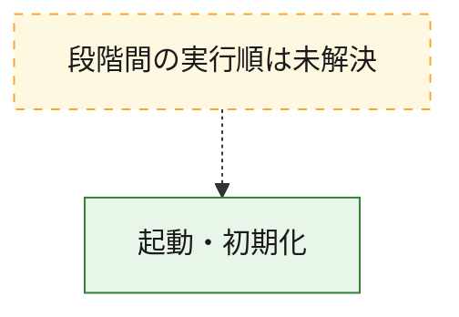
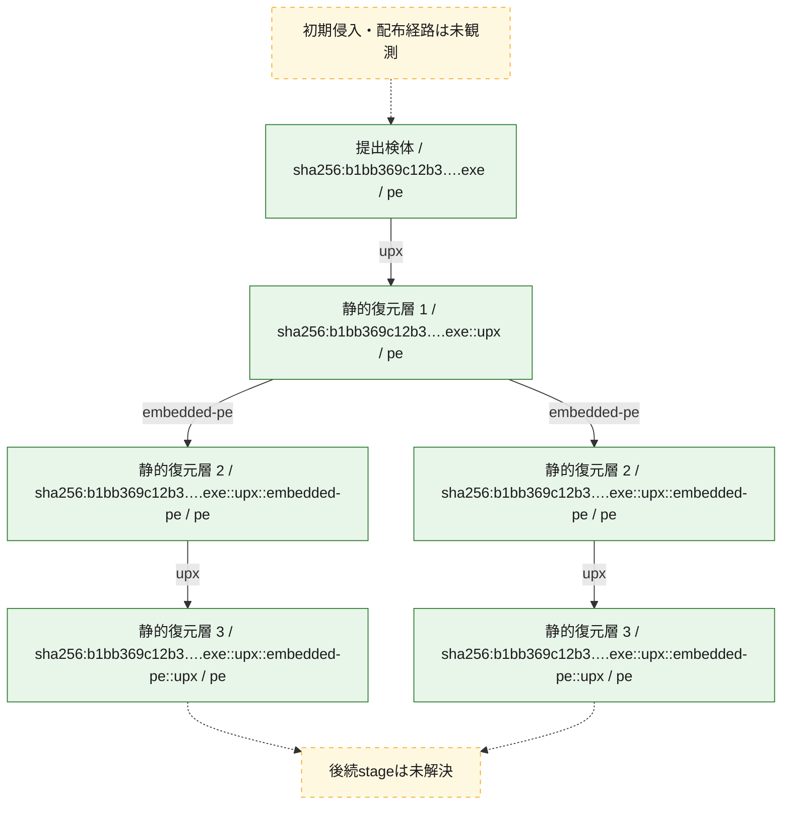
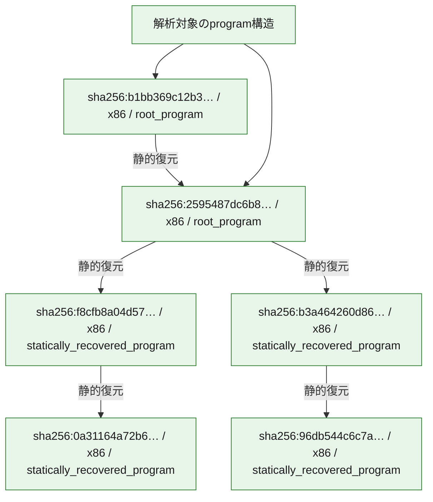

# 全体ロジック：b1bb369c12b3c9576d2178f448cfc174387aad27a90b34f678574b6b6c41471e

代表関数の静的証跡から、起動・初期化の処理群を確認しました。

## 読み方

- phaseの掲載順は解析上の整理順です。observed_call_edgesがない段階間の実行順を断定しません。
- 図の実線は静的に観測した関係、点線と黄色のノードは未観測・未解決の関係を示します。
- 図は静的な要約であり、動的実行を再現するものではありません。
- 詳細な関数解説とfingerprintは[STATIC-LOGIC.md](STATIC-LOGIC.md)を参照してください。

## 静的可視化

### 実行フロー

### 感染チェーン

### モジュール関係

## 処理段階

### 1. 起動・初期化

entry pointから初期化と後続処理への移行を確認します。
確度: `confirmed_static_function_evidence_with_limits`

- `b3a464260d865336c3a6c166be1dd5e04a9687f9b1267ee39cd5c21bc3edb5af:ghidra:102b8610` — 初期化と主要処理への分岐を行う入口関数です。 状態: `limited_bad_instruction_or_flow`、選定理由: `entry_point`, `large_function:instructions=890`, `meaningful_symbol_name`, `reviewed_call_centrality:6`, `role:entrypoint`, `small_program_complete_context`
- `0a31164a72b6a72b2dc1374f4ee18c07228aae58a3dcc73f0d65cd168761f0d3:ghidra:00493c3b` — 初期化と主要処理への分岐を行う入口関数です。 状態: `succeeded`、選定理由: `entry_point`, `large_function:instructions=81`, `meaningful_symbol_name`, `reviewed_call_centrality:20`, `role:entrypoint`, `small_program_complete_context`
- `b1bb369c12b3c9576d2178f448cfc174387aad27a90b34f678574b6b6c41471e:ghidra:0059ff90` — 初期化と主要処理への分岐を行う入口関数です。 状態: `limited_bad_instruction_or_flow`、選定理由: `entry_point`, `large_function:instructions=867`, `meaningful_symbol_name`, `reviewed_call_centrality:4`, `role:entrypoint`, `small_program_complete_context`
- `2595487dc6b82f6a9a7ef88dcb826fefcdca5a32323b840f7248796dd2461220:ghidra:00424c39` — 初期化と主要処理への分岐を行う入口関数です。 状態: `succeeded`、選定理由: `entry_point`, `large_function:instructions=81`, `meaningful_symbol_name`, `reviewed_call_centrality:20`, `role:entrypoint`, `small_program_complete_context`
- `96db544c6c7aa1dd31f3574e027f5768ea4b1efb7ae1c8b77db439791fc43e75:ghidra:101e5995` — 初期化と主要処理への分岐を行う入口関数です。 状態: `succeeded`、選定理由: `call_graph_centrality:in=0,out=2`, `entry_point`, `large_function:instructions=73`, `meaningful_symbol_name`, `reviewed_call_centrality:2`, `reviewed_call_centrality:4`, `role:entrypoint`, `small_program_complete_context`

## 観測したcall関係

- `ghidra-function:0118baf9ffb2c54cabc0e87b` → `ghidra-external:05063e29b4a086519bf83bd1` （`unclassified` → `unclassified`）
- `ghidra-function:0118baf9ffb2c54cabc0e87b` → `ghidra-external:31c91e0cfefba05a36b2e499` （`unclassified` → `unclassified`）
- `ghidra-function:0118baf9ffb2c54cabc0e87b` → `ghidra-external:9eb3d6703016e727a34badf8` （`unclassified` → `unclassified`）
- `ghidra-function:0118baf9ffb2c54cabc0e87b` → `ghidra-external:cedb122942beaa655396f753` （`unclassified` → `unclassified`）
- `ghidra-function:04c133e10c785167191a4d64` → `ghidra-function:688e4eb1e37fbed9e57bccf9` （`unclassified` → `unclassified`）
- `ghidra-function:04c133e10c785167191a4d64` → `ghidra-function:70b1c1dd4d8045381fca7d5f` （`unclassified` → `unclassified`）
- `ghidra-function:1a57030d28ffbd2906f600cb` → `ghidra-external:13dca23f9eebeabe9cefafbb` （`unclassified` → `unclassified`）
- `ghidra-function:1a57030d28ffbd2906f600cb` → `ghidra-external:22dbcf98323a1bc90d258936` （`unclassified` → `unclassified`）
- `ghidra-function:1a57030d28ffbd2906f600cb` → `ghidra-external:2eb7af89c85a69a6ef9b4d0a` （`unclassified` → `unclassified`）
- `ghidra-function:1a57030d28ffbd2906f600cb` → `ghidra-external:42efaa5ac88118b53972ce52` （`unclassified` → `unclassified`）
- `ghidra-function:1a57030d28ffbd2906f600cb` → `ghidra-external:5948b4e8ead268d160f22da2` （`unclassified` → `unclassified`）
- `ghidra-function:1a57030d28ffbd2906f600cb` → `ghidra-external:b34a82cc00bcf214fa82b956` （`unclassified` → `unclassified`）
- `ghidra-function:1a57030d28ffbd2906f600cb` → `ghidra-external:bec83a86c79acb712c56c387` （`unclassified` → `unclassified`）
- `ghidra-function:1a57030d28ffbd2906f600cb` → `ghidra-external:c4adbfe32b2e2c71230e8081` （`unclassified` → `unclassified`）
- `ghidra-function:1a57030d28ffbd2906f600cb` → `ghidra-external:c5c116ddbf471e5d7f80fef4` （`unclassified` → `unclassified`）
- `ghidra-function:1a57030d28ffbd2906f600cb` → `ghidra-external:cfc5bb742b3ee04769a47075` （`unclassified` → `unclassified`）
- `ghidra-function:1a57030d28ffbd2906f600cb` → `ghidra-external:e90f15bd4e07f39a6d87db51` （`unclassified` → `unclassified`）
- `ghidra-function:1a57030d28ffbd2906f600cb` → `ghidra-external:fdb01486f03707ae93299cc3` （`unclassified` → `unclassified`）
- `ghidra-function:1a57030d28ffbd2906f600cb` → `ghidra-function:0ac38427a85cd1517e0b0a9a` （`unclassified` → `unclassified`）
- `ghidra-function:1a57030d28ffbd2906f600cb` → `ghidra-function:49e4a390d5a5166b1d000c48` （`unclassified` → `unclassified`）
- `ghidra-function:1a57030d28ffbd2906f600cb` → `ghidra-function:bf0ebef787e8d5ea0d65a1ca` （`unclassified` → `unclassified`）
- `ghidra-function:1a57030d28ffbd2906f600cb` → `ghidra-function:bf952355cc5c9956047aba2d` （`unclassified` → `unclassified`）
- `ghidra-function:20c56c842cd96d00652d1664` → `ghidra-function:eb4b2ab24416ed695c547e08` （`unclassified` → `unclassified`）
- `ghidra-function:51ba5a5df7f21ba585cce529` → `ghidra-external:1c26a99f8fc89d724ddea56c` （`unclassified` → `unclassified`）
- `ghidra-function:51ba5a5df7f21ba585cce529` → `ghidra-external:66ae99eacbccc78dc0c312df` （`unclassified` → `unclassified`）
- `ghidra-function:51ba5a5df7f21ba585cce529` → `ghidra-external:a42c0f5bac2c6b2ccd8cde20` （`unclassified` → `unclassified`）
- `ghidra-function:51ba5a5df7f21ba585cce529` → `ghidra-external:b038484ce913a86b792059ca` （`unclassified` → `unclassified`）
- `ghidra-function:51ba5a5df7f21ba585cce529` → `ghidra-external:bd6a5e0c186482a295f7460b` （`unclassified` → `unclassified`）
- `ghidra-function:51ba5a5df7f21ba585cce529` → `ghidra-external:eff094cd6a9190de66497c2d` （`unclassified` → `unclassified`）
- `ghidra-function:5334cce8816514980919b87c` → `ghidra-external:365d8e2886e5871afc313e9a` （`unclassified` → `unclassified`）
- `ghidra-function:5334cce8816514980919b87c` → `ghidra-external:3760a3ca59d5e416f7fe5e9b` （`unclassified` → `unclassified`）
- `ghidra-function:5334cce8816514980919b87c` → `ghidra-function:8ba961a2eeb671dd19eacfed` （`unclassified` → `unclassified`）
- `ghidra-function:5334cce8816514980919b87c` → `ghidra-function:fd21dc52721f2e6b7e8e9706` （`unclassified` → `unclassified`）
- `ghidra-function:dbe2a29113fd94e12fb3cbc1` → `ghidra-external:015bdfa9f2ca88f3e7f4749f` （`unclassified` → `unclassified`）
- `ghidra-function:dbe2a29113fd94e12fb3cbc1` → `ghidra-external:0f61b32427c7be9e14c4a2bb` （`unclassified` → `unclassified`）
- `ghidra-function:dbe2a29113fd94e12fb3cbc1` → `ghidra-external:398cbaa7370450de1e4eb5a9` （`unclassified` → `unclassified`）
- `ghidra-function:dbe2a29113fd94e12fb3cbc1` → `ghidra-external:4b3b7536f6ca49ee3da8c7bb` （`unclassified` → `unclassified`）
- `ghidra-function:dbe2a29113fd94e12fb3cbc1` → `ghidra-external:6d8fc657f7f42b809f5a243f` （`unclassified` → `unclassified`）
- `ghidra-function:dbe2a29113fd94e12fb3cbc1` → `ghidra-external:6e87d82123622aa37767a329` （`unclassified` → `unclassified`）
- `ghidra-function:dbe2a29113fd94e12fb3cbc1` → `ghidra-external:7013b884a967796eed80ae08` （`unclassified` → `unclassified`）
- `ghidra-function:dbe2a29113fd94e12fb3cbc1` → `ghidra-external:76f22156d2504671ecaeb276` （`unclassified` → `unclassified`）
- `ghidra-function:dbe2a29113fd94e12fb3cbc1` → `ghidra-external:aa67809300546335553282fe` （`unclassified` → `unclassified`）
- `ghidra-function:dbe2a29113fd94e12fb3cbc1` → `ghidra-external:cbd5c134d8dd4cc2bc7d1be6` （`unclassified` → `unclassified`）
- `ghidra-function:dbe2a29113fd94e12fb3cbc1` → `ghidra-external:d6083c6b1f3c63b478a9f7da` （`unclassified` → `unclassified`）
- `ghidra-function:dbe2a29113fd94e12fb3cbc1` → `ghidra-external:dd292e029a87b98b586c315f` （`unclassified` → `unclassified`）
- `ghidra-function:dbe2a29113fd94e12fb3cbc1` → `ghidra-function:86f58cd534d2fd877e0802b7` （`unclassified` → `unclassified`）
- `ghidra-function:dbe2a29113fd94e12fb3cbc1` → `ghidra-function:a36d9f32bec0789128cf8054` （`unclassified` → `unclassified`）
- `ghidra-function:dbe2a29113fd94e12fb3cbc1` → `ghidra-function:c5c97f48b497adfb9ce6f952` （`unclassified` → `unclassified`）
- `ghidra-function:dbe2a29113fd94e12fb3cbc1` → `ghidra-function:cb72c1c24579a00f325c81d3` （`unclassified` → `unclassified`）
- `ghidra-function:eb4b2ab24416ed695c547e08` → `ghidra-function:04c133e10c785167191a4d64` （`unclassified` → `unclassified`）
- `ghidra-function:f256f95875f45ebfde326c4a` → `ghidra-function:4706c6f976ee2827f2224308` （`unclassified` → `unclassified`）
- `ghidra-function:f256f95875f45ebfde326c4a` → `ghidra-function:f3e0ec5d5a0c221388ef45eb` （`unclassified` → `unclassified`）

## 解析範囲と制約

- 選定外関数は全体inventoryへ残しますが、関数本体の個別解説対象にはしていません。
- indirect call、難読化、packer、VM、壊れたcontrol flowによりcall関係が欠落する場合があります。
- 文書は静的解析に基づき、検体実行や外部通信による動的確認は行っていません。
