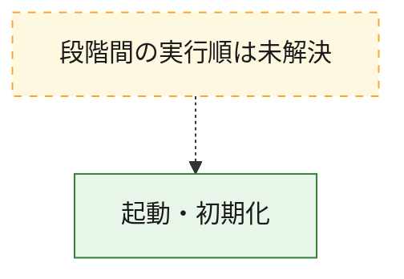
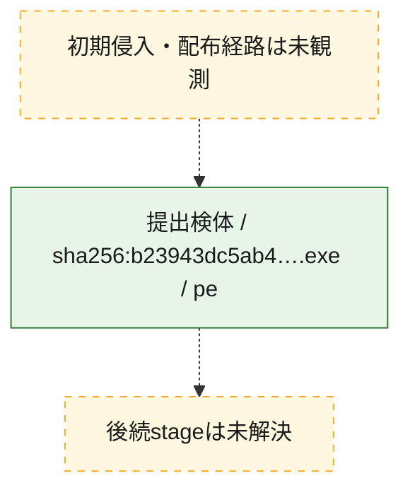
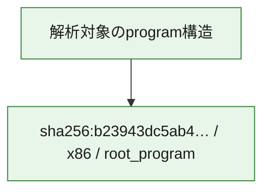

# 全体ロジック：b23943dc5ab42e339bbc5a83bb1fa95b2bae70e7b00a8070d0de489ba9731b7b

代表関数の静的証跡から、起動・初期化の処理群を確認しました。

## 読み方

- phaseの掲載順は解析上の整理順です。observed_call_edgesがない段階間の実行順を断定しません。
- 図の実線は静的に観測した関係、点線と黄色のノードは未観測・未解決の関係を示します。
- 図は静的な要約であり、動的実行を再現するものではありません。
- 詳細な関数解説とfingerprintは[STATIC-LOGIC.md](STATIC-LOGIC.md)を参照してください。

## 静的可視化

### 実行フロー

### 感染チェーン

### モジュール関係

## 処理段階

### 1. 起動・初期化

entry pointから初期化と後続処理への移行を確認します。
確度: `confirmed_static_function_evidence`

- `b23943dc5ab42e339bbc5a83bb1fa95b2bae70e7b00a8070d0de489ba9731b7b:ghidra:00402b07` — 初期化と主要処理への分岐を行う入口関数です。 状態: `succeeded`、選定理由: `call_graph_centrality:in=0,out=3`, `entry_point`, `meaningful_symbol_name`, `reviewed_call_centrality:3`, `reviewed_call_centrality:5`, `role:entrypoint`, `small_program_complete_context`

## 観測したcall関係

- `ghidra-function:2072d9380ba957bf3dc300ad` → `ghidra-external:eb5966b4e39492c94c705468` （`unclassified` → `unclassified`）
- `ghidra-function:2072d9380ba957bf3dc300ad` → `ghidra-external:f9dec0ef63ad4db87771c575` （`unclassified` → `unclassified`）
- `ghidra-function:2072d9380ba957bf3dc300ad` → `ghidra-function:103c6449da6a29315a35e0c7` （`unclassified` → `unclassified`）
- `ghidra-function:2072d9380ba957bf3dc300ad` → `ghidra-function:1361e1559091cf7cc48f20b0` （`unclassified` → `unclassified`）
- `ghidra-function:2072d9380ba957bf3dc300ad` → `ghidra-function:223a7efb2d002be5d612288c` （`unclassified` → `unclassified`）

## 解析範囲と制約

- 選定外関数は全体inventoryへ残しますが、関数本体の個別解説対象にはしていません。
- indirect call、難読化、packer、VM、壊れたcontrol flowによりcall関係が欠落する場合があります。
- 文書は静的解析に基づき、検体実行や外部通信による動的確認は行っていません。
