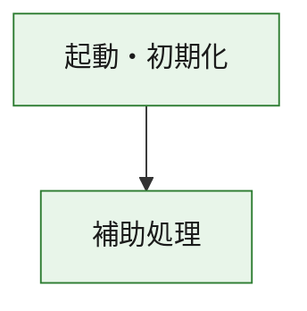
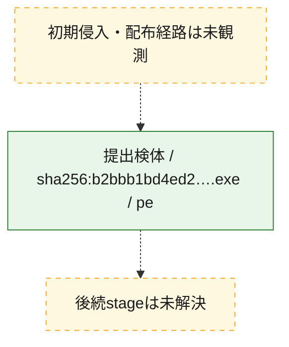
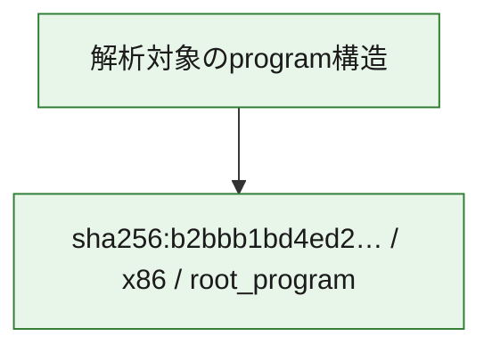

# 全体ロジック：b2bbb1bd4ed2f57c525c1cf0ec88ab4e2bed3dc5f3288e77379ddcdfd4a23a1b

代表関数の静的証跡から、起動・初期化の処理群を確認しました。

## 読み方

- phaseの掲載順は解析上の整理順です。observed_call_edgesがない段階間の実行順を断定しません。
- 図の実線は静的に観測した関係、点線と黄色のノードは未観測・未解決の関係を示します。
- 図は静的な要約であり、動的実行を再現するものではありません。
- 詳細な関数解説とfingerprintは[STATIC-LOGIC.md](STATIC-LOGIC.md)を参照してください。

## 静的可視化

### 実行フロー

### 感染チェーン

### モジュール関係

## 処理段階

### 1. 起動・初期化

entry pointから初期化と後続処理への移行を確認します。
確度: `confirmed_static_function_evidence`

- `b2bbb1bd4ed2f57c525c1cf0ec88ab4e2bed3dc5f3288e77379ddcdfd4a23a1b:ghidra:1400013e0` — 初期化と主要処理への分岐を行う入口関数です。 状態: `succeeded`、選定理由: `entry_point`, `meaningful_symbol_name`, `reviewed_call_centrality:1`, `role:entrypoint`

### 2. 補助処理

主要処理を支える一般内部関数またはlibrary処理を確認します。
確度: `confirmed_static_function_evidence`

- `b2bbb1bd4ed2f57c525c1cf0ec88ab4e2bed3dc5f3288e77379ddcdfd4a23a1b:ghidra:140001000` — 検体内部の一般処理を実装する関数です。 状態: `succeeded`、選定理由: `context_representative`
- `b2bbb1bd4ed2f57c525c1cf0ec88ab4e2bed3dc5f3288e77379ddcdfd4a23a1b:ghidra:140001010` — 検体内部の一般処理を実装する関数です。 状態: `succeeded`、選定理由: `context_representative`, `reviewed_call_centrality:6`
- `b2bbb1bd4ed2f57c525c1cf0ec88ab4e2bed3dc5f3288e77379ddcdfd4a23a1b:ghidra:140001140` — 検体内部の一般処理を実装する関数です。 状態: `succeeded`、選定理由: `context_representative`, `reviewed_call_centrality:1`
- `b2bbb1bd4ed2f57c525c1cf0ec88ab4e2bed3dc5f3288e77379ddcdfd4a23a1b:ghidra:140001190` — 検体内部の一般処理を実装する関数です。 状態: `succeeded`、選定理由: `context_representative`, `reviewed_call_centrality:21`
- `b2bbb1bd4ed2f57c525c1cf0ec88ab4e2bed3dc5f3288e77379ddcdfd4a23a1b:ghidra:140001410` — 検体内部の一般処理を実装する関数です。 状態: `succeeded`、選定理由: `context_representative`, `reviewed_call_centrality:1`
- `b2bbb1bd4ed2f57c525c1cf0ec88ab4e2bed3dc5f3288e77379ddcdfd4a23a1b:ghidra:140001440` — 検体内部の一般処理を実装する関数です。 状態: `succeeded`、選定理由: `context_representative`, `reviewed_call_centrality:1`
- `b2bbb1bd4ed2f57c525c1cf0ec88ab4e2bed3dc5f3288e77379ddcdfd4a23a1b:ghidra:140001460` — 検体内部の一般処理を実装する関数です。 状態: `succeeded`、選定理由: `context_representative`, `reviewed_call_centrality:1`
- `b2bbb1bd4ed2f57c525c1cf0ec88ab4e2bed3dc5f3288e77379ddcdfd4a23a1b:ghidra:140001470` — 検体内部の一般処理を実装する関数です。 状態: `succeeded`、選定理由: `context_representative`
- `b2bbb1bd4ed2f57c525c1cf0ec88ab4e2bed3dc5f3288e77379ddcdfd4a23a1b:ghidra:140001480` — 検体内部の一般処理を実装する関数です。 状態: `succeeded`、選定理由: `context_representative`, `reviewed_call_centrality:3`
- `b2bbb1bd4ed2f57c525c1cf0ec88ab4e2bed3dc5f3288e77379ddcdfd4a23a1b:ghidra:1400014a2` — 検体内部の一般処理を実装する関数です。 状態: `succeeded`、選定理由: `context_representative`, `reviewed_call_centrality:2`
- `b2bbb1bd4ed2f57c525c1cf0ec88ab4e2bed3dc5f3288e77379ddcdfd4a23a1b:ghidra:1400014c8` — 検体内部の一般処理を実装する関数です。 状態: `succeeded`、選定理由: `context_representative`, `reviewed_call_centrality:2`
- `b2bbb1bd4ed2f57c525c1cf0ec88ab4e2bed3dc5f3288e77379ddcdfd4a23a1b:ghidra:1400014fa` — 検体内部の一般処理を実装する関数です。 状態: `succeeded`、選定理由: `context_representative`
- `b2bbb1bd4ed2f57c525c1cf0ec88ab4e2bed3dc5f3288e77379ddcdfd4a23a1b:ghidra:140001528` — 検体内部の一般処理を実装する関数です。 状態: `succeeded`、選定理由: `context_representative`, `reviewed_call_centrality:1`
- `b2bbb1bd4ed2f57c525c1cf0ec88ab4e2bed3dc5f3288e77379ddcdfd4a23a1b:ghidra:140001571` — 検体内部の一般処理を実装する関数です。 状態: `succeeded`、選定理由: `context_representative`, `reviewed_call_centrality:2`
- `b2bbb1bd4ed2f57c525c1cf0ec88ab4e2bed3dc5f3288e77379ddcdfd4a23a1b:ghidra:140001626` — 検体内部の一般処理を実装する関数です。 状態: `succeeded`、選定理由: `context_representative`, `reviewed_call_centrality:3`
- `b2bbb1bd4ed2f57c525c1cf0ec88ab4e2bed3dc5f3288e77379ddcdfd4a23a1b:ghidra:14000169d` — 検体内部の一般処理を実装する関数です。 状態: `succeeded`、選定理由: `context_representative`, `reviewed_call_centrality:1`
- `b2bbb1bd4ed2f57c525c1cf0ec88ab4e2bed3dc5f3288e77379ddcdfd4a23a1b:ghidra:1400016ca` — 検体内部の一般処理を実装する関数です。 状態: `succeeded`、選定理由: `context_representative`
- `b2bbb1bd4ed2f57c525c1cf0ec88ab4e2bed3dc5f3288e77379ddcdfd4a23a1b:ghidra:1400016e1` — 検体内部の一般処理を実装する関数です。 状態: `succeeded`、選定理由: `context_representative`, `reviewed_call_centrality:1`
- `b2bbb1bd4ed2f57c525c1cf0ec88ab4e2bed3dc5f3288e77379ddcdfd4a23a1b:ghidra:14000184e` — 検体内部の一般処理を実装する関数です。 状態: `succeeded`、選定理由: `context_representative`
- `b2bbb1bd4ed2f57c525c1cf0ec88ab4e2bed3dc5f3288e77379ddcdfd4a23a1b:ghidra:1400018fe` — 検体内部の一般処理を実装する関数です。 状態: `succeeded`、選定理由: `context_representative`
- `b2bbb1bd4ed2f57c525c1cf0ec88ab4e2bed3dc5f3288e77379ddcdfd4a23a1b:ghidra:140001c2b` — 検体内部の一般処理を実装する関数です。 状態: `succeeded`、選定理由: `context_representative`, `reviewed_call_centrality:1`
- `b2bbb1bd4ed2f57c525c1cf0ec88ab4e2bed3dc5f3288e77379ddcdfd4a23a1b:ghidra:140001c94` — 検体内部の一般処理を実装する関数です。 状態: `succeeded`、選定理由: `context_representative`, `reviewed_call_centrality:1`
- `b2bbb1bd4ed2f57c525c1cf0ec88ab4e2bed3dc5f3288e77379ddcdfd4a23a1b:ghidra:140001da0` — 検体内部の一般処理を実装する関数です。 状態: `succeeded`、選定理由: `context_representative`, `reviewed_call_centrality:1`
- `b2bbb1bd4ed2f57c525c1cf0ec88ab4e2bed3dc5f3288e77379ddcdfd4a23a1b:ghidra:140001ded` — 検体内部の一般処理を実装する関数です。 状態: `succeeded`、選定理由: `context_representative`, `reviewed_call_centrality:1`
- `b2bbb1bd4ed2f57c525c1cf0ec88ab4e2bed3dc5f3288e77379ddcdfd4a23a1b:ghidra:140001e3c` — 検体内部の一般処理を実装する関数です。 状態: `succeeded`、選定理由: `context_representative`, `reviewed_call_centrality:2`
- `b2bbb1bd4ed2f57c525c1cf0ec88ab4e2bed3dc5f3288e77379ddcdfd4a23a1b:ghidra:1400022ae` — 検体内部の一般処理を実装する関数です。 状態: `succeeded`、選定理由: `context_representative`, `reviewed_call_centrality:3`
- `b2bbb1bd4ed2f57c525c1cf0ec88ab4e2bed3dc5f3288e77379ddcdfd4a23a1b:ghidra:140002498` — 検体内部の一般処理を実装する関数です。 状態: `succeeded`、選定理由: `context_representative`, `reviewed_call_centrality:1`
- `b2bbb1bd4ed2f57c525c1cf0ec88ab4e2bed3dc5f3288e77379ddcdfd4a23a1b:ghidra:1400024c0` — 検体内部の一般処理を実装する関数です。 状態: `succeeded`、選定理由: `context_representative`
- `b2bbb1bd4ed2f57c525c1cf0ec88ab4e2bed3dc5f3288e77379ddcdfd4a23a1b:ghidra:1400026fa` — 検体内部の一般処理を実装する関数です。 状態: `succeeded`、選定理由: `context_representative`, `reviewed_call_centrality:1`
- `b2bbb1bd4ed2f57c525c1cf0ec88ab4e2bed3dc5f3288e77379ddcdfd4a23a1b:ghidra:14000f970` — compiler生成処理または汎用library処理とみられる関数です。 状態: `succeeded`、選定理由: `entry_point`, `meaningful_symbol_name`, `reviewed_call_centrality:1`
- `b2bbb1bd4ed2f57c525c1cf0ec88ab4e2bed3dc5f3288e77379ddcdfd4a23a1b:ghidra:14000f9a0` — compiler生成処理または汎用library処理とみられる関数です。 状態: `succeeded`、選定理由: `entry_point`, `meaningful_symbol_name`, `reviewed_call_centrality:3`

## 観測したcall関係

- `b2bbb1bd4ed2f57c525c1cf0ec88ab4e2bed3dc5f3288e77379ddcdfd4a23a1b:ghidra:140001190` → `b2bbb1bd4ed2f57c525c1cf0ec88ab4e2bed3dc5f3288e77379ddcdfd4a23a1b:ghidra:14000f9a0` （`support` → `support`）
- `b2bbb1bd4ed2f57c525c1cf0ec88ab4e2bed3dc5f3288e77379ddcdfd4a23a1b:ghidra:1400013e0` → `b2bbb1bd4ed2f57c525c1cf0ec88ab4e2bed3dc5f3288e77379ddcdfd4a23a1b:ghidra:140001190` （`startup` → `support`）
- `b2bbb1bd4ed2f57c525c1cf0ec88ab4e2bed3dc5f3288e77379ddcdfd4a23a1b:ghidra:140001410` → `b2bbb1bd4ed2f57c525c1cf0ec88ab4e2bed3dc5f3288e77379ddcdfd4a23a1b:ghidra:140001190` （`support` → `support`）
- `b2bbb1bd4ed2f57c525c1cf0ec88ab4e2bed3dc5f3288e77379ddcdfd4a23a1b:ghidra:1400014c8` → `b2bbb1bd4ed2f57c525c1cf0ec88ab4e2bed3dc5f3288e77379ddcdfd4a23a1b:ghidra:140001480` （`support` → `support`）
- `b2bbb1bd4ed2f57c525c1cf0ec88ab4e2bed3dc5f3288e77379ddcdfd4a23a1b:ghidra:1400014c8` → `b2bbb1bd4ed2f57c525c1cf0ec88ab4e2bed3dc5f3288e77379ddcdfd4a23a1b:ghidra:1400014a2` （`support` → `support`）
- `b2bbb1bd4ed2f57c525c1cf0ec88ab4e2bed3dc5f3288e77379ddcdfd4a23a1b:ghidra:140001626` → `b2bbb1bd4ed2f57c525c1cf0ec88ab4e2bed3dc5f3288e77379ddcdfd4a23a1b:ghidra:140001571` （`support` → `support`）
- `b2bbb1bd4ed2f57c525c1cf0ec88ab4e2bed3dc5f3288e77379ddcdfd4a23a1b:ghidra:14000169d` → `b2bbb1bd4ed2f57c525c1cf0ec88ab4e2bed3dc5f3288e77379ddcdfd4a23a1b:ghidra:140001626` （`support` → `support`）
- `b2bbb1bd4ed2f57c525c1cf0ec88ab4e2bed3dc5f3288e77379ddcdfd4a23a1b:ghidra:140001c94` → `b2bbb1bd4ed2f57c525c1cf0ec88ab4e2bed3dc5f3288e77379ddcdfd4a23a1b:ghidra:140001c2b` （`support` → `support`）
- `b2bbb1bd4ed2f57c525c1cf0ec88ab4e2bed3dc5f3288e77379ddcdfd4a23a1b:ghidra:1400022ae` → `b2bbb1bd4ed2f57c525c1cf0ec88ab4e2bed3dc5f3288e77379ddcdfd4a23a1b:ghidra:140001da0` （`support` → `support`）
- `b2bbb1bd4ed2f57c525c1cf0ec88ab4e2bed3dc5f3288e77379ddcdfd4a23a1b:ghidra:1400022ae` → `b2bbb1bd4ed2f57c525c1cf0ec88ab4e2bed3dc5f3288e77379ddcdfd4a23a1b:ghidra:140001ded` （`support` → `support`）
- `b2bbb1bd4ed2f57c525c1cf0ec88ab4e2bed3dc5f3288e77379ddcdfd4a23a1b:ghidra:1400022ae` → `b2bbb1bd4ed2f57c525c1cf0ec88ab4e2bed3dc5f3288e77379ddcdfd4a23a1b:ghidra:140001e3c` （`support` → `support`）
- `b2bbb1bd4ed2f57c525c1cf0ec88ab4e2bed3dc5f3288e77379ddcdfd4a23a1b:ghidra:1400026fa` → `b2bbb1bd4ed2f57c525c1cf0ec88ab4e2bed3dc5f3288e77379ddcdfd4a23a1b:ghidra:140002498` （`support` → `support`）
- `ghidra-function:0fd800bd3e41d92b9629d84d` → `ghidra-external:7f35a21ca808c8def7bb746e` （`unclassified` → `unclassified`）
- `ghidra-function:138a27991a9f20909c454334` → `ghidra-external:fe18ef1998a7d884c1647d47` （`unclassified` → `unclassified`）
- `ghidra-function:1a3e2cbf1e8f3ac8750f30c3` → `ghidra-external:860bd78edec329d910ca34ac` （`unclassified` → `unclassified`）
- `ghidra-function:1a3e2cbf1e8f3ac8750f30c3` → `ghidra-external:cf74c835f35c264f1de6203a` （`unclassified` → `unclassified`）
- `ghidra-function:1a3e2cbf1e8f3ac8750f30c3` → `ghidra-function:060114adfdfb6a05dfce6649` （`unclassified` → `unclassified`）
- `ghidra-function:1a3e2cbf1e8f3ac8750f30c3` → `ghidra-function:65dfac534c18ebaf3b338c23` （`unclassified` → `unclassified`）
- `ghidra-function:1a3e2cbf1e8f3ac8750f30c3` → `ghidra-function:680ca86241eaec6a605f76c1` （`unclassified` → `unclassified`）
- `ghidra-function:1a3e2cbf1e8f3ac8750f30c3` → `ghidra-function:84422dcf52d5e17eacc7fa6a` （`unclassified` → `unclassified`）
- `ghidra-function:341add1140f7d27cef8e03a1` → `ghidra-function:9e7abf976595384e55890b82` （`unclassified` → `unclassified`）
- `ghidra-function:42e7b809e3f028aa95295cf9` → `ghidra-function:50cc4cea8dcd8f9434c2f9e8` （`unclassified` → `unclassified`）
- `ghidra-function:50cc4cea8dcd8f9434c2f9e8` → `ghidra-external:dc84e0595bfd38e865c931f9` （`unclassified` → `unclassified`）
- `ghidra-function:50cc4cea8dcd8f9434c2f9e8` → `ghidra-function:76396b2029919c2ba6a8bcb1` （`unclassified` → `unclassified`）
- `ghidra-function:5b9aef87d2a424b90af156a2` → `ghidra-function:2f82bcda2f15ecd1b0785f9a` （`unclassified` → `unclassified`）
- `ghidra-function:61529ca95b7dc34c23a919c1` → `ghidra-function:5b9aef87d2a424b90af156a2` （`unclassified` → `unclassified`）
- `ghidra-function:61529ca95b7dc34c23a919c1` → `ghidra-function:efd95889279de20d232895da` （`unclassified` → `unclassified`）
- `ghidra-function:6439b6b4473a9ed3faa836d1` → `ghidra-external:dc84e0595bfd38e865c931f9` （`unclassified` → `unclassified`）
- `ghidra-function:69105b5bd108c1e1e2b79ff2` → `ghidra-external:3c379f536b1048d2f3ed6c7c` （`unclassified` → `unclassified`）
- `ghidra-function:76396b2029919c2ba6a8bcb1` → `ghidra-external:2db79dd2e1332e8e70d2f1f4` （`unclassified` → `unclassified`）
- `ghidra-function:7d2ab5aace1af9e476376ec5` → `ghidra-function:f38889656356b9865d8a8ab3` （`unclassified` → `unclassified`）
- `ghidra-function:847d04c45f235d71f2314ced` → `ghidra-function:9e7abf976595384e55890b82` （`unclassified` → `unclassified`）
- `ghidra-function:9025bf17aa971af0e39f4ae1` → `ghidra-function:be293f1e2e8f11450255f63b` （`unclassified` → `unclassified`）
- `ghidra-function:92c8ecc96263ef0fd9d6c80a` → `ghidra-external:32e14f01a4394cb0b57497f8` （`unclassified` → `unclassified`）
- `ghidra-function:9e7abf976595384e55890b82` → `ghidra-external:32e14f01a4394cb0b57497f8` （`unclassified` → `unclassified`）
- `ghidra-function:9e7abf976595384e55890b82` → `ghidra-external:7781760c91dbde974a2017d6` （`unclassified` → `unclassified`）
- `ghidra-function:9e7abf976595384e55890b82` → `ghidra-external:8713996d0d0e76a9645187fd` （`unclassified` → `unclassified`）
- `ghidra-function:9e7abf976595384e55890b82` → `ghidra-external:94903112a1c9e7287105b0f7` （`unclassified` → `unclassified`）
- `ghidra-function:9e7abf976595384e55890b82` → `ghidra-external:ae8a4e15ce5f86e840f524bb` （`unclassified` → `unclassified`）
- `ghidra-function:9e7abf976595384e55890b82` → `ghidra-external:b4bd7678a312265f546f2c29` （`unclassified` → `unclassified`）
- `ghidra-function:9e7abf976595384e55890b82` → `ghidra-external:d4b50ff3182d006e75d6e687` （`unclassified` → `unclassified`）
- `ghidra-function:9e7abf976595384e55890b82` → `ghidra-external:dc84e0595bfd38e865c931f9` （`unclassified` → `unclassified`）
- `ghidra-function:9e7abf976595384e55890b82` → `ghidra-external:f8ab63f1d88fe2960cbde7b4` （`unclassified` → `unclassified`）
- `ghidra-function:9e7abf976595384e55890b82` → `ghidra-function:257813d55b0cf89b12110867` （`unclassified` → `unclassified`）
- `ghidra-function:9e7abf976595384e55890b82` → `ghidra-function:60efbd0b84e1cde3407817b9` （`unclassified` → `unclassified`）
- `ghidra-function:9e7abf976595384e55890b82` → `ghidra-function:8d115090e76e56393c01a648` （`unclassified` → `unclassified`）
- `ghidra-function:9e7abf976595384e55890b82` → `ghidra-function:95220db215d1b19dec83ba6d` （`unclassified` → `unclassified`）
- `ghidra-function:9e7abf976595384e55890b82` → `ghidra-function:bfa8fca5af24d4de7e09e804` （`unclassified` → `unclassified`）
- `ghidra-function:9e7abf976595384e55890b82` → `ghidra-function:e89817410b7157a751219286` （`unclassified` → `unclassified`）
- `ghidra-function:9e7abf976595384e55890b82` → `ghidra-function:f1c99601a7dea66046009703` （`unclassified` → `unclassified`）
- `ghidra-function:9e7abf976595384e55890b82` → `ghidra-function:f41e2185ed350b0b7ff43c09` （`unclassified` → `unclassified`）
- `ghidra-function:bdbef8759d4165f217f8263c` → `ghidra-function:5cdbb89a0eaa6a157feadf48` （`unclassified` → `unclassified`）
- `ghidra-function:bfa8fca5af24d4de7e09e804` → `ghidra-external:860bd78edec329d910ca34ac` （`unclassified` → `unclassified`）
- `ghidra-function:bfa8fca5af24d4de7e09e804` → `ghidra-function:f38889656356b9865d8a8ab3` （`unclassified` → `unclassified`）
- `ghidra-function:c3b1c5c36414a909a09b136a` → `ghidra-external:7f35a21ca808c8def7bb746e` （`unclassified` → `unclassified`）
- `ghidra-function:cf195f7ea6473e02d92ed9bb` → `ghidra-function:01828501ba7a8204b4b2bedc` （`unclassified` → `unclassified`）
- `ghidra-function:cf195f7ea6473e02d92ed9bb` → `ghidra-function:3215d545024530324b5263ad` （`unclassified` → `unclassified`）
- `ghidra-function:cf195f7ea6473e02d92ed9bb` → `ghidra-function:6439b6b4473a9ed3faa836d1` （`unclassified` → `unclassified`）
- `ghidra-function:efd95889279de20d232895da` → `ghidra-function:301e5d26a5a54f57a90ffc29` （`unclassified` → `unclassified`）

## 解析範囲と制約

- 選定外関数は全体inventoryへ残しますが、関数本体の個別解説対象にはしていません。
- indirect call、難読化、packer、VM、壊れたcontrol flowによりcall関係が欠落する場合があります。
- 文書は静的解析に基づき、検体実行や外部通信による動的確認は行っていません。
