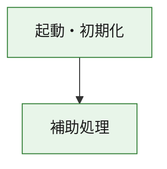
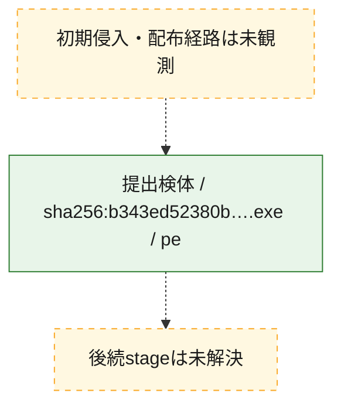
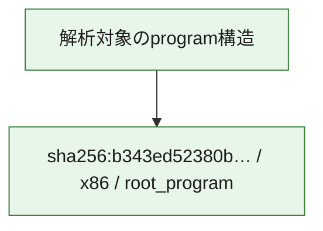

# 全体ロジック：b343ed52380b3264c5d2023ac857993a981b91db59c437f90a170bcbe16d3cc0

代表関数の静的証跡から、起動・初期化の処理群を確認しました。

## 読み方

- phaseの掲載順は解析上の整理順です。observed_call_edgesがない段階間の実行順を断定しません。
- 図の実線は静的に観測した関係、点線と黄色のノードは未観測・未解決の関係を示します。
- 図は静的な要約であり、動的実行を再現するものではありません。
- 詳細な関数解説とfingerprintは[STATIC-LOGIC.md](STATIC-LOGIC.md)を参照してください。

## 静的可視化

### 実行フロー

### 感染チェーン

### モジュール関係

## 処理段階

### 1. 起動・初期化

entry pointから初期化と後続処理への移行を確認します。
確度: `confirmed_static_function_evidence`

- `b343ed52380b3264c5d2023ac857993a981b91db59c437f90a170bcbe16d3cc0:ghidra:180001010` — 初期化と主要処理への分岐を行う入口関数です。 状態: `succeeded`、選定理由: `entry_point`, `meaningful_symbol_name`, `reviewed_call_centrality:22`, `role:entrypoint`, `small_program_complete_context`

### 2. 補助処理

主要処理を支える一般内部関数またはlibrary処理を確認します。
確度: `confirmed_static_function_evidence`

- `b343ed52380b3264c5d2023ac857993a981b91db59c437f90a170bcbe16d3cc0:ghidra:180001240` — 検体内部の一般処理を実装する関数です。 状態: `succeeded`、選定理由: `context_representative`, `reviewed_call_centrality:2`, `small_program_complete_context`
- `b343ed52380b3264c5d2023ac857993a981b91db59c437f90a170bcbe16d3cc0:ghidra:180001350` — 検体内部の一般処理を実装する関数です。 状態: `succeeded`、選定理由: `context_representative`, `reviewed_call_centrality:25`, `small_program_complete_context`
- `b343ed52380b3264c5d2023ac857993a981b91db59c437f90a170bcbe16d3cc0:ghidra:180003780` — 検体内部の一般処理を実装する関数です。 状態: `succeeded`、選定理由: `context_representative`, `reviewed_call_centrality:2`, `small_program_complete_context`
- `b343ed52380b3264c5d2023ac857993a981b91db59c437f90a170bcbe16d3cc0:ghidra:1800038e0` — 検体内部の一般処理を実装する関数です。 状態: `succeeded`、選定理由: `context_representative`, `reviewed_call_centrality:2`, `small_program_complete_context`

## 観測したcall関係

- `b343ed52380b3264c5d2023ac857993a981b91db59c437f90a170bcbe16d3cc0:ghidra:180001010` → `b343ed52380b3264c5d2023ac857993a981b91db59c437f90a170bcbe16d3cc0:ghidra:180001240` （`startup` → `support`）
- `b343ed52380b3264c5d2023ac857993a981b91db59c437f90a170bcbe16d3cc0:ghidra:180001010` → `b343ed52380b3264c5d2023ac857993a981b91db59c437f90a170bcbe16d3cc0:ghidra:180001350` （`startup` → `support`）
- `b343ed52380b3264c5d2023ac857993a981b91db59c437f90a170bcbe16d3cc0:ghidra:180001350` → `b343ed52380b3264c5d2023ac857993a981b91db59c437f90a170bcbe16d3cc0:ghidra:180001240` （`support` → `support`）
- `b343ed52380b3264c5d2023ac857993a981b91db59c437f90a170bcbe16d3cc0:ghidra:180001350` → `b343ed52380b3264c5d2023ac857993a981b91db59c437f90a170bcbe16d3cc0:ghidra:180003780` （`support` → `support`）
- `b343ed52380b3264c5d2023ac857993a981b91db59c437f90a170bcbe16d3cc0:ghidra:180001350` → `b343ed52380b3264c5d2023ac857993a981b91db59c437f90a170bcbe16d3cc0:ghidra:1800038e0` （`support` → `support`）
- `b343ed52380b3264c5d2023ac857993a981b91db59c437f90a170bcbe16d3cc0:ghidra:180003780` → `b343ed52380b3264c5d2023ac857993a981b91db59c437f90a170bcbe16d3cc0:ghidra:1800038e0` （`support` → `support`）
- `ghidra-function:270d217c31f275db74740a1c` → `ghidra-function:c97e73053bd6d61693466764` （`unclassified` → `unclassified`）
- `ghidra-function:71409bd7935c35c4d992433c` → `ghidra-external:04cc68ef5f65c3f9ef5a5868` （`unclassified` → `unclassified`）
- `ghidra-function:71409bd7935c35c4d992433c` → `ghidra-external:1fa4ffe79fad3ada100da1ca` （`unclassified` → `unclassified`）
- `ghidra-function:71409bd7935c35c4d992433c` → `ghidra-external:254d276320fbd1a904f67705` （`unclassified` → `unclassified`）
- `ghidra-function:71409bd7935c35c4d992433c` → `ghidra-external:25668f6f8e4af5b8ead2cb86` （`unclassified` → `unclassified`）
- `ghidra-function:71409bd7935c35c4d992433c` → `ghidra-external:3189df99c5ee199759718023` （`unclassified` → `unclassified`）
- `ghidra-function:71409bd7935c35c4d992433c` → `ghidra-external:40026ca8ab472b34611aec26` （`unclassified` → `unclassified`）
- `ghidra-function:71409bd7935c35c4d992433c` → `ghidra-external:603ddff775f8fbe1144ba60c` （`unclassified` → `unclassified`）
- `ghidra-function:71409bd7935c35c4d992433c` → `ghidra-external:60f0eeedfb68a9051cf7ef0f` （`unclassified` → `unclassified`）
- `ghidra-function:71409bd7935c35c4d992433c` → `ghidra-external:6c87d750d4376dac7b7e4083` （`unclassified` → `unclassified`）
- `ghidra-function:71409bd7935c35c4d992433c` → `ghidra-external:871609b07f558f30e48bfcb1` （`unclassified` → `unclassified`）
- `ghidra-function:71409bd7935c35c4d992433c` → `ghidra-external:89456741032a91ad40453f36` （`unclassified` → `unclassified`）
- `ghidra-function:71409bd7935c35c4d992433c` → `ghidra-external:906078bda10ff4d75217a360` （`unclassified` → `unclassified`）
- `ghidra-function:71409bd7935c35c4d992433c` → `ghidra-external:957cc8437dd2b17c8a3ac087` （`unclassified` → `unclassified`）
- `ghidra-function:71409bd7935c35c4d992433c` → `ghidra-external:a13fa46c57d3f5d79a46c531` （`unclassified` → `unclassified`）
- `ghidra-function:71409bd7935c35c4d992433c` → `ghidra-external:a1ec95358a421a1c6441a9d9` （`unclassified` → `unclassified`）
- `ghidra-function:71409bd7935c35c4d992433c` → `ghidra-external:af98ac3ac88b71cba36ff301` （`unclassified` → `unclassified`）
- `ghidra-function:71409bd7935c35c4d992433c` → `ghidra-external:b4bf0f755b818108ba5be34a` （`unclassified` → `unclassified`）
- `ghidra-function:71409bd7935c35c4d992433c` → `ghidra-external:ba3221910b0e5832386ecc74` （`unclassified` → `unclassified`）
- `ghidra-function:71409bd7935c35c4d992433c` → `ghidra-external:bfaa7adf23a87b4696ce62ce` （`unclassified` → `unclassified`）
- `ghidra-function:71409bd7935c35c4d992433c` → `ghidra-external:de7edfbe9d24320d1a325171` （`unclassified` → `unclassified`）
- `ghidra-function:71409bd7935c35c4d992433c` → `ghidra-external:f974afd5aa176687a70931fb` （`unclassified` → `unclassified`）
- `ghidra-function:71409bd7935c35c4d992433c` → `ghidra-function:270d217c31f275db74740a1c` （`unclassified` → `unclassified`）
- `ghidra-function:71409bd7935c35c4d992433c` → `ghidra-function:75d2d85365177e313b0cccaa` （`unclassified` → `unclassified`）
- `ghidra-function:71409bd7935c35c4d992433c` → `ghidra-function:c97e73053bd6d61693466764` （`unclassified` → `unclassified`）
- `ghidra-function:fba6c8e7526a7802f3cb7001` → `ghidra-function:09c8c093088d087ca9bb29c5` （`unclassified` → `unclassified`）
- `ghidra-function:fba6c8e7526a7802f3cb7001` → `ghidra-function:15a71ce194fffb2b71eb312e` （`unclassified` → `unclassified`）
- `ghidra-function:fba6c8e7526a7802f3cb7001` → `ghidra-function:4ad9fc448d34b713492cf4ef` （`unclassified` → `unclassified`）
- `ghidra-function:fba6c8e7526a7802f3cb7001` → `ghidra-function:59bffffe954c500cf4ec42e5` （`unclassified` → `unclassified`）
- `ghidra-function:fba6c8e7526a7802f3cb7001` → `ghidra-function:63f85f949635160bc481c2ac` （`unclassified` → `unclassified`）
- `ghidra-function:fba6c8e7526a7802f3cb7001` → `ghidra-function:71409bd7935c35c4d992433c` （`unclassified` → `unclassified`）
- `ghidra-function:fba6c8e7526a7802f3cb7001` → `ghidra-function:75d2d85365177e313b0cccaa` （`unclassified` → `unclassified`）
- `ghidra-function:fba6c8e7526a7802f3cb7001` → `ghidra-function:808fcc284cba19cdd449d1d7` （`unclassified` → `unclassified`）
- `ghidra-function:fba6c8e7526a7802f3cb7001` → `ghidra-function:a32de3622cd4ec95a66d5b53` （`unclassified` → `unclassified`）
- `ghidra-function:fba6c8e7526a7802f3cb7001` → `ghidra-function:af7ef33b2e8b10fb9b311342` （`unclassified` → `unclassified`）
- `ghidra-function:fba6c8e7526a7802f3cb7001` → `ghidra-function:be142f4c74952b273a5a7908` （`unclassified` → `unclassified`）
- `ghidra-function:fba6c8e7526a7802f3cb7001` → `ghidra-function:c308dd8ee463d2920f5cc186` （`unclassified` → `unclassified`）

## 解析範囲と制約

- 選定外関数は全体inventoryへ残しますが、関数本体の個別解説対象にはしていません。
- indirect call、難読化、packer、VM、壊れたcontrol flowによりcall関係が欠落する場合があります。
- 文書は静的解析に基づき、検体実行や外部通信による動的確認は行っていません。
