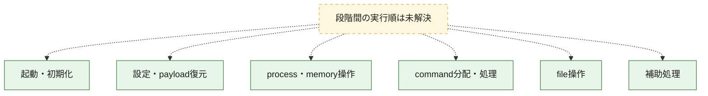
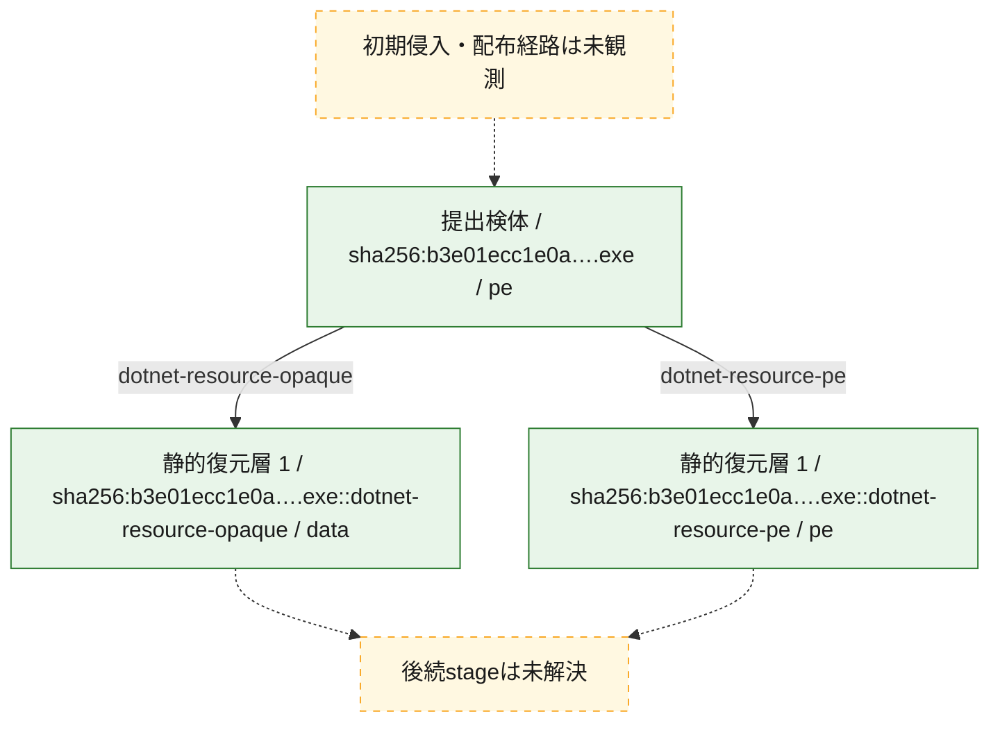
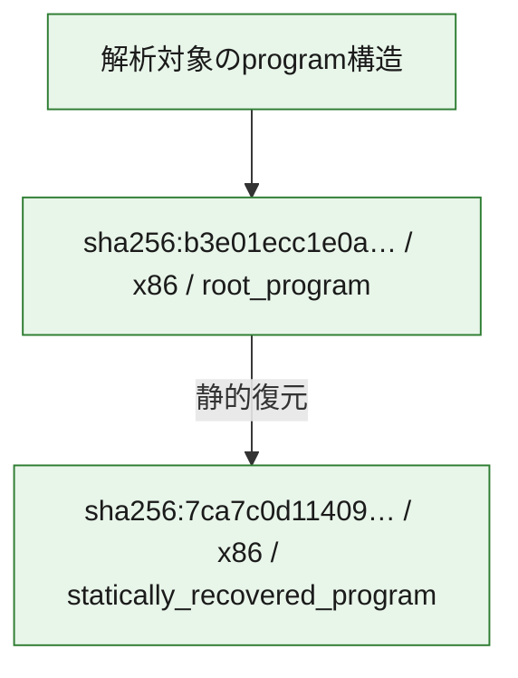

# 全体ロジック：b3e01ecc1e0a7e485e7bb39ae0ebbb39875c4c1a39b2e9414cff53d07926f5e8

代表関数の静的証跡から、起動・初期化、設定・payload復元、process・memory操作、command分配・処理、file操作の処理群を確認しました。

## 読み方

- phaseの掲載順は解析上の整理順です。observed_call_edgesがない段階間の実行順を断定しません。
- 図の実線は静的に観測した関係、点線と黄色のノードは未観測・未解決の関係を示します。
- 図は静的な要約であり、動的実行を再現するものではありません。
- 詳細な関数解説とfingerprintは[STATIC-LOGIC.md](STATIC-LOGIC.md)を参照してください。

## 静的可視化

### 実行フロー

### 感染チェーン

### モジュール関係

## 処理段階

### 1. 起動・初期化

entry pointから初期化と後続処理への移行を確認します。
確度: `confirmed_static_function_evidence`

- `b3e01ecc1e0a7e485e7bb39ae0ebbb39875c4c1a39b2e9414cff53d07926f5e8:cil:0x060000c3` — 初期化と主要処理への分岐を行う入口関数です。 状態: `succeeded`、選定理由: `entry_point`, `large_function:instructions=451`, `reviewed_call_centrality:38`

### 2. 設定・payload復元

設定、resource、payload、暗号化データの復元・変換を確認します。
確度: `confirmed_static_function_evidence`

- `b3e01ecc1e0a7e485e7bb39ae0ebbb39875c4c1a39b2e9414cff53d07926f5e8:cil:0x06000014` — 暗号、hash、encoding、または復号処理に関係する関数です。 状態: `succeeded`、選定理由: `large_function:instructions=537`, `reviewed_call_centrality:2`, `role:cryptographic_transform`
- `b3e01ecc1e0a7e485e7bb39ae0ebbb39875c4c1a39b2e9414cff53d07926f5e8:cil:0x06000038` — 設定、resource、payloadなどの解析・変換を行う関数です。 状態: `succeeded`、選定理由: `reviewed_call_centrality:16`, `role:config_or_data_transform`
- `b3e01ecc1e0a7e485e7bb39ae0ebbb39875c4c1a39b2e9414cff53d07926f5e8:cil:0x0600003b` — 設定、resource、payloadなどの解析・変換を行う関数です。 状態: `succeeded`、選定理由: `large_function:instructions=706`, `reviewed_call_centrality:16`, `role:config_or_data_transform`
- `b3e01ecc1e0a7e485e7bb39ae0ebbb39875c4c1a39b2e9414cff53d07926f5e8:cil:0x0600003c` — 設定、resource、payloadなどの解析・変換を行う関数です。 状態: `succeeded`、選定理由: `large_function:instructions=255`, `reviewed_call_centrality:12`, `role:config_or_data_transform`
- `b3e01ecc1e0a7e485e7bb39ae0ebbb39875c4c1a39b2e9414cff53d07926f5e8:cil:0x0600003e` — 設定、resource、payloadなどの解析・変換を行う関数です。 状態: `succeeded`、選定理由: `large_function:instructions=232`, `reviewed_call_centrality:18`, `role:config_or_data_transform`
- `b3e01ecc1e0a7e485e7bb39ae0ebbb39875c4c1a39b2e9414cff53d07926f5e8:cil:0x06000051` — 設定、resource、payloadなどの解析・変換を行う関数です。 状態: `succeeded`、選定理由: `large_function:instructions=197`, `reviewed_call_centrality:28`, `role:config_or_data_transform`
- `b3e01ecc1e0a7e485e7bb39ae0ebbb39875c4c1a39b2e9414cff53d07926f5e8:cil:0x060000a3` — 設定、resource、payloadなどの解析・変換を行う関数です。 状態: `succeeded`、選定理由: `large_function:instructions=100`, `reviewed_call_centrality:28`, `role:config_or_data_transform`
- `b3e01ecc1e0a7e485e7bb39ae0ebbb39875c4c1a39b2e9414cff53d07926f5e8:cil:0x060000a5` — 設定、resource、payloadなどの解析・変換を行う関数です。 状態: `succeeded`、選定理由: `large_function:instructions=66`, `reviewed_call_centrality:14`, `role:config_or_data_transform`
- `b3e01ecc1e0a7e485e7bb39ae0ebbb39875c4c1a39b2e9414cff53d07926f5e8:cil:0x060000a6` — 設定、resource、payloadなどの解析・変換を行う関数です。 状態: `succeeded`、選定理由: `large_function:instructions=145`, `reviewed_call_centrality:32`, `role:config_or_data_transform`
- `b3e01ecc1e0a7e485e7bb39ae0ebbb39875c4c1a39b2e9414cff53d07926f5e8:cil:0x060000a7` — 設定、resource、payloadなどの解析・変換を行う関数です。 状態: `succeeded`、選定理由: `large_function:instructions=153`, `reviewed_call_centrality:26`, `role:config_or_data_transform`
- `b3e01ecc1e0a7e485e7bb39ae0ebbb39875c4c1a39b2e9414cff53d07926f5e8:cil:0x060000a9` — 設定、resource、payloadなどの解析・変換を行う関数です。 状態: `succeeded`、選定理由: `reviewed_call_centrality:14`, `role:config_or_data_transform`
- `b3e01ecc1e0a7e485e7bb39ae0ebbb39875c4c1a39b2e9414cff53d07926f5e8:cil:0x060000aa` — 設定、resource、payloadなどの解析・変換を行う関数です。 状態: `succeeded`、選定理由: `reviewed_call_centrality:16`, `role:config_or_data_transform`
- `b3e01ecc1e0a7e485e7bb39ae0ebbb39875c4c1a39b2e9414cff53d07926f5e8:cil:0x060000ab` — 設定、resource、payloadなどの解析・変換を行う関数です。 状態: `succeeded`、選定理由: `large_function:instructions=69`, `reviewed_call_centrality:16`, `role:config_or_data_transform`
- `b3e01ecc1e0a7e485e7bb39ae0ebbb39875c4c1a39b2e9414cff53d07926f5e8:cil:0x060000ac` — 設定、resource、payloadなどの解析・変換を行う関数です。 状態: `succeeded`、選定理由: `large_function:instructions=85`, `reviewed_call_centrality:16`, `role:config_or_data_transform`
- `b3e01ecc1e0a7e485e7bb39ae0ebbb39875c4c1a39b2e9414cff53d07926f5e8:cil:0x060000ad` — 設定、resource、payloadなどの解析・変換を行う関数です。 状態: `succeeded`、選定理由: `large_function:instructions=155`, `reviewed_call_centrality:44`, `role:config_or_data_transform`
- `b3e01ecc1e0a7e485e7bb39ae0ebbb39875c4c1a39b2e9414cff53d07926f5e8:cil:0x060000ae` — 設定、resource、payloadなどの解析・変換を行う関数です。 状態: `succeeded`、選定理由: `large_function:instructions=115`, `reviewed_call_centrality:22`, `role:config_or_data_transform`
- `b3e01ecc1e0a7e485e7bb39ae0ebbb39875c4c1a39b2e9414cff53d07926f5e8:cil:0x060000af` — 設定、resource、payloadなどの解析・変換を行う関数です。 状態: `succeeded`、選定理由: `reviewed_call_centrality:14`, `role:config_or_data_transform`
- `b3e01ecc1e0a7e485e7bb39ae0ebbb39875c4c1a39b2e9414cff53d07926f5e8:cil:0x060000b0` — 設定、resource、payloadなどの解析・変換を行う関数です。 状態: `succeeded`、選定理由: `reviewed_call_centrality:14`, `role:config_or_data_transform`
- `b3e01ecc1e0a7e485e7bb39ae0ebbb39875c4c1a39b2e9414cff53d07926f5e8:cil:0x060000b1` — 設定、resource、payloadなどの解析・変換を行う関数です。 状態: `succeeded`、選定理由: `large_function:instructions=176`, `reviewed_call_centrality:26`, `role:config_or_data_transform`
- `b3e01ecc1e0a7e485e7bb39ae0ebbb39875c4c1a39b2e9414cff53d07926f5e8:cil:0x060000b2` — 設定、resource、payloadなどの解析・変換を行う関数です。 状態: `succeeded`、選定理由: `large_function:instructions=98`, `reviewed_call_centrality:24`, `role:config_or_data_transform`
- `b3e01ecc1e0a7e485e7bb39ae0ebbb39875c4c1a39b2e9414cff53d07926f5e8:cil:0x060000b3` — 設定、resource、payloadなどの解析・変換を行う関数です。 状態: `succeeded`、選定理由: `large_function:instructions=289`, `reviewed_call_centrality:16`, `role:config_or_data_transform`
- `b3e01ecc1e0a7e485e7bb39ae0ebbb39875c4c1a39b2e9414cff53d07926f5e8:cil:0x060000b4` — 設定、resource、payloadなどの解析・変換を行う関数です。 状態: `succeeded`、選定理由: `large_function:instructions=255`, `reviewed_call_centrality:14`, `role:config_or_data_transform`
- `b3e01ecc1e0a7e485e7bb39ae0ebbb39875c4c1a39b2e9414cff53d07926f5e8:cil:0x060000b6` — 設定、resource、payloadなどの解析・変換を行う関数です。 状態: `succeeded`、選定理由: `reviewed_call_centrality:16`, `role:config_or_data_transform`
- `b3e01ecc1e0a7e485e7bb39ae0ebbb39875c4c1a39b2e9414cff53d07926f5e8:cil:0x060000e4` — 設定、resource、payloadなどの解析・変換を行う関数です。 状態: `succeeded`、選定理由: `reviewed_call_centrality:16`, `role:config_or_data_transform`

### 3. process・memory操作

process、thread、module、memory操作と実行移行を確認します。
確度: `confirmed_static_function_evidence`

- `b3e01ecc1e0a7e485e7bb39ae0ebbb39875c4c1a39b2e9414cff53d07926f5e8:cil:0x0600001d` — process、thread、module、またはmemory操作に関係する関数です。 状態: `succeeded`、選定理由: `reviewed_call_centrality:24`, `role:process_or_memory_operation`
- `b3e01ecc1e0a7e485e7bb39ae0ebbb39875c4c1a39b2e9414cff53d07926f5e8:cil:0x0600001f` — process、thread、module、またはmemory操作に関係する関数です。 状態: `succeeded`、選定理由: `large_function:instructions=69`, `reviewed_call_centrality:28`, `role:process_or_memory_operation`
- `b3e01ecc1e0a7e485e7bb39ae0ebbb39875c4c1a39b2e9414cff53d07926f5e8:cil:0x06000024` — process、thread、module、またはmemory操作に関係する関数です。 状態: `succeeded`、選定理由: `large_function:instructions=67`, `reviewed_call_centrality:30`, `role:process_or_memory_operation`

### 4. command分配・処理

受信commandやtaskの解釈、分配、個別handlerへの移行を確認します。
確度: `confirmed_static_function_evidence`

- `b3e01ecc1e0a7e485e7bb39ae0ebbb39875c4c1a39b2e9414cff53d07926f5e8:cil:0x06000383` — commandの解釈、分配、または個別処理を担当する関数です。 状態: `succeeded`、選定理由: `reviewed_call_centrality:8`, `role:command_dispatch_or_handler`

### 5. file操作

fileやdirectoryの作成、読書き、削除を確認します。
確度: `confirmed_static_function_evidence`

- `b3e01ecc1e0a7e485e7bb39ae0ebbb39875c4c1a39b2e9414cff53d07926f5e8:cil:0x06000032` — fileまたはdirectoryの読書き・管理に関係する関数です。 状態: `succeeded`、選定理由: `reviewed_call_centrality:2`, `role:file_operation`

### 6. 補助処理

主要処理を支える一般内部関数またはlibrary処理を確認します。
確度: `confirmed_static_function_evidence`

- `7ca7c0d114090a1c5bcd7a5d68a395434c4797a231cd13f1c7550e87dfe065f7:cil:0x06000001` — 検体内部の一般処理を実装する関数です。 状態: `succeeded`、選定理由: `reviewed_call_centrality:10`, `small_program_complete_context`
- `7ca7c0d114090a1c5bcd7a5d68a395434c4797a231cd13f1c7550e87dfe065f7:cil:0x06000002` — 検体内部の一般処理を実装する関数です。 状態: `succeeded`、選定理由: `reviewed_call_centrality:2`, `small_program_complete_context`
- `7ca7c0d114090a1c5bcd7a5d68a395434c4797a231cd13f1c7550e87dfe065f7:cil:0x06000003` — 検体内部の一般処理を実装する関数です。 状態: `succeeded`、選定理由: `large_function:instructions=207`, `reviewed_call_centrality:50`, `small_program_complete_context`
- `7ca7c0d114090a1c5bcd7a5d68a395434c4797a231cd13f1c7550e87dfe065f7:cil:0x06000004` — 検体内部の一般処理を実装する関数です。 状態: `succeeded`、選定理由: `reviewed_call_centrality:14`, `small_program_complete_context`
- `7ca7c0d114090a1c5bcd7a5d68a395434c4797a231cd13f1c7550e87dfe065f7:cil:0x06000005` — 検体内部の一般処理を実装する関数です。 状態: `succeeded`、選定理由: `context_representative`, `small_program_complete_context`
- `7ca7c0d114090a1c5bcd7a5d68a395434c4797a231cd13f1c7550e87dfe065f7:cil:0x06000006` — compiler生成処理または汎用library処理とみられる関数です。 状態: `succeeded`、選定理由: `reviewed_call_centrality:2`, `small_program_complete_context`
- `7ca7c0d114090a1c5bcd7a5d68a395434c4797a231cd13f1c7550e87dfe065f7:cil:0x06000007` — 検体内部の一般処理を実装する関数です。 状態: `succeeded`、選定理由: `large_function:instructions=79`, `reviewed_call_centrality:24`, `small_program_complete_context`
- `7ca7c0d114090a1c5bcd7a5d68a395434c4797a231cd13f1c7550e87dfe065f7:cil:0x06000008` — 検体内部の一般処理を実装する関数です。 状態: `succeeded`、選定理由: `large_function:instructions=87`, `reviewed_call_centrality:12`, `small_program_complete_context`
- `7ca7c0d114090a1c5bcd7a5d68a395434c4797a231cd13f1c7550e87dfe065f7:cil:0x06000009` — 検体内部の一般処理を実装する関数です。 状態: `succeeded`、選定理由: `large_function:instructions=93`, `reviewed_call_centrality:16`, `small_program_complete_context`
- `7ca7c0d114090a1c5bcd7a5d68a395434c4797a231cd13f1c7550e87dfe065f7:cil:0x0600000a` — 検体内部の一般処理を実装する関数です。 状態: `succeeded`、選定理由: `reviewed_call_centrality:2`, `small_program_complete_context`
- `7ca7c0d114090a1c5bcd7a5d68a395434c4797a231cd13f1c7550e87dfe065f7:cil:0x0600000b` — 検体内部の一般処理を実装する関数です。 状態: `succeeded`、選定理由: `large_function:instructions=65`, `reviewed_call_centrality:2`, `small_program_complete_context`
- `7ca7c0d114090a1c5bcd7a5d68a395434c4797a231cd13f1c7550e87dfe065f7:cil:0x0600000c` — 検体内部の一般処理を実装する関数です。 状態: `succeeded`、選定理由: `large_function:instructions=150`, `reviewed_call_centrality:8`, `small_program_complete_context`
- `7ca7c0d114090a1c5bcd7a5d68a395434c4797a231cd13f1c7550e87dfe065f7:cil:0x0600000d` — 検体内部の一般処理を実装する関数です。 状態: `succeeded`、選定理由: `large_function:instructions=113`, `reviewed_call_centrality:2`, `small_program_complete_context`
- `7ca7c0d114090a1c5bcd7a5d68a395434c4797a231cd13f1c7550e87dfe065f7:cil:0x0600000e` — compiler生成処理または汎用library処理とみられる関数です。 状態: `succeeded`、選定理由: `reviewed_call_centrality:2`, `small_program_complete_context`
- `7ca7c0d114090a1c5bcd7a5d68a395434c4797a231cd13f1c7550e87dfe065f7:cil:0x0600000f` — compiler生成処理または汎用library処理とみられる関数です。 状態: `succeeded`、選定理由: `large_function:instructions=64`, `reviewed_call_centrality:20`, `small_program_complete_context`
- `7ca7c0d114090a1c5bcd7a5d68a395434c4797a231cd13f1c7550e87dfe065f7:cil:0x06000010` — 検体内部の一般処理を実装する関数です。 状態: `succeeded`、選定理由: `large_function:instructions=182`, `reviewed_call_centrality:16`, `small_program_complete_context`
- `7ca7c0d114090a1c5bcd7a5d68a395434c4797a231cd13f1c7550e87dfe065f7:cil:0x06000011` — 検体内部の一般処理を実装する関数です。 状態: `succeeded`、選定理由: `large_function:instructions=87`, `reviewed_call_centrality:8`, `small_program_complete_context`
- `7ca7c0d114090a1c5bcd7a5d68a395434c4797a231cd13f1c7550e87dfe065f7:cil:0x06000012` — 検体内部の一般処理を実装する関数です。 状態: `succeeded`、選定理由: `large_function:instructions=76`, `reviewed_call_centrality:6`, `small_program_complete_context`
- `7ca7c0d114090a1c5bcd7a5d68a395434c4797a231cd13f1c7550e87dfe065f7:cil:0x06000013` — 検体内部の一般処理を実装する関数です。 状態: `succeeded`、選定理由: `reviewed_call_centrality:12`, `small_program_complete_context`
- `7ca7c0d114090a1c5bcd7a5d68a395434c4797a231cd13f1c7550e87dfe065f7:cil:0x06000014` — 検体内部の一般処理を実装する関数です。 状態: `succeeded`、選定理由: `context_representative`, `small_program_complete_context`
- `7ca7c0d114090a1c5bcd7a5d68a395434c4797a231cd13f1c7550e87dfe065f7:cil:0x06000015` — 検体内部の一般処理を実装する関数です。 状態: `succeeded`、選定理由: `context_representative`, `small_program_complete_context`
- `7ca7c0d114090a1c5bcd7a5d68a395434c4797a231cd13f1c7550e87dfe065f7:cil:0x06000016` — 検体内部の一般処理を実装する関数です。 状態: `succeeded`、選定理由: `context_representative`, `small_program_complete_context`
- `7ca7c0d114090a1c5bcd7a5d68a395434c4797a231cd13f1c7550e87dfe065f7:cil:0x06000017` — 検体内部の一般処理を実装する関数です。 状態: `succeeded`、選定理由: `large_function:instructions=193`, `reviewed_call_centrality:8`, `small_program_complete_context`
- `7ca7c0d114090a1c5bcd7a5d68a395434c4797a231cd13f1c7550e87dfe065f7:cil:0x06000018` — 検体内部の一般処理を実装する関数です。 状態: `succeeded`、選定理由: `context_representative`, `small_program_complete_context`
- `7ca7c0d114090a1c5bcd7a5d68a395434c4797a231cd13f1c7550e87dfe065f7:cil:0x06000019` — 検体内部の一般処理を実装する関数です。 状態: `succeeded`、選定理由: `reviewed_call_centrality:8`, `small_program_complete_context`
- `7ca7c0d114090a1c5bcd7a5d68a395434c4797a231cd13f1c7550e87dfe065f7:cil:0x0600001a` — 検体内部の一般処理を実装する関数です。 状態: `succeeded`、選定理由: `reviewed_call_centrality:4`, `small_program_complete_context`
- `7ca7c0d114090a1c5bcd7a5d68a395434c4797a231cd13f1c7550e87dfe065f7:cil:0x0600001b` — 検体内部の一般処理を実装する関数です。 状態: `succeeded`、選定理由: `large_function:instructions=83`, `reviewed_call_centrality:14`, `small_program_complete_context`
- `7ca7c0d114090a1c5bcd7a5d68a395434c4797a231cd13f1c7550e87dfe065f7:cil:0x0600001c` — compiler生成処理または汎用library処理とみられる関数です。 状態: `succeeded`、選定理由: `reviewed_call_centrality:2`, `small_program_complete_context`
- `7ca7c0d114090a1c5bcd7a5d68a395434c4797a231cd13f1c7550e87dfe065f7:cil:0x0600001d` — compiler生成処理または汎用library処理とみられる関数です。 状態: `succeeded`、選定理由: `reviewed_call_centrality:2`, `small_program_complete_context`
- `7ca7c0d114090a1c5bcd7a5d68a395434c4797a231cd13f1c7550e87dfe065f7:cil:0x0600001e` — 検体内部の一般処理を実装する関数です。 状態: `succeeded`、選定理由: `context_representative`, `small_program_complete_context`
- `b3e01ecc1e0a7e485e7bb39ae0ebbb39875c4c1a39b2e9414cff53d07926f5e8:cil:0x060001b1` — compiler生成処理または汎用library処理とみられる関数です。 状態: `succeeded`、選定理由: `reviewed_call_centrality:28`
- `b3e01ecc1e0a7e485e7bb39ae0ebbb39875c4c1a39b2e9414cff53d07926f5e8:cil:0x06000330` — 検体内部の一般処理を実装する関数です。 状態: `succeeded`、選定理由: `large_function:instructions=471`, `reviewed_call_centrality:106`

## 観測したcall関係

- 代表関数間で直接解決できた呼出関係はありません。

## 解析範囲と制約

- 選定外関数は全体inventoryへ残しますが、関数本体の個別解説対象にはしていません。
- indirect call、難読化、packer、VM、壊れたcontrol flowによりcall関係が欠落する場合があります。
- 文書は静的解析に基づき、検体実行や外部通信による動的確認は行っていません。
