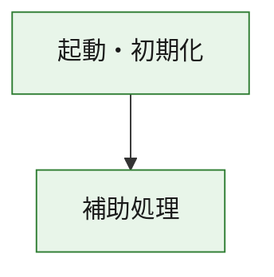
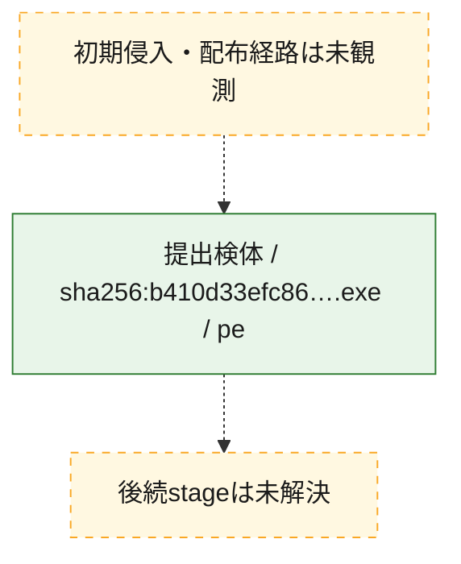
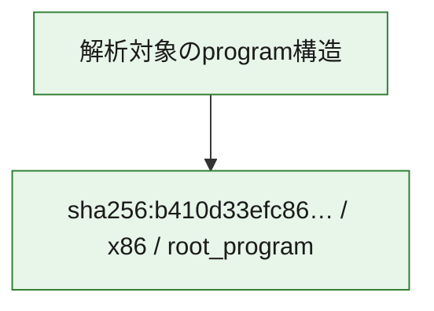

# 全体ロジック：b410d33efc86ced799284522e3bebfe020e00f6203977a055225680b045856b9

代表関数の静的証跡から、起動・初期化の処理群を確認しました。

## 読み方

- phaseの掲載順は解析上の整理順です。observed_call_edgesがない段階間の実行順を断定しません。
- 図の実線は静的に観測した関係、点線と黄色のノードは未観測・未解決の関係を示します。
- 図は静的な要約であり、動的実行を再現するものではありません。
- 詳細な関数解説とfingerprintは[STATIC-LOGIC.md](STATIC-LOGIC.md)を参照してください。

## 静的可視化

### 実行フロー

### 感染チェーン

### モジュール関係

## 処理段階

### 1. 起動・初期化

entry pointから初期化と後続処理への移行を確認します。
確度: `confirmed_static_function_evidence`

- `b410d33efc86ced799284522e3bebfe020e00f6203977a055225680b045856b9:ghidra:180001010` — 初期化と主要処理への分岐を行う入口関数です。 状態: `succeeded`、選定理由: `entry_point`, `meaningful_symbol_name`, `reviewed_call_centrality:22`, `role:entrypoint`, `small_program_complete_context`

### 2. 補助処理

主要処理を支える一般内部関数またはlibrary処理を確認します。
確度: `confirmed_static_function_evidence`

- `b410d33efc86ced799284522e3bebfe020e00f6203977a055225680b045856b9:ghidra:180001240` — 検体内部の一般処理を実装する関数です。 状態: `succeeded`、選定理由: `context_representative`, `reviewed_call_centrality:2`, `small_program_complete_context`
- `b410d33efc86ced799284522e3bebfe020e00f6203977a055225680b045856b9:ghidra:180001350` — 検体内部の一般処理を実装する関数です。 状態: `succeeded`、選定理由: `context_representative`, `reviewed_call_centrality:25`, `small_program_complete_context`
- `b410d33efc86ced799284522e3bebfe020e00f6203977a055225680b045856b9:ghidra:180003780` — 検体内部の一般処理を実装する関数です。 状態: `succeeded`、選定理由: `context_representative`, `reviewed_call_centrality:2`, `small_program_complete_context`
- `b410d33efc86ced799284522e3bebfe020e00f6203977a055225680b045856b9:ghidra:1800038e0` — 検体内部の一般処理を実装する関数です。 状態: `succeeded`、選定理由: `context_representative`, `reviewed_call_centrality:2`, `small_program_complete_context`

## 観測したcall関係

- `b410d33efc86ced799284522e3bebfe020e00f6203977a055225680b045856b9:ghidra:180001010` → `b410d33efc86ced799284522e3bebfe020e00f6203977a055225680b045856b9:ghidra:180001240` （`startup` → `support`）
- `b410d33efc86ced799284522e3bebfe020e00f6203977a055225680b045856b9:ghidra:180001010` → `b410d33efc86ced799284522e3bebfe020e00f6203977a055225680b045856b9:ghidra:180001350` （`startup` → `support`）
- `b410d33efc86ced799284522e3bebfe020e00f6203977a055225680b045856b9:ghidra:180001350` → `b410d33efc86ced799284522e3bebfe020e00f6203977a055225680b045856b9:ghidra:180001240` （`support` → `support`）
- `b410d33efc86ced799284522e3bebfe020e00f6203977a055225680b045856b9:ghidra:180001350` → `b410d33efc86ced799284522e3bebfe020e00f6203977a055225680b045856b9:ghidra:180003780` （`support` → `support`）
- `b410d33efc86ced799284522e3bebfe020e00f6203977a055225680b045856b9:ghidra:180001350` → `b410d33efc86ced799284522e3bebfe020e00f6203977a055225680b045856b9:ghidra:1800038e0` （`support` → `support`）
- `b410d33efc86ced799284522e3bebfe020e00f6203977a055225680b045856b9:ghidra:180003780` → `b410d33efc86ced799284522e3bebfe020e00f6203977a055225680b045856b9:ghidra:1800038e0` （`support` → `support`）
- `ghidra-function:088512b4d249868f7a5237dd` → `ghidra-function:21efcbc3537eb7f12338c4a0` （`unclassified` → `unclassified`）
- `ghidra-function:088512b4d249868f7a5237dd` → `ghidra-function:4714d5ef05a287df12943704` （`unclassified` → `unclassified`）
- `ghidra-function:088512b4d249868f7a5237dd` → `ghidra-function:47fe6d40a1258ca7d32cf5da` （`unclassified` → `unclassified`）
- `ghidra-function:088512b4d249868f7a5237dd` → `ghidra-function:6c77e925663dca029cbbb7f1` （`unclassified` → `unclassified`）
- `ghidra-function:088512b4d249868f7a5237dd` → `ghidra-function:79e1107982e5411081b97abf` （`unclassified` → `unclassified`）
- `ghidra-function:088512b4d249868f7a5237dd` → `ghidra-function:803a0d7656ef00c5de86bfd8` （`unclassified` → `unclassified`）
- `ghidra-function:088512b4d249868f7a5237dd` → `ghidra-function:821a44ec4e29804e71e0cacf` （`unclassified` → `unclassified`）
- `ghidra-function:088512b4d249868f7a5237dd` → `ghidra-function:9c5d544630c55d707f22b04f` （`unclassified` → `unclassified`）
- `ghidra-function:088512b4d249868f7a5237dd` → `ghidra-function:a7644a5838ecf7ec6688dfe8` （`unclassified` → `unclassified`）
- `ghidra-function:088512b4d249868f7a5237dd` → `ghidra-function:af472a29fbcac438d815e4e1` （`unclassified` → `unclassified`）
- `ghidra-function:088512b4d249868f7a5237dd` → `ghidra-function:baf17b5911adf5f2c4efe0ff` （`unclassified` → `unclassified`）
- `ghidra-function:088512b4d249868f7a5237dd` → `ghidra-function:f123dfba61d96a0e756cc61f` （`unclassified` → `unclassified`）
- `ghidra-function:1b3cf8b1b94309710c880b7c` → `ghidra-function:da5e32f76125f24e3de25ecb` （`unclassified` → `unclassified`）
- `ghidra-function:9c5d544630c55d707f22b04f` → `ghidra-external:0bbdd65ffce6edd50f897d4d` （`unclassified` → `unclassified`）
- `ghidra-function:9c5d544630c55d707f22b04f` → `ghidra-external:42cbd2cc5a9ffcb1c7eb3425` （`unclassified` → `unclassified`）
- `ghidra-function:9c5d544630c55d707f22b04f` → `ghidra-external:4df88ae0e02c021c71ec3045` （`unclassified` → `unclassified`）
- `ghidra-function:9c5d544630c55d707f22b04f` → `ghidra-external:5d819e10c75b5a9a55da1a3e` （`unclassified` → `unclassified`）
- `ghidra-function:9c5d544630c55d707f22b04f` → `ghidra-external:62b629043a40c22039e07a99` （`unclassified` → `unclassified`）
- `ghidra-function:9c5d544630c55d707f22b04f` → `ghidra-external:632218c7fb6b15ff28f58c43` （`unclassified` → `unclassified`）
- `ghidra-function:9c5d544630c55d707f22b04f` → `ghidra-external:6ad7504c4ff3f7de36b70841` （`unclassified` → `unclassified`）
- `ghidra-function:9c5d544630c55d707f22b04f` → `ghidra-external:73bb56fc4d83d349a8c60f4b` （`unclassified` → `unclassified`）
- `ghidra-function:9c5d544630c55d707f22b04f` → `ghidra-external:74e1f39db238715138f9d7d1` （`unclassified` → `unclassified`）
- `ghidra-function:9c5d544630c55d707f22b04f` → `ghidra-external:776398a375cabf42efb5efac` （`unclassified` → `unclassified`）
- `ghidra-function:9c5d544630c55d707f22b04f` → `ghidra-external:951df8048d605775e117f687` （`unclassified` → `unclassified`）
- `ghidra-function:9c5d544630c55d707f22b04f` → `ghidra-external:97ace5be285e73a952868ccb` （`unclassified` → `unclassified`）
- `ghidra-function:9c5d544630c55d707f22b04f` → `ghidra-external:999811cfa6e078db1c81c220` （`unclassified` → `unclassified`）
- `ghidra-function:9c5d544630c55d707f22b04f` → `ghidra-external:9e853f275354359a1f2c12e3` （`unclassified` → `unclassified`）
- `ghidra-function:9c5d544630c55d707f22b04f` → `ghidra-external:a3999df78e8d6a166af947c6` （`unclassified` → `unclassified`）
- `ghidra-function:9c5d544630c55d707f22b04f` → `ghidra-external:c3165ac83901b1fafb1c41f9` （`unclassified` → `unclassified`）
- `ghidra-function:9c5d544630c55d707f22b04f` → `ghidra-external:c5e4594712bafed2ab69d5ff` （`unclassified` → `unclassified`）
- `ghidra-function:9c5d544630c55d707f22b04f` → `ghidra-external:c9a8e64977a4c427675e7b15` （`unclassified` → `unclassified`）
- `ghidra-function:9c5d544630c55d707f22b04f` → `ghidra-external:d60ee01c9e32d25534557391` （`unclassified` → `unclassified`）
- `ghidra-function:9c5d544630c55d707f22b04f` → `ghidra-external:e2d80723fbf4dd4b0a6f3561` （`unclassified` → `unclassified`）
- `ghidra-function:9c5d544630c55d707f22b04f` → `ghidra-external:fa81adaec3d0d0934d82b880` （`unclassified` → `unclassified`）
- `ghidra-function:9c5d544630c55d707f22b04f` → `ghidra-function:1b3cf8b1b94309710c880b7c` （`unclassified` → `unclassified`）
- `ghidra-function:9c5d544630c55d707f22b04f` → `ghidra-function:821a44ec4e29804e71e0cacf` （`unclassified` → `unclassified`）
- `ghidra-function:9c5d544630c55d707f22b04f` → `ghidra-function:da5e32f76125f24e3de25ecb` （`unclassified` → `unclassified`）

## 解析範囲と制約

- 選定外関数は全体inventoryへ残しますが、関数本体の個別解説対象にはしていません。
- indirect call、難読化、packer、VM、壊れたcontrol flowによりcall関係が欠落する場合があります。
- 文書は静的解析に基づき、検体実行や外部通信による動的確認は行っていません。
