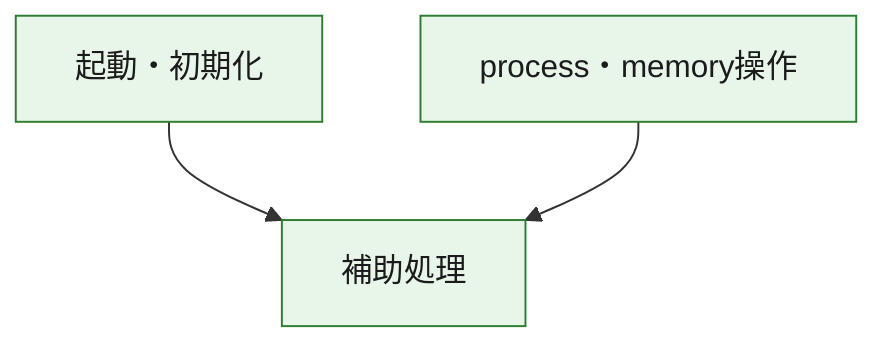
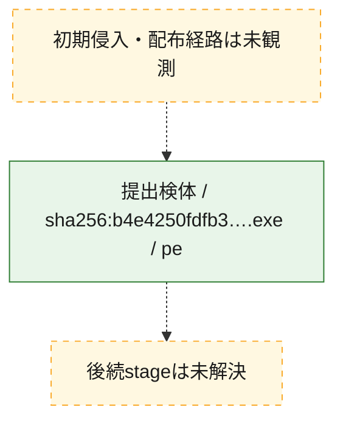
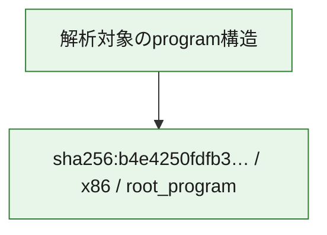

# 全体ロジック：b4e4250fdfb3a7398edc10be74a79e29100460d6a2d0bef99e4f5411a2dbe68a

代表関数の静的証跡から、起動・初期化、process・memory操作の処理群を確認しました。

## 読み方

- phaseの掲載順は解析上の整理順です。observed_call_edgesがない段階間の実行順を断定しません。
- 図の実線は静的に観測した関係、点線と黄色のノードは未観測・未解決の関係を示します。
- 図は静的な要約であり、動的実行を再現するものではありません。
- 詳細な関数解説とfingerprintは[STATIC-LOGIC.md](STATIC-LOGIC.md)を参照してください。

## 静的可視化

### 実行フロー

### 感染チェーン

### モジュール関係

## 処理段階

### 1. 起動・初期化

entry pointから初期化と後続処理への移行を確認します。
確度: `confirmed_static_function_evidence`

- `b4e4250fdfb3a7398edc10be74a79e29100460d6a2d0bef99e4f5411a2dbe68a:ghidra:219891210` — 初期化と主要処理への分岐を行う入口関数です。 状態: `succeeded`、選定理由: `entry_point`, `meaningful_symbol_name`, `reviewed_call_centrality:2`, `role:entrypoint`

### 2. process・memory操作

process、thread、module、memory操作と実行移行を確認します。
確度: `confirmed_static_function_evidence`

- `b4e4250fdfb3a7398edc10be74a79e29100460d6a2d0bef99e4f5411a2dbe68a:ghidra:2198914d0` — process、thread、module、またはmemory操作に関係する関数です。 状態: `succeeded`、選定理由: `context_representative`, `reviewed_call_centrality:16`, `role:process_or_memory_operation`
- `b4e4250fdfb3a7398edc10be74a79e29100460d6a2d0bef99e4f5411a2dbe68a:ghidra:219891530` — process、thread、module、またはmemory操作に関係する関数です。 状態: `succeeded`、選定理由: `context_representative`, `reviewed_call_centrality:12`, `role:process_or_memory_operation`

### 3. 補助処理

主要処理を支える一般内部関数またはlibrary処理を確認します。
確度: `confirmed_static_function_evidence_with_limits`

- `b4e4250fdfb3a7398edc10be74a79e29100460d6a2d0bef99e4f5411a2dbe68a:ghidra:219891000` — 検体内部の一般処理を実装する関数です。 状態: `succeeded`、選定理由: `context_representative`, `reviewed_call_centrality:14`
- `b4e4250fdfb3a7398edc10be74a79e29100460d6a2d0bef99e4f5411a2dbe68a:ghidra:219891300` — 検体内部の一般処理を実装する関数です。 状態: `limited_bad_instruction_or_flow`、選定理由: `context_representative`, `reviewed_call_centrality:2`
- `b4e4250fdfb3a7398edc10be74a79e29100460d6a2d0bef99e4f5411a2dbe68a:ghidra:219891310` — 検体内部の一般処理を実装する関数です。 状態: `limited_bad_instruction_or_flow`、選定理由: `context_representative`, `reviewed_call_centrality:2`
- `b4e4250fdfb3a7398edc10be74a79e29100460d6a2d0bef99e4f5411a2dbe68a:ghidra:219891320` — 検体内部の一般処理を実装する関数です。 状態: `succeeded`、選定理由: `context_representative`
- `b4e4250fdfb3a7398edc10be74a79e29100460d6a2d0bef99e4f5411a2dbe68a:ghidra:219891330` — 検体内部の一般処理を実装する関数です。 状態: `succeeded`、選定理由: `context_representative`
- `b4e4250fdfb3a7398edc10be74a79e29100460d6a2d0bef99e4f5411a2dbe68a:ghidra:219891380` — 検体内部の一般処理を実装する関数です。 状態: `limited_bad_instruction_or_flow`、選定理由: `context_representative`, `reviewed_call_centrality:2`
- `b4e4250fdfb3a7398edc10be74a79e29100460d6a2d0bef99e4f5411a2dbe68a:ghidra:219891400` — 検体内部の一般処理を実装する関数です。 状態: `limited_bad_instruction_or_flow`、選定理由: `context_representative`, `reviewed_call_centrality:3`
- `b4e4250fdfb3a7398edc10be74a79e29100460d6a2d0bef99e4f5411a2dbe68a:ghidra:219891420` — compiler生成処理または汎用library処理とみられる関数です。 状態: `succeeded`、選定理由: `entry_point`, `meaningful_symbol_name`, `reviewed_call_centrality:7`
- `b4e4250fdfb3a7398edc10be74a79e29100460d6a2d0bef99e4f5411a2dbe68a:ghidra:219891440` — compiler生成処理または汎用library処理とみられる関数です。 状態: `succeeded`、選定理由: `entry_point`, `meaningful_symbol_name`, `reviewed_call_centrality:4`
- `b4e4250fdfb3a7398edc10be74a79e29100460d6a2d0bef99e4f5411a2dbe68a:ghidra:2198914c0` — 検体内部の一般処理を実装する関数です。 状態: `succeeded`、選定理由: `context_representative`
- `b4e4250fdfb3a7398edc10be74a79e29100460d6a2d0bef99e4f5411a2dbe68a:ghidra:2198916a0` — 検体内部の一般処理を実装する関数です。 状態: `succeeded`、選定理由: `context_representative`, `reviewed_call_centrality:4`
- `b4e4250fdfb3a7398edc10be74a79e29100460d6a2d0bef99e4f5411a2dbe68a:ghidra:219891a40` — 検体内部の一般処理を実装する関数です。 状態: `limited_bad_instruction_or_flow`、選定理由: `context_representative`, `reviewed_call_centrality:10`
- `b4e4250fdfb3a7398edc10be74a79e29100460d6a2d0bef99e4f5411a2dbe68a:ghidra:219891ab0` — 検体内部の一般処理を実装する関数です。 状態: `succeeded`、選定理由: `context_representative`, `reviewed_call_centrality:5`
- `b4e4250fdfb3a7398edc10be74a79e29100460d6a2d0bef99e4f5411a2dbe68a:ghidra:219891b50` — 検体内部の一般処理を実装する関数です。 状態: `succeeded`、選定理由: `context_representative`, `reviewed_call_centrality:5`
- `b4e4250fdfb3a7398edc10be74a79e29100460d6a2d0bef99e4f5411a2dbe68a:ghidra:219891bf0` — 検体内部の一般処理を実装する関数です。 状態: `succeeded`、選定理由: `context_representative`, `reviewed_call_centrality:7`
- `b4e4250fdfb3a7398edc10be74a79e29100460d6a2d0bef99e4f5411a2dbe68a:ghidra:219891d00` — 検体内部の一般処理を実装する関数です。 状態: `succeeded`、選定理由: `context_representative`, `reviewed_call_centrality:2`
- `b4e4250fdfb3a7398edc10be74a79e29100460d6a2d0bef99e4f5411a2dbe68a:ghidra:219891d10` — 検体内部の一般処理を実装する関数です。 状態: `succeeded`、選定理由: `context_representative`
- `b4e4250fdfb3a7398edc10be74a79e29100460d6a2d0bef99e4f5411a2dbe68a:ghidra:219891d40` — 検体内部の一般処理を実装する関数です。 状態: `succeeded`、選定理由: `context_representative`
- `b4e4250fdfb3a7398edc10be74a79e29100460d6a2d0bef99e4f5411a2dbe68a:ghidra:219891d90` — 検体内部の一般処理を実装する関数です。 状態: `succeeded`、選定理由: `context_representative`, `reviewed_call_centrality:2`
- `b4e4250fdfb3a7398edc10be74a79e29100460d6a2d0bef99e4f5411a2dbe68a:ghidra:219891e30` — 検体内部の一般処理を実装する関数です。 状態: `succeeded`、選定理由: `context_representative`, `reviewed_call_centrality:3`
- `b4e4250fdfb3a7398edc10be74a79e29100460d6a2d0bef99e4f5411a2dbe68a:ghidra:219891eb0` — 検体内部の一般処理を実装する関数です。 状態: `succeeded`、選定理由: `context_representative`, `reviewed_call_centrality:4`
- `b4e4250fdfb3a7398edc10be74a79e29100460d6a2d0bef99e4f5411a2dbe68a:ghidra:219891ee0` — 検体内部の一般処理を実装する関数です。 状態: `succeeded`、選定理由: `context_representative`, `reviewed_call_centrality:1`
- `b4e4250fdfb3a7398edc10be74a79e29100460d6a2d0bef99e4f5411a2dbe68a:ghidra:219891f50` — 検体内部の一般処理を実装する関数です。 状態: `succeeded`、選定理由: `context_representative`, `reviewed_call_centrality:3`
- `b4e4250fdfb3a7398edc10be74a79e29100460d6a2d0bef99e4f5411a2dbe68a:ghidra:219891f80` — 検体内部の一般処理を実装する関数です。 状態: `succeeded`、選定理由: `context_representative`, `reviewed_call_centrality:1`
- `b4e4250fdfb3a7398edc10be74a79e29100460d6a2d0bef99e4f5411a2dbe68a:ghidra:219892010` — 検体内部の一般処理を実装する関数です。 状態: `succeeded`、選定理由: `context_representative`
- `b4e4250fdfb3a7398edc10be74a79e29100460d6a2d0bef99e4f5411a2dbe68a:ghidra:219892120` — 検体内部の一般処理を実装する関数です。 状態: `succeeded`、選定理由: `context_representative`
- `b4e4250fdfb3a7398edc10be74a79e29100460d6a2d0bef99e4f5411a2dbe68a:ghidra:219892180` — 検体内部の一般処理を実装する関数です。 状態: `succeeded`、選定理由: `context_representative`
- `b4e4250fdfb3a7398edc10be74a79e29100460d6a2d0bef99e4f5411a2dbe68a:ghidra:2198921e0` — 検体内部の一般処理を実装する関数です。 状態: `succeeded`、選定理由: `context_representative`
- `b4e4250fdfb3a7398edc10be74a79e29100460d6a2d0bef99e4f5411a2dbe68a:ghidra:219892240` — 検体内部の一般処理を実装する関数です。 状態: `succeeded`、選定理由: `context_representative`

## 観測したcall関係

- `b4e4250fdfb3a7398edc10be74a79e29100460d6a2d0bef99e4f5411a2dbe68a:ghidra:219891000` → `b4e4250fdfb3a7398edc10be74a79e29100460d6a2d0bef99e4f5411a2dbe68a:ghidra:219891400` （`support` → `support`）
- `b4e4250fdfb3a7398edc10be74a79e29100460d6a2d0bef99e4f5411a2dbe68a:ghidra:219891000` → `b4e4250fdfb3a7398edc10be74a79e29100460d6a2d0bef99e4f5411a2dbe68a:ghidra:219891440` （`support` → `support`）
- `b4e4250fdfb3a7398edc10be74a79e29100460d6a2d0bef99e4f5411a2dbe68a:ghidra:219891000` → `b4e4250fdfb3a7398edc10be74a79e29100460d6a2d0bef99e4f5411a2dbe68a:ghidra:2198916a0` （`support` → `support`）
- `b4e4250fdfb3a7398edc10be74a79e29100460d6a2d0bef99e4f5411a2dbe68a:ghidra:219891210` → `b4e4250fdfb3a7398edc10be74a79e29100460d6a2d0bef99e4f5411a2dbe68a:ghidra:219891000` （`startup` → `support`）
- `b4e4250fdfb3a7398edc10be74a79e29100460d6a2d0bef99e4f5411a2dbe68a:ghidra:219891420` → `b4e4250fdfb3a7398edc10be74a79e29100460d6a2d0bef99e4f5411a2dbe68a:ghidra:219891a40` （`support` → `support`）
- `b4e4250fdfb3a7398edc10be74a79e29100460d6a2d0bef99e4f5411a2dbe68a:ghidra:219891420` → `b4e4250fdfb3a7398edc10be74a79e29100460d6a2d0bef99e4f5411a2dbe68a:ghidra:219891d00` （`support` → `support`）
- `b4e4250fdfb3a7398edc10be74a79e29100460d6a2d0bef99e4f5411a2dbe68a:ghidra:2198914d0` → `b4e4250fdfb3a7398edc10be74a79e29100460d6a2d0bef99e4f5411a2dbe68a:ghidra:219891e30` （`execution` → `support`）
- `b4e4250fdfb3a7398edc10be74a79e29100460d6a2d0bef99e4f5411a2dbe68a:ghidra:2198914d0` → `b4e4250fdfb3a7398edc10be74a79e29100460d6a2d0bef99e4f5411a2dbe68a:ghidra:219891eb0` （`execution` → `support`）
- `b4e4250fdfb3a7398edc10be74a79e29100460d6a2d0bef99e4f5411a2dbe68a:ghidra:2198914d0` → `b4e4250fdfb3a7398edc10be74a79e29100460d6a2d0bef99e4f5411a2dbe68a:ghidra:219891f50` （`execution` → `support`）
- `b4e4250fdfb3a7398edc10be74a79e29100460d6a2d0bef99e4f5411a2dbe68a:ghidra:219891530` → `b4e4250fdfb3a7398edc10be74a79e29100460d6a2d0bef99e4f5411a2dbe68a:ghidra:2198914d0` （`execution` → `execution`）
- `b4e4250fdfb3a7398edc10be74a79e29100460d6a2d0bef99e4f5411a2dbe68a:ghidra:219891530` → `b4e4250fdfb3a7398edc10be74a79e29100460d6a2d0bef99e4f5411a2dbe68a:ghidra:219891e30` （`execution` → `support`）
- `b4e4250fdfb3a7398edc10be74a79e29100460d6a2d0bef99e4f5411a2dbe68a:ghidra:219891530` → `b4e4250fdfb3a7398edc10be74a79e29100460d6a2d0bef99e4f5411a2dbe68a:ghidra:219891eb0` （`execution` → `support`）
- `b4e4250fdfb3a7398edc10be74a79e29100460d6a2d0bef99e4f5411a2dbe68a:ghidra:219891530` → `b4e4250fdfb3a7398edc10be74a79e29100460d6a2d0bef99e4f5411a2dbe68a:ghidra:219891f50` （`execution` → `support`）
- `b4e4250fdfb3a7398edc10be74a79e29100460d6a2d0bef99e4f5411a2dbe68a:ghidra:2198916a0` → `b4e4250fdfb3a7398edc10be74a79e29100460d6a2d0bef99e4f5411a2dbe68a:ghidra:219891eb0` （`support` → `support`）
- `b4e4250fdfb3a7398edc10be74a79e29100460d6a2d0bef99e4f5411a2dbe68a:ghidra:219891bf0` → `b4e4250fdfb3a7398edc10be74a79e29100460d6a2d0bef99e4f5411a2dbe68a:ghidra:219891a40` （`support` → `support`）
- `b4e4250fdfb3a7398edc10be74a79e29100460d6a2d0bef99e4f5411a2dbe68a:ghidra:219891bf0` → `b4e4250fdfb3a7398edc10be74a79e29100460d6a2d0bef99e4f5411a2dbe68a:ghidra:219891d00` （`support` → `support`）
- `ghidra-function:09fca609bec99d54815d82cd` → `ghidra-external:9b19a0a48a37ae539c66daeb` （`unclassified` → `unclassified`）
- `ghidra-function:0a14e281c925fb86033fa522` → `ghidra-function:373ec5cd7ea051bf1c36c378` （`unclassified` → `unclassified`）
- `ghidra-function:0a14e281c925fb86033fa522` → `ghidra-function:991bc2089d72e2b0fa193615` （`unclassified` → `unclassified`）
- `ghidra-function:0a14e281c925fb86033fa522` → `ghidra-function:cac5e9ac10c66cf01e8eb0d5` （`unclassified` → `unclassified`）
- `ghidra-function:0a14e281c925fb86033fa522` → `ghidra-function:e41a98a3bd23c18b7490f58a` （`unclassified` → `unclassified`）
- `ghidra-function:0e037cb77d21d9a6d32bf385` → `ghidra-external:9b19a0a48a37ae539c66daeb` （`unclassified` → `unclassified`）
- `ghidra-function:13b7ca113d1e8de18f7d4baf` → `ghidra-external:9b19a0a48a37ae539c66daeb` （`unclassified` → `unclassified`）
- `ghidra-function:13b7ca113d1e8de18f7d4baf` → `ghidra-external:d8b938e86225362092d93e87` （`unclassified` → `unclassified`）
- `ghidra-function:13b7ca113d1e8de18f7d4baf` → `ghidra-function:5a0dd8c808c4fbdb5c9d934d` （`unclassified` → `unclassified`）
- `ghidra-function:436f760982a4947501422afd` → `ghidra-external:9b19a0a48a37ae539c66daeb` （`unclassified` → `unclassified`）
- `ghidra-function:436f760982a4947501422afd` → `ghidra-external:d8b938e86225362092d93e87` （`unclassified` → `unclassified`）
- `ghidra-function:436f760982a4947501422afd` → `ghidra-function:09fca609bec99d54815d82cd` （`unclassified` → `unclassified`）
- `ghidra-function:436f760982a4947501422afd` → `ghidra-function:2a2f7c3bf7f56f45447fde95` （`unclassified` → `unclassified`）
- `ghidra-function:436f760982a4947501422afd` → `ghidra-function:5a0dd8c808c4fbdb5c9d934d` （`unclassified` → `unclassified`）
- `ghidra-function:436f760982a4947501422afd` → `ghidra-function:5fdb909042d8a7192cb0958d` （`unclassified` → `unclassified`）
- `ghidra-function:436f760982a4947501422afd` → `ghidra-function:611c87232942b0c575d03428` （`unclassified` → `unclassified`）
- `ghidra-function:436f760982a4947501422afd` → `ghidra-function:84da3bf0a4b4c54038b94d1c` （`unclassified` → `unclassified`）
- `ghidra-function:436f760982a4947501422afd` → `ghidra-function:991bc2089d72e2b0fa193615` （`unclassified` → `unclassified`）
- `ghidra-function:5a0dd8c808c4fbdb5c9d934d` → `ghidra-external:9b19a0a48a37ae539c66daeb` （`unclassified` → `unclassified`）
- `ghidra-function:5c3af8fc4a43c8f72301f97a` → `ghidra-external:9b19a0a48a37ae539c66daeb` （`unclassified` → `unclassified`）
- `ghidra-function:611c87232942b0c575d03428` → `ghidra-external:9b19a0a48a37ae539c66daeb` （`unclassified` → `unclassified`）
- `ghidra-function:639526cf487e4dea3ee22472` → `ghidra-external:2594dc6795baaafd8a97994d` （`unclassified` → `unclassified`）
- `ghidra-function:639526cf487e4dea3ee22472` → `ghidra-external:cfb3a9df3f969cd9a98660aa` （`unclassified` → `unclassified`）
- `ghidra-function:7a5ad324312ad29eb9581306` → `ghidra-external:fb0a855e3d827dd22fcfa6a6` （`unclassified` → `unclassified`）
- `ghidra-function:7a5ad324312ad29eb9581306` → `ghidra-function:b951b7b2e8c99580d87d0e5d` （`unclassified` → `unclassified`）
- `ghidra-function:7b99ce9a710096607cf737e3` → `ghidra-external:10daddfc9c101ae3c5c459f3` （`unclassified` → `unclassified`）
- `ghidra-function:7b99ce9a710096607cf737e3` → `ghidra-function:373ec5cd7ea051bf1c36c378` （`unclassified` → `unclassified`）
- `ghidra-function:7b99ce9a710096607cf737e3` → `ghidra-function:e41a98a3bd23c18b7490f58a` （`unclassified` → `unclassified`）
- `ghidra-function:82f0e1de12dddfbb82fc8d56` → `ghidra-function:1207ed1c1acdbba5428af8b1` （`unclassified` → `unclassified`）
- `ghidra-function:84da3bf0a4b4c54038b94d1c` → `ghidra-external:3e15f2a3d98155a85e6fb1d8` （`unclassified` → `unclassified`）
- `ghidra-function:84da3bf0a4b4c54038b94d1c` → `ghidra-external:9b19a0a48a37ae539c66daeb` （`unclassified` → `unclassified`）
- `ghidra-function:84da3bf0a4b4c54038b94d1c` → `ghidra-external:d8b938e86225362092d93e87` （`unclassified` → `unclassified`）
- `ghidra-function:84da3bf0a4b4c54038b94d1c` → `ghidra-external:edac9abd998f1cf15e21983f` （`unclassified` → `unclassified`）
- `ghidra-function:84da3bf0a4b4c54038b94d1c` → `ghidra-function:09fca609bec99d54815d82cd` （`unclassified` → `unclassified`）
- `ghidra-function:84da3bf0a4b4c54038b94d1c` → `ghidra-function:224a4f2c70e3ac9f59e6cf8b` （`unclassified` → `unclassified`）
- `ghidra-function:84da3bf0a4b4c54038b94d1c` → `ghidra-function:2a2f7c3bf7f56f45447fde95` （`unclassified` → `unclassified`）
- `ghidra-function:84da3bf0a4b4c54038b94d1c` → `ghidra-function:5a0dd8c808c4fbdb5c9d934d` （`unclassified` → `unclassified`）
- `ghidra-function:84da3bf0a4b4c54038b94d1c` → `ghidra-function:5f750fdb91f4b39a51650ace` （`unclassified` → `unclassified`）
- `ghidra-function:84da3bf0a4b4c54038b94d1c` → `ghidra-function:5fdb909042d8a7192cb0958d` （`unclassified` → `unclassified`）
- `ghidra-function:84da3bf0a4b4c54038b94d1c` → `ghidra-function:611c87232942b0c575d03428` （`unclassified` → `unclassified`）
- `ghidra-function:84da3bf0a4b4c54038b94d1c` → `ghidra-function:991bc2089d72e2b0fa193615` （`unclassified` → `unclassified`）
- `ghidra-function:8a3723db74d6de308655daf4` → `ghidra-external:d3513a50fa2926fb498bfde7` （`unclassified` → `unclassified`）
- `ghidra-function:8a3723db74d6de308655daf4` → `ghidra-function:373ec5cd7ea051bf1c36c378` （`unclassified` → `unclassified`）
- `ghidra-function:8a3723db74d6de308655daf4` → `ghidra-function:e41a98a3bd23c18b7490f58a` （`unclassified` → `unclassified`）
- `ghidra-function:91f2458f0ce4f9186018f3bb` → `ghidra-external:9b19a0a48a37ae539c66daeb` （`unclassified` → `unclassified`）
- `ghidra-function:91f2458f0ce4f9186018f3bb` → `ghidra-function:cb2eb738f35d7adedb7ff779` （`unclassified` → `unclassified`）
- `ghidra-function:b951b7b2e8c99580d87d0e5d` → `ghidra-external:040fe4385e2af33e919387af` （`unclassified` → `unclassified`）
- `ghidra-function:b951b7b2e8c99580d87d0e5d` → `ghidra-external:2ee343e03e18cb5581ac138a` （`unclassified` → `unclassified`）
- `ghidra-function:b951b7b2e8c99580d87d0e5d` → `ghidra-external:33c1cdf7a5e719a90b5a7544` （`unclassified` → `unclassified`）
- `ghidra-function:b951b7b2e8c99580d87d0e5d` → `ghidra-external:37be52b604d7d07b47a8df64` （`unclassified` → `unclassified`）
- `ghidra-function:b951b7b2e8c99580d87d0e5d` → `ghidra-external:c46c091b0c1454e970143d90` （`unclassified` → `unclassified`）
- `ghidra-function:b951b7b2e8c99580d87d0e5d` → `ghidra-external:dec212f4c99665959bd33028` （`unclassified` → `unclassified`）
- `ghidra-function:b951b7b2e8c99580d87d0e5d` → `ghidra-external:fb0a855e3d827dd22fcfa6a6` （`unclassified` → `unclassified`）
- `ghidra-function:b951b7b2e8c99580d87d0e5d` → `ghidra-function:13b7ca113d1e8de18f7d4baf` （`unclassified` → `unclassified`）
- `ghidra-function:b951b7b2e8c99580d87d0e5d` → `ghidra-function:5eceb26f23acf7b7d24c0b4e` （`unclassified` → `unclassified`）
- `ghidra-function:b951b7b2e8c99580d87d0e5d` → `ghidra-function:91f2458f0ce4f9186018f3bb` （`unclassified` → `unclassified`）
- `ghidra-function:b951b7b2e8c99580d87d0e5d` → `ghidra-function:b39e2a54e23a8c612993bf12` （`unclassified` → `unclassified`）
- `ghidra-function:b951b7b2e8c99580d87d0e5d` → `ghidra-function:ec49ede93b6052ba7f7243f2` （`unclassified` → `unclassified`）
- `ghidra-function:ba92bcbc896e19ebfefc888c` → `ghidra-function:1207ed1c1acdbba5428af8b1` （`unclassified` → `unclassified`）
- `ghidra-function:ca6177b5cc903a39999b5476` → `ghidra-function:1207ed1c1acdbba5428af8b1` （`unclassified` → `unclassified`）
- `ghidra-function:df0d568212cadcfba58b4ee5` → `ghidra-external:10daddfc9c101ae3c5c459f3` （`unclassified` → `unclassified`）
- `ghidra-function:df0d568212cadcfba58b4ee5` → `ghidra-function:0a14e281c925fb86033fa522` （`unclassified` → `unclassified`）
- `ghidra-function:df0d568212cadcfba58b4ee5` → `ghidra-function:42152f7a02f18bd81fbefc29` （`unclassified` → `unclassified`）
- `ghidra-function:df0d568212cadcfba58b4ee5` → `ghidra-function:bf7c4a834d51acf3e034c396` （`unclassified` → `unclassified`）
- `ghidra-function:df0d568212cadcfba58b4ee5` → `ghidra-function:cb2eb738f35d7adedb7ff779` （`unclassified` → `unclassified`）
- `ghidra-function:ec49ede93b6052ba7f7243f2` → `ghidra-function:1207ed1c1acdbba5428af8b1` （`unclassified` → `unclassified`）
- `ghidra-function:f799a84bb54090fd04e83a86` → `ghidra-external:10daddfc9c101ae3c5c459f3` （`unclassified` → `unclassified`）
- `ghidra-function:f799a84bb54090fd04e83a86` → `ghidra-function:0a14e281c925fb86033fa522` （`unclassified` → `unclassified`）
- `ghidra-function:f799a84bb54090fd04e83a86` → `ghidra-function:42152f7a02f18bd81fbefc29` （`unclassified` → `unclassified`）
- `ghidra-function:f799a84bb54090fd04e83a86` → `ghidra-function:bf7c4a834d51acf3e034c396` （`unclassified` → `unclassified`）
- `ghidra-function:f799a84bb54090fd04e83a86` → `ghidra-function:cb2eb738f35d7adedb7ff779` （`unclassified` → `unclassified`）

## 解析範囲と制約

- 選定外関数は全体inventoryへ残しますが、関数本体の個別解説対象にはしていません。
- indirect call、難読化、packer、VM、壊れたcontrol flowによりcall関係が欠落する場合があります。
- 文書は静的解析に基づき、検体実行や外部通信による動的確認は行っていません。
