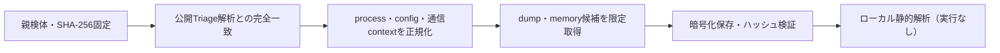

# Triage公開解析・後段取得証跡

## 完全ハッシュ一致

- [260923-12wkpsvw3p](https://tria.ge/260923-12wkpsvw3p): ファミリー候補 `未確定`、評価score `8`

## プロセス・通信

- 観測process: `7za.exe, ACPipelogServer.exe, DCFAFilter.sys, DCProcessMonitor.exe, DrvInst.exe, MsiExec.exe, NotifDriver_W10x64.sys, Privilager.exe, VerifyTrustedFiles.exe, WmiApSrv.exe, cmd.exe, dcagentregister.exe, dcagentservice.exe, dcagenttrayicon.exe, dcconfig.exe, dcinventory.exe, dcondemand.exe, dcprocmon.exe, dcstatusutil.exe, dcswmeter.exe, dcusb64.exe, dcusbsummary.exe, devctrlaction64.exe, driversetup64.exe, meaap.exe, meaaphelper.exe, msiexec.exe, rundll32.exe, systeminfo.exe, tar.exe, uesAgentService.exe, uesDevCtrlSummary.exe, uesFaUser.exe`
- raw commandは保存せず、command SHA-256と処理patternだけをJSONへ保持します。
- sandbox background trafficは`context_only`であり、C2へ自動昇格しません。

- 取得できませんでした。

## 後段取得物

- `ab24d40a1452c25beb12c831dc3083a5aefc3203467d070f81aef5819729d760` / `memory_image` / 10108928 bytes / 親と同一: `false` / 静的解析: `partial`

## 判定境界

Triage由来のfamily、process、config、通信は外部sandbox証跡です。Config extractorが返したendpointはC2候補として扱いますが、静的設定復元またはprocess帰属とprotocol応答が揃うまでは確認済みC2とはしません。取得成果物と検体は実行していません。
