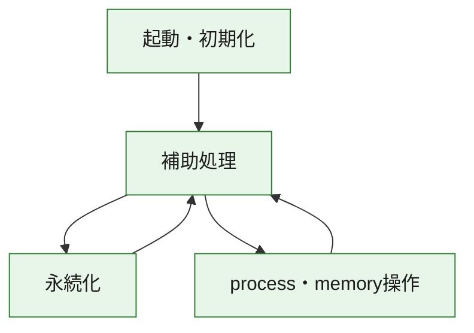
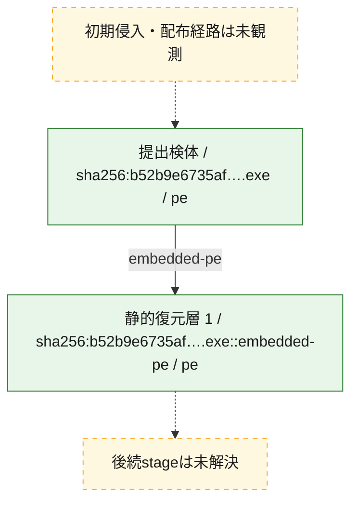
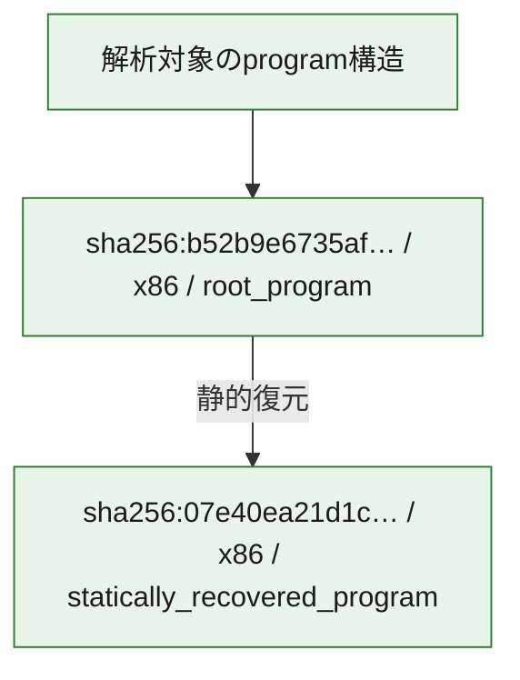

# 全体ロジック：b52b9e6735af28a3b67a6ff48622a02ddcfeb1d43ea4254198bd1448fc149db6

代表関数の静的証跡から、起動・初期化、永続化、process・memory操作の処理群を確認しました。

## 読み方

- phaseの掲載順は解析上の整理順です。observed_call_edgesがない段階間の実行順を断定しません。
- 図の実線は静的に観測した関係、点線と黄色のノードは未観測・未解決の関係を示します。
- 図は静的な要約であり、動的実行を再現するものではありません。
- 詳細な関数解説とfingerprintは[STATIC-LOGIC.md](STATIC-LOGIC.md)を参照してください。

## 静的可視化

### 実行フロー

### 感染チェーン

### モジュール関係

## 処理段階

### 1. 起動・初期化

entry pointから初期化と後続処理への移行を確認します。
確度: `confirmed_static_function_evidence`

- `07e40ea21d1ce0f8d50c60a09db59c5790ddb0dbb5be93b7c3baa5b434897c26:ghidra:180005c8c` — 初期化と主要処理への分岐を行う入口関数です。 状態: `succeeded`、選定理由: `entry_point`, `meaningful_symbol_name`, `reviewed_call_centrality:5`, `role:entrypoint`
- `b52b9e6735af28a3b67a6ff48622a02ddcfeb1d43ea4254198bd1448fc149db6:ghidra:14000247c` — 初期化と主要処理への分岐を行う入口関数です。 状態: `succeeded`、選定理由: `entry_point`, `meaningful_symbol_name`, `reviewed_call_centrality:22`, `role:entrypoint`

### 2. 永続化

自動起動や永続化に関係する設定変更を確認します。
確度: `confirmed_static_function_evidence`

- `b52b9e6735af28a3b67a6ff48622a02ddcfeb1d43ea4254198bd1448fc149db6:ghidra:140001918` — 自動起動または永続化に関係する処理を含む関数です。 状態: `succeeded`、選定理由: `context_representative`, `reviewed_call_centrality:28`, `role:persistence`

### 3. process・memory操作

process、thread、module、memory操作と実行移行を確認します。
確度: `confirmed_static_function_evidence`

- `b52b9e6735af28a3b67a6ff48622a02ddcfeb1d43ea4254198bd1448fc149db6:ghidra:140001768` — process、thread、module、またはmemory操作に関係する関数です。 状態: `succeeded`、選定理由: `context_representative`, `reviewed_call_centrality:24`, `role:process_or_memory_operation`

### 4. 補助処理

主要処理を支える一般内部関数またはlibrary処理を確認します。
確度: `confirmed_static_function_evidence_with_limits`

- `07e40ea21d1ce0f8d50c60a09db59c5790ddb0dbb5be93b7c3baa5b434897c26:ghidra:180001000` — 検体内部の一般処理を実装する関数です。 状態: `succeeded`、選定理由: `context_representative`, `reviewed_call_centrality:2`
- `07e40ea21d1ce0f8d50c60a09db59c5790ddb0dbb5be93b7c3baa5b434897c26:ghidra:180001040` — 検体内部の一般処理を実装する関数です。 状態: `succeeded`、選定理由: `context_representative`, `reviewed_call_centrality:2`
- `07e40ea21d1ce0f8d50c60a09db59c5790ddb0dbb5be93b7c3baa5b434897c26:ghidra:180001080` — 検体内部の一般処理を実装する関数です。 状態: `succeeded`、選定理由: `context_representative`, `reviewed_call_centrality:2`
- `07e40ea21d1ce0f8d50c60a09db59c5790ddb0dbb5be93b7c3baa5b434897c26:ghidra:1800010d0` — 検体内部の一般処理を実装する関数です。 状態: `succeeded`、選定理由: `context_representative`, `reviewed_call_centrality:2`
- `07e40ea21d1ce0f8d50c60a09db59c5790ddb0dbb5be93b7c3baa5b434897c26:ghidra:180001140` — 検体内部の一般処理を実装する関数です。 状態: `succeeded`、選定理由: `context_representative`, `reviewed_call_centrality:9`
- `07e40ea21d1ce0f8d50c60a09db59c5790ddb0dbb5be93b7c3baa5b434897c26:ghidra:180001180` — 検体内部の一般処理を実装する関数です。 状態: `succeeded`、選定理由: `context_representative`, `reviewed_call_centrality:6`
- `07e40ea21d1ce0f8d50c60a09db59c5790ddb0dbb5be93b7c3baa5b434897c26:ghidra:180001210` — 検体内部の一般処理を実装する関数です。 状態: `succeeded`、選定理由: `context_representative`, `reviewed_call_centrality:10`
- `07e40ea21d1ce0f8d50c60a09db59c5790ddb0dbb5be93b7c3baa5b434897c26:ghidra:1800013f0` — 検体内部の一般処理を実装する関数です。 状態: `succeeded`、選定理由: `context_representative`, `reviewed_call_centrality:3`
- `07e40ea21d1ce0f8d50c60a09db59c5790ddb0dbb5be93b7c3baa5b434897c26:ghidra:1800014b0` — 検体内部の一般処理を実装する関数です。 状態: `succeeded`、選定理由: `context_representative`, `reviewed_call_centrality:8`
- `07e40ea21d1ce0f8d50c60a09db59c5790ddb0dbb5be93b7c3baa5b434897c26:ghidra:180001630` — 検体内部の一般処理を実装する関数です。 状態: `succeeded`、選定理由: `context_representative`, `reviewed_call_centrality:9`
- `07e40ea21d1ce0f8d50c60a09db59c5790ddb0dbb5be93b7c3baa5b434897c26:ghidra:1800017b0` — 検体内部の一般処理を実装する関数です。 状態: `succeeded`、選定理由: `context_representative`, `reviewed_call_centrality:2`
- `07e40ea21d1ce0f8d50c60a09db59c5790ddb0dbb5be93b7c3baa5b434897c26:ghidra:180001830` — 検体内部の一般処理を実装する関数です。 状態: `succeeded`、選定理由: `context_representative`, `reviewed_call_centrality:7`
- `07e40ea21d1ce0f8d50c60a09db59c5790ddb0dbb5be93b7c3baa5b434897c26:ghidra:180001960` — 検体内部の一般処理を実装する関数です。 状態: `succeeded`、選定理由: `context_representative`, `reviewed_call_centrality:5`
- `07e40ea21d1ce0f8d50c60a09db59c5790ddb0dbb5be93b7c3baa5b434897c26:ghidra:180001a30` — 検体内部の一般処理を実装する関数です。 状態: `succeeded`、選定理由: `context_representative`, `reviewed_call_centrality:1`
- `07e40ea21d1ce0f8d50c60a09db59c5790ddb0dbb5be93b7c3baa5b434897c26:ghidra:180001a70` — 検体内部の一般処理を実装する関数です。 状態: `succeeded`、選定理由: `context_representative`, `reviewed_call_centrality:1`
- `07e40ea21d1ce0f8d50c60a09db59c5790ddb0dbb5be93b7c3baa5b434897c26:ghidra:180001ae0` — 検体内部の一般処理を実装する関数です。 状態: `succeeded`、選定理由: `context_representative`, `reviewed_call_centrality:1`
- `07e40ea21d1ce0f8d50c60a09db59c5790ddb0dbb5be93b7c3baa5b434897c26:ghidra:180001b40` — 検体内部の一般処理を実装する関数です。 状態: `succeeded`、選定理由: `context_representative`, `reviewed_call_centrality:3`
- `07e40ea21d1ce0f8d50c60a09db59c5790ddb0dbb5be93b7c3baa5b434897c26:ghidra:180001ba0` — 検体内部の一般処理を実装する関数です。 状態: `succeeded`、選定理由: `context_representative`, `reviewed_call_centrality:4`
- `07e40ea21d1ce0f8d50c60a09db59c5790ddb0dbb5be93b7c3baa5b434897c26:ghidra:180001f10` — 検体内部の一般処理を実装する関数です。 状態: `succeeded`、選定理由: `context_representative`, `reviewed_call_centrality:2`
- `07e40ea21d1ce0f8d50c60a09db59c5790ddb0dbb5be93b7c3baa5b434897c26:ghidra:180001f80` — 検体内部の一般処理を実装する関数です。 状態: `succeeded`、選定理由: `context_representative`, `reviewed_call_centrality:1`
- `07e40ea21d1ce0f8d50c60a09db59c5790ddb0dbb5be93b7c3baa5b434897c26:ghidra:180002200` — 検体内部の一般処理を実装する関数です。 状態: `succeeded`、選定理由: `context_representative`, `reviewed_call_centrality:5`
- `07e40ea21d1ce0f8d50c60a09db59c5790ddb0dbb5be93b7c3baa5b434897c26:ghidra:180002220` — 検体内部の一般処理を実装する関数です。 状態: `succeeded`、選定理由: `context_representative`, `reviewed_call_centrality:3`
- `07e40ea21d1ce0f8d50c60a09db59c5790ddb0dbb5be93b7c3baa5b434897c26:ghidra:180002240` — 検体内部の一般処理を実装する関数です。 状態: `succeeded`、選定理由: `context_representative`, `reviewed_call_centrality:5`
- `07e40ea21d1ce0f8d50c60a09db59c5790ddb0dbb5be93b7c3baa5b434897c26:ghidra:180002260` — 検体内部の一般処理を実装する関数です。 状態: `succeeded`、選定理由: `context_representative`, `reviewed_call_centrality:3`
- `07e40ea21d1ce0f8d50c60a09db59c5790ddb0dbb5be93b7c3baa5b434897c26:ghidra:180002280` — 検体内部の一般処理を実装する関数です。 状態: `succeeded`、選定理由: `context_representative`, `reviewed_call_centrality:2`
- `07e40ea21d1ce0f8d50c60a09db59c5790ddb0dbb5be93b7c3baa5b434897c26:ghidra:1800022a0` — 検体内部の一般処理を実装する関数です。 状態: `succeeded`、選定理由: `context_representative`, `reviewed_call_centrality:2`
- `07e40ea21d1ce0f8d50c60a09db59c5790ddb0dbb5be93b7c3baa5b434897c26:ghidra:180002330` — 検体内部の一般処理を実装する関数です。 状態: `succeeded`、選定理由: `context_representative`, `reviewed_call_centrality:8`
- `07e40ea21d1ce0f8d50c60a09db59c5790ddb0dbb5be93b7c3baa5b434897c26:ghidra:180002490` — 検体内部の一般処理を実装する関数です。 状態: `succeeded`、選定理由: `context_representative`, `reviewed_call_centrality:45`
- `07e40ea21d1ce0f8d50c60a09db59c5790ddb0dbb5be93b7c3baa5b434897c26:ghidra:180002b00` — 検体内部の一般処理を実装する関数です。 状態: `succeeded`、選定理由: `context_representative`, `reviewed_call_centrality:10`
- `07e40ea21d1ce0f8d50c60a09db59c5790ddb0dbb5be93b7c3baa5b434897c26:ghidra:180002b60` — 検体内部の一般処理を実装する関数です。 状態: `succeeded`、選定理由: `context_representative`, `reviewed_call_centrality:1`
- `07e40ea21d1ce0f8d50c60a09db59c5790ddb0dbb5be93b7c3baa5b434897c26:ghidra:180004c90` — 検体内部の一般処理を実装する関数です。 状態: `succeeded`、選定理由: `entry_point`, `meaningful_symbol_name`, `reviewed_call_centrality:1`
- `b52b9e6735af28a3b67a6ff48622a02ddcfeb1d43ea4254198bd1448fc149db6:ghidra:140001000` — 検体内部の一般処理を実装する関数です。 状態: `succeeded`、選定理由: `context_representative`, `reviewed_call_centrality:7`
- `b52b9e6735af28a3b67a6ff48622a02ddcfeb1d43ea4254198bd1448fc149db6:ghidra:14000103c` — 検体内部の一般処理を実装する関数です。 状態: `succeeded`、選定理由: `context_representative`, `reviewed_call_centrality:9`
- `b52b9e6735af28a3b67a6ff48622a02ddcfeb1d43ea4254198bd1448fc149db6:ghidra:14000117c` — 検体内部の一般処理を実装する関数です。 状態: `succeeded`、選定理由: `context_representative`, `reviewed_call_centrality:9`
- `b52b9e6735af28a3b67a6ff48622a02ddcfeb1d43ea4254198bd1448fc149db6:ghidra:140001300` — 検体内部の一般処理を実装する関数です。 状態: `succeeded`、選定理由: `context_representative`, `reviewed_call_centrality:6`
- `b52b9e6735af28a3b67a6ff48622a02ddcfeb1d43ea4254198bd1448fc149db6:ghidra:14000140c` — 検体内部の一般処理を実装する関数です。 状態: `succeeded`、選定理由: `context_representative`, `reviewed_call_centrality:1`
- `b52b9e6735af28a3b67a6ff48622a02ddcfeb1d43ea4254198bd1448fc149db6:ghidra:140001448` — 検体内部の一般処理を実装する関数です。 状態: `succeeded`、選定理由: `context_representative`, `reviewed_call_centrality:1`
- `b52b9e6735af28a3b67a6ff48622a02ddcfeb1d43ea4254198bd1448fc149db6:ghidra:1400014a4` — 検体内部の一般処理を実装する関数です。 状態: `succeeded`、選定理由: `context_representative`, `reviewed_call_centrality:1`
- `b52b9e6735af28a3b67a6ff48622a02ddcfeb1d43ea4254198bd1448fc149db6:ghidra:1400014ec` — 検体内部の一般処理を実装する関数です。 状態: `succeeded`、選定理由: `context_representative`, `reviewed_call_centrality:2`
- `b52b9e6735af28a3b67a6ff48622a02ddcfeb1d43ea4254198bd1448fc149db6:ghidra:140001530` — 検体内部の一般処理を実装する関数です。 状態: `succeeded`、選定理由: `context_representative`, `reviewed_call_centrality:12`
- `b52b9e6735af28a3b67a6ff48622a02ddcfeb1d43ea4254198bd1448fc149db6:ghidra:1400016f8` — 検体内部の一般処理を実装する関数です。 状態: `succeeded`、選定理由: `context_representative`, `reviewed_call_centrality:6`
- `b52b9e6735af28a3b67a6ff48622a02ddcfeb1d43ea4254198bd1448fc149db6:ghidra:140001c2c` — 検体内部の一般処理を実装する関数です。 状態: `succeeded`、選定理由: `context_representative`, `reviewed_call_centrality:7`
- `b52b9e6735af28a3b67a6ff48622a02ddcfeb1d43ea4254198bd1448fc149db6:ghidra:140001c4c` — 検体内部の一般処理を実装する関数です。 状態: `succeeded`、選定理由: `context_representative`, `reviewed_call_centrality:5`
- `b52b9e6735af28a3b67a6ff48622a02ddcfeb1d43ea4254198bd1448fc149db6:ghidra:140001cb0` — 検体内部の一般処理を実装する関数です。 状態: `succeeded`、選定理由: `context_representative`, `reviewed_call_centrality:5`
- `b52b9e6735af28a3b67a6ff48622a02ddcfeb1d43ea4254198bd1448fc149db6:ghidra:140001cc4` — 検体内部の一般処理を実装する関数です。 状態: `succeeded`、選定理由: `context_representative`, `reviewed_call_centrality:4`
- `b52b9e6735af28a3b67a6ff48622a02ddcfeb1d43ea4254198bd1448fc149db6:ghidra:140001d40` — 検体内部の一般処理を実装する関数です。 状態: `succeeded`、選定理由: `context_representative`, `reviewed_call_centrality:4`
- `b52b9e6735af28a3b67a6ff48622a02ddcfeb1d43ea4254198bd1448fc149db6:ghidra:140001dc0` — 検体内部の一般処理を実装する関数です。 状態: `succeeded`、選定理由: `context_representative`, `reviewed_call_centrality:13`
- `b52b9e6735af28a3b67a6ff48622a02ddcfeb1d43ea4254198bd1448fc149db6:ghidra:140001e64` — 検体内部の一般処理を実装する関数です。 状態: `succeeded`、選定理由: `context_representative`, `reviewed_call_centrality:2`
- `b52b9e6735af28a3b67a6ff48622a02ddcfeb1d43ea4254198bd1448fc149db6:ghidra:140001f3c` — 検体内部の一般処理を実装する関数です。 状態: `failed_empty`、選定理由: `context_representative`, `reviewed_call_centrality:1`
- `b52b9e6735af28a3b67a6ff48622a02ddcfeb1d43ea4254198bd1448fc149db6:ghidra:140002034` — 検体内部の一般処理を実装する関数です。 状態: `failed_empty`、選定理由: `context_representative`, `reviewed_call_centrality:1`
- `b52b9e6735af28a3b67a6ff48622a02ddcfeb1d43ea4254198bd1448fc149db6:ghidra:1400020d0` — 検体内部の一般処理を実装する関数です。 状態: `failed_empty`、選定理由: `context_representative`
- `b52b9e6735af28a3b67a6ff48622a02ddcfeb1d43ea4254198bd1448fc149db6:ghidra:14000210c` — 検体内部の一般処理を実装する関数です。 状態: `failed_empty`、選定理由: `context_representative`
- `b52b9e6735af28a3b67a6ff48622a02ddcfeb1d43ea4254198bd1448fc149db6:ghidra:140002154` — 検体内部の一般処理を実装する関数です。 状態: `failed_empty`、選定理由: `context_representative`
- `b52b9e6735af28a3b67a6ff48622a02ddcfeb1d43ea4254198bd1448fc149db6:ghidra:140002190` — 検体内部の一般処理を実装する関数です。 状態: `failed_empty`、選定理由: `context_representative`, `reviewed_call_centrality:1`
- `b52b9e6735af28a3b67a6ff48622a02ddcfeb1d43ea4254198bd1448fc149db6:ghidra:1400021b4` — 検体内部の一般処理を実装する関数です。 状態: `failed_empty`、選定理由: `context_representative`, `reviewed_call_centrality:4`
- `b52b9e6735af28a3b67a6ff48622a02ddcfeb1d43ea4254198bd1448fc149db6:ghidra:1400021f8` — 検体内部の一般処理を実装する関数です。 状態: `failed_empty`、選定理由: `context_representative`
- `b52b9e6735af28a3b67a6ff48622a02ddcfeb1d43ea4254198bd1448fc149db6:ghidra:140002224` — 検体内部の一般処理を実装する関数です。 状態: `failed_empty`、選定理由: `context_representative`
- `b52b9e6735af28a3b67a6ff48622a02ddcfeb1d43ea4254198bd1448fc149db6:ghidra:1400022dc` — 検体内部の一般処理を実装する関数です。 状態: `failed_empty`、選定理由: `context_representative`
- `b52b9e6735af28a3b67a6ff48622a02ddcfeb1d43ea4254198bd1448fc149db6:ghidra:1400022ec` — 検体内部の一般処理を実装する関数です。 状態: `failed_empty`、選定理由: `context_representative`
- `b52b9e6735af28a3b67a6ff48622a02ddcfeb1d43ea4254198bd1448fc149db6:ghidra:140002308` — 検体内部の一般処理を実装する関数です。 状態: `failed_empty`、選定理由: `context_representative`

## 観測したcall関係

- `07e40ea21d1ce0f8d50c60a09db59c5790ddb0dbb5be93b7c3baa5b434897c26:ghidra:180001140` → `07e40ea21d1ce0f8d50c60a09db59c5790ddb0dbb5be93b7c3baa5b434897c26:ghidra:180002200` （`support` → `support`）
- `07e40ea21d1ce0f8d50c60a09db59c5790ddb0dbb5be93b7c3baa5b434897c26:ghidra:180001210` → `07e40ea21d1ce0f8d50c60a09db59c5790ddb0dbb5be93b7c3baa5b434897c26:ghidra:180001140` （`support` → `support`）
- `07e40ea21d1ce0f8d50c60a09db59c5790ddb0dbb5be93b7c3baa5b434897c26:ghidra:180001210` → `07e40ea21d1ce0f8d50c60a09db59c5790ddb0dbb5be93b7c3baa5b434897c26:ghidra:180001180` （`support` → `support`）
- `07e40ea21d1ce0f8d50c60a09db59c5790ddb0dbb5be93b7c3baa5b434897c26:ghidra:180001210` → `07e40ea21d1ce0f8d50c60a09db59c5790ddb0dbb5be93b7c3baa5b434897c26:ghidra:1800017b0` （`support` → `support`）
- `07e40ea21d1ce0f8d50c60a09db59c5790ddb0dbb5be93b7c3baa5b434897c26:ghidra:180001210` → `07e40ea21d1ce0f8d50c60a09db59c5790ddb0dbb5be93b7c3baa5b434897c26:ghidra:180001960` （`support` → `support`）
- `07e40ea21d1ce0f8d50c60a09db59c5790ddb0dbb5be93b7c3baa5b434897c26:ghidra:180001210` → `07e40ea21d1ce0f8d50c60a09db59c5790ddb0dbb5be93b7c3baa5b434897c26:ghidra:180002200` （`support` → `support`）
- `07e40ea21d1ce0f8d50c60a09db59c5790ddb0dbb5be93b7c3baa5b434897c26:ghidra:180001210` → `07e40ea21d1ce0f8d50c60a09db59c5790ddb0dbb5be93b7c3baa5b434897c26:ghidra:180002260` （`support` → `support`）
- `07e40ea21d1ce0f8d50c60a09db59c5790ddb0dbb5be93b7c3baa5b434897c26:ghidra:1800014b0` → `07e40ea21d1ce0f8d50c60a09db59c5790ddb0dbb5be93b7c3baa5b434897c26:ghidra:180001140` （`support` → `support`）
- `07e40ea21d1ce0f8d50c60a09db59c5790ddb0dbb5be93b7c3baa5b434897c26:ghidra:1800014b0` → `07e40ea21d1ce0f8d50c60a09db59c5790ddb0dbb5be93b7c3baa5b434897c26:ghidra:180002240` （`support` → `support`）
- `07e40ea21d1ce0f8d50c60a09db59c5790ddb0dbb5be93b7c3baa5b434897c26:ghidra:180001630` → `07e40ea21d1ce0f8d50c60a09db59c5790ddb0dbb5be93b7c3baa5b434897c26:ghidra:180001140` （`support` → `support`）
- `07e40ea21d1ce0f8d50c60a09db59c5790ddb0dbb5be93b7c3baa5b434897c26:ghidra:180001630` → `07e40ea21d1ce0f8d50c60a09db59c5790ddb0dbb5be93b7c3baa5b434897c26:ghidra:180002240` （`support` → `support`）
- `07e40ea21d1ce0f8d50c60a09db59c5790ddb0dbb5be93b7c3baa5b434897c26:ghidra:1800017b0` → `07e40ea21d1ce0f8d50c60a09db59c5790ddb0dbb5be93b7c3baa5b434897c26:ghidra:180001180` （`support` → `support`）
- `07e40ea21d1ce0f8d50c60a09db59c5790ddb0dbb5be93b7c3baa5b434897c26:ghidra:180001830` → `07e40ea21d1ce0f8d50c60a09db59c5790ddb0dbb5be93b7c3baa5b434897c26:ghidra:1800010d0` （`support` → `support`）
- `07e40ea21d1ce0f8d50c60a09db59c5790ddb0dbb5be93b7c3baa5b434897c26:ghidra:180001830` → `07e40ea21d1ce0f8d50c60a09db59c5790ddb0dbb5be93b7c3baa5b434897c26:ghidra:180001960` （`support` → `support`）
- `07e40ea21d1ce0f8d50c60a09db59c5790ddb0dbb5be93b7c3baa5b434897c26:ghidra:180001830` → `07e40ea21d1ce0f8d50c60a09db59c5790ddb0dbb5be93b7c3baa5b434897c26:ghidra:180001f80` （`support` → `support`）
- `07e40ea21d1ce0f8d50c60a09db59c5790ddb0dbb5be93b7c3baa5b434897c26:ghidra:180001830` → `07e40ea21d1ce0f8d50c60a09db59c5790ddb0dbb5be93b7c3baa5b434897c26:ghidra:180002220` （`support` → `support`）
- `07e40ea21d1ce0f8d50c60a09db59c5790ddb0dbb5be93b7c3baa5b434897c26:ghidra:180001960` → `07e40ea21d1ce0f8d50c60a09db59c5790ddb0dbb5be93b7c3baa5b434897c26:ghidra:180001140` （`support` → `support`）
- `07e40ea21d1ce0f8d50c60a09db59c5790ddb0dbb5be93b7c3baa5b434897c26:ghidra:180001ba0` → `07e40ea21d1ce0f8d50c60a09db59c5790ddb0dbb5be93b7c3baa5b434897c26:ghidra:180001180` （`support` → `support`）
- `07e40ea21d1ce0f8d50c60a09db59c5790ddb0dbb5be93b7c3baa5b434897c26:ghidra:1800022a0` → `07e40ea21d1ce0f8d50c60a09db59c5790ddb0dbb5be93b7c3baa5b434897c26:ghidra:1800014b0` （`support` → `support`）
- `07e40ea21d1ce0f8d50c60a09db59c5790ddb0dbb5be93b7c3baa5b434897c26:ghidra:180002330` → `07e40ea21d1ce0f8d50c60a09db59c5790ddb0dbb5be93b7c3baa5b434897c26:ghidra:180001140` （`support` → `support`）
- `07e40ea21d1ce0f8d50c60a09db59c5790ddb0dbb5be93b7c3baa5b434897c26:ghidra:180002330` → `07e40ea21d1ce0f8d50c60a09db59c5790ddb0dbb5be93b7c3baa5b434897c26:ghidra:180002240` （`support` → `support`）
- `07e40ea21d1ce0f8d50c60a09db59c5790ddb0dbb5be93b7c3baa5b434897c26:ghidra:180002490` → `07e40ea21d1ce0f8d50c60a09db59c5790ddb0dbb5be93b7c3baa5b434897c26:ghidra:180001080` （`support` → `support`）
- `07e40ea21d1ce0f8d50c60a09db59c5790ddb0dbb5be93b7c3baa5b434897c26:ghidra:180002490` → `07e40ea21d1ce0f8d50c60a09db59c5790ddb0dbb5be93b7c3baa5b434897c26:ghidra:180001630` （`support` → `support`）
- `07e40ea21d1ce0f8d50c60a09db59c5790ddb0dbb5be93b7c3baa5b434897c26:ghidra:180002490` → `07e40ea21d1ce0f8d50c60a09db59c5790ddb0dbb5be93b7c3baa5b434897c26:ghidra:180002330` （`support` → `support`）
- `07e40ea21d1ce0f8d50c60a09db59c5790ddb0dbb5be93b7c3baa5b434897c26:ghidra:180002b00` → `07e40ea21d1ce0f8d50c60a09db59c5790ddb0dbb5be93b7c3baa5b434897c26:ghidra:180002490` （`support` → `support`）
- `b52b9e6735af28a3b67a6ff48622a02ddcfeb1d43ea4254198bd1448fc149db6:ghidra:140001000` → `b52b9e6735af28a3b67a6ff48622a02ddcfeb1d43ea4254198bd1448fc149db6:ghidra:140001c2c` （`support` → `support`）
- `b52b9e6735af28a3b67a6ff48622a02ddcfeb1d43ea4254198bd1448fc149db6:ghidra:140001000` → `b52b9e6735af28a3b67a6ff48622a02ddcfeb1d43ea4254198bd1448fc149db6:ghidra:1400021b4` （`support` → `support`）
- `b52b9e6735af28a3b67a6ff48622a02ddcfeb1d43ea4254198bd1448fc149db6:ghidra:14000103c` → `b52b9e6735af28a3b67a6ff48622a02ddcfeb1d43ea4254198bd1448fc149db6:ghidra:140001000` （`support` → `support`）
- `b52b9e6735af28a3b67a6ff48622a02ddcfeb1d43ea4254198bd1448fc149db6:ghidra:14000103c` → `b52b9e6735af28a3b67a6ff48622a02ddcfeb1d43ea4254198bd1448fc149db6:ghidra:140001c2c` （`support` → `support`）
- `b52b9e6735af28a3b67a6ff48622a02ddcfeb1d43ea4254198bd1448fc149db6:ghidra:14000103c` → `b52b9e6735af28a3b67a6ff48622a02ddcfeb1d43ea4254198bd1448fc149db6:ghidra:140001cb0` （`support` → `support`）
- `b52b9e6735af28a3b67a6ff48622a02ddcfeb1d43ea4254198bd1448fc149db6:ghidra:14000103c` → `b52b9e6735af28a3b67a6ff48622a02ddcfeb1d43ea4254198bd1448fc149db6:ghidra:1400021b4` （`support` → `support`）
- `b52b9e6735af28a3b67a6ff48622a02ddcfeb1d43ea4254198bd1448fc149db6:ghidra:14000117c` → `b52b9e6735af28a3b67a6ff48622a02ddcfeb1d43ea4254198bd1448fc149db6:ghidra:140001000` （`support` → `support`）
- `b52b9e6735af28a3b67a6ff48622a02ddcfeb1d43ea4254198bd1448fc149db6:ghidra:14000117c` → `b52b9e6735af28a3b67a6ff48622a02ddcfeb1d43ea4254198bd1448fc149db6:ghidra:140001c2c` （`support` → `support`）
- `b52b9e6735af28a3b67a6ff48622a02ddcfeb1d43ea4254198bd1448fc149db6:ghidra:14000117c` → `b52b9e6735af28a3b67a6ff48622a02ddcfeb1d43ea4254198bd1448fc149db6:ghidra:140001cb0` （`support` → `support`）
- `b52b9e6735af28a3b67a6ff48622a02ddcfeb1d43ea4254198bd1448fc149db6:ghidra:14000117c` → `b52b9e6735af28a3b67a6ff48622a02ddcfeb1d43ea4254198bd1448fc149db6:ghidra:1400021b4` （`support` → `support`）
- `b52b9e6735af28a3b67a6ff48622a02ddcfeb1d43ea4254198bd1448fc149db6:ghidra:140001300` → `b52b9e6735af28a3b67a6ff48622a02ddcfeb1d43ea4254198bd1448fc149db6:ghidra:140001000` （`support` → `support`）
- `b52b9e6735af28a3b67a6ff48622a02ddcfeb1d43ea4254198bd1448fc149db6:ghidra:140001300` → `b52b9e6735af28a3b67a6ff48622a02ddcfeb1d43ea4254198bd1448fc149db6:ghidra:140001c2c` （`support` → `support`）
- `b52b9e6735af28a3b67a6ff48622a02ddcfeb1d43ea4254198bd1448fc149db6:ghidra:140001300` → `b52b9e6735af28a3b67a6ff48622a02ddcfeb1d43ea4254198bd1448fc149db6:ghidra:1400021b4` （`support` → `support`）
- `b52b9e6735af28a3b67a6ff48622a02ddcfeb1d43ea4254198bd1448fc149db6:ghidra:140001530` → `b52b9e6735af28a3b67a6ff48622a02ddcfeb1d43ea4254198bd1448fc149db6:ghidra:140001cc4` （`support` → `support`）
- `b52b9e6735af28a3b67a6ff48622a02ddcfeb1d43ea4254198bd1448fc149db6:ghidra:140001530` → `b52b9e6735af28a3b67a6ff48622a02ddcfeb1d43ea4254198bd1448fc149db6:ghidra:140001d40` （`support` → `support`）
- `b52b9e6735af28a3b67a6ff48622a02ddcfeb1d43ea4254198bd1448fc149db6:ghidra:1400016f8` → `b52b9e6735af28a3b67a6ff48622a02ddcfeb1d43ea4254198bd1448fc149db6:ghidra:140001d40` （`support` → `support`）
- `b52b9e6735af28a3b67a6ff48622a02ddcfeb1d43ea4254198bd1448fc149db6:ghidra:140001768` → `b52b9e6735af28a3b67a6ff48622a02ddcfeb1d43ea4254198bd1448fc149db6:ghidra:140001f3c` （`execution` → `support`）
- `b52b9e6735af28a3b67a6ff48622a02ddcfeb1d43ea4254198bd1448fc149db6:ghidra:140001918` → `b52b9e6735af28a3b67a6ff48622a02ddcfeb1d43ea4254198bd1448fc149db6:ghidra:140001300` （`persistence` → `support`）
- `b52b9e6735af28a3b67a6ff48622a02ddcfeb1d43ea4254198bd1448fc149db6:ghidra:140001918` → `b52b9e6735af28a3b67a6ff48622a02ddcfeb1d43ea4254198bd1448fc149db6:ghidra:140001530` （`persistence` → `support`）
- `b52b9e6735af28a3b67a6ff48622a02ddcfeb1d43ea4254198bd1448fc149db6:ghidra:140001918` → `b52b9e6735af28a3b67a6ff48622a02ddcfeb1d43ea4254198bd1448fc149db6:ghidra:1400016f8` （`persistence` → `support`）
- `b52b9e6735af28a3b67a6ff48622a02ddcfeb1d43ea4254198bd1448fc149db6:ghidra:140001918` → `b52b9e6735af28a3b67a6ff48622a02ddcfeb1d43ea4254198bd1448fc149db6:ghidra:140001c4c` （`persistence` → `support`）
- `b52b9e6735af28a3b67a6ff48622a02ddcfeb1d43ea4254198bd1448fc149db6:ghidra:140001918` → `b52b9e6735af28a3b67a6ff48622a02ddcfeb1d43ea4254198bd1448fc149db6:ghidra:140001cb0` （`persistence` → `support`）
- `b52b9e6735af28a3b67a6ff48622a02ddcfeb1d43ea4254198bd1448fc149db6:ghidra:140001918` → `b52b9e6735af28a3b67a6ff48622a02ddcfeb1d43ea4254198bd1448fc149db6:ghidra:140001cc4` （`persistence` → `support`）
- `b52b9e6735af28a3b67a6ff48622a02ddcfeb1d43ea4254198bd1448fc149db6:ghidra:140001cb0` → `b52b9e6735af28a3b67a6ff48622a02ddcfeb1d43ea4254198bd1448fc149db6:ghidra:140002190` （`support` → `support`）
- `b52b9e6735af28a3b67a6ff48622a02ddcfeb1d43ea4254198bd1448fc149db6:ghidra:140001cc4` → `b52b9e6735af28a3b67a6ff48622a02ddcfeb1d43ea4254198bd1448fc149db6:ghidra:14000117c` （`support` → `support`）
- `b52b9e6735af28a3b67a6ff48622a02ddcfeb1d43ea4254198bd1448fc149db6:ghidra:140001d40` → `b52b9e6735af28a3b67a6ff48622a02ddcfeb1d43ea4254198bd1448fc149db6:ghidra:14000103c` （`support` → `support`）
- `b52b9e6735af28a3b67a6ff48622a02ddcfeb1d43ea4254198bd1448fc149db6:ghidra:140001dc0` → `b52b9e6735af28a3b67a6ff48622a02ddcfeb1d43ea4254198bd1448fc149db6:ghidra:140001530` （`support` → `support`）
- `b52b9e6735af28a3b67a6ff48622a02ddcfeb1d43ea4254198bd1448fc149db6:ghidra:140001dc0` → `b52b9e6735af28a3b67a6ff48622a02ddcfeb1d43ea4254198bd1448fc149db6:ghidra:1400016f8` （`support` → `support`）
- `b52b9e6735af28a3b67a6ff48622a02ddcfeb1d43ea4254198bd1448fc149db6:ghidra:140001dc0` → `b52b9e6735af28a3b67a6ff48622a02ddcfeb1d43ea4254198bd1448fc149db6:ghidra:140001768` （`support` → `execution`）
- `b52b9e6735af28a3b67a6ff48622a02ddcfeb1d43ea4254198bd1448fc149db6:ghidra:140001dc0` → `b52b9e6735af28a3b67a6ff48622a02ddcfeb1d43ea4254198bd1448fc149db6:ghidra:140001918` （`support` → `persistence`）
- `b52b9e6735af28a3b67a6ff48622a02ddcfeb1d43ea4254198bd1448fc149db6:ghidra:140001dc0` → `b52b9e6735af28a3b67a6ff48622a02ddcfeb1d43ea4254198bd1448fc149db6:ghidra:140001c4c` （`support` → `support`）
- `b52b9e6735af28a3b67a6ff48622a02ddcfeb1d43ea4254198bd1448fc149db6:ghidra:140001e64` → `b52b9e6735af28a3b67a6ff48622a02ddcfeb1d43ea4254198bd1448fc149db6:ghidra:140002034` （`support` → `support`）
- `b52b9e6735af28a3b67a6ff48622a02ddcfeb1d43ea4254198bd1448fc149db6:ghidra:14000247c` → `b52b9e6735af28a3b67a6ff48622a02ddcfeb1d43ea4254198bd1448fc149db6:ghidra:140001dc0` （`startup` → `support`）
- `ghidra-function:04fcd1b3cb208f6e40eb16ff` → `ghidra-external:0a1befa9c6a9b9dee6fe5e8b` （`unclassified` → `unclassified`）
- `ghidra-function:04fcd1b3cb208f6e40eb16ff` → `ghidra-external:cfac05d6ff627e118ead26b0` （`unclassified` → `unclassified`）
- `ghidra-function:04fcd1b3cb208f6e40eb16ff` → `ghidra-function:1a157bc16bce30492e347b04` （`unclassified` → `unclassified`）
- `ghidra-function:0c1f54e396a58465379a9be9` → `ghidra-function:2d89a14bb453e8f54716b5c2` （`unclassified` → `unclassified`）
- `ghidra-function:0c1f54e396a58465379a9be9` → `ghidra-function:5c00534d53253c4e803b41fb` （`unclassified` → `unclassified`）
- `ghidra-function:0c1f54e396a58465379a9be9` → `ghidra-function:d1c8c489c4d971468358f4ec` （`unclassified` → `unclassified`）
- `ghidra-function:0c1f54e396a58465379a9be9` → `ghidra-function:d6e71e2b66a291a54da18853` （`unclassified` → `unclassified`）
- `ghidra-function:0c1f54e396a58465379a9be9` → `ghidra-function:e3f06c7ab5c2324b664f07b8` （`unclassified` → `unclassified`）
- `ghidra-function:0c1f54e396a58465379a9be9` → `ghidra-function:fe8890ea96765ba088a5e6ee` （`unclassified` → `unclassified`）
- `ghidra-function:0ce04695ea446a3135b89e23` → `ghidra-external:e312f07d235ece806c348c6f` （`unclassified` → `unclassified`）
- `ghidra-function:0ce04695ea446a3135b89e23` → `ghidra-function:901d36c02b0726b62fe5068f` （`unclassified` → `unclassified`）
- `ghidra-function:0ce04695ea446a3135b89e23` → `ghidra-function:c558a31e125e1840af5989eb` （`unclassified` → `unclassified`）
- `ghidra-function:0ce04695ea446a3135b89e23` → `ghidra-function:ca5342f47f23e3545210ccc8` （`unclassified` → `unclassified`）
- `ghidra-function:0e0a84deee17ecb6a958f8c5` → `ghidra-function:28bd7e9e2328f0c17a7b123b` （`unclassified` → `unclassified`）
- `ghidra-function:0e0a84deee17ecb6a958f8c5` → `ghidra-function:acac35685dc149977b764256` （`unclassified` → `unclassified`）
- `ghidra-function:0e0a84deee17ecb6a958f8c5` → `ghidra-function:d1846e1fb41464203ecd6057` （`unclassified` → `unclassified`）
- `ghidra-function:123a8204635ab18dd501a848` → `ghidra-external:3b31d2341ab537aa211db0b5` （`unclassified` → `unclassified`）
- `ghidra-function:123a8204635ab18dd501a848` → `ghidra-external:45e5fb8e0beebb104a722b9f` （`unclassified` → `unclassified`）
- `ghidra-function:123a8204635ab18dd501a848` → `ghidra-external:5bf4c34494cb89de693c88bb` （`unclassified` → `unclassified`）
- `ghidra-function:123a8204635ab18dd501a848` → `ghidra-external:753700cf0ca4a073ddae406a` （`unclassified` → `unclassified`）
- `ghidra-function:123a8204635ab18dd501a848` → `ghidra-external:8232b40f4560a8740ef15105` （`unclassified` → `unclassified`）
- `ghidra-function:123a8204635ab18dd501a848` → `ghidra-external:aa99baee7b85c773c8103ea9` （`unclassified` → `unclassified`）
- `ghidra-function:123a8204635ab18dd501a848` → `ghidra-external:e312f07d235ece806c348c6f` （`unclassified` → `unclassified`）
- `ghidra-function:123a8204635ab18dd501a848` → `ghidra-external:ff2be93d611f9e9b40517e68` （`unclassified` → `unclassified`）
- `ghidra-function:123a8204635ab18dd501a848` → `ghidra-function:1dfb4e0fde3806ab59555e93` （`unclassified` → `unclassified`）
- `ghidra-function:123a8204635ab18dd501a848` → `ghidra-function:2f49072d489cabf3cf3c4e25` （`unclassified` → `unclassified`）
- `ghidra-function:123a8204635ab18dd501a848` → `ghidra-function:40a182f58eb1e815103721a5` （`unclassified` → `unclassified`）
- `ghidra-function:123a8204635ab18dd501a848` → `ghidra-function:5d453fdcdb61725c51498099` （`unclassified` → `unclassified`）
- `ghidra-function:123a8204635ab18dd501a848` → `ghidra-function:64782679840bab15eaeebb13` （`unclassified` → `unclassified`）
- `ghidra-function:123a8204635ab18dd501a848` → `ghidra-function:90adbeb00d47d5ff1331a95d` （`unclassified` → `unclassified`）
- `ghidra-function:123a8204635ab18dd501a848` → `ghidra-function:9512658a7ba8ca969046da9e` （`unclassified` → `unclassified`）
- `ghidra-function:123a8204635ab18dd501a848` → `ghidra-function:ac2423846ffb36faf5a481e5` （`unclassified` → `unclassified`）
- `ghidra-function:123a8204635ab18dd501a848` → `ghidra-function:add7bced7c31076a706302ff` （`unclassified` → `unclassified`）
- `ghidra-function:123a8204635ab18dd501a848` → `ghidra-function:b358e217e36991f8331365d0` （`unclassified` → `unclassified`）
- `ghidra-function:123a8204635ab18dd501a848` → `ghidra-function:d8b887b0e5c055b608d01b36` （`unclassified` → `unclassified`）
- `ghidra-function:123a8204635ab18dd501a848` → `ghidra-function:dc206064c06323e76959fb84` （`unclassified` → `unclassified`）
- `ghidra-function:123a8204635ab18dd501a848` → `ghidra-function:eb779f9f2a7b28d12fcffb64` （`unclassified` → `unclassified`）
- `ghidra-function:123a8204635ab18dd501a848` → `ghidra-function:f6651ba2ba03f3dca67eb415` （`unclassified` → `unclassified`）
- `ghidra-function:12543c9a0e7503f0480a7e45` → `ghidra-function:93705d23ac4a270caa1062b9` （`unclassified` → `unclassified`）
- `ghidra-function:22a8e74bc87fdf48ae7bbc79` → `ghidra-external:cfac05d6ff627e118ead26b0` （`unclassified` → `unclassified`）
- `ghidra-function:22a8e74bc87fdf48ae7bbc79` → `ghidra-function:5498ad8f36089ec49abce27e` （`unclassified` → `unclassified`）
- `ghidra-function:2563dcf81e6be0d2c2320f56` → `ghidra-external:0a1befa9c6a9b9dee6fe5e8b` （`unclassified` → `unclassified`）
- `ghidra-function:2563dcf81e6be0d2c2320f56` → `ghidra-external:cfac05d6ff627e118ead26b0` （`unclassified` → `unclassified`）
- `ghidra-function:2563dcf81e6be0d2c2320f56` → `ghidra-function:1a157bc16bce30492e347b04` （`unclassified` → `unclassified`）
- `ghidra-function:289ddbc858c68852c9b504c0` → `ghidra-external:bec736567b269ae72a8c6bfa` （`unclassified` → `unclassified`）
- `ghidra-function:28bd7e9e2328f0c17a7b123b` → `ghidra-external:cfac05d6ff627e118ead26b0` （`unclassified` → `unclassified`）
- `ghidra-function:28bd7e9e2328f0c17a7b123b` → `ghidra-function:1a157bc16bce30492e347b04` （`unclassified` → `unclassified`）
- `ghidra-function:28bd7e9e2328f0c17a7b123b` → `ghidra-function:d1846e1fb41464203ecd6057` （`unclassified` → `unclassified`）
- `ghidra-function:28bd7e9e2328f0c17a7b123b` → `ghidra-function:dff5dd08bb5fe656f1bcdc78` （`unclassified` → `unclassified`）
- `ghidra-function:32ed89045d5c0d8d9df463bd` → `ghidra-function:bd9b967e20fb4752fce131e8` （`unclassified` → `unclassified`）
- `ghidra-function:32ed89045d5c0d8d9df463bd` → `ghidra-function:f0d7daa11d1b5de360f3fb8a` （`unclassified` → `unclassified`）
- `ghidra-function:3345a86d5f3c709b010841ee` → `ghidra-function:6213ee75fa7a5e248522f0e6` （`unclassified` → `unclassified`）
- `ghidra-function:3345a86d5f3c709b010841ee` → `ghidra-function:dc300a2cee748843ae3c0915` （`unclassified` → `unclassified`）
- `ghidra-function:3419247377135311ab94bfe5` → `ghidra-external:cfac05d6ff627e118ead26b0` （`unclassified` → `unclassified`）
- `ghidra-function:3419247377135311ab94bfe5` → `ghidra-function:5498ad8f36089ec49abce27e` （`unclassified` → `unclassified`）
- `ghidra-function:46cb61a0bc376000de2422a2` → `ghidra-external:986db08663d3c1502f274c4b` （`unclassified` → `unclassified`）
- `ghidra-function:46cb61a0bc376000de2422a2` → `ghidra-function:ded40d919b6a8cc35554e28b` （`unclassified` → `unclassified`）
- `ghidra-function:4dd5aba7c76ed31986632d8d` → `ghidra-external:54dc56a90a174eb5adfd180b` （`unclassified` → `unclassified`）
- `ghidra-function:4dd5aba7c76ed31986632d8d` → `ghidra-external:77c9ca30ded521f12133b618` （`unclassified` → `unclassified`）
- `ghidra-function:4dd5aba7c76ed31986632d8d` → `ghidra-external:9a65a9cdd7cb76e715931cd6` （`unclassified` → `unclassified`）
- `ghidra-function:4dd5aba7c76ed31986632d8d` → `ghidra-external:a77a00b32ffa71a52b01a09d` （`unclassified` → `unclassified`）
- `ghidra-function:4dd5aba7c76ed31986632d8d` → `ghidra-function:1847efc6c55151a7739e5bac` （`unclassified` → `unclassified`）
- `ghidra-function:4dd5aba7c76ed31986632d8d` → `ghidra-function:1beb9f6e80f444e408a2bd23` （`unclassified` → `unclassified`）
- `ghidra-function:4dd5aba7c76ed31986632d8d` → `ghidra-function:41141f9c563a7464fa0b9ad0` （`unclassified` → `unclassified`）
- `ghidra-function:4dd5aba7c76ed31986632d8d` → `ghidra-function:4c4c4210b32596b4bcb66e59` （`unclassified` → `unclassified`）
- `ghidra-function:4dd5aba7c76ed31986632d8d` → `ghidra-function:4d9951e1af19368b62a443b2` （`unclassified` → `unclassified`）
- `ghidra-function:4dd5aba7c76ed31986632d8d` → `ghidra-function:7d4f0df522c034c1ec727504` （`unclassified` → `unclassified`）
- `ghidra-function:4dd5aba7c76ed31986632d8d` → `ghidra-function:81a04a6ffbc7afaeb563d933` （`unclassified` → `unclassified`）
- `ghidra-function:4dd5aba7c76ed31986632d8d` → `ghidra-function:d6354df54e5d0d0ce2e3ea32` （`unclassified` → `unclassified`）
- `ghidra-function:4dd5aba7c76ed31986632d8d` → `ghidra-function:da066e3a69161fef4ae9d072` （`unclassified` → `unclassified`）
- `ghidra-function:4dd5aba7c76ed31986632d8d` → `ghidra-function:fc2491dab7a35c1d36b597ad` （`unclassified` → `unclassified`）
- `ghidra-function:4dd5aba7c76ed31986632d8d` → `ghidra-function:ff81e849a2c3892cd8e2a5d9` （`unclassified` → `unclassified`）
- `ghidra-function:4edc55c9574023102dc27d8e` → `ghidra-external:cfac05d6ff627e118ead26b0` （`unclassified` → `unclassified`）
- `ghidra-function:4edc55c9574023102dc27d8e` → `ghidra-function:5706d9ab980b450e52965ce0` （`unclassified` → `unclassified`）
- `ghidra-function:4fdba01ffc5e0d34d337de15` → `ghidra-external:cfac05d6ff627e118ead26b0` （`unclassified` → `unclassified`）
- `ghidra-function:4fdba01ffc5e0d34d337de15` → `ghidra-function:5498ad8f36089ec49abce27e` （`unclassified` → `unclassified`）
- `ghidra-function:561787f913a03511c10cb84d` → `ghidra-function:7720eec3adf91084eabdc949` （`unclassified` → `unclassified`）
- `ghidra-function:561787f913a03511c10cb84d` → `ghidra-function:7836b0c249f471c87d38d14c` （`unclassified` → `unclassified`）
- `ghidra-function:56b46e21e457b228bd15bb76` → `ghidra-external:0a1befa9c6a9b9dee6fe5e8b` （`unclassified` → `unclassified`）
- `ghidra-function:56b46e21e457b228bd15bb76` → `ghidra-external:cfac05d6ff627e118ead26b0` （`unclassified` → `unclassified`）
- `ghidra-function:56b46e21e457b228bd15bb76` → `ghidra-function:0e0a84deee17ecb6a958f8c5` （`unclassified` → `unclassified`）
- `ghidra-function:56b46e21e457b228bd15bb76` → `ghidra-function:1a157bc16bce30492e347b04` （`unclassified` → `unclassified`）
- `ghidra-function:56b46e21e457b228bd15bb76` → `ghidra-function:28bd7e9e2328f0c17a7b123b` （`unclassified` → `unclassified`）
- `ghidra-function:56b46e21e457b228bd15bb76` → `ghidra-function:3419247377135311ab94bfe5` （`unclassified` → `unclassified`）
- `ghidra-function:56b46e21e457b228bd15bb76` → `ghidra-function:cbd95272af1535e1ed1aba22` （`unclassified` → `unclassified`）
- `ghidra-function:56b46e21e457b228bd15bb76` → `ghidra-function:d1846e1fb41464203ecd6057` （`unclassified` → `unclassified`）
- `ghidra-function:56b46e21e457b228bd15bb76` → `ghidra-function:dff5dd08bb5fe656f1bcdc78` （`unclassified` → `unclassified`）
- `ghidra-function:56b46e21e457b228bd15bb76` → `ghidra-function:ecd7734f9d1469ea04579c80` （`unclassified` → `unclassified`）
- `ghidra-function:56b4c8bcad715cb6a3dbe61b` → `ghidra-function:7836b0c249f471c87d38d14c` （`unclassified` → `unclassified`）
- `ghidra-function:56b4c8bcad715cb6a3dbe61b` → `ghidra-function:d1846e1fb41464203ecd6057` （`unclassified` → `unclassified`）
- `ghidra-function:6213ee75fa7a5e248522f0e6` → `ghidra-external:986db08663d3c1502f274c4b` （`unclassified` → `unclassified`）
- `ghidra-function:6213ee75fa7a5e248522f0e6` → `ghidra-external:e312f07d235ece806c348c6f` （`unclassified` → `unclassified`）
- `ghidra-function:6213ee75fa7a5e248522f0e6` → `ghidra-function:0ce04695ea446a3135b89e23` （`unclassified` → `unclassified`）
- `ghidra-function:6213ee75fa7a5e248522f0e6` → `ghidra-function:901d36c02b0726b62fe5068f` （`unclassified` → `unclassified`）
- `ghidra-function:6213ee75fa7a5e248522f0e6` → `ghidra-function:c558a31e125e1840af5989eb` （`unclassified` → `unclassified`）
- `ghidra-function:6213ee75fa7a5e248522f0e6` → `ghidra-function:ca5342f47f23e3545210ccc8` （`unclassified` → `unclassified`）
- `ghidra-function:6213ee75fa7a5e248522f0e6` → `ghidra-function:dc300a2cee748843ae3c0915` （`unclassified` → `unclassified`）
- `ghidra-function:6213ee75fa7a5e248522f0e6` → `ghidra-function:e96daa58e2354fea1392dd42` （`unclassified` → `unclassified`）
- `ghidra-function:63143948db28dc83f2bde044` → `ghidra-external:986db08663d3c1502f274c4b` （`unclassified` → `unclassified`）
- `ghidra-function:63143948db28dc83f2bde044` → `ghidra-external:9a65a9cdd7cb76e715931cd6` （`unclassified` → `unclassified`）
- `ghidra-function:63143948db28dc83f2bde044` → `ghidra-external:ade0dc789e180bb05bb35040` （`unclassified` → `unclassified`）
- `ghidra-function:63143948db28dc83f2bde044` → `ghidra-external:e312f07d235ece806c348c6f` （`unclassified` → `unclassified`）
- `ghidra-function:63143948db28dc83f2bde044` → `ghidra-function:1847efc6c55151a7739e5bac` （`unclassified` → `unclassified`）
- `ghidra-function:63143948db28dc83f2bde044` → `ghidra-function:3345a86d5f3c709b010841ee` （`unclassified` → `unclassified`）
- `ghidra-function:63143948db28dc83f2bde044` → `ghidra-function:9f3ace27ec71969c34ff5366` （`unclassified` → `unclassified`）
- `ghidra-function:63143948db28dc83f2bde044` → `ghidra-function:ca5342f47f23e3545210ccc8` （`unclassified` → `unclassified`）
- `ghidra-function:63143948db28dc83f2bde044` → `ghidra-function:d91b794815c3a31fcc8c4f42` （`unclassified` → `unclassified`）
- `ghidra-function:6a026db9154b63a8da67ccc9` → `ghidra-function:9a70c233793371cd8f895b11` （`unclassified` → `unclassified`）
- `ghidra-function:6e9e55ec28e53d4e43039a0c` → `ghidra-function:6325d9c1d1eee7c72a168d1b` （`unclassified` → `unclassified`）
- `ghidra-function:759a3dd03c4e01276df2ea16` → `ghidra-external:0a1befa9c6a9b9dee6fe5e8b` （`unclassified` → `unclassified`）
- `ghidra-function:759a3dd03c4e01276df2ea16` → `ghidra-external:cfac05d6ff627e118ead26b0` （`unclassified` → `unclassified`）
- `ghidra-function:759a3dd03c4e01276df2ea16` → `ghidra-function:1a157bc16bce30492e347b04` （`unclassified` → `unclassified`）
- `ghidra-function:759a3dd03c4e01276df2ea16` → `ghidra-function:28bd7e9e2328f0c17a7b123b` （`unclassified` → `unclassified`）
- `ghidra-function:759a3dd03c4e01276df2ea16` → `ghidra-function:4fdba01ffc5e0d34d337de15` （`unclassified` → `unclassified`）
- `ghidra-function:759a3dd03c4e01276df2ea16` → `ghidra-function:acac35685dc149977b764256` （`unclassified` → `unclassified`）
- `ghidra-function:759a3dd03c4e01276df2ea16` → `ghidra-function:d1846e1fb41464203ecd6057` （`unclassified` → `unclassified`）
- `ghidra-function:84f02c453f683af9ccf5fc0c` → `ghidra-external:0a1befa9c6a9b9dee6fe5e8b` （`unclassified` → `unclassified`）
- `ghidra-function:84f02c453f683af9ccf5fc0c` → `ghidra-external:cfac05d6ff627e118ead26b0` （`unclassified` → `unclassified`）
- `ghidra-function:84f02c453f683af9ccf5fc0c` → `ghidra-function:1a157bc16bce30492e347b04` （`unclassified` → `unclassified`）
- `ghidra-function:84f02c453f683af9ccf5fc0c` → `ghidra-function:28bd7e9e2328f0c17a7b123b` （`unclassified` → `unclassified`）
- `ghidra-function:84f02c453f683af9ccf5fc0c` → `ghidra-function:4fdba01ffc5e0d34d337de15` （`unclassified` → `unclassified`）
- `ghidra-function:84f02c453f683af9ccf5fc0c` → `ghidra-function:acac35685dc149977b764256` （`unclassified` → `unclassified`）
- `ghidra-function:84f02c453f683af9ccf5fc0c` → `ghidra-function:d1846e1fb41464203ecd6057` （`unclassified` → `unclassified`）
- `ghidra-function:89e4a7e851fd928f742888a8` → `ghidra-function:9a70c233793371cd8f895b11` （`unclassified` → `unclassified`）
- `ghidra-function:901d36c02b0726b62fe5068f` → `ghidra-external:8796d9a1f1bb91f1c7f278cc` （`unclassified` → `unclassified`）
- `ghidra-function:901d36c02b0726b62fe5068f` → `ghidra-external:e312f07d235ece806c348c6f` （`unclassified` → `unclassified`）
- `ghidra-function:901d36c02b0726b62fe5068f` → `ghidra-function:3b3821a411ad2dd01369c5ac` （`unclassified` → `unclassified`）
- `ghidra-function:95f660bf4b7e5b80ce72a08b` → `ghidra-external:e312f07d235ece806c348c6f` （`unclassified` → `unclassified`）
- `ghidra-function:95f660bf4b7e5b80ce72a08b` → `ghidra-function:0ce04695ea446a3135b89e23` （`unclassified` → `unclassified`）
- `ghidra-function:95f660bf4b7e5b80ce72a08b` → `ghidra-function:901d36c02b0726b62fe5068f` （`unclassified` → `unclassified`）
- `ghidra-function:95f660bf4b7e5b80ce72a08b` → `ghidra-function:c558a31e125e1840af5989eb` （`unclassified` → `unclassified`）
- `ghidra-function:95f660bf4b7e5b80ce72a08b` → `ghidra-function:dc300a2cee748843ae3c0915` （`unclassified` → `unclassified`）
- `ghidra-function:9e757e15f10274f696458e5a` → `ghidra-function:93705d23ac4a270caa1062b9` （`unclassified` → `unclassified`）
- `ghidra-function:9f3ace27ec71969c34ff5366` → `ghidra-function:d0a10cd8f563e5a0f5de3d64` （`unclassified` → `unclassified`）
- `ghidra-function:9f3ace27ec71969c34ff5366` → `ghidra-function:dc300a2cee748843ae3c0915` （`unclassified` → `unclassified`）
- `ghidra-function:aa5c07c23d24a8003a04500d` → `ghidra-external:0a1befa9c6a9b9dee6fe5e8b` （`unclassified` → `unclassified`）
- `ghidra-function:aa5c07c23d24a8003a04500d` → `ghidra-external:cfac05d6ff627e118ead26b0` （`unclassified` → `unclassified`）
- `ghidra-function:aa5c07c23d24a8003a04500d` → `ghidra-function:1a157bc16bce30492e347b04` （`unclassified` → `unclassified`）
- `ghidra-function:aa5c07c23d24a8003a04500d` → `ghidra-function:28bd7e9e2328f0c17a7b123b` （`unclassified` → `unclassified`）
- `ghidra-function:aa5c07c23d24a8003a04500d` → `ghidra-function:4fdba01ffc5e0d34d337de15` （`unclassified` → `unclassified`）
- `ghidra-function:aa5c07c23d24a8003a04500d` → `ghidra-function:acac35685dc149977b764256` （`unclassified` → `unclassified`）
- `ghidra-function:aa5c07c23d24a8003a04500d` → `ghidra-function:d1846e1fb41464203ecd6057` （`unclassified` → `unclassified`）
- 残り106件は`static-logic.json`に記録しています。

## 解析範囲と制約

- 選定外関数は全体inventoryへ残しますが、関数本体の個別解説対象にはしていません。
- indirect call、難読化、packer、VM、壊れたcontrol flowによりcall関係が欠落する場合があります。
- 文書は静的解析に基づき、検体実行や外部通信による動的確認は行っていません。
