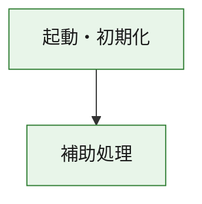
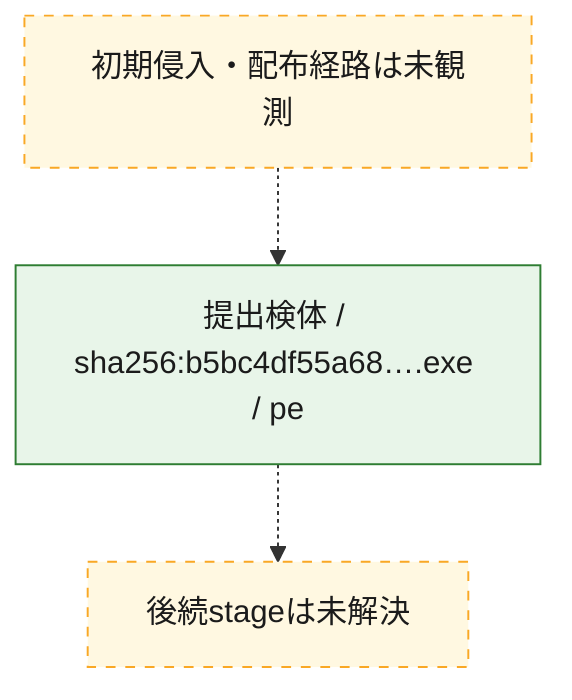
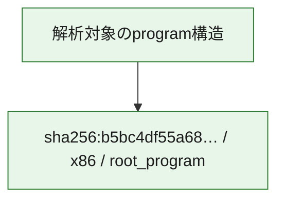

# 全体ロジック：b5bc4df55a68fb59e944cba393e5dc60533ed9f965a4f523d8714dd2829a02a9

代表関数の静的証跡から、起動・初期化の処理群を確認しました。

## 読み方

- phaseの掲載順は解析上の整理順です。observed_call_edgesがない段階間の実行順を断定しません。
- 図の実線は静的に観測した関係、点線と黄色のノードは未観測・未解決の関係を示します。
- 図は静的な要約であり、動的実行を再現するものではありません。
- 詳細な関数解説とfingerprintは[STATIC-LOGIC.md](STATIC-LOGIC.md)を参照してください。

## 静的可視化

### 実行フロー

### 感染チェーン

### モジュール関係

## 処理段階

### 1. 起動・初期化

entry pointから初期化と後続処理への移行を確認します。
確度: `confirmed_static_function_evidence`

- `b5bc4df55a68fb59e944cba393e5dc60533ed9f965a4f523d8714dd2829a02a9:ghidra:180001010` — 初期化と主要処理への分岐を行う入口関数です。 状態: `succeeded`、選定理由: `entry_point`, `meaningful_symbol_name`, `reviewed_call_centrality:22`, `role:entrypoint`, `small_program_complete_context`

### 2. 補助処理

主要処理を支える一般内部関数またはlibrary処理を確認します。
確度: `confirmed_static_function_evidence`

- `b5bc4df55a68fb59e944cba393e5dc60533ed9f965a4f523d8714dd2829a02a9:ghidra:180001240` — 検体内部の一般処理を実装する関数です。 状態: `succeeded`、選定理由: `context_representative`, `reviewed_call_centrality:2`, `small_program_complete_context`
- `b5bc4df55a68fb59e944cba393e5dc60533ed9f965a4f523d8714dd2829a02a9:ghidra:180001350` — 検体内部の一般処理を実装する関数です。 状態: `succeeded`、選定理由: `context_representative`, `reviewed_call_centrality:25`, `small_program_complete_context`
- `b5bc4df55a68fb59e944cba393e5dc60533ed9f965a4f523d8714dd2829a02a9:ghidra:180003780` — 検体内部の一般処理を実装する関数です。 状態: `succeeded`、選定理由: `context_representative`, `reviewed_call_centrality:2`, `small_program_complete_context`
- `b5bc4df55a68fb59e944cba393e5dc60533ed9f965a4f523d8714dd2829a02a9:ghidra:1800038e0` — 検体内部の一般処理を実装する関数です。 状態: `succeeded`、選定理由: `context_representative`, `reviewed_call_centrality:2`, `small_program_complete_context`

## 観測したcall関係

- `b5bc4df55a68fb59e944cba393e5dc60533ed9f965a4f523d8714dd2829a02a9:ghidra:180001010` → `b5bc4df55a68fb59e944cba393e5dc60533ed9f965a4f523d8714dd2829a02a9:ghidra:180001240` （`startup` → `support`）
- `b5bc4df55a68fb59e944cba393e5dc60533ed9f965a4f523d8714dd2829a02a9:ghidra:180001010` → `b5bc4df55a68fb59e944cba393e5dc60533ed9f965a4f523d8714dd2829a02a9:ghidra:180001350` （`startup` → `support`）
- `b5bc4df55a68fb59e944cba393e5dc60533ed9f965a4f523d8714dd2829a02a9:ghidra:180001350` → `b5bc4df55a68fb59e944cba393e5dc60533ed9f965a4f523d8714dd2829a02a9:ghidra:180001240` （`support` → `support`）
- `b5bc4df55a68fb59e944cba393e5dc60533ed9f965a4f523d8714dd2829a02a9:ghidra:180001350` → `b5bc4df55a68fb59e944cba393e5dc60533ed9f965a4f523d8714dd2829a02a9:ghidra:180003780` （`support` → `support`）
- `b5bc4df55a68fb59e944cba393e5dc60533ed9f965a4f523d8714dd2829a02a9:ghidra:180001350` → `b5bc4df55a68fb59e944cba393e5dc60533ed9f965a4f523d8714dd2829a02a9:ghidra:1800038e0` （`support` → `support`）
- `b5bc4df55a68fb59e944cba393e5dc60533ed9f965a4f523d8714dd2829a02a9:ghidra:180003780` → `b5bc4df55a68fb59e944cba393e5dc60533ed9f965a4f523d8714dd2829a02a9:ghidra:1800038e0` （`support` → `support`）
- `ghidra-function:62b1e515079a2593d48b2e52` → `ghidra-function:2e7dc440663348e522053936` （`unclassified` → `unclassified`）
- `ghidra-function:62b1e515079a2593d48b2e52` → `ghidra-function:3313c168b6a4082f9e350704` （`unclassified` → `unclassified`）
- `ghidra-function:62b1e515079a2593d48b2e52` → `ghidra-function:4683747ccdd5594ffe33a790` （`unclassified` → `unclassified`）
- `ghidra-function:62b1e515079a2593d48b2e52` → `ghidra-function:7c40f6c749c8276fe09120c7` （`unclassified` → `unclassified`）
- `ghidra-function:62b1e515079a2593d48b2e52` → `ghidra-function:7d2923f4e594736110c343a2` （`unclassified` → `unclassified`）
- `ghidra-function:62b1e515079a2593d48b2e52` → `ghidra-function:8ae829d90b44653af793098c` （`unclassified` → `unclassified`）
- `ghidra-function:62b1e515079a2593d48b2e52` → `ghidra-function:8c2110c28ff45ffb9ca55ea3` （`unclassified` → `unclassified`）
- `ghidra-function:62b1e515079a2593d48b2e52` → `ghidra-function:ad8187a048a782e36e5d244c` （`unclassified` → `unclassified`）
- `ghidra-function:62b1e515079a2593d48b2e52` → `ghidra-function:b2925728b2b8b7950fa3acc1` （`unclassified` → `unclassified`）
- `ghidra-function:62b1e515079a2593d48b2e52` → `ghidra-function:d4955f3b1f889c770783a5ee` （`unclassified` → `unclassified`）
- `ghidra-function:62b1e515079a2593d48b2e52` → `ghidra-function:f163f4fd4f1a48509f7367d1` （`unclassified` → `unclassified`）
- `ghidra-function:62b1e515079a2593d48b2e52` → `ghidra-function:fc4283ffe211e00480fd39cb` （`unclassified` → `unclassified`）
- `ghidra-function:c0de705a2c2d3926d1ce95b2` → `ghidra-function:cac95192e4f3d9e0e6868cae` （`unclassified` → `unclassified`）
- `ghidra-function:fc4283ffe211e00480fd39cb` → `ghidra-external:00ef5bed131efb2c1534df70` （`unclassified` → `unclassified`）
- `ghidra-function:fc4283ffe211e00480fd39cb` → `ghidra-external:044601a78da9463221a46eb1` （`unclassified` → `unclassified`）
- `ghidra-function:fc4283ffe211e00480fd39cb` → `ghidra-external:1bac1e270ba511b6439ad056` （`unclassified` → `unclassified`）
- `ghidra-function:fc4283ffe211e00480fd39cb` → `ghidra-external:3a24e5c0e510a824bf5cb37d` （`unclassified` → `unclassified`）
- `ghidra-function:fc4283ffe211e00480fd39cb` → `ghidra-external:4ff412c2af8a8d094f9d6439` （`unclassified` → `unclassified`）
- `ghidra-function:fc4283ffe211e00480fd39cb` → `ghidra-external:59753f1878cab4614657da7c` （`unclassified` → `unclassified`）
- `ghidra-function:fc4283ffe211e00480fd39cb` → `ghidra-external:62e1e917185adf6e41673d32` （`unclassified` → `unclassified`）
- `ghidra-function:fc4283ffe211e00480fd39cb` → `ghidra-external:68fba0eccbb688f477b8272f` （`unclassified` → `unclassified`）
- `ghidra-function:fc4283ffe211e00480fd39cb` → `ghidra-external:7b6e2837b64ef636f01282db` （`unclassified` → `unclassified`）
- `ghidra-function:fc4283ffe211e00480fd39cb` → `ghidra-external:7d35d95dc2c27a0b9a04cdd3` （`unclassified` → `unclassified`）
- `ghidra-function:fc4283ffe211e00480fd39cb` → `ghidra-external:8a8c59e2c8b829cfb1d32ad8` （`unclassified` → `unclassified`）
- `ghidra-function:fc4283ffe211e00480fd39cb` → `ghidra-external:920006b5d961f818402db140` （`unclassified` → `unclassified`）
- `ghidra-function:fc4283ffe211e00480fd39cb` → `ghidra-external:a40bf9b9a614e97b146b71ff` （`unclassified` → `unclassified`）
- `ghidra-function:fc4283ffe211e00480fd39cb` → `ghidra-external:af8c601db265cdc37fdc4df9` （`unclassified` → `unclassified`）
- `ghidra-function:fc4283ffe211e00480fd39cb` → `ghidra-external:b98d6621fa339b648b517017` （`unclassified` → `unclassified`）
- `ghidra-function:fc4283ffe211e00480fd39cb` → `ghidra-external:c8ac6fe66e707f560c9d85a5` （`unclassified` → `unclassified`）
- `ghidra-function:fc4283ffe211e00480fd39cb` → `ghidra-external:cd64cae9de6e479bfadda8b0` （`unclassified` → `unclassified`）
- `ghidra-function:fc4283ffe211e00480fd39cb` → `ghidra-external:d1a8fbe7730ad0e85f5d7a52` （`unclassified` → `unclassified`）
- `ghidra-function:fc4283ffe211e00480fd39cb` → `ghidra-external:d76946e2a376a536d87d03a4` （`unclassified` → `unclassified`）
- `ghidra-function:fc4283ffe211e00480fd39cb` → `ghidra-external:e1fe7954bbd6ee04fedcecb6` （`unclassified` → `unclassified`）
- `ghidra-function:fc4283ffe211e00480fd39cb` → `ghidra-external:e430d4cb6c16f30ce96231e5` （`unclassified` → `unclassified`）
- `ghidra-function:fc4283ffe211e00480fd39cb` → `ghidra-function:ad8187a048a782e36e5d244c` （`unclassified` → `unclassified`）
- `ghidra-function:fc4283ffe211e00480fd39cb` → `ghidra-function:c0de705a2c2d3926d1ce95b2` （`unclassified` → `unclassified`）
- `ghidra-function:fc4283ffe211e00480fd39cb` → `ghidra-function:cac95192e4f3d9e0e6868cae` （`unclassified` → `unclassified`）

## 解析範囲と制約

- 選定外関数は全体inventoryへ残しますが、関数本体の個別解説対象にはしていません。
- indirect call、難読化、packer、VM、壊れたcontrol flowによりcall関係が欠落する場合があります。
- 文書は静的解析に基づき、検体実行や外部通信による動的確認は行っていません。
