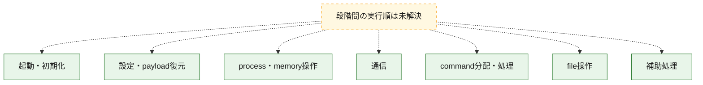
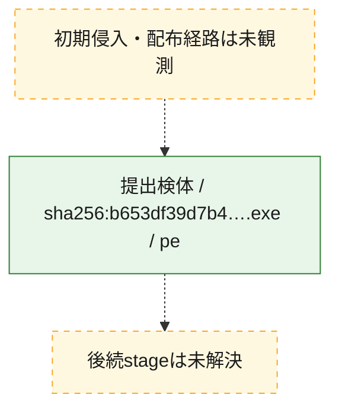
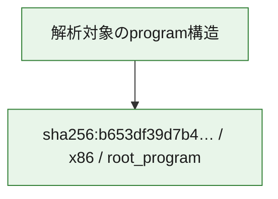

# 全体ロジック：b653df39d7b4b777557625147f69a66080af06a24e7794f8876dff9c2ed2fa57

代表関数の静的証跡から、起動・初期化、設定・payload復元、process・memory操作、通信、command分配・処理、file操作の処理群を確認しました。

## 読み方

- phaseの掲載順は解析上の整理順です。observed_call_edgesがない段階間の実行順を断定しません。
- 図の実線は静的に観測した関係、点線と黄色のノードは未観測・未解決の関係を示します。
- 図は静的な要約であり、動的実行を再現するものではありません。
- 詳細な関数解説とfingerprintは[STATIC-LOGIC.md](STATIC-LOGIC.md)を参照してください。

## 静的可視化

### 実行フロー

### 感染チェーン

### モジュール関係

## 処理段階

### 1. 起動・初期化

entry pointから初期化と後続処理への移行を確認します。
確度: `confirmed_static_function_evidence`

- `b653df39d7b4b777557625147f69a66080af06a24e7794f8876dff9c2ed2fa57:ghidra:004923a0` — 初期化と主要処理への分岐を行う入口関数です。 状態: `succeeded`、選定理由: `entry_point`, `meaningful_symbol_name`, `probable_go_main_user_code`, `reviewed_call_centrality:115`, `role:entrypoint`
- `b653df39d7b4b777557625147f69a66080af06a24e7794f8876dff9c2ed2fa57:ghidra:004b1620` — 初期化と主要処理への分岐を行う入口関数です。 状態: `succeeded`、選定理由: `entry_point`, `meaningful_symbol_name`, `probable_go_main_user_code`, `reviewed_call_centrality:4`, `role:entrypoint`
- `b653df39d7b4b777557625147f69a66080af06a24e7794f8876dff9c2ed2fa57:ghidra:004b17a0` — 初期化と主要処理への分岐を行う入口関数です。 状態: `succeeded`、選定理由: `entry_point`, `meaningful_symbol_name`, `probable_go_main_user_code`, `reviewed_call_centrality:4`, `role:entrypoint`
- `b653df39d7b4b777557625147f69a66080af06a24e7794f8876dff9c2ed2fa57:ghidra:004b1920` — 初期化と主要処理への分岐を行う入口関数です。 状態: `succeeded`、選定理由: `entry_point`, `meaningful_symbol_name`, `probable_go_main_user_code`, `reviewed_call_centrality:4`, `role:entrypoint`
- `b653df39d7b4b777557625147f69a66080af06a24e7794f8876dff9c2ed2fa57:ghidra:004b1aa0` — 初期化と主要処理への分岐を行う入口関数です。 状態: `succeeded`、選定理由: `entry_point`, `meaningful_symbol_name`, `probable_go_main_user_code`, `reviewed_call_centrality:4`, `role:entrypoint`
- `b653df39d7b4b777557625147f69a66080af06a24e7794f8876dff9c2ed2fa57:ghidra:004b1c20` — 初期化と主要処理への分岐を行う入口関数です。 状態: `succeeded`、選定理由: `entry_point`, `meaningful_symbol_name`, `probable_go_main_user_code`, `reviewed_call_centrality:4`, `role:entrypoint`
- `b653df39d7b4b777557625147f69a66080af06a24e7794f8876dff9c2ed2fa57:ghidra:004b1da0` — 初期化と主要処理への分岐を行う入口関数です。 状態: `succeeded`、選定理由: `entry_point`, `meaningful_symbol_name`, `probable_go_main_user_code`, `reviewed_call_centrality:4`, `role:entrypoint`
- `b653df39d7b4b777557625147f69a66080af06a24e7794f8876dff9c2ed2fa57:ghidra:004b1f20` — 初期化と主要処理への分岐を行う入口関数です。 状態: `succeeded`、選定理由: `entry_point`, `meaningful_symbol_name`, `probable_go_main_user_code`, `reviewed_call_centrality:4`, `role:entrypoint`
- `b653df39d7b4b777557625147f69a66080af06a24e7794f8876dff9c2ed2fa57:ghidra:004b20a0` — 初期化と主要処理への分岐を行う入口関数です。 状態: `succeeded`、選定理由: `entry_point`, `meaningful_symbol_name`, `probable_go_main_user_code`, `reviewed_call_centrality:4`, `role:entrypoint`
- `b653df39d7b4b777557625147f69a66080af06a24e7794f8876dff9c2ed2fa57:ghidra:004b2220` — 初期化と主要処理への分岐を行う入口関数です。 状態: `succeeded`、選定理由: `entry_point`, `meaningful_symbol_name`, `probable_go_main_user_code`, `reviewed_call_centrality:4`, `role:entrypoint`
- `b653df39d7b4b777557625147f69a66080af06a24e7794f8876dff9c2ed2fa57:ghidra:004b23a0` — 初期化と主要処理への分岐を行う入口関数です。 状態: `succeeded`、選定理由: `entry_point`, `meaningful_symbol_name`, `probable_go_main_user_code`, `reviewed_call_centrality:4`, `role:entrypoint`
- `b653df39d7b4b777557625147f69a66080af06a24e7794f8876dff9c2ed2fa57:ghidra:004b2520` — 初期化と主要処理への分岐を行う入口関数です。 状態: `succeeded`、選定理由: `entry_point`, `meaningful_symbol_name`, `probable_go_main_user_code`, `reviewed_call_centrality:4`, `role:entrypoint`
- `b653df39d7b4b777557625147f69a66080af06a24e7794f8876dff9c2ed2fa57:ghidra:004b26a0` — 初期化と主要処理への分岐を行う入口関数です。 状態: `succeeded`、選定理由: `entry_point`, `meaningful_symbol_name`, `probable_go_main_user_code`, `reviewed_call_centrality:4`, `role:entrypoint`
- `b653df39d7b4b777557625147f69a66080af06a24e7794f8876dff9c2ed2fa57:ghidra:004b2820` — 初期化と主要処理への分岐を行う入口関数です。 状態: `succeeded`、選定理由: `entry_point`, `meaningful_symbol_name`, `probable_go_main_user_code`, `reviewed_call_centrality:4`, `role:entrypoint`
- `b653df39d7b4b777557625147f69a66080af06a24e7794f8876dff9c2ed2fa57:ghidra:004b29a0` — 初期化と主要処理への分岐を行う入口関数です。 状態: `succeeded`、選定理由: `entry_point`, `meaningful_symbol_name`, `probable_go_main_user_code`, `reviewed_call_centrality:4`, `role:entrypoint`
- `b653df39d7b4b777557625147f69a66080af06a24e7794f8876dff9c2ed2fa57:ghidra:004b2b20` — 初期化と主要処理への分岐を行う入口関数です。 状態: `succeeded`、選定理由: `entry_point`, `meaningful_symbol_name`, `probable_go_main_user_code`, `reviewed_call_centrality:4`, `role:entrypoint`
- `b653df39d7b4b777557625147f69a66080af06a24e7794f8876dff9c2ed2fa57:ghidra:004b2ca0` — 初期化と主要処理への分岐を行う入口関数です。 状態: `succeeded`、選定理由: `entry_point`, `meaningful_symbol_name`, `probable_go_main_user_code`, `reviewed_call_centrality:4`, `role:entrypoint`
- `b653df39d7b4b777557625147f69a66080af06a24e7794f8876dff9c2ed2fa57:ghidra:004b2e20` — 初期化と主要処理への分岐を行う入口関数です。 状態: `succeeded`、選定理由: `entry_point`, `meaningful_symbol_name`, `probable_go_main_user_code`, `reviewed_call_centrality:4`, `role:entrypoint`
- `b653df39d7b4b777557625147f69a66080af06a24e7794f8876dff9c2ed2fa57:ghidra:004b2fa0` — 初期化と主要処理への分岐を行う入口関数です。 状態: `succeeded`、選定理由: `entry_point`, `meaningful_symbol_name`, `probable_go_main_user_code`, `reviewed_call_centrality:4`, `role:entrypoint`
- `b653df39d7b4b777557625147f69a66080af06a24e7794f8876dff9c2ed2fa57:ghidra:004b3120` — 初期化と主要処理への分岐を行う入口関数です。 状態: `succeeded`、選定理由: `entry_point`, `meaningful_symbol_name`, `probable_go_main_user_code`, `reviewed_call_centrality:4`, `role:entrypoint`
- `b653df39d7b4b777557625147f69a66080af06a24e7794f8876dff9c2ed2fa57:ghidra:004b32a0` — 初期化と主要処理への分岐を行う入口関数です。 状態: `succeeded`、選定理由: `entry_point`, `meaningful_symbol_name`, `probable_go_main_user_code`, `reviewed_call_centrality:4`, `role:entrypoint`
- `b653df39d7b4b777557625147f69a66080af06a24e7794f8876dff9c2ed2fa57:ghidra:004b3420` — 初期化と主要処理への分岐を行う入口関数です。 状態: `succeeded`、選定理由: `entry_point`, `meaningful_symbol_name`, `probable_go_main_user_code`, `reviewed_call_centrality:4`, `role:entrypoint`
- `b653df39d7b4b777557625147f69a66080af06a24e7794f8876dff9c2ed2fa57:ghidra:004b35a0` — 初期化と主要処理への分岐を行う入口関数です。 状態: `succeeded`、選定理由: `entry_point`, `meaningful_symbol_name`, `probable_go_main_user_code`, `reviewed_call_centrality:4`, `role:entrypoint`
- `b653df39d7b4b777557625147f69a66080af06a24e7794f8876dff9c2ed2fa57:ghidra:004b3720` — 初期化と主要処理への分岐を行う入口関数です。 状態: `succeeded`、選定理由: `entry_point`, `meaningful_symbol_name`, `probable_go_main_user_code`, `reviewed_call_centrality:4`, `role:entrypoint`
- `b653df39d7b4b777557625147f69a66080af06a24e7794f8876dff9c2ed2fa57:ghidra:004b38a0` — 初期化と主要処理への分岐を行う入口関数です。 状態: `succeeded`、選定理由: `entry_point`, `meaningful_symbol_name`, `probable_go_main_user_code`, `reviewed_call_centrality:4`, `role:entrypoint`

### 2. 設定・payload復元

設定、resource、payload、暗号化データの復元・変換を確認します。
確度: `confirmed_static_function_evidence`

- `b653df39d7b4b777557625147f69a66080af06a24e7794f8876dff9c2ed2fa57:ghidra:004667e0` — 設定、resource、payloadなどの解析・変換を行う関数です。 状態: `succeeded`、選定理由: `meaningful_symbol_name`, `reviewed_call_centrality:4`, `role:config_or_data_transform`

### 3. process・memory操作

process、thread、module、memory操作と実行移行を確認します。
確度: `confirmed_static_function_evidence`

- `b653df39d7b4b777557625147f69a66080af06a24e7794f8876dff9c2ed2fa57:ghidra:004635a0` — process、thread、module、またはmemory操作に関係する関数です。 状態: `succeeded`、選定理由: `meaningful_symbol_name`, `reviewed_call_centrality:2`, `role:process_or_memory_operation`

### 4. 通信

通信初期化、endpoint処理、送受信の役割を確認します。
確度: `confirmed_static_function_evidence`

- `b653df39d7b4b777557625147f69a66080af06a24e7794f8876dff9c2ed2fa57:ghidra:0047a780` — 通信初期化、送受信、またはendpoint処理に関係する関数です。 状態: `succeeded`、選定理由: `meaningful_symbol_name`, `reviewed_call_centrality:6`, `role:network_communication`

### 5. command分配・処理

受信commandやtaskの解釈、分配、個別handlerへの移行を確認します。
確度: `confirmed_static_function_evidence`

- `b653df39d7b4b777557625147f69a66080af06a24e7794f8876dff9c2ed2fa57:ghidra:00479900` — commandの解釈、分配、または個別処理を担当する関数です。 状態: `succeeded`、選定理由: `meaningful_symbol_name`, `reviewed_call_centrality:5`, `role:command_dispatch_or_handler`

### 6. file操作

fileやdirectoryの作成、読書き、削除を確認します。
確度: `confirmed_static_function_evidence`

- `b653df39d7b4b777557625147f69a66080af06a24e7794f8876dff9c2ed2fa57:ghidra:0047a160` — fileまたはdirectoryの読書き・管理に関係する関数です。 状態: `succeeded`、選定理由: `meaningful_symbol_name`, `reviewed_call_centrality:6`, `role:file_operation`

### 7. 補助処理

主要処理を支える一般内部関数またはlibrary処理を確認します。
確度: `confirmed_static_function_evidence`

- `b653df39d7b4b777557625147f69a66080af06a24e7794f8876dff9c2ed2fa57:ghidra:00401080` — compiler生成処理または汎用library処理とみられる関数です。 状態: `succeeded`、選定理由: `meaningful_symbol_name`, `reviewed_call_centrality:4`
- `b653df39d7b4b777557625147f69a66080af06a24e7794f8876dff9c2ed2fa57:ghidra:00459680` — 検体内部の一般処理を実装する関数です。 状態: `succeeded`、選定理由: `meaningful_symbol_name`, `reviewed_call_centrality:4`

## 観測したcall関係

- `ghidra-function:080f370d96b5386d383a4a02` → `ghidra-external:11b8bd4087f54117dc11a93e` （`unclassified` → `unclassified`）
- `ghidra-function:080f370d96b5386d383a4a02` → `ghidra-external:2c3db687f2236d81f81c9e82` （`unclassified` → `unclassified`）
- `ghidra-function:080f370d96b5386d383a4a02` → `ghidra-external:71bb63102f807da5e72b0a14` （`unclassified` → `unclassified`）
- `ghidra-function:080f370d96b5386d383a4a02` → `ghidra-external:afa9248b7242295c20a6d838` （`unclassified` → `unclassified`）
- `ghidra-function:0dae0b1fb1453fd2d81e0350` → `ghidra-external:0385199cd00568ec0bc6c60c` （`unclassified` → `unclassified`）
- `ghidra-function:0dae0b1fb1453fd2d81e0350` → `ghidra-external:2c3db687f2236d81f81c9e82` （`unclassified` → `unclassified`）
- `ghidra-function:0dae0b1fb1453fd2d81e0350` → `ghidra-external:71bb63102f807da5e72b0a14` （`unclassified` → `unclassified`）
- `ghidra-function:0dae0b1fb1453fd2d81e0350` → `ghidra-external:afa9248b7242295c20a6d838` （`unclassified` → `unclassified`）
- `ghidra-function:0f24439a06da6a156e443dec` → `ghidra-external:2c3db687f2236d81f81c9e82` （`unclassified` → `unclassified`）
- `ghidra-function:0f24439a06da6a156e443dec` → `ghidra-external:71bb63102f807da5e72b0a14` （`unclassified` → `unclassified`）
- `ghidra-function:0f24439a06da6a156e443dec` → `ghidra-external:afa9248b7242295c20a6d838` （`unclassified` → `unclassified`）
- `ghidra-function:0f24439a06da6a156e443dec` → `ghidra-external:bf882a998001e349af8f3209` （`unclassified` → `unclassified`）
- `ghidra-function:1c1b50a954f3207e33730168` → `ghidra-external:2c3db687f2236d81f81c9e82` （`unclassified` → `unclassified`）
- `ghidra-function:1c1b50a954f3207e33730168` → `ghidra-external:71bb63102f807da5e72b0a14` （`unclassified` → `unclassified`）
- `ghidra-function:1c1b50a954f3207e33730168` → `ghidra-external:afa9248b7242295c20a6d838` （`unclassified` → `unclassified`）
- `ghidra-function:1c1b50a954f3207e33730168` → `ghidra-external:e04af9f90c65326e74a22d5e` （`unclassified` → `unclassified`）
- `ghidra-function:21d44d547a6939f3137c891d` → `ghidra-external:2c3db687f2236d81f81c9e82` （`unclassified` → `unclassified`）
- `ghidra-function:21d44d547a6939f3137c891d` → `ghidra-external:71bb63102f807da5e72b0a14` （`unclassified` → `unclassified`）
- `ghidra-function:21d44d547a6939f3137c891d` → `ghidra-external:afa9248b7242295c20a6d838` （`unclassified` → `unclassified`）
- `ghidra-function:21d44d547a6939f3137c891d` → `ghidra-external:c45926d3246b99d6c48f2e93` （`unclassified` → `unclassified`）
- `ghidra-function:2827bed951f6a2ee1bfb196b` → `ghidra-external:2c3db687f2236d81f81c9e82` （`unclassified` → `unclassified`）
- `ghidra-function:2827bed951f6a2ee1bfb196b` → `ghidra-external:71bb63102f807da5e72b0a14` （`unclassified` → `unclassified`）
- `ghidra-function:2827bed951f6a2ee1bfb196b` → `ghidra-external:afa9248b7242295c20a6d838` （`unclassified` → `unclassified`）
- `ghidra-function:2827bed951f6a2ee1bfb196b` → `ghidra-external:e03e6bd4ba961e600d824856` （`unclassified` → `unclassified`）
- `ghidra-function:389e4d914fcd0a284938f262` → `ghidra-external:2c3db687f2236d81f81c9e82` （`unclassified` → `unclassified`）
- `ghidra-function:389e4d914fcd0a284938f262` → `ghidra-external:71bb63102f807da5e72b0a14` （`unclassified` → `unclassified`）
- `ghidra-function:389e4d914fcd0a284938f262` → `ghidra-external:7347b265ac005e635d85307f` （`unclassified` → `unclassified`）
- `ghidra-function:389e4d914fcd0a284938f262` → `ghidra-external:afa9248b7242295c20a6d838` （`unclassified` → `unclassified`）
- `ghidra-function:39452e4895a222c70e0cc037` → `ghidra-external:2c3db687f2236d81f81c9e82` （`unclassified` → `unclassified`）
- `ghidra-function:39452e4895a222c70e0cc037` → `ghidra-external:5477c0fbe4b2f230efa31b2e` （`unclassified` → `unclassified`）
- `ghidra-function:39452e4895a222c70e0cc037` → `ghidra-external:71bb63102f807da5e72b0a14` （`unclassified` → `unclassified`）
- `ghidra-function:39452e4895a222c70e0cc037` → `ghidra-external:afa9248b7242295c20a6d838` （`unclassified` → `unclassified`）
- `ghidra-function:3c0b8a6572697bb6eaea9d84` → `ghidra-external:2c3db687f2236d81f81c9e82` （`unclassified` → `unclassified`）
- `ghidra-function:3c0b8a6572697bb6eaea9d84` → `ghidra-external:71bb63102f807da5e72b0a14` （`unclassified` → `unclassified`）
- `ghidra-function:3c0b8a6572697bb6eaea9d84` → `ghidra-external:afa9248b7242295c20a6d838` （`unclassified` → `unclassified`）
- `ghidra-function:3c0b8a6572697bb6eaea9d84` → `ghidra-external:cc28d3436253d3e49d39cd63` （`unclassified` → `unclassified`）
- `ghidra-function:3de596a788700d76f7b27335` → `ghidra-external:2c3db687f2236d81f81c9e82` （`unclassified` → `unclassified`）
- `ghidra-function:3de596a788700d76f7b27335` → `ghidra-external:71bb63102f807da5e72b0a14` （`unclassified` → `unclassified`）
- `ghidra-function:3de596a788700d76f7b27335` → `ghidra-external:8b93e35a657cce336845cac8` （`unclassified` → `unclassified`）
- `ghidra-function:3de596a788700d76f7b27335` → `ghidra-external:afa9248b7242295c20a6d838` （`unclassified` → `unclassified`）
- `ghidra-function:41d21f23fd6ea90df6191bc1` → `ghidra-external:9e6fb9003f81a9d9c9696cde` （`unclassified` → `unclassified`）
- `ghidra-function:41d21f23fd6ea90df6191bc1` → `ghidra-external:a42456957a12bd7c6a377a13` （`unclassified` → `unclassified`）
- `ghidra-function:41d21f23fd6ea90df6191bc1` → `ghidra-external:d2ab2f4e6d10c909a3f04829` （`unclassified` → `unclassified`）
- `ghidra-function:41d21f23fd6ea90df6191bc1` → `ghidra-external:d5c07f7d388e2101bca99dfe` （`unclassified` → `unclassified`）
- `ghidra-function:41d21f23fd6ea90df6191bc1` → `ghidra-external:e0e9994dfe998d74823459df` （`unclassified` → `unclassified`）
- `ghidra-function:48a1606094749f644c7ccb9f` → `ghidra-external:27022302f8f3ffb3a303eea7` （`unclassified` → `unclassified`）
- `ghidra-function:48a1606094749f644c7ccb9f` → `ghidra-external:6d90a0bb8af7873e306b506e` （`unclassified` → `unclassified`）
- `ghidra-function:48a1606094749f644c7ccb9f` → `ghidra-external:8936a5f4cb957c9b346c7a94` （`unclassified` → `unclassified`）
- `ghidra-function:48a1606094749f644c7ccb9f` → `ghidra-external:eaea653fee7c6006ae46d339` （`unclassified` → `unclassified`）
- `ghidra-function:521ee5718e9f8b75e6f252e4` → `ghidra-external:2c3db687f2236d81f81c9e82` （`unclassified` → `unclassified`）
- `ghidra-function:521ee5718e9f8b75e6f252e4` → `ghidra-external:3f1b6a8c70dd89c798422236` （`unclassified` → `unclassified`）
- `ghidra-function:521ee5718e9f8b75e6f252e4` → `ghidra-external:71bb63102f807da5e72b0a14` （`unclassified` → `unclassified`）
- `ghidra-function:521ee5718e9f8b75e6f252e4` → `ghidra-external:afa9248b7242295c20a6d838` （`unclassified` → `unclassified`）
- `ghidra-function:5c5ef2348cc6f4b3dc44b7dd` → `ghidra-external:2c3db687f2236d81f81c9e82` （`unclassified` → `unclassified`）
- `ghidra-function:5c5ef2348cc6f4b3dc44b7dd` → `ghidra-external:64e4fd636c1c67effe6a6f4c` （`unclassified` → `unclassified`）
- `ghidra-function:5c5ef2348cc6f4b3dc44b7dd` → `ghidra-external:71bb63102f807da5e72b0a14` （`unclassified` → `unclassified`）
- `ghidra-function:5c5ef2348cc6f4b3dc44b7dd` → `ghidra-external:afa9248b7242295c20a6d838` （`unclassified` → `unclassified`）
- `ghidra-function:660b16651ae05a15a2b0e522` → `ghidra-external:3edbce21add1abe0dcc3115a` （`unclassified` → `unclassified`）
- `ghidra-function:660b16651ae05a15a2b0e522` → `ghidra-external:bb6e04cc945afedf289be76f` （`unclassified` → `unclassified`）
- `ghidra-function:68fdcce8c5c262aa42e81a91` → `ghidra-external:02766f4aaa5c25ec3ef618d1` （`unclassified` → `unclassified`）
- `ghidra-function:68fdcce8c5c262aa42e81a91` → `ghidra-external:0aa4fe88a6a54e7aef55e507` （`unclassified` → `unclassified`）
- `ghidra-function:68fdcce8c5c262aa42e81a91` → `ghidra-external:8e9799e0fa0a7e29caf3eb6f` （`unclassified` → `unclassified`）
- `ghidra-function:68fdcce8c5c262aa42e81a91` → `ghidra-external:d2ab2f4e6d10c909a3f04829` （`unclassified` → `unclassified`）
- `ghidra-function:68fdcce8c5c262aa42e81a91` → `ghidra-external:d5c07f7d388e2101bca99dfe` （`unclassified` → `unclassified`）
- `ghidra-function:68fdcce8c5c262aa42e81a91` → `ghidra-external:e0e9994dfe998d74823459df` （`unclassified` → `unclassified`）
- `ghidra-function:6e0064fcd4ab6e4b2fb3f668` → `ghidra-external:2c3db687f2236d81f81c9e82` （`unclassified` → `unclassified`）
- `ghidra-function:6e0064fcd4ab6e4b2fb3f668` → `ghidra-external:71bb63102f807da5e72b0a14` （`unclassified` → `unclassified`）
- `ghidra-function:6e0064fcd4ab6e4b2fb3f668` → `ghidra-external:afa9248b7242295c20a6d838` （`unclassified` → `unclassified`）
- `ghidra-function:6e0064fcd4ab6e4b2fb3f668` → `ghidra-external:fef6fd2165b038a6a51ea521` （`unclassified` → `unclassified`）
- `ghidra-function:6e2d53cb938e12d4fd369354` → `ghidra-external:2c3db687f2236d81f81c9e82` （`unclassified` → `unclassified`）
- `ghidra-function:6e2d53cb938e12d4fd369354` → `ghidra-external:71bb63102f807da5e72b0a14` （`unclassified` → `unclassified`）
- `ghidra-function:6e2d53cb938e12d4fd369354` → `ghidra-external:afa9248b7242295c20a6d838` （`unclassified` → `unclassified`）
- `ghidra-function:6e2d53cb938e12d4fd369354` → `ghidra-external:df9c81584d4c80354feefec3` （`unclassified` → `unclassified`）
- `ghidra-function:6fe08ca379215f0fd938634b` → `ghidra-external:17eb52002c22caa4ba186cdb` （`unclassified` → `unclassified`）
- `ghidra-function:6fe08ca379215f0fd938634b` → `ghidra-external:71bb63102f807da5e72b0a14` （`unclassified` → `unclassified`）
- `ghidra-function:6fe08ca379215f0fd938634b` → `ghidra-external:89a8e92a82fde0f251b98fd2` （`unclassified` → `unclassified`）
- `ghidra-function:6fe08ca379215f0fd938634b` → `ghidra-external:db589e118867ebb958f8a010` （`unclassified` → `unclassified`）
- `ghidra-function:814ab6570bf8c7dbb123f93b` → `ghidra-external:2c3db687f2236d81f81c9e82` （`unclassified` → `unclassified`）
- `ghidra-function:814ab6570bf8c7dbb123f93b` → `ghidra-external:67b8b5fbbeec054b83e753bb` （`unclassified` → `unclassified`）
- `ghidra-function:814ab6570bf8c7dbb123f93b` → `ghidra-external:71bb63102f807da5e72b0a14` （`unclassified` → `unclassified`）
- `ghidra-function:814ab6570bf8c7dbb123f93b` → `ghidra-external:afa9248b7242295c20a6d838` （`unclassified` → `unclassified`）
- `ghidra-function:841d4e3c6ad484ed6756be2c` → `ghidra-external:2c3db687f2236d81f81c9e82` （`unclassified` → `unclassified`）
- `ghidra-function:841d4e3c6ad484ed6756be2c` → `ghidra-external:71bb63102f807da5e72b0a14` （`unclassified` → `unclassified`）
- `ghidra-function:841d4e3c6ad484ed6756be2c` → `ghidra-external:809d827e782509948685c82e` （`unclassified` → `unclassified`）
- `ghidra-function:841d4e3c6ad484ed6756be2c` → `ghidra-external:afa9248b7242295c20a6d838` （`unclassified` → `unclassified`）
- `ghidra-function:86f34b8b8ae299449c03e72e` → `ghidra-external:2c3db687f2236d81f81c9e82` （`unclassified` → `unclassified`）
- `ghidra-function:86f34b8b8ae299449c03e72e` → `ghidra-external:71bb63102f807da5e72b0a14` （`unclassified` → `unclassified`）
- `ghidra-function:86f34b8b8ae299449c03e72e` → `ghidra-external:7e39cfecfc6fda22279125c8` （`unclassified` → `unclassified`）
- `ghidra-function:86f34b8b8ae299449c03e72e` → `ghidra-external:afa9248b7242295c20a6d838` （`unclassified` → `unclassified`）
- `ghidra-function:92e18ab0d0040928dfdd97d9` → `ghidra-external:02766f4aaa5c25ec3ef618d1` （`unclassified` → `unclassified`）
- `ghidra-function:92e18ab0d0040928dfdd97d9` → `ghidra-external:9e6fb9003f81a9d9c9696cde` （`unclassified` → `unclassified`）
- `ghidra-function:92e18ab0d0040928dfdd97d9` → `ghidra-external:cee1bdf82089ee30c4c04c5b` （`unclassified` → `unclassified`）
- `ghidra-function:92e18ab0d0040928dfdd97d9` → `ghidra-external:d2ab2f4e6d10c909a3f04829` （`unclassified` → `unclassified`）
- `ghidra-function:92e18ab0d0040928dfdd97d9` → `ghidra-external:d5c07f7d388e2101bca99dfe` （`unclassified` → `unclassified`）
- `ghidra-function:92e18ab0d0040928dfdd97d9` → `ghidra-external:e0e9994dfe998d74823459df` （`unclassified` → `unclassified`）
- `ghidra-function:9c14cd911d463c3e8b2ec838` → `ghidra-external:2c3db687f2236d81f81c9e82` （`unclassified` → `unclassified`）
- `ghidra-function:9c14cd911d463c3e8b2ec838` → `ghidra-external:71bb63102f807da5e72b0a14` （`unclassified` → `unclassified`）
- `ghidra-function:9c14cd911d463c3e8b2ec838` → `ghidra-external:afa9248b7242295c20a6d838` （`unclassified` → `unclassified`）
- `ghidra-function:9c14cd911d463c3e8b2ec838` → `ghidra-external:be411031d04b773816e15283` （`unclassified` → `unclassified`）
- `ghidra-function:a46d7861ba9ba4bc79685727` → `ghidra-external:2c3db687f2236d81f81c9e82` （`unclassified` → `unclassified`）
- `ghidra-function:a46d7861ba9ba4bc79685727` → `ghidra-external:39b2baeec434d04d93112a92` （`unclassified` → `unclassified`）
- `ghidra-function:a46d7861ba9ba4bc79685727` → `ghidra-external:71bb63102f807da5e72b0a14` （`unclassified` → `unclassified`）
- `ghidra-function:a46d7861ba9ba4bc79685727` → `ghidra-external:afa9248b7242295c20a6d838` （`unclassified` → `unclassified`）
- `ghidra-function:a8d4ab2f1824e76c309c1249` → `ghidra-external:2c3db687f2236d81f81c9e82` （`unclassified` → `unclassified`）
- `ghidra-function:a8d4ab2f1824e76c309c1249` → `ghidra-external:507326aedffbbbde8f7624ba` （`unclassified` → `unclassified`）
- `ghidra-function:a8d4ab2f1824e76c309c1249` → `ghidra-external:71bb63102f807da5e72b0a14` （`unclassified` → `unclassified`）
- `ghidra-function:a8d4ab2f1824e76c309c1249` → `ghidra-external:afa9248b7242295c20a6d838` （`unclassified` → `unclassified`）
- `ghidra-function:b15f8335065f6b501760d4cb` → `ghidra-external:2c3db687f2236d81f81c9e82` （`unclassified` → `unclassified`）
- `ghidra-function:b15f8335065f6b501760d4cb` → `ghidra-external:5a70c2d706c9e21d0cb7c067` （`unclassified` → `unclassified`）
- `ghidra-function:b15f8335065f6b501760d4cb` → `ghidra-external:71bb63102f807da5e72b0a14` （`unclassified` → `unclassified`）
- `ghidra-function:b15f8335065f6b501760d4cb` → `ghidra-external:afa9248b7242295c20a6d838` （`unclassified` → `unclassified`）
- `ghidra-function:c14e99928c2e0ebdbddb6b6d` → `ghidra-external:2c3db687f2236d81f81c9e82` （`unclassified` → `unclassified`）
- `ghidra-function:c14e99928c2e0ebdbddb6b6d` → `ghidra-external:71bb63102f807da5e72b0a14` （`unclassified` → `unclassified`）
- `ghidra-function:c14e99928c2e0ebdbddb6b6d` → `ghidra-external:afa9248b7242295c20a6d838` （`unclassified` → `unclassified`）
- `ghidra-function:c14e99928c2e0ebdbddb6b6d` → `ghidra-external:ea50227338a64ababc5cc2f4` （`unclassified` → `unclassified`）
- `ghidra-function:c7f80c504adb054022d354f5` → `ghidra-external:2c3db687f2236d81f81c9e82` （`unclassified` → `unclassified`）
- `ghidra-function:c7f80c504adb054022d354f5` → `ghidra-external:71bb63102f807da5e72b0a14` （`unclassified` → `unclassified`）
- `ghidra-function:c7f80c504adb054022d354f5` → `ghidra-external:9f1b9cabf9f39076830932b8` （`unclassified` → `unclassified`）
- `ghidra-function:c7f80c504adb054022d354f5` → `ghidra-external:afa9248b7242295c20a6d838` （`unclassified` → `unclassified`）
- `ghidra-function:ca1c21467ee2fe5a78e6d8a9` → `ghidra-external:1cc334da9d03efa1eae91e9c` （`unclassified` → `unclassified`）
- `ghidra-function:ca1c21467ee2fe5a78e6d8a9` → `ghidra-external:71bb63102f807da5e72b0a14` （`unclassified` → `unclassified`）
- `ghidra-function:ca1c21467ee2fe5a78e6d8a9` → `ghidra-external:db589e118867ebb958f8a010` （`unclassified` → `unclassified`）
- `ghidra-function:ca1c21467ee2fe5a78e6d8a9` → `ghidra-external:f1a449ff2bce3323b9622459` （`unclassified` → `unclassified`）
- `ghidra-function:e3b974512aa6d13e16db258e` → `ghidra-external:02735a7337d8c0e930b978b3` （`unclassified` → `unclassified`）
- `ghidra-function:e3b974512aa6d13e16db258e` → `ghidra-external:02766f4aaa5c25ec3ef618d1` （`unclassified` → `unclassified`）
- `ghidra-function:e3b974512aa6d13e16db258e` → `ghidra-external:02f9b23d3917336fa9524bb4` （`unclassified` → `unclassified`）
- `ghidra-function:e3b974512aa6d13e16db258e` → `ghidra-external:05373ef9d670306beff9c375` （`unclassified` → `unclassified`）
- `ghidra-function:e3b974512aa6d13e16db258e` → `ghidra-external:068709b29cfa20dd95c59d29` （`unclassified` → `unclassified`）
- `ghidra-function:e3b974512aa6d13e16db258e` → `ghidra-external:081968a296de2599e68c9906` （`unclassified` → `unclassified`）
- `ghidra-function:e3b974512aa6d13e16db258e` → `ghidra-external:0a8e32a1b85fcb3c1ce5d751` （`unclassified` → `unclassified`）
- `ghidra-function:e3b974512aa6d13e16db258e` → `ghidra-external:0c9e58a7f1e0344e998bdbbb` （`unclassified` → `unclassified`）
- `ghidra-function:e3b974512aa6d13e16db258e` → `ghidra-external:0e7121671eff5edf6091354a` （`unclassified` → `unclassified`）
- `ghidra-function:e3b974512aa6d13e16db258e` → `ghidra-external:10c753355da258451ed3d0ce` （`unclassified` → `unclassified`）
- `ghidra-function:e3b974512aa6d13e16db258e` → `ghidra-external:16de95105483b059c40c498e` （`unclassified` → `unclassified`）
- `ghidra-function:e3b974512aa6d13e16db258e` → `ghidra-external:17eb52002c22caa4ba186cdb` （`unclassified` → `unclassified`）
- `ghidra-function:e3b974512aa6d13e16db258e` → `ghidra-external:1ba80d5f3f5137307652aea9` （`unclassified` → `unclassified`）
- `ghidra-function:e3b974512aa6d13e16db258e` → `ghidra-external:1e486cadd243d2f04ff0c199` （`unclassified` → `unclassified`）
- `ghidra-function:e3b974512aa6d13e16db258e` → `ghidra-external:203cb19006d8e3f18e89f387` （`unclassified` → `unclassified`）
- `ghidra-function:e3b974512aa6d13e16db258e` → `ghidra-external:2373c9f6c83b14882fabfef8` （`unclassified` → `unclassified`）
- `ghidra-function:e3b974512aa6d13e16db258e` → `ghidra-external:2518e045b5bf8d4c8d2e3231` （`unclassified` → `unclassified`）
- `ghidra-function:e3b974512aa6d13e16db258e` → `ghidra-external:256060fac315934cb5d14112` （`unclassified` → `unclassified`）
- `ghidra-function:e3b974512aa6d13e16db258e` → `ghidra-external:278fb1c99bf323a98b006c37` （`unclassified` → `unclassified`）
- `ghidra-function:e3b974512aa6d13e16db258e` → `ghidra-external:2858bc9ba8affe1993ad7fdc` （`unclassified` → `unclassified`）
- `ghidra-function:e3b974512aa6d13e16db258e` → `ghidra-external:2866d54a5ef597882af1bd25` （`unclassified` → `unclassified`）
- `ghidra-function:e3b974512aa6d13e16db258e` → `ghidra-external:2dee44ab79e6d8ebcf35173d` （`unclassified` → `unclassified`）
- `ghidra-function:e3b974512aa6d13e16db258e` → `ghidra-external:2f41e2b8ce436b04c4b42d79` （`unclassified` → `unclassified`）
- `ghidra-function:e3b974512aa6d13e16db258e` → `ghidra-external:2f950143782b8be9c0ff3f8b` （`unclassified` → `unclassified`）
- `ghidra-function:e3b974512aa6d13e16db258e` → `ghidra-external:3093863110e02995042b5613` （`unclassified` → `unclassified`）
- `ghidra-function:e3b974512aa6d13e16db258e` → `ghidra-external:32f35fed654aebbaf5cd134b` （`unclassified` → `unclassified`）
- `ghidra-function:e3b974512aa6d13e16db258e` → `ghidra-external:3434c55236f8961a683bec33` （`unclassified` → `unclassified`）
- `ghidra-function:e3b974512aa6d13e16db258e` → `ghidra-external:349093c9b2dc8b05cc710a89` （`unclassified` → `unclassified`）
- `ghidra-function:e3b974512aa6d13e16db258e` → `ghidra-external:38d646b8cd98f60d28d39d0b` （`unclassified` → `unclassified`）
- `ghidra-function:e3b974512aa6d13e16db258e` → `ghidra-external:392b827e78da5e494cb28d7b` （`unclassified` → `unclassified`）
- `ghidra-function:e3b974512aa6d13e16db258e` → `ghidra-external:39eef40cd3a09ce6d894bf13` （`unclassified` → `unclassified`）
- `ghidra-function:e3b974512aa6d13e16db258e` → `ghidra-external:3a41b80441b275dfe6e4abeb` （`unclassified` → `unclassified`）
- `ghidra-function:e3b974512aa6d13e16db258e` → `ghidra-external:4018164e1775dadb21a54693` （`unclassified` → `unclassified`）
- `ghidra-function:e3b974512aa6d13e16db258e` → `ghidra-external:46ee8a6c801a335be4d581cb` （`unclassified` → `unclassified`）
- `ghidra-function:e3b974512aa6d13e16db258e` → `ghidra-external:4c25e64829a238049a0aebb6` （`unclassified` → `unclassified`）
- `ghidra-function:e3b974512aa6d13e16db258e` → `ghidra-external:4c2ca91edd1f3dd66a3a1930` （`unclassified` → `unclassified`）
- `ghidra-function:e3b974512aa6d13e16db258e` → `ghidra-external:4e15e5d6291e3dd47a2ec6db` （`unclassified` → `unclassified`）
- `ghidra-function:e3b974512aa6d13e16db258e` → `ghidra-external:50d8e98e1ab46ea443cc31c4` （`unclassified` → `unclassified`）
- `ghidra-function:e3b974512aa6d13e16db258e` → `ghidra-external:5262f74e215278d0e963f077` （`unclassified` → `unclassified`）
- `ghidra-function:e3b974512aa6d13e16db258e` → `ghidra-external:537a8193da3da7c7d6bee302` （`unclassified` → `unclassified`）
- `ghidra-function:e3b974512aa6d13e16db258e` → `ghidra-external:54b0660dd4241a9ba317e2b8` （`unclassified` → `unclassified`）
- `ghidra-function:e3b974512aa6d13e16db258e` → `ghidra-external:5528ed100ffdeb0428a7c866` （`unclassified` → `unclassified`）
- `ghidra-function:e3b974512aa6d13e16db258e` → `ghidra-external:568c0489753fe61e494b5964` （`unclassified` → `unclassified`）
- `ghidra-function:e3b974512aa6d13e16db258e` → `ghidra-external:56e516549f3609885ebdf2e4` （`unclassified` → `unclassified`）
- `ghidra-function:e3b974512aa6d13e16db258e` → `ghidra-external:574286eff18e8189b23d3c3c` （`unclassified` → `unclassified`）
- `ghidra-function:e3b974512aa6d13e16db258e` → `ghidra-external:5803602054c941525379c024` （`unclassified` → `unclassified`）
- `ghidra-function:e3b974512aa6d13e16db258e` → `ghidra-external:5b87a2e888e16a1f7580c41c` （`unclassified` → `unclassified`）
- `ghidra-function:e3b974512aa6d13e16db258e` → `ghidra-external:5c40525aaac28961c880033f` （`unclassified` → `unclassified`）
- `ghidra-function:e3b974512aa6d13e16db258e` → `ghidra-external:5cbadcad86110b6b7f17b46d` （`unclassified` → `unclassified`）
- `ghidra-function:e3b974512aa6d13e16db258e` → `ghidra-external:61acf6a33b76482f50b36687` （`unclassified` → `unclassified`）
- `ghidra-function:e3b974512aa6d13e16db258e` → `ghidra-external:63d76506d5b6c28e1c32b6af` （`unclassified` → `unclassified`）
- `ghidra-function:e3b974512aa6d13e16db258e` → `ghidra-external:6608a59d020e185c126c8320` （`unclassified` → `unclassified`）
- `ghidra-function:e3b974512aa6d13e16db258e` → `ghidra-external:68c6f7fc28abbb3b9105af35` （`unclassified` → `unclassified`）
- `ghidra-function:e3b974512aa6d13e16db258e` → `ghidra-external:69b3d99b8997e7e2d21f69ce` （`unclassified` → `unclassified`）
- `ghidra-function:e3b974512aa6d13e16db258e` → `ghidra-external:6e83fd963ef243c3fb8020e4` （`unclassified` → `unclassified`）
- `ghidra-function:e3b974512aa6d13e16db258e` → `ghidra-external:71bb63102f807da5e72b0a14` （`unclassified` → `unclassified`）
- `ghidra-function:e3b974512aa6d13e16db258e` → `ghidra-external:71fab1f40e841c5f89ed8c72` （`unclassified` → `unclassified`）
- `ghidra-function:e3b974512aa6d13e16db258e` → `ghidra-external:7347ba59d1f124f0f619818d` （`unclassified` → `unclassified`）
- `ghidra-function:e3b974512aa6d13e16db258e` → `ghidra-external:77dc715f863a0bc0e22b0a96` （`unclassified` → `unclassified`）
- `ghidra-function:e3b974512aa6d13e16db258e` → `ghidra-external:789dfaf0221d6f9808096ac5` （`unclassified` → `unclassified`）
- `ghidra-function:e3b974512aa6d13e16db258e` → `ghidra-external:7b755d6979351889c9a22101` （`unclassified` → `unclassified`）
- `ghidra-function:e3b974512aa6d13e16db258e` → `ghidra-external:7db4a36777f08e6d48ce3feb` （`unclassified` → `unclassified`）
- `ghidra-function:e3b974512aa6d13e16db258e` → `ghidra-external:7dff8dc0604012e6a01118c3` （`unclassified` → `unclassified`）
- `ghidra-function:e3b974512aa6d13e16db258e` → `ghidra-external:7e8b98161c97ee410e6d6e63` （`unclassified` → `unclassified`）
- `ghidra-function:e3b974512aa6d13e16db258e` → `ghidra-external:7f2c2ed237c197d6fea93a4f` （`unclassified` → `unclassified`）
- `ghidra-function:e3b974512aa6d13e16db258e` → `ghidra-external:81dd89a34e48e6142aa6a7f0` （`unclassified` → `unclassified`）
- `ghidra-function:e3b974512aa6d13e16db258e` → `ghidra-external:8610b5479caaf328126f2dc0` （`unclassified` → `unclassified`）
- `ghidra-function:e3b974512aa6d13e16db258e` → `ghidra-external:881baa6cf13c707c33c63d3d` （`unclassified` → `unclassified`）
- `ghidra-function:e3b974512aa6d13e16db258e` → `ghidra-external:88c61787d9e0e84630ad2181` （`unclassified` → `unclassified`）
- `ghidra-function:e3b974512aa6d13e16db258e` → `ghidra-external:8c8edbf82d57a28970649a4b` （`unclassified` → `unclassified`）
- `ghidra-function:e3b974512aa6d13e16db258e` → `ghidra-external:8d32cb7f5661a0377320496f` （`unclassified` → `unclassified`）
- `ghidra-function:e3b974512aa6d13e16db258e` → `ghidra-external:8dcdf1feb41f46292e8f3362` （`unclassified` → `unclassified`）
- `ghidra-function:e3b974512aa6d13e16db258e` → `ghidra-external:989280e580cfb57cd8b5f60e` （`unclassified` → `unclassified`）
- `ghidra-function:e3b974512aa6d13e16db258e` → `ghidra-external:9ef35a9e36071ffd460046e0` （`unclassified` → `unclassified`）
- `ghidra-function:e3b974512aa6d13e16db258e` → `ghidra-external:a2945984e791357177a8f0b3` （`unclassified` → `unclassified`）
- `ghidra-function:e3b974512aa6d13e16db258e` → `ghidra-external:a710177c74ca29fde5d75a7f` （`unclassified` → `unclassified`）
- `ghidra-function:e3b974512aa6d13e16db258e` → `ghidra-external:aa7f153cc1112432991f6299` （`unclassified` → `unclassified`）
- 残り42件は`static-logic.json`に記録しています。

## 解析範囲と制約

- 選定外関数は全体inventoryへ残しますが、関数本体の個別解説対象にはしていません。
- indirect call、難読化、packer、VM、壊れたcontrol flowによりcall関係が欠落する場合があります。
- 文書は静的解析に基づき、検体実行や外部通信による動的確認は行っていません。
