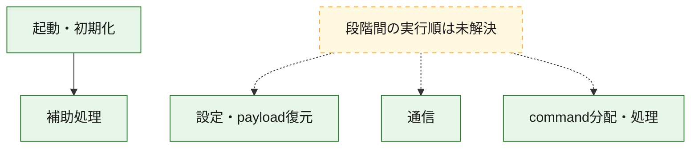
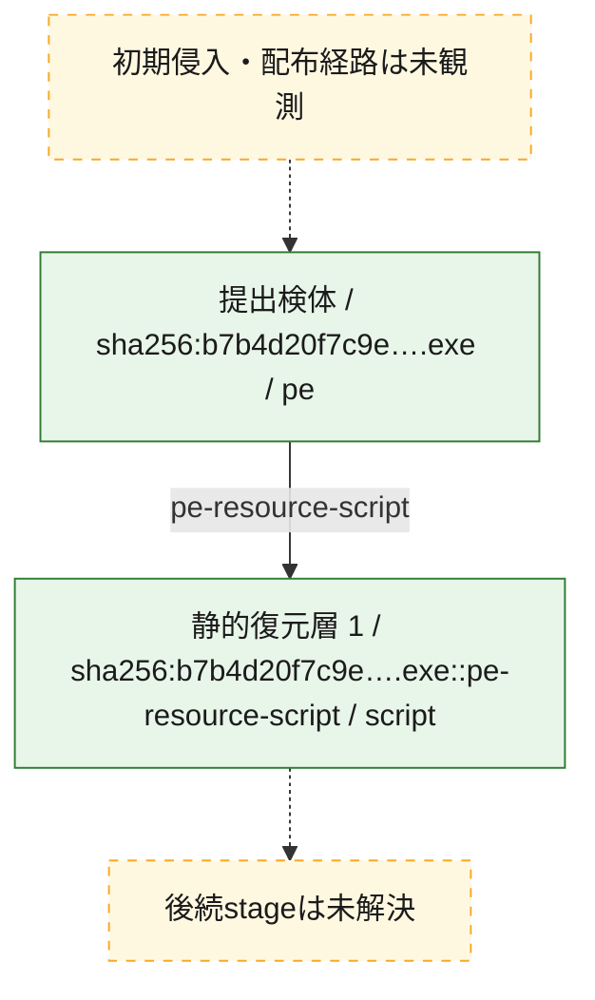
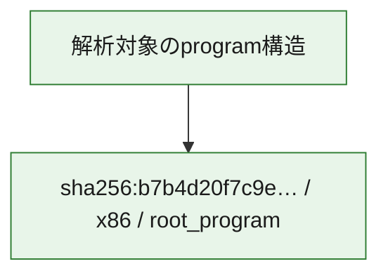

# 全体ロジック：b7b4d20f7c9e6f568e5970da8b8fa558aa0462ba9a2065003b3d6c18b592176a

代表関数の静的証跡から、起動・初期化、設定・payload復元、通信、command分配・処理の処理群を確認しました。

## 読み方

- phaseの掲載順は解析上の整理順です。observed_call_edgesがない段階間の実行順を断定しません。
- 図の実線は静的に観測した関係、点線と黄色のノードは未観測・未解決の関係を示します。
- 図は静的な要約であり、動的実行を再現するものではありません。
- 詳細な関数解説とfingerprintは[STATIC-LOGIC.md](STATIC-LOGIC.md)を参照してください。

## 静的可視化

### 実行フロー

### 感染チェーン

### モジュール関係

## 処理段階

### 1. 起動・初期化

entry pointから初期化と後続処理への移行を確認します。
確度: `confirmed_static_function_evidence`

- `b7b4d20f7c9e6f568e5970da8b8fa558aa0462ba9a2065003b3d6c18b592176a:ghidra:00646fc0` — 初期化と主要処理への分岐を行う入口関数です。 状態: `succeeded`、選定理由: `entry_point`, `meaningful_symbol_name`, `reviewed_call_centrality:22`, `role:entrypoint`

### 2. 設定・payload復元

設定、resource、payload、暗号化データの復元・変換を確認します。
確度: `confirmed_static_function_evidence_with_limits`

- `b7b4d20f7c9e6f568e5970da8b8fa558aa0462ba9a2065003b3d6c18b592176a:ghidra:0064031e` — 設定、resource、payloadなどの解析・変換を行う関数です。 状態: `limited_bad_instruction_or_flow`、選定理由: `meaningful_symbol_name`, `reviewed_call_centrality:1`, `role:config_or_data_transform`

### 3. 通信

通信初期化、endpoint処理、送受信の役割を確認します。
確度: `confirmed_static_function_evidence_with_limits`

- `b7b4d20f7c9e6f568e5970da8b8fa558aa0462ba9a2065003b3d6c18b592176a:ghidra:00640115` — 通信初期化、送受信、またはendpoint処理に関係する関数です。 状態: `limited_bad_instruction_or_flow`、選定理由: `meaningful_symbol_name`, `reviewed_call_centrality:1`, `role:network_communication`
- `b7b4d20f7c9e6f568e5970da8b8fa558aa0462ba9a2065003b3d6c18b592176a:ghidra:00640364` — 通信初期化、送受信、またはendpoint処理に関係する関数です。 状態: `limited_bad_instruction_or_flow`、選定理由: `meaningful_symbol_name`, `reviewed_call_centrality:1`, `role:network_communication`
- `b7b4d20f7c9e6f568e5970da8b8fa558aa0462ba9a2065003b3d6c18b592176a:ghidra:0066f35f` — 通信初期化、送受信、またはendpoint処理に関係する関数です。 状態: `limited_bad_instruction_or_flow`、選定理由: `meaningful_symbol_name`, `reviewed_call_centrality:1`, `role:network_communication`
- `b7b4d20f7c9e6f568e5970da8b8fa558aa0462ba9a2065003b3d6c18b592176a:ghidra:0066f373` — 通信初期化、送受信、またはendpoint処理に関係する関数です。 状態: `limited_bad_instruction_or_flow`、選定理由: `meaningful_symbol_name`, `reviewed_call_centrality:1`, `role:network_communication`
- `b7b4d20f7c9e6f568e5970da8b8fa558aa0462ba9a2065003b3d6c18b592176a:ghidra:0066f5ef` — 通信初期化、送受信、またはendpoint処理に関係する関数です。 状態: `limited_bad_instruction_or_flow`、選定理由: `meaningful_symbol_name`, `reviewed_call_centrality:1`, `role:network_communication`
- `b7b4d20f7c9e6f568e5970da8b8fa558aa0462ba9a2065003b3d6c18b592176a:ghidra:0066f635` — 通信初期化、送受信、またはendpoint処理に関係する関数です。 状態: `failed`、選定理由: `meaningful_symbol_name`, `reviewed_call_centrality:1`, `role:network_communication`

### 4. command分配・処理

受信commandやtaskの解釈、分配、個別handlerへの移行を確認します。
確度: `confirmed_static_function_evidence_with_limits`

- `b7b4d20f7c9e6f568e5970da8b8fa558aa0462ba9a2065003b3d6c18b592176a:ghidra:006403c8` — commandの解釈、分配、または個別処理を担当する関数です。 状態: `limited_bad_instruction_or_flow`、選定理由: `meaningful_symbol_name`, `reviewed_call_centrality:1`, `role:command_dispatch_or_handler`
- `b7b4d20f7c9e6f568e5970da8b8fa558aa0462ba9a2065003b3d6c18b592176a:ghidra:006407ed` — commandの解釈、分配、または個別処理を担当する関数です。 状態: `limited_bad_instruction_or_flow`、選定理由: `meaningful_symbol_name`, `reviewed_call_centrality:1`, `role:command_dispatch_or_handler`
- `b7b4d20f7c9e6f568e5970da8b8fa558aa0462ba9a2065003b3d6c18b592176a:ghidra:006407f7` — commandの解釈、分配、または個別処理を担当する関数です。 状態: `limited_bad_instruction_or_flow`、選定理由: `meaningful_symbol_name`, `reviewed_call_centrality:1`, `role:command_dispatch_or_handler`
- `b7b4d20f7c9e6f568e5970da8b8fa558aa0462ba9a2065003b3d6c18b592176a:ghidra:0066f387` — commandの解釈、分配、または個別処理を担当する関数です。 状態: `limited_bad_instruction_or_flow`、選定理由: `meaningful_symbol_name`, `reviewed_call_centrality:1`, `role:command_dispatch_or_handler`

### 5. 補助処理

主要処理を支える一般内部関数またはlibrary処理を確認します。
確度: `confirmed_static_function_evidence_with_limits`

- `b7b4d20f7c9e6f568e5970da8b8fa558aa0462ba9a2065003b3d6c18b592176a:ghidra:00408440` — 検体内部の一般処理を実装する関数です。 状態: `succeeded`、選定理由: `meaningful_symbol_name`, `reviewed_call_centrality:3`
- `b7b4d20f7c9e6f568e5970da8b8fa558aa0462ba9a2065003b3d6c18b592176a:ghidra:0063fd4a` — 検体内部の一般処理を実装する関数です。 状態: `limited_bad_instruction_or_flow`、選定理由: `meaningful_symbol_name`, `reviewed_call_centrality:1`
- `b7b4d20f7c9e6f568e5970da8b8fa558aa0462ba9a2065003b3d6c18b592176a:ghidra:0063fd65` — 検体内部の一般処理を実装する関数です。 状態: `limited_bad_instruction_or_flow`、選定理由: `meaningful_symbol_name`, `reviewed_call_centrality:1`
- `b7b4d20f7c9e6f568e5970da8b8fa558aa0462ba9a2065003b3d6c18b592176a:ghidra:0063fd6f` — 検体内部の一般処理を実装する関数です。 状態: `limited_bad_instruction_or_flow`、選定理由: `meaningful_symbol_name`, `reviewed_call_centrality:1`
- `b7b4d20f7c9e6f568e5970da8b8fa558aa0462ba9a2065003b3d6c18b592176a:ghidra:0063fd8a` — 検体内部の一般処理を実装する関数です。 状態: `limited_bad_instruction_or_flow`、選定理由: `meaningful_symbol_name`, `reviewed_call_centrality:1`
- `b7b4d20f7c9e6f568e5970da8b8fa558aa0462ba9a2065003b3d6c18b592176a:ghidra:0063fdaa` — 検体内部の一般処理を実装する関数です。 状態: `limited_bad_instruction_or_flow`、選定理由: `meaningful_symbol_name`, `reviewed_call_centrality:1`
- `b7b4d20f7c9e6f568e5970da8b8fa558aa0462ba9a2065003b3d6c18b592176a:ghidra:0063fdb4` — 検体内部の一般処理を実装する関数です。 状態: `limited_bad_instruction_or_flow`、選定理由: `meaningful_symbol_name`, `reviewed_call_centrality:1`
- `b7b4d20f7c9e6f568e5970da8b8fa558aa0462ba9a2065003b3d6c18b592176a:ghidra:0063fdbe` — 検体内部の一般処理を実装する関数です。 状態: `limited_bad_instruction_or_flow`、選定理由: `meaningful_symbol_name`, `reviewed_call_centrality:1`
- `b7b4d20f7c9e6f568e5970da8b8fa558aa0462ba9a2065003b3d6c18b592176a:ghidra:0063fdc8` — 検体内部の一般処理を実装する関数です。 状態: `limited_bad_instruction_or_flow`、選定理由: `meaningful_symbol_name`, `reviewed_call_centrality:1`
- `b7b4d20f7c9e6f568e5970da8b8fa558aa0462ba9a2065003b3d6c18b592176a:ghidra:0063fe1a` — 検体内部の一般処理を実装する関数です。 状態: `limited_bad_instruction_or_flow`、選定理由: `meaningful_symbol_name`, `reviewed_call_centrality:1`
- `b7b4d20f7c9e6f568e5970da8b8fa558aa0462ba9a2065003b3d6c18b592176a:ghidra:0063fe24` — 検体内部の一般処理を実装する関数です。 状態: `limited_bad_instruction_or_flow`、選定理由: `meaningful_symbol_name`, `reviewed_call_centrality:1`
- `b7b4d20f7c9e6f568e5970da8b8fa558aa0462ba9a2065003b3d6c18b592176a:ghidra:0063fe2e` — 検体内部の一般処理を実装する関数です。 状態: `limited_bad_instruction_or_flow`、選定理由: `meaningful_symbol_name`, `reviewed_call_centrality:1`
- `b7b4d20f7c9e6f568e5970da8b8fa558aa0462ba9a2065003b3d6c18b592176a:ghidra:0063fe38` — 検体内部の一般処理を実装する関数です。 状態: `limited_bad_instruction_or_flow`、選定理由: `meaningful_symbol_name`, `reviewed_call_centrality:1`
- `b7b4d20f7c9e6f568e5970da8b8fa558aa0462ba9a2065003b3d6c18b592176a:ghidra:0063fe53` — 検体内部の一般処理を実装する関数です。 状態: `limited_bad_instruction_or_flow`、選定理由: `meaningful_symbol_name`, `reviewed_call_centrality:1`
- `b7b4d20f7c9e6f568e5970da8b8fa558aa0462ba9a2065003b3d6c18b592176a:ghidra:0063fe5d` — 検体内部の一般処理を実装する関数です。 状態: `limited_bad_instruction_or_flow`、選定理由: `meaningful_symbol_name`, `reviewed_call_centrality:1`
- `b7b4d20f7c9e6f568e5970da8b8fa558aa0462ba9a2065003b3d6c18b592176a:ghidra:0063fe67` — 検体内部の一般処理を実装する関数です。 状態: `limited_bad_instruction_or_flow`、選定理由: `meaningful_symbol_name`, `reviewed_call_centrality:1`
- `b7b4d20f7c9e6f568e5970da8b8fa558aa0462ba9a2065003b3d6c18b592176a:ghidra:0063fe71` — 検体内部の一般処理を実装する関数です。 状態: `limited_bad_instruction_or_flow`、選定理由: `meaningful_symbol_name`, `reviewed_call_centrality:1`
- `b7b4d20f7c9e6f568e5970da8b8fa558aa0462ba9a2065003b3d6c18b592176a:ghidra:0063fe7b` — 検体内部の一般処理を実装する関数です。 状態: `limited_bad_instruction_or_flow`、選定理由: `meaningful_symbol_name`, `reviewed_call_centrality:1`
- `b7b4d20f7c9e6f568e5970da8b8fa558aa0462ba9a2065003b3d6c18b592176a:ghidra:0066fc20` — compiler生成処理または汎用library処理とみられる関数です。 状態: `succeeded`、選定理由: `entry_point`, `meaningful_symbol_name`, `reviewed_call_centrality:1`
- `b7b4d20f7c9e6f568e5970da8b8fa558aa0462ba9a2065003b3d6c18b592176a:ghidra:0066fcb0` — compiler生成処理または汎用library処理とみられる関数です。 状態: `succeeded`、選定理由: `entry_point`, `meaningful_symbol_name`, `reviewed_call_centrality:2`

## 観測したcall関係

- `b7b4d20f7c9e6f568e5970da8b8fa558aa0462ba9a2065003b3d6c18b592176a:ghidra:00646fc0` → `b7b4d20f7c9e6f568e5970da8b8fa558aa0462ba9a2065003b3d6c18b592176a:ghidra:00408440` （`startup` → `support`）
- `b7b4d20f7c9e6f568e5970da8b8fa558aa0462ba9a2065003b3d6c18b592176a:ghidra:0066fc20` → `b7b4d20f7c9e6f568e5970da8b8fa558aa0462ba9a2065003b3d6c18b592176a:ghidra:00408440` （`support` → `support`）
- `b7b4d20f7c9e6f568e5970da8b8fa558aa0462ba9a2065003b3d6c18b592176a:ghidra:0066fcb0` → `b7b4d20f7c9e6f568e5970da8b8fa558aa0462ba9a2065003b3d6c18b592176a:ghidra:00408440` （`support` → `support`）
- `ghidra-function:0713f422b27acd58dfd6a554` → `ghidra-external:ce035c311be52041f2bd582d` （`unclassified` → `unclassified`）
- `ghidra-function:089f57f9d9d6b391080cafc1` → `ghidra-external:ce035c311be52041f2bd582d` （`unclassified` → `unclassified`）
- `ghidra-function:0b02c4dd190ff5d30e2ed324` → `ghidra-external:ce035c311be52041f2bd582d` （`unclassified` → `unclassified`）
- `ghidra-function:13e70364fdb2fd4842998c07` → `ghidra-external:ce035c311be52041f2bd582d` （`unclassified` → `unclassified`）
- `ghidra-function:14e6a6bc79e35759a9ec8194` → `ghidra-external:ce035c311be52041f2bd582d` （`unclassified` → `unclassified`）
- `ghidra-function:1740fd178ec95959ad0648a5` → `ghidra-external:ce035c311be52041f2bd582d` （`unclassified` → `unclassified`）
- `ghidra-function:1b89cf1ecb292316e30c4fa6` → `ghidra-external:ce035c311be52041f2bd582d` （`unclassified` → `unclassified`）
- `ghidra-function:1b9927b4b80ffeea97ba240b` → `ghidra-external:ce035c311be52041f2bd582d` （`unclassified` → `unclassified`）
- `ghidra-function:1e21aff0d2e9317e6093533d` → `ghidra-external:ce035c311be52041f2bd582d` （`unclassified` → `unclassified`）
- `ghidra-function:23399538b32bd906a6a7af06` → `ghidra-external:ce035c311be52041f2bd582d` （`unclassified` → `unclassified`）
- `ghidra-function:2b7f1cff252ae6d3b887bc90` → `ghidra-external:ce035c311be52041f2bd582d` （`unclassified` → `unclassified`）
- `ghidra-function:38f634f097c1be43fcbdac22` → `ghidra-external:ce035c311be52041f2bd582d` （`unclassified` → `unclassified`）
- `ghidra-function:422f50b26c2237dcfb850fa5` → `ghidra-external:ce035c311be52041f2bd582d` （`unclassified` → `unclassified`）
- `ghidra-function:53b56f2ca9653e68778bab6e` → `ghidra-external:ce035c311be52041f2bd582d` （`unclassified` → `unclassified`）
- `ghidra-function:5ac7a547a05cd14d6773e7bd` → `ghidra-external:ce035c311be52041f2bd582d` （`unclassified` → `unclassified`）
- `ghidra-function:67f31f94c5a8c7cf822ad158` → `ghidra-external:ce035c311be52041f2bd582d` （`unclassified` → `unclassified`）
- `ghidra-function:740e38de0b0bc14ea8235c90` → `ghidra-external:0106118a043e5a7c136ad066` （`unclassified` → `unclassified`）
- `ghidra-function:740e38de0b0bc14ea8235c90` → `ghidra-external:06609f5c0a4402a43a4a8193` （`unclassified` → `unclassified`）
- `ghidra-function:740e38de0b0bc14ea8235c90` → `ghidra-external:08448f78d3aef3a5390dd6a7` （`unclassified` → `unclassified`）
- `ghidra-function:740e38de0b0bc14ea8235c90` → `ghidra-external:0f0b6882aecc67937442fde3` （`unclassified` → `unclassified`）
- `ghidra-function:740e38de0b0bc14ea8235c90` → `ghidra-external:14f26b40362f6cb544a1c184` （`unclassified` → `unclassified`）
- `ghidra-function:740e38de0b0bc14ea8235c90` → `ghidra-external:19a34ebb87914ab84ba21892` （`unclassified` → `unclassified`）
- `ghidra-function:740e38de0b0bc14ea8235c90` → `ghidra-external:3d1ffdf452141ef70dbb3a67` （`unclassified` → `unclassified`）
- `ghidra-function:740e38de0b0bc14ea8235c90` → `ghidra-external:4f33e727a55b1512c68043de` （`unclassified` → `unclassified`）
- `ghidra-function:740e38de0b0bc14ea8235c90` → `ghidra-external:51221df99d68f82b9c1cdeb4` （`unclassified` → `unclassified`）
- `ghidra-function:740e38de0b0bc14ea8235c90` → `ghidra-external:5a6124b965e613e4aa423a93` （`unclassified` → `unclassified`）
- `ghidra-function:740e38de0b0bc14ea8235c90` → `ghidra-external:60b91f04a49be94d1757a399` （`unclassified` → `unclassified`）
- `ghidra-function:740e38de0b0bc14ea8235c90` → `ghidra-external:7581fa5a05bf2f80bfc5d3a7` （`unclassified` → `unclassified`）
- `ghidra-function:740e38de0b0bc14ea8235c90` → `ghidra-external:78412c2ea663f6b83d25752c` （`unclassified` → `unclassified`）
- `ghidra-function:740e38de0b0bc14ea8235c90` → `ghidra-external:90ef8be4b3828f96bc33048b` （`unclassified` → `unclassified`）
- `ghidra-function:740e38de0b0bc14ea8235c90` → `ghidra-external:9ec62fa758c73dfd567527ec` （`unclassified` → `unclassified`）
- `ghidra-function:740e38de0b0bc14ea8235c90` → `ghidra-external:b8251117cc0f7d29d4ee921a` （`unclassified` → `unclassified`）
- `ghidra-function:740e38de0b0bc14ea8235c90` → `ghidra-external:bde628514d536061c8548800` （`unclassified` → `unclassified`）
- `ghidra-function:740e38de0b0bc14ea8235c90` → `ghidra-external:d2f4f48de9cd48a84deb7b2f` （`unclassified` → `unclassified`）
- `ghidra-function:740e38de0b0bc14ea8235c90` → `ghidra-external:ea7cc90cad849c0bc31798ad` （`unclassified` → `unclassified`）
- `ghidra-function:740e38de0b0bc14ea8235c90` → `ghidra-external:f52a23a6a7ba6acf93d0fb75` （`unclassified` → `unclassified`）
- `ghidra-function:740e38de0b0bc14ea8235c90` → `ghidra-function:008740b2cd0d0ac49c4c61a7` （`unclassified` → `unclassified`）
- `ghidra-function:740e38de0b0bc14ea8235c90` → `ghidra-function:921eda1ff0c6e4e4ad71d282` （`unclassified` → `unclassified`）
- `ghidra-function:9a4d16cecbb6a5501f62bc79` → `ghidra-external:c3b7a0cc0931749149db3700` （`unclassified` → `unclassified`）
- `ghidra-function:9a4d16cecbb6a5501f62bc79` → `ghidra-function:921eda1ff0c6e4e4ad71d282` （`unclassified` → `unclassified`）
- `ghidra-function:a3905cf401d4a3c74eb81722` → `ghidra-external:ce035c311be52041f2bd582d` （`unclassified` → `unclassified`）
- `ghidra-function:b20b475862745a254ad1e1e9` → `ghidra-external:ce035c311be52041f2bd582d` （`unclassified` → `unclassified`）
- `ghidra-function:c3981db64096f46cfd462438` → `ghidra-external:ce035c311be52041f2bd582d` （`unclassified` → `unclassified`）
- `ghidra-function:cc0ebd24aeb3cd7354914ccb` → `ghidra-external:ce035c311be52041f2bd582d` （`unclassified` → `unclassified`）
- `ghidra-function:cc32ac34dd31374f2d5e1013` → `ghidra-external:ce035c311be52041f2bd582d` （`unclassified` → `unclassified`）
- `ghidra-function:da4c22cce3075215468c8e96` → `ghidra-external:ce035c311be52041f2bd582d` （`unclassified` → `unclassified`）
- `ghidra-function:e42745025077c3bf1382a09d` → `ghidra-external:ce035c311be52041f2bd582d` （`unclassified` → `unclassified`）
- `ghidra-function:e728da7e5a3b9671ddcfa2bf` → `ghidra-external:ce035c311be52041f2bd582d` （`unclassified` → `unclassified`）
- `ghidra-function:e962662c20c971643cfeeeda` → `ghidra-external:ce035c311be52041f2bd582d` （`unclassified` → `unclassified`）
- `ghidra-function:f00773540a2fbe20c1ec4b94` → `ghidra-function:921eda1ff0c6e4e4ad71d282` （`unclassified` → `unclassified`）
- `ghidra-function:f3830442301cd98bf3b70a1f` → `ghidra-external:ce035c311be52041f2bd582d` （`unclassified` → `unclassified`）
- `ghidra-function:f805a7b07191cdf40f6d939b` → `ghidra-external:ce035c311be52041f2bd582d` （`unclassified` → `unclassified`）
- `ghidra-function:fc6ea26cf04e103686d5ca9d` → `ghidra-external:ce035c311be52041f2bd582d` （`unclassified` → `unclassified`）

## 解析範囲と制約

- 選定外関数は全体inventoryへ残しますが、関数本体の個別解説対象にはしていません。
- indirect call、難読化、packer、VM、壊れたcontrol flowによりcall関係が欠落する場合があります。
- 文書は静的解析に基づき、検体実行や外部通信による動的確認は行っていません。
