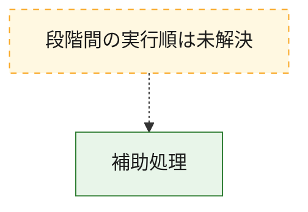
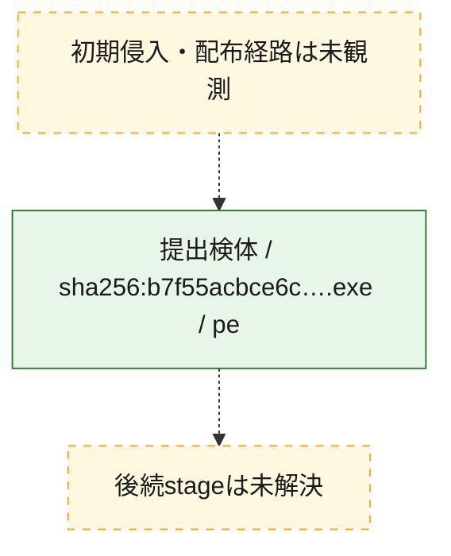
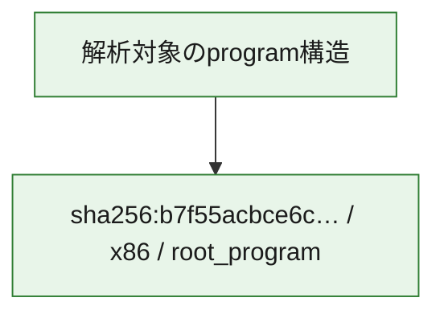

# 全体ロジック：b7f55acbce6cd8fc6402463dcbefc744e88d2827503c8722960b15b507f255c0

代表関数から主要なmalware処理段階を自動分類できませんでした。

## 読み方

- phaseの掲載順は解析上の整理順です。observed_call_edgesがない段階間の実行順を断定しません。
- 図の実線は静的に観測した関係、点線と黄色のノードは未観測・未解決の関係を示します。
- 図は静的な要約であり、動的実行を再現するものではありません。
- 詳細な関数解説とfingerprintは[STATIC-LOGIC.md](STATIC-LOGIC.md)を参照してください。

## 静的可視化

### 実行フロー

### 感染チェーン

### モジュール関係

## 処理段階

### 1. 補助処理

主要処理を支える一般内部関数またはlibrary処理を確認します。
確度: `confirmed_static_function_evidence`

- `b7f55acbce6cd8fc6402463dcbefc744e88d2827503c8722960b15b507f255c0:ghidra:1400010a0` — 検体内部の一般処理を実装する関数です。 状態: `succeeded`、選定理由: `context_representative`, `reviewed_call_centrality:2`
- `b7f55acbce6cd8fc6402463dcbefc744e88d2827503c8722960b15b507f255c0:ghidra:1400011e0` — 検体内部の一般処理を実装する関数です。 状態: `succeeded`、選定理由: `context_representative`, `reviewed_call_centrality:4`
- `b7f55acbce6cd8fc6402463dcbefc744e88d2827503c8722960b15b507f255c0:ghidra:140001260` — 検体内部の一般処理を実装する関数です。 状態: `succeeded`、選定理由: `context_representative`, `reviewed_call_centrality:4`
- `b7f55acbce6cd8fc6402463dcbefc744e88d2827503c8722960b15b507f255c0:ghidra:140001300` — 検体内部の一般処理を実装する関数です。 状態: `succeeded`、選定理由: `context_representative`, `reviewed_call_centrality:4`
- `b7f55acbce6cd8fc6402463dcbefc744e88d2827503c8722960b15b507f255c0:ghidra:140001400` — 検体内部の一般処理を実装する関数です。 状態: `succeeded`、選定理由: `context_representative`, `reviewed_call_centrality:8`
- `b7f55acbce6cd8fc6402463dcbefc744e88d2827503c8722960b15b507f255c0:ghidra:140001880` — 検体内部の一般処理を実装する関数です。 状態: `succeeded`、選定理由: `context_representative`, `reviewed_call_centrality:2`
- `b7f55acbce6cd8fc6402463dcbefc744e88d2827503c8722960b15b507f255c0:ghidra:140001980` — 検体内部の一般処理を実装する関数です。 状態: `succeeded`、選定理由: `context_representative`, `reviewed_call_centrality:2`
- `b7f55acbce6cd8fc6402463dcbefc744e88d2827503c8722960b15b507f255c0:ghidra:140001a00` — 検体内部の一般処理を実装する関数です。 状態: `succeeded`、選定理由: `context_representative`, `reviewed_call_centrality:3`
- `b7f55acbce6cd8fc6402463dcbefc744e88d2827503c8722960b15b507f255c0:ghidra:140001a60` — 検体内部の一般処理を実装する関数です。 状態: `succeeded`、選定理由: `context_representative`, `reviewed_call_centrality:11`
- `b7f55acbce6cd8fc6402463dcbefc744e88d2827503c8722960b15b507f255c0:ghidra:140001fa0` — 検体内部の一般処理を実装する関数です。 状態: `succeeded`、選定理由: `context_representative`, `reviewed_call_centrality:11`
- `b7f55acbce6cd8fc6402463dcbefc744e88d2827503c8722960b15b507f255c0:ghidra:1400028e0` — 検体内部の一般処理を実装する関数です。 状態: `succeeded`、選定理由: `context_representative`, `reviewed_call_centrality:2`
- `b7f55acbce6cd8fc6402463dcbefc744e88d2827503c8722960b15b507f255c0:ghidra:140002960` — 検体内部の一般処理を実装する関数です。 状態: `succeeded`、選定理由: `context_representative`, `reviewed_call_centrality:2`
- `b7f55acbce6cd8fc6402463dcbefc744e88d2827503c8722960b15b507f255c0:ghidra:1400032e0` — 検体内部の一般処理を実装する関数です。 状態: `succeeded`、選定理由: `context_representative`, `reviewed_call_centrality:10`
- `b7f55acbce6cd8fc6402463dcbefc744e88d2827503c8722960b15b507f255c0:ghidra:140003560` — 検体内部の一般処理を実装する関数です。 状態: `succeeded`、選定理由: `context_representative`, `reviewed_call_centrality:5`
- `b7f55acbce6cd8fc6402463dcbefc744e88d2827503c8722960b15b507f255c0:ghidra:1400037e0` — 検体内部の一般処理を実装する関数です。 状態: `succeeded`、選定理由: `context_representative`, `reviewed_call_centrality:4`
- `b7f55acbce6cd8fc6402463dcbefc744e88d2827503c8722960b15b507f255c0:ghidra:140003900` — 検体内部の一般処理を実装する関数です。 状態: `succeeded`、選定理由: `context_representative`, `reviewed_call_centrality:7`
- `b7f55acbce6cd8fc6402463dcbefc744e88d2827503c8722960b15b507f255c0:ghidra:140003a40` — 検体内部の一般処理を実装する関数です。 状態: `succeeded`、選定理由: `context_representative`, `reviewed_call_centrality:9`
- `b7f55acbce6cd8fc6402463dcbefc744e88d2827503c8722960b15b507f255c0:ghidra:140003d00` — 検体内部の一般処理を実装する関数です。 状態: `succeeded`、選定理由: `context_representative`, `reviewed_call_centrality:3`
- `b7f55acbce6cd8fc6402463dcbefc744e88d2827503c8722960b15b507f255c0:ghidra:140003d80` — 検体内部の一般処理を実装する関数です。 状態: `succeeded`、選定理由: `context_representative`, `reviewed_call_centrality:5`
- `b7f55acbce6cd8fc6402463dcbefc744e88d2827503c8722960b15b507f255c0:ghidra:140003f20` — 検体内部の一般処理を実装する関数です。 状態: `succeeded`、選定理由: `context_representative`, `reviewed_call_centrality:8`
- `b7f55acbce6cd8fc6402463dcbefc744e88d2827503c8722960b15b507f255c0:ghidra:1400040c0` — 検体内部の一般処理を実装する関数です。 状態: `succeeded`、選定理由: `context_representative`, `reviewed_call_centrality:8`
- `b7f55acbce6cd8fc6402463dcbefc744e88d2827503c8722960b15b507f255c0:ghidra:1400042a0` — 検体内部の一般処理を実装する関数です。 状態: `succeeded`、選定理由: `context_representative`, `reviewed_call_centrality:3`
- `b7f55acbce6cd8fc6402463dcbefc744e88d2827503c8722960b15b507f255c0:ghidra:1400044a0` — 検体内部の一般処理を実装する関数です。 状態: `succeeded`、選定理由: `context_representative`, `reviewed_call_centrality:3`
- `b7f55acbce6cd8fc6402463dcbefc744e88d2827503c8722960b15b507f255c0:ghidra:140004500` — 検体内部の一般処理を実装する関数です。 状態: `succeeded`、選定理由: `context_representative`, `reviewed_call_centrality:6`
- `b7f55acbce6cd8fc6402463dcbefc744e88d2827503c8722960b15b507f255c0:ghidra:140004660` — 検体内部の一般処理を実装する関数です。 状態: `succeeded`、選定理由: `context_representative`, `reviewed_call_centrality:6`
- `b7f55acbce6cd8fc6402463dcbefc744e88d2827503c8722960b15b507f255c0:ghidra:1400047c0` — 検体内部の一般処理を実装する関数です。 状態: `succeeded`、選定理由: `context_representative`, `reviewed_call_centrality:7`
- `b7f55acbce6cd8fc6402463dcbefc744e88d2827503c8722960b15b507f255c0:ghidra:140004940` — 検体内部の一般処理を実装する関数です。 状態: `succeeded`、選定理由: `context_representative`, `reviewed_call_centrality:2`
- `b7f55acbce6cd8fc6402463dcbefc744e88d2827503c8722960b15b507f255c0:ghidra:140004b60` — 検体内部の一般処理を実装する関数です。 状態: `succeeded`、選定理由: `context_representative`, `reviewed_call_centrality:8`
- `b7f55acbce6cd8fc6402463dcbefc744e88d2827503c8722960b15b507f255c0:ghidra:140004d80` — 検体内部の一般処理を実装する関数です。 状態: `succeeded`、選定理由: `context_representative`, `reviewed_call_centrality:6`
- `b7f55acbce6cd8fc6402463dcbefc744e88d2827503c8722960b15b507f255c0:ghidra:140004e80` — 検体内部の一般処理を実装する関数です。 状態: `succeeded`、選定理由: `context_representative`, `reviewed_call_centrality:5`
- `b7f55acbce6cd8fc6402463dcbefc744e88d2827503c8722960b15b507f255c0:ghidra:140004fa0` — 検体内部の一般処理を実装する関数です。 状態: `succeeded`、選定理由: `context_representative`, `reviewed_call_centrality:7`
- `b7f55acbce6cd8fc6402463dcbefc744e88d2827503c8722960b15b507f255c0:ghidra:140005180` — 検体内部の一般処理を実装する関数です。 状態: `succeeded`、選定理由: `context_representative`, `reviewed_call_centrality:5`

## 観測したcall関係

- `b7f55acbce6cd8fc6402463dcbefc744e88d2827503c8722960b15b507f255c0:ghidra:140001a00` → `b7f55acbce6cd8fc6402463dcbefc744e88d2827503c8722960b15b507f255c0:ghidra:140001a60` （`support` → `support`）
- `b7f55acbce6cd8fc6402463dcbefc744e88d2827503c8722960b15b507f255c0:ghidra:140001a00` → `b7f55acbce6cd8fc6402463dcbefc744e88d2827503c8722960b15b507f255c0:ghidra:140001fa0` （`support` → `support`）
- `b7f55acbce6cd8fc6402463dcbefc744e88d2827503c8722960b15b507f255c0:ghidra:1400032e0` → `b7f55acbce6cd8fc6402463dcbefc744e88d2827503c8722960b15b507f255c0:ghidra:140004d80` （`support` → `support`）
- `b7f55acbce6cd8fc6402463dcbefc744e88d2827503c8722960b15b507f255c0:ghidra:1400037e0` → `b7f55acbce6cd8fc6402463dcbefc744e88d2827503c8722960b15b507f255c0:ghidra:140003900` （`support` → `support`）
- `b7f55acbce6cd8fc6402463dcbefc744e88d2827503c8722960b15b507f255c0:ghidra:1400037e0` → `b7f55acbce6cd8fc6402463dcbefc744e88d2827503c8722960b15b507f255c0:ghidra:140004fa0` （`support` → `support`）
- `b7f55acbce6cd8fc6402463dcbefc744e88d2827503c8722960b15b507f255c0:ghidra:140003d80` → `b7f55acbce6cd8fc6402463dcbefc744e88d2827503c8722960b15b507f255c0:ghidra:140004d80` （`support` → `support`）
- `b7f55acbce6cd8fc6402463dcbefc744e88d2827503c8722960b15b507f255c0:ghidra:140003d80` → `b7f55acbce6cd8fc6402463dcbefc744e88d2827503c8722960b15b507f255c0:ghidra:140005180` （`support` → `support`）
- `b7f55acbce6cd8fc6402463dcbefc744e88d2827503c8722960b15b507f255c0:ghidra:140003f20` → `b7f55acbce6cd8fc6402463dcbefc744e88d2827503c8722960b15b507f255c0:ghidra:1400040c0` （`support` → `support`）
- `b7f55acbce6cd8fc6402463dcbefc744e88d2827503c8722960b15b507f255c0:ghidra:140003f20` → `b7f55acbce6cd8fc6402463dcbefc744e88d2827503c8722960b15b507f255c0:ghidra:1400042a0` （`support` → `support`）
- `b7f55acbce6cd8fc6402463dcbefc744e88d2827503c8722960b15b507f255c0:ghidra:1400042a0` → `b7f55acbce6cd8fc6402463dcbefc744e88d2827503c8722960b15b507f255c0:ghidra:1400011e0` （`support` → `support`）
- `b7f55acbce6cd8fc6402463dcbefc744e88d2827503c8722960b15b507f255c0:ghidra:140004d80` → `b7f55acbce6cd8fc6402463dcbefc744e88d2827503c8722960b15b507f255c0:ghidra:140004e80` （`support` → `support`）
- `ghidra-function:09fa5c992d107f04ff167426` → `ghidra-external:dd3fca267ebe4c71169d72ff` （`unclassified` → `unclassified`）
- `ghidra-function:09fa5c992d107f04ff167426` → `ghidra-external:ede1ac84e0cd388dadcc872b` （`unclassified` → `unclassified`）
- `ghidra-function:09fa5c992d107f04ff167426` → `ghidra-function:7e6c8f1fd3c5734442eafb76` （`unclassified` → `unclassified`）
- `ghidra-function:09fa5c992d107f04ff167426` → `ghidra-function:aefff3cae5c8f6cd9d5e47f6` （`unclassified` → `unclassified`）
- `ghidra-function:09fa5c992d107f04ff167426` → `ghidra-function:c64a16634227180c5a52a090` （`unclassified` → `unclassified`）
- `ghidra-function:09fa5c992d107f04ff167426` → `ghidra-function:d1f63ef42f39fefc787e3cbd` （`unclassified` → `unclassified`）
- `ghidra-function:09fa5c992d107f04ff167426` → `ghidra-function:f97e06a6cd87aacbfbbe6abc` （`unclassified` → `unclassified`）
- `ghidra-function:09fa5c992d107f04ff167426` → `ghidra-function:ff81f8e4028c9a54f0594d20` （`unclassified` → `unclassified`）
- `ghidra-function:0ae12496af75533f0e41fe61` → `ghidra-external:1b4cd475553d4d05728512ba` （`unclassified` → `unclassified`）
- `ghidra-function:0ae12496af75533f0e41fe61` → `ghidra-external:268f63fa62d4222ced1b552f` （`unclassified` → `unclassified`）
- `ghidra-function:0ae12496af75533f0e41fe61` → `ghidra-external:584064fa6882b2ab7ae4751e` （`unclassified` → `unclassified`）
- `ghidra-function:0ae12496af75533f0e41fe61` → `ghidra-external:cb3b5b70e8c3fb139d599c48` （`unclassified` → `unclassified`）
- `ghidra-function:0ae12496af75533f0e41fe61` → `ghidra-external:dd3fca267ebe4c71169d72ff` （`unclassified` → `unclassified`）
- `ghidra-function:0ae12496af75533f0e41fe61` → `ghidra-function:d1f63ef42f39fefc787e3cbd` （`unclassified` → `unclassified`）
- `ghidra-function:0e8e7d62aacb2796df4f7e32` → `ghidra-external:1b4cd475553d4d05728512ba` （`unclassified` → `unclassified`）
- `ghidra-function:0e8e7d62aacb2796df4f7e32` → `ghidra-external:268f63fa62d4222ced1b552f` （`unclassified` → `unclassified`）
- `ghidra-function:0e8e7d62aacb2796df4f7e32` → `ghidra-external:3c2059f7e9266c727b6a1b42` （`unclassified` → `unclassified`）
- `ghidra-function:0e8e7d62aacb2796df4f7e32` → `ghidra-external:584064fa6882b2ab7ae4751e` （`unclassified` → `unclassified`）
- `ghidra-function:0e8e7d62aacb2796df4f7e32` → `ghidra-external:6d8b5badcf819dd75b3834a5` （`unclassified` → `unclassified`）
- `ghidra-function:0e8e7d62aacb2796df4f7e32` → `ghidra-external:cb3b5b70e8c3fb139d599c48` （`unclassified` → `unclassified`）
- `ghidra-function:0e8e7d62aacb2796df4f7e32` → `ghidra-external:dd3fca267ebe4c71169d72ff` （`unclassified` → `unclassified`）
- `ghidra-function:0e8e7d62aacb2796df4f7e32` → `ghidra-function:d1f63ef42f39fefc787e3cbd` （`unclassified` → `unclassified`）
- `ghidra-function:19500e50ed3fbd024b1d1c8d` → `ghidra-external:6d8b5badcf819dd75b3834a5` （`unclassified` → `unclassified`）
- `ghidra-function:19500e50ed3fbd024b1d1c8d` → `ghidra-external:dd3fca267ebe4c71169d72ff` （`unclassified` → `unclassified`）
- `ghidra-function:1c62f96e2903c7e89cc1abcd` → `ghidra-external:1b4cd475553d4d05728512ba` （`unclassified` → `unclassified`）
- `ghidra-function:1c62f96e2903c7e89cc1abcd` → `ghidra-external:268f63fa62d4222ced1b552f` （`unclassified` → `unclassified`）
- `ghidra-function:1c62f96e2903c7e89cc1abcd` → `ghidra-external:cb3b5b70e8c3fb139d599c48` （`unclassified` → `unclassified`）
- `ghidra-function:1c62f96e2903c7e89cc1abcd` → `ghidra-external:dd3fca267ebe4c71169d72ff` （`unclassified` → `unclassified`）
- `ghidra-function:1c62f96e2903c7e89cc1abcd` → `ghidra-external:e110247be88f29f7466feb07` （`unclassified` → `unclassified`）
- `ghidra-function:1c62f96e2903c7e89cc1abcd` → `ghidra-external:ede1ac84e0cd388dadcc872b` （`unclassified` → `unclassified`）
- `ghidra-function:1ddaceed1e2cb8e169bf321d` → `ghidra-external:18b2a1a312b9a42df391b0f2` （`unclassified` → `unclassified`）
- `ghidra-function:1ddaceed1e2cb8e169bf321d` → `ghidra-external:59c649d7e33c127e5d7e22af` （`unclassified` → `unclassified`）
- `ghidra-function:1ddaceed1e2cb8e169bf321d` → `ghidra-external:6d8b5badcf819dd75b3834a5` （`unclassified` → `unclassified`）
- `ghidra-function:1ddaceed1e2cb8e169bf321d` → `ghidra-external:8b2f03a8ce49fb48f83c1580` （`unclassified` → `unclassified`）
- `ghidra-function:1ddaceed1e2cb8e169bf321d` → `ghidra-external:9f0b311ef2a352915fec21cf` （`unclassified` → `unclassified`）
- `ghidra-function:1ddaceed1e2cb8e169bf321d` → `ghidra-external:cb85415fdf7315f0c5c10a3a` （`unclassified` → `unclassified`）
- `ghidra-function:1ddaceed1e2cb8e169bf321d` → `ghidra-external:dd3fca267ebe4c71169d72ff` （`unclassified` → `unclassified`）
- `ghidra-function:1ddaceed1e2cb8e169bf321d` → `ghidra-function:730ba82c59b7eab935f0514d` （`unclassified` → `unclassified`）
- `ghidra-function:1ddaceed1e2cb8e169bf321d` → `ghidra-function:7363e1370f9936ca8df1f4cb` （`unclassified` → `unclassified`）
- `ghidra-function:1ddaceed1e2cb8e169bf321d` → `ghidra-function:8bf314119042535bfe57913a` （`unclassified` → `unclassified`）
- `ghidra-function:1f845861eb028f9402efb1ea` → `ghidra-external:18b2a1a312b9a42df391b0f2` （`unclassified` → `unclassified`）
- `ghidra-function:1f845861eb028f9402efb1ea` → `ghidra-external:9d8597c69d1f2957e8f5ed57` （`unclassified` → `unclassified`）
- `ghidra-function:1f845861eb028f9402efb1ea` → `ghidra-external:cb85415fdf7315f0c5c10a3a` （`unclassified` → `unclassified`）
- `ghidra-function:1f845861eb028f9402efb1ea` → `ghidra-external:dd3fca267ebe4c71169d72ff` （`unclassified` → `unclassified`）
- `ghidra-function:1f845861eb028f9402efb1ea` → `ghidra-function:157a1e89698725e7f7ca3d8c` （`unclassified` → `unclassified`）
- `ghidra-function:1f845861eb028f9402efb1ea` → `ghidra-function:6b5146b8d4bf1b988a78185e` （`unclassified` → `unclassified`）
- `ghidra-function:1f845861eb028f9402efb1ea` → `ghidra-function:7e6c8f1fd3c5734442eafb76` （`unclassified` → `unclassified`）
- `ghidra-function:1f845861eb028f9402efb1ea` → `ghidra-function:c1744ff52380fccb64e019f6` （`unclassified` → `unclassified`）
- `ghidra-function:2550c3cf1a4235f3110e757b` → `ghidra-external:3c2059f7e9266c727b6a1b42` （`unclassified` → `unclassified`）
- `ghidra-function:2550c3cf1a4235f3110e757b` → `ghidra-external:dd3fca267ebe4c71169d72ff` （`unclassified` → `unclassified`）
- `ghidra-function:2550c3cf1a4235f3110e757b` → `ghidra-function:7e6c8f1fd3c5734442eafb76` （`unclassified` → `unclassified`）
- `ghidra-function:2550c3cf1a4235f3110e757b` → `ghidra-function:f566f1ba8e4bff230016e090` （`unclassified` → `unclassified`）
- `ghidra-function:37f69429897e8c99fcaf9332` → `ghidra-external:1b4cd475553d4d05728512ba` （`unclassified` → `unclassified`）
- `ghidra-function:37f69429897e8c99fcaf9332` → `ghidra-external:268f63fa62d4222ced1b552f` （`unclassified` → `unclassified`）
- `ghidra-function:37f69429897e8c99fcaf9332` → `ghidra-external:cb3b5b70e8c3fb139d599c48` （`unclassified` → `unclassified`）
- `ghidra-function:37f69429897e8c99fcaf9332` → `ghidra-external:dd3fca267ebe4c71169d72ff` （`unclassified` → `unclassified`）
- `ghidra-function:37f69429897e8c99fcaf9332` → `ghidra-external:e110247be88f29f7466feb07` （`unclassified` → `unclassified`）
- `ghidra-function:37f69429897e8c99fcaf9332` → `ghidra-external:ede1ac84e0cd388dadcc872b` （`unclassified` → `unclassified`）
- `ghidra-function:3a093534b54535a367b71a7e` → `ghidra-external:7712f95a604c49d73dec94f7` （`unclassified` → `unclassified`）
- `ghidra-function:3a093534b54535a367b71a7e` → `ghidra-external:dd3fca267ebe4c71169d72ff` （`unclassified` → `unclassified`）
- `ghidra-function:3a093534b54535a367b71a7e` → `ghidra-function:157a1e89698725e7f7ca3d8c` （`unclassified` → `unclassified`）
- `ghidra-function:3a093534b54535a367b71a7e` → `ghidra-function:3b16e7d75422a6c012cbf51b` （`unclassified` → `unclassified`）
- `ghidra-function:3a093534b54535a367b71a7e` → `ghidra-function:c5507bcd540832da7da16ea5` （`unclassified` → `unclassified`）
- `ghidra-function:3acab1b1372d304db3083d5b` → `ghidra-external:6d8b5badcf819dd75b3834a5` （`unclassified` → `unclassified`）
- `ghidra-function:3acab1b1372d304db3083d5b` → `ghidra-external:dd3fca267ebe4c71169d72ff` （`unclassified` → `unclassified`）
- `ghidra-function:3b16e7d75422a6c012cbf51b` → `ghidra-external:dd3fca267ebe4c71169d72ff` （`unclassified` → `unclassified`）
- `ghidra-function:3b16e7d75422a6c012cbf51b` → `ghidra-function:0676cf0c95c9c8239eae2e2c` （`unclassified` → `unclassified`）
- `ghidra-function:3b16e7d75422a6c012cbf51b` → `ghidra-function:2550c3cf1a4235f3110e757b` （`unclassified` → `unclassified`）
- `ghidra-function:3b16e7d75422a6c012cbf51b` → `ghidra-function:7e6c8f1fd3c5734442eafb76` （`unclassified` → `unclassified`）
- `ghidra-function:3c682aea2fe66c0c634f8b7b` → `ghidra-external:6d8b5badcf819dd75b3834a5` （`unclassified` → `unclassified`）
- `ghidra-function:3c682aea2fe66c0c634f8b7b` → `ghidra-external:dd3fca267ebe4c71169d72ff` （`unclassified` → `unclassified`）
- `ghidra-function:45b0c5b81cc82629bbc6028e` → `ghidra-external:dd3fca267ebe4c71169d72ff` （`unclassified` → `unclassified`）
- `ghidra-function:45b0c5b81cc82629bbc6028e` → `ghidra-function:396a652916ed02b9658b1872` （`unclassified` → `unclassified`）
- `ghidra-function:45b0c5b81cc82629bbc6028e` → `ghidra-function:42103cf895ad250fe6124331` （`unclassified` → `unclassified`）
- `ghidra-function:4db5f6a05307e36bbf458a38` → `ghidra-external:3c2059f7e9266c727b6a1b42` （`unclassified` → `unclassified`）
- `ghidra-function:4db5f6a05307e36bbf458a38` → `ghidra-external:9f0b311ef2a352915fec21cf` （`unclassified` → `unclassified`）
- `ghidra-function:4db5f6a05307e36bbf458a38` → `ghidra-external:cb85415fdf7315f0c5c10a3a` （`unclassified` → `unclassified`）
- `ghidra-function:4db5f6a05307e36bbf458a38` → `ghidra-external:dd3fca267ebe4c71169d72ff` （`unclassified` → `unclassified`）
- `ghidra-function:4db5f6a05307e36bbf458a38` → `ghidra-function:157a1e89698725e7f7ca3d8c` （`unclassified` → `unclassified`）
- `ghidra-function:4e01e4b32c470e6dd4f8eb3e` → `ghidra-external:dd3fca267ebe4c71169d72ff` （`unclassified` → `unclassified`）
- `ghidra-function:4e01e4b32c470e6dd4f8eb3e` → `ghidra-external:ede1ac84e0cd388dadcc872b` （`unclassified` → `unclassified`）
- `ghidra-function:4e01e4b32c470e6dd4f8eb3e` → `ghidra-function:472571bdb7bcdbbb579feea3` （`unclassified` → `unclassified`）
- `ghidra-function:4e01e4b32c470e6dd4f8eb3e` → `ghidra-function:f3164e3f2b3d9dd1db87be41` （`unclassified` → `unclassified`）
- `ghidra-function:508e3c0d915dda9d9e1b0a80` → `ghidra-external:1b4cd475553d4d05728512ba` （`unclassified` → `unclassified`）
- `ghidra-function:508e3c0d915dda9d9e1b0a80` → `ghidra-external:268f63fa62d4222ced1b552f` （`unclassified` → `unclassified`）
- `ghidra-function:508e3c0d915dda9d9e1b0a80` → `ghidra-external:584064fa6882b2ab7ae4751e` （`unclassified` → `unclassified`）
- `ghidra-function:508e3c0d915dda9d9e1b0a80` → `ghidra-external:cb3b5b70e8c3fb139d599c48` （`unclassified` → `unclassified`）
- `ghidra-function:508e3c0d915dda9d9e1b0a80` → `ghidra-external:dd3fca267ebe4c71169d72ff` （`unclassified` → `unclassified`）
- `ghidra-function:508e3c0d915dda9d9e1b0a80` → `ghidra-function:d1f63ef42f39fefc787e3cbd` （`unclassified` → `unclassified`）
- `ghidra-function:590daba949bbac1becdda153` → `ghidra-external:6d8b5badcf819dd75b3834a5` （`unclassified` → `unclassified`）
- `ghidra-function:590daba949bbac1becdda153` → `ghidra-external:dd3fca267ebe4c71169d72ff` （`unclassified` → `unclassified`）
- `ghidra-function:70e0bbca771486a98cadbf28` → `ghidra-external:cb85415fdf7315f0c5c10a3a` （`unclassified` → `unclassified`）
- `ghidra-function:70e0bbca771486a98cadbf28` → `ghidra-function:c6d412859a1346a863703dd9` （`unclassified` → `unclassified`）
- `ghidra-function:772acff9b851e5412e6ccc95` → `ghidra-external:1b4cd475553d4d05728512ba` （`unclassified` → `unclassified`）
- `ghidra-function:772acff9b851e5412e6ccc95` → `ghidra-external:268f63fa62d4222ced1b552f` （`unclassified` → `unclassified`）
- `ghidra-function:772acff9b851e5412e6ccc95` → `ghidra-external:3c2059f7e9266c727b6a1b42` （`unclassified` → `unclassified`）
- `ghidra-function:772acff9b851e5412e6ccc95` → `ghidra-external:584064fa6882b2ab7ae4751e` （`unclassified` → `unclassified`）
- `ghidra-function:772acff9b851e5412e6ccc95` → `ghidra-external:cb3b5b70e8c3fb139d599c48` （`unclassified` → `unclassified`）
- `ghidra-function:772acff9b851e5412e6ccc95` → `ghidra-external:dd3fca267ebe4c71169d72ff` （`unclassified` → `unclassified`）
- `ghidra-function:772acff9b851e5412e6ccc95` → `ghidra-function:d1f63ef42f39fefc787e3cbd` （`unclassified` → `unclassified`）
- `ghidra-function:8a79b6fd9ea24b0d6416ee79` → `ghidra-external:3c2059f7e9266c727b6a1b42` （`unclassified` → `unclassified`）
- `ghidra-function:8a79b6fd9ea24b0d6416ee79` → `ghidra-external:410a98413f7d98bd1cfa3a4d` （`unclassified` → `unclassified`）
- `ghidra-function:8a79b6fd9ea24b0d6416ee79` → `ghidra-external:8327f81f02b848552961b466` （`unclassified` → `unclassified`）
- `ghidra-function:8a79b6fd9ea24b0d6416ee79` → `ghidra-external:cb85415fdf7315f0c5c10a3a` （`unclassified` → `unclassified`）
- `ghidra-function:8a79b6fd9ea24b0d6416ee79` → `ghidra-external:dd3fca267ebe4c71169d72ff` （`unclassified` → `unclassified`）
- `ghidra-function:8a79b6fd9ea24b0d6416ee79` → `ghidra-external:ede1ac84e0cd388dadcc872b` （`unclassified` → `unclassified`）
- `ghidra-function:8a79b6fd9ea24b0d6416ee79` → `ghidra-function:0676cf0c95c9c8239eae2e2c` （`unclassified` → `unclassified`）
- `ghidra-function:8a79b6fd9ea24b0d6416ee79` → `ghidra-function:157a1e89698725e7f7ca3d8c` （`unclassified` → `unclassified`）
- `ghidra-function:8a79b6fd9ea24b0d6416ee79` → `ghidra-function:3b16e7d75422a6c012cbf51b` （`unclassified` → `unclassified`）
- `ghidra-function:8a79b6fd9ea24b0d6416ee79` → `ghidra-function:f97e06a6cd87aacbfbbe6abc` （`unclassified` → `unclassified`）
- `ghidra-function:aefff3cae5c8f6cd9d5e47f6` → `ghidra-external:dd3fca267ebe4c71169d72ff` （`unclassified` → `unclassified`）
- `ghidra-function:aefff3cae5c8f6cd9d5e47f6` → `ghidra-function:e643ea203eded12bc06bfac1` （`unclassified` → `unclassified`）
- `ghidra-function:b5bc8155a6575fb16822908e` → `ghidra-external:dd3fca267ebe4c71169d72ff` （`unclassified` → `unclassified`）
- `ghidra-function:b5bc8155a6575fb16822908e` → `ghidra-function:1c62f96e2903c7e89cc1abcd` （`unclassified` → `unclassified`）
- `ghidra-function:b5bc8155a6575fb16822908e` → `ghidra-function:37f69429897e8c99fcaf9332` （`unclassified` → `unclassified`）
- `ghidra-function:b5bc8155a6575fb16822908e` → `ghidra-function:d1f63ef42f39fefc787e3cbd` （`unclassified` → `unclassified`）
- `ghidra-function:bae87f7e97f36bbab2408bb2` → `ghidra-external:1b4cd475553d4d05728512ba` （`unclassified` → `unclassified`）
- `ghidra-function:bae87f7e97f36bbab2408bb2` → `ghidra-external:268f63fa62d4222ced1b552f` （`unclassified` → `unclassified`）
- `ghidra-function:bae87f7e97f36bbab2408bb2` → `ghidra-external:3c2059f7e9266c727b6a1b42` （`unclassified` → `unclassified`）
- `ghidra-function:bae87f7e97f36bbab2408bb2` → `ghidra-external:584064fa6882b2ab7ae4751e` （`unclassified` → `unclassified`）
- `ghidra-function:bae87f7e97f36bbab2408bb2` → `ghidra-external:cb3b5b70e8c3fb139d599c48` （`unclassified` → `unclassified`）
- `ghidra-function:bae87f7e97f36bbab2408bb2` → `ghidra-external:dd3fca267ebe4c71169d72ff` （`unclassified` → `unclassified`）
- `ghidra-function:bae87f7e97f36bbab2408bb2` → `ghidra-function:0bd557eafae3d8b0e02b5d54` （`unclassified` → `unclassified`）
- `ghidra-function:bae87f7e97f36bbab2408bb2` → `ghidra-function:2801ef47d9beb80fbaf9a9f1` （`unclassified` → `unclassified`）
- `ghidra-function:bae87f7e97f36bbab2408bb2` → `ghidra-function:d1f63ef42f39fefc787e3cbd` （`unclassified` → `unclassified`）
- `ghidra-function:c29d146ada73ddfa0031730e` → `ghidra-external:dd3fca267ebe4c71169d72ff` （`unclassified` → `unclassified`）
- `ghidra-function:c29d146ada73ddfa0031730e` → `ghidra-function:1ddaceed1e2cb8e169bf321d` （`unclassified` → `unclassified`）
- `ghidra-function:c29d146ada73ddfa0031730e` → `ghidra-function:c847ee06c3d1c4b7b58f239a` （`unclassified` → `unclassified`）
- `ghidra-function:c5507bcd540832da7da16ea5` → `ghidra-external:3c2059f7e9266c727b6a1b42` （`unclassified` → `unclassified`）
- `ghidra-function:c5507bcd540832da7da16ea5` → `ghidra-external:dd3fca267ebe4c71169d72ff` （`unclassified` → `unclassified`）
- `ghidra-function:c5507bcd540832da7da16ea5` → `ghidra-function:2801ef47d9beb80fbaf9a9f1` （`unclassified` → `unclassified`）
- `ghidra-function:c5507bcd540832da7da16ea5` → `ghidra-function:7e6c8f1fd3c5734442eafb76` （`unclassified` → `unclassified`）
- `ghidra-function:c64a16634227180c5a52a090` → `ghidra-external:1b4cd475553d4d05728512ba` （`unclassified` → `unclassified`）
- `ghidra-function:c64a16634227180c5a52a090` → `ghidra-external:268f63fa62d4222ced1b552f` （`unclassified` → `unclassified`）
- `ghidra-function:c64a16634227180c5a52a090` → `ghidra-external:cb3b5b70e8c3fb139d599c48` （`unclassified` → `unclassified`）
- `ghidra-function:c64a16634227180c5a52a090` → `ghidra-external:d9eed14b7b217ea4b270326e` （`unclassified` → `unclassified`）
- `ghidra-function:c64a16634227180c5a52a090` → `ghidra-external:dd3fca267ebe4c71169d72ff` （`unclassified` → `unclassified`）
- `ghidra-function:c64a16634227180c5a52a090` → `ghidra-external:e110247be88f29f7466feb07` （`unclassified` → `unclassified`）
- `ghidra-function:c64a16634227180c5a52a090` → `ghidra-function:347cc436f8b07e03f567a188` （`unclassified` → `unclassified`）
- `ghidra-function:c71c0c97db7af82ae9853434` → `ghidra-external:3c2059f7e9266c727b6a1b42` （`unclassified` → `unclassified`）
- `ghidra-function:c71c0c97db7af82ae9853434` → `ghidra-external:dd3fca267ebe4c71169d72ff` （`unclassified` → `unclassified`）
- `ghidra-function:c71c0c97db7af82ae9853434` → `ghidra-function:f566f1ba8e4bff230016e090` （`unclassified` → `unclassified`）
- `ghidra-function:c847ee06c3d1c4b7b58f239a` → `ghidra-external:3c2059f7e9266c727b6a1b42` （`unclassified` → `unclassified`）
- `ghidra-function:c847ee06c3d1c4b7b58f239a` → `ghidra-external:418b382a13c6ca0bb4a8e675` （`unclassified` → `unclassified`）
- `ghidra-function:c847ee06c3d1c4b7b58f239a` → `ghidra-external:60cfa9a887ac23043f0471f0` （`unclassified` → `unclassified`）
- `ghidra-function:c847ee06c3d1c4b7b58f239a` → `ghidra-external:92bf324929c05c7affb96283` （`unclassified` → `unclassified`）
- `ghidra-function:c847ee06c3d1c4b7b58f239a` → `ghidra-external:946c7b1e115cc380441ad9f5` （`unclassified` → `unclassified`）
- `ghidra-function:c847ee06c3d1c4b7b58f239a` → `ghidra-external:d8c0cf9de74b37f6e1223bdd` （`unclassified` → `unclassified`）
- `ghidra-function:c847ee06c3d1c4b7b58f239a` → `ghidra-external:dd3fca267ebe4c71169d72ff` （`unclassified` → `unclassified`）
- `ghidra-function:c847ee06c3d1c4b7b58f239a` → `ghidra-external:dd99e11ffba5f8867f3cdc05` （`unclassified` → `unclassified`）
- `ghidra-function:c847ee06c3d1c4b7b58f239a` → `ghidra-function:0676cf0c95c9c8239eae2e2c` （`unclassified` → `unclassified`）
- `ghidra-function:c847ee06c3d1c4b7b58f239a` → `ghidra-function:3cceea19d3f35759e66f6172` （`unclassified` → `unclassified`）
- `ghidra-function:e643ea203eded12bc06bfac1` → `ghidra-external:2dec1dddce319a0c8df23512` （`unclassified` → `unclassified`）
- `ghidra-function:e643ea203eded12bc06bfac1` → `ghidra-external:8b2f03a8ce49fb48f83c1580` （`unclassified` → `unclassified`）
- `ghidra-function:e643ea203eded12bc06bfac1` → `ghidra-function:472571bdb7bcdbbb579feea3` （`unclassified` → `unclassified`）
- `ghidra-function:e67257f2d48f40b1fb8215aa` → `ghidra-external:2dec1dddce319a0c8df23512` （`unclassified` → `unclassified`）
- `ghidra-function:e67257f2d48f40b1fb8215aa` → `ghidra-external:cb85415fdf7315f0c5c10a3a` （`unclassified` → `unclassified`）
- `ghidra-function:f1d0b62defb252bbf54a6b84` → `ghidra-external:dd3fca267ebe4c71169d72ff` （`unclassified` → `unclassified`）
- `ghidra-function:f1d0b62defb252bbf54a6b84` → `ghidra-external:ede1ac84e0cd388dadcc872b` （`unclassified` → `unclassified`）
- `ghidra-function:f1d0b62defb252bbf54a6b84` → `ghidra-function:472571bdb7bcdbbb579feea3` （`unclassified` → `unclassified`）
- `ghidra-function:f1d0b62defb252bbf54a6b84` → `ghidra-function:f3164e3f2b3d9dd1db87be41` （`unclassified` → `unclassified`）

## 解析範囲と制約

- 選定外関数は全体inventoryへ残しますが、関数本体の個別解説対象にはしていません。
- indirect call、難読化、packer、VM、壊れたcontrol flowによりcall関係が欠落する場合があります。
- 文書は静的解析に基づき、検体実行や外部通信による動的確認は行っていません。
