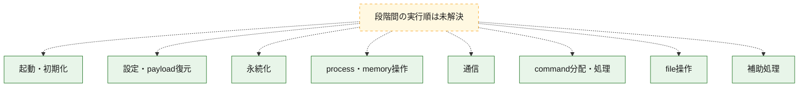
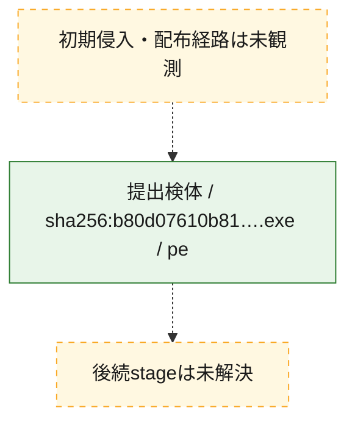
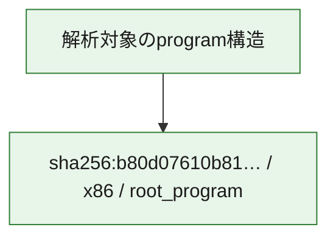

# 全体ロジック：b80d07610b81bddb3d7f30a207a2e134b559e06b8440598a926f3a9c1d439218

代表関数の静的証跡から、起動・初期化、設定・payload復元、永続化、process・memory操作、通信、command分配・処理、file操作の処理群を確認しました。

## 読み方

- phaseの掲載順は解析上の整理順です。observed_call_edgesがない段階間の実行順を断定しません。
- 図の実線は静的に観測した関係、点線と黄色のノードは未観測・未解決の関係を示します。
- 図は静的な要約であり、動的実行を再現するものではありません。
- 詳細な関数解説とfingerprintは[STATIC-LOGIC.md](STATIC-LOGIC.md)を参照してください。

## 静的可視化

### 実行フロー

### 感染チェーン

### モジュール関係

## 処理段階

### 1. 起動・初期化

entry pointから初期化と後続処理への移行を確認します。
確度: `confirmed_static_function_evidence`

- `b80d07610b81bddb3d7f30a207a2e134b559e06b8440598a926f3a9c1d439218:cil:0x060003eb` — 初期化と主要処理への分岐を行う入口関数です。 状態: `succeeded`、選定理由: `entry_point`, `large_function:instructions=275`, `reviewed_call_centrality:122`
- `b80d07610b81bddb3d7f30a207a2e134b559e06b8440598a926f3a9c1d439218:cil:0x06000a6b` — 初期化と主要処理への分岐を行う入口関数です。 状態: `succeeded`、選定理由: `entry_point`, `reviewed_call_centrality:2`
- `b80d07610b81bddb3d7f30a207a2e134b559e06b8440598a926f3a9c1d439218:cil:0x06000a6c` — 初期化と主要処理への分岐を行う入口関数です。 状態: `succeeded`、選定理由: `entry_point`, `reviewed_call_centrality:2`
- `b80d07610b81bddb3d7f30a207a2e134b559e06b8440598a926f3a9c1d439218:cil:0x06000a6d` — 初期化と主要処理への分岐を行う入口関数です。 状態: `succeeded`、選定理由: `entry_point`, `reviewed_call_centrality:2`
- `b80d07610b81bddb3d7f30a207a2e134b559e06b8440598a926f3a9c1d439218:cil:0x06000a6e` — 初期化と主要処理への分岐を行う入口関数です。 状態: `succeeded`、選定理由: `entry_point`, `reviewed_call_centrality:32`
- `b80d07610b81bddb3d7f30a207a2e134b559e06b8440598a926f3a9c1d439218:cil:0x06000a6f` — 初期化と主要処理への分岐を行う入口関数です。 状態: `succeeded`、選定理由: `entry_point`, `reviewed_call_centrality:4`
- `b80d07610b81bddb3d7f30a207a2e134b559e06b8440598a926f3a9c1d439218:cil:0x06000a74` — 初期化と主要処理への分岐を行う入口関数です。 状態: `succeeded`、選定理由: `entry_point`, `reviewed_call_centrality:2`
- `b80d07610b81bddb3d7f30a207a2e134b559e06b8440598a926f3a9c1d439218:cil:0x06000a76` — 初期化と主要処理への分岐を行う入口関数です。 状態: `succeeded`、選定理由: `entry_point`

### 2. 設定・payload復元

設定、resource、payload、暗号化データの復元・変換を確認します。
確度: `confirmed_static_function_evidence`

- `b80d07610b81bddb3d7f30a207a2e134b559e06b8440598a926f3a9c1d439218:cil:0x06000a25` — 設定、resource、payloadなどの解析・変換を行う関数です。 状態: `succeeded`、選定理由: `large_function:instructions=142`, `reviewed_call_centrality:64`, `role:config_or_data_transform`
- `b80d07610b81bddb3d7f30a207a2e134b559e06b8440598a926f3a9c1d439218:cil:0x06000ada` — 暗号、hash、encoding、または復号処理に関係する関数です。 状態: `succeeded`、選定理由: `large_function:instructions=85`, `reviewed_call_centrality:50`, `role:cryptographic_transform`

### 3. 永続化

自動起動や永続化に関係する設定変更を確認します。
確度: `confirmed_static_function_evidence`

- `b80d07610b81bddb3d7f30a207a2e134b559e06b8440598a926f3a9c1d439218:cil:0x0600081c` — 自動起動または永続化に関係する処理を含む関数です。 状態: `succeeded`、選定理由: `reviewed_call_centrality:12`, `role:persistence`

### 4. process・memory操作

process、thread、module、memory操作と実行移行を確認します。
確度: `confirmed_static_function_evidence`

- `b80d07610b81bddb3d7f30a207a2e134b559e06b8440598a926f3a9c1d439218:cil:0x06000a68` — process、thread、module、またはmemory操作に関係する関数です。 状態: `succeeded`、選定理由: `large_function:instructions=250`, `reviewed_call_centrality:36`, `role:process_or_memory_operation`

### 5. 通信

通信初期化、endpoint処理、送受信の役割を確認します。
確度: `confirmed_static_function_evidence`

- `b80d07610b81bddb3d7f30a207a2e134b559e06b8440598a926f3a9c1d439218:cil:0x060000ab` — 通信初期化、送受信、またはendpoint処理に関係する関数です。 状態: `succeeded`、選定理由: `large_function:instructions=803`, `reviewed_call_centrality:230`, `role:network_communication`
- `b80d07610b81bddb3d7f30a207a2e134b559e06b8440598a926f3a9c1d439218:cil:0x060000fe` — 通信初期化、送受信、またはendpoint処理に関係する関数です。 状態: `succeeded`、選定理由: `large_function:instructions=1232`, `reviewed_call_centrality:258`, `role:network_communication`
- `b80d07610b81bddb3d7f30a207a2e134b559e06b8440598a926f3a9c1d439218:cil:0x06000109` — 通信初期化、送受信、またはendpoint処理に関係する関数です。 状態: `succeeded`、選定理由: `large_function:instructions=827`, `reviewed_call_centrality:156`, `role:network_communication`
- `b80d07610b81bddb3d7f30a207a2e134b559e06b8440598a926f3a9c1d439218:cil:0x06000123` — 通信初期化、送受信、またはendpoint処理に関係する関数です。 状態: `succeeded`、選定理由: `large_function:instructions=450`, `reviewed_call_centrality:120`, `role:network_communication`
- `b80d07610b81bddb3d7f30a207a2e134b559e06b8440598a926f3a9c1d439218:cil:0x0600014b` — 通信初期化、送受信、またはendpoint処理に関係する関数です。 状態: `succeeded`、選定理由: `large_function:instructions=1321`, `reviewed_call_centrality:156`, `role:network_communication`
- `b80d07610b81bddb3d7f30a207a2e134b559e06b8440598a926f3a9c1d439218:cil:0x0600014d` — 通信初期化、送受信、またはendpoint処理に関係する関数です。 状態: `succeeded`、選定理由: `large_function:instructions=1752`, `reviewed_call_centrality:452`, `role:network_communication`
- `b80d07610b81bddb3d7f30a207a2e134b559e06b8440598a926f3a9c1d439218:cil:0x06000246` — 通信初期化、送受信、またはendpoint処理に関係する関数です。 状態: `succeeded`、選定理由: `large_function:instructions=376`, `reviewed_call_centrality:106`, `role:network_communication`
- `b80d07610b81bddb3d7f30a207a2e134b559e06b8440598a926f3a9c1d439218:cil:0x0600027b` — 通信初期化、送受信、またはendpoint処理に関係する関数です。 状態: `succeeded`、選定理由: `large_function:instructions=403`, `reviewed_call_centrality:92`, `role:network_communication`
- `b80d07610b81bddb3d7f30a207a2e134b559e06b8440598a926f3a9c1d439218:cil:0x0600030c` — 通信初期化、送受信、またはendpoint処理に関係する関数です。 状態: `succeeded`、選定理由: `large_function:instructions=378`, `reviewed_call_centrality:108`, `role:network_communication`
- `b80d07610b81bddb3d7f30a207a2e134b559e06b8440598a926f3a9c1d439218:cil:0x06000345` — 通信初期化、送受信、またはendpoint処理に関係する関数です。 状態: `succeeded`、選定理由: `large_function:instructions=395`, `reviewed_call_centrality:110`, `role:network_communication`
- `b80d07610b81bddb3d7f30a207a2e134b559e06b8440598a926f3a9c1d439218:cil:0x060003da` — 通信初期化、送受信、またはendpoint処理に関係する関数です。 状態: `succeeded`、選定理由: `large_function:instructions=509`, `reviewed_call_centrality:126`, `role:network_communication`
- `b80d07610b81bddb3d7f30a207a2e134b559e06b8440598a926f3a9c1d439218:cil:0x060003e6` — 通信初期化、送受信、またはendpoint処理に関係する関数です。 状態: `succeeded`、選定理由: `large_function:instructions=550`, `reviewed_call_centrality:148`, `role:network_communication`
- `b80d07610b81bddb3d7f30a207a2e134b559e06b8440598a926f3a9c1d439218:cil:0x0600043c` — 通信初期化、送受信、またはendpoint処理に関係する関数です。 状態: `succeeded`、選定理由: `large_function:instructions=361`, `reviewed_call_centrality:136`, `role:network_communication`
- `b80d07610b81bddb3d7f30a207a2e134b559e06b8440598a926f3a9c1d439218:cil:0x06000481` — 通信初期化、送受信、またはendpoint処理に関係する関数です。 状態: `succeeded`、選定理由: `large_function:instructions=422`, `reviewed_call_centrality:122`, `role:network_communication`
- `b80d07610b81bddb3d7f30a207a2e134b559e06b8440598a926f3a9c1d439218:cil:0x0600049a` — 通信初期化、送受信、またはendpoint処理に関係する関数です。 状態: `succeeded`、選定理由: `large_function:instructions=363`, `reviewed_call_centrality:76`, `role:network_communication`
- `b80d07610b81bddb3d7f30a207a2e134b559e06b8440598a926f3a9c1d439218:cil:0x060005a9` — 通信初期化、送受信、またはendpoint処理に関係する関数です。 状態: `succeeded`、選定理由: `large_function:instructions=418`, `reviewed_call_centrality:108`, `role:network_communication`
- `b80d07610b81bddb3d7f30a207a2e134b559e06b8440598a926f3a9c1d439218:cil:0x060007ea` — 通信初期化、送受信、またはendpoint処理に関係する関数です。 状態: `succeeded`、選定理由: `large_function:instructions=381`, `reviewed_call_centrality:128`, `role:network_communication`

### 6. command分配・処理

受信commandやtaskの解釈、分配、個別handlerへの移行を確認します。
確度: `confirmed_static_function_evidence`

- `b80d07610b81bddb3d7f30a207a2e134b559e06b8440598a926f3a9c1d439218:cil:0x06000980` — commandの解釈、分配、または個別処理を担当する関数です。 状態: `succeeded`、選定理由: `reviewed_call_centrality:22`, `role:command_dispatch_or_handler`

### 7. file操作

fileやdirectoryの作成、読書き、削除を確認します。
確度: `confirmed_static_function_evidence`

- `b80d07610b81bddb3d7f30a207a2e134b559e06b8440598a926f3a9c1d439218:cil:0x06000c79` — fileまたはdirectoryの読書き・管理に関係する関数です。 状態: `succeeded`、選定理由: `large_function:instructions=162`, `reviewed_call_centrality:42`, `role:file_operation`

### 8. 補助処理

主要処理を支える一般内部関数またはlibrary処理を確認します。
確度: `confirmed_static_function_evidence`

- `b80d07610b81bddb3d7f30a207a2e134b559e06b8440598a926f3a9c1d439218:cil:0x0600086e` — 検体内部の一般処理を実装する関数です。 状態: `succeeded`、選定理由: `large_function:instructions=148`, `reviewed_call_centrality:56`

## 観測したcall関係

- 代表関数間で直接解決できた呼出関係はありません。

## 解析範囲と制約

- 選定外関数は全体inventoryへ残しますが、関数本体の個別解説対象にはしていません。
- indirect call、難読化、packer、VM、壊れたcontrol flowによりcall関係が欠落する場合があります。
- 文書は静的解析に基づき、検体実行や外部通信による動的確認は行っていません。
