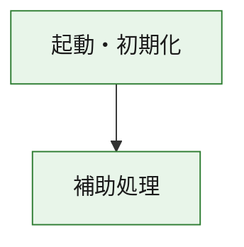
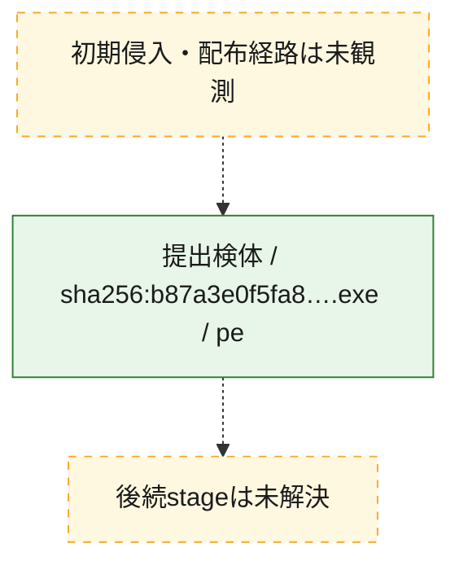
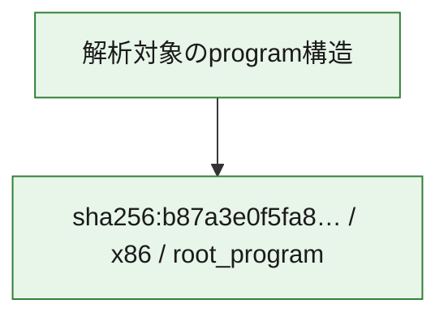

# 全体ロジック：b87a3e0f5fa89f216c26edc4a00f678d7aa80e06c0c9fa497277aa2621449135

代表関数の静的証跡から、起動・初期化の処理群を確認しました。

## 読み方

- phaseの掲載順は解析上の整理順です。observed_call_edgesがない段階間の実行順を断定しません。
- 図の実線は静的に観測した関係、点線と黄色のノードは未観測・未解決の関係を示します。
- 図は静的な要約であり、動的実行を再現するものではありません。
- 詳細な関数解説とfingerprintは[STATIC-LOGIC.md](STATIC-LOGIC.md)を参照してください。

## 静的可視化

### 実行フロー

### 感染チェーン

### モジュール関係

## 処理段階

### 1. 起動・初期化

entry pointから初期化と後続処理への移行を確認します。
確度: `confirmed_static_function_evidence`

- `b87a3e0f5fa89f216c26edc4a00f678d7aa80e06c0c9fa497277aa2621449135:ghidra:14081a058` — 初期化と主要処理への分岐を行う入口関数です。 状態: `succeeded`、選定理由: `call_graph_centrality:in=0,out=1`, `entry_point`, `large_function:instructions=158`, `meaningful_symbol_name`, `reviewed_call_centrality:1`, `reviewed_call_centrality:3`, `role:entrypoint`, `small_program_complete_context`

### 2. 補助処理

主要処理を支える一般内部関数またはlibrary処理を確認します。
確度: `confirmed_static_function_evidence_with_limits`

- `b87a3e0f5fa89f216c26edc4a00f678d7aa80e06c0c9fa497277aa2621449135:ghidra:14081a1df` — 検体内部の一般処理を実装する関数です。 状態: `limited_bad_instruction_or_flow`、選定理由: `call_graph_centrality:in=1,out=0`, `reviewed_call_centrality:1`, `reviewed_call_centrality:2`, `small_program_complete_context`

## 観測したcall関係

- `b87a3e0f5fa89f216c26edc4a00f678d7aa80e06c0c9fa497277aa2621449135:ghidra:14081a058` → `b87a3e0f5fa89f216c26edc4a00f678d7aa80e06c0c9fa497277aa2621449135:ghidra:14081a1df` （`startup` → `support`）
- `ghidra-function:183442dae552fc7ccb512d4c` → `ghidra-external:754423f000a8eb549d550f78` （`unclassified` → `unclassified`）
- `ghidra-function:183442dae552fc7ccb512d4c` → `ghidra-external:92a02deb43c8ba6794797dce` （`unclassified` → `unclassified`）
- `ghidra-function:183442dae552fc7ccb512d4c` → `ghidra-function:1ecebac06adb9e3d7816f2b6` （`unclassified` → `unclassified`）
- `ghidra-function:1ecebac06adb9e3d7816f2b6` → `ghidra-external:6dccaa387a922e86e8441daa` （`unclassified` → `unclassified`）

## 解析範囲と制約

- 選定外関数は全体inventoryへ残しますが、関数本体の個別解説対象にはしていません。
- indirect call、難読化、packer、VM、壊れたcontrol flowによりcall関係が欠落する場合があります。
- 文書は静的解析に基づき、検体実行や外部通信による動的確認は行っていません。
