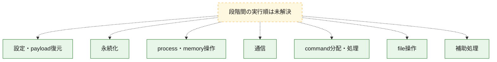
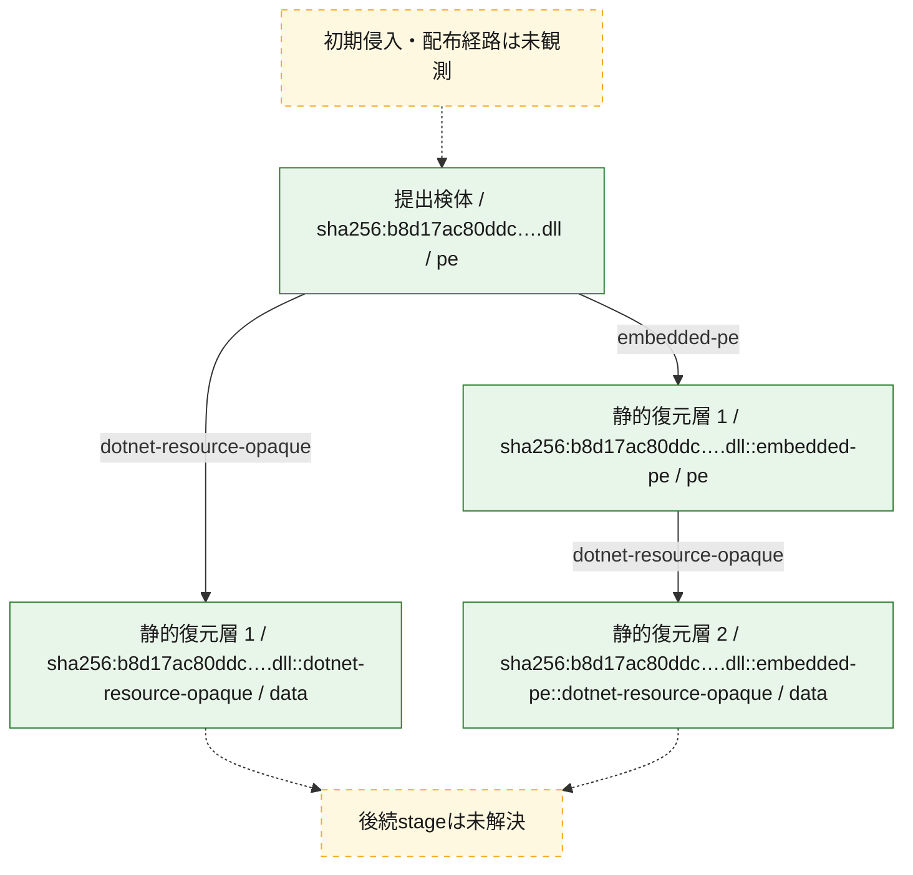
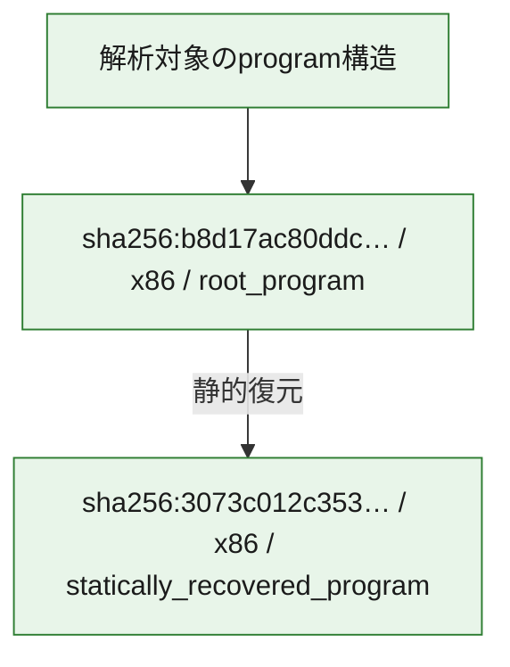

# 全体ロジック：b8d17ac80ddc58836ca0232122835f80b6dfd223e76abcbfd04004fbacca4a64

代表関数の静的証跡から、設定・payload復元、永続化、process・memory操作、通信、command分配・処理、file操作の処理群を確認しました。

## 読み方

- phaseの掲載順は解析上の整理順です。observed_call_edgesがない段階間の実行順を断定しません。
- 図の実線は静的に観測した関係、点線と黄色のノードは未観測・未解決の関係を示します。
- 図は静的な要約であり、動的実行を再現するものではありません。
- 詳細な関数解説とfingerprintは[STATIC-LOGIC.md](STATIC-LOGIC.md)を参照してください。

## 静的可視化

### 実行フロー

### 感染チェーン

### モジュール関係

## 処理段階

### 1. 設定・payload復元

設定、resource、payload、暗号化データの復元・変換を確認します。
確度: `confirmed_static_function_evidence`

- `b8d17ac80ddc58836ca0232122835f80b6dfd223e76abcbfd04004fbacca4a64:cil:0x060000b1` — 暗号、hash、encoding、または復号処理に関係する関数です。 状態: `succeeded`、選定理由: `large_function:instructions=245`, `reviewed_call_centrality:32`, `role:cryptographic_transform`
- `b8d17ac80ddc58836ca0232122835f80b6dfd223e76abcbfd04004fbacca4a64:cil:0x06000742` — 設定、resource、payloadなどの解析・変換を行う関数です。 状態: `succeeded`、選定理由: `large_function:instructions=752`, `reviewed_call_centrality:112`, `role:config_or_data_transform`
- `b8d17ac80ddc58836ca0232122835f80b6dfd223e76abcbfd04004fbacca4a64:cil:0x0600074a` — 設定、resource、payloadなどの解析・変換を行う関数です。 状態: `succeeded`、選定理由: `large_function:instructions=171`, `reviewed_call_centrality:34`, `role:config_or_data_transform`
- `b8d17ac80ddc58836ca0232122835f80b6dfd223e76abcbfd04004fbacca4a64:cil:0x06000753` — 設定、resource、payloadなどの解析・変換を行う関数です。 状態: `succeeded`、選定理由: `large_function:instructions=162`, `reviewed_call_centrality:36`, `role:config_or_data_transform`
- `b8d17ac80ddc58836ca0232122835f80b6dfd223e76abcbfd04004fbacca4a64:cil:0x06000ad9` — 設定、resource、payloadなどの解析・変換を行う関数です。 状態: `succeeded`、選定理由: `large_function:instructions=1207`, `reviewed_call_centrality:36`, `role:config_or_data_transform`
- `b8d17ac80ddc58836ca0232122835f80b6dfd223e76abcbfd04004fbacca4a64:cil:0x06000b32` — 設定、resource、payloadなどの解析・変換を行う関数です。 状態: `succeeded`、選定理由: `large_function:instructions=265`, `reviewed_call_centrality:42`, `role:config_or_data_transform`

### 2. 永続化

自動起動や永続化に関係する設定変更を確認します。
確度: `confirmed_static_function_evidence`

- `b8d17ac80ddc58836ca0232122835f80b6dfd223e76abcbfd04004fbacca4a64:cil:0x060000b2` — 自動起動または永続化に関係する処理を含む関数です。 状態: `succeeded`、選定理由: `reviewed_call_centrality:8`, `role:persistence`

### 3. process・memory操作

process、thread、module、memory操作と実行移行を確認します。
確度: `confirmed_static_function_evidence`

- `b8d17ac80ddc58836ca0232122835f80b6dfd223e76abcbfd04004fbacca4a64:cil:0x0600008b` — process、thread、module、またはmemory操作に関係する関数です。 状態: `succeeded`、選定理由: `large_function:instructions=111`, `reviewed_call_centrality:42`, `role:process_or_memory_operation`

### 4. 通信

通信初期化、endpoint処理、送受信の役割を確認します。
確度: `confirmed_static_function_evidence`

- `b8d17ac80ddc58836ca0232122835f80b6dfd223e76abcbfd04004fbacca4a64:cil:0x0600074e` — 通信初期化、送受信、またはendpoint処理に関係する関数です。 状態: `succeeded`、選定理由: `large_function:instructions=228`, `reviewed_call_centrality:42`, `role:network_communication`

### 5. command分配・処理

受信commandやtaskの解釈、分配、個別handlerへの移行を確認します。
確度: `confirmed_static_function_evidence`

- `b8d17ac80ddc58836ca0232122835f80b6dfd223e76abcbfd04004fbacca4a64:cil:0x060001fd` — commandの解釈、分配、または個別処理を担当する関数です。 状態: `succeeded`、選定理由: `large_function:instructions=167`, `reviewed_call_centrality:30`, `role:command_dispatch_or_handler`
- `b8d17ac80ddc58836ca0232122835f80b6dfd223e76abcbfd04004fbacca4a64:cil:0x060001fe` — commandの解釈、分配、または個別処理を担当する関数です。 状態: `succeeded`、選定理由: `large_function:instructions=175`, `reviewed_call_centrality:26`, `role:command_dispatch_or_handler`
- `b8d17ac80ddc58836ca0232122835f80b6dfd223e76abcbfd04004fbacca4a64:cil:0x06000213` — commandの解釈、分配、または個別処理を担当する関数です。 状態: `succeeded`、選定理由: `large_function:instructions=113`, `reviewed_call_centrality:28`, `role:command_dispatch_or_handler`
- `b8d17ac80ddc58836ca0232122835f80b6dfd223e76abcbfd04004fbacca4a64:cil:0x06000236` — commandの解釈、分配、または個別処理を担当する関数です。 状態: `succeeded`、選定理由: `large_function:instructions=157`, `reviewed_call_centrality:42`, `role:command_dispatch_or_handler`
- `b8d17ac80ddc58836ca0232122835f80b6dfd223e76abcbfd04004fbacca4a64:cil:0x0600026a` — commandの解釈、分配、または個別処理を担当する関数です。 状態: `succeeded`、選定理由: `large_function:instructions=219`, `reviewed_call_centrality:34`, `role:command_dispatch_or_handler`
- `b8d17ac80ddc58836ca0232122835f80b6dfd223e76abcbfd04004fbacca4a64:cil:0x06000287` — commandの解釈、分配、または個別処理を担当する関数です。 状態: `succeeded`、選定理由: `large_function:instructions=169`, `reviewed_call_centrality:54`, `role:command_dispatch_or_handler`
- `b8d17ac80ddc58836ca0232122835f80b6dfd223e76abcbfd04004fbacca4a64:cil:0x060002e3` — commandの解釈、分配、または個別処理を担当する関数です。 状態: `succeeded`、選定理由: `large_function:instructions=214`, `reviewed_call_centrality:28`, `role:command_dispatch_or_handler`
- `b8d17ac80ddc58836ca0232122835f80b6dfd223e76abcbfd04004fbacca4a64:cil:0x060002fb` — commandの解釈、分配、または個別処理を担当する関数です。 状態: `succeeded`、選定理由: `large_function:instructions=157`, `reviewed_call_centrality:38`, `role:command_dispatch_or_handler`
- `b8d17ac80ddc58836ca0232122835f80b6dfd223e76abcbfd04004fbacca4a64:cil:0x06000432` — commandの解釈、分配、または個別処理を担当する関数です。 状態: `succeeded`、選定理由: `large_function:instructions=340`, `reviewed_call_centrality:24`, `role:command_dispatch_or_handler`
- `b8d17ac80ddc58836ca0232122835f80b6dfd223e76abcbfd04004fbacca4a64:cil:0x06000434` — commandの解釈、分配、または個別処理を担当する関数です。 状態: `succeeded`、選定理由: `large_function:instructions=372`, `reviewed_call_centrality:50`, `role:command_dispatch_or_handler`
- `b8d17ac80ddc58836ca0232122835f80b6dfd223e76abcbfd04004fbacca4a64:cil:0x0600043d` — commandの解釈、分配、または個別処理を担当する関数です。 状態: `succeeded`、選定理由: `large_function:instructions=645`, `reviewed_call_centrality:20`, `role:command_dispatch_or_handler`
- `b8d17ac80ddc58836ca0232122835f80b6dfd223e76abcbfd04004fbacca4a64:cil:0x06000464` — commandの解釈、分配、または個別処理を担当する関数です。 状態: `succeeded`、選定理由: `large_function:instructions=90`, `reviewed_call_centrality:34`, `role:command_dispatch_or_handler`
- `b8d17ac80ddc58836ca0232122835f80b6dfd223e76abcbfd04004fbacca4a64:cil:0x06000484` — commandの解釈、分配、または個別処理を担当する関数です。 状態: `succeeded`、選定理由: `large_function:instructions=203`, `reviewed_call_centrality:28`, `role:command_dispatch_or_handler`
- `b8d17ac80ddc58836ca0232122835f80b6dfd223e76abcbfd04004fbacca4a64:cil:0x060004b9` — commandの解釈、分配、または個別処理を担当する関数です。 状態: `succeeded`、選定理由: `large_function:instructions=124`, `reviewed_call_centrality:40`, `role:command_dispatch_or_handler`
- `b8d17ac80ddc58836ca0232122835f80b6dfd223e76abcbfd04004fbacca4a64:cil:0x060004ec` — commandの解釈、分配、または個別処理を担当する関数です。 状態: `succeeded`、選定理由: `large_function:instructions=385`, `reviewed_call_centrality:30`, `role:command_dispatch_or_handler`
- `b8d17ac80ddc58836ca0232122835f80b6dfd223e76abcbfd04004fbacca4a64:cil:0x0600057a` — commandの解釈、分配、または個別処理を担当する関数です。 状態: `succeeded`、選定理由: `large_function:instructions=118`, `reviewed_call_centrality:32`, `role:command_dispatch_or_handler`
- `b8d17ac80ddc58836ca0232122835f80b6dfd223e76abcbfd04004fbacca4a64:cil:0x0600057b` — commandの解釈、分配、または個別処理を担当する関数です。 状態: `succeeded`、選定理由: `large_function:instructions=119`, `reviewed_call_centrality:34`, `role:command_dispatch_or_handler`
- `b8d17ac80ddc58836ca0232122835f80b6dfd223e76abcbfd04004fbacca4a64:cil:0x0600057d` — commandの解釈、分配、または個別処理を担当する関数です。 状態: `succeeded`、選定理由: `large_function:instructions=181`, `reviewed_call_centrality:32`, `role:command_dispatch_or_handler`
- `b8d17ac80ddc58836ca0232122835f80b6dfd223e76abcbfd04004fbacca4a64:cil:0x06000595` — commandの解釈、分配、または個別処理を担当する関数です。 状態: `succeeded`、選定理由: `large_function:instructions=191`, `reviewed_call_centrality:36`, `role:command_dispatch_or_handler`
- `b8d17ac80ddc58836ca0232122835f80b6dfd223e76abcbfd04004fbacca4a64:cil:0x0600067e` — commandの解釈、分配、または個別処理を担当する関数です。 状態: `succeeded`、選定理由: `large_function:instructions=136`, `reviewed_call_centrality:32`, `role:command_dispatch_or_handler`
- `b8d17ac80ddc58836ca0232122835f80b6dfd223e76abcbfd04004fbacca4a64:cil:0x06000759` — commandの解釈、分配、または個別処理を担当する関数です。 状態: `succeeded`、選定理由: `large_function:instructions=81`, `reviewed_call_centrality:38`, `role:command_dispatch_or_handler`

### 6. file操作

fileやdirectoryの作成、読書き、削除を確認します。
確度: `confirmed_static_function_evidence`

- `b8d17ac80ddc58836ca0232122835f80b6dfd223e76abcbfd04004fbacca4a64:cil:0x06000737` — fileまたはdirectoryの読書き・管理に関係する関数です。 状態: `succeeded`、選定理由: `large_function:instructions=119`, `reviewed_call_centrality:30`, `role:file_operation`

### 7. 補助処理

主要処理を支える一般内部関数またはlibrary処理を確認します。
確度: `confirmed_static_function_evidence`

- `b8d17ac80ddc58836ca0232122835f80b6dfd223e76abcbfd04004fbacca4a64:cil:0x0600073a` — 検体内部の一般処理を実装する関数です。 状態: `succeeded`、選定理由: `large_function:instructions=295`, `reviewed_call_centrality:56`

## 観測したcall関係

- 代表関数間で直接解決できた呼出関係はありません。

## 解析範囲と制約

- 選定外関数は全体inventoryへ残しますが、関数本体の個別解説対象にはしていません。
- indirect call、難読化、packer、VM、壊れたcontrol flowによりcall関係が欠落する場合があります。
- 文書は静的解析に基づき、検体実行や外部通信による動的確認は行っていません。
