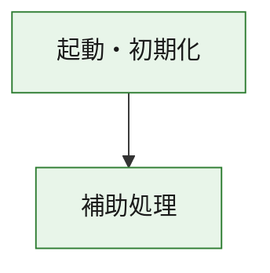
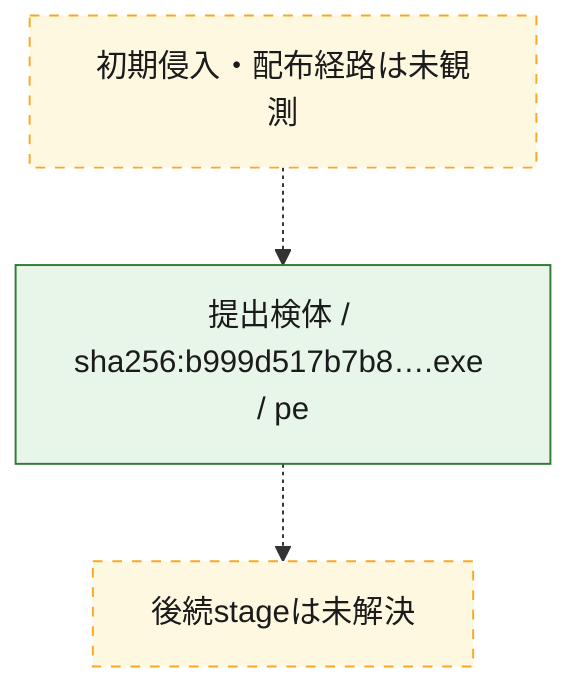
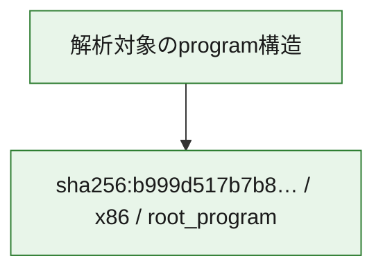

# 全体ロジック：b999d517b7b8c765b59d695dd215411708851f3c22e317629f644f4a99fbb350

代表関数の静的証跡から、起動・初期化の処理群を確認しました。

## 読み方

- phaseの掲載順は解析上の整理順です。observed_call_edgesがない段階間の実行順を断定しません。
- 図の実線は静的に観測した関係、点線と黄色のノードは未観測・未解決の関係を示します。
- 図は静的な要約であり、動的実行を再現するものではありません。
- 詳細な関数解説とfingerprintは[STATIC-LOGIC.md](STATIC-LOGIC.md)を参照してください。

## 静的可視化

### 実行フロー

### 感染チェーン

### モジュール関係

## 処理段階

### 1. 起動・初期化

entry pointから初期化と後続処理への移行を確認します。
確度: `confirmed_static_function_evidence`

- `b999d517b7b8c765b59d695dd215411708851f3c22e317629f644f4a99fbb350:ghidra:180001010` — 初期化と主要処理への分岐を行う入口関数です。 状態: `succeeded`、選定理由: `entry_point`, `meaningful_symbol_name`, `reviewed_call_centrality:22`, `role:entrypoint`, `small_program_complete_context`

### 2. 補助処理

主要処理を支える一般内部関数またはlibrary処理を確認します。
確度: `confirmed_static_function_evidence`

- `b999d517b7b8c765b59d695dd215411708851f3c22e317629f644f4a99fbb350:ghidra:180001240` — 検体内部の一般処理を実装する関数です。 状態: `succeeded`、選定理由: `context_representative`, `reviewed_call_centrality:2`, `small_program_complete_context`
- `b999d517b7b8c765b59d695dd215411708851f3c22e317629f644f4a99fbb350:ghidra:180001350` — 検体内部の一般処理を実装する関数です。 状態: `succeeded`、選定理由: `context_representative`, `reviewed_call_centrality:25`, `small_program_complete_context`
- `b999d517b7b8c765b59d695dd215411708851f3c22e317629f644f4a99fbb350:ghidra:180003780` — 検体内部の一般処理を実装する関数です。 状態: `succeeded`、選定理由: `context_representative`, `reviewed_call_centrality:2`, `small_program_complete_context`
- `b999d517b7b8c765b59d695dd215411708851f3c22e317629f644f4a99fbb350:ghidra:1800038e0` — 検体内部の一般処理を実装する関数です。 状態: `succeeded`、選定理由: `context_representative`, `reviewed_call_centrality:2`, `small_program_complete_context`

## 観測したcall関係

- `b999d517b7b8c765b59d695dd215411708851f3c22e317629f644f4a99fbb350:ghidra:180001010` → `b999d517b7b8c765b59d695dd215411708851f3c22e317629f644f4a99fbb350:ghidra:180001240` （`startup` → `support`）
- `b999d517b7b8c765b59d695dd215411708851f3c22e317629f644f4a99fbb350:ghidra:180001010` → `b999d517b7b8c765b59d695dd215411708851f3c22e317629f644f4a99fbb350:ghidra:180001350` （`startup` → `support`）
- `b999d517b7b8c765b59d695dd215411708851f3c22e317629f644f4a99fbb350:ghidra:180001350` → `b999d517b7b8c765b59d695dd215411708851f3c22e317629f644f4a99fbb350:ghidra:180001240` （`support` → `support`）
- `b999d517b7b8c765b59d695dd215411708851f3c22e317629f644f4a99fbb350:ghidra:180001350` → `b999d517b7b8c765b59d695dd215411708851f3c22e317629f644f4a99fbb350:ghidra:180003780` （`support` → `support`）
- `b999d517b7b8c765b59d695dd215411708851f3c22e317629f644f4a99fbb350:ghidra:180001350` → `b999d517b7b8c765b59d695dd215411708851f3c22e317629f644f4a99fbb350:ghidra:1800038e0` （`support` → `support`）
- `b999d517b7b8c765b59d695dd215411708851f3c22e317629f644f4a99fbb350:ghidra:180003780` → `b999d517b7b8c765b59d695dd215411708851f3c22e317629f644f4a99fbb350:ghidra:1800038e0` （`support` → `support`）
- `ghidra-function:044212ff541034e06ce05116` → `ghidra-function:09803d10afff9e5bdf5950fe` （`unclassified` → `unclassified`）
- `ghidra-function:044212ff541034e06ce05116` → `ghidra-function:1b936ba0ce3fb1d7f54264a9` （`unclassified` → `unclassified`）
- `ghidra-function:044212ff541034e06ce05116` → `ghidra-function:5885db5384d87425c1afcdad` （`unclassified` → `unclassified`）
- `ghidra-function:044212ff541034e06ce05116` → `ghidra-function:607947bd012df43d8a9f3ebf` （`unclassified` → `unclassified`）
- `ghidra-function:044212ff541034e06ce05116` → `ghidra-function:642c2c5964faab9ca5a9aae2` （`unclassified` → `unclassified`）
- `ghidra-function:044212ff541034e06ce05116` → `ghidra-function:7c8a7a10360a700335c69bb1` （`unclassified` → `unclassified`）
- `ghidra-function:044212ff541034e06ce05116` → `ghidra-function:a894a9dfd3df748687eb26a3` （`unclassified` → `unclassified`）
- `ghidra-function:044212ff541034e06ce05116` → `ghidra-function:b8cfcf2dc86139ff40558019` （`unclassified` → `unclassified`）
- `ghidra-function:044212ff541034e06ce05116` → `ghidra-function:b9eaef3b2f24e3da9149c06c` （`unclassified` → `unclassified`）
- `ghidra-function:044212ff541034e06ce05116` → `ghidra-function:e7a2d11f15969893f2d4602a` （`unclassified` → `unclassified`）
- `ghidra-function:044212ff541034e06ce05116` → `ghidra-function:eee5b984ec47a191762de652` （`unclassified` → `unclassified`）
- `ghidra-function:044212ff541034e06ce05116` → `ghidra-function:f9abfb3dfd14b1482e58c6f4` （`unclassified` → `unclassified`）
- `ghidra-function:642c2c5964faab9ca5a9aae2` → `ghidra-external:0768ccbc38e82451ff002716` （`unclassified` → `unclassified`）
- `ghidra-function:642c2c5964faab9ca5a9aae2` → `ghidra-external:197581f9c58135bf1e61a19e` （`unclassified` → `unclassified`）
- `ghidra-function:642c2c5964faab9ca5a9aae2` → `ghidra-external:2349fc4faeb7ad202a68fddf` （`unclassified` → `unclassified`）
- `ghidra-function:642c2c5964faab9ca5a9aae2` → `ghidra-external:2846b7b5fa73095d5067418b` （`unclassified` → `unclassified`）
- `ghidra-function:642c2c5964faab9ca5a9aae2` → `ghidra-external:377bf35ec52bc8db42d5e1ac` （`unclassified` → `unclassified`）
- `ghidra-function:642c2c5964faab9ca5a9aae2` → `ghidra-external:5056678b115180dac615cd8c` （`unclassified` → `unclassified`）
- `ghidra-function:642c2c5964faab9ca5a9aae2` → `ghidra-external:5935ce68d600a7c37545188a` （`unclassified` → `unclassified`）
- `ghidra-function:642c2c5964faab9ca5a9aae2` → `ghidra-external:65dbf006e2d45dfd4b16c674` （`unclassified` → `unclassified`）
- `ghidra-function:642c2c5964faab9ca5a9aae2` → `ghidra-external:661f8a308944d82229abc26d` （`unclassified` → `unclassified`）
- `ghidra-function:642c2c5964faab9ca5a9aae2` → `ghidra-external:78f7e3b13f1f9f6e001783a2` （`unclassified` → `unclassified`）
- `ghidra-function:642c2c5964faab9ca5a9aae2` → `ghidra-external:946210764fc22e2cd83bee52` （`unclassified` → `unclassified`）
- `ghidra-function:642c2c5964faab9ca5a9aae2` → `ghidra-external:9e8a6b72f2cc16763a77110d` （`unclassified` → `unclassified`）
- `ghidra-function:642c2c5964faab9ca5a9aae2` → `ghidra-external:a0f39bc81d90463ec15faf9c` （`unclassified` → `unclassified`）
- `ghidra-function:642c2c5964faab9ca5a9aae2` → `ghidra-external:a8f241963ccea3a70071465c` （`unclassified` → `unclassified`）
- `ghidra-function:642c2c5964faab9ca5a9aae2` → `ghidra-external:ae8f9febf06b7c01f3ff633d` （`unclassified` → `unclassified`）
- `ghidra-function:642c2c5964faab9ca5a9aae2` → `ghidra-external:b547708d685ee9e8216f9153` （`unclassified` → `unclassified`）
- `ghidra-function:642c2c5964faab9ca5a9aae2` → `ghidra-external:cf7b21121f72404a7ef93ea1` （`unclassified` → `unclassified`）
- `ghidra-function:642c2c5964faab9ca5a9aae2` → `ghidra-external:e253b5c3ab9a434e202442b5` （`unclassified` → `unclassified`）
- `ghidra-function:642c2c5964faab9ca5a9aae2` → `ghidra-external:ef16ed1c4944882310269367` （`unclassified` → `unclassified`）
- `ghidra-function:642c2c5964faab9ca5a9aae2` → `ghidra-external:f4571b24aa6799cf4baf7be2` （`unclassified` → `unclassified`）
- `ghidra-function:642c2c5964faab9ca5a9aae2` → `ghidra-external:f55b5967fc31afbcfaaa2904` （`unclassified` → `unclassified`）
- `ghidra-function:642c2c5964faab9ca5a9aae2` → `ghidra-function:93e91810894f91def666c680` （`unclassified` → `unclassified`）
- `ghidra-function:642c2c5964faab9ca5a9aae2` → `ghidra-function:abcf899ff959352c8cdf0029` （`unclassified` → `unclassified`）
- `ghidra-function:642c2c5964faab9ca5a9aae2` → `ghidra-function:eee5b984ec47a191762de652` （`unclassified` → `unclassified`）
- `ghidra-function:93e91810894f91def666c680` → `ghidra-function:abcf899ff959352c8cdf0029` （`unclassified` → `unclassified`）

## 解析範囲と制約

- 選定外関数は全体inventoryへ残しますが、関数本体の個別解説対象にはしていません。
- indirect call、難読化、packer、VM、壊れたcontrol flowによりcall関係が欠落する場合があります。
- 文書は静的解析に基づき、検体実行や外部通信による動的確認は行っていません。
