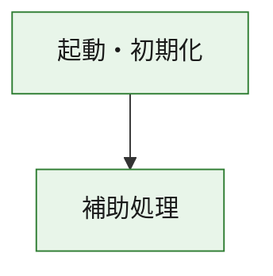
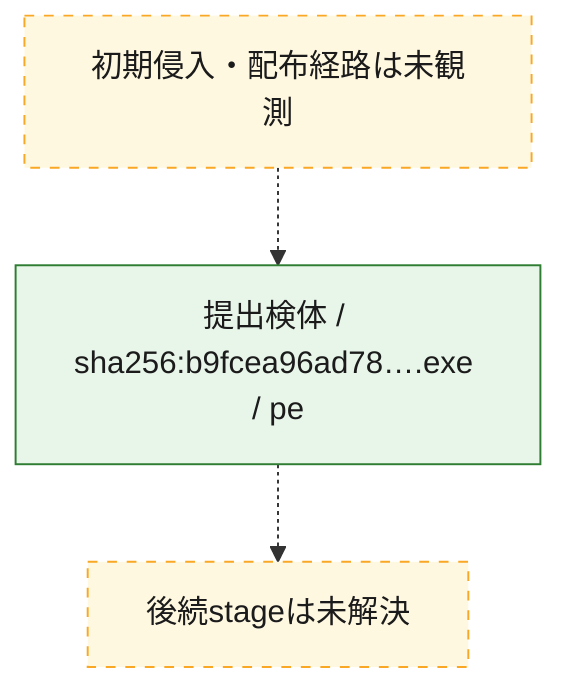
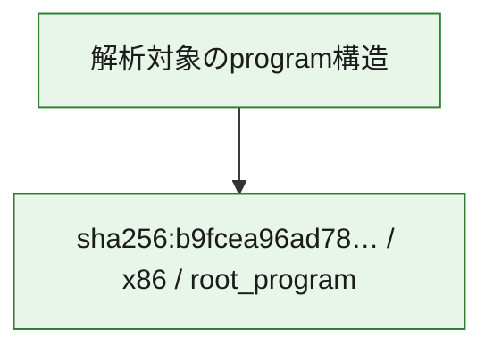

# 全体ロジック：b9fcea96ad78d54d4b937c08518064b66866763f23000bbdbd8c383b16e6e461

代表関数の静的証跡から、起動・初期化の処理群を確認しました。

## 読み方

- phaseの掲載順は解析上の整理順です。observed_call_edgesがない段階間の実行順を断定しません。
- 図の実線は静的に観測した関係、点線と黄色のノードは未観測・未解決の関係を示します。
- 図は静的な要約であり、動的実行を再現するものではありません。
- 詳細な関数解説とfingerprintは[STATIC-LOGIC.md](STATIC-LOGIC.md)を参照してください。

## 静的可視化

### 実行フロー

### 感染チェーン

### モジュール関係

## 処理段階

### 1. 起動・初期化

entry pointから初期化と後続処理への移行を確認します。
確度: `confirmed_static_function_evidence`

- `b9fcea96ad78d54d4b937c08518064b66866763f23000bbdbd8c383b16e6e461:ghidra:180001010` — 初期化と主要処理への分岐を行う入口関数です。 状態: `succeeded`、選定理由: `entry_point`, `meaningful_symbol_name`, `reviewed_call_centrality:22`, `role:entrypoint`, `small_program_complete_context`

### 2. 補助処理

主要処理を支える一般内部関数またはlibrary処理を確認します。
確度: `confirmed_static_function_evidence`

- `b9fcea96ad78d54d4b937c08518064b66866763f23000bbdbd8c383b16e6e461:ghidra:180001240` — 検体内部の一般処理を実装する関数です。 状態: `succeeded`、選定理由: `context_representative`, `reviewed_call_centrality:2`, `small_program_complete_context`
- `b9fcea96ad78d54d4b937c08518064b66866763f23000bbdbd8c383b16e6e461:ghidra:180001350` — 検体内部の一般処理を実装する関数です。 状態: `succeeded`、選定理由: `context_representative`, `reviewed_call_centrality:25`, `small_program_complete_context`
- `b9fcea96ad78d54d4b937c08518064b66866763f23000bbdbd8c383b16e6e461:ghidra:180003780` — 検体内部の一般処理を実装する関数です。 状態: `succeeded`、選定理由: `context_representative`, `reviewed_call_centrality:2`, `small_program_complete_context`
- `b9fcea96ad78d54d4b937c08518064b66866763f23000bbdbd8c383b16e6e461:ghidra:1800038e0` — 検体内部の一般処理を実装する関数です。 状態: `succeeded`、選定理由: `context_representative`, `reviewed_call_centrality:2`, `small_program_complete_context`

## 観測したcall関係

- `b9fcea96ad78d54d4b937c08518064b66866763f23000bbdbd8c383b16e6e461:ghidra:180001010` → `b9fcea96ad78d54d4b937c08518064b66866763f23000bbdbd8c383b16e6e461:ghidra:180001240` （`startup` → `support`）
- `b9fcea96ad78d54d4b937c08518064b66866763f23000bbdbd8c383b16e6e461:ghidra:180001010` → `b9fcea96ad78d54d4b937c08518064b66866763f23000bbdbd8c383b16e6e461:ghidra:180001350` （`startup` → `support`）
- `b9fcea96ad78d54d4b937c08518064b66866763f23000bbdbd8c383b16e6e461:ghidra:180001350` → `b9fcea96ad78d54d4b937c08518064b66866763f23000bbdbd8c383b16e6e461:ghidra:180001240` （`support` → `support`）
- `b9fcea96ad78d54d4b937c08518064b66866763f23000bbdbd8c383b16e6e461:ghidra:180001350` → `b9fcea96ad78d54d4b937c08518064b66866763f23000bbdbd8c383b16e6e461:ghidra:180003780` （`support` → `support`）
- `b9fcea96ad78d54d4b937c08518064b66866763f23000bbdbd8c383b16e6e461:ghidra:180001350` → `b9fcea96ad78d54d4b937c08518064b66866763f23000bbdbd8c383b16e6e461:ghidra:1800038e0` （`support` → `support`）
- `b9fcea96ad78d54d4b937c08518064b66866763f23000bbdbd8c383b16e6e461:ghidra:180003780` → `b9fcea96ad78d54d4b937c08518064b66866763f23000bbdbd8c383b16e6e461:ghidra:1800038e0` （`support` → `support`）
- `ghidra-function:ba1a1137767b162833648b48` → `ghidra-external:0ba7f6834f4aa462be0bb1b3` （`unclassified` → `unclassified`）
- `ghidra-function:ba1a1137767b162833648b48` → `ghidra-external:0c57f365d862dfc96855c951` （`unclassified` → `unclassified`）
- `ghidra-function:ba1a1137767b162833648b48` → `ghidra-external:130cbc6abc31731becec2263` （`unclassified` → `unclassified`）
- `ghidra-function:ba1a1137767b162833648b48` → `ghidra-external:2132290163640fef9d417d13` （`unclassified` → `unclassified`）
- `ghidra-function:ba1a1137767b162833648b48` → `ghidra-external:2a52557868965947d5e84a9d` （`unclassified` → `unclassified`）
- `ghidra-function:ba1a1137767b162833648b48` → `ghidra-external:36fa7eca1d21ba1ab918108d` （`unclassified` → `unclassified`）
- `ghidra-function:ba1a1137767b162833648b48` → `ghidra-external:67c4e8eebbb6727c8d9e215c` （`unclassified` → `unclassified`）
- `ghidra-function:ba1a1137767b162833648b48` → `ghidra-external:780464b9734740fe73096e4b` （`unclassified` → `unclassified`）
- `ghidra-function:ba1a1137767b162833648b48` → `ghidra-external:78d457637869419d0f5a82a0` （`unclassified` → `unclassified`）
- `ghidra-function:ba1a1137767b162833648b48` → `ghidra-external:7b6805b5a5bbd1b14154e6ae` （`unclassified` → `unclassified`）
- `ghidra-function:ba1a1137767b162833648b48` → `ghidra-external:87a36e4890b320832812e07e` （`unclassified` → `unclassified`）
- `ghidra-function:ba1a1137767b162833648b48` → `ghidra-external:8e5233f47592facce6d8fe5c` （`unclassified` → `unclassified`）
- `ghidra-function:ba1a1137767b162833648b48` → `ghidra-external:9e12263741b5a98f247e107b` （`unclassified` → `unclassified`）
- `ghidra-function:ba1a1137767b162833648b48` → `ghidra-external:9ef6726557e64b744220e427` （`unclassified` → `unclassified`）
- `ghidra-function:ba1a1137767b162833648b48` → `ghidra-external:9f58be762fa46d053eb0b496` （`unclassified` → `unclassified`）
- `ghidra-function:ba1a1137767b162833648b48` → `ghidra-external:b631f3c5d1238e099c320ff0` （`unclassified` → `unclassified`）
- `ghidra-function:ba1a1137767b162833648b48` → `ghidra-external:b665ec61335bc8030882f60f` （`unclassified` → `unclassified`）
- `ghidra-function:ba1a1137767b162833648b48` → `ghidra-external:bff2d2403c9c7fbeca89d079` （`unclassified` → `unclassified`）
- `ghidra-function:ba1a1137767b162833648b48` → `ghidra-external:d1aa01f4f1c91f045457f849` （`unclassified` → `unclassified`）
- `ghidra-function:ba1a1137767b162833648b48` → `ghidra-external:e0507684e79f0afc14d7737f` （`unclassified` → `unclassified`）
- `ghidra-function:ba1a1137767b162833648b48` → `ghidra-external:ee8dd0e48387c2e5168f7497` （`unclassified` → `unclassified`）
- `ghidra-function:ba1a1137767b162833648b48` → `ghidra-function:2bec5fa0c336158c2f367195` （`unclassified` → `unclassified`）
- `ghidra-function:ba1a1137767b162833648b48` → `ghidra-function:c315979b4eb1bce2f47eac9a` （`unclassified` → `unclassified`）
- `ghidra-function:ba1a1137767b162833648b48` → `ghidra-function:e6630b46d9f17ce48aad0376` （`unclassified` → `unclassified`）
- `ghidra-function:ce32f6934ecd2d859e3bfd63` → `ghidra-function:1b294e055cbf96425d129de0` （`unclassified` → `unclassified`）
- `ghidra-function:ce32f6934ecd2d859e3bfd63` → `ghidra-function:4c339cf387a30fd4f0ea56ab` （`unclassified` → `unclassified`）
- `ghidra-function:ce32f6934ecd2d859e3bfd63` → `ghidra-function:95b40e74dc38fdb542550de3` （`unclassified` → `unclassified`）
- `ghidra-function:ce32f6934ecd2d859e3bfd63` → `ghidra-function:af28f1b92e4c3b92e34b8ec3` （`unclassified` → `unclassified`）
- `ghidra-function:ce32f6934ecd2d859e3bfd63` → `ghidra-function:ba1a1137767b162833648b48` （`unclassified` → `unclassified`）
- `ghidra-function:ce32f6934ecd2d859e3bfd63` → `ghidra-function:bef52a9544ce8e6354caee7e` （`unclassified` → `unclassified`）
- `ghidra-function:ce32f6934ecd2d859e3bfd63` → `ghidra-function:c315979b4eb1bce2f47eac9a` （`unclassified` → `unclassified`）
- `ghidra-function:ce32f6934ecd2d859e3bfd63` → `ghidra-function:d6dac41912822c358b301235` （`unclassified` → `unclassified`）
- `ghidra-function:ce32f6934ecd2d859e3bfd63` → `ghidra-function:e55b87ae7ee5f40b967dac4c` （`unclassified` → `unclassified`）
- `ghidra-function:ce32f6934ecd2d859e3bfd63` → `ghidra-function:eb7c1dc58f83b7d515c561e5` （`unclassified` → `unclassified`）
- `ghidra-function:ce32f6934ecd2d859e3bfd63` → `ghidra-function:f6b12db1d6f0a4e6cfe7ac9d` （`unclassified` → `unclassified`）
- `ghidra-function:ce32f6934ecd2d859e3bfd63` → `ghidra-function:fa39ac2c987a74386f2001a5` （`unclassified` → `unclassified`）
- `ghidra-function:e6630b46d9f17ce48aad0376` → `ghidra-function:2bec5fa0c336158c2f367195` （`unclassified` → `unclassified`）

## 解析範囲と制約

- 選定外関数は全体inventoryへ残しますが、関数本体の個別解説対象にはしていません。
- indirect call、難読化、packer、VM、壊れたcontrol flowによりcall関係が欠落する場合があります。
- 文書は静的解析に基づき、検体実行や外部通信による動的確認は行っていません。
