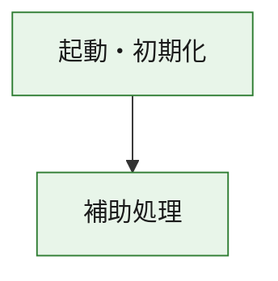
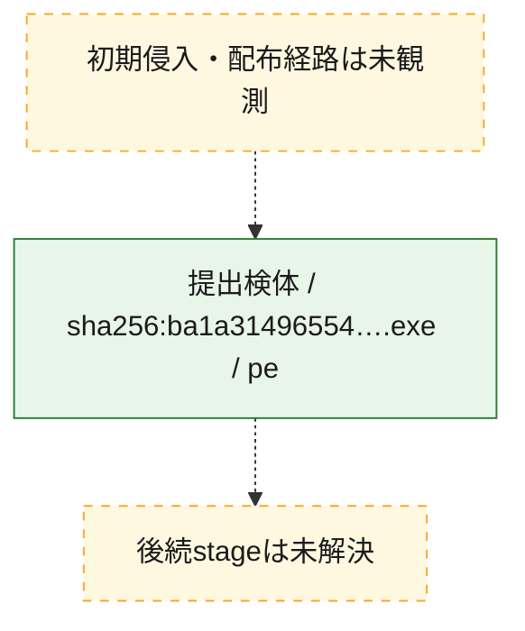
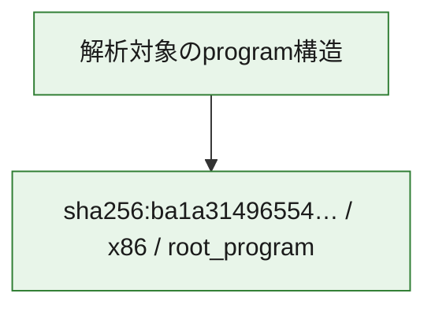

# 全体ロジック：ba1a3149655441afb0ad2ef98af1c31e11853188bef1061138bee33d6af881fe

代表関数の静的証跡から、起動・初期化の処理群を確認しました。

## 読み方

- phaseの掲載順は解析上の整理順です。observed_call_edgesがない段階間の実行順を断定しません。
- 図の実線は静的に観測した関係、点線と黄色のノードは未観測・未解決の関係を示します。
- 図は静的な要約であり、動的実行を再現するものではありません。
- 詳細な関数解説とfingerprintは[STATIC-LOGIC.md](STATIC-LOGIC.md)を参照してください。

## 静的可視化

### 実行フロー

### 感染チェーン

### モジュール関係

## 処理段階

### 1. 起動・初期化

entry pointから初期化と後続処理への移行を確認します。
確度: `confirmed_static_function_evidence`

- `ba1a3149655441afb0ad2ef98af1c31e11853188bef1061138bee33d6af881fe:ghidra:180001010` — 初期化と主要処理への分岐を行う入口関数です。 状態: `succeeded`、選定理由: `entry_point`, `meaningful_symbol_name`, `reviewed_call_centrality:22`, `role:entrypoint`, `small_program_complete_context`

### 2. 補助処理

主要処理を支える一般内部関数またはlibrary処理を確認します。
確度: `confirmed_static_function_evidence`

- `ba1a3149655441afb0ad2ef98af1c31e11853188bef1061138bee33d6af881fe:ghidra:180001240` — 検体内部の一般処理を実装する関数です。 状態: `succeeded`、選定理由: `context_representative`, `reviewed_call_centrality:2`, `small_program_complete_context`
- `ba1a3149655441afb0ad2ef98af1c31e11853188bef1061138bee33d6af881fe:ghidra:180001350` — 検体内部の一般処理を実装する関数です。 状態: `succeeded`、選定理由: `context_representative`, `reviewed_call_centrality:25`, `small_program_complete_context`
- `ba1a3149655441afb0ad2ef98af1c31e11853188bef1061138bee33d6af881fe:ghidra:180003780` — 検体内部の一般処理を実装する関数です。 状態: `succeeded`、選定理由: `context_representative`, `reviewed_call_centrality:2`, `small_program_complete_context`
- `ba1a3149655441afb0ad2ef98af1c31e11853188bef1061138bee33d6af881fe:ghidra:1800038e0` — 検体内部の一般処理を実装する関数です。 状態: `succeeded`、選定理由: `context_representative`, `reviewed_call_centrality:2`, `small_program_complete_context`

## 観測したcall関係

- `ba1a3149655441afb0ad2ef98af1c31e11853188bef1061138bee33d6af881fe:ghidra:180001010` → `ba1a3149655441afb0ad2ef98af1c31e11853188bef1061138bee33d6af881fe:ghidra:180001240` （`startup` → `support`）
- `ba1a3149655441afb0ad2ef98af1c31e11853188bef1061138bee33d6af881fe:ghidra:180001010` → `ba1a3149655441afb0ad2ef98af1c31e11853188bef1061138bee33d6af881fe:ghidra:180001350` （`startup` → `support`）
- `ba1a3149655441afb0ad2ef98af1c31e11853188bef1061138bee33d6af881fe:ghidra:180001350` → `ba1a3149655441afb0ad2ef98af1c31e11853188bef1061138bee33d6af881fe:ghidra:180001240` （`support` → `support`）
- `ba1a3149655441afb0ad2ef98af1c31e11853188bef1061138bee33d6af881fe:ghidra:180001350` → `ba1a3149655441afb0ad2ef98af1c31e11853188bef1061138bee33d6af881fe:ghidra:180003780` （`support` → `support`）
- `ba1a3149655441afb0ad2ef98af1c31e11853188bef1061138bee33d6af881fe:ghidra:180001350` → `ba1a3149655441afb0ad2ef98af1c31e11853188bef1061138bee33d6af881fe:ghidra:1800038e0` （`support` → `support`）
- `ba1a3149655441afb0ad2ef98af1c31e11853188bef1061138bee33d6af881fe:ghidra:180003780` → `ba1a3149655441afb0ad2ef98af1c31e11853188bef1061138bee33d6af881fe:ghidra:1800038e0` （`support` → `support`）
- `ghidra-function:0cb5bea2ffa832e3e7297b6c` → `ghidra-external:0c71a1126b98c7805f20e43e` （`unclassified` → `unclassified`）
- `ghidra-function:0cb5bea2ffa832e3e7297b6c` → `ghidra-external:0f636a8cf7a62b3d8618775b` （`unclassified` → `unclassified`）
- `ghidra-function:0cb5bea2ffa832e3e7297b6c` → `ghidra-external:1a3bc71c24f1500bc72df4dc` （`unclassified` → `unclassified`）
- `ghidra-function:0cb5bea2ffa832e3e7297b6c` → `ghidra-external:1addc2c805a6d9f67acc5152` （`unclassified` → `unclassified`）
- `ghidra-function:0cb5bea2ffa832e3e7297b6c` → `ghidra-external:1ee73cc429486f6f52c85776` （`unclassified` → `unclassified`）
- `ghidra-function:0cb5bea2ffa832e3e7297b6c` → `ghidra-external:2b3458535628297b90f7e5ae` （`unclassified` → `unclassified`）
- `ghidra-function:0cb5bea2ffa832e3e7297b6c` → `ghidra-external:311c3e7a9eba46fb710d2868` （`unclassified` → `unclassified`）
- `ghidra-function:0cb5bea2ffa832e3e7297b6c` → `ghidra-external:3edc459ad2cad5affec7328f` （`unclassified` → `unclassified`）
- `ghidra-function:0cb5bea2ffa832e3e7297b6c` → `ghidra-external:3fe120a8ca94eab72c83ac0a` （`unclassified` → `unclassified`）
- `ghidra-function:0cb5bea2ffa832e3e7297b6c` → `ghidra-external:430e778fe364d871419604ee` （`unclassified` → `unclassified`）
- `ghidra-function:0cb5bea2ffa832e3e7297b6c` → `ghidra-external:5fabd65f2b8d248081f8eb95` （`unclassified` → `unclassified`）
- `ghidra-function:0cb5bea2ffa832e3e7297b6c` → `ghidra-external:64aee0d529877ebc15dd5e1e` （`unclassified` → `unclassified`）
- `ghidra-function:0cb5bea2ffa832e3e7297b6c` → `ghidra-external:67bce7b79516c12db9fdec21` （`unclassified` → `unclassified`）
- `ghidra-function:0cb5bea2ffa832e3e7297b6c` → `ghidra-external:6ef68d32d1160f6637954948` （`unclassified` → `unclassified`）
- `ghidra-function:0cb5bea2ffa832e3e7297b6c` → `ghidra-external:a456d558d7c2ab2ea3d15a47` （`unclassified` → `unclassified`）
- `ghidra-function:0cb5bea2ffa832e3e7297b6c` → `ghidra-external:b593b7b4cd187eb31b751c8a` （`unclassified` → `unclassified`）
- `ghidra-function:0cb5bea2ffa832e3e7297b6c` → `ghidra-external:b91d7a235651fc9f836ae10f` （`unclassified` → `unclassified`）
- `ghidra-function:0cb5bea2ffa832e3e7297b6c` → `ghidra-external:d586e396b15f7c05db375fa2` （`unclassified` → `unclassified`）
- `ghidra-function:0cb5bea2ffa832e3e7297b6c` → `ghidra-external:e528140642f5030ab1bd8a5d` （`unclassified` → `unclassified`）
- `ghidra-function:0cb5bea2ffa832e3e7297b6c` → `ghidra-external:ee32975b90480b34768024f1` （`unclassified` → `unclassified`）
- `ghidra-function:0cb5bea2ffa832e3e7297b6c` → `ghidra-external:ffba95e124794826ae38bb19` （`unclassified` → `unclassified`）
- `ghidra-function:0cb5bea2ffa832e3e7297b6c` → `ghidra-function:01e923d74a9ab0685c286c0b` （`unclassified` → `unclassified`）
- `ghidra-function:0cb5bea2ffa832e3e7297b6c` → `ghidra-function:ab3fd4dd07cfe8c6909f4234` （`unclassified` → `unclassified`）
- `ghidra-function:0cb5bea2ffa832e3e7297b6c` → `ghidra-function:f470c6bc8daa525894371039` （`unclassified` → `unclassified`）
- `ghidra-function:e8fe64bcc74f31667bf57ea5` → `ghidra-function:02846d4aca6671b0f6e61249` （`unclassified` → `unclassified`）
- `ghidra-function:e8fe64bcc74f31667bf57ea5` → `ghidra-function:0cb5bea2ffa832e3e7297b6c` （`unclassified` → `unclassified`）
- `ghidra-function:e8fe64bcc74f31667bf57ea5` → `ghidra-function:2bbe5522bb8a84f5535f3f92` （`unclassified` → `unclassified`）
- `ghidra-function:e8fe64bcc74f31667bf57ea5` → `ghidra-function:3d2b09b59433ff96c79affe8` （`unclassified` → `unclassified`）
- `ghidra-function:e8fe64bcc74f31667bf57ea5` → `ghidra-function:514fc9ce66785f1a4fe40a06` （`unclassified` → `unclassified`）
- `ghidra-function:e8fe64bcc74f31667bf57ea5` → `ghidra-function:61aba29e07039473c819d38d` （`unclassified` → `unclassified`）
- `ghidra-function:e8fe64bcc74f31667bf57ea5` → `ghidra-function:8f7dac06c25b17b5b4a761a7` （`unclassified` → `unclassified`）
- `ghidra-function:e8fe64bcc74f31667bf57ea5` → `ghidra-function:ab3fd4dd07cfe8c6909f4234` （`unclassified` → `unclassified`）
- `ghidra-function:e8fe64bcc74f31667bf57ea5` → `ghidra-function:b5442afad3ea644e97ab3d31` （`unclassified` → `unclassified`）
- `ghidra-function:e8fe64bcc74f31667bf57ea5` → `ghidra-function:cff42a8f1a475b30b1b4f0be` （`unclassified` → `unclassified`）
- `ghidra-function:e8fe64bcc74f31667bf57ea5` → `ghidra-function:df6c6638983aae16126b22e2` （`unclassified` → `unclassified`）
- `ghidra-function:e8fe64bcc74f31667bf57ea5` → `ghidra-function:f1c2175c06f0d7768d5c1ae0` （`unclassified` → `unclassified`）
- `ghidra-function:f470c6bc8daa525894371039` → `ghidra-function:01e923d74a9ab0685c286c0b` （`unclassified` → `unclassified`）

## 解析範囲と制約

- 選定外関数は全体inventoryへ残しますが、関数本体の個別解説対象にはしていません。
- indirect call、難読化、packer、VM、壊れたcontrol flowによりcall関係が欠落する場合があります。
- 文書は静的解析に基づき、検体実行や外部通信による動的確認は行っていません。
