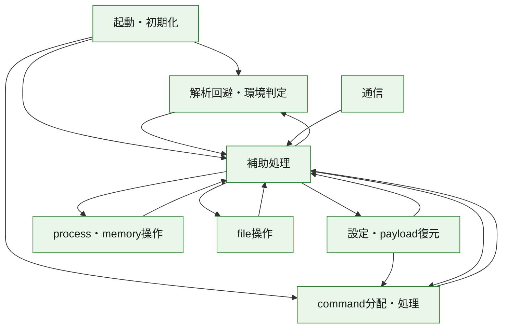

# 全体ロジック：ba2085d015f02bc9ab296266b8b44ceb3449842aba44b393e4a00bfe3da5508f

代表関数の静的証跡から、起動・初期化、設定・payload復元、解析回避・環境判定、process・memory操作、通信、command分配・処理、file操作の処理群を確認しました。

## 読み方

- phaseの掲載順は解析上の整理順です。observed_call_edgesがない段階間の実行順を断定しません。
- 図の実線は静的に観測した関係、点線と黄色のノードは未観測・未解決の関係を示します。
- 図は静的な要約であり、動的実行を再現するものではありません。
- 詳細な関数解説とfingerprintは[STATIC-LOGIC.md](STATIC-LOGIC.md)を参照してください。

## 静的可視化

### 実行フロー

### 感染チェーン

```mermaid
flowchart TD
  chain_initial["初期侵入・配布経路は未観測"]
  chain_01["提出検体 / sha256:ba2085d015f0….exe / pe"]
  chain_02["静的復元層 1 / sha256:ba2085d015f0….exe::pyinstaller-nested_archive-091-base_li / zip"]
  chain_03["静的復元層 1 / sha256:ba2085d015f0….exe::pyinstaller-pe_name_candidate-011-asyn / pe"]
  chain_04["静的復元層 1 / sha256:ba2085d015f0….exe::pyinstaller-pe_name_candidate-012-brot / pe"]
  chain_05["静的復元層 1 / sha256:ba2085d015f0….exe::pyinstaller-pe_name_candidate-013-bz2. / pe"]
  chain_06["静的復元層 1 / sha256:ba2085d015f0….exe::pyinstaller-pe_name_candidate-014-ctyp / pe"]
  chain_07["静的復元層 1 / sha256:ba2085d015f0….exe::pyinstaller-pe_name_candidate-015-deci / pe"]
  chain_08["静的復元層 1 / sha256:ba2085d015f0….exe::pyinstaller-pe_name_candidate-016-hash / pe"]
  chain_09["静的復元層 1 / sha256:ba2085d015f0….exe::pyinstaller-pe_name_candidate-017-lzma / pe"]
  chain_10["静的復元層 1 / sha256:ba2085d015f0….exe::pyinstaller-pe_name_candidate-018-mult / pe"]
  chain_11["静的復元層 1 / sha256:ba2085d015f0….exe::pyinstaller-pe_name_candidate-019-over / pe"]
  chain_12["静的復元層 1 / sha256:ba2085d015f0….exe::pyinstaller-pe_name_candidate-020-queu / pe"]
  chain_13["静的復元層 1 / sha256:ba2085d015f0….exe::pyinstaller-pe_name_candidate-021-sock / pe"]
  chain_14["静的復元層 1 / sha256:ba2085d015f0….exe::pyinstaller-pe_name_candidate-022-sqli / pe"]
  chain_15["静的復元層 1 / sha256:ba2085d015f0….exe::pyinstaller-pe_name_candidate-023-ssl. / pe"]
  chain_16["静的復元層 1 / sha256:ba2085d015f0….exe::pyinstaller-pe_name_candidate-024-uuid / pe"]
  chain_01 -->|pyinstaller-nested_archive-091-b| chain_02
  chain_01 -->|pyinstaller-pe_name_candidate-01| chain_03
  chain_01 -->|pyinstaller-pe_name_candidate-01| chain_04
  chain_01 -->|pyinstaller-pe_name_candidate-01| chain_05
  chain_01 -->|pyinstaller-pe_name_candidate-01| chain_06
  chain_01 -->|pyinstaller-pe_name_candidate-01| chain_07
  chain_01 -->|pyinstaller-pe_name_candidate-01| chain_08
  chain_01 -->|pyinstaller-pe_name_candidate-01| chain_09
  chain_01 -->|pyinstaller-pe_name_candidate-01| chain_10
  chain_01 -->|pyinstaller-pe_name_candidate-01| chain_11
  chain_01 -->|pyinstaller-pe_name_candidate-02| chain_12
  chain_01 -->|pyinstaller-pe_name_candidate-02| chain_13
  chain_01 -->|pyinstaller-pe_name_candidate-02| chain_14
  chain_01 -->|pyinstaller-pe_name_candidate-02| chain_15
  chain_01 -->|pyinstaller-pe_name_candidate-02| chain_16
  chain_initial -.-> chain_01
  chain_more["その他232層はstatic-layers.jsonを参照"]
  chain_02 -.-> chain_more
  chain_03 -.-> chain_more
  chain_04 -.-> chain_more
  chain_05 -.-> chain_more
  chain_06 -.-> chain_more
  chain_07 -.-> chain_more
  chain_08 -.-> chain_more
  chain_09 -.-> chain_more
  chain_10 -.-> chain_more
  chain_11 -.-> chain_more
  chain_12 -.-> chain_more
  chain_13 -.-> chain_more
  chain_14 -.-> chain_more
  chain_15 -.-> chain_more
  chain_16 -.-> chain_more
  class chain_more unresolved
  class chain_01,chain_02,chain_03,chain_04,chain_05,chain_06,chain_07,chain_08,chain_09,chain_10,chain_11,chain_12,chain_13,chain_14,chain_15,chain_16 confirmed
  class chain_initial unresolved
  classDef confirmed fill:#e8f5e9,stroke:#2e7d32,color:#1b1b1b
  classDef unresolved fill:#fff8e1,stroke:#f9a825,color:#1b1b1b,stroke-dasharray:5 5
```

### モジュール関係

```mermaid
flowchart TD
  module_scope["解析対象のprogram構造"]
  module_01["sha256:f957a4c26150… / x86 / statically_recovered_program"]
  module_02["sha256:1a513c0601c5… / x86 / statically_recovered_program"]
  module_03["sha256:39174763da26… / x86 / statically_recovered_program"]
  module_04["sha256:8010d006df2d… / x86 / statically_recovered_program"]
  module_05["sha256:82850eb2e7d1… / x86 / statically_recovered_program"]
  module_06["sha256:87622d07bb5c… / x86 / statically_recovered_program"]
  module_07["sha256:9ff8300ecf0e… / x86 / statically_recovered_program"]
  module_08["sha256:b43119bdfc7c… / x86 / statically_recovered_program"]
  module_09["sha256:c674ee452084… / x86 / statically_recovered_program"]
  module_10["sha256:c893a59c4d1f… / x86 / statically_recovered_program"]
  module_11["sha256:7f12e6eb9a99… / x86 / statically_recovered_program"]
  module_12["sha256:89bb192dd079… / x86 / statically_recovered_program"]
  module_parent_unknown["復元元・親moduleは未特定"]
  module_parent_unknown -.-> module_01
  module_parent_unknown -.-> module_02
  module_parent_unknown -.-> module_03
  module_parent_unknown -.-> module_04
  module_parent_unknown -.-> module_05
  module_parent_unknown -.-> module_06
  module_parent_unknown -.-> module_07
  module_parent_unknown -.-> module_08
  module_parent_unknown -.-> module_09
  module_parent_unknown -.-> module_10
  module_parent_unknown -.-> module_11
  module_parent_unknown -.-> module_12
  class module_parent_unknown unresolved
  module_more["その他69moduleはstatic-logic.jsonを参照"]
  module_scope -.-> module_more
  class module_more unresolved
  class module_scope confirmed
  class module_01,module_02,module_03,module_04,module_05,module_06,module_07,module_08,module_09,module_10,module_11,module_12 confirmed
  classDef confirmed fill:#e8f5e9,stroke:#2e7d32,color:#1b1b1b
  classDef unresolved fill:#fff8e1,stroke:#f9a825,color:#1b1b1b,stroke-dasharray:5 5
```

## 処理段階

### 1. 起動・初期化

entry pointから初期化と後続処理への移行を確認します。
確度: `confirmed_static_function_evidence`

- `fc7406772b43caa3b6f41c690753792188b1c14c36a723d49e9276b7457696ce:ghidra:180001494` — 初期化と主要処理への分岐を行う入口関数です。 状態: `succeeded`、選定理由: `entry_point`, `meaningful_symbol_name`, `reviewed_call_centrality:5`, `role:entrypoint`
- `c9620ca49afe8797c46b38f161381e601dae08c391946c66b408d48cce5bb398:ghidra:1800034f8` — 初期化と主要処理への分岐を行う入口関数です。 状態: `succeeded`、選定理由: `entry_point`, `meaningful_symbol_name`, `reviewed_call_centrality:5`, `role:entrypoint`
- `05734bd352ce60c944d474aa62468cc5eebf400097f1d9d0c453d37aed26fcca:ghidra:1800014a4` — 初期化と主要処理への分岐を行う入口関数です。 状態: `succeeded`、選定理由: `entry_point`, `meaningful_symbol_name`, `reviewed_call_centrality:5`, `role:entrypoint`
- `b6da59a94d746911053c4e64ec26fb48626717a59f77dc067cd9d79010c50a2f:ghidra:180004b04` — 初期化と主要処理への分岐を行う入口関数です。 状態: `succeeded`、選定理由: `entry_point`, `meaningful_symbol_name`, `reviewed_call_centrality:5`, `role:entrypoint`
- `4fbd1ce051f3990258e81b864ed4773eefa7395562b89aeeb6b3bcdda0e0ec75:ghidra:180004c94` — 初期化と主要処理への分岐を行う入口関数です。 状態: `succeeded`、選定理由: `entry_point`, `meaningful_symbol_name`, `reviewed_call_centrality:5`, `role:entrypoint`
- `cb529f77bc4665dfa3b66fae3d00ab84de1e9618d0cb94900efbf28527623c0f:ghidra:180001bd4` — 初期化と主要処理への分岐を行う入口関数です。 状態: `succeeded`、選定理由: `entry_point`, `meaningful_symbol_name`, `reviewed_call_centrality:5`, `role:entrypoint`
- `84a2e86428dde756e6f3e56369daf558180a30f1f7d4781cce295304e19b6fb8:ghidra:180001454` — 初期化と主要処理への分岐を行う入口関数です。 状態: `succeeded`、選定理由: `entry_point`, `meaningful_symbol_name`, `reviewed_call_centrality:5`, `role:entrypoint`
- `eff52743773eb550fcc6ce3efc37c85724502233b6b002a35496d828bd7b280a:ghidra:180004ce0` — 初期化と主要処理への分岐を行う入口関数です。 状態: `succeeded`、選定理由: `entry_point`, `meaningful_symbol_name`, `reviewed_call_centrality:5`, `role:entrypoint`
- `5a7f3444f1c2f85fb5573bc330c1aea2c583912bb6f948ff81f8fd89a30e67be:ghidra:1800029d0` — 初期化と主要処理への分岐を行う入口関数です。 状態: `succeeded`、選定理由: `entry_point`, `meaningful_symbol_name`, `reviewed_call_centrality:5`, `role:entrypoint`
- `7b27d739088e56760a99a84a9bb8b3b8ae372268a13e5e1b8de8bc1854ced5c9:ghidra:180006e44` — 初期化と主要処理への分岐を行う入口関数です。 状態: `succeeded`、選定理由: `entry_point`, `meaningful_symbol_name`, `reviewed_call_centrality:5`, `role:entrypoint`
- `6a99bc0128e0c7d6cbbf615fcc26909565e17d4ca3451b97f8987f9c6acbc6c8:ghidra:1800040a0` — 初期化と主要処理への分岐を行う入口関数です。 状態: `succeeded`、選定理由: `entry_point`, `meaningful_symbol_name`, `reviewed_call_centrality:5`, `role:entrypoint`
- `80a2f8feda9255ef611af0a28fd4df311e3cd59c3dc4eaba9a2e97bd42ddbf54:ghidra:180001944` — 初期化と主要処理への分岐を行う入口関数です。 状態: `succeeded`、選定理由: `entry_point`, `meaningful_symbol_name`, `reviewed_call_centrality:5`, `role:entrypoint`
- `a99ae23a73ddb7ec61b251d85402ca266ce02dd5365cd8a550d8b1c6c453a57d:ghidra:180009524` — 初期化と主要処理への分岐を行う入口関数です。 状態: `succeeded`、選定理由: `entry_point`, `meaningful_symbol_name`, `reviewed_call_centrality:5`, `role:entrypoint`
- `d4524b261f09806a828c62fc97e8517328b23d65ab87d20706a4bafd86bbf345:ghidra:180004414` — 初期化と主要処理への分岐を行う入口関数です。 状態: `succeeded`、選定理由: `entry_point`, `meaningful_symbol_name`, `reviewed_call_centrality:5`, `role:entrypoint`
- `054e5d97884e8d833528aa3a98868204a3ec46cabb6a656e72432634d117880a:ghidra:18000a624` — 初期化と主要処理への分岐を行う入口関数です。 状態: `succeeded`、選定理由: `entry_point`, `meaningful_symbol_name`, `reviewed_call_centrality:5`, `role:entrypoint`
- `0035450801bd7d938e9e146c5ec28e619cb5a5f4a18cdc53ac7e9734c7f94f78:ghidra:18000aea0` — 初期化と主要処理への分岐を行う入口関数です。 状態: `succeeded`、選定理由: `entry_point`, `meaningful_symbol_name`, `reviewed_call_centrality:5`, `role:entrypoint`
- `258d185776cf6b35c244cd134cdda9405f74de222c927d0bdbb9fd6d926ae5ce:ghidra:18000dd94` — 初期化と主要処理への分岐を行う入口関数です。 状態: `succeeded`、選定理由: `entry_point`, `meaningful_symbol_name`, `reviewed_call_centrality:5`, `role:entrypoint`
- `48fdd95938c43b8b3e1f6312de651a53d459e8e2c754fbbdf48e99f5caa1f55b:ghidra:180001c44` — 初期化と主要処理への分岐を行う入口関数です。 状態: `succeeded`、選定理由: `entry_point`, `meaningful_symbol_name`, `reviewed_call_centrality:5`, `role:entrypoint`
- `7fcf93a3e1b34c59c731f34009e8a15592204e662e7a14207f33a2f9d1110c4a:ghidra:18000e7a4` — 初期化と主要処理への分岐を行う入口関数です。 状態: `succeeded`、選定理由: `entry_point`, `meaningful_symbol_name`, `reviewed_call_centrality:5`, `role:entrypoint`
- `a4be36fffeefa8b24c1234d548da8f05558aba53c2ea7d1d2614776eaad8fbf4:ghidra:18000a7c4` — 初期化と主要処理への分岐を行う入口関数です。 状態: `succeeded`、選定理由: `entry_point`, `meaningful_symbol_name`, `reviewed_call_centrality:5`, `role:entrypoint`
- `ff3e97cd11bdc68798e5b3dcd5295d1efba179b7344142d50d066bbf1c2d79cd:ghidra:180002ed4` — 初期化と主要処理への分岐を行う入口関数です。 状態: `succeeded`、選定理由: `entry_point`, `meaningful_symbol_name`, `reviewed_call_centrality:5`, `role:entrypoint`
- `052ad6a20d375957e82aa6a3c441ea548d89be0981516ca7eb306e063d5027f4:ghidra:18000f690` — 初期化と主要処理への分岐を行う入口関数です。 状態: `succeeded`、選定理由: `entry_point`, `meaningful_symbol_name`, `reviewed_call_centrality:5`, `role:entrypoint`
- `c6d7bcea0084bcfa3c487bd7040350ee7c77f4108ce74b964f760133b2a7a6b2:ghidra:18000bec4` — 初期化と主要処理への分岐を行う入口関数です。 状態: `succeeded`、選定理由: `entry_point`, `meaningful_symbol_name`, `reviewed_call_centrality:5`, `role:entrypoint`
- `903feb110c86dffa957259f3d2a33a1c0b3c8a635d9a44a642b9ab5852d59a61:ghidra:18001112c` — 初期化と主要処理への分岐を行う入口関数です。 状態: `succeeded`、選定理由: `entry_point`, `meaningful_symbol_name`, `reviewed_call_centrality:5`, `role:entrypoint`
- `74f036548f3321d312205085662b2b92c0654354a718a41c44e02fd4e01fedb9:ghidra:18000e210` — 初期化と主要処理への分岐を行う入口関数です。 状態: `succeeded`、選定理由: `entry_point`, `meaningful_symbol_name`, `reviewed_call_centrality:19`, `role:entrypoint`
- `74f036548f3321d312205085662b2b92c0654354a718a41c44e02fd4e01fedb9:ghidra:18000f33c` — 初期化と主要処理への分岐を行う入口関数です。 状態: `succeeded`、選定理由: `entry_point`, `meaningful_symbol_name`, `reviewed_call_centrality:5`, `role:entrypoint`
- `f8a9f7831e81b2bfba12456e589f8198114f24986bd527ac231a844565afcddb:ghidra:180007aa4` — 初期化と主要処理への分岐を行う入口関数です。 状態: `succeeded`、選定理由: `entry_point`, `meaningful_symbol_name`, `reviewed_call_centrality:5`, `role:entrypoint`
- `b283dc1f6ffaf0751967c6c99a05cf90cbb3fd17ee6ffbb1d5d56c21a13f4769:ghidra:18001a024` — 初期化と主要処理への分岐を行う入口関数です。 状態: `succeeded`、選定理由: `entry_point`, `meaningful_symbol_name`, `reviewed_call_centrality:5`, `role:entrypoint`
- `f7ad11fbbb7aeaf7b6566a532a3243e3ae5f92bac480dbe5c2ef300fe2c1dabe:ghidra:180013204` — 初期化と主要処理への分岐を行う入口関数です。 状態: `succeeded`、選定理由: `entry_point`, `meaningful_symbol_name`, `reviewed_call_centrality:5`, `role:entrypoint`
- `43e60bbdff2fe41701f39fa25ea6a8251a2b7623ff18f980a209a451eb5e648f:ghidra:180002f44` — 初期化と主要処理への分岐を行う入口関数です。 状態: `succeeded`、選定理由: `entry_point`, `meaningful_symbol_name`, `reviewed_call_centrality:5`, `role:entrypoint`
- `b6d5142424d161039c25bea00e6acd8f7b1a5331d3994d9f3c28bd083ede159f:ghidra:180010fa4` — 初期化と主要処理への分岐を行う入口関数です。 状態: `succeeded`、選定理由: `entry_point`, `meaningful_symbol_name`, `reviewed_call_centrality:5`, `role:entrypoint`
- `58600458c9e56edf441bf4b9c3da2dfb0e8e3944359c07083633a34047697473:ghidra:180030544` — 初期化と主要処理への分岐を行う入口関数です。 状態: `succeeded`、選定理由: `entry_point`, `meaningful_symbol_name`, `reviewed_call_centrality:5`, `role:entrypoint`
- `04738ee6b96bcc6351446b011b523d831aa88ec3f11d4b64c33414c965b56b80:ghidra:180022500` — 初期化と主要処理への分岐を行う入口関数です。 状態: `succeeded`、選定理由: `entry_point`, `meaningful_symbol_name`, `reviewed_call_centrality:5`, `role:entrypoint`
- `536a3b521a3c42d2827ece0ccfbe40b83a2fd96a0f5496cd60b943b10e1266d4:ghidra:180001e94` — 初期化と主要処理への分岐を行う入口関数です。 状態: `succeeded`、選定理由: `entry_point`, `meaningful_symbol_name`, `reviewed_call_centrality:5`, `role:entrypoint`
- `4445b894f836e89a8b9fdcc88b5e59fbc76aca805baaf40aeb69e869978d4e6d:ghidra:180002c34` — 初期化と主要処理への分岐を行う入口関数です。 状態: `succeeded`、選定理由: `entry_point`, `meaningful_symbol_name`, `reviewed_call_centrality:5`, `role:entrypoint`
- `44f02bcf2b15519a487cf653e16b5f9c65f26d0be559592878988ad47148fc5e:ghidra:18005c864` — 初期化と主要処理への分岐を行う入口関数です。 状態: `succeeded`、選定理由: `entry_point`, `meaningful_symbol_name`, `reviewed_call_centrality:5`, `role:entrypoint`
- `c04daeba7e7c4b711d33993ab4c51a2e087f98f4211aea0dcb3a216656ba0ab7:ghidra:180015e30` — 初期化と主要処理への分岐を行う入口関数です。 状態: `succeeded`、選定理由: `entry_point`, `meaningful_symbol_name`, `reviewed_call_centrality:15`, `role:entrypoint`
- `c04daeba7e7c4b711d33993ab4c51a2e087f98f4211aea0dcb3a216656ba0ab7:ghidra:180018d00` — 初期化と主要処理への分岐を行う入口関数です。 状態: `succeeded`、選定理由: `entry_point`, `meaningful_symbol_name`, `reviewed_call_centrality:3`, `role:entrypoint`
- `c04daeba7e7c4b711d33993ab4c51a2e087f98f4211aea0dcb3a216656ba0ab7:ghidra:180019660` — 初期化と主要処理への分岐を行う入口関数です。 状態: `succeeded`、選定理由: `entry_point`, `meaningful_symbol_name`, `reviewed_call_centrality:3`, `role:entrypoint`
- `c04daeba7e7c4b711d33993ab4c51a2e087f98f4211aea0dcb3a216656ba0ab7:ghidra:180022fb0` — 初期化と主要処理への分岐を行う入口関数です。 状態: `succeeded`、選定理由: `entry_point`, `meaningful_symbol_name`, `reviewed_call_centrality:2`, `role:entrypoint`
- `c04daeba7e7c4b711d33993ab4c51a2e087f98f4211aea0dcb3a216656ba0ab7:ghidra:180025a20` — 初期化と主要処理への分岐を行う入口関数です。 状態: `succeeded`、選定理由: `entry_point`, `meaningful_symbol_name`, `role:entrypoint`
- `153883edf04717624437cd092adb2b72015be3984e03d25cf5a1823b0f764ac7:ghidra:18013be44` — 初期化と主要処理への分岐を行う入口関数です。 状態: `succeeded`、選定理由: `entry_point`, `meaningful_symbol_name`, `reviewed_call_centrality:5`, `role:entrypoint`
- `1ac15e2224581fc678bbd17728b9aa538d47b891b72c76499ef07e54cd74f151:ghidra:1800cd35c` — 初期化と主要処理への分岐を行う入口関数です。 状態: `succeeded`、選定理由: `entry_point`, `meaningful_symbol_name`, `reviewed_call_centrality:1`, `role:entrypoint`
- `ba2085d015f02bc9ab296266b8b44ceb3449842aba44b393e4a00bfe3da5508f:ghidra:14000dfa0` — 初期化と主要処理への分岐を行う入口関数です。 状態: `succeeded`、選定理由: `entry_point`, `meaningful_symbol_name`, `reviewed_call_centrality:22`, `role:entrypoint`

### 2. 設定・payload復元

設定、resource、payload、暗号化データの復元・変換を確認します。
確度: `confirmed_static_function_evidence_with_limits`

- `74f036548f3321d312205085662b2b92c0654354a718a41c44e02fd4e01fedb9:ghidra:18000d300` — 設定、resource、payloadなどの解析・変換を行う関数です。 状態: `succeeded`、選定理由: `entry_point`, `meaningful_symbol_name`, `reviewed_call_centrality:7`, `role:config_or_data_transform`
- `74f036548f3321d312205085662b2b92c0654354a718a41c44e02fd4e01fedb9:ghidra:18000d3a0` — 設定、resource、payloadなどの解析・変換を行う関数です。 状態: `succeeded`、選定理由: `entry_point`, `meaningful_symbol_name`, `reviewed_call_centrality:7`, `role:config_or_data_transform`
- `04738ee6b96bcc6351446b011b523d831aa88ec3f11d4b64c33414c965b56b80:ghidra:180003194` — 設定、resource、payloadなどの解析・変換を行う関数です。 状態: `succeeded`、選定理由: `entry_point`, `meaningful_symbol_name`, `reviewed_call_centrality:10`, `role:config_or_data_transform`
- `153883edf04717624437cd092adb2b72015be3984e03d25cf5a1823b0f764ac7:ghidra:1800131e0` — 設定、resource、payloadなどの解析・変換を行う関数です。 状態: `succeeded`、選定理由: `entry_point`, `meaningful_symbol_name`, `reviewed_call_centrality:17`, `role:config_or_data_transform`
- `153883edf04717624437cd092adb2b72015be3984e03d25cf5a1823b0f764ac7:ghidra:1800a2680` — 設定、resource、payloadなどの解析・変換を行う関数です。 状態: `succeeded`、選定理由: `entry_point`, `meaningful_symbol_name`, `reviewed_call_centrality:2`, `role:config_or_data_transform`
- `153883edf04717624437cd092adb2b72015be3984e03d25cf5a1823b0f764ac7:ghidra:1800c4b10` — 設定、resource、payloadなどの解析・変換を行う関数です。 状態: `succeeded`、選定理由: `entry_point`, `meaningful_symbol_name`, `reviewed_call_centrality:3`, `role:config_or_data_transform`
- `153883edf04717624437cd092adb2b72015be3984e03d25cf5a1823b0f764ac7:ghidra:1800c54a0` — 設定、resource、payloadなどの解析・変換を行う関数です。 状態: `succeeded`、選定理由: `entry_point`, `meaningful_symbol_name`, `reviewed_call_centrality:1`, `role:config_or_data_transform`
- `1ac15e2224581fc678bbd17728b9aa538d47b891b72c76499ef07e54cd74f151:ghidra:180006630` — 設定、resource、payloadなどの解析・変換を行う関数です。 状態: `succeeded`、選定理由: `entry_point`, `meaningful_symbol_name`, `reviewed_call_centrality:1`, `role:config_or_data_transform`
- `1ac15e2224581fc678bbd17728b9aa538d47b891b72c76499ef07e54cd74f151:ghidra:1800092c8` — 設定、resource、payloadなどの解析・変換を行う関数です。 状態: `succeeded`、選定理由: `entry_point`, `meaningful_symbol_name`, `reviewed_call_centrality:11`, `role:config_or_data_transform`
- `1ac15e2224581fc678bbd17728b9aa538d47b891b72c76499ef07e54cd74f151:ghidra:18000b04c` — 設定、resource、payloadなどの解析・変換を行う関数です。 状態: `succeeded`、選定理由: `entry_point`, `meaningful_symbol_name`, `reviewed_call_centrality:12`, `role:config_or_data_transform`
- `1ac15e2224581fc678bbd17728b9aa538d47b891b72c76499ef07e54cd74f151:ghidra:18001029c` — 設定、resource、payloadなどの解析・変換を行う関数です。 状態: `succeeded`、選定理由: `entry_point`, `meaningful_symbol_name`, `reviewed_call_centrality:7`, `role:config_or_data_transform`
- `1ac15e2224581fc678bbd17728b9aa538d47b891b72c76499ef07e54cd74f151:ghidra:1800109bc` — 設定、resource、payloadなどの解析・変換を行う関数です。 状態: `succeeded`、選定理由: `entry_point`, `meaningful_symbol_name`, `reviewed_call_centrality:2`, `role:config_or_data_transform`
- `1ac15e2224581fc678bbd17728b9aa538d47b891b72c76499ef07e54cd74f151:ghidra:180010b6c` — 設定、resource、payloadなどの解析・変換を行う関数です。 状態: `succeeded`、選定理由: `entry_point`, `meaningful_symbol_name`, `reviewed_call_centrality:9`, `role:config_or_data_transform`
- `1ac15e2224581fc678bbd17728b9aa538d47b891b72c76499ef07e54cd74f151:ghidra:180011a4c` — 設定、resource、payloadなどの解析・変換を行う関数です。 状態: `succeeded`、選定理由: `entry_point`, `meaningful_symbol_name`, `reviewed_call_centrality:1`, `role:config_or_data_transform`
- `1ac15e2224581fc678bbd17728b9aa538d47b891b72c76499ef07e54cd74f151:ghidra:180011a88` — 設定、resource、payloadなどの解析・変換を行う関数です。 状態: `succeeded`、選定理由: `entry_point`, `meaningful_symbol_name`, `reviewed_call_centrality:2`, `role:config_or_data_transform`
- `1ac15e2224581fc678bbd17728b9aa538d47b891b72c76499ef07e54cd74f151:ghidra:180011ac4` — 設定、resource、payloadなどの解析・変換を行う関数です。 状態: `succeeded`、選定理由: `entry_point`, `meaningful_symbol_name`, `reviewed_call_centrality:1`, `role:config_or_data_transform`
- `1ac15e2224581fc678bbd17728b9aa538d47b891b72c76499ef07e54cd74f151:ghidra:180011de0` — 設定、resource、payloadなどの解析・変換を行う関数です。 状態: `succeeded`、選定理由: `entry_point`, `meaningful_symbol_name`, `reviewed_call_centrality:2`, `role:config_or_data_transform`
- `1ac15e2224581fc678bbd17728b9aa538d47b891b72c76499ef07e54cd74f151:ghidra:180011fe0` — 設定、resource、payloadなどの解析・変換を行う関数です。 状態: `succeeded`、選定理由: `entry_point`, `meaningful_symbol_name`, `reviewed_call_centrality:1`, `role:config_or_data_transform`
- `1ac15e2224581fc678bbd17728b9aa538d47b891b72c76499ef07e54cd74f151:ghidra:180030444` — 暗号、hash、encoding、または復号処理に関係する関数です。 状態: `succeeded`、選定理由: `entry_point`, `meaningful_symbol_name`, `reviewed_call_centrality:2`, `role:cryptographic_transform`
- `1ac15e2224581fc678bbd17728b9aa538d47b891b72c76499ef07e54cd74f151:ghidra:180034590` — 設定、resource、payloadなどの解析・変換を行う関数です。 状態: `succeeded`、選定理由: `entry_point`, `meaningful_symbol_name`, `reviewed_call_centrality:3`, `role:config_or_data_transform`
- `1ac15e2224581fc678bbd17728b9aa538d47b891b72c76499ef07e54cd74f151:ghidra:180035530` — 設定、resource、payloadなどの解析・変換を行う関数です。 状態: `succeeded`、選定理由: `entry_point`, `meaningful_symbol_name`, `reviewed_call_centrality:9`, `role:config_or_data_transform`
- `1ac15e2224581fc678bbd17728b9aa538d47b891b72c76499ef07e54cd74f151:ghidra:180037ca0` — 設定、resource、payloadなどの解析・変換を行う関数です。 状態: `succeeded`、選定理由: `entry_point`, `meaningful_symbol_name`, `reviewed_call_centrality:17`, `role:config_or_data_transform`
- `1ac15e2224581fc678bbd17728b9aa538d47b891b72c76499ef07e54cd74f151:ghidra:18004d240` — 設定、resource、payloadなどの解析・変換を行う関数です。 状態: `succeeded`、選定理由: `entry_point`, `meaningful_symbol_name`, `reviewed_call_centrality:10`, `role:config_or_data_transform`
- `1ac15e2224581fc678bbd17728b9aa538d47b891b72c76499ef07e54cd74f151:ghidra:180056f00` — 暗号、hash、encoding、または復号処理に関係する関数です。 状態: `limited_bad_instruction_or_flow`、選定理由: `entry_point`, `meaningful_symbol_name`, `reviewed_call_centrality:3`, `role:cryptographic_transform`
- `1ac15e2224581fc678bbd17728b9aa538d47b891b72c76499ef07e54cd74f151:ghidra:18006bfd0` — 設定、resource、payloadなどの解析・変換を行う関数です。 状態: `succeeded`、選定理由: `entry_point`, `meaningful_symbol_name`, `reviewed_call_centrality:33`, `role:config_or_data_transform`
- `1ac15e2224581fc678bbd17728b9aa538d47b891b72c76499ef07e54cd74f151:ghidra:18009423c` — 設定、resource、payloadなどの解析・変換を行う関数です。 状態: `succeeded`、選定理由: `entry_point`, `meaningful_symbol_name`, `reviewed_call_centrality:10`, `role:config_or_data_transform`
- `1ac15e2224581fc678bbd17728b9aa538d47b891b72c76499ef07e54cd74f151:ghidra:1800a0e00` — 設定、resource、payloadなどの解析・変換を行う関数です。 状態: `succeeded`、選定理由: `entry_point`, `meaningful_symbol_name`, `reviewed_call_centrality:2`, `role:config_or_data_transform`
- `1ac15e2224581fc678bbd17728b9aa538d47b891b72c76499ef07e54cd74f151:ghidra:1800a4920` — 設定、resource、payloadなどの解析・変換を行う関数です。 状態: `succeeded`、選定理由: `entry_point`, `meaningful_symbol_name`, `reviewed_call_centrality:10`, `role:config_or_data_transform`
- `1ac15e2224581fc678bbd17728b9aa538d47b891b72c76499ef07e54cd74f151:ghidra:1800a80e4` — 設定、resource、payloadなどの解析・変換を行う関数です。 状態: `succeeded`、選定理由: `entry_point`, `meaningful_symbol_name`, `reviewed_call_centrality:1`, `role:config_or_data_transform`
- `1ac15e2224581fc678bbd17728b9aa538d47b891b72c76499ef07e54cd74f151:ghidra:1800a8124` — 設定、resource、payloadなどの解析・変換を行う関数です。 状態: `succeeded`、選定理由: `entry_point`, `meaningful_symbol_name`, `reviewed_call_centrality:2`, `role:config_or_data_transform`
- `1ac15e2224581fc678bbd17728b9aa538d47b891b72c76499ef07e54cd74f151:ghidra:1800a818c` — 設定、resource、payloadなどの解析・変換を行う関数です。 状態: `succeeded`、選定理由: `entry_point`, `meaningful_symbol_name`, `reviewed_call_centrality:2`, `role:config_or_data_transform`
- `1ac15e2224581fc678bbd17728b9aa538d47b891b72c76499ef07e54cd74f151:ghidra:1800ad948` — 設定、resource、payloadなどの解析・変換を行う関数です。 状態: `succeeded`、選定理由: `entry_point`, `meaningful_symbol_name`, `reviewed_call_centrality:2`, `role:config_or_data_transform`
- `1ac15e2224581fc678bbd17728b9aa538d47b891b72c76499ef07e54cd74f151:ghidra:1800b0720` — 設定、resource、payloadなどの解析・変換を行う関数です。 状態: `succeeded`、選定理由: `entry_point`, `meaningful_symbol_name`, `reviewed_call_centrality:2`, `role:config_or_data_transform`
- `1ac15e2224581fc678bbd17728b9aa538d47b891b72c76499ef07e54cd74f151:ghidra:1800cb914` — 設定、resource、payloadなどの解析・変換を行う関数です。 状態: `succeeded`、選定理由: `entry_point`, `meaningful_symbol_name`, `reviewed_call_centrality:2`, `role:config_or_data_transform`
- `1ac15e2224581fc678bbd17728b9aa538d47b891b72c76499ef07e54cd74f151:ghidra:1800cde60` — 設定、resource、payloadなどの解析・変換を行う関数です。 状態: `succeeded`、選定理由: `entry_point`, `meaningful_symbol_name`, `reviewed_call_centrality:1`, `role:config_or_data_transform`

### 3. 解析回避・環境判定

debugger、sandbox、仮想環境、時間差などの判定を確認します。
確度: `confirmed_static_function_evidence`

- `fc7406772b43caa3b6f41c690753792188b1c14c36a723d49e9276b7457696ce:ghidra:180001650` — debugger、仮想環境、sandbox、または時間差の確認に関係する関数です。 状態: `succeeded`、選定理由: `context_representative`, `reviewed_call_centrality:10`, `role:anti_analysis`
- `fc7406772b43caa3b6f41c690753792188b1c14c36a723d49e9276b7457696ce:ghidra:180001a9c` — debugger、仮想環境、sandbox、または時間差の確認に関係する関数です。 状態: `succeeded`、選定理由: `context_representative`, `reviewed_call_centrality:21`, `role:anti_analysis`
- `05734bd352ce60c944d474aa62468cc5eebf400097f1d9d0c453d37aed26fcca:ghidra:180001660` — debugger、仮想環境、sandbox、または時間差の確認に関係する関数です。 状態: `succeeded`、選定理由: `context_representative`, `reviewed_call_centrality:10`, `role:anti_analysis`
- `05734bd352ce60c944d474aa62468cc5eebf400097f1d9d0c453d37aed26fcca:ghidra:180001aac` — debugger、仮想環境、sandbox、または時間差の確認に関係する関数です。 状態: `succeeded`、選定理由: `context_representative`, `reviewed_call_centrality:21`, `role:anti_analysis`
- `b6da59a94d746911053c4e64ec26fb48626717a59f77dc067cd9d79010c50a2f:ghidra:180004b4c` — debugger、仮想環境、sandbox、または時間差の確認に関係する関数です。 状態: `succeeded`、選定理由: `context_representative`, `reviewed_call_centrality:10`, `role:anti_analysis`
- `cb529f77bc4665dfa3b66fae3d00ab84de1e9618d0cb94900efbf28527623c0f:ghidra:180001d90` — debugger、仮想環境、sandbox、または時間差の確認に関係する関数です。 状態: `succeeded`、選定理由: `context_representative`, `reviewed_call_centrality:10`, `role:anti_analysis`
- `84a2e86428dde756e6f3e56369daf558180a30f1f7d4781cce295304e19b6fb8:ghidra:180001610` — debugger、仮想環境、sandbox、または時間差の確認に関係する関数です。 状態: `succeeded`、選定理由: `context_representative`, `reviewed_call_centrality:10`, `role:anti_analysis`
- `84a2e86428dde756e6f3e56369daf558180a30f1f7d4781cce295304e19b6fb8:ghidra:180001a5c` — debugger、仮想環境、sandbox、または時間差の確認に関係する関数です。 状態: `succeeded`、選定理由: `context_representative`, `reviewed_call_centrality:21`, `role:anti_analysis`
- `84a2e86428dde756e6f3e56369daf558180a30f1f7d4781cce295304e19b6fb8:ghidra:180001c24` — debugger、仮想環境、sandbox、または時間差の確認に関係する関数です。 状態: `succeeded`、選定理由: `context_representative`, `reviewed_call_centrality:8`, `role:anti_analysis`
- `80a2f8feda9255ef611af0a28fd4df311e3cd59c3dc4eaba9a2e97bd42ddbf54:ghidra:180001b00` — debugger、仮想環境、sandbox、または時間差の確認に関係する関数です。 状態: `succeeded`、選定理由: `context_representative`, `reviewed_call_centrality:10`, `role:anti_analysis`
- `80a2f8feda9255ef611af0a28fd4df311e3cd59c3dc4eaba9a2e97bd42ddbf54:ghidra:180001f4c` — debugger、仮想環境、sandbox、または時間差の確認に関係する関数です。 状態: `succeeded`、選定理由: `context_representative`, `reviewed_call_centrality:21`, `role:anti_analysis`
- `48fdd95938c43b8b3e1f6312de651a53d459e8e2c754fbbdf48e99f5caa1f55b:ghidra:180001e00` — debugger、仮想環境、sandbox、または時間差の確認に関係する関数です。 状態: `succeeded`、選定理由: `context_representative`, `reviewed_call_centrality:10`, `role:anti_analysis`
- `48fdd95938c43b8b3e1f6312de651a53d459e8e2c754fbbdf48e99f5caa1f55b:ghidra:18000224c` — debugger、仮想環境、sandbox、または時間差の確認に関係する関数です。 状態: `succeeded`、選定理由: `context_representative`, `reviewed_call_centrality:21`, `role:anti_analysis`
- `ff3e97cd11bdc68798e5b3dcd5295d1efba179b7344142d50d066bbf1c2d79cd:ghidra:180003090` — debugger、仮想環境、sandbox、または時間差の確認に関係する関数です。 状態: `succeeded`、選定理由: `context_representative`, `reviewed_call_centrality:10`, `role:anti_analysis`
- `43e60bbdff2fe41701f39fa25ea6a8251a2b7623ff18f980a209a451eb5e648f:ghidra:180002f84` — debugger、仮想環境、sandbox、または時間差の確認に関係する関数です。 状態: `succeeded`、選定理由: `context_representative`, `reviewed_call_centrality:10`, `role:anti_analysis`
- `536a3b521a3c42d2827ece0ccfbe40b83a2fd96a0f5496cd60b943b10e1266d4:ghidra:180001ed4` — debugger、仮想環境、sandbox、または時間差の確認に関係する関数です。 状態: `succeeded`、選定理由: `context_representative`, `reviewed_call_centrality:10`, `role:anti_analysis`

### 4. process・memory操作

process、thread、module、memory操作と実行移行を確認します。
確度: `confirmed_static_function_evidence`

- `eff52743773eb550fcc6ce3efc37c85724502233b6b002a35496d828bd7b280a:ghidra:180003670` — process、thread、module、またはmemory操作に関係する関数です。 状態: `succeeded`、選定理由: `context_representative`, `reviewed_call_centrality:10`, `role:process_or_memory_operation`
- `5a7f3444f1c2f85fb5573bc330c1aea2c583912bb6f948ff81f8fd89a30e67be:ghidra:1800016d0` — process、thread、module、またはmemory操作に関係する関数です。 状態: `succeeded`、選定理由: `context_representative`, `reviewed_call_centrality:41`, `role:process_or_memory_operation`
- `5a7f3444f1c2f85fb5573bc330c1aea2c583912bb6f948ff81f8fd89a30e67be:ghidra:180001e80` — process、thread、module、またはmemory操作に関係する関数です。 状態: `succeeded`、選定理由: `context_representative`, `reviewed_call_centrality:5`, `role:process_or_memory_operation`
- `0035450801bd7d938e9e146c5ec28e619cb5a5f4a18cdc53ac7e9734c7f94f78:ghidra:1800038e0` — process、thread、module、またはmemory操作に関係する関数です。 状態: `succeeded`、選定理由: `context_representative`, `reviewed_call_centrality:15`, `role:process_or_memory_operation`

### 5. 通信

通信初期化、endpoint処理、送受信の役割を確認します。
確度: `confirmed_static_function_evidence_with_limits`

- `80a2f8feda9255ef611af0a28fd4df311e3cd59c3dc4eaba9a2e97bd42ddbf54:ghidra:1800010e0` — 通信初期化、送受信、またはendpoint処理に関係する関数です。 状態: `succeeded`、選定理由: `context_representative`, `reviewed_call_centrality:22`, `role:network_communication`
- `ff3e97cd11bdc68798e5b3dcd5295d1efba179b7344142d50d066bbf1c2d79cd:ghidra:180001230` — 通信初期化、送受信、またはendpoint処理に関係する関数です。 状態: `failed`、選定理由: `context_representative`, `reviewed_call_centrality:32`, `role:network_communication`
- `74f036548f3321d312205085662b2b92c0654354a718a41c44e02fd4e01fedb9:ghidra:18000c370` — 通信初期化、送受信、またはendpoint処理に関係する関数です。 状態: `succeeded`、選定理由: `entry_point`, `meaningful_symbol_name`, `reviewed_call_centrality:14`, `role:network_communication`
- `1ac15e2224581fc678bbd17728b9aa538d47b891b72c76499ef07e54cd74f151:ghidra:1801a6d20` — 通信初期化、送受信、またはendpoint処理に関係する関数です。 状態: `succeeded`、選定理由: `entry_point`, `meaningful_symbol_name`, `reviewed_call_centrality:2`, `role:network_communication`

### 6. command分配・処理

受信commandやtaskの解釈、分配、個別handlerへの移行を確認します。
確度: `confirmed_static_function_evidence_with_limits`

- `fc7406772b43caa3b6f41c690753792188b1c14c36a723d49e9276b7457696ce:ghidra:180002010` — commandの解釈、分配、または個別処理を担当する関数です。 状態: `limited_bad_instruction_or_flow`、選定理由: `meaningful_symbol_name`, `reviewed_call_centrality:5`, `role:command_dispatch_or_handler`
- `c9620ca49afe8797c46b38f161381e601dae08c391946c66b408d48cce5bb398:ghidra:180004840` — commandの解釈、分配、または個別処理を担当する関数です。 状態: `limited_bad_instruction_or_flow`、選定理由: `meaningful_symbol_name`, `role:command_dispatch_or_handler`
- `05734bd352ce60c944d474aa62468cc5eebf400097f1d9d0c453d37aed26fcca:ghidra:180002080` — commandの解釈、分配、または個別処理を担当する関数です。 状態: `limited_bad_instruction_or_flow`、選定理由: `meaningful_symbol_name`, `reviewed_call_centrality:4`, `role:command_dispatch_or_handler`
- `b6da59a94d746911053c4e64ec26fb48626717a59f77dc067cd9d79010c50a2f:ghidra:1800053a0` — commandの解釈、分配、または個別処理を担当する関数です。 状態: `limited_bad_instruction_or_flow`、選定理由: `meaningful_symbol_name`, `reviewed_call_centrality:4`, `role:command_dispatch_or_handler`
- `4fbd1ce051f3990258e81b864ed4773eefa7395562b89aeeb6b3bcdda0e0ec75:ghidra:180005800` — commandの解釈、分配、または個別処理を担当する関数です。 状態: `limited_bad_instruction_or_flow`、選定理由: `meaningful_symbol_name`, `role:command_dispatch_or_handler`
- `cb529f77bc4665dfa3b66fae3d00ab84de1e9618d0cb94900efbf28527623c0f:ghidra:180002750` — commandの解釈、分配、または個別処理を担当する関数です。 状態: `limited_bad_instruction_or_flow`、選定理由: `meaningful_symbol_name`, `reviewed_call_centrality:2`, `role:command_dispatch_or_handler`
- `84a2e86428dde756e6f3e56369daf558180a30f1f7d4781cce295304e19b6fb8:ghidra:180001fd0` — commandの解釈、分配、または個別処理を担当する関数です。 状態: `limited_bad_instruction_or_flow`、選定理由: `meaningful_symbol_name`, `reviewed_call_centrality:5`, `role:command_dispatch_or_handler`
- `eff52743773eb550fcc6ce3efc37c85724502233b6b002a35496d828bd7b280a:ghidra:1800056f0` — commandの解釈、分配、または個別処理を担当する関数です。 状態: `limited_bad_instruction_or_flow`、選定理由: `meaningful_symbol_name`, `role:command_dispatch_or_handler`
- `5a7f3444f1c2f85fb5573bc330c1aea2c583912bb6f948ff81f8fd89a30e67be:ghidra:1800038e0` — commandの解釈、分配、または個別処理を担当する関数です。 状態: `limited_bad_instruction_or_flow`、選定理由: `meaningful_symbol_name`, `reviewed_call_centrality:6`, `role:command_dispatch_or_handler`
- `7b27d739088e56760a99a84a9bb8b3b8ae372268a13e5e1b8de8bc1854ced5c9:ghidra:180007a10` — commandの解釈、分配、または個別処理を担当する関数です。 状態: `limited_bad_instruction_or_flow`、選定理由: `meaningful_symbol_name`, `role:command_dispatch_or_handler`
- `6a99bc0128e0c7d6cbbf615fcc26909565e17d4ca3451b97f8987f9c6acbc6c8:ghidra:180004900` — commandの解釈、分配、または個別処理を担当する関数です。 状態: `limited_bad_instruction_or_flow`、選定理由: `meaningful_symbol_name`, `reviewed_call_centrality:3`, `role:command_dispatch_or_handler`
- `80a2f8feda9255ef611af0a28fd4df311e3cd59c3dc4eaba9a2e97bd42ddbf54:ghidra:1800024c0` — commandの解釈、分配、または個別処理を担当する関数です。 状態: `limited_bad_instruction_or_flow`、選定理由: `meaningful_symbol_name`, `reviewed_call_centrality:4`, `role:command_dispatch_or_handler`
- `a99ae23a73ddb7ec61b251d85402ca266ce02dd5365cd8a550d8b1c6c453a57d:ghidra:18000a090` — commandの解釈、分配、または個別処理を担当する関数です。 状態: `limited_bad_instruction_or_flow`、選定理由: `meaningful_symbol_name`, `role:command_dispatch_or_handler`
- `d4524b261f09806a828c62fc97e8517328b23d65ab87d20706a4bafd86bbf345:ghidra:180004f90` — commandの解釈、分配、または個別処理を担当する関数です。 状態: `limited_bad_instruction_or_flow`、選定理由: `meaningful_symbol_name`, `role:command_dispatch_or_handler`
- `054e5d97884e8d833528aa3a98868204a3ec46cabb6a656e72432634d117880a:ghidra:18000b190` — commandの解釈、分配、または個別処理を担当する関数です。 状態: `limited_bad_instruction_or_flow`、選定理由: `meaningful_symbol_name`, `role:command_dispatch_or_handler`
- `0035450801bd7d938e9e146c5ec28e619cb5a5f4a18cdc53ac7e9734c7f94f78:ghidra:18000b8f0` — commandの解釈、分配、または個別処理を担当する関数です。 状態: `limited_bad_instruction_or_flow`、選定理由: `meaningful_symbol_name`, `role:command_dispatch_or_handler`
- `258d185776cf6b35c244cd134cdda9405f74de222c927d0bdbb9fd6d926ae5ce:ghidra:18000e880` — commandの解釈、分配、または個別処理を担当する関数です。 状態: `limited_bad_instruction_or_flow`、選定理由: `meaningful_symbol_name`, `role:command_dispatch_or_handler`
- `48fdd95938c43b8b3e1f6312de651a53d459e8e2c754fbbdf48e99f5caa1f55b:ghidra:1800027c0` — commandの解釈、分配、または個別処理を担当する関数です。 状態: `limited_bad_instruction_or_flow`、選定理由: `meaningful_symbol_name`, `reviewed_call_centrality:3`, `role:command_dispatch_or_handler`
- `7fcf93a3e1b34c59c731f34009e8a15592204e662e7a14207f33a2f9d1110c4a:ghidra:18000f370` — commandの解釈、分配、または個別処理を担当する関数です。 状態: `limited_bad_instruction_or_flow`、選定理由: `meaningful_symbol_name`, `role:command_dispatch_or_handler`
- `a4be36fffeefa8b24c1234d548da8f05558aba53c2ea7d1d2614776eaad8fbf4:ghidra:18000b220` — commandの解釈、分配、または個別処理を担当する関数です。 状態: `limited_bad_instruction_or_flow`、選定理由: `meaningful_symbol_name`, `role:command_dispatch_or_handler`
- `ff3e97cd11bdc68798e5b3dcd5295d1efba179b7344142d50d066bbf1c2d79cd:ghidra:180003a50` — commandの解釈、分配、または個別処理を担当する関数です。 状態: `limited_bad_instruction_or_flow`、選定理由: `meaningful_symbol_name`, `reviewed_call_centrality:3`, `role:command_dispatch_or_handler`
- `052ad6a20d375957e82aa6a3c441ea548d89be0981516ca7eb306e063d5027f4:ghidra:1800059c0` — commandの解釈、分配、または個別処理を担当する関数です。 状態: `succeeded`、選定理由: `entry_point`, `meaningful_symbol_name`, `reviewed_call_centrality:1`, `role:command_dispatch_or_handler`
- `052ad6a20d375957e82aa6a3c441ea548d89be0981516ca7eb306e063d5027f4:ghidra:1800059f0` — commandの解釈、分配、または個別処理を担当する関数です。 状態: `succeeded`、選定理由: `entry_point`, `meaningful_symbol_name`, `reviewed_call_centrality:2`, `role:command_dispatch_or_handler`
- `c6d7bcea0084bcfa3c487bd7040350ee7c77f4108ce74b964f760133b2a7a6b2:ghidra:18000ca40` — commandの解釈、分配、または個別処理を担当する関数です。 状態: `limited_bad_instruction_or_flow`、選定理由: `meaningful_symbol_name`, `role:command_dispatch_or_handler`
- `903feb110c86dffa957259f3d2a33a1c0b3c8a635d9a44a642b9ab5852d59a61:ghidra:180012b30` — commandの解釈、分配、または個別処理を担当する関数です。 状態: `limited_bad_instruction_or_flow`、選定理由: `meaningful_symbol_name`, `role:command_dispatch_or_handler`
- `74f036548f3321d312205085662b2b92c0654354a718a41c44e02fd4e01fedb9:ghidra:1800106a0` — commandの解釈、分配、または個別処理を担当する関数です。 状態: `limited_bad_instruction_or_flow`、選定理由: `meaningful_symbol_name`, `role:command_dispatch_or_handler`
- `f8a9f7831e81b2bfba12456e589f8198114f24986bd527ac231a844565afcddb:ghidra:180008680` — commandの解釈、分配、または個別処理を担当する関数です。 状態: `limited_bad_instruction_or_flow`、選定理由: `meaningful_symbol_name`, `role:command_dispatch_or_handler`
- `b283dc1f6ffaf0751967c6c99a05cf90cbb3fd17ee6ffbb1d5d56c21a13f4769:ghidra:18001ab90` — commandの解釈、分配、または個別処理を担当する関数です。 状態: `limited_bad_instruction_or_flow`、選定理由: `meaningful_symbol_name`, `role:command_dispatch_or_handler`
- `f7ad11fbbb7aeaf7b6566a532a3243e3ae5f92bac480dbe5c2ef300fe2c1dabe:ghidra:180013d80` — commandの解釈、分配、または個別処理を担当する関数です。 状態: `limited_bad_instruction_or_flow`、選定理由: `meaningful_symbol_name`, `role:command_dispatch_or_handler`
- `43e60bbdff2fe41701f39fa25ea6a8251a2b7623ff18f980a209a451eb5e648f:ghidra:180003950` — commandの解釈、分配、または個別処理を担当する関数です。 状態: `limited_bad_instruction_or_flow`、選定理由: `meaningful_symbol_name`, `reviewed_call_centrality:2`, `role:command_dispatch_or_handler`
- `b6d5142424d161039c25bea00e6acd8f7b1a5331d3994d9f3c28bd083ede159f:ghidra:180011b20` — commandの解釈、分配、または個別処理を担当する関数です。 状態: `limited_bad_instruction_or_flow`、選定理由: `meaningful_symbol_name`, `role:command_dispatch_or_handler`
- `58600458c9e56edf441bf4b9c3da2dfb0e8e3944359c07083633a34047697473:ghidra:18002eb70` — commandの解釈、分配、または個別処理を担当する関数です。 状態: `succeeded`、選定理由: `entry_point`, `meaningful_symbol_name`, `reviewed_call_centrality:1`, `role:command_dispatch_or_handler`
- `58600458c9e56edf441bf4b9c3da2dfb0e8e3944359c07083633a34047697473:ghidra:1800310c0` — commandの解釈、分配、または個別処理を担当する関数です。 状態: `limited_bad_instruction_or_flow`、選定理由: `meaningful_symbol_name`, `role:command_dispatch_or_handler`
- `04738ee6b96bcc6351446b011b523d831aa88ec3f11d4b64c33414c965b56b80:ghidra:180023360` — commandの解釈、分配、または個別処理を担当する関数です。 状態: `limited_bad_instruction_or_flow`、選定理由: `meaningful_symbol_name`, `role:command_dispatch_or_handler`
- `536a3b521a3c42d2827ece0ccfbe40b83a2fd96a0f5496cd60b943b10e1266d4:ghidra:1800028f0` — commandの解釈、分配、または個別処理を担当する関数です。 状態: `limited_bad_instruction_or_flow`、選定理由: `meaningful_symbol_name`, `reviewed_call_centrality:3`, `role:command_dispatch_or_handler`
- `4445b894f836e89a8b9fdcc88b5e59fbc76aca805baaf40aeb69e869978d4e6d:ghidra:1800037b0` — commandの解釈、分配、または個別処理を担当する関数です。 状態: `limited_bad_instruction_or_flow`、選定理由: `meaningful_symbol_name`, `reviewed_call_centrality:2`, `role:command_dispatch_or_handler`
- `1e4bc0638682bfcbb36f4465d6a2e9944d917a60f05ecc8ddf9e96847e05e13f:ghidra:1800013c0` — commandの解釈、分配、または個別処理を担当する関数です。 状態: `limited_bad_instruction_or_flow`、選定理由: `meaningful_symbol_name`, `role:command_dispatch_or_handler`
- `44f02bcf2b15519a487cf653e16b5f9c65f26d0be559592878988ad47148fc5e:ghidra:18005d250` — commandの解釈、分配、または個別処理を担当する関数です。 状態: `limited_bad_instruction_or_flow`、選定理由: `meaningful_symbol_name`, `role:command_dispatch_or_handler`
- `c04daeba7e7c4b711d33993ab4c51a2e087f98f4211aea0dcb3a216656ba0ab7:ghidra:18001bd30` — commandの解釈、分配、または個別処理を担当する関数です。 状態: `succeeded`、選定理由: `entry_point`, `meaningful_symbol_name`, `reviewed_call_centrality:2`, `role:command_dispatch_or_handler`
- `c04daeba7e7c4b711d33993ab4c51a2e087f98f4211aea0dcb3a216656ba0ab7:ghidra:18001bfa0` — commandの解釈、分配、または個別処理を担当する関数です。 状態: `succeeded`、選定理由: `entry_point`, `meaningful_symbol_name`, `reviewed_call_centrality:3`, `role:command_dispatch_or_handler`
- `c04daeba7e7c4b711d33993ab4c51a2e087f98f4211aea0dcb3a216656ba0ab7:ghidra:180025690` — commandの解釈、分配、または個別処理を担当する関数です。 状態: `succeeded`、選定理由: `entry_point`, `meaningful_symbol_name`, `reviewed_call_centrality:5`, `role:command_dispatch_or_handler`
- `c04daeba7e7c4b711d33993ab4c51a2e087f98f4211aea0dcb3a216656ba0ab7:ghidra:180028100` — commandの解釈、分配、または個別処理を担当する関数です。 状態: `succeeded`、選定理由: `entry_point`, `meaningful_symbol_name`, `reviewed_call_centrality:5`, `role:command_dispatch_or_handler`
- `c04daeba7e7c4b711d33993ab4c51a2e087f98f4211aea0dcb3a216656ba0ab7:ghidra:18004de20` — commandの解釈、分配、または個別処理を担当する関数です。 状態: `succeeded`、選定理由: `entry_point`, `meaningful_symbol_name`, `role:command_dispatch_or_handler`
- `c04daeba7e7c4b711d33993ab4c51a2e087f98f4211aea0dcb3a216656ba0ab7:ghidra:18004de60` — commandの解釈、分配、または個別処理を担当する関数です。 状態: `succeeded`、選定理由: `entry_point`, `meaningful_symbol_name`, `reviewed_call_centrality:2`, `role:command_dispatch_or_handler`
- `c04daeba7e7c4b711d33993ab4c51a2e087f98f4211aea0dcb3a216656ba0ab7:ghidra:18006bcd0` — commandの解釈、分配、または個別処理を担当する関数です。 状態: `succeeded`、選定理由: `entry_point`, `meaningful_symbol_name`, `reviewed_call_centrality:3`, `role:command_dispatch_or_handler`
- `c04daeba7e7c4b711d33993ab4c51a2e087f98f4211aea0dcb3a216656ba0ab7:ghidra:18006bd30` — commandの解釈、分配、または個別処理を担当する関数です。 状態: `succeeded`、選定理由: `entry_point`, `meaningful_symbol_name`, `reviewed_call_centrality:3`, `role:command_dispatch_or_handler`
- `c04daeba7e7c4b711d33993ab4c51a2e087f98f4211aea0dcb3a216656ba0ab7:ghidra:18006e500` — commandの解釈、分配、または個別処理を担当する関数です。 状態: `succeeded`、選定理由: `entry_point`, `meaningful_symbol_name`, `reviewed_call_centrality:3`, `role:command_dispatch_or_handler`
- `c04daeba7e7c4b711d33993ab4c51a2e087f98f4211aea0dcb3a216656ba0ab7:ghidra:18006e520` — commandの解釈、分配、または個別処理を担当する関数です。 状態: `succeeded`、選定理由: `entry_point`, `meaningful_symbol_name`, `reviewed_call_centrality:3`, `role:command_dispatch_or_handler`
- `c04daeba7e7c4b711d33993ab4c51a2e087f98f4211aea0dcb3a216656ba0ab7:ghidra:18006e530` — commandの解釈、分配、または個別処理を担当する関数です。 状態: `succeeded`、選定理由: `entry_point`, `meaningful_symbol_name`, `reviewed_call_centrality:3`, `role:command_dispatch_or_handler`
- `c04daeba7e7c4b711d33993ab4c51a2e087f98f4211aea0dcb3a216656ba0ab7:ghidra:18006e610` — commandの解釈、分配、または個別処理を担当する関数です。 状態: `succeeded`、選定理由: `entry_point`, `meaningful_symbol_name`, `reviewed_call_centrality:1`, `role:command_dispatch_or_handler`
- `c04daeba7e7c4b711d33993ab4c51a2e087f98f4211aea0dcb3a216656ba0ab7:ghidra:18006fad0` — commandの解釈、分配、または個別処理を担当する関数です。 状態: `succeeded`、選定理由: `entry_point`, `meaningful_symbol_name`, `reviewed_call_centrality:1`, `role:command_dispatch_or_handler`
- `c04daeba7e7c4b711d33993ab4c51a2e087f98f4211aea0dcb3a216656ba0ab7:ghidra:1800788c0` — commandの解釈、分配、または個別処理を担当する関数です。 状態: `succeeded`、選定理由: `entry_point`, `meaningful_symbol_name`, `reviewed_call_centrality:6`, `role:command_dispatch_or_handler`
- `c04daeba7e7c4b711d33993ab4c51a2e087f98f4211aea0dcb3a216656ba0ab7:ghidra:180078930` — commandの解釈、分配、または個別処理を担当する関数です。 状態: `succeeded`、選定理由: `entry_point`, `meaningful_symbol_name`, `reviewed_call_centrality:8`, `role:command_dispatch_or_handler`
- `c04daeba7e7c4b711d33993ab4c51a2e087f98f4211aea0dcb3a216656ba0ab7:ghidra:18007c4b0` — commandの解釈、分配、または個別処理を担当する関数です。 状態: `succeeded`、選定理由: `entry_point`, `meaningful_symbol_name`, `reviewed_call_centrality:1`, `role:command_dispatch_or_handler`
- `c04daeba7e7c4b711d33993ab4c51a2e087f98f4211aea0dcb3a216656ba0ab7:ghidra:18007c4f0` — commandの解釈、分配、または個別処理を担当する関数です。 状態: `succeeded`、選定理由: `entry_point`, `meaningful_symbol_name`, `reviewed_call_centrality:11`, `role:command_dispatch_or_handler`
- `c04daeba7e7c4b711d33993ab4c51a2e087f98f4211aea0dcb3a216656ba0ab7:ghidra:18007c680` — commandの解釈、分配、または個別処理を担当する関数です。 状態: `succeeded`、選定理由: `entry_point`, `meaningful_symbol_name`, `reviewed_call_centrality:1`, `role:command_dispatch_or_handler`
- `c04daeba7e7c4b711d33993ab4c51a2e087f98f4211aea0dcb3a216656ba0ab7:ghidra:18007c700` — commandの解釈、分配、または個別処理を担当する関数です。 状態: `succeeded`、選定理由: `entry_point`, `meaningful_symbol_name`, `reviewed_call_centrality:1`, `role:command_dispatch_or_handler`
- `c04daeba7e7c4b711d33993ab4c51a2e087f98f4211aea0dcb3a216656ba0ab7:ghidra:1800add10` — commandの解釈、分配、または個別処理を担当する関数です。 状態: `succeeded`、選定理由: `entry_point`, `meaningful_symbol_name`, `reviewed_call_centrality:10`, `role:command_dispatch_or_handler`
- `c04daeba7e7c4b711d33993ab4c51a2e087f98f4211aea0dcb3a216656ba0ab7:ghidra:1800bcb20` — commandの解釈、分配、または個別処理を担当する関数です。 状態: `succeeded`、選定理由: `entry_point`, `meaningful_symbol_name`, `reviewed_call_centrality:9`, `role:command_dispatch_or_handler`
- `153883edf04717624437cd092adb2b72015be3984e03d25cf5a1823b0f764ac7:ghidra:1800c6260` — commandの解釈、分配、または個別処理を担当する関数です。 状態: `succeeded`、選定理由: `entry_point`, `meaningful_symbol_name`, `role:command_dispatch_or_handler`
- `153883edf04717624437cd092adb2b72015be3984e03d25cf5a1823b0f764ac7:ghidra:1800c62d0` — commandの解釈、分配、または個別処理を担当する関数です。 状態: `succeeded`、選定理由: `entry_point`, `meaningful_symbol_name`, `role:command_dispatch_or_handler`
- `e03dd02fdcfb791981c9962827cfcf495f2a47a514c1526efb57f847a9df514a:ghidra:1800027d4` — commandの解釈、分配、または個別処理を担当する関数です。 状態: `limited_bad_instruction_or_flow`、選定理由: `meaningful_symbol_name`, `role:command_dispatch_or_handler`
- `1ac15e2224581fc678bbd17728b9aa538d47b891b72c76499ef07e54cd74f151:ghidra:180011984` — commandの解釈、分配、または個別処理を担当する関数です。 状態: `succeeded`、選定理由: `entry_point`, `meaningful_symbol_name`, `reviewed_call_centrality:3`, `role:command_dispatch_or_handler`
- `ba2085d015f02bc9ab296266b8b44ceb3449842aba44b393e4a00bfe3da5508f:ghidra:14002bc70` — commandの解釈、分配、または個別処理を担当する関数です。 状態: `limited_bad_instruction_or_flow`、選定理由: `meaningful_symbol_name`, `reviewed_call_centrality:2`, `role:command_dispatch_or_handler`

### 7. file操作

fileやdirectoryの作成、読書き、削除を確認します。
確度: `confirmed_static_function_evidence`

- `5a7f3444f1c2f85fb5573bc330c1aea2c583912bb6f948ff81f8fd89a30e67be:ghidra:1800010b0` — fileまたはdirectoryの読書き・管理に関係する関数です。 状態: `succeeded`、選定理由: `context_representative`, `reviewed_call_centrality:36`, `role:file_operation`
- `0035450801bd7d938e9e146c5ec28e619cb5a5f4a18cdc53ac7e9734c7f94f78:ghidra:1800029b0` — fileまたはdirectoryの読書き・管理に関係する関数です。 状態: `succeeded`、選定理由: `context_representative`, `reviewed_call_centrality:24`, `role:file_operation`
- `c04daeba7e7c4b711d33993ab4c51a2e087f98f4211aea0dcb3a216656ba0ab7:ghidra:180001bb0` — fileまたはdirectoryの読書き・管理に関係する関数です。 状態: `succeeded`、選定理由: `entry_point`, `meaningful_symbol_name`, `reviewed_call_centrality:15`, `role:file_operation`

### 8. 補助処理

主要処理を支える一般内部関数またはlibrary処理を確認します。
確度: `confirmed_static_function_evidence_with_limits`

- `f957a4c261506484b53534a9be8931c02ec1a349b3f431a858f8215cecfec3f7:ghidra:180004000` — 外部APIまたはthunkであり、検体固有の関数本体を持ちません。 状態: `excluded_external_or_thunk`、選定理由: `context_representative`, `no_internal_body_structural_fallback`
- `f957a4c261506484b53534a9be8931c02ec1a349b3f431a858f8215cecfec3f7:ghidra:180004008` — 外部APIまたはthunkであり、検体固有の関数本体を持ちません。 状態: `excluded_external_or_thunk`、選定理由: `context_representative`, `no_internal_body_structural_fallback`
- `f957a4c261506484b53534a9be8931c02ec1a349b3f431a858f8215cecfec3f7:ghidra:180004010` — 外部APIまたはthunkであり、検体固有の関数本体を持ちません。 状態: `excluded_external_or_thunk`、選定理由: `context_representative`, `no_internal_body_structural_fallback`
- `f957a4c261506484b53534a9be8931c02ec1a349b3f431a858f8215cecfec3f7:ghidra:180004018` — 外部APIまたはthunkであり、検体固有の関数本体を持ちません。 状態: `excluded_external_or_thunk`、選定理由: `context_representative`, `no_internal_body_structural_fallback`
- `1a513c0601c5b628018c003d8598586d4a48fd1acf51372f6783dc23b0a27756:ghidra:180004000` — 外部APIまたはthunkであり、検体固有の関数本体を持ちません。 状態: `excluded_external_or_thunk`、選定理由: `context_representative`, `no_internal_body_structural_fallback`
- `1a513c0601c5b628018c003d8598586d4a48fd1acf51372f6783dc23b0a27756:ghidra:180004008` — 外部APIまたはthunkであり、検体固有の関数本体を持ちません。 状態: `excluded_external_or_thunk`、選定理由: `context_representative`, `no_internal_body_structural_fallback`
- `1a513c0601c5b628018c003d8598586d4a48fd1acf51372f6783dc23b0a27756:ghidra:180004010` — 外部APIまたはthunkであり、検体固有の関数本体を持ちません。 状態: `excluded_external_or_thunk`、選定理由: `context_representative`, `no_internal_body_structural_fallback`
- `1a513c0601c5b628018c003d8598586d4a48fd1acf51372f6783dc23b0a27756:ghidra:180004018` — 外部APIまたはthunkであり、検体固有の関数本体を持ちません。 状態: `excluded_external_or_thunk`、選定理由: `context_representative`, `no_internal_body_structural_fallback`
- `39174763da266b4b955e27eecaef15d8283bb77f9eca94fe925d4928f37a4fa1:ghidra:180004000` — 外部APIまたはthunkであり、検体固有の関数本体を持ちません。 状態: `excluded_external_or_thunk`、選定理由: `context_representative`, `no_internal_body_structural_fallback`
- `39174763da266b4b955e27eecaef15d8283bb77f9eca94fe925d4928f37a4fa1:ghidra:180004008` — 外部APIまたはthunkであり、検体固有の関数本体を持ちません。 状態: `excluded_external_or_thunk`、選定理由: `context_representative`, `no_internal_body_structural_fallback`
- `39174763da266b4b955e27eecaef15d8283bb77f9eca94fe925d4928f37a4fa1:ghidra:180004010` — 外部APIまたはthunkであり、検体固有の関数本体を持ちません。 状態: `excluded_external_or_thunk`、選定理由: `context_representative`, `no_internal_body_structural_fallback`
- `39174763da266b4b955e27eecaef15d8283bb77f9eca94fe925d4928f37a4fa1:ghidra:180004018` — 外部APIまたはthunkであり、検体固有の関数本体を持ちません。 状態: `excluded_external_or_thunk`、選定理由: `context_representative`, `no_internal_body_structural_fallback`
- `8010d006df2d62839c933d3b5998abc7a7830ffe32ca68b17c76f3292f5e56ec:ghidra:180004000` — 外部APIまたはthunkであり、検体固有の関数本体を持ちません。 状態: `excluded_external_or_thunk`、選定理由: `context_representative`, `no_internal_body_structural_fallback`
- `8010d006df2d62839c933d3b5998abc7a7830ffe32ca68b17c76f3292f5e56ec:ghidra:180004008` — 外部APIまたはthunkであり、検体固有の関数本体を持ちません。 状態: `excluded_external_or_thunk`、選定理由: `context_representative`, `no_internal_body_structural_fallback`
- `8010d006df2d62839c933d3b5998abc7a7830ffe32ca68b17c76f3292f5e56ec:ghidra:180004010` — 外部APIまたはthunkであり、検体固有の関数本体を持ちません。 状態: `excluded_external_or_thunk`、選定理由: `context_representative`, `no_internal_body_structural_fallback`
- `8010d006df2d62839c933d3b5998abc7a7830ffe32ca68b17c76f3292f5e56ec:ghidra:180004018` — 外部APIまたはthunkであり、検体固有の関数本体を持ちません。 状態: `excluded_external_or_thunk`、選定理由: `context_representative`, `no_internal_body_structural_fallback`
- `82850eb2e7d100938ebd419440e4575750999bc9e349cd074019e413673d02c8:ghidra:180004000` — 外部APIまたはthunkであり、検体固有の関数本体を持ちません。 状態: `excluded_external_or_thunk`、選定理由: `context_representative`, `no_internal_body_structural_fallback`
- `82850eb2e7d100938ebd419440e4575750999bc9e349cd074019e413673d02c8:ghidra:180004008` — 外部APIまたはthunkであり、検体固有の関数本体を持ちません。 状態: `excluded_external_or_thunk`、選定理由: `context_representative`, `no_internal_body_structural_fallback`
- `82850eb2e7d100938ebd419440e4575750999bc9e349cd074019e413673d02c8:ghidra:180004010` — 外部APIまたはthunkであり、検体固有の関数本体を持ちません。 状態: `excluded_external_or_thunk`、選定理由: `context_representative`, `no_internal_body_structural_fallback`
- `82850eb2e7d100938ebd419440e4575750999bc9e349cd074019e413673d02c8:ghidra:180004018` — 外部APIまたはthunkであり、検体固有の関数本体を持ちません。 状態: `excluded_external_or_thunk`、選定理由: `context_representative`, `no_internal_body_structural_fallback`
- `87622d07bb5c9fa5ccd9f74ac70a1e2ae0cdf54462f90f365178a15a814bf3c4:ghidra:180004000` — 外部APIまたはthunkであり、検体固有の関数本体を持ちません。 状態: `excluded_external_or_thunk`、選定理由: `context_representative`, `no_internal_body_structural_fallback`
- `87622d07bb5c9fa5ccd9f74ac70a1e2ae0cdf54462f90f365178a15a814bf3c4:ghidra:180004008` — 外部APIまたはthunkであり、検体固有の関数本体を持ちません。 状態: `excluded_external_or_thunk`、選定理由: `context_representative`, `no_internal_body_structural_fallback`
- `87622d07bb5c9fa5ccd9f74ac70a1e2ae0cdf54462f90f365178a15a814bf3c4:ghidra:180004010` — 外部APIまたはthunkであり、検体固有の関数本体を持ちません。 状態: `excluded_external_or_thunk`、選定理由: `context_representative`, `no_internal_body_structural_fallback`
- `87622d07bb5c9fa5ccd9f74ac70a1e2ae0cdf54462f90f365178a15a814bf3c4:ghidra:180004018` — 外部APIまたはthunkであり、検体固有の関数本体を持ちません。 状態: `excluded_external_or_thunk`、選定理由: `context_representative`, `no_internal_body_structural_fallback`
- `9ff8300ecf0ebd4c8130800b5b8857b6ddf21902264af42fb1ac15c794115864:ghidra:180004000` — 外部APIまたはthunkであり、検体固有の関数本体を持ちません。 状態: `excluded_external_or_thunk`、選定理由: `context_representative`, `no_internal_body_structural_fallback`
- `9ff8300ecf0ebd4c8130800b5b8857b6ddf21902264af42fb1ac15c794115864:ghidra:180004008` — 外部APIまたはthunkであり、検体固有の関数本体を持ちません。 状態: `excluded_external_or_thunk`、選定理由: `context_representative`, `no_internal_body_structural_fallback`
- `9ff8300ecf0ebd4c8130800b5b8857b6ddf21902264af42fb1ac15c794115864:ghidra:180004010` — 外部APIまたはthunkであり、検体固有の関数本体を持ちません。 状態: `excluded_external_or_thunk`、選定理由: `context_representative`, `no_internal_body_structural_fallback`
- `9ff8300ecf0ebd4c8130800b5b8857b6ddf21902264af42fb1ac15c794115864:ghidra:180004018` — 外部APIまたはthunkであり、検体固有の関数本体を持ちません。 状態: `excluded_external_or_thunk`、選定理由: `context_representative`, `no_internal_body_structural_fallback`
- `b43119bdfc7c562bf07c26e01b7b862aa8dc9d5e795798fe93969111244ed2da:ghidra:180004000` — 外部APIまたはthunkであり、検体固有の関数本体を持ちません。 状態: `excluded_external_or_thunk`、選定理由: `context_representative`, `no_internal_body_structural_fallback`
- `b43119bdfc7c562bf07c26e01b7b862aa8dc9d5e795798fe93969111244ed2da:ghidra:180004008` — 外部APIまたはthunkであり、検体固有の関数本体を持ちません。 状態: `excluded_external_or_thunk`、選定理由: `context_representative`, `no_internal_body_structural_fallback`
- `c674ee45208477eec3669db64abb586df50d4fa38aa5b47ed2012d4bc5d9ec4e:ghidra:180004000` — 外部APIまたはthunkであり、検体固有の関数本体を持ちません。 状態: `excluded_external_or_thunk`、選定理由: `context_representative`, `no_internal_body_structural_fallback`
- `c674ee45208477eec3669db64abb586df50d4fa38aa5b47ed2012d4bc5d9ec4e:ghidra:180004008` — 外部APIまたはthunkであり、検体固有の関数本体を持ちません。 状態: `excluded_external_or_thunk`、選定理由: `context_representative`, `no_internal_body_structural_fallback`
- `c674ee45208477eec3669db64abb586df50d4fa38aa5b47ed2012d4bc5d9ec4e:ghidra:180004010` — 外部APIまたはthunkであり、検体固有の関数本体を持ちません。 状態: `excluded_external_or_thunk`、選定理由: `context_representative`, `no_internal_body_structural_fallback`
- `c674ee45208477eec3669db64abb586df50d4fa38aa5b47ed2012d4bc5d9ec4e:ghidra:180004018` — 外部APIまたはthunkであり、検体固有の関数本体を持ちません。 状態: `excluded_external_or_thunk`、選定理由: `context_representative`, `no_internal_body_structural_fallback`
- `c893a59c4d1fa86fb50d486ebf3a873244b910efec5b00690d4a20afb7ce0761:ghidra:180004000` — 外部APIまたはthunkであり、検体固有の関数本体を持ちません。 状態: `excluded_external_or_thunk`、選定理由: `context_representative`, `no_internal_body_structural_fallback`
- `c893a59c4d1fa86fb50d486ebf3a873244b910efec5b00690d4a20afb7ce0761:ghidra:180004008` — 外部APIまたはthunkであり、検体固有の関数本体を持ちません。 状態: `excluded_external_or_thunk`、選定理由: `context_representative`, `no_internal_body_structural_fallback`
- `c893a59c4d1fa86fb50d486ebf3a873244b910efec5b00690d4a20afb7ce0761:ghidra:180004010` — 外部APIまたはthunkであり、検体固有の関数本体を持ちません。 状態: `excluded_external_or_thunk`、選定理由: `context_representative`, `no_internal_body_structural_fallback`
- `c893a59c4d1fa86fb50d486ebf3a873244b910efec5b00690d4a20afb7ce0761:ghidra:180004018` — 外部APIまたはthunkであり、検体固有の関数本体を持ちません。 状態: `excluded_external_or_thunk`、選定理由: `context_representative`, `no_internal_body_structural_fallback`
- `7f12e6eb9a992ea199bcfc755eea488a8889cd2642dba00e49fb06a14bec8408:ghidra:180004000` — 外部APIまたはthunkであり、検体固有の関数本体を持ちません。 状態: `excluded_external_or_thunk`、選定理由: `context_representative`, `no_internal_body_structural_fallback`
- `7f12e6eb9a992ea199bcfc755eea488a8889cd2642dba00e49fb06a14bec8408:ghidra:180004008` — 外部APIまたはthunkであり、検体固有の関数本体を持ちません。 状態: `excluded_external_or_thunk`、選定理由: `context_representative`, `no_internal_body_structural_fallback`
- `7f12e6eb9a992ea199bcfc755eea488a8889cd2642dba00e49fb06a14bec8408:ghidra:180004010` — 外部APIまたはthunkであり、検体固有の関数本体を持ちません。 状態: `excluded_external_or_thunk`、選定理由: `context_representative`, `no_internal_body_structural_fallback`
- `7f12e6eb9a992ea199bcfc755eea488a8889cd2642dba00e49fb06a14bec8408:ghidra:180004018` — 外部APIまたはthunkであり、検体固有の関数本体を持ちません。 状態: `excluded_external_or_thunk`、選定理由: `context_representative`, `no_internal_body_structural_fallback`
- `89bb192dd079784d9ba716a2e45a1ee6af75c67e9151fde77eb8ec32cb014182:ghidra:180004000` — 外部APIまたはthunkであり、検体固有の関数本体を持ちません。 状態: `excluded_external_or_thunk`、選定理由: `context_representative`, `no_internal_body_structural_fallback`
- `89bb192dd079784d9ba716a2e45a1ee6af75c67e9151fde77eb8ec32cb014182:ghidra:180004008` — 外部APIまたはthunkであり、検体固有の関数本体を持ちません。 状態: `excluded_external_or_thunk`、選定理由: `context_representative`, `no_internal_body_structural_fallback`
- `89bb192dd079784d9ba716a2e45a1ee6af75c67e9151fde77eb8ec32cb014182:ghidra:180004010` — 外部APIまたはthunkであり、検体固有の関数本体を持ちません。 状態: `excluded_external_or_thunk`、選定理由: `context_representative`, `no_internal_body_structural_fallback`
- `89bb192dd079784d9ba716a2e45a1ee6af75c67e9151fde77eb8ec32cb014182:ghidra:180004018` — 外部APIまたはthunkであり、検体固有の関数本体を持ちません。 状態: `excluded_external_or_thunk`、選定理由: `context_representative`, `no_internal_body_structural_fallback`
- `9e466e76079b73bd9b0114004d040d193dc982e4150eee1241a902d16c2bda38:ghidra:180004000` — 外部APIまたはthunkであり、検体固有の関数本体を持ちません。 状態: `excluded_external_or_thunk`、選定理由: `context_representative`, `no_internal_body_structural_fallback`
- `9e466e76079b73bd9b0114004d040d193dc982e4150eee1241a902d16c2bda38:ghidra:180004008` — 外部APIまたはthunkであり、検体固有の関数本体を持ちません。 状態: `excluded_external_or_thunk`、選定理由: `context_representative`, `no_internal_body_structural_fallback`
- `9e466e76079b73bd9b0114004d040d193dc982e4150eee1241a902d16c2bda38:ghidra:180004010` — 外部APIまたはthunkであり、検体固有の関数本体を持ちません。 状態: `excluded_external_or_thunk`、選定理由: `context_representative`, `no_internal_body_structural_fallback`
- `9e466e76079b73bd9b0114004d040d193dc982e4150eee1241a902d16c2bda38:ghidra:180004018` — 外部APIまたはthunkであり、検体固有の関数本体を持ちません。 状態: `excluded_external_or_thunk`、選定理由: `context_representative`, `no_internal_body_structural_fallback`
- `d655a217f4c17982b4c5ecb406290885c74afba361dd840c4245c0b28e07c192:ghidra:180004000` — 外部APIまたはthunkであり、検体固有の関数本体を持ちません。 状態: `excluded_external_or_thunk`、選定理由: `context_representative`, `no_internal_body_structural_fallback`
- `d655a217f4c17982b4c5ecb406290885c74afba361dd840c4245c0b28e07c192:ghidra:180004008` — 外部APIまたはthunkであり、検体固有の関数本体を持ちません。 状態: `excluded_external_or_thunk`、選定理由: `context_representative`, `no_internal_body_structural_fallback`
- `d655a217f4c17982b4c5ecb406290885c74afba361dd840c4245c0b28e07c192:ghidra:180004010` — 外部APIまたはthunkであり、検体固有の関数本体を持ちません。 状態: `excluded_external_or_thunk`、選定理由: `context_representative`, `no_internal_body_structural_fallback`
- `d655a217f4c17982b4c5ecb406290885c74afba361dd840c4245c0b28e07c192:ghidra:180004018` — 外部APIまたはthunkであり、検体固有の関数本体を持ちません。 状態: `excluded_external_or_thunk`、選定理由: `context_representative`, `no_internal_body_structural_fallback`
- `055544d562ca50d49443926bca396de985735f7451806ff2565486e406809d25:ghidra:180004000` — 外部APIまたはthunkであり、検体固有の関数本体を持ちません。 状態: `excluded_external_or_thunk`、選定理由: `context_representative`, `no_internal_body_structural_fallback`
- `055544d562ca50d49443926bca396de985735f7451806ff2565486e406809d25:ghidra:180004008` — 外部APIまたはthunkであり、検体固有の関数本体を持ちません。 状態: `excluded_external_or_thunk`、選定理由: `context_representative`, `no_internal_body_structural_fallback`
- `055544d562ca50d49443926bca396de985735f7451806ff2565486e406809d25:ghidra:180004010` — 外部APIまたはthunkであり、検体固有の関数本体を持ちません。 状態: `excluded_external_or_thunk`、選定理由: `context_representative`, `no_internal_body_structural_fallback`
- `055544d562ca50d49443926bca396de985735f7451806ff2565486e406809d25:ghidra:180004018` — 外部APIまたはthunkであり、検体固有の関数本体を持ちません。 状態: `excluded_external_or_thunk`、選定理由: `context_representative`, `no_internal_body_structural_fallback`
- `1985000499475faf541b17c8acbce788bcdba6dddd3b8910b6730238f1c18862:ghidra:180004000` — 外部APIまたはthunkであり、検体固有の関数本体を持ちません。 状態: `excluded_external_or_thunk`、選定理由: `context_representative`, `no_internal_body_structural_fallback`
- `1985000499475faf541b17c8acbce788bcdba6dddd3b8910b6730238f1c18862:ghidra:180004008` — 外部APIまたはthunkであり、検体固有の関数本体を持ちません。 状態: `excluded_external_or_thunk`、選定理由: `context_representative`, `no_internal_body_structural_fallback`
- `1985000499475faf541b17c8acbce788bcdba6dddd3b8910b6730238f1c18862:ghidra:180004010` — 外部APIまたはthunkであり、検体固有の関数本体を持ちません。 状態: `excluded_external_or_thunk`、選定理由: `context_representative`, `no_internal_body_structural_fallback`
- `1985000499475faf541b17c8acbce788bcdba6dddd3b8910b6730238f1c18862:ghidra:180004018` — 外部APIまたはthunkであり、検体固有の関数本体を持ちません。 状態: `excluded_external_or_thunk`、選定理由: `context_representative`, `no_internal_body_structural_fallback`
- `27954e62e12d115bb1540db4bb9de6e2c852d914aea61cba3c203595138537b2:ghidra:180004000` — 外部APIまたはthunkであり、検体固有の関数本体を持ちません。 状態: `excluded_external_or_thunk`、選定理由: `context_representative`, `no_internal_body_structural_fallback`
- `27954e62e12d115bb1540db4bb9de6e2c852d914aea61cba3c203595138537b2:ghidra:180004008` — 外部APIまたはthunkであり、検体固有の関数本体を持ちません。 状態: `excluded_external_or_thunk`、選定理由: `context_representative`, `no_internal_body_structural_fallback`
- `27954e62e12d115bb1540db4bb9de6e2c852d914aea61cba3c203595138537b2:ghidra:180004010` — 外部APIまたはthunkであり、検体固有の関数本体を持ちません。 状態: `excluded_external_or_thunk`、選定理由: `context_representative`, `no_internal_body_structural_fallback`
- `27954e62e12d115bb1540db4bb9de6e2c852d914aea61cba3c203595138537b2:ghidra:180004018` — 外部APIまたはthunkであり、検体固有の関数本体を持ちません。 状態: `excluded_external_or_thunk`、選定理由: `context_representative`, `no_internal_body_structural_fallback`
- `445a2c24c8565834e1e41e4c617d2f9cf5def8e4a477e55e2f18583845b24c1d:ghidra:180004000` — 外部APIまたはthunkであり、検体固有の関数本体を持ちません。 状態: `excluded_external_or_thunk`、選定理由: `context_representative`, `no_internal_body_structural_fallback`
- `445a2c24c8565834e1e41e4c617d2f9cf5def8e4a477e55e2f18583845b24c1d:ghidra:180004008` — 外部APIまたはthunkであり、検体固有の関数本体を持ちません。 状態: `excluded_external_or_thunk`、選定理由: `context_representative`, `no_internal_body_structural_fallback`
- `445a2c24c8565834e1e41e4c617d2f9cf5def8e4a477e55e2f18583845b24c1d:ghidra:180004010` — 外部APIまたはthunkであり、検体固有の関数本体を持ちません。 状態: `excluded_external_or_thunk`、選定理由: `context_representative`, `no_internal_body_structural_fallback`
- `445a2c24c8565834e1e41e4c617d2f9cf5def8e4a477e55e2f18583845b24c1d:ghidra:180004018` — 外部APIまたはthunkであり、検体固有の関数本体を持ちません。 状態: `excluded_external_or_thunk`、選定理由: `context_representative`, `no_internal_body_structural_fallback`
- `6620a7962adb6a25a51e13add907189763b76d0816a356465d135eeeed1065a0:ghidra:180004000` — 外部APIまたはthunkであり、検体固有の関数本体を持ちません。 状態: `excluded_external_or_thunk`、選定理由: `context_representative`, `no_internal_body_structural_fallback`
- `6620a7962adb6a25a51e13add907189763b76d0816a356465d135eeeed1065a0:ghidra:180004008` — 外部APIまたはthunkであり、検体固有の関数本体を持ちません。 状態: `excluded_external_or_thunk`、選定理由: `context_representative`, `no_internal_body_structural_fallback`
- `6620a7962adb6a25a51e13add907189763b76d0816a356465d135eeeed1065a0:ghidra:180004010` — 外部APIまたはthunkであり、検体固有の関数本体を持ちません。 状態: `excluded_external_or_thunk`、選定理由: `context_representative`, `no_internal_body_structural_fallback`
- `6620a7962adb6a25a51e13add907189763b76d0816a356465d135eeeed1065a0:ghidra:180004018` — 外部APIまたはthunkであり、検体固有の関数本体を持ちません。 状態: `excluded_external_or_thunk`、選定理由: `context_representative`, `no_internal_body_structural_fallback`
- `69b0f1e099dac7ffbbf1260eb4818abeacd2b9cf105b742b16e6bd5dda3bf035:ghidra:180004000` — 外部APIまたはthunkであり、検体固有の関数本体を持ちません。 状態: `excluded_external_or_thunk`、選定理由: `context_representative`, `no_internal_body_structural_fallback`
- `69b0f1e099dac7ffbbf1260eb4818abeacd2b9cf105b742b16e6bd5dda3bf035:ghidra:180004008` — 外部APIまたはthunkであり、検体固有の関数本体を持ちません。 状態: `excluded_external_or_thunk`、選定理由: `context_representative`, `no_internal_body_structural_fallback`
- `69b0f1e099dac7ffbbf1260eb4818abeacd2b9cf105b742b16e6bd5dda3bf035:ghidra:180004010` — 外部APIまたはthunkであり、検体固有の関数本体を持ちません。 状態: `excluded_external_or_thunk`、選定理由: `context_representative`, `no_internal_body_structural_fallback`
- `69b0f1e099dac7ffbbf1260eb4818abeacd2b9cf105b742b16e6bd5dda3bf035:ghidra:180004018` — 外部APIまたはthunkであり、検体固有の関数本体を持ちません。 状態: `excluded_external_or_thunk`、選定理由: `context_representative`, `no_internal_body_structural_fallback`
- `6f22ff5bf9d53b7f2c3fcd553d9b8664ef5401912194b8e599e4dbd8f3105405:ghidra:180004000` — 外部APIまたはthunkであり、検体固有の関数本体を持ちません。 状態: `excluded_external_or_thunk`、選定理由: `context_representative`, `no_internal_body_structural_fallback`
- `6f22ff5bf9d53b7f2c3fcd553d9b8664ef5401912194b8e599e4dbd8f3105405:ghidra:180004008` — 外部APIまたはthunkであり、検体固有の関数本体を持ちません。 状態: `excluded_external_or_thunk`、選定理由: `context_representative`, `no_internal_body_structural_fallback`
- `6f22ff5bf9d53b7f2c3fcd553d9b8664ef5401912194b8e599e4dbd8f3105405:ghidra:180004010` — 外部APIまたはthunkであり、検体固有の関数本体を持ちません。 状態: `excluded_external_or_thunk`、選定理由: `context_representative`, `no_internal_body_structural_fallback`
- `6f22ff5bf9d53b7f2c3fcd553d9b8664ef5401912194b8e599e4dbd8f3105405:ghidra:180004018` — 外部APIまたはthunkであり、検体固有の関数本体を持ちません。 状態: `excluded_external_or_thunk`、選定理由: `context_representative`, `no_internal_body_structural_fallback`
- `74d809270a418e4bc1d3b94348094f00463635cedfbadd97d29686a6d037d2da:ghidra:180004000` — 外部APIまたはthunkであり、検体固有の関数本体を持ちません。 状態: `excluded_external_or_thunk`、選定理由: `context_representative`, `no_internal_body_structural_fallback`
- `74d809270a418e4bc1d3b94348094f00463635cedfbadd97d29686a6d037d2da:ghidra:180004008` — 外部APIまたはthunkであり、検体固有の関数本体を持ちません。 状態: `excluded_external_or_thunk`、選定理由: `context_representative`, `no_internal_body_structural_fallback`
- `74d809270a418e4bc1d3b94348094f00463635cedfbadd97d29686a6d037d2da:ghidra:180004010` — 外部APIまたはthunkであり、検体固有の関数本体を持ちません。 状態: `excluded_external_or_thunk`、選定理由: `context_representative`, `no_internal_body_structural_fallback`
- `74d809270a418e4bc1d3b94348094f00463635cedfbadd97d29686a6d037d2da:ghidra:180004018` — 外部APIまたはthunkであり、検体固有の関数本体を持ちません。 状態: `excluded_external_or_thunk`、選定理由: `context_representative`, `no_internal_body_structural_fallback`
- `94f7611fa4568f4577deba250c1254a3c83ffc7b4fd2f00243f3bfac5a993fd8:ghidra:180004000` — 外部APIまたはthunkであり、検体固有の関数本体を持ちません。 状態: `excluded_external_or_thunk`、選定理由: `context_representative`, `no_internal_body_structural_fallback`
- `94f7611fa4568f4577deba250c1254a3c83ffc7b4fd2f00243f3bfac5a993fd8:ghidra:180004008` — 外部APIまたはthunkであり、検体固有の関数本体を持ちません。 状態: `excluded_external_or_thunk`、選定理由: `context_representative`, `no_internal_body_structural_fallback`
- `94f7611fa4568f4577deba250c1254a3c83ffc7b4fd2f00243f3bfac5a993fd8:ghidra:180004010` — 外部APIまたはthunkであり、検体固有の関数本体を持ちません。 状態: `excluded_external_or_thunk`、選定理由: `context_representative`, `no_internal_body_structural_fallback`
- `94f7611fa4568f4577deba250c1254a3c83ffc7b4fd2f00243f3bfac5a993fd8:ghidra:180004018` — 外部APIまたはthunkであり、検体固有の関数本体を持ちません。 状態: `excluded_external_or_thunk`、選定理由: `context_representative`, `no_internal_body_structural_fallback`
- `c5dc0df2fcc456c2b08392ea7d539d43549d04d14ed83d69cd46f79b9e34902a:ghidra:180004000` — 外部APIまたはthunkであり、検体固有の関数本体を持ちません。 状態: `excluded_external_or_thunk`、選定理由: `context_representative`, `no_internal_body_structural_fallback`
- `c5dc0df2fcc456c2b08392ea7d539d43549d04d14ed83d69cd46f79b9e34902a:ghidra:180004008` — 外部APIまたはthunkであり、検体固有の関数本体を持ちません。 状態: `excluded_external_or_thunk`、選定理由: `context_representative`, `no_internal_body_structural_fallback`
- `c5dc0df2fcc456c2b08392ea7d539d43549d04d14ed83d69cd46f79b9e34902a:ghidra:180004010` — 外部APIまたはthunkであり、検体固有の関数本体を持ちません。 状態: `excluded_external_or_thunk`、選定理由: `context_representative`, `no_internal_body_structural_fallback`
- `c5dc0df2fcc456c2b08392ea7d539d43549d04d14ed83d69cd46f79b9e34902a:ghidra:180004018` — 外部APIまたはthunkであり、検体固有の関数本体を持ちません。 状態: `excluded_external_or_thunk`、選定理由: `context_representative`, `no_internal_body_structural_fallback`
- `e5a0c8d551e36e5fd394a45a5e9229f592b46d8e80897f25e7f0ca449abb6b00:ghidra:180004000` — 外部APIまたはthunkであり、検体固有の関数本体を持ちません。 状態: `excluded_external_or_thunk`、選定理由: `context_representative`, `no_internal_body_structural_fallback`
- `e5a0c8d551e36e5fd394a45a5e9229f592b46d8e80897f25e7f0ca449abb6b00:ghidra:180004008` — 外部APIまたはthunkであり、検体固有の関数本体を持ちません。 状態: `excluded_external_or_thunk`、選定理由: `context_representative`, `no_internal_body_structural_fallback`
- `e5a0c8d551e36e5fd394a45a5e9229f592b46d8e80897f25e7f0ca449abb6b00:ghidra:180004010` — 外部APIまたはthunkであり、検体固有の関数本体を持ちません。 状態: `excluded_external_or_thunk`、選定理由: `context_representative`, `no_internal_body_structural_fallback`
- `e5a0c8d551e36e5fd394a45a5e9229f592b46d8e80897f25e7f0ca449abb6b00:ghidra:180004018` — 外部APIまたはthunkであり、検体固有の関数本体を持ちません。 状態: `excluded_external_or_thunk`、選定理由: `context_representative`, `no_internal_body_structural_fallback`
- `0d8f2f7d031f143110c9bf5bdd4f75b24e8b41319fa2e20f78068c084e0d7603:ghidra:180004000` — 外部APIまたはthunkであり、検体固有の関数本体を持ちません。 状態: `excluded_external_or_thunk`、選定理由: `context_representative`, `no_internal_body_structural_fallback`
- `0d8f2f7d031f143110c9bf5bdd4f75b24e8b41319fa2e20f78068c084e0d7603:ghidra:180004008` — 外部APIまたはthunkであり、検体固有の関数本体を持ちません。 状態: `excluded_external_or_thunk`、選定理由: `context_representative`, `no_internal_body_structural_fallback`
- `0d8f2f7d031f143110c9bf5bdd4f75b24e8b41319fa2e20f78068c084e0d7603:ghidra:180004010` — 外部APIまたはthunkであり、検体固有の関数本体を持ちません。 状態: `excluded_external_or_thunk`、選定理由: `context_representative`, `no_internal_body_structural_fallback`
- `0d8f2f7d031f143110c9bf5bdd4f75b24e8b41319fa2e20f78068c084e0d7603:ghidra:180004018` — 外部APIまたはthunkであり、検体固有の関数本体を持ちません。 状態: `excluded_external_or_thunk`、選定理由: `context_representative`, `no_internal_body_structural_fallback`
- `1789f5e749cf3a5d419e3b835bd9d78a077ee77f3e761f0fbf3609e38ace6f40:ghidra:180004000` — 外部APIまたはthunkであり、検体固有の関数本体を持ちません。 状態: `excluded_external_or_thunk`、選定理由: `context_representative`, `no_internal_body_structural_fallback`
- `1789f5e749cf3a5d419e3b835bd9d78a077ee77f3e761f0fbf3609e38ace6f40:ghidra:180004008` — 外部APIまたはthunkであり、検体固有の関数本体を持ちません。 状態: `excluded_external_or_thunk`、選定理由: `context_representative`, `no_internal_body_structural_fallback`
- `1789f5e749cf3a5d419e3b835bd9d78a077ee77f3e761f0fbf3609e38ace6f40:ghidra:180004010` — 外部APIまたはthunkであり、検体固有の関数本体を持ちません。 状態: `excluded_external_or_thunk`、選定理由: `context_representative`, `no_internal_body_structural_fallback`
- `1789f5e749cf3a5d419e3b835bd9d78a077ee77f3e761f0fbf3609e38ace6f40:ghidra:180004018` — 外部APIまたはthunkであり、検体固有の関数本体を持ちません。 状態: `excluded_external_or_thunk`、選定理由: `context_representative`, `no_internal_body_structural_fallback`
- `79ec668286cb900c66e1caf8a47309d986c9dc4d37a5d2dcedb2ff2a973896d9:ghidra:180004000` — 外部APIまたはthunkであり、検体固有の関数本体を持ちません。 状態: `excluded_external_or_thunk`、選定理由: `context_representative`, `no_internal_body_structural_fallback`
- `79ec668286cb900c66e1caf8a47309d986c9dc4d37a5d2dcedb2ff2a973896d9:ghidra:180004008` — 外部APIまたはthunkであり、検体固有の関数本体を持ちません。 状態: `excluded_external_or_thunk`、選定理由: `context_representative`, `no_internal_body_structural_fallback`
- `79ec668286cb900c66e1caf8a47309d986c9dc4d37a5d2dcedb2ff2a973896d9:ghidra:180004010` — 外部APIまたはthunkであり、検体固有の関数本体を持ちません。 状態: `excluded_external_or_thunk`、選定理由: `context_representative`, `no_internal_body_structural_fallback`
- `79ec668286cb900c66e1caf8a47309d986c9dc4d37a5d2dcedb2ff2a973896d9:ghidra:180004018` — 外部APIまたはthunkであり、検体固有の関数本体を持ちません。 状態: `excluded_external_or_thunk`、選定理由: `context_representative`, `no_internal_body_structural_fallback`
- `7c31b21496d4783456d9093d0742e1727fe77e1ccb27d717c327039859561438:ghidra:180004000` — 外部APIまたはthunkであり、検体固有の関数本体を持ちません。 状態: `excluded_external_or_thunk`、選定理由: `context_representative`, `no_internal_body_structural_fallback`
- `7c31b21496d4783456d9093d0742e1727fe77e1ccb27d717c327039859561438:ghidra:180004008` — 外部APIまたはthunkであり、検体固有の関数本体を持ちません。 状態: `excluded_external_or_thunk`、選定理由: `context_representative`, `no_internal_body_structural_fallback`
- `7c31b21496d4783456d9093d0742e1727fe77e1ccb27d717c327039859561438:ghidra:180004010` — 外部APIまたはthunkであり、検体固有の関数本体を持ちません。 状態: `excluded_external_or_thunk`、選定理由: `context_representative`, `no_internal_body_structural_fallback`
- `7c31b21496d4783456d9093d0742e1727fe77e1ccb27d717c327039859561438:ghidra:180004018` — 外部APIまたはthunkであり、検体固有の関数本体を持ちません。 状態: `excluded_external_or_thunk`、選定理由: `context_representative`, `no_internal_body_structural_fallback`
- `90d0c8e9ea6a4e82efcdc7ba522da3989316397218f3d1320eed1bab491c0938:ghidra:180004000` — 外部APIまたはthunkであり、検体固有の関数本体を持ちません。 状態: `excluded_external_or_thunk`、選定理由: `context_representative`, `no_internal_body_structural_fallback`
- `90d0c8e9ea6a4e82efcdc7ba522da3989316397218f3d1320eed1bab491c0938:ghidra:180004008` — 外部APIまたはthunkであり、検体固有の関数本体を持ちません。 状態: `excluded_external_or_thunk`、選定理由: `context_representative`, `no_internal_body_structural_fallback`
- `90d0c8e9ea6a4e82efcdc7ba522da3989316397218f3d1320eed1bab491c0938:ghidra:180004010` — 外部APIまたはthunkであり、検体固有の関数本体を持ちません。 状態: `excluded_external_or_thunk`、選定理由: `context_representative`, `no_internal_body_structural_fallback`
- `90d0c8e9ea6a4e82efcdc7ba522da3989316397218f3d1320eed1bab491c0938:ghidra:180004018` — 外部APIまたはthunkであり、検体固有の関数本体を持ちません。 状態: `excluded_external_or_thunk`、選定理由: `context_representative`, `no_internal_body_structural_fallback`
- `bd0cff402e3f64baaf2bfb17d86b2c4c7d03584ea2601ca5c55de147a769a32a:ghidra:180004000` — 外部APIまたはthunkであり、検体固有の関数本体を持ちません。 状態: `excluded_external_or_thunk`、選定理由: `context_representative`, `no_internal_body_structural_fallback`
- `bd0cff402e3f64baaf2bfb17d86b2c4c7d03584ea2601ca5c55de147a769a32a:ghidra:180004008` — 外部APIまたはthunkであり、検体固有の関数本体を持ちません。 状態: `excluded_external_or_thunk`、選定理由: `context_representative`, `no_internal_body_structural_fallback`
- `bd0cff402e3f64baaf2bfb17d86b2c4c7d03584ea2601ca5c55de147a769a32a:ghidra:180004010` — 外部APIまたはthunkであり、検体固有の関数本体を持ちません。 状態: `excluded_external_or_thunk`、選定理由: `context_representative`, `no_internal_body_structural_fallback`
- `bd0cff402e3f64baaf2bfb17d86b2c4c7d03584ea2601ca5c55de147a769a32a:ghidra:180004018` — 外部APIまたはthunkであり、検体固有の関数本体を持ちません。 状態: `excluded_external_or_thunk`、選定理由: `context_representative`, `no_internal_body_structural_fallback`
- `daf13af507230a92191c348611e8b31bc384055ea5b9a6d18057646d93bfe4f7:ghidra:180004000` — 外部APIまたはthunkであり、検体固有の関数本体を持ちません。 状態: `excluded_external_or_thunk`、選定理由: `context_representative`, `no_internal_body_structural_fallback`
- `daf13af507230a92191c348611e8b31bc384055ea5b9a6d18057646d93bfe4f7:ghidra:180004008` — 外部APIまたはthunkであり、検体固有の関数本体を持ちません。 状態: `excluded_external_or_thunk`、選定理由: `context_representative`, `no_internal_body_structural_fallback`
- `daf13af507230a92191c348611e8b31bc384055ea5b9a6d18057646d93bfe4f7:ghidra:180004010` — 外部APIまたはthunkであり、検体固有の関数本体を持ちません。 状態: `excluded_external_or_thunk`、選定理由: `context_representative`, `no_internal_body_structural_fallback`
- `daf13af507230a92191c348611e8b31bc384055ea5b9a6d18057646d93bfe4f7:ghidra:180004018` — 外部APIまたはthunkであり、検体固有の関数本体を持ちません。 状態: `excluded_external_or_thunk`、選定理由: `context_representative`, `no_internal_body_structural_fallback`
- `f13dc1d6895f21fe2f7fd4b7ada78828b5a819013f751aa32eb1704beb4dc469:ghidra:180004000` — 外部APIまたはthunkであり、検体固有の関数本体を持ちません。 状態: `excluded_external_or_thunk`、選定理由: `context_representative`, `no_internal_body_structural_fallback`
- `f13dc1d6895f21fe2f7fd4b7ada78828b5a819013f751aa32eb1704beb4dc469:ghidra:180004008` — 外部APIまたはthunkであり、検体固有の関数本体を持ちません。 状態: `excluded_external_or_thunk`、選定理由: `context_representative`, `no_internal_body_structural_fallback`
- `f13dc1d6895f21fe2f7fd4b7ada78828b5a819013f751aa32eb1704beb4dc469:ghidra:180004010` — 外部APIまたはthunkであり、検体固有の関数本体を持ちません。 状態: `excluded_external_or_thunk`、選定理由: `context_representative`, `no_internal_body_structural_fallback`
- `f13dc1d6895f21fe2f7fd4b7ada78828b5a819013f751aa32eb1704beb4dc469:ghidra:180004018` — 外部APIまたはthunkであり、検体固有の関数本体を持ちません。 状態: `excluded_external_or_thunk`、選定理由: `context_representative`, `no_internal_body_structural_fallback`
- `64c48b1280e4540c205ee7798b7da200afd95898d520ece1d56bf8a8a351fc3e:ghidra:180005000` — 外部APIまたはthunkであり、検体固有の関数本体を持ちません。 状態: `excluded_external_or_thunk`、選定理由: `context_representative`, `no_internal_body_structural_fallback`
- `64c48b1280e4540c205ee7798b7da200afd95898d520ece1d56bf8a8a351fc3e:ghidra:180005008` — 外部APIまたはthunkであり、検体固有の関数本体を持ちません。 状態: `excluded_external_or_thunk`、選定理由: `context_representative`, `no_internal_body_structural_fallback`
- `64c48b1280e4540c205ee7798b7da200afd95898d520ece1d56bf8a8a351fc3e:ghidra:180005010` — 外部APIまたはthunkであり、検体固有の関数本体を持ちません。 状態: `excluded_external_or_thunk`、選定理由: `context_representative`, `no_internal_body_structural_fallback`
- `64c48b1280e4540c205ee7798b7da200afd95898d520ece1d56bf8a8a351fc3e:ghidra:180005018` — 外部APIまたはthunkであり、検体固有の関数本体を持ちません。 状態: `excluded_external_or_thunk`、選定理由: `context_representative`, `no_internal_body_structural_fallback`
- `456adaf7d2116f3e9410a0c1acd19f54bc9decc8e75b02f82c4a7d56c980e71f:ghidra:180005000` — 外部APIまたはthunkであり、検体固有の関数本体を持ちません。 状態: `excluded_external_or_thunk`、選定理由: `context_representative`, `no_internal_body_structural_fallback`
- `456adaf7d2116f3e9410a0c1acd19f54bc9decc8e75b02f82c4a7d56c980e71f:ghidra:180005008` — 外部APIまたはthunkであり、検体固有の関数本体を持ちません。 状態: `excluded_external_or_thunk`、選定理由: `context_representative`, `no_internal_body_structural_fallback`
- `456adaf7d2116f3e9410a0c1acd19f54bc9decc8e75b02f82c4a7d56c980e71f:ghidra:180005010` — 外部APIまたはthunkであり、検体固有の関数本体を持ちません。 状態: `excluded_external_or_thunk`、選定理由: `context_representative`, `no_internal_body_structural_fallback`
- `456adaf7d2116f3e9410a0c1acd19f54bc9decc8e75b02f82c4a7d56c980e71f:ghidra:180005018` — 外部APIまたはthunkであり、検体固有の関数本体を持ちません。 状態: `excluded_external_or_thunk`、選定理由: `context_representative`, `no_internal_body_structural_fallback`
- `8d360f373b21726d005df5d6e1e5d55f5aa83f6d9d6a055f4dc0331965671dba:ghidra:180005000` — 外部APIまたはthunkであり、検体固有の関数本体を持ちません。 状態: `excluded_external_or_thunk`、選定理由: `context_representative`, `no_internal_body_structural_fallback`
- `8d360f373b21726d005df5d6e1e5d55f5aa83f6d9d6a055f4dc0331965671dba:ghidra:180005008` — 外部APIまたはthunkであり、検体固有の関数本体を持ちません。 状態: `excluded_external_or_thunk`、選定理由: `context_representative`, `no_internal_body_structural_fallback`
- `8d360f373b21726d005df5d6e1e5d55f5aa83f6d9d6a055f4dc0331965671dba:ghidra:180005010` — 外部APIまたはthunkであり、検体固有の関数本体を持ちません。 状態: `excluded_external_or_thunk`、選定理由: `context_representative`, `no_internal_body_structural_fallback`
- `8d360f373b21726d005df5d6e1e5d55f5aa83f6d9d6a055f4dc0331965671dba:ghidra:180005018` — 外部APIまたはthunkであり、検体固有の関数本体を持ちません。 状態: `excluded_external_or_thunk`、選定理由: `context_representative`, `no_internal_body_structural_fallback`
- `d893a0f2c1bf6247fb94393728c6293570090028d4dd30dcea01a01b0460b0c4:ghidra:180005000` — 外部APIまたはthunkであり、検体固有の関数本体を持ちません。 状態: `excluded_external_or_thunk`、選定理由: `context_representative`, `no_internal_body_structural_fallback`
- `d893a0f2c1bf6247fb94393728c6293570090028d4dd30dcea01a01b0460b0c4:ghidra:180005008` — 外部APIまたはthunkであり、検体固有の関数本体を持ちません。 状態: `excluded_external_or_thunk`、選定理由: `context_representative`, `no_internal_body_structural_fallback`
- `d893a0f2c1bf6247fb94393728c6293570090028d4dd30dcea01a01b0460b0c4:ghidra:180005010` — 外部APIまたはthunkであり、検体固有の関数本体を持ちません。 状態: `excluded_external_or_thunk`、選定理由: `context_representative`, `no_internal_body_structural_fallback`
- `d893a0f2c1bf6247fb94393728c6293570090028d4dd30dcea01a01b0460b0c4:ghidra:180005018` — 外部APIまたはthunkであり、検体固有の関数本体を持ちません。 状態: `excluded_external_or_thunk`、選定理由: `context_representative`, `no_internal_body_structural_fallback`
- `a9660f0e3ab6032bba0b75e1d02ce0bc57c9043bca423477843a7a3af1b1c200:ghidra:180005000` — 外部APIまたはthunkであり、検体固有の関数本体を持ちません。 状態: `excluded_external_or_thunk`、選定理由: `context_representative`, `no_internal_body_structural_fallback`
- `a9660f0e3ab6032bba0b75e1d02ce0bc57c9043bca423477843a7a3af1b1c200:ghidra:180005008` — 外部APIまたはthunkであり、検体固有の関数本体を持ちません。 状態: `excluded_external_or_thunk`、選定理由: `context_representative`, `no_internal_body_structural_fallback`
- `a9660f0e3ab6032bba0b75e1d02ce0bc57c9043bca423477843a7a3af1b1c200:ghidra:180005010` — 外部APIまたはthunkであり、検体固有の関数本体を持ちません。 状態: `excluded_external_or_thunk`、選定理由: `context_representative`, `no_internal_body_structural_fallback`
- `a9660f0e3ab6032bba0b75e1d02ce0bc57c9043bca423477843a7a3af1b1c200:ghidra:180005018` — 外部APIまたはthunkであり、検体固有の関数本体を持ちません。 状態: `excluded_external_or_thunk`、選定理由: `context_representative`, `no_internal_body_structural_fallback`
- `fc7406772b43caa3b6f41c690753792188b1c14c36a723d49e9276b7457696ce:ghidra:180001000` — 検体内部の一般処理を実装する関数です。 状態: `succeeded`、選定理由: `context_representative`, `reviewed_call_centrality:11`
- `fc7406772b43caa3b6f41c690753792188b1c14c36a723d49e9276b7457696ce:ghidra:180001090` — 検体内部の一般処理を実装する関数です。 状態: `succeeded`、選定理由: `context_representative`, `reviewed_call_centrality:9`
- `fc7406772b43caa3b6f41c690753792188b1c14c36a723d49e9276b7457696ce:ghidra:180001160` — 検体内部の一般処理を実装する関数です。 状態: `succeeded`、選定理由: `context_representative`, `reviewed_call_centrality:7`
- `fc7406772b43caa3b6f41c690753792188b1c14c36a723d49e9276b7457696ce:ghidra:180001180` — 検体内部の一般処理を実装する関数です。 状態: `succeeded`、選定理由: `context_representative`, `reviewed_call_centrality:25`
- `fc7406772b43caa3b6f41c690753792188b1c14c36a723d49e9276b7457696ce:ghidra:1800011d0` — 検体内部の一般処理を実装する関数です。 状態: `succeeded`、選定理由: `context_representative`, `reviewed_call_centrality:15`
- `fc7406772b43caa3b6f41c690753792188b1c14c36a723d49e9276b7457696ce:ghidra:1800012e8` — 検体内部の一般処理を実装する関数です。 状態: `succeeded`、選定理由: `context_representative`, `reviewed_call_centrality:11`
- `fc7406772b43caa3b6f41c690753792188b1c14c36a723d49e9276b7457696ce:ghidra:18000136c` — 検体内部の一般処理を実装する関数です。 状態: `succeeded`、選定理由: `context_representative`, `reviewed_call_centrality:4`
- `fc7406772b43caa3b6f41c690753792188b1c14c36a723d49e9276b7457696ce:ghidra:1800014d4` — 検体内部の一般処理を実装する関数です。 状態: `limited_bad_instruction_or_flow`、選定理由: `context_representative`, `reviewed_call_centrality:10`
- `fc7406772b43caa3b6f41c690753792188b1c14c36a723d49e9276b7457696ce:ghidra:180001508` — 検体内部の一般処理を実装する関数です。 状態: `succeeded`、選定理由: `context_representative`, `reviewed_call_centrality:5`
- `fc7406772b43caa3b6f41c690753792188b1c14c36a723d49e9276b7457696ce:ghidra:1800015dc` — 検体内部の一般処理を実装する関数です。 状態: `succeeded`、選定理由: `context_representative`, `reviewed_call_centrality:8`
- `fc7406772b43caa3b6f41c690753792188b1c14c36a723d49e9276b7457696ce:ghidra:180001700` — 検体内部の一般処理を実装する関数です。 状態: `succeeded`、選定理由: `context_representative`, `reviewed_call_centrality:4`
- `fc7406772b43caa3b6f41c690753792188b1c14c36a723d49e9276b7457696ce:ghidra:180001750` — 検体内部の一般処理を実装する関数です。 状態: `succeeded`、選定理由: `context_representative`, `reviewed_call_centrality:4`
- `fc7406772b43caa3b6f41c690753792188b1c14c36a723d49e9276b7457696ce:ghidra:18000176c` — 検体内部の一般処理を実装する関数です。 状態: `succeeded`、選定理由: `context_representative`, `reviewed_call_centrality:6`
- `fc7406772b43caa3b6f41c690753792188b1c14c36a723d49e9276b7457696ce:ghidra:1800017a8` — 検体内部の一般処理を実装する関数です。 状態: `succeeded`、選定理由: `context_representative`, `reviewed_call_centrality:7`
- `fc7406772b43caa3b6f41c690753792188b1c14c36a723d49e9276b7457696ce:ghidra:1800017dc` — 検体内部の一般処理を実装する関数です。 状態: `succeeded`、選定理由: `context_representative`, `reviewed_call_centrality:3`
- `fc7406772b43caa3b6f41c690753792188b1c14c36a723d49e9276b7457696ce:ghidra:1800017f4` — 検体内部の一般処理を実装する関数です。 状態: `succeeded`、選定理由: `context_representative`, `reviewed_call_centrality:3`
- `fc7406772b43caa3b6f41c690753792188b1c14c36a723d49e9276b7457696ce:ghidra:18000181c` — 検体内部の一般処理を実装する関数です。 状態: `succeeded`、選定理由: `context_representative`, `reviewed_call_centrality:2`
- `fc7406772b43caa3b6f41c690753792188b1c14c36a723d49e9276b7457696ce:ghidra:180001834` — 検体内部の一般処理を実装する関数です。 状態: `limited_bad_instruction_or_flow`、選定理由: `context_representative`, `reviewed_call_centrality:4`
- `fc7406772b43caa3b6f41c690753792188b1c14c36a723d49e9276b7457696ce:ghidra:180001894` — 検体内部の一般処理を実装する関数です。 状態: `limited_bad_instruction_or_flow`、選定理由: `context_representative`, `reviewed_call_centrality:7`
- `fc7406772b43caa3b6f41c690753792188b1c14c36a723d49e9276b7457696ce:ghidra:1800018c4` — 検体内部の一般処理を実装する関数です。 状態: `succeeded`、選定理由: `context_representative`, `reviewed_call_centrality:3`
- `fc7406772b43caa3b6f41c690753792188b1c14c36a723d49e9276b7457696ce:ghidra:1800018d8` — 検体内部の一般処理を実装する関数です。 状態: `succeeded`、選定理由: `context_representative`, `reviewed_call_centrality:5`
- `fc7406772b43caa3b6f41c690753792188b1c14c36a723d49e9276b7457696ce:ghidra:180001914` — 検体内部の一般処理を実装する関数です。 状態: `succeeded`、選定理由: `context_representative`, `reviewed_call_centrality:5`
- `fc7406772b43caa3b6f41c690753792188b1c14c36a723d49e9276b7457696ce:ghidra:1800019a0` — 検体内部の一般処理を実装する関数です。 状態: `succeeded`、選定理由: `context_representative`, `reviewed_call_centrality:4`
- `fc7406772b43caa3b6f41c690753792188b1c14c36a723d49e9276b7457696ce:ghidra:180001a38` — 検体内部の一般処理を実装する関数です。 状態: `succeeded`、選定理由: `context_representative`, `reviewed_call_centrality:6`
- `fc7406772b43caa3b6f41c690753792188b1c14c36a723d49e9276b7457696ce:ghidra:180001a5c` — 検体内部の一般処理を実装する関数です。 状態: `succeeded`、選定理由: `context_representative`, `reviewed_call_centrality:3`
- `fc7406772b43caa3b6f41c690753792188b1c14c36a723d49e9276b7457696ce:ghidra:180001be8` — 検体内部の一般処理を実装する関数です。 状態: `succeeded`、選定理由: `context_representative`, `reviewed_call_centrality:3`
- `fc7406772b43caa3b6f41c690753792188b1c14c36a723d49e9276b7457696ce:ghidra:180001c24` — 検体内部の一般処理を実装する関数です。 状態: `succeeded`、選定理由: `context_representative`, `reviewed_call_centrality:3`
- `fc7406772b43caa3b6f41c690753792188b1c14c36a723d49e9276b7457696ce:ghidra:180001c60` — 検体内部の一般処理を実装する関数です。 状態: `succeeded`、選定理由: `meaningful_symbol_name`
- `c9620ca49afe8797c46b38f161381e601dae08c391946c66b408d48cce5bb398:ghidra:180001080` — 検体内部の一般処理を実装する関数です。 状態: `succeeded`、選定理由: `context_representative`, `reviewed_call_centrality:23`
- `c9620ca49afe8797c46b38f161381e601dae08c391946c66b408d48cce5bb398:ghidra:1800011e0` — 検体内部の一般処理を実装する関数です。 状態: `succeeded`、選定理由: `context_representative`, `reviewed_call_centrality:12`
- `c9620ca49afe8797c46b38f161381e601dae08c391946c66b408d48cce5bb398:ghidra:1800012a0` — 検体内部の一般処理を実装する関数です。 状態: `succeeded`、選定理由: `context_representative`, `reviewed_call_centrality:12`
- `c9620ca49afe8797c46b38f161381e601dae08c391946c66b408d48cce5bb398:ghidra:180001360` — 検体内部の一般処理を実装する関数です。 状態: `succeeded`、選定理由: `context_representative`, `reviewed_call_centrality:12`
- `c9620ca49afe8797c46b38f161381e601dae08c391946c66b408d48cce5bb398:ghidra:180001400` — 検体内部の一般処理を実装する関数です。 状態: `succeeded`、選定理由: `context_representative`, `reviewed_call_centrality:12`
- `c9620ca49afe8797c46b38f161381e601dae08c391946c66b408d48cce5bb398:ghidra:1800014c0` — 検体内部の一般処理を実装する関数です。 状態: `succeeded`、選定理由: `context_representative`, `reviewed_call_centrality:6`
- `c9620ca49afe8797c46b38f161381e601dae08c391946c66b408d48cce5bb398:ghidra:180001550` — 検体内部の一般処理を実装する関数です。 状態: `succeeded`、選定理由: `context_representative`, `reviewed_call_centrality:13`
- `c9620ca49afe8797c46b38f161381e601dae08c391946c66b408d48cce5bb398:ghidra:180001680` — 検体内部の一般処理を実装する関数です。 状態: `succeeded`、選定理由: `context_representative`, `reviewed_call_centrality:13`
- `c9620ca49afe8797c46b38f161381e601dae08c391946c66b408d48cce5bb398:ghidra:1800017a0` — 検体内部の一般処理を実装する関数です。 状態: `succeeded`、選定理由: `context_representative`, `reviewed_call_centrality:13`
- `c9620ca49afe8797c46b38f161381e601dae08c391946c66b408d48cce5bb398:ghidra:1800018d0` — 検体内部の一般処理を実装する関数です。 状態: `succeeded`、選定理由: `context_representative`, `reviewed_call_centrality:13`
- `c9620ca49afe8797c46b38f161381e601dae08c391946c66b408d48cce5bb398:ghidra:1800019f0` — 検体内部の一般処理を実装する関数です。 状態: `succeeded`、選定理由: `context_representative`, `reviewed_call_centrality:17`
- `c9620ca49afe8797c46b38f161381e601dae08c391946c66b408d48cce5bb398:ghidra:180001b60` — 検体内部の一般処理を実装する関数です。 状態: `succeeded`、選定理由: `context_representative`, `reviewed_call_centrality:19`
- `c9620ca49afe8797c46b38f161381e601dae08c391946c66b408d48cce5bb398:ghidra:180001cc0` — 検体内部の一般処理を実装する関数です。 状態: `succeeded`、選定理由: `context_representative`, `reviewed_call_centrality:19`
- `c9620ca49afe8797c46b38f161381e601dae08c391946c66b408d48cce5bb398:ghidra:180001e40` — 検体内部の一般処理を実装する関数です。 状態: `succeeded`、選定理由: `context_representative`, `reviewed_call_centrality:16`
- `c9620ca49afe8797c46b38f161381e601dae08c391946c66b408d48cce5bb398:ghidra:180001f50` — 検体内部の一般処理を実装する関数です。 状態: `succeeded`、選定理由: `context_representative`, `reviewed_call_centrality:16`
- `c9620ca49afe8797c46b38f161381e601dae08c391946c66b408d48cce5bb398:ghidra:180002060` — 検体内部の一般処理を実装する関数です。 状態: `succeeded`、選定理由: `context_representative`, `reviewed_call_centrality:16`
- `c9620ca49afe8797c46b38f161381e601dae08c391946c66b408d48cce5bb398:ghidra:180002170` — 検体内部の一般処理を実装する関数です。 状態: `succeeded`、選定理由: `context_representative`, `reviewed_call_centrality:16`
- `c9620ca49afe8797c46b38f161381e601dae08c391946c66b408d48cce5bb398:ghidra:180002280` — 検体内部の一般処理を実装する関数です。 状態: `succeeded`、選定理由: `context_representative`, `reviewed_call_centrality:6`
- `c9620ca49afe8797c46b38f161381e601dae08c391946c66b408d48cce5bb398:ghidra:180002310` — 検体内部の一般処理を実装する関数です。 状態: `succeeded`、選定理由: `context_representative`, `reviewed_call_centrality:6`
- `c9620ca49afe8797c46b38f161381e601dae08c391946c66b408d48cce5bb398:ghidra:1800023a0` — 検体内部の一般処理を実装する関数です。 状態: `succeeded`、選定理由: `context_representative`, `reviewed_call_centrality:14`
- `c9620ca49afe8797c46b38f161381e601dae08c391946c66b408d48cce5bb398:ghidra:180002500` — 検体内部の一般処理を実装する関数です。 状態: `succeeded`、選定理由: `context_representative`, `reviewed_call_centrality:6`
- `c9620ca49afe8797c46b38f161381e601dae08c391946c66b408d48cce5bb398:ghidra:180002590` — 検体内部の一般処理を実装する関数です。 状態: `succeeded`、選定理由: `context_representative`, `reviewed_call_centrality:6`
- `c9620ca49afe8797c46b38f161381e601dae08c391946c66b408d48cce5bb398:ghidra:180002620` — 検体内部の一般処理を実装する関数です。 状態: `succeeded`、選定理由: `context_representative`, `reviewed_call_centrality:10`
- `c9620ca49afe8797c46b38f161381e601dae08c391946c66b408d48cce5bb398:ghidra:180002740` — 検体内部の一般処理を実装する関数です。 状態: `succeeded`、選定理由: `context_representative`, `reviewed_call_centrality:10`
- `c9620ca49afe8797c46b38f161381e601dae08c391946c66b408d48cce5bb398:ghidra:180002830` — 検体内部の一般処理を実装する関数です。 状態: `succeeded`、選定理由: `context_representative`, `reviewed_call_centrality:18`
- `c9620ca49afe8797c46b38f161381e601dae08c391946c66b408d48cce5bb398:ghidra:180002940` — 検体内部の一般処理を実装する関数です。 状態: `succeeded`、選定理由: `context_representative`, `reviewed_call_centrality:19`
- `c9620ca49afe8797c46b38f161381e601dae08c391946c66b408d48cce5bb398:ghidra:180002a80` — 検体内部の一般処理を実装する関数です。 状態: `succeeded`、選定理由: `context_representative`, `reviewed_call_centrality:16`
- `c9620ca49afe8797c46b38f161381e601dae08c391946c66b408d48cce5bb398:ghidra:180002b50` — 検体内部の一般処理を実装する関数です。 状態: `succeeded`、選定理由: `context_representative`, `reviewed_call_centrality:16`
- `c9620ca49afe8797c46b38f161381e601dae08c391946c66b408d48cce5bb398:ghidra:180002d00` — 検体内部の一般処理を実装する関数です。 状態: `succeeded`、選定理由: `entry_point`, `meaningful_symbol_name`, `reviewed_call_centrality:9`
- `c9620ca49afe8797c46b38f161381e601dae08c391946c66b408d48cce5bb398:ghidra:180004194` — 検体内部の一般処理を実装する関数です。 状態: `succeeded`、選定理由: `meaningful_symbol_name`
- `a13aed9e8d7f4f53826cedd6acbc7b75dba51aeecd7f030b0f0d7b7c66e1a042:ghidra:180006000` — 外部APIまたはthunkであり、検体固有の関数本体を持ちません。 状態: `excluded_external_or_thunk`、選定理由: `context_representative`, `no_internal_body_structural_fallback`
- `a13aed9e8d7f4f53826cedd6acbc7b75dba51aeecd7f030b0f0d7b7c66e1a042:ghidra:180006008` — 外部APIまたはthunkであり、検体固有の関数本体を持ちません。 状態: `excluded_external_or_thunk`、選定理由: `context_representative`, `no_internal_body_structural_fallback`
- `a13aed9e8d7f4f53826cedd6acbc7b75dba51aeecd7f030b0f0d7b7c66e1a042:ghidra:180006010` — 外部APIまたはthunkであり、検体固有の関数本体を持ちません。 状態: `excluded_external_or_thunk`、選定理由: `context_representative`, `no_internal_body_structural_fallback`
- `a13aed9e8d7f4f53826cedd6acbc7b75dba51aeecd7f030b0f0d7b7c66e1a042:ghidra:180006018` — 外部APIまたはthunkであり、検体固有の関数本体を持ちません。 状態: `excluded_external_or_thunk`、選定理由: `context_representative`, `no_internal_body_structural_fallback`
- `05734bd352ce60c944d474aa62468cc5eebf400097f1d9d0c453d37aed26fcca:ghidra:180001000` — 検体内部の一般処理を実装する関数です。 状態: `succeeded`、選定理由: `context_representative`, `reviewed_call_centrality:2`
- `05734bd352ce60c944d474aa62468cc5eebf400097f1d9d0c453d37aed26fcca:ghidra:180001080` — 検体内部の一般処理を実装する関数です。 状態: `succeeded`、選定理由: `context_representative`, `reviewed_call_centrality:4`
- `05734bd352ce60c944d474aa62468cc5eebf400097f1d9d0c453d37aed26fcca:ghidra:1800010e0` — 検体内部の一般処理を実装する関数です。 状態: `succeeded`、選定理由: `context_representative`, `reviewed_call_centrality:6`
- `05734bd352ce60c944d474aa62468cc5eebf400097f1d9d0c453d37aed26fcca:ghidra:180001170` — 検体内部の一般処理を実装する関数です。 状態: `succeeded`、選定理由: `context_representative`, `reviewed_call_centrality:5`
- `05734bd352ce60c944d474aa62468cc5eebf400097f1d9d0c453d37aed26fcca:ghidra:180001190` — 検体内部の一般処理を実装する関数です。 状態: `succeeded`、選定理由: `context_representative`, `reviewed_call_centrality:25`
- `05734bd352ce60c944d474aa62468cc5eebf400097f1d9d0c453d37aed26fcca:ghidra:1800011e0` — 検体内部の一般処理を実装する関数です。 状態: `succeeded`、選定理由: `context_representative`, `reviewed_call_centrality:15`
- `05734bd352ce60c944d474aa62468cc5eebf400097f1d9d0c453d37aed26fcca:ghidra:1800012f8` — 検体内部の一般処理を実装する関数です。 状態: `succeeded`、選定理由: `context_representative`, `reviewed_call_centrality:11`
- `05734bd352ce60c944d474aa62468cc5eebf400097f1d9d0c453d37aed26fcca:ghidra:18000137c` — 検体内部の一般処理を実装する関数です。 状態: `succeeded`、選定理由: `context_representative`, `reviewed_call_centrality:4`
- `05734bd352ce60c944d474aa62468cc5eebf400097f1d9d0c453d37aed26fcca:ghidra:1800014e4` — 検体内部の一般処理を実装する関数です。 状態: `limited_bad_instruction_or_flow`、選定理由: `context_representative`, `reviewed_call_centrality:10`
- `05734bd352ce60c944d474aa62468cc5eebf400097f1d9d0c453d37aed26fcca:ghidra:180001518` — 検体内部の一般処理を実装する関数です。 状態: `succeeded`、選定理由: `context_representative`, `reviewed_call_centrality:5`
- `05734bd352ce60c944d474aa62468cc5eebf400097f1d9d0c453d37aed26fcca:ghidra:1800015ec` — 検体内部の一般処理を実装する関数です。 状態: `succeeded`、選定理由: `context_representative`, `reviewed_call_centrality:8`
- `05734bd352ce60c944d474aa62468cc5eebf400097f1d9d0c453d37aed26fcca:ghidra:180001710` — 検体内部の一般処理を実装する関数です。 状態: `succeeded`、選定理由: `context_representative`, `reviewed_call_centrality:4`
- `05734bd352ce60c944d474aa62468cc5eebf400097f1d9d0c453d37aed26fcca:ghidra:180001760` — 検体内部の一般処理を実装する関数です。 状態: `succeeded`、選定理由: `context_representative`, `reviewed_call_centrality:4`
- `05734bd352ce60c944d474aa62468cc5eebf400097f1d9d0c453d37aed26fcca:ghidra:18000177c` — 検体内部の一般処理を実装する関数です。 状態: `succeeded`、選定理由: `context_representative`, `reviewed_call_centrality:6`
- `05734bd352ce60c944d474aa62468cc5eebf400097f1d9d0c453d37aed26fcca:ghidra:1800017b8` — 検体内部の一般処理を実装する関数です。 状態: `succeeded`、選定理由: `context_representative`, `reviewed_call_centrality:7`
- `05734bd352ce60c944d474aa62468cc5eebf400097f1d9d0c453d37aed26fcca:ghidra:1800017ec` — 検体内部の一般処理を実装する関数です。 状態: `succeeded`、選定理由: `context_representative`, `reviewed_call_centrality:3`
- `05734bd352ce60c944d474aa62468cc5eebf400097f1d9d0c453d37aed26fcca:ghidra:180001804` — 検体内部の一般処理を実装する関数です。 状態: `succeeded`、選定理由: `context_representative`, `reviewed_call_centrality:3`
- `05734bd352ce60c944d474aa62468cc5eebf400097f1d9d0c453d37aed26fcca:ghidra:18000182c` — 検体内部の一般処理を実装する関数です。 状態: `succeeded`、選定理由: `context_representative`, `reviewed_call_centrality:2`
- `05734bd352ce60c944d474aa62468cc5eebf400097f1d9d0c453d37aed26fcca:ghidra:180001844` — 検体内部の一般処理を実装する関数です。 状態: `limited_bad_instruction_or_flow`、選定理由: `context_representative`, `reviewed_call_centrality:4`
- `05734bd352ce60c944d474aa62468cc5eebf400097f1d9d0c453d37aed26fcca:ghidra:1800018a4` — 検体内部の一般処理を実装する関数です。 状態: `limited_bad_instruction_or_flow`、選定理由: `context_representative`, `reviewed_call_centrality:7`
- `05734bd352ce60c944d474aa62468cc5eebf400097f1d9d0c453d37aed26fcca:ghidra:1800018d4` — 検体内部の一般処理を実装する関数です。 状態: `succeeded`、選定理由: `context_representative`, `reviewed_call_centrality:3`
- `05734bd352ce60c944d474aa62468cc5eebf400097f1d9d0c453d37aed26fcca:ghidra:1800018e8` — 検体内部の一般処理を実装する関数です。 状態: `succeeded`、選定理由: `context_representative`, `reviewed_call_centrality:5`
- `05734bd352ce60c944d474aa62468cc5eebf400097f1d9d0c453d37aed26fcca:ghidra:180001924` — 検体内部の一般処理を実装する関数です。 状態: `succeeded`、選定理由: `context_representative`, `reviewed_call_centrality:5`
- `05734bd352ce60c944d474aa62468cc5eebf400097f1d9d0c453d37aed26fcca:ghidra:1800019b0` — 検体内部の一般処理を実装する関数です。 状態: `succeeded`、選定理由: `context_representative`, `reviewed_call_centrality:4`
- `05734bd352ce60c944d474aa62468cc5eebf400097f1d9d0c453d37aed26fcca:ghidra:180001a48` — 検体内部の一般処理を実装する関数です。 状態: `succeeded`、選定理由: `context_representative`, `reviewed_call_centrality:6`
- `05734bd352ce60c944d474aa62468cc5eebf400097f1d9d0c453d37aed26fcca:ghidra:180001a6c` — 検体内部の一般処理を実装する関数です。 状態: `succeeded`、選定理由: `context_representative`, `reviewed_call_centrality:3`
- `05734bd352ce60c944d474aa62468cc5eebf400097f1d9d0c453d37aed26fcca:ghidra:180001bf8` — 検体内部の一般処理を実装する関数です。 状態: `succeeded`、選定理由: `context_representative`, `reviewed_call_centrality:3`
- `05734bd352ce60c944d474aa62468cc5eebf400097f1d9d0c453d37aed26fcca:ghidra:180001c70` — 検体内部の一般処理を実装する関数です。 状態: `succeeded`、選定理由: `meaningful_symbol_name`
- `b6da59a94d746911053c4e64ec26fb48626717a59f77dc067cd9d79010c50a2f:ghidra:180001000` — 検体内部の一般処理を実装する関数です。 状態: `succeeded`、選定理由: `context_representative`, `reviewed_call_centrality:6`
- `b6da59a94d746911053c4e64ec26fb48626717a59f77dc067cd9d79010c50a2f:ghidra:180001660` — 検体内部の一般処理を実装する関数です。 状態: `succeeded`、選定理由: `context_representative`, `reviewed_call_centrality:2`
- `b6da59a94d746911053c4e64ec26fb48626717a59f77dc067cd9d79010c50a2f:ghidra:1800018c0` — 検体内部の一般処理を実装する関数です。 状態: `succeeded`、選定理由: `context_representative`, `reviewed_call_centrality:2`
- `b6da59a94d746911053c4e64ec26fb48626717a59f77dc067cd9d79010c50a2f:ghidra:180002a90` — 検体内部の一般処理を実装する関数です。 状態: `succeeded`、選定理由: `context_representative`, `reviewed_call_centrality:4`
- `b6da59a94d746911053c4e64ec26fb48626717a59f77dc067cd9d79010c50a2f:ghidra:180003c50` — 検体内部の一般処理を実装する関数です。 状態: `succeeded`、選定理由: `context_representative`, `reviewed_call_centrality:18`
- `b6da59a94d746911053c4e64ec26fb48626717a59f77dc067cd9d79010c50a2f:ghidra:180004120` — 検体内部の一般処理を実装する関数です。 状態: `succeeded`、選定理由: `context_representative`, `reviewed_call_centrality:21`
- `b6da59a94d746911053c4e64ec26fb48626717a59f77dc067cd9d79010c50a2f:ghidra:1800043a0` — 検体内部の一般処理を実装する関数です。 状態: `succeeded`、選定理由: `context_representative`, `reviewed_call_centrality:23`
- `b6da59a94d746911053c4e64ec26fb48626717a59f77dc067cd9d79010c50a2f:ghidra:1800047d0` — 検体内部の一般処理を実装する関数です。 状態: `succeeded`、選定理由: `context_representative`, `reviewed_call_centrality:4`
- `b6da59a94d746911053c4e64ec26fb48626717a59f77dc067cd9d79010c50a2f:ghidra:1800047f0` — 検体内部の一般処理を実装する関数です。 状態: `succeeded`、選定理由: `context_representative`, `reviewed_call_centrality:25`
- `b6da59a94d746911053c4e64ec26fb48626717a59f77dc067cd9d79010c50a2f:ghidra:180004840` — 検体内部の一般処理を実装する関数です。 状態: `succeeded`、選定理由: `context_representative`, `reviewed_call_centrality:15`
- `b6da59a94d746911053c4e64ec26fb48626717a59f77dc067cd9d79010c50a2f:ghidra:180004958` — 検体内部の一般処理を実装する関数です。 状態: `succeeded`、選定理由: `context_representative`, `reviewed_call_centrality:11`
- `b6da59a94d746911053c4e64ec26fb48626717a59f77dc067cd9d79010c50a2f:ghidra:1800049dc` — 検体内部の一般処理を実装する関数です。 状態: `succeeded`、選定理由: `context_representative`, `reviewed_call_centrality:4`
- `b6da59a94d746911053c4e64ec26fb48626717a59f77dc067cd9d79010c50a2f:ghidra:180004bfc` — 検体内部の一般処理を実装する関数です。 状態: `succeeded`、選定理由: `context_representative`, `reviewed_call_centrality:4`
- `b6da59a94d746911053c4e64ec26fb48626717a59f77dc067cd9d79010c50a2f:ghidra:180004c4c` — 検体内部の一般処理を実装する関数です。 状態: `succeeded`、選定理由: `context_representative`, `reviewed_call_centrality:4`
- `b6da59a94d746911053c4e64ec26fb48626717a59f77dc067cd9d79010c50a2f:ghidra:180004c68` — 検体内部の一般処理を実装する関数です。 状態: `succeeded`、選定理由: `context_representative`, `reviewed_call_centrality:6`
- `b6da59a94d746911053c4e64ec26fb48626717a59f77dc067cd9d79010c50a2f:ghidra:180004ca4` — 検体内部の一般処理を実装する関数です。 状態: `succeeded`、選定理由: `context_representative`, `reviewed_call_centrality:7`
- `b6da59a94d746911053c4e64ec26fb48626717a59f77dc067cd9d79010c50a2f:ghidra:180004cd8` — 検体内部の一般処理を実装する関数です。 状態: `succeeded`、選定理由: `context_representative`, `reviewed_call_centrality:3`
- `b6da59a94d746911053c4e64ec26fb48626717a59f77dc067cd9d79010c50a2f:ghidra:180004cf0` — 検体内部の一般処理を実装する関数です。 状態: `succeeded`、選定理由: `context_representative`, `reviewed_call_centrality:2`
- `b6da59a94d746911053c4e64ec26fb48626717a59f77dc067cd9d79010c50a2f:ghidra:180004d18` — 検体内部の一般処理を実装する関数です。 状態: `succeeded`、選定理由: `context_representative`, `reviewed_call_centrality:2`
- `b6da59a94d746911053c4e64ec26fb48626717a59f77dc067cd9d79010c50a2f:ghidra:180004d30` — 検体内部の一般処理を実装する関数です。 状態: `limited_bad_instruction_or_flow`、選定理由: `context_representative`, `reviewed_call_centrality:4`
- `b6da59a94d746911053c4e64ec26fb48626717a59f77dc067cd9d79010c50a2f:ghidra:180004d90` — 検体内部の一般処理を実装する関数です。 状態: `limited_bad_instruction_or_flow`、選定理由: `context_representative`, `reviewed_call_centrality:7`
- `b6da59a94d746911053c4e64ec26fb48626717a59f77dc067cd9d79010c50a2f:ghidra:180004dc0` — 検体内部の一般処理を実装する関数です。 状態: `succeeded`、選定理由: `context_representative`, `reviewed_call_centrality:3`
- `b6da59a94d746911053c4e64ec26fb48626717a59f77dc067cd9d79010c50a2f:ghidra:180004dd4` — 検体内部の一般処理を実装する関数です。 状態: `succeeded`、選定理由: `context_representative`, `reviewed_call_centrality:4`
- `b6da59a94d746911053c4e64ec26fb48626717a59f77dc067cd9d79010c50a2f:ghidra:180004e10` — 検体内部の一般処理を実装する関数です。 状態: `succeeded`、選定理由: `context_representative`, `reviewed_call_centrality:5`
- `b6da59a94d746911053c4e64ec26fb48626717a59f77dc067cd9d79010c50a2f:ghidra:180004e9c` — 検体内部の一般処理を実装する関数です。 状態: `succeeded`、選定理由: `context_representative`, `reviewed_call_centrality:4`
- `b6da59a94d746911053c4e64ec26fb48626717a59f77dc067cd9d79010c50a2f:ghidra:180004f34` — 検体内部の一般処理を実装する関数です。 状態: `succeeded`、選定理由: `context_representative`, `reviewed_call_centrality:6`
- `b6da59a94d746911053c4e64ec26fb48626717a59f77dc067cd9d79010c50a2f:ghidra:180004f58` — 検体内部の一般処理を実装する関数です。 状態: `succeeded`、選定理由: `context_representative`, `reviewed_call_centrality:3`
- `b6da59a94d746911053c4e64ec26fb48626717a59f77dc067cd9d79010c50a2f:ghidra:180004f94` — 検体内部の一般処理を実装する関数です。 状態: `succeeded`、選定理由: `context_representative`, `reviewed_call_centrality:3`
- `b6da59a94d746911053c4e64ec26fb48626717a59f77dc067cd9d79010c50a2f:ghidra:18000500c` — 検体内部の一般処理を実装する関数です。 状態: `succeeded`、選定理由: `meaningful_symbol_name`
- `4fbd1ce051f3990258e81b864ed4773eefa7395562b89aeeb6b3bcdda0e0ec75:ghidra:180001000` — 検体内部の一般処理を実装する関数です。 状態: `succeeded`、選定理由: `context_representative`, `reviewed_call_centrality:30`
- `4fbd1ce051f3990258e81b864ed4773eefa7395562b89aeeb6b3bcdda0e0ec75:ghidra:180001370` — 検体内部の一般処理を実装する関数です。 状態: `succeeded`、選定理由: `context_representative`, `reviewed_call_centrality:18`
- `4fbd1ce051f3990258e81b864ed4773eefa7395562b89aeeb6b3bcdda0e0ec75:ghidra:180001770` — 検体内部の一般処理を実装する関数です。 状態: `succeeded`、選定理由: `context_representative`, `reviewed_call_centrality:20`
- `4fbd1ce051f3990258e81b864ed4773eefa7395562b89aeeb6b3bcdda0e0ec75:ghidra:180001a40` — 検体内部の一般処理を実装する関数です。 状態: `succeeded`、選定理由: `context_representative`, `reviewed_call_centrality:71`
- `4fbd1ce051f3990258e81b864ed4773eefa7395562b89aeeb6b3bcdda0e0ec75:ghidra:180002490` — 検体内部の一般処理を実装する関数です。 状態: `succeeded`、選定理由: `context_representative`, `reviewed_call_centrality:7`
- `4fbd1ce051f3990258e81b864ed4773eefa7395562b89aeeb6b3bcdda0e0ec75:ghidra:180002690` — 検体内部の一般処理を実装する関数です。 状態: `succeeded`、選定理由: `context_representative`, `reviewed_call_centrality:8`
- `4fbd1ce051f3990258e81b864ed4773eefa7395562b89aeeb6b3bcdda0e0ec75:ghidra:180002880` — 検体内部の一般処理を実装する関数です。 状態: `succeeded`、選定理由: `context_representative`, `reviewed_call_centrality:6`
- `4fbd1ce051f3990258e81b864ed4773eefa7395562b89aeeb6b3bcdda0e0ec75:ghidra:180002ab0` — 検体内部の一般処理を実装する関数です。 状態: `succeeded`、選定理由: `context_representative`, `reviewed_call_centrality:3`
- `4fbd1ce051f3990258e81b864ed4773eefa7395562b89aeeb6b3bcdda0e0ec75:ghidra:180002b00` — 検体内部の一般処理を実装する関数です。 状態: `succeeded`、選定理由: `context_representative`, `reviewed_call_centrality:9`
- `4fbd1ce051f3990258e81b864ed4773eefa7395562b89aeeb6b3bcdda0e0ec75:ghidra:180002c20` — 検体内部の一般処理を実装する関数です。 状態: `succeeded`、選定理由: `context_representative`, `reviewed_call_centrality:3`
- `4fbd1ce051f3990258e81b864ed4773eefa7395562b89aeeb6b3bcdda0e0ec75:ghidra:180002c80` — 検体内部の一般処理を実装する関数です。 状態: `succeeded`、選定理由: `context_representative`, `reviewed_call_centrality:18`
- `4fbd1ce051f3990258e81b864ed4773eefa7395562b89aeeb6b3bcdda0e0ec75:ghidra:180002e90` — 検体内部の一般処理を実装する関数です。 状態: `succeeded`、選定理由: `context_representative`, `reviewed_call_centrality:15`
- `4fbd1ce051f3990258e81b864ed4773eefa7395562b89aeeb6b3bcdda0e0ec75:ghidra:1800030f0` — 検体内部の一般処理を実装する関数です。 状態: `succeeded`、選定理由: `context_representative`, `reviewed_call_centrality:2`
- `4fbd1ce051f3990258e81b864ed4773eefa7395562b89aeeb6b3bcdda0e0ec75:ghidra:180003170` — 検体内部の一般処理を実装する関数です。 状態: `succeeded`、選定理由: `context_representative`, `reviewed_call_centrality:2`
- `4fbd1ce051f3990258e81b864ed4773eefa7395562b89aeeb6b3bcdda0e0ec75:ghidra:1800031c0` — 検体内部の一般処理を実装する関数です。 状態: `succeeded`、選定理由: `context_representative`, `reviewed_call_centrality:2`
- `4fbd1ce051f3990258e81b864ed4773eefa7395562b89aeeb6b3bcdda0e0ec75:ghidra:180003210` — 検体内部の一般処理を実装する関数です。 状態: `succeeded`、選定理由: `context_representative`, `reviewed_call_centrality:4`
- `4fbd1ce051f3990258e81b864ed4773eefa7395562b89aeeb6b3bcdda0e0ec75:ghidra:1800032b0` — 検体内部の一般処理を実装する関数です。 状態: `succeeded`、選定理由: `context_representative`, `reviewed_call_centrality:4`
- `4fbd1ce051f3990258e81b864ed4773eefa7395562b89aeeb6b3bcdda0e0ec75:ghidra:180003330` — 検体内部の一般処理を実装する関数です。 状態: `succeeded`、選定理由: `context_representative`, `reviewed_call_centrality:2`
- `4fbd1ce051f3990258e81b864ed4773eefa7395562b89aeeb6b3bcdda0e0ec75:ghidra:180003380` — 検体内部の一般処理を実装する関数です。 状態: `succeeded`、選定理由: `context_representative`, `reviewed_call_centrality:4`
- `4fbd1ce051f3990258e81b864ed4773eefa7395562b89aeeb6b3bcdda0e0ec75:ghidra:180003470` — 検体内部の一般処理を実装する関数です。 状態: `succeeded`、選定理由: `context_representative`, `reviewed_call_centrality:4`
- `4fbd1ce051f3990258e81b864ed4773eefa7395562b89aeeb6b3bcdda0e0ec75:ghidra:1800034e0` — 検体内部の一般処理を実装する関数です。 状態: `succeeded`、選定理由: `context_representative`, `reviewed_call_centrality:6`
- `4fbd1ce051f3990258e81b864ed4773eefa7395562b89aeeb6b3bcdda0e0ec75:ghidra:1800035a0` — 検体内部の一般処理を実装する関数です。 状態: `succeeded`、選定理由: `context_representative`, `reviewed_call_centrality:1`
- `4fbd1ce051f3990258e81b864ed4773eefa7395562b89aeeb6b3bcdda0e0ec75:ghidra:180003600` — 検体内部の一般処理を実装する関数です。 状態: `succeeded`、選定理由: `context_representative`, `reviewed_call_centrality:6`
- `4fbd1ce051f3990258e81b864ed4773eefa7395562b89aeeb6b3bcdda0e0ec75:ghidra:1800036c0` — 検体内部の一般処理を実装する関数です。 状態: `succeeded`、選定理由: `context_representative`, `reviewed_call_centrality:1`
- `4fbd1ce051f3990258e81b864ed4773eefa7395562b89aeeb6b3bcdda0e0ec75:ghidra:180003720` — 検体内部の一般処理を実装する関数です。 状態: `succeeded`、選定理由: `context_representative`, `reviewed_call_centrality:4`
- `4fbd1ce051f3990258e81b864ed4773eefa7395562b89aeeb6b3bcdda0e0ec75:ghidra:1800037b0` — 検体内部の一般処理を実装する関数です。 状態: `succeeded`、選定理由: `context_representative`, `reviewed_call_centrality:2`
- `4fbd1ce051f3990258e81b864ed4773eefa7395562b89aeeb6b3bcdda0e0ec75:ghidra:180003800` — 検体内部の一般処理を実装する関数です。 状態: `succeeded`、選定理由: `context_representative`, `reviewed_call_centrality:10`
- `4fbd1ce051f3990258e81b864ed4773eefa7395562b89aeeb6b3bcdda0e0ec75:ghidra:180003990` — 検体内部の一般処理を実装する関数です。 状態: `succeeded`、選定理由: `context_representative`, `reviewed_call_centrality:3`
- `4fbd1ce051f3990258e81b864ed4773eefa7395562b89aeeb6b3bcdda0e0ec75:ghidra:180003b90` — 検体内部の一般処理を実装する関数です。 状態: `limited_bad_instruction_or_flow`、選定理由: `context_representative`, `reviewed_call_centrality:7`
- `4fbd1ce051f3990258e81b864ed4773eefa7395562b89aeeb6b3bcdda0e0ec75:ghidra:180005460` — 検体内部の一般処理を実装する関数です。 状態: `succeeded`、選定理由: `meaningful_symbol_name`
- `cb529f77bc4665dfa3b66fae3d00ab84de1e9618d0cb94900efbf28527623c0f:ghidra:180001000` — 検体内部の一般処理を実装する関数です。 状態: `succeeded`、選定理由: `context_representative`
- `cb529f77bc4665dfa3b66fae3d00ab84de1e9618d0cb94900efbf28527623c0f:ghidra:180001050` — 検体内部の一般処理を実装する関数です。 状態: `succeeded`、選定理由: `context_representative`, `reviewed_call_centrality:10`
- `cb529f77bc4665dfa3b66fae3d00ab84de1e9618d0cb94900efbf28527623c0f:ghidra:180001170` — 検体内部の一般処理を実装する関数です。 状態: `succeeded`、選定理由: `context_representative`, `reviewed_call_centrality:7`
- `cb529f77bc4665dfa3b66fae3d00ab84de1e9618d0cb94900efbf28527623c0f:ghidra:180001240` — 検体内部の一般処理を実装する関数です。 状態: `succeeded`、選定理由: `context_representative`, `reviewed_call_centrality:8`
- `cb529f77bc4665dfa3b66fae3d00ab84de1e9618d0cb94900efbf28527623c0f:ghidra:180001280` — 検体内部の一般処理を実装する関数です。 状態: `succeeded`、選定理由: `context_representative`
- `cb529f77bc4665dfa3b66fae3d00ab84de1e9618d0cb94900efbf28527623c0f:ghidra:180001310` — 検体内部の一般処理を実装する関数です。 状態: `succeeded`、選定理由: `context_representative`, `reviewed_call_centrality:5`
- `cb529f77bc4665dfa3b66fae3d00ab84de1e9618d0cb94900efbf28527623c0f:ghidra:180001410` — 検体内部の一般処理を実装する関数です。 状態: `succeeded`、選定理由: `context_representative`, `reviewed_call_centrality:18`
- `cb529f77bc4665dfa3b66fae3d00ab84de1e9618d0cb94900efbf28527623c0f:ghidra:1800014d0` — 検体内部の一般処理を実装する関数です。 状態: `succeeded`、選定理由: `context_representative`, `reviewed_call_centrality:2`
- `cb529f77bc4665dfa3b66fae3d00ab84de1e9618d0cb94900efbf28527623c0f:ghidra:180001530` — 検体内部の一般処理を実装する関数です。 状態: `succeeded`、選定理由: `context_representative`, `reviewed_call_centrality:8`
- `cb529f77bc4665dfa3b66fae3d00ab84de1e9618d0cb94900efbf28527623c0f:ghidra:1800015c0` — 検体内部の一般処理を実装する関数です。 状態: `succeeded`、選定理由: `context_representative`, `reviewed_call_centrality:1`
- `cb529f77bc4665dfa3b66fae3d00ab84de1e9618d0cb94900efbf28527623c0f:ghidra:1800015e0` — 検体内部の一般処理を実装する関数です。 状態: `limited_bad_instruction_or_flow`、選定理由: `context_representative`, `reviewed_call_centrality:6`
- `cb529f77bc4665dfa3b66fae3d00ab84de1e9618d0cb94900efbf28527623c0f:ghidra:180001680` — 検体内部の一般処理を実装する関数です。 状態: `succeeded`、選定理由: `context_representative`, `reviewed_call_centrality:2`
- `cb529f77bc4665dfa3b66fae3d00ab84de1e9618d0cb94900efbf28527623c0f:ghidra:180001700` — 検体内部の一般処理を実装する関数です。 状態: `succeeded`、選定理由: `context_representative`, `reviewed_call_centrality:9`
- `cb529f77bc4665dfa3b66fae3d00ab84de1e9618d0cb94900efbf28527623c0f:ghidra:1800017d0` — 検体内部の一般処理を実装する関数です。 状態: `succeeded`、選定理由: `context_representative`, `reviewed_call_centrality:5`
- `cb529f77bc4665dfa3b66fae3d00ab84de1e9618d0cb94900efbf28527623c0f:ghidra:180001810` — 検体内部の一般処理を実装する関数です。 状態: `succeeded`、選定理由: `context_representative`, `reviewed_call_centrality:7`
- `cb529f77bc4665dfa3b66fae3d00ab84de1e9618d0cb94900efbf28527623c0f:ghidra:1800018a0` — 検体内部の一般処理を実装する関数です。 状態: `succeeded`、選定理由: `context_representative`, `reviewed_call_centrality:6`
- `cb529f77bc4665dfa3b66fae3d00ab84de1e9618d0cb94900efbf28527623c0f:ghidra:1800018c0` — 検体内部の一般処理を実装する関数です。 状態: `succeeded`、選定理由: `context_representative`, `reviewed_call_centrality:25`
- `cb529f77bc4665dfa3b66fae3d00ab84de1e9618d0cb94900efbf28527623c0f:ghidra:180001910` — 検体内部の一般処理を実装する関数です。 状態: `succeeded`、選定理由: `context_representative`, `reviewed_call_centrality:15`
- `cb529f77bc4665dfa3b66fae3d00ab84de1e9618d0cb94900efbf28527623c0f:ghidra:180001a28` — 検体内部の一般処理を実装する関数です。 状態: `succeeded`、選定理由: `context_representative`, `reviewed_call_centrality:11`
- `cb529f77bc4665dfa3b66fae3d00ab84de1e9618d0cb94900efbf28527623c0f:ghidra:180001aac` — 検体内部の一般処理を実装する関数です。 状態: `succeeded`、選定理由: `context_representative`, `reviewed_call_centrality:4`
- `cb529f77bc4665dfa3b66fae3d00ab84de1e9618d0cb94900efbf28527623c0f:ghidra:180001c14` — 検体内部の一般処理を実装する関数です。 状態: `limited_bad_instruction_or_flow`、選定理由: `context_representative`, `reviewed_call_centrality:10`
- `cb529f77bc4665dfa3b66fae3d00ab84de1e9618d0cb94900efbf28527623c0f:ghidra:180001c48` — 検体内部の一般処理を実装する関数です。 状態: `succeeded`、選定理由: `context_representative`, `reviewed_call_centrality:5`
- `cb529f77bc4665dfa3b66fae3d00ab84de1e9618d0cb94900efbf28527623c0f:ghidra:180001d1c` — 検体内部の一般処理を実装する関数です。 状態: `succeeded`、選定理由: `context_representative`, `reviewed_call_centrality:8`
- `cb529f77bc4665dfa3b66fae3d00ab84de1e9618d0cb94900efbf28527623c0f:ghidra:180001e40` — 検体内部の一般処理を実装する関数です。 状態: `succeeded`、選定理由: `context_representative`, `reviewed_call_centrality:4`
- `cb529f77bc4665dfa3b66fae3d00ab84de1e9618d0cb94900efbf28527623c0f:ghidra:180001e90` — 検体内部の一般処理を実装する関数です。 状態: `succeeded`、選定理由: `context_representative`, `reviewed_call_centrality:4`
- `cb529f77bc4665dfa3b66fae3d00ab84de1e9618d0cb94900efbf28527623c0f:ghidra:180001eac` — 検体内部の一般処理を実装する関数です。 状態: `succeeded`、選定理由: `context_representative`, `reviewed_call_centrality:6`
- `cb529f77bc4665dfa3b66fae3d00ab84de1e9618d0cb94900efbf28527623c0f:ghidra:180001ee8` — 検体内部の一般処理を実装する関数です。 状態: `succeeded`、選定理由: `context_representative`, `reviewed_call_centrality:7`
- `cb529f77bc4665dfa3b66fae3d00ab84de1e9618d0cb94900efbf28527623c0f:ghidra:180001f1c` — 検体内部の一般処理を実装する関数です。 状態: `succeeded`、選定理由: `context_representative`, `reviewed_call_centrality:3`
- `cb529f77bc4665dfa3b66fae3d00ab84de1e9618d0cb94900efbf28527623c0f:ghidra:1800023a0` — 検体内部の一般処理を実装する関数です。 状態: `succeeded`、選定理由: `meaningful_symbol_name`
- `84a2e86428dde756e6f3e56369daf558180a30f1f7d4781cce295304e19b6fb8:ghidra:180001000` — 検体内部の一般処理を実装する関数です。 状態: `succeeded`、選定理由: `context_representative`, `reviewed_call_centrality:14`
- `84a2e86428dde756e6f3e56369daf558180a30f1f7d4781cce295304e19b6fb8:ghidra:180001120` — 検体内部の一般処理を実装する関数です。 状態: `succeeded`、選定理由: `context_representative`, `reviewed_call_centrality:5`
- `84a2e86428dde756e6f3e56369daf558180a30f1f7d4781cce295304e19b6fb8:ghidra:180001140` — 検体内部の一般処理を実装する関数です。 状態: `succeeded`、選定理由: `context_representative`, `reviewed_call_centrality:25`
- `84a2e86428dde756e6f3e56369daf558180a30f1f7d4781cce295304e19b6fb8:ghidra:180001190` — 検体内部の一般処理を実装する関数です。 状態: `succeeded`、選定理由: `context_representative`, `reviewed_call_centrality:15`
- `84a2e86428dde756e6f3e56369daf558180a30f1f7d4781cce295304e19b6fb8:ghidra:1800012a8` — 検体内部の一般処理を実装する関数です。 状態: `succeeded`、選定理由: `context_representative`, `reviewed_call_centrality:11`
- `84a2e86428dde756e6f3e56369daf558180a30f1f7d4781cce295304e19b6fb8:ghidra:18000132c` — 検体内部の一般処理を実装する関数です。 状態: `succeeded`、選定理由: `context_representative`, `reviewed_call_centrality:4`
- `84a2e86428dde756e6f3e56369daf558180a30f1f7d4781cce295304e19b6fb8:ghidra:180001494` — 検体内部の一般処理を実装する関数です。 状態: `limited_bad_instruction_or_flow`、選定理由: `context_representative`, `reviewed_call_centrality:10`
- `84a2e86428dde756e6f3e56369daf558180a30f1f7d4781cce295304e19b6fb8:ghidra:1800014c8` — 検体内部の一般処理を実装する関数です。 状態: `succeeded`、選定理由: `context_representative`, `reviewed_call_centrality:5`
- `84a2e86428dde756e6f3e56369daf558180a30f1f7d4781cce295304e19b6fb8:ghidra:18000159c` — 検体内部の一般処理を実装する関数です。 状態: `succeeded`、選定理由: `context_representative`, `reviewed_call_centrality:8`
- `84a2e86428dde756e6f3e56369daf558180a30f1f7d4781cce295304e19b6fb8:ghidra:1800016c0` — 検体内部の一般処理を実装する関数です。 状態: `succeeded`、選定理由: `context_representative`, `reviewed_call_centrality:4`
- `84a2e86428dde756e6f3e56369daf558180a30f1f7d4781cce295304e19b6fb8:ghidra:180001710` — 検体内部の一般処理を実装する関数です。 状態: `succeeded`、選定理由: `context_representative`, `reviewed_call_centrality:4`
- `84a2e86428dde756e6f3e56369daf558180a30f1f7d4781cce295304e19b6fb8:ghidra:18000172c` — 検体内部の一般処理を実装する関数です。 状態: `succeeded`、選定理由: `context_representative`, `reviewed_call_centrality:6`
- `84a2e86428dde756e6f3e56369daf558180a30f1f7d4781cce295304e19b6fb8:ghidra:180001768` — 検体内部の一般処理を実装する関数です。 状態: `succeeded`、選定理由: `context_representative`, `reviewed_call_centrality:7`
- `84a2e86428dde756e6f3e56369daf558180a30f1f7d4781cce295304e19b6fb8:ghidra:18000179c` — 検体内部の一般処理を実装する関数です。 状態: `succeeded`、選定理由: `context_representative`, `reviewed_call_centrality:3`
- `84a2e86428dde756e6f3e56369daf558180a30f1f7d4781cce295304e19b6fb8:ghidra:1800017b4` — 検体内部の一般処理を実装する関数です。 状態: `succeeded`、選定理由: `context_representative`, `reviewed_call_centrality:3`
- `84a2e86428dde756e6f3e56369daf558180a30f1f7d4781cce295304e19b6fb8:ghidra:1800017dc` — 検体内部の一般処理を実装する関数です。 状態: `succeeded`、選定理由: `context_representative`, `reviewed_call_centrality:2`
- `84a2e86428dde756e6f3e56369daf558180a30f1f7d4781cce295304e19b6fb8:ghidra:1800017f4` — 検体内部の一般処理を実装する関数です。 状態: `limited_bad_instruction_or_flow`、選定理由: `context_representative`, `reviewed_call_centrality:4`
- `84a2e86428dde756e6f3e56369daf558180a30f1f7d4781cce295304e19b6fb8:ghidra:180001854` — 検体内部の一般処理を実装する関数です。 状態: `limited_bad_instruction_or_flow`、選定理由: `context_representative`, `reviewed_call_centrality:7`
- `84a2e86428dde756e6f3e56369daf558180a30f1f7d4781cce295304e19b6fb8:ghidra:180001884` — 検体内部の一般処理を実装する関数です。 状態: `succeeded`、選定理由: `context_representative`, `reviewed_call_centrality:3`
- `84a2e86428dde756e6f3e56369daf558180a30f1f7d4781cce295304e19b6fb8:ghidra:180001898` — 検体内部の一般処理を実装する関数です。 状態: `succeeded`、選定理由: `context_representative`, `reviewed_call_centrality:5`
- `84a2e86428dde756e6f3e56369daf558180a30f1f7d4781cce295304e19b6fb8:ghidra:1800018d4` — 検体内部の一般処理を実装する関数です。 状態: `succeeded`、選定理由: `context_representative`, `reviewed_call_centrality:5`
- `84a2e86428dde756e6f3e56369daf558180a30f1f7d4781cce295304e19b6fb8:ghidra:180001960` — 検体内部の一般処理を実装する関数です。 状態: `succeeded`、選定理由: `context_representative`, `reviewed_call_centrality:4`
- `84a2e86428dde756e6f3e56369daf558180a30f1f7d4781cce295304e19b6fb8:ghidra:1800019f8` — 検体内部の一般処理を実装する関数です。 状態: `succeeded`、選定理由: `context_representative`, `reviewed_call_centrality:6`
- `84a2e86428dde756e6f3e56369daf558180a30f1f7d4781cce295304e19b6fb8:ghidra:180001a1c` — 検体内部の一般処理を実装する関数です。 状態: `succeeded`、選定理由: `context_representative`, `reviewed_call_centrality:3`
- `84a2e86428dde756e6f3e56369daf558180a30f1f7d4781cce295304e19b6fb8:ghidra:180001ba8` — 検体内部の一般処理を実装する関数です。 状態: `succeeded`、選定理由: `context_representative`, `reviewed_call_centrality:3`
- `84a2e86428dde756e6f3e56369daf558180a30f1f7d4781cce295304e19b6fb8:ghidra:180001be4` — 検体内部の一般処理を実装する関数です。 状態: `succeeded`、選定理由: `context_representative`, `reviewed_call_centrality:3`
- `84a2e86428dde756e6f3e56369daf558180a30f1f7d4781cce295304e19b6fb8:ghidra:180001c20` — 検体内部の一般処理を実装する関数です。 状態: `succeeded`、選定理由: `meaningful_symbol_name`
- `eff52743773eb550fcc6ce3efc37c85724502233b6b002a35496d828bd7b280a:ghidra:180001030` — 検体内部の一般処理を実装する関数です。 状態: `succeeded`、選定理由: `entry_point`, `meaningful_symbol_name`, `reviewed_call_centrality:1`
- `eff52743773eb550fcc6ce3efc37c85724502233b6b002a35496d828bd7b280a:ghidra:180001060` — 検体内部の一般処理を実装する関数です。 状態: `succeeded`、選定理由: `context_representative`, `reviewed_call_centrality:7`
- `eff52743773eb550fcc6ce3efc37c85724502233b6b002a35496d828bd7b280a:ghidra:180001200` — 検体内部の一般処理を実装する関数です。 状態: `succeeded`、選定理由: `entry_point`, `meaningful_symbol_name`, `reviewed_call_centrality:1`
- `eff52743773eb550fcc6ce3efc37c85724502233b6b002a35496d828bd7b280a:ghidra:1800012b0` — 検体内部の一般処理を実装する関数です。 状態: `succeeded`、選定理由: `entry_point`, `meaningful_symbol_name`, `reviewed_call_centrality:1`
- `eff52743773eb550fcc6ce3efc37c85724502233b6b002a35496d828bd7b280a:ghidra:1800012d0` — 検体内部の一般処理を実装する関数です。 状態: `succeeded`、選定理由: `context_representative`, `reviewed_call_centrality:1`
- `eff52743773eb550fcc6ce3efc37c85724502233b6b002a35496d828bd7b280a:ghidra:1800013c0` — 検体内部の一般処理を実装する関数です。 状態: `succeeded`、選定理由: `entry_point`, `meaningful_symbol_name`, `reviewed_call_centrality:1`
- `eff52743773eb550fcc6ce3efc37c85724502233b6b002a35496d828bd7b280a:ghidra:180001410` — 検体内部の一般処理を実装する関数です。 状態: `succeeded`、選定理由: `entry_point`, `meaningful_symbol_name`, `reviewed_call_centrality:1`
- `eff52743773eb550fcc6ce3efc37c85724502233b6b002a35496d828bd7b280a:ghidra:180001460` — 検体内部の一般処理を実装する関数です。 状態: `succeeded`、選定理由: `entry_point`, `meaningful_symbol_name`, `reviewed_call_centrality:2`
- `eff52743773eb550fcc6ce3efc37c85724502233b6b002a35496d828bd7b280a:ghidra:1800015c0` — 検体内部の一般処理を実装する関数です。 状態: `succeeded`、選定理由: `entry_point`, `meaningful_symbol_name`, `reviewed_call_centrality:4`
- `eff52743773eb550fcc6ce3efc37c85724502233b6b002a35496d828bd7b280a:ghidra:1800016a0` — 検体内部の一般処理を実装する関数です。 状態: `succeeded`、選定理由: `entry_point`, `meaningful_symbol_name`, `reviewed_call_centrality:1`
- `eff52743773eb550fcc6ce3efc37c85724502233b6b002a35496d828bd7b280a:ghidra:180001720` — 検体内部の一般処理を実装する関数です。 状態: `succeeded`、選定理由: `context_representative`, `reviewed_call_centrality:3`
- `eff52743773eb550fcc6ce3efc37c85724502233b6b002a35496d828bd7b280a:ghidra:180001800` — 検体内部の一般処理を実装する関数です。 状態: `succeeded`、選定理由: `entry_point`, `meaningful_symbol_name`, `reviewed_call_centrality:1`
- `eff52743773eb550fcc6ce3efc37c85724502233b6b002a35496d828bd7b280a:ghidra:180001900` — 検体内部の一般処理を実装する関数です。 状態: `succeeded`、選定理由: `entry_point`, `meaningful_symbol_name`, `reviewed_call_centrality:6`
- `eff52743773eb550fcc6ce3efc37c85724502233b6b002a35496d828bd7b280a:ghidra:1800019f0` — 検体内部の一般処理を実装する関数です。 状態: `succeeded`、選定理由: `entry_point`, `meaningful_symbol_name`, `reviewed_call_centrality:4`
- `eff52743773eb550fcc6ce3efc37c85724502233b6b002a35496d828bd7b280a:ghidra:180001a50` — 検体内部の一般処理を実装する関数です。 状態: `succeeded`、選定理由: `entry_point`, `meaningful_symbol_name`, `reviewed_call_centrality:3`
- `eff52743773eb550fcc6ce3efc37c85724502233b6b002a35496d828bd7b280a:ghidra:180001ab0` — 検体内部の一般処理を実装する関数です。 状態: `succeeded`、選定理由: `context_representative`, `reviewed_call_centrality:4`
- `eff52743773eb550fcc6ce3efc37c85724502233b6b002a35496d828bd7b280a:ghidra:180001b60` — 検体内部の一般処理を実装する関数です。 状態: `succeeded`、選定理由: `entry_point`, `meaningful_symbol_name`, `reviewed_call_centrality:1`
- `eff52743773eb550fcc6ce3efc37c85724502233b6b002a35496d828bd7b280a:ghidra:180001bb0` — 検体内部の一般処理を実装する関数です。 状態: `succeeded`、選定理由: `entry_point`, `meaningful_symbol_name`, `reviewed_call_centrality:1`
- `eff52743773eb550fcc6ce3efc37c85724502233b6b002a35496d828bd7b280a:ghidra:180001c00` — 検体内部の一般処理を実装する関数です。 状態: `succeeded`、選定理由: `context_representative`, `reviewed_call_centrality:4`
- `eff52743773eb550fcc6ce3efc37c85724502233b6b002a35496d828bd7b280a:ghidra:180001f50` — 検体内部の一般処理を実装する関数です。 状態: `succeeded`、選定理由: `context_representative`, `reviewed_call_centrality:11`
- `eff52743773eb550fcc6ce3efc37c85724502233b6b002a35496d828bd7b280a:ghidra:1800027a0` — 検体内部の一般処理を実装する関数です。 状態: `succeeded`、選定理由: `context_representative`, `reviewed_call_centrality:12`
- `eff52743773eb550fcc6ce3efc37c85724502233b6b002a35496d828bd7b280a:ghidra:180002b40` — 検体内部の一般処理を実装する関数です。 状態: `succeeded`、選定理由: `entry_point`, `meaningful_symbol_name`, `reviewed_call_centrality:3`
- `eff52743773eb550fcc6ce3efc37c85724502233b6b002a35496d828bd7b280a:ghidra:180002bf0` — 検体内部の一般処理を実装する関数です。 状態: `succeeded`、選定理由: `entry_point`, `meaningful_symbol_name`, `reviewed_call_centrality:12`
- `eff52743773eb550fcc6ce3efc37c85724502233b6b002a35496d828bd7b280a:ghidra:180002e00` — 検体内部の一般処理を実装する関数です。 状態: `succeeded`、選定理由: `context_representative`, `reviewed_call_centrality:13`
- `eff52743773eb550fcc6ce3efc37c85724502233b6b002a35496d828bd7b280a:ghidra:180002ed0` — 検体内部の一般処理を実装する関数です。 状態: `succeeded`、選定理由: `context_representative`, `reviewed_call_centrality:4`
- `eff52743773eb550fcc6ce3efc37c85724502233b6b002a35496d828bd7b280a:ghidra:1800032e0` — 検体内部の一般処理を実装する関数です。 状態: `succeeded`、選定理由: `context_representative`, `reviewed_call_centrality:6`
- `eff52743773eb550fcc6ce3efc37c85724502233b6b002a35496d828bd7b280a:ghidra:1800039f0` — 検体内部の一般処理を実装する関数です。 状態: `succeeded`、選定理由: `context_representative`, `reviewed_call_centrality:4`
- `eff52743773eb550fcc6ce3efc37c85724502233b6b002a35496d828bd7b280a:ghidra:1800042a0` — 検体内部の一般処理を実装する関数です。 状態: `succeeded`、選定理由: `meaningful_symbol_name`, `reviewed_call_centrality:1`
- `eff52743773eb550fcc6ce3efc37c85724502233b6b002a35496d828bd7b280a:ghidra:1800042b0` — 検体内部の一般処理を実装する関数です。 状態: `succeeded`、選定理由: `entry_point`, `meaningful_symbol_name`, `reviewed_call_centrality:3`
- `5a7f3444f1c2f85fb5573bc330c1aea2c583912bb6f948ff81f8fd89a30e67be:ghidra:180001000` — 検体内部の一般処理を実装する関数です。 状態: `succeeded`、選定理由: `context_representative`, `reviewed_call_centrality:5`
- `5a7f3444f1c2f85fb5573bc330c1aea2c583912bb6f948ff81f8fd89a30e67be:ghidra:180001a4e` — 検体内部の一般処理を実装する関数です。 状態: `limited_bad_instruction_or_flow`、選定理由: `context_representative`, `reviewed_call_centrality:1`
- `5a7f3444f1c2f85fb5573bc330c1aea2c583912bb6f948ff81f8fd89a30e67be:ghidra:180001ac7` — 検体内部の一般処理を実装する関数です。 状態: `limited_bad_instruction_or_flow`、選定理由: `meaningful_symbol_name`, `reviewed_call_centrality:1`
- `5a7f3444f1c2f85fb5573bc330c1aea2c583912bb6f948ff81f8fd89a30e67be:ghidra:180001ad3` — 検体内部の一般処理を実装する関数です。 状態: `limited_bad_instruction_or_flow`、選定理由: `meaningful_symbol_name`, `reviewed_call_centrality:1`
- `5a7f3444f1c2f85fb5573bc330c1aea2c583912bb6f948ff81f8fd89a30e67be:ghidra:180001adf` — 検体内部の一般処理を実装する関数です。 状態: `limited_bad_instruction_or_flow`、選定理由: `meaningful_symbol_name`, `reviewed_call_centrality:1`
- `5a7f3444f1c2f85fb5573bc330c1aea2c583912bb6f948ff81f8fd89a30e67be:ghidra:180001aeb` — 検体内部の一般処理を実装する関数です。 状態: `limited_bad_instruction_or_flow`、選定理由: `meaningful_symbol_name`, `reviewed_call_centrality:1`
- `5a7f3444f1c2f85fb5573bc330c1aea2c583912bb6f948ff81f8fd89a30e67be:ghidra:180001af7` — 検体内部の一般処理を実装する関数です。 状態: `limited_bad_instruction_or_flow`、選定理由: `meaningful_symbol_name`, `reviewed_call_centrality:1`
- `5a7f3444f1c2f85fb5573bc330c1aea2c583912bb6f948ff81f8fd89a30e67be:ghidra:180001b04` — 検体内部の一般処理を実装する関数です。 状態: `succeeded`、選定理由: `context_representative`, `reviewed_call_centrality:2`
- `5a7f3444f1c2f85fb5573bc330c1aea2c583912bb6f948ff81f8fd89a30e67be:ghidra:180001bf0` — 検体内部の一般処理を実装する関数です。 状態: `succeeded`、選定理由: `context_representative`, `reviewed_call_centrality:2`
- `5a7f3444f1c2f85fb5573bc330c1aea2c583912bb6f948ff81f8fd89a30e67be:ghidra:180001cac` — 検体内部の一般処理を実装する関数です。 状態: `succeeded`、選定理由: `context_representative`, `reviewed_call_centrality:6`
- `5a7f3444f1c2f85fb5573bc330c1aea2c583912bb6f948ff81f8fd89a30e67be:ghidra:180001d4c` — 検体内部の一般処理を実装する関数です。 状態: `succeeded`、選定理由: `context_representative`, `reviewed_call_centrality:8`
- `5a7f3444f1c2f85fb5573bc330c1aea2c583912bb6f948ff81f8fd89a30e67be:ghidra:180001de4` — 検体内部の一般処理を実装する関数です。 状態: `succeeded`、選定理由: `context_representative`, `reviewed_call_centrality:1`
- `5a7f3444f1c2f85fb5573bc330c1aea2c583912bb6f948ff81f8fd89a30e67be:ghidra:180001f78` — 検体内部の一般処理を実装する関数です。 状態: `succeeded`、選定理由: `context_representative`, `reviewed_call_centrality:2`
- `5a7f3444f1c2f85fb5573bc330c1aea2c583912bb6f948ff81f8fd89a30e67be:ghidra:180002024` — 検体内部の一般処理を実装する関数です。 状態: `succeeded`、選定理由: `context_representative`, `reviewed_call_centrality:23`
- `5a7f3444f1c2f85fb5573bc330c1aea2c583912bb6f948ff81f8fd89a30e67be:ghidra:180002330` — 検体内部の一般処理を実装する関数です。 状態: `succeeded`、選定理由: `context_representative`, `reviewed_call_centrality:14`
- `5a7f3444f1c2f85fb5573bc330c1aea2c583912bb6f948ff81f8fd89a30e67be:ghidra:1800024c0` — 検体内部の一般処理を実装する関数です。 状態: `succeeded`、選定理由: `context_representative`, `reviewed_call_centrality:1`
- `5a7f3444f1c2f85fb5573bc330c1aea2c583912bb6f948ff81f8fd89a30e67be:ghidra:180002510` — 検体内部の一般処理を実装する関数です。 状態: `succeeded`、選定理由: `context_representative`, `reviewed_call_centrality:2`
- `5a7f3444f1c2f85fb5573bc330c1aea2c583912bb6f948ff81f8fd89a30e67be:ghidra:180002560` — 検体内部の一般処理を実装する関数です。 状態: `limited_bad_instruction_or_flow`、選定理由: `context_representative`, `reviewed_call_centrality:3`
- `5a7f3444f1c2f85fb5573bc330c1aea2c583912bb6f948ff81f8fd89a30e67be:ghidra:1800025b0` — 検体内部の一般処理を実装する関数です。 状態: `succeeded`、選定理由: `context_representative`, `reviewed_call_centrality:4`
- `5a7f3444f1c2f85fb5573bc330c1aea2c583912bb6f948ff81f8fd89a30e67be:ghidra:180002610` — 検体内部の一般処理を実装する関数です。 状態: `succeeded`、選定理由: `context_representative`, `reviewed_call_centrality:3`
- `5a7f3444f1c2f85fb5573bc330c1aea2c583912bb6f948ff81f8fd89a30e67be:ghidra:180002650` — 検体内部の一般処理を実装する関数です。 状態: `succeeded`、選定理由: `context_representative`, `reviewed_call_centrality:8`
- `5a7f3444f1c2f85fb5573bc330c1aea2c583912bb6f948ff81f8fd89a30e67be:ghidra:180002678` — 検体内部の一般処理を実装する関数です。 状態: `succeeded`、選定理由: `context_representative`, `reviewed_call_centrality:6`
- `5a7f3444f1c2f85fb5573bc330c1aea2c583912bb6f948ff81f8fd89a30e67be:ghidra:1800026bc` — 検体内部の一般処理を実装する関数です。 状態: `succeeded`、選定理由: `context_representative`, `reviewed_call_centrality:25`
- `5a7f3444f1c2f85fb5573bc330c1aea2c583912bb6f948ff81f8fd89a30e67be:ghidra:18000270c` — 検体内部の一般処理を実装する関数です。 状態: `succeeded`、選定理由: `context_representative`, `reviewed_call_centrality:15`
- `5a7f3444f1c2f85fb5573bc330c1aea2c583912bb6f948ff81f8fd89a30e67be:ghidra:180002824` — 検体内部の一般処理を実装する関数です。 状態: `succeeded`、選定理由: `context_representative`, `reviewed_call_centrality:11`
- `5a7f3444f1c2f85fb5573bc330c1aea2c583912bb6f948ff81f8fd89a30e67be:ghidra:1800028a8` — 検体内部の一般処理を実装する関数です。 状態: `succeeded`、選定理由: `context_representative`, `reviewed_call_centrality:4`
- `5a7f3444f1c2f85fb5573bc330c1aea2c583912bb6f948ff81f8fd89a30e67be:ghidra:180002a10` — 検体内部の一般処理を実装する関数です。 状態: `succeeded`、選定理由: `meaningful_symbol_name`
- `7b27d739088e56760a99a84a9bb8b3b8ae372268a13e5e1b8de8bc1854ced5c9:ghidra:180001000` — 検体内部の一般処理を実装する関数です。 状態: `succeeded`、選定理由: `context_representative`, `reviewed_call_centrality:9`
- `7b27d739088e56760a99a84a9bb8b3b8ae372268a13e5e1b8de8bc1854ced5c9:ghidra:1800010e0` — 検体内部の一般処理を実装する関数です。 状態: `succeeded`、選定理由: `context_representative`, `reviewed_call_centrality:6`
- `7b27d739088e56760a99a84a9bb8b3b8ae372268a13e5e1b8de8bc1854ced5c9:ghidra:180001380` — 検体内部の一般処理を実装する関数です。 状態: `succeeded`、選定理由: `context_representative`, `reviewed_call_centrality:17`
- `7b27d739088e56760a99a84a9bb8b3b8ae372268a13e5e1b8de8bc1854ced5c9:ghidra:1800017d0` — 検体内部の一般処理を実装する関数です。 状態: `succeeded`、選定理由: `context_representative`, `reviewed_call_centrality:16`
- `7b27d739088e56760a99a84a9bb8b3b8ae372268a13e5e1b8de8bc1854ced5c9:ghidra:180001b70` — 検体内部の一般処理を実装する関数です。 状態: `succeeded`、選定理由: `context_representative`, `reviewed_call_centrality:36`
- `7b27d739088e56760a99a84a9bb8b3b8ae372268a13e5e1b8de8bc1854ced5c9:ghidra:180002bb0` — 検体内部の一般処理を実装する関数です。 状態: `succeeded`、選定理由: `context_representative`, `reviewed_call_centrality:20`
- `7b27d739088e56760a99a84a9bb8b3b8ae372268a13e5e1b8de8bc1854ced5c9:ghidra:180002e80` — 検体内部の一般処理を実装する関数です。 状態: `succeeded`、選定理由: `context_representative`, `reviewed_call_centrality:80`
- `7b27d739088e56760a99a84a9bb8b3b8ae372268a13e5e1b8de8bc1854ced5c9:ghidra:180003b10` — 検体内部の一般処理を実装する関数です。 状態: `succeeded`、選定理由: `context_representative`, `reviewed_call_centrality:9`
- `7b27d739088e56760a99a84a9bb8b3b8ae372268a13e5e1b8de8bc1854ced5c9:ghidra:180003bb0` — 検体内部の一般処理を実装する関数です。 状態: `succeeded`、選定理由: `context_representative`, `reviewed_call_centrality:15`
- `7b27d739088e56760a99a84a9bb8b3b8ae372268a13e5e1b8de8bc1854ced5c9:ghidra:180003d60` — 検体内部の一般処理を実装する関数です。 状態: `limited_bad_instruction_or_flow`、選定理由: `context_representative`, `reviewed_call_centrality:13`
- `7b27d739088e56760a99a84a9bb8b3b8ae372268a13e5e1b8de8bc1854ced5c9:ghidra:180003e80` — 検体内部の一般処理を実装する関数です。 状態: `succeeded`、選定理由: `context_representative`, `reviewed_call_centrality:7`
- `7b27d739088e56760a99a84a9bb8b3b8ae372268a13e5e1b8de8bc1854ced5c9:ghidra:180004080` — 検体内部の一般処理を実装する関数です。 状態: `succeeded`、選定理由: `context_representative`, `reviewed_call_centrality:8`
- `7b27d739088e56760a99a84a9bb8b3b8ae372268a13e5e1b8de8bc1854ced5c9:ghidra:180004270` — 検体内部の一般処理を実装する関数です。 状態: `succeeded`、選定理由: `context_representative`, `reviewed_call_centrality:6`
- `7b27d739088e56760a99a84a9bb8b3b8ae372268a13e5e1b8de8bc1854ced5c9:ghidra:1800044a0` — 検体内部の一般処理を実装する関数です。 状態: `succeeded`、選定理由: `context_representative`, `reviewed_call_centrality:3`
- `7b27d739088e56760a99a84a9bb8b3b8ae372268a13e5e1b8de8bc1854ced5c9:ghidra:1800044f0` — 検体内部の一般処理を実装する関数です。 状態: `limited_bad_instruction_or_flow`、選定理由: `context_representative`, `reviewed_call_centrality:11`
- `7b27d739088e56760a99a84a9bb8b3b8ae372268a13e5e1b8de8bc1854ced5c9:ghidra:180004600` — 検体内部の一般処理を実装する関数です。 状態: `succeeded`、選定理由: `context_representative`, `reviewed_call_centrality:9`
- `7b27d739088e56760a99a84a9bb8b3b8ae372268a13e5e1b8de8bc1854ced5c9:ghidra:1800047d0` — 検体内部の一般処理を実装する関数です。 状態: `succeeded`、選定理由: `context_representative`, `reviewed_call_centrality:3`
- `7b27d739088e56760a99a84a9bb8b3b8ae372268a13e5e1b8de8bc1854ced5c9:ghidra:180004840` — 検体内部の一般処理を実装する関数です。 状態: `succeeded`、選定理由: `context_representative`, `reviewed_call_centrality:8`
- `7b27d739088e56760a99a84a9bb8b3b8ae372268a13e5e1b8de8bc1854ced5c9:ghidra:180004a10` — 検体内部の一般処理を実装する関数です。 状態: `succeeded`、選定理由: `context_representative`, `reviewed_call_centrality:14`
- `7b27d739088e56760a99a84a9bb8b3b8ae372268a13e5e1b8de8bc1854ced5c9:ghidra:180004c60` — 検体内部の一般処理を実装する関数です。 状態: `succeeded`、選定理由: `context_representative`, `reviewed_call_centrality:3`
- `7b27d739088e56760a99a84a9bb8b3b8ae372268a13e5e1b8de8bc1854ced5c9:ghidra:180004cd0` — 検体内部の一般処理を実装する関数です。 状態: `succeeded`、選定理由: `context_representative`, `reviewed_call_centrality:3`
- `7b27d739088e56760a99a84a9bb8b3b8ae372268a13e5e1b8de8bc1854ced5c9:ghidra:180004d30` — 検体内部の一般処理を実装する関数です。 状態: `succeeded`、選定理由: `context_representative`, `reviewed_call_centrality:18`
- `7b27d739088e56760a99a84a9bb8b3b8ae372268a13e5e1b8de8bc1854ced5c9:ghidra:180004f40` — 検体内部の一般処理を実装する関数です。 状態: `succeeded`、選定理由: `context_representative`, `reviewed_call_centrality:15`
- `7b27d739088e56760a99a84a9bb8b3b8ae372268a13e5e1b8de8bc1854ced5c9:ghidra:1800051a0` — 検体内部の一般処理を実装する関数です。 状態: `succeeded`、選定理由: `context_representative`, `reviewed_call_centrality:2`
- `7b27d739088e56760a99a84a9bb8b3b8ae372268a13e5e1b8de8bc1854ced5c9:ghidra:180005220` — 検体内部の一般処理を実装する関数です。 状態: `succeeded`、選定理由: `context_representative`, `reviewed_call_centrality:2`
- `7b27d739088e56760a99a84a9bb8b3b8ae372268a13e5e1b8de8bc1854ced5c9:ghidra:180005270` — 検体内部の一般処理を実装する関数です。 状態: `succeeded`、選定理由: `context_representative`, `reviewed_call_centrality:2`
- `7b27d739088e56760a99a84a9bb8b3b8ae372268a13e5e1b8de8bc1854ced5c9:ghidra:1800052c0` — 検体内部の一般処理を実装する関数です。 状態: `succeeded`、選定理由: `context_representative`, `reviewed_call_centrality:4`
- `7b27d739088e56760a99a84a9bb8b3b8ae372268a13e5e1b8de8bc1854ced5c9:ghidra:180005360` — 検体内部の一般処理を実装する関数です。 状態: `succeeded`、選定理由: `context_representative`, `reviewed_call_centrality:4`
- `7b27d739088e56760a99a84a9bb8b3b8ae372268a13e5e1b8de8bc1854ced5c9:ghidra:1800053e0` — 検体内部の一般処理を実装する関数です。 状態: `succeeded`、選定理由: `context_representative`, `reviewed_call_centrality:2`
- `7b27d739088e56760a99a84a9bb8b3b8ae372268a13e5e1b8de8bc1854ced5c9:ghidra:180007610` — 検体内部の一般処理を実装する関数です。 状態: `succeeded`、選定理由: `meaningful_symbol_name`
- `6a99bc0128e0c7d6cbbf615fcc26909565e17d4ca3451b97f8987f9c6acbc6c8:ghidra:180001000` — 検体内部の一般処理を実装する関数です。 状態: `succeeded`、選定理由: `context_representative`, `reviewed_call_centrality:4`
- `6a99bc0128e0c7d6cbbf615fcc26909565e17d4ca3451b97f8987f9c6acbc6c8:ghidra:180001074` — 検体内部の一般処理を実装する関数です。 状態: `succeeded`、選定理由: `context_representative`, `reviewed_call_centrality:2`
- `6a99bc0128e0c7d6cbbf615fcc26909565e17d4ca3451b97f8987f9c6acbc6c8:ghidra:1800010c8` — 検体内部の一般処理を実装する関数です。 状態: `succeeded`、選定理由: `context_representative`, `reviewed_call_centrality:4`
- `6a99bc0128e0c7d6cbbf615fcc26909565e17d4ca3451b97f8987f9c6acbc6c8:ghidra:180001130` — 検体内部の一般処理を実装する関数です。 状態: `succeeded`、選定理由: `context_representative`, `reviewed_call_centrality:8`
- `6a99bc0128e0c7d6cbbf615fcc26909565e17d4ca3451b97f8987f9c6acbc6c8:ghidra:180001318` — 検体内部の一般処理を実装する関数です。 状態: `succeeded`、選定理由: `context_representative`, `reviewed_call_centrality:6`
- `6a99bc0128e0c7d6cbbf615fcc26909565e17d4ca3451b97f8987f9c6acbc6c8:ghidra:1800013dc` — 検体内部の一般処理を実装する関数です。 状態: `succeeded`、選定理由: `context_representative`, `reviewed_call_centrality:6`
- `6a99bc0128e0c7d6cbbf615fcc26909565e17d4ca3451b97f8987f9c6acbc6c8:ghidra:1800014b0` — 検体内部の一般処理を実装する関数です。 状態: `succeeded`、選定理由: `context_representative`, `reviewed_call_centrality:26`
- `6a99bc0128e0c7d6cbbf615fcc26909565e17d4ca3451b97f8987f9c6acbc6c8:ghidra:1800019a4` — 検体内部の一般処理を実装する関数です。 状態: `succeeded`、選定理由: `context_representative`, `reviewed_call_centrality:16`
- `6a99bc0128e0c7d6cbbf615fcc26909565e17d4ca3451b97f8987f9c6acbc6c8:ghidra:180001c9c` — 検体内部の一般処理を実装する関数です。 状態: `succeeded`、選定理由: `context_representative`, `reviewed_call_centrality:3`
- `6a99bc0128e0c7d6cbbf615fcc26909565e17d4ca3451b97f8987f9c6acbc6c8:ghidra:180001ddc` — 検体内部の一般処理を実装する関数です。 状態: `succeeded`、選定理由: `context_representative`, `reviewed_call_centrality:3`
- `6a99bc0128e0c7d6cbbf615fcc26909565e17d4ca3451b97f8987f9c6acbc6c8:ghidra:180001f28` — 検体内部の一般処理を実装する関数です。 状態: `succeeded`、選定理由: `context_representative`, `reviewed_call_centrality:14`
- `6a99bc0128e0c7d6cbbf615fcc26909565e17d4ca3451b97f8987f9c6acbc6c8:ghidra:1800021b4` — 検体内部の一般処理を実装する関数です。 状態: `succeeded`、選定理由: `context_representative`, `reviewed_call_centrality:3`
- `6a99bc0128e0c7d6cbbf615fcc26909565e17d4ca3451b97f8987f9c6acbc6c8:ghidra:180002200` — 検体内部の一般処理を実装する関数です。 状態: `succeeded`、選定理由: `context_representative`, `reviewed_call_centrality:3`
- `6a99bc0128e0c7d6cbbf615fcc26909565e17d4ca3451b97f8987f9c6acbc6c8:ghidra:180002368` — 検体内部の一般処理を実装する関数です。 状態: `succeeded`、選定理由: `context_representative`, `reviewed_call_centrality:1`
- `6a99bc0128e0c7d6cbbf615fcc26909565e17d4ca3451b97f8987f9c6acbc6c8:ghidra:1800023c4` — 検体内部の一般処理を実装する関数です。 状態: `succeeded`、選定理由: `context_representative`, `reviewed_call_centrality:1`
- `6a99bc0128e0c7d6cbbf615fcc26909565e17d4ca3451b97f8987f9c6acbc6c8:ghidra:180002410` — 検体内部の一般処理を実装する関数です。 状態: `succeeded`、選定理由: `context_representative`, `reviewed_call_centrality:2`
- `6a99bc0128e0c7d6cbbf615fcc26909565e17d4ca3451b97f8987f9c6acbc6c8:ghidra:180002460` — 検体内部の一般処理を実装する関数です。 状態: `succeeded`、選定理由: `context_representative`, `reviewed_call_centrality:11`
- `6a99bc0128e0c7d6cbbf615fcc26909565e17d4ca3451b97f8987f9c6acbc6c8:ghidra:18000283c` — 検体内部の一般処理を実装する関数です。 状態: `succeeded`、選定理由: `context_representative`, `reviewed_call_centrality:2`
- `6a99bc0128e0c7d6cbbf615fcc26909565e17d4ca3451b97f8987f9c6acbc6c8:ghidra:1800028c0` — 検体内部の一般処理を実装する関数です。 状態: `succeeded`、選定理由: `context_representative`, `reviewed_call_centrality:2`
- `6a99bc0128e0c7d6cbbf615fcc26909565e17d4ca3451b97f8987f9c6acbc6c8:ghidra:1800028f0` — 検体内部の一般処理を実装する関数です。 状態: `succeeded`、選定理由: `context_representative`, `reviewed_call_centrality:16`
- `6a99bc0128e0c7d6cbbf615fcc26909565e17d4ca3451b97f8987f9c6acbc6c8:ghidra:180002bf0` — 検体内部の一般処理を実装する関数です。 状態: `succeeded`、選定理由: `context_representative`, `reviewed_call_centrality:7`
- `6a99bc0128e0c7d6cbbf615fcc26909565e17d4ca3451b97f8987f9c6acbc6c8:ghidra:180002ce0` — 検体内部の一般処理を実装する関数です。 状態: `succeeded`、選定理由: `context_representative`, `reviewed_call_centrality:3`
- `6a99bc0128e0c7d6cbbf615fcc26909565e17d4ca3451b97f8987f9c6acbc6c8:ghidra:180002e20` — 検体内部の一般処理を実装する関数です。 状態: `succeeded`、選定理由: `context_representative`, `reviewed_call_centrality:2`
- `6a99bc0128e0c7d6cbbf615fcc26909565e17d4ca3451b97f8987f9c6acbc6c8:ghidra:180002ef0` — 検体内部の一般処理を実装する関数です。 状態: `succeeded`、選定理由: `context_representative`, `reviewed_call_centrality:3`
- `6a99bc0128e0c7d6cbbf615fcc26909565e17d4ca3451b97f8987f9c6acbc6c8:ghidra:180002fa0` — 検体内部の一般処理を実装する関数です。 状態: `succeeded`、選定理由: `context_representative`
- `6a99bc0128e0c7d6cbbf615fcc26909565e17d4ca3451b97f8987f9c6acbc6c8:ghidra:180002fb4` — 検体内部の一般処理を実装する関数です。 状態: `succeeded`、選定理由: `context_representative`, `reviewed_call_centrality:8`
- `6a99bc0128e0c7d6cbbf615fcc26909565e17d4ca3451b97f8987f9c6acbc6c8:ghidra:180003750` — 検体内部の一般処理を実装する関数です。 状態: `succeeded`、選定理由: `meaningful_symbol_name`
- `6a99bc0128e0c7d6cbbf615fcc26909565e17d4ca3451b97f8987f9c6acbc6c8:ghidra:180003f70` — compiler生成処理または汎用library処理とみられる関数です。 状態: `succeeded`、選定理由: `entry_point`, `meaningful_symbol_name`, `reviewed_call_centrality:3`
- `6a99bc0128e0c7d6cbbf615fcc26909565e17d4ca3451b97f8987f9c6acbc6c8:ghidra:180004220` — compiler生成処理または汎用library処理とみられる関数です。 状態: `succeeded`、選定理由: `entry_point`, `meaningful_symbol_name`
- `6a99bc0128e0c7d6cbbf615fcc26909565e17d4ca3451b97f8987f9c6acbc6c8:ghidra:180004230` — compiler生成処理または汎用library処理とみられる関数です。 状態: `succeeded`、選定理由: `entry_point`, `meaningful_symbol_name`
- `80a2f8feda9255ef611af0a28fd4df311e3cd59c3dc4eaba9a2e97bd42ddbf54:ghidra:180001000` — 検体内部の一般処理を実装する関数です。 状態: `succeeded`、選定理由: `context_representative`, `reviewed_call_centrality:23`
- `80a2f8feda9255ef611af0a28fd4df311e3cd59c3dc4eaba9a2e97bd42ddbf54:ghidra:180001590` — 検体内部の一般処理を実装する関数です。 状態: `succeeded`、選定理由: `context_representative`, `reviewed_call_centrality:11`
- `80a2f8feda9255ef611af0a28fd4df311e3cd59c3dc4eaba9a2e97bd42ddbf54:ghidra:180001610` — 検体内部の一般処理を実装する関数です。 状態: `succeeded`、選定理由: `context_representative`, `reviewed_call_centrality:6`
- `80a2f8feda9255ef611af0a28fd4df311e3cd59c3dc4eaba9a2e97bd42ddbf54:ghidra:180001630` — 検体内部の一般処理を実装する関数です。 状態: `succeeded`、選定理由: `context_representative`, `reviewed_call_centrality:25`
- `80a2f8feda9255ef611af0a28fd4df311e3cd59c3dc4eaba9a2e97bd42ddbf54:ghidra:180001680` — 検体内部の一般処理を実装する関数です。 状態: `succeeded`、選定理由: `context_representative`, `reviewed_call_centrality:15`
- `80a2f8feda9255ef611af0a28fd4df311e3cd59c3dc4eaba9a2e97bd42ddbf54:ghidra:180001798` — 検体内部の一般処理を実装する関数です。 状態: `succeeded`、選定理由: `context_representative`, `reviewed_call_centrality:11`
- `80a2f8feda9255ef611af0a28fd4df311e3cd59c3dc4eaba9a2e97bd42ddbf54:ghidra:18000181c` — 検体内部の一般処理を実装する関数です。 状態: `succeeded`、選定理由: `context_representative`, `reviewed_call_centrality:4`
- `80a2f8feda9255ef611af0a28fd4df311e3cd59c3dc4eaba9a2e97bd42ddbf54:ghidra:180001984` — 検体内部の一般処理を実装する関数です。 状態: `limited_bad_instruction_or_flow`、選定理由: `context_representative`, `reviewed_call_centrality:10`
- `80a2f8feda9255ef611af0a28fd4df311e3cd59c3dc4eaba9a2e97bd42ddbf54:ghidra:1800019b8` — 検体内部の一般処理を実装する関数です。 状態: `succeeded`、選定理由: `context_representative`, `reviewed_call_centrality:5`
- `80a2f8feda9255ef611af0a28fd4df311e3cd59c3dc4eaba9a2e97bd42ddbf54:ghidra:180001a8c` — 検体内部の一般処理を実装する関数です。 状態: `succeeded`、選定理由: `context_representative`, `reviewed_call_centrality:8`
- `80a2f8feda9255ef611af0a28fd4df311e3cd59c3dc4eaba9a2e97bd42ddbf54:ghidra:180001bb0` — 検体内部の一般処理を実装する関数です。 状態: `succeeded`、選定理由: `context_representative`, `reviewed_call_centrality:4`
- `80a2f8feda9255ef611af0a28fd4df311e3cd59c3dc4eaba9a2e97bd42ddbf54:ghidra:180001c00` — 検体内部の一般処理を実装する関数です。 状態: `succeeded`、選定理由: `context_representative`, `reviewed_call_centrality:4`
- `80a2f8feda9255ef611af0a28fd4df311e3cd59c3dc4eaba9a2e97bd42ddbf54:ghidra:180001c1c` — 検体内部の一般処理を実装する関数です。 状態: `succeeded`、選定理由: `context_representative`, `reviewed_call_centrality:6`
- `80a2f8feda9255ef611af0a28fd4df311e3cd59c3dc4eaba9a2e97bd42ddbf54:ghidra:180001c58` — 検体内部の一般処理を実装する関数です。 状態: `succeeded`、選定理由: `context_representative`, `reviewed_call_centrality:7`
- `80a2f8feda9255ef611af0a28fd4df311e3cd59c3dc4eaba9a2e97bd42ddbf54:ghidra:180001c8c` — 検体内部の一般処理を実装する関数です。 状態: `succeeded`、選定理由: `context_representative`, `reviewed_call_centrality:3`
- `80a2f8feda9255ef611af0a28fd4df311e3cd59c3dc4eaba9a2e97bd42ddbf54:ghidra:180001ca4` — 検体内部の一般処理を実装する関数です。 状態: `succeeded`、選定理由: `context_representative`, `reviewed_call_centrality:3`
- `80a2f8feda9255ef611af0a28fd4df311e3cd59c3dc4eaba9a2e97bd42ddbf54:ghidra:180001ccc` — 検体内部の一般処理を実装する関数です。 状態: `succeeded`、選定理由: `context_representative`, `reviewed_call_centrality:2`
- `80a2f8feda9255ef611af0a28fd4df311e3cd59c3dc4eaba9a2e97bd42ddbf54:ghidra:180001ce4` — 検体内部の一般処理を実装する関数です。 状態: `limited_bad_instruction_or_flow`、選定理由: `context_representative`, `reviewed_call_centrality:4`
- `80a2f8feda9255ef611af0a28fd4df311e3cd59c3dc4eaba9a2e97bd42ddbf54:ghidra:180001d44` — 検体内部の一般処理を実装する関数です。 状態: `limited_bad_instruction_or_flow`、選定理由: `context_representative`, `reviewed_call_centrality:7`
- `80a2f8feda9255ef611af0a28fd4df311e3cd59c3dc4eaba9a2e97bd42ddbf54:ghidra:180001d74` — 検体内部の一般処理を実装する関数です。 状態: `succeeded`、選定理由: `context_representative`, `reviewed_call_centrality:3`
- `80a2f8feda9255ef611af0a28fd4df311e3cd59c3dc4eaba9a2e97bd42ddbf54:ghidra:180001d88` — 検体内部の一般処理を実装する関数です。 状態: `succeeded`、選定理由: `context_representative`, `reviewed_call_centrality:5`
- `80a2f8feda9255ef611af0a28fd4df311e3cd59c3dc4eaba9a2e97bd42ddbf54:ghidra:180001dc4` — 検体内部の一般処理を実装する関数です。 状態: `succeeded`、選定理由: `context_representative`, `reviewed_call_centrality:5`
- `80a2f8feda9255ef611af0a28fd4df311e3cd59c3dc4eaba9a2e97bd42ddbf54:ghidra:180001e50` — 検体内部の一般処理を実装する関数です。 状態: `succeeded`、選定理由: `context_representative`, `reviewed_call_centrality:4`
- `80a2f8feda9255ef611af0a28fd4df311e3cd59c3dc4eaba9a2e97bd42ddbf54:ghidra:180001ee8` — 検体内部の一般処理を実装する関数です。 状態: `succeeded`、選定理由: `context_representative`, `reviewed_call_centrality:6`
- `80a2f8feda9255ef611af0a28fd4df311e3cd59c3dc4eaba9a2e97bd42ddbf54:ghidra:180001f0c` — 検体内部の一般処理を実装する関数です。 状態: `succeeded`、選定理由: `context_representative`, `reviewed_call_centrality:3`
- `80a2f8feda9255ef611af0a28fd4df311e3cd59c3dc4eaba9a2e97bd42ddbf54:ghidra:180002098` — 検体内部の一般処理を実装する関数です。 状態: `succeeded`、選定理由: `context_representative`, `reviewed_call_centrality:3`
- `80a2f8feda9255ef611af0a28fd4df311e3cd59c3dc4eaba9a2e97bd42ddbf54:ghidra:180002110` — 検体内部の一般処理を実装する関数です。 状態: `succeeded`、選定理由: `meaningful_symbol_name`
- `a99ae23a73ddb7ec61b251d85402ca266ce02dd5365cd8a550d8b1c6c453a57d:ghidra:180001000` — 検体内部の一般処理を実装する関数です。 状態: `succeeded`、選定理由: `context_representative`, `reviewed_call_centrality:10`
- `a99ae23a73ddb7ec61b251d85402ca266ce02dd5365cd8a550d8b1c6c453a57d:ghidra:180001280` — 検体内部の一般処理を実装する関数です。 状態: `succeeded`、選定理由: `context_representative`, `reviewed_call_centrality:13`
- `a99ae23a73ddb7ec61b251d85402ca266ce02dd5365cd8a550d8b1c6c453a57d:ghidra:1800014c0` — 検体内部の一般処理を実装する関数です。 状態: `succeeded`、選定理由: `context_representative`, `reviewed_call_centrality:13`
- `a99ae23a73ddb7ec61b251d85402ca266ce02dd5365cd8a550d8b1c6c453a57d:ghidra:180001540` — 検体内部の一般処理を実装する関数です。 状態: `succeeded`、選定理由: `context_representative`, `reviewed_call_centrality:10`
- `a99ae23a73ddb7ec61b251d85402ca266ce02dd5365cd8a550d8b1c6c453a57d:ghidra:180001930` — 検体内部の一般処理を実装する関数です。 状態: `succeeded`、選定理由: `context_representative`, `reviewed_call_centrality:7`
- `a99ae23a73ddb7ec61b251d85402ca266ce02dd5365cd8a550d8b1c6c453a57d:ghidra:180001bb0` — 検体内部の一般処理を実装する関数です。 状態: `succeeded`、選定理由: `context_representative`, `reviewed_call_centrality:8`
- `a99ae23a73ddb7ec61b251d85402ca266ce02dd5365cd8a550d8b1c6c453a57d:ghidra:180001e10` — 検体内部の一般処理を実装する関数です。 状態: `succeeded`、選定理由: `context_representative`, `reviewed_call_centrality:8`
- `a99ae23a73ddb7ec61b251d85402ca266ce02dd5365cd8a550d8b1c6c453a57d:ghidra:180002030` — 検体内部の一般処理を実装する関数です。 状態: `succeeded`、選定理由: `context_representative`, `reviewed_call_centrality:16`
- `a99ae23a73ddb7ec61b251d85402ca266ce02dd5365cd8a550d8b1c6c453a57d:ghidra:180002470` — 検体内部の一般処理を実装する関数です。 状態: `succeeded`、選定理由: `context_representative`, `reviewed_call_centrality:15`
- `a99ae23a73ddb7ec61b251d85402ca266ce02dd5365cd8a550d8b1c6c453a57d:ghidra:180002750` — 検体内部の一般処理を実装する関数です。 状態: `succeeded`、選定理由: `context_representative`, `reviewed_call_centrality:13`
- `a99ae23a73ddb7ec61b251d85402ca266ce02dd5365cd8a550d8b1c6c453a57d:ghidra:1800027d0` — 検体内部の一般処理を実装する関数です。 状態: `succeeded`、選定理由: `context_representative`, `reviewed_call_centrality:10`
- `a99ae23a73ddb7ec61b251d85402ca266ce02dd5365cd8a550d8b1c6c453a57d:ghidra:180002bc0` — 検体内部の一般処理を実装する関数です。 状態: `succeeded`、選定理由: `context_representative`, `reviewed_call_centrality:7`
- `a99ae23a73ddb7ec61b251d85402ca266ce02dd5365cd8a550d8b1c6c453a57d:ghidra:180002e40` — 検体内部の一般処理を実装する関数です。 状態: `succeeded`、選定理由: `context_representative`, `reviewed_call_centrality:11`
- `a99ae23a73ddb7ec61b251d85402ca266ce02dd5365cd8a550d8b1c6c453a57d:ghidra:1800030d0` — 検体内部の一般処理を実装する関数です。 状態: `succeeded`、選定理由: `context_representative`, `reviewed_call_centrality:20`
- `a99ae23a73ddb7ec61b251d85402ca266ce02dd5365cd8a550d8b1c6c453a57d:ghidra:180003450` — 検体内部の一般処理を実装する関数です。 状態: `succeeded`、選定理由: `context_representative`, `reviewed_call_centrality:15`
- `a99ae23a73ddb7ec61b251d85402ca266ce02dd5365cd8a550d8b1c6c453a57d:ghidra:180003710` — 検体内部の一般処理を実装する関数です。 状態: `succeeded`、選定理由: `context_representative`, `reviewed_call_centrality:11`
- `a99ae23a73ddb7ec61b251d85402ca266ce02dd5365cd8a550d8b1c6c453a57d:ghidra:1800039a0` — 検体内部の一般処理を実装する関数です。 状態: `succeeded`、選定理由: `context_representative`, `reviewed_call_centrality:20`
- `a99ae23a73ddb7ec61b251d85402ca266ce02dd5365cd8a550d8b1c6c453a57d:ghidra:180003d20` — 検体内部の一般処理を実装する関数です。 状態: `succeeded`、選定理由: `context_representative`, `reviewed_call_centrality:15`
- `a99ae23a73ddb7ec61b251d85402ca266ce02dd5365cd8a550d8b1c6c453a57d:ghidra:180003fe0` — 検体内部の一般処理を実装する関数です。 状態: `succeeded`、選定理由: `context_representative`
- `a99ae23a73ddb7ec61b251d85402ca266ce02dd5365cd8a550d8b1c6c453a57d:ghidra:180004070` — 検体内部の一般処理を実装する関数です。 状態: `limited_bad_instruction_or_flow`、選定理由: `context_representative`, `reviewed_call_centrality:8`
- `a99ae23a73ddb7ec61b251d85402ca266ce02dd5365cd8a550d8b1c6c453a57d:ghidra:180004120` — 検体内部の一般処理を実装する関数です。 状態: `limited_bad_instruction_or_flow`、選定理由: `context_representative`
- `a99ae23a73ddb7ec61b251d85402ca266ce02dd5365cd8a550d8b1c6c453a57d:ghidra:180004180` — 検体内部の一般処理を実装する関数です。 状態: `succeeded`、選定理由: `context_representative`, `reviewed_call_centrality:2`
- `a99ae23a73ddb7ec61b251d85402ca266ce02dd5365cd8a550d8b1c6c453a57d:ghidra:180004220` — 検体内部の一般処理を実装する関数です。 状態: `succeeded`、選定理由: `context_representative`, `reviewed_call_centrality:7`
- `a99ae23a73ddb7ec61b251d85402ca266ce02dd5365cd8a550d8b1c6c453a57d:ghidra:180004310` — 検体内部の一般処理を実装する関数です。 状態: `succeeded`、選定理由: `context_representative`, `reviewed_call_centrality:3`
- `a99ae23a73ddb7ec61b251d85402ca266ce02dd5365cd8a550d8b1c6c453a57d:ghidra:180004390` — 検体内部の一般処理を実装する関数です。 状態: `succeeded`、選定理由: `context_representative`, `reviewed_call_centrality:3`
- `a99ae23a73ddb7ec61b251d85402ca266ce02dd5365cd8a550d8b1c6c453a57d:ghidra:1800043f0` — 検体内部の一般処理を実装する関数です。 状態: `succeeded`、選定理由: `context_representative`, `reviewed_call_centrality:20`
- `a99ae23a73ddb7ec61b251d85402ca266ce02dd5365cd8a550d8b1c6c453a57d:ghidra:1800046c0` — 検体内部の一般処理を実装する関数です。 状態: `succeeded`、選定理由: `context_representative`, `reviewed_call_centrality:68`
- `a99ae23a73ddb7ec61b251d85402ca266ce02dd5365cd8a550d8b1c6c453a57d:ghidra:1800055b0` — 検体内部の一般処理を実装する関数です。 状態: `succeeded`、選定理由: `context_representative`, `reviewed_call_centrality:6`
- `a99ae23a73ddb7ec61b251d85402ca266ce02dd5365cd8a550d8b1c6c453a57d:ghidra:180005950` — 検体内部の一般処理を実装する関数です。 状態: `succeeded`、選定理由: `context_representative`, `reviewed_call_centrality:8`
- `a99ae23a73ddb7ec61b251d85402ca266ce02dd5365cd8a550d8b1c6c453a57d:ghidra:180009cf0` — 検体内部の一般処理を実装する関数です。 状態: `succeeded`、選定理由: `meaningful_symbol_name`
- `d4524b261f09806a828c62fc97e8517328b23d65ab87d20706a4bafd86bbf345:ghidra:180001000` — 検体内部の一般処理を実装する関数です。 状態: `succeeded`、選定理由: `context_representative`, `reviewed_call_centrality:16`
- `d4524b261f09806a828c62fc97e8517328b23d65ab87d20706a4bafd86bbf345:ghidra:180001230` — 検体内部の一般処理を実装する関数です。 状態: `succeeded`、選定理由: `context_representative`, `reviewed_call_centrality:20`
- `d4524b261f09806a828c62fc97e8517328b23d65ab87d20706a4bafd86bbf345:ghidra:1800014c0` — 検体内部の一般処理を実装する関数です。 状態: `succeeded`、選定理由: `context_representative`, `reviewed_call_centrality:23`
- `d4524b261f09806a828c62fc97e8517328b23d65ab87d20706a4bafd86bbf345:ghidra:180001640` — 検体内部の一般処理を実装する関数です。 状態: `succeeded`、選定理由: `context_representative`, `reviewed_call_centrality:10`
- `d4524b261f09806a828c62fc97e8517328b23d65ab87d20706a4bafd86bbf345:ghidra:180001700` — 検体内部の一般処理を実装する関数です。 状態: `succeeded`、選定理由: `context_representative`, `reviewed_call_centrality:16`
- `d4524b261f09806a828c62fc97e8517328b23d65ab87d20706a4bafd86bbf345:ghidra:180001910` — 検体内部の一般処理を実装する関数です。 状態: `succeeded`、選定理由: `context_representative`, `reviewed_call_centrality:14`
- `d4524b261f09806a828c62fc97e8517328b23d65ab87d20706a4bafd86bbf345:ghidra:180001960` — 検体内部の一般処理を実装する関数です。 状態: `succeeded`、選定理由: `context_representative`, `reviewed_call_centrality:11`
- `d4524b261f09806a828c62fc97e8517328b23d65ab87d20706a4bafd86bbf345:ghidra:1800019e0` — 検体内部の一般処理を実装する関数です。 状態: `succeeded`、選定理由: `context_representative`, `reviewed_call_centrality:46`
- `d4524b261f09806a828c62fc97e8517328b23d65ab87d20706a4bafd86bbf345:ghidra:180001e30` — 検体内部の一般処理を実装する関数です。 状態: `succeeded`、選定理由: `context_representative`, `reviewed_call_centrality:7`
- `d4524b261f09806a828c62fc97e8517328b23d65ab87d20706a4bafd86bbf345:ghidra:180001f70` — 検体内部の一般処理を実装する関数です。 状態: `succeeded`、選定理由: `context_representative`, `reviewed_call_centrality:7`
- `d4524b261f09806a828c62fc97e8517328b23d65ab87d20706a4bafd86bbf345:ghidra:1800020b0` — 検体内部の一般処理を実装する関数です。 状態: `succeeded`、選定理由: `context_representative`, `reviewed_call_centrality:7`
- `d4524b261f09806a828c62fc97e8517328b23d65ab87d20706a4bafd86bbf345:ghidra:1800021f0` — 検体内部の一般処理を実装する関数です。 状態: `succeeded`、選定理由: `context_representative`, `reviewed_call_centrality:7`
- `d4524b261f09806a828c62fc97e8517328b23d65ab87d20706a4bafd86bbf345:ghidra:180002330` — 検体内部の一般処理を実装する関数です。 状態: `succeeded`、選定理由: `context_representative`, `reviewed_call_centrality:7`
- `d4524b261f09806a828c62fc97e8517328b23d65ab87d20706a4bafd86bbf345:ghidra:180002470` — 検体内部の一般処理を実装する関数です。 状態: `succeeded`、選定理由: `context_representative`, `reviewed_call_centrality:7`
- `d4524b261f09806a828c62fc97e8517328b23d65ab87d20706a4bafd86bbf345:ghidra:1800025b0` — 検体内部の一般処理を実装する関数です。 状態: `succeeded`、選定理由: `context_representative`, `reviewed_call_centrality:7`
- `d4524b261f09806a828c62fc97e8517328b23d65ab87d20706a4bafd86bbf345:ghidra:1800026f0` — 検体内部の一般処理を実装する関数です。 状態: `succeeded`、選定理由: `context_representative`, `reviewed_call_centrality:7`
- `d4524b261f09806a828c62fc97e8517328b23d65ab87d20706a4bafd86bbf345:ghidra:180002830` — 検体内部の一般処理を実装する関数です。 状態: `succeeded`、選定理由: `context_representative`, `reviewed_call_centrality:7`
- `d4524b261f09806a828c62fc97e8517328b23d65ab87d20706a4bafd86bbf345:ghidra:180002970` — 検体内部の一般処理を実装する関数です。 状態: `succeeded`、選定理由: `context_representative`, `reviewed_call_centrality:7`
- `d4524b261f09806a828c62fc97e8517328b23d65ab87d20706a4bafd86bbf345:ghidra:180002ab0` — 検体内部の一般処理を実装する関数です。 状態: `succeeded`、選定理由: `context_representative`, `reviewed_call_centrality:7`
- `d4524b261f09806a828c62fc97e8517328b23d65ab87d20706a4bafd86bbf345:ghidra:180002bf0` — 検体内部の一般処理を実装する関数です。 状態: `succeeded`、選定理由: `context_representative`, `reviewed_call_centrality:7`
- `d4524b261f09806a828c62fc97e8517328b23d65ab87d20706a4bafd86bbf345:ghidra:180002d30` — 検体内部の一般処理を実装する関数です。 状態: `succeeded`、選定理由: `context_representative`, `reviewed_call_centrality:14`
- `d4524b261f09806a828c62fc97e8517328b23d65ab87d20706a4bafd86bbf345:ghidra:180002d90` — 検体内部の一般処理を実装する関数です。 状態: `succeeded`、選定理由: `context_representative`, `reviewed_call_centrality:49`
- `d4524b261f09806a828c62fc97e8517328b23d65ab87d20706a4bafd86bbf345:ghidra:180003030` — 検体内部の一般処理を実装する関数です。 状態: `succeeded`、選定理由: `context_representative`, `reviewed_call_centrality:19`
- `d4524b261f09806a828c62fc97e8517328b23d65ab87d20706a4bafd86bbf345:ghidra:180003160` — 検体内部の一般処理を実装する関数です。 状態: `succeeded`、選定理由: `context_representative`, `reviewed_call_centrality:6`
- `d4524b261f09806a828c62fc97e8517328b23d65ab87d20706a4bafd86bbf345:ghidra:1800031e0` — 検体内部の一般処理を実装する関数です。 状態: `succeeded`、選定理由: `context_representative`, `reviewed_call_centrality:6`
- `d4524b261f09806a828c62fc97e8517328b23d65ab87d20706a4bafd86bbf345:ghidra:180003220` — 検体内部の一般処理を実装する関数です。 状態: `succeeded`、選定理由: `context_representative`, `reviewed_call_centrality:2`
- `d4524b261f09806a828c62fc97e8517328b23d65ab87d20706a4bafd86bbf345:ghidra:1800032b0` — 検体内部の一般処理を実装する関数です。 状態: `succeeded`、選定理由: `context_representative`, `reviewed_call_centrality:5`
- `d4524b261f09806a828c62fc97e8517328b23d65ab87d20706a4bafd86bbf345:ghidra:180003310` — 検体内部の一般処理を実装する関数です。 状態: `limited_bad_instruction_or_flow`、選定理由: `context_representative`, `reviewed_call_centrality:12`
- `d4524b261f09806a828c62fc97e8517328b23d65ab87d20706a4bafd86bbf345:ghidra:1800033c0` — 検体内部の一般処理を実装する関数です。 状態: `succeeded`、選定理由: `context_representative`, `reviewed_call_centrality:11`
- `d4524b261f09806a828c62fc97e8517328b23d65ab87d20706a4bafd86bbf345:ghidra:180004be0` — 検体内部の一般処理を実装する関数です。 状態: `succeeded`、選定理由: `meaningful_symbol_name`
- `054e5d97884e8d833528aa3a98868204a3ec46cabb6a656e72432634d117880a:ghidra:180001000` — 検体内部の一般処理を実装する関数です。 状態: `succeeded`、選定理由: `context_representative`, `reviewed_call_centrality:9`
- `054e5d97884e8d833528aa3a98868204a3ec46cabb6a656e72432634d117880a:ghidra:1800011f0` — 検体内部の一般処理を実装する関数です。 状態: `succeeded`、選定理由: `context_representative`, `reviewed_call_centrality:12`
- `054e5d97884e8d833528aa3a98868204a3ec46cabb6a656e72432634d117880a:ghidra:180001360` — 検体内部の一般処理を実装する関数です。 状態: `succeeded`、選定理由: `context_representative`, `reviewed_call_centrality:5`
- `054e5d97884e8d833528aa3a98868204a3ec46cabb6a656e72432634d117880a:ghidra:180001440` — 検体内部の一般処理を実装する関数です。 状態: `succeeded`、選定理由: `context_representative`, `reviewed_call_centrality:8`
- `054e5d97884e8d833528aa3a98868204a3ec46cabb6a656e72432634d117880a:ghidra:180001500` — 検体内部の一般処理を実装する関数です。 状態: `succeeded`、選定理由: `context_representative`, `reviewed_call_centrality:5`
- `054e5d97884e8d833528aa3a98868204a3ec46cabb6a656e72432634d117880a:ghidra:1800015a0` — 検体内部の一般処理を実装する関数です。 状態: `succeeded`、選定理由: `context_representative`, `reviewed_call_centrality:4`
- `054e5d97884e8d833528aa3a98868204a3ec46cabb6a656e72432634d117880a:ghidra:180001600` — 検体内部の一般処理を実装する関数です。 状態: `succeeded`、選定理由: `context_representative`, `reviewed_call_centrality:7`
- `054e5d97884e8d833528aa3a98868204a3ec46cabb6a656e72432634d117880a:ghidra:1800016b0` — 検体内部の一般処理を実装する関数です。 状態: `succeeded`、選定理由: `context_representative`, `reviewed_call_centrality:5`
- `054e5d97884e8d833528aa3a98868204a3ec46cabb6a656e72432634d117880a:ghidra:180001750` — 検体内部の一般処理を実装する関数です。 状態: `succeeded`、選定理由: `context_representative`, `reviewed_call_centrality:8`
- `054e5d97884e8d833528aa3a98868204a3ec46cabb6a656e72432634d117880a:ghidra:180001870` — 検体内部の一般処理を実装する関数です。 状態: `succeeded`、選定理由: `context_representative`, `reviewed_call_centrality:6`
- `054e5d97884e8d833528aa3a98868204a3ec46cabb6a656e72432634d117880a:ghidra:180001900` — 検体内部の一般処理を実装する関数です。 状態: `succeeded`、選定理由: `context_representative`, `reviewed_call_centrality:9`
- `054e5d97884e8d833528aa3a98868204a3ec46cabb6a656e72432634d117880a:ghidra:180001c50` — 検体内部の一般処理を実装する関数です。 状態: `succeeded`、選定理由: `context_representative`, `reviewed_call_centrality:12`
- `054e5d97884e8d833528aa3a98868204a3ec46cabb6a656e72432634d117880a:ghidra:180001f20` — 検体内部の一般処理を実装する関数です。 状態: `succeeded`、選定理由: `context_representative`, `reviewed_call_centrality:3`
- `054e5d97884e8d833528aa3a98868204a3ec46cabb6a656e72432634d117880a:ghidra:180001f70` — 検体内部の一般処理を実装する関数です。 状態: `succeeded`、選定理由: `context_representative`, `reviewed_call_centrality:7`
- `054e5d97884e8d833528aa3a98868204a3ec46cabb6a656e72432634d117880a:ghidra:1800020d0` — 検体内部の一般処理を実装する関数です。 状態: `succeeded`、選定理由: `context_representative`, `reviewed_call_centrality:8`
- `054e5d97884e8d833528aa3a98868204a3ec46cabb6a656e72432634d117880a:ghidra:180002320` — 検体内部の一般処理を実装する関数です。 状態: `succeeded`、選定理由: `context_representative`, `reviewed_call_centrality:8`
- `054e5d97884e8d833528aa3a98868204a3ec46cabb6a656e72432634d117880a:ghidra:180002600` — 検体内部の一般処理を実装する関数です。 状態: `succeeded`、選定理由: `context_representative`, `reviewed_call_centrality:8`
- `054e5d97884e8d833528aa3a98868204a3ec46cabb6a656e72432634d117880a:ghidra:180002790` — 検体内部の一般処理を実装する関数です。 状態: `succeeded`、選定理由: `context_representative`, `reviewed_call_centrality:10`
- `054e5d97884e8d833528aa3a98868204a3ec46cabb6a656e72432634d117880a:ghidra:180002aa0` — 検体内部の一般処理を実装する関数です。 状態: `succeeded`、選定理由: `context_representative`, `reviewed_call_centrality:8`
- `054e5d97884e8d833528aa3a98868204a3ec46cabb6a656e72432634d117880a:ghidra:180002bc0` — 検体内部の一般処理を実装する関数です。 状態: `succeeded`、選定理由: `context_representative`, `reviewed_call_centrality:7`
- `054e5d97884e8d833528aa3a98868204a3ec46cabb6a656e72432634d117880a:ghidra:180002d80` — 検体内部の一般処理を実装する関数です。 状態: `succeeded`、選定理由: `context_representative`, `reviewed_call_centrality:14`
- `054e5d97884e8d833528aa3a98868204a3ec46cabb6a656e72432634d117880a:ghidra:180002f50` — 検体内部の一般処理を実装する関数です。 状態: `succeeded`、選定理由: `context_representative`, `reviewed_call_centrality:8`
- `054e5d97884e8d833528aa3a98868204a3ec46cabb6a656e72432634d117880a:ghidra:180003210` — 検体内部の一般処理を実装する関数です。 状態: `succeeded`、選定理由: `context_representative`, `reviewed_call_centrality:8`
- `054e5d97884e8d833528aa3a98868204a3ec46cabb6a656e72432634d117880a:ghidra:180003460` — 検体内部の一般処理を実装する関数です。 状態: `succeeded`、選定理由: `context_representative`, `reviewed_call_centrality:6`
- `054e5d97884e8d833528aa3a98868204a3ec46cabb6a656e72432634d117880a:ghidra:1800035b0` — 検体内部の一般処理を実装する関数です。 状態: `succeeded`、選定理由: `context_representative`, `reviewed_call_centrality:13`
- `054e5d97884e8d833528aa3a98868204a3ec46cabb6a656e72432634d117880a:ghidra:180003750` — 検体内部の一般処理を実装する関数です。 状態: `succeeded`、選定理由: `context_representative`, `reviewed_call_centrality:7`
- `054e5d97884e8d833528aa3a98868204a3ec46cabb6a656e72432634d117880a:ghidra:180003940` — 検体内部の一般処理を実装する関数です。 状態: `succeeded`、選定理由: `context_representative`, `reviewed_call_centrality:27`
- `054e5d97884e8d833528aa3a98868204a3ec46cabb6a656e72432634d117880a:ghidra:1800041b0` — 検体内部の一般処理を実装する関数です。 状態: `succeeded`、選定理由: `context_representative`, `reviewed_call_centrality:5`
- `054e5d97884e8d833528aa3a98868204a3ec46cabb6a656e72432634d117880a:ghidra:180004260` — 検体内部の一般処理を実装する関数です。 状態: `succeeded`、選定理由: `context_representative`, `reviewed_call_centrality:7`
- `054e5d97884e8d833528aa3a98868204a3ec46cabb6a656e72432634d117880a:ghidra:18000adf0` — 検体内部の一般処理を実装する関数です。 状態: `succeeded`、選定理由: `meaningful_symbol_name`
- `0035450801bd7d938e9e146c5ec28e619cb5a5f4a18cdc53ac7e9734c7f94f78:ghidra:180001000` — 検体内部の一般処理を実装する関数です。 状態: `limited_bad_instruction_or_flow`、選定理由: `context_representative`, `reviewed_call_centrality:2`
- `0035450801bd7d938e9e146c5ec28e619cb5a5f4a18cdc53ac7e9734c7f94f78:ghidra:180001060` — 検体内部の一般処理を実装する関数です。 状態: `succeeded`、選定理由: `context_representative`, `reviewed_call_centrality:4`
- `0035450801bd7d938e9e146c5ec28e619cb5a5f4a18cdc53ac7e9734c7f94f78:ghidra:1800010b0` — 検体内部の一般処理を実装する関数です。 状態: `succeeded`、選定理由: `entry_point`, `meaningful_symbol_name`, `reviewed_call_centrality:18`
- `0035450801bd7d938e9e146c5ec28e619cb5a5f4a18cdc53ac7e9734c7f94f78:ghidra:180001630` — 検体内部の一般処理を実装する関数です。 状態: `succeeded`、選定理由: `context_representative`, `reviewed_call_centrality:8`
- `0035450801bd7d938e9e146c5ec28e619cb5a5f4a18cdc53ac7e9734c7f94f78:ghidra:1800016b0` — 検体内部の一般処理を実装する関数です。 状態: `succeeded`、選定理由: `context_representative`, `reviewed_call_centrality:8`
- `0035450801bd7d938e9e146c5ec28e619cb5a5f4a18cdc53ac7e9734c7f94f78:ghidra:180001750` — 検体内部の一般処理を実装する関数です。 状態: `succeeded`、選定理由: `context_representative`, `reviewed_call_centrality:8`
- `0035450801bd7d938e9e146c5ec28e619cb5a5f4a18cdc53ac7e9734c7f94f78:ghidra:1800017f0` — 検体内部の一般処理を実装する関数です。 状態: `succeeded`、選定理由: `context_representative`, `reviewed_call_centrality:6`
- `0035450801bd7d938e9e146c5ec28e619cb5a5f4a18cdc53ac7e9734c7f94f78:ghidra:180001830` — 検体内部の一般処理を実装する関数です。 状態: `succeeded`、選定理由: `context_representative`, `reviewed_call_centrality:4`
- `0035450801bd7d938e9e146c5ec28e619cb5a5f4a18cdc53ac7e9734c7f94f78:ghidra:180001890` — 検体内部の一般処理を実装する関数です。 状態: `succeeded`、選定理由: `context_representative`, `reviewed_call_centrality:2`
- `0035450801bd7d938e9e146c5ec28e619cb5a5f4a18cdc53ac7e9734c7f94f78:ghidra:1800018d0` — 検体内部の一般処理を実装する関数です。 状態: `succeeded`、選定理由: `context_representative`, `reviewed_call_centrality:21`
- `0035450801bd7d938e9e146c5ec28e619cb5a5f4a18cdc53ac7e9734c7f94f78:ghidra:180001a50` — 検体内部の一般処理を実装する関数です。 状態: `succeeded`、選定理由: `context_representative`, `reviewed_call_centrality:13`
- `0035450801bd7d938e9e146c5ec28e619cb5a5f4a18cdc53ac7e9734c7f94f78:ghidra:180001aa0` — 検体内部の一般処理を実装する関数です。 状態: `succeeded`、選定理由: `context_representative`, `reviewed_call_centrality:10`
- `0035450801bd7d938e9e146c5ec28e619cb5a5f4a18cdc53ac7e9734c7f94f78:ghidra:180001b70` — 検体内部の一般処理を実装する関数です。 状態: `succeeded`、選定理由: `context_representative`, `reviewed_call_centrality:14`
- `0035450801bd7d938e9e146c5ec28e619cb5a5f4a18cdc53ac7e9734c7f94f78:ghidra:180001c80` — 検体内部の一般処理を実装する関数です。 状態: `succeeded`、選定理由: `context_representative`, `reviewed_call_centrality:8`
- `0035450801bd7d938e9e146c5ec28e619cb5a5f4a18cdc53ac7e9734c7f94f78:ghidra:180001d60` — 検体内部の一般処理を実装する関数です。 状態: `succeeded`、選定理由: `context_representative`, `reviewed_call_centrality:23`
- `0035450801bd7d938e9e146c5ec28e619cb5a5f4a18cdc53ac7e9734c7f94f78:ghidra:180002030` — 検体内部の一般処理を実装する関数です。 状態: `limited_bad_instruction_or_flow`、選定理由: `context_representative`, `reviewed_call_centrality:5`
- `0035450801bd7d938e9e146c5ec28e619cb5a5f4a18cdc53ac7e9734c7f94f78:ghidra:1800020f0` — 検体内部の一般処理を実装する関数です。 状態: `succeeded`、選定理由: `context_representative`, `reviewed_call_centrality:13`
- `0035450801bd7d938e9e146c5ec28e619cb5a5f4a18cdc53ac7e9734c7f94f78:ghidra:180002330` — 検体内部の一般処理を実装する関数です。 状態: `succeeded`、選定理由: `context_representative`, `reviewed_call_centrality:17`
- `0035450801bd7d938e9e146c5ec28e619cb5a5f4a18cdc53ac7e9734c7f94f78:ghidra:180002700` — 検体内部の一般処理を実装する関数です。 状態: `limited_bad_instruction_or_flow`、選定理由: `context_representative`, `reviewed_call_centrality:16`
- `0035450801bd7d938e9e146c5ec28e619cb5a5f4a18cdc53ac7e9734c7f94f78:ghidra:180002870` — 検体内部の一般処理を実装する関数です。 状態: `succeeded`、選定理由: `context_representative`, `reviewed_call_centrality:4`
- `0035450801bd7d938e9e146c5ec28e619cb5a5f4a18cdc53ac7e9734c7f94f78:ghidra:1800028d0` — 検体内部の一般処理を実装する関数です。 状態: `succeeded`、選定理由: `context_representative`, `reviewed_call_centrality:16`
- `0035450801bd7d938e9e146c5ec28e619cb5a5f4a18cdc53ac7e9734c7f94f78:ghidra:180002d20` — 検体内部の一般処理を実装する関数です。 状態: `succeeded`、選定理由: `context_representative`, `reviewed_call_centrality:47`
- `0035450801bd7d938e9e146c5ec28e619cb5a5f4a18cdc53ac7e9734c7f94f78:ghidra:180003390` — 検体内部の一般処理を実装する関数です。 状態: `succeeded`、選定理由: `context_representative`, `reviewed_call_centrality:9`
- `0035450801bd7d938e9e146c5ec28e619cb5a5f4a18cdc53ac7e9734c7f94f78:ghidra:180003480` — 検体内部の一般処理を実装する関数です。 状態: `succeeded`、選定理由: `context_representative`, `reviewed_call_centrality:21`
- `0035450801bd7d938e9e146c5ec28e619cb5a5f4a18cdc53ac7e9734c7f94f78:ghidra:180003680` — 検体内部の一般処理を実装する関数です。 状態: `succeeded`、選定理由: `context_representative`, `reviewed_call_centrality:13`
- `0035450801bd7d938e9e146c5ec28e619cb5a5f4a18cdc53ac7e9734c7f94f78:ghidra:180003730` — 検体内部の一般処理を実装する関数です。 状態: `succeeded`、選定理由: `context_representative`, `reviewed_call_centrality:6`
- `0035450801bd7d938e9e146c5ec28e619cb5a5f4a18cdc53ac7e9734c7f94f78:ghidra:1800037c0` — 検体内部の一般処理を実装する関数です。 状態: `succeeded`、選定理由: `context_representative`, `reviewed_call_centrality:9`
- `0035450801bd7d938e9e146c5ec28e619cb5a5f4a18cdc53ac7e9734c7f94f78:ghidra:18000b4e8` — 検体内部の一般処理を実装する関数です。 状態: `succeeded`、選定理由: `meaningful_symbol_name`
- `be1017ca4ca8ff837efbb343d5c8f739bd67bd1c43fb41068a539b19357c0213:ghidra:180010000` — 外部APIまたはthunkであり、検体固有の関数本体を持ちません。 状態: `excluded_external_or_thunk`、選定理由: `context_representative`, `no_internal_body_structural_fallback`
- `be1017ca4ca8ff837efbb343d5c8f739bd67bd1c43fb41068a539b19357c0213:ghidra:180010008` — 外部APIまたはthunkであり、検体固有の関数本体を持ちません。 状態: `excluded_external_or_thunk`、選定理由: `context_representative`, `no_internal_body_structural_fallback`
- `be1017ca4ca8ff837efbb343d5c8f739bd67bd1c43fb41068a539b19357c0213:ghidra:180010010` — 外部APIまたはthunkであり、検体固有の関数本体を持ちません。 状態: `excluded_external_or_thunk`、選定理由: `context_representative`, `no_internal_body_structural_fallback`
- `be1017ca4ca8ff837efbb343d5c8f739bd67bd1c43fb41068a539b19357c0213:ghidra:180010018` — 外部APIまたはthunkであり、検体固有の関数本体を持ちません。 状態: `excluded_external_or_thunk`、選定理由: `context_representative`, `no_internal_body_structural_fallback`
- `258d185776cf6b35c244cd134cdda9405f74de222c927d0bdbb9fd6d926ae5ce:ghidra:180001000` — 検体内部の一般処理を実装する関数です。 状態: `succeeded`、選定理由: `context_representative`, `reviewed_call_centrality:7`
- `258d185776cf6b35c244cd134cdda9405f74de222c927d0bdbb9fd6d926ae5ce:ghidra:1800010e0` — 検体内部の一般処理を実装する関数です。 状態: `succeeded`、選定理由: `context_representative`, `reviewed_call_centrality:1`
- `258d185776cf6b35c244cd134cdda9405f74de222c927d0bdbb9fd6d926ae5ce:ghidra:180001200` — 検体内部の一般処理を実装する関数です。 状態: `succeeded`、選定理由: `context_representative`, `reviewed_call_centrality:2`
- `258d185776cf6b35c244cd134cdda9405f74de222c927d0bdbb9fd6d926ae5ce:ghidra:1800012c0` — 検体内部の一般処理を実装する関数です。 状態: `limited_bad_instruction_or_flow`、選定理由: `context_representative`, `reviewed_call_centrality:2`
- `258d185776cf6b35c244cd134cdda9405f74de222c927d0bdbb9fd6d926ae5ce:ghidra:180001300` — 検体内部の一般処理を実装する関数です。 状態: `succeeded`、選定理由: `context_representative`, `reviewed_call_centrality:12`
- `258d185776cf6b35c244cd134cdda9405f74de222c927d0bdbb9fd6d926ae5ce:ghidra:180001470` — 検体内部の一般処理を実装する関数です。 状態: `succeeded`、選定理由: `context_representative`, `reviewed_call_centrality:6`
- `258d185776cf6b35c244cd134cdda9405f74de222c927d0bdbb9fd6d926ae5ce:ghidra:180001520` — 検体内部の一般処理を実装する関数です。 状態: `succeeded`、選定理由: `context_representative`, `reviewed_call_centrality:9`
- `258d185776cf6b35c244cd134cdda9405f74de222c927d0bdbb9fd6d926ae5ce:ghidra:180001650` — 検体内部の一般処理を実装する関数です。 状態: `succeeded`、選定理由: `context_representative`, `reviewed_call_centrality:3`
- `258d185776cf6b35c244cd134cdda9405f74de222c927d0bdbb9fd6d926ae5ce:ghidra:180001800` — 検体内部の一般処理を実装する関数です。 状態: `succeeded`、選定理由: `context_representative`, `reviewed_call_centrality:1`
- `258d185776cf6b35c244cd134cdda9405f74de222c927d0bdbb9fd6d926ae5ce:ghidra:180001890` — 検体内部の一般処理を実装する関数です。 状態: `succeeded`、選定理由: `context_representative`, `reviewed_call_centrality:5`
- `258d185776cf6b35c244cd134cdda9405f74de222c927d0bdbb9fd6d926ae5ce:ghidra:1800019e0` — 検体内部の一般処理を実装する関数です。 状態: `limited_bad_instruction_or_flow`、選定理由: `context_representative`, `reviewed_call_centrality:17`
- `258d185776cf6b35c244cd134cdda9405f74de222c927d0bdbb9fd6d926ae5ce:ghidra:180001b40` — 検体内部の一般処理を実装する関数です。 状態: `succeeded`、選定理由: `context_representative`, `reviewed_call_centrality:10`
- `258d185776cf6b35c244cd134cdda9405f74de222c927d0bdbb9fd6d926ae5ce:ghidra:180001ce0` — 検体内部の一般処理を実装する関数です。 状態: `succeeded`、選定理由: `context_representative`, `reviewed_call_centrality:4`
- `258d185776cf6b35c244cd134cdda9405f74de222c927d0bdbb9fd6d926ae5ce:ghidra:180001d50` — 検体内部の一般処理を実装する関数です。 状態: `succeeded`、選定理由: `context_representative`, `reviewed_call_centrality:5`
- `258d185776cf6b35c244cd134cdda9405f74de222c927d0bdbb9fd6d926ae5ce:ghidra:180001eb0` — 検体内部の一般処理を実装する関数です。 状態: `succeeded`、選定理由: `context_representative`, `reviewed_call_centrality:6`
- `258d185776cf6b35c244cd134cdda9405f74de222c927d0bdbb9fd6d926ae5ce:ghidra:180002000` — 検体内部の一般処理を実装する関数です。 状態: `succeeded`、選定理由: `context_representative`, `reviewed_call_centrality:6`
- `258d185776cf6b35c244cd134cdda9405f74de222c927d0bdbb9fd6d926ae5ce:ghidra:1800020e0` — 検体内部の一般処理を実装する関数です。 状態: `succeeded`、選定理由: `context_representative`, `reviewed_call_centrality:8`
- `258d185776cf6b35c244cd134cdda9405f74de222c927d0bdbb9fd6d926ae5ce:ghidra:1800022f0` — 検体内部の一般処理を実装する関数です。 状態: `succeeded`、選定理由: `context_representative`, `reviewed_call_centrality:2`
- `258d185776cf6b35c244cd134cdda9405f74de222c927d0bdbb9fd6d926ae5ce:ghidra:1800024d0` — 検体内部の一般処理を実装する関数です。 状態: `succeeded`、選定理由: `context_representative`, `reviewed_call_centrality:6`
- `258d185776cf6b35c244cd134cdda9405f74de222c927d0bdbb9fd6d926ae5ce:ghidra:180002730` — 検体内部の一般処理を実装する関数です。 状態: `succeeded`、選定理由: `context_representative`, `reviewed_call_centrality:5`
- `258d185776cf6b35c244cd134cdda9405f74de222c927d0bdbb9fd6d926ae5ce:ghidra:180002930` — 検体内部の一般処理を実装する関数です。 状態: `succeeded`、選定理由: `context_representative`, `reviewed_call_centrality:13`
- `258d185776cf6b35c244cd134cdda9405f74de222c927d0bdbb9fd6d926ae5ce:ghidra:180002c30` — 検体内部の一般処理を実装する関数です。 状態: `succeeded`、選定理由: `context_representative`, `reviewed_call_centrality:6`
- `258d185776cf6b35c244cd134cdda9405f74de222c927d0bdbb9fd6d926ae5ce:ghidra:180002eb0` — 検体内部の一般処理を実装する関数です。 状態: `succeeded`、選定理由: `context_representative`, `reviewed_call_centrality:6`
- `258d185776cf6b35c244cd134cdda9405f74de222c927d0bdbb9fd6d926ae5ce:ghidra:1800030f0` — 検体内部の一般処理を実装する関数です。 状態: `succeeded`、選定理由: `context_representative`, `reviewed_call_centrality:12`
- `258d185776cf6b35c244cd134cdda9405f74de222c927d0bdbb9fd6d926ae5ce:ghidra:1800033b0` — 検体内部の一般処理を実装する関数です。 状態: `succeeded`、選定理由: `context_representative`, `reviewed_call_centrality:8`
- `258d185776cf6b35c244cd134cdda9405f74de222c927d0bdbb9fd6d926ae5ce:ghidra:180003560` — 検体内部の一般処理を実装する関数です。 状態: `succeeded`、選定理由: `context_representative`, `reviewed_call_centrality:9`
- `258d185776cf6b35c244cd134cdda9405f74de222c927d0bdbb9fd6d926ae5ce:ghidra:180003910` — 検体内部の一般処理を実装する関数です。 状態: `succeeded`、選定理由: `context_representative`, `reviewed_call_centrality:5`
- `258d185776cf6b35c244cd134cdda9405f74de222c927d0bdbb9fd6d926ae5ce:ghidra:180003bb0` — 検体内部の一般処理を実装する関数です。 状態: `succeeded`、選定理由: `context_representative`, `reviewed_call_centrality:5`
- `258d185776cf6b35c244cd134cdda9405f74de222c927d0bdbb9fd6d926ae5ce:ghidra:180003d50` — 検体内部の一般処理を実装する関数です。 状態: `succeeded`、選定理由: `context_representative`, `reviewed_call_centrality:2`
- `258d185776cf6b35c244cd134cdda9405f74de222c927d0bdbb9fd6d926ae5ce:ghidra:18000e560` — 検体内部の一般処理を実装する関数です。 状態: `succeeded`、選定理由: `meaningful_symbol_name`
- `48fdd95938c43b8b3e1f6312de651a53d459e8e2c754fbbdf48e99f5caa1f55b:ghidra:180001000` — 検体内部の一般処理を実装する関数です。 状態: `succeeded`、選定理由: `context_representative`
- `48fdd95938c43b8b3e1f6312de651a53d459e8e2c754fbbdf48e99f5caa1f55b:ghidra:1800011b0` — 検体内部の一般処理を実装する関数です。 状態: `succeeded`、選定理由: `context_representative`, `reviewed_call_centrality:4`
- `48fdd95938c43b8b3e1f6312de651a53d459e8e2c754fbbdf48e99f5caa1f55b:ghidra:1800014e0` — 検体内部の一般処理を実装する関数です。 状態: `succeeded`、選定理由: `context_representative`, `reviewed_call_centrality:5`
- `48fdd95938c43b8b3e1f6312de651a53d459e8e2c754fbbdf48e99f5caa1f55b:ghidra:1800015c0` — 検体内部の一般処理を実装する関数です。 状態: `succeeded`、選定理由: `context_representative`, `reviewed_call_centrality:13`
- `48fdd95938c43b8b3e1f6312de651a53d459e8e2c754fbbdf48e99f5caa1f55b:ghidra:180001910` — 検体内部の一般処理を実装する関数です。 状態: `succeeded`、選定理由: `context_representative`, `reviewed_call_centrality:5`
- `48fdd95938c43b8b3e1f6312de651a53d459e8e2c754fbbdf48e99f5caa1f55b:ghidra:180001930` — 検体内部の一般処理を実装する関数です。 状態: `succeeded`、選定理由: `context_representative`, `reviewed_call_centrality:25`
- `48fdd95938c43b8b3e1f6312de651a53d459e8e2c754fbbdf48e99f5caa1f55b:ghidra:180001980` — 検体内部の一般処理を実装する関数です。 状態: `succeeded`、選定理由: `context_representative`, `reviewed_call_centrality:15`
- `48fdd95938c43b8b3e1f6312de651a53d459e8e2c754fbbdf48e99f5caa1f55b:ghidra:180001a98` — 検体内部の一般処理を実装する関数です。 状態: `succeeded`、選定理由: `context_representative`, `reviewed_call_centrality:11`
- `48fdd95938c43b8b3e1f6312de651a53d459e8e2c754fbbdf48e99f5caa1f55b:ghidra:180001b1c` — 検体内部の一般処理を実装する関数です。 状態: `succeeded`、選定理由: `context_representative`, `reviewed_call_centrality:4`
- `48fdd95938c43b8b3e1f6312de651a53d459e8e2c754fbbdf48e99f5caa1f55b:ghidra:180001c84` — 検体内部の一般処理を実装する関数です。 状態: `limited_bad_instruction_or_flow`、選定理由: `context_representative`, `reviewed_call_centrality:10`
- `48fdd95938c43b8b3e1f6312de651a53d459e8e2c754fbbdf48e99f5caa1f55b:ghidra:180001cb8` — 検体内部の一般処理を実装する関数です。 状態: `succeeded`、選定理由: `context_representative`, `reviewed_call_centrality:5`
- `48fdd95938c43b8b3e1f6312de651a53d459e8e2c754fbbdf48e99f5caa1f55b:ghidra:180001d8c` — 検体内部の一般処理を実装する関数です。 状態: `succeeded`、選定理由: `context_representative`, `reviewed_call_centrality:8`
- `48fdd95938c43b8b3e1f6312de651a53d459e8e2c754fbbdf48e99f5caa1f55b:ghidra:180001eb0` — 検体内部の一般処理を実装する関数です。 状態: `succeeded`、選定理由: `context_representative`, `reviewed_call_centrality:4`
- `48fdd95938c43b8b3e1f6312de651a53d459e8e2c754fbbdf48e99f5caa1f55b:ghidra:180001f00` — 検体内部の一般処理を実装する関数です。 状態: `succeeded`、選定理由: `context_representative`, `reviewed_call_centrality:4`
- `48fdd95938c43b8b3e1f6312de651a53d459e8e2c754fbbdf48e99f5caa1f55b:ghidra:180001f1c` — 検体内部の一般処理を実装する関数です。 状態: `succeeded`、選定理由: `context_representative`, `reviewed_call_centrality:6`
- `48fdd95938c43b8b3e1f6312de651a53d459e8e2c754fbbdf48e99f5caa1f55b:ghidra:180001f58` — 検体内部の一般処理を実装する関数です。 状態: `succeeded`、選定理由: `context_representative`, `reviewed_call_centrality:7`
- `48fdd95938c43b8b3e1f6312de651a53d459e8e2c754fbbdf48e99f5caa1f55b:ghidra:180001f8c` — 検体内部の一般処理を実装する関数です。 状態: `succeeded`、選定理由: `context_representative`, `reviewed_call_centrality:3`
- `48fdd95938c43b8b3e1f6312de651a53d459e8e2c754fbbdf48e99f5caa1f55b:ghidra:180001fa4` — 検体内部の一般処理を実装する関数です。 状態: `succeeded`、選定理由: `context_representative`, `reviewed_call_centrality:3`
- `48fdd95938c43b8b3e1f6312de651a53d459e8e2c754fbbdf48e99f5caa1f55b:ghidra:180001fcc` — 検体内部の一般処理を実装する関数です。 状態: `succeeded`、選定理由: `context_representative`, `reviewed_call_centrality:2`
- `48fdd95938c43b8b3e1f6312de651a53d459e8e2c754fbbdf48e99f5caa1f55b:ghidra:180001fe4` — 検体内部の一般処理を実装する関数です。 状態: `limited_bad_instruction_or_flow`、選定理由: `context_representative`, `reviewed_call_centrality:4`
- `48fdd95938c43b8b3e1f6312de651a53d459e8e2c754fbbdf48e99f5caa1f55b:ghidra:180002044` — 検体内部の一般処理を実装する関数です。 状態: `limited_bad_instruction_or_flow`、選定理由: `context_representative`, `reviewed_call_centrality:7`
- `48fdd95938c43b8b3e1f6312de651a53d459e8e2c754fbbdf48e99f5caa1f55b:ghidra:180002074` — 検体内部の一般処理を実装する関数です。 状態: `succeeded`、選定理由: `context_representative`, `reviewed_call_centrality:3`
- `48fdd95938c43b8b3e1f6312de651a53d459e8e2c754fbbdf48e99f5caa1f55b:ghidra:180002088` — 検体内部の一般処理を実装する関数です。 状態: `succeeded`、選定理由: `context_representative`, `reviewed_call_centrality:5`
- `48fdd95938c43b8b3e1f6312de651a53d459e8e2c754fbbdf48e99f5caa1f55b:ghidra:1800020c4` — 検体内部の一般処理を実装する関数です。 状態: `succeeded`、選定理由: `context_representative`, `reviewed_call_centrality:5`
- `48fdd95938c43b8b3e1f6312de651a53d459e8e2c754fbbdf48e99f5caa1f55b:ghidra:180002150` — 検体内部の一般処理を実装する関数です。 状態: `succeeded`、選定理由: `context_representative`, `reviewed_call_centrality:4`
- `48fdd95938c43b8b3e1f6312de651a53d459e8e2c754fbbdf48e99f5caa1f55b:ghidra:1800021e8` — 検体内部の一般処理を実装する関数です。 状態: `succeeded`、選定理由: `context_representative`, `reviewed_call_centrality:6`
- `48fdd95938c43b8b3e1f6312de651a53d459e8e2c754fbbdf48e99f5caa1f55b:ghidra:18000220c` — 検体内部の一般処理を実装する関数です。 状態: `succeeded`、選定理由: `context_representative`, `reviewed_call_centrality:3`
- `48fdd95938c43b8b3e1f6312de651a53d459e8e2c754fbbdf48e99f5caa1f55b:ghidra:180002410` — 検体内部の一般処理を実装する関数です。 状態: `succeeded`、選定理由: `meaningful_symbol_name`
- `7fcf93a3e1b34c59c731f34009e8a15592204e662e7a14207f33a2f9d1110c4a:ghidra:180001050` — 検体内部の一般処理を実装する関数です。 状態: `succeeded`、選定理由: `context_representative`, `reviewed_call_centrality:23`
- `7fcf93a3e1b34c59c731f34009e8a15592204e662e7a14207f33a2f9d1110c4a:ghidra:180001700` — 検体内部の一般処理を実装する関数です。 状態: `succeeded`、選定理由: `context_representative`, `reviewed_call_centrality:11`
- `7fcf93a3e1b34c59c731f34009e8a15592204e662e7a14207f33a2f9d1110c4a:ghidra:1800017f0` — 検体内部の一般処理を実装する関数です。 状態: `succeeded`、選定理由: `context_representative`, `reviewed_call_centrality:6`
- `7fcf93a3e1b34c59c731f34009e8a15592204e662e7a14207f33a2f9d1110c4a:ghidra:1800018f0` — 検体内部の一般処理を実装する関数です。 状態: `succeeded`、選定理由: `context_representative`, `reviewed_call_centrality:7`
- `7fcf93a3e1b34c59c731f34009e8a15592204e662e7a14207f33a2f9d1110c4a:ghidra:180001bd0` — 検体内部の一般処理を実装する関数です。 状態: `succeeded`、選定理由: `context_representative`, `reviewed_call_centrality:22`
- `7fcf93a3e1b34c59c731f34009e8a15592204e662e7a14207f33a2f9d1110c4a:ghidra:180002000` — 検体内部の一般処理を実装する関数です。 状態: `succeeded`、選定理由: `context_representative`, `reviewed_call_centrality:9`
- `7fcf93a3e1b34c59c731f34009e8a15592204e662e7a14207f33a2f9d1110c4a:ghidra:180002340` — 検体内部の一般処理を実装する関数です。 状態: `succeeded`、選定理由: `context_representative`, `reviewed_call_centrality:9`
- `7fcf93a3e1b34c59c731f34009e8a15592204e662e7a14207f33a2f9d1110c4a:ghidra:180002550` — 検体内部の一般処理を実装する関数です。 状態: `succeeded`、選定理由: `context_representative`, `reviewed_call_centrality:8`
- `7fcf93a3e1b34c59c731f34009e8a15592204e662e7a14207f33a2f9d1110c4a:ghidra:1800026c0` — 検体内部の一般処理を実装する関数です。 状態: `succeeded`、選定理由: `context_representative`, `reviewed_call_centrality:15`
- `7fcf93a3e1b34c59c731f34009e8a15592204e662e7a14207f33a2f9d1110c4a:ghidra:180002b80` — 検体内部の一般処理を実装する関数です。 状態: `succeeded`、選定理由: `context_representative`, `reviewed_call_centrality:9`
- `7fcf93a3e1b34c59c731f34009e8a15592204e662e7a14207f33a2f9d1110c4a:ghidra:1800030e0` — 検体内部の一般処理を実装する関数です。 状態: `succeeded`、選定理由: `context_representative`, `reviewed_call_centrality:5`
- `7fcf93a3e1b34c59c731f34009e8a15592204e662e7a14207f33a2f9d1110c4a:ghidra:1800031d0` — 検体内部の一般処理を実装する関数です。 状態: `succeeded`、選定理由: `context_representative`, `reviewed_call_centrality:18`
- `7fcf93a3e1b34c59c731f34009e8a15592204e662e7a14207f33a2f9d1110c4a:ghidra:180003250` — 検体内部の一般処理を実装する関数です。 状態: `succeeded`、選定理由: `context_representative`, `reviewed_call_centrality:15`
- `7fcf93a3e1b34c59c731f34009e8a15592204e662e7a14207f33a2f9d1110c4a:ghidra:180003770` — 検体内部の一般処理を実装する関数です。 状態: `succeeded`、選定理由: `context_representative`, `reviewed_call_centrality:10`
- `7fcf93a3e1b34c59c731f34009e8a15592204e662e7a14207f33a2f9d1110c4a:ghidra:180003a70` — 検体内部の一般処理を実装する関数です。 状態: `succeeded`、選定理由: `context_representative`, `reviewed_call_centrality:10`
- `7fcf93a3e1b34c59c731f34009e8a15592204e662e7a14207f33a2f9d1110c4a:ghidra:180003d30` — 検体内部の一般処理を実装する関数です。 状態: `succeeded`、選定理由: `context_representative`, `reviewed_call_centrality:19`
- `7fcf93a3e1b34c59c731f34009e8a15592204e662e7a14207f33a2f9d1110c4a:ghidra:1800040f0` — 検体内部の一般処理を実装する関数です。 状態: `succeeded`、選定理由: `context_representative`, `reviewed_call_centrality:9`
- `7fcf93a3e1b34c59c731f34009e8a15592204e662e7a14207f33a2f9d1110c4a:ghidra:180004300` — 検体内部の一般処理を実装する関数です。 状態: `succeeded`、選定理由: `context_representative`, `reviewed_call_centrality:8`
- `7fcf93a3e1b34c59c731f34009e8a15592204e662e7a14207f33a2f9d1110c4a:ghidra:180004470` — 検体内部の一般処理を実装する関数です。 状態: `succeeded`、選定理由: `context_representative`, `reviewed_call_centrality:38`
- `7fcf93a3e1b34c59c731f34009e8a15592204e662e7a14207f33a2f9d1110c4a:ghidra:180006030` — 検体内部の一般処理を実装する関数です。 状態: `succeeded`、選定理由: `context_representative`, `reviewed_call_centrality:20`
- `7fcf93a3e1b34c59c731f34009e8a15592204e662e7a14207f33a2f9d1110c4a:ghidra:1800060b0` — 検体内部の一般処理を実装する関数です。 状態: `succeeded`、選定理由: `context_representative`, `reviewed_call_centrality:17`
- `7fcf93a3e1b34c59c731f34009e8a15592204e662e7a14207f33a2f9d1110c4a:ghidra:180006690` — 検体内部の一般処理を実装する関数です。 状態: `succeeded`、選定理由: `context_representative`, `reviewed_call_centrality:10`
- `7fcf93a3e1b34c59c731f34009e8a15592204e662e7a14207f33a2f9d1110c4a:ghidra:180006990` — 検体内部の一般処理を実装する関数です。 状態: `succeeded`、選定理由: `context_representative`, `reviewed_call_centrality:13`
- `7fcf93a3e1b34c59c731f34009e8a15592204e662e7a14207f33a2f9d1110c4a:ghidra:180006cb0` — 検体内部の一般処理を実装する関数です。 状態: `succeeded`、選定理由: `context_representative`, `reviewed_call_centrality:13`
- `7fcf93a3e1b34c59c731f34009e8a15592204e662e7a14207f33a2f9d1110c4a:ghidra:180006ea0` — 検体内部の一般処理を実装する関数です。 状態: `succeeded`、選定理由: `context_representative`, `reviewed_call_centrality:18`
- `7fcf93a3e1b34c59c731f34009e8a15592204e662e7a14207f33a2f9d1110c4a:ghidra:180007100` — 検体内部の一般処理を実装する関数です。 状態: `succeeded`、選定理由: `context_representative`, `reviewed_call_centrality:13`
- `7fcf93a3e1b34c59c731f34009e8a15592204e662e7a14207f33a2f9d1110c4a:ghidra:180007420` — 検体内部の一般処理を実装する関数です。 状態: `succeeded`、選定理由: `context_representative`, `reviewed_call_centrality:13`
- `7fcf93a3e1b34c59c731f34009e8a15592204e662e7a14207f33a2f9d1110c4a:ghidra:180007610` — 検体内部の一般処理を実装する関数です。 状態: `succeeded`、選定理由: `context_representative`, `reviewed_call_centrality:27`
- `7fcf93a3e1b34c59c731f34009e8a15592204e662e7a14207f33a2f9d1110c4a:ghidra:180007bb0` — 検体内部の一般処理を実装する関数です。 状態: `succeeded`、選定理由: `context_representative`
- `7fcf93a3e1b34c59c731f34009e8a15592204e662e7a14207f33a2f9d1110c4a:ghidra:18000ef70` — 検体内部の一般処理を実装する関数です。 状態: `succeeded`、選定理由: `meaningful_symbol_name`
- `a4be36fffeefa8b24c1234d548da8f05558aba53c2ea7d1d2614776eaad8fbf4:ghidra:180001000` — 検体内部の一般処理を実装する関数です。 状態: `succeeded`、選定理由: `context_representative`, `reviewed_call_centrality:9`
- `a4be36fffeefa8b24c1234d548da8f05558aba53c2ea7d1d2614776eaad8fbf4:ghidra:180001890` — 検体内部の一般処理を実装する関数です。 状態: `succeeded`、選定理由: `context_representative`, `reviewed_call_centrality:5`
- `a4be36fffeefa8b24c1234d548da8f05558aba53c2ea7d1d2614776eaad8fbf4:ghidra:180001b90` — 検体内部の一般処理を実装する関数です。 状態: `succeeded`、選定理由: `context_representative`, `reviewed_call_centrality:1`
- `a4be36fffeefa8b24c1234d548da8f05558aba53c2ea7d1d2614776eaad8fbf4:ghidra:180001c80` — 検体内部の一般処理を実装する関数です。 状態: `succeeded`、選定理由: `context_representative`, `reviewed_call_centrality:3`
- `a4be36fffeefa8b24c1234d548da8f05558aba53c2ea7d1d2614776eaad8fbf4:ghidra:180001ed4` — 検体内部の一般処理を実装する関数です。 状態: `succeeded`、選定理由: `context_representative`, `reviewed_call_centrality:8`
- `a4be36fffeefa8b24c1234d548da8f05558aba53c2ea7d1d2614776eaad8fbf4:ghidra:180002010` — 検体内部の一般処理を実装する関数です。 状態: `succeeded`、選定理由: `context_representative`, `reviewed_call_centrality:11`
- `a4be36fffeefa8b24c1234d548da8f05558aba53c2ea7d1d2614776eaad8fbf4:ghidra:18000207c` — 検体内部の一般処理を実装する関数です。 状態: `succeeded`、選定理由: `context_representative`, `reviewed_call_centrality:2`
- `a4be36fffeefa8b24c1234d548da8f05558aba53c2ea7d1d2614776eaad8fbf4:ghidra:180002238` — 検体内部の一般処理を実装する関数です。 状態: `succeeded`、選定理由: `context_representative`, `reviewed_call_centrality:13`
- `a4be36fffeefa8b24c1234d548da8f05558aba53c2ea7d1d2614776eaad8fbf4:ghidra:1800022e8` — 検体内部の一般処理を実装する関数です。 状態: `succeeded`、選定理由: `context_representative`, `reviewed_call_centrality:9`
- `a4be36fffeefa8b24c1234d548da8f05558aba53c2ea7d1d2614776eaad8fbf4:ghidra:180002370` — 検体内部の一般処理を実装する関数です。 状態: `succeeded`、選定理由: `context_representative`, `reviewed_call_centrality:9`
- `a4be36fffeefa8b24c1234d548da8f05558aba53c2ea7d1d2614776eaad8fbf4:ghidra:1800025e0` — 検体内部の一般処理を実装する関数です。 状態: `succeeded`、選定理由: `context_representative`
- `a4be36fffeefa8b24c1234d548da8f05558aba53c2ea7d1d2614776eaad8fbf4:ghidra:180002628` — 検体内部の一般処理を実装する関数です。 状態: `succeeded`、選定理由: `context_representative`, `reviewed_call_centrality:12`
- `a4be36fffeefa8b24c1234d548da8f05558aba53c2ea7d1d2614776eaad8fbf4:ghidra:1800026bc` — 検体内部の一般処理を実装する関数です。 状態: `succeeded`、選定理由: `context_representative`, `reviewed_call_centrality:6`
- `a4be36fffeefa8b24c1234d548da8f05558aba53c2ea7d1d2614776eaad8fbf4:ghidra:180002738` — 検体内部の一般処理を実装する関数です。 状態: `succeeded`、選定理由: `context_representative`, `reviewed_call_centrality:6`
- `a4be36fffeefa8b24c1234d548da8f05558aba53c2ea7d1d2614776eaad8fbf4:ghidra:1800028c0` — 検体内部の一般処理を実装する関数です。 状態: `succeeded`、選定理由: `context_representative`, `reviewed_call_centrality:2`
- `a4be36fffeefa8b24c1234d548da8f05558aba53c2ea7d1d2614776eaad8fbf4:ghidra:180002b58` — 検体内部の一般処理を実装する関数です。 状態: `succeeded`、選定理由: `context_representative`, `reviewed_call_centrality:3`
- `a4be36fffeefa8b24c1234d548da8f05558aba53c2ea7d1d2614776eaad8fbf4:ghidra:180002c38` — 検体内部の一般処理を実装する関数です。 状態: `succeeded`、選定理由: `context_representative`, `reviewed_call_centrality:16`
- `a4be36fffeefa8b24c1234d548da8f05558aba53c2ea7d1d2614776eaad8fbf4:ghidra:180002d8c` — 検体内部の一般処理を実装する関数です。 状態: `succeeded`、選定理由: `context_representative`, `reviewed_call_centrality:2`
- `a4be36fffeefa8b24c1234d548da8f05558aba53c2ea7d1d2614776eaad8fbf4:ghidra:180002e00` — 検体内部の一般処理を実装する関数です。 状態: `succeeded`、選定理由: `context_representative`, `reviewed_call_centrality:7`
- `a4be36fffeefa8b24c1234d548da8f05558aba53c2ea7d1d2614776eaad8fbf4:ghidra:1800032b0` — 検体内部の一般処理を実装する関数です。 状態: `succeeded`、選定理由: `context_representative`, `reviewed_call_centrality:16`
- `a4be36fffeefa8b24c1234d548da8f05558aba53c2ea7d1d2614776eaad8fbf4:ghidra:180003478` — 検体内部の一般処理を実装する関数です。 状態: `succeeded`、選定理由: `context_representative`, `reviewed_call_centrality:12`
- `a4be36fffeefa8b24c1234d548da8f05558aba53c2ea7d1d2614776eaad8fbf4:ghidra:1800035ac` — 検体内部の一般処理を実装する関数です。 状態: `succeeded`、選定理由: `context_representative`, `reviewed_call_centrality:9`
- `a4be36fffeefa8b24c1234d548da8f05558aba53c2ea7d1d2614776eaad8fbf4:ghidra:180003670` — 検体内部の一般処理を実装する関数です。 状態: `succeeded`、選定理由: `context_representative`, `reviewed_call_centrality:11`
- `a4be36fffeefa8b24c1234d548da8f05558aba53c2ea7d1d2614776eaad8fbf4:ghidra:180003700` — 検体内部の一般処理を実装する関数です。 状態: `succeeded`、選定理由: `context_representative`, `reviewed_call_centrality:10`
- `a4be36fffeefa8b24c1234d548da8f05558aba53c2ea7d1d2614776eaad8fbf4:ghidra:180003784` — 検体内部の一般処理を実装する関数です。 状態: `succeeded`、選定理由: `context_representative`, `reviewed_call_centrality:1`
- `a4be36fffeefa8b24c1234d548da8f05558aba53c2ea7d1d2614776eaad8fbf4:ghidra:180003838` — 検体内部の一般処理を実装する関数です。 状態: `succeeded`、選定理由: `context_representative`, `reviewed_call_centrality:7`
- `a4be36fffeefa8b24c1234d548da8f05558aba53c2ea7d1d2614776eaad8fbf4:ghidra:18000395c` — 検体内部の一般処理を実装する関数です。 状態: `succeeded`、選定理由: `context_representative`, `reviewed_call_centrality:16`
- `a4be36fffeefa8b24c1234d548da8f05558aba53c2ea7d1d2614776eaad8fbf4:ghidra:180003ad8` — 検体内部の一般処理を実装する関数です。 状態: `succeeded`、選定理由: `context_representative`, `reviewed_call_centrality:12`
- `a4be36fffeefa8b24c1234d548da8f05558aba53c2ea7d1d2614776eaad8fbf4:ghidra:180003b80` — 検体内部の一般処理を実装する関数です。 状態: `succeeded`、選定理由: `context_representative`, `reviewed_call_centrality:1`
- `a4be36fffeefa8b24c1234d548da8f05558aba53c2ea7d1d2614776eaad8fbf4:ghidra:18000ae0c` — 検体内部の一般処理を実装する関数です。 状態: `succeeded`、選定理由: `meaningful_symbol_name`
- `ff3e97cd11bdc68798e5b3dcd5295d1efba179b7344142d50d066bbf1c2d79cd:ghidra:180001000` — 検体内部の一般処理を実装する関数です。 状態: `succeeded`、選定理由: `context_representative`
- `ff3e97cd11bdc68798e5b3dcd5295d1efba179b7344142d50d066bbf1c2d79cd:ghidra:180001060` — 検体内部の一般処理を実装する関数です。 状態: `succeeded`、選定理由: `context_representative`, `reviewed_call_centrality:11`
- `ff3e97cd11bdc68798e5b3dcd5295d1efba179b7344142d50d066bbf1c2d79cd:ghidra:180001150` — 検体内部の一般処理を実装する関数です。 状態: `failed`、選定理由: `context_representative`, `reviewed_call_centrality:5`
- `ff3e97cd11bdc68798e5b3dcd5295d1efba179b7344142d50d066bbf1c2d79cd:ghidra:1800011d0` — 検体内部の一般処理を実装する関数です。 状態: `limited_bad_instruction_or_flow`、選定理由: `context_representative`, `reviewed_call_centrality:6`
- `ff3e97cd11bdc68798e5b3dcd5295d1efba179b7344142d50d066bbf1c2d79cd:ghidra:180002a10` — 検体内部の一般処理を実装する関数です。 状態: `succeeded`、選定理由: `context_representative`, `reviewed_call_centrality:2`
- `ff3e97cd11bdc68798e5b3dcd5295d1efba179b7344142d50d066bbf1c2d79cd:ghidra:180002a60` — 検体内部の一般処理を実装する関数です。 状態: `succeeded`、選定理由: `context_representative`, `reviewed_call_centrality:2`
- `ff3e97cd11bdc68798e5b3dcd5295d1efba179b7344142d50d066bbf1c2d79cd:ghidra:180002af0` — 検体内部の一般処理を実装する関数です。 状態: `succeeded`、選定理由: `context_representative`, `reviewed_call_centrality:19`
- `ff3e97cd11bdc68798e5b3dcd5295d1efba179b7344142d50d066bbf1c2d79cd:ghidra:180002ba0` — 検体内部の一般処理を実装する関数です。 状態: `succeeded`、選定理由: `context_representative`, `reviewed_call_centrality:8`
- `ff3e97cd11bdc68798e5b3dcd5295d1efba179b7344142d50d066bbf1c2d79cd:ghidra:180002bc0` — 検体内部の一般処理を実装する関数です。 状態: `succeeded`、選定理由: `context_representative`, `reviewed_call_centrality:25`
- `ff3e97cd11bdc68798e5b3dcd5295d1efba179b7344142d50d066bbf1c2d79cd:ghidra:180002c10` — 検体内部の一般処理を実装する関数です。 状態: `succeeded`、選定理由: `context_representative`, `reviewed_call_centrality:15`
- `ff3e97cd11bdc68798e5b3dcd5295d1efba179b7344142d50d066bbf1c2d79cd:ghidra:180002d28` — 検体内部の一般処理を実装する関数です。 状態: `succeeded`、選定理由: `context_representative`, `reviewed_call_centrality:11`
- `ff3e97cd11bdc68798e5b3dcd5295d1efba179b7344142d50d066bbf1c2d79cd:ghidra:180002dac` — 検体内部の一般処理を実装する関数です。 状態: `succeeded`、選定理由: `context_representative`, `reviewed_call_centrality:4`
- `ff3e97cd11bdc68798e5b3dcd5295d1efba179b7344142d50d066bbf1c2d79cd:ghidra:180002f14` — 検体内部の一般処理を実装する関数です。 状態: `limited_bad_instruction_or_flow`、選定理由: `context_representative`, `reviewed_call_centrality:10`
- `ff3e97cd11bdc68798e5b3dcd5295d1efba179b7344142d50d066bbf1c2d79cd:ghidra:180002f48` — 検体内部の一般処理を実装する関数です。 状態: `succeeded`、選定理由: `context_representative`, `reviewed_call_centrality:5`
- `ff3e97cd11bdc68798e5b3dcd5295d1efba179b7344142d50d066bbf1c2d79cd:ghidra:18000301c` — 検体内部の一般処理を実装する関数です。 状態: `succeeded`、選定理由: `context_representative`, `reviewed_call_centrality:8`
- `ff3e97cd11bdc68798e5b3dcd5295d1efba179b7344142d50d066bbf1c2d79cd:ghidra:180003140` — 検体内部の一般処理を実装する関数です。 状態: `succeeded`、選定理由: `context_representative`, `reviewed_call_centrality:4`
- `ff3e97cd11bdc68798e5b3dcd5295d1efba179b7344142d50d066bbf1c2d79cd:ghidra:180003188` — 検体内部の一般処理を実装する関数です。 状態: `succeeded`、選定理由: `context_representative`, `reviewed_call_centrality:4`
- `ff3e97cd11bdc68798e5b3dcd5295d1efba179b7344142d50d066bbf1c2d79cd:ghidra:1800031a4` — 検体内部の一般処理を実装する関数です。 状態: `succeeded`、選定理由: `context_representative`, `reviewed_call_centrality:6`
- `ff3e97cd11bdc68798e5b3dcd5295d1efba179b7344142d50d066bbf1c2d79cd:ghidra:1800031e0` — 検体内部の一般処理を実装する関数です。 状態: `succeeded`、選定理由: `context_representative`, `reviewed_call_centrality:7`
- `ff3e97cd11bdc68798e5b3dcd5295d1efba179b7344142d50d066bbf1c2d79cd:ghidra:180003214` — 検体内部の一般処理を実装する関数です。 状態: `succeeded`、選定理由: `context_representative`, `reviewed_call_centrality:3`
- `ff3e97cd11bdc68798e5b3dcd5295d1efba179b7344142d50d066bbf1c2d79cd:ghidra:18000322c` — 検体内部の一般処理を実装する関数です。 状態: `succeeded`、選定理由: `context_representative`, `reviewed_call_centrality:3`
- `ff3e97cd11bdc68798e5b3dcd5295d1efba179b7344142d50d066bbf1c2d79cd:ghidra:180003254` — 検体内部の一般処理を実装する関数です。 状態: `succeeded`、選定理由: `context_representative`, `reviewed_call_centrality:2`
- `ff3e97cd11bdc68798e5b3dcd5295d1efba179b7344142d50d066bbf1c2d79cd:ghidra:18000326c` — 検体内部の一般処理を実装する関数です。 状態: `limited_bad_instruction_or_flow`、選定理由: `context_representative`, `reviewed_call_centrality:4`
- `ff3e97cd11bdc68798e5b3dcd5295d1efba179b7344142d50d066bbf1c2d79cd:ghidra:1800032cc` — 検体内部の一般処理を実装する関数です。 状態: `limited_bad_instruction_or_flow`、選定理由: `context_representative`, `reviewed_call_centrality:7`
- `ff3e97cd11bdc68798e5b3dcd5295d1efba179b7344142d50d066bbf1c2d79cd:ghidra:1800032fc` — 検体内部の一般処理を実装する関数です。 状態: `succeeded`、選定理由: `context_representative`, `reviewed_call_centrality:3`
- `ff3e97cd11bdc68798e5b3dcd5295d1efba179b7344142d50d066bbf1c2d79cd:ghidra:180003310` — 検体内部の一般処理を実装する関数です。 状態: `succeeded`、選定理由: `context_representative`, `reviewed_call_centrality:5`
- `ff3e97cd11bdc68798e5b3dcd5295d1efba179b7344142d50d066bbf1c2d79cd:ghidra:18000334c` — 検体内部の一般処理を実装する関数です。 状態: `succeeded`、選定理由: `context_representative`, `reviewed_call_centrality:5`
- `ff3e97cd11bdc68798e5b3dcd5295d1efba179b7344142d50d066bbf1c2d79cd:ghidra:180003698` — 検体内部の一般処理を実装する関数です。 状態: `succeeded`、選定理由: `meaningful_symbol_name`
- `052ad6a20d375957e82aa6a3c441ea548d89be0981516ca7eb306e063d5027f4:ghidra:180001000` — compiler生成処理または汎用library処理とみられる関数です。 状態: `succeeded`、選定理由: `entry_point`, `meaningful_symbol_name`, `reviewed_call_centrality:2`
- `052ad6a20d375957e82aa6a3c441ea548d89be0981516ca7eb306e063d5027f4:ghidra:180001080` — 検体内部の一般処理を実装する関数です。 状態: `succeeded`、選定理由: `entry_point`, `meaningful_symbol_name`, `reviewed_call_centrality:1`
- `052ad6a20d375957e82aa6a3c441ea548d89be0981516ca7eb306e063d5027f4:ghidra:1800010b0` — 検体内部の一般処理を実装する関数です。 状態: `succeeded`、選定理由: `entry_point`, `meaningful_symbol_name`
- `052ad6a20d375957e82aa6a3c441ea548d89be0981516ca7eb306e063d5027f4:ghidra:1800010c0` — compiler生成処理または汎用library処理とみられる関数です。 状態: `succeeded`、選定理由: `entry_point`, `meaningful_symbol_name`, `reviewed_call_centrality:2`
- `052ad6a20d375957e82aa6a3c441ea548d89be0981516ca7eb306e063d5027f4:ghidra:1800010f0` — compiler生成処理または汎用library処理とみられる関数です。 状態: `succeeded`、選定理由: `entry_point`, `meaningful_symbol_name`, `reviewed_call_centrality:4`
- `052ad6a20d375957e82aa6a3c441ea548d89be0981516ca7eb306e063d5027f4:ghidra:180001160` — compiler生成処理または汎用library処理とみられる関数です。 状態: `succeeded`、選定理由: `entry_point`, `meaningful_symbol_name`, `reviewed_call_centrality:2`
- `052ad6a20d375957e82aa6a3c441ea548d89be0981516ca7eb306e063d5027f4:ghidra:1800011c0` — compiler生成処理または汎用library処理とみられる関数です。 状態: `succeeded`、選定理由: `entry_point`, `meaningful_symbol_name`, `reviewed_call_centrality:1`
- `052ad6a20d375957e82aa6a3c441ea548d89be0981516ca7eb306e063d5027f4:ghidra:1800011e0` — compiler生成処理または汎用library処理とみられる関数です。 状態: `succeeded`、選定理由: `entry_point`, `meaningful_symbol_name`, `reviewed_call_centrality:1`
- `052ad6a20d375957e82aa6a3c441ea548d89be0981516ca7eb306e063d5027f4:ghidra:180001200` — compiler生成処理または汎用library処理とみられる関数です。 状態: `succeeded`、選定理由: `entry_point`, `meaningful_symbol_name`, `reviewed_call_centrality:1`
- `052ad6a20d375957e82aa6a3c441ea548d89be0981516ca7eb306e063d5027f4:ghidra:180001220` — compiler生成処理または汎用library処理とみられる関数です。 状態: `succeeded`、選定理由: `entry_point`, `meaningful_symbol_name`, `reviewed_call_centrality:3`
- `052ad6a20d375957e82aa6a3c441ea548d89be0981516ca7eb306e063d5027f4:ghidra:180001230` — 検体内部の一般処理を実装する関数です。 状態: `succeeded`、選定理由: `entry_point`, `meaningful_symbol_name`, `reviewed_call_centrality:4`
- `052ad6a20d375957e82aa6a3c441ea548d89be0981516ca7eb306e063d5027f4:ghidra:180004270` — compiler生成処理または汎用library処理とみられる関数です。 状態: `succeeded`、選定理由: `entry_point`, `meaningful_symbol_name`, `reviewed_call_centrality:5`
- `052ad6a20d375957e82aa6a3c441ea548d89be0981516ca7eb306e063d5027f4:ghidra:180004280` — compiler生成処理または汎用library処理とみられる関数です。 状態: `succeeded`、選定理由: `entry_point`, `meaningful_symbol_name`, `reviewed_call_centrality:7`
- `052ad6a20d375957e82aa6a3c441ea548d89be0981516ca7eb306e063d5027f4:ghidra:180004290` — compiler生成処理または汎用library処理とみられる関数です。 状態: `succeeded`、選定理由: `entry_point`, `meaningful_symbol_name`, `reviewed_call_centrality:2`
- `052ad6a20d375957e82aa6a3c441ea548d89be0981516ca7eb306e063d5027f4:ghidra:1800051d0` — 検体内部の一般処理を実装する関数です。 状態: `succeeded`、選定理由: `entry_point`, `meaningful_symbol_name`, `reviewed_call_centrality:5`
- `052ad6a20d375957e82aa6a3c441ea548d89be0981516ca7eb306e063d5027f4:ghidra:1800052c0` — 検体内部の一般処理を実装する関数です。 状態: `succeeded`、選定理由: `entry_point`, `meaningful_symbol_name`, `reviewed_call_centrality:1`
- `052ad6a20d375957e82aa6a3c441ea548d89be0981516ca7eb306e063d5027f4:ghidra:1800052f0` — 検体内部の一般処理を実装する関数です。 状態: `succeeded`、選定理由: `entry_point`, `meaningful_symbol_name`, `reviewed_call_centrality:1`
- `052ad6a20d375957e82aa6a3c441ea548d89be0981516ca7eb306e063d5027f4:ghidra:180005320` — 検体内部の一般処理を実装する関数です。 状態: `succeeded`、選定理由: `entry_point`, `meaningful_symbol_name`, `reviewed_call_centrality:5`
- `052ad6a20d375957e82aa6a3c441ea548d89be0981516ca7eb306e063d5027f4:ghidra:180005340` — 検体内部の一般処理を実装する関数です。 状態: `succeeded`、選定理由: `entry_point`, `meaningful_symbol_name`, `reviewed_call_centrality:1`
- `052ad6a20d375957e82aa6a3c441ea548d89be0981516ca7eb306e063d5027f4:ghidra:1800059d0` — 検体内部の一般処理を実装する関数です。 状態: `succeeded`、選定理由: `entry_point`, `meaningful_symbol_name`, `reviewed_call_centrality:5`
- `052ad6a20d375957e82aa6a3c441ea548d89be0981516ca7eb306e063d5027f4:ghidra:180005a00` — 検体内部の一般処理を実装する関数です。 状態: `succeeded`、選定理由: `entry_point`, `meaningful_symbol_name`
- `052ad6a20d375957e82aa6a3c441ea548d89be0981516ca7eb306e063d5027f4:ghidra:18000dd80` — 検体内部の一般処理を実装する関数です。 状態: `limited_bad_instruction_or_flow`、選定理由: `entry_point`, `meaningful_symbol_name`, `reviewed_call_centrality:2`
- `052ad6a20d375957e82aa6a3c441ea548d89be0981516ca7eb306e063d5027f4:ghidra:18000ddb0` — 検体内部の一般処理を実装する関数です。 状態: `succeeded`、選定理由: `entry_point`, `meaningful_symbol_name`, `reviewed_call_centrality:2`
- `052ad6a20d375957e82aa6a3c441ea548d89be0981516ca7eb306e063d5027f4:ghidra:18000dde0` — 検体内部の一般処理を実装する関数です。 状態: `succeeded`、選定理由: `entry_point`, `meaningful_symbol_name`, `reviewed_call_centrality:4`
- `052ad6a20d375957e82aa6a3c441ea548d89be0981516ca7eb306e063d5027f4:ghidra:18000de60` — 検体内部の一般処理を実装する関数です。 状態: `succeeded`、選定理由: `entry_point`, `meaningful_symbol_name`, `reviewed_call_centrality:7`
- `052ad6a20d375957e82aa6a3c441ea548d89be0981516ca7eb306e063d5027f4:ghidra:18000dfa0` — 検体内部の一般処理を実装する関数です。 状態: `succeeded`、選定理由: `entry_point`, `meaningful_symbol_name`, `reviewed_call_centrality:8`
- `052ad6a20d375957e82aa6a3c441ea548d89be0981516ca7eb306e063d5027f4:ghidra:18000f3d0` — 検体内部の一般処理を実装する関数です。 状態: `succeeded`、選定理由: `entry_point`, `meaningful_symbol_name`, `reviewed_call_centrality:1`
- `052ad6a20d375957e82aa6a3c441ea548d89be0981516ca7eb306e063d5027f4:ghidra:18000f410` — 検体内部の一般処理を実装する関数です。 状態: `succeeded`、選定理由: `entry_point`, `meaningful_symbol_name`, `reviewed_call_centrality:4`
- `052ad6a20d375957e82aa6a3c441ea548d89be0981516ca7eb306e063d5027f4:ghidra:180011250` — 検体内部の一般処理を実装する関数です。 状態: `succeeded`、選定理由: `entry_point`, `meaningful_symbol_name`, `reviewed_call_centrality:1`
- `c6d7bcea0084bcfa3c487bd7040350ee7c77f4108ce74b964f760133b2a7a6b2:ghidra:180001000` — 検体内部の一般処理を実装する関数です。 状態: `succeeded`、選定理由: `context_representative`, `reviewed_call_centrality:32`
- `c6d7bcea0084bcfa3c487bd7040350ee7c77f4108ce74b964f760133b2a7a6b2:ghidra:1800012a0` — 検体内部の一般処理を実装する関数です。 状態: `succeeded`、選定理由: `context_representative`, `reviewed_call_centrality:24`
- `c6d7bcea0084bcfa3c487bd7040350ee7c77f4108ce74b964f760133b2a7a6b2:ghidra:180001500` — 検体内部の一般処理を実装する関数です。 状態: `succeeded`、選定理由: `context_representative`, `reviewed_call_centrality:34`
- `c6d7bcea0084bcfa3c487bd7040350ee7c77f4108ce74b964f760133b2a7a6b2:ghidra:180001820` — 検体内部の一般処理を実装する関数です。 状態: `succeeded`、選定理由: `context_representative`, `reviewed_call_centrality:15`
- `c6d7bcea0084bcfa3c487bd7040350ee7c77f4108ce74b964f760133b2a7a6b2:ghidra:1800018ec` — 検体内部の一般処理を実装する関数です。 状態: `succeeded`、選定理由: `context_representative`, `reviewed_call_centrality:17`
- `c6d7bcea0084bcfa3c487bd7040350ee7c77f4108ce74b964f760133b2a7a6b2:ghidra:1800019e0` — 検体内部の一般処理を実装する関数です。 状態: `succeeded`、選定理由: `context_representative`, `reviewed_call_centrality:6`
- `c6d7bcea0084bcfa3c487bd7040350ee7c77f4108ce74b964f760133b2a7a6b2:ghidra:180001a5c` — 検体内部の一般処理を実装する関数です。 状態: `succeeded`、選定理由: `context_representative`, `reviewed_call_centrality:3`
- `c6d7bcea0084bcfa3c487bd7040350ee7c77f4108ce74b964f760133b2a7a6b2:ghidra:180001aa8` — 検体内部の一般処理を実装する関数です。 状態: `succeeded`、選定理由: `context_representative`, `reviewed_call_centrality:14`
- `c6d7bcea0084bcfa3c487bd7040350ee7c77f4108ce74b964f760133b2a7a6b2:ghidra:180001b5c` — 検体内部の一般処理を実装する関数です。 状態: `succeeded`、選定理由: `context_representative`, `reviewed_call_centrality:7`
- `c6d7bcea0084bcfa3c487bd7040350ee7c77f4108ce74b964f760133b2a7a6b2:ghidra:180001bd4` — 検体内部の一般処理を実装する関数です。 状態: `succeeded`、選定理由: `context_representative`, `reviewed_call_centrality:7`
- `c6d7bcea0084bcfa3c487bd7040350ee7c77f4108ce74b964f760133b2a7a6b2:ghidra:180001c3c` — 検体内部の一般処理を実装する関数です。 状態: `succeeded`、選定理由: `context_representative`, `reviewed_call_centrality:10`
- `c6d7bcea0084bcfa3c487bd7040350ee7c77f4108ce74b964f760133b2a7a6b2:ghidra:180001cc0` — 検体内部の一般処理を実装する関数です。 状態: `succeeded`、選定理由: `context_representative`, `reviewed_call_centrality:12`
- `c6d7bcea0084bcfa3c487bd7040350ee7c77f4108ce74b964f760133b2a7a6b2:ghidra:180001d54` — 検体内部の一般処理を実装する関数です。 状態: `succeeded`、選定理由: `context_representative`, `reviewed_call_centrality:14`
- `c6d7bcea0084bcfa3c487bd7040350ee7c77f4108ce74b964f760133b2a7a6b2:ghidra:180001e00` — 検体内部の一般処理を実装する関数です。 状態: `succeeded`、選定理由: `context_representative`, `reviewed_call_centrality:26`
- `c6d7bcea0084bcfa3c487bd7040350ee7c77f4108ce74b964f760133b2a7a6b2:ghidra:180001f2c` — 検体内部の一般処理を実装する関数です。 状態: `succeeded`、選定理由: `context_representative`, `reviewed_call_centrality:7`
- `c6d7bcea0084bcfa3c487bd7040350ee7c77f4108ce74b964f760133b2a7a6b2:ghidra:180001ff0` — 検体内部の一般処理を実装する関数です。 状態: `succeeded`、選定理由: `context_representative`, `reviewed_call_centrality:8`
- `c6d7bcea0084bcfa3c487bd7040350ee7c77f4108ce74b964f760133b2a7a6b2:ghidra:18000206c` — 検体内部の一般処理を実装する関数です。 状態: `succeeded`、選定理由: `context_representative`, `reviewed_call_centrality:14`
- `c6d7bcea0084bcfa3c487bd7040350ee7c77f4108ce74b964f760133b2a7a6b2:ghidra:180002160` — 検体内部の一般処理を実装する関数です。 状態: `succeeded`、選定理由: `context_representative`, `reviewed_call_centrality:11`
- `c6d7bcea0084bcfa3c487bd7040350ee7c77f4108ce74b964f760133b2a7a6b2:ghidra:1800022b8` — 検体内部の一般処理を実装する関数です。 状態: `succeeded`、選定理由: `context_representative`, `reviewed_call_centrality:10`
- `c6d7bcea0084bcfa3c487bd7040350ee7c77f4108ce74b964f760133b2a7a6b2:ghidra:180002338` — 検体内部の一般処理を実装する関数です。 状態: `succeeded`、選定理由: `context_representative`, `reviewed_call_centrality:12`
- `c6d7bcea0084bcfa3c487bd7040350ee7c77f4108ce74b964f760133b2a7a6b2:ghidra:180002410` — 検体内部の一般処理を実装する関数です。 状態: `succeeded`、選定理由: `context_representative`, `reviewed_call_centrality:7`
- `c6d7bcea0084bcfa3c487bd7040350ee7c77f4108ce74b964f760133b2a7a6b2:ghidra:180002498` — 検体内部の一般処理を実装する関数です。 状態: `succeeded`、選定理由: `context_representative`, `reviewed_call_centrality:3`
- `c6d7bcea0084bcfa3c487bd7040350ee7c77f4108ce74b964f760133b2a7a6b2:ghidra:1800024c0` — 検体内部の一般処理を実装する関数です。 状態: `limited_bad_instruction_or_flow`、選定理由: `context_representative`, `reviewed_call_centrality:15`
- `c6d7bcea0084bcfa3c487bd7040350ee7c77f4108ce74b964f760133b2a7a6b2:ghidra:18000255c` — 検体内部の一般処理を実装する関数です。 状態: `succeeded`、選定理由: `context_representative`, `reviewed_call_centrality:22`
- `c6d7bcea0084bcfa3c487bd7040350ee7c77f4108ce74b964f760133b2a7a6b2:ghidra:1800027a4` — 検体内部の一般処理を実装する関数です。 状態: `succeeded`、選定理由: `context_representative`, `reviewed_call_centrality:9`
- `c6d7bcea0084bcfa3c487bd7040350ee7c77f4108ce74b964f760133b2a7a6b2:ghidra:180002820` — 検体内部の一般処理を実装する関数です。 状態: `limited_bad_instruction_or_flow`、選定理由: `context_representative`, `reviewed_call_centrality:17`
- `c6d7bcea0084bcfa3c487bd7040350ee7c77f4108ce74b964f760133b2a7a6b2:ghidra:18000293c` — 検体内部の一般処理を実装する関数です。 状態: `succeeded`、選定理由: `context_representative`, `reviewed_call_centrality:9`
- `c6d7bcea0084bcfa3c487bd7040350ee7c77f4108ce74b964f760133b2a7a6b2:ghidra:180002a44` — 検体内部の一般処理を実装する関数です。 状態: `succeeded`、選定理由: `context_representative`, `reviewed_call_centrality:7`
- `c6d7bcea0084bcfa3c487bd7040350ee7c77f4108ce74b964f760133b2a7a6b2:ghidra:180002b10` — 検体内部の一般処理を実装する関数です。 状態: `succeeded`、選定理由: `context_representative`, `reviewed_call_centrality:8`
- `c6d7bcea0084bcfa3c487bd7040350ee7c77f4108ce74b964f760133b2a7a6b2:ghidra:18000c690` — 検体内部の一般処理を実装する関数です。 状態: `succeeded`、選定理由: `meaningful_symbol_name`
- `903feb110c86dffa957259f3d2a33a1c0b3c8a635d9a44a642b9ab5852d59a61:ghidra:180001050` — 検体内部の一般処理を実装する関数です。 状態: `succeeded`、選定理由: `context_representative`, `reviewed_call_centrality:3`
- `903feb110c86dffa957259f3d2a33a1c0b3c8a635d9a44a642b9ab5852d59a61:ghidra:180001090` — 検体内部の一般処理を実装する関数です。 状態: `succeeded`、選定理由: `context_representative`, `reviewed_call_centrality:3`
- `903feb110c86dffa957259f3d2a33a1c0b3c8a635d9a44a642b9ab5852d59a61:ghidra:1800010f0` — 検体内部の一般処理を実装する関数です。 状態: `succeeded`、選定理由: `context_representative`, `reviewed_call_centrality:2`
- `903feb110c86dffa957259f3d2a33a1c0b3c8a635d9a44a642b9ab5852d59a61:ghidra:180001140` — 検体内部の一般処理を実装する関数です。 状態: `succeeded`、選定理由: `context_representative`, `reviewed_call_centrality:1`
- `903feb110c86dffa957259f3d2a33a1c0b3c8a635d9a44a642b9ab5852d59a61:ghidra:180001170` — 検体内部の一般処理を実装する関数です。 状態: `succeeded`、選定理由: `context_representative`, `reviewed_call_centrality:1`
- `903feb110c86dffa957259f3d2a33a1c0b3c8a635d9a44a642b9ab5852d59a61:ghidra:1800011d0` — 検体内部の一般処理を実装する関数です。 状態: `limited_bad_instruction_or_flow`、選定理由: `context_representative`, `reviewed_call_centrality:9`
- `903feb110c86dffa957259f3d2a33a1c0b3c8a635d9a44a642b9ab5852d59a61:ghidra:180001300` — 検体内部の一般処理を実装する関数です。 状態: `succeeded`、選定理由: `context_representative`, `reviewed_call_centrality:11`
- `903feb110c86dffa957259f3d2a33a1c0b3c8a635d9a44a642b9ab5852d59a61:ghidra:180001550` — 検体内部の一般処理を実装する関数です。 状態: `succeeded`、選定理由: `context_representative`, `reviewed_call_centrality:4`
- `903feb110c86dffa957259f3d2a33a1c0b3c8a635d9a44a642b9ab5852d59a61:ghidra:1800015b0` — 検体内部の一般処理を実装する関数です。 状態: `succeeded`、選定理由: `context_representative`, `reviewed_call_centrality:2`
- `903feb110c86dffa957259f3d2a33a1c0b3c8a635d9a44a642b9ab5852d59a61:ghidra:180001630` — 検体内部の一般処理を実装する関数です。 状態: `succeeded`、選定理由: `context_representative`, `reviewed_call_centrality:8`
- `903feb110c86dffa957259f3d2a33a1c0b3c8a635d9a44a642b9ab5852d59a61:ghidra:180001710` — 検体内部の一般処理を実装する関数です。 状態: `succeeded`、選定理由: `context_representative`, `reviewed_call_centrality:7`
- `903feb110c86dffa957259f3d2a33a1c0b3c8a635d9a44a642b9ab5852d59a61:ghidra:180001770` — 検体内部の一般処理を実装する関数です。 状態: `succeeded`、選定理由: `context_representative`, `reviewed_call_centrality:9`
- `903feb110c86dffa957259f3d2a33a1c0b3c8a635d9a44a642b9ab5852d59a61:ghidra:180001890` — 検体内部の一般処理を実装する関数です。 状態: `succeeded`、選定理由: `context_representative`, `reviewed_call_centrality:15`
- `903feb110c86dffa957259f3d2a33a1c0b3c8a635d9a44a642b9ab5852d59a61:ghidra:180001ac0` — 検体内部の一般処理を実装する関数です。 状態: `succeeded`、選定理由: `context_representative`, `reviewed_call_centrality:10`
- `903feb110c86dffa957259f3d2a33a1c0b3c8a635d9a44a642b9ab5852d59a61:ghidra:180001bf0` — 検体内部の一般処理を実装する関数です。 状態: `succeeded`、選定理由: `context_representative`, `reviewed_call_centrality:10`
- `903feb110c86dffa957259f3d2a33a1c0b3c8a635d9a44a642b9ab5852d59a61:ghidra:180001d80` — 検体内部の一般処理を実装する関数です。 状態: `succeeded`、選定理由: `context_representative`, `reviewed_call_centrality:6`
- `903feb110c86dffa957259f3d2a33a1c0b3c8a635d9a44a642b9ab5852d59a61:ghidra:180001e30` — 検体内部の一般処理を実装する関数です。 状態: `succeeded`、選定理由: `context_representative`, `reviewed_call_centrality:11`
- `903feb110c86dffa957259f3d2a33a1c0b3c8a635d9a44a642b9ab5852d59a61:ghidra:180001f80` — 検体内部の一般処理を実装する関数です。 状態: `succeeded`、選定理由: `context_representative`, `reviewed_call_centrality:10`
- `903feb110c86dffa957259f3d2a33a1c0b3c8a635d9a44a642b9ab5852d59a61:ghidra:180002130` — 検体内部の一般処理を実装する関数です。 状態: `succeeded`、選定理由: `context_representative`, `reviewed_call_centrality:6`
- `903feb110c86dffa957259f3d2a33a1c0b3c8a635d9a44a642b9ab5852d59a61:ghidra:180002210` — 検体内部の一般処理を実装する関数です。 状態: `succeeded`、選定理由: `context_representative`, `reviewed_call_centrality:7`
- `903feb110c86dffa957259f3d2a33a1c0b3c8a635d9a44a642b9ab5852d59a61:ghidra:180002330` — 検体内部の一般処理を実装する関数です。 状態: `succeeded`、選定理由: `context_representative`, `reviewed_call_centrality:6`
- `903feb110c86dffa957259f3d2a33a1c0b3c8a635d9a44a642b9ab5852d59a61:ghidra:180002530` — 検体内部の一般処理を実装する関数です。 状態: `succeeded`、選定理由: `context_representative`, `reviewed_call_centrality:2`
- `903feb110c86dffa957259f3d2a33a1c0b3c8a635d9a44a642b9ab5852d59a61:ghidra:180002570` — 検体内部の一般処理を実装する関数です。 状態: `succeeded`、選定理由: `context_representative`, `reviewed_call_centrality:4`
- `903feb110c86dffa957259f3d2a33a1c0b3c8a635d9a44a642b9ab5852d59a61:ghidra:1800025c0` — 検体内部の一般処理を実装する関数です。 状態: `succeeded`、選定理由: `context_representative`, `reviewed_call_centrality:4`
- `903feb110c86dffa957259f3d2a33a1c0b3c8a635d9a44a642b9ab5852d59a61:ghidra:180002640` — 検体内部の一般処理を実装する関数です。 状態: `succeeded`、選定理由: `context_representative`, `reviewed_call_centrality:2`
- `903feb110c86dffa957259f3d2a33a1c0b3c8a635d9a44a642b9ab5852d59a61:ghidra:180002690` — 検体内部の一般処理を実装する関数です。 状態: `limited_bad_instruction_or_flow`、選定理由: `context_representative`, `reviewed_call_centrality:3`
- `903feb110c86dffa957259f3d2a33a1c0b3c8a635d9a44a642b9ab5852d59a61:ghidra:1800026e0` — 検体内部の一般処理を実装する関数です。 状態: `succeeded`、選定理由: `context_representative`, `reviewed_call_centrality:2`
- `903feb110c86dffa957259f3d2a33a1c0b3c8a635d9a44a642b9ab5852d59a61:ghidra:18000f3a0` — 検体内部の一般処理を実装する関数です。 状態: `succeeded`、選定理由: `entry_point`, `meaningful_symbol_name`, `reviewed_call_centrality:16`
- `903feb110c86dffa957259f3d2a33a1c0b3c8a635d9a44a642b9ab5852d59a61:ghidra:18000fdc1` — 検体内部の一般処理を実装する関数です。 状態: `limited_bad_instruction_or_flow`、選定理由: `meaningful_symbol_name`, `reviewed_call_centrality:1`
- `903feb110c86dffa957259f3d2a33a1c0b3c8a635d9a44a642b9ab5852d59a61:ghidra:18001116c` — 検体内部の一般処理を実装する関数です。 状態: `succeeded`、選定理由: `meaningful_symbol_name`
- `74f036548f3321d312205085662b2b92c0654354a718a41c44e02fd4e01fedb9:ghidra:180001250` — 検体内部の一般処理を実装する関数です。 状態: `succeeded`、選定理由: `entry_point`, `meaningful_symbol_name`, `reviewed_call_centrality:9`
- `74f036548f3321d312205085662b2b92c0654354a718a41c44e02fd4e01fedb9:ghidra:1800013f0` — 検体内部の一般処理を実装する関数です。 状態: `succeeded`、選定理由: `entry_point`, `meaningful_symbol_name`, `reviewed_call_centrality:3`
- `74f036548f3321d312205085662b2b92c0654354a718a41c44e02fd4e01fedb9:ghidra:180001600` — 検体内部の一般処理を実装する関数です。 状態: `succeeded`、選定理由: `entry_point`, `meaningful_symbol_name`, `reviewed_call_centrality:3`
- `74f036548f3321d312205085662b2b92c0654354a718a41c44e02fd4e01fedb9:ghidra:180001900` — 検体内部の一般処理を実装する関数です。 状態: `limited_bad_instruction_or_flow`、選定理由: `entry_point`, `meaningful_symbol_name`, `reviewed_call_centrality:10`
- `74f036548f3321d312205085662b2b92c0654354a718a41c44e02fd4e01fedb9:ghidra:1800019b0` — 検体内部の一般処理を実装する関数です。 状態: `succeeded`、選定理由: `entry_point`, `meaningful_symbol_name`, `reviewed_call_centrality:7`
- `74f036548f3321d312205085662b2b92c0654354a718a41c44e02fd4e01fedb9:ghidra:180001a90` — 検体内部の一般処理を実装する関数です。 状態: `succeeded`、選定理由: `entry_point`, `meaningful_symbol_name`, `reviewed_call_centrality:5`
- `74f036548f3321d312205085662b2b92c0654354a718a41c44e02fd4e01fedb9:ghidra:180001af0` — 検体内部の一般処理を実装する関数です。 状態: `succeeded`、選定理由: `entry_point`, `meaningful_symbol_name`, `reviewed_call_centrality:3`
- `74f036548f3321d312205085662b2b92c0654354a718a41c44e02fd4e01fedb9:ghidra:180001b50` — 検体内部の一般処理を実装する関数です。 状態: `succeeded`、選定理由: `entry_point`, `meaningful_symbol_name`, `reviewed_call_centrality:21`
- `74f036548f3321d312205085662b2b92c0654354a718a41c44e02fd4e01fedb9:ghidra:180001bd0` — 検体内部の一般処理を実装する関数です。 状態: `limited_bad_instruction_or_flow`、選定理由: `entry_point`, `meaningful_symbol_name`, `reviewed_call_centrality:7`
- `74f036548f3321d312205085662b2b92c0654354a718a41c44e02fd4e01fedb9:ghidra:180002670` — 検体内部の一般処理を実装する関数です。 状態: `succeeded`、選定理由: `entry_point`, `meaningful_symbol_name`, `reviewed_call_centrality:28`
- `74f036548f3321d312205085662b2b92c0654354a718a41c44e02fd4e01fedb9:ghidra:180002ba0` — 検体内部の一般処理を実装する関数です。 状態: `succeeded`、選定理由: `entry_point`, `meaningful_symbol_name`, `reviewed_call_centrality:7`
- `74f036548f3321d312205085662b2b92c0654354a718a41c44e02fd4e01fedb9:ghidra:180002c50` — 検体内部の一般処理を実装する関数です。 状態: `succeeded`、選定理由: `entry_point`, `meaningful_symbol_name`, `reviewed_call_centrality:7`
- `74f036548f3321d312205085662b2b92c0654354a718a41c44e02fd4e01fedb9:ghidra:180002f10` — 検体内部の一般処理を実装する関数です。 状態: `succeeded`、選定理由: `entry_point`, `meaningful_symbol_name`, `reviewed_call_centrality:4`
- `74f036548f3321d312205085662b2b92c0654354a718a41c44e02fd4e01fedb9:ghidra:180002fa0` — 検体内部の一般処理を実装する関数です。 状態: `succeeded`、選定理由: `entry_point`, `meaningful_symbol_name`, `reviewed_call_centrality:4`
- `74f036548f3321d312205085662b2b92c0654354a718a41c44e02fd4e01fedb9:ghidra:180003030` — 検体内部の一般処理を実装する関数です。 状態: `succeeded`、選定理由: `entry_point`, `meaningful_symbol_name`, `reviewed_call_centrality:4`
- `74f036548f3321d312205085662b2b92c0654354a718a41c44e02fd4e01fedb9:ghidra:180003340` — 検体内部の一般処理を実装する関数です。 状態: `succeeded`、選定理由: `entry_point`, `meaningful_symbol_name`, `reviewed_call_centrality:4`
- `74f036548f3321d312205085662b2b92c0654354a718a41c44e02fd4e01fedb9:ghidra:1800033f0` — 検体内部の一般処理を実装する関数です。 状態: `succeeded`、選定理由: `entry_point`, `meaningful_symbol_name`, `reviewed_call_centrality:4`
- `74f036548f3321d312205085662b2b92c0654354a718a41c44e02fd4e01fedb9:ghidra:1800034a0` — 検体内部の一般処理を実装する関数です。 状態: `succeeded`、選定理由: `entry_point`, `meaningful_symbol_name`, `reviewed_call_centrality:22`
- `74f036548f3321d312205085662b2b92c0654354a718a41c44e02fd4e01fedb9:ghidra:1800036b0` — 検体内部の一般処理を実装する関数です。 状態: `succeeded`、選定理由: `entry_point`, `meaningful_symbol_name`, `reviewed_call_centrality:20`
- `74f036548f3321d312205085662b2b92c0654354a718a41c44e02fd4e01fedb9:ghidra:180003920` — 検体内部の一般処理を実装する関数です。 状態: `succeeded`、選定理由: `entry_point`, `meaningful_symbol_name`, `reviewed_call_centrality:22`
- `74f036548f3321d312205085662b2b92c0654354a718a41c44e02fd4e01fedb9:ghidra:180003c00` — 検体内部の一般処理を実装する関数です。 状態: `limited_bad_instruction_or_flow`、選定理由: `entry_point`, `meaningful_symbol_name`, `reviewed_call_centrality:5`
- `74f036548f3321d312205085662b2b92c0654354a718a41c44e02fd4e01fedb9:ghidra:180003c50` — 検体内部の一般処理を実装する関数です。 状態: `limited_bad_instruction_or_flow`、選定理由: `entry_point`, `meaningful_symbol_name`, `reviewed_call_centrality:5`
- `74f036548f3321d312205085662b2b92c0654354a718a41c44e02fd4e01fedb9:ghidra:180003ca0` — 検体内部の一般処理を実装する関数です。 状態: `limited_bad_instruction_or_flow`、選定理由: `entry_point`, `meaningful_symbol_name`, `reviewed_call_centrality:5`
- `74f036548f3321d312205085662b2b92c0654354a718a41c44e02fd4e01fedb9:ghidra:180003cf0` — 検体内部の一般処理を実装する関数です。 状態: `succeeded`、選定理由: `entry_point`, `meaningful_symbol_name`, `reviewed_call_centrality:21`
- `74f036548f3321d312205085662b2b92c0654354a718a41c44e02fd4e01fedb9:ghidra:180003f50` — 検体内部の一般処理を実装する関数です。 状態: `succeeded`、選定理由: `entry_point`, `meaningful_symbol_name`, `reviewed_call_centrality:6`
- `74f036548f3321d312205085662b2b92c0654354a718a41c44e02fd4e01fedb9:ghidra:180003fd0` — 検体内部の一般処理を実装する関数です。 状態: `succeeded`、選定理由: `entry_point`, `meaningful_symbol_name`, `reviewed_call_centrality:32`
- `f8a9f7831e81b2bfba12456e589f8198114f24986bd527ac231a844565afcddb:ghidra:180001000` — 検体内部の一般処理を実装する関数です。 状態: `succeeded`、選定理由: `context_representative`, `reviewed_call_centrality:6`
- `f8a9f7831e81b2bfba12456e589f8198114f24986bd527ac231a844565afcddb:ghidra:180001140` — 検体内部の一般処理を実装する関数です。 状態: `succeeded`、選定理由: `context_representative`
- `f8a9f7831e81b2bfba12456e589f8198114f24986bd527ac231a844565afcddb:ghidra:180001190` — 検体内部の一般処理を実装する関数です。 状態: `succeeded`、選定理由: `context_representative`
- `f8a9f7831e81b2bfba12456e589f8198114f24986bd527ac231a844565afcddb:ghidra:1800012a0` — 検体内部の一般処理を実装する関数です。 状態: `succeeded`、選定理由: `context_representative`
- `f8a9f7831e81b2bfba12456e589f8198114f24986bd527ac231a844565afcddb:ghidra:1800014f8` — 検体内部の一般処理を実装する関数です。 状態: `succeeded`、選定理由: `context_representative`, `reviewed_call_centrality:4`
- `f8a9f7831e81b2bfba12456e589f8198114f24986bd527ac231a844565afcddb:ghidra:180001558` — 検体内部の一般処理を実装する関数です。 状態: `succeeded`、選定理由: `context_representative`, `reviewed_call_centrality:2`
- `f8a9f7831e81b2bfba12456e589f8198114f24986bd527ac231a844565afcddb:ghidra:1800015ec` — 検体内部の一般処理を実装する関数です。 状態: `succeeded`、選定理由: `context_representative`, `reviewed_call_centrality:3`
- `f8a9f7831e81b2bfba12456e589f8198114f24986bd527ac231a844565afcddb:ghidra:180001644` — 検体内部の一般処理を実装する関数です。 状態: `succeeded`、選定理由: `context_representative`, `reviewed_call_centrality:2`
- `f8a9f7831e81b2bfba12456e589f8198114f24986bd527ac231a844565afcddb:ghidra:1800016e0` — 検体内部の一般処理を実装する関数です。 状態: `succeeded`、選定理由: `context_representative`, `reviewed_call_centrality:7`
- `f8a9f7831e81b2bfba12456e589f8198114f24986bd527ac231a844565afcddb:ghidra:180001854` — 検体内部の一般処理を実装する関数です。 状態: `succeeded`、選定理由: `context_representative`, `reviewed_call_centrality:3`
- `f8a9f7831e81b2bfba12456e589f8198114f24986bd527ac231a844565afcddb:ghidra:1800018bc` — 検体内部の一般処理を実装する関数です。 状態: `succeeded`、選定理由: `context_representative`, `reviewed_call_centrality:11`
- `f8a9f7831e81b2bfba12456e589f8198114f24986bd527ac231a844565afcddb:ghidra:180001960` — 検体内部の一般処理を実装する関数です。 状態: `succeeded`、選定理由: `context_representative`, `reviewed_call_centrality:7`
- `f8a9f7831e81b2bfba12456e589f8198114f24986bd527ac231a844565afcddb:ghidra:1800019c4` — 検体内部の一般処理を実装する関数です。 状態: `succeeded`、選定理由: `context_representative`, `reviewed_call_centrality:2`
- `f8a9f7831e81b2bfba12456e589f8198114f24986bd527ac231a844565afcddb:ghidra:180001a64` — 検体内部の一般処理を実装する関数です。 状態: `succeeded`、選定理由: `context_representative`, `reviewed_call_centrality:16`
- `f8a9f7831e81b2bfba12456e589f8198114f24986bd527ac231a844565afcddb:ghidra:180001bc0` — 検体内部の一般処理を実装する関数です。 状態: `succeeded`、選定理由: `context_representative`, `reviewed_call_centrality:6`
- `f8a9f7831e81b2bfba12456e589f8198114f24986bd527ac231a844565afcddb:ghidra:180001c64` — 検体内部の一般処理を実装する関数です。 状態: `succeeded`、選定理由: `context_representative`, `reviewed_call_centrality:3`
- `f8a9f7831e81b2bfba12456e589f8198114f24986bd527ac231a844565afcddb:ghidra:180001ccc` — 検体内部の一般処理を実装する関数です。 状態: `succeeded`、選定理由: `context_representative`, `reviewed_call_centrality:3`
- `f8a9f7831e81b2bfba12456e589f8198114f24986bd527ac231a844565afcddb:ghidra:180001d34` — 検体内部の一般処理を実装する関数です。 状態: `succeeded`、選定理由: `context_representative`, `reviewed_call_centrality:17`
- `f8a9f7831e81b2bfba12456e589f8198114f24986bd527ac231a844565afcddb:ghidra:180001dec` — 検体内部の一般処理を実装する関数です。 状態: `succeeded`、選定理由: `context_representative`, `reviewed_call_centrality:22`
- `f8a9f7831e81b2bfba12456e589f8198114f24986bd527ac231a844565afcddb:ghidra:180001ec8` — 検体内部の一般処理を実装する関数です。 状態: `succeeded`、選定理由: `context_representative`, `reviewed_call_centrality:8`
- `f8a9f7831e81b2bfba12456e589f8198114f24986bd527ac231a844565afcddb:ghidra:180001f08` — 検体内部の一般処理を実装する関数です。 状態: `succeeded`、選定理由: `context_representative`, `reviewed_call_centrality:6`
- `f8a9f7831e81b2bfba12456e589f8198114f24986bd527ac231a844565afcddb:ghidra:180001f7c` — 検体内部の一般処理を実装する関数です。 状態: `succeeded`、選定理由: `context_representative`, `reviewed_call_centrality:2`
- `f8a9f7831e81b2bfba12456e589f8198114f24986bd527ac231a844565afcddb:ghidra:180002014` — 検体内部の一般処理を実装する関数です。 状態: `succeeded`、選定理由: `context_representative`, `reviewed_call_centrality:14`
- `f8a9f7831e81b2bfba12456e589f8198114f24986bd527ac231a844565afcddb:ghidra:1800021b0` — 検体内部の一般処理を実装する関数です。 状態: `succeeded`、選定理由: `context_representative`, `reviewed_call_centrality:9`
- `f8a9f7831e81b2bfba12456e589f8198114f24986bd527ac231a844565afcddb:ghidra:180002274` — 検体内部の一般処理を実装する関数です。 状態: `succeeded`、選定理由: `context_representative`, `reviewed_call_centrality:12`
- `f8a9f7831e81b2bfba12456e589f8198114f24986bd527ac231a844565afcddb:ghidra:180002304` — 検体内部の一般処理を実装する関数です。 状態: `succeeded`、選定理由: `context_representative`, `reviewed_call_centrality:7`
- `f8a9f7831e81b2bfba12456e589f8198114f24986bd527ac231a844565afcddb:ghidra:18000239c` — 検体内部の一般処理を実装する関数です。 状態: `succeeded`、選定理由: `context_representative`, `reviewed_call_centrality:16`
- `f8a9f7831e81b2bfba12456e589f8198114f24986bd527ac231a844565afcddb:ghidra:180008244` — 検体内部の一般処理を実装する関数です。 状態: `succeeded`、選定理由: `meaningful_symbol_name`
- `f8a9f7831e81b2bfba12456e589f8198114f24986bd527ac231a844565afcddb:ghidra:180010440` — 検体内部の一般処理を実装する関数です。 状態: `succeeded`、選定理由: `entry_point`, `meaningful_symbol_name`, `reviewed_call_centrality:5`
- `f8a9f7831e81b2bfba12456e589f8198114f24986bd527ac231a844565afcddb:ghidra:180010470` — 検体内部の一般処理を実装する関数です。 状態: `succeeded`、選定理由: `entry_point`, `meaningful_symbol_name`, `reviewed_call_centrality:9`
- `b283dc1f6ffaf0751967c6c99a05cf90cbb3fd17ee6ffbb1d5d56c21a13f4769:ghidra:1800010b0` — 検体内部の一般処理を実装する関数です。 状態: `succeeded`、選定理由: `context_representative`, `reviewed_call_centrality:18`
- `b283dc1f6ffaf0751967c6c99a05cf90cbb3fd17ee6ffbb1d5d56c21a13f4769:ghidra:180001490` — 検体内部の一般処理を実装する関数です。 状態: `succeeded`、選定理由: `context_representative`, `reviewed_call_centrality:17`
- `b283dc1f6ffaf0751967c6c99a05cf90cbb3fd17ee6ffbb1d5d56c21a13f4769:ghidra:180001850` — 検体内部の一般処理を実装する関数です。 状態: `succeeded`、選定理由: `context_representative`, `reviewed_call_centrality:4`
- `b283dc1f6ffaf0751967c6c99a05cf90cbb3fd17ee6ffbb1d5d56c21a13f4769:ghidra:180001910` — 検体内部の一般処理を実装する関数です。 状態: `succeeded`、選定理由: `context_representative`, `reviewed_call_centrality:4`
- `b283dc1f6ffaf0751967c6c99a05cf90cbb3fd17ee6ffbb1d5d56c21a13f4769:ghidra:180001a00` — 検体内部の一般処理を実装する関数です。 状態: `succeeded`、選定理由: `context_representative`, `reviewed_call_centrality:10`
- `b283dc1f6ffaf0751967c6c99a05cf90cbb3fd17ee6ffbb1d5d56c21a13f4769:ghidra:180001db0` — 検体内部の一般処理を実装する関数です。 状態: `succeeded`、選定理由: `context_representative`, `reviewed_call_centrality:7`
- `b283dc1f6ffaf0751967c6c99a05cf90cbb3fd17ee6ffbb1d5d56c21a13f4769:ghidra:180002020` — 検体内部の一般処理を実装する関数です。 状態: `succeeded`、選定理由: `context_representative`, `reviewed_call_centrality:7`
- `b283dc1f6ffaf0751967c6c99a05cf90cbb3fd17ee6ffbb1d5d56c21a13f4769:ghidra:180002280` — 検体内部の一般処理を実装する関数です。 状態: `succeeded`、選定理由: `context_representative`, `reviewed_call_centrality:8`
- `b283dc1f6ffaf0751967c6c99a05cf90cbb3fd17ee6ffbb1d5d56c21a13f4769:ghidra:180002390` — 検体内部の一般処理を実装する関数です。 状態: `succeeded`、選定理由: `context_representative`, `reviewed_call_centrality:19`
- `b283dc1f6ffaf0751967c6c99a05cf90cbb3fd17ee6ffbb1d5d56c21a13f4769:ghidra:180002910` — 検体内部の一般処理を実装する関数です。 状態: `succeeded`、選定理由: `context_representative`, `reviewed_call_centrality:11`
- `b283dc1f6ffaf0751967c6c99a05cf90cbb3fd17ee6ffbb1d5d56c21a13f4769:ghidra:180002ba0` — 検体内部の一般処理を実装する関数です。 状態: `succeeded`、選定理由: `context_representative`, `reviewed_call_centrality:12`
- `b283dc1f6ffaf0751967c6c99a05cf90cbb3fd17ee6ffbb1d5d56c21a13f4769:ghidra:180002c20` — 検体内部の一般処理を実装する関数です。 状態: `succeeded`、選定理由: `context_representative`, `reviewed_call_centrality:9`
- `b283dc1f6ffaf0751967c6c99a05cf90cbb3fd17ee6ffbb1d5d56c21a13f4769:ghidra:180002e40` — 検体内部の一般処理を実装する関数です。 状態: `succeeded`、選定理由: `context_representative`, `reviewed_call_centrality:29`
- `b283dc1f6ffaf0751967c6c99a05cf90cbb3fd17ee6ffbb1d5d56c21a13f4769:ghidra:180003920` — 検体内部の一般処理を実装する関数です。 状態: `succeeded`、選定理由: `context_representative`, `reviewed_call_centrality:21`
- `b283dc1f6ffaf0751967c6c99a05cf90cbb3fd17ee6ffbb1d5d56c21a13f4769:ghidra:180004000` — 検体内部の一般処理を実装する関数です。 状態: `succeeded`、選定理由: `context_representative`, `reviewed_call_centrality:15`
- `b283dc1f6ffaf0751967c6c99a05cf90cbb3fd17ee6ffbb1d5d56c21a13f4769:ghidra:180004080` — 検体内部の一般処理を実装する関数です。 状態: `succeeded`、選定理由: `context_representative`, `reviewed_call_centrality:12`
- `b283dc1f6ffaf0751967c6c99a05cf90cbb3fd17ee6ffbb1d5d56c21a13f4769:ghidra:1800045b0` — 検体内部の一般処理を実装する関数です。 状態: `succeeded`、選定理由: `context_representative`, `reviewed_call_centrality:7`
- `b283dc1f6ffaf0751967c6c99a05cf90cbb3fd17ee6ffbb1d5d56c21a13f4769:ghidra:180004830` — 検体内部の一般処理を実装する関数です。 状態: `succeeded`、選定理由: `context_representative`, `reviewed_call_centrality:13`
- `b283dc1f6ffaf0751967c6c99a05cf90cbb3fd17ee6ffbb1d5d56c21a13f4769:ghidra:180004c40` — 検体内部の一般処理を実装する関数です。 状態: `succeeded`、選定理由: `context_representative`, `reviewed_call_centrality:12`
- `b283dc1f6ffaf0751967c6c99a05cf90cbb3fd17ee6ffbb1d5d56c21a13f4769:ghidra:180004f00` — 検体内部の一般処理を実装する関数です。 状態: `succeeded`、選定理由: `context_representative`, `reviewed_call_centrality:8`
- `b283dc1f6ffaf0751967c6c99a05cf90cbb3fd17ee6ffbb1d5d56c21a13f4769:ghidra:180005050` — 検体内部の一般処理を実装する関数です。 状態: `succeeded`、選定理由: `context_representative`, `reviewed_call_centrality:26`
- `b283dc1f6ffaf0751967c6c99a05cf90cbb3fd17ee6ffbb1d5d56c21a13f4769:ghidra:180005ba0` — 検体内部の一般処理を実装する関数です。 状態: `succeeded`、選定理由: `context_representative`, `reviewed_call_centrality:7`
- `b283dc1f6ffaf0751967c6c99a05cf90cbb3fd17ee6ffbb1d5d56c21a13f4769:ghidra:180005db0` — 検体内部の一般処理を実装する関数です。 状態: `succeeded`、選定理由: `context_representative`, `reviewed_call_centrality:69`
- `b283dc1f6ffaf0751967c6c99a05cf90cbb3fd17ee6ffbb1d5d56c21a13f4769:ghidra:180009650` — 検体内部の一般処理を実装する関数です。 状態: `succeeded`、選定理由: `context_representative`, `reviewed_call_centrality:14`
- `b283dc1f6ffaf0751967c6c99a05cf90cbb3fd17ee6ffbb1d5d56c21a13f4769:ghidra:1800099f0` — 検体内部の一般処理を実装する関数です。 状態: `succeeded`、選定理由: `context_representative`, `reviewed_call_centrality:33`
- `b283dc1f6ffaf0751967c6c99a05cf90cbb3fd17ee6ffbb1d5d56c21a13f4769:ghidra:18000b130` — 検体内部の一般処理を実装する関数です。 状態: `succeeded`、選定理由: `context_representative`, `reviewed_call_centrality:17`
- `b283dc1f6ffaf0751967c6c99a05cf90cbb3fd17ee6ffbb1d5d56c21a13f4769:ghidra:18000b4c0` — 検体内部の一般処理を実装する関数です。 状態: `succeeded`、選定理由: `context_representative`, `reviewed_call_centrality:19`
- `b283dc1f6ffaf0751967c6c99a05cf90cbb3fd17ee6ffbb1d5d56c21a13f4769:ghidra:18000b540` — 検体内部の一般処理を実装する関数です。 状態: `succeeded`、選定理由: `context_representative`, `reviewed_call_centrality:16`
- `b283dc1f6ffaf0751967c6c99a05cf90cbb3fd17ee6ffbb1d5d56c21a13f4769:ghidra:18000bd10` — 検体内部の一般処理を実装する関数です。 状態: `succeeded`、選定理由: `context_representative`, `reviewed_call_centrality:7`
- `b283dc1f6ffaf0751967c6c99a05cf90cbb3fd17ee6ffbb1d5d56c21a13f4769:ghidra:18001a7f0` — 検体内部の一般処理を実装する関数です。 状態: `succeeded`、選定理由: `meaningful_symbol_name`
- `f7ad11fbbb7aeaf7b6566a532a3243e3ae5f92bac480dbe5c2ef300fe2c1dabe:ghidra:180001080` — 検体内部の一般処理を実装する関数です。 状態: `succeeded`、選定理由: `context_representative`, `reviewed_call_centrality:1`
- `f7ad11fbbb7aeaf7b6566a532a3243e3ae5f92bac480dbe5c2ef300fe2c1dabe:ghidra:1800010a8` — 検体内部の一般処理を実装する関数です。 状態: `succeeded`、選定理由: `context_representative`, `reviewed_call_centrality:1`
- `f7ad11fbbb7aeaf7b6566a532a3243e3ae5f92bac480dbe5c2ef300fe2c1dabe:ghidra:1800010d8` — 検体内部の一般処理を実装する関数です。 状態: `succeeded`、選定理由: `context_representative`, `reviewed_call_centrality:2`
- `f7ad11fbbb7aeaf7b6566a532a3243e3ae5f92bac480dbe5c2ef300fe2c1dabe:ghidra:1800012b0` — 検体内部の一般処理を実装する関数です。 状態: `succeeded`、選定理由: `context_representative`, `reviewed_call_centrality:1`
- `f7ad11fbbb7aeaf7b6566a532a3243e3ae5f92bac480dbe5c2ef300fe2c1dabe:ghidra:1800014a8` — 検体内部の一般処理を実装する関数です。 状態: `succeeded`、選定理由: `context_representative`, `reviewed_call_centrality:2`
- `f7ad11fbbb7aeaf7b6566a532a3243e3ae5f92bac480dbe5c2ef300fe2c1dabe:ghidra:180001510` — 検体内部の一般処理を実装する関数です。 状態: `succeeded`、選定理由: `context_representative`, `reviewed_call_centrality:1`
- `f7ad11fbbb7aeaf7b6566a532a3243e3ae5f92bac480dbe5c2ef300fe2c1dabe:ghidra:18000157c` — 検体内部の一般処理を実装する関数です。 状態: `succeeded`、選定理由: `context_representative`, `reviewed_call_centrality:2`
- `f7ad11fbbb7aeaf7b6566a532a3243e3ae5f92bac480dbe5c2ef300fe2c1dabe:ghidra:180001610` — 検体内部の一般処理を実装する関数です。 状態: `succeeded`、選定理由: `context_representative`, `reviewed_call_centrality:1`
- `f7ad11fbbb7aeaf7b6566a532a3243e3ae5f92bac480dbe5c2ef300fe2c1dabe:ghidra:180001870` — 検体内部の一般処理を実装する関数です。 状態: `succeeded`、選定理由: `context_representative`, `reviewed_call_centrality:1`
- `f7ad11fbbb7aeaf7b6566a532a3243e3ae5f92bac480dbe5c2ef300fe2c1dabe:ghidra:180001930` — 検体内部の一般処理を実装する関数です。 状態: `succeeded`、選定理由: `context_representative`, `reviewed_call_centrality:2`
- `f7ad11fbbb7aeaf7b6566a532a3243e3ae5f92bac480dbe5c2ef300fe2c1dabe:ghidra:180001a10` — 検体内部の一般処理を実装する関数です。 状態: `succeeded`、選定理由: `context_representative`, `reviewed_call_centrality:5`
- `f7ad11fbbb7aeaf7b6566a532a3243e3ae5f92bac480dbe5c2ef300fe2c1dabe:ghidra:1800021c0` — 検体内部の一般処理を実装する関数です。 状態: `succeeded`、選定理由: `context_representative`, `reviewed_call_centrality:16`
- `f7ad11fbbb7aeaf7b6566a532a3243e3ae5f92bac480dbe5c2ef300fe2c1dabe:ghidra:180002960` — 検体内部の一般処理を実装する関数です。 状態: `succeeded`、選定理由: `context_representative`, `reviewed_call_centrality:3`
- `f7ad11fbbb7aeaf7b6566a532a3243e3ae5f92bac480dbe5c2ef300fe2c1dabe:ghidra:180002d80` — 検体内部の一般処理を実装する関数です。 状態: `succeeded`、選定理由: `context_representative`, `reviewed_call_centrality:4`
- `f7ad11fbbb7aeaf7b6566a532a3243e3ae5f92bac480dbe5c2ef300fe2c1dabe:ghidra:180003de0` — 検体内部の一般処理を実装する関数です。 状態: `succeeded`、選定理由: `context_representative`, `reviewed_call_centrality:2`
- `f7ad11fbbb7aeaf7b6566a532a3243e3ae5f92bac480dbe5c2ef300fe2c1dabe:ghidra:180003fc0` — 検体内部の一般処理を実装する関数です。 状態: `succeeded`、選定理由: `context_representative`, `reviewed_call_centrality:1`
- `f7ad11fbbb7aeaf7b6566a532a3243e3ae5f92bac480dbe5c2ef300fe2c1dabe:ghidra:1800040c0` — 検体内部の一般処理を実装する関数です。 状態: `succeeded`、選定理由: `context_representative`, `reviewed_call_centrality:4`
- `f7ad11fbbb7aeaf7b6566a532a3243e3ae5f92bac480dbe5c2ef300fe2c1dabe:ghidra:1800043d0` — 検体内部の一般処理を実装する関数です。 状態: `succeeded`、選定理由: `context_representative`, `reviewed_call_centrality:3`
- `f7ad11fbbb7aeaf7b6566a532a3243e3ae5f92bac480dbe5c2ef300fe2c1dabe:ghidra:180004750` — 検体内部の一般処理を実装する関数です。 状態: `succeeded`、選定理由: `context_representative`, `reviewed_call_centrality:1`
- `f7ad11fbbb7aeaf7b6566a532a3243e3ae5f92bac480dbe5c2ef300fe2c1dabe:ghidra:180004848` — 検体内部の一般処理を実装する関数です。 状態: `succeeded`、選定理由: `context_representative`, `reviewed_call_centrality:1`
- `f7ad11fbbb7aeaf7b6566a532a3243e3ae5f92bac480dbe5c2ef300fe2c1dabe:ghidra:180004890` — 検体内部の一般処理を実装する関数です。 状態: `succeeded`、選定理由: `context_representative`, `reviewed_call_centrality:2`
- `f7ad11fbbb7aeaf7b6566a532a3243e3ae5f92bac480dbe5c2ef300fe2c1dabe:ghidra:180004954` — 検体内部の一般処理を実装する関数です。 状態: `succeeded`、選定理由: `context_representative`, `reviewed_call_centrality:4`
- `f7ad11fbbb7aeaf7b6566a532a3243e3ae5f92bac480dbe5c2ef300fe2c1dabe:ghidra:180004c2c` — 検体内部の一般処理を実装する関数です。 状態: `succeeded`、選定理由: `context_representative`, `reviewed_call_centrality:2`
- `f7ad11fbbb7aeaf7b6566a532a3243e3ae5f92bac480dbe5c2ef300fe2c1dabe:ghidra:180004c88` — 検体内部の一般処理を実装する関数です。 状態: `succeeded`、選定理由: `context_representative`, `reviewed_call_centrality:3`
- `f7ad11fbbb7aeaf7b6566a532a3243e3ae5f92bac480dbe5c2ef300fe2c1dabe:ghidra:180004e74` — 検体内部の一般処理を実装する関数です。 状態: `succeeded`、選定理由: `context_representative`, `reviewed_call_centrality:2`
- `f7ad11fbbb7aeaf7b6566a532a3243e3ae5f92bac480dbe5c2ef300fe2c1dabe:ghidra:180004f58` — 検体内部の一般処理を実装する関数です。 状態: `succeeded`、選定理由: `context_representative`, `reviewed_call_centrality:2`
- `f7ad11fbbb7aeaf7b6566a532a3243e3ae5f92bac480dbe5c2ef300fe2c1dabe:ghidra:180004fa4` — 検体内部の一般処理を実装する関数です。 状態: `succeeded`、選定理由: `context_representative`, `reviewed_call_centrality:1`
- `f7ad11fbbb7aeaf7b6566a532a3243e3ae5f92bac480dbe5c2ef300fe2c1dabe:ghidra:1800050b0` — 検体内部の一般処理を実装する関数です。 状態: `succeeded`、選定理由: `context_representative`, `reviewed_call_centrality:1`
- `f7ad11fbbb7aeaf7b6566a532a3243e3ae5f92bac480dbe5c2ef300fe2c1dabe:ghidra:1800050d8` — 検体内部の一般処理を実装する関数です。 状態: `succeeded`、選定理由: `context_representative`, `reviewed_call_centrality:3`
- `f7ad11fbbb7aeaf7b6566a532a3243e3ae5f92bac480dbe5c2ef300fe2c1dabe:ghidra:1800139d0` — 検体内部の一般処理を実装する関数です。 状態: `succeeded`、選定理由: `meaningful_symbol_name`
- `43e60bbdff2fe41701f39fa25ea6a8251a2b7623ff18f980a209a451eb5e648f:ghidra:180001000` — 検体内部の一般処理を実装する関数です。 状態: `succeeded`、選定理由: `context_representative`, `reviewed_call_centrality:14`
- `43e60bbdff2fe41701f39fa25ea6a8251a2b7623ff18f980a209a451eb5e648f:ghidra:180001170` — 検体内部の一般処理を実装する関数です。 状態: `succeeded`、選定理由: `context_representative`, `reviewed_call_centrality:2`
- `43e60bbdff2fe41701f39fa25ea6a8251a2b7623ff18f980a209a451eb5e648f:ghidra:1800012d0` — 検体内部の一般処理を実装する関数です。 状態: `succeeded`、選定理由: `context_representative`, `reviewed_call_centrality:7`
- `43e60bbdff2fe41701f39fa25ea6a8251a2b7623ff18f980a209a451eb5e648f:ghidra:180001e60` — 検体内部の一般処理を実装する関数です。 状態: `limited_bad_instruction_or_flow`、選定理由: `context_representative`, `reviewed_call_centrality:5`
- `43e60bbdff2fe41701f39fa25ea6a8251a2b7623ff18f980a209a451eb5e648f:ghidra:180001ea0` — 検体内部の一般処理を実装する関数です。 状態: `succeeded`、選定理由: `context_representative`, `reviewed_call_centrality:11`
- `43e60bbdff2fe41701f39fa25ea6a8251a2b7623ff18f980a209a451eb5e648f:ghidra:180001fc0` — 検体内部の一般処理を実装する関数です。 状態: `succeeded`、選定理由: `context_representative`, `reviewed_call_centrality:10`
- `43e60bbdff2fe41701f39fa25ea6a8251a2b7623ff18f980a209a451eb5e648f:ghidra:180002030` — 検体内部の一般処理を実装する関数です。 状態: `succeeded`、選定理由: `context_representative`, `reviewed_call_centrality:12`
- `43e60bbdff2fe41701f39fa25ea6a8251a2b7623ff18f980a209a451eb5e648f:ghidra:1800020c0` — 検体内部の一般処理を実装する関数です。 状態: `succeeded`、選定理由: `context_representative`, `reviewed_call_centrality:13`
- `43e60bbdff2fe41701f39fa25ea6a8251a2b7623ff18f980a209a451eb5e648f:ghidra:180002170` — 検体内部の一般処理を実装する関数です。 状態: `limited_bad_instruction_or_flow`、選定理由: `context_representative`, `reviewed_call_centrality:5`
- `43e60bbdff2fe41701f39fa25ea6a8251a2b7623ff18f980a209a451eb5e648f:ghidra:1800021a0` — 検体内部の一般処理を実装する関数です。 状態: `succeeded`、選定理由: `context_representative`, `reviewed_call_centrality:5`
- `43e60bbdff2fe41701f39fa25ea6a8251a2b7623ff18f980a209a451eb5e648f:ghidra:180002440` — 検体内部の一般処理を実装する関数です。 状態: `succeeded`、選定理由: `context_representative`, `reviewed_call_centrality:12`
- `43e60bbdff2fe41701f39fa25ea6a8251a2b7623ff18f980a209a451eb5e648f:ghidra:18000263c` — 検体内部の一般処理を実装する関数です。 状態: `succeeded`、選定理由: `context_representative`, `reviewed_call_centrality:6`
- `43e60bbdff2fe41701f39fa25ea6a8251a2b7623ff18f980a209a451eb5e648f:ghidra:180002750` — 検体内部の一般処理を実装する関数です。 状態: `succeeded`、選定理由: `context_representative`, `reviewed_call_centrality:12`
- `43e60bbdff2fe41701f39fa25ea6a8251a2b7623ff18f980a209a451eb5e648f:ghidra:180002854` — 検体内部の一般処理を実装する関数です。 状態: `succeeded`、選定理由: `context_representative`, `reviewed_call_centrality:4`
- `43e60bbdff2fe41701f39fa25ea6a8251a2b7623ff18f980a209a451eb5e648f:ghidra:1800028d4` — 検体内部の一般処理を実装する関数です。 状態: `succeeded`、選定理由: `context_representative`, `reviewed_call_centrality:4`
- `43e60bbdff2fe41701f39fa25ea6a8251a2b7623ff18f980a209a451eb5e648f:ghidra:180002920` — 検体内部の一般処理を実装する関数です。 状態: `succeeded`、選定理由: `context_representative`, `reviewed_call_centrality:6`
- `43e60bbdff2fe41701f39fa25ea6a8251a2b7623ff18f980a209a451eb5e648f:ghidra:180002970` — 検体内部の一般処理を実装する関数です。 状態: `succeeded`、選定理由: `context_representative`, `reviewed_call_centrality:6`
- `43e60bbdff2fe41701f39fa25ea6a8251a2b7623ff18f980a209a451eb5e648f:ghidra:180002990` — 検体内部の一般処理を実装する関数です。 状態: `limited_bad_instruction_or_flow`、選定理由: `context_representative`, `reviewed_call_centrality:11`
- `43e60bbdff2fe41701f39fa25ea6a8251a2b7623ff18f980a209a451eb5e648f:ghidra:1800029c4` — 検体内部の一般処理を実装する関数です。 状態: `succeeded`、選定理由: `context_representative`, `reviewed_call_centrality:5`
- `43e60bbdff2fe41701f39fa25ea6a8251a2b7623ff18f980a209a451eb5e648f:ghidra:180002a98` — 検体内部の一般処理を実装する関数です。 状態: `succeeded`、選定理由: `context_representative`, `reviewed_call_centrality:1`
- `43e60bbdff2fe41701f39fa25ea6a8251a2b7623ff18f980a209a451eb5e648f:ghidra:180002aac` — 検体内部の一般処理を実装する関数です。 状態: `succeeded`、選定理由: `context_representative`, `reviewed_call_centrality:6`
- `43e60bbdff2fe41701f39fa25ea6a8251a2b7623ff18f980a209a451eb5e648f:ghidra:180002b4c` — 検体内部の一般処理を実装する関数です。 状態: `succeeded`、選定理由: `context_representative`, `reviewed_call_centrality:7`
- `43e60bbdff2fe41701f39fa25ea6a8251a2b7623ff18f980a209a451eb5e648f:ghidra:180002bbc` — 検体内部の一般処理を実装する関数です。 状態: `succeeded`、選定理由: `context_representative`, `reviewed_call_centrality:8`
- `43e60bbdff2fe41701f39fa25ea6a8251a2b7623ff18f980a209a451eb5e648f:ghidra:180002c30` — 検体内部の一般処理を実装する関数です。 状態: `succeeded`、選定理由: `context_representative`, `reviewed_call_centrality:25`
- `43e60bbdff2fe41701f39fa25ea6a8251a2b7623ff18f980a209a451eb5e648f:ghidra:180002c80` — 検体内部の一般処理を実装する関数です。 状態: `succeeded`、選定理由: `context_representative`, `reviewed_call_centrality:15`
- `43e60bbdff2fe41701f39fa25ea6a8251a2b7623ff18f980a209a451eb5e648f:ghidra:180002d98` — 検体内部の一般処理を実装する関数です。 状態: `succeeded`、選定理由: `context_representative`, `reviewed_call_centrality:11`
- `43e60bbdff2fe41701f39fa25ea6a8251a2b7623ff18f980a209a451eb5e648f:ghidra:180002e1c` — 検体内部の一般処理を実装する関数です。 状態: `succeeded`、選定理由: `context_representative`, `reviewed_call_centrality:4`
- `43e60bbdff2fe41701f39fa25ea6a8251a2b7623ff18f980a209a451eb5e648f:ghidra:180003034` — 検体内部の一般処理を実装する関数です。 状態: `succeeded`、選定理由: `context_representative`, `reviewed_call_centrality:4`
- `43e60bbdff2fe41701f39fa25ea6a8251a2b7623ff18f980a209a451eb5e648f:ghidra:180003594` — 検体内部の一般処理を実装する関数です。 状態: `succeeded`、選定理由: `meaningful_symbol_name`
- `b6d5142424d161039c25bea00e6acd8f7b1a5331d3994d9f3c28bd083ede159f:ghidra:180001000` — 検体内部の一般処理を実装する関数です。 状態: `limited_bad_instruction_or_flow`、選定理由: `context_representative`, `reviewed_call_centrality:6`
- `b6d5142424d161039c25bea00e6acd8f7b1a5331d3994d9f3c28bd083ede159f:ghidra:180001028` — 検体内部の一般処理を実装する関数です。 状態: `succeeded`、選定理由: `context_representative`, `reviewed_call_centrality:30`
- `b6d5142424d161039c25bea00e6acd8f7b1a5331d3994d9f3c28bd083ede159f:ghidra:180001390` — 検体内部の一般処理を実装する関数です。 状態: `succeeded`、選定理由: `context_representative`, `reviewed_call_centrality:11`
- `b6d5142424d161039c25bea00e6acd8f7b1a5331d3994d9f3c28bd083ede159f:ghidra:180001458` — 検体内部の一般処理を実装する関数です。 状態: `succeeded`、選定理由: `context_representative`, `reviewed_call_centrality:7`
- `b6d5142424d161039c25bea00e6acd8f7b1a5331d3994d9f3c28bd083ede159f:ghidra:180001548` — 検体内部の一般処理を実装する関数です。 状態: `succeeded`、選定理由: `context_representative`, `reviewed_call_centrality:14`
- `b6d5142424d161039c25bea00e6acd8f7b1a5331d3994d9f3c28bd083ede159f:ghidra:180001600` — 検体内部の一般処理を実装する関数です。 状態: `succeeded`、選定理由: `context_representative`, `reviewed_call_centrality:6`
- `b6d5142424d161039c25bea00e6acd8f7b1a5331d3994d9f3c28bd083ede159f:ghidra:18000175c` — 検体内部の一般処理を実装する関数です。 状態: `succeeded`、選定理由: `context_representative`, `reviewed_call_centrality:1`
- `b6d5142424d161039c25bea00e6acd8f7b1a5331d3994d9f3c28bd083ede159f:ghidra:1800017d0` — 検体内部の一般処理を実装する関数です。 状態: `succeeded`、選定理由: `context_representative`, `reviewed_call_centrality:1`
- `b6d5142424d161039c25bea00e6acd8f7b1a5331d3994d9f3c28bd083ede159f:ghidra:1800017f0` — 検体内部の一般処理を実装する関数です。 状態: `succeeded`、選定理由: `context_representative`, `reviewed_call_centrality:15`
- `b6d5142424d161039c25bea00e6acd8f7b1a5331d3994d9f3c28bd083ede159f:ghidra:180001d10` — 検体内部の一般処理を実装する関数です。 状態: `succeeded`、選定理由: `context_representative`, `reviewed_call_centrality:8`
- `b6d5142424d161039c25bea00e6acd8f7b1a5331d3994d9f3c28bd083ede159f:ghidra:180001fd4` — 検体内部の一般処理を実装する関数です。 状態: `succeeded`、選定理由: `context_representative`, `reviewed_call_centrality:3`
- `b6d5142424d161039c25bea00e6acd8f7b1a5331d3994d9f3c28bd083ede159f:ghidra:180002038` — 検体内部の一般処理を実装する関数です。 状態: `succeeded`、選定理由: `context_representative`, `reviewed_call_centrality:1`
- `b6d5142424d161039c25bea00e6acd8f7b1a5331d3994d9f3c28bd083ede159f:ghidra:180002108` — 検体内部の一般処理を実装する関数です。 状態: `limited_bad_instruction_or_flow`、選定理由: `context_representative`, `reviewed_call_centrality:3`
- `b6d5142424d161039c25bea00e6acd8f7b1a5331d3994d9f3c28bd083ede159f:ghidra:180002124` — 検体内部の一般処理を実装する関数です。 状態: `limited_bad_instruction_or_flow`、選定理由: `context_representative`, `reviewed_call_centrality:3`
- `b6d5142424d161039c25bea00e6acd8f7b1a5331d3994d9f3c28bd083ede159f:ghidra:180002140` — 検体内部の一般処理を実装する関数です。 状態: `succeeded`、選定理由: `context_representative`, `reviewed_call_centrality:3`
- `b6d5142424d161039c25bea00e6acd8f7b1a5331d3994d9f3c28bd083ede159f:ghidra:180002180` — 検体内部の一般処理を実装する関数です。 状態: `succeeded`、選定理由: `context_representative`, `reviewed_call_centrality:4`
- `b6d5142424d161039c25bea00e6acd8f7b1a5331d3994d9f3c28bd083ede159f:ghidra:1800022ac` — 検体内部の一般処理を実装する関数です。 状態: `succeeded`、選定理由: `context_representative`, `reviewed_call_centrality:2`
- `b6d5142424d161039c25bea00e6acd8f7b1a5331d3994d9f3c28bd083ede159f:ghidra:180002398` — 検体内部の一般処理を実装する関数です。 状態: `succeeded`、選定理由: `context_representative`, `reviewed_call_centrality:7`
- `b6d5142424d161039c25bea00e6acd8f7b1a5331d3994d9f3c28bd083ede159f:ghidra:1800023fc` — 検体内部の一般処理を実装する関数です。 状態: `succeeded`、選定理由: `context_representative`, `reviewed_call_centrality:11`
- `b6d5142424d161039c25bea00e6acd8f7b1a5331d3994d9f3c28bd083ede159f:ghidra:180002500` — 検体内部の一般処理を実装する関数です。 状態: `succeeded`、選定理由: `context_representative`, `reviewed_call_centrality:14`
- `b6d5142424d161039c25bea00e6acd8f7b1a5331d3994d9f3c28bd083ede159f:ghidra:180002904` — 検体内部の一般処理を実装する関数です。 状態: `succeeded`、選定理由: `context_representative`, `reviewed_call_centrality:14`
- `b6d5142424d161039c25bea00e6acd8f7b1a5331d3994d9f3c28bd083ede159f:ghidra:1800029f4` — 検体内部の一般処理を実装する関数です。 状態: `succeeded`、選定理由: `context_representative`, `reviewed_call_centrality:7`
- `b6d5142424d161039c25bea00e6acd8f7b1a5331d3994d9f3c28bd083ede159f:ghidra:180002a58` — 検体内部の一般処理を実装する関数です。 状態: `succeeded`、選定理由: `context_representative`, `reviewed_call_centrality:3`
- `b6d5142424d161039c25bea00e6acd8f7b1a5331d3994d9f3c28bd083ede159f:ghidra:180002ab8` — 検体内部の一般処理を実装する関数です。 状態: `succeeded`、選定理由: `context_representative`, `reviewed_call_centrality:3`
- `b6d5142424d161039c25bea00e6acd8f7b1a5331d3994d9f3c28bd083ede159f:ghidra:180002b68` — 検体内部の一般処理を実装する関数です。 状態: `succeeded`、選定理由: `context_representative`, `reviewed_call_centrality:5`
- `b6d5142424d161039c25bea00e6acd8f7b1a5331d3994d9f3c28bd083ede159f:ghidra:180002c74` — 検体内部の一般処理を実装する関数です。 状態: `succeeded`、選定理由: `context_representative`, `reviewed_call_centrality:3`
- `b6d5142424d161039c25bea00e6acd8f7b1a5331d3994d9f3c28bd083ede159f:ghidra:180002d20` — 検体内部の一般処理を実装する関数です。 状態: `succeeded`、選定理由: `context_representative`, `reviewed_call_centrality:1`
- `b6d5142424d161039c25bea00e6acd8f7b1a5331d3994d9f3c28bd083ede159f:ghidra:180002dc0` — 検体内部の一般処理を実装する関数です。 状態: `succeeded`、選定理由: `context_representative`
- `b6d5142424d161039c25bea00e6acd8f7b1a5331d3994d9f3c28bd083ede159f:ghidra:180002e6c` — 検体内部の一般処理を実装する関数です。 状態: `succeeded`、選定理由: `context_representative`, `reviewed_call_centrality:2`
- `b6d5142424d161039c25bea00e6acd8f7b1a5331d3994d9f3c28bd083ede159f:ghidra:180011768` — 検体内部の一般処理を実装する関数です。 状態: `succeeded`、選定理由: `meaningful_symbol_name`
- `58600458c9e56edf441bf4b9c3da2dfb0e8e3944359c07083633a34047697473:ghidra:180001000` — 検体内部の一般処理を実装する関数です。 状態: `succeeded`、選定理由: `context_representative`, `reviewed_call_centrality:1`
- `58600458c9e56edf441bf4b9c3da2dfb0e8e3944359c07083633a34047697473:ghidra:1800080a0` — 検体内部の一般処理を実装する関数です。 状態: `succeeded`、選定理由: `context_representative`, `reviewed_call_centrality:8`
- `58600458c9e56edf441bf4b9c3da2dfb0e8e3944359c07083633a34047697473:ghidra:180008150` — 検体内部の一般処理を実装する関数です。 状態: `succeeded`、選定理由: `context_representative`, `reviewed_call_centrality:11`
- `58600458c9e56edf441bf4b9c3da2dfb0e8e3944359c07083633a34047697473:ghidra:1800085d0` — 検体内部の一般処理を実装する関数です。 状態: `succeeded`、選定理由: `context_representative`, `reviewed_call_centrality:6`
- `58600458c9e56edf441bf4b9c3da2dfb0e8e3944359c07083633a34047697473:ghidra:180008890` — 検体内部の一般処理を実装する関数です。 状態: `succeeded`、選定理由: `context_representative`, `reviewed_call_centrality:10`
- `58600458c9e56edf441bf4b9c3da2dfb0e8e3944359c07083633a34047697473:ghidra:180008ab0` — 検体内部の一般処理を実装する関数です。 状態: `succeeded`、選定理由: `context_representative`, `reviewed_call_centrality:19`
- `58600458c9e56edf441bf4b9c3da2dfb0e8e3944359c07083633a34047697473:ghidra:180009000` — 検体内部の一般処理を実装する関数です。 状態: `succeeded`、選定理由: `context_representative`, `reviewed_call_centrality:17`
- `58600458c9e56edf441bf4b9c3da2dfb0e8e3944359c07083633a34047697473:ghidra:1800097f0` — 検体内部の一般処理を実装する関数です。 状態: `succeeded`、選定理由: `context_representative`, `reviewed_call_centrality:11`
- `58600458c9e56edf441bf4b9c3da2dfb0e8e3944359c07083633a34047697473:ghidra:180009950` — 検体内部の一般処理を実装する関数です。 状態: `succeeded`、選定理由: `context_representative`, `reviewed_call_centrality:16`
- `58600458c9e56edf441bf4b9c3da2dfb0e8e3944359c07083633a34047697473:ghidra:18000a2d0` — 検体内部の一般処理を実装する関数です。 状態: `succeeded`、選定理由: `context_representative`, `reviewed_call_centrality:13`
- `58600458c9e56edf441bf4b9c3da2dfb0e8e3944359c07083633a34047697473:ghidra:18000a350` — 検体内部の一般処理を実装する関数です。 状態: `succeeded`、選定理由: `context_representative`, `reviewed_call_centrality:10`
- `58600458c9e56edf441bf4b9c3da2dfb0e8e3944359c07083633a34047697473:ghidra:18000a860` — 検体内部の一般処理を実装する関数です。 状態: `succeeded`、選定理由: `context_representative`, `reviewed_call_centrality:7`
- `58600458c9e56edf441bf4b9c3da2dfb0e8e3944359c07083633a34047697473:ghidra:18000aae0` — 検体内部の一般処理を実装する関数です。 状態: `succeeded`、選定理由: `context_representative`, `reviewed_call_centrality:5`
- `58600458c9e56edf441bf4b9c3da2dfb0e8e3944359c07083633a34047697473:ghidra:18000adc0` — 検体内部の一般処理を実装する関数です。 状態: `succeeded`、選定理由: `context_representative`, `reviewed_call_centrality:11`
- `58600458c9e56edf441bf4b9c3da2dfb0e8e3944359c07083633a34047697473:ghidra:18000b1f0` — 検体内部の一般処理を実装する関数です。 状態: `succeeded`、選定理由: `context_representative`, `reviewed_call_centrality:9`
- `58600458c9e56edf441bf4b9c3da2dfb0e8e3944359c07083633a34047697473:ghidra:18000b440` — 検体内部の一般処理を実装する関数です。 状態: `succeeded`、選定理由: `context_representative`, `reviewed_call_centrality:10`
- `58600458c9e56edf441bf4b9c3da2dfb0e8e3944359c07083633a34047697473:ghidra:18000b660` — 検体内部の一般処理を実装する関数です。 状態: `succeeded`、選定理由: `context_representative`, `reviewed_call_centrality:19`
- `58600458c9e56edf441bf4b9c3da2dfb0e8e3944359c07083633a34047697473:ghidra:18000bbb0` — 検体内部の一般処理を実装する関数です。 状態: `succeeded`、選定理由: `context_representative`, `reviewed_call_centrality:19`
- `58600458c9e56edf441bf4b9c3da2dfb0e8e3944359c07083633a34047697473:ghidra:18000c2e0` — 検体内部の一般処理を実装する関数です。 状態: `succeeded`、選定理由: `context_representative`, `reviewed_call_centrality:15`
- `58600458c9e56edf441bf4b9c3da2dfb0e8e3944359c07083633a34047697473:ghidra:18000c360` — 検体内部の一般処理を実装する関数です。 状態: `succeeded`、選定理由: `context_representative`, `reviewed_call_centrality:12`
- `58600458c9e56edf441bf4b9c3da2dfb0e8e3944359c07083633a34047697473:ghidra:18000c840` — 検体内部の一般処理を実装する関数です。 状態: `succeeded`、選定理由: `context_representative`, `reviewed_call_centrality:7`
- `58600458c9e56edf441bf4b9c3da2dfb0e8e3944359c07083633a34047697473:ghidra:18000cac0` — 検体内部の一般処理を実装する関数です。 状態: `succeeded`、選定理由: `context_representative`, `reviewed_call_centrality:4`
- `58600458c9e56edf441bf4b9c3da2dfb0e8e3944359c07083633a34047697473:ghidra:18000cd40` — 検体内部の一般処理を実装する関数です。 状態: `succeeded`、選定理由: `context_representative`, `reviewed_call_centrality:9`
- `58600458c9e56edf441bf4b9c3da2dfb0e8e3944359c07083633a34047697473:ghidra:18000d260` — 検体内部の一般処理を実装する関数です。 状態: `succeeded`、選定理由: `context_representative`, `reviewed_call_centrality:40`
- `58600458c9e56edf441bf4b9c3da2dfb0e8e3944359c07083633a34047697473:ghidra:18002ec00` — 検体内部の一般処理を実装する関数です。 状態: `limited_bad_instruction_or_flow`、選定理由: `entry_point`, `meaningful_symbol_name`, `reviewed_call_centrality:3`
- `58600458c9e56edf441bf4b9c3da2dfb0e8e3944359c07083633a34047697473:ghidra:18002ece0` — 検体内部の一般処理を実装する関数です。 状態: `succeeded`、選定理由: `entry_point`, `meaningful_symbol_name`, `reviewed_call_centrality:3`
- `58600458c9e56edf441bf4b9c3da2dfb0e8e3944359c07083633a34047697473:ghidra:18002ef70` — 検体内部の一般処理を実装する関数です。 状態: `succeeded`、選定理由: `entry_point`, `meaningful_symbol_name`, `reviewed_call_centrality:3`
- `58600458c9e56edf441bf4b9c3da2dfb0e8e3944359c07083633a34047697473:ghidra:18002f290` — 検体内部の一般処理を実装する関数です。 状態: `succeeded`、選定理由: `entry_point`, `meaningful_symbol_name`, `reviewed_call_centrality:3`
- `58600458c9e56edf441bf4b9c3da2dfb0e8e3944359c07083633a34047697473:ghidra:180030d08` — 検体内部の一般処理を実装する関数です。 状態: `succeeded`、選定理由: `meaningful_symbol_name`
- `04738ee6b96bcc6351446b011b523d831aa88ec3f11d4b64c33414c965b56b80:ghidra:1800012a4` — 検体内部の一般処理を実装する関数です。 状態: `succeeded`、選定理由: `entry_point`, `meaningful_symbol_name`, `reviewed_call_centrality:5`
- `04738ee6b96bcc6351446b011b523d831aa88ec3f11d4b64c33414c965b56b80:ghidra:1800023c0` — 検体内部の一般処理を実装する関数です。 状態: `succeeded`、選定理由: `entry_point`, `meaningful_symbol_name`, `reviewed_call_centrality:14`
- `04738ee6b96bcc6351446b011b523d831aa88ec3f11d4b64c33414c965b56b80:ghidra:180002cd8` — 検体内部の一般処理を実装する関数です。 状態: `succeeded`、選定理由: `entry_point`, `meaningful_symbol_name`, `reviewed_call_centrality:6`
- `04738ee6b96bcc6351446b011b523d831aa88ec3f11d4b64c33414c965b56b80:ghidra:180003564` — 検体内部の一般処理を実装する関数です。 状態: `succeeded`、選定理由: `entry_point`, `meaningful_symbol_name`, `reviewed_call_centrality:17`
- `04738ee6b96bcc6351446b011b523d831aa88ec3f11d4b64c33414c965b56b80:ghidra:180004124` — 検体内部の一般処理を実装する関数です。 状態: `succeeded`、選定理由: `entry_point`, `meaningful_symbol_name`, `reviewed_call_centrality:14`
- `04738ee6b96bcc6351446b011b523d831aa88ec3f11d4b64c33414c965b56b80:ghidra:1800044ec` — 検体内部の一般処理を実装する関数です。 状態: `succeeded`、選定理由: `entry_point`, `meaningful_symbol_name`, `reviewed_call_centrality:4`
- `04738ee6b96bcc6351446b011b523d831aa88ec3f11d4b64c33414c965b56b80:ghidra:180004638` — 検体内部の一般処理を実装する関数です。 状態: `succeeded`、選定理由: `entry_point`, `meaningful_symbol_name`, `reviewed_call_centrality:10`
- `04738ee6b96bcc6351446b011b523d831aa88ec3f11d4b64c33414c965b56b80:ghidra:180004934` — 検体内部の一般処理を実装する関数です。 状態: `succeeded`、選定理由: `entry_point`, `meaningful_symbol_name`, `reviewed_call_centrality:12`
- `04738ee6b96bcc6351446b011b523d831aa88ec3f11d4b64c33414c965b56b80:ghidra:180004fd0` — 検体内部の一般処理を実装する関数です。 状態: `succeeded`、選定理由: `entry_point`, `meaningful_symbol_name`, `reviewed_call_centrality:10`
- `04738ee6b96bcc6351446b011b523d831aa88ec3f11d4b64c33414c965b56b80:ghidra:180005118` — 検体内部の一般処理を実装する関数です。 状態: `succeeded`、選定理由: `entry_point`, `meaningful_symbol_name`, `reviewed_call_centrality:10`
- `04738ee6b96bcc6351446b011b523d831aa88ec3f11d4b64c33414c965b56b80:ghidra:18000517c` — 検体内部の一般処理を実装する関数です。 状態: `succeeded`、選定理由: `entry_point`, `meaningful_symbol_name`, `reviewed_call_centrality:7`
- `04738ee6b96bcc6351446b011b523d831aa88ec3f11d4b64c33414c965b56b80:ghidra:180005648` — 検体内部の一般処理を実装する関数です。 状態: `succeeded`、選定理由: `entry_point`, `meaningful_symbol_name`, `reviewed_call_centrality:9`
- `04738ee6b96bcc6351446b011b523d831aa88ec3f11d4b64c33414c965b56b80:ghidra:1800057f8` — 検体内部の一般処理を実装する関数です。 状態: `succeeded`、選定理由: `entry_point`, `meaningful_symbol_name`, `reviewed_call_centrality:8`
- `04738ee6b96bcc6351446b011b523d831aa88ec3f11d4b64c33414c965b56b80:ghidra:180005c0c` — 検体内部の一般処理を実装する関数です。 状態: `succeeded`、選定理由: `entry_point`, `meaningful_symbol_name`, `reviewed_call_centrality:3`
- `04738ee6b96bcc6351446b011b523d831aa88ec3f11d4b64c33414c965b56b80:ghidra:180005c78` — 検体内部の一般処理を実装する関数です。 状態: `succeeded`、選定理由: `entry_point`, `meaningful_symbol_name`, `reviewed_call_centrality:17`
- `04738ee6b96bcc6351446b011b523d831aa88ec3f11d4b64c33414c965b56b80:ghidra:180006164` — 検体内部の一般処理を実装する関数です。 状態: `succeeded`、選定理由: `entry_point`, `meaningful_symbol_name`, `reviewed_call_centrality:7`
- `04738ee6b96bcc6351446b011b523d831aa88ec3f11d4b64c33414c965b56b80:ghidra:180006764` — 検体内部の一般処理を実装する関数です。 状態: `succeeded`、選定理由: `entry_point`, `meaningful_symbol_name`, `reviewed_call_centrality:4`
- `04738ee6b96bcc6351446b011b523d831aa88ec3f11d4b64c33414c965b56b80:ghidra:180006f20` — 検体内部の一般処理を実装する関数です。 状態: `succeeded`、選定理由: `entry_point`, `meaningful_symbol_name`, `reviewed_call_centrality:17`
- `04738ee6b96bcc6351446b011b523d831aa88ec3f11d4b64c33414c965b56b80:ghidra:180007900` — 検体内部の一般処理を実装する関数です。 状態: `succeeded`、選定理由: `entry_point`, `meaningful_symbol_name`, `reviewed_call_centrality:15`
- `04738ee6b96bcc6351446b011b523d831aa88ec3f11d4b64c33414c965b56b80:ghidra:180008fc0` — 検体内部の一般処理を実装する関数です。 状態: `succeeded`、選定理由: `entry_point`, `meaningful_symbol_name`, `reviewed_call_centrality:2`
- `04738ee6b96bcc6351446b011b523d831aa88ec3f11d4b64c33414c965b56b80:ghidra:18000a980` — 検体内部の一般処理を実装する関数です。 状態: `succeeded`、選定理由: `entry_point`, `meaningful_symbol_name`, `reviewed_call_centrality:4`
- `04738ee6b96bcc6351446b011b523d831aa88ec3f11d4b64c33414c965b56b80:ghidra:18000d780` — 検体内部の一般処理を実装する関数です。 状態: `succeeded`、選定理由: `entry_point`, `meaningful_symbol_name`, `reviewed_call_centrality:9`
- `04738ee6b96bcc6351446b011b523d831aa88ec3f11d4b64c33414c965b56b80:ghidra:18000e7c0` — 検体内部の一般処理を実装する関数です。 状態: `succeeded`、選定理由: `entry_point`, `meaningful_symbol_name`, `reviewed_call_centrality:10`
- `04738ee6b96bcc6351446b011b523d831aa88ec3f11d4b64c33414c965b56b80:ghidra:18000e8e0` — 検体内部の一般処理を実装する関数です。 状態: `succeeded`、選定理由: `entry_point`, `meaningful_symbol_name`, `reviewed_call_centrality:13`
- `04738ee6b96bcc6351446b011b523d831aa88ec3f11d4b64c33414c965b56b80:ghidra:18000e980` — 検体内部の一般処理を実装する関数です。 状態: `succeeded`、選定理由: `entry_point`, `meaningful_symbol_name`, `reviewed_call_centrality:7`
- `04738ee6b96bcc6351446b011b523d831aa88ec3f11d4b64c33414c965b56b80:ghidra:18000eac0` — 検体内部の一般処理を実装する関数です。 状態: `succeeded`、選定理由: `entry_point`, `meaningful_symbol_name`, `reviewed_call_centrality:1`
- `04738ee6b96bcc6351446b011b523d831aa88ec3f11d4b64c33414c965b56b80:ghidra:18000ee70` — 検体内部の一般処理を実装する関数です。 状態: `succeeded`、選定理由: `entry_point`, `meaningful_symbol_name`, `reviewed_call_centrality:19`
- `04738ee6b96bcc6351446b011b523d831aa88ec3f11d4b64c33414c965b56b80:ghidra:180011b98` — 検体内部の一般処理を実装する関数です。 状態: `succeeded`、選定理由: `entry_point`, `meaningful_symbol_name`, `reviewed_call_centrality:9`
- `04738ee6b96bcc6351446b011b523d831aa88ec3f11d4b64c33414c965b56b80:ghidra:18001259c` — 検体内部の一般処理を実装する関数です。 状態: `succeeded`、選定理由: `entry_point`, `meaningful_symbol_name`, `reviewed_call_centrality:4`
- `536a3b521a3c42d2827ece0ccfbe40b83a2fd96a0f5496cd60b943b10e1266d4:ghidra:180001000` — 検体内部の一般処理を実装する関数です。 状態: `succeeded`、選定理由: `context_representative`, `reviewed_call_centrality:2`
- `536a3b521a3c42d2827ece0ccfbe40b83a2fd96a0f5496cd60b943b10e1266d4:ghidra:1800010a0` — 検体内部の一般処理を実装する関数です。 状態: `succeeded`、選定理由: `context_representative`, `reviewed_call_centrality:24`
- `536a3b521a3c42d2827ece0ccfbe40b83a2fd96a0f5496cd60b943b10e1266d4:ghidra:180001650` — 検体内部の一般処理を実装する関数です。 状態: `succeeded`、選定理由: `context_representative`, `reviewed_call_centrality:4`
- `536a3b521a3c42d2827ece0ccfbe40b83a2fd96a0f5496cd60b943b10e1266d4:ghidra:180001730` — 検体内部の一般処理を実装する関数です。 状態: `succeeded`、選定理由: `context_representative`, `reviewed_call_centrality:10`
- `536a3b521a3c42d2827ece0ccfbe40b83a2fd96a0f5496cd60b943b10e1266d4:ghidra:180001820` — 検体内部の一般処理を実装する関数です。 状態: `succeeded`、選定理由: `context_representative`, `reviewed_call_centrality:4`
- `536a3b521a3c42d2827ece0ccfbe40b83a2fd96a0f5496cd60b943b10e1266d4:ghidra:1800018c0` — 検体内部の一般処理を実装する関数です。 状態: `succeeded`、選定理由: `context_representative`, `reviewed_call_centrality:5`
- `536a3b521a3c42d2827ece0ccfbe40b83a2fd96a0f5496cd60b943b10e1266d4:ghidra:1800018e0` — 検体内部の一般処理を実装する関数です。 状態: `limited_bad_instruction_or_flow`、選定理由: `context_representative`, `reviewed_call_centrality:11`
- `536a3b521a3c42d2827ece0ccfbe40b83a2fd96a0f5496cd60b943b10e1266d4:ghidra:180001914` — 検体内部の一般処理を実装する関数です。 状態: `succeeded`、選定理由: `context_representative`, `reviewed_call_centrality:5`
- `536a3b521a3c42d2827ece0ccfbe40b83a2fd96a0f5496cd60b943b10e1266d4:ghidra:1800019e8` — 検体内部の一般処理を実装する関数です。 状態: `succeeded`、選定理由: `context_representative`, `reviewed_call_centrality:1`
- `536a3b521a3c42d2827ece0ccfbe40b83a2fd96a0f5496cd60b943b10e1266d4:ghidra:1800019fc` — 検体内部の一般処理を実装する関数です。 状態: `succeeded`、選定理由: `context_representative`, `reviewed_call_centrality:6`
- `536a3b521a3c42d2827ece0ccfbe40b83a2fd96a0f5496cd60b943b10e1266d4:ghidra:180001a9c` — 検体内部の一般処理を実装する関数です。 状態: `succeeded`、選定理由: `context_representative`, `reviewed_call_centrality:7`
- `536a3b521a3c42d2827ece0ccfbe40b83a2fd96a0f5496cd60b943b10e1266d4:ghidra:180001b0c` — 検体内部の一般処理を実装する関数です。 状態: `succeeded`、選定理由: `context_representative`, `reviewed_call_centrality:8`
- `536a3b521a3c42d2827ece0ccfbe40b83a2fd96a0f5496cd60b943b10e1266d4:ghidra:180001b80` — 検体内部の一般処理を実装する関数です。 状態: `succeeded`、選定理由: `context_representative`, `reviewed_call_centrality:25`
- `536a3b521a3c42d2827ece0ccfbe40b83a2fd96a0f5496cd60b943b10e1266d4:ghidra:180001bd0` — 検体内部の一般処理を実装する関数です。 状態: `succeeded`、選定理由: `context_representative`, `reviewed_call_centrality:15`
- `536a3b521a3c42d2827ece0ccfbe40b83a2fd96a0f5496cd60b943b10e1266d4:ghidra:180001ce8` — 検体内部の一般処理を実装する関数です。 状態: `succeeded`、選定理由: `context_representative`, `reviewed_call_centrality:11`
- `536a3b521a3c42d2827ece0ccfbe40b83a2fd96a0f5496cd60b943b10e1266d4:ghidra:180001d6c` — 検体内部の一般処理を実装する関数です。 状態: `succeeded`、選定理由: `context_representative`, `reviewed_call_centrality:4`
- `536a3b521a3c42d2827ece0ccfbe40b83a2fd96a0f5496cd60b943b10e1266d4:ghidra:180001f84` — 検体内部の一般処理を実装する関数です。 状態: `succeeded`、選定理由: `context_representative`, `reviewed_call_centrality:4`
- `536a3b521a3c42d2827ece0ccfbe40b83a2fd96a0f5496cd60b943b10e1266d4:ghidra:180001fcc` — 検体内部の一般処理を実装する関数です。 状態: `succeeded`、選定理由: `context_representative`, `reviewed_call_centrality:4`
- `536a3b521a3c42d2827ece0ccfbe40b83a2fd96a0f5496cd60b943b10e1266d4:ghidra:180001fe8` — 検体内部の一般処理を実装する関数です。 状態: `succeeded`、選定理由: `context_representative`, `reviewed_call_centrality:6`
- `536a3b521a3c42d2827ece0ccfbe40b83a2fd96a0f5496cd60b943b10e1266d4:ghidra:180002024` — 検体内部の一般処理を実装する関数です。 状態: `succeeded`、選定理由: `context_representative`, `reviewed_call_centrality:7`
- `536a3b521a3c42d2827ece0ccfbe40b83a2fd96a0f5496cd60b943b10e1266d4:ghidra:180002058` — 検体内部の一般処理を実装する関数です。 状態: `succeeded`、選定理由: `context_representative`, `reviewed_call_centrality:3`
- `536a3b521a3c42d2827ece0ccfbe40b83a2fd96a0f5496cd60b943b10e1266d4:ghidra:180002070` — 検体内部の一般処理を実装する関数です。 状態: `succeeded`、選定理由: `context_representative`, `reviewed_call_centrality:3`
- `536a3b521a3c42d2827ece0ccfbe40b83a2fd96a0f5496cd60b943b10e1266d4:ghidra:180002098` — 検体内部の一般処理を実装する関数です。 状態: `succeeded`、選定理由: `context_representative`, `reviewed_call_centrality:2`
- `536a3b521a3c42d2827ece0ccfbe40b83a2fd96a0f5496cd60b943b10e1266d4:ghidra:1800020b0` — 検体内部の一般処理を実装する関数です。 状態: `limited_bad_instruction_or_flow`、選定理由: `context_representative`, `reviewed_call_centrality:4`
- `536a3b521a3c42d2827ece0ccfbe40b83a2fd96a0f5496cd60b943b10e1266d4:ghidra:180002110` — 検体内部の一般処理を実装する関数です。 状態: `limited_bad_instruction_or_flow`、選定理由: `context_representative`, `reviewed_call_centrality:7`
- `536a3b521a3c42d2827ece0ccfbe40b83a2fd96a0f5496cd60b943b10e1266d4:ghidra:180002140` — 検体内部の一般処理を実装する関数です。 状態: `succeeded`、選定理由: `context_representative`, `reviewed_call_centrality:3`
- `536a3b521a3c42d2827ece0ccfbe40b83a2fd96a0f5496cd60b943b10e1266d4:ghidra:180002154` — 検体内部の一般処理を実装する関数です。 状態: `succeeded`、選定理由: `context_representative`, `reviewed_call_centrality:5`
- `536a3b521a3c42d2827ece0ccfbe40b83a2fd96a0f5496cd60b943b10e1266d4:ghidra:180002190` — 検体内部の一般処理を実装する関数です。 状態: `succeeded`、選定理由: `context_representative`, `reviewed_call_centrality:5`
- `536a3b521a3c42d2827ece0ccfbe40b83a2fd96a0f5496cd60b943b10e1266d4:ghidra:1800024dc` — 検体内部の一般処理を実装する関数です。 状態: `succeeded`、選定理由: `meaningful_symbol_name`
- `4445b894f836e89a8b9fdcc88b5e59fbc76aca805baaf40aeb69e869978d4e6d:ghidra:180001000` — 検体内部の一般処理を実装する関数です。 状態: `succeeded`、選定理由: `context_representative`, `reviewed_call_centrality:9`
- `4445b894f836e89a8b9fdcc88b5e59fbc76aca805baaf40aeb69e869978d4e6d:ghidra:180001160` — 検体内部の一般処理を実装する関数です。 状態: `succeeded`、選定理由: `context_representative`, `reviewed_call_centrality:5`
- `4445b894f836e89a8b9fdcc88b5e59fbc76aca805baaf40aeb69e869978d4e6d:ghidra:1800011c0` — 検体内部の一般処理を実装する関数です。 状態: `limited_bad_instruction_or_flow`、選定理由: `context_representative`, `reviewed_call_centrality:13`
- `4445b894f836e89a8b9fdcc88b5e59fbc76aca805baaf40aeb69e869978d4e6d:ghidra:1800012f0` — 検体内部の一般処理を実装する関数です。 状態: `succeeded`、選定理由: `context_representative`, `reviewed_call_centrality:13`
- `4445b894f836e89a8b9fdcc88b5e59fbc76aca805baaf40aeb69e869978d4e6d:ghidra:1800017a0` — 検体内部の一般処理を実装する関数です。 状態: `succeeded`、選定理由: `context_representative`, `reviewed_call_centrality:8`
- `4445b894f836e89a8b9fdcc88b5e59fbc76aca805baaf40aeb69e869978d4e6d:ghidra:180001950` — 検体内部の一般処理を実装する関数です。 状態: `succeeded`、選定理由: `context_representative`, `reviewed_call_centrality:16`
- `4445b894f836e89a8b9fdcc88b5e59fbc76aca805baaf40aeb69e869978d4e6d:ghidra:180001eb0` — 検体内部の一般処理を実装する関数です。 状態: `succeeded`、選定理由: `context_representative`, `reviewed_call_centrality:1`
- `4445b894f836e89a8b9fdcc88b5e59fbc76aca805baaf40aeb69e869978d4e6d:ghidra:180001ed0` — 検体内部の一般処理を実装する関数です。 状態: `succeeded`、選定理由: `context_representative`, `reviewed_call_centrality:6`
- `4445b894f836e89a8b9fdcc88b5e59fbc76aca805baaf40aeb69e869978d4e6d:ghidra:180002010` — 検体内部の一般処理を実装する関数です。 状態: `succeeded`、選定理由: `context_representative`, `reviewed_call_centrality:3`
- `4445b894f836e89a8b9fdcc88b5e59fbc76aca805baaf40aeb69e869978d4e6d:ghidra:180002060` — 検体内部の一般処理を実装する関数です。 状態: `limited_bad_instruction_or_flow`、選定理由: `context_representative`, `reviewed_call_centrality:12`
- `4445b894f836e89a8b9fdcc88b5e59fbc76aca805baaf40aeb69e869978d4e6d:ghidra:180002160` — 検体内部の一般処理を実装する関数です。 状態: `succeeded`、選定理由: `context_representative`, `reviewed_call_centrality:1`
- `4445b894f836e89a8b9fdcc88b5e59fbc76aca805baaf40aeb69e869978d4e6d:ghidra:1800021c0` — 検体内部の一般処理を実装する関数です。 状態: `succeeded`、選定理由: `context_representative`, `reviewed_call_centrality:7`
- `4445b894f836e89a8b9fdcc88b5e59fbc76aca805baaf40aeb69e869978d4e6d:ghidra:180002250` — 検体内部の一般処理を実装する関数です。 状態: `succeeded`、選定理由: `context_representative`, `reviewed_call_centrality:2`
- `4445b894f836e89a8b9fdcc88b5e59fbc76aca805baaf40aeb69e869978d4e6d:ghidra:180002430` — 検体内部の一般処理を実装する関数です。 状態: `succeeded`、選定理由: `context_representative`, `reviewed_call_centrality:4`
- `4445b894f836e89a8b9fdcc88b5e59fbc76aca805baaf40aeb69e869978d4e6d:ghidra:180002570` — 検体内部の一般処理を実装する関数です。 状態: `succeeded`、選定理由: `context_representative`, `reviewed_call_centrality:2`
- `4445b894f836e89a8b9fdcc88b5e59fbc76aca805baaf40aeb69e869978d4e6d:ghidra:180002600` — 検体内部の一般処理を実装する関数です。 状態: `succeeded`、選定理由: `context_representative`, `reviewed_call_centrality:4`
- `4445b894f836e89a8b9fdcc88b5e59fbc76aca805baaf40aeb69e869978d4e6d:ghidra:180002640` — 検体内部の一般処理を実装する関数です。 状態: `succeeded`、選定理由: `context_representative`, `reviewed_call_centrality:2`
- `4445b894f836e89a8b9fdcc88b5e59fbc76aca805baaf40aeb69e869978d4e6d:ghidra:1800026e0` — 検体内部の一般処理を実装する関数です。 状態: `succeeded`、選定理由: `context_representative`, `reviewed_call_centrality:12`
- `4445b894f836e89a8b9fdcc88b5e59fbc76aca805baaf40aeb69e869978d4e6d:ghidra:1800027a0` — 検体内部の一般処理を実装する関数です。 状態: `succeeded`、選定理由: `context_representative`, `reviewed_call_centrality:5`
- `4445b894f836e89a8b9fdcc88b5e59fbc76aca805baaf40aeb69e869978d4e6d:ghidra:1800027f0` — 検体内部の一般処理を実装する関数です。 状態: `limited_bad_instruction_or_flow`、選定理由: `context_representative`, `reviewed_call_centrality:4`
- `4445b894f836e89a8b9fdcc88b5e59fbc76aca805baaf40aeb69e869978d4e6d:ghidra:180002810` — 検体内部の一般処理を実装する関数です。 状態: `succeeded`、選定理由: `context_representative`, `reviewed_call_centrality:9`
- `4445b894f836e89a8b9fdcc88b5e59fbc76aca805baaf40aeb69e869978d4e6d:ghidra:180002880` — 検体内部の一般処理を実装する関数です。 状態: `succeeded`、選定理由: `context_representative`, `reviewed_call_centrality:6`
- `4445b894f836e89a8b9fdcc88b5e59fbc76aca805baaf40aeb69e869978d4e6d:ghidra:180002900` — 検体内部の一般処理を実装する関数です。 状態: `succeeded`、選定理由: `context_representative`, `reviewed_call_centrality:7`
- `4445b894f836e89a8b9fdcc88b5e59fbc76aca805baaf40aeb69e869978d4e6d:ghidra:180002920` — 検体内部の一般処理を実装する関数です。 状態: `succeeded`、選定理由: `context_representative`, `reviewed_call_centrality:25`
- `4445b894f836e89a8b9fdcc88b5e59fbc76aca805baaf40aeb69e869978d4e6d:ghidra:180002970` — 検体内部の一般処理を実装する関数です。 状態: `succeeded`、選定理由: `context_representative`, `reviewed_call_centrality:15`
- `4445b894f836e89a8b9fdcc88b5e59fbc76aca805baaf40aeb69e869978d4e6d:ghidra:180002a88` — 検体内部の一般処理を実装する関数です。 状態: `succeeded`、選定理由: `context_representative`, `reviewed_call_centrality:11`
- `4445b894f836e89a8b9fdcc88b5e59fbc76aca805baaf40aeb69e869978d4e6d:ghidra:180002b0c` — 検体内部の一般処理を実装する関数です。 状態: `succeeded`、選定理由: `context_representative`, `reviewed_call_centrality:4`
- `4445b894f836e89a8b9fdcc88b5e59fbc76aca805baaf40aeb69e869978d4e6d:ghidra:180002c74` — 検体内部の一般処理を実装する関数です。 状態: `limited_bad_instruction_or_flow`、選定理由: `context_representative`, `reviewed_call_centrality:10`
- `4445b894f836e89a8b9fdcc88b5e59fbc76aca805baaf40aeb69e869978d4e6d:ghidra:180002ca8` — 検体内部の一般処理を実装する関数です。 状態: `succeeded`、選定理由: `context_representative`, `reviewed_call_centrality:5`
- `4445b894f836e89a8b9fdcc88b5e59fbc76aca805baaf40aeb69e869978d4e6d:ghidra:1800033f8` — 検体内部の一般処理を実装する関数です。 状態: `succeeded`、選定理由: `meaningful_symbol_name`
- `1e4bc0638682bfcbb36f4465d6a2e9944d917a60f05ecc8ddf9e96847e05e13f:ghidra:1800010a5` — 検体内部の一般処理を実装する関数です。 状態: `succeeded`、選定理由: `meaningful_symbol_name`
- `1e4bc0638682bfcbb36f4465d6a2e9944d917a60f05ecc8ddf9e96847e05e13f:ghidra:180003e50` — 検体内部の一般処理を実装する関数です。 状態: `succeeded`、選定理由: `context_representative`, `reviewed_call_centrality:2`
- `1e4bc0638682bfcbb36f4465d6a2e9944d917a60f05ecc8ddf9e96847e05e13f:ghidra:180003eb0` — 検体内部の一般処理を実装する関数です。 状態: `succeeded`、選定理由: `context_representative`, `reviewed_call_centrality:2`
- `1e4bc0638682bfcbb36f4465d6a2e9944d917a60f05ecc8ddf9e96847e05e13f:ghidra:180003f20` — 検体内部の一般処理を実装する関数です。 状態: `succeeded`、選定理由: `context_representative`, `reviewed_call_centrality:3`
- `1e4bc0638682bfcbb36f4465d6a2e9944d917a60f05ecc8ddf9e96847e05e13f:ghidra:180003f60` — 検体内部の一般処理を実装する関数です。 状態: `succeeded`、選定理由: `context_representative`, `reviewed_call_centrality:2`
- `1e4bc0638682bfcbb36f4465d6a2e9944d917a60f05ecc8ddf9e96847e05e13f:ghidra:180004100` — 検体内部の一般処理を実装する関数です。 状態: `succeeded`、選定理由: `context_representative`, `reviewed_call_centrality:3`
- `1e4bc0638682bfcbb36f4465d6a2e9944d917a60f05ecc8ddf9e96847e05e13f:ghidra:180004230` — 検体内部の一般処理を実装する関数です。 状態: `succeeded`、選定理由: `context_representative`, `reviewed_call_centrality:5`
- `1e4bc0638682bfcbb36f4465d6a2e9944d917a60f05ecc8ddf9e96847e05e13f:ghidra:180004300` — 検体内部の一般処理を実装する関数です。 状態: `succeeded`、選定理由: `context_representative`, `reviewed_call_centrality:5`
- `1e4bc0638682bfcbb36f4465d6a2e9944d917a60f05ecc8ddf9e96847e05e13f:ghidra:1800043f0` — 検体内部の一般処理を実装する関数です。 状態: `succeeded`、選定理由: `context_representative`, `reviewed_call_centrality:7`
- `1e4bc0638682bfcbb36f4465d6a2e9944d917a60f05ecc8ddf9e96847e05e13f:ghidra:180004480` — 検体内部の一般処理を実装する関数です。 状態: `succeeded`、選定理由: `context_representative`, `reviewed_call_centrality:5`
- `1e4bc0638682bfcbb36f4465d6a2e9944d917a60f05ecc8ddf9e96847e05e13f:ghidra:180004580` — 検体内部の一般処理を実装する関数です。 状態: `succeeded`、選定理由: `context_representative`, `reviewed_call_centrality:5`
- `1e4bc0638682bfcbb36f4465d6a2e9944d917a60f05ecc8ddf9e96847e05e13f:ghidra:180004650` — 検体内部の一般処理を実装する関数です。 状態: `succeeded`、選定理由: `context_representative`, `reviewed_call_centrality:8`
- `1e4bc0638682bfcbb36f4465d6a2e9944d917a60f05ecc8ddf9e96847e05e13f:ghidra:180004710` — 検体内部の一般処理を実装する関数です。 状態: `succeeded`、選定理由: `context_representative`, `reviewed_call_centrality:3`
- `1e4bc0638682bfcbb36f4465d6a2e9944d917a60f05ecc8ddf9e96847e05e13f:ghidra:1800047b0` — 検体内部の一般処理を実装する関数です。 状態: `succeeded`、選定理由: `context_representative`, `reviewed_call_centrality:3`
- `1e4bc0638682bfcbb36f4465d6a2e9944d917a60f05ecc8ddf9e96847e05e13f:ghidra:180004850` — 検体内部の一般処理を実装する関数です。 状態: `succeeded`、選定理由: `context_representative`, `reviewed_call_centrality:2`
- `1e4bc0638682bfcbb36f4465d6a2e9944d917a60f05ecc8ddf9e96847e05e13f:ghidra:180004930` — 検体内部の一般処理を実装する関数です。 状態: `succeeded`、選定理由: `context_representative`, `reviewed_call_centrality:2`
- `1e4bc0638682bfcbb36f4465d6a2e9944d917a60f05ecc8ddf9e96847e05e13f:ghidra:180004b40` — 検体内部の一般処理を実装する関数です。 状態: `succeeded`、選定理由: `context_representative`, `reviewed_call_centrality:5`
- `1e4bc0638682bfcbb36f4465d6a2e9944d917a60f05ecc8ddf9e96847e05e13f:ghidra:180004c10` — 検体内部の一般処理を実装する関数です。 状態: `succeeded`、選定理由: `context_representative`, `reviewed_call_centrality:6`
- `1e4bc0638682bfcbb36f4465d6a2e9944d917a60f05ecc8ddf9e96847e05e13f:ghidra:180004d40` — 検体内部の一般処理を実装する関数です。 状態: `succeeded`、選定理由: `context_representative`, `reviewed_call_centrality:4`
- `1e4bc0638682bfcbb36f4465d6a2e9944d917a60f05ecc8ddf9e96847e05e13f:ghidra:180004e00` — 検体内部の一般処理を実装する関数です。 状態: `succeeded`、選定理由: `context_representative`, `reviewed_call_centrality:5`
- `1e4bc0638682bfcbb36f4465d6a2e9944d917a60f05ecc8ddf9e96847e05e13f:ghidra:180004ee0` — 検体内部の一般処理を実装する関数です。 状態: `succeeded`、選定理由: `context_representative`, `reviewed_call_centrality:2`
- `1e4bc0638682bfcbb36f4465d6a2e9944d917a60f05ecc8ddf9e96847e05e13f:ghidra:180004fe0` — 検体内部の一般処理を実装する関数です。 状態: `succeeded`、選定理由: `context_representative`, `reviewed_call_centrality:6`
- `1e4bc0638682bfcbb36f4465d6a2e9944d917a60f05ecc8ddf9e96847e05e13f:ghidra:1800051e0` — 検体内部の一般処理を実装する関数です。 状態: `succeeded`、選定理由: `context_representative`, `reviewed_call_centrality:7`
- `1e4bc0638682bfcbb36f4465d6a2e9944d917a60f05ecc8ddf9e96847e05e13f:ghidra:180005320` — 検体内部の一般処理を実装する関数です。 状態: `succeeded`、選定理由: `context_representative`, `reviewed_call_centrality:10`
- `1e4bc0638682bfcbb36f4465d6a2e9944d917a60f05ecc8ddf9e96847e05e13f:ghidra:1800054e0` — 検体内部の一般処理を実装する関数です。 状態: `succeeded`、選定理由: `context_representative`, `reviewed_call_centrality:10`
- `1e4bc0638682bfcbb36f4465d6a2e9944d917a60f05ecc8ddf9e96847e05e13f:ghidra:1800056f0` — 検体内部の一般処理を実装する関数です。 状態: `limited_bad_instruction_or_flow`、選定理由: `context_representative`, `reviewed_call_centrality:4`
- `1e4bc0638682bfcbb36f4465d6a2e9944d917a60f05ecc8ddf9e96847e05e13f:ghidra:180005740` — 検体内部の一般処理を実装する関数です。 状態: `succeeded`、選定理由: `context_representative`, `reviewed_call_centrality:37`
- `1e4bc0638682bfcbb36f4465d6a2e9944d917a60f05ecc8ddf9e96847e05e13f:ghidra:180005e00` — 検体内部の一般処理を実装する関数です。 状態: `succeeded`、選定理由: `context_representative`, `reviewed_call_centrality:8`
- `1e4bc0638682bfcbb36f4465d6a2e9944d917a60f05ecc8ddf9e96847e05e13f:ghidra:180005ed0` — 検体内部の一般処理を実装する関数です。 状態: `succeeded`、選定理由: `context_representative`, `reviewed_call_centrality:10`
- `1e4bc0638682bfcbb36f4465d6a2e9944d917a60f05ecc8ddf9e96847e05e13f:ghidra:180005fa0` — 検体内部の一般処理を実装する関数です。 状態: `limited_bad_instruction_or_flow`、選定理由: `context_representative`, `reviewed_call_centrality:4`
- `1e4bc0638682bfcbb36f4465d6a2e9944d917a60f05ecc8ddf9e96847e05e13f:ghidra:180006010` — 検体内部の一般処理を実装する関数です。 状態: `succeeded`、選定理由: `context_representative`, `reviewed_call_centrality:9`
- `44f02bcf2b15519a487cf653e16b5f9c65f26d0be559592878988ad47148fc5e:ghidra:180001010` — 検体内部の一般処理を実装する関数です。 状態: `succeeded`、選定理由: `context_representative`, `reviewed_call_centrality:4`
- `44f02bcf2b15519a487cf653e16b5f9c65f26d0be559592878988ad47148fc5e:ghidra:180001070` — 検体内部の一般処理を実装する関数です。 状態: `succeeded`、選定理由: `context_representative`, `reviewed_call_centrality:9`
- `44f02bcf2b15519a487cf653e16b5f9c65f26d0be559592878988ad47148fc5e:ghidra:180001100` — 検体内部の一般処理を実装する関数です。 状態: `succeeded`、選定理由: `context_representative`, `reviewed_call_centrality:7`
- `44f02bcf2b15519a487cf653e16b5f9c65f26d0be559592878988ad47148fc5e:ghidra:1800011f0` — 検体内部の一般処理を実装する関数です。 状態: `succeeded`、選定理由: `context_representative`, `reviewed_call_centrality:9`
- `44f02bcf2b15519a487cf653e16b5f9c65f26d0be559592878988ad47148fc5e:ghidra:1800013f0` — 検体内部の一般処理を実装する関数です。 状態: `limited_bad_instruction_or_flow`、選定理由: `context_representative`, `reviewed_call_centrality:1`
- `44f02bcf2b15519a487cf653e16b5f9c65f26d0be559592878988ad47148fc5e:ghidra:180001420` — 検体内部の一般処理を実装する関数です。 状態: `succeeded`、選定理由: `context_representative`, `reviewed_call_centrality:22`
- `44f02bcf2b15519a487cf653e16b5f9c65f26d0be559592878988ad47148fc5e:ghidra:180001760` — 検体内部の一般処理を実装する関数です。 状態: `succeeded`、選定理由: `context_representative`, `reviewed_call_centrality:13`
- `44f02bcf2b15519a487cf653e16b5f9c65f26d0be559592878988ad47148fc5e:ghidra:180001940` — 検体内部の一般処理を実装する関数です。 状態: `succeeded`、選定理由: `context_representative`, `reviewed_call_centrality:7`
- `44f02bcf2b15519a487cf653e16b5f9c65f26d0be559592878988ad47148fc5e:ghidra:180001a50` — 検体内部の一般処理を実装する関数です。 状態: `succeeded`、選定理由: `context_representative`, `reviewed_call_centrality:7`
- `44f02bcf2b15519a487cf653e16b5f9c65f26d0be559592878988ad47148fc5e:ghidra:180001b60` — 検体内部の一般処理を実装する関数です。 状態: `succeeded`、選定理由: `context_representative`, `reviewed_call_centrality:11`
- `44f02bcf2b15519a487cf653e16b5f9c65f26d0be559592878988ad47148fc5e:ghidra:180001c80` — 検体内部の一般処理を実装する関数です。 状態: `succeeded`、選定理由: `context_representative`, `reviewed_call_centrality:2`
- `44f02bcf2b15519a487cf653e16b5f9c65f26d0be559592878988ad47148fc5e:ghidra:180001cd0` — 検体内部の一般処理を実装する関数です。 状態: `limited_bad_instruction_or_flow`、選定理由: `context_representative`, `reviewed_call_centrality:3`
- `44f02bcf2b15519a487cf653e16b5f9c65f26d0be559592878988ad47148fc5e:ghidra:180001d50` — 検体内部の一般処理を実装する関数です。 状態: `succeeded`、選定理由: `context_representative`, `reviewed_call_centrality:30`
- `44f02bcf2b15519a487cf653e16b5f9c65f26d0be559592878988ad47148fc5e:ghidra:180002260` — 検体内部の一般処理を実装する関数です。 状態: `succeeded`、選定理由: `context_representative`, `reviewed_call_centrality:6`
- `44f02bcf2b15519a487cf653e16b5f9c65f26d0be559592878988ad47148fc5e:ghidra:1800023b0` — 検体内部の一般処理を実装する関数です。 状態: `succeeded`、選定理由: `context_representative`, `reviewed_call_centrality:6`
- `44f02bcf2b15519a487cf653e16b5f9c65f26d0be559592878988ad47148fc5e:ghidra:1800024c0` — 検体内部の一般処理を実装する関数です。 状態: `succeeded`、選定理由: `context_representative`, `reviewed_call_centrality:29`
- `44f02bcf2b15519a487cf653e16b5f9c65f26d0be559592878988ad47148fc5e:ghidra:180002900` — 検体内部の一般処理を実装する関数です。 状態: `succeeded`、選定理由: `context_representative`, `reviewed_call_centrality:18`
- `44f02bcf2b15519a487cf653e16b5f9c65f26d0be559592878988ad47148fc5e:ghidra:180002ce0` — 検体内部の一般処理を実装する関数です。 状態: `succeeded`、選定理由: `context_representative`, `reviewed_call_centrality:1`
- `44f02bcf2b15519a487cf653e16b5f9c65f26d0be559592878988ad47148fc5e:ghidra:180002ff0` — 検体内部の一般処理を実装する関数です。 状態: `succeeded`、選定理由: `context_representative`, `reviewed_call_centrality:1`
- `44f02bcf2b15519a487cf653e16b5f9c65f26d0be559592878988ad47148fc5e:ghidra:1800031d0` — 検体内部の一般処理を実装する関数です。 状態: `succeeded`、選定理由: `context_representative`
- `44f02bcf2b15519a487cf653e16b5f9c65f26d0be559592878988ad47148fc5e:ghidra:180003800` — 検体内部の一般処理を実装する関数です。 状態: `succeeded`、選定理由: `context_representative`, `reviewed_call_centrality:1`
- `44f02bcf2b15519a487cf653e16b5f9c65f26d0be559592878988ad47148fc5e:ghidra:180003a70` — 検体内部の一般処理を実装する関数です。 状態: `succeeded`、選定理由: `context_representative`, `reviewed_call_centrality:1`
- `44f02bcf2b15519a487cf653e16b5f9c65f26d0be559592878988ad47148fc5e:ghidra:180003d10` — 検体内部の一般処理を実装する関数です。 状態: `succeeded`、選定理由: `context_representative`, `reviewed_call_centrality:6`
- `44f02bcf2b15519a487cf653e16b5f9c65f26d0be559592878988ad47148fc5e:ghidra:180004460` — 検体内部の一般処理を実装する関数です。 状態: `succeeded`、選定理由: `context_representative`, `reviewed_call_centrality:5`
- `44f02bcf2b15519a487cf653e16b5f9c65f26d0be559592878988ad47148fc5e:ghidra:1800048c0` — 検体内部の一般処理を実装する関数です。 状態: `succeeded`、選定理由: `context_representative`
- `44f02bcf2b15519a487cf653e16b5f9c65f26d0be559592878988ad47148fc5e:ghidra:180004b30` — 検体内部の一般処理を実装する関数です。 状態: `succeeded`、選定理由: `context_representative`, `reviewed_call_centrality:1`
- `44f02bcf2b15519a487cf653e16b5f9c65f26d0be559592878988ad47148fc5e:ghidra:180004ef0` — 検体内部の一般処理を実装する関数です。 状態: `succeeded`、選定理由: `context_representative`
- `44f02bcf2b15519a487cf653e16b5f9c65f26d0be559592878988ad47148fc5e:ghidra:180005110` — 検体内部の一般処理を実装する関数です。 状態: `succeeded`、選定理由: `context_representative`, `reviewed_call_centrality:1`
- `44f02bcf2b15519a487cf653e16b5f9c65f26d0be559592878988ad47148fc5e:ghidra:180005480` — 検体内部の一般処理を実装する関数です。 状態: `succeeded`、選定理由: `context_representative`
- `44f02bcf2b15519a487cf653e16b5f9c65f26d0be559592878988ad47148fc5e:ghidra:18005ceac` — 検体内部の一般処理を実装する関数です。 状態: `succeeded`、選定理由: `meaningful_symbol_name`
- `c04daeba7e7c4b711d33993ab4c51a2e087f98f4211aea0dcb3a216656ba0ab7:ghidra:180001060` — 検体内部の一般処理を実装する関数です。 状態: `succeeded`、選定理由: `entry_point`, `meaningful_symbol_name`, `reviewed_call_centrality:1`
- `c04daeba7e7c4b711d33993ab4c51a2e087f98f4211aea0dcb3a216656ba0ab7:ghidra:1800010a0` — 検体内部の一般処理を実装する関数です。 状態: `succeeded`、選定理由: `entry_point`, `meaningful_symbol_name`, `reviewed_call_centrality:1`
- `c04daeba7e7c4b711d33993ab4c51a2e087f98f4211aea0dcb3a216656ba0ab7:ghidra:180001480` — 検体内部の一般処理を実装する関数です。 状態: `succeeded`、選定理由: `entry_point`, `meaningful_symbol_name`, `reviewed_call_centrality:1`
- `c04daeba7e7c4b711d33993ab4c51a2e087f98f4211aea0dcb3a216656ba0ab7:ghidra:180001fc0` — 検体内部の一般処理を実装する関数です。 状態: `succeeded`、選定理由: `entry_point`, `meaningful_symbol_name`, `reviewed_call_centrality:3`
- `c04daeba7e7c4b711d33993ab4c51a2e087f98f4211aea0dcb3a216656ba0ab7:ghidra:180002300` — compiler生成処理または汎用library処理とみられる関数です。 状態: `succeeded`、選定理由: `entry_point`, `meaningful_symbol_name`
- `153883edf04717624437cd092adb2b72015be3984e03d25cf5a1823b0f764ac7:ghidra:180001000` — 検体内部の一般処理を実装する関数です。 状態: `succeeded`、選定理由: `entry_point`, `meaningful_symbol_name`, `reviewed_call_centrality:1`
- `153883edf04717624437cd092adb2b72015be3984e03d25cf5a1823b0f764ac7:ghidra:1800010e0` — 検体内部の一般処理を実装する関数です。 状態: `succeeded`、選定理由: `entry_point`, `meaningful_symbol_name`, `reviewed_call_centrality:1`
- `153883edf04717624437cd092adb2b72015be3984e03d25cf5a1823b0f764ac7:ghidra:1800012a0` — 検体内部の一般処理を実装する関数です。 状態: `succeeded`、選定理由: `entry_point`, `meaningful_symbol_name`, `reviewed_call_centrality:9`
- `153883edf04717624437cd092adb2b72015be3984e03d25cf5a1823b0f764ac7:ghidra:180005f90` — 検体内部の一般処理を実装する関数です。 状態: `succeeded`、選定理由: `entry_point`, `meaningful_symbol_name`, `reviewed_call_centrality:1`
- `153883edf04717624437cd092adb2b72015be3984e03d25cf5a1823b0f764ac7:ghidra:180006040` — 検体内部の一般処理を実装する関数です。 状態: `succeeded`、選定理由: `entry_point`, `meaningful_symbol_name`
- `153883edf04717624437cd092adb2b72015be3984e03d25cf5a1823b0f764ac7:ghidra:180006120` — 検体内部の一般処理を実装する関数です。 状態: `succeeded`、選定理由: `entry_point`, `meaningful_symbol_name`
- `153883edf04717624437cd092adb2b72015be3984e03d25cf5a1823b0f764ac7:ghidra:1800065e0` — 検体内部の一般処理を実装する関数です。 状態: `succeeded`、選定理由: `entry_point`, `meaningful_symbol_name`
- `153883edf04717624437cd092adb2b72015be3984e03d25cf5a1823b0f764ac7:ghidra:1800066c0` — 検体内部の一般処理を実装する関数です。 状態: `succeeded`、選定理由: `entry_point`, `meaningful_symbol_name`
- `153883edf04717624437cd092adb2b72015be3984e03d25cf5a1823b0f764ac7:ghidra:180006730` — 検体内部の一般処理を実装する関数です。 状態: `succeeded`、選定理由: `entry_point`, `meaningful_symbol_name`
- `153883edf04717624437cd092adb2b72015be3984e03d25cf5a1823b0f764ac7:ghidra:180006780` — 検体内部の一般処理を実装する関数です。 状態: `succeeded`、選定理由: `entry_point`, `meaningful_symbol_name`
- `153883edf04717624437cd092adb2b72015be3984e03d25cf5a1823b0f764ac7:ghidra:1800069a0` — 検体内部の一般処理を実装する関数です。 状態: `succeeded`、選定理由: `entry_point`, `meaningful_symbol_name`
- `153883edf04717624437cd092adb2b72015be3984e03d25cf5a1823b0f764ac7:ghidra:1800069c0` — 検体内部の一般処理を実装する関数です。 状態: `limited_bad_instruction_or_flow`、選定理由: `entry_point`, `meaningful_symbol_name`
- `153883edf04717624437cd092adb2b72015be3984e03d25cf5a1823b0f764ac7:ghidra:180007560` — 検体内部の一般処理を実装する関数です。 状態: `succeeded`、選定理由: `entry_point`, `meaningful_symbol_name`, `reviewed_call_centrality:25`
- `153883edf04717624437cd092adb2b72015be3984e03d25cf5a1823b0f764ac7:ghidra:1800093c0` — 検体内部の一般処理を実装する関数です。 状態: `succeeded`、選定理由: `entry_point`, `meaningful_symbol_name`, `reviewed_call_centrality:1`
- `153883edf04717624437cd092adb2b72015be3984e03d25cf5a1823b0f764ac7:ghidra:180009710` — 検体内部の一般処理を実装する関数です。 状態: `succeeded`、選定理由: `entry_point`, `meaningful_symbol_name`, `reviewed_call_centrality:1`
- `153883edf04717624437cd092adb2b72015be3984e03d25cf5a1823b0f764ac7:ghidra:180009830` — 検体内部の一般処理を実装する関数です。 状態: `succeeded`、選定理由: `entry_point`, `meaningful_symbol_name`, `reviewed_call_centrality:1`
- `153883edf04717624437cd092adb2b72015be3984e03d25cf5a1823b0f764ac7:ghidra:180009870` — 検体内部の一般処理を実装する関数です。 状態: `succeeded`、選定理由: `entry_point`, `meaningful_symbol_name`, `reviewed_call_centrality:1`
- `153883edf04717624437cd092adb2b72015be3984e03d25cf5a1823b0f764ac7:ghidra:1800099d0` — 検体内部の一般処理を実装する関数です。 状態: `succeeded`、選定理由: `entry_point`, `meaningful_symbol_name`, `reviewed_call_centrality:4`
- `153883edf04717624437cd092adb2b72015be3984e03d25cf5a1823b0f764ac7:ghidra:180009a90` — 検体内部の一般処理を実装する関数です。 状態: `succeeded`、選定理由: `entry_point`, `meaningful_symbol_name`, `reviewed_call_centrality:2`
- `153883edf04717624437cd092adb2b72015be3984e03d25cf5a1823b0f764ac7:ghidra:180009ac0` — 検体内部の一般処理を実装する関数です。 状態: `succeeded`、選定理由: `entry_point`, `meaningful_symbol_name`, `reviewed_call_centrality:1`
- `153883edf04717624437cd092adb2b72015be3984e03d25cf5a1823b0f764ac7:ghidra:180009b10` — 検体内部の一般処理を実装する関数です。 状態: `succeeded`、選定理由: `entry_point`, `meaningful_symbol_name`, `reviewed_call_centrality:1`
- `153883edf04717624437cd092adb2b72015be3984e03d25cf5a1823b0f764ac7:ghidra:180009b70` — 検体内部の一般処理を実装する関数です。 状態: `succeeded`、選定理由: `entry_point`, `meaningful_symbol_name`, `reviewed_call_centrality:8`
- `153883edf04717624437cd092adb2b72015be3984e03d25cf5a1823b0f764ac7:ghidra:180009c40` — 検体内部の一般処理を実装する関数です。 状態: `succeeded`、選定理由: `entry_point`, `meaningful_symbol_name`, `reviewed_call_centrality:2`
- `153883edf04717624437cd092adb2b72015be3984e03d25cf5a1823b0f764ac7:ghidra:180009fe0` — 検体内部の一般処理を実装する関数です。 状態: `succeeded`、選定理由: `entry_point`, `meaningful_symbol_name`, `reviewed_call_centrality:3`
- `153883edf04717624437cd092adb2b72015be3984e03d25cf5a1823b0f764ac7:ghidra:18000d3f0` — 検体内部の一般処理を実装する関数です。 状態: `succeeded`、選定理由: `entry_point`, `meaningful_symbol_name`, `reviewed_call_centrality:4`
- `e03dd02fdcfb791981c9962827cfcf495f2a47a514c1526efb57f847a9df514a:ghidra:1800014ab` — 検体内部の一般処理を実装する関数です。 状態: `succeeded`、選定理由: `meaningful_symbol_name`
- `e03dd02fdcfb791981c9962827cfcf495f2a47a514c1526efb57f847a9df514a:ghidra:18001316d` — 検体内部の一般処理を実装する関数です。 状態: `succeeded`、選定理由: `context_representative`, `reviewed_call_centrality:1`
- `e03dd02fdcfb791981c9962827cfcf495f2a47a514c1526efb57f847a9df514a:ghidra:18001371d` — 検体内部の一般処理を実装する関数です。 状態: `succeeded`、選定理由: `context_representative`, `reviewed_call_centrality:1`
- `e03dd02fdcfb791981c9962827cfcf495f2a47a514c1526efb57f847a9df514a:ghidra:1800137fd` — 検体内部の一般処理を実装する関数です。 状態: `succeeded`、選定理由: `context_representative`, `reviewed_call_centrality:1`
- `e03dd02fdcfb791981c9962827cfcf495f2a47a514c1526efb57f847a9df514a:ghidra:180013add` — 検体内部の一般処理を実装する関数です。 状態: `succeeded`、選定理由: `context_representative`, `reviewed_call_centrality:1`
- `e03dd02fdcfb791981c9962827cfcf495f2a47a514c1526efb57f847a9df514a:ghidra:180013d1d` — 検体内部の一般処理を実装する関数です。 状態: `succeeded`、選定理由: `context_representative`, `reviewed_call_centrality:4`
- `e03dd02fdcfb791981c9962827cfcf495f2a47a514c1526efb57f847a9df514a:ghidra:180016b0d` — 検体内部の一般処理を実装する関数です。 状態: `succeeded`、選定理由: `context_representative`, `reviewed_call_centrality:5`
- `e03dd02fdcfb791981c9962827cfcf495f2a47a514c1526efb57f847a9df514a:ghidra:180016f6d` — 検体内部の一般処理を実装する関数です。 状態: `succeeded`、選定理由: `context_representative`, `reviewed_call_centrality:5`
- `e03dd02fdcfb791981c9962827cfcf495f2a47a514c1526efb57f847a9df514a:ghidra:1800173ad` — 検体内部の一般処理を実装する関数です。 状態: `succeeded`、選定理由: `context_representative`, `reviewed_call_centrality:5`
- `e03dd02fdcfb791981c9962827cfcf495f2a47a514c1526efb57f847a9df514a:ghidra:180017b6d` — 検体内部の一般処理を実装する関数です。 状態: `succeeded`、選定理由: `context_representative`, `reviewed_call_centrality:5`
- `e03dd02fdcfb791981c9962827cfcf495f2a47a514c1526efb57f847a9df514a:ghidra:180018c4d` — 検体内部の一般処理を実装する関数です。 状態: `succeeded`、選定理由: `context_representative`, `reviewed_call_centrality:6`
- `e03dd02fdcfb791981c9962827cfcf495f2a47a514c1526efb57f847a9df514a:ghidra:180019ead` — 検体内部の一般処理を実装する関数です。 状態: `succeeded`、選定理由: `context_representative`, `reviewed_call_centrality:14`
- `e03dd02fdcfb791981c9962827cfcf495f2a47a514c1526efb57f847a9df514a:ghidra:18001b18d` — 検体内部の一般処理を実装する関数です。 状態: `succeeded`、選定理由: `context_representative`, `reviewed_call_centrality:9`
- `e03dd02fdcfb791981c9962827cfcf495f2a47a514c1526efb57f847a9df514a:ghidra:18001c74d` — 検体内部の一般処理を実装する関数です。 状態: `limited_bad_instruction_or_flow`、選定理由: `context_representative`, `reviewed_call_centrality:5`
- `e03dd02fdcfb791981c9962827cfcf495f2a47a514c1526efb57f847a9df514a:ghidra:18001d84d` — 検体内部の一般処理を実装する関数です。 状態: `succeeded`、選定理由: `context_representative`, `reviewed_call_centrality:14`
- `e03dd02fdcfb791981c9962827cfcf495f2a47a514c1526efb57f847a9df514a:ghidra:18001ea8d` — 検体内部の一般処理を実装する関数です。 状態: `succeeded`、選定理由: `context_representative`, `reviewed_call_centrality:20`
- `e03dd02fdcfb791981c9962827cfcf495f2a47a514c1526efb57f847a9df514a:ghidra:1800205ad` — 検体内部の一般処理を実装する関数です。 状態: `succeeded`、選定理由: `context_representative`, `reviewed_call_centrality:8`
- `e03dd02fdcfb791981c9962827cfcf495f2a47a514c1526efb57f847a9df514a:ghidra:18002284d` — 検体内部の一般処理を実装する関数です。 状態: `succeeded`、選定理由: `context_representative`, `reviewed_call_centrality:15`
- `e03dd02fdcfb791981c9962827cfcf495f2a47a514c1526efb57f847a9df514a:ghidra:180022e2d` — 検体内部の一般処理を実装する関数です。 状態: `succeeded`、選定理由: `context_representative`, `reviewed_call_centrality:4`
- `e03dd02fdcfb791981c9962827cfcf495f2a47a514c1526efb57f847a9df514a:ghidra:180022f8d` — 検体内部の一般処理を実装する関数です。 状態: `succeeded`、選定理由: `context_representative`, `reviewed_call_centrality:4`
- `e03dd02fdcfb791981c9962827cfcf495f2a47a514c1526efb57f847a9df514a:ghidra:18002316d` — 検体内部の一般処理を実装する関数です。 状態: `succeeded`、選定理由: `context_representative`, `reviewed_call_centrality:6`
- `e03dd02fdcfb791981c9962827cfcf495f2a47a514c1526efb57f847a9df514a:ghidra:180023b6d` — 検体内部の一般処理を実装する関数です。 状態: `succeeded`、選定理由: `context_representative`, `reviewed_call_centrality:7`
- `e03dd02fdcfb791981c9962827cfcf495f2a47a514c1526efb57f847a9df514a:ghidra:18002439d` — 検体内部の一般処理を実装する関数です。 状態: `succeeded`、選定理由: `context_representative`, `reviewed_call_centrality:11`
- `e03dd02fdcfb791981c9962827cfcf495f2a47a514c1526efb57f847a9df514a:ghidra:180024c4d` — 検体内部の一般処理を実装する関数です。 状態: `succeeded`、選定理由: `context_representative`, `reviewed_call_centrality:3`
- `e03dd02fdcfb791981c9962827cfcf495f2a47a514c1526efb57f847a9df514a:ghidra:1800252ed` — 検体内部の一般処理を実装する関数です。 状態: `succeeded`、選定理由: `context_representative`, `reviewed_call_centrality:4`
- `e03dd02fdcfb791981c9962827cfcf495f2a47a514c1526efb57f847a9df514a:ghidra:1800259dd` — 検体内部の一般処理を実装する関数です。 状態: `succeeded`、選定理由: `context_representative`, `reviewed_call_centrality:10`
- `e03dd02fdcfb791981c9962827cfcf495f2a47a514c1526efb57f847a9df514a:ghidra:180026410` — 検体内部の一般処理を実装する関数です。 状態: `succeeded`、選定理由: `context_representative`, `reviewed_call_centrality:3`
- `e03dd02fdcfb791981c9962827cfcf495f2a47a514c1526efb57f847a9df514a:ghidra:180026480` — 検体内部の一般処理を実装する関数です。 状態: `succeeded`、選定理由: `context_representative`, `reviewed_call_centrality:14`
- `e03dd02fdcfb791981c9962827cfcf495f2a47a514c1526efb57f847a9df514a:ghidra:180029403` — 検体内部の一般処理を実装する関数です。 状態: `succeeded`、選定理由: `context_representative`, `reviewed_call_centrality:4`
- `e03dd02fdcfb791981c9962827cfcf495f2a47a514c1526efb57f847a9df514a:ghidra:180029937` — 検体内部の一般処理を実装する関数です。 状態: `succeeded`、選定理由: `context_representative`, `reviewed_call_centrality:5`
- `e03dd02fdcfb791981c9962827cfcf495f2a47a514c1526efb57f847a9df514a:ghidra:180029d23` — 検体内部の一般処理を実装する関数です。 状態: `succeeded`、選定理由: `context_representative`, `reviewed_call_centrality:6`
- `1ac15e2224581fc678bbd17728b9aa538d47b891b72c76499ef07e54cd74f151:ghidra:1800012dc` — 検体内部の一般処理を実装する関数です。 状態: `succeeded`、選定理由: `entry_point`, `meaningful_symbol_name`, `reviewed_call_centrality:7`
- `ba2085d015f02bc9ab296266b8b44ceb3449842aba44b393e4a00bfe3da5508f:ghidra:140001000` — 検体内部の一般処理を実装する関数です。 状態: `succeeded`、選定理由: `context_representative`, `reviewed_call_centrality:53`
- `ba2085d015f02bc9ab296266b8b44ceb3449842aba44b393e4a00bfe3da5508f:ghidra:140001050` — 検体内部の一般処理を実装する関数です。 状態: `succeeded`、選定理由: `context_representative`, `reviewed_call_centrality:12`
- `ba2085d015f02bc9ab296266b8b44ceb3449842aba44b393e4a00bfe3da5508f:ghidra:140001210` — 検体内部の一般処理を実装する関数です。 状態: `succeeded`、選定理由: `context_representative`, `reviewed_call_centrality:15`
- `ba2085d015f02bc9ab296266b8b44ceb3449842aba44b393e4a00bfe3da5508f:ghidra:140001470` — 検体内部の一般処理を実装する関数です。 状態: `succeeded`、選定理由: `context_representative`, `reviewed_call_centrality:10`
- `ba2085d015f02bc9ab296266b8b44ceb3449842aba44b393e4a00bfe3da5508f:ghidra:140001600` — 検体内部の一般処理を実装する関数です。 状態: `succeeded`、選定理由: `context_representative`, `reviewed_call_centrality:12`
- `ba2085d015f02bc9ab296266b8b44ceb3449842aba44b393e4a00bfe3da5508f:ghidra:140001840` — 検体内部の一般処理を実装する関数です。 状態: `succeeded`、選定理由: `context_representative`, `reviewed_call_centrality:2`
- `ba2085d015f02bc9ab296266b8b44ceb3449842aba44b393e4a00bfe3da5508f:ghidra:1400018e0` — 検体内部の一般処理を実装する関数です。 状態: `succeeded`、選定理由: `context_representative`, `reviewed_call_centrality:8`
- `ba2085d015f02bc9ab296266b8b44ceb3449842aba44b393e4a00bfe3da5508f:ghidra:140001930` — 検体内部の一般処理を実装する関数です。 状態: `succeeded`、選定理由: `context_representative`, `reviewed_call_centrality:14`
- `ba2085d015f02bc9ab296266b8b44ceb3449842aba44b393e4a00bfe3da5508f:ghidra:140001c40` — 検体内部の一般処理を実装する関数です。 状態: `succeeded`、選定理由: `context_representative`, `reviewed_call_centrality:7`
- `ba2085d015f02bc9ab296266b8b44ceb3449842aba44b393e4a00bfe3da5508f:ghidra:140001ca0` — 検体内部の一般処理を実装する関数です。 状態: `succeeded`、選定理由: `context_representative`, `reviewed_call_centrality:6`
- `ba2085d015f02bc9ab296266b8b44ceb3449842aba44b393e4a00bfe3da5508f:ghidra:1400025d0` — 検体内部の一般処理を実装する関数です。 状態: `succeeded`、選定理由: `context_representative`, `reviewed_call_centrality:12`
- `ba2085d015f02bc9ab296266b8b44ceb3449842aba44b393e4a00bfe3da5508f:ghidra:140002750` — 検体内部の一般処理を実装する関数です。 状態: `succeeded`、選定理由: `context_representative`, `reviewed_call_centrality:8`
- `ba2085d015f02bc9ab296266b8b44ceb3449842aba44b393e4a00bfe3da5508f:ghidra:140002790` — 検体内部の一般処理を実装する関数です。 状態: `succeeded`、選定理由: `context_representative`, `reviewed_call_centrality:8`
- `ba2085d015f02bc9ab296266b8b44ceb3449842aba44b393e4a00bfe3da5508f:ghidra:140002840` — 検体内部の一般処理を実装する関数です。 状態: `succeeded`、選定理由: `context_representative`, `reviewed_call_centrality:5`
- `ba2085d015f02bc9ab296266b8b44ceb3449842aba44b393e4a00bfe3da5508f:ghidra:1400028a0` — 検体内部の一般処理を実装する関数です。 状態: `succeeded`、選定理由: `context_representative`, `reviewed_call_centrality:7`
- `ba2085d015f02bc9ab296266b8b44ceb3449842aba44b393e4a00bfe3da5508f:ghidra:140002f90` — 検体内部の一般処理を実装する関数です。 状態: `succeeded`、選定理由: `context_representative`, `reviewed_call_centrality:10`
- `ba2085d015f02bc9ab296266b8b44ceb3449842aba44b393e4a00bfe3da5508f:ghidra:1400030b0` — 検体内部の一般処理を実装する関数です。 状態: `succeeded`、選定理由: `context_representative`, `reviewed_call_centrality:8`
- `ba2085d015f02bc9ab296266b8b44ceb3449842aba44b393e4a00bfe3da5508f:ghidra:140003100` — 検体内部の一般処理を実装する関数です。 状態: `succeeded`、選定理由: `context_representative`, `reviewed_call_centrality:13`
- `ba2085d015f02bc9ab296266b8b44ceb3449842aba44b393e4a00bfe3da5508f:ghidra:140003230` — 検体内部の一般処理を実装する関数です。 状態: `succeeded`、選定理由: `context_representative`, `reviewed_call_centrality:22`
- `ba2085d015f02bc9ab296266b8b44ceb3449842aba44b393e4a00bfe3da5508f:ghidra:140003610` — 検体内部の一般処理を実装する関数です。 状態: `succeeded`、選定理由: `context_representative`, `reviewed_call_centrality:10`
- `ba2085d015f02bc9ab296266b8b44ceb3449842aba44b393e4a00bfe3da5508f:ghidra:1400036d0` — 検体内部の一般処理を実装する関数です。 状態: `succeeded`、選定理由: `context_representative`, `reviewed_call_centrality:13`
- `ba2085d015f02bc9ab296266b8b44ceb3449842aba44b393e4a00bfe3da5508f:ghidra:1400038e0` — 検体内部の一般処理を実装する関数です。 状態: `succeeded`、選定理由: `context_representative`, `reviewed_call_centrality:15`
- `ba2085d015f02bc9ab296266b8b44ceb3449842aba44b393e4a00bfe3da5508f:ghidra:140003a50` — 検体内部の一般処理を実装する関数です。 状態: `succeeded`、選定理由: `context_representative`, `reviewed_call_centrality:3`
- `ba2085d015f02bc9ab296266b8b44ceb3449842aba44b393e4a00bfe3da5508f:ghidra:140003b10` — 検体内部の一般処理を実装する関数です。 状態: `succeeded`、選定理由: `context_representative`, `reviewed_call_centrality:10`
- `ba2085d015f02bc9ab296266b8b44ceb3449842aba44b393e4a00bfe3da5508f:ghidra:140003ba0` — 検体内部の一般処理を実装する関数です。 状態: `succeeded`、選定理由: `context_representative`, `reviewed_call_centrality:3`
- `ba2085d015f02bc9ab296266b8b44ceb3449842aba44b393e4a00bfe3da5508f:ghidra:140003c00` — 検体内部の一般処理を実装する関数です。 状態: `succeeded`、選定理由: `context_representative`, `reviewed_call_centrality:13`
- `ba2085d015f02bc9ab296266b8b44ceb3449842aba44b393e4a00bfe3da5508f:ghidra:140003d00` — 検体内部の一般処理を実装する関数です。 状態: `succeeded`、選定理由: `context_representative`, `reviewed_call_centrality:10`
- `ba2085d015f02bc9ab296266b8b44ceb3449842aba44b393e4a00bfe3da5508f:ghidra:140003e00` — 検体内部の一般処理を実装する関数です。 状態: `succeeded`、選定理由: `context_representative`, `reviewed_call_centrality:15`
- `ba2085d015f02bc9ab296266b8b44ceb3449842aba44b393e4a00bfe3da5508f:ghidra:140003f40` — 検体内部の一般処理を実装する関数です。 状態: `succeeded`、選定理由: `context_representative`, `reviewed_call_centrality:8`
- `ba2085d015f02bc9ab296266b8b44ceb3449842aba44b393e4a00bfe3da5508f:ghidra:140004b90` — 検体内部の一般処理を実装する関数です。 状態: `succeeded`、選定理由: `meaningful_symbol_name`, `reviewed_call_centrality:1`

## 観測したcall関係

- `0035450801bd7d938e9e146c5ec28e619cb5a5f4a18cdc53ac7e9734c7f94f78:ghidra:180001630` → `0035450801bd7d938e9e146c5ec28e619cb5a5f4a18cdc53ac7e9734c7f94f78:ghidra:180001b70` （`support` → `support`）
- `0035450801bd7d938e9e146c5ec28e619cb5a5f4a18cdc53ac7e9734c7f94f78:ghidra:180001630` → `9ff8300ecf0ebd4c8130800b5b8857b6ddf21902264af42fb1ac15c794115864:ghidra:180004008` （`support` → `support`）
- `0035450801bd7d938e9e146c5ec28e619cb5a5f4a18cdc53ac7e9734c7f94f78:ghidra:1800016b0` → `0035450801bd7d938e9e146c5ec28e619cb5a5f4a18cdc53ac7e9734c7f94f78:ghidra:180001b70` （`support` → `support`）
- `0035450801bd7d938e9e146c5ec28e619cb5a5f4a18cdc53ac7e9734c7f94f78:ghidra:180001750` → `0035450801bd7d938e9e146c5ec28e619cb5a5f4a18cdc53ac7e9734c7f94f78:ghidra:180001b70` （`support` → `support`）
- `0035450801bd7d938e9e146c5ec28e619cb5a5f4a18cdc53ac7e9734c7f94f78:ghidra:180001830` → `be1017ca4ca8ff837efbb343d5c8f739bd67bd1c43fb41068a539b19357c0213:ghidra:180010010` （`support` → `support`）
- `0035450801bd7d938e9e146c5ec28e619cb5a5f4a18cdc53ac7e9734c7f94f78:ghidra:180001890` → `be1017ca4ca8ff837efbb343d5c8f739bd67bd1c43fb41068a539b19357c0213:ghidra:180010010` （`support` → `support`）
- `0035450801bd7d938e9e146c5ec28e619cb5a5f4a18cdc53ac7e9734c7f94f78:ghidra:1800018d0` → `0035450801bd7d938e9e146c5ec28e619cb5a5f4a18cdc53ac7e9734c7f94f78:ghidra:1800017f0` （`support` → `support`）
- `0035450801bd7d938e9e146c5ec28e619cb5a5f4a18cdc53ac7e9734c7f94f78:ghidra:1800018d0` → `9ff8300ecf0ebd4c8130800b5b8857b6ddf21902264af42fb1ac15c794115864:ghidra:180004008` （`support` → `support`）
- `0035450801bd7d938e9e146c5ec28e619cb5a5f4a18cdc53ac7e9734c7f94f78:ghidra:180001a50` → `456adaf7d2116f3e9410a0c1acd19f54bc9decc8e75b02f82c4a7d56c980e71f:ghidra:180005018` （`support` → `support`）
- `0035450801bd7d938e9e146c5ec28e619cb5a5f4a18cdc53ac7e9734c7f94f78:ghidra:180001aa0` → `0035450801bd7d938e9e146c5ec28e619cb5a5f4a18cdc53ac7e9734c7f94f78:ghidra:180001a50` （`support` → `support`）
- `0035450801bd7d938e9e146c5ec28e619cb5a5f4a18cdc53ac7e9734c7f94f78:ghidra:180001aa0` → `456adaf7d2116f3e9410a0c1acd19f54bc9decc8e75b02f82c4a7d56c980e71f:ghidra:180005000` （`support` → `support`）
- `0035450801bd7d938e9e146c5ec28e619cb5a5f4a18cdc53ac7e9734c7f94f78:ghidra:180001b70` → `0035450801bd7d938e9e146c5ec28e619cb5a5f4a18cdc53ac7e9734c7f94f78:ghidra:180001a50` （`support` → `support`）
- `0035450801bd7d938e9e146c5ec28e619cb5a5f4a18cdc53ac7e9734c7f94f78:ghidra:180001b70` → `0035450801bd7d938e9e146c5ec28e619cb5a5f4a18cdc53ac7e9734c7f94f78:ghidra:180001aa0` （`support` → `support`）
- `0035450801bd7d938e9e146c5ec28e619cb5a5f4a18cdc53ac7e9734c7f94f78:ghidra:180001b70` → `456adaf7d2116f3e9410a0c1acd19f54bc9decc8e75b02f82c4a7d56c980e71f:ghidra:180005000` （`support` → `support`）
- `0035450801bd7d938e9e146c5ec28e619cb5a5f4a18cdc53ac7e9734c7f94f78:ghidra:180001c80` → `9ff8300ecf0ebd4c8130800b5b8857b6ddf21902264af42fb1ac15c794115864:ghidra:180004008` （`support` → `support`）
- `0035450801bd7d938e9e146c5ec28e619cb5a5f4a18cdc53ac7e9734c7f94f78:ghidra:180001d60` → `0035450801bd7d938e9e146c5ec28e619cb5a5f4a18cdc53ac7e9734c7f94f78:ghidra:1800017f0` （`support` → `support`）
- `0035450801bd7d938e9e146c5ec28e619cb5a5f4a18cdc53ac7e9734c7f94f78:ghidra:180001d60` → `0035450801bd7d938e9e146c5ec28e619cb5a5f4a18cdc53ac7e9734c7f94f78:ghidra:180001a50` （`support` → `support`）
- `0035450801bd7d938e9e146c5ec28e619cb5a5f4a18cdc53ac7e9734c7f94f78:ghidra:180001d60` → `0035450801bd7d938e9e146c5ec28e619cb5a5f4a18cdc53ac7e9734c7f94f78:ghidra:180003730` （`support` → `support`）
- `0035450801bd7d938e9e146c5ec28e619cb5a5f4a18cdc53ac7e9734c7f94f78:ghidra:180001d60` → `456adaf7d2116f3e9410a0c1acd19f54bc9decc8e75b02f82c4a7d56c980e71f:ghidra:180005000` （`support` → `support`）
- `0035450801bd7d938e9e146c5ec28e619cb5a5f4a18cdc53ac7e9734c7f94f78:ghidra:180001d60` → `9ff8300ecf0ebd4c8130800b5b8857b6ddf21902264af42fb1ac15c794115864:ghidra:180004008` （`support` → `support`）
- `0035450801bd7d938e9e146c5ec28e619cb5a5f4a18cdc53ac7e9734c7f94f78:ghidra:180002030` → `0035450801bd7d938e9e146c5ec28e619cb5a5f4a18cdc53ac7e9734c7f94f78:ghidra:180001a50` （`support` → `support`）
- `0035450801bd7d938e9e146c5ec28e619cb5a5f4a18cdc53ac7e9734c7f94f78:ghidra:180002030` → `456adaf7d2116f3e9410a0c1acd19f54bc9decc8e75b02f82c4a7d56c980e71f:ghidra:180005000` （`support` → `support`）
- `0035450801bd7d938e9e146c5ec28e619cb5a5f4a18cdc53ac7e9734c7f94f78:ghidra:1800020f0` → `0035450801bd7d938e9e146c5ec28e619cb5a5f4a18cdc53ac7e9734c7f94f78:ghidra:180001a50` （`support` → `support`）
- `0035450801bd7d938e9e146c5ec28e619cb5a5f4a18cdc53ac7e9734c7f94f78:ghidra:1800020f0` → `456adaf7d2116f3e9410a0c1acd19f54bc9decc8e75b02f82c4a7d56c980e71f:ghidra:180005000` （`support` → `support`）
- `0035450801bd7d938e9e146c5ec28e619cb5a5f4a18cdc53ac7e9734c7f94f78:ghidra:1800020f0` → `9ff8300ecf0ebd4c8130800b5b8857b6ddf21902264af42fb1ac15c794115864:ghidra:180004008` （`support` → `support`）
- `0035450801bd7d938e9e146c5ec28e619cb5a5f4a18cdc53ac7e9734c7f94f78:ghidra:180002330` → `0035450801bd7d938e9e146c5ec28e619cb5a5f4a18cdc53ac7e9734c7f94f78:ghidra:1800017f0` （`support` → `support`）
- `0035450801bd7d938e9e146c5ec28e619cb5a5f4a18cdc53ac7e9734c7f94f78:ghidra:180002330` → `0035450801bd7d938e9e146c5ec28e619cb5a5f4a18cdc53ac7e9734c7f94f78:ghidra:180001a50` （`support` → `support`）
- `0035450801bd7d938e9e146c5ec28e619cb5a5f4a18cdc53ac7e9734c7f94f78:ghidra:180002330` → `0035450801bd7d938e9e146c5ec28e619cb5a5f4a18cdc53ac7e9734c7f94f78:ghidra:180003730` （`support` → `support`）
- `0035450801bd7d938e9e146c5ec28e619cb5a5f4a18cdc53ac7e9734c7f94f78:ghidra:180002330` → `456adaf7d2116f3e9410a0c1acd19f54bc9decc8e75b02f82c4a7d56c980e71f:ghidra:180005000` （`support` → `support`）
- `0035450801bd7d938e9e146c5ec28e619cb5a5f4a18cdc53ac7e9734c7f94f78:ghidra:180002330` → `9ff8300ecf0ebd4c8130800b5b8857b6ddf21902264af42fb1ac15c794115864:ghidra:180004008` （`support` → `support`）
- `0035450801bd7d938e9e146c5ec28e619cb5a5f4a18cdc53ac7e9734c7f94f78:ghidra:180002700` → `0035450801bd7d938e9e146c5ec28e619cb5a5f4a18cdc53ac7e9734c7f94f78:ghidra:1800017f0` （`support` → `support`）
- `0035450801bd7d938e9e146c5ec28e619cb5a5f4a18cdc53ac7e9734c7f94f78:ghidra:180002700` → `0035450801bd7d938e9e146c5ec28e619cb5a5f4a18cdc53ac7e9734c7f94f78:ghidra:180001a50` （`support` → `support`）
- `0035450801bd7d938e9e146c5ec28e619cb5a5f4a18cdc53ac7e9734c7f94f78:ghidra:180002700` → `456adaf7d2116f3e9410a0c1acd19f54bc9decc8e75b02f82c4a7d56c980e71f:ghidra:180005000` （`support` → `support`）
- `0035450801bd7d938e9e146c5ec28e619cb5a5f4a18cdc53ac7e9734c7f94f78:ghidra:180002700` → `9ff8300ecf0ebd4c8130800b5b8857b6ddf21902264af42fb1ac15c794115864:ghidra:180004008` （`support` → `support`）
- `0035450801bd7d938e9e146c5ec28e619cb5a5f4a18cdc53ac7e9734c7f94f78:ghidra:1800028d0` → `be1017ca4ca8ff837efbb343d5c8f739bd67bd1c43fb41068a539b19357c0213:ghidra:180010010` （`support` → `support`）
- `0035450801bd7d938e9e146c5ec28e619cb5a5f4a18cdc53ac7e9734c7f94f78:ghidra:1800029b0` → `0035450801bd7d938e9e146c5ec28e619cb5a5f4a18cdc53ac7e9734c7f94f78:ghidra:180001a50` （`file_activity` → `support`）
- `0035450801bd7d938e9e146c5ec28e619cb5a5f4a18cdc53ac7e9734c7f94f78:ghidra:1800029b0` → `0035450801bd7d938e9e146c5ec28e619cb5a5f4a18cdc53ac7e9734c7f94f78:ghidra:180001b70` （`file_activity` → `support`）
- `0035450801bd7d938e9e146c5ec28e619cb5a5f4a18cdc53ac7e9734c7f94f78:ghidra:1800029b0` → `456adaf7d2116f3e9410a0c1acd19f54bc9decc8e75b02f82c4a7d56c980e71f:ghidra:180005000` （`file_activity` → `support`）
- `0035450801bd7d938e9e146c5ec28e619cb5a5f4a18cdc53ac7e9734c7f94f78:ghidra:1800029b0` → `94f7611fa4568f4577deba250c1254a3c83ffc7b4fd2f00243f3bfac5a993fd8:ghidra:180004000` （`file_activity` → `support`）
- `0035450801bd7d938e9e146c5ec28e619cb5a5f4a18cdc53ac7e9734c7f94f78:ghidra:1800029b0` → `9ff8300ecf0ebd4c8130800b5b8857b6ddf21902264af42fb1ac15c794115864:ghidra:180004008` （`file_activity` → `support`）
- `0035450801bd7d938e9e146c5ec28e619cb5a5f4a18cdc53ac7e9734c7f94f78:ghidra:1800029b0` → `a9660f0e3ab6032bba0b75e1d02ce0bc57c9043bca423477843a7a3af1b1c200:ghidra:180005018` （`file_activity` → `support`）
- `0035450801bd7d938e9e146c5ec28e619cb5a5f4a18cdc53ac7e9734c7f94f78:ghidra:180002d20` → `0035450801bd7d938e9e146c5ec28e619cb5a5f4a18cdc53ac7e9734c7f94f78:ghidra:180001aa0` （`support` → `support`）
- `0035450801bd7d938e9e146c5ec28e619cb5a5f4a18cdc53ac7e9734c7f94f78:ghidra:180002d20` → `052ad6a20d375957e82aa6a3c441ea548d89be0981516ca7eb306e063d5027f4:ghidra:18000dde0` （`support` → `support`）
- `0035450801bd7d938e9e146c5ec28e619cb5a5f4a18cdc53ac7e9734c7f94f78:ghidra:180002d20` → `9ff8300ecf0ebd4c8130800b5b8857b6ddf21902264af42fb1ac15c794115864:ghidra:180004008` （`support` → `support`）
- `0035450801bd7d938e9e146c5ec28e619cb5a5f4a18cdc53ac7e9734c7f94f78:ghidra:180002d20` → `9ff8300ecf0ebd4c8130800b5b8857b6ddf21902264af42fb1ac15c794115864:ghidra:180004018` （`support` → `support`）
- `0035450801bd7d938e9e146c5ec28e619cb5a5f4a18cdc53ac7e9734c7f94f78:ghidra:180002d20` → `be1017ca4ca8ff837efbb343d5c8f739bd67bd1c43fb41068a539b19357c0213:ghidra:180010010` （`support` → `support`）
- `0035450801bd7d938e9e146c5ec28e619cb5a5f4a18cdc53ac7e9734c7f94f78:ghidra:180003390` → `0035450801bd7d938e9e146c5ec28e619cb5a5f4a18cdc53ac7e9734c7f94f78:ghidra:180002870` （`support` → `support`）
- `0035450801bd7d938e9e146c5ec28e619cb5a5f4a18cdc53ac7e9734c7f94f78:ghidra:180003390` → `be1017ca4ca8ff837efbb343d5c8f739bd67bd1c43fb41068a539b19357c0213:ghidra:180010010` （`support` → `support`）
- `0035450801bd7d938e9e146c5ec28e619cb5a5f4a18cdc53ac7e9734c7f94f78:ghidra:180003480` → `0035450801bd7d938e9e146c5ec28e619cb5a5f4a18cdc53ac7e9734c7f94f78:ghidra:180001630` （`support` → `support`）
- `0035450801bd7d938e9e146c5ec28e619cb5a5f4a18cdc53ac7e9734c7f94f78:ghidra:180003480` → `0035450801bd7d938e9e146c5ec28e619cb5a5f4a18cdc53ac7e9734c7f94f78:ghidra:180001b70` （`support` → `support`）
- `0035450801bd7d938e9e146c5ec28e619cb5a5f4a18cdc53ac7e9734c7f94f78:ghidra:180003480` → `9ff8300ecf0ebd4c8130800b5b8857b6ddf21902264af42fb1ac15c794115864:ghidra:180004008` （`support` → `support`）
- `0035450801bd7d938e9e146c5ec28e619cb5a5f4a18cdc53ac7e9734c7f94f78:ghidra:180003480` → `d655a217f4c17982b4c5ecb406290885c74afba361dd840c4245c0b28e07c192:ghidra:180004008` （`support` → `support`）
- `0035450801bd7d938e9e146c5ec28e619cb5a5f4a18cdc53ac7e9734c7f94f78:ghidra:180003680` → `0035450801bd7d938e9e146c5ec28e619cb5a5f4a18cdc53ac7e9734c7f94f78:ghidra:180001630` （`support` → `support`）
- `0035450801bd7d938e9e146c5ec28e619cb5a5f4a18cdc53ac7e9734c7f94f78:ghidra:180003680` → `0035450801bd7d938e9e146c5ec28e619cb5a5f4a18cdc53ac7e9734c7f94f78:ghidra:180001b70` （`support` → `support`）
- `0035450801bd7d938e9e146c5ec28e619cb5a5f4a18cdc53ac7e9734c7f94f78:ghidra:180003680` → `9ff8300ecf0ebd4c8130800b5b8857b6ddf21902264af42fb1ac15c794115864:ghidra:180004008` （`support` → `support`）
- `0035450801bd7d938e9e146c5ec28e619cb5a5f4a18cdc53ac7e9734c7f94f78:ghidra:180003680` → `d655a217f4c17982b4c5ecb406290885c74afba361dd840c4245c0b28e07c192:ghidra:180004000` （`support` → `support`）
- `0035450801bd7d938e9e146c5ec28e619cb5a5f4a18cdc53ac7e9734c7f94f78:ghidra:180003680` → `d655a217f4c17982b4c5ecb406290885c74afba361dd840c4245c0b28e07c192:ghidra:180004018` （`support` → `support`）
- `0035450801bd7d938e9e146c5ec28e619cb5a5f4a18cdc53ac7e9734c7f94f78:ghidra:180003730` → `0035450801bd7d938e9e146c5ec28e619cb5a5f4a18cdc53ac7e9734c7f94f78:ghidra:180001b70` （`support` → `support`）
- `0035450801bd7d938e9e146c5ec28e619cb5a5f4a18cdc53ac7e9734c7f94f78:ghidra:1800037c0` → `0035450801bd7d938e9e146c5ec28e619cb5a5f4a18cdc53ac7e9734c7f94f78:ghidra:180001a50` （`support` → `support`）
- `0035450801bd7d938e9e146c5ec28e619cb5a5f4a18cdc53ac7e9734c7f94f78:ghidra:1800037c0` → `456adaf7d2116f3e9410a0c1acd19f54bc9decc8e75b02f82c4a7d56c980e71f:ghidra:180005000` （`support` → `support`）
- `0035450801bd7d938e9e146c5ec28e619cb5a5f4a18cdc53ac7e9734c7f94f78:ghidra:1800038e0` → `0035450801bd7d938e9e146c5ec28e619cb5a5f4a18cdc53ac7e9734c7f94f78:ghidra:180001a50` （`execution` → `support`）
- `0035450801bd7d938e9e146c5ec28e619cb5a5f4a18cdc53ac7e9734c7f94f78:ghidra:1800038e0` → `456adaf7d2116f3e9410a0c1acd19f54bc9decc8e75b02f82c4a7d56c980e71f:ghidra:180005000` （`execution` → `support`）
- `04738ee6b96bcc6351446b011b523d831aa88ec3f11d4b64c33414c965b56b80:ghidra:1800012a4` → `04738ee6b96bcc6351446b011b523d831aa88ec3f11d4b64c33414c965b56b80:ghidra:18000e8e0` （`support` → `support`）
- `04738ee6b96bcc6351446b011b523d831aa88ec3f11d4b64c33414c965b56b80:ghidra:1800012a4` → `04738ee6b96bcc6351446b011b523d831aa88ec3f11d4b64c33414c965b56b80:ghidra:18000ee70` （`support` → `support`）
- `04738ee6b96bcc6351446b011b523d831aa88ec3f11d4b64c33414c965b56b80:ghidra:1800023c0` → `04738ee6b96bcc6351446b011b523d831aa88ec3f11d4b64c33414c965b56b80:ghidra:18000517c` （`support` → `support`）
- `04738ee6b96bcc6351446b011b523d831aa88ec3f11d4b64c33414c965b56b80:ghidra:1800023c0` → `04738ee6b96bcc6351446b011b523d831aa88ec3f11d4b64c33414c965b56b80:ghidra:18000e7c0` （`support` → `support`）
- `04738ee6b96bcc6351446b011b523d831aa88ec3f11d4b64c33414c965b56b80:ghidra:1800023c0` → `04738ee6b96bcc6351446b011b523d831aa88ec3f11d4b64c33414c965b56b80:ghidra:18000e8e0` （`support` → `support`）
- `04738ee6b96bcc6351446b011b523d831aa88ec3f11d4b64c33414c965b56b80:ghidra:1800023c0` → `04738ee6b96bcc6351446b011b523d831aa88ec3f11d4b64c33414c965b56b80:ghidra:18000ee70` （`support` → `support`）
- `04738ee6b96bcc6351446b011b523d831aa88ec3f11d4b64c33414c965b56b80:ghidra:1800023c0` → `04738ee6b96bcc6351446b011b523d831aa88ec3f11d4b64c33414c965b56b80:ghidra:180011b98` （`support` → `support`）
- `04738ee6b96bcc6351446b011b523d831aa88ec3f11d4b64c33414c965b56b80:ghidra:180003564` → `04738ee6b96bcc6351446b011b523d831aa88ec3f11d4b64c33414c965b56b80:ghidra:18000e8e0` （`support` → `support`）
- `04738ee6b96bcc6351446b011b523d831aa88ec3f11d4b64c33414c965b56b80:ghidra:180004124` → `04738ee6b96bcc6351446b011b523d831aa88ec3f11d4b64c33414c965b56b80:ghidra:18000517c` （`support` → `support`）
- `04738ee6b96bcc6351446b011b523d831aa88ec3f11d4b64c33414c965b56b80:ghidra:180004124` → `04738ee6b96bcc6351446b011b523d831aa88ec3f11d4b64c33414c965b56b80:ghidra:18000e7c0` （`support` → `support`）
- `04738ee6b96bcc6351446b011b523d831aa88ec3f11d4b64c33414c965b56b80:ghidra:180004124` → `04738ee6b96bcc6351446b011b523d831aa88ec3f11d4b64c33414c965b56b80:ghidra:18000e8e0` （`support` → `support`）
- `04738ee6b96bcc6351446b011b523d831aa88ec3f11d4b64c33414c965b56b80:ghidra:180004124` → `04738ee6b96bcc6351446b011b523d831aa88ec3f11d4b64c33414c965b56b80:ghidra:18000ee70` （`support` → `support`）
- `04738ee6b96bcc6351446b011b523d831aa88ec3f11d4b64c33414c965b56b80:ghidra:180004124` → `04738ee6b96bcc6351446b011b523d831aa88ec3f11d4b64c33414c965b56b80:ghidra:180011b98` （`support` → `support`）
- `04738ee6b96bcc6351446b011b523d831aa88ec3f11d4b64c33414c965b56b80:ghidra:1800044ec` → `04738ee6b96bcc6351446b011b523d831aa88ec3f11d4b64c33414c965b56b80:ghidra:180005118` （`support` → `support`）
- `04738ee6b96bcc6351446b011b523d831aa88ec3f11d4b64c33414c965b56b80:ghidra:1800044ec` → `04738ee6b96bcc6351446b011b523d831aa88ec3f11d4b64c33414c965b56b80:ghidra:18000ee70` （`support` → `support`）
- `04738ee6b96bcc6351446b011b523d831aa88ec3f11d4b64c33414c965b56b80:ghidra:180004638` → `04738ee6b96bcc6351446b011b523d831aa88ec3f11d4b64c33414c965b56b80:ghidra:1800057f8` （`support` → `support`）
- `04738ee6b96bcc6351446b011b523d831aa88ec3f11d4b64c33414c965b56b80:ghidra:180004638` → `04738ee6b96bcc6351446b011b523d831aa88ec3f11d4b64c33414c965b56b80:ghidra:18000e7c0` （`support` → `support`）
- `04738ee6b96bcc6351446b011b523d831aa88ec3f11d4b64c33414c965b56b80:ghidra:180004638` → `04738ee6b96bcc6351446b011b523d831aa88ec3f11d4b64c33414c965b56b80:ghidra:18000ee70` （`support` → `support`）
- `04738ee6b96bcc6351446b011b523d831aa88ec3f11d4b64c33414c965b56b80:ghidra:180004638` → `04738ee6b96bcc6351446b011b523d831aa88ec3f11d4b64c33414c965b56b80:ghidra:180011b98` （`support` → `support`）
- `04738ee6b96bcc6351446b011b523d831aa88ec3f11d4b64c33414c965b56b80:ghidra:180004934` → `04738ee6b96bcc6351446b011b523d831aa88ec3f11d4b64c33414c965b56b80:ghidra:18000517c` （`support` → `support`）
- `04738ee6b96bcc6351446b011b523d831aa88ec3f11d4b64c33414c965b56b80:ghidra:180004934` → `04738ee6b96bcc6351446b011b523d831aa88ec3f11d4b64c33414c965b56b80:ghidra:18000ee70` （`support` → `support`）
- `04738ee6b96bcc6351446b011b523d831aa88ec3f11d4b64c33414c965b56b80:ghidra:180004fd0` → `04738ee6b96bcc6351446b011b523d831aa88ec3f11d4b64c33414c965b56b80:ghidra:18000e8e0` （`support` → `support`）
- `04738ee6b96bcc6351446b011b523d831aa88ec3f11d4b64c33414c965b56b80:ghidra:180004fd0` → `04738ee6b96bcc6351446b011b523d831aa88ec3f11d4b64c33414c965b56b80:ghidra:18000ee70` （`support` → `support`）
- `04738ee6b96bcc6351446b011b523d831aa88ec3f11d4b64c33414c965b56b80:ghidra:180005118` → `04738ee6b96bcc6351446b011b523d831aa88ec3f11d4b64c33414c965b56b80:ghidra:180002cd8` （`support` → `support`）
- `04738ee6b96bcc6351446b011b523d831aa88ec3f11d4b64c33414c965b56b80:ghidra:180005118` → `04738ee6b96bcc6351446b011b523d831aa88ec3f11d4b64c33414c965b56b80:ghidra:18000d780` （`support` → `support`）
- `04738ee6b96bcc6351446b011b523d831aa88ec3f11d4b64c33414c965b56b80:ghidra:18000517c` → `04738ee6b96bcc6351446b011b523d831aa88ec3f11d4b64c33414c965b56b80:ghidra:180002cd8` （`support` → `support`）
- `04738ee6b96bcc6351446b011b523d831aa88ec3f11d4b64c33414c965b56b80:ghidra:180005648` → `04738ee6b96bcc6351446b011b523d831aa88ec3f11d4b64c33414c965b56b80:ghidra:1800057f8` （`support` → `support`）
- `04738ee6b96bcc6351446b011b523d831aa88ec3f11d4b64c33414c965b56b80:ghidra:180005648` → `04738ee6b96bcc6351446b011b523d831aa88ec3f11d4b64c33414c965b56b80:ghidra:18000e8e0` （`support` → `support`）
- `04738ee6b96bcc6351446b011b523d831aa88ec3f11d4b64c33414c965b56b80:ghidra:180005648` → `04738ee6b96bcc6351446b011b523d831aa88ec3f11d4b64c33414c965b56b80:ghidra:18000e980` （`support` → `support`）
- `04738ee6b96bcc6351446b011b523d831aa88ec3f11d4b64c33414c965b56b80:ghidra:180005648` → `04738ee6b96bcc6351446b011b523d831aa88ec3f11d4b64c33414c965b56b80:ghidra:18000ee70` （`support` → `support`）
- `04738ee6b96bcc6351446b011b523d831aa88ec3f11d4b64c33414c965b56b80:ghidra:1800057f8` → `04738ee6b96bcc6351446b011b523d831aa88ec3f11d4b64c33414c965b56b80:ghidra:180005c0c` （`support` → `support`）
- `04738ee6b96bcc6351446b011b523d831aa88ec3f11d4b64c33414c965b56b80:ghidra:1800057f8` → `04738ee6b96bcc6351446b011b523d831aa88ec3f11d4b64c33414c965b56b80:ghidra:18000e8e0` （`support` → `support`）
- `04738ee6b96bcc6351446b011b523d831aa88ec3f11d4b64c33414c965b56b80:ghidra:180005c0c` → `04738ee6b96bcc6351446b011b523d831aa88ec3f11d4b64c33414c965b56b80:ghidra:180002cd8` （`support` → `support`）
- `04738ee6b96bcc6351446b011b523d831aa88ec3f11d4b64c33414c965b56b80:ghidra:180005c78` → `04738ee6b96bcc6351446b011b523d831aa88ec3f11d4b64c33414c965b56b80:ghidra:180004934` （`support` → `support`）
- `04738ee6b96bcc6351446b011b523d831aa88ec3f11d4b64c33414c965b56b80:ghidra:180005c78` → `04738ee6b96bcc6351446b011b523d831aa88ec3f11d4b64c33414c965b56b80:ghidra:180004fd0` （`support` → `support`）
- `04738ee6b96bcc6351446b011b523d831aa88ec3f11d4b64c33414c965b56b80:ghidra:180005c78` → `04738ee6b96bcc6351446b011b523d831aa88ec3f11d4b64c33414c965b56b80:ghidra:18000517c` （`support` → `support`）
- `04738ee6b96bcc6351446b011b523d831aa88ec3f11d4b64c33414c965b56b80:ghidra:180005c78` → `04738ee6b96bcc6351446b011b523d831aa88ec3f11d4b64c33414c965b56b80:ghidra:18000e8e0` （`support` → `support`）
- `04738ee6b96bcc6351446b011b523d831aa88ec3f11d4b64c33414c965b56b80:ghidra:180005c78` → `04738ee6b96bcc6351446b011b523d831aa88ec3f11d4b64c33414c965b56b80:ghidra:18000e980` （`support` → `support`）
- `04738ee6b96bcc6351446b011b523d831aa88ec3f11d4b64c33414c965b56b80:ghidra:180006164` → `04738ee6b96bcc6351446b011b523d831aa88ec3f11d4b64c33414c965b56b80:ghidra:18000ee70` （`support` → `support`）
- `04738ee6b96bcc6351446b011b523d831aa88ec3f11d4b64c33414c965b56b80:ghidra:180006764` → `04738ee6b96bcc6351446b011b523d831aa88ec3f11d4b64c33414c965b56b80:ghidra:18000e8e0` （`support` → `support`）
- `04738ee6b96bcc6351446b011b523d831aa88ec3f11d4b64c33414c965b56b80:ghidra:180006f20` → `04738ee6b96bcc6351446b011b523d831aa88ec3f11d4b64c33414c965b56b80:ghidra:180002cd8` （`support` → `support`）
- `04738ee6b96bcc6351446b011b523d831aa88ec3f11d4b64c33414c965b56b80:ghidra:180006f20` → `04738ee6b96bcc6351446b011b523d831aa88ec3f11d4b64c33414c965b56b80:ghidra:18000517c` （`support` → `support`）
- `04738ee6b96bcc6351446b011b523d831aa88ec3f11d4b64c33414c965b56b80:ghidra:180007900` → `04738ee6b96bcc6351446b011b523d831aa88ec3f11d4b64c33414c965b56b80:ghidra:18000517c` （`support` → `support`）
- `04738ee6b96bcc6351446b011b523d831aa88ec3f11d4b64c33414c965b56b80:ghidra:180007900` → `04738ee6b96bcc6351446b011b523d831aa88ec3f11d4b64c33414c965b56b80:ghidra:18000e980` （`support` → `support`）
- `04738ee6b96bcc6351446b011b523d831aa88ec3f11d4b64c33414c965b56b80:ghidra:180007900` → `04738ee6b96bcc6351446b011b523d831aa88ec3f11d4b64c33414c965b56b80:ghidra:18000ee70` （`support` → `support`）
- `04738ee6b96bcc6351446b011b523d831aa88ec3f11d4b64c33414c965b56b80:ghidra:18000a980` → `04738ee6b96bcc6351446b011b523d831aa88ec3f11d4b64c33414c965b56b80:ghidra:18000e8e0` （`support` → `support`）
- `04738ee6b96bcc6351446b011b523d831aa88ec3f11d4b64c33414c965b56b80:ghidra:18000d780` → `04738ee6b96bcc6351446b011b523d831aa88ec3f11d4b64c33414c965b56b80:ghidra:180005c0c` （`support` → `support`）
- `04738ee6b96bcc6351446b011b523d831aa88ec3f11d4b64c33414c965b56b80:ghidra:18000e7c0` → `04738ee6b96bcc6351446b011b523d831aa88ec3f11d4b64c33414c965b56b80:ghidra:18000d780` （`support` → `support`）
- `04738ee6b96bcc6351446b011b523d831aa88ec3f11d4b64c33414c965b56b80:ghidra:18000ee70` → `04738ee6b96bcc6351446b011b523d831aa88ec3f11d4b64c33414c965b56b80:ghidra:180002cd8` （`support` → `support`）
- `04738ee6b96bcc6351446b011b523d831aa88ec3f11d4b64c33414c965b56b80:ghidra:18000ee70` → `04738ee6b96bcc6351446b011b523d831aa88ec3f11d4b64c33414c965b56b80:ghidra:18000d780` （`support` → `support`）
- `04738ee6b96bcc6351446b011b523d831aa88ec3f11d4b64c33414c965b56b80:ghidra:180011b98` → `04738ee6b96bcc6351446b011b523d831aa88ec3f11d4b64c33414c965b56b80:ghidra:18000ee70` （`support` → `support`）
- `04738ee6b96bcc6351446b011b523d831aa88ec3f11d4b64c33414c965b56b80:ghidra:18001259c` → `04738ee6b96bcc6351446b011b523d831aa88ec3f11d4b64c33414c965b56b80:ghidra:180011b98` （`support` → `support`）
- `052ad6a20d375957e82aa6a3c441ea548d89be0981516ca7eb306e063d5027f4:ghidra:180001160` → `052ad6a20d375957e82aa6a3c441ea548d89be0981516ca7eb306e063d5027f4:ghidra:180001230` （`support` → `support`）
- `052ad6a20d375957e82aa6a3c441ea548d89be0981516ca7eb306e063d5027f4:ghidra:180004270` → `052ad6a20d375957e82aa6a3c441ea548d89be0981516ca7eb306e063d5027f4:ghidra:1800010c0` （`support` → `support`）
- `052ad6a20d375957e82aa6a3c441ea548d89be0981516ca7eb306e063d5027f4:ghidra:180004280` → `052ad6a20d375957e82aa6a3c441ea548d89be0981516ca7eb306e063d5027f4:ghidra:1800010c0` （`support` → `support`）
- `052ad6a20d375957e82aa6a3c441ea548d89be0981516ca7eb306e063d5027f4:ghidra:1800051d0` → `9ff8300ecf0ebd4c8130800b5b8857b6ddf21902264af42fb1ac15c794115864:ghidra:180004010` （`support` → `support`）
- `052ad6a20d375957e82aa6a3c441ea548d89be0981516ca7eb306e063d5027f4:ghidra:1800059d0` → `052ad6a20d375957e82aa6a3c441ea548d89be0981516ca7eb306e063d5027f4:ghidra:1800059c0` （`support` → `dispatch`）
- `054e5d97884e8d833528aa3a98868204a3ec46cabb6a656e72432634d117880a:ghidra:180001000` → `054e5d97884e8d833528aa3a98868204a3ec46cabb6a656e72432634d117880a:ghidra:1800011f0` （`support` → `support`）
- `054e5d97884e8d833528aa3a98868204a3ec46cabb6a656e72432634d117880a:ghidra:180001600` → `054e5d97884e8d833528aa3a98868204a3ec46cabb6a656e72432634d117880a:ghidra:180001440` （`support` → `support`）
- `054e5d97884e8d833528aa3a98868204a3ec46cabb6a656e72432634d117880a:ghidra:180001870` → `054e5d97884e8d833528aa3a98868204a3ec46cabb6a656e72432634d117880a:ghidra:180001900` （`support` → `support`）
- `054e5d97884e8d833528aa3a98868204a3ec46cabb6a656e72432634d117880a:ghidra:180002bc0` → `054e5d97884e8d833528aa3a98868204a3ec46cabb6a656e72432634d117880a:ghidra:180002d80` （`support` → `support`）
- `054e5d97884e8d833528aa3a98868204a3ec46cabb6a656e72432634d117880a:ghidra:1800035b0` → `1ac15e2224581fc678bbd17728b9aa538d47b891b72c76499ef07e54cd74f151:ghidra:180056f00` （`support` → `configuration`）
- `054e5d97884e8d833528aa3a98868204a3ec46cabb6a656e72432634d117880a:ghidra:180003750` → `054e5d97884e8d833528aa3a98868204a3ec46cabb6a656e72432634d117880a:ghidra:180003940` （`support` → `support`）
- `05734bd352ce60c944d474aa62468cc5eebf400097f1d9d0c453d37aed26fcca:ghidra:180001170` → `05734bd352ce60c944d474aa62468cc5eebf400097f1d9d0c453d37aed26fcca:ghidra:1800014e4` （`support` → `support`）
- `05734bd352ce60c944d474aa62468cc5eebf400097f1d9d0c453d37aed26fcca:ghidra:180001170` → `05734bd352ce60c944d474aa62468cc5eebf400097f1d9d0c453d37aed26fcca:ghidra:1800015ec` （`support` → `support`）
- `05734bd352ce60c944d474aa62468cc5eebf400097f1d9d0c453d37aed26fcca:ghidra:180001190` → `05734bd352ce60c944d474aa62468cc5eebf400097f1d9d0c453d37aed26fcca:ghidra:180001760` （`support` → `support`）
- `05734bd352ce60c944d474aa62468cc5eebf400097f1d9d0c453d37aed26fcca:ghidra:180001190` → `05734bd352ce60c944d474aa62468cc5eebf400097f1d9d0c453d37aed26fcca:ghidra:18000177c` （`support` → `support`）
- `05734bd352ce60c944d474aa62468cc5eebf400097f1d9d0c453d37aed26fcca:ghidra:180001190` → `05734bd352ce60c944d474aa62468cc5eebf400097f1d9d0c453d37aed26fcca:ghidra:1800017b8` （`support` → `support`）
- `05734bd352ce60c944d474aa62468cc5eebf400097f1d9d0c453d37aed26fcca:ghidra:180001190` → `05734bd352ce60c944d474aa62468cc5eebf400097f1d9d0c453d37aed26fcca:ghidra:1800017ec` （`support` → `support`）
- `05734bd352ce60c944d474aa62468cc5eebf400097f1d9d0c453d37aed26fcca:ghidra:180001190` → `05734bd352ce60c944d474aa62468cc5eebf400097f1d9d0c453d37aed26fcca:ghidra:180001804` （`support` → `support`）
- `05734bd352ce60c944d474aa62468cc5eebf400097f1d9d0c453d37aed26fcca:ghidra:180001190` → `05734bd352ce60c944d474aa62468cc5eebf400097f1d9d0c453d37aed26fcca:ghidra:18000182c` （`support` → `support`）
- `05734bd352ce60c944d474aa62468cc5eebf400097f1d9d0c453d37aed26fcca:ghidra:180001190` → `05734bd352ce60c944d474aa62468cc5eebf400097f1d9d0c453d37aed26fcca:ghidra:1800018a4` （`support` → `support`）
- `05734bd352ce60c944d474aa62468cc5eebf400097f1d9d0c453d37aed26fcca:ghidra:180001190` → `05734bd352ce60c944d474aa62468cc5eebf400097f1d9d0c453d37aed26fcca:ghidra:1800018d4` （`support` → `support`）
- `05734bd352ce60c944d474aa62468cc5eebf400097f1d9d0c453d37aed26fcca:ghidra:180001190` → `05734bd352ce60c944d474aa62468cc5eebf400097f1d9d0c453d37aed26fcca:ghidra:1800018e8` （`support` → `support`）
- `05734bd352ce60c944d474aa62468cc5eebf400097f1d9d0c453d37aed26fcca:ghidra:180001190` → `05734bd352ce60c944d474aa62468cc5eebf400097f1d9d0c453d37aed26fcca:ghidra:1800019b0` （`support` → `support`）
- `05734bd352ce60c944d474aa62468cc5eebf400097f1d9d0c453d37aed26fcca:ghidra:180001190` → `05734bd352ce60c944d474aa62468cc5eebf400097f1d9d0c453d37aed26fcca:ghidra:180001a48` （`support` → `support`）
- `05734bd352ce60c944d474aa62468cc5eebf400097f1d9d0c453d37aed26fcca:ghidra:180001190` → `05734bd352ce60c944d474aa62468cc5eebf400097f1d9d0c453d37aed26fcca:ghidra:180001a6c` （`support` → `support`）
- `05734bd352ce60c944d474aa62468cc5eebf400097f1d9d0c453d37aed26fcca:ghidra:180001190` → `05734bd352ce60c944d474aa62468cc5eebf400097f1d9d0c453d37aed26fcca:ghidra:180001aac` （`support` → `evasion`）
- `05734bd352ce60c944d474aa62468cc5eebf400097f1d9d0c453d37aed26fcca:ghidra:180001190` → `05734bd352ce60c944d474aa62468cc5eebf400097f1d9d0c453d37aed26fcca:ghidra:180001bf8` （`support` → `support`）
- `05734bd352ce60c944d474aa62468cc5eebf400097f1d9d0c453d37aed26fcca:ghidra:180001190` → `05734bd352ce60c944d474aa62468cc5eebf400097f1d9d0c453d37aed26fcca:ghidra:180002080` （`support` → `dispatch`）
- `05734bd352ce60c944d474aa62468cc5eebf400097f1d9d0c453d37aed26fcca:ghidra:1800011e0` → `05734bd352ce60c944d474aa62468cc5eebf400097f1d9d0c453d37aed26fcca:ghidra:180001760` （`support` → `support`）
- `05734bd352ce60c944d474aa62468cc5eebf400097f1d9d0c453d37aed26fcca:ghidra:1800011e0` → `05734bd352ce60c944d474aa62468cc5eebf400097f1d9d0c453d37aed26fcca:ghidra:18000177c` （`support` → `support`）
- `05734bd352ce60c944d474aa62468cc5eebf400097f1d9d0c453d37aed26fcca:ghidra:1800011e0` → `05734bd352ce60c944d474aa62468cc5eebf400097f1d9d0c453d37aed26fcca:ghidra:1800017b8` （`support` → `support`）
- `05734bd352ce60c944d474aa62468cc5eebf400097f1d9d0c453d37aed26fcca:ghidra:1800011e0` → `05734bd352ce60c944d474aa62468cc5eebf400097f1d9d0c453d37aed26fcca:ghidra:1800017ec` （`support` → `support`）
- `05734bd352ce60c944d474aa62468cc5eebf400097f1d9d0c453d37aed26fcca:ghidra:1800011e0` → `05734bd352ce60c944d474aa62468cc5eebf400097f1d9d0c453d37aed26fcca:ghidra:1800018e8` （`support` → `support`）
- `05734bd352ce60c944d474aa62468cc5eebf400097f1d9d0c453d37aed26fcca:ghidra:1800011e0` → `05734bd352ce60c944d474aa62468cc5eebf400097f1d9d0c453d37aed26fcca:ghidra:1800019b0` （`support` → `support`）
- `05734bd352ce60c944d474aa62468cc5eebf400097f1d9d0c453d37aed26fcca:ghidra:1800011e0` → `05734bd352ce60c944d474aa62468cc5eebf400097f1d9d0c453d37aed26fcca:ghidra:180001a48` （`support` → `support`）
- `05734bd352ce60c944d474aa62468cc5eebf400097f1d9d0c453d37aed26fcca:ghidra:1800011e0` → `05734bd352ce60c944d474aa62468cc5eebf400097f1d9d0c453d37aed26fcca:ghidra:180001aac` （`support` → `evasion`）
- `05734bd352ce60c944d474aa62468cc5eebf400097f1d9d0c453d37aed26fcca:ghidra:1800011e0` → `05734bd352ce60c944d474aa62468cc5eebf400097f1d9d0c453d37aed26fcca:ghidra:180001bf8` （`support` → `support`）
- `05734bd352ce60c944d474aa62468cc5eebf400097f1d9d0c453d37aed26fcca:ghidra:1800011e0` → `05734bd352ce60c944d474aa62468cc5eebf400097f1d9d0c453d37aed26fcca:ghidra:180002080` （`support` → `dispatch`）
- `05734bd352ce60c944d474aa62468cc5eebf400097f1d9d0c453d37aed26fcca:ghidra:1800012f8` → `05734bd352ce60c944d474aa62468cc5eebf400097f1d9d0c453d37aed26fcca:ghidra:18000177c` （`support` → `support`）
- `05734bd352ce60c944d474aa62468cc5eebf400097f1d9d0c453d37aed26fcca:ghidra:1800012f8` → `05734bd352ce60c944d474aa62468cc5eebf400097f1d9d0c453d37aed26fcca:ghidra:1800018a4` （`support` → `support`）
- `05734bd352ce60c944d474aa62468cc5eebf400097f1d9d0c453d37aed26fcca:ghidra:1800012f8` → `05734bd352ce60c944d474aa62468cc5eebf400097f1d9d0c453d37aed26fcca:ghidra:1800018d4` （`support` → `support`）
- `05734bd352ce60c944d474aa62468cc5eebf400097f1d9d0c453d37aed26fcca:ghidra:1800012f8` → `05734bd352ce60c944d474aa62468cc5eebf400097f1d9d0c453d37aed26fcca:ghidra:180001a48` （`support` → `support`）
- `05734bd352ce60c944d474aa62468cc5eebf400097f1d9d0c453d37aed26fcca:ghidra:1800012f8` → `05734bd352ce60c944d474aa62468cc5eebf400097f1d9d0c453d37aed26fcca:ghidra:180001a6c` （`support` → `support`）
- `05734bd352ce60c944d474aa62468cc5eebf400097f1d9d0c453d37aed26fcca:ghidra:1800012f8` → `05734bd352ce60c944d474aa62468cc5eebf400097f1d9d0c453d37aed26fcca:ghidra:180001aac` （`support` → `evasion`）
- `05734bd352ce60c944d474aa62468cc5eebf400097f1d9d0c453d37aed26fcca:ghidra:18000137c` → `05734bd352ce60c944d474aa62468cc5eebf400097f1d9d0c453d37aed26fcca:ghidra:180001190` （`support` → `support`）
- `05734bd352ce60c944d474aa62468cc5eebf400097f1d9d0c453d37aed26fcca:ghidra:18000137c` → `05734bd352ce60c944d474aa62468cc5eebf400097f1d9d0c453d37aed26fcca:ghidra:1800012f8` （`support` → `support`）
- `05734bd352ce60c944d474aa62468cc5eebf400097f1d9d0c453d37aed26fcca:ghidra:18000137c` → `05734bd352ce60c944d474aa62468cc5eebf400097f1d9d0c453d37aed26fcca:ghidra:180001710` （`support` → `support`）
- `05734bd352ce60c944d474aa62468cc5eebf400097f1d9d0c453d37aed26fcca:ghidra:1800014a4` → `05734bd352ce60c944d474aa62468cc5eebf400097f1d9d0c453d37aed26fcca:ghidra:180001190` （`startup` → `support`）
- `05734bd352ce60c944d474aa62468cc5eebf400097f1d9d0c453d37aed26fcca:ghidra:1800014a4` → `05734bd352ce60c944d474aa62468cc5eebf400097f1d9d0c453d37aed26fcca:ghidra:1800012f8` （`startup` → `support`）
- `05734bd352ce60c944d474aa62468cc5eebf400097f1d9d0c453d37aed26fcca:ghidra:1800014a4` → `05734bd352ce60c944d474aa62468cc5eebf400097f1d9d0c453d37aed26fcca:ghidra:180001660` （`startup` → `evasion`）
- `05734bd352ce60c944d474aa62468cc5eebf400097f1d9d0c453d37aed26fcca:ghidra:1800014a4` → `05734bd352ce60c944d474aa62468cc5eebf400097f1d9d0c453d37aed26fcca:ghidra:180001710` （`startup` → `support`）
- `05734bd352ce60c944d474aa62468cc5eebf400097f1d9d0c453d37aed26fcca:ghidra:180001518` → `05734bd352ce60c944d474aa62468cc5eebf400097f1d9d0c453d37aed26fcca:ghidra:1800014e4` （`support` → `support`）
- `05734bd352ce60c944d474aa62468cc5eebf400097f1d9d0c453d37aed26fcca:ghidra:180001518` → `05734bd352ce60c944d474aa62468cc5eebf400097f1d9d0c453d37aed26fcca:ghidra:1800015ec` （`support` → `support`）
- `05734bd352ce60c944d474aa62468cc5eebf400097f1d9d0c453d37aed26fcca:ghidra:1800015ec` → `bd0cff402e3f64baaf2bfb17d86b2c4c7d03584ea2601ca5c55de147a769a32a:ghidra:180004008` （`support` → `support`）
- `05734bd352ce60c944d474aa62468cc5eebf400097f1d9d0c453d37aed26fcca:ghidra:180001660` → `b43119bdfc7c562bf07c26e01b7b862aa8dc9d5e795798fe93969111244ed2da:ghidra:180004000` （`evasion` → `support`）
- `05734bd352ce60c944d474aa62468cc5eebf400097f1d9d0c453d37aed26fcca:ghidra:180001710` → `87622d07bb5c9fa5ccd9f74ac70a1e2ae0cdf54462f90f365178a15a814bf3c4:ghidra:180004008` （`support` → `support`）
- `05734bd352ce60c944d474aa62468cc5eebf400097f1d9d0c453d37aed26fcca:ghidra:1800017ec` → `05734bd352ce60c944d474aa62468cc5eebf400097f1d9d0c453d37aed26fcca:ghidra:180001924` （`support` → `support`）
- `05734bd352ce60c944d474aa62468cc5eebf400097f1d9d0c453d37aed26fcca:ghidra:180001844` → `05734bd352ce60c944d474aa62468cc5eebf400097f1d9d0c453d37aed26fcca:ghidra:180002080` （`support` → `dispatch`）
- `05734bd352ce60c944d474aa62468cc5eebf400097f1d9d0c453d37aed26fcca:ghidra:1800018a4` → `c04daeba7e7c4b711d33993ab4c51a2e087f98f4211aea0dcb3a216656ba0ab7:ghidra:18001bd30` （`support` → `dispatch`）
- `05734bd352ce60c944d474aa62468cc5eebf400097f1d9d0c453d37aed26fcca:ghidra:180001924` → `05734bd352ce60c944d474aa62468cc5eebf400097f1d9d0c453d37aed26fcca:ghidra:180001aac` （`support` → `evasion`）
- `05734bd352ce60c944d474aa62468cc5eebf400097f1d9d0c453d37aed26fcca:ghidra:180001aac` → `bd0cff402e3f64baaf2bfb17d86b2c4c7d03584ea2601ca5c55de147a769a32a:ghidra:180004008` （`evasion` → `support`）
- `05734bd352ce60c944d474aa62468cc5eebf400097f1d9d0c453d37aed26fcca:ghidra:180001aac` → `c5dc0df2fcc456c2b08392ea7d539d43549d04d14ed83d69cd46f79b9e34902a:ghidra:180004008` （`evasion` → `support`）
- `05734bd352ce60c944d474aa62468cc5eebf400097f1d9d0c453d37aed26fcca:ghidra:180001bf8` → `05734bd352ce60c944d474aa62468cc5eebf400097f1d9d0c453d37aed26fcca:ghidra:180002080` （`support` → `dispatch`）
- `153883edf04717624437cd092adb2b72015be3984e03d25cf5a1823b0f764ac7:ghidra:180001000` → `153883edf04717624437cd092adb2b72015be3984e03d25cf5a1823b0f764ac7:ghidra:180009b70` （`support` → `support`）
- `153883edf04717624437cd092adb2b72015be3984e03d25cf5a1823b0f764ac7:ghidra:1800010e0` → `153883edf04717624437cd092adb2b72015be3984e03d25cf5a1823b0f764ac7:ghidra:180009b70` （`support` → `support`）
- `153883edf04717624437cd092adb2b72015be3984e03d25cf5a1823b0f764ac7:ghidra:180007560` → `153883edf04717624437cd092adb2b72015be3984e03d25cf5a1823b0f764ac7:ghidra:180009c40` （`support` → `support`）
- `153883edf04717624437cd092adb2b72015be3984e03d25cf5a1823b0f764ac7:ghidra:1800099d0` → `153883edf04717624437cd092adb2b72015be3984e03d25cf5a1823b0f764ac7:ghidra:180007560` （`support` → `support`）
- `153883edf04717624437cd092adb2b72015be3984e03d25cf5a1823b0f764ac7:ghidra:180009a90` → `153883edf04717624437cd092adb2b72015be3984e03d25cf5a1823b0f764ac7:ghidra:1800099d0` （`support` → `support`）
- `153883edf04717624437cd092adb2b72015be3984e03d25cf5a1823b0f764ac7:ghidra:180009ac0` → `153883edf04717624437cd092adb2b72015be3984e03d25cf5a1823b0f764ac7:ghidra:180007560` （`support` → `support`）
- `153883edf04717624437cd092adb2b72015be3984e03d25cf5a1823b0f764ac7:ghidra:180009b10` → `153883edf04717624437cd092adb2b72015be3984e03d25cf5a1823b0f764ac7:ghidra:180007560` （`support` → `support`）
- `153883edf04717624437cd092adb2b72015be3984e03d25cf5a1823b0f764ac7:ghidra:180009b70` → `153883edf04717624437cd092adb2b72015be3984e03d25cf5a1823b0f764ac7:ghidra:180007560` （`support` → `support`）
- `153883edf04717624437cd092adb2b72015be3984e03d25cf5a1823b0f764ac7:ghidra:180009c40` → `153883edf04717624437cd092adb2b72015be3984e03d25cf5a1823b0f764ac7:ghidra:180007560` （`support` → `support`）
- `153883edf04717624437cd092adb2b72015be3984e03d25cf5a1823b0f764ac7:ghidra:180009fe0` → `153883edf04717624437cd092adb2b72015be3984e03d25cf5a1823b0f764ac7:ghidra:180005f90` （`support` → `support`）
- `153883edf04717624437cd092adb2b72015be3984e03d25cf5a1823b0f764ac7:ghidra:1800131e0` → `153883edf04717624437cd092adb2b72015be3984e03d25cf5a1823b0f764ac7:ghidra:180009a90` （`configuration` → `support`）
- `153883edf04717624437cd092adb2b72015be3984e03d25cf5a1823b0f764ac7:ghidra:1800131e0` → `153883edf04717624437cd092adb2b72015be3984e03d25cf5a1823b0f764ac7:ghidra:180009b70` （`configuration` → `support`）
- `153883edf04717624437cd092adb2b72015be3984e03d25cf5a1823b0f764ac7:ghidra:1800a2680` → `153883edf04717624437cd092adb2b72015be3984e03d25cf5a1823b0f764ac7:ghidra:180009b70` （`configuration` → `support`）
- `153883edf04717624437cd092adb2b72015be3984e03d25cf5a1823b0f764ac7:ghidra:1800c4b10` → `153883edf04717624437cd092adb2b72015be3984e03d25cf5a1823b0f764ac7:ghidra:180009b70` （`configuration` → `support`）
- `1ac15e2224581fc678bbd17728b9aa538d47b891b72c76499ef07e54cd74f151:ghidra:1800092c8` → `1ac15e2224581fc678bbd17728b9aa538d47b891b72c76499ef07e54cd74f151:ghidra:180011984` （`configuration` → `dispatch`）
- `1ac15e2224581fc678bbd17728b9aa538d47b891b72c76499ef07e54cd74f151:ghidra:180010b6c` → `1ac15e2224581fc678bbd17728b9aa538d47b891b72c76499ef07e54cd74f151:ghidra:180011984` （`configuration` → `dispatch`）
- `1ac15e2224581fc678bbd17728b9aa538d47b891b72c76499ef07e54cd74f151:ghidra:180034590` → `1ac15e2224581fc678bbd17728b9aa538d47b891b72c76499ef07e54cd74f151:ghidra:180035530` （`configuration` → `configuration`）
- `1ac15e2224581fc678bbd17728b9aa538d47b891b72c76499ef07e54cd74f151:ghidra:180037ca0` → `1ac15e2224581fc678bbd17728b9aa538d47b891b72c76499ef07e54cd74f151:ghidra:1800092c8` （`configuration` → `configuration`）
- `1ac15e2224581fc678bbd17728b9aa538d47b891b72c76499ef07e54cd74f151:ghidra:180037ca0` → `1ac15e2224581fc678bbd17728b9aa538d47b891b72c76499ef07e54cd74f151:ghidra:18000b04c` （`configuration` → `configuration`）
- `1ac15e2224581fc678bbd17728b9aa538d47b891b72c76499ef07e54cd74f151:ghidra:180037ca0` → `1ac15e2224581fc678bbd17728b9aa538d47b891b72c76499ef07e54cd74f151:ghidra:18009423c` （`configuration` → `configuration`）
- `1ac15e2224581fc678bbd17728b9aa538d47b891b72c76499ef07e54cd74f151:ghidra:180037ca0` → `1ac15e2224581fc678bbd17728b9aa538d47b891b72c76499ef07e54cd74f151:ghidra:1800b0720` （`configuration` → `configuration`）
- `1ac15e2224581fc678bbd17728b9aa538d47b891b72c76499ef07e54cd74f151:ghidra:180056f00` → `1ac15e2224581fc678bbd17728b9aa538d47b891b72c76499ef07e54cd74f151:ghidra:180030444` （`configuration` → `configuration`）
- `1e4bc0638682bfcbb36f4465d6a2e9944d917a60f05ecc8ddf9e96847e05e13f:ghidra:180004100` → `1e4bc0638682bfcbb36f4465d6a2e9944d917a60f05ecc8ddf9e96847e05e13f:ghidra:180004fe0` （`support` → `support`）
- 残り7432件は`static-logic.json`に記録しています。

## 解析範囲と制約

- 選定外関数は全体inventoryへ残しますが、関数本体の個別解説対象にはしていません。
- indirect call、難読化、packer、VM、壊れたcontrol flowによりcall関係が欠落する場合があります。
- 文書は静的解析に基づき、検体実行や外部通信による動的確認は行っていません。
