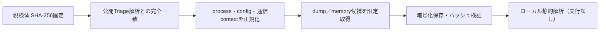

# Triage公開解析・後段取得証跡

## 完全ハッシュ一致

- [260803-xnztesec47](https://tria.ge/260803-xnztesec47): ファミリー候補 `needle_stealer, phorphiex`、評価score `10`

## プロセス・通信

- 観測process: `115609255.exe, 123909103.exe, 1301310133.exe, 1464520746.exe, 1552316094.exe, 1679738399.exe, 2924830074.exe, 3595031827.exe, 4091231307.exe, 4127019615.exe, file.exe, taskkill.exe`
- raw commandは保存せず、command SHA-256と処理patternだけをJSONへ保持しています。
- sandbox background trafficは`context_only`であり、C2へ自動昇格しません。

- `http://130.12.180.135:3000/api/v2`（sandbox config候補）
- `http://178.16.54.109/ot/`（sandbox config候補）
- `http://178.16.54.109/spm/`（sandbox config候補）
- `http://178.16.54.109/spmm/`（sandbox config候補）
- `http://178.16.54.109/spmmm/`（sandbox config候補）
- `http://178.16.54.109/us/`（sandbox config候補）

## 二段目成果物

- `d00a0806b145423c459a4df53471965dc36f82ec5d5a5d4d108e0a7a1ce09d7b` / `dumped_file` / 18432 bytes / 親と同一: `false` / 静的解析: `partial`
- `ed1d3f69fbbd5576c2ed8dba45ba22c4f6884eb311d4f6e389203846d512ec11` / `dumped_file` / 8744960 bytes / 親と同一: `false` / 静的解析: `partial`

## 判定境界

Triage由来のfamily、process、config、通信は外部sandbox証跡です。config extractorが返したendpointはC2候補として扱えますが、
静的設定復元またはprocess帰属とprotocol応答が揃うまでは確認済みC2とはしません。取得成果物と検体は実行していません。
