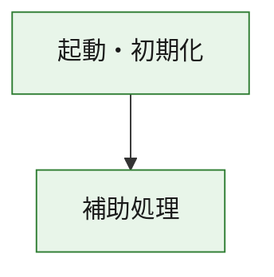
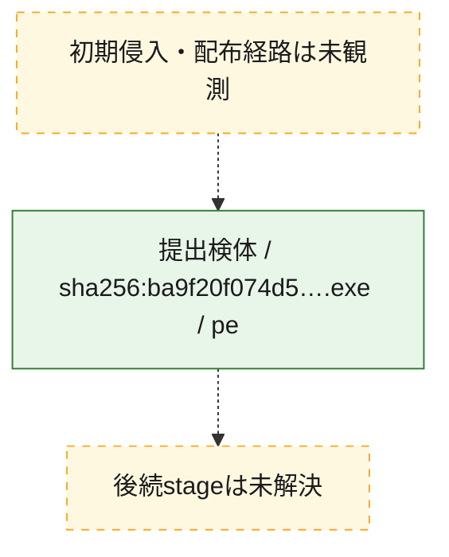
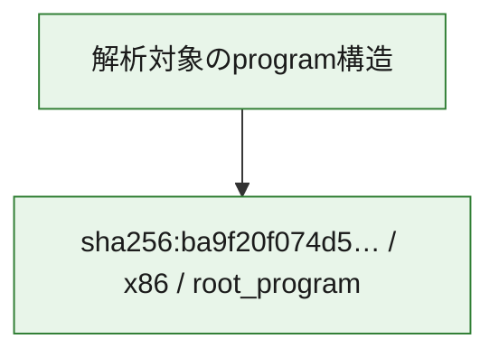

# 全体ロジック：ba9f20f074d5385224db8f0c114147a21cee9a8c327223230c97cf80b262f505

代表関数の静的証跡から、起動・初期化の処理群を確認しました。

## 読み方

- phaseの掲載順は解析上の整理順です。observed_call_edgesがない段階間の実行順を断定しません。
- 図の実線は静的に観測した関係、点線と黄色のノードは未観測・未解決の関係を示します。
- 図は静的な要約であり、動的実行を再現するものではありません。
- 詳細な関数解説とfingerprintは[STATIC-LOGIC.md](STATIC-LOGIC.md)を参照してください。

## 静的可視化

### 実行フロー

### 感染チェーン

### モジュール関係

## 処理段階

### 1. 起動・初期化

entry pointから初期化と後続処理への移行を確認します。
確度: `confirmed_static_function_evidence`

- `ba9f20f074d5385224db8f0c114147a21cee9a8c327223230c97cf80b262f505:ghidra:180001010` — 初期化と主要処理への分岐を行う入口関数です。 状態: `succeeded`、選定理由: `entry_point`, `meaningful_symbol_name`, `reviewed_call_centrality:22`, `role:entrypoint`, `small_program_complete_context`

### 2. 補助処理

主要処理を支える一般内部関数またはlibrary処理を確認します。
確度: `confirmed_static_function_evidence`

- `ba9f20f074d5385224db8f0c114147a21cee9a8c327223230c97cf80b262f505:ghidra:180001240` — 検体内部の一般処理を実装する関数です。 状態: `succeeded`、選定理由: `context_representative`, `reviewed_call_centrality:2`, `small_program_complete_context`
- `ba9f20f074d5385224db8f0c114147a21cee9a8c327223230c97cf80b262f505:ghidra:180001350` — 検体内部の一般処理を実装する関数です。 状態: `succeeded`、選定理由: `context_representative`, `reviewed_call_centrality:25`, `small_program_complete_context`
- `ba9f20f074d5385224db8f0c114147a21cee9a8c327223230c97cf80b262f505:ghidra:180003780` — 検体内部の一般処理を実装する関数です。 状態: `succeeded`、選定理由: `context_representative`, `reviewed_call_centrality:2`, `small_program_complete_context`
- `ba9f20f074d5385224db8f0c114147a21cee9a8c327223230c97cf80b262f505:ghidra:1800038e0` — 検体内部の一般処理を実装する関数です。 状態: `succeeded`、選定理由: `context_representative`, `reviewed_call_centrality:2`, `small_program_complete_context`

## 観測したcall関係

- `ba9f20f074d5385224db8f0c114147a21cee9a8c327223230c97cf80b262f505:ghidra:180001010` → `ba9f20f074d5385224db8f0c114147a21cee9a8c327223230c97cf80b262f505:ghidra:180001240` （`startup` → `support`）
- `ba9f20f074d5385224db8f0c114147a21cee9a8c327223230c97cf80b262f505:ghidra:180001010` → `ba9f20f074d5385224db8f0c114147a21cee9a8c327223230c97cf80b262f505:ghidra:180001350` （`startup` → `support`）
- `ba9f20f074d5385224db8f0c114147a21cee9a8c327223230c97cf80b262f505:ghidra:180001350` → `ba9f20f074d5385224db8f0c114147a21cee9a8c327223230c97cf80b262f505:ghidra:180001240` （`support` → `support`）
- `ba9f20f074d5385224db8f0c114147a21cee9a8c327223230c97cf80b262f505:ghidra:180001350` → `ba9f20f074d5385224db8f0c114147a21cee9a8c327223230c97cf80b262f505:ghidra:180003780` （`support` → `support`）
- `ba9f20f074d5385224db8f0c114147a21cee9a8c327223230c97cf80b262f505:ghidra:180001350` → `ba9f20f074d5385224db8f0c114147a21cee9a8c327223230c97cf80b262f505:ghidra:1800038e0` （`support` → `support`）
- `ba9f20f074d5385224db8f0c114147a21cee9a8c327223230c97cf80b262f505:ghidra:180003780` → `ba9f20f074d5385224db8f0c114147a21cee9a8c327223230c97cf80b262f505:ghidra:1800038e0` （`support` → `support`）
- `ghidra-function:0edf4e0b2b3fde05f83d4793` → `ghidra-external:2e5867b785a2cbe669594725` （`unclassified` → `unclassified`）
- `ghidra-function:0edf4e0b2b3fde05f83d4793` → `ghidra-external:3016ceac07aebcb0318bf419` （`unclassified` → `unclassified`）
- `ghidra-function:0edf4e0b2b3fde05f83d4793` → `ghidra-external:317871822baa5a1be352f7df` （`unclassified` → `unclassified`）
- `ghidra-function:0edf4e0b2b3fde05f83d4793` → `ghidra-external:4cd7e30256c666814239d69d` （`unclassified` → `unclassified`）
- `ghidra-function:0edf4e0b2b3fde05f83d4793` → `ghidra-external:54b07ef7f7f099f4e60cfe63` （`unclassified` → `unclassified`）
- `ghidra-function:0edf4e0b2b3fde05f83d4793` → `ghidra-external:5bb7b8a63b2ccca0ee242175` （`unclassified` → `unclassified`）
- `ghidra-function:0edf4e0b2b3fde05f83d4793` → `ghidra-external:5df7761dd093eb394a0ed015` （`unclassified` → `unclassified`）
- `ghidra-function:0edf4e0b2b3fde05f83d4793` → `ghidra-external:65e4673be363d223d1682ad7` （`unclassified` → `unclassified`）
- `ghidra-function:0edf4e0b2b3fde05f83d4793` → `ghidra-external:6f297f6656e68676d3f39894` （`unclassified` → `unclassified`）
- `ghidra-function:0edf4e0b2b3fde05f83d4793` → `ghidra-external:7bb0f4a9ff778c6f48b47595` （`unclassified` → `unclassified`）
- `ghidra-function:0edf4e0b2b3fde05f83d4793` → `ghidra-external:816df0c1c63f5783779aed10` （`unclassified` → `unclassified`）
- `ghidra-function:0edf4e0b2b3fde05f83d4793` → `ghidra-external:845c527c1ae831fdf27499ad` （`unclassified` → `unclassified`）
- `ghidra-function:0edf4e0b2b3fde05f83d4793` → `ghidra-external:863169c480a9673a8ada553a` （`unclassified` → `unclassified`）
- `ghidra-function:0edf4e0b2b3fde05f83d4793` → `ghidra-external:8ddf6805e502065da7b60ed4` （`unclassified` → `unclassified`）
- `ghidra-function:0edf4e0b2b3fde05f83d4793` → `ghidra-external:a31527a275d24a2ef7119ca6` （`unclassified` → `unclassified`）
- `ghidra-function:0edf4e0b2b3fde05f83d4793` → `ghidra-external:bcefc4fcf02bf70c7bb3a89b` （`unclassified` → `unclassified`）
- `ghidra-function:0edf4e0b2b3fde05f83d4793` → `ghidra-external:d060d2abbb3dcd2e312a9ee0` （`unclassified` → `unclassified`）
- `ghidra-function:0edf4e0b2b3fde05f83d4793` → `ghidra-external:d90e9ec2433823764d77ef1d` （`unclassified` → `unclassified`）
- `ghidra-function:0edf4e0b2b3fde05f83d4793` → `ghidra-external:e795d82742e954b9f3453797` （`unclassified` → `unclassified`）
- `ghidra-function:0edf4e0b2b3fde05f83d4793` → `ghidra-external:eb4b5935cf054b554101d3d1` （`unclassified` → `unclassified`）
- `ghidra-function:0edf4e0b2b3fde05f83d4793` → `ghidra-external:f133777f0c124ed956e78023` （`unclassified` → `unclassified`）
- `ghidra-function:0edf4e0b2b3fde05f83d4793` → `ghidra-function:37c37767f4f81094811adc41` （`unclassified` → `unclassified`）
- `ghidra-function:0edf4e0b2b3fde05f83d4793` → `ghidra-function:7757cb848ea40b1d0e17f6ae` （`unclassified` → `unclassified`）
- `ghidra-function:0edf4e0b2b3fde05f83d4793` → `ghidra-function:ded821efacd98363d303b72e` （`unclassified` → `unclassified`）
- `ghidra-function:7757cb848ea40b1d0e17f6ae` → `ghidra-function:37c37767f4f81094811adc41` （`unclassified` → `unclassified`）
- `ghidra-function:f10f79661b473db1872edc73` → `ghidra-function:0313dddbcea38ce625e75e46` （`unclassified` → `unclassified`）
- `ghidra-function:f10f79661b473db1872edc73` → `ghidra-function:0edf4e0b2b3fde05f83d4793` （`unclassified` → `unclassified`）
- `ghidra-function:f10f79661b473db1872edc73` → `ghidra-function:2b564ad53cf5b2298da57603` （`unclassified` → `unclassified`）
- `ghidra-function:f10f79661b473db1872edc73` → `ghidra-function:645fabd0d915a332ee49031d` （`unclassified` → `unclassified`）
- `ghidra-function:f10f79661b473db1872edc73` → `ghidra-function:7de9928f21b972fbe52b6cc2` （`unclassified` → `unclassified`）
- `ghidra-function:f10f79661b473db1872edc73` → `ghidra-function:8e339f4254ea9affa8f3c7bd` （`unclassified` → `unclassified`）
- `ghidra-function:f10f79661b473db1872edc73` → `ghidra-function:b879abccad58715107375d34` （`unclassified` → `unclassified`）
- `ghidra-function:f10f79661b473db1872edc73` → `ghidra-function:ba22b3c66fd3e810f03a25dc` （`unclassified` → `unclassified`）
- `ghidra-function:f10f79661b473db1872edc73` → `ghidra-function:d2d1c9b40ad349f29c20c4ea` （`unclassified` → `unclassified`）
- `ghidra-function:f10f79661b473db1872edc73` → `ghidra-function:ded821efacd98363d303b72e` （`unclassified` → `unclassified`）
- `ghidra-function:f10f79661b473db1872edc73` → `ghidra-function:ec8368eb1c074dca62d81619` （`unclassified` → `unclassified`）
- `ghidra-function:f10f79661b473db1872edc73` → `ghidra-function:f5dd7a302534567f14a45c2f` （`unclassified` → `unclassified`）

## 解析範囲と制約

- 選定外関数は全体inventoryへ残しますが、関数本体の個別解説対象にはしていません。
- indirect call、難読化、packer、VM、壊れたcontrol flowによりcall関係が欠落する場合があります。
- 文書は静的解析に基づき、検体実行や外部通信による動的確認は行っていません。
