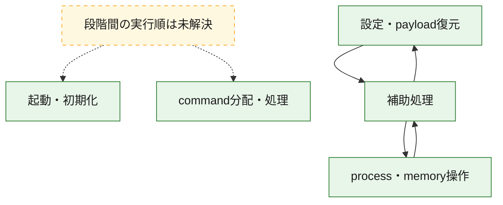
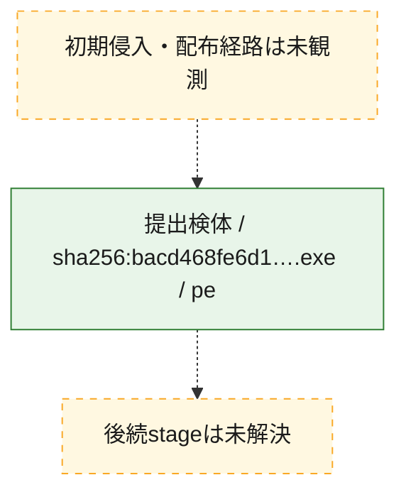
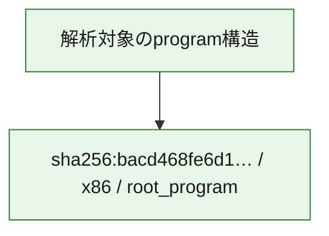

# 全体ロジック：bacd468fe6d1989a4bc4aa5e6b1b30fb1843e6a1d4ff1e63f52641d9e83cbd35

代表関数の静的証跡から、起動・初期化、設定・payload復元、process・memory操作、command分配・処理の処理群を確認しました。

## 読み方

- phaseの掲載順は解析上の整理順です。observed_call_edgesがない段階間の実行順を断定しません。
- 図の実線は静的に観測した関係、点線と黄色のノードは未観測・未解決の関係を示します。
- 図は静的な要約であり、動的実行を再現するものではありません。
- 詳細な関数解説とfingerprintは[STATIC-LOGIC.md](STATIC-LOGIC.md)を参照してください。

## 静的可視化

### 実行フロー

### 感染チェーン

### モジュール関係

## 処理段階

### 1. 起動・初期化

entry pointから初期化と後続処理への移行を確認します。
確度: `confirmed_static_function_evidence`

- `bacd468fe6d1989a4bc4aa5e6b1b30fb1843e6a1d4ff1e63f52641d9e83cbd35:ghidra:180002ce8` — 初期化と主要処理への分岐を行う入口関数です。 状態: `succeeded`、選定理由: `entry_point`, `meaningful_symbol_name`, `reviewed_call_centrality:5`, `role:entrypoint`

### 2. 設定・payload復元

設定、resource、payload、暗号化データの復元・変換を確認します。
確度: `confirmed_static_function_evidence`

- `bacd468fe6d1989a4bc4aa5e6b1b30fb1843e6a1d4ff1e63f52641d9e83cbd35:ghidra:1800012b0` — 暗号、hash、encoding、または復号処理に関係する関数です。 状態: `succeeded`、選定理由: `context_representative`, `reviewed_call_centrality:16`, `role:cryptographic_transform`

### 3. process・memory操作

process、thread、module、memory操作と実行移行を確認します。
確度: `confirmed_static_function_evidence`

- `bacd468fe6d1989a4bc4aa5e6b1b30fb1843e6a1d4ff1e63f52641d9e83cbd35:ghidra:180001988` — process、thread、module、またはmemory操作に関係する関数です。 状態: `succeeded`、選定理由: `context_representative`, `reviewed_call_centrality:16`, `role:process_or_memory_operation`
- `bacd468fe6d1989a4bc4aa5e6b1b30fb1843e6a1d4ff1e63f52641d9e83cbd35:ghidra:180001ca0` — process、thread、module、またはmemory操作に関係する関数です。 状態: `succeeded`、選定理由: `context_representative`, `reviewed_call_centrality:12`, `role:process_or_memory_operation`

### 4. command分配・処理

受信commandやtaskの解釈、分配、個別handlerへの移行を確認します。
確度: `confirmed_static_function_evidence_with_limits`

- `bacd468fe6d1989a4bc4aa5e6b1b30fb1843e6a1d4ff1e63f52641d9e83cbd35:ghidra:18000fb80` — commandの解釈、分配、または個別処理を担当する関数です。 状態: `limited_bad_instruction_or_flow`、選定理由: `meaningful_symbol_name`, `role:command_dispatch_or_handler`

### 5. 補助処理

主要処理を支える一般内部関数またはlibrary処理を確認します。
確度: `confirmed_static_function_evidence`

- `bacd468fe6d1989a4bc4aa5e6b1b30fb1843e6a1d4ff1e63f52641d9e83cbd35:ghidra:180001000` — 検体内部の一般処理を実装する関数です。 状態: `succeeded`、選定理由: `context_representative`, `reviewed_call_centrality:1`
- `bacd468fe6d1989a4bc4aa5e6b1b30fb1843e6a1d4ff1e63f52641d9e83cbd35:ghidra:180001048` — 検体内部の一般処理を実装する関数です。 状態: `succeeded`、選定理由: `context_representative`, `reviewed_call_centrality:2`
- `bacd468fe6d1989a4bc4aa5e6b1b30fb1843e6a1d4ff1e63f52641d9e83cbd35:ghidra:1800010c4` — 検体内部の一般処理を実装する関数です。 状態: `succeeded`、選定理由: `context_representative`, `reviewed_call_centrality:8`
- `bacd468fe6d1989a4bc4aa5e6b1b30fb1843e6a1d4ff1e63f52641d9e83cbd35:ghidra:1800010e4` — 検体内部の一般処理を実装する関数です。 状態: `succeeded`、選定理由: `context_representative`, `reviewed_call_centrality:1`
- `bacd468fe6d1989a4bc4aa5e6b1b30fb1843e6a1d4ff1e63f52641d9e83cbd35:ghidra:180001120` — 検体内部の一般処理を実装する関数です。 状態: `succeeded`、選定理由: `context_representative`, `reviewed_call_centrality:1`
- `bacd468fe6d1989a4bc4aa5e6b1b30fb1843e6a1d4ff1e63f52641d9e83cbd35:ghidra:18000115c` — 検体内部の一般処理を実装する関数です。 状態: `succeeded`、選定理由: `context_representative`, `reviewed_call_centrality:6`
- `bacd468fe6d1989a4bc4aa5e6b1b30fb1843e6a1d4ff1e63f52641d9e83cbd35:ghidra:180001170` — 検体内部の一般処理を実装する関数です。 状態: `succeeded`、選定理由: `context_representative`, `reviewed_call_centrality:6`
- `bacd468fe6d1989a4bc4aa5e6b1b30fb1843e6a1d4ff1e63f52641d9e83cbd35:ghidra:1800014ec` — 検体内部の一般処理を実装する関数です。 状態: `succeeded`、選定理由: `context_representative`, `reviewed_call_centrality:21`
- `bacd468fe6d1989a4bc4aa5e6b1b30fb1843e6a1d4ff1e63f52641d9e83cbd35:ghidra:18000190c` — 検体内部の一般処理を実装する関数です。 状態: `succeeded`、選定理由: `context_representative`, `reviewed_call_centrality:5`
- `bacd468fe6d1989a4bc4aa5e6b1b30fb1843e6a1d4ff1e63f52641d9e83cbd35:ghidra:180001dd0` — 検体内部の一般処理を実装する関数です。 状態: `succeeded`、選定理由: `context_representative`, `reviewed_call_centrality:5`
- `bacd468fe6d1989a4bc4aa5e6b1b30fb1843e6a1d4ff1e63f52641d9e83cbd35:ghidra:180001ee4` — 検体内部の一般処理を実装する関数です。 状態: `succeeded`、選定理由: `context_representative`, `reviewed_call_centrality:14`
- `bacd468fe6d1989a4bc4aa5e6b1b30fb1843e6a1d4ff1e63f52641d9e83cbd35:ghidra:180002044` — 検体内部の一般処理を実装する関数です。 状態: `succeeded`、選定理由: `context_representative`, `reviewed_call_centrality:7`
- `bacd468fe6d1989a4bc4aa5e6b1b30fb1843e6a1d4ff1e63f52641d9e83cbd35:ghidra:1800020cc` — 検体内部の一般処理を実装する関数です。 状態: `succeeded`、選定理由: `entry_point`, `meaningful_symbol_name`, `reviewed_call_centrality:17`
- `bacd468fe6d1989a4bc4aa5e6b1b30fb1843e6a1d4ff1e63f52641d9e83cbd35:ghidra:180002108` — 検体内部の一般処理を実装する関数です。 状態: `succeeded`、選定理由: `entry_point`, `meaningful_symbol_name`
- `bacd468fe6d1989a4bc4aa5e6b1b30fb1843e6a1d4ff1e63f52641d9e83cbd35:ghidra:180002114` — 検体内部の一般処理を実装する関数です。 状態: `succeeded`、選定理由: `context_representative`, `reviewed_call_centrality:4`
- `bacd468fe6d1989a4bc4aa5e6b1b30fb1843e6a1d4ff1e63f52641d9e83cbd35:ghidra:1800021e0` — 検体内部の一般処理を実装する関数です。 状態: `succeeded`、選定理由: `context_representative`, `reviewed_call_centrality:6`
- `bacd468fe6d1989a4bc4aa5e6b1b30fb1843e6a1d4ff1e63f52641d9e83cbd35:ghidra:180002254` — 検体内部の一般処理を実装する関数です。 状態: `succeeded`、選定理由: `context_representative`, `reviewed_call_centrality:6`
- `bacd468fe6d1989a4bc4aa5e6b1b30fb1843e6a1d4ff1e63f52641d9e83cbd35:ghidra:180002368` — 検体内部の一般処理を実装する関数です。 状態: `succeeded`、選定理由: `context_representative`, `reviewed_call_centrality:10`
- `bacd468fe6d1989a4bc4aa5e6b1b30fb1843e6a1d4ff1e63f52641d9e83cbd35:ghidra:180002488` — 検体内部の一般処理を実装する関数です。 状態: `succeeded`、選定理由: `context_representative`, `reviewed_call_centrality:9`
- `bacd468fe6d1989a4bc4aa5e6b1b30fb1843e6a1d4ff1e63f52641d9e83cbd35:ghidra:180002600` — 検体内部の一般処理を実装する関数です。 状態: `succeeded`、選定理由: `context_representative`, `reviewed_call_centrality:4`
- `bacd468fe6d1989a4bc4aa5e6b1b30fb1843e6a1d4ff1e63f52641d9e83cbd35:ghidra:180002620` — 検体内部の一般処理を実装する関数です。 状態: `succeeded`、選定理由: `context_representative`, `reviewed_call_centrality:10`
- `bacd468fe6d1989a4bc4aa5e6b1b30fb1843e6a1d4ff1e63f52641d9e83cbd35:ghidra:1800027b8` — 検体内部の一般処理を実装する関数です。 状態: `succeeded`、選定理由: `context_representative`, `reviewed_call_centrality:3`
- `bacd468fe6d1989a4bc4aa5e6b1b30fb1843e6a1d4ff1e63f52641d9e83cbd35:ghidra:1800027e0` — 検体内部の一般処理を実装する関数です。 状態: `succeeded`、選定理由: `context_representative`, `reviewed_call_centrality:1`
- `bacd468fe6d1989a4bc4aa5e6b1b30fb1843e6a1d4ff1e63f52641d9e83cbd35:ghidra:18000280c` — 検体内部の一般処理を実装する関数です。 状態: `succeeded`、選定理由: `context_representative`, `reviewed_call_centrality:9`
- `bacd468fe6d1989a4bc4aa5e6b1b30fb1843e6a1d4ff1e63f52641d9e83cbd35:ghidra:180002880` — 検体内部の一般処理を実装する関数です。 状態: `succeeded`、選定理由: `context_representative`, `reviewed_call_centrality:1`
- `bacd468fe6d1989a4bc4aa5e6b1b30fb1843e6a1d4ff1e63f52641d9e83cbd35:ghidra:1800028bc` — 検体内部の一般処理を実装する関数です。 状態: `succeeded`、選定理由: `context_representative`, `reviewed_call_centrality:1`
- `bacd468fe6d1989a4bc4aa5e6b1b30fb1843e6a1d4ff1e63f52641d9e83cbd35:ghidra:180002904` — 検体内部の一般処理を実装する関数です。 状態: `succeeded`、選定理由: `context_representative`, `reviewed_call_centrality:1`

## 観測したcall関係

- `bacd468fe6d1989a4bc4aa5e6b1b30fb1843e6a1d4ff1e63f52641d9e83cbd35:ghidra:180001170` → `bacd468fe6d1989a4bc4aa5e6b1b30fb1843e6a1d4ff1e63f52641d9e83cbd35:ghidra:180002368` （`support` → `support`）
- `bacd468fe6d1989a4bc4aa5e6b1b30fb1843e6a1d4ff1e63f52641d9e83cbd35:ghidra:180001170` → `bacd468fe6d1989a4bc4aa5e6b1b30fb1843e6a1d4ff1e63f52641d9e83cbd35:ghidra:180002600` （`support` → `support`）
- `bacd468fe6d1989a4bc4aa5e6b1b30fb1843e6a1d4ff1e63f52641d9e83cbd35:ghidra:1800012b0` → `bacd468fe6d1989a4bc4aa5e6b1b30fb1843e6a1d4ff1e63f52641d9e83cbd35:ghidra:180002368` （`configuration` → `support`）
- `bacd468fe6d1989a4bc4aa5e6b1b30fb1843e6a1d4ff1e63f52641d9e83cbd35:ghidra:1800012b0` → `bacd468fe6d1989a4bc4aa5e6b1b30fb1843e6a1d4ff1e63f52641d9e83cbd35:ghidra:180002600` （`configuration` → `support`）
- `bacd468fe6d1989a4bc4aa5e6b1b30fb1843e6a1d4ff1e63f52641d9e83cbd35:ghidra:1800014ec` → `bacd468fe6d1989a4bc4aa5e6b1b30fb1843e6a1d4ff1e63f52641d9e83cbd35:ghidra:1800010c4` （`support` → `support`）
- `bacd468fe6d1989a4bc4aa5e6b1b30fb1843e6a1d4ff1e63f52641d9e83cbd35:ghidra:1800014ec` → `bacd468fe6d1989a4bc4aa5e6b1b30fb1843e6a1d4ff1e63f52641d9e83cbd35:ghidra:18000115c` （`support` → `support`）
- `bacd468fe6d1989a4bc4aa5e6b1b30fb1843e6a1d4ff1e63f52641d9e83cbd35:ghidra:1800014ec` → `bacd468fe6d1989a4bc4aa5e6b1b30fb1843e6a1d4ff1e63f52641d9e83cbd35:ghidra:180002114` （`support` → `support`）
- `bacd468fe6d1989a4bc4aa5e6b1b30fb1843e6a1d4ff1e63f52641d9e83cbd35:ghidra:1800014ec` → `bacd468fe6d1989a4bc4aa5e6b1b30fb1843e6a1d4ff1e63f52641d9e83cbd35:ghidra:180002488` （`support` → `support`）
- `bacd468fe6d1989a4bc4aa5e6b1b30fb1843e6a1d4ff1e63f52641d9e83cbd35:ghidra:1800014ec` → `bacd468fe6d1989a4bc4aa5e6b1b30fb1843e6a1d4ff1e63f52641d9e83cbd35:ghidra:180002620` （`support` → `support`）
- `bacd468fe6d1989a4bc4aa5e6b1b30fb1843e6a1d4ff1e63f52641d9e83cbd35:ghidra:1800014ec` → `bacd468fe6d1989a4bc4aa5e6b1b30fb1843e6a1d4ff1e63f52641d9e83cbd35:ghidra:18000280c` （`support` → `support`）
- `bacd468fe6d1989a4bc4aa5e6b1b30fb1843e6a1d4ff1e63f52641d9e83cbd35:ghidra:180001988` → `bacd468fe6d1989a4bc4aa5e6b1b30fb1843e6a1d4ff1e63f52641d9e83cbd35:ghidra:18000115c` （`execution` → `support`）
- `bacd468fe6d1989a4bc4aa5e6b1b30fb1843e6a1d4ff1e63f52641d9e83cbd35:ghidra:180001988` → `bacd468fe6d1989a4bc4aa5e6b1b30fb1843e6a1d4ff1e63f52641d9e83cbd35:ghidra:180002114` （`execution` → `support`）
- `bacd468fe6d1989a4bc4aa5e6b1b30fb1843e6a1d4ff1e63f52641d9e83cbd35:ghidra:180001988` → `bacd468fe6d1989a4bc4aa5e6b1b30fb1843e6a1d4ff1e63f52641d9e83cbd35:ghidra:1800021e0` （`execution` → `support`）
- `bacd468fe6d1989a4bc4aa5e6b1b30fb1843e6a1d4ff1e63f52641d9e83cbd35:ghidra:180001988` → `bacd468fe6d1989a4bc4aa5e6b1b30fb1843e6a1d4ff1e63f52641d9e83cbd35:ghidra:180002254` （`execution` → `support`）
- `bacd468fe6d1989a4bc4aa5e6b1b30fb1843e6a1d4ff1e63f52641d9e83cbd35:ghidra:180001dd0` → `bacd468fe6d1989a4bc4aa5e6b1b30fb1843e6a1d4ff1e63f52641d9e83cbd35:ghidra:180001ca0` （`support` → `execution`）
- `bacd468fe6d1989a4bc4aa5e6b1b30fb1843e6a1d4ff1e63f52641d9e83cbd35:ghidra:180001ee4` → `bacd468fe6d1989a4bc4aa5e6b1b30fb1843e6a1d4ff1e63f52641d9e83cbd35:ghidra:180001170` （`support` → `support`）
- `bacd468fe6d1989a4bc4aa5e6b1b30fb1843e6a1d4ff1e63f52641d9e83cbd35:ghidra:180001ee4` → `bacd468fe6d1989a4bc4aa5e6b1b30fb1843e6a1d4ff1e63f52641d9e83cbd35:ghidra:1800012b0` （`support` → `configuration`）
- `bacd468fe6d1989a4bc4aa5e6b1b30fb1843e6a1d4ff1e63f52641d9e83cbd35:ghidra:180001ee4` → `bacd468fe6d1989a4bc4aa5e6b1b30fb1843e6a1d4ff1e63f52641d9e83cbd35:ghidra:1800014ec` （`support` → `support`）
- `bacd468fe6d1989a4bc4aa5e6b1b30fb1843e6a1d4ff1e63f52641d9e83cbd35:ghidra:180001ee4` → `bacd468fe6d1989a4bc4aa5e6b1b30fb1843e6a1d4ff1e63f52641d9e83cbd35:ghidra:18000190c` （`support` → `support`）
- `bacd468fe6d1989a4bc4aa5e6b1b30fb1843e6a1d4ff1e63f52641d9e83cbd35:ghidra:180001ee4` → `bacd468fe6d1989a4bc4aa5e6b1b30fb1843e6a1d4ff1e63f52641d9e83cbd35:ghidra:180001988` （`support` → `execution`）
- `bacd468fe6d1989a4bc4aa5e6b1b30fb1843e6a1d4ff1e63f52641d9e83cbd35:ghidra:180001ee4` → `bacd468fe6d1989a4bc4aa5e6b1b30fb1843e6a1d4ff1e63f52641d9e83cbd35:ghidra:180001dd0` （`support` → `support`）
- `bacd468fe6d1989a4bc4aa5e6b1b30fb1843e6a1d4ff1e63f52641d9e83cbd35:ghidra:180001ee4` → `bacd468fe6d1989a4bc4aa5e6b1b30fb1843e6a1d4ff1e63f52641d9e83cbd35:ghidra:1800021e0` （`support` → `support`）
- `bacd468fe6d1989a4bc4aa5e6b1b30fb1843e6a1d4ff1e63f52641d9e83cbd35:ghidra:1800020cc` → `bacd468fe6d1989a4bc4aa5e6b1b30fb1843e6a1d4ff1e63f52641d9e83cbd35:ghidra:180001170` （`support` → `support`）
- `bacd468fe6d1989a4bc4aa5e6b1b30fb1843e6a1d4ff1e63f52641d9e83cbd35:ghidra:1800020cc` → `bacd468fe6d1989a4bc4aa5e6b1b30fb1843e6a1d4ff1e63f52641d9e83cbd35:ghidra:1800012b0` （`support` → `configuration`）
- `bacd468fe6d1989a4bc4aa5e6b1b30fb1843e6a1d4ff1e63f52641d9e83cbd35:ghidra:1800020cc` → `bacd468fe6d1989a4bc4aa5e6b1b30fb1843e6a1d4ff1e63f52641d9e83cbd35:ghidra:1800014ec` （`support` → `support`）
- `bacd468fe6d1989a4bc4aa5e6b1b30fb1843e6a1d4ff1e63f52641d9e83cbd35:ghidra:1800020cc` → `bacd468fe6d1989a4bc4aa5e6b1b30fb1843e6a1d4ff1e63f52641d9e83cbd35:ghidra:18000190c` （`support` → `support`）
- `bacd468fe6d1989a4bc4aa5e6b1b30fb1843e6a1d4ff1e63f52641d9e83cbd35:ghidra:1800020cc` → `bacd468fe6d1989a4bc4aa5e6b1b30fb1843e6a1d4ff1e63f52641d9e83cbd35:ghidra:180001988` （`support` → `execution`）
- `bacd468fe6d1989a4bc4aa5e6b1b30fb1843e6a1d4ff1e63f52641d9e83cbd35:ghidra:1800020cc` → `bacd468fe6d1989a4bc4aa5e6b1b30fb1843e6a1d4ff1e63f52641d9e83cbd35:ghidra:180001dd0` （`support` → `support`）
- `bacd468fe6d1989a4bc4aa5e6b1b30fb1843e6a1d4ff1e63f52641d9e83cbd35:ghidra:1800020cc` → `bacd468fe6d1989a4bc4aa5e6b1b30fb1843e6a1d4ff1e63f52641d9e83cbd35:ghidra:180002044` （`support` → `support`）
- `bacd468fe6d1989a4bc4aa5e6b1b30fb1843e6a1d4ff1e63f52641d9e83cbd35:ghidra:1800020cc` → `bacd468fe6d1989a4bc4aa5e6b1b30fb1843e6a1d4ff1e63f52641d9e83cbd35:ghidra:1800021e0` （`support` → `support`）
- `bacd468fe6d1989a4bc4aa5e6b1b30fb1843e6a1d4ff1e63f52641d9e83cbd35:ghidra:180002114` → `bacd468fe6d1989a4bc4aa5e6b1b30fb1843e6a1d4ff1e63f52641d9e83cbd35:ghidra:180002620` （`support` → `support`）
- `bacd468fe6d1989a4bc4aa5e6b1b30fb1843e6a1d4ff1e63f52641d9e83cbd35:ghidra:180002254` → `bacd468fe6d1989a4bc4aa5e6b1b30fb1843e6a1d4ff1e63f52641d9e83cbd35:ghidra:1800010c4` （`support` → `support`）
- `bacd468fe6d1989a4bc4aa5e6b1b30fb1843e6a1d4ff1e63f52641d9e83cbd35:ghidra:180002254` → `bacd468fe6d1989a4bc4aa5e6b1b30fb1843e6a1d4ff1e63f52641d9e83cbd35:ghidra:18000280c` （`support` → `support`）
- `bacd468fe6d1989a4bc4aa5e6b1b30fb1843e6a1d4ff1e63f52641d9e83cbd35:ghidra:180002368` → `bacd468fe6d1989a4bc4aa5e6b1b30fb1843e6a1d4ff1e63f52641d9e83cbd35:ghidra:180002600` （`support` → `support`）
- `bacd468fe6d1989a4bc4aa5e6b1b30fb1843e6a1d4ff1e63f52641d9e83cbd35:ghidra:180002368` → `bacd468fe6d1989a4bc4aa5e6b1b30fb1843e6a1d4ff1e63f52641d9e83cbd35:ghidra:1800027b8` （`support` → `support`）
- `bacd468fe6d1989a4bc4aa5e6b1b30fb1843e6a1d4ff1e63f52641d9e83cbd35:ghidra:180002368` → `bacd468fe6d1989a4bc4aa5e6b1b30fb1843e6a1d4ff1e63f52641d9e83cbd35:ghidra:18000280c` （`support` → `support`）
- `bacd468fe6d1989a4bc4aa5e6b1b30fb1843e6a1d4ff1e63f52641d9e83cbd35:ghidra:180002488` → `bacd468fe6d1989a4bc4aa5e6b1b30fb1843e6a1d4ff1e63f52641d9e83cbd35:ghidra:1800010c4` （`support` → `support`）
- `bacd468fe6d1989a4bc4aa5e6b1b30fb1843e6a1d4ff1e63f52641d9e83cbd35:ghidra:180002488` → `bacd468fe6d1989a4bc4aa5e6b1b30fb1843e6a1d4ff1e63f52641d9e83cbd35:ghidra:18000115c` （`support` → `support`）
- `bacd468fe6d1989a4bc4aa5e6b1b30fb1843e6a1d4ff1e63f52641d9e83cbd35:ghidra:180002488` → `bacd468fe6d1989a4bc4aa5e6b1b30fb1843e6a1d4ff1e63f52641d9e83cbd35:ghidra:18000280c` （`support` → `support`）
- `bacd468fe6d1989a4bc4aa5e6b1b30fb1843e6a1d4ff1e63f52641d9e83cbd35:ghidra:180002620` → `bacd468fe6d1989a4bc4aa5e6b1b30fb1843e6a1d4ff1e63f52641d9e83cbd35:ghidra:1800010c4` （`support` → `support`）
- `bacd468fe6d1989a4bc4aa5e6b1b30fb1843e6a1d4ff1e63f52641d9e83cbd35:ghidra:180002620` → `bacd468fe6d1989a4bc4aa5e6b1b30fb1843e6a1d4ff1e63f52641d9e83cbd35:ghidra:18000115c` （`support` → `support`）
- `bacd468fe6d1989a4bc4aa5e6b1b30fb1843e6a1d4ff1e63f52641d9e83cbd35:ghidra:180002620` → `bacd468fe6d1989a4bc4aa5e6b1b30fb1843e6a1d4ff1e63f52641d9e83cbd35:ghidra:18000280c` （`support` → `support`）
- `bacd468fe6d1989a4bc4aa5e6b1b30fb1843e6a1d4ff1e63f52641d9e83cbd35:ghidra:18000280c` → `bacd468fe6d1989a4bc4aa5e6b1b30fb1843e6a1d4ff1e63f52641d9e83cbd35:ghidra:1800010c4` （`support` → `support`）
- `ghidra-function:014a75bac1cb2d9c50762bc4` → `ghidra-external:1cfb4b684029229076a2655b` （`unclassified` → `unclassified`）
- `ghidra-function:014a75bac1cb2d9c50762bc4` → `ghidra-external:9ae407817b50036632671b3c` （`unclassified` → `unclassified`）
- `ghidra-function:014a75bac1cb2d9c50762bc4` → `ghidra-function:0e3353b4a12d86c008f49914` （`unclassified` → `unclassified`）
- `ghidra-function:014a75bac1cb2d9c50762bc4` → `ghidra-function:26b907778f8b2f275b07964e` （`unclassified` → `unclassified`）
- `ghidra-function:014a75bac1cb2d9c50762bc4` → `ghidra-function:2e9bb186b2293cd264dc6205` （`unclassified` → `unclassified`）
- `ghidra-function:014a75bac1cb2d9c50762bc4` → `ghidra-function:2f609f53c52e429eb3330387` （`unclassified` → `unclassified`）
- `ghidra-function:014a75bac1cb2d9c50762bc4` → `ghidra-function:4fa8632596ee4cc3357740aa` （`unclassified` → `unclassified`）
- `ghidra-function:014a75bac1cb2d9c50762bc4` → `ghidra-function:52d04ed44b84f1d858e33cac` （`unclassified` → `unclassified`）
- `ghidra-function:014a75bac1cb2d9c50762bc4` → `ghidra-function:7a30c52db25d15b4e6e7f945` （`unclassified` → `unclassified`）
- `ghidra-function:014a75bac1cb2d9c50762bc4` → `ghidra-function:7e9279e71dbdb78b475d17e6` （`unclassified` → `unclassified`）
- `ghidra-function:014a75bac1cb2d9c50762bc4` → `ghidra-function:9ea942927b418072ed89827d` （`unclassified` → `unclassified`）
- `ghidra-function:014a75bac1cb2d9c50762bc4` → `ghidra-function:a9ae02890a0e1edf2745ef5f` （`unclassified` → `unclassified`）
- `ghidra-function:014a75bac1cb2d9c50762bc4` → `ghidra-function:c42cf00afa1431bda0b4c9d2` （`unclassified` → `unclassified`）
- `ghidra-function:014a75bac1cb2d9c50762bc4` → `ghidra-function:fd0ee19e4898b4af623eeaaa` （`unclassified` → `unclassified`）
- `ghidra-function:187085b315ea84008623ce92` → `ghidra-external:1cfb4b684029229076a2655b` （`unclassified` → `unclassified`）
- `ghidra-function:187085b315ea84008623ce92` → `ghidra-external:eeb5beb8e731ddb902e1a848` （`unclassified` → `unclassified`）
- `ghidra-function:187085b315ea84008623ce92` → `ghidra-function:e40d08abc82ac7313a4cdc16` （`unclassified` → `unclassified`）
- `ghidra-function:26b907778f8b2f275b07964e` → `ghidra-external:1cfb4b684029229076a2655b` （`unclassified` → `unclassified`）
- `ghidra-function:26b907778f8b2f275b07964e` → `ghidra-external:263d514f09a5ca71a2351ccb` （`unclassified` → `unclassified`）
- `ghidra-function:26b907778f8b2f275b07964e` → `ghidra-external:9ae407817b50036632671b3c` （`unclassified` → `unclassified`）
- `ghidra-function:26b907778f8b2f275b07964e` → `ghidra-external:d57e0a9c68fe1eb7edbe02cd` （`unclassified` → `unclassified`）
- `ghidra-function:26b907778f8b2f275b07964e` → `ghidra-function:0e3353b4a12d86c008f49914` （`unclassified` → `unclassified`）
- `ghidra-function:26b907778f8b2f275b07964e` → `ghidra-function:187085b315ea84008623ce92` （`unclassified` → `unclassified`）
- `ghidra-function:26b907778f8b2f275b07964e` → `ghidra-function:2c6d8409b5deca7fdad46936` （`unclassified` → `unclassified`）
- `ghidra-function:26b907778f8b2f275b07964e` → `ghidra-function:2d2ff901848369cb16116d02` （`unclassified` → `unclassified`）
- `ghidra-function:26b907778f8b2f275b07964e` → `ghidra-function:2f0cafede200b47c5955e594` （`unclassified` → `unclassified`）
- `ghidra-function:26b907778f8b2f275b07964e` → `ghidra-function:4e8ed5b7b61526c1f1301900` （`unclassified` → `unclassified`）
- `ghidra-function:26b907778f8b2f275b07964e` → `ghidra-function:4ea893db0c2aa6365355e68c` （`unclassified` → `unclassified`）
- `ghidra-function:26b907778f8b2f275b07964e` → `ghidra-function:66df33e2513ddc43c49c5c42` （`unclassified` → `unclassified`）
- `ghidra-function:26b907778f8b2f275b07964e` → `ghidra-function:8609d5af5c5e7fe65a24eb5d` （`unclassified` → `unclassified`）
- `ghidra-function:26b907778f8b2f275b07964e` → `ghidra-function:913032c7f3859b51878405ee` （`unclassified` → `unclassified`）
- `ghidra-function:26b907778f8b2f275b07964e` → `ghidra-function:92ee5f8afa45a7e6b5e93d2e` （`unclassified` → `unclassified`）
- `ghidra-function:26b907778f8b2f275b07964e` → `ghidra-function:99d5f1e1a5721dfeb316b7e0` （`unclassified` → `unclassified`）
- `ghidra-function:26b907778f8b2f275b07964e` → `ghidra-function:f9538bc00f602554bb67633c` （`unclassified` → `unclassified`）
- `ghidra-function:2d2ff901848369cb16116d02` → `ghidra-external:1cfb4b684029229076a2655b` （`unclassified` → `unclassified`）
- `ghidra-function:2d2ff901848369cb16116d02` → `ghidra-external:9ae407817b50036632671b3c` （`unclassified` → `unclassified`）
- `ghidra-function:2d2ff901848369cb16116d02` → `ghidra-function:0e3353b4a12d86c008f49914` （`unclassified` → `unclassified`）
- `ghidra-function:2d2ff901848369cb16116d02` → `ghidra-function:187085b315ea84008623ce92` （`unclassified` → `unclassified`）
- `ghidra-function:2d2ff901848369cb16116d02` → `ghidra-function:2c6d8409b5deca7fdad46936` （`unclassified` → `unclassified`）
- `ghidra-function:2d2ff901848369cb16116d02` → `ghidra-function:66df33e2513ddc43c49c5c42` （`unclassified` → `unclassified`）
- `ghidra-function:2d2ff901848369cb16116d02` → `ghidra-function:8609d5af5c5e7fe65a24eb5d` （`unclassified` → `unclassified`）
- `ghidra-function:2d2ff901848369cb16116d02` → `ghidra-function:99d5f1e1a5721dfeb316b7e0` （`unclassified` → `unclassified`）
- `ghidra-function:2e9bb186b2293cd264dc6205` → `ghidra-external:1cfb4b684029229076a2655b` （`unclassified` → `unclassified`）
- `ghidra-function:2e9bb186b2293cd264dc6205` → `ghidra-external:9ae407817b50036632671b3c` （`unclassified` → `unclassified`）
- `ghidra-function:2e9bb186b2293cd264dc6205` → `ghidra-function:0e3353b4a12d86c008f49914` （`unclassified` → `unclassified`）
- `ghidra-function:2f609f53c52e429eb3330387` → `ghidra-external:1cfb4b684029229076a2655b` （`unclassified` → `unclassified`）
- `ghidra-function:2f609f53c52e429eb3330387` → `ghidra-external:4111c3d429de52c371b0a207` （`unclassified` → `unclassified`）
- `ghidra-function:2f609f53c52e429eb3330387` → `ghidra-external:9ae407817b50036632671b3c` （`unclassified` → `unclassified`）
- `ghidra-function:2f609f53c52e429eb3330387` → `ghidra-external:bfd490150e70543cba7a0151` （`unclassified` → `unclassified`）
- `ghidra-function:2f609f53c52e429eb3330387` → `ghidra-function:0e3353b4a12d86c008f49914` （`unclassified` → `unclassified`）
- `ghidra-function:2f609f53c52e429eb3330387` → `ghidra-function:2e9bb186b2293cd264dc6205` （`unclassified` → `unclassified`）
- `ghidra-function:2f609f53c52e429eb3330387` → `ghidra-function:4e99f047c1001c8c8a4be7db` （`unclassified` → `unclassified`）
- `ghidra-function:2f609f53c52e429eb3330387` → `ghidra-function:8044c5f0e59dfcb32b1168c3` （`unclassified` → `unclassified`）
- `ghidra-function:2f609f53c52e429eb3330387` → `ghidra-function:8609d5af5c5e7fe65a24eb5d` （`unclassified` → `unclassified`）
- `ghidra-function:2f609f53c52e429eb3330387` → `ghidra-function:e39c26d928761e60918935c3` （`unclassified` → `unclassified`）
- `ghidra-function:2f609f53c52e429eb3330387` → `ghidra-function:f64f102d3fc5f8e0591516a3` （`unclassified` → `unclassified`）
- `ghidra-function:2f609f53c52e429eb3330387` → `ghidra-function:f9538bc00f602554bb67633c` （`unclassified` → `unclassified`）
- `ghidra-function:3c16246a4129e86fb44c3dad` → `ghidra-function:17dd930cd58cf3f2ba831f4b` （`unclassified` → `unclassified`）
- `ghidra-function:3c16246a4129e86fb44c3dad` → `ghidra-function:226c01f8d9345c24ace4be7b` （`unclassified` → `unclassified`）
- `ghidra-function:3c16246a4129e86fb44c3dad` → `ghidra-function:3f1557843ab03f509f925880` （`unclassified` → `unclassified`）
- `ghidra-function:3c16246a4129e86fb44c3dad` → `ghidra-function:8044c5f0e59dfcb32b1168c3` （`unclassified` → `unclassified`）
- `ghidra-function:3c16246a4129e86fb44c3dad` → `ghidra-function:dbb1916530764f034d3e37f7` （`unclassified` → `unclassified`）
- `ghidra-function:3c16246a4129e86fb44c3dad` → `ghidra-function:e39c26d928761e60918935c3` （`unclassified` → `unclassified`）
- `ghidra-function:4816c8b035d6c51769012b9a` → `ghidra-function:c04a334ba13dc717b7e82638` （`unclassified` → `unclassified`）
- `ghidra-function:4851ee25fb0dd0128bb82e26` → `ghidra-function:c04a334ba13dc717b7e82638` （`unclassified` → `unclassified`）
- `ghidra-function:4dc4ffe3764f59e4b6a3f409` → `ghidra-external:1cfb4b684029229076a2655b` （`unclassified` → `unclassified`）
- `ghidra-function:4dc4ffe3764f59e4b6a3f409` → `ghidra-external:90e53c8b14442bd01af4836b` （`unclassified` → `unclassified`）
- `ghidra-function:4dc4ffe3764f59e4b6a3f409` → `ghidra-external:9ae407817b50036632671b3c` （`unclassified` → `unclassified`）
- `ghidra-function:4dc4ffe3764f59e4b6a3f409` → `ghidra-function:0e3353b4a12d86c008f49914` （`unclassified` → `unclassified`）
- `ghidra-function:4dc4ffe3764f59e4b6a3f409` → `ghidra-function:66df33e2513ddc43c49c5c42` （`unclassified` → `unclassified`）
- `ghidra-function:4dc4ffe3764f59e4b6a3f409` → `ghidra-function:99d5f1e1a5721dfeb316b7e0` （`unclassified` → `unclassified`）
- `ghidra-function:4dc4ffe3764f59e4b6a3f409` → `ghidra-function:d9823e90df31196cbd96f0a5` （`unclassified` → `unclassified`）
- `ghidra-function:4dc4ffe3764f59e4b6a3f409` → `ghidra-function:da1c260b30a4c21fa396102b` （`unclassified` → `unclassified`）
- `ghidra-function:4e8ed5b7b61526c1f1301900` → `ghidra-external:1cfb4b684029229076a2655b` （`unclassified` → `unclassified`）
- `ghidra-function:4e8ed5b7b61526c1f1301900` → `ghidra-external:9ae407817b50036632671b3c` （`unclassified` → `unclassified`）
- `ghidra-function:4e8ed5b7b61526c1f1301900` → `ghidra-function:0e3353b4a12d86c008f49914` （`unclassified` → `unclassified`）
- `ghidra-function:4e8ed5b7b61526c1f1301900` → `ghidra-function:187085b315ea84008623ce92` （`unclassified` → `unclassified`）
- `ghidra-function:4e8ed5b7b61526c1f1301900` → `ghidra-function:2c6d8409b5deca7fdad46936` （`unclassified` → `unclassified`）
- `ghidra-function:4e8ed5b7b61526c1f1301900` → `ghidra-function:66df33e2513ddc43c49c5c42` （`unclassified` → `unclassified`）
- `ghidra-function:4e8ed5b7b61526c1f1301900` → `ghidra-function:8609d5af5c5e7fe65a24eb5d` （`unclassified` → `unclassified`）
- `ghidra-function:4e8ed5b7b61526c1f1301900` → `ghidra-function:99d5f1e1a5721dfeb316b7e0` （`unclassified` → `unclassified`）
- `ghidra-function:52d04ed44b84f1d858e33cac` → `ghidra-function:3c16246a4129e86fb44c3dad` （`unclassified` → `unclassified`）
- `ghidra-function:52d04ed44b84f1d858e33cac` → `ghidra-function:dbb1916530764f034d3e37f7` （`unclassified` → `unclassified`）
- `ghidra-function:5df2274539e819089972d379` → `ghidra-function:c04a334ba13dc717b7e82638` （`unclassified` → `unclassified`）
- `ghidra-function:66df33e2513ddc43c49c5c42` → `ghidra-external:1cfb4b684029229076a2655b` （`unclassified` → `unclassified`）
- `ghidra-function:66df33e2513ddc43c49c5c42` → `ghidra-function:0e3353b4a12d86c008f49914` （`unclassified` → `unclassified`）
- `ghidra-function:66df33e2513ddc43c49c5c42` → `ghidra-function:187085b315ea84008623ce92` （`unclassified` → `unclassified`）
- `ghidra-function:66df33e2513ddc43c49c5c42` → `ghidra-function:99d5f1e1a5721dfeb316b7e0` （`unclassified` → `unclassified`）
- `ghidra-function:7a30c52db25d15b4e6e7f945` → `ghidra-function:2722f51237a2ecfefe796313` （`unclassified` → `unclassified`）
- `ghidra-function:7a30c52db25d15b4e6e7f945` → `ghidra-function:77610f8a0ccdf590aa088e05` （`unclassified` → `unclassified`）
- `ghidra-function:7a30c52db25d15b4e6e7f945` → `ghidra-function:90e75848c5d18bc23532d818` （`unclassified` → `unclassified`）
- `ghidra-function:7e9279e71dbdb78b475d17e6` → `ghidra-function:195aa12193fd8db5ae6d4c59` （`unclassified` → `unclassified`）
- `ghidra-function:7e9279e71dbdb78b475d17e6` → `ghidra-function:7aa26295ee1872388bde10b3` （`unclassified` → `unclassified`）
- `ghidra-function:7e9279e71dbdb78b475d17e6` → `ghidra-function:7d5604bd50ba93531c314686` （`unclassified` → `unclassified`）
- `ghidra-function:8609d5af5c5e7fe65a24eb5d` → `ghidra-external:1cfb4b684029229076a2655b` （`unclassified` → `unclassified`）
- `ghidra-function:8609d5af5c5e7fe65a24eb5d` → `ghidra-function:6f6a4eeb1f2182a7b7de7bcc` （`unclassified` → `unclassified`）
- `ghidra-function:92f70c019f3a0cade37e789e` → `ghidra-external:3397d88cfb85fc09f53ef5ff` （`unclassified` → `unclassified`）
- `ghidra-function:92f70c019f3a0cade37e789e` → `ghidra-external:788c6c4b0d09a3e6a77e171d` （`unclassified` → `unclassified`）
- `ghidra-function:92f70c019f3a0cade37e789e` → `ghidra-function:965fd42d04cdf375fdbc6978` （`unclassified` → `unclassified`）
- `ghidra-function:92f70c019f3a0cade37e789e` → `ghidra-function:ca0a6596906d8c6082a68227` （`unclassified` → `unclassified`）
- `ghidra-function:92f70c019f3a0cade37e789e` → `ghidra-function:d0590d275219fe5a5d6fe3b2` （`unclassified` → `unclassified`）
- `ghidra-function:a9ae02890a0e1edf2745ef5f` → `ghidra-function:4ad3f237584bf752845e7d38` （`unclassified` → `unclassified`）
- `ghidra-function:a9ae02890a0e1edf2745ef5f` → `ghidra-function:4dc4ffe3764f59e4b6a3f409` （`unclassified` → `unclassified`）
- `ghidra-function:a9ae02890a0e1edf2745ef5f` → `ghidra-function:66d721b10ee6d9461f969e97` （`unclassified` → `unclassified`）
- `ghidra-function:a9ae02890a0e1edf2745ef5f` → `ghidra-function:7a43b5c21bf867689798fd67` （`unclassified` → `unclassified`）
- `ghidra-function:a9ae02890a0e1edf2745ef5f` → `ghidra-function:ae42c204c62ada789515d758` （`unclassified` → `unclassified`）
- `ghidra-function:a9ae02890a0e1edf2745ef5f` → `ghidra-function:da1c260b30a4c21fa396102b` （`unclassified` → `unclassified`）
- `ghidra-function:a9ae02890a0e1edf2745ef5f` → `ghidra-function:db8b8f02fba0618685288aaf` （`unclassified` → `unclassified`）
- `ghidra-function:a9ae02890a0e1edf2745ef5f` → `ghidra-function:e7755c501a354362fbfe03fc` （`unclassified` → `unclassified`）
- `ghidra-function:c42cf00afa1431bda0b4c9d2` → `ghidra-function:4dc4ffe3764f59e4b6a3f409` （`unclassified` → `unclassified`）
- `ghidra-function:c42cf00afa1431bda0b4c9d2` → `ghidra-function:da1c260b30a4c21fa396102b` （`unclassified` → `unclassified`）
- `ghidra-function:c42cf00afa1431bda0b4c9d2` → `ghidra-function:f11df9962cd2d1edd35f34e2` （`unclassified` → `unclassified`）
- `ghidra-function:d50f9ce015a63b0d66e4b31d` → `ghidra-external:1cfb4b684029229076a2655b` （`unclassified` → `unclassified`）
- `ghidra-function:d50f9ce015a63b0d66e4b31d` → `ghidra-external:9ae407817b50036632671b3c` （`unclassified` → `unclassified`）
- `ghidra-function:d50f9ce015a63b0d66e4b31d` → `ghidra-function:0e3353b4a12d86c008f49914` （`unclassified` → `unclassified`）
- `ghidra-function:d50f9ce015a63b0d66e4b31d` → `ghidra-function:26b907778f8b2f275b07964e` （`unclassified` → `unclassified`）
- `ghidra-function:d50f9ce015a63b0d66e4b31d` → `ghidra-function:2e9bb186b2293cd264dc6205` （`unclassified` → `unclassified`）
- `ghidra-function:d50f9ce015a63b0d66e4b31d` → `ghidra-function:2f609f53c52e429eb3330387` （`unclassified` → `unclassified`）
- `ghidra-function:d50f9ce015a63b0d66e4b31d` → `ghidra-function:4fa8632596ee4cc3357740aa` （`unclassified` → `unclassified`）
- `ghidra-function:d50f9ce015a63b0d66e4b31d` → `ghidra-function:52d04ed44b84f1d858e33cac` （`unclassified` → `unclassified`）
- `ghidra-function:d50f9ce015a63b0d66e4b31d` → `ghidra-function:7a30c52db25d15b4e6e7f945` （`unclassified` → `unclassified`）
- `ghidra-function:d50f9ce015a63b0d66e4b31d` → `ghidra-function:a9ae02890a0e1edf2745ef5f` （`unclassified` → `unclassified`）
- `ghidra-function:d50f9ce015a63b0d66e4b31d` → `ghidra-function:c42cf00afa1431bda0b4c9d2` （`unclassified` → `unclassified`）
- `ghidra-function:d50f9ce015a63b0d66e4b31d` → `ghidra-function:fd0ee19e4898b4af623eeaaa` （`unclassified` → `unclassified`）
- `ghidra-function:d9823e90df31196cbd96f0a5` → `ghidra-external:1cfb4b684029229076a2655b` （`unclassified` → `unclassified`）
- `ghidra-function:d9823e90df31196cbd96f0a5` → `ghidra-function:6f6a4eeb1f2182a7b7de7bcc` （`unclassified` → `unclassified`）
- `ghidra-function:da1c260b30a4c21fa396102b` → `ghidra-function:e39c26d928761e60918935c3` （`unclassified` → `unclassified`）
- `ghidra-function:ddcc2439f94cda833fb8bb16` → `ghidra-external:9ae407817b50036632671b3c` （`unclassified` → `unclassified`）
- `ghidra-function:ddcc2439f94cda833fb8bb16` → `ghidra-function:7ecc4c79de3048affd16d13b` （`unclassified` → `unclassified`）
- `ghidra-function:e7257b00019bdcaf2d3ef551` → `ghidra-function:c04a334ba13dc717b7e82638` （`unclassified` → `unclassified`）
- `ghidra-function:e8a81cdf33d9005e071da2ab` → `ghidra-function:c04a334ba13dc717b7e82638` （`unclassified` → `unclassified`）
- `ghidra-function:eae2c1c346d89d5899ee6596` → `ghidra-function:c04a334ba13dc717b7e82638` （`unclassified` → `unclassified`）
- `ghidra-function:f64f102d3fc5f8e0591516a3` → `ghidra-external:1cfb4b684029229076a2655b` （`unclassified` → `unclassified`）
- `ghidra-function:f64f102d3fc5f8e0591516a3` → `ghidra-function:187085b315ea84008623ce92` （`unclassified` → `unclassified`）
- `ghidra-function:f64f102d3fc5f8e0591516a3` → `ghidra-function:2c6d8409b5deca7fdad46936` （`unclassified` → `unclassified`）
- `ghidra-function:f64f102d3fc5f8e0591516a3` → `ghidra-function:66df33e2513ddc43c49c5c42` （`unclassified` → `unclassified`）
- `ghidra-function:f64f102d3fc5f8e0591516a3` → `ghidra-function:99d5f1e1a5721dfeb316b7e0` （`unclassified` → `unclassified`）
- `ghidra-function:f9538bc00f602554bb67633c` → `ghidra-function:2c6d8409b5deca7fdad46936` （`unclassified` → `unclassified`）
- `ghidra-function:f9538bc00f602554bb67633c` → `ghidra-function:2d2ff901848369cb16116d02` （`unclassified` → `unclassified`）
- `ghidra-function:fd07e1b8151dc861d7549456` → `ghidra-function:2c6d8409b5deca7fdad46936` （`unclassified` → `unclassified`）

## 解析範囲と制約

- 選定外関数は全体inventoryへ残しますが、関数本体の個別解説対象にはしていません。
- indirect call、難読化、packer、VM、壊れたcontrol flowによりcall関係が欠落する場合があります。
- 文書は静的解析に基づき、検体実行や外部通信による動的確認は行っていません。
