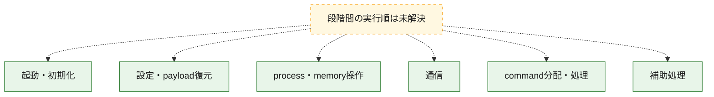
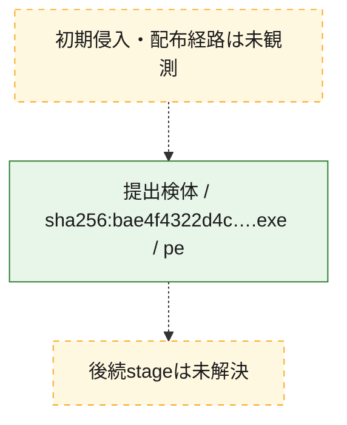
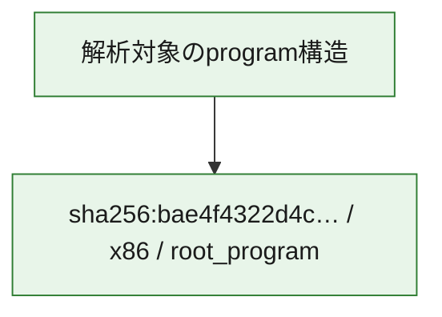

# 全体ロジック：bae4f4322d4c215be01990ad77275474f829ed7b3731703ed07946ab9d041413

代表関数の静的証跡から、起動・初期化、設定・payload復元、process・memory操作、通信、command分配・処理の処理群を確認しました。

## 読み方

- phaseの掲載順は解析上の整理順です。observed_call_edgesがない段階間の実行順を断定しません。
- 図の実線は静的に観測した関係、点線と黄色のノードは未観測・未解決の関係を示します。
- 図は静的な要約であり、動的実行を再現するものではありません。
- 詳細な関数解説とfingerprintは[STATIC-LOGIC.md](STATIC-LOGIC.md)を参照してください。

## 静的可視化

### 実行フロー

### 感染チェーン

### モジュール関係

## 処理段階

### 1. 起動・初期化

entry pointから初期化と後続処理への移行を確認します。
確度: `confirmed_static_function_evidence`

- `bae4f4322d4c215be01990ad77275474f829ed7b3731703ed07946ab9d041413:cil:0x06000092` — 初期化と主要処理への分岐を行う入口関数です。 状態: `succeeded`、選定理由: `entry_point`, `reviewed_call_centrality:2`
- `bae4f4322d4c215be01990ad77275474f829ed7b3731703ed07946ab9d041413:cil:0x06000099` — 初期化と主要処理への分岐を行う入口関数です。 状態: `succeeded`、選定理由: `entry_point`, `reviewed_call_centrality:8`

### 2. 設定・payload復元

設定、resource、payload、暗号化データの復元・変換を確認します。
確度: `confirmed_static_function_evidence`

- `bae4f4322d4c215be01990ad77275474f829ed7b3731703ed07946ab9d041413:cil:0x06000009` — 暗号、hash、encoding、または復号処理に関係する関数です。 状態: `succeeded`、選定理由: `reviewed_call_centrality:2`, `role:cryptographic_transform`
- `bae4f4322d4c215be01990ad77275474f829ed7b3731703ed07946ab9d041413:cil:0x0600005e` — 暗号、hash、encoding、または復号処理に関係する関数です。 状態: `succeeded`、選定理由: `reviewed_call_centrality:8`, `role:cryptographic_transform`

### 3. process・memory操作

process、thread、module、memory操作と実行移行を確認します。
確度: `confirmed_static_function_evidence`

- `bae4f4322d4c215be01990ad77275474f829ed7b3731703ed07946ab9d041413:cil:0x06000057` — process、thread、module、またはmemory操作に関係する関数です。 状態: `succeeded`、選定理由: `large_function:instructions=7866`, `reviewed_call_centrality:450`, `role:process_or_memory_operation`
- `bae4f4322d4c215be01990ad77275474f829ed7b3731703ed07946ab9d041413:cil:0x0600005a` — process、thread、module、またはmemory操作に関係する関数です。 状態: `succeeded`、選定理由: `large_function:instructions=2052`, `reviewed_call_centrality:124`, `role:process_or_memory_operation`

### 4. 通信

通信初期化、endpoint処理、送受信の役割を確認します。
確度: `confirmed_static_function_evidence`

- `bae4f4322d4c215be01990ad77275474f829ed7b3731703ed07946ab9d041413:cil:0x0600001e` — 通信初期化、送受信、またはendpoint処理に関係する関数です。 状態: `succeeded`、選定理由: `large_function:instructions=1007`, `reviewed_call_centrality:50`, `role:network_communication`
- `bae4f4322d4c215be01990ad77275474f829ed7b3731703ed07946ab9d041413:cil:0x0600002d` — 通信初期化、送受信、またはendpoint処理に関係する関数です。 状態: `succeeded`、選定理由: `reviewed_call_centrality:16`, `role:network_communication`
- `bae4f4322d4c215be01990ad77275474f829ed7b3731703ed07946ab9d041413:cil:0x0600002e` — 通信初期化、送受信、またはendpoint処理に関係する関数です。 状態: `succeeded`、選定理由: `reviewed_call_centrality:6`, `role:network_communication`
- `bae4f4322d4c215be01990ad77275474f829ed7b3731703ed07946ab9d041413:cil:0x0600003f` — 通信初期化、送受信、またはendpoint処理に関係する関数です。 状態: `succeeded`、選定理由: `large_function:instructions=155`, `reviewed_call_centrality:26`, `role:network_communication`
- `bae4f4322d4c215be01990ad77275474f829ed7b3731703ed07946ab9d041413:cil:0x0600005d` — 通信初期化、送受信、またはendpoint処理に関係する関数です。 状態: `succeeded`、選定理由: `large_function:instructions=435`, `reviewed_call_centrality:100`, `role:network_communication`
- `bae4f4322d4c215be01990ad77275474f829ed7b3731703ed07946ab9d041413:cil:0x06000062` — 通信初期化、送受信、またはendpoint処理に関係する関数です。 状態: `succeeded`、選定理由: `large_function:instructions=303`, `reviewed_call_centrality:56`, `role:network_communication`
- `bae4f4322d4c215be01990ad77275474f829ed7b3731703ed07946ab9d041413:cil:0x06000064` — 通信初期化、送受信、またはendpoint処理に関係する関数です。 状態: `succeeded`、選定理由: `reviewed_call_centrality:4`, `role:network_communication`
- `bae4f4322d4c215be01990ad77275474f829ed7b3731703ed07946ab9d041413:cil:0x06000065` — 通信初期化、送受信、またはendpoint処理に関係する関数です。 状態: `succeeded`、選定理由: `large_function:instructions=125`, `reviewed_call_centrality:28`, `role:network_communication`

### 5. command分配・処理

受信commandやtaskの解釈、分配、個別handlerへの移行を確認します。
確度: `confirmed_static_function_evidence`

- `bae4f4322d4c215be01990ad77275474f829ed7b3731703ed07946ab9d041413:cil:0x06000013` — commandの解釈、分配、または個別処理を担当する関数です。 状態: `succeeded`、選定理由: `large_function:instructions=615`, `reviewed_call_centrality:6`, `role:command_dispatch_or_handler`

### 6. 補助処理

主要処理を支える一般内部関数またはlibrary処理を確認します。
確度: `confirmed_static_function_evidence`

- `bae4f4322d4c215be01990ad77275474f829ed7b3731703ed07946ab9d041413:cil:0x06000015` — compiler生成処理または汎用library処理とみられる関数です。 状態: `succeeded`、選定理由: `large_function:instructions=254`, `reviewed_call_centrality:12`
- `bae4f4322d4c215be01990ad77275474f829ed7b3731703ed07946ab9d041413:cil:0x06000019` — 検体内部の一般処理を実装する関数です。 状態: `succeeded`、選定理由: `reviewed_call_centrality:20`
- `bae4f4322d4c215be01990ad77275474f829ed7b3731703ed07946ab9d041413:cil:0x06000028` — 検体内部の一般処理を実装する関数です。 状態: `succeeded`、選定理由: `large_function:instructions=255`, `reviewed_call_centrality:20`
- `bae4f4322d4c215be01990ad77275474f829ed7b3731703ed07946ab9d041413:cil:0x0600002a` — 検体内部の一般処理を実装する関数です。 状態: `succeeded`、選定理由: `large_function:instructions=424`, `reviewed_call_centrality:22`
- `bae4f4322d4c215be01990ad77275474f829ed7b3731703ed07946ab9d041413:cil:0x06000040` — 検体内部の一般処理を実装する関数です。 状態: `succeeded`、選定理由: `large_function:instructions=117`, `reviewed_call_centrality:22`
- `bae4f4322d4c215be01990ad77275474f829ed7b3731703ed07946ab9d041413:cil:0x06000041` — 検体内部の一般処理を実装する関数です。 状態: `succeeded`、選定理由: `reviewed_call_centrality:24`
- `bae4f4322d4c215be01990ad77275474f829ed7b3731703ed07946ab9d041413:cil:0x06000042` — 検体内部の一般処理を実装する関数です。 状態: `succeeded`、選定理由: `large_function:instructions=118`, `reviewed_call_centrality:20`
- `bae4f4322d4c215be01990ad77275474f829ed7b3731703ed07946ab9d041413:cil:0x0600004b` — 検体内部の一般処理を実装する関数です。 状態: `succeeded`、選定理由: `large_function:instructions=315`, `reviewed_call_centrality:22`
- `bae4f4322d4c215be01990ad77275474f829ed7b3731703ed07946ab9d041413:cil:0x0600004d` — 検体内部の一般処理を実装する関数です。 状態: `succeeded`、選定理由: `large_function:instructions=86`, `reviewed_call_centrality:18`
- `bae4f4322d4c215be01990ad77275474f829ed7b3731703ed07946ab9d041413:cil:0x06000059` — 検体内部の一般処理を実装する関数です。 状態: `succeeded`、選定理由: `large_function:instructions=427`, `reviewed_call_centrality:60`
- `bae4f4322d4c215be01990ad77275474f829ed7b3731703ed07946ab9d041413:cil:0x06000067` — 検体内部の一般処理を実装する関数です。 状態: `succeeded`、選定理由: `large_function:instructions=176`, `reviewed_call_centrality:32`
- `bae4f4322d4c215be01990ad77275474f829ed7b3731703ed07946ab9d041413:cil:0x06000075` — 検体内部の一般処理を実装する関数です。 状態: `succeeded`、選定理由: `large_function:instructions=226`, `reviewed_call_centrality:48`
- `bae4f4322d4c215be01990ad77275474f829ed7b3731703ed07946ab9d041413:cil:0x06000081` — 検体内部の一般処理を実装する関数です。 状態: `succeeded`、選定理由: `large_function:instructions=67`, `reviewed_call_centrality:20`
- `bae4f4322d4c215be01990ad77275474f829ed7b3731703ed07946ab9d041413:cil:0x0600008a` — 検体内部の一般処理を実装する関数です。 状態: `succeeded`、選定理由: `large_function:instructions=79`, `reviewed_call_centrality:22`
- `bae4f4322d4c215be01990ad77275474f829ed7b3731703ed07946ab9d041413:cil:0x0600008f` — 検体内部の一般処理を実装する関数です。 状態: `succeeded`、選定理由: `large_function:instructions=86`, `reviewed_call_centrality:28`
- `bae4f4322d4c215be01990ad77275474f829ed7b3731703ed07946ab9d041413:cil:0x0600009b` — 検体内部の一般処理を実装する関数です。 状態: `succeeded`、選定理由: `large_function:instructions=86`, `reviewed_call_centrality:20`
- `bae4f4322d4c215be01990ad77275474f829ed7b3731703ed07946ab9d041413:cil:0x0600009c` — 検体内部の一般処理を実装する関数です。 状態: `succeeded`、選定理由: `large_function:instructions=3552`, `reviewed_call_centrality:8`

## 観測したcall関係

- 代表関数間で直接解決できた呼出関係はありません。

## 解析範囲と制約

- 選定外関数は全体inventoryへ残しますが、関数本体の個別解説対象にはしていません。
- indirect call、難読化、packer、VM、壊れたcontrol flowによりcall関係が欠落する場合があります。
- 文書は静的解析に基づき、検体実行や外部通信による動的確認は行っていません。
