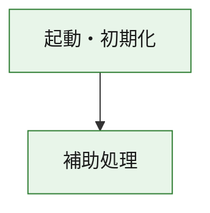
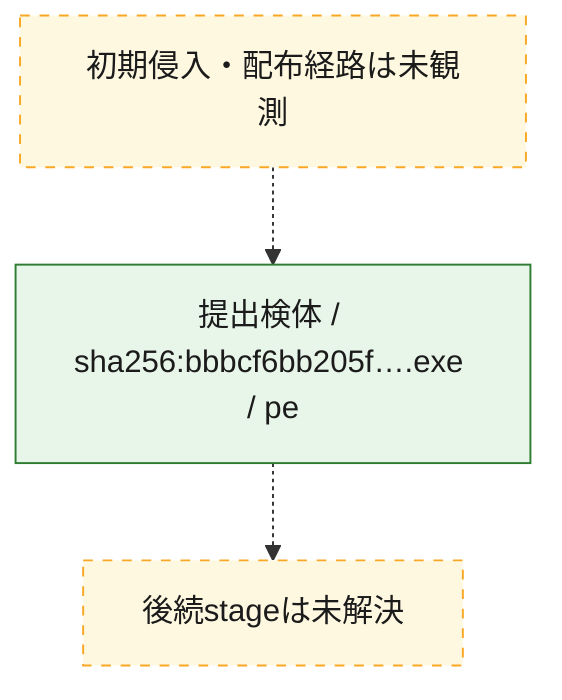
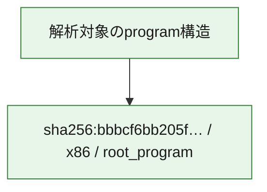

# 全体ロジック：bbbcf6bb205f7e65744c08ba2fd237f390f0fe07790b3bcea8eba13d4a577f67

代表関数の静的証跡から、起動・初期化の処理群を確認しました。

## 読み方

- phaseの掲載順は解析上の整理順です。observed_call_edgesがない段階間の実行順を断定しません。
- 図の実線は静的に観測した関係、点線と黄色のノードは未観測・未解決の関係を示します。
- 図は静的な要約であり、動的実行を再現するものではありません。
- 詳細な関数解説とfingerprintは[STATIC-LOGIC.md](STATIC-LOGIC.md)を参照してください。

## 静的可視化

### 実行フロー

### 感染チェーン

### モジュール関係

## 処理段階

### 1. 起動・初期化

entry pointから初期化と後続処理への移行を確認します。
確度: `confirmed_static_function_evidence`

- `bbbcf6bb205f7e65744c08ba2fd237f390f0fe07790b3bcea8eba13d4a577f67:ghidra:180001010` — 初期化と主要処理への分岐を行う入口関数です。 状態: `succeeded`、選定理由: `entry_point`, `meaningful_symbol_name`, `reviewed_call_centrality:22`, `role:entrypoint`, `small_program_complete_context`

### 2. 補助処理

主要処理を支える一般内部関数またはlibrary処理を確認します。
確度: `confirmed_static_function_evidence`

- `bbbcf6bb205f7e65744c08ba2fd237f390f0fe07790b3bcea8eba13d4a577f67:ghidra:180001240` — 検体内部の一般処理を実装する関数です。 状態: `succeeded`、選定理由: `context_representative`, `reviewed_call_centrality:2`, `small_program_complete_context`
- `bbbcf6bb205f7e65744c08ba2fd237f390f0fe07790b3bcea8eba13d4a577f67:ghidra:180001350` — 検体内部の一般処理を実装する関数です。 状態: `succeeded`、選定理由: `context_representative`, `reviewed_call_centrality:25`, `small_program_complete_context`
- `bbbcf6bb205f7e65744c08ba2fd237f390f0fe07790b3bcea8eba13d4a577f67:ghidra:180003780` — 検体内部の一般処理を実装する関数です。 状態: `succeeded`、選定理由: `context_representative`, `reviewed_call_centrality:2`, `small_program_complete_context`
- `bbbcf6bb205f7e65744c08ba2fd237f390f0fe07790b3bcea8eba13d4a577f67:ghidra:1800038e0` — 検体内部の一般処理を実装する関数です。 状態: `succeeded`、選定理由: `context_representative`, `reviewed_call_centrality:2`, `small_program_complete_context`

## 観測したcall関係

- `bbbcf6bb205f7e65744c08ba2fd237f390f0fe07790b3bcea8eba13d4a577f67:ghidra:180001010` → `bbbcf6bb205f7e65744c08ba2fd237f390f0fe07790b3bcea8eba13d4a577f67:ghidra:180001240` （`startup` → `support`）
- `bbbcf6bb205f7e65744c08ba2fd237f390f0fe07790b3bcea8eba13d4a577f67:ghidra:180001010` → `bbbcf6bb205f7e65744c08ba2fd237f390f0fe07790b3bcea8eba13d4a577f67:ghidra:180001350` （`startup` → `support`）
- `bbbcf6bb205f7e65744c08ba2fd237f390f0fe07790b3bcea8eba13d4a577f67:ghidra:180001350` → `bbbcf6bb205f7e65744c08ba2fd237f390f0fe07790b3bcea8eba13d4a577f67:ghidra:180001240` （`support` → `support`）
- `bbbcf6bb205f7e65744c08ba2fd237f390f0fe07790b3bcea8eba13d4a577f67:ghidra:180001350` → `bbbcf6bb205f7e65744c08ba2fd237f390f0fe07790b3bcea8eba13d4a577f67:ghidra:180003780` （`support` → `support`）
- `bbbcf6bb205f7e65744c08ba2fd237f390f0fe07790b3bcea8eba13d4a577f67:ghidra:180001350` → `bbbcf6bb205f7e65744c08ba2fd237f390f0fe07790b3bcea8eba13d4a577f67:ghidra:1800038e0` （`support` → `support`）
- `bbbcf6bb205f7e65744c08ba2fd237f390f0fe07790b3bcea8eba13d4a577f67:ghidra:180003780` → `bbbcf6bb205f7e65744c08ba2fd237f390f0fe07790b3bcea8eba13d4a577f67:ghidra:1800038e0` （`support` → `support`）
- `ghidra-function:672a5d5770a51bcabac985d0` → `ghidra-external:22ff261ed44533776d946164` （`unclassified` → `unclassified`）
- `ghidra-function:672a5d5770a51bcabac985d0` → `ghidra-external:2cdb401783ad5470a70ea49e` （`unclassified` → `unclassified`）
- `ghidra-function:672a5d5770a51bcabac985d0` → `ghidra-external:2e6fe67ee54b2634700006fc` （`unclassified` → `unclassified`）
- `ghidra-function:672a5d5770a51bcabac985d0` → `ghidra-external:34225615c4007bf42948189a` （`unclassified` → `unclassified`）
- `ghidra-function:672a5d5770a51bcabac985d0` → `ghidra-external:3aa3185cb8c00475ac8b183f` （`unclassified` → `unclassified`）
- `ghidra-function:672a5d5770a51bcabac985d0` → `ghidra-external:3af2cecb6b655ea4ff720ef5` （`unclassified` → `unclassified`）
- `ghidra-function:672a5d5770a51bcabac985d0` → `ghidra-external:42b05148d9b26618d6329c09` （`unclassified` → `unclassified`）
- `ghidra-function:672a5d5770a51bcabac985d0` → `ghidra-external:4d767e49577ca49daf1b425a` （`unclassified` → `unclassified`）
- `ghidra-function:672a5d5770a51bcabac985d0` → `ghidra-external:4ee6cf643a7c4ace94499a42` （`unclassified` → `unclassified`）
- `ghidra-function:672a5d5770a51bcabac985d0` → `ghidra-external:56c60bdd161d57dd749266c7` （`unclassified` → `unclassified`）
- `ghidra-function:672a5d5770a51bcabac985d0` → `ghidra-external:57f3a40e80b0d23efedb305c` （`unclassified` → `unclassified`）
- `ghidra-function:672a5d5770a51bcabac985d0` → `ghidra-external:71fdef201a74e01be5a11c4e` （`unclassified` → `unclassified`）
- `ghidra-function:672a5d5770a51bcabac985d0` → `ghidra-external:806f040dc06260515e942e77` （`unclassified` → `unclassified`）
- `ghidra-function:672a5d5770a51bcabac985d0` → `ghidra-external:a3835f3c2acfd79079a2692e` （`unclassified` → `unclassified`）
- `ghidra-function:672a5d5770a51bcabac985d0` → `ghidra-external:a4e960352d80ec068666da3d` （`unclassified` → `unclassified`）
- `ghidra-function:672a5d5770a51bcabac985d0` → `ghidra-external:ae13a0fc25a2f461ecf31340` （`unclassified` → `unclassified`）
- `ghidra-function:672a5d5770a51bcabac985d0` → `ghidra-external:b5b62f1be188da811b5ccdce` （`unclassified` → `unclassified`）
- `ghidra-function:672a5d5770a51bcabac985d0` → `ghidra-external:d09073888b6ef92aa734e6a3` （`unclassified` → `unclassified`）
- `ghidra-function:672a5d5770a51bcabac985d0` → `ghidra-external:edbef28b497a3c18eb44ef67` （`unclassified` → `unclassified`）
- `ghidra-function:672a5d5770a51bcabac985d0` → `ghidra-external:fc68bfaff77026a37b155dee` （`unclassified` → `unclassified`）
- `ghidra-function:672a5d5770a51bcabac985d0` → `ghidra-external:fde545e4ecf62f561def17f6` （`unclassified` → `unclassified`）
- `ghidra-function:672a5d5770a51bcabac985d0` → `ghidra-function:12b1d9774057ea32fea27d64` （`unclassified` → `unclassified`）
- `ghidra-function:672a5d5770a51bcabac985d0` → `ghidra-function:6c5418b5a024028cb355ad53` （`unclassified` → `unclassified`）
- `ghidra-function:672a5d5770a51bcabac985d0` → `ghidra-function:afd4e234888b1db652d66fa1` （`unclassified` → `unclassified`）
- `ghidra-function:afd4e234888b1db652d66fa1` → `ghidra-function:6c5418b5a024028cb355ad53` （`unclassified` → `unclassified`）
- `ghidra-function:cebe190d7c85178cbe6a6c82` → `ghidra-function:021565d12d203f3d82c32b0b` （`unclassified` → `unclassified`）
- `ghidra-function:cebe190d7c85178cbe6a6c82` → `ghidra-function:12b1d9774057ea32fea27d64` （`unclassified` → `unclassified`）
- `ghidra-function:cebe190d7c85178cbe6a6c82` → `ghidra-function:20abf55d76bc5e8a1da84134` （`unclassified` → `unclassified`）
- `ghidra-function:cebe190d7c85178cbe6a6c82` → `ghidra-function:3323685a7b0194e6e8c446b7` （`unclassified` → `unclassified`）
- `ghidra-function:cebe190d7c85178cbe6a6c82` → `ghidra-function:5c4c818233c841a23e264db3` （`unclassified` → `unclassified`）
- `ghidra-function:cebe190d7c85178cbe6a6c82` → `ghidra-function:6246d22c70d900727032959f` （`unclassified` → `unclassified`）
- `ghidra-function:cebe190d7c85178cbe6a6c82` → `ghidra-function:672a5d5770a51bcabac985d0` （`unclassified` → `unclassified`）
- `ghidra-function:cebe190d7c85178cbe6a6c82` → `ghidra-function:808b5da8365c44648400a35e` （`unclassified` → `unclassified`）
- `ghidra-function:cebe190d7c85178cbe6a6c82` → `ghidra-function:a6e9d2e0e3cfdb197a11adce` （`unclassified` → `unclassified`）
- `ghidra-function:cebe190d7c85178cbe6a6c82` → `ghidra-function:bd906a43bd7a4230914f1a1e` （`unclassified` → `unclassified`）
- `ghidra-function:cebe190d7c85178cbe6a6c82` → `ghidra-function:da02fa77121d9b4d8d82e3b9` （`unclassified` → `unclassified`）
- `ghidra-function:cebe190d7c85178cbe6a6c82` → `ghidra-function:e6500adfde550c1220a9d006` （`unclassified` → `unclassified`）

## 解析範囲と制約

- 選定外関数は全体inventoryへ残しますが、関数本体の個別解説対象にはしていません。
- indirect call、難読化、packer、VM、壊れたcontrol flowによりcall関係が欠落する場合があります。
- 文書は静的解析に基づき、検体実行や外部通信による動的確認は行っていません。
