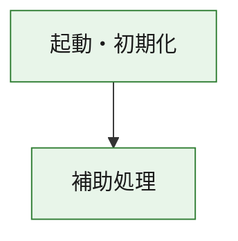
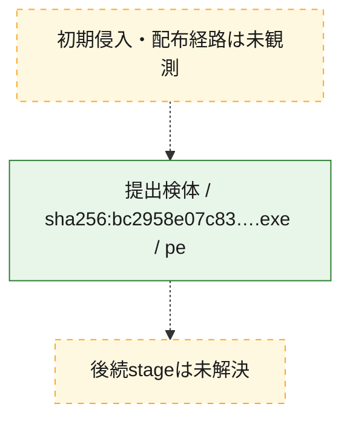
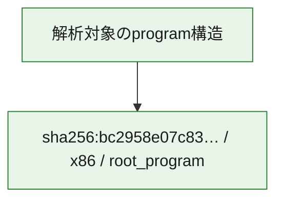

# 全体ロジック：bc2958e07c8320ad21ff972db6e495a4bb7f54e871a916c7812e1e333c9c7c4d

代表関数の静的証跡から、起動・初期化の処理群を確認しました。

## 読み方

- phaseの掲載順は解析上の整理順です。observed_call_edgesがない段階間の実行順を断定しません。
- 図の実線は静的に観測した関係、点線と黄色のノードは未観測・未解決の関係を示します。
- 図は静的な要約であり、動的実行を再現するものではありません。
- 詳細な関数解説とfingerprintは[STATIC-LOGIC.md](STATIC-LOGIC.md)を参照してください。

## 静的可視化

### 実行フロー

### 感染チェーン

### モジュール関係

## 処理段階

### 1. 起動・初期化

entry pointから初期化と後続処理への移行を確認します。
確度: `confirmed_static_function_evidence`

- `bc2958e07c8320ad21ff972db6e495a4bb7f54e871a916c7812e1e333c9c7c4d:ghidra:180001010` — 初期化と主要処理への分岐を行う入口関数です。 状態: `succeeded`、選定理由: `entry_point`, `meaningful_symbol_name`, `reviewed_call_centrality:22`, `role:entrypoint`, `small_program_complete_context`

### 2. 補助処理

主要処理を支える一般内部関数またはlibrary処理を確認します。
確度: `confirmed_static_function_evidence`

- `bc2958e07c8320ad21ff972db6e495a4bb7f54e871a916c7812e1e333c9c7c4d:ghidra:180001240` — 検体内部の一般処理を実装する関数です。 状態: `succeeded`、選定理由: `context_representative`, `reviewed_call_centrality:2`, `small_program_complete_context`
- `bc2958e07c8320ad21ff972db6e495a4bb7f54e871a916c7812e1e333c9c7c4d:ghidra:180001350` — 検体内部の一般処理を実装する関数です。 状態: `succeeded`、選定理由: `context_representative`, `reviewed_call_centrality:25`, `small_program_complete_context`
- `bc2958e07c8320ad21ff972db6e495a4bb7f54e871a916c7812e1e333c9c7c4d:ghidra:180003780` — 検体内部の一般処理を実装する関数です。 状態: `succeeded`、選定理由: `context_representative`, `reviewed_call_centrality:2`, `small_program_complete_context`
- `bc2958e07c8320ad21ff972db6e495a4bb7f54e871a916c7812e1e333c9c7c4d:ghidra:1800038e0` — 検体内部の一般処理を実装する関数です。 状態: `succeeded`、選定理由: `context_representative`, `reviewed_call_centrality:2`, `small_program_complete_context`

## 観測したcall関係

- `bc2958e07c8320ad21ff972db6e495a4bb7f54e871a916c7812e1e333c9c7c4d:ghidra:180001010` → `bc2958e07c8320ad21ff972db6e495a4bb7f54e871a916c7812e1e333c9c7c4d:ghidra:180001240` （`startup` → `support`）
- `bc2958e07c8320ad21ff972db6e495a4bb7f54e871a916c7812e1e333c9c7c4d:ghidra:180001010` → `bc2958e07c8320ad21ff972db6e495a4bb7f54e871a916c7812e1e333c9c7c4d:ghidra:180001350` （`startup` → `support`）
- `bc2958e07c8320ad21ff972db6e495a4bb7f54e871a916c7812e1e333c9c7c4d:ghidra:180001350` → `bc2958e07c8320ad21ff972db6e495a4bb7f54e871a916c7812e1e333c9c7c4d:ghidra:180001240` （`support` → `support`）
- `bc2958e07c8320ad21ff972db6e495a4bb7f54e871a916c7812e1e333c9c7c4d:ghidra:180001350` → `bc2958e07c8320ad21ff972db6e495a4bb7f54e871a916c7812e1e333c9c7c4d:ghidra:180003780` （`support` → `support`）
- `bc2958e07c8320ad21ff972db6e495a4bb7f54e871a916c7812e1e333c9c7c4d:ghidra:180001350` → `bc2958e07c8320ad21ff972db6e495a4bb7f54e871a916c7812e1e333c9c7c4d:ghidra:1800038e0` （`support` → `support`）
- `bc2958e07c8320ad21ff972db6e495a4bb7f54e871a916c7812e1e333c9c7c4d:ghidra:180003780` → `bc2958e07c8320ad21ff972db6e495a4bb7f54e871a916c7812e1e333c9c7c4d:ghidra:1800038e0` （`support` → `support`）
- `ghidra-function:405dd68aa48b9cab43bd33c1` → `ghidra-external:064db364d3c9201d30fdc757` （`unclassified` → `unclassified`）
- `ghidra-function:405dd68aa48b9cab43bd33c1` → `ghidra-external:06fe96b1c930ea57b01a08ee` （`unclassified` → `unclassified`）
- `ghidra-function:405dd68aa48b9cab43bd33c1` → `ghidra-external:0941554e59eb54a355508d7f` （`unclassified` → `unclassified`）
- `ghidra-function:405dd68aa48b9cab43bd33c1` → `ghidra-external:28fd0d034ee2a344710dd805` （`unclassified` → `unclassified`）
- `ghidra-function:405dd68aa48b9cab43bd33c1` → `ghidra-external:2ff14690bbc5ed9ca4674093` （`unclassified` → `unclassified`）
- `ghidra-function:405dd68aa48b9cab43bd33c1` → `ghidra-external:404f55113ce1c927e16a61a4` （`unclassified` → `unclassified`）
- `ghidra-function:405dd68aa48b9cab43bd33c1` → `ghidra-external:48d6d6bb0365b7e40aab23ba` （`unclassified` → `unclassified`）
- `ghidra-function:405dd68aa48b9cab43bd33c1` → `ghidra-external:5743a90cdaea445994b0f12f` （`unclassified` → `unclassified`）
- `ghidra-function:405dd68aa48b9cab43bd33c1` → `ghidra-external:6704a17b4fe4831593b8d65d` （`unclassified` → `unclassified`）
- `ghidra-function:405dd68aa48b9cab43bd33c1` → `ghidra-external:7d357c8deab42da5f375e4ab` （`unclassified` → `unclassified`）
- `ghidra-function:405dd68aa48b9cab43bd33c1` → `ghidra-external:84b91521cd55f61c014c43ec` （`unclassified` → `unclassified`）
- `ghidra-function:405dd68aa48b9cab43bd33c1` → `ghidra-external:911b3226d06552bc404f6757` （`unclassified` → `unclassified`）
- `ghidra-function:405dd68aa48b9cab43bd33c1` → `ghidra-external:9791f7bf58b8bd09c92c3c07` （`unclassified` → `unclassified`）
- `ghidra-function:405dd68aa48b9cab43bd33c1` → `ghidra-external:9fdc0a456de627a033f74675` （`unclassified` → `unclassified`）
- `ghidra-function:405dd68aa48b9cab43bd33c1` → `ghidra-external:ae17b92d787c7dcd2d6b7ac4` （`unclassified` → `unclassified`）
- `ghidra-function:405dd68aa48b9cab43bd33c1` → `ghidra-external:b5941ba11217929b925b7f2e` （`unclassified` → `unclassified`）
- `ghidra-function:405dd68aa48b9cab43bd33c1` → `ghidra-external:cff0fa41b209736f873a9ed8` （`unclassified` → `unclassified`）
- `ghidra-function:405dd68aa48b9cab43bd33c1` → `ghidra-external:fac3042412c04850d36d2121` （`unclassified` → `unclassified`）
- `ghidra-function:405dd68aa48b9cab43bd33c1` → `ghidra-external:fc5025d38737628c65b39661` （`unclassified` → `unclassified`）
- `ghidra-function:405dd68aa48b9cab43bd33c1` → `ghidra-external:ff16f9b1aa86a956b4e7facd` （`unclassified` → `unclassified`）
- `ghidra-function:405dd68aa48b9cab43bd33c1` → `ghidra-external:ff6c2151a0bc8b25517ddc81` （`unclassified` → `unclassified`）
- `ghidra-function:405dd68aa48b9cab43bd33c1` → `ghidra-function:1354c68d6ef26b5e9030e48a` （`unclassified` → `unclassified`）
- `ghidra-function:405dd68aa48b9cab43bd33c1` → `ghidra-function:73e5d75d7560b6843e6e1021` （`unclassified` → `unclassified`）
- `ghidra-function:405dd68aa48b9cab43bd33c1` → `ghidra-function:c3767f4be5a94d55daad269e` （`unclassified` → `unclassified`）
- `ghidra-function:c3767f4be5a94d55daad269e` → `ghidra-function:1354c68d6ef26b5e9030e48a` （`unclassified` → `unclassified`）
- `ghidra-function:d5c5ca3f927f678d331146ae` → `ghidra-function:299a5e23ac9733477b440bd5` （`unclassified` → `unclassified`）
- `ghidra-function:d5c5ca3f927f678d331146ae` → `ghidra-function:405dd68aa48b9cab43bd33c1` （`unclassified` → `unclassified`）
- `ghidra-function:d5c5ca3f927f678d331146ae` → `ghidra-function:59f15c76f121365dcdde32d7` （`unclassified` → `unclassified`）
- `ghidra-function:d5c5ca3f927f678d331146ae` → `ghidra-function:73e5d75d7560b6843e6e1021` （`unclassified` → `unclassified`）
- `ghidra-function:d5c5ca3f927f678d331146ae` → `ghidra-function:85698049fb78f5c0a03f3d4e` （`unclassified` → `unclassified`）
- `ghidra-function:d5c5ca3f927f678d331146ae` → `ghidra-function:8c25bde76d6c0867eb550985` （`unclassified` → `unclassified`）
- `ghidra-function:d5c5ca3f927f678d331146ae` → `ghidra-function:929c71c93af0a749c1527d5e` （`unclassified` → `unclassified`）
- `ghidra-function:d5c5ca3f927f678d331146ae` → `ghidra-function:9c57bcfb111b6b0688e4c7d7` （`unclassified` → `unclassified`）
- `ghidra-function:d5c5ca3f927f678d331146ae` → `ghidra-function:aa2f429410159253f98e2bf5` （`unclassified` → `unclassified`）
- `ghidra-function:d5c5ca3f927f678d331146ae` → `ghidra-function:c6355c7df8b6d27000524e24` （`unclassified` → `unclassified`）
- `ghidra-function:d5c5ca3f927f678d331146ae` → `ghidra-function:d266cc86cbb4386b98a2cb2f` （`unclassified` → `unclassified`）
- `ghidra-function:d5c5ca3f927f678d331146ae` → `ghidra-function:f8252dd048609561b15dae3b` （`unclassified` → `unclassified`）

## 解析範囲と制約

- 選定外関数は全体inventoryへ残しますが、関数本体の個別解説対象にはしていません。
- indirect call、難読化、packer、VM、壊れたcontrol flowによりcall関係が欠落する場合があります。
- 文書は静的解析に基づき、検体実行や外部通信による動的確認は行っていません。
