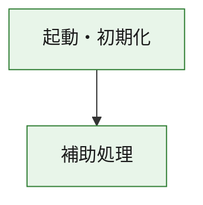
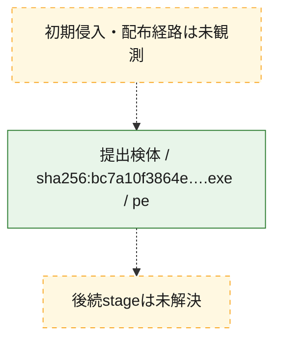
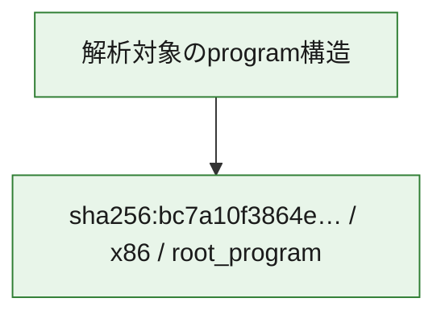

# 全体ロジック：bc7a10f3864e4412170ac61b07a26c13b3428e4b43dbab79a63d8d1b54f14981

代表関数の静的証跡から、起動・初期化の処理群を確認しました。

## 読み方

- phaseの掲載順は解析上の整理順です。observed_call_edgesがない段階間の実行順を断定しません。
- 図の実線は静的に観測した関係、点線と黄色のノードは未観測・未解決の関係を示します。
- 図は静的な要約であり、動的実行を再現するものではありません。
- 詳細な関数解説とfingerprintは[STATIC-LOGIC.md](STATIC-LOGIC.md)を参照してください。

## 静的可視化

### 実行フロー

### 感染チェーン

### モジュール関係

## 処理段階

### 1. 起動・初期化

entry pointから初期化と後続処理への移行を確認します。
確度: `confirmed_static_function_evidence`

- `bc7a10f3864e4412170ac61b07a26c13b3428e4b43dbab79a63d8d1b54f14981:ghidra:180001010` — 初期化と主要処理への分岐を行う入口関数です。 状態: `succeeded`、選定理由: `entry_point`, `meaningful_symbol_name`, `reviewed_call_centrality:22`, `role:entrypoint`, `small_program_complete_context`

### 2. 補助処理

主要処理を支える一般内部関数またはlibrary処理を確認します。
確度: `confirmed_static_function_evidence`

- `bc7a10f3864e4412170ac61b07a26c13b3428e4b43dbab79a63d8d1b54f14981:ghidra:180001240` — 検体内部の一般処理を実装する関数です。 状態: `succeeded`、選定理由: `context_representative`, `reviewed_call_centrality:2`, `small_program_complete_context`
- `bc7a10f3864e4412170ac61b07a26c13b3428e4b43dbab79a63d8d1b54f14981:ghidra:180001350` — 検体内部の一般処理を実装する関数です。 状態: `succeeded`、選定理由: `context_representative`, `reviewed_call_centrality:25`, `small_program_complete_context`
- `bc7a10f3864e4412170ac61b07a26c13b3428e4b43dbab79a63d8d1b54f14981:ghidra:180003780` — 検体内部の一般処理を実装する関数です。 状態: `succeeded`、選定理由: `context_representative`, `reviewed_call_centrality:2`, `small_program_complete_context`
- `bc7a10f3864e4412170ac61b07a26c13b3428e4b43dbab79a63d8d1b54f14981:ghidra:1800038e0` — 検体内部の一般処理を実装する関数です。 状態: `succeeded`、選定理由: `context_representative`, `reviewed_call_centrality:2`, `small_program_complete_context`

## 観測したcall関係

- `bc7a10f3864e4412170ac61b07a26c13b3428e4b43dbab79a63d8d1b54f14981:ghidra:180001010` → `bc7a10f3864e4412170ac61b07a26c13b3428e4b43dbab79a63d8d1b54f14981:ghidra:180001240` （`startup` → `support`）
- `bc7a10f3864e4412170ac61b07a26c13b3428e4b43dbab79a63d8d1b54f14981:ghidra:180001010` → `bc7a10f3864e4412170ac61b07a26c13b3428e4b43dbab79a63d8d1b54f14981:ghidra:180001350` （`startup` → `support`）
- `bc7a10f3864e4412170ac61b07a26c13b3428e4b43dbab79a63d8d1b54f14981:ghidra:180001350` → `bc7a10f3864e4412170ac61b07a26c13b3428e4b43dbab79a63d8d1b54f14981:ghidra:180001240` （`support` → `support`）
- `bc7a10f3864e4412170ac61b07a26c13b3428e4b43dbab79a63d8d1b54f14981:ghidra:180001350` → `bc7a10f3864e4412170ac61b07a26c13b3428e4b43dbab79a63d8d1b54f14981:ghidra:180003780` （`support` → `support`）
- `bc7a10f3864e4412170ac61b07a26c13b3428e4b43dbab79a63d8d1b54f14981:ghidra:180001350` → `bc7a10f3864e4412170ac61b07a26c13b3428e4b43dbab79a63d8d1b54f14981:ghidra:1800038e0` （`support` → `support`）
- `bc7a10f3864e4412170ac61b07a26c13b3428e4b43dbab79a63d8d1b54f14981:ghidra:180003780` → `bc7a10f3864e4412170ac61b07a26c13b3428e4b43dbab79a63d8d1b54f14981:ghidra:1800038e0` （`support` → `support`）
- `ghidra-function:097cb84e3b4fb70536176f11` → `ghidra-external:086f1306f7bf5e832443a5ed` （`unclassified` → `unclassified`）
- `ghidra-function:097cb84e3b4fb70536176f11` → `ghidra-external:1575f215dfc4a1c469574ec6` （`unclassified` → `unclassified`）
- `ghidra-function:097cb84e3b4fb70536176f11` → `ghidra-external:193515d15c55cc6a48aa4fbb` （`unclassified` → `unclassified`）
- `ghidra-function:097cb84e3b4fb70536176f11` → `ghidra-external:2a38f92b5e16606225435dc6` （`unclassified` → `unclassified`）
- `ghidra-function:097cb84e3b4fb70536176f11` → `ghidra-external:3520e206d0f98e2211e11d21` （`unclassified` → `unclassified`）
- `ghidra-function:097cb84e3b4fb70536176f11` → `ghidra-external:3899dfc7244340befed6cfce` （`unclassified` → `unclassified`）
- `ghidra-function:097cb84e3b4fb70536176f11` → `ghidra-external:423b229567c4bff97faf1217` （`unclassified` → `unclassified`）
- `ghidra-function:097cb84e3b4fb70536176f11` → `ghidra-external:493cd0fab75a5c40695d5c6e` （`unclassified` → `unclassified`）
- `ghidra-function:097cb84e3b4fb70536176f11` → `ghidra-external:61a13446df069365ff0a5ece` （`unclassified` → `unclassified`）
- `ghidra-function:097cb84e3b4fb70536176f11` → `ghidra-external:72002700518b174cf206f7a3` （`unclassified` → `unclassified`）
- `ghidra-function:097cb84e3b4fb70536176f11` → `ghidra-external:8de74e36b7ccb357ad3e4710` （`unclassified` → `unclassified`）
- `ghidra-function:097cb84e3b4fb70536176f11` → `ghidra-external:96e9af7cb6920dfc7cc1d923` （`unclassified` → `unclassified`）
- `ghidra-function:097cb84e3b4fb70536176f11` → `ghidra-external:9801ef47c6327c4cd515ea84` （`unclassified` → `unclassified`）
- `ghidra-function:097cb84e3b4fb70536176f11` → `ghidra-external:9d3224a3886e2be05b5c0803` （`unclassified` → `unclassified`）
- `ghidra-function:097cb84e3b4fb70536176f11` → `ghidra-external:cac7e51b2dacd25bdeff2426` （`unclassified` → `unclassified`）
- `ghidra-function:097cb84e3b4fb70536176f11` → `ghidra-external:cc0f333e864801fc1e016475` （`unclassified` → `unclassified`）
- `ghidra-function:097cb84e3b4fb70536176f11` → `ghidra-external:dc8065819d861f976542e0ef` （`unclassified` → `unclassified`）
- `ghidra-function:097cb84e3b4fb70536176f11` → `ghidra-external:dfb036c969b723ffe6ea368e` （`unclassified` → `unclassified`）
- `ghidra-function:097cb84e3b4fb70536176f11` → `ghidra-external:f4fd2171d169d0e754f6b7c6` （`unclassified` → `unclassified`）
- `ghidra-function:097cb84e3b4fb70536176f11` → `ghidra-external:f89528707529ce359e1f65ad` （`unclassified` → `unclassified`）
- `ghidra-function:097cb84e3b4fb70536176f11` → `ghidra-external:ff31a3e15673fe6e8c04d7af` （`unclassified` → `unclassified`）
- `ghidra-function:097cb84e3b4fb70536176f11` → `ghidra-function:31492b9fe358e94dcda6dbc8` （`unclassified` → `unclassified`）
- `ghidra-function:097cb84e3b4fb70536176f11` → `ghidra-function:46f772576a5909f14ecb2b56` （`unclassified` → `unclassified`）
- `ghidra-function:097cb84e3b4fb70536176f11` → `ghidra-function:b2fd506468738652b035f1e1` （`unclassified` → `unclassified`）
- `ghidra-function:36f6be4c3a83d79763c7c0b6` → `ghidra-function:097cb84e3b4fb70536176f11` （`unclassified` → `unclassified`）
- `ghidra-function:36f6be4c3a83d79763c7c0b6` → `ghidra-function:31492b9fe358e94dcda6dbc8` （`unclassified` → `unclassified`）
- `ghidra-function:36f6be4c3a83d79763c7c0b6` → `ghidra-function:4a8802f47ee8c57799ea0d14` （`unclassified` → `unclassified`）
- `ghidra-function:36f6be4c3a83d79763c7c0b6` → `ghidra-function:838635baf64099cb3154df08` （`unclassified` → `unclassified`）
- `ghidra-function:36f6be4c3a83d79763c7c0b6` → `ghidra-function:98198e644b860db7434597ec` （`unclassified` → `unclassified`）
- `ghidra-function:36f6be4c3a83d79763c7c0b6` → `ghidra-function:a00583863340caf59443dcfa` （`unclassified` → `unclassified`）
- `ghidra-function:36f6be4c3a83d79763c7c0b6` → `ghidra-function:ad50cc5aa8550a3ad97e69ac` （`unclassified` → `unclassified`）
- `ghidra-function:36f6be4c3a83d79763c7c0b6` → `ghidra-function:c1d1afed7f1b7d959393d143` （`unclassified` → `unclassified`）
- `ghidra-function:36f6be4c3a83d79763c7c0b6` → `ghidra-function:da60ea22947ebf21bb021094` （`unclassified` → `unclassified`）
- `ghidra-function:36f6be4c3a83d79763c7c0b6` → `ghidra-function:e241cf60ac184313d8a7f6c1` （`unclassified` → `unclassified`）
- `ghidra-function:36f6be4c3a83d79763c7c0b6` → `ghidra-function:e2d850a847701fcee8ca93aa` （`unclassified` → `unclassified`）
- `ghidra-function:36f6be4c3a83d79763c7c0b6` → `ghidra-function:f63f902a09a0d2d3b638714b` （`unclassified` → `unclassified`）
- `ghidra-function:b2fd506468738652b035f1e1` → `ghidra-function:46f772576a5909f14ecb2b56` （`unclassified` → `unclassified`）

## 解析範囲と制約

- 選定外関数は全体inventoryへ残しますが、関数本体の個別解説対象にはしていません。
- indirect call、難読化、packer、VM、壊れたcontrol flowによりcall関係が欠落する場合があります。
- 文書は静的解析に基づき、検体実行や外部通信による動的確認は行っていません。
