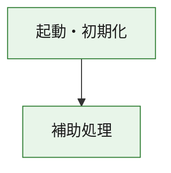
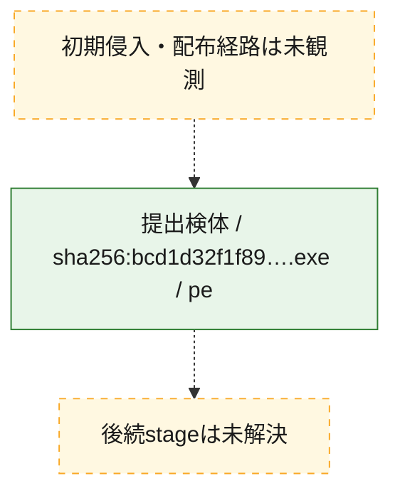
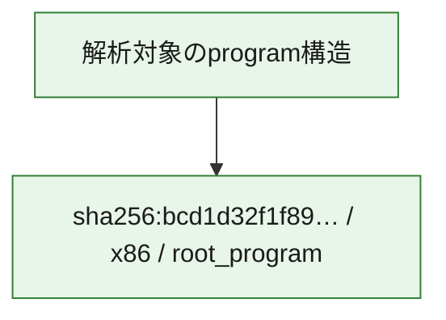

# 全体ロジック：bcd1d32f1f89f3fd6a107874fe525c8536509f993921948c929ae24aeb870054

代表関数の静的証跡から、起動・初期化の処理群を確認しました。

## 読み方

- phaseの掲載順は解析上の整理順です。observed_call_edgesがない段階間の実行順を断定しません。
- 図の実線は静的に観測した関係、点線と黄色のノードは未観測・未解決の関係を示します。
- 図は静的な要約であり、動的実行を再現するものではありません。
- 詳細な関数解説とfingerprintは[STATIC-LOGIC.md](STATIC-LOGIC.md)を参照してください。

## 静的可視化

### 実行フロー

### 感染チェーン

### モジュール関係

## 処理段階

### 1. 起動・初期化

entry pointから初期化と後続処理への移行を確認します。
確度: `confirmed_static_function_evidence`

- `bcd1d32f1f89f3fd6a107874fe525c8536509f993921948c929ae24aeb870054:ghidra:180001010` — 初期化と主要処理への分岐を行う入口関数です。 状態: `succeeded`、選定理由: `entry_point`, `meaningful_symbol_name`, `reviewed_call_centrality:22`, `role:entrypoint`, `small_program_complete_context`

### 2. 補助処理

主要処理を支える一般内部関数またはlibrary処理を確認します。
確度: `confirmed_static_function_evidence`

- `bcd1d32f1f89f3fd6a107874fe525c8536509f993921948c929ae24aeb870054:ghidra:180001240` — 検体内部の一般処理を実装する関数です。 状態: `succeeded`、選定理由: `context_representative`, `reviewed_call_centrality:2`, `small_program_complete_context`
- `bcd1d32f1f89f3fd6a107874fe525c8536509f993921948c929ae24aeb870054:ghidra:180001350` — 検体内部の一般処理を実装する関数です。 状態: `succeeded`、選定理由: `context_representative`, `reviewed_call_centrality:25`, `small_program_complete_context`
- `bcd1d32f1f89f3fd6a107874fe525c8536509f993921948c929ae24aeb870054:ghidra:180003780` — 検体内部の一般処理を実装する関数です。 状態: `succeeded`、選定理由: `context_representative`, `reviewed_call_centrality:2`, `small_program_complete_context`
- `bcd1d32f1f89f3fd6a107874fe525c8536509f993921948c929ae24aeb870054:ghidra:1800038e0` — 検体内部の一般処理を実装する関数です。 状態: `succeeded`、選定理由: `context_representative`, `reviewed_call_centrality:2`, `small_program_complete_context`

## 観測したcall関係

- `bcd1d32f1f89f3fd6a107874fe525c8536509f993921948c929ae24aeb870054:ghidra:180001010` → `bcd1d32f1f89f3fd6a107874fe525c8536509f993921948c929ae24aeb870054:ghidra:180001240` （`startup` → `support`）
- `bcd1d32f1f89f3fd6a107874fe525c8536509f993921948c929ae24aeb870054:ghidra:180001010` → `bcd1d32f1f89f3fd6a107874fe525c8536509f993921948c929ae24aeb870054:ghidra:180001350` （`startup` → `support`）
- `bcd1d32f1f89f3fd6a107874fe525c8536509f993921948c929ae24aeb870054:ghidra:180001350` → `bcd1d32f1f89f3fd6a107874fe525c8536509f993921948c929ae24aeb870054:ghidra:180001240` （`support` → `support`）
- `bcd1d32f1f89f3fd6a107874fe525c8536509f993921948c929ae24aeb870054:ghidra:180001350` → `bcd1d32f1f89f3fd6a107874fe525c8536509f993921948c929ae24aeb870054:ghidra:180003780` （`support` → `support`）
- `bcd1d32f1f89f3fd6a107874fe525c8536509f993921948c929ae24aeb870054:ghidra:180001350` → `bcd1d32f1f89f3fd6a107874fe525c8536509f993921948c929ae24aeb870054:ghidra:1800038e0` （`support` → `support`）
- `bcd1d32f1f89f3fd6a107874fe525c8536509f993921948c929ae24aeb870054:ghidra:180003780` → `bcd1d32f1f89f3fd6a107874fe525c8536509f993921948c929ae24aeb870054:ghidra:1800038e0` （`support` → `support`）
- `ghidra-function:2f7a02696704aa6f568a1602` → `ghidra-external:0034308b1579b1c79db25c98` （`unclassified` → `unclassified`）
- `ghidra-function:2f7a02696704aa6f568a1602` → `ghidra-external:04227e1d37d5763e883a7dcb` （`unclassified` → `unclassified`）
- `ghidra-function:2f7a02696704aa6f568a1602` → `ghidra-external:0d1a123b09f1464d83623770` （`unclassified` → `unclassified`）
- `ghidra-function:2f7a02696704aa6f568a1602` → `ghidra-external:29f9f2580e6724ffacc7f5e7` （`unclassified` → `unclassified`）
- `ghidra-function:2f7a02696704aa6f568a1602` → `ghidra-external:30992f2899657fbe1da62fe8` （`unclassified` → `unclassified`）
- `ghidra-function:2f7a02696704aa6f568a1602` → `ghidra-external:3c05801f2afe231e2c5bb7dd` （`unclassified` → `unclassified`）
- `ghidra-function:2f7a02696704aa6f568a1602` → `ghidra-external:3fc0b12d57836f9e5b3c6388` （`unclassified` → `unclassified`）
- `ghidra-function:2f7a02696704aa6f568a1602` → `ghidra-external:4c3a0bfa8770a154b4585c1d` （`unclassified` → `unclassified`）
- `ghidra-function:2f7a02696704aa6f568a1602` → `ghidra-external:510e866d2fe67a3b77d97425` （`unclassified` → `unclassified`）
- `ghidra-function:2f7a02696704aa6f568a1602` → `ghidra-external:537dd4560be633fae3b6e9e8` （`unclassified` → `unclassified`）
- `ghidra-function:2f7a02696704aa6f568a1602` → `ghidra-external:5e60a867a6311a9cfcf487e2` （`unclassified` → `unclassified`）
- `ghidra-function:2f7a02696704aa6f568a1602` → `ghidra-external:6f3e11b7c2845866bb862637` （`unclassified` → `unclassified`）
- `ghidra-function:2f7a02696704aa6f568a1602` → `ghidra-external:7c7f64a15e37191883e73fa1` （`unclassified` → `unclassified`）
- `ghidra-function:2f7a02696704aa6f568a1602` → `ghidra-external:7e3aa67076f2129291267b0b` （`unclassified` → `unclassified`）
- `ghidra-function:2f7a02696704aa6f568a1602` → `ghidra-external:8430ade09d6b7dbdb3d01b91` （`unclassified` → `unclassified`）
- `ghidra-function:2f7a02696704aa6f568a1602` → `ghidra-external:992d5f293e1ba1512eb29a9f` （`unclassified` → `unclassified`）
- `ghidra-function:2f7a02696704aa6f568a1602` → `ghidra-external:99dc56c8683ca84fb37b6995` （`unclassified` → `unclassified`）
- `ghidra-function:2f7a02696704aa6f568a1602` → `ghidra-external:9fe2b4914525a8749604cee9` （`unclassified` → `unclassified`）
- `ghidra-function:2f7a02696704aa6f568a1602` → `ghidra-external:a9746e6124c3f36f310adaa0` （`unclassified` → `unclassified`）
- `ghidra-function:2f7a02696704aa6f568a1602` → `ghidra-external:c3878a3e0840624cf76c58e4` （`unclassified` → `unclassified`）
- `ghidra-function:2f7a02696704aa6f568a1602` → `ghidra-external:e7d0a3b83aed76d7607cfb14` （`unclassified` → `unclassified`）
- `ghidra-function:2f7a02696704aa6f568a1602` → `ghidra-function:48ef10edef8e2ba0459c279c` （`unclassified` → `unclassified`）
- `ghidra-function:2f7a02696704aa6f568a1602` → `ghidra-function:54cbc2d84136ad884a161700` （`unclassified` → `unclassified`）
- `ghidra-function:2f7a02696704aa6f568a1602` → `ghidra-function:8e7ab4c155a12b3f0e4411ac` （`unclassified` → `unclassified`）
- `ghidra-function:53c4ed44a14f6ba4468a6d5d` → `ghidra-function:0410a6627a339cc8fca55fc1` （`unclassified` → `unclassified`）
- `ghidra-function:53c4ed44a14f6ba4468a6d5d` → `ghidra-function:2f7a02696704aa6f568a1602` （`unclassified` → `unclassified`）
- `ghidra-function:53c4ed44a14f6ba4468a6d5d` → `ghidra-function:48ef10edef8e2ba0459c279c` （`unclassified` → `unclassified`）
- `ghidra-function:53c4ed44a14f6ba4468a6d5d` → `ghidra-function:50755b56fa7e1cc12c07e744` （`unclassified` → `unclassified`）
- `ghidra-function:53c4ed44a14f6ba4468a6d5d` → `ghidra-function:64452ad8a03cadcf8bcc9ca7` （`unclassified` → `unclassified`）
- `ghidra-function:53c4ed44a14f6ba4468a6d5d` → `ghidra-function:649efbe41028907b74552cdc` （`unclassified` → `unclassified`）
- `ghidra-function:53c4ed44a14f6ba4468a6d5d` → `ghidra-function:70d3858b7c29a1f8dadb261f` （`unclassified` → `unclassified`）
- `ghidra-function:53c4ed44a14f6ba4468a6d5d` → `ghidra-function:8d560ff18c737e1498a01bc2` （`unclassified` → `unclassified`）
- `ghidra-function:53c4ed44a14f6ba4468a6d5d` → `ghidra-function:b8e5486eee01135285de38c4` （`unclassified` → `unclassified`）
- `ghidra-function:53c4ed44a14f6ba4468a6d5d` → `ghidra-function:c660002e9cb89aeba588ae4e` （`unclassified` → `unclassified`）
- `ghidra-function:53c4ed44a14f6ba4468a6d5d` → `ghidra-function:d4061e5b167ddd439a69902e` （`unclassified` → `unclassified`）
- `ghidra-function:53c4ed44a14f6ba4468a6d5d` → `ghidra-function:f34549aa60b34bfa740b809a` （`unclassified` → `unclassified`）
- `ghidra-function:8e7ab4c155a12b3f0e4411ac` → `ghidra-function:54cbc2d84136ad884a161700` （`unclassified` → `unclassified`）

## 解析範囲と制約

- 選定外関数は全体inventoryへ残しますが、関数本体の個別解説対象にはしていません。
- indirect call、難読化、packer、VM、壊れたcontrol flowによりcall関係が欠落する場合があります。
- 文書は静的解析に基づき、検体実行や外部通信による動的確認は行っていません。
