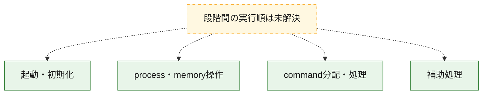
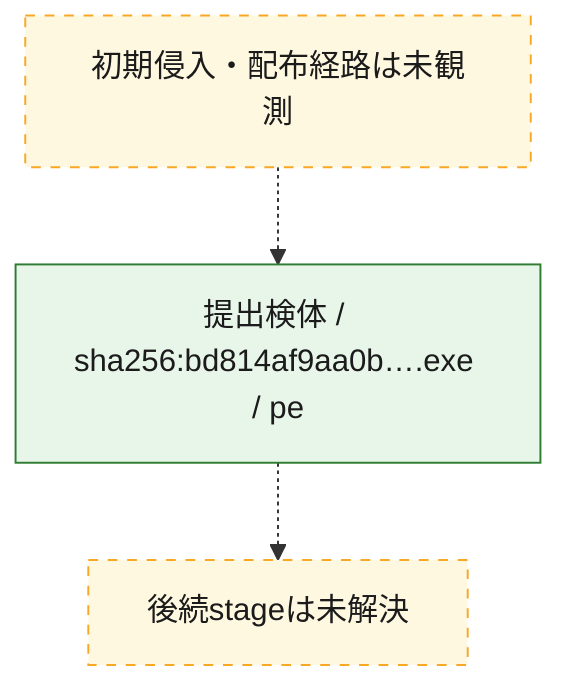
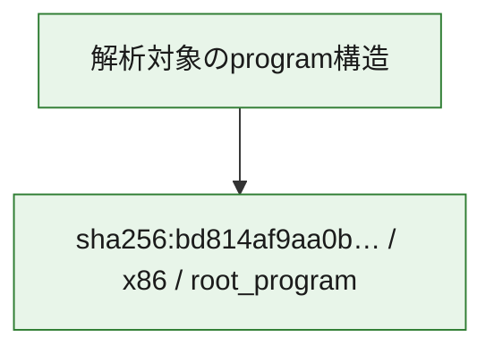

# 全体ロジック：bd814af9aa0bd5e0fb63b7c4a34dc382589bd89da2bb8a462d8a22ba2ca6178c

代表関数の静的証跡から、起動・初期化、process・memory操作、command分配・処理の処理群を確認しました。

## 読み方

- phaseの掲載順は解析上の整理順です。observed_call_edgesがない段階間の実行順を断定しません。
- 図の実線は静的に観測した関係、点線と黄色のノードは未観測・未解決の関係を示します。
- 図は静的な要約であり、動的実行を再現するものではありません。
- 詳細な関数解説とfingerprintは[STATIC-LOGIC.md](STATIC-LOGIC.md)を参照してください。

## 静的可視化

### 実行フロー

### 感染チェーン

### モジュール関係

## 処理段階

### 1. 起動・初期化

entry pointから初期化と後続処理への移行を確認します。
確度: `confirmed_static_function_evidence`

- `bd814af9aa0bd5e0fb63b7c4a34dc382589bd89da2bb8a462d8a22ba2ca6178c:ghidra:140001000` — 初期化と主要処理への分岐を行う入口関数です。 状態: `succeeded`、選定理由: `entry_point`, `meaningful_symbol_name`, `reviewed_call_centrality:1`, `role:entrypoint`

### 2. process・memory操作

process、thread、module、memory操作と実行移行を確認します。
確度: `confirmed_static_function_evidence`

- `bd814af9aa0bd5e0fb63b7c4a34dc382589bd89da2bb8a462d8a22ba2ca6178c:ghidra:14000f960` — process、thread、module、またはmemory操作に関係する関数です。 状態: `succeeded`、選定理由: `context_representative`, `reviewed_call_centrality:8`, `role:process_or_memory_operation`
- `bd814af9aa0bd5e0fb63b7c4a34dc382589bd89da2bb8a462d8a22ba2ca6178c:ghidra:14000fa90` — process、thread、module、またはmemory操作に関係する関数です。 状態: `succeeded`、選定理由: `context_representative`, `reviewed_call_centrality:4`, `role:process_or_memory_operation`
- `bd814af9aa0bd5e0fb63b7c4a34dc382589bd89da2bb8a462d8a22ba2ca6178c:ghidra:14000fad0` — process、thread、module、またはmemory操作に関係する関数です。 状態: `succeeded`、選定理由: `context_representative`, `reviewed_call_centrality:12`, `role:process_or_memory_operation`
- `bd814af9aa0bd5e0fb63b7c4a34dc382589bd89da2bb8a462d8a22ba2ca6178c:ghidra:140010250` — process、thread、module、またはmemory操作に関係する関数です。 状態: `succeeded`、選定理由: `context_representative`, `reviewed_call_centrality:14`, `role:process_or_memory_operation`

### 3. command分配・処理

受信commandやtaskの解釈、分配、個別handlerへの移行を確認します。
確度: `confirmed_static_function_evidence`

- `bd814af9aa0bd5e0fb63b7c4a34dc382589bd89da2bb8a462d8a22ba2ca6178c:ghidra:140001020` — commandの解釈、分配、または個別処理を担当する関数です。 状態: `succeeded`、選定理由: `context_representative`, `reviewed_call_centrality:36`, `role:command_dispatch_or_handler`

### 4. 補助処理

主要処理を支える一般内部関数またはlibrary処理を確認します。
確度: `confirmed_static_function_evidence`

- `bd814af9aa0bd5e0fb63b7c4a34dc382589bd89da2bb8a462d8a22ba2ca6178c:ghidra:1400013d0` — 検体内部の一般処理を実装する関数です。 状態: `succeeded`、選定理由: `context_representative`, `reviewed_call_centrality:1`
- `bd814af9aa0bd5e0fb63b7c4a34dc382589bd89da2bb8a462d8a22ba2ca6178c:ghidra:14000d960` — 検体内部の一般処理を実装する関数です。 状態: `succeeded`、選定理由: `context_representative`
- `bd814af9aa0bd5e0fb63b7c4a34dc382589bd89da2bb8a462d8a22ba2ca6178c:ghidra:14000dbd0` — 検体内部の一般処理を実装する関数です。 状態: `succeeded`、選定理由: `context_representative`
- `bd814af9aa0bd5e0fb63b7c4a34dc382589bd89da2bb8a462d8a22ba2ca6178c:ghidra:14000dd20` — 検体内部の一般処理を実装する関数です。 状態: `succeeded`、選定理由: `context_representative`
- `bd814af9aa0bd5e0fb63b7c4a34dc382589bd89da2bb8a462d8a22ba2ca6178c:ghidra:14000dff0` — 検体内部の一般処理を実装する関数です。 状態: `succeeded`、選定理由: `context_representative`
- `bd814af9aa0bd5e0fb63b7c4a34dc382589bd89da2bb8a462d8a22ba2ca6178c:ghidra:14000e1c0` — 検体内部の一般処理を実装する関数です。 状態: `succeeded`、選定理由: `context_representative`, `reviewed_call_centrality:12`
- `bd814af9aa0bd5e0fb63b7c4a34dc382589bd89da2bb8a462d8a22ba2ca6178c:ghidra:14000e2a0` — 検体内部の一般処理を実装する関数です。 状態: `succeeded`、選定理由: `context_representative`, `reviewed_call_centrality:4`
- `bd814af9aa0bd5e0fb63b7c4a34dc382589bd89da2bb8a462d8a22ba2ca6178c:ghidra:14000e2f0` — 検体内部の一般処理を実装する関数です。 状態: `succeeded`、選定理由: `context_representative`, `reviewed_call_centrality:5`
- `bd814af9aa0bd5e0fb63b7c4a34dc382589bd89da2bb8a462d8a22ba2ca6178c:ghidra:14000e680` — 検体内部の一般処理を実装する関数です。 状態: `succeeded`、選定理由: `context_representative`, `reviewed_call_centrality:9`
- `bd814af9aa0bd5e0fb63b7c4a34dc382589bd89da2bb8a462d8a22ba2ca6178c:ghidra:14000e810` — 検体内部の一般処理を実装する関数です。 状態: `succeeded`、選定理由: `context_representative`, `reviewed_call_centrality:6`
- `bd814af9aa0bd5e0fb63b7c4a34dc382589bd89da2bb8a462d8a22ba2ca6178c:ghidra:14000ec20` — 検体内部の一般処理を実装する関数です。 状態: `succeeded`、選定理由: `context_representative`, `reviewed_call_centrality:6`
- `bd814af9aa0bd5e0fb63b7c4a34dc382589bd89da2bb8a462d8a22ba2ca6178c:ghidra:14000ef70` — 検体内部の一般処理を実装する関数です。 状態: `succeeded`、選定理由: `context_representative`, `reviewed_call_centrality:7`
- `bd814af9aa0bd5e0fb63b7c4a34dc382589bd89da2bb8a462d8a22ba2ca6178c:ghidra:14000f2e0` — 検体内部の一般処理を実装する関数です。 状態: `succeeded`、選定理由: `context_representative`, `reviewed_call_centrality:6`
- `bd814af9aa0bd5e0fb63b7c4a34dc382589bd89da2bb8a462d8a22ba2ca6178c:ghidra:14000f5f0` — 検体内部の一般処理を実装する関数です。 状態: `succeeded`、選定理由: `context_representative`, `reviewed_call_centrality:6`
- `bd814af9aa0bd5e0fb63b7c4a34dc382589bd89da2bb8a462d8a22ba2ca6178c:ghidra:14000fb20` — 検体内部の一般処理を実装する関数です。 状態: `succeeded`、選定理由: `context_representative`, `reviewed_call_centrality:11`
- `bd814af9aa0bd5e0fb63b7c4a34dc382589bd89da2bb8a462d8a22ba2ca6178c:ghidra:14000fb60` — 検体内部の一般処理を実装する関数です。 状態: `succeeded`、選定理由: `context_representative`, `reviewed_call_centrality:5`
- `bd814af9aa0bd5e0fb63b7c4a34dc382589bd89da2bb8a462d8a22ba2ca6178c:ghidra:14000fba0` — 検体内部の一般処理を実装する関数です。 状態: `succeeded`、選定理由: `context_representative`, `reviewed_call_centrality:7`
- `bd814af9aa0bd5e0fb63b7c4a34dc382589bd89da2bb8a462d8a22ba2ca6178c:ghidra:14000ff60` — 検体内部の一般処理を実装する関数です。 状態: `succeeded`、選定理由: `context_representative`, `reviewed_call_centrality:5`
- `bd814af9aa0bd5e0fb63b7c4a34dc382589bd89da2bb8a462d8a22ba2ca6178c:ghidra:140010020` — 検体内部の一般処理を実装する関数です。 状態: `succeeded`、選定理由: `context_representative`, `reviewed_call_centrality:3`
- `bd814af9aa0bd5e0fb63b7c4a34dc382589bd89da2bb8a462d8a22ba2ca6178c:ghidra:140010080` — 検体内部の一般処理を実装する関数です。 状態: `succeeded`、選定理由: `context_representative`, `reviewed_call_centrality:5`
- `bd814af9aa0bd5e0fb63b7c4a34dc382589bd89da2bb8a462d8a22ba2ca6178c:ghidra:1400106e0` — 検体内部の一般処理を実装する関数です。 状態: `succeeded`、選定理由: `context_representative`, `reviewed_call_centrality:10`
- `bd814af9aa0bd5e0fb63b7c4a34dc382589bd89da2bb8a462d8a22ba2ca6178c:ghidra:140010870` — 検体内部の一般処理を実装する関数です。 状態: `succeeded`、選定理由: `context_representative`, `reviewed_call_centrality:6`
- `bd814af9aa0bd5e0fb63b7c4a34dc382589bd89da2bb8a462d8a22ba2ca6178c:ghidra:140010a70` — 検体内部の一般処理を実装する関数です。 状態: `succeeded`、選定理由: `context_representative`, `reviewed_call_centrality:1`
- `bd814af9aa0bd5e0fb63b7c4a34dc382589bd89da2bb8a462d8a22ba2ca6178c:ghidra:140010cd0` — 検体内部の一般処理を実装する関数です。 状態: `succeeded`、選定理由: `context_representative`, `reviewed_call_centrality:1`
- `bd814af9aa0bd5e0fb63b7c4a34dc382589bd89da2bb8a462d8a22ba2ca6178c:ghidra:140010d80` — 検体内部の一般処理を実装する関数です。 状態: `succeeded`、選定理由: `context_representative`
- `bd814af9aa0bd5e0fb63b7c4a34dc382589bd89da2bb8a462d8a22ba2ca6178c:ghidra:140010df0` — 検体内部の一般処理を実装する関数です。 状態: `succeeded`、選定理由: `context_representative`

## 観測したcall関係

- 代表関数間で直接解決できた呼出関係はありません。

## 解析範囲と制約

- 選定外関数は全体inventoryへ残しますが、関数本体の個別解説対象にはしていません。
- indirect call、難読化、packer、VM、壊れたcontrol flowによりcall関係が欠落する場合があります。
- 文書は静的解析に基づき、検体実行や外部通信による動的確認は行っていません。
