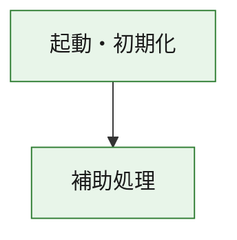
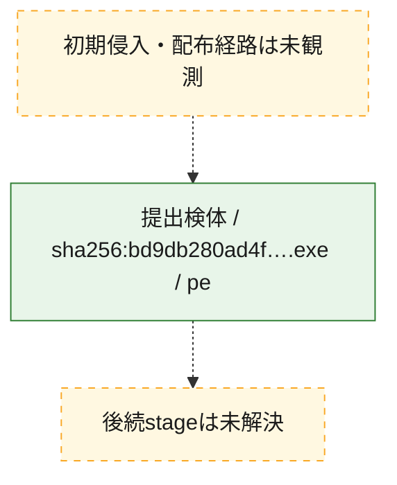
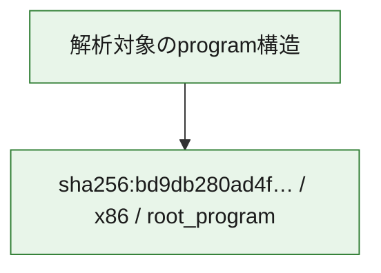

# 全体ロジック：bd9db280ad4f24a879d8bd1a8d37c18b28de4b12523c4b1e6d224a4370ed55dc

代表関数の静的証跡から、起動・初期化の処理群を確認しました。

## 読み方

- phaseの掲載順は解析上の整理順です。observed_call_edgesがない段階間の実行順を断定しません。
- 図の実線は静的に観測した関係、点線と黄色のノードは未観測・未解決の関係を示します。
- 図は静的な要約であり、動的実行を再現するものではありません。
- 詳細な関数解説とfingerprintは[STATIC-LOGIC.md](STATIC-LOGIC.md)を参照してください。

## 静的可視化

### 実行フロー

### 感染チェーン

### モジュール関係

## 処理段階

### 1. 起動・初期化

entry pointから初期化と後続処理への移行を確認します。
確度: `confirmed_static_function_evidence`

- `bd9db280ad4f24a879d8bd1a8d37c18b28de4b12523c4b1e6d224a4370ed55dc:ghidra:00401000` — 初期化と主要処理への分岐を行う入口関数です。 状態: `succeeded`、選定理由: `entry_point`, `meaningful_symbol_name`, `reviewed_call_centrality:3`, `role:entrypoint`

### 2. 補助処理

主要処理を支える一般内部関数またはlibrary処理を確認します。
確度: `confirmed_static_function_evidence_with_limits`

- `bd9db280ad4f24a879d8bd1a8d37c18b28de4b12523c4b1e6d224a4370ed55dc:ghidra:00401011` — 検体内部の一般処理を実装する関数です。 状態: `succeeded`、選定理由: `context_representative`, `reviewed_call_centrality:37`
- `bd9db280ad4f24a879d8bd1a8d37c18b28de4b12523c4b1e6d224a4370ed55dc:ghidra:00402494` — 検体内部の一般処理を実装する関数です。 状態: `succeeded`、選定理由: `context_representative`, `reviewed_call_centrality:64`
- `bd9db280ad4f24a879d8bd1a8d37c18b28de4b12523c4b1e6d224a4370ed55dc:ghidra:00406166` — 検体内部の一般処理を実装する関数です。 状態: `succeeded`、選定理由: `context_representative`, `reviewed_call_centrality:2`
- `bd9db280ad4f24a879d8bd1a8d37c18b28de4b12523c4b1e6d224a4370ed55dc:ghidra:004061a5` — 検体内部の一般処理を実装する関数です。 状態: `succeeded`、選定理由: `context_representative`, `reviewed_call_centrality:2`
- `bd9db280ad4f24a879d8bd1a8d37c18b28de4b12523c4b1e6d224a4370ed55dc:ghidra:00406216` — 検体内部の一般処理を実装する関数です。 状態: `succeeded`、選定理由: `context_representative`, `reviewed_call_centrality:14`
- `bd9db280ad4f24a879d8bd1a8d37c18b28de4b12523c4b1e6d224a4370ed55dc:ghidra:00406883` — 検体内部の一般処理を実装する関数です。 状態: `succeeded`、選定理由: `context_representative`, `reviewed_call_centrality:5`
- `bd9db280ad4f24a879d8bd1a8d37c18b28de4b12523c4b1e6d224a4370ed55dc:ghidra:004069f8` — 検体内部の一般処理を実装する関数です。 状態: `limited_bad_instruction_or_flow`、選定理由: `context_representative`, `reviewed_call_centrality:10`
- `bd9db280ad4f24a879d8bd1a8d37c18b28de4b12523c4b1e6d224a4370ed55dc:ghidra:00406bdd` — 検体内部の一般処理を実装する関数です。 状態: `succeeded`、選定理由: `context_representative`, `reviewed_call_centrality:2`
- `bd9db280ad4f24a879d8bd1a8d37c18b28de4b12523c4b1e6d224a4370ed55dc:ghidra:00406c42` — 検体内部の一般処理を実装する関数です。 状態: `succeeded`、選定理由: `context_representative`, `reviewed_call_centrality:3`
- `bd9db280ad4f24a879d8bd1a8d37c18b28de4b12523c4b1e6d224a4370ed55dc:ghidra:00406dec` — 検体内部の一般処理を実装する関数です。 状態: `succeeded`、選定理由: `context_representative`, `reviewed_call_centrality:6`
- `bd9db280ad4f24a879d8bd1a8d37c18b28de4b12523c4b1e6d224a4370ed55dc:ghidra:00406f03` — 検体内部の一般処理を実装する関数です。 状態: `succeeded`、選定理由: `context_representative`, `reviewed_call_centrality:3`
- `bd9db280ad4f24a879d8bd1a8d37c18b28de4b12523c4b1e6d224a4370ed55dc:ghidra:00406f5f` — 検体内部の一般処理を実装する関数です。 状態: `succeeded`、選定理由: `context_representative`, `reviewed_call_centrality:1`
- `bd9db280ad4f24a879d8bd1a8d37c18b28de4b12523c4b1e6d224a4370ed55dc:ghidra:00406f84` — 検体内部の一般処理を実装する関数です。 状態: `succeeded`、選定理由: `context_representative`, `reviewed_call_centrality:4`
- `bd9db280ad4f24a879d8bd1a8d37c18b28de4b12523c4b1e6d224a4370ed55dc:ghidra:00406fcd` — 検体内部の一般処理を実装する関数です。 状態: `succeeded`、選定理由: `context_representative`, `reviewed_call_centrality:7`
- `bd9db280ad4f24a879d8bd1a8d37c18b28de4b12523c4b1e6d224a4370ed55dc:ghidra:004070b5` — 検体内部の一般処理を実装する関数です。 状態: `succeeded`、選定理由: `context_representative`, `reviewed_call_centrality:10`
- `bd9db280ad4f24a879d8bd1a8d37c18b28de4b12523c4b1e6d224a4370ed55dc:ghidra:00407249` — 検体内部の一般処理を実装する関数です。 状態: `succeeded`、選定理由: `context_representative`, `reviewed_call_centrality:2`
- `bd9db280ad4f24a879d8bd1a8d37c18b28de4b12523c4b1e6d224a4370ed55dc:ghidra:0040727d` — 検体内部の一般処理を実装する関数です。 状態: `succeeded`、選定理由: `context_representative`, `reviewed_call_centrality:2`
- `bd9db280ad4f24a879d8bd1a8d37c18b28de4b12523c4b1e6d224a4370ed55dc:ghidra:004072b1` — 検体内部の一般処理を実装する関数です。 状態: `succeeded`、選定理由: `context_representative`, `reviewed_call_centrality:2`
- `bd9db280ad4f24a879d8bd1a8d37c18b28de4b12523c4b1e6d224a4370ed55dc:ghidra:004072f4` — 検体内部の一般処理を実装する関数です。 状態: `succeeded`、選定理由: `context_representative`, `reviewed_call_centrality:6`
- `bd9db280ad4f24a879d8bd1a8d37c18b28de4b12523c4b1e6d224a4370ed55dc:ghidra:0040732f` — 検体内部の一般処理を実装する関数です。 状態: `succeeded`、選定理由: `context_representative`, `reviewed_call_centrality:5`
- `bd9db280ad4f24a879d8bd1a8d37c18b28de4b12523c4b1e6d224a4370ed55dc:ghidra:0040737e` — 検体内部の一般処理を実装する関数です。 状態: `succeeded`、選定理由: `context_representative`, `reviewed_call_centrality:15`
- `bd9db280ad4f24a879d8bd1a8d37c18b28de4b12523c4b1e6d224a4370ed55dc:ghidra:00407763` — 検体内部の一般処理を実装する関数です。 状態: `succeeded`、選定理由: `context_representative`, `reviewed_call_centrality:9`
- `bd9db280ad4f24a879d8bd1a8d37c18b28de4b12523c4b1e6d224a4370ed55dc:ghidra:004078d2` — 検体内部の一般処理を実装する関数です。 状態: `succeeded`、選定理由: `context_representative`, `reviewed_call_centrality:8`
- `bd9db280ad4f24a879d8bd1a8d37c18b28de4b12523c4b1e6d224a4370ed55dc:ghidra:004079ff` — 検体内部の一般処理を実装する関数です。 状態: `succeeded`、選定理由: `context_representative`, `reviewed_call_centrality:3`
- `bd9db280ad4f24a879d8bd1a8d37c18b28de4b12523c4b1e6d224a4370ed55dc:ghidra:00407a27` — 検体内部の一般処理を実装する関数です。 状態: `succeeded`、選定理由: `context_representative`, `reviewed_call_centrality:3`
- `bd9db280ad4f24a879d8bd1a8d37c18b28de4b12523c4b1e6d224a4370ed55dc:ghidra:00407a8a` — 検体内部の一般処理を実装する関数です。 状態: `succeeded`、選定理由: `context_representative`, `reviewed_call_centrality:24`
- `bd9db280ad4f24a879d8bd1a8d37c18b28de4b12523c4b1e6d224a4370ed55dc:ghidra:0040af7c` — 検体内部の一般処理を実装する関数です。 状態: `succeeded`、選定理由: `context_representative`, `reviewed_call_centrality:3`
- `bd9db280ad4f24a879d8bd1a8d37c18b28de4b12523c4b1e6d224a4370ed55dc:ghidra:0040afc9` — 検体内部の一般処理を実装する関数です。 状態: `succeeded`、選定理由: `context_representative`, `reviewed_call_centrality:2`
- `bd9db280ad4f24a879d8bd1a8d37c18b28de4b12523c4b1e6d224a4370ed55dc:ghidra:0040b047` — 検体内部の一般処理を実装する関数です。 状態: `succeeded`、選定理由: `context_representative`, `reviewed_call_centrality:3`
- `bd9db280ad4f24a879d8bd1a8d37c18b28de4b12523c4b1e6d224a4370ed55dc:ghidra:0040b091` — 検体内部の一般処理を実装する関数です。 状態: `succeeded`、選定理由: `context_representative`, `reviewed_call_centrality:4`
- `bd9db280ad4f24a879d8bd1a8d37c18b28de4b12523c4b1e6d224a4370ed55dc:ghidra:0040b189` — 検体内部の一般処理を実装する関数です。 状態: `succeeded`、選定理由: `context_representative`, `reviewed_call_centrality:4`

## 観測したcall関係

- `bd9db280ad4f24a879d8bd1a8d37c18b28de4b12523c4b1e6d224a4370ed55dc:ghidra:00401000` → `bd9db280ad4f24a879d8bd1a8d37c18b28de4b12523c4b1e6d224a4370ed55dc:ghidra:00401011` （`startup` → `support`）
- `bd9db280ad4f24a879d8bd1a8d37c18b28de4b12523c4b1e6d224a4370ed55dc:ghidra:00401011` → `bd9db280ad4f24a879d8bd1a8d37c18b28de4b12523c4b1e6d224a4370ed55dc:ghidra:00402494` （`support` → `support`）
- `bd9db280ad4f24a879d8bd1a8d37c18b28de4b12523c4b1e6d224a4370ed55dc:ghidra:00401011` → `bd9db280ad4f24a879d8bd1a8d37c18b28de4b12523c4b1e6d224a4370ed55dc:ghidra:00406f84` （`support` → `support`）
- `bd9db280ad4f24a879d8bd1a8d37c18b28de4b12523c4b1e6d224a4370ed55dc:ghidra:00401011` → `bd9db280ad4f24a879d8bd1a8d37c18b28de4b12523c4b1e6d224a4370ed55dc:ghidra:00406fcd` （`support` → `support`）
- `bd9db280ad4f24a879d8bd1a8d37c18b28de4b12523c4b1e6d224a4370ed55dc:ghidra:00401011` → `bd9db280ad4f24a879d8bd1a8d37c18b28de4b12523c4b1e6d224a4370ed55dc:ghidra:004072f4` （`support` → `support`）
- `bd9db280ad4f24a879d8bd1a8d37c18b28de4b12523c4b1e6d224a4370ed55dc:ghidra:00401011` → `bd9db280ad4f24a879d8bd1a8d37c18b28de4b12523c4b1e6d224a4370ed55dc:ghidra:004079ff` （`support` → `support`）
- `bd9db280ad4f24a879d8bd1a8d37c18b28de4b12523c4b1e6d224a4370ed55dc:ghidra:00401011` → `bd9db280ad4f24a879d8bd1a8d37c18b28de4b12523c4b1e6d224a4370ed55dc:ghidra:0040af7c` （`support` → `support`）
- `bd9db280ad4f24a879d8bd1a8d37c18b28de4b12523c4b1e6d224a4370ed55dc:ghidra:00402494` → `bd9db280ad4f24a879d8bd1a8d37c18b28de4b12523c4b1e6d224a4370ed55dc:ghidra:00406c42` （`support` → `support`）
- `bd9db280ad4f24a879d8bd1a8d37c18b28de4b12523c4b1e6d224a4370ed55dc:ghidra:00402494` → `bd9db280ad4f24a879d8bd1a8d37c18b28de4b12523c4b1e6d224a4370ed55dc:ghidra:00406dec` （`support` → `support`）
- `bd9db280ad4f24a879d8bd1a8d37c18b28de4b12523c4b1e6d224a4370ed55dc:ghidra:00402494` → `bd9db280ad4f24a879d8bd1a8d37c18b28de4b12523c4b1e6d224a4370ed55dc:ghidra:00406f03` （`support` → `support`）
- `bd9db280ad4f24a879d8bd1a8d37c18b28de4b12523c4b1e6d224a4370ed55dc:ghidra:00402494` → `bd9db280ad4f24a879d8bd1a8d37c18b28de4b12523c4b1e6d224a4370ed55dc:ghidra:00406f84` （`support` → `support`）
- `bd9db280ad4f24a879d8bd1a8d37c18b28de4b12523c4b1e6d224a4370ed55dc:ghidra:00402494` → `bd9db280ad4f24a879d8bd1a8d37c18b28de4b12523c4b1e6d224a4370ed55dc:ghidra:00406fcd` （`support` → `support`）
- `bd9db280ad4f24a879d8bd1a8d37c18b28de4b12523c4b1e6d224a4370ed55dc:ghidra:00402494` → `bd9db280ad4f24a879d8bd1a8d37c18b28de4b12523c4b1e6d224a4370ed55dc:ghidra:004070b5` （`support` → `support`）
- `bd9db280ad4f24a879d8bd1a8d37c18b28de4b12523c4b1e6d224a4370ed55dc:ghidra:00402494` → `bd9db280ad4f24a879d8bd1a8d37c18b28de4b12523c4b1e6d224a4370ed55dc:ghidra:00407249` （`support` → `support`）
- `bd9db280ad4f24a879d8bd1a8d37c18b28de4b12523c4b1e6d224a4370ed55dc:ghidra:00402494` → `bd9db280ad4f24a879d8bd1a8d37c18b28de4b12523c4b1e6d224a4370ed55dc:ghidra:0040727d` （`support` → `support`）
- `bd9db280ad4f24a879d8bd1a8d37c18b28de4b12523c4b1e6d224a4370ed55dc:ghidra:00402494` → `bd9db280ad4f24a879d8bd1a8d37c18b28de4b12523c4b1e6d224a4370ed55dc:ghidra:004072b1` （`support` → `support`）
- `bd9db280ad4f24a879d8bd1a8d37c18b28de4b12523c4b1e6d224a4370ed55dc:ghidra:00402494` → `bd9db280ad4f24a879d8bd1a8d37c18b28de4b12523c4b1e6d224a4370ed55dc:ghidra:004072f4` （`support` → `support`）
- `bd9db280ad4f24a879d8bd1a8d37c18b28de4b12523c4b1e6d224a4370ed55dc:ghidra:00402494` → `bd9db280ad4f24a879d8bd1a8d37c18b28de4b12523c4b1e6d224a4370ed55dc:ghidra:0040732f` （`support` → `support`）
- `bd9db280ad4f24a879d8bd1a8d37c18b28de4b12523c4b1e6d224a4370ed55dc:ghidra:00402494` → `bd9db280ad4f24a879d8bd1a8d37c18b28de4b12523c4b1e6d224a4370ed55dc:ghidra:0040737e` （`support` → `support`）
- `bd9db280ad4f24a879d8bd1a8d37c18b28de4b12523c4b1e6d224a4370ed55dc:ghidra:00402494` → `bd9db280ad4f24a879d8bd1a8d37c18b28de4b12523c4b1e6d224a4370ed55dc:ghidra:00407763` （`support` → `support`）
- `bd9db280ad4f24a879d8bd1a8d37c18b28de4b12523c4b1e6d224a4370ed55dc:ghidra:00402494` → `bd9db280ad4f24a879d8bd1a8d37c18b28de4b12523c4b1e6d224a4370ed55dc:ghidra:004078d2` （`support` → `support`）
- `bd9db280ad4f24a879d8bd1a8d37c18b28de4b12523c4b1e6d224a4370ed55dc:ghidra:00402494` → `bd9db280ad4f24a879d8bd1a8d37c18b28de4b12523c4b1e6d224a4370ed55dc:ghidra:004079ff` （`support` → `support`）
- `bd9db280ad4f24a879d8bd1a8d37c18b28de4b12523c4b1e6d224a4370ed55dc:ghidra:00402494` → `bd9db280ad4f24a879d8bd1a8d37c18b28de4b12523c4b1e6d224a4370ed55dc:ghidra:00407a27` （`support` → `support`）
- `bd9db280ad4f24a879d8bd1a8d37c18b28de4b12523c4b1e6d224a4370ed55dc:ghidra:00402494` → `bd9db280ad4f24a879d8bd1a8d37c18b28de4b12523c4b1e6d224a4370ed55dc:ghidra:00407a8a` （`support` → `support`）
- `bd9db280ad4f24a879d8bd1a8d37c18b28de4b12523c4b1e6d224a4370ed55dc:ghidra:00406216` → `bd9db280ad4f24a879d8bd1a8d37c18b28de4b12523c4b1e6d224a4370ed55dc:ghidra:0040af7c` （`support` → `support`）
- `bd9db280ad4f24a879d8bd1a8d37c18b28de4b12523c4b1e6d224a4370ed55dc:ghidra:00406216` → `bd9db280ad4f24a879d8bd1a8d37c18b28de4b12523c4b1e6d224a4370ed55dc:ghidra:0040b189` （`support` → `support`）
- `bd9db280ad4f24a879d8bd1a8d37c18b28de4b12523c4b1e6d224a4370ed55dc:ghidra:00406883` → `bd9db280ad4f24a879d8bd1a8d37c18b28de4b12523c4b1e6d224a4370ed55dc:ghidra:0040afc9` （`support` → `support`）
- `bd9db280ad4f24a879d8bd1a8d37c18b28de4b12523c4b1e6d224a4370ed55dc:ghidra:00406883` → `bd9db280ad4f24a879d8bd1a8d37c18b28de4b12523c4b1e6d224a4370ed55dc:ghidra:0040b047` （`support` → `support`）
- `bd9db280ad4f24a879d8bd1a8d37c18b28de4b12523c4b1e6d224a4370ed55dc:ghidra:004069f8` → `bd9db280ad4f24a879d8bd1a8d37c18b28de4b12523c4b1e6d224a4370ed55dc:ghidra:0040b047` （`support` → `support`）
- `bd9db280ad4f24a879d8bd1a8d37c18b28de4b12523c4b1e6d224a4370ed55dc:ghidra:004069f8` → `bd9db280ad4f24a879d8bd1a8d37c18b28de4b12523c4b1e6d224a4370ed55dc:ghidra:0040b091` （`support` → `support`）
- `bd9db280ad4f24a879d8bd1a8d37c18b28de4b12523c4b1e6d224a4370ed55dc:ghidra:004069f8` → `bd9db280ad4f24a879d8bd1a8d37c18b28de4b12523c4b1e6d224a4370ed55dc:ghidra:0040b189` （`support` → `support`）
- `bd9db280ad4f24a879d8bd1a8d37c18b28de4b12523c4b1e6d224a4370ed55dc:ghidra:00406f84` → `bd9db280ad4f24a879d8bd1a8d37c18b28de4b12523c4b1e6d224a4370ed55dc:ghidra:004072f4` （`support` → `support`）
- `bd9db280ad4f24a879d8bd1a8d37c18b28de4b12523c4b1e6d224a4370ed55dc:ghidra:00406fcd` → `bd9db280ad4f24a879d8bd1a8d37c18b28de4b12523c4b1e6d224a4370ed55dc:ghidra:004072f4` （`support` → `support`）
- `bd9db280ad4f24a879d8bd1a8d37c18b28de4b12523c4b1e6d224a4370ed55dc:ghidra:004070b5` → `bd9db280ad4f24a879d8bd1a8d37c18b28de4b12523c4b1e6d224a4370ed55dc:ghidra:00406f03` （`support` → `support`）
- `bd9db280ad4f24a879d8bd1a8d37c18b28de4b12523c4b1e6d224a4370ed55dc:ghidra:004070b5` → `bd9db280ad4f24a879d8bd1a8d37c18b28de4b12523c4b1e6d224a4370ed55dc:ghidra:00406f84` （`support` → `support`）
- `bd9db280ad4f24a879d8bd1a8d37c18b28de4b12523c4b1e6d224a4370ed55dc:ghidra:004070b5` → `bd9db280ad4f24a879d8bd1a8d37c18b28de4b12523c4b1e6d224a4370ed55dc:ghidra:00406fcd` （`support` → `support`）
- `bd9db280ad4f24a879d8bd1a8d37c18b28de4b12523c4b1e6d224a4370ed55dc:ghidra:0040737e` → `bd9db280ad4f24a879d8bd1a8d37c18b28de4b12523c4b1e6d224a4370ed55dc:ghidra:004072f4` （`support` → `support`）
- `bd9db280ad4f24a879d8bd1a8d37c18b28de4b12523c4b1e6d224a4370ed55dc:ghidra:00407a8a` → `bd9db280ad4f24a879d8bd1a8d37c18b28de4b12523c4b1e6d224a4370ed55dc:ghidra:004070b5` （`support` → `support`）
- `bd9db280ad4f24a879d8bd1a8d37c18b28de4b12523c4b1e6d224a4370ed55dc:ghidra:00407a8a` → `bd9db280ad4f24a879d8bd1a8d37c18b28de4b12523c4b1e6d224a4370ed55dc:ghidra:00407249` （`support` → `support`）
- `bd9db280ad4f24a879d8bd1a8d37c18b28de4b12523c4b1e6d224a4370ed55dc:ghidra:00407a8a` → `bd9db280ad4f24a879d8bd1a8d37c18b28de4b12523c4b1e6d224a4370ed55dc:ghidra:0040727d` （`support` → `support`）
- `bd9db280ad4f24a879d8bd1a8d37c18b28de4b12523c4b1e6d224a4370ed55dc:ghidra:00407a8a` → `bd9db280ad4f24a879d8bd1a8d37c18b28de4b12523c4b1e6d224a4370ed55dc:ghidra:004072b1` （`support` → `support`）
- `bd9db280ad4f24a879d8bd1a8d37c18b28de4b12523c4b1e6d224a4370ed55dc:ghidra:00407a8a` → `bd9db280ad4f24a879d8bd1a8d37c18b28de4b12523c4b1e6d224a4370ed55dc:ghidra:004072f4` （`support` → `support`）
- `bd9db280ad4f24a879d8bd1a8d37c18b28de4b12523c4b1e6d224a4370ed55dc:ghidra:00407a8a` → `bd9db280ad4f24a879d8bd1a8d37c18b28de4b12523c4b1e6d224a4370ed55dc:ghidra:0040737e` （`support` → `support`）
- `bd9db280ad4f24a879d8bd1a8d37c18b28de4b12523c4b1e6d224a4370ed55dc:ghidra:00407a8a` → `bd9db280ad4f24a879d8bd1a8d37c18b28de4b12523c4b1e6d224a4370ed55dc:ghidra:00407763` （`support` → `support`）
- `bd9db280ad4f24a879d8bd1a8d37c18b28de4b12523c4b1e6d224a4370ed55dc:ghidra:00407a8a` → `bd9db280ad4f24a879d8bd1a8d37c18b28de4b12523c4b1e6d224a4370ed55dc:ghidra:004078d2` （`support` → `support`）
- `bd9db280ad4f24a879d8bd1a8d37c18b28de4b12523c4b1e6d224a4370ed55dc:ghidra:00407a8a` → `bd9db280ad4f24a879d8bd1a8d37c18b28de4b12523c4b1e6d224a4370ed55dc:ghidra:00407a27` （`support` → `support`）
- `bd9db280ad4f24a879d8bd1a8d37c18b28de4b12523c4b1e6d224a4370ed55dc:ghidra:0040b047` → `bd9db280ad4f24a879d8bd1a8d37c18b28de4b12523c4b1e6d224a4370ed55dc:ghidra:0040b189` （`support` → `support`）
- `ghidra-function:0c728582d572c1b60202cfc7` → `ghidra-external:0092a52cc01dae9e26ffc270` （`unclassified` → `unclassified`）
- `ghidra-function:0c728582d572c1b60202cfc7` → `ghidra-external:19bac9209299a2977fbdcf96` （`unclassified` → `unclassified`）
- `ghidra-function:0c728582d572c1b60202cfc7` → `ghidra-external:375d0a81271310aaaefbdff7` （`unclassified` → `unclassified`）
- `ghidra-function:0c728582d572c1b60202cfc7` → `ghidra-external:4f9e45a5588375b4ee0150c9` （`unclassified` → `unclassified`）
- `ghidra-function:0c728582d572c1b60202cfc7` → `ghidra-external:62db1705a809aaa83cdb97a9` （`unclassified` → `unclassified`）
- `ghidra-function:0c728582d572c1b60202cfc7` → `ghidra-external:98a225a6aee84ed6d4aa8255` （`unclassified` → `unclassified`）
- `ghidra-function:0c728582d572c1b60202cfc7` → `ghidra-external:9aec90917b546b94d771c55a` （`unclassified` → `unclassified`）
- `ghidra-function:0c728582d572c1b60202cfc7` → `ghidra-external:cc35d895dd02e5ee30377ef1` （`unclassified` → `unclassified`）
- `ghidra-function:0c728582d572c1b60202cfc7` → `ghidra-external:f30e6eff5db884f11786c1e5` （`unclassified` → `unclassified`）
- `ghidra-function:0c728582d572c1b60202cfc7` → `ghidra-function:1a414a2632fda17356cb7ca1` （`unclassified` → `unclassified`）
- `ghidra-function:0c728582d572c1b60202cfc7` → `ghidra-function:7631b9ea0657e584e5cb9dcd` （`unclassified` → `unclassified`）
- `ghidra-function:0c728582d572c1b60202cfc7` → `ghidra-function:83acec833750444903ed3035` （`unclassified` → `unclassified`）
- `ghidra-function:0c728582d572c1b60202cfc7` → `ghidra-function:c02958dd7e048433ed182284` （`unclassified` → `unclassified`）
- `ghidra-function:0c728582d572c1b60202cfc7` → `ghidra-function:c8c02709dfefd041cfb31f54` （`unclassified` → `unclassified`）
- `ghidra-function:1a414a2632fda17356cb7ca1` → `ghidra-external:8e996c770492df3062f58e8c` （`unclassified` → `unclassified`）
- `ghidra-function:1ad713f1f55b5c1b5e791a4c` → `ghidra-external:200c4a05e163d4c153dc1f11` （`unclassified` → `unclassified`）
- `ghidra-function:1ad713f1f55b5c1b5e791a4c` → `ghidra-external:423bbcdd259a307c491cc412` （`unclassified` → `unclassified`）
- `ghidra-function:1ad713f1f55b5c1b5e791a4c` → `ghidra-external:54289035fdaab69227fb7b4a` （`unclassified` → `unclassified`）
- `ghidra-function:1ad713f1f55b5c1b5e791a4c` → `ghidra-external:a6e5394d44d4491e2e70e29a` （`unclassified` → `unclassified`）
- `ghidra-function:1ad713f1f55b5c1b5e791a4c` → `ghidra-external:dda837b7bc8b2aeaf0ffd89a` （`unclassified` → `unclassified`）
- `ghidra-function:1ad713f1f55b5c1b5e791a4c` → `ghidra-external:e83761fd0406483eb7e5822b` （`unclassified` → `unclassified`）
- `ghidra-function:1ad713f1f55b5c1b5e791a4c` → `ghidra-function:d3d5e3510bcdc8976260da52` （`unclassified` → `unclassified`）
- `ghidra-function:1e7e4d1b3e6693cde198d1a6` → `ghidra-external:2032bbf24b3ef24c0b50916a` （`unclassified` → `unclassified`）
- `ghidra-function:1e7e4d1b3e6693cde198d1a6` → `ghidra-external:8943100b2ed7b8d4817ac972` （`unclassified` → `unclassified`）
- `ghidra-function:1e7e4d1b3e6693cde198d1a6` → `ghidra-function:da04dcb41e2b8a734889d30b` （`unclassified` → `unclassified`）
- `ghidra-function:1fccf9f80644aa99128d466e` → `ghidra-external:54289035fdaab69227fb7b4a` （`unclassified` → `unclassified`）
- `ghidra-function:1fccf9f80644aa99128d466e` → `ghidra-function:9a811473660fcba144b854a0` （`unclassified` → `unclassified`）
- `ghidra-function:214bc71777a1b6ef408a9e0c` → `ghidra-external:038bdc971b52bf2db158948e` （`unclassified` → `unclassified`）
- `ghidra-function:214bc71777a1b6ef408a9e0c` → `ghidra-external:051dd2546dbba27be393f84c` （`unclassified` → `unclassified`）
- `ghidra-function:214bc71777a1b6ef408a9e0c` → `ghidra-external:0d6747d83481dda34e55584f` （`unclassified` → `unclassified`）
- `ghidra-function:214bc71777a1b6ef408a9e0c` → `ghidra-external:200c4a05e163d4c153dc1f11` （`unclassified` → `unclassified`）
- `ghidra-function:214bc71777a1b6ef408a9e0c` → `ghidra-external:206ee8b3be909f554b041423` （`unclassified` → `unclassified`）
- `ghidra-function:214bc71777a1b6ef408a9e0c` → `ghidra-external:216dd1108137730e2a2de036` （`unclassified` → `unclassified`）
- `ghidra-function:214bc71777a1b6ef408a9e0c` → `ghidra-external:283664fa090e7734de557cfe` （`unclassified` → `unclassified`）
- `ghidra-function:214bc71777a1b6ef408a9e0c` → `ghidra-external:2cf2129032351cc57ece36c0` （`unclassified` → `unclassified`）
- `ghidra-function:214bc71777a1b6ef408a9e0c` → `ghidra-external:423bbcdd259a307c491cc412` （`unclassified` → `unclassified`）
- `ghidra-function:214bc71777a1b6ef408a9e0c` → `ghidra-external:42b5642fa9b65d763d8b5fea` （`unclassified` → `unclassified`）
- `ghidra-function:214bc71777a1b6ef408a9e0c` → `ghidra-external:4e668d68fcabc6b397aed902` （`unclassified` → `unclassified`）
- `ghidra-function:214bc71777a1b6ef408a9e0c` → `ghidra-external:5212d4876adaf6510755374f` （`unclassified` → `unclassified`）
- `ghidra-function:214bc71777a1b6ef408a9e0c` → `ghidra-external:521d2a5eb293874a78f5f28a` （`unclassified` → `unclassified`）
- `ghidra-function:214bc71777a1b6ef408a9e0c` → `ghidra-external:54289035fdaab69227fb7b4a` （`unclassified` → `unclassified`）
- `ghidra-function:214bc71777a1b6ef408a9e0c` → `ghidra-external:572fdf4e0125614b31af842d` （`unclassified` → `unclassified`）
- `ghidra-function:214bc71777a1b6ef408a9e0c` → `ghidra-external:6af870c79258e41480ceff21` （`unclassified` → `unclassified`）
- `ghidra-function:214bc71777a1b6ef408a9e0c` → `ghidra-external:6b877ac009c7efd5f41133dc` （`unclassified` → `unclassified`）
- `ghidra-function:214bc71777a1b6ef408a9e0c` → `ghidra-external:7de0dbc75f4ddb85a660bd84` （`unclassified` → `unclassified`）
- `ghidra-function:214bc71777a1b6ef408a9e0c` → `ghidra-external:7e4531b83a73842c0b5603a9` （`unclassified` → `unclassified`）
- `ghidra-function:214bc71777a1b6ef408a9e0c` → `ghidra-external:8d0563be456faba872063c3a` （`unclassified` → `unclassified`）
- `ghidra-function:214bc71777a1b6ef408a9e0c` → `ghidra-external:b151ccd19c6412d7a8bb4cff` （`unclassified` → `unclassified`）
- `ghidra-function:214bc71777a1b6ef408a9e0c` → `ghidra-external:be807e289c57ea76209318ac` （`unclassified` → `unclassified`）
- `ghidra-function:214bc71777a1b6ef408a9e0c` → `ghidra-external:c3db946ccec0f7d0cff6fa74` （`unclassified` → `unclassified`）
- `ghidra-function:214bc71777a1b6ef408a9e0c` → `ghidra-external:c5941bc9f3cabbba032e552f` （`unclassified` → `unclassified`）
- `ghidra-function:214bc71777a1b6ef408a9e0c` → `ghidra-external:ca955f8f6d8d3910ddb8fd3b` （`unclassified` → `unclassified`）
- `ghidra-function:214bc71777a1b6ef408a9e0c` → `ghidra-external:cf4cffe2b5e3477064c4f456` （`unclassified` → `unclassified`）
- `ghidra-function:214bc71777a1b6ef408a9e0c` → `ghidra-external:d05a9033dc177a01a7dc4c07` （`unclassified` → `unclassified`）
- `ghidra-function:214bc71777a1b6ef408a9e0c` → `ghidra-external:dda837b7bc8b2aeaf0ffd89a` （`unclassified` → `unclassified`）
- `ghidra-function:214bc71777a1b6ef408a9e0c` → `ghidra-external:ebb01f806f57f84fe867922b` （`unclassified` → `unclassified`）
- `ghidra-function:214bc71777a1b6ef408a9e0c` → `ghidra-function:001073577203dfb786f5bb57` （`unclassified` → `unclassified`）
- `ghidra-function:214bc71777a1b6ef408a9e0c` → `ghidra-function:001cd0a2131f10f734787051` （`unclassified` → `unclassified`）
- `ghidra-function:214bc71777a1b6ef408a9e0c` → `ghidra-function:0702a74d63e4f13f9fe91fce` （`unclassified` → `unclassified`）
- `ghidra-function:214bc71777a1b6ef408a9e0c` → `ghidra-function:1ad713f1f55b5c1b5e791a4c` （`unclassified` → `unclassified`）
- `ghidra-function:214bc71777a1b6ef408a9e0c` → `ghidra-function:1b38c40728377043a8598095` （`unclassified` → `unclassified`）
- `ghidra-function:214bc71777a1b6ef408a9e0c` → `ghidra-function:259b1412f1eb0b85f48a781c` （`unclassified` → `unclassified`）
- `ghidra-function:214bc71777a1b6ef408a9e0c` → `ghidra-function:27f5ca3bc467a131ad3f3bbd` （`unclassified` → `unclassified`）
- `ghidra-function:214bc71777a1b6ef408a9e0c` → `ghidra-function:3628a8557f83ed88f9c53b90` （`unclassified` → `unclassified`）
- `ghidra-function:214bc71777a1b6ef408a9e0c` → `ghidra-function:4bce3ceb8135bf0e036fabfd` （`unclassified` → `unclassified`）
- `ghidra-function:214bc71777a1b6ef408a9e0c` → `ghidra-function:5061c7c6f700750e492fcba5` （`unclassified` → `unclassified`）
- `ghidra-function:214bc71777a1b6ef408a9e0c` → `ghidra-function:50b5c5607054d1e3b0f05b7a` （`unclassified` → `unclassified`）
- `ghidra-function:214bc71777a1b6ef408a9e0c` → `ghidra-function:58740e9550bd15231de79c09` （`unclassified` → `unclassified`）
- `ghidra-function:214bc71777a1b6ef408a9e0c` → `ghidra-function:597b01381a7d0c85354cde6e` （`unclassified` → `unclassified`）
- `ghidra-function:214bc71777a1b6ef408a9e0c` → `ghidra-function:6204c1646c9579485db00f8e` （`unclassified` → `unclassified`）
- `ghidra-function:214bc71777a1b6ef408a9e0c` → `ghidra-function:626f434f2e0ef8ae5fd24350` （`unclassified` → `unclassified`）
- `ghidra-function:214bc71777a1b6ef408a9e0c` → `ghidra-function:6d09979cab23cec3aa7a5bce` （`unclassified` → `unclassified`）
- `ghidra-function:214bc71777a1b6ef408a9e0c` → `ghidra-function:6f42e2210a80caecfe00c6b4` （`unclassified` → `unclassified`）
- `ghidra-function:214bc71777a1b6ef408a9e0c` → `ghidra-function:735efc26c0c0805e71436521` （`unclassified` → `unclassified`）
- `ghidra-function:214bc71777a1b6ef408a9e0c` → `ghidra-function:758c62080de77c5251753c0a` （`unclassified` → `unclassified`）
- `ghidra-function:214bc71777a1b6ef408a9e0c` → `ghidra-function:768679eb0a6bfe766faaf821` （`unclassified` → `unclassified`）
- `ghidra-function:214bc71777a1b6ef408a9e0c` → `ghidra-function:85a0c9aa2cdcb7d48f603dc4` （`unclassified` → `unclassified`）
- `ghidra-function:214bc71777a1b6ef408a9e0c` → `ghidra-function:9a811473660fcba144b854a0` （`unclassified` → `unclassified`）
- `ghidra-function:214bc71777a1b6ef408a9e0c` → `ghidra-function:a6b5706ac5f648f031dd1ee0` （`unclassified` → `unclassified`）
- `ghidra-function:214bc71777a1b6ef408a9e0c` → `ghidra-function:c0a2c0ed8bc361e6ed839121` （`unclassified` → `unclassified`）
- `ghidra-function:214bc71777a1b6ef408a9e0c` → `ghidra-function:c6d321c70010de3ed6222b60` （`unclassified` → `unclassified`）
- `ghidra-function:214bc71777a1b6ef408a9e0c` → `ghidra-function:c936027225bf34c48e9b762e` （`unclassified` → `unclassified`）
- `ghidra-function:214bc71777a1b6ef408a9e0c` → `ghidra-function:ced18b79c708dda554932fdb` （`unclassified` → `unclassified`）
- `ghidra-function:214bc71777a1b6ef408a9e0c` → `ghidra-function:d7f7522dee76bb75a66683aa` （`unclassified` → `unclassified`）
- `ghidra-function:214bc71777a1b6ef408a9e0c` → `ghidra-function:d9182a582af8eb76747a7cb8` （`unclassified` → `unclassified`）
- `ghidra-function:214bc71777a1b6ef408a9e0c` → `ghidra-function:e952c4ff081ad508962e9aad` （`unclassified` → `unclassified`）
- `ghidra-function:214bc71777a1b6ef408a9e0c` → `ghidra-function:ec833953c54779c9cba41c3d` （`unclassified` → `unclassified`）
- `ghidra-function:214bc71777a1b6ef408a9e0c` → `ghidra-function:ece0a9992d50c37889103954` （`unclassified` → `unclassified`）
- `ghidra-function:214bc71777a1b6ef408a9e0c` → `ghidra-function:ee4f4c9657821839a95ef077` （`unclassified` → `unclassified`）
- `ghidra-function:214bc71777a1b6ef408a9e0c` → `ghidra-function:fdcfd330af1eb88cd9426e5b` （`unclassified` → `unclassified`）
- `ghidra-function:37d254096d702334bdbe304a` → `ghidra-external:9aec90917b546b94d771c55a` （`unclassified` → `unclassified`）
- `ghidra-function:37d254096d702334bdbe304a` → `ghidra-function:69e1b67e438edbef19fffae6` （`unclassified` → `unclassified`）
- `ghidra-function:37d254096d702334bdbe304a` → `ghidra-function:7631b9ea0657e584e5cb9dcd` （`unclassified` → `unclassified`）
- `ghidra-function:4bce3ceb8135bf0e036fabfd` → `ghidra-external:200c4a05e163d4c153dc1f11` （`unclassified` → `unclassified`）
- `ghidra-function:4bce3ceb8135bf0e036fabfd` → `ghidra-external:54289035fdaab69227fb7b4a` （`unclassified` → `unclassified`）
- `ghidra-function:4bce3ceb8135bf0e036fabfd` → `ghidra-external:dda837b7bc8b2aeaf0ffd89a` （`unclassified` → `unclassified`）
- `ghidra-function:4bce3ceb8135bf0e036fabfd` → `ghidra-function:8c0c481f210747c5fa3259fc` （`unclassified` → `unclassified`）
- `ghidra-function:4bce3ceb8135bf0e036fabfd` → `ghidra-function:d3d5e3510bcdc8976260da52` （`unclassified` → `unclassified`）
- `ghidra-function:597b01381a7d0c85354cde6e` → `ghidra-function:768679eb0a6bfe766faaf821` （`unclassified` → `unclassified`）
- `ghidra-function:6204c1646c9579485db00f8e` → `ghidra-external:200c4a05e163d4c153dc1f11` （`unclassified` → `unclassified`）
- `ghidra-function:6204c1646c9579485db00f8e` → `ghidra-external:54289035fdaab69227fb7b4a` （`unclassified` → `unclassified`）
- `ghidra-function:6204c1646c9579485db00f8e` → `ghidra-external:dda837b7bc8b2aeaf0ffd89a` （`unclassified` → `unclassified`）
- `ghidra-function:6204c1646c9579485db00f8e` → `ghidra-function:12940f6e8098c800043e96da` （`unclassified` → `unclassified`）
- `ghidra-function:6204c1646c9579485db00f8e` → `ghidra-function:8c0c481f210747c5fa3259fc` （`unclassified` → `unclassified`）
- `ghidra-function:6204c1646c9579485db00f8e` → `ghidra-function:d3d5e3510bcdc8976260da52` （`unclassified` → `unclassified`）
- `ghidra-function:626f434f2e0ef8ae5fd24350` → `ghidra-external:146d61aa41f3e2e50fd3fc5d` （`unclassified` → `unclassified`）
- `ghidra-function:626f434f2e0ef8ae5fd24350` → `ghidra-external:200c4a05e163d4c153dc1f11` （`unclassified` → `unclassified`）
- `ghidra-function:626f434f2e0ef8ae5fd24350` → `ghidra-external:51db7245a3d6ae24079394e2` （`unclassified` → `unclassified`）
- `ghidra-function:626f434f2e0ef8ae5fd24350` → `ghidra-external:54289035fdaab69227fb7b4a` （`unclassified` → `unclassified`）
- `ghidra-function:626f434f2e0ef8ae5fd24350` → `ghidra-external:572fdf4e0125614b31af842d` （`unclassified` → `unclassified`）
- `ghidra-function:626f434f2e0ef8ae5fd24350` → `ghidra-external:b151ccd19c6412d7a8bb4cff` （`unclassified` → `unclassified`）
- `ghidra-function:626f434f2e0ef8ae5fd24350` → `ghidra-external:be807e289c57ea76209318ac` （`unclassified` → `unclassified`）
- `ghidra-function:626f434f2e0ef8ae5fd24350` → `ghidra-external:dda837b7bc8b2aeaf0ffd89a` （`unclassified` → `unclassified`）
- `ghidra-function:626f434f2e0ef8ae5fd24350` → `ghidra-function:001073577203dfb786f5bb57` （`unclassified` → `unclassified`）
- `ghidra-function:626f434f2e0ef8ae5fd24350` → `ghidra-function:1ad713f1f55b5c1b5e791a4c` （`unclassified` → `unclassified`）
- `ghidra-function:626f434f2e0ef8ae5fd24350` → `ghidra-function:6204c1646c9579485db00f8e` （`unclassified` → `unclassified`）
- `ghidra-function:626f434f2e0ef8ae5fd24350` → `ghidra-function:768679eb0a6bfe766faaf821` （`unclassified` → `unclassified`）
- `ghidra-function:626f434f2e0ef8ae5fd24350` → `ghidra-function:8436eb8573532d290f7b15d9` （`unclassified` → `unclassified`）
- `ghidra-function:626f434f2e0ef8ae5fd24350` → `ghidra-function:8c0c481f210747c5fa3259fc` （`unclassified` → `unclassified`）
- `ghidra-function:626f434f2e0ef8ae5fd24350` → `ghidra-function:95477b4670aea6e617e3c140` （`unclassified` → `unclassified`）
- `ghidra-function:626f434f2e0ef8ae5fd24350` → `ghidra-function:9a811473660fcba144b854a0` （`unclassified` → `unclassified`）
- `ghidra-function:626f434f2e0ef8ae5fd24350` → `ghidra-function:c6d321c70010de3ed6222b60` （`unclassified` → `unclassified`）
- `ghidra-function:626f434f2e0ef8ae5fd24350` → `ghidra-function:c936027225bf34c48e9b762e` （`unclassified` → `unclassified`）
- `ghidra-function:626f434f2e0ef8ae5fd24350` → `ghidra-function:ced18b79c708dda554932fdb` （`unclassified` → `unclassified`）
- `ghidra-function:626f434f2e0ef8ae5fd24350` → `ghidra-function:d3d5e3510bcdc8976260da52` （`unclassified` → `unclassified`）
- `ghidra-function:626f434f2e0ef8ae5fd24350` → `ghidra-function:e952c4ff081ad508962e9aad` （`unclassified` → `unclassified`）
- `ghidra-function:626f434f2e0ef8ae5fd24350` → `ghidra-function:ee4f4c9657821839a95ef077` （`unclassified` → `unclassified`）
- `ghidra-function:626f434f2e0ef8ae5fd24350` → `ghidra-function:fcf93c359ff2ed02ce8baf10` （`unclassified` → `unclassified`）
- `ghidra-function:6d09979cab23cec3aa7a5bce` → `ghidra-external:54289035fdaab69227fb7b4a` （`unclassified` → `unclassified`）
- `ghidra-function:6d09979cab23cec3aa7a5bce` → `ghidra-function:9a811473660fcba144b854a0` （`unclassified` → `unclassified`）
- `ghidra-function:735efc26c0c0805e71436521` → `ghidra-function:6fdfd4dc36b87c306b2eebdf` （`unclassified` → `unclassified`）
- `ghidra-function:758c62080de77c5251753c0a` → `ghidra-function:04178b870bd9df0845bfc486` （`unclassified` → `unclassified`）
- `ghidra-function:81ec80eef9f093c529428b96` → `ghidra-external:232743716145c604f4da97a2` （`unclassified` → `unclassified`）
- `ghidra-function:81ec80eef9f093c529428b96` → `ghidra-external:4f9e45a5588375b4ee0150c9` （`unclassified` → `unclassified`）
- `ghidra-function:ae7cec2f1fac03de2b880a0f` → `ghidra-function:d0b0e56c91b44d40ad7e9f6b` （`unclassified` → `unclassified`）
- `ghidra-function:b1a02605a2ec4f08dd394c58` → `ghidra-function:1a414a2632fda17356cb7ca1` （`unclassified` → `unclassified`）
- `ghidra-function:b8b5cb10f5a6080fd75fcaf4` → `ghidra-function:69e1b67e438edbef19fffae6` （`unclassified` → `unclassified`）
- `ghidra-function:c02958dd7e048433ed182284` → `ghidra-function:99fa76f3402fa9f0323703e5` （`unclassified` → `unclassified`）
- `ghidra-function:c0a2c0ed8bc361e6ed839121` → `ghidra-external:4f9e45a5588375b4ee0150c9` （`unclassified` → `unclassified`）
- `ghidra-function:c0a2c0ed8bc361e6ed839121` → `ghidra-external:cd05e09f5dc5f1e46c3972d8` （`unclassified` → `unclassified`）
- `ghidra-function:c0a2c0ed8bc361e6ed839121` → `ghidra-function:50b5c5607054d1e3b0f05b7a` （`unclassified` → `unclassified`）
- `ghidra-function:c0a2c0ed8bc361e6ed839121` → `ghidra-function:ece0a9992d50c37889103954` （`unclassified` → `unclassified`）
- `ghidra-function:c936027225bf34c48e9b762e` → `ghidra-external:14822821c9d75d02b3e15570` （`unclassified` → `unclassified`）
- `ghidra-function:c936027225bf34c48e9b762e` → `ghidra-external:9aec90917b546b94d771c55a` （`unclassified` → `unclassified`）
- `ghidra-function:c936027225bf34c48e9b762e` → `ghidra-function:1b38c40728377043a8598095` （`unclassified` → `unclassified`）
- `ghidra-function:c936027225bf34c48e9b762e` → `ghidra-function:597b01381a7d0c85354cde6e` （`unclassified` → `unclassified`）
- `ghidra-function:c936027225bf34c48e9b762e` → `ghidra-function:6875f709c567cffafcf25f09` （`unclassified` → `unclassified`）
- `ghidra-function:c936027225bf34c48e9b762e` → `ghidra-function:758c62080de77c5251753c0a` （`unclassified` → `unclassified`）
- `ghidra-function:c936027225bf34c48e9b762e` → `ghidra-function:d9182a582af8eb76747a7cb8` （`unclassified` → `unclassified`）
- `ghidra-function:c936027225bf34c48e9b762e` → `ghidra-function:e33df0005359e4392a1174f2` （`unclassified` → `unclassified`）
- `ghidra-function:ced18b79c708dda554932fdb` → `ghidra-function:b6ae0418f5511ab14ecf7d61` （`unclassified` → `unclassified`）
- `ghidra-function:d9182a582af8eb76747a7cb8` → `ghidra-external:54289035fdaab69227fb7b4a` （`unclassified` → `unclassified`）
- `ghidra-function:d9182a582af8eb76747a7cb8` → `ghidra-function:57f0df7115ccf2fe8f2eed54` （`unclassified` → `unclassified`）
- 残り67件は`static-logic.json`に記録しています。

## 解析範囲と制約

- 選定外関数は全体inventoryへ残しますが、関数本体の個別解説対象にはしていません。
- indirect call、難読化、packer、VM、壊れたcontrol flowによりcall関係が欠落する場合があります。
- 文書は静的解析に基づき、検体実行や外部通信による動的確認は行っていません。
