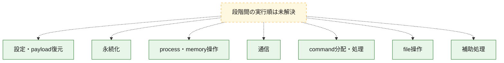
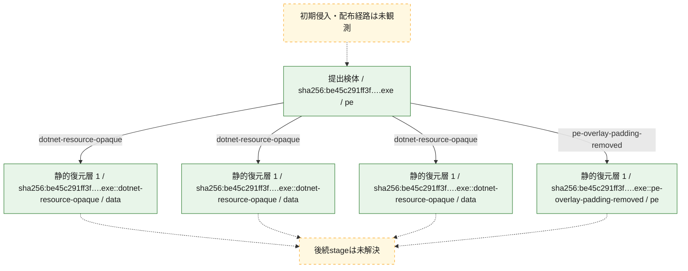
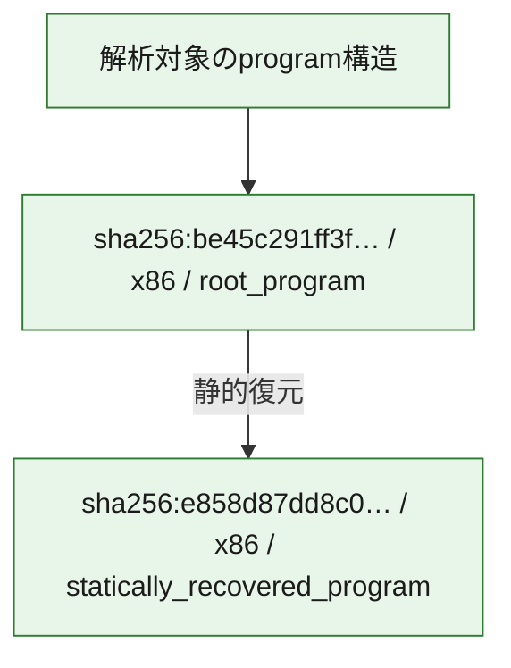

# 全体ロジック：be45c291ff3fb00e54164f8f4dac8b55d6e9ded30f6112bb508f844ce0ce092e

代表関数の静的証跡から、設定・payload復元、永続化、process・memory操作、通信、command分配・処理、file操作の処理群を確認しました。

## 読み方

- phaseの掲載順は解析上の整理順です。observed_call_edgesがない段階間の実行順を断定しません。
- 図の実線は静的に観測した関係、点線と黄色のノードは未観測・未解決の関係を示します。
- 図は静的な要約であり、動的実行を再現するものではありません。
- 詳細な関数解説とfingerprintは[STATIC-LOGIC.md](STATIC-LOGIC.md)を参照してください。

## 静的可視化

### 実行フロー

### 感染チェーン

### モジュール関係

## 処理段階

### 1. 設定・payload復元

設定、resource、payload、暗号化データの復元・変換を確認します。
確度: `confirmed_static_function_evidence`

- `e858d87dd8c098f929d149e695aec5ad3b02e3eefed7c412798edf5f4b1af87e:cil:0x06000124` — 暗号、hash、encoding、または復号処理に関係する関数です。 状態: `succeeded`、選定理由: `large_function:instructions=118`, `reviewed_call_centrality:14`, `role:cryptographic_transform`
- `e858d87dd8c098f929d149e695aec5ad3b02e3eefed7c412798edf5f4b1af87e:cil:0x06000271` — 暗号、hash、encoding、または復号処理に関係する関数です。 状態: `succeeded`、選定理由: `large_function:instructions=92`, `reviewed_call_centrality:10`, `role:cryptographic_transform`
- `e858d87dd8c098f929d149e695aec5ad3b02e3eefed7c412798edf5f4b1af87e:cil:0x060002c3` — 暗号、hash、encoding、または復号処理に関係する関数です。 状態: `succeeded`、選定理由: `large_function:instructions=110`, `reviewed_call_centrality:12`, `role:cryptographic_transform`
- `e858d87dd8c098f929d149e695aec5ad3b02e3eefed7c412798edf5f4b1af87e:cil:0x060002d4` — 暗号、hash、encoding、または復号処理に関係する関数です。 状態: `succeeded`、選定理由: `large_function:instructions=367`, `reviewed_call_centrality:14`, `role:cryptographic_transform`
- `e858d87dd8c098f929d149e695aec5ad3b02e3eefed7c412798edf5f4b1af87e:cil:0x06000304` — 暗号、hash、encoding、または復号処理に関係する関数です。 状態: `succeeded`、選定理由: `large_function:instructions=187`, `reviewed_call_centrality:28`, `role:cryptographic_transform`
- `e858d87dd8c098f929d149e695aec5ad3b02e3eefed7c412798edf5f4b1af87e:cil:0x060004d6` — 暗号、hash、encoding、または復号処理に関係する関数です。 状態: `succeeded`、選定理由: `large_function:instructions=243`, `reviewed_call_centrality:8`, `role:cryptographic_transform`
- `e858d87dd8c098f929d149e695aec5ad3b02e3eefed7c412798edf5f4b1af87e:cil:0x06000518` — 暗号、hash、encoding、または復号処理に関係する関数です。 状態: `succeeded`、選定理由: `reviewed_call_centrality:12`, `role:cryptographic_transform`
- `e858d87dd8c098f929d149e695aec5ad3b02e3eefed7c412798edf5f4b1af87e:cil:0x0600072d` — 暗号、hash、encoding、または復号処理に関係する関数です。 状態: `succeeded`、選定理由: `large_function:instructions=310`, `reviewed_call_centrality:16`, `role:cryptographic_transform`
- `e858d87dd8c098f929d149e695aec5ad3b02e3eefed7c412798edf5f4b1af87e:cil:0x06000877` — 暗号、hash、encoding、または復号処理に関係する関数です。 状態: `succeeded`、選定理由: `large_function:instructions=83`, `reviewed_call_centrality:12`, `role:cryptographic_transform`
- `e858d87dd8c098f929d149e695aec5ad3b02e3eefed7c412798edf5f4b1af87e:cil:0x060009b0` — 暗号、hash、encoding、または復号処理に関係する関数です。 状態: `succeeded`、選定理由: `reviewed_call_centrality:12`, `role:cryptographic_transform`
- `e858d87dd8c098f929d149e695aec5ad3b02e3eefed7c412798edf5f4b1af87e:cil:0x06000c48` — 暗号、hash、encoding、または復号処理に関係する関数です。 状態: `succeeded`、選定理由: `large_function:instructions=39054`, `reviewed_call_centrality:14`, `role:cryptographic_transform`
- `e858d87dd8c098f929d149e695aec5ad3b02e3eefed7c412798edf5f4b1af87e:cil:0x06000c54` — 暗号、hash、encoding、または復号処理に関係する関数です。 状態: `succeeded`、選定理由: `large_function:instructions=1697`, `reviewed_call_centrality:10`, `role:cryptographic_transform`
- `e858d87dd8c098f929d149e695aec5ad3b02e3eefed7c412798edf5f4b1af87e:cil:0x06000de6` — 暗号、hash、encoding、または復号処理に関係する関数です。 状態: `succeeded`、選定理由: `large_function:instructions=99`, `reviewed_call_centrality:16`, `role:cryptographic_transform`
- `e858d87dd8c098f929d149e695aec5ad3b02e3eefed7c412798edf5f4b1af87e:cil:0x06000df7` — 暗号、hash、encoding、または復号処理に関係する関数です。 状態: `succeeded`、選定理由: `large_function:instructions=2328`, `reviewed_call_centrality:102`, `role:cryptographic_transform`
- `e858d87dd8c098f929d149e695aec5ad3b02e3eefed7c412798edf5f4b1af87e:cil:0x06000df8` — 設定、resource、payloadなどの解析・変換を行う関数です。 状態: `succeeded`、選定理由: `large_function:instructions=645`, `reviewed_call_centrality:74`, `role:config_or_data_transform`
- `e858d87dd8c098f929d149e695aec5ad3b02e3eefed7c412798edf5f4b1af87e:cil:0x06000dfb` — 設定、resource、payloadなどの解析・変換を行う関数です。 状態: `succeeded`、選定理由: `large_function:instructions=105`, `reviewed_call_centrality:40`, `role:config_or_data_transform`
- `e858d87dd8c098f929d149e695aec5ad3b02e3eefed7c412798edf5f4b1af87e:cil:0x06000e01` — 暗号、hash、encoding、または復号処理に関係する関数です。 状態: `succeeded`、選定理由: `large_function:instructions=6320`, `reviewed_call_centrality:216`, `role:cryptographic_transform`
- `e858d87dd8c098f929d149e695aec5ad3b02e3eefed7c412798edf5f4b1af87e:cil:0x06000e05` — 暗号、hash、encoding、または復号処理に関係する関数です。 状態: `succeeded`、選定理由: `reviewed_call_centrality:16`, `role:cryptographic_transform`
- `e858d87dd8c098f929d149e695aec5ad3b02e3eefed7c412798edf5f4b1af87e:cil:0x06000e06` — 暗号、hash、encoding、または復号処理に関係する関数です。 状態: `succeeded`、選定理由: `reviewed_call_centrality:16`, `role:cryptographic_transform`
- `e858d87dd8c098f929d149e695aec5ad3b02e3eefed7c412798edf5f4b1af87e:cil:0x06000e07` — 暗号、hash、encoding、または復号処理に関係する関数です。 状態: `succeeded`、選定理由: `reviewed_call_centrality:16`, `role:cryptographic_transform`
- `e858d87dd8c098f929d149e695aec5ad3b02e3eefed7c412798edf5f4b1af87e:cil:0x06000e08` — 暗号、hash、encoding、または復号処理に関係する関数です。 状態: `succeeded`、選定理由: `reviewed_call_centrality:16`, `role:cryptographic_transform`
- `e858d87dd8c098f929d149e695aec5ad3b02e3eefed7c412798edf5f4b1af87e:cil:0x06000e09` — 暗号、hash、encoding、または復号処理に関係する関数です。 状態: `succeeded`、選定理由: `reviewed_call_centrality:16`, `role:cryptographic_transform`
- `e858d87dd8c098f929d149e695aec5ad3b02e3eefed7c412798edf5f4b1af87e:cil:0x06000e0a` — 暗号、hash、encoding、または復号処理に関係する関数です。 状態: `succeeded`、選定理由: `reviewed_call_centrality:16`, `role:cryptographic_transform`
- `e858d87dd8c098f929d149e695aec5ad3b02e3eefed7c412798edf5f4b1af87e:cil:0x06000e0f` — 設定、resource、payloadなどの解析・変換を行う関数です。 状態: `succeeded`、選定理由: `reviewed_call_centrality:22`, `role:config_or_data_transform`
- `e858d87dd8c098f929d149e695aec5ad3b02e3eefed7c412798edf5f4b1af87e:cil:0x06000f0c` — 暗号、hash、encoding、または復号処理に関係する関数です。 状態: `succeeded`、選定理由: `large_function:instructions=3566`, `reviewed_call_centrality:40`, `role:cryptographic_transform`
- `e858d87dd8c098f929d149e695aec5ad3b02e3eefed7c412798edf5f4b1af87e:cil:0x06000f0d` — 設定、resource、payloadなどの解析・変換を行う関数です。 状態: `succeeded`、選定理由: `reviewed_call_centrality:18`, `role:config_or_data_transform`
- `be45c291ff3fb00e54164f8f4dac8b55d6e9ded30f6112bb508f844ce0ce092e:cil:0x06000124` — 暗号、hash、encoding、または復号処理に関係する関数です。 状態: `succeeded`、選定理由: `large_function:instructions=118`, `reviewed_call_centrality:14`, `role:cryptographic_transform`
- `be45c291ff3fb00e54164f8f4dac8b55d6e9ded30f6112bb508f844ce0ce092e:cil:0x06000271` — 暗号、hash、encoding、または復号処理に関係する関数です。 状態: `succeeded`、選定理由: `large_function:instructions=92`, `reviewed_call_centrality:10`, `role:cryptographic_transform`
- `be45c291ff3fb00e54164f8f4dac8b55d6e9ded30f6112bb508f844ce0ce092e:cil:0x060002c3` — 暗号、hash、encoding、または復号処理に関係する関数です。 状態: `succeeded`、選定理由: `large_function:instructions=110`, `reviewed_call_centrality:12`, `role:cryptographic_transform`
- `be45c291ff3fb00e54164f8f4dac8b55d6e9ded30f6112bb508f844ce0ce092e:cil:0x060002d4` — 暗号、hash、encoding、または復号処理に関係する関数です。 状態: `succeeded`、選定理由: `large_function:instructions=367`, `reviewed_call_centrality:14`, `role:cryptographic_transform`
- `be45c291ff3fb00e54164f8f4dac8b55d6e9ded30f6112bb508f844ce0ce092e:cil:0x06000304` — 暗号、hash、encoding、または復号処理に関係する関数です。 状態: `succeeded`、選定理由: `large_function:instructions=187`, `reviewed_call_centrality:28`, `role:cryptographic_transform`
- `be45c291ff3fb00e54164f8f4dac8b55d6e9ded30f6112bb508f844ce0ce092e:cil:0x060004d6` — 暗号、hash、encoding、または復号処理に関係する関数です。 状態: `succeeded`、選定理由: `large_function:instructions=243`, `reviewed_call_centrality:8`, `role:cryptographic_transform`
- `be45c291ff3fb00e54164f8f4dac8b55d6e9ded30f6112bb508f844ce0ce092e:cil:0x06000518` — 暗号、hash、encoding、または復号処理に関係する関数です。 状態: `succeeded`、選定理由: `reviewed_call_centrality:12`, `role:cryptographic_transform`
- `be45c291ff3fb00e54164f8f4dac8b55d6e9ded30f6112bb508f844ce0ce092e:cil:0x0600072d` — 暗号、hash、encoding、または復号処理に関係する関数です。 状態: `succeeded`、選定理由: `large_function:instructions=310`, `reviewed_call_centrality:16`, `role:cryptographic_transform`
- `be45c291ff3fb00e54164f8f4dac8b55d6e9ded30f6112bb508f844ce0ce092e:cil:0x06000877` — 暗号、hash、encoding、または復号処理に関係する関数です。 状態: `succeeded`、選定理由: `large_function:instructions=83`, `reviewed_call_centrality:12`, `role:cryptographic_transform`
- `be45c291ff3fb00e54164f8f4dac8b55d6e9ded30f6112bb508f844ce0ce092e:cil:0x060009b0` — 暗号、hash、encoding、または復号処理に関係する関数です。 状態: `succeeded`、選定理由: `reviewed_call_centrality:12`, `role:cryptographic_transform`
- `be45c291ff3fb00e54164f8f4dac8b55d6e9ded30f6112bb508f844ce0ce092e:cil:0x06000c48` — 暗号、hash、encoding、または復号処理に関係する関数です。 状態: `succeeded`、選定理由: `large_function:instructions=39054`, `reviewed_call_centrality:14`, `role:cryptographic_transform`
- `be45c291ff3fb00e54164f8f4dac8b55d6e9ded30f6112bb508f844ce0ce092e:cil:0x06000c54` — 暗号、hash、encoding、または復号処理に関係する関数です。 状態: `succeeded`、選定理由: `large_function:instructions=1697`, `reviewed_call_centrality:10`, `role:cryptographic_transform`
- `be45c291ff3fb00e54164f8f4dac8b55d6e9ded30f6112bb508f844ce0ce092e:cil:0x06000de6` — 暗号、hash、encoding、または復号処理に関係する関数です。 状態: `succeeded`、選定理由: `large_function:instructions=99`, `reviewed_call_centrality:16`, `role:cryptographic_transform`
- `be45c291ff3fb00e54164f8f4dac8b55d6e9ded30f6112bb508f844ce0ce092e:cil:0x06000df7` — 暗号、hash、encoding、または復号処理に関係する関数です。 状態: `succeeded`、選定理由: `large_function:instructions=2328`, `reviewed_call_centrality:102`, `role:cryptographic_transform`
- `be45c291ff3fb00e54164f8f4dac8b55d6e9ded30f6112bb508f844ce0ce092e:cil:0x06000df8` — 設定、resource、payloadなどの解析・変換を行う関数です。 状態: `succeeded`、選定理由: `large_function:instructions=645`, `reviewed_call_centrality:74`, `role:config_or_data_transform`
- `be45c291ff3fb00e54164f8f4dac8b55d6e9ded30f6112bb508f844ce0ce092e:cil:0x06000dfb` — 設定、resource、payloadなどの解析・変換を行う関数です。 状態: `succeeded`、選定理由: `large_function:instructions=105`, `reviewed_call_centrality:40`, `role:config_or_data_transform`
- `be45c291ff3fb00e54164f8f4dac8b55d6e9ded30f6112bb508f844ce0ce092e:cil:0x06000e01` — 暗号、hash、encoding、または復号処理に関係する関数です。 状態: `succeeded`、選定理由: `large_function:instructions=6320`, `reviewed_call_centrality:216`, `role:cryptographic_transform`
- `be45c291ff3fb00e54164f8f4dac8b55d6e9ded30f6112bb508f844ce0ce092e:cil:0x06000e05` — 暗号、hash、encoding、または復号処理に関係する関数です。 状態: `succeeded`、選定理由: `reviewed_call_centrality:16`, `role:cryptographic_transform`
- `be45c291ff3fb00e54164f8f4dac8b55d6e9ded30f6112bb508f844ce0ce092e:cil:0x06000e06` — 暗号、hash、encoding、または復号処理に関係する関数です。 状態: `succeeded`、選定理由: `reviewed_call_centrality:16`, `role:cryptographic_transform`
- `be45c291ff3fb00e54164f8f4dac8b55d6e9ded30f6112bb508f844ce0ce092e:cil:0x06000e07` — 暗号、hash、encoding、または復号処理に関係する関数です。 状態: `succeeded`、選定理由: `reviewed_call_centrality:16`, `role:cryptographic_transform`
- `be45c291ff3fb00e54164f8f4dac8b55d6e9ded30f6112bb508f844ce0ce092e:cil:0x06000e08` — 暗号、hash、encoding、または復号処理に関係する関数です。 状態: `succeeded`、選定理由: `reviewed_call_centrality:16`, `role:cryptographic_transform`
- `be45c291ff3fb00e54164f8f4dac8b55d6e9ded30f6112bb508f844ce0ce092e:cil:0x06000e09` — 暗号、hash、encoding、または復号処理に関係する関数です。 状態: `succeeded`、選定理由: `reviewed_call_centrality:16`, `role:cryptographic_transform`
- `be45c291ff3fb00e54164f8f4dac8b55d6e9ded30f6112bb508f844ce0ce092e:cil:0x06000e0a` — 暗号、hash、encoding、または復号処理に関係する関数です。 状態: `succeeded`、選定理由: `reviewed_call_centrality:16`, `role:cryptographic_transform`
- `be45c291ff3fb00e54164f8f4dac8b55d6e9ded30f6112bb508f844ce0ce092e:cil:0x06000e0f` — 設定、resource、payloadなどの解析・変換を行う関数です。 状態: `succeeded`、選定理由: `reviewed_call_centrality:22`, `role:config_or_data_transform`
- `be45c291ff3fb00e54164f8f4dac8b55d6e9ded30f6112bb508f844ce0ce092e:cil:0x06000f0c` — 暗号、hash、encoding、または復号処理に関係する関数です。 状態: `succeeded`、選定理由: `large_function:instructions=3566`, `reviewed_call_centrality:40`, `role:cryptographic_transform`
- `be45c291ff3fb00e54164f8f4dac8b55d6e9ded30f6112bb508f844ce0ce092e:cil:0x06000f0d` — 設定、resource、payloadなどの解析・変換を行う関数です。 状態: `succeeded`、選定理由: `reviewed_call_centrality:18`, `role:config_or_data_transform`

### 2. 永続化

自動起動や永続化に関係する設定変更を確認します。
確度: `confirmed_static_function_evidence`

- `e858d87dd8c098f929d149e695aec5ad3b02e3eefed7c412798edf5f4b1af87e:cil:0x06000eb1` — 自動起動または永続化に関係する処理を含む関数です。 状態: `succeeded`、選定理由: `reviewed_call_centrality:2`, `role:persistence`
- `be45c291ff3fb00e54164f8f4dac8b55d6e9ded30f6112bb508f844ce0ce092e:cil:0x06000eb1` — 自動起動または永続化に関係する処理を含む関数です。 状態: `succeeded`、選定理由: `reviewed_call_centrality:2`, `role:persistence`

### 3. process・memory操作

process、thread、module、memory操作と実行移行を確認します。
確度: `confirmed_static_function_evidence`

- `e858d87dd8c098f929d149e695aec5ad3b02e3eefed7c412798edf5f4b1af87e:cil:0x06000e64` — process、thread、module、またはmemory操作に関係する関数です。 状態: `succeeded`、選定理由: `reviewed_call_centrality:2`, `role:process_or_memory_operation`
- `be45c291ff3fb00e54164f8f4dac8b55d6e9ded30f6112bb508f844ce0ce092e:cil:0x06000e64` — process、thread、module、またはmemory操作に関係する関数です。 状態: `succeeded`、選定理由: `reviewed_call_centrality:2`, `role:process_or_memory_operation`

### 4. 通信

通信初期化、endpoint処理、送受信の役割を確認します。
確度: `confirmed_static_function_evidence`

- `e858d87dd8c098f929d149e695aec5ad3b02e3eefed7c412798edf5f4b1af87e:cil:0x0600011b` — 通信初期化、送受信、またはendpoint処理に関係する関数です。 状態: `succeeded`、選定理由: `reviewed_call_centrality:8`, `role:network_communication`
- `be45c291ff3fb00e54164f8f4dac8b55d6e9ded30f6112bb508f844ce0ce092e:cil:0x0600011b` — 通信初期化、送受信、またはendpoint処理に関係する関数です。 状態: `succeeded`、選定理由: `reviewed_call_centrality:8`, `role:network_communication`

### 5. command分配・処理

受信commandやtaskの解釈、分配、個別handlerへの移行を確認します。
確度: `confirmed_static_function_evidence`

- `e858d87dd8c098f929d149e695aec5ad3b02e3eefed7c412798edf5f4b1af87e:cil:0x06000dfd` — commandの解釈、分配、または個別処理を担当する関数です。 状態: `succeeded`、選定理由: `large_function:instructions=118`, `reviewed_call_centrality:20`, `role:command_dispatch_or_handler`
- `be45c291ff3fb00e54164f8f4dac8b55d6e9ded30f6112bb508f844ce0ce092e:cil:0x06000dfd` — commandの解釈、分配、または個別処理を担当する関数です。 状態: `succeeded`、選定理由: `large_function:instructions=118`, `reviewed_call_centrality:20`, `role:command_dispatch_or_handler`

### 6. file操作

fileやdirectoryの作成、読書き、削除を確認します。
確度: `confirmed_static_function_evidence`

- `e858d87dd8c098f929d149e695aec5ad3b02e3eefed7c412798edf5f4b1af87e:cil:0x06000e02` — fileまたはdirectoryの読書き・管理に関係する関数です。 状態: `succeeded`、選定理由: `large_function:instructions=67`, `reviewed_call_centrality:18`, `role:file_operation`
- `be45c291ff3fb00e54164f8f4dac8b55d6e9ded30f6112bb508f844ce0ce092e:cil:0x06000e02` — fileまたはdirectoryの読書き・管理に関係する関数です。 状態: `succeeded`、選定理由: `large_function:instructions=67`, `reviewed_call_centrality:18`, `role:file_operation`

### 7. 補助処理

主要処理を支える一般内部関数またはlibrary処理を確認します。
確度: `confirmed_static_function_evidence`

- `e858d87dd8c098f929d149e695aec5ad3b02e3eefed7c412798edf5f4b1af87e:cil:0x06000c4e` — 検体内部の一般処理を実装する関数です。 状態: `succeeded`、選定理由: `large_function:instructions=1134`, `reviewed_call_centrality:8`
- `be45c291ff3fb00e54164f8f4dac8b55d6e9ded30f6112bb508f844ce0ce092e:cil:0x06000c4e` — 検体内部の一般処理を実装する関数です。 状態: `succeeded`、選定理由: `large_function:instructions=1134`, `reviewed_call_centrality:8`

## 観測したcall関係

- 代表関数間で直接解決できた呼出関係はありません。

## 解析範囲と制約

- 選定外関数は全体inventoryへ残しますが、関数本体の個別解説対象にはしていません。
- indirect call、難読化、packer、VM、壊れたcontrol flowによりcall関係が欠落する場合があります。
- 文書は静的解析に基づき、検体実行や外部通信による動的確認は行っていません。
