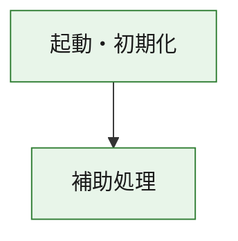
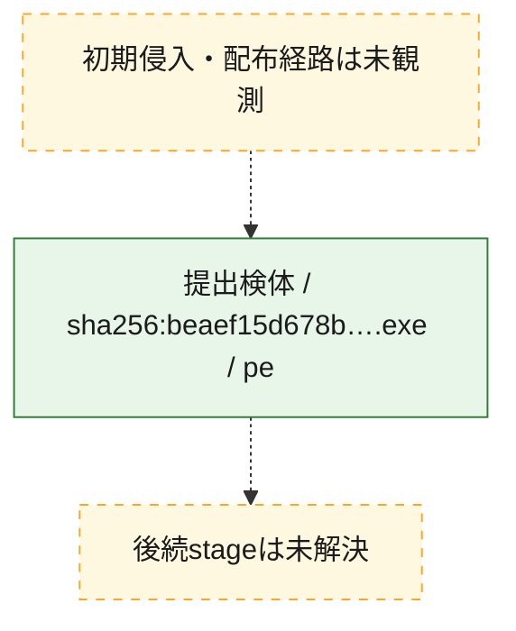
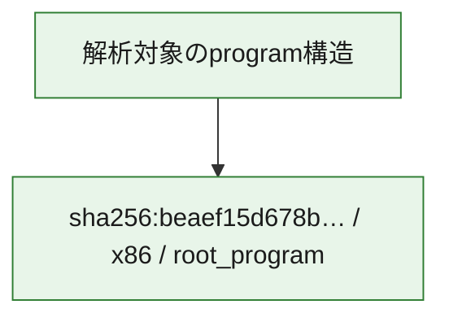

# 全体ロジック：beaef15d678b9f736c71f53c5e9fb88c1e447a54b6367a4c44222ba18c9dde50

代表関数の静的証跡から、起動・初期化の処理群を確認しました。

## 読み方

- phaseの掲載順は解析上の整理順です。observed_call_edgesがない段階間の実行順を断定しません。
- 図の実線は静的に観測した関係、点線と黄色のノードは未観測・未解決の関係を示します。
- 図は静的な要約であり、動的実行を再現するものではありません。
- 詳細な関数解説とfingerprintは[STATIC-LOGIC.md](STATIC-LOGIC.md)を参照してください。

## 静的可視化

### 実行フロー

### 感染チェーン

### モジュール関係

## 処理段階

### 1. 起動・初期化

entry pointから初期化と後続処理への移行を確認します。
確度: `confirmed_static_function_evidence`

- `beaef15d678b9f736c71f53c5e9fb88c1e447a54b6367a4c44222ba18c9dde50:ghidra:180001010` — 初期化と主要処理への分岐を行う入口関数です。 状態: `succeeded`、選定理由: `entry_point`, `meaningful_symbol_name`, `reviewed_call_centrality:22`, `role:entrypoint`, `small_program_complete_context`

### 2. 補助処理

主要処理を支える一般内部関数またはlibrary処理を確認します。
確度: `confirmed_static_function_evidence`

- `beaef15d678b9f736c71f53c5e9fb88c1e447a54b6367a4c44222ba18c9dde50:ghidra:180001240` — 検体内部の一般処理を実装する関数です。 状態: `succeeded`、選定理由: `context_representative`, `reviewed_call_centrality:2`, `small_program_complete_context`
- `beaef15d678b9f736c71f53c5e9fb88c1e447a54b6367a4c44222ba18c9dde50:ghidra:180001350` — 検体内部の一般処理を実装する関数です。 状態: `succeeded`、選定理由: `context_representative`, `reviewed_call_centrality:25`, `small_program_complete_context`
- `beaef15d678b9f736c71f53c5e9fb88c1e447a54b6367a4c44222ba18c9dde50:ghidra:180003780` — 検体内部の一般処理を実装する関数です。 状態: `succeeded`、選定理由: `context_representative`, `reviewed_call_centrality:2`, `small_program_complete_context`
- `beaef15d678b9f736c71f53c5e9fb88c1e447a54b6367a4c44222ba18c9dde50:ghidra:1800038e0` — 検体内部の一般処理を実装する関数です。 状態: `succeeded`、選定理由: `context_representative`, `reviewed_call_centrality:2`, `small_program_complete_context`

## 観測したcall関係

- `beaef15d678b9f736c71f53c5e9fb88c1e447a54b6367a4c44222ba18c9dde50:ghidra:180001010` → `beaef15d678b9f736c71f53c5e9fb88c1e447a54b6367a4c44222ba18c9dde50:ghidra:180001240` （`startup` → `support`）
- `beaef15d678b9f736c71f53c5e9fb88c1e447a54b6367a4c44222ba18c9dde50:ghidra:180001010` → `beaef15d678b9f736c71f53c5e9fb88c1e447a54b6367a4c44222ba18c9dde50:ghidra:180001350` （`startup` → `support`）
- `beaef15d678b9f736c71f53c5e9fb88c1e447a54b6367a4c44222ba18c9dde50:ghidra:180001350` → `beaef15d678b9f736c71f53c5e9fb88c1e447a54b6367a4c44222ba18c9dde50:ghidra:180001240` （`support` → `support`）
- `beaef15d678b9f736c71f53c5e9fb88c1e447a54b6367a4c44222ba18c9dde50:ghidra:180001350` → `beaef15d678b9f736c71f53c5e9fb88c1e447a54b6367a4c44222ba18c9dde50:ghidra:180003780` （`support` → `support`）
- `beaef15d678b9f736c71f53c5e9fb88c1e447a54b6367a4c44222ba18c9dde50:ghidra:180001350` → `beaef15d678b9f736c71f53c5e9fb88c1e447a54b6367a4c44222ba18c9dde50:ghidra:1800038e0` （`support` → `support`）
- `beaef15d678b9f736c71f53c5e9fb88c1e447a54b6367a4c44222ba18c9dde50:ghidra:180003780` → `beaef15d678b9f736c71f53c5e9fb88c1e447a54b6367a4c44222ba18c9dde50:ghidra:1800038e0` （`support` → `support`）
- `ghidra-function:569d257ac0adf69b802f487c` → `ghidra-external:1183a572f9a8df011ed2b23a` （`unclassified` → `unclassified`）
- `ghidra-function:569d257ac0adf69b802f487c` → `ghidra-external:236db28c9aa8d3977f5ef585` （`unclassified` → `unclassified`）
- `ghidra-function:569d257ac0adf69b802f487c` → `ghidra-external:27591d6bea8d3f652241c211` （`unclassified` → `unclassified`）
- `ghidra-function:569d257ac0adf69b802f487c` → `ghidra-external:4d3ee658a459ac1bf1d9b62a` （`unclassified` → `unclassified`）
- `ghidra-function:569d257ac0adf69b802f487c` → `ghidra-external:51f6c751fe81cff8f1910c23` （`unclassified` → `unclassified`）
- `ghidra-function:569d257ac0adf69b802f487c` → `ghidra-external:6ac3bdba5154a87f9f56970b` （`unclassified` → `unclassified`）
- `ghidra-function:569d257ac0adf69b802f487c` → `ghidra-external:7af84936b085110bd66387c4` （`unclassified` → `unclassified`）
- `ghidra-function:569d257ac0adf69b802f487c` → `ghidra-external:81a4557cf0d1c93c11d6c9a7` （`unclassified` → `unclassified`）
- `ghidra-function:569d257ac0adf69b802f487c` → `ghidra-external:91b093fd8a308724ae90771d` （`unclassified` → `unclassified`）
- `ghidra-function:569d257ac0adf69b802f487c` → `ghidra-external:9600dcd26a7003a72916a6e7` （`unclassified` → `unclassified`）
- `ghidra-function:569d257ac0adf69b802f487c` → `ghidra-external:9b20f50e2bd2e8e15285ddd2` （`unclassified` → `unclassified`）
- `ghidra-function:569d257ac0adf69b802f487c` → `ghidra-external:9ce1a535b78960a31ff03fd4` （`unclassified` → `unclassified`）
- `ghidra-function:569d257ac0adf69b802f487c` → `ghidra-external:b7a1ca4829516e3e43d0623e` （`unclassified` → `unclassified`）
- `ghidra-function:569d257ac0adf69b802f487c` → `ghidra-external:bdbb3fdc9220f1b982904f14` （`unclassified` → `unclassified`）
- `ghidra-function:569d257ac0adf69b802f487c` → `ghidra-external:c03b2a84a5a0810e67d3752d` （`unclassified` → `unclassified`）
- `ghidra-function:569d257ac0adf69b802f487c` → `ghidra-external:c07c87e8f19a7d77dbf8ffe0` （`unclassified` → `unclassified`）
- `ghidra-function:569d257ac0adf69b802f487c` → `ghidra-external:c701155ab0b0b020191d667a` （`unclassified` → `unclassified`）
- `ghidra-function:569d257ac0adf69b802f487c` → `ghidra-external:db681b15ad5eb2ef89a6ef6f` （`unclassified` → `unclassified`）
- `ghidra-function:569d257ac0adf69b802f487c` → `ghidra-external:dba174564ce170b058d2bafd` （`unclassified` → `unclassified`）
- `ghidra-function:569d257ac0adf69b802f487c` → `ghidra-external:e84b56ea737013f492987b52` （`unclassified` → `unclassified`）
- `ghidra-function:569d257ac0adf69b802f487c` → `ghidra-external:f2e475fda33df739f0a50df6` （`unclassified` → `unclassified`）
- `ghidra-function:569d257ac0adf69b802f487c` → `ghidra-function:867ebfbe000db7ce736439d5` （`unclassified` → `unclassified`）
- `ghidra-function:569d257ac0adf69b802f487c` → `ghidra-function:9bac1206de34922c7a8becbb` （`unclassified` → `unclassified`）
- `ghidra-function:569d257ac0adf69b802f487c` → `ghidra-function:b32250bd6a553b7735b31d39` （`unclassified` → `unclassified`）
- `ghidra-function:867ebfbe000db7ce736439d5` → `ghidra-function:b32250bd6a553b7735b31d39` （`unclassified` → `unclassified`）
- `ghidra-function:b129f01b1a6493a6039459ba` → `ghidra-function:0cfa6fc5eada3f4e89531b71` （`unclassified` → `unclassified`）
- `ghidra-function:b129f01b1a6493a6039459ba` → `ghidra-function:1edcd31ee673ffb7b787879b` （`unclassified` → `unclassified`）
- `ghidra-function:b129f01b1a6493a6039459ba` → `ghidra-function:569d257ac0adf69b802f487c` （`unclassified` → `unclassified`）
- `ghidra-function:b129f01b1a6493a6039459ba` → `ghidra-function:705a929152f150c3cf1394ae` （`unclassified` → `unclassified`）
- `ghidra-function:b129f01b1a6493a6039459ba` → `ghidra-function:9bac1206de34922c7a8becbb` （`unclassified` → `unclassified`）
- `ghidra-function:b129f01b1a6493a6039459ba` → `ghidra-function:9d1f1bb3ac4f59b67fe29b73` （`unclassified` → `unclassified`）
- `ghidra-function:b129f01b1a6493a6039459ba` → `ghidra-function:ba6598e988053413a1526ee5` （`unclassified` → `unclassified`）
- `ghidra-function:b129f01b1a6493a6039459ba` → `ghidra-function:c6db57d4576ffab57b4ca3ee` （`unclassified` → `unclassified`）
- `ghidra-function:b129f01b1a6493a6039459ba` → `ghidra-function:c9f26f26212fb1f446ee5f13` （`unclassified` → `unclassified`）
- `ghidra-function:b129f01b1a6493a6039459ba` → `ghidra-function:ed712d1c0b0e595bfa5304a0` （`unclassified` → `unclassified`）
- `ghidra-function:b129f01b1a6493a6039459ba` → `ghidra-function:f2a4e364f51e52d9229ce0c8` （`unclassified` → `unclassified`）
- `ghidra-function:b129f01b1a6493a6039459ba` → `ghidra-function:f96592a0b166ded5095bfa78` （`unclassified` → `unclassified`）

## 解析範囲と制約

- 選定外関数は全体inventoryへ残しますが、関数本体の個別解説対象にはしていません。
- indirect call、難読化、packer、VM、壊れたcontrol flowによりcall関係が欠落する場合があります。
- 文書は静的解析に基づき、検体実行や外部通信による動的確認は行っていません。
