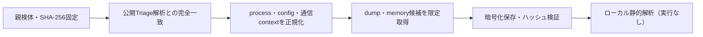

# Triage公開解析・後段取得証跡

## 完全ハッシュ一致

- [260924-yea95szhne](https://tria.ge/260924-yea95szhne): ファミリー候補 `makop`、評価score `10`
- [260921-xhgewsz1hw](https://tria.ge/260921-xhgewsz1hw): ファミリー候補 `makop`、評価score `10`
- [260921-gvm57sca22](https://tria.ge/260921-gvm57sca22): ファミリー候補 `makop`、評価score `10`

## プロセス・通信

- 観測process: `2026-09-21_a46c2214c49c5d0ec5ca1b7e2e5a8c08_elex_makop.exe, NOTEPAD.EXE, OfficeClickToRun.exe, RIED_visual.exe, WMIC.exe, cmd.exe, svchost.exe, vds.exe, vdsldr.exe, vssadmin.exe, vssvc.exe, wbadmin.exe, wbengine.exe`
- raw commandは保存せず、command SHA-256と処理patternだけをJSONへ保持します。
- sandbox background trafficは`context_only`であり、C2へ自動昇格しません。

- 取得できませんでした。

## 後段取得物

- 取得できませんでした。

## 判定境界

Triage由来のfamily、process、config、通信は外部sandbox証跡です。Config extractorが返したendpointはC2候補として扱いますが、静的設定復元またはprocess帰属とprotocol応答が揃うまでは確認済みC2とはしません。取得成果物と検体は実行していません。
