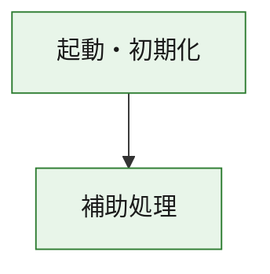
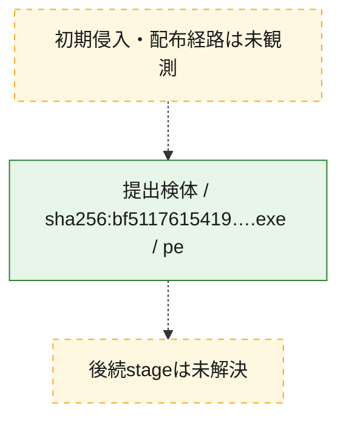
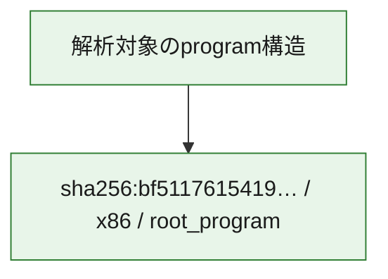

# 全体ロジック：bf5117615419217c0204e509d865dce6ae6539dc7a51cf196134b00a731cf62f

代表関数の静的証跡から、起動・初期化の処理群を確認しました。

## 読み方

- phaseの掲載順は解析上の整理順です。observed_call_edgesがない段階間の実行順を断定しません。
- 図の実線は静的に観測した関係、点線と黄色のノードは未観測・未解決の関係を示します。
- 図は静的な要約であり、動的実行を再現するものではありません。
- 詳細な関数解説とfingerprintは[STATIC-LOGIC.md](STATIC-LOGIC.md)を参照してください。

## 静的可視化

### 実行フロー

### 感染チェーン

### モジュール関係

## 処理段階

### 1. 起動・初期化

entry pointから初期化と後続処理への移行を確認します。
確度: `confirmed_static_function_evidence`

- `bf5117615419217c0204e509d865dce6ae6539dc7a51cf196134b00a731cf62f:ghidra:180001010` — 初期化と主要処理への分岐を行う入口関数です。 状態: `succeeded`、選定理由: `entry_point`, `meaningful_symbol_name`, `reviewed_call_centrality:22`, `role:entrypoint`, `small_program_complete_context`

### 2. 補助処理

主要処理を支える一般内部関数またはlibrary処理を確認します。
確度: `confirmed_static_function_evidence`

- `bf5117615419217c0204e509d865dce6ae6539dc7a51cf196134b00a731cf62f:ghidra:180001240` — 検体内部の一般処理を実装する関数です。 状態: `succeeded`、選定理由: `context_representative`, `reviewed_call_centrality:2`, `small_program_complete_context`
- `bf5117615419217c0204e509d865dce6ae6539dc7a51cf196134b00a731cf62f:ghidra:180001350` — 検体内部の一般処理を実装する関数です。 状態: `succeeded`、選定理由: `context_representative`, `reviewed_call_centrality:25`, `small_program_complete_context`
- `bf5117615419217c0204e509d865dce6ae6539dc7a51cf196134b00a731cf62f:ghidra:180003780` — 検体内部の一般処理を実装する関数です。 状態: `succeeded`、選定理由: `context_representative`, `reviewed_call_centrality:2`, `small_program_complete_context`
- `bf5117615419217c0204e509d865dce6ae6539dc7a51cf196134b00a731cf62f:ghidra:1800038e0` — 検体内部の一般処理を実装する関数です。 状態: `succeeded`、選定理由: `context_representative`, `reviewed_call_centrality:2`, `small_program_complete_context`

## 観測したcall関係

- `bf5117615419217c0204e509d865dce6ae6539dc7a51cf196134b00a731cf62f:ghidra:180001010` → `bf5117615419217c0204e509d865dce6ae6539dc7a51cf196134b00a731cf62f:ghidra:180001240` （`startup` → `support`）
- `bf5117615419217c0204e509d865dce6ae6539dc7a51cf196134b00a731cf62f:ghidra:180001010` → `bf5117615419217c0204e509d865dce6ae6539dc7a51cf196134b00a731cf62f:ghidra:180001350` （`startup` → `support`）
- `bf5117615419217c0204e509d865dce6ae6539dc7a51cf196134b00a731cf62f:ghidra:180001350` → `bf5117615419217c0204e509d865dce6ae6539dc7a51cf196134b00a731cf62f:ghidra:180001240` （`support` → `support`）
- `bf5117615419217c0204e509d865dce6ae6539dc7a51cf196134b00a731cf62f:ghidra:180001350` → `bf5117615419217c0204e509d865dce6ae6539dc7a51cf196134b00a731cf62f:ghidra:180003780` （`support` → `support`）
- `bf5117615419217c0204e509d865dce6ae6539dc7a51cf196134b00a731cf62f:ghidra:180001350` → `bf5117615419217c0204e509d865dce6ae6539dc7a51cf196134b00a731cf62f:ghidra:1800038e0` （`support` → `support`）
- `bf5117615419217c0204e509d865dce6ae6539dc7a51cf196134b00a731cf62f:ghidra:180003780` → `bf5117615419217c0204e509d865dce6ae6539dc7a51cf196134b00a731cf62f:ghidra:1800038e0` （`support` → `support`）
- `ghidra-function:6ebd0c6c18bdba5707a4fe09` → `ghidra-function:23f8609a4835ef92982ee384` （`unclassified` → `unclassified`）
- `ghidra-function:6ebd0c6c18bdba5707a4fe09` → `ghidra-function:2f2e6241fdd3b48df34bedf8` （`unclassified` → `unclassified`）
- `ghidra-function:6ebd0c6c18bdba5707a4fe09` → `ghidra-function:4bc0c11116b33f67334b4bd1` （`unclassified` → `unclassified`）
- `ghidra-function:6ebd0c6c18bdba5707a4fe09` → `ghidra-function:5446e980f380ef6f706b93e7` （`unclassified` → `unclassified`）
- `ghidra-function:6ebd0c6c18bdba5707a4fe09` → `ghidra-function:781a9ae9981d29226614f41a` （`unclassified` → `unclassified`）
- `ghidra-function:6ebd0c6c18bdba5707a4fe09` → `ghidra-function:7a6688884c189443a116a5c3` （`unclassified` → `unclassified`）
- `ghidra-function:6ebd0c6c18bdba5707a4fe09` → `ghidra-function:8d53fd3f7d82de06fafcbd7b` （`unclassified` → `unclassified`）
- `ghidra-function:6ebd0c6c18bdba5707a4fe09` → `ghidra-function:8e819f346aaa48ff71ac4668` （`unclassified` → `unclassified`）
- `ghidra-function:6ebd0c6c18bdba5707a4fe09` → `ghidra-function:a18a30fb379165e87e5c8396` （`unclassified` → `unclassified`）
- `ghidra-function:6ebd0c6c18bdba5707a4fe09` → `ghidra-function:bd52d3981bd354ac4e0944fd` （`unclassified` → `unclassified`）
- `ghidra-function:6ebd0c6c18bdba5707a4fe09` → `ghidra-function:ce5838fe213b9511b620f4e5` （`unclassified` → `unclassified`）
- `ghidra-function:6ebd0c6c18bdba5707a4fe09` → `ghidra-function:da8376bdd63682103e68f94b` （`unclassified` → `unclassified`）
- `ghidra-function:781a9ae9981d29226614f41a` → `ghidra-external:0947fccc2a1b589038879a04` （`unclassified` → `unclassified`）
- `ghidra-function:781a9ae9981d29226614f41a` → `ghidra-external:09f8c1f081b0718663286e0c` （`unclassified` → `unclassified`）
- `ghidra-function:781a9ae9981d29226614f41a` → `ghidra-external:0f0cceb615c8941ff84fb90f` （`unclassified` → `unclassified`）
- `ghidra-function:781a9ae9981d29226614f41a` → `ghidra-external:273ba2d8df97861c9d4f0588` （`unclassified` → `unclassified`）
- `ghidra-function:781a9ae9981d29226614f41a` → `ghidra-external:366d76d4cc190ab414b1d20a` （`unclassified` → `unclassified`）
- `ghidra-function:781a9ae9981d29226614f41a` → `ghidra-external:3a24fda4064e5d022f56f55c` （`unclassified` → `unclassified`）
- `ghidra-function:781a9ae9981d29226614f41a` → `ghidra-external:4f4c6fd2dfc62958ed99d91c` （`unclassified` → `unclassified`）
- `ghidra-function:781a9ae9981d29226614f41a` → `ghidra-external:6c8d88af42937e24011d8d7d` （`unclassified` → `unclassified`）
- `ghidra-function:781a9ae9981d29226614f41a` → `ghidra-external:77421e750c7f304eb6602cac` （`unclassified` → `unclassified`）
- `ghidra-function:781a9ae9981d29226614f41a` → `ghidra-external:a6ac31e2a19b769e5135b5f5` （`unclassified` → `unclassified`）
- `ghidra-function:781a9ae9981d29226614f41a` → `ghidra-external:b41f87dfd379f2ccd60299ef` （`unclassified` → `unclassified`）
- `ghidra-function:781a9ae9981d29226614f41a` → `ghidra-external:b65458926baeaa91a01c54b0` （`unclassified` → `unclassified`）
- `ghidra-function:781a9ae9981d29226614f41a` → `ghidra-external:b6fb952e127439939de25dad` （`unclassified` → `unclassified`）
- `ghidra-function:781a9ae9981d29226614f41a` → `ghidra-external:bbc81e318df35ff7169e9c9c` （`unclassified` → `unclassified`）
- `ghidra-function:781a9ae9981d29226614f41a` → `ghidra-external:c05f80be242353435c2f4772` （`unclassified` → `unclassified`）
- `ghidra-function:781a9ae9981d29226614f41a` → `ghidra-external:e006f89cb46cc30617fa79fe` （`unclassified` → `unclassified`）
- `ghidra-function:781a9ae9981d29226614f41a` → `ghidra-external:e77c77c7514d959b5fe7f218` （`unclassified` → `unclassified`）
- `ghidra-function:781a9ae9981d29226614f41a` → `ghidra-external:ec3ee504c645ba71f501ece5` （`unclassified` → `unclassified`）
- `ghidra-function:781a9ae9981d29226614f41a` → `ghidra-external:ed17f5c5193b6290e4554842` （`unclassified` → `unclassified`）
- `ghidra-function:781a9ae9981d29226614f41a` → `ghidra-external:fdd068cf878a3c16261c6a2a` （`unclassified` → `unclassified`）
- `ghidra-function:781a9ae9981d29226614f41a` → `ghidra-external:ffe4445ea607c0d4f7cfefc1` （`unclassified` → `unclassified`）
- `ghidra-function:781a9ae9981d29226614f41a` → `ghidra-function:7a6688884c189443a116a5c3` （`unclassified` → `unclassified`）
- `ghidra-function:781a9ae9981d29226614f41a` → `ghidra-function:8d9b4439d9060dda14c5b006` （`unclassified` → `unclassified`）
- `ghidra-function:781a9ae9981d29226614f41a` → `ghidra-function:dd536527b4bd62672b272f25` （`unclassified` → `unclassified`）
- `ghidra-function:8d9b4439d9060dda14c5b006` → `ghidra-function:dd536527b4bd62672b272f25` （`unclassified` → `unclassified`）

## 解析範囲と制約

- 選定外関数は全体inventoryへ残しますが、関数本体の個別解説対象にはしていません。
- indirect call、難読化、packer、VM、壊れたcontrol flowによりcall関係が欠落する場合があります。
- 文書は静的解析に基づき、検体実行や外部通信による動的確認は行っていません。
