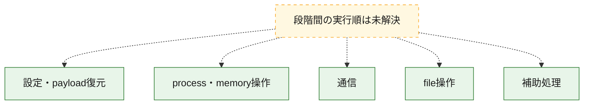
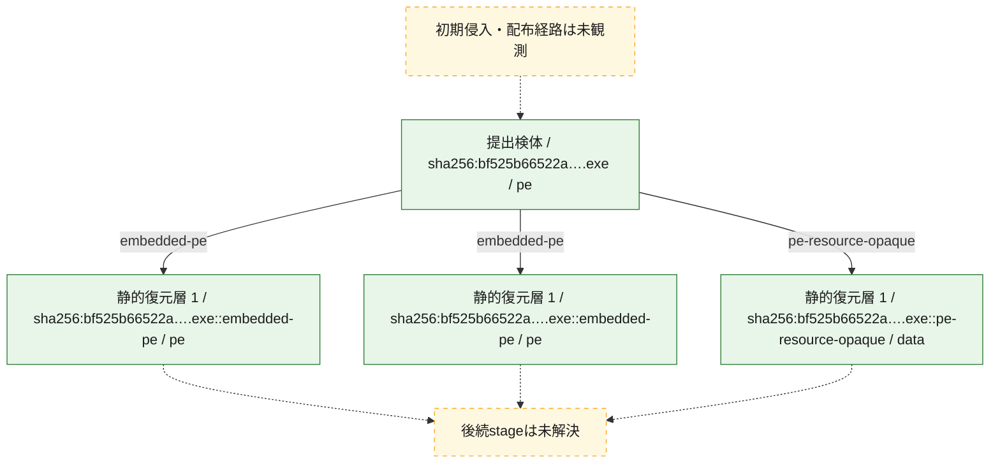
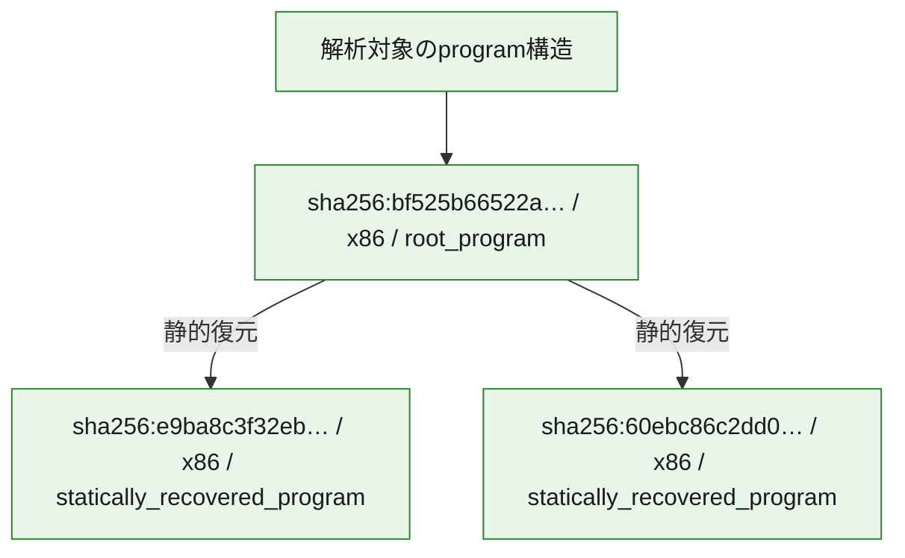

# 全体ロジック：bf525b66522ac13aa81d5390f1cc35f26252bd79b4e8d52828a0ba27ecd67818

代表関数の静的証跡から、設定・payload復元、process・memory操作、通信、file操作の処理群を確認しました。

## 読み方

- phaseの掲載順は解析上の整理順です。observed_call_edgesがない段階間の実行順を断定しません。
- 図の実線は静的に観測した関係、点線と黄色のノードは未観測・未解決の関係を示します。
- 図は静的な要約であり、動的実行を再現するものではありません。
- 詳細な関数解説とfingerprintは[STATIC-LOGIC.md](STATIC-LOGIC.md)を参照してください。

## 静的可視化

### 実行フロー

### 感染チェーン

### モジュール関係

## 処理段階

### 1. 設定・payload復元

設定、resource、payload、暗号化データの復元・変換を確認します。
確度: `confirmed_static_function_evidence_with_limits`

- `60ebc86c2dd03056ad48adc6d2468fd54c548a55d2d305577eb7e079d90ac13f:ghidra:100bb10a` — 暗号、hash、encoding、または復号処理に関係する関数です。 状態: `limited_bad_instruction_or_flow`、選定理由: `meaningful_symbol_name`, `reviewed_call_centrality:1`, `role:cryptographic_transform`, `small_program_complete_context`

### 2. process・memory操作

process、thread、module、memory操作と実行移行を確認します。
確度: `confirmed_static_function_evidence_with_limits`

- `e9ba8c3f32eb58d9320fca9ed797b8fcdfb5d93ad000eb14d3cf5a68dca1e629:ghidra:0044e123` — process、thread、module、またはmemory操作に関係する関数です。 状態: `limited_bad_instruction_or_flow`、選定理由: `meaningful_symbol_name`, `reviewed_call_centrality:1`, `role:process_or_memory_operation`, `small_program_complete_context`
- `bf525b66522ac13aa81d5390f1cc35f26252bd79b4e8d52828a0ba27ecd67818:ghidra:0044e123` — process、thread、module、またはmemory操作に関係する関数です。 状態: `limited_bad_instruction_or_flow`、選定理由: `meaningful_symbol_name`, `reviewed_call_centrality:1`, `role:process_or_memory_operation`, `small_program_complete_context`

### 3. 通信

通信初期化、endpoint処理、送受信の役割を確認します。
確度: `confirmed_static_function_evidence_with_limits`

- `e9ba8c3f32eb58d9320fca9ed797b8fcdfb5d93ad000eb14d3cf5a68dca1e629:ghidra:0044e144` — 通信初期化、送受信、またはendpoint処理に関係する関数です。 状態: `limited_bad_instruction_or_flow`、選定理由: `meaningful_symbol_name`, `reviewed_call_centrality:1`, `role:network_communication`, `small_program_complete_context`
- `e9ba8c3f32eb58d9320fca9ed797b8fcdfb5d93ad000eb14d3cf5a68dca1e629:ghidra:0044e15f` — 通信初期化、送受信、またはendpoint処理に関係する関数です。 状態: `limited_bad_instruction_or_flow`、選定理由: `meaningful_symbol_name`, `reviewed_call_centrality:1`, `role:network_communication`, `small_program_complete_context`
- `e9ba8c3f32eb58d9320fca9ed797b8fcdfb5d93ad000eb14d3cf5a68dca1e629:ghidra:0044e169` — 通信初期化、送受信、またはendpoint処理に関係する関数です。 状態: `limited_bad_instruction_or_flow`、選定理由: `meaningful_symbol_name`, `reviewed_call_centrality:1`, `role:network_communication`, `small_program_complete_context`
- `e9ba8c3f32eb58d9320fca9ed797b8fcdfb5d93ad000eb14d3cf5a68dca1e629:ghidra:0044e173` — 通信初期化、送受信、またはendpoint処理に関係する関数です。 状態: `limited_bad_instruction_or_flow`、選定理由: `meaningful_symbol_name`, `reviewed_call_centrality:1`, `role:network_communication`, `small_program_complete_context`
- `e9ba8c3f32eb58d9320fca9ed797b8fcdfb5d93ad000eb14d3cf5a68dca1e629:ghidra:0044e17d` — 通信初期化、送受信、またはendpoint処理に関係する関数です。 状態: `limited_bad_instruction_or_flow`、選定理由: `meaningful_symbol_name`, `reviewed_call_centrality:1`, `role:network_communication`, `small_program_complete_context`
- `e9ba8c3f32eb58d9320fca9ed797b8fcdfb5d93ad000eb14d3cf5a68dca1e629:ghidra:0044e187` — 通信初期化、送受信、またはendpoint処理に関係する関数です。 状態: `limited_bad_instruction_or_flow`、選定理由: `meaningful_symbol_name`, `reviewed_call_centrality:1`, `role:network_communication`, `small_program_complete_context`
- `e9ba8c3f32eb58d9320fca9ed797b8fcdfb5d93ad000eb14d3cf5a68dca1e629:ghidra:0044e191` — 通信初期化、送受信、またはendpoint処理に関係する関数です。 状態: `limited_bad_instruction_or_flow`、選定理由: `meaningful_symbol_name`, `reviewed_call_centrality:1`, `role:network_communication`, `small_program_complete_context`
- `e9ba8c3f32eb58d9320fca9ed797b8fcdfb5d93ad000eb14d3cf5a68dca1e629:ghidra:0044e19b` — 通信初期化、送受信、またはendpoint処理に関係する関数です。 状態: `limited_bad_instruction_or_flow`、選定理由: `meaningful_symbol_name`, `reviewed_call_centrality:1`, `role:network_communication`, `small_program_complete_context`
- `e9ba8c3f32eb58d9320fca9ed797b8fcdfb5d93ad000eb14d3cf5a68dca1e629:ghidra:0044e1a5` — 通信初期化、送受信、またはendpoint処理に関係する関数です。 状態: `limited_bad_instruction_or_flow`、選定理由: `meaningful_symbol_name`, `reviewed_call_centrality:1`, `role:network_communication`, `small_program_complete_context`
- `e9ba8c3f32eb58d9320fca9ed797b8fcdfb5d93ad000eb14d3cf5a68dca1e629:ghidra:0044e1af` — 通信初期化、送受信、またはendpoint処理に関係する関数です。 状態: `limited_bad_instruction_or_flow`、選定理由: `meaningful_symbol_name`, `reviewed_call_centrality:1`, `role:network_communication`, `small_program_complete_context`
- `e9ba8c3f32eb58d9320fca9ed797b8fcdfb5d93ad000eb14d3cf5a68dca1e629:ghidra:0044e1b9` — 通信初期化、送受信、またはendpoint処理に関係する関数です。 状態: `limited_bad_instruction_or_flow`、選定理由: `meaningful_symbol_name`, `reviewed_call_centrality:1`, `role:network_communication`, `small_program_complete_context`
- `e9ba8c3f32eb58d9320fca9ed797b8fcdfb5d93ad000eb14d3cf5a68dca1e629:ghidra:0044e1c3` — 通信初期化、送受信、またはendpoint処理に関係する関数です。 状態: `limited_bad_instruction_or_flow`、選定理由: `meaningful_symbol_name`, `reviewed_call_centrality:1`, `role:network_communication`, `small_program_complete_context`
- `e9ba8c3f32eb58d9320fca9ed797b8fcdfb5d93ad000eb14d3cf5a68dca1e629:ghidra:0044e1cd` — 通信初期化、送受信、またはendpoint処理に関係する関数です。 状態: `limited_bad_instruction_or_flow`、選定理由: `meaningful_symbol_name`, `reviewed_call_centrality:1`, `role:network_communication`, `small_program_complete_context`
- `e9ba8c3f32eb58d9320fca9ed797b8fcdfb5d93ad000eb14d3cf5a68dca1e629:ghidra:0044e1d7` — 通信初期化、送受信、またはendpoint処理に関係する関数です。 状態: `limited_bad_instruction_or_flow`、選定理由: `meaningful_symbol_name`, `reviewed_call_centrality:1`, `role:network_communication`, `small_program_complete_context`
- `e9ba8c3f32eb58d9320fca9ed797b8fcdfb5d93ad000eb14d3cf5a68dca1e629:ghidra:0044e1e1` — 通信初期化、送受信、またはendpoint処理に関係する関数です。 状態: `limited_bad_instruction_or_flow`、選定理由: `meaningful_symbol_name`, `reviewed_call_centrality:1`, `role:network_communication`, `small_program_complete_context`
- `e9ba8c3f32eb58d9320fca9ed797b8fcdfb5d93ad000eb14d3cf5a68dca1e629:ghidra:0044e1eb` — 通信初期化、送受信、またはendpoint処理に関係する関数です。 状態: `limited_bad_instruction_or_flow`、選定理由: `meaningful_symbol_name`, `reviewed_call_centrality:1`, `role:network_communication`, `small_program_complete_context`
- `60ebc86c2dd03056ad48adc6d2468fd54c548a55d2d305577eb7e079d90ac13f:ghidra:100967b0` — 通信初期化、送受信、またはendpoint処理に関係する関数です。 状態: `limited_bad_instruction_or_flow`、選定理由: `meaningful_symbol_name`, `reviewed_call_centrality:1`, `role:network_communication`, `small_program_complete_context`
- `60ebc86c2dd03056ad48adc6d2468fd54c548a55d2d305577eb7e079d90ac13f:ghidra:100a4c20` — 通信初期化、送受信、またはendpoint処理に関係する関数です。 状態: `limited_bad_instruction_or_flow`、選定理由: `meaningful_symbol_name`, `reviewed_call_centrality:1`, `role:network_communication`, `small_program_complete_context`
- `60ebc86c2dd03056ad48adc6d2468fd54c548a55d2d305577eb7e079d90ac13f:ghidra:100a4c3b` — 通信初期化、送受信、またはendpoint処理に関係する関数です。 状態: `limited_bad_instruction_or_flow`、選定理由: `meaningful_symbol_name`, `reviewed_call_centrality:1`, `role:network_communication`, `small_program_complete_context`
- `60ebc86c2dd03056ad48adc6d2468fd54c548a55d2d305577eb7e079d90ac13f:ghidra:100a4c45` — 通信初期化、送受信、またはendpoint処理に関係する関数です。 状態: `limited_bad_instruction_or_flow`、選定理由: `meaningful_symbol_name`, `reviewed_call_centrality:1`, `role:network_communication`, `small_program_complete_context`
- `60ebc86c2dd03056ad48adc6d2468fd54c548a55d2d305577eb7e079d90ac13f:ghidra:100a4c4f` — 通信初期化、送受信、またはendpoint処理に関係する関数です。 状態: `limited_bad_instruction_or_flow`、選定理由: `meaningful_symbol_name`, `reviewed_call_centrality:1`, `role:network_communication`, `small_program_complete_context`
- `60ebc86c2dd03056ad48adc6d2468fd54c548a55d2d305577eb7e079d90ac13f:ghidra:100a4c59` — 通信初期化、送受信、またはendpoint処理に関係する関数です。 状態: `limited_bad_instruction_or_flow`、選定理由: `meaningful_symbol_name`, `reviewed_call_centrality:1`, `role:network_communication`, `small_program_complete_context`
- `60ebc86c2dd03056ad48adc6d2468fd54c548a55d2d305577eb7e079d90ac13f:ghidra:100a4c63` — 通信初期化、送受信、またはendpoint処理に関係する関数です。 状態: `limited_bad_instruction_or_flow`、選定理由: `meaningful_symbol_name`, `reviewed_call_centrality:1`, `role:network_communication`, `small_program_complete_context`
- `60ebc86c2dd03056ad48adc6d2468fd54c548a55d2d305577eb7e079d90ac13f:ghidra:100a4c6d` — 通信初期化、送受信、またはendpoint処理に関係する関数です。 状態: `limited_bad_instruction_or_flow`、選定理由: `meaningful_symbol_name`, `reviewed_call_centrality:1`, `role:network_communication`, `small_program_complete_context`
- `60ebc86c2dd03056ad48adc6d2468fd54c548a55d2d305577eb7e079d90ac13f:ghidra:100a4c77` — 通信初期化、送受信、またはendpoint処理に関係する関数です。 状態: `limited_bad_instruction_or_flow`、選定理由: `meaningful_symbol_name`, `reviewed_call_centrality:1`, `role:network_communication`, `small_program_complete_context`
- `60ebc86c2dd03056ad48adc6d2468fd54c548a55d2d305577eb7e079d90ac13f:ghidra:100a4c81` — 通信初期化、送受信、またはendpoint処理に関係する関数です。 状態: `limited_bad_instruction_or_flow`、選定理由: `meaningful_symbol_name`, `reviewed_call_centrality:1`, `role:network_communication`, `small_program_complete_context`
- `60ebc86c2dd03056ad48adc6d2468fd54c548a55d2d305577eb7e079d90ac13f:ghidra:100a4c8b` — 通信初期化、送受信、またはendpoint処理に関係する関数です。 状態: `limited_bad_instruction_or_flow`、選定理由: `meaningful_symbol_name`, `reviewed_call_centrality:1`, `role:network_communication`, `small_program_complete_context`
- `60ebc86c2dd03056ad48adc6d2468fd54c548a55d2d305577eb7e079d90ac13f:ghidra:100a4c95` — 通信初期化、送受信、またはendpoint処理に関係する関数です。 状態: `limited_bad_instruction_or_flow`、選定理由: `meaningful_symbol_name`, `reviewed_call_centrality:1`, `role:network_communication`, `small_program_complete_context`
- `60ebc86c2dd03056ad48adc6d2468fd54c548a55d2d305577eb7e079d90ac13f:ghidra:100a4c9f` — 通信初期化、送受信、またはendpoint処理に関係する関数です。 状態: `limited_bad_instruction_or_flow`、選定理由: `meaningful_symbol_name`, `reviewed_call_centrality:1`, `role:network_communication`, `small_program_complete_context`
- `60ebc86c2dd03056ad48adc6d2468fd54c548a55d2d305577eb7e079d90ac13f:ghidra:100a4ca9` — 通信初期化、送受信、またはendpoint処理に関係する関数です。 状態: `limited_bad_instruction_or_flow`、選定理由: `meaningful_symbol_name`, `reviewed_call_centrality:1`, `role:network_communication`, `small_program_complete_context`
- `60ebc86c2dd03056ad48adc6d2468fd54c548a55d2d305577eb7e079d90ac13f:ghidra:100a4cb3` — 通信初期化、送受信、またはendpoint処理に関係する関数です。 状態: `limited_bad_instruction_or_flow`、選定理由: `meaningful_symbol_name`, `reviewed_call_centrality:1`, `role:network_communication`, `small_program_complete_context`
- `60ebc86c2dd03056ad48adc6d2468fd54c548a55d2d305577eb7e079d90ac13f:ghidra:100a4cbd` — 通信初期化、送受信、またはendpoint処理に関係する関数です。 状態: `limited_bad_instruction_or_flow`、選定理由: `meaningful_symbol_name`, `reviewed_call_centrality:1`, `role:network_communication`, `small_program_complete_context`
- `60ebc86c2dd03056ad48adc6d2468fd54c548a55d2d305577eb7e079d90ac13f:ghidra:100a4cc7` — 通信初期化、送受信、またはendpoint処理に関係する関数です。 状態: `limited_bad_instruction_or_flow`、選定理由: `meaningful_symbol_name`, `reviewed_call_centrality:1`, `role:network_communication`, `small_program_complete_context`
- `60ebc86c2dd03056ad48adc6d2468fd54c548a55d2d305577eb7e079d90ac13f:ghidra:100a4cd1` — 通信初期化、送受信、またはendpoint処理に関係する関数です。 状態: `limited_bad_instruction_or_flow`、選定理由: `meaningful_symbol_name`, `reviewed_call_centrality:1`, `role:network_communication`, `small_program_complete_context`
- `bf525b66522ac13aa81d5390f1cc35f26252bd79b4e8d52828a0ba27ecd67818:ghidra:0044e144` — 通信初期化、送受信、またはendpoint処理に関係する関数です。 状態: `limited_bad_instruction_or_flow`、選定理由: `meaningful_symbol_name`, `reviewed_call_centrality:1`, `role:network_communication`, `small_program_complete_context`
- `bf525b66522ac13aa81d5390f1cc35f26252bd79b4e8d52828a0ba27ecd67818:ghidra:0044e15f` — 通信初期化、送受信、またはendpoint処理に関係する関数です。 状態: `limited_bad_instruction_or_flow`、選定理由: `meaningful_symbol_name`, `reviewed_call_centrality:1`, `role:network_communication`, `small_program_complete_context`
- `bf525b66522ac13aa81d5390f1cc35f26252bd79b4e8d52828a0ba27ecd67818:ghidra:0044e169` — 通信初期化、送受信、またはendpoint処理に関係する関数です。 状態: `limited_bad_instruction_or_flow`、選定理由: `meaningful_symbol_name`, `reviewed_call_centrality:1`, `role:network_communication`, `small_program_complete_context`
- `bf525b66522ac13aa81d5390f1cc35f26252bd79b4e8d52828a0ba27ecd67818:ghidra:0044e173` — 通信初期化、送受信、またはendpoint処理に関係する関数です。 状態: `limited_bad_instruction_or_flow`、選定理由: `meaningful_symbol_name`, `reviewed_call_centrality:1`, `role:network_communication`, `small_program_complete_context`
- `bf525b66522ac13aa81d5390f1cc35f26252bd79b4e8d52828a0ba27ecd67818:ghidra:0044e17d` — 通信初期化、送受信、またはendpoint処理に関係する関数です。 状態: `limited_bad_instruction_or_flow`、選定理由: `meaningful_symbol_name`, `reviewed_call_centrality:1`, `role:network_communication`, `small_program_complete_context`
- `bf525b66522ac13aa81d5390f1cc35f26252bd79b4e8d52828a0ba27ecd67818:ghidra:0044e187` — 通信初期化、送受信、またはendpoint処理に関係する関数です。 状態: `limited_bad_instruction_or_flow`、選定理由: `meaningful_symbol_name`, `reviewed_call_centrality:1`, `role:network_communication`, `small_program_complete_context`
- `bf525b66522ac13aa81d5390f1cc35f26252bd79b4e8d52828a0ba27ecd67818:ghidra:0044e191` — 通信初期化、送受信、またはendpoint処理に関係する関数です。 状態: `limited_bad_instruction_or_flow`、選定理由: `meaningful_symbol_name`, `reviewed_call_centrality:1`, `role:network_communication`, `small_program_complete_context`
- `bf525b66522ac13aa81d5390f1cc35f26252bd79b4e8d52828a0ba27ecd67818:ghidra:0044e19b` — 通信初期化、送受信、またはendpoint処理に関係する関数です。 状態: `limited_bad_instruction_or_flow`、選定理由: `meaningful_symbol_name`, `reviewed_call_centrality:1`, `role:network_communication`, `small_program_complete_context`
- `bf525b66522ac13aa81d5390f1cc35f26252bd79b4e8d52828a0ba27ecd67818:ghidra:0044e1a5` — 通信初期化、送受信、またはendpoint処理に関係する関数です。 状態: `limited_bad_instruction_or_flow`、選定理由: `meaningful_symbol_name`, `reviewed_call_centrality:1`, `role:network_communication`, `small_program_complete_context`
- `bf525b66522ac13aa81d5390f1cc35f26252bd79b4e8d52828a0ba27ecd67818:ghidra:0044e1af` — 通信初期化、送受信、またはendpoint処理に関係する関数です。 状態: `limited_bad_instruction_or_flow`、選定理由: `meaningful_symbol_name`, `reviewed_call_centrality:1`, `role:network_communication`, `small_program_complete_context`
- `bf525b66522ac13aa81d5390f1cc35f26252bd79b4e8d52828a0ba27ecd67818:ghidra:0044e1b9` — 通信初期化、送受信、またはendpoint処理に関係する関数です。 状態: `limited_bad_instruction_or_flow`、選定理由: `meaningful_symbol_name`, `reviewed_call_centrality:1`, `role:network_communication`, `small_program_complete_context`
- `bf525b66522ac13aa81d5390f1cc35f26252bd79b4e8d52828a0ba27ecd67818:ghidra:0044e1c3` — 通信初期化、送受信、またはendpoint処理に関係する関数です。 状態: `limited_bad_instruction_or_flow`、選定理由: `meaningful_symbol_name`, `reviewed_call_centrality:1`, `role:network_communication`, `small_program_complete_context`
- `bf525b66522ac13aa81d5390f1cc35f26252bd79b4e8d52828a0ba27ecd67818:ghidra:0044e1cd` — 通信初期化、送受信、またはendpoint処理に関係する関数です。 状態: `limited_bad_instruction_or_flow`、選定理由: `meaningful_symbol_name`, `reviewed_call_centrality:1`, `role:network_communication`, `small_program_complete_context`
- `bf525b66522ac13aa81d5390f1cc35f26252bd79b4e8d52828a0ba27ecd67818:ghidra:0044e1d7` — 通信初期化、送受信、またはendpoint処理に関係する関数です。 状態: `limited_bad_instruction_or_flow`、選定理由: `meaningful_symbol_name`, `reviewed_call_centrality:1`, `role:network_communication`, `small_program_complete_context`
- `bf525b66522ac13aa81d5390f1cc35f26252bd79b4e8d52828a0ba27ecd67818:ghidra:0044e1e1` — 通信初期化、送受信、またはendpoint処理に関係する関数です。 状態: `limited_bad_instruction_or_flow`、選定理由: `meaningful_symbol_name`, `reviewed_call_centrality:1`, `role:network_communication`, `small_program_complete_context`
- `bf525b66522ac13aa81d5390f1cc35f26252bd79b4e8d52828a0ba27ecd67818:ghidra:0044e1eb` — 通信初期化、送受信、またはendpoint処理に関係する関数です。 状態: `limited_bad_instruction_or_flow`、選定理由: `meaningful_symbol_name`, `reviewed_call_centrality:1`, `role:network_communication`, `small_program_complete_context`

### 4. file操作

fileやdirectoryの作成、読書き、削除を確認します。
確度: `confirmed_static_function_evidence_with_limits`

- `e9ba8c3f32eb58d9320fca9ed797b8fcdfb5d93ad000eb14d3cf5a68dca1e629:ghidra:004307c8` — fileまたはdirectoryの読書き・管理に関係する関数です。 状態: `limited_bad_instruction_or_flow`、選定理由: `meaningful_symbol_name`, `reviewed_call_centrality:1`, `role:file_operation`, `small_program_complete_context`
- `e9ba8c3f32eb58d9320fca9ed797b8fcdfb5d93ad000eb14d3cf5a68dca1e629:ghidra:004307e9` — fileまたはdirectoryの読書き・管理に関係する関数です。 状態: `limited_bad_instruction_or_flow`、選定理由: `meaningful_symbol_name`, `reviewed_call_centrality:1`, `role:file_operation`, `small_program_complete_context`
- `e9ba8c3f32eb58d9320fca9ed797b8fcdfb5d93ad000eb14d3cf5a68dca1e629:ghidra:0043082a` — fileまたはdirectoryの読書き・管理に関係する関数です。 状態: `limited_bad_instruction_or_flow`、選定理由: `meaningful_symbol_name`, `reviewed_call_centrality:1`, `role:file_operation`, `small_program_complete_context`
- `60ebc86c2dd03056ad48adc6d2468fd54c548a55d2d305577eb7e079d90ac13f:ghidra:100b8ebe` — fileまたはdirectoryの読書き・管理に関係する関数です。 状態: `limited_bad_instruction_or_flow`、選定理由: `meaningful_symbol_name`, `reviewed_call_centrality:1`, `role:file_operation`, `small_program_complete_context`
- `60ebc86c2dd03056ad48adc6d2468fd54c548a55d2d305577eb7e079d90ac13f:ghidra:100b8edf` — fileまたはdirectoryの読書き・管理に関係する関数です。 状態: `limited_bad_instruction_or_flow`、選定理由: `meaningful_symbol_name`, `reviewed_call_centrality:1`, `role:file_operation`, `small_program_complete_context`
- `bf525b66522ac13aa81d5390f1cc35f26252bd79b4e8d52828a0ba27ecd67818:ghidra:004307c8` — fileまたはdirectoryの読書き・管理に関係する関数です。 状態: `limited_bad_instruction_or_flow`、選定理由: `meaningful_symbol_name`, `reviewed_call_centrality:1`, `role:file_operation`, `small_program_complete_context`
- `bf525b66522ac13aa81d5390f1cc35f26252bd79b4e8d52828a0ba27ecd67818:ghidra:004307e9` — fileまたはdirectoryの読書き・管理に関係する関数です。 状態: `limited_bad_instruction_or_flow`、選定理由: `meaningful_symbol_name`, `reviewed_call_centrality:1`, `role:file_operation`, `small_program_complete_context`
- `bf525b66522ac13aa81d5390f1cc35f26252bd79b4e8d52828a0ba27ecd67818:ghidra:0043082a` — fileまたはdirectoryの読書き・管理に関係する関数です。 状態: `limited_bad_instruction_or_flow`、選定理由: `meaningful_symbol_name`, `reviewed_call_centrality:1`, `role:file_operation`, `small_program_complete_context`

### 5. 補助処理

主要処理を支える一般内部関数またはlibrary処理を確認します。
確度: `confirmed_static_function_evidence_with_limits`

- `e9ba8c3f32eb58d9320fca9ed797b8fcdfb5d93ad000eb14d3cf5a68dca1e629:ghidra:004307f9` — 検体内部の一般処理を実装する関数です。 状態: `limited_bad_instruction_or_flow`、選定理由: `meaningful_symbol_name`, `reviewed_call_centrality:1`, `small_program_complete_context`
- `e9ba8c3f32eb58d9320fca9ed797b8fcdfb5d93ad000eb14d3cf5a68dca1e629:ghidra:00430809` — 検体内部の一般処理を実装する関数です。 状態: `limited_bad_instruction_or_flow`、選定理由: `meaningful_symbol_name`, `reviewed_call_centrality:1`, `small_program_complete_context`
- `e9ba8c3f32eb58d9320fca9ed797b8fcdfb5d93ad000eb14d3cf5a68dca1e629:ghidra:0043083a` — 検体内部の一般処理を実装する関数です。 状態: `limited_bad_instruction_or_flow`、選定理由: `meaningful_symbol_name`, `reviewed_call_centrality:1`, `small_program_complete_context`
- `e9ba8c3f32eb58d9320fca9ed797b8fcdfb5d93ad000eb14d3cf5a68dca1e629:ghidra:0043084a` — 検体内部の一般処理を実装する関数です。 状態: `limited_bad_instruction_or_flow`、選定理由: `meaningful_symbol_name`, `reviewed_call_centrality:1`, `small_program_complete_context`
- `e9ba8c3f32eb58d9320fca9ed797b8fcdfb5d93ad000eb14d3cf5a68dca1e629:ghidra:0043086b` — 検体内部の一般処理を実装する関数です。 状態: `limited_bad_instruction_or_flow`、選定理由: `meaningful_symbol_name`, `reviewed_call_centrality:1`, `small_program_complete_context`
- `e9ba8c3f32eb58d9320fca9ed797b8fcdfb5d93ad000eb14d3cf5a68dca1e629:ghidra:0043087b` — 検体内部の一般処理を実装する関数です。 状態: `limited_bad_instruction_or_flow`、選定理由: `meaningful_symbol_name`, `reviewed_call_centrality:1`, `small_program_complete_context`
- `e9ba8c3f32eb58d9320fca9ed797b8fcdfb5d93ad000eb14d3cf5a68dca1e629:ghidra:0043088b` — 検体内部の一般処理を実装する関数です。 状態: `limited_bad_instruction_or_flow`、選定理由: `meaningful_symbol_name`, `reviewed_call_centrality:1`, `small_program_complete_context`
- `e9ba8c3f32eb58d9320fca9ed797b8fcdfb5d93ad000eb14d3cf5a68dca1e629:ghidra:0043089b` — 検体内部の一般処理を実装する関数です。 状態: `limited_bad_instruction_or_flow`、選定理由: `meaningful_symbol_name`, `reviewed_call_centrality:1`, `small_program_complete_context`
- `e9ba8c3f32eb58d9320fca9ed797b8fcdfb5d93ad000eb14d3cf5a68dca1e629:ghidra:0045f0db` — 検体内部の一般処理を実装する関数です。 状態: `limited_bad_instruction_or_flow`、選定理由: `meaningful_symbol_name`, `reviewed_call_centrality:1`, `small_program_complete_context`
- `60ebc86c2dd03056ad48adc6d2468fd54c548a55d2d305577eb7e079d90ac13f:ghidra:100967cb` — 検体内部の一般処理を実装する関数です。 状態: `limited_bad_instruction_or_flow`、選定理由: `meaningful_symbol_name`, `reviewed_call_centrality:1`, `small_program_complete_context`
- `60ebc86c2dd03056ad48adc6d2468fd54c548a55d2d305577eb7e079d90ac13f:ghidra:100b8eef` — 検体内部の一般処理を実装する関数です。 状態: `limited_bad_instruction_or_flow`、選定理由: `meaningful_symbol_name`, `reviewed_call_centrality:1`, `small_program_complete_context`
- `60ebc86c2dd03056ad48adc6d2468fd54c548a55d2d305577eb7e079d90ac13f:ghidra:100bb0c4` — 検体内部の一般処理を実装する関数です。 状態: `limited_bad_instruction_or_flow`、選定理由: `meaningful_symbol_name`, `reviewed_call_centrality:1`, `small_program_complete_context`
- `60ebc86c2dd03056ad48adc6d2468fd54c548a55d2d305577eb7e079d90ac13f:ghidra:100bb0ce` — 検体内部の一般処理を実装する関数です。 状態: `limited_bad_instruction_or_flow`、選定理由: `meaningful_symbol_name`, `reviewed_call_centrality:1`, `small_program_complete_context`
- `60ebc86c2dd03056ad48adc6d2468fd54c548a55d2d305577eb7e079d90ac13f:ghidra:100bb0d8` — 検体内部の一般処理を実装する関数です。 状態: `limited_bad_instruction_or_flow`、選定理由: `meaningful_symbol_name`, `reviewed_call_centrality:1`, `small_program_complete_context`
- `60ebc86c2dd03056ad48adc6d2468fd54c548a55d2d305577eb7e079d90ac13f:ghidra:100bb0e2` — 検体内部の一般処理を実装する関数です。 状態: `limited_bad_instruction_or_flow`、選定理由: `meaningful_symbol_name`, `reviewed_call_centrality:1`, `small_program_complete_context`
- `60ebc86c2dd03056ad48adc6d2468fd54c548a55d2d305577eb7e079d90ac13f:ghidra:100bb0ec` — 検体内部の一般処理を実装する関数です。 状態: `limited_bad_instruction_or_flow`、選定理由: `meaningful_symbol_name`, `reviewed_call_centrality:1`, `small_program_complete_context`
- `60ebc86c2dd03056ad48adc6d2468fd54c548a55d2d305577eb7e079d90ac13f:ghidra:100bb0f6` — 検体内部の一般処理を実装する関数です。 状態: `limited_bad_instruction_or_flow`、選定理由: `meaningful_symbol_name`, `reviewed_call_centrality:1`, `small_program_complete_context`
- `60ebc86c2dd03056ad48adc6d2468fd54c548a55d2d305577eb7e079d90ac13f:ghidra:100bb100` — 検体内部の一般処理を実装する関数です。 状態: `limited_bad_instruction_or_flow`、選定理由: `meaningful_symbol_name`, `reviewed_call_centrality:1`, `small_program_complete_context`
- `bf525b66522ac13aa81d5390f1cc35f26252bd79b4e8d52828a0ba27ecd67818:ghidra:004307f9` — 検体内部の一般処理を実装する関数です。 状態: `limited_bad_instruction_or_flow`、選定理由: `meaningful_symbol_name`, `reviewed_call_centrality:1`, `small_program_complete_context`
- `bf525b66522ac13aa81d5390f1cc35f26252bd79b4e8d52828a0ba27ecd67818:ghidra:00430809` — 検体内部の一般処理を実装する関数です。 状態: `limited_bad_instruction_or_flow`、選定理由: `meaningful_symbol_name`, `reviewed_call_centrality:1`, `small_program_complete_context`
- `bf525b66522ac13aa81d5390f1cc35f26252bd79b4e8d52828a0ba27ecd67818:ghidra:0043083a` — 検体内部の一般処理を実装する関数です。 状態: `limited_bad_instruction_or_flow`、選定理由: `meaningful_symbol_name`, `reviewed_call_centrality:1`, `small_program_complete_context`
- `bf525b66522ac13aa81d5390f1cc35f26252bd79b4e8d52828a0ba27ecd67818:ghidra:0043084a` — 検体内部の一般処理を実装する関数です。 状態: `limited_bad_instruction_or_flow`、選定理由: `meaningful_symbol_name`, `reviewed_call_centrality:1`, `small_program_complete_context`
- `bf525b66522ac13aa81d5390f1cc35f26252bd79b4e8d52828a0ba27ecd67818:ghidra:0043086b` — 検体内部の一般処理を実装する関数です。 状態: `limited_bad_instruction_or_flow`、選定理由: `meaningful_symbol_name`, `reviewed_call_centrality:1`, `small_program_complete_context`
- `bf525b66522ac13aa81d5390f1cc35f26252bd79b4e8d52828a0ba27ecd67818:ghidra:0043087b` — 検体内部の一般処理を実装する関数です。 状態: `limited_bad_instruction_or_flow`、選定理由: `meaningful_symbol_name`, `reviewed_call_centrality:1`, `small_program_complete_context`
- `bf525b66522ac13aa81d5390f1cc35f26252bd79b4e8d52828a0ba27ecd67818:ghidra:0043088b` — 検体内部の一般処理を実装する関数です。 状態: `limited_bad_instruction_or_flow`、選定理由: `meaningful_symbol_name`, `reviewed_call_centrality:1`, `small_program_complete_context`
- `bf525b66522ac13aa81d5390f1cc35f26252bd79b4e8d52828a0ba27ecd67818:ghidra:0043089b` — 検体内部の一般処理を実装する関数です。 状態: `limited_bad_instruction_or_flow`、選定理由: `meaningful_symbol_name`, `reviewed_call_centrality:1`, `small_program_complete_context`
- `bf525b66522ac13aa81d5390f1cc35f26252bd79b4e8d52828a0ba27ecd67818:ghidra:0045f0db` — 検体内部の一般処理を実装する関数です。 状態: `limited_bad_instruction_or_flow`、選定理由: `meaningful_symbol_name`, `reviewed_call_centrality:1`, `small_program_complete_context`

## 観測したcall関係

- 代表関数間で直接解決できた呼出関係はありません。

## 解析範囲と制約

- 選定外関数は全体inventoryへ残しますが、関数本体の個別解説対象にはしていません。
- indirect call、難読化、packer、VM、壊れたcontrol flowによりcall関係が欠落する場合があります。
- 文書は静的解析に基づき、検体実行や外部通信による動的確認は行っていません。
