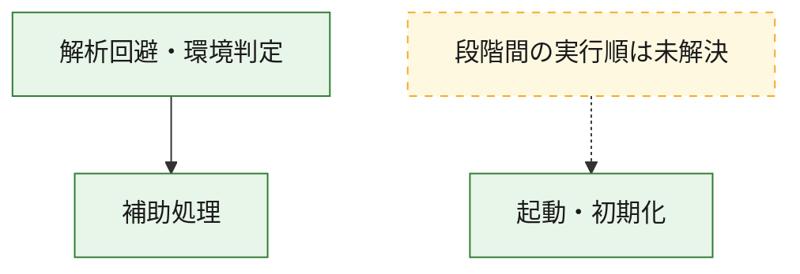
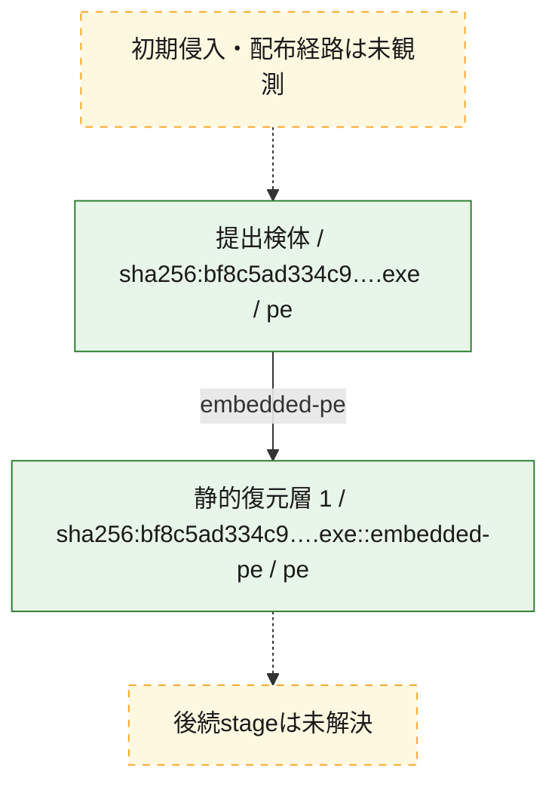
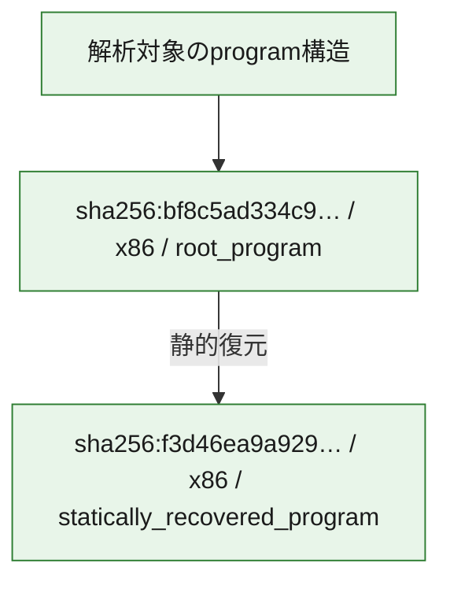

# 全体ロジック：bf8c5ad334c9b4a8dfb7eab8e33e4869e275ababc2f042efa74fe4514ba9eb26

代表関数の静的証跡から、起動・初期化、解析回避・環境判定の処理群を確認しました。

## 読み方

- phaseの掲載順は解析上の整理順です。observed_call_edgesがない段階間の実行順を断定しません。
- 図の実線は静的に観測した関係、点線と黄色のノードは未観測・未解決の関係を示します。
- 図は静的な要約であり、動的実行を再現するものではありません。
- 詳細な関数解説とfingerprintは[STATIC-LOGIC.md](STATIC-LOGIC.md)を参照してください。

## 静的可視化

### 実行フロー

### 感染チェーン

### モジュール関係

## 処理段階

### 1. 起動・初期化

entry pointから初期化と後続処理への移行を確認します。
確度: `confirmed_static_function_evidence`

- `f3d46ea9a929303f73694719ea9ec9f7e349feeacc5a194fab80818769492bb0:ghidra:180001320` — 初期化と主要処理への分岐を行う入口関数です。 状態: `succeeded`、選定理由: `entry_point`, `meaningful_symbol_name`, `reviewed_call_centrality:5`, `role:entrypoint`
- `f3d46ea9a929303f73694719ea9ec9f7e349feeacc5a194fab80818769492bb0:ghidra:180001350` — 初期化と主要処理への分岐を行う入口関数です。 状態: `succeeded`、選定理由: `entry_point`, `meaningful_symbol_name`, `reviewed_call_centrality:6`, `role:entrypoint`
- `bf8c5ad334c9b4a8dfb7eab8e33e4869e275ababc2f042efa74fe4514ba9eb26:ghidra:1400013d0` — 初期化と主要処理への分岐を行う入口関数です。 状態: `succeeded`、選定理由: `entry_point`, `meaningful_symbol_name`, `reviewed_call_centrality:1`, `role:entrypoint`

### 2. 解析回避・環境判定

debugger、sandbox、仮想環境、時間差などの判定を確認します。
確度: `confirmed_static_function_evidence`

- `f3d46ea9a929303f73694719ea9ec9f7e349feeacc5a194fab80818769492bb0:ghidra:180001010` — debugger、仮想環境、sandbox、または時間差の確認に関係する関数です。 状態: `succeeded`、選定理由: `context_representative`, `reviewed_call_centrality:10`, `role:anti_analysis`
- `bf8c5ad334c9b4a8dfb7eab8e33e4869e275ababc2f042efa74fe4514ba9eb26:ghidra:140001180` — debugger、仮想環境、sandbox、または時間差の確認に関係する関数です。 状態: `succeeded`、選定理由: `context_representative`, `reviewed_call_centrality:21`, `role:anti_analysis`

### 3. 補助処理

主要処理を支える一般内部関数またはlibrary処理を確認します。
確度: `confirmed_static_function_evidence_with_limits`

- `f3d46ea9a929303f73694719ea9ec9f7e349feeacc5a194fab80818769492bb0:ghidra:180001000` — 検体内部の一般処理を実装する関数です。 状態: `succeeded`、選定理由: `context_representative`, `reviewed_call_centrality:1`
- `f3d46ea9a929303f73694719ea9ec9f7e349feeacc5a194fab80818769492bb0:ghidra:1800011d0` — 検体内部の一般処理を実装する関数です。 状態: `succeeded`、選定理由: `context_representative`, `reviewed_call_centrality:5`
- `f3d46ea9a929303f73694719ea9ec9f7e349feeacc5a194fab80818769492bb0:ghidra:180001340` — 検体内部の一般処理を実装する関数です。 状態: `succeeded`、選定理由: `context_representative`, `reviewed_call_centrality:4`
- `f3d46ea9a929303f73694719ea9ec9f7e349feeacc5a194fab80818769492bb0:ghidra:1800013c8` — 検体内部の一般処理を実装する関数です。 状態: `succeeded`、選定理由: `context_representative`, `reviewed_call_centrality:2`
- `f3d46ea9a929303f73694719ea9ec9f7e349feeacc5a194fab80818769492bb0:ghidra:1800013f9` — 検体内部の一般処理を実装する関数です。 状態: `succeeded`、選定理由: `context_representative`, `reviewed_call_centrality:3`
- `f3d46ea9a929303f73694719ea9ec9f7e349feeacc5a194fab80818769492bb0:ghidra:180001442` — 検体内部の一般処理を実装する関数です。 状態: `succeeded`、選定理由: `context_representative`, `reviewed_call_centrality:5`
- `f3d46ea9a929303f73694719ea9ec9f7e349feeacc5a194fab80818769492bb0:ghidra:1800014e2` — 検体内部の一般処理を実装する関数です。 状態: `succeeded`、選定理由: `context_representative`, `reviewed_call_centrality:2`
- `f3d46ea9a929303f73694719ea9ec9f7e349feeacc5a194fab80818769492bb0:ghidra:18000168b` — 検体内部の一般処理を実装する関数です。 状態: `limited_bad_instruction_or_flow`、選定理由: `context_representative`, `reviewed_call_centrality:5`
- `f3d46ea9a929303f73694719ea9ec9f7e349feeacc5a194fab80818769492bb0:ghidra:1800016f3` — 検体内部の一般処理を実装する関数です。 状態: `succeeded`、選定理由: `context_representative`, `reviewed_call_centrality:5`
- `f3d46ea9a929303f73694719ea9ec9f7e349feeacc5a194fab80818769492bb0:ghidra:1800017e2` — 検体内部の一般処理を実装する関数です。 状態: `succeeded`、選定理由: `context_representative`, `reviewed_call_centrality:6`
- `f3d46ea9a929303f73694719ea9ec9f7e349feeacc5a194fab80818769492bb0:ghidra:180001830` — 検体内部の一般処理を実装する関数です。 状態: `succeeded`、選定理由: `context_representative`, `reviewed_call_centrality:7`
- `f3d46ea9a929303f73694719ea9ec9f7e349feeacc5a194fab80818769492bb0:ghidra:180001964` — 検体内部の一般処理を実装する関数です。 状態: `succeeded`、選定理由: `context_representative`, `reviewed_call_centrality:7`
- `f3d46ea9a929303f73694719ea9ec9f7e349feeacc5a194fab80818769492bb0:ghidra:180001a9a` — 検体内部の一般処理を実装する関数です。 状態: `succeeded`、選定理由: `context_representative`, `reviewed_call_centrality:47`
- `f3d46ea9a929303f73694719ea9ec9f7e349feeacc5a194fab80818769492bb0:ghidra:1800033ba` — 検体内部の一般処理を実装する関数です。 状態: `succeeded`、選定理由: `context_representative`, `reviewed_call_centrality:6`
- `f3d46ea9a929303f73694719ea9ec9f7e349feeacc5a194fab80818769492bb0:ghidra:1800034d1` — 検体内部の一般処理を実装する関数です。 状態: `succeeded`、選定理由: `context_representative`, `reviewed_call_centrality:3`
- `f3d46ea9a929303f73694719ea9ec9f7e349feeacc5a194fab80818769492bb0:ghidra:180003536` — 検体内部の一般処理を実装する関数です。 状態: `succeeded`、選定理由: `context_representative`, `reviewed_call_centrality:4`
- `f3d46ea9a929303f73694719ea9ec9f7e349feeacc5a194fab80818769492bb0:ghidra:18000356c` — 検体内部の一般処理を実装する関数です。 状態: `succeeded`、選定理由: `context_representative`, `reviewed_call_centrality:7`
- `f3d46ea9a929303f73694719ea9ec9f7e349feeacc5a194fab80818769492bb0:ghidra:1800035af` — 検体内部の一般処理を実装する関数です。 状態: `succeeded`、選定理由: `context_representative`, `reviewed_call_centrality:4`
- `f3d46ea9a929303f73694719ea9ec9f7e349feeacc5a194fab80818769492bb0:ghidra:1800035f0` — 検体内部の一般処理を実装する関数です。 状態: `succeeded`、選定理由: `context_representative`, `reviewed_call_centrality:4`
- `f3d46ea9a929303f73694719ea9ec9f7e349feeacc5a194fab80818769492bb0:ghidra:180003621` — 検体内部の一般処理を実装する関数です。 状態: `succeeded`、選定理由: `context_representative`, `reviewed_call_centrality:9`
- `f3d46ea9a929303f73694719ea9ec9f7e349feeacc5a194fab80818769492bb0:ghidra:180003827` — 検体内部の一般処理を実装する関数です。 状態: `succeeded`、選定理由: `context_representative`, `reviewed_call_centrality:15`
- `f3d46ea9a929303f73694719ea9ec9f7e349feeacc5a194fab80818769492bb0:ghidra:180003ea4` — 検体内部の一般処理を実装する関数です。 状態: `succeeded`、選定理由: `context_representative`, `reviewed_call_centrality:12`
- `f3d46ea9a929303f73694719ea9ec9f7e349feeacc5a194fab80818769492bb0:ghidra:180004038` — 検体内部の一般処理を実装する関数です。 状態: `succeeded`、選定理由: `context_representative`, `reviewed_call_centrality:3`
- `f3d46ea9a929303f73694719ea9ec9f7e349feeacc5a194fab80818769492bb0:ghidra:180004102` — 検体内部の一般処理を実装する関数です。 状態: `succeeded`、選定理由: `context_representative`, `reviewed_call_centrality:3`
- `f3d46ea9a929303f73694719ea9ec9f7e349feeacc5a194fab80818769492bb0:ghidra:18000422d` — 検体内部の一般処理を実装する関数です。 状態: `succeeded`、選定理由: `context_representative`, `reviewed_call_centrality:4`
- `f3d46ea9a929303f73694719ea9ec9f7e349feeacc5a194fab80818769492bb0:ghidra:18000429f` — 検体内部の一般処理を実装する関数です。 状態: `succeeded`、選定理由: `context_representative`, `reviewed_call_centrality:3`
- `f3d46ea9a929303f73694719ea9ec9f7e349feeacc5a194fab80818769492bb0:ghidra:180010a40` — compiler生成処理または汎用library処理とみられる関数です。 状態: `limited_bad_instruction_or_flow`、選定理由: `entry_point`, `meaningful_symbol_name`, `reviewed_call_centrality:11`
- `f3d46ea9a929303f73694719ea9ec9f7e349feeacc5a194fab80818769492bb0:ghidra:180032f40` — compiler生成処理または汎用library処理とみられる関数です。 状態: `succeeded`、選定理由: `entry_point`, `meaningful_symbol_name`, `reviewed_call_centrality:1`
- `f3d46ea9a929303f73694719ea9ec9f7e349feeacc5a194fab80818769492bb0:ghidra:180032f70` — compiler生成処理または汎用library処理とみられる関数です。 状態: `succeeded`、選定理由: `entry_point`, `meaningful_symbol_name`, `reviewed_call_centrality:3`
- `bf8c5ad334c9b4a8dfb7eab8e33e4869e275ababc2f042efa74fe4514ba9eb26:ghidra:140001000` — 検体内部の一般処理を実装する関数です。 状態: `succeeded`、選定理由: `context_representative`
- `bf8c5ad334c9b4a8dfb7eab8e33e4869e275ababc2f042efa74fe4514ba9eb26:ghidra:140001010` — 検体内部の一般処理を実装する関数です。 状態: `succeeded`、選定理由: `context_representative`, `reviewed_call_centrality:6`
- `bf8c5ad334c9b4a8dfb7eab8e33e4869e275ababc2f042efa74fe4514ba9eb26:ghidra:140001130` — 検体内部の一般処理を実装する関数です。 状態: `succeeded`、選定理由: `context_representative`, `reviewed_call_centrality:1`
- `bf8c5ad334c9b4a8dfb7eab8e33e4869e275ababc2f042efa74fe4514ba9eb26:ghidra:1400013f0` — 検体内部の一般処理を実装する関数です。 状態: `succeeded`、選定理由: `context_representative`, `reviewed_call_centrality:1`
- `bf8c5ad334c9b4a8dfb7eab8e33e4869e275ababc2f042efa74fe4514ba9eb26:ghidra:140001410` — 検体内部の一般処理を実装する関数です。 状態: `succeeded`、選定理由: `context_representative`, `reviewed_call_centrality:1`
- `bf8c5ad334c9b4a8dfb7eab8e33e4869e275ababc2f042efa74fe4514ba9eb26:ghidra:140001430` — 検体内部の一般処理を実装する関数です。 状態: `succeeded`、選定理由: `context_representative`, `reviewed_call_centrality:1`
- `bf8c5ad334c9b4a8dfb7eab8e33e4869e275ababc2f042efa74fe4514ba9eb26:ghidra:140001450` — 検体内部の一般処理を実装する関数です。 状態: `succeeded`、選定理由: `context_representative`, `reviewed_call_centrality:10`
- `bf8c5ad334c9b4a8dfb7eab8e33e4869e275ababc2f042efa74fe4514ba9eb26:ghidra:140001520` — 検体内部の一般処理を実装する関数です。 状態: `limited_bad_instruction_or_flow`、選定理由: `context_representative`, `reviewed_call_centrality:4`
- `bf8c5ad334c9b4a8dfb7eab8e33e4869e275ababc2f042efa74fe4514ba9eb26:ghidra:140001549` — 検体内部の一般処理を実装する関数です。 状態: `limited_bad_instruction_or_flow`、選定理由: `context_representative`, `reviewed_call_centrality:4`
- `bf8c5ad334c9b4a8dfb7eab8e33e4869e275ababc2f042efa74fe4514ba9eb26:ghidra:140001570` — 検体内部の一般処理を実装する関数です。 状態: `succeeded`、選定理由: `context_representative`, `reviewed_call_centrality:5`
- `bf8c5ad334c9b4a8dfb7eab8e33e4869e275ababc2f042efa74fe4514ba9eb26:ghidra:14000159e` — 検体内部の一般処理を実装する関数です。 状態: `succeeded`、選定理由: `context_representative`, `reviewed_call_centrality:1`
- `bf8c5ad334c9b4a8dfb7eab8e33e4869e275ababc2f042efa74fe4514ba9eb26:ghidra:1400015cd` — 検体内部の一般処理を実装する関数です。 状態: `succeeded`、選定理由: `context_representative`, `reviewed_call_centrality:1`
- `bf8c5ad334c9b4a8dfb7eab8e33e4869e275ababc2f042efa74fe4514ba9eb26:ghidra:1400015ff` — 検体内部の一般処理を実装する関数です。 状態: `succeeded`、選定理由: `context_representative`, `reviewed_call_centrality:1`
- `bf8c5ad334c9b4a8dfb7eab8e33e4869e275ababc2f042efa74fe4514ba9eb26:ghidra:140001637` — 検体内部の一般処理を実装する関数です。 状態: `succeeded`、選定理由: `context_representative`, `reviewed_call_centrality:7`
- `bf8c5ad334c9b4a8dfb7eab8e33e4869e275ababc2f042efa74fe4514ba9eb26:ghidra:140001804` — 検体内部の一般処理を実装する関数です。 状態: `succeeded`、選定理由: `context_representative`, `reviewed_call_centrality:14`
- `bf8c5ad334c9b4a8dfb7eab8e33e4869e275ababc2f042efa74fe4514ba9eb26:ghidra:140001830` — 検体内部の一般処理を実装する関数です。 状態: `succeeded`、選定理由: `context_representative`, `reviewed_call_centrality:10`
- `bf8c5ad334c9b4a8dfb7eab8e33e4869e275ababc2f042efa74fe4514ba9eb26:ghidra:1400018b0` — 検体内部の一般処理を実装する関数です。 状態: `succeeded`、選定理由: `context_representative`, `reviewed_call_centrality:4`
- `bf8c5ad334c9b4a8dfb7eab8e33e4869e275ababc2f042efa74fe4514ba9eb26:ghidra:140001929` — 検体内部の一般処理を実装する関数です。 状態: `succeeded`、選定理由: `context_representative`, `reviewed_call_centrality:3`
- `bf8c5ad334c9b4a8dfb7eab8e33e4869e275ababc2f042efa74fe4514ba9eb26:ghidra:140001950` — 検体内部の一般処理を実装する関数です。 状態: `succeeded`、選定理由: `context_representative`, `reviewed_call_centrality:6`
- `bf8c5ad334c9b4a8dfb7eab8e33e4869e275ababc2f042efa74fe4514ba9eb26:ghidra:140001980` — 検体内部の一般処理を実装する関数です。 状態: `succeeded`、選定理由: `context_representative`, `reviewed_call_centrality:6`
- `bf8c5ad334c9b4a8dfb7eab8e33e4869e275ababc2f042efa74fe4514ba9eb26:ghidra:140001c90` — 検体内部の一般処理を実装する関数です。 状態: `succeeded`、選定理由: `context_representative`, `reviewed_call_centrality:9`
- `bf8c5ad334c9b4a8dfb7eab8e33e4869e275ababc2f042efa74fe4514ba9eb26:ghidra:140001f40` — 検体内部の一般処理を実装する関数です。 状態: `succeeded`、選定理由: `context_representative`, `reviewed_call_centrality:10`
- `bf8c5ad334c9b4a8dfb7eab8e33e4869e275ababc2f042efa74fe4514ba9eb26:ghidra:140002e70` — 検体内部の一般処理を実装する関数です。 状態: `succeeded`、選定理由: `context_representative`, `reviewed_call_centrality:3`
- `bf8c5ad334c9b4a8dfb7eab8e33e4869e275ababc2f042efa74fe4514ba9eb26:ghidra:140002ed0` — 検体内部の一般処理を実装する関数です。 状態: `succeeded`、選定理由: `context_representative`, `reviewed_call_centrality:7`
- `bf8c5ad334c9b4a8dfb7eab8e33e4869e275ababc2f042efa74fe4514ba9eb26:ghidra:1400032c0` — 検体内部の一般処理を実装する関数です。 状態: `succeeded`、選定理由: `context_representative`, `reviewed_call_centrality:4`
- `bf8c5ad334c9b4a8dfb7eab8e33e4869e275ababc2f042efa74fe4514ba9eb26:ghidra:140003340` — 検体内部の一般処理を実装する関数です。 状態: `succeeded`、選定理由: `context_representative`, `reviewed_call_centrality:8`
- `bf8c5ad334c9b4a8dfb7eab8e33e4869e275ababc2f042efa74fe4514ba9eb26:ghidra:140003520` — 検体内部の一般処理を実装する関数です。 状態: `succeeded`、選定理由: `context_representative`, `reviewed_call_centrality:2`
- `bf8c5ad334c9b4a8dfb7eab8e33e4869e275ababc2f042efa74fe4514ba9eb26:ghidra:140003590` — 検体内部の一般処理を実装する関数です。 状態: `succeeded`、選定理由: `context_representative`, `reviewed_call_centrality:1`
- `bf8c5ad334c9b4a8dfb7eab8e33e4869e275ababc2f042efa74fe4514ba9eb26:ghidra:1400036d0` — 検体内部の一般処理を実装する関数です。 状態: `succeeded`、選定理由: `context_representative`, `reviewed_call_centrality:4`
- `bf8c5ad334c9b4a8dfb7eab8e33e4869e275ababc2f042efa74fe4514ba9eb26:ghidra:14003dab0` — compiler生成処理または汎用library処理とみられる関数です。 状態: `limited_bad_instruction_or_flow`、選定理由: `entry_point`, `meaningful_symbol_name`, `reviewed_call_centrality:11`

## 観測したcall関係

- `bf8c5ad334c9b4a8dfb7eab8e33e4869e275ababc2f042efa74fe4514ba9eb26:ghidra:140001180` → `f3d46ea9a929303f73694719ea9ec9f7e349feeacc5a194fab80818769492bb0:ghidra:180032f70` （`evasion` → `support`）

## 解析範囲と制約

- 選定外関数は全体inventoryへ残しますが、関数本体の個別解説対象にはしていません。
- indirect call、難読化、packer、VM、壊れたcontrol flowによりcall関係が欠落する場合があります。
- 文書は静的解析に基づき、検体実行や外部通信による動的確認は行っていません。
