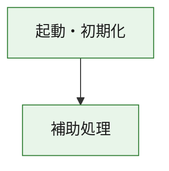
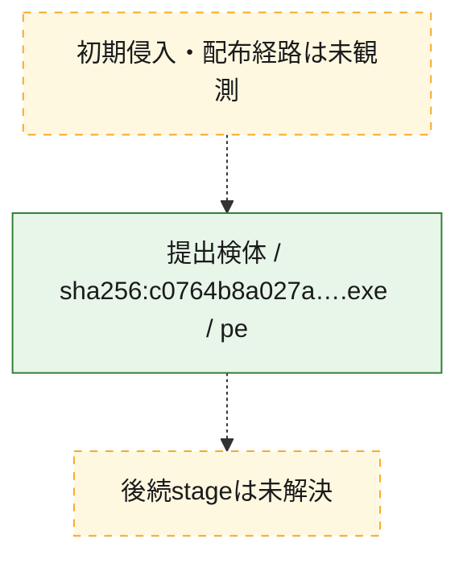
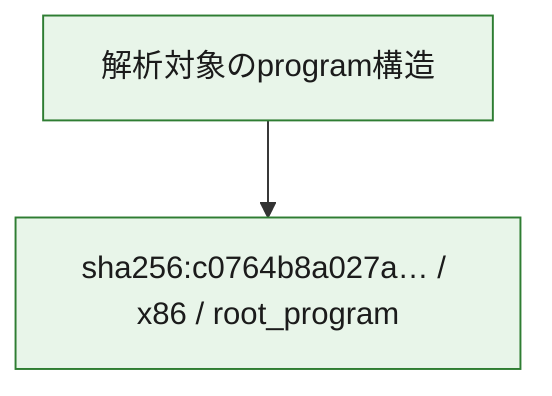

# 全体ロジック：c0764b8a027a49a8cbb9831435cf72664f3df1678d73be39016b7b6a50f2074a

代表関数の静的証跡から、起動・初期化の処理群を確認しました。

## 読み方

- phaseの掲載順は解析上の整理順です。observed_call_edgesがない段階間の実行順を断定しません。
- 図の実線は静的に観測した関係、点線と黄色のノードは未観測・未解決の関係を示します。
- 図は静的な要約であり、動的実行を再現するものではありません。
- 詳細な関数解説とfingerprintは[STATIC-LOGIC.md](STATIC-LOGIC.md)を参照してください。

## 静的可視化

### 実行フロー

### 感染チェーン

### モジュール関係

## 処理段階

### 1. 起動・初期化

entry pointから初期化と後続処理への移行を確認します。
確度: `confirmed_static_function_evidence`

- `c0764b8a027a49a8cbb9831435cf72664f3df1678d73be39016b7b6a50f2074a:ghidra:180001010` — 初期化と主要処理への分岐を行う入口関数です。 状態: `succeeded`、選定理由: `entry_point`, `meaningful_symbol_name`, `reviewed_call_centrality:22`, `role:entrypoint`, `small_program_complete_context`

### 2. 補助処理

主要処理を支える一般内部関数またはlibrary処理を確認します。
確度: `confirmed_static_function_evidence`

- `c0764b8a027a49a8cbb9831435cf72664f3df1678d73be39016b7b6a50f2074a:ghidra:180001240` — 検体内部の一般処理を実装する関数です。 状態: `succeeded`、選定理由: `context_representative`, `reviewed_call_centrality:2`, `small_program_complete_context`
- `c0764b8a027a49a8cbb9831435cf72664f3df1678d73be39016b7b6a50f2074a:ghidra:180001350` — 検体内部の一般処理を実装する関数です。 状態: `succeeded`、選定理由: `context_representative`, `reviewed_call_centrality:25`, `small_program_complete_context`
- `c0764b8a027a49a8cbb9831435cf72664f3df1678d73be39016b7b6a50f2074a:ghidra:180003780` — 検体内部の一般処理を実装する関数です。 状態: `succeeded`、選定理由: `context_representative`, `reviewed_call_centrality:2`, `small_program_complete_context`
- `c0764b8a027a49a8cbb9831435cf72664f3df1678d73be39016b7b6a50f2074a:ghidra:1800038e0` — 検体内部の一般処理を実装する関数です。 状態: `succeeded`、選定理由: `context_representative`, `reviewed_call_centrality:2`, `small_program_complete_context`

## 観測したcall関係

- `c0764b8a027a49a8cbb9831435cf72664f3df1678d73be39016b7b6a50f2074a:ghidra:180001010` → `c0764b8a027a49a8cbb9831435cf72664f3df1678d73be39016b7b6a50f2074a:ghidra:180001240` （`startup` → `support`）
- `c0764b8a027a49a8cbb9831435cf72664f3df1678d73be39016b7b6a50f2074a:ghidra:180001010` → `c0764b8a027a49a8cbb9831435cf72664f3df1678d73be39016b7b6a50f2074a:ghidra:180001350` （`startup` → `support`）
- `c0764b8a027a49a8cbb9831435cf72664f3df1678d73be39016b7b6a50f2074a:ghidra:180001350` → `c0764b8a027a49a8cbb9831435cf72664f3df1678d73be39016b7b6a50f2074a:ghidra:180001240` （`support` → `support`）
- `c0764b8a027a49a8cbb9831435cf72664f3df1678d73be39016b7b6a50f2074a:ghidra:180001350` → `c0764b8a027a49a8cbb9831435cf72664f3df1678d73be39016b7b6a50f2074a:ghidra:180003780` （`support` → `support`）
- `c0764b8a027a49a8cbb9831435cf72664f3df1678d73be39016b7b6a50f2074a:ghidra:180001350` → `c0764b8a027a49a8cbb9831435cf72664f3df1678d73be39016b7b6a50f2074a:ghidra:1800038e0` （`support` → `support`）
- `c0764b8a027a49a8cbb9831435cf72664f3df1678d73be39016b7b6a50f2074a:ghidra:180003780` → `c0764b8a027a49a8cbb9831435cf72664f3df1678d73be39016b7b6a50f2074a:ghidra:1800038e0` （`support` → `support`）
- `ghidra-function:8ef1bd95409878c52fe2ede6` → `ghidra-function:13fc4e4120266214483191f5` （`unclassified` → `unclassified`）
- `ghidra-function:8ef1bd95409878c52fe2ede6` → `ghidra-function:1a174114c55c2b21691e9b2c` （`unclassified` → `unclassified`）
- `ghidra-function:8ef1bd95409878c52fe2ede6` → `ghidra-function:31da80db815b9daca24564fc` （`unclassified` → `unclassified`）
- `ghidra-function:8ef1bd95409878c52fe2ede6` → `ghidra-function:4f4c8c977f0395709f7b9687` （`unclassified` → `unclassified`）
- `ghidra-function:8ef1bd95409878c52fe2ede6` → `ghidra-function:83c6c3aa9d5345d3007958ee` （`unclassified` → `unclassified`）
- `ghidra-function:8ef1bd95409878c52fe2ede6` → `ghidra-function:9c1a7e3ebaf1c0802408369f` （`unclassified` → `unclassified`）
- `ghidra-function:8ef1bd95409878c52fe2ede6` → `ghidra-function:ae4ed7ecb23f82362be3cb0a` （`unclassified` → `unclassified`）
- `ghidra-function:8ef1bd95409878c52fe2ede6` → `ghidra-function:af111ccd2c674db6fddcab1a` （`unclassified` → `unclassified`）
- `ghidra-function:8ef1bd95409878c52fe2ede6` → `ghidra-function:cbfe0177ad620e5fb839c6b7` （`unclassified` → `unclassified`）
- `ghidra-function:8ef1bd95409878c52fe2ede6` → `ghidra-function:d1a5bcfb0dc260fba9c0f389` （`unclassified` → `unclassified`）
- `ghidra-function:8ef1bd95409878c52fe2ede6` → `ghidra-function:d88a765c0aeda9e47a096f2a` （`unclassified` → `unclassified`）
- `ghidra-function:8ef1bd95409878c52fe2ede6` → `ghidra-function:eb4e363d8c7b96d4fbdcf4a2` （`unclassified` → `unclassified`）
- `ghidra-function:d88a765c0aeda9e47a096f2a` → `ghidra-external:05679b48d50df94849fc3542` （`unclassified` → `unclassified`）
- `ghidra-function:d88a765c0aeda9e47a096f2a` → `ghidra-external:174727c02b1c68856f4a41a1` （`unclassified` → `unclassified`）
- `ghidra-function:d88a765c0aeda9e47a096f2a` → `ghidra-external:1a05a4e66379b3cba0896cd9` （`unclassified` → `unclassified`）
- `ghidra-function:d88a765c0aeda9e47a096f2a` → `ghidra-external:21b47363b9f30db36cb896cc` （`unclassified` → `unclassified`）
- `ghidra-function:d88a765c0aeda9e47a096f2a` → `ghidra-external:225eecb1dccb08da5003f6f7` （`unclassified` → `unclassified`）
- `ghidra-function:d88a765c0aeda9e47a096f2a` → `ghidra-external:2afa1c77beb422f60d648206` （`unclassified` → `unclassified`）
- `ghidra-function:d88a765c0aeda9e47a096f2a` → `ghidra-external:41b0f19d571e3ea51a51a59f` （`unclassified` → `unclassified`）
- `ghidra-function:d88a765c0aeda9e47a096f2a` → `ghidra-external:4f29a9b0b33a0c15d853ef35` （`unclassified` → `unclassified`）
- `ghidra-function:d88a765c0aeda9e47a096f2a` → `ghidra-external:680411a3c893ef26e00ba7d9` （`unclassified` → `unclassified`）
- `ghidra-function:d88a765c0aeda9e47a096f2a` → `ghidra-external:7d88e095549ae99630a56f48` （`unclassified` → `unclassified`）
- `ghidra-function:d88a765c0aeda9e47a096f2a` → `ghidra-external:84422069542130b97996ba94` （`unclassified` → `unclassified`）
- `ghidra-function:d88a765c0aeda9e47a096f2a` → `ghidra-external:9088d70f036fd457827c6ba1` （`unclassified` → `unclassified`）
- `ghidra-function:d88a765c0aeda9e47a096f2a` → `ghidra-external:b1098b141df48b7c65a2d39f` （`unclassified` → `unclassified`）
- `ghidra-function:d88a765c0aeda9e47a096f2a` → `ghidra-external:b7f38228628a746ef690be4f` （`unclassified` → `unclassified`）
- `ghidra-function:d88a765c0aeda9e47a096f2a` → `ghidra-external:b9a019549c99e0df1516c8e1` （`unclassified` → `unclassified`）
- `ghidra-function:d88a765c0aeda9e47a096f2a` → `ghidra-external:c449ad90ae7503a2fafefab4` （`unclassified` → `unclassified`）
- `ghidra-function:d88a765c0aeda9e47a096f2a` → `ghidra-external:d0788d5dcfc1868e31219855` （`unclassified` → `unclassified`）
- `ghidra-function:d88a765c0aeda9e47a096f2a` → `ghidra-external:d797b810b4ba8010b47e7add` （`unclassified` → `unclassified`）
- `ghidra-function:d88a765c0aeda9e47a096f2a` → `ghidra-external:df5f1eef9b40c6f10246f0e2` （`unclassified` → `unclassified`）
- `ghidra-function:d88a765c0aeda9e47a096f2a` → `ghidra-external:e2a8eb122d7fa647204b108c` （`unclassified` → `unclassified`）
- `ghidra-function:d88a765c0aeda9e47a096f2a` → `ghidra-external:fc4733ac42c50cae319aabf0` （`unclassified` → `unclassified`）
- `ghidra-function:d88a765c0aeda9e47a096f2a` → `ghidra-function:83c6c3aa9d5345d3007958ee` （`unclassified` → `unclassified`）
- `ghidra-function:d88a765c0aeda9e47a096f2a` → `ghidra-function:9d28cd9ddf9b4cc7008cca34` （`unclassified` → `unclassified`）
- `ghidra-function:d88a765c0aeda9e47a096f2a` → `ghidra-function:f36d8359ee96277bb6058513` （`unclassified` → `unclassified`）
- `ghidra-function:f36d8359ee96277bb6058513` → `ghidra-function:9d28cd9ddf9b4cc7008cca34` （`unclassified` → `unclassified`）

## 解析範囲と制約

- 選定外関数は全体inventoryへ残しますが、関数本体の個別解説対象にはしていません。
- indirect call、難読化、packer、VM、壊れたcontrol flowによりcall関係が欠落する場合があります。
- 文書は静的解析に基づき、検体実行や外部通信による動的確認は行っていません。
