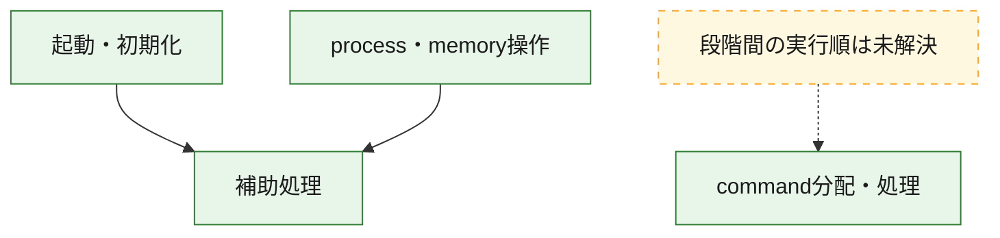
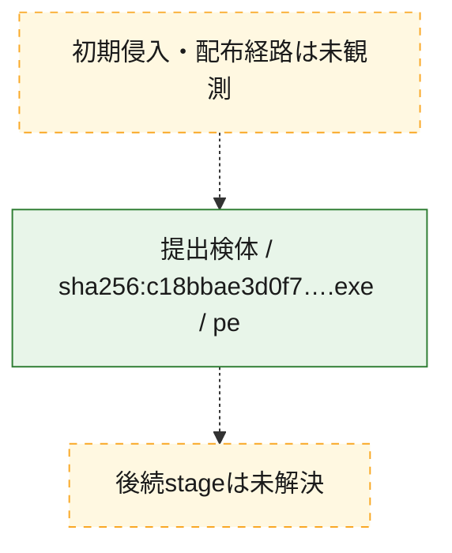
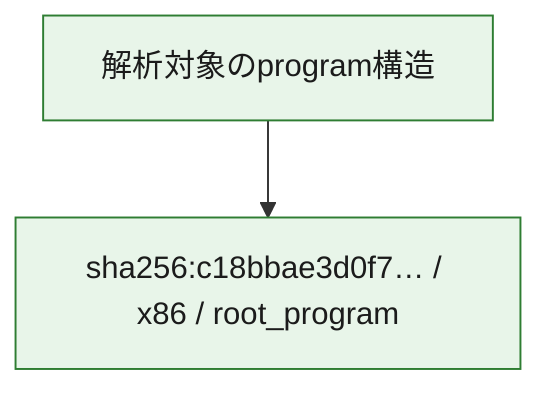

# 全体ロジック：c18bbae3d0f7e2edb31dcb8983b72397e0dce9fff64830630cacbd9f2d3274dc

代表関数の静的証跡から、起動・初期化、process・memory操作、command分配・処理の処理群を確認しました。

## 読み方

- phaseの掲載順は解析上の整理順です。observed_call_edgesがない段階間の実行順を断定しません。
- 図の実線は静的に観測した関係、点線と黄色のノードは未観測・未解決の関係を示します。
- 図は静的な要約であり、動的実行を再現するものではありません。
- 詳細な関数解説とfingerprintは[STATIC-LOGIC.md](STATIC-LOGIC.md)を参照してください。

## 静的可視化

### 実行フロー

### 感染チェーン

### モジュール関係

## 処理段階

### 1. 起動・初期化

entry pointから初期化と後続処理への移行を確認します。
確度: `confirmed_static_function_evidence`

- `c18bbae3d0f7e2edb31dcb8983b72397e0dce9fff64830630cacbd9f2d3274dc:ghidra:140007c40` — 初期化と主要処理への分岐を行う入口関数です。 状態: `succeeded`、選定理由: `entry_point`, `meaningful_symbol_name`, `probable_go_main_user_code`, `reviewed_call_centrality:20`, `role:entrypoint`

### 2. process・memory操作

process、thread、module、memory操作と実行移行を確認します。
確度: `confirmed_static_function_evidence`

- `c18bbae3d0f7e2edb31dcb8983b72397e0dce9fff64830630cacbd9f2d3274dc:ghidra:1400018b0` — process、thread、module、またはmemory操作に関係する関数です。 状態: `succeeded`、選定理由: `meaningful_symbol_name`, `reviewed_call_centrality:16`, `role:process_or_memory_operation`
- `c18bbae3d0f7e2edb31dcb8983b72397e0dce9fff64830630cacbd9f2d3274dc:ghidra:140001920` — process、thread、module、またはmemory操作に関係する関数です。 状態: `succeeded`、選定理由: `meaningful_symbol_name`, `reviewed_call_centrality:12`, `role:process_or_memory_operation`

### 3. command分配・処理

受信commandやtaskの解釈、分配、個別handlerへの移行を確認します。
確度: `confirmed_static_function_evidence`

- `c18bbae3d0f7e2edb31dcb8983b72397e0dce9fff64830630cacbd9f2d3274dc:ghidra:140007510` — commandの解釈、分配、または個別処理を担当する関数です。 状態: `succeeded`、選定理由: `meaningful_symbol_name`, `role:command_dispatch_or_handler`
- `c18bbae3d0f7e2edb31dcb8983b72397e0dce9fff64830630cacbd9f2d3274dc:ghidra:140007520` — commandの解釈、分配、または個別処理を担当する関数です。 状態: `succeeded`、選定理由: `meaningful_symbol_name`, `reviewed_call_centrality:2`, `role:command_dispatch_or_handler`

### 4. 補助処理

主要処理を支える一般内部関数またはlibrary処理を確認します。
確度: `confirmed_static_function_evidence_with_limits`

- `c18bbae3d0f7e2edb31dcb8983b72397e0dce9fff64830630cacbd9f2d3274dc:ghidra:140001010` — 検体内部の一般処理を実装する関数です。 状態: `succeeded`、選定理由: `meaningful_symbol_name`, `reviewed_call_centrality:6`
- `c18bbae3d0f7e2edb31dcb8983b72397e0dce9fff64830630cacbd9f2d3274dc:ghidra:140001140` — 検体内部の一般処理を実装する関数です。 状態: `succeeded`、選定理由: `meaningful_symbol_name`, `reviewed_call_centrality:1`
- `c18bbae3d0f7e2edb31dcb8983b72397e0dce9fff64830630cacbd9f2d3274dc:ghidra:1400013e0` — 検体内部の一般処理を実装する関数です。 状態: `succeeded`、選定理由: `meaningful_symbol_name`, `reviewed_call_centrality:1`
- `c18bbae3d0f7e2edb31dcb8983b72397e0dce9fff64830630cacbd9f2d3274dc:ghidra:140001410` — 検体内部の一般処理を実装する関数です。 状態: `succeeded`、選定理由: `entry_point`, `meaningful_symbol_name`, `reviewed_call_centrality:1`
- `c18bbae3d0f7e2edb31dcb8983b72397e0dce9fff64830630cacbd9f2d3274dc:ghidra:140001440` — 検体内部の一般処理を実装する関数です。 状態: `succeeded`、選定理由: `meaningful_symbol_name`, `reviewed_call_centrality:2`
- `c18bbae3d0f7e2edb31dcb8983b72397e0dce9fff64830630cacbd9f2d3274dc:ghidra:140001480` — 検体内部の一般処理を実装する関数です。 状態: `succeeded`、選定理由: `meaningful_symbol_name`, `reviewed_call_centrality:4`
- `c18bbae3d0f7e2edb31dcb8983b72397e0dce9fff64830630cacbd9f2d3274dc:ghidra:140001580` — 検体内部の一般処理を実装する関数です。 状態: `succeeded`、選定理由: `meaningful_symbol_name`, `reviewed_call_centrality:2`
- `c18bbae3d0f7e2edb31dcb8983b72397e0dce9fff64830630cacbd9f2d3274dc:ghidra:1400016c0` — 検体内部の一般処理を実装する関数です。 状態: `succeeded`、選定理由: `meaningful_symbol_name`, `reviewed_call_centrality:1`
- `c18bbae3d0f7e2edb31dcb8983b72397e0dce9fff64830630cacbd9f2d3274dc:ghidra:1400016d0` — compiler生成処理または汎用library処理とみられる関数です。 状態: `succeeded`、選定理由: `entry_point`, `meaningful_symbol_name`, `reviewed_call_centrality:1`
- `c18bbae3d0f7e2edb31dcb8983b72397e0dce9fff64830630cacbd9f2d3274dc:ghidra:140001700` — compiler生成処理または汎用library処理とみられる関数です。 状態: `succeeded`、選定理由: `entry_point`, `meaningful_symbol_name`, `reviewed_call_centrality:2`
- `c18bbae3d0f7e2edb31dcb8983b72397e0dce9fff64830630cacbd9f2d3274dc:ghidra:1400017a0` — 検体内部の一般処理を実装する関数です。 状態: `succeeded`、選定理由: `meaningful_symbol_name`, `reviewed_call_centrality:3`
- `c18bbae3d0f7e2edb31dcb8983b72397e0dce9fff64830630cacbd9f2d3274dc:ghidra:1400018a0` — 検体内部の一般処理を実装する関数です。 状態: `succeeded`、選定理由: `meaningful_symbol_name`, `reviewed_call_centrality:1`
- `c18bbae3d0f7e2edb31dcb8983b72397e0dce9fff64830630cacbd9f2d3274dc:ghidra:140001a90` — 検体内部の一般処理を実装する関数です。 状態: `succeeded`、選定理由: `meaningful_symbol_name`, `reviewed_call_centrality:3`
- `c18bbae3d0f7e2edb31dcb8983b72397e0dce9fff64830630cacbd9f2d3274dc:ghidra:140001e40` — 検体内部の一般処理を実装する関数です。 状態: `limited_bad_instruction_or_flow`、選定理由: `meaningful_symbol_name`, `reviewed_call_centrality:3`
- `c18bbae3d0f7e2edb31dcb8983b72397e0dce9fff64830630cacbd9f2d3274dc:ghidra:1400022a0` — 検体内部の一般処理を実装する関数です。 状態: `succeeded`、選定理由: `meaningful_symbol_name`, `reviewed_call_centrality:1`
- `c18bbae3d0f7e2edb31dcb8983b72397e0dce9fff64830630cacbd9f2d3274dc:ghidra:1400022d0` — 検体内部の一般処理を実装する関数です。 状態: `succeeded`、選定理由: `meaningful_symbol_name`
- `c18bbae3d0f7e2edb31dcb8983b72397e0dce9fff64830630cacbd9f2d3274dc:ghidra:140002320` — 検体内部の一般処理を実装する関数です。 状態: `succeeded`、選定理由: `meaningful_symbol_name`, `reviewed_call_centrality:2`
- `c18bbae3d0f7e2edb31dcb8983b72397e0dce9fff64830630cacbd9f2d3274dc:ghidra:140002490` — 検体内部の一般処理を実装する関数です。 状態: `succeeded`、選定理由: `meaningful_symbol_name`
- `c18bbae3d0f7e2edb31dcb8983b72397e0dce9fff64830630cacbd9f2d3274dc:ghidra:140002510` — 検体内部の一般処理を実装する関数です。 状態: `succeeded`、選定理由: `meaningful_symbol_name`, `reviewed_call_centrality:3`
- `c18bbae3d0f7e2edb31dcb8983b72397e0dce9fff64830630cacbd9f2d3274dc:ghidra:140002550` — 検体内部の一般処理を実装する関数です。 状態: `succeeded`、選定理由: `meaningful_symbol_name`, `reviewed_call_centrality:1`
- `c18bbae3d0f7e2edb31dcb8983b72397e0dce9fff64830630cacbd9f2d3274dc:ghidra:1400026e0` — 検体内部の一般処理を実装する関数です。 状態: `succeeded`、選定理由: `meaningful_symbol_name`, `reviewed_call_centrality:4`
- `c18bbae3d0f7e2edb31dcb8983b72397e0dce9fff64830630cacbd9f2d3274dc:ghidra:1400066d0` — 検体内部の一般処理を実装する関数です。 状態: `limited_bad_instruction_or_flow`、選定理由: `meaningful_symbol_name`, `reviewed_call_centrality:10`
- `c18bbae3d0f7e2edb31dcb8983b72397e0dce9fff64830630cacbd9f2d3274dc:ghidra:1400067c0` — 検体内部の一般処理を実装する関数です。 状態: `limited_bad_instruction_or_flow`、選定理由: `meaningful_symbol_name`, `reviewed_call_centrality:4`
- `c18bbae3d0f7e2edb31dcb8983b72397e0dce9fff64830630cacbd9f2d3274dc:ghidra:1400073b0` — 検体内部の一般処理を実装する関数です。 状態: `succeeded`、選定理由: `meaningful_symbol_name`
- `c18bbae3d0f7e2edb31dcb8983b72397e0dce9fff64830630cacbd9f2d3274dc:ghidra:140007430` — 検体内部の一般処理を実装する関数です。 状態: `limited_bad_instruction_or_flow`、選定理由: `meaningful_symbol_name`, `reviewed_call_centrality:5`
- `c18bbae3d0f7e2edb31dcb8983b72397e0dce9fff64830630cacbd9f2d3274dc:ghidra:1400074a0` — 検体内部の一般処理を実装する関数です。 状態: `limited_bad_instruction_or_flow`、選定理由: `meaningful_symbol_name`, `reviewed_call_centrality:6`
- `c18bbae3d0f7e2edb31dcb8983b72397e0dce9fff64830630cacbd9f2d3274dc:ghidra:1400075f0` — 検体内部の一般処理を実装する関数です。 状態: `succeeded`、選定理由: `meaningful_symbol_name`, `reviewed_call_centrality:3`

## 観測したcall関係

- `c18bbae3d0f7e2edb31dcb8983b72397e0dce9fff64830630cacbd9f2d3274dc:ghidra:1400018b0` → `c18bbae3d0f7e2edb31dcb8983b72397e0dce9fff64830630cacbd9f2d3274dc:ghidra:140002510` （`execution` → `support`）
- `c18bbae3d0f7e2edb31dcb8983b72397e0dce9fff64830630cacbd9f2d3274dc:ghidra:140001920` → `c18bbae3d0f7e2edb31dcb8983b72397e0dce9fff64830630cacbd9f2d3274dc:ghidra:140002510` （`execution` → `support`）
- `c18bbae3d0f7e2edb31dcb8983b72397e0dce9fff64830630cacbd9f2d3274dc:ghidra:140001e40` → `c18bbae3d0f7e2edb31dcb8983b72397e0dce9fff64830630cacbd9f2d3274dc:ghidra:1400018a0` （`support` → `support`）
- `c18bbae3d0f7e2edb31dcb8983b72397e0dce9fff64830630cacbd9f2d3274dc:ghidra:1400026e0` → `c18bbae3d0f7e2edb31dcb8983b72397e0dce9fff64830630cacbd9f2d3274dc:ghidra:140007430` （`support` → `support`）
- `c18bbae3d0f7e2edb31dcb8983b72397e0dce9fff64830630cacbd9f2d3274dc:ghidra:1400026e0` → `c18bbae3d0f7e2edb31dcb8983b72397e0dce9fff64830630cacbd9f2d3274dc:ghidra:1400074a0` （`support` → `support`）
- `c18bbae3d0f7e2edb31dcb8983b72397e0dce9fff64830630cacbd9f2d3274dc:ghidra:1400066d0` → `c18bbae3d0f7e2edb31dcb8983b72397e0dce9fff64830630cacbd9f2d3274dc:ghidra:140001440` （`support` → `support`）
- `c18bbae3d0f7e2edb31dcb8983b72397e0dce9fff64830630cacbd9f2d3274dc:ghidra:140007c40` → `c18bbae3d0f7e2edb31dcb8983b72397e0dce9fff64830630cacbd9f2d3274dc:ghidra:140001480` （`startup` → `support`）
- `c18bbae3d0f7e2edb31dcb8983b72397e0dce9fff64830630cacbd9f2d3274dc:ghidra:140007c40` → `c18bbae3d0f7e2edb31dcb8983b72397e0dce9fff64830630cacbd9f2d3274dc:ghidra:140001580` （`startup` → `support`）
- `ghidra-function:00bdcc21b8c43a988ad467be` → `ghidra-external:be52b65b0a9c6e3a3aab651e` （`unclassified` → `unclassified`）
- `ghidra-function:00bdcc21b8c43a988ad467be` → `ghidra-function:25dd4dab19899b7c49dd006b` （`unclassified` → `unclassified`）
- `ghidra-function:00bdcc21b8c43a988ad467be` → `ghidra-function:28fad56ac5f03fb0629c50a6` （`unclassified` → `unclassified`）
- `ghidra-function:0279b890dc731563ae5fb11a` → `ghidra-external:23c351b0bc8f685bae540418` （`unclassified` → `unclassified`）
- `ghidra-function:06a0fae9d4363983845b9c3a` → `ghidra-external:1a478fdb18dd511d6246596d` （`unclassified` → `unclassified`）
- `ghidra-function:06a0fae9d4363983845b9c3a` → `ghidra-external:77ee22abe5c2807eebae9a44` （`unclassified` → `unclassified`）
- `ghidra-function:06a0fae9d4363983845b9c3a` → `ghidra-function:25dd4dab19899b7c49dd006b` （`unclassified` → `unclassified`）
- `ghidra-function:143689eba5c0cbca837d9856` → `ghidra-function:edccc80045841d3371da391b` （`unclassified` → `unclassified`）
- `ghidra-function:15d718e51fae697371689ffa` → `ghidra-external:77ee22abe5c2807eebae9a44` （`unclassified` → `unclassified`）
- `ghidra-function:1d617b9cc973a8b4c65fbc8b` → `ghidra-external:23c351b0bc8f685bae540418` （`unclassified` → `unclassified`）
- `ghidra-function:1d617b9cc973a8b4c65fbc8b` → `ghidra-external:a89de6a4ecf1c3f3f48edcea` （`unclassified` → `unclassified`）
- `ghidra-function:1d617b9cc973a8b4c65fbc8b` → `ghidra-external:bb8f983d00e95e730eed0663` （`unclassified` → `unclassified`）
- `ghidra-function:1d617b9cc973a8b4c65fbc8b` → `ghidra-function:28fad56ac5f03fb0629c50a6` （`unclassified` → `unclassified`）
- `ghidra-function:1d617b9cc973a8b4c65fbc8b` → `ghidra-function:6bdb6f39482787e6397bb974` （`unclassified` → `unclassified`）
- `ghidra-function:1d617b9cc973a8b4c65fbc8b` → `ghidra-function:88acf0fb5bee59b886835122` （`unclassified` → `unclassified`）
- `ghidra-function:1d617b9cc973a8b4c65fbc8b` → `ghidra-function:c84ab84922796b5a1f131c31` （`unclassified` → `unclassified`）
- `ghidra-function:48f7879dc466854aabf75a19` → `ghidra-external:77ee22abe5c2807eebae9a44` （`unclassified` → `unclassified`）
- `ghidra-function:5204e957ce8d3aece2eba26e` → `ghidra-external:0f42cf075c0bf2b5f4258129` （`unclassified` → `unclassified`）
- `ghidra-function:5204e957ce8d3aece2eba26e` → `ghidra-external:19d9112e303747fcb8e7860c` （`unclassified` → `unclassified`）
- `ghidra-function:5204e957ce8d3aece2eba26e` → `ghidra-external:23c351b0bc8f685bae540418` （`unclassified` → `unclassified`）
- `ghidra-function:5204e957ce8d3aece2eba26e` → `ghidra-external:77ee22abe5c2807eebae9a44` （`unclassified` → `unclassified`）
- `ghidra-function:5204e957ce8d3aece2eba26e` → `ghidra-external:b5a02efb4eaacc959130b891` （`unclassified` → `unclassified`）
- `ghidra-function:5204e957ce8d3aece2eba26e` → `ghidra-external:fc81c3cc477a9ad4fb9bf31c` （`unclassified` → `unclassified`）
- `ghidra-function:5204e957ce8d3aece2eba26e` → `ghidra-function:0279b890dc731563ae5fb11a` （`unclassified` → `unclassified`）
- `ghidra-function:5204e957ce8d3aece2eba26e` → `ghidra-function:1e24bc8d239e7b94db22bbcf` （`unclassified` → `unclassified`）
- `ghidra-function:5204e957ce8d3aece2eba26e` → `ghidra-function:25dd4dab19899b7c49dd006b` （`unclassified` → `unclassified`）
- `ghidra-function:5204e957ce8d3aece2eba26e` → `ghidra-function:37981135b0bdd16a2f1bfb22` （`unclassified` → `unclassified`）
- `ghidra-function:5204e957ce8d3aece2eba26e` → `ghidra-function:796dbede57493631a5579711` （`unclassified` → `unclassified`）
- `ghidra-function:5204e957ce8d3aece2eba26e` → `ghidra-function:7bb4cedde9646526cc19112e` （`unclassified` → `unclassified`）
- `ghidra-function:5204e957ce8d3aece2eba26e` → `ghidra-function:98c4e2d40aeada41eebe2362` （`unclassified` → `unclassified`）
- `ghidra-function:6510b1d64ae1ac2c1bcdf905` → `ghidra-function:edccc80045841d3371da391b` （`unclassified` → `unclassified`）
- `ghidra-function:676986d40174d316742dcff4` → `ghidra-external:77ee22abe5c2807eebae9a44` （`unclassified` → `unclassified`）
- `ghidra-function:6956a0923b718702550c624a` → `ghidra-external:0f42cf075c0bf2b5f4258129` （`unclassified` → `unclassified`）
- `ghidra-function:6956a0923b718702550c624a` → `ghidra-external:15d616460dfafe441a8994c8` （`unclassified` → `unclassified`）
- `ghidra-function:6956a0923b718702550c624a` → `ghidra-external:261feb3a2129bfe7bb6359bb` （`unclassified` → `unclassified`）
- `ghidra-function:6956a0923b718702550c624a` → `ghidra-external:4c16f82021127e269552bb29` （`unclassified` → `unclassified`）
- `ghidra-function:6956a0923b718702550c624a` → `ghidra-external:b897c76e5ea683a5aacb7e7b` （`unclassified` → `unclassified`）
- `ghidra-function:6956a0923b718702550c624a` → `ghidra-external:def3280ef735c75536ab605b` （`unclassified` → `unclassified`）
- `ghidra-function:6956a0923b718702550c624a` → `ghidra-external:e440f8c5e03396b578fc3331` （`unclassified` → `unclassified`）
- `ghidra-function:6956a0923b718702550c624a` → `ghidra-function:15d718e51fae697371689ffa` （`unclassified` → `unclassified`）
- `ghidra-function:6956a0923b718702550c624a` → `ghidra-function:265295f70348d6b1696192d2` （`unclassified` → `unclassified`）
- `ghidra-function:6956a0923b718702550c624a` → `ghidra-function:4e932a73fdba59ad8a185ba3` （`unclassified` → `unclassified`）
- `ghidra-function:6956a0923b718702550c624a` → `ghidra-function:6bbc1bf096272b74d13a61dd` （`unclassified` → `unclassified`）
- `ghidra-function:6956a0923b718702550c624a` → `ghidra-function:87f51a5873c993e89aeac95c` （`unclassified` → `unclassified`）
- `ghidra-function:6956a0923b718702550c624a` → `ghidra-function:bf31bda7b80ed8594122455d` （`unclassified` → `unclassified`）
- `ghidra-function:6956a0923b718702550c624a` → `ghidra-function:d8a34294fd7c9287d7fe4cca` （`unclassified` → `unclassified`）
- `ghidra-function:6956a0923b718702550c624a` → `ghidra-function:db122c8012bd837606b223b4` （`unclassified` → `unclassified`）
- `ghidra-function:7664f09e515e0fee24a1a107` → `ghidra-external:23c351b0bc8f685bae540418` （`unclassified` → `unclassified`）
- `ghidra-function:7664f09e515e0fee24a1a107` → `ghidra-external:6af0e533ddcbebe8e266ace0` （`unclassified` → `unclassified`）
- `ghidra-function:7664f09e515e0fee24a1a107` → `ghidra-external:77ee22abe5c2807eebae9a44` （`unclassified` → `unclassified`）
- `ghidra-function:7664f09e515e0fee24a1a107` → `ghidra-function:16f27f7197c56b267b8a7e4c` （`unclassified` → `unclassified`）
- `ghidra-function:7664f09e515e0fee24a1a107` → `ghidra-function:41557c51dd4f6125fe615ab3` （`unclassified` → `unclassified`）
- `ghidra-function:7664f09e515e0fee24a1a107` → `ghidra-function:92fe2a280dc57767d5cb6ea7` （`unclassified` → `unclassified`）
- `ghidra-function:77e9a5b711e82bdb692af819` → `ghidra-external:0bd6f273bd9d8d6edc6431ab` （`unclassified` → `unclassified`）
- `ghidra-function:77e9a5b711e82bdb692af819` → `ghidra-external:78b78fe832a9533fd4065e28` （`unclassified` → `unclassified`）
- `ghidra-function:77e9a5b711e82bdb692af819` → `ghidra-function:7abd464adf3e1de638b7ffff` （`unclassified` → `unclassified`）
- `ghidra-function:7a7c7782eb9ba19b5237257d` → `ghidra-external:23c351b0bc8f685bae540418` （`unclassified` → `unclassified`）
- `ghidra-function:7a7c7782eb9ba19b5237257d` → `ghidra-function:0aaafd490da0505a778208d0` （`unclassified` → `unclassified`）
- `ghidra-function:7ba71530d58d91107c242754` → `ghidra-external:a89de6a4ecf1c3f3f48edcea` （`unclassified` → `unclassified`）
- `ghidra-function:7ba71530d58d91107c242754` → `ghidra-external:bb8f983d00e95e730eed0663` （`unclassified` → `unclassified`）
- `ghidra-function:7db6500cc8bd07847e31d0dc` → `ghidra-external:77ee22abe5c2807eebae9a44` （`unclassified` → `unclassified`）
- `ghidra-function:7db6500cc8bd07847e31d0dc` → `ghidra-external:d51b1ee543c3e45c0d09b50e` （`unclassified` → `unclassified`）
- `ghidra-function:7db6500cc8bd07847e31d0dc` → `ghidra-function:8de732235c7ec7eccec3ac31` （`unclassified` → `unclassified`）
- `ghidra-function:98883702bf9bc7acefc134f3` → `ghidra-external:a89de6a4ecf1c3f3f48edcea` （`unclassified` → `unclassified`）
- `ghidra-function:98883702bf9bc7acefc134f3` → `ghidra-external:bb8f983d00e95e730eed0663` （`unclassified` → `unclassified`）
- `ghidra-function:98883702bf9bc7acefc134f3` → `ghidra-function:41941a138515524872c39c08` （`unclassified` → `unclassified`）
- `ghidra-function:9ecc4b298baeccc059e16245` → `ghidra-function:0aaafd490da0505a778208d0` （`unclassified` → `unclassified`）
- `ghidra-function:be9387cda15755b62fd10f18` → `ghidra-external:23c351b0bc8f685bae540418` （`unclassified` → `unclassified`）
- `ghidra-function:c84ab84922796b5a1f131c31` → `ghidra-external:4cff3678b29f129eb5c45c40` （`unclassified` → `unclassified`）
- `ghidra-function:d7ff114c202d52b5d5a4343b` → `ghidra-function:25dd4dab19899b7c49dd006b` （`unclassified` → `unclassified`）
- `ghidra-function:d7ff114c202d52b5d5a4343b` → `ghidra-function:338e379be1e492a9e1fa8b75` （`unclassified` → `unclassified`）
- `ghidra-function:d7ff114c202d52b5d5a4343b` → `ghidra-function:c9c0514fb2bb915b466228fd` （`unclassified` → `unclassified`）
- `ghidra-function:db122c8012bd837606b223b4` → `ghidra-external:f9b14c423b986f592b415372` （`unclassified` → `unclassified`）
- `ghidra-function:db122c8012bd837606b223b4` → `ghidra-function:bf31bda7b80ed8594122455d` （`unclassified` → `unclassified`）
- `ghidra-function:eecd3743a1cfcb4b496a62d3` → `ghidra-external:0f42cf075c0bf2b5f4258129` （`unclassified` → `unclassified`）
- `ghidra-function:eecd3743a1cfcb4b496a62d3` → `ghidra-external:23c351b0bc8f685bae540418` （`unclassified` → `unclassified`）
- `ghidra-function:eecd3743a1cfcb4b496a62d3` → `ghidra-external:77ee22abe5c2807eebae9a44` （`unclassified` → `unclassified`）
- `ghidra-function:eecd3743a1cfcb4b496a62d3` → `ghidra-function:0279b890dc731563ae5fb11a` （`unclassified` → `unclassified`）
- `ghidra-function:eecd3743a1cfcb4b496a62d3` → `ghidra-function:1e24bc8d239e7b94db22bbcf` （`unclassified` → `unclassified`）
- `ghidra-function:eecd3743a1cfcb4b496a62d3` → `ghidra-function:37981135b0bdd16a2f1bfb22` （`unclassified` → `unclassified`）
- `ghidra-function:eecd3743a1cfcb4b496a62d3` → `ghidra-function:796dbede57493631a5579711` （`unclassified` → `unclassified`）
- `ghidra-function:eecd3743a1cfcb4b496a62d3` → `ghidra-function:7bb4cedde9646526cc19112e` （`unclassified` → `unclassified`）
- `ghidra-function:eecd3743a1cfcb4b496a62d3` → `ghidra-function:98c4e2d40aeada41eebe2362` （`unclassified` → `unclassified`）
- `ghidra-function:ef0cde74a176fd1483543ef3` → `ghidra-external:9ae32cfe580760aaefff2f7e` （`unclassified` → `unclassified`）
- `ghidra-function:ef0cde74a176fd1483543ef3` → `ghidra-external:f1790e9344aa5d6d752c7dde` （`unclassified` → `unclassified`）
- `ghidra-function:f67d5bd217f32cfbdd471211` → `ghidra-external:de3489ca32d3a17aa409ca16` （`unclassified` → `unclassified`）
- `ghidra-function:f8db4cbcba1265363887fa5d` → `ghidra-external:77ee22abe5c2807eebae9a44` （`unclassified` → `unclassified`）
- `ghidra-function:f8db4cbcba1265363887fa5d` → `ghidra-function:00bdcc21b8c43a988ad467be` （`unclassified` → `unclassified`）
- `ghidra-function:f8db4cbcba1265363887fa5d` → `ghidra-function:70984121e8b130bdddda8473` （`unclassified` → `unclassified`）
- `ghidra-function:f8db4cbcba1265363887fa5d` → `ghidra-function:d7ff114c202d52b5d5a4343b` （`unclassified` → `unclassified`）
- `ghidra-function:fad4146d49cdc0f5409d6670` → `ghidra-external:0f42cf075c0bf2b5f4258129` （`unclassified` → `unclassified`）
- `ghidra-function:fad4146d49cdc0f5409d6670` → `ghidra-external:23c351b0bc8f685bae540418` （`unclassified` → `unclassified`）
- `ghidra-function:fad4146d49cdc0f5409d6670` → `ghidra-function:98c4e2d40aeada41eebe2362` （`unclassified` → `unclassified`）

## 解析範囲と制約

- 選定外関数は全体inventoryへ残しますが、関数本体の個別解説対象にはしていません。
- indirect call、難読化、packer、VM、壊れたcontrol flowによりcall関係が欠落する場合があります。
- 文書は静的解析に基づき、検体実行や外部通信による動的確認は行っていません。
