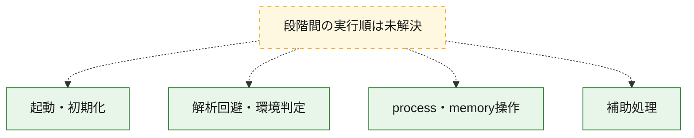
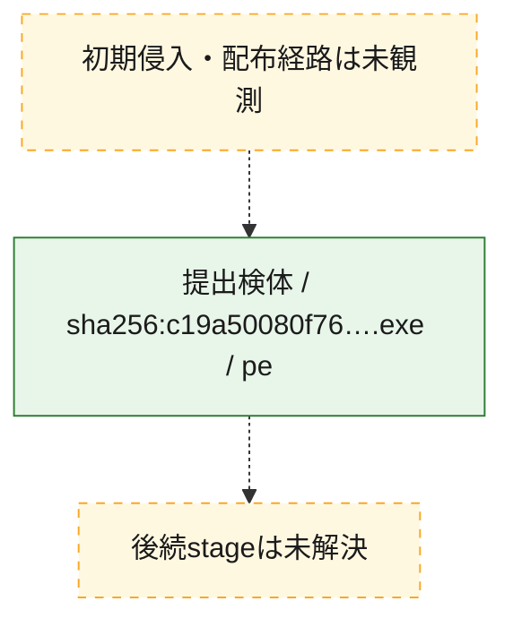
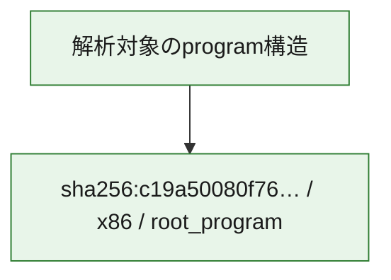

# 全体ロジック：c19a50080f76018e266bcf06d162be2770c55be4d85dddcf0ee851cf761173ab

代表関数の静的証跡から、起動・初期化、解析回避・環境判定、process・memory操作の処理群を確認しました。

## 読み方

- phaseの掲載順は解析上の整理順です。observed_call_edgesがない段階間の実行順を断定しません。
- 図の実線は静的に観測した関係、点線と黄色のノードは未観測・未解決の関係を示します。
- 図は静的な要約であり、動的実行を再現するものではありません。
- 詳細な関数解説とfingerprintは[STATIC-LOGIC.md](STATIC-LOGIC.md)を参照してください。

## 静的可視化

### 実行フロー

### 感染チェーン

### モジュール関係

## 処理段階

### 1. 起動・初期化

entry pointから初期化と後続処理への移行を確認します。
確度: `confirmed_static_function_evidence`

- `c19a50080f76018e266bcf06d162be2770c55be4d85dddcf0ee851cf761173ab:ghidra:3bf561292` — 初期化と主要処理への分岐を行う入口関数です。 状態: `succeeded`、選定理由: `entry_point`, `meaningful_symbol_name`, `reviewed_call_centrality:1`, `role:entrypoint`

### 2. 解析回避・環境判定

debugger、sandbox、仮想環境、時間差などの判定を確認します。
確度: `confirmed_static_function_evidence_with_limits`

- `c19a50080f76018e266bcf06d162be2770c55be4d85dddcf0ee851cf761173ab:ghidra:3bf56101d` — debugger、仮想環境、sandbox、または時間差の確認に関係する関数です。 状態: `succeeded`、選定理由: `context_representative`, `reviewed_call_centrality:9`, `role:anti_analysis`
- `c19a50080f76018e266bcf06d162be2770c55be4d85dddcf0ee851cf761173ab:ghidra:3bf5615a0` — debugger、仮想環境、sandbox、または時間差の確認に関係する関数です。 状態: `limited_bad_instruction_or_flow`、選定理由: `context_representative`, `reviewed_call_centrality:4`, `role:anti_analysis`
- `c19a50080f76018e266bcf06d162be2770c55be4d85dddcf0ee851cf761173ab:ghidra:3bf561a70` — debugger、仮想環境、sandbox、または時間差の確認に関係する関数です。 状態: `limited_bad_instruction_or_flow`、選定理由: `entry_point`, `meaningful_symbol_name`, `reviewed_call_centrality:6`, `role:anti_analysis`

### 3. process・memory操作

process、thread、module、memory操作と実行移行を確認します。
確度: `confirmed_static_function_evidence`

- `c19a50080f76018e266bcf06d162be2770c55be4d85dddcf0ee851cf761173ab:ghidra:3bf5614b0` — process、thread、module、またはmemory操作に関係する関数です。 状態: `succeeded`、選定理由: `context_representative`, `reviewed_call_centrality:7`, `role:process_or_memory_operation`
- `c19a50080f76018e266bcf06d162be2770c55be4d85dddcf0ee851cf761173ab:ghidra:3bf5615f0` — process、thread、module、またはmemory操作に関係する関数です。 状態: `succeeded`、選定理由: `context_representative`, `reviewed_call_centrality:4`, `role:process_or_memory_operation`
- `c19a50080f76018e266bcf06d162be2770c55be4d85dddcf0ee851cf761173ab:ghidra:3bf561680` — process、thread、module、またはmemory操作に関係する関数です。 状態: `succeeded`、選定理由: `context_representative`, `reviewed_call_centrality:10`, `role:process_or_memory_operation`
- `c19a50080f76018e266bcf06d162be2770c55be4d85dddcf0ee851cf761173ab:ghidra:3bf561740` — process、thread、module、またはmemory操作に関係する関数です。 状態: `succeeded`、選定理由: `context_representative`, `reviewed_call_centrality:20`, `role:process_or_memory_operation`
- `c19a50080f76018e266bcf06d162be2770c55be4d85dddcf0ee851cf761173ab:ghidra:3bf561a00` — process、thread、module、またはmemory操作に関係する関数です。 状態: `succeeded`、選定理由: `context_representative`, `reviewed_call_centrality:7`, `role:process_or_memory_operation`

### 4. 補助処理

主要処理を支える一般内部関数またはlibrary処理を確認します。
確度: `confirmed_static_function_evidence_with_limits`

- `c19a50080f76018e266bcf06d162be2770c55be4d85dddcf0ee851cf761173ab:ghidra:3bf561000` — 検体内部の一般処理を実装する関数です。 状態: `succeeded`、選定理由: `context_representative`, `reviewed_call_centrality:1`
- `c19a50080f76018e266bcf06d162be2770c55be4d85dddcf0ee851cf761173ab:ghidra:3bf5612ce` — 検体内部の一般処理を実装する関数です。 状態: `succeeded`、選定理由: `context_representative`, `reviewed_call_centrality:6`
- `c19a50080f76018e266bcf06d162be2770c55be4d85dddcf0ee851cf761173ab:ghidra:3bf561467` — 検体内部の一般処理を実装する関数です。 状態: `succeeded`、選定理由: `context_representative`, `reviewed_call_centrality:2`
- `c19a50080f76018e266bcf06d162be2770c55be4d85dddcf0ee851cf761173ab:ghidra:3bf561490` — 検体内部の一般処理を実装する関数です。 状態: `succeeded`、選定理由: `context_representative`
- `c19a50080f76018e266bcf06d162be2770c55be4d85dddcf0ee851cf761173ab:ghidra:3bf5614a0` — 検体内部の一般処理を実装する関数です。 状態: `succeeded`、選定理由: `context_representative`
- `c19a50080f76018e266bcf06d162be2770c55be4d85dddcf0ee851cf761173ab:ghidra:3bf561560` — 検体内部の一般処理を実装する関数です。 状態: `limited_bad_instruction_or_flow`、選定理由: `context_representative`, `reviewed_call_centrality:2`
- `c19a50080f76018e266bcf06d162be2770c55be4d85dddcf0ee851cf761173ab:ghidra:3bf561ad0` — 検体内部の一般処理を実装する関数です。 状態: `succeeded`、選定理由: `entry_point`, `meaningful_symbol_name`, `reviewed_call_centrality:2`
- `c19a50080f76018e266bcf06d162be2770c55be4d85dddcf0ee851cf761173ab:ghidra:3bf561b30` — 検体内部の一般処理を実装する関数です。 状態: `limited_bad_instruction_or_flow`、選定理由: `entry_point`, `meaningful_symbol_name`, `reviewed_call_centrality:2`
- `c19a50080f76018e266bcf06d162be2770c55be4d85dddcf0ee851cf761173ab:ghidra:3bf561b70` — 検体内部の一般処理を実装する関数です。 状態: `limited_bad_instruction_or_flow`、選定理由: `entry_point`, `meaningful_symbol_name`, `reviewed_call_centrality:1`
- `c19a50080f76018e266bcf06d162be2770c55be4d85dddcf0ee851cf761173ab:ghidra:3bf561bb0` — 検体内部の一般処理を実装する関数です。 状態: `limited_bad_instruction_or_flow`、選定理由: `entry_point`, `meaningful_symbol_name`, `reviewed_call_centrality:1`
- `c19a50080f76018e266bcf06d162be2770c55be4d85dddcf0ee851cf761173ab:ghidra:3bf561bf0` — 検体内部の一般処理を実装する関数です。 状態: `limited_bad_instruction_or_flow`、選定理由: `entry_point`, `meaningful_symbol_name`, `reviewed_call_centrality:1`
- `c19a50080f76018e266bcf06d162be2770c55be4d85dddcf0ee851cf761173ab:ghidra:3bf561cf0` — 検体内部の一般処理を実装する関数です。 状態: `succeeded`、選定理由: `context_representative`
- `c19a50080f76018e266bcf06d162be2770c55be4d85dddcf0ee851cf761173ab:ghidra:3bf561d2f` — 検体内部の一般処理を実装する関数です。 状態: `succeeded`、選定理由: `context_representative`, `reviewed_call_centrality:2`
- `c19a50080f76018e266bcf06d162be2770c55be4d85dddcf0ee851cf761173ab:ghidra:3bf561da7` — 検体内部の一般処理を実装する関数です。 状態: `succeeded`、選定理由: `context_representative`, `reviewed_call_centrality:2`
- `c19a50080f76018e266bcf06d162be2770c55be4d85dddcf0ee851cf761173ab:ghidra:3bf561dd0` — compiler生成処理または汎用library処理とみられる関数です。 状態: `succeeded`、選定理由: `entry_point`, `meaningful_symbol_name`, `reviewed_call_centrality:2`
- `c19a50080f76018e266bcf06d162be2770c55be4d85dddcf0ee851cf761173ab:ghidra:3bf561e73` — 検体内部の一般処理を実装する関数です。 状態: `succeeded`、選定理由: `context_representative`
- `c19a50080f76018e266bcf06d162be2770c55be4d85dddcf0ee851cf761173ab:ghidra:3bf561e90` — compiler生成処理または汎用library処理とみられる関数です。 状態: `succeeded`、選定理由: `entry_point`, `meaningful_symbol_name`, `reviewed_call_centrality:1`
- `c19a50080f76018e266bcf06d162be2770c55be4d85dddcf0ee851cf761173ab:ghidra:3bf561ee0` — 検体内部の一般処理を実装する関数です。 状態: `succeeded`、選定理由: `context_representative`, `reviewed_call_centrality:14`
- `c19a50080f76018e266bcf06d162be2770c55be4d85dddcf0ee851cf761173ab:ghidra:3bf561f50` — 検体内部の一般処理を実装する関数です。 状態: `succeeded`、選定理由: `context_representative`, `reviewed_call_centrality:10`
- `c19a50080f76018e266bcf06d162be2770c55be4d85dddcf0ee851cf761173ab:ghidra:3bf56222f` — 検体内部の一般処理を実装する関数です。 状態: `succeeded`、選定理由: `context_representative`, `reviewed_call_centrality:3`
- `c19a50080f76018e266bcf06d162be2770c55be4d85dddcf0ee851cf761173ab:ghidra:3bf562307` — 検体内部の一般処理を実装する関数です。 状態: `succeeded`、選定理由: `context_representative`, `reviewed_call_centrality:3`
- `c19a50080f76018e266bcf06d162be2770c55be4d85dddcf0ee851cf761173ab:ghidra:3bf56234e` — 検体内部の一般処理を実装する関数です。 状態: `succeeded`、選定理由: `context_representative`, `reviewed_call_centrality:3`
- `c19a50080f76018e266bcf06d162be2770c55be4d85dddcf0ee851cf761173ab:ghidra:3bf5626d8` — 検体内部の一般処理を実装する関数です。 状態: `succeeded`、選定理由: `context_representative`, `reviewed_call_centrality:5`

## 観測したcall関係

- 代表関数間で直接解決できた呼出関係はありません。

## 解析範囲と制約

- 選定外関数は全体inventoryへ残しますが、関数本体の個別解説対象にはしていません。
- indirect call、難読化、packer、VM、壊れたcontrol flowによりcall関係が欠落する場合があります。
- 文書は静的解析に基づき、検体実行や外部通信による動的確認は行っていません。
