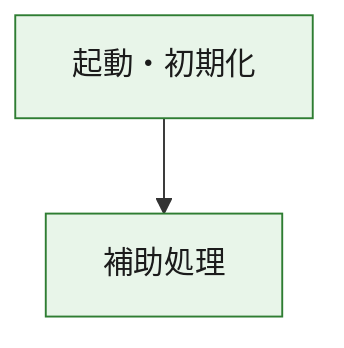
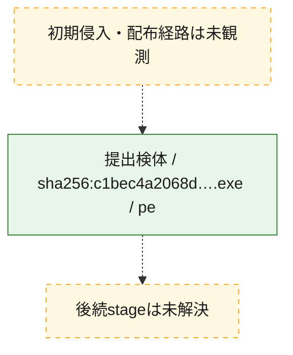
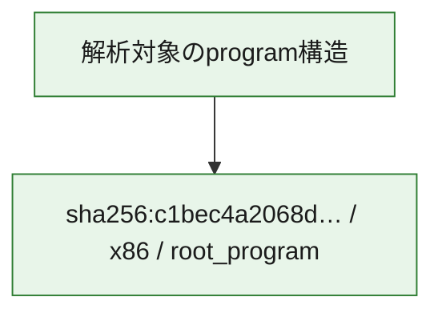

# 全体ロジック：c1bec4a2068d96d15e69160da51af01b07ddf938772f67a52b0a221a70010317

代表関数の静的証跡から、起動・初期化の処理群を確認しました。

## 読み方

- phaseの掲載順は解析上の整理順です。observed_call_edgesがない段階間の実行順を断定しません。
- 図の実線は静的に観測した関係、点線と黄色のノードは未観測・未解決の関係を示します。
- 図は静的な要約であり、動的実行を再現するものではありません。
- 詳細な関数解説とfingerprintは[STATIC-LOGIC.md](STATIC-LOGIC.md)を参照してください。

## 静的可視化

### 実行フロー

### 感染チェーン

### モジュール関係

## 処理段階

### 1. 起動・初期化

entry pointから初期化と後続処理への移行を確認します。
確度: `confirmed_static_function_evidence`

- `c1bec4a2068d96d15e69160da51af01b07ddf938772f67a52b0a221a70010317:ghidra:180001010` — 初期化と主要処理への分岐を行う入口関数です。 状態: `succeeded`、選定理由: `entry_point`, `meaningful_symbol_name`, `reviewed_call_centrality:22`, `role:entrypoint`, `small_program_complete_context`

### 2. 補助処理

主要処理を支える一般内部関数またはlibrary処理を確認します。
確度: `confirmed_static_function_evidence`

- `c1bec4a2068d96d15e69160da51af01b07ddf938772f67a52b0a221a70010317:ghidra:180001240` — 検体内部の一般処理を実装する関数です。 状態: `succeeded`、選定理由: `context_representative`, `reviewed_call_centrality:2`, `small_program_complete_context`
- `c1bec4a2068d96d15e69160da51af01b07ddf938772f67a52b0a221a70010317:ghidra:180001350` — 検体内部の一般処理を実装する関数です。 状態: `succeeded`、選定理由: `context_representative`, `reviewed_call_centrality:25`, `small_program_complete_context`
- `c1bec4a2068d96d15e69160da51af01b07ddf938772f67a52b0a221a70010317:ghidra:180003780` — 検体内部の一般処理を実装する関数です。 状態: `succeeded`、選定理由: `context_representative`, `reviewed_call_centrality:2`, `small_program_complete_context`
- `c1bec4a2068d96d15e69160da51af01b07ddf938772f67a52b0a221a70010317:ghidra:1800038e0` — 検体内部の一般処理を実装する関数です。 状態: `succeeded`、選定理由: `context_representative`, `reviewed_call_centrality:2`, `small_program_complete_context`

## 観測したcall関係

- `c1bec4a2068d96d15e69160da51af01b07ddf938772f67a52b0a221a70010317:ghidra:180001010` → `c1bec4a2068d96d15e69160da51af01b07ddf938772f67a52b0a221a70010317:ghidra:180001240` （`startup` → `support`）
- `c1bec4a2068d96d15e69160da51af01b07ddf938772f67a52b0a221a70010317:ghidra:180001010` → `c1bec4a2068d96d15e69160da51af01b07ddf938772f67a52b0a221a70010317:ghidra:180001350` （`startup` → `support`）
- `c1bec4a2068d96d15e69160da51af01b07ddf938772f67a52b0a221a70010317:ghidra:180001350` → `c1bec4a2068d96d15e69160da51af01b07ddf938772f67a52b0a221a70010317:ghidra:180001240` （`support` → `support`）
- `c1bec4a2068d96d15e69160da51af01b07ddf938772f67a52b0a221a70010317:ghidra:180001350` → `c1bec4a2068d96d15e69160da51af01b07ddf938772f67a52b0a221a70010317:ghidra:180003780` （`support` → `support`）
- `c1bec4a2068d96d15e69160da51af01b07ddf938772f67a52b0a221a70010317:ghidra:180001350` → `c1bec4a2068d96d15e69160da51af01b07ddf938772f67a52b0a221a70010317:ghidra:1800038e0` （`support` → `support`）
- `c1bec4a2068d96d15e69160da51af01b07ddf938772f67a52b0a221a70010317:ghidra:180003780` → `c1bec4a2068d96d15e69160da51af01b07ddf938772f67a52b0a221a70010317:ghidra:1800038e0` （`support` → `support`）
- `ghidra-function:02fa09631a55a51b064dbf84` → `ghidra-external:02cef2a4e7651efbd9bbafd6` （`unclassified` → `unclassified`）
- `ghidra-function:02fa09631a55a51b064dbf84` → `ghidra-external:09a525906073d146158fa4a3` （`unclassified` → `unclassified`）
- `ghidra-function:02fa09631a55a51b064dbf84` → `ghidra-external:09f384859b79122ca7284872` （`unclassified` → `unclassified`）
- `ghidra-function:02fa09631a55a51b064dbf84` → `ghidra-external:1197cc7f9efc51c380ecbdaf` （`unclassified` → `unclassified`）
- `ghidra-function:02fa09631a55a51b064dbf84` → `ghidra-external:1bf991a496147572f2b3a07f` （`unclassified` → `unclassified`）
- `ghidra-function:02fa09631a55a51b064dbf84` → `ghidra-external:24d78ec56fa2c421cf770e70` （`unclassified` → `unclassified`）
- `ghidra-function:02fa09631a55a51b064dbf84` → `ghidra-external:2e683f380c3223ef5a051c56` （`unclassified` → `unclassified`）
- `ghidra-function:02fa09631a55a51b064dbf84` → `ghidra-external:49cf8fc3ade36bf19c9c7405` （`unclassified` → `unclassified`）
- `ghidra-function:02fa09631a55a51b064dbf84` → `ghidra-external:7307417a6c58e1a71ef6851f` （`unclassified` → `unclassified`）
- `ghidra-function:02fa09631a55a51b064dbf84` → `ghidra-external:762c6d5cc791e0d0f5362348` （`unclassified` → `unclassified`）
- `ghidra-function:02fa09631a55a51b064dbf84` → `ghidra-external:910282a6a6d731b1ba341e05` （`unclassified` → `unclassified`）
- `ghidra-function:02fa09631a55a51b064dbf84` → `ghidra-external:96bfe91d0756381f4ba58dfa` （`unclassified` → `unclassified`）
- `ghidra-function:02fa09631a55a51b064dbf84` → `ghidra-external:a45913123687f7e0980e128b` （`unclassified` → `unclassified`）
- `ghidra-function:02fa09631a55a51b064dbf84` → `ghidra-external:a68992cac61a50e69cebef83` （`unclassified` → `unclassified`）
- `ghidra-function:02fa09631a55a51b064dbf84` → `ghidra-external:b20896f307749aca1425033d` （`unclassified` → `unclassified`）
- `ghidra-function:02fa09631a55a51b064dbf84` → `ghidra-external:d05c9cb3b6235c21cfc17aa1` （`unclassified` → `unclassified`）
- `ghidra-function:02fa09631a55a51b064dbf84` → `ghidra-external:d0fcb4a9f490fcb5e0dbf86f` （`unclassified` → `unclassified`）
- `ghidra-function:02fa09631a55a51b064dbf84` → `ghidra-external:d37659fab8ba74a917907678` （`unclassified` → `unclassified`）
- `ghidra-function:02fa09631a55a51b064dbf84` → `ghidra-external:d628f1be20bf3fd8731383ca` （`unclassified` → `unclassified`）
- `ghidra-function:02fa09631a55a51b064dbf84` → `ghidra-external:f2d94e338b2601a511414909` （`unclassified` → `unclassified`）
- `ghidra-function:02fa09631a55a51b064dbf84` → `ghidra-external:fc6f18074f7c5f058aa858c2` （`unclassified` → `unclassified`）
- `ghidra-function:02fa09631a55a51b064dbf84` → `ghidra-function:0200b21201bf10bd71ae958c` （`unclassified` → `unclassified`）
- `ghidra-function:02fa09631a55a51b064dbf84` → `ghidra-function:d0a987173d8a2f8ffeb6cf74` （`unclassified` → `unclassified`）
- `ghidra-function:02fa09631a55a51b064dbf84` → `ghidra-function:dd1021a84266826b9d8e0c12` （`unclassified` → `unclassified`）
- `ghidra-function:09de00adec84f002bd759712` → `ghidra-function:02fa09631a55a51b064dbf84` （`unclassified` → `unclassified`）
- `ghidra-function:09de00adec84f002bd759712` → `ghidra-function:2674117cacdea3a161b5a592` （`unclassified` → `unclassified`）
- `ghidra-function:09de00adec84f002bd759712` → `ghidra-function:34657b521bfd44b924fe412a` （`unclassified` → `unclassified`）
- `ghidra-function:09de00adec84f002bd759712` → `ghidra-function:4112be6dcd48319e5b2c2b90` （`unclassified` → `unclassified`）
- `ghidra-function:09de00adec84f002bd759712` → `ghidra-function:56e5aa269eb5b86d56ff5081` （`unclassified` → `unclassified`）
- `ghidra-function:09de00adec84f002bd759712` → `ghidra-function:6557892b51f91ae63426fb5e` （`unclassified` → `unclassified`）
- `ghidra-function:09de00adec84f002bd759712` → `ghidra-function:8bafe010383303a4e12cc1ba` （`unclassified` → `unclassified`）
- `ghidra-function:09de00adec84f002bd759712` → `ghidra-function:bb3968db8e274342fcfde2b3` （`unclassified` → `unclassified`）
- `ghidra-function:09de00adec84f002bd759712` → `ghidra-function:c87c9a154fb2512d0b316c53` （`unclassified` → `unclassified`）
- `ghidra-function:09de00adec84f002bd759712` → `ghidra-function:cb6282dfe98ba25709f4a242` （`unclassified` → `unclassified`）
- `ghidra-function:09de00adec84f002bd759712` → `ghidra-function:dd1021a84266826b9d8e0c12` （`unclassified` → `unclassified`）
- `ghidra-function:09de00adec84f002bd759712` → `ghidra-function:e37a9ab1259435ed1d6c0ca3` （`unclassified` → `unclassified`）
- `ghidra-function:d0a987173d8a2f8ffeb6cf74` → `ghidra-function:0200b21201bf10bd71ae958c` （`unclassified` → `unclassified`）

## 解析範囲と制約

- 選定外関数は全体inventoryへ残しますが、関数本体の個別解説対象にはしていません。
- indirect call、難読化、packer、VM、壊れたcontrol flowによりcall関係が欠落する場合があります。
- 文書は静的解析に基づき、検体実行や外部通信による動的確認は行っていません。
