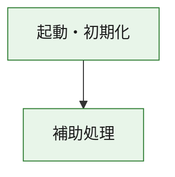
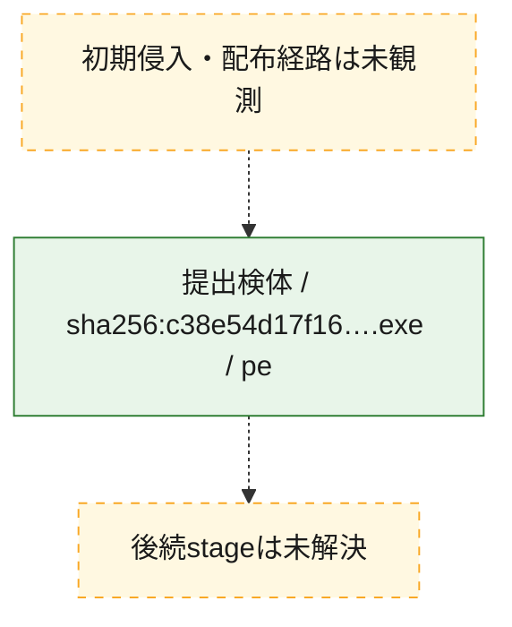
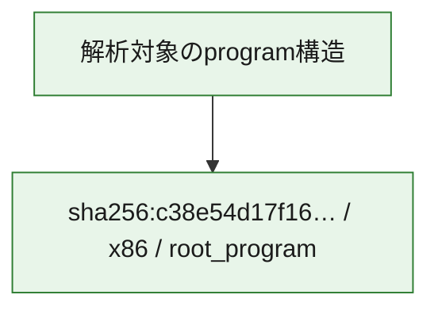

# 全体ロジック：c38e54d17f165c14f1d4e7fe000c3a47a48ccc89bae65fb6fc8e57373b7eb5e3

代表関数の静的証跡から、起動・初期化の処理群を確認しました。

## 読み方

- phaseの掲載順は解析上の整理順です。observed_call_edgesがない段階間の実行順を断定しません。
- 図の実線は静的に観測した関係、点線と黄色のノードは未観測・未解決の関係を示します。
- 図は静的な要約であり、動的実行を再現するものではありません。
- 詳細な関数解説とfingerprintは[STATIC-LOGIC.md](STATIC-LOGIC.md)を参照してください。

## 静的可視化

### 実行フロー

### 感染チェーン

### モジュール関係

## 処理段階

### 1. 起動・初期化

entry pointから初期化と後続処理への移行を確認します。
確度: `confirmed_static_function_evidence`

- `c38e54d17f165c14f1d4e7fe000c3a47a48ccc89bae65fb6fc8e57373b7eb5e3:ghidra:180001010` — 初期化と主要処理への分岐を行う入口関数です。 状態: `succeeded`、選定理由: `entry_point`, `meaningful_symbol_name`, `reviewed_call_centrality:22`, `role:entrypoint`, `small_program_complete_context`

### 2. 補助処理

主要処理を支える一般内部関数またはlibrary処理を確認します。
確度: `confirmed_static_function_evidence`

- `c38e54d17f165c14f1d4e7fe000c3a47a48ccc89bae65fb6fc8e57373b7eb5e3:ghidra:180001240` — 検体内部の一般処理を実装する関数です。 状態: `succeeded`、選定理由: `context_representative`, `reviewed_call_centrality:2`, `small_program_complete_context`
- `c38e54d17f165c14f1d4e7fe000c3a47a48ccc89bae65fb6fc8e57373b7eb5e3:ghidra:180001350` — 検体内部の一般処理を実装する関数です。 状態: `succeeded`、選定理由: `context_representative`, `reviewed_call_centrality:25`, `small_program_complete_context`
- `c38e54d17f165c14f1d4e7fe000c3a47a48ccc89bae65fb6fc8e57373b7eb5e3:ghidra:180003780` — 検体内部の一般処理を実装する関数です。 状態: `succeeded`、選定理由: `context_representative`, `reviewed_call_centrality:2`, `small_program_complete_context`
- `c38e54d17f165c14f1d4e7fe000c3a47a48ccc89bae65fb6fc8e57373b7eb5e3:ghidra:1800038e0` — 検体内部の一般処理を実装する関数です。 状態: `succeeded`、選定理由: `context_representative`, `reviewed_call_centrality:2`, `small_program_complete_context`

## 観測したcall関係

- `c38e54d17f165c14f1d4e7fe000c3a47a48ccc89bae65fb6fc8e57373b7eb5e3:ghidra:180001010` → `c38e54d17f165c14f1d4e7fe000c3a47a48ccc89bae65fb6fc8e57373b7eb5e3:ghidra:180001240` （`startup` → `support`）
- `c38e54d17f165c14f1d4e7fe000c3a47a48ccc89bae65fb6fc8e57373b7eb5e3:ghidra:180001010` → `c38e54d17f165c14f1d4e7fe000c3a47a48ccc89bae65fb6fc8e57373b7eb5e3:ghidra:180001350` （`startup` → `support`）
- `c38e54d17f165c14f1d4e7fe000c3a47a48ccc89bae65fb6fc8e57373b7eb5e3:ghidra:180001350` → `c38e54d17f165c14f1d4e7fe000c3a47a48ccc89bae65fb6fc8e57373b7eb5e3:ghidra:180001240` （`support` → `support`）
- `c38e54d17f165c14f1d4e7fe000c3a47a48ccc89bae65fb6fc8e57373b7eb5e3:ghidra:180001350` → `c38e54d17f165c14f1d4e7fe000c3a47a48ccc89bae65fb6fc8e57373b7eb5e3:ghidra:180003780` （`support` → `support`）
- `c38e54d17f165c14f1d4e7fe000c3a47a48ccc89bae65fb6fc8e57373b7eb5e3:ghidra:180001350` → `c38e54d17f165c14f1d4e7fe000c3a47a48ccc89bae65fb6fc8e57373b7eb5e3:ghidra:1800038e0` （`support` → `support`）
- `c38e54d17f165c14f1d4e7fe000c3a47a48ccc89bae65fb6fc8e57373b7eb5e3:ghidra:180003780` → `c38e54d17f165c14f1d4e7fe000c3a47a48ccc89bae65fb6fc8e57373b7eb5e3:ghidra:1800038e0` （`support` → `support`）
- `ghidra-function:2cbbb058c4c70bf52b42ebe2` → `ghidra-function:0965d0658605ff85dbc83a77` （`unclassified` → `unclassified`）
- `ghidra-function:2cbbb058c4c70bf52b42ebe2` → `ghidra-function:1c4e9eac05fc65b301bba5ae` （`unclassified` → `unclassified`）
- `ghidra-function:2cbbb058c4c70bf52b42ebe2` → `ghidra-function:1c67d947fc2139b002743b4f` （`unclassified` → `unclassified`）
- `ghidra-function:2cbbb058c4c70bf52b42ebe2` → `ghidra-function:3a97e0628ceb539f044c3735` （`unclassified` → `unclassified`）
- `ghidra-function:2cbbb058c4c70bf52b42ebe2` → `ghidra-function:3f160d36ae092ffa65604433` （`unclassified` → `unclassified`）
- `ghidra-function:2cbbb058c4c70bf52b42ebe2` → `ghidra-function:5575d47bd621fa793d07975b` （`unclassified` → `unclassified`）
- `ghidra-function:2cbbb058c4c70bf52b42ebe2` → `ghidra-function:57d7914b249df89e3c551657` （`unclassified` → `unclassified`）
- `ghidra-function:2cbbb058c4c70bf52b42ebe2` → `ghidra-function:6e3fa7a7cf582cbaddab382c` （`unclassified` → `unclassified`）
- `ghidra-function:2cbbb058c4c70bf52b42ebe2` → `ghidra-function:8fbdb99987efe3c5c5bf434e` （`unclassified` → `unclassified`）
- `ghidra-function:2cbbb058c4c70bf52b42ebe2` → `ghidra-function:a132792f3493c6fc9d566880` （`unclassified` → `unclassified`）
- `ghidra-function:2cbbb058c4c70bf52b42ebe2` → `ghidra-function:db08a277cf4d2e2e7aafa2e2` （`unclassified` → `unclassified`）
- `ghidra-function:2cbbb058c4c70bf52b42ebe2` → `ghidra-function:e6efc16c359b8850502dac8d` （`unclassified` → `unclassified`）
- `ghidra-function:7ef59055279a7701a1d4b97d` → `ghidra-function:235c3fbd04c349e4e61a1625` （`unclassified` → `unclassified`）
- `ghidra-function:8fbdb99987efe3c5c5bf434e` → `ghidra-external:02da286115919c92f3f26526` （`unclassified` → `unclassified`）
- `ghidra-function:8fbdb99987efe3c5c5bf434e` → `ghidra-external:0d3586042c4ee50b0e506ce9` （`unclassified` → `unclassified`）
- `ghidra-function:8fbdb99987efe3c5c5bf434e` → `ghidra-external:11a9899bc45d0c613ea0ff66` （`unclassified` → `unclassified`）
- `ghidra-function:8fbdb99987efe3c5c5bf434e` → `ghidra-external:15f19533d12bd9f354cda76d` （`unclassified` → `unclassified`）
- `ghidra-function:8fbdb99987efe3c5c5bf434e` → `ghidra-external:1c19d1ca515a2cb370122295` （`unclassified` → `unclassified`）
- `ghidra-function:8fbdb99987efe3c5c5bf434e` → `ghidra-external:2c36e151817753f699bd996d` （`unclassified` → `unclassified`）
- `ghidra-function:8fbdb99987efe3c5c5bf434e` → `ghidra-external:3e7fee371a34371757f177ec` （`unclassified` → `unclassified`）
- `ghidra-function:8fbdb99987efe3c5c5bf434e` → `ghidra-external:4a3c1522af0d9753ff3db36a` （`unclassified` → `unclassified`）
- `ghidra-function:8fbdb99987efe3c5c5bf434e` → `ghidra-external:5fed4da8b3ad3af5efd92021` （`unclassified` → `unclassified`）
- `ghidra-function:8fbdb99987efe3c5c5bf434e` → `ghidra-external:6aed7614cc56e1918d52a879` （`unclassified` → `unclassified`）
- `ghidra-function:8fbdb99987efe3c5c5bf434e` → `ghidra-external:7536b55cac0fa5da0655a24c` （`unclassified` → `unclassified`）
- `ghidra-function:8fbdb99987efe3c5c5bf434e` → `ghidra-external:a56990be574f81da13360e70` （`unclassified` → `unclassified`）
- `ghidra-function:8fbdb99987efe3c5c5bf434e` → `ghidra-external:b7e6b6a6a6b3e051db850c82` （`unclassified` → `unclassified`）
- `ghidra-function:8fbdb99987efe3c5c5bf434e` → `ghidra-external:b94a358a9484c916db7d6f3c` （`unclassified` → `unclassified`）
- `ghidra-function:8fbdb99987efe3c5c5bf434e` → `ghidra-external:c4b7c40e2ec9df5e4d40b79e` （`unclassified` → `unclassified`）
- `ghidra-function:8fbdb99987efe3c5c5bf434e` → `ghidra-external:c8c700cb1efaa42d4ba7e094` （`unclassified` → `unclassified`）
- `ghidra-function:8fbdb99987efe3c5c5bf434e` → `ghidra-external:d82b806e9036d9d3d402ae91` （`unclassified` → `unclassified`）
- `ghidra-function:8fbdb99987efe3c5c5bf434e` → `ghidra-external:db5042ba697af1c49ed5f419` （`unclassified` → `unclassified`）
- `ghidra-function:8fbdb99987efe3c5c5bf434e` → `ghidra-external:e72cdc7dd6bb4669a7824d02` （`unclassified` → `unclassified`）
- `ghidra-function:8fbdb99987efe3c5c5bf434e` → `ghidra-external:f1e6169f1967a62eb506d284` （`unclassified` → `unclassified`）
- `ghidra-function:8fbdb99987efe3c5c5bf434e` → `ghidra-external:f7ba41e21a5ef32a86e93588` （`unclassified` → `unclassified`）
- `ghidra-function:8fbdb99987efe3c5c5bf434e` → `ghidra-function:0965d0658605ff85dbc83a77` （`unclassified` → `unclassified`）
- `ghidra-function:8fbdb99987efe3c5c5bf434e` → `ghidra-function:235c3fbd04c349e4e61a1625` （`unclassified` → `unclassified`）
- `ghidra-function:8fbdb99987efe3c5c5bf434e` → `ghidra-function:7ef59055279a7701a1d4b97d` （`unclassified` → `unclassified`）

## 解析範囲と制約

- 選定外関数は全体inventoryへ残しますが、関数本体の個別解説対象にはしていません。
- indirect call、難読化、packer、VM、壊れたcontrol flowによりcall関係が欠落する場合があります。
- 文書は静的解析に基づき、検体実行や外部通信による動的確認は行っていません。
