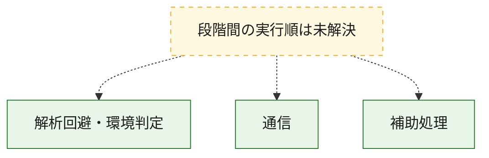
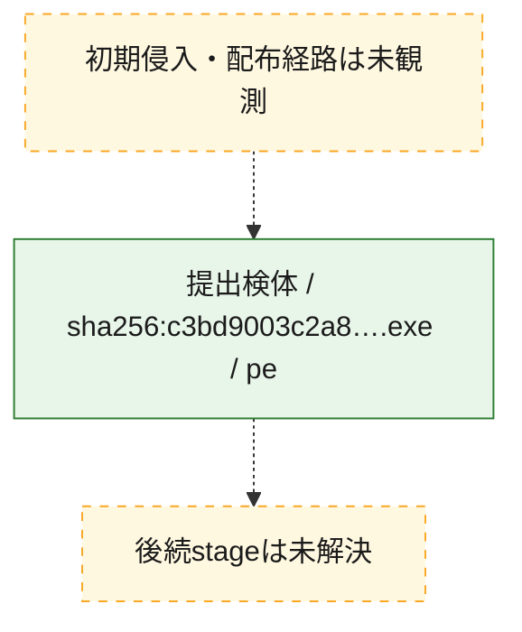
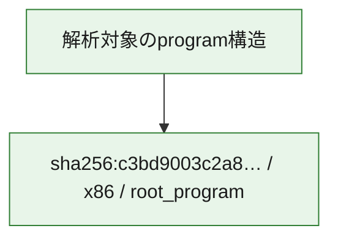

# 全体ロジック：c3bd9003c2a8b57c18442587a4d35f1bf0780b3d069bf5f7042e1351957403f5

代表関数の静的証跡から、解析回避・環境判定、通信の処理群を確認しました。

## 読み方

- phaseの掲載順は解析上の整理順です。observed_call_edgesがない段階間の実行順を断定しません。
- 図の実線は静的に観測した関係、点線と黄色のノードは未観測・未解決の関係を示します。
- 図は静的な要約であり、動的実行を再現するものではありません。
- 詳細な関数解説とfingerprintは[STATIC-LOGIC.md](STATIC-LOGIC.md)を参照してください。

## 静的可視化

### 実行フロー

### 感染チェーン

### モジュール関係

## 処理段階

### 1. 解析回避・環境判定

debugger、sandbox、仮想環境、時間差などの判定を確認します。
確度: `confirmed_static_function_evidence`

- `c3bd9003c2a8b57c18442587a4d35f1bf0780b3d069bf5f7042e1351957403f5:ghidra:18000e7a0` — debugger、仮想環境、sandbox、または時間差の確認に関係する関数です。 状態: `succeeded`、選定理由: `entry_point`, `meaningful_symbol_name`, `reviewed_call_centrality:2`, `role:anti_analysis`

### 2. 通信

通信初期化、endpoint処理、送受信の役割を確認します。
確度: `confirmed_static_function_evidence`

- `c3bd9003c2a8b57c18442587a4d35f1bf0780b3d069bf5f7042e1351957403f5:ghidra:18000e660` — 通信初期化、送受信、またはendpoint処理に関係する関数です。 状態: `succeeded`、選定理由: `entry_point`, `meaningful_symbol_name`, `reviewed_call_centrality:2`, `role:network_communication`

### 3. 補助処理

主要処理を支える一般内部関数またはlibrary処理を確認します。
確度: `confirmed_static_function_evidence`

- `c3bd9003c2a8b57c18442587a4d35f1bf0780b3d069bf5f7042e1351957403f5:ghidra:180001020` — 検体内部の一般処理を実装する関数です。 状態: `succeeded`、選定理由: `context_representative`
- `c3bd9003c2a8b57c18442587a4d35f1bf0780b3d069bf5f7042e1351957403f5:ghidra:180001080` — 検体内部の一般処理を実装する関数です。 状態: `succeeded`、選定理由: `context_representative`
- `c3bd9003c2a8b57c18442587a4d35f1bf0780b3d069bf5f7042e1351957403f5:ghidra:1800010a0` — 検体内部の一般処理を実装する関数です。 状態: `succeeded`、選定理由: `context_representative`
- `c3bd9003c2a8b57c18442587a4d35f1bf0780b3d069bf5f7042e1351957403f5:ghidra:180001110` — 検体内部の一般処理を実装する関数です。 状態: `succeeded`、選定理由: `context_representative`
- `c3bd9003c2a8b57c18442587a4d35f1bf0780b3d069bf5f7042e1351957403f5:ghidra:180001120` — 検体内部の一般処理を実装する関数です。 状態: `succeeded`、選定理由: `context_representative`
- `c3bd9003c2a8b57c18442587a4d35f1bf0780b3d069bf5f7042e1351957403f5:ghidra:180001160` — 検体内部の一般処理を実装する関数です。 状態: `succeeded`、選定理由: `context_representative`
- `c3bd9003c2a8b57c18442587a4d35f1bf0780b3d069bf5f7042e1351957403f5:ghidra:180001180` — 検体内部の一般処理を実装する関数です。 状態: `succeeded`、選定理由: `context_representative`
- `c3bd9003c2a8b57c18442587a4d35f1bf0780b3d069bf5f7042e1351957403f5:ghidra:1800011c0` — 検体内部の一般処理を実装する関数です。 状態: `succeeded`、選定理由: `context_representative`
- `c3bd9003c2a8b57c18442587a4d35f1bf0780b3d069bf5f7042e1351957403f5:ghidra:180001200` — 検体内部の一般処理を実装する関数です。 状態: `succeeded`、選定理由: `context_representative`
- `c3bd9003c2a8b57c18442587a4d35f1bf0780b3d069bf5f7042e1351957403f5:ghidra:180001220` — 検体内部の一般処理を実装する関数です。 状態: `succeeded`、選定理由: `context_representative`
- `c3bd9003c2a8b57c18442587a4d35f1bf0780b3d069bf5f7042e1351957403f5:ghidra:180001260` — 検体内部の一般処理を実装する関数です。 状態: `succeeded`、選定理由: `context_representative`
- `c3bd9003c2a8b57c18442587a4d35f1bf0780b3d069bf5f7042e1351957403f5:ghidra:180001280` — 検体内部の一般処理を実装する関数です。 状態: `succeeded`、選定理由: `context_representative`
- `c3bd9003c2a8b57c18442587a4d35f1bf0780b3d069bf5f7042e1351957403f5:ghidra:1800012c0` — 検体内部の一般処理を実装する関数です。 状態: `succeeded`、選定理由: `context_representative`
- `c3bd9003c2a8b57c18442587a4d35f1bf0780b3d069bf5f7042e1351957403f5:ghidra:1800012e0` — 検体内部の一般処理を実装する関数です。 状態: `succeeded`、選定理由: `context_representative`
- `c3bd9003c2a8b57c18442587a4d35f1bf0780b3d069bf5f7042e1351957403f5:ghidra:180001300` — 検体内部の一般処理を実装する関数です。 状態: `succeeded`、選定理由: `context_representative`
- `c3bd9003c2a8b57c18442587a4d35f1bf0780b3d069bf5f7042e1351957403f5:ghidra:180001320` — 検体内部の一般処理を実装する関数です。 状態: `succeeded`、選定理由: `context_representative`
- `c3bd9003c2a8b57c18442587a4d35f1bf0780b3d069bf5f7042e1351957403f5:ghidra:180001340` — 検体内部の一般処理を実装する関数です。 状態: `succeeded`、選定理由: `context_representative`
- `c3bd9003c2a8b57c18442587a4d35f1bf0780b3d069bf5f7042e1351957403f5:ghidra:180001360` — 検体内部の一般処理を実装する関数です。 状態: `succeeded`、選定理由: `context_representative`
- `c3bd9003c2a8b57c18442587a4d35f1bf0780b3d069bf5f7042e1351957403f5:ghidra:180001380` — 検体内部の一般処理を実装する関数です。 状態: `succeeded`、選定理由: `context_representative`
- `c3bd9003c2a8b57c18442587a4d35f1bf0780b3d069bf5f7042e1351957403f5:ghidra:18000e620` — 検体内部の一般処理を実装する関数です。 状態: `succeeded`、選定理由: `entry_point`, `meaningful_symbol_name`, `reviewed_call_centrality:2`
- `c3bd9003c2a8b57c18442587a4d35f1bf0780b3d069bf5f7042e1351957403f5:ghidra:18000e640` — 検体内部の一般処理を実装する関数です。 状態: `succeeded`、選定理由: `entry_point`, `meaningful_symbol_name`, `reviewed_call_centrality:2`
- `c3bd9003c2a8b57c18442587a4d35f1bf0780b3d069bf5f7042e1351957403f5:ghidra:18000e680` — 検体内部の一般処理を実装する関数です。 状態: `succeeded`、選定理由: `entry_point`, `meaningful_symbol_name`, `reviewed_call_centrality:2`
- `c3bd9003c2a8b57c18442587a4d35f1bf0780b3d069bf5f7042e1351957403f5:ghidra:18000e6a0` — 検体内部の一般処理を実装する関数です。 状態: `succeeded`、選定理由: `entry_point`, `meaningful_symbol_name`, `reviewed_call_centrality:2`
- `c3bd9003c2a8b57c18442587a4d35f1bf0780b3d069bf5f7042e1351957403f5:ghidra:18000e6c0` — 検体内部の一般処理を実装する関数です。 状態: `succeeded`、選定理由: `entry_point`, `meaningful_symbol_name`, `reviewed_call_centrality:2`
- `c3bd9003c2a8b57c18442587a4d35f1bf0780b3d069bf5f7042e1351957403f5:ghidra:18000e6e0` — 検体内部の一般処理を実装する関数です。 状態: `succeeded`、選定理由: `entry_point`, `meaningful_symbol_name`, `reviewed_call_centrality:2`
- `c3bd9003c2a8b57c18442587a4d35f1bf0780b3d069bf5f7042e1351957403f5:ghidra:18000e700` — 検体内部の一般処理を実装する関数です。 状態: `succeeded`、選定理由: `entry_point`, `meaningful_symbol_name`, `reviewed_call_centrality:2`
- `c3bd9003c2a8b57c18442587a4d35f1bf0780b3d069bf5f7042e1351957403f5:ghidra:18000e720` — 検体内部の一般処理を実装する関数です。 状態: `succeeded`、選定理由: `entry_point`, `meaningful_symbol_name`, `reviewed_call_centrality:2`
- `c3bd9003c2a8b57c18442587a4d35f1bf0780b3d069bf5f7042e1351957403f5:ghidra:18000e740` — 検体内部の一般処理を実装する関数です。 状態: `succeeded`、選定理由: `entry_point`, `meaningful_symbol_name`, `reviewed_call_centrality:2`
- `c3bd9003c2a8b57c18442587a4d35f1bf0780b3d069bf5f7042e1351957403f5:ghidra:18000e760` — 検体内部の一般処理を実装する関数です。 状態: `succeeded`、選定理由: `entry_point`, `meaningful_symbol_name`, `reviewed_call_centrality:2`
- `c3bd9003c2a8b57c18442587a4d35f1bf0780b3d069bf5f7042e1351957403f5:ghidra:18000e780` — 検体内部の一般処理を実装する関数です。 状態: `succeeded`、選定理由: `entry_point`, `meaningful_symbol_name`, `reviewed_call_centrality:2`

## 観測したcall関係

- 代表関数間で直接解決できた呼出関係はありません。

## 解析範囲と制約

- 選定外関数は全体inventoryへ残しますが、関数本体の個別解説対象にはしていません。
- indirect call、難読化、packer、VM、壊れたcontrol flowによりcall関係が欠落する場合があります。
- 文書は静的解析に基づき、検体実行や外部通信による動的確認は行っていません。
