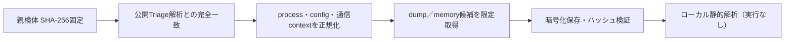

# Triage公開解析・後段取得証跡

## 完全ハッシュ一致

- 完全ハッシュ一致の公開解析は確認できませんでした。

## プロセス・通信

- 観測process: `取得できず`
- raw commandは保存せず、command SHA-256と処理patternだけをJSONへ保持しています。
- sandbox background trafficは`context_only`であり、C2へ自動昇格しません。

- 取得できませんでした。

## 二段目成果物

- `3a9b28dd1bf59a472b5ce8f2c8df007b13134b878746d169e1619018c8a5e549` / `memory_image` / 921600 bytes / 親と同一: `false` / 静的解析: `partial`

## 判定境界

Triage由来のfamily、process、config、通信は外部sandbox証跡です。config extractorが返したendpointはC2候補として扱えますが、
静的設定復元またはprocess帰属とprotocol応答が揃うまでは確認済みC2とはしません。取得成果物と検体は実行していません。
