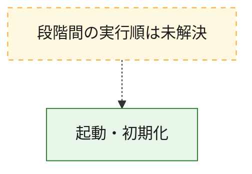
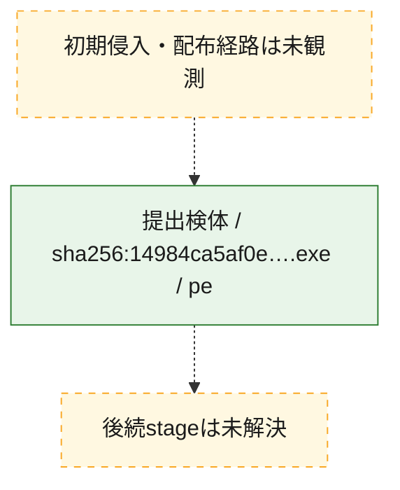
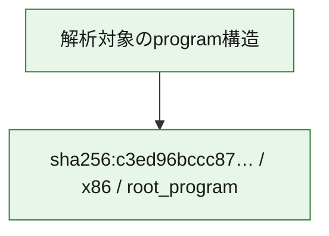

# 全体ロジック：c3ed96bccc8759baa100e65e5e04869f7bf66ef1d496b70a38cdb637f324d95a

代表関数の静的証跡から、起動・初期化の処理群を確認しました。

## 読み方

- phaseの掲載順は解析上の整理順です。observed_call_edgesがない段階間の実行順を断定しません。
- 図の実線は静的に観測した関係、点線と黄色のノードは未観測・未解決の関係を示します。
- 図は静的な要約であり、動的実行を再現するものではありません。
- 詳細な関数解説とfingerprintは[STATIC-LOGIC.md](STATIC-LOGIC.md)を参照してください。

## 静的可視化

### 実行フロー

### 感染チェーン

### モジュール関係

## 処理段階

### 1. 起動・初期化

entry pointから初期化と後続処理への移行を確認します。
確度: `confirmed_static_function_evidence`

- `c3ed96bccc8759baa100e65e5e04869f7bf66ef1d496b70a38cdb637f324d95a:ghidra:1437decc4` — 初期化と主要処理への分岐を行う入口関数です。 状態: `succeeded`、選定理由: `entry_point`, `large_function:instructions=98`, `meaningful_symbol_name`, `reviewed_call_centrality:21`, `role:entrypoint`, `small_program_complete_context`

## 観測したcall関係

- `ghidra-function:09b4fdc314d111e89b304898` → `ghidra-external:02b51fba52245a8fd570b72b` （`unclassified` → `unclassified`）
- `ghidra-function:09b4fdc314d111e89b304898` → `ghidra-external:041bde6eee98f622057dbff6` （`unclassified` → `unclassified`）
- `ghidra-function:09b4fdc314d111e89b304898` → `ghidra-external:0517b125fc95812e7e571467` （`unclassified` → `unclassified`）
- `ghidra-function:09b4fdc314d111e89b304898` → `ghidra-external:1fc89d25d1b3c2a1f3a2a899` （`unclassified` → `unclassified`）
- `ghidra-function:09b4fdc314d111e89b304898` → `ghidra-external:241f80899c74bee1c06cf389` （`unclassified` → `unclassified`）
- `ghidra-function:09b4fdc314d111e89b304898` → `ghidra-external:4d8d2be06432c9653233dae4` （`unclassified` → `unclassified`）
- `ghidra-function:09b4fdc314d111e89b304898` → `ghidra-external:575a5b117cf8ec6195379cf3` （`unclassified` → `unclassified`）
- `ghidra-function:09b4fdc314d111e89b304898` → `ghidra-external:5c00dabb4b7d3a126194e8cf` （`unclassified` → `unclassified`）
- `ghidra-function:09b4fdc314d111e89b304898` → `ghidra-external:6e017aa6e8b06daa9052d30a` （`unclassified` → `unclassified`）
- `ghidra-function:09b4fdc314d111e89b304898` → `ghidra-external:76da75eef4b1940408675ee9` （`unclassified` → `unclassified`）
- `ghidra-function:09b4fdc314d111e89b304898` → `ghidra-external:8d7d7e5b5da81fdc6dd90821` （`unclassified` → `unclassified`）
- `ghidra-function:09b4fdc314d111e89b304898` → `ghidra-external:98b2bbd6e91b68b992074378` （`unclassified` → `unclassified`）
- `ghidra-function:09b4fdc314d111e89b304898` → `ghidra-external:99f6aef9c38c99878aa7d17a` （`unclassified` → `unclassified`）
- `ghidra-function:09b4fdc314d111e89b304898` → `ghidra-external:a7303877a04737003920fd61` （`unclassified` → `unclassified`）
- `ghidra-function:09b4fdc314d111e89b304898` → `ghidra-external:a9bd91825e700ee4d5019cb2` （`unclassified` → `unclassified`）
- `ghidra-function:09b4fdc314d111e89b304898` → `ghidra-external:b42a11c20655700d2c777145` （`unclassified` → `unclassified`）
- `ghidra-function:09b4fdc314d111e89b304898` → `ghidra-external:bd488bf89fe6d486aca44fff` （`unclassified` → `unclassified`）
- `ghidra-function:09b4fdc314d111e89b304898` → `ghidra-external:c055e690241b14bf3ee5518e` （`unclassified` → `unclassified`）
- `ghidra-function:09b4fdc314d111e89b304898` → `ghidra-external:d806f0e7351b84eebaba9aeb` （`unclassified` → `unclassified`）
- `ghidra-function:09b4fdc314d111e89b304898` → `ghidra-external:e08118c5a0cf47e4239bb4e4` （`unclassified` → `unclassified`）
- `ghidra-function:09b4fdc314d111e89b304898` → `ghidra-external:f4488a5e7d0bc4e9abe7305e` （`unclassified` → `unclassified`）

## 解析範囲と制約

- 選定外関数は全体inventoryへ残しますが、関数本体の個別解説対象にはしていません。
- indirect call、難読化、packer、VM、壊れたcontrol flowによりcall関係が欠落する場合があります。
- 文書は静的解析に基づき、検体実行や外部通信による動的確認は行っていません。
