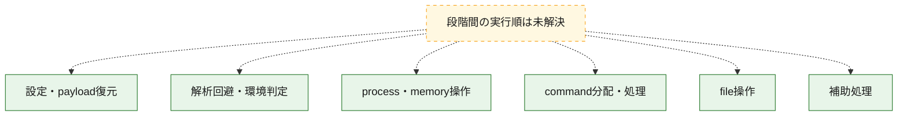
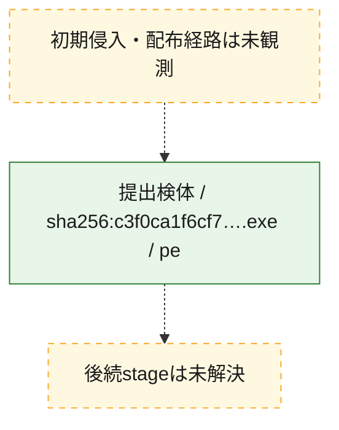
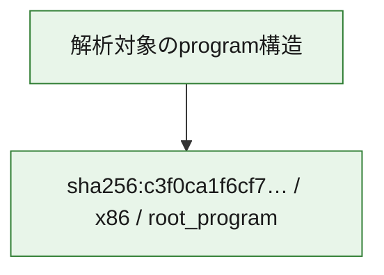

# 全体ロジック：c3f0ca1f6cf76241e333eda2446e3c773ad4e8d46a1e27ecc821fab26f152228

代表関数の静的証跡から、設定・payload復元、解析回避・環境判定、process・memory操作、command分配・処理、file操作の処理群を確認しました。

## 読み方

- phaseの掲載順は解析上の整理順です。observed_call_edgesがない段階間の実行順を断定しません。
- 図の実線は静的に観測した関係、点線と黄色のノードは未観測・未解決の関係を示します。
- 図は静的な要約であり、動的実行を再現するものではありません。
- 詳細な関数解説とfingerprintは[STATIC-LOGIC.md](STATIC-LOGIC.md)を参照してください。

## 静的可視化

### 実行フロー

### 感染チェーン

### モジュール関係

## 処理段階

### 1. 設定・payload復元

設定、resource、payload、暗号化データの復元・変換を確認します。
確度: `confirmed_static_function_evidence`

- `c3f0ca1f6cf76241e333eda2446e3c773ad4e8d46a1e27ecc821fab26f152228:ghidra:18000e4f0` — 設定、resource、payloadなどの解析・変換を行う関数です。 状態: `succeeded`、選定理由: `entry_point`, `meaningful_symbol_name`, `reviewed_call_centrality:3`, `role:config_or_data_transform`
- `c3f0ca1f6cf76241e333eda2446e3c773ad4e8d46a1e27ecc821fab26f152228:ghidra:18000e6b0` — 設定、resource、payloadなどの解析・変換を行う関数です。 状態: `succeeded`、選定理由: `entry_point`, `meaningful_symbol_name`, `reviewed_call_centrality:3`, `role:config_or_data_transform`
- `c3f0ca1f6cf76241e333eda2446e3c773ad4e8d46a1e27ecc821fab26f152228:ghidra:18000e6f0` — 設定、resource、payloadなどの解析・変換を行う関数です。 状態: `succeeded`、選定理由: `entry_point`, `meaningful_symbol_name`, `reviewed_call_centrality:3`, `role:config_or_data_transform`
- `c3f0ca1f6cf76241e333eda2446e3c773ad4e8d46a1e27ecc821fab26f152228:ghidra:18000e9f0` — 設定、resource、payloadなどの解析・変換を行う関数です。 状態: `succeeded`、選定理由: `entry_point`, `meaningful_symbol_name`, `reviewed_call_centrality:3`, `role:config_or_data_transform`
- `c3f0ca1f6cf76241e333eda2446e3c773ad4e8d46a1e27ecc821fab26f152228:ghidra:18000ebf0` — 設定、resource、payloadなどの解析・変換を行う関数です。 状態: `succeeded`、選定理由: `entry_point`, `meaningful_symbol_name`, `reviewed_call_centrality:3`, `role:config_or_data_transform`
- `c3f0ca1f6cf76241e333eda2446e3c773ad4e8d46a1e27ecc821fab26f152228:ghidra:18000ec30` — 設定、resource、payloadなどの解析・変換を行う関数です。 状態: `succeeded`、選定理由: `entry_point`, `meaningful_symbol_name`, `reviewed_call_centrality:3`, `role:config_or_data_transform`
- `c3f0ca1f6cf76241e333eda2446e3c773ad4e8d46a1e27ecc821fab26f152228:ghidra:18000ecf0` — 設定、resource、payloadなどの解析・変換を行う関数です。 状態: `succeeded`、選定理由: `entry_point`, `meaningful_symbol_name`, `reviewed_call_centrality:3`, `role:config_or_data_transform`
- `c3f0ca1f6cf76241e333eda2446e3c773ad4e8d46a1e27ecc821fab26f152228:ghidra:18000f070` — 設定、resource、payloadなどの解析・変換を行う関数です。 状態: `succeeded`、選定理由: `entry_point`, `meaningful_symbol_name`, `reviewed_call_centrality:3`, `role:config_or_data_transform`
- `c3f0ca1f6cf76241e333eda2446e3c773ad4e8d46a1e27ecc821fab26f152228:ghidra:18000f1f0` — 設定、resource、payloadなどの解析・変換を行う関数です。 状態: `succeeded`、選定理由: `entry_point`, `meaningful_symbol_name`, `reviewed_call_centrality:3`, `role:config_or_data_transform`
- `c3f0ca1f6cf76241e333eda2446e3c773ad4e8d46a1e27ecc821fab26f152228:ghidra:18000f370` — 設定、resource、payloadなどの解析・変換を行う関数です。 状態: `succeeded`、選定理由: `entry_point`, `meaningful_symbol_name`, `reviewed_call_centrality:3`, `role:config_or_data_transform`
- `c3f0ca1f6cf76241e333eda2446e3c773ad4e8d46a1e27ecc821fab26f152228:ghidra:18000f4f0` — 設定、resource、payloadなどの解析・変換を行う関数です。 状態: `succeeded`、選定理由: `entry_point`, `meaningful_symbol_name`, `reviewed_call_centrality:3`, `role:config_or_data_transform`
- `c3f0ca1f6cf76241e333eda2446e3c773ad4e8d46a1e27ecc821fab26f152228:ghidra:18000f8b0` — 設定、resource、payloadなどの解析・変換を行う関数です。 状態: `succeeded`、選定理由: `entry_point`, `meaningful_symbol_name`, `reviewed_call_centrality:3`, `role:config_or_data_transform`
- `c3f0ca1f6cf76241e333eda2446e3c773ad4e8d46a1e27ecc821fab26f152228:ghidra:18000f8f0` — 設定、resource、payloadなどの解析・変換を行う関数です。 状態: `succeeded`、選定理由: `entry_point`, `meaningful_symbol_name`, `reviewed_call_centrality:3`, `role:config_or_data_transform`
- `c3f0ca1f6cf76241e333eda2446e3c773ad4e8d46a1e27ecc821fab26f152228:ghidra:18000f930` — 設定、resource、payloadなどの解析・変換を行う関数です。 状態: `succeeded`、選定理由: `entry_point`, `meaningful_symbol_name`, `reviewed_call_centrality:3`, `role:config_or_data_transform`
- `c3f0ca1f6cf76241e333eda2446e3c773ad4e8d46a1e27ecc821fab26f152228:ghidra:18000f970` — 設定、resource、payloadなどの解析・変換を行う関数です。 状態: `succeeded`、選定理由: `entry_point`, `meaningful_symbol_name`, `reviewed_call_centrality:3`, `role:config_or_data_transform`
- `c3f0ca1f6cf76241e333eda2446e3c773ad4e8d46a1e27ecc821fab26f152228:ghidra:18000f9b0` — 設定、resource、payloadなどの解析・変換を行う関数です。 状態: `succeeded`、選定理由: `entry_point`, `meaningful_symbol_name`, `reviewed_call_centrality:3`, `role:config_or_data_transform`
- `c3f0ca1f6cf76241e333eda2446e3c773ad4e8d46a1e27ecc821fab26f152228:ghidra:18000f9f0` — 設定、resource、payloadなどの解析・変換を行う関数です。 状態: `succeeded`、選定理由: `entry_point`, `meaningful_symbol_name`, `reviewed_call_centrality:3`, `role:config_or_data_transform`
- `c3f0ca1f6cf76241e333eda2446e3c773ad4e8d46a1e27ecc821fab26f152228:ghidra:18000fa30` — 設定、resource、payloadなどの解析・変換を行う関数です。 状態: `succeeded`、選定理由: `entry_point`, `meaningful_symbol_name`, `reviewed_call_centrality:3`, `role:config_or_data_transform`

### 2. 解析回避・環境判定

debugger、sandbox、仮想環境、時間差などの判定を確認します。
確度: `confirmed_static_function_evidence`

- `c3f0ca1f6cf76241e333eda2446e3c773ad4e8d46a1e27ecc821fab26f152228:ghidra:18000e730` — debugger、仮想環境、sandbox、または時間差の確認に関係する関数です。 状態: `succeeded`、選定理由: `entry_point`, `meaningful_symbol_name`, `reviewed_call_centrality:3`, `role:anti_analysis`
- `c3f0ca1f6cf76241e333eda2446e3c773ad4e8d46a1e27ecc821fab26f152228:ghidra:18000e770` — debugger、仮想環境、sandbox、または時間差の確認に関係する関数です。 状態: `succeeded`、選定理由: `entry_point`, `meaningful_symbol_name`, `reviewed_call_centrality:3`, `role:anti_analysis`
- `c3f0ca1f6cf76241e333eda2446e3c773ad4e8d46a1e27ecc821fab26f152228:ghidra:18000e7b0` — debugger、仮想環境、sandbox、または時間差の確認に関係する関数です。 状態: `succeeded`、選定理由: `entry_point`, `meaningful_symbol_name`, `reviewed_call_centrality:3`, `role:anti_analysis`
- `c3f0ca1f6cf76241e333eda2446e3c773ad4e8d46a1e27ecc821fab26f152228:ghidra:18000e7f0` — debugger、仮想環境、sandbox、または時間差の確認に関係する関数です。 状態: `succeeded`、選定理由: `entry_point`, `meaningful_symbol_name`, `reviewed_call_centrality:3`, `role:anti_analysis`
- `c3f0ca1f6cf76241e333eda2446e3c773ad4e8d46a1e27ecc821fab26f152228:ghidra:18000e830` — debugger、仮想環境、sandbox、または時間差の確認に関係する関数です。 状態: `succeeded`、選定理由: `entry_point`, `meaningful_symbol_name`, `reviewed_call_centrality:3`, `role:anti_analysis`
- `c3f0ca1f6cf76241e333eda2446e3c773ad4e8d46a1e27ecc821fab26f152228:ghidra:18000e870` — debugger、仮想環境、sandbox、または時間差の確認に関係する関数です。 状態: `succeeded`、選定理由: `entry_point`, `meaningful_symbol_name`, `reviewed_call_centrality:3`, `role:anti_analysis`

### 3. process・memory操作

process、thread、module、memory操作と実行移行を確認します。
確度: `confirmed_static_function_evidence`

- `c3f0ca1f6cf76241e333eda2446e3c773ad4e8d46a1e27ecc821fab26f152228:ghidra:180010070` — process、thread、module、またはmemory操作に関係する関数です。 状態: `succeeded`、選定理由: `entry_point`, `meaningful_symbol_name`, `reviewed_call_centrality:3`, `role:process_or_memory_operation`

### 4. command分配・処理

受信commandやtaskの解釈、分配、個別handlerへの移行を確認します。
確度: `confirmed_static_function_evidence`

- `c3f0ca1f6cf76241e333eda2446e3c773ad4e8d46a1e27ecc821fab26f152228:ghidra:18000e4b0` — commandの解釈、分配、または個別処理を担当する関数です。 状態: `succeeded`、選定理由: `entry_point`, `meaningful_symbol_name`, `reviewed_call_centrality:3`, `role:command_dispatch_or_handler`

### 5. file操作

fileやdirectoryの作成、読書き、削除を確認します。
確度: `confirmed_static_function_evidence`

- `c3f0ca1f6cf76241e333eda2446e3c773ad4e8d46a1e27ecc821fab26f152228:ghidra:18000eb70` — fileまたはdirectoryの読書き・管理に関係する関数です。 状態: `succeeded`、選定理由: `entry_point`, `meaningful_symbol_name`, `reviewed_call_centrality:3`, `role:file_operation`
- `c3f0ca1f6cf76241e333eda2446e3c773ad4e8d46a1e27ecc821fab26f152228:ghidra:18000f170` — fileまたはdirectoryの読書き・管理に関係する関数です。 状態: `succeeded`、選定理由: `entry_point`, `meaningful_symbol_name`, `reviewed_call_centrality:3`, `role:file_operation`
- `c3f0ca1f6cf76241e333eda2446e3c773ad4e8d46a1e27ecc821fab26f152228:ghidra:18000f630` — fileまたはdirectoryの読書き・管理に関係する関数です。 状態: `succeeded`、選定理由: `entry_point`, `meaningful_symbol_name`, `reviewed_call_centrality:3`, `role:file_operation`
- `c3f0ca1f6cf76241e333eda2446e3c773ad4e8d46a1e27ecc821fab26f152228:ghidra:18000f6b0` — fileまたはdirectoryの読書き・管理に関係する関数です。 状態: `succeeded`、選定理由: `entry_point`, `meaningful_symbol_name`, `reviewed_call_centrality:3`, `role:file_operation`
- `c3f0ca1f6cf76241e333eda2446e3c773ad4e8d46a1e27ecc821fab26f152228:ghidra:18000fbf0` — fileまたはdirectoryの読書き・管理に関係する関数です。 状態: `succeeded`、選定理由: `entry_point`, `meaningful_symbol_name`, `reviewed_call_centrality:3`, `role:file_operation`

### 6. 補助処理

主要処理を支える一般内部関数またはlibrary処理を確認します。
確度: `confirmed_static_function_evidence`

- `c3f0ca1f6cf76241e333eda2446e3c773ad4e8d46a1e27ecc821fab26f152228:ghidra:18000dfb0` — 検体内部の一般処理を実装する関数です。 状態: `succeeded`、選定理由: `entry_point`, `meaningful_symbol_name`, `reviewed_call_centrality:3`

## 観測したcall関係

- 代表関数間で直接解決できた呼出関係はありません。

## 解析範囲と制約

- 選定外関数は全体inventoryへ残しますが、関数本体の個別解説対象にはしていません。
- indirect call、難読化、packer、VM、壊れたcontrol flowによりcall関係が欠落する場合があります。
- 文書は静的解析に基づき、検体実行や外部通信による動的確認は行っていません。
