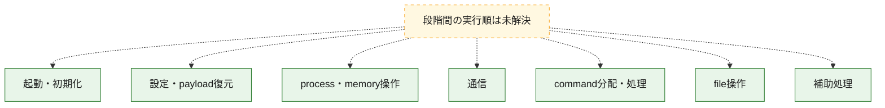
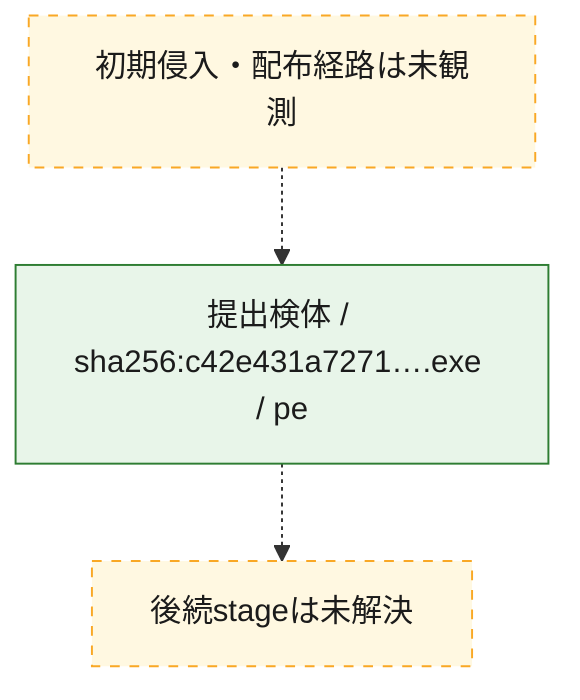
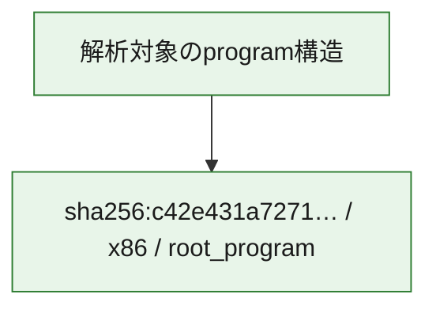

# 全体ロジック：c42e431a727120c9da477c32f1ffe0b5ac46805ff7bc0516252da29a0d172bcd

代表関数の静的証跡から、起動・初期化、設定・payload復元、process・memory操作、通信、command分配・処理、file操作の処理群を確認しました。

## 読み方

- phaseの掲載順は解析上の整理順です。observed_call_edgesがない段階間の実行順を断定しません。
- 図の実線は静的に観測した関係、点線と黄色のノードは未観測・未解決の関係を示します。
- 図は静的な要約であり、動的実行を再現するものではありません。
- 詳細な関数解説とfingerprintは[STATIC-LOGIC.md](STATIC-LOGIC.md)を参照してください。

## 静的可視化

### 実行フロー

### 感染チェーン

### モジュール関係

## 処理段階

### 1. 起動・初期化

entry pointから初期化と後続処理への移行を確認します。
確度: `confirmed_static_function_evidence_with_limits`

- `c42e431a727120c9da477c32f1ffe0b5ac46805ff7bc0516252da29a0d172bcd:ghidra:1400b3fc0` — 初期化と主要処理への分岐を行う入口関数です。 状態: `succeeded`、選定理由: `entry_point`, `meaningful_symbol_name`, `probable_go_main_user_code`, `reviewed_call_centrality:3`, `role:entrypoint`
- `c42e431a727120c9da477c32f1ffe0b5ac46805ff7bc0516252da29a0d172bcd:ghidra:1400b4000` — 初期化と主要処理への分岐を行う入口関数です。 状態: `failed`、選定理由: `entry_point`, `meaningful_symbol_name`, `probable_go_main_user_code`, `role:entrypoint`
- `c42e431a727120c9da477c32f1ffe0b5ac46805ff7bc0516252da29a0d172bcd:ghidra:1400cb1a0` — 初期化と主要処理への分岐を行う入口関数です。 状態: `failed`、選定理由: `entry_point`, `meaningful_symbol_name`, `probable_go_main_user_code`, `role:entrypoint`
- `c42e431a727120c9da477c32f1ffe0b5ac46805ff7bc0516252da29a0d172bcd:ghidra:1400dc860` — 初期化と主要処理への分岐を行う入口関数です。 状態: `failed`、選定理由: `entry_point`, `meaningful_symbol_name`, `probable_go_main_user_code`, `role:entrypoint`
- `c42e431a727120c9da477c32f1ffe0b5ac46805ff7bc0516252da29a0d172bcd:ghidra:1400f6740` — 初期化と主要処理への分岐を行う入口関数です。 状態: `failed`、選定理由: `entry_point`, `meaningful_symbol_name`, `probable_go_main_user_code`, `role:entrypoint`
- `c42e431a727120c9da477c32f1ffe0b5ac46805ff7bc0516252da29a0d172bcd:ghidra:140101ec0` — 初期化と主要処理への分岐を行う入口関数です。 状態: `succeeded`、選定理由: `entry_point`, `meaningful_symbol_name`, `probable_go_main_user_code`, `reviewed_call_centrality:34`, `role:entrypoint`
- `c42e431a727120c9da477c32f1ffe0b5ac46805ff7bc0516252da29a0d172bcd:ghidra:140107ac0` — 初期化と主要処理への分岐を行う入口関数です。 状態: `failed`、選定理由: `entry_point`, `meaningful_symbol_name`, `probable_go_main_user_code`, `role:entrypoint`
- `c42e431a727120c9da477c32f1ffe0b5ac46805ff7bc0516252da29a0d172bcd:ghidra:140127840` — 初期化と主要処理への分岐を行う入口関数です。 状態: `failed`、選定理由: `entry_point`, `meaningful_symbol_name`, `probable_go_main_user_code`, `role:entrypoint`
- `c42e431a727120c9da477c32f1ffe0b5ac46805ff7bc0516252da29a0d172bcd:ghidra:14012d4c0` — 初期化と主要処理への分岐を行う入口関数です。 状態: `succeeded`、選定理由: `entry_point`, `meaningful_symbol_name`, `probable_go_main_user_code`, `reviewed_call_centrality:28`, `role:entrypoint`
- `c42e431a727120c9da477c32f1ffe0b5ac46805ff7bc0516252da29a0d172bcd:ghidra:140130220` — 初期化と主要処理への分岐を行う入口関数です。 状態: `succeeded`、選定理由: `entry_point`, `meaningful_symbol_name`, `probable_go_main_user_code`, `reviewed_call_centrality:28`, `role:entrypoint`
- `c42e431a727120c9da477c32f1ffe0b5ac46805ff7bc0516252da29a0d172bcd:ghidra:140132f60` — 初期化と主要処理への分岐を行う入口関数です。 状態: `succeeded`、選定理由: `entry_point`, `meaningful_symbol_name`, `probable_go_main_user_code`, `reviewed_call_centrality:11`, `role:entrypoint`
- `c42e431a727120c9da477c32f1ffe0b5ac46805ff7bc0516252da29a0d172bcd:ghidra:140133260` — 初期化と主要処理への分岐を行う入口関数です。 状態: `succeeded`、選定理由: `entry_point`, `meaningful_symbol_name`, `probable_go_main_user_code`, `reviewed_call_centrality:3`, `role:entrypoint`
- `c42e431a727120c9da477c32f1ffe0b5ac46805ff7bc0516252da29a0d172bcd:ghidra:140133360` — 初期化と主要処理への分岐を行う入口関数です。 状態: `succeeded`、選定理由: `entry_point`, `meaningful_symbol_name`, `probable_go_main_user_code`, `reviewed_call_centrality:3`, `role:entrypoint`
- `c42e431a727120c9da477c32f1ffe0b5ac46805ff7bc0516252da29a0d172bcd:ghidra:140133480` — 初期化と主要処理への分岐を行う入口関数です。 状態: `succeeded`、選定理由: `entry_point`, `meaningful_symbol_name`, `probable_go_main_user_code`, `reviewed_call_centrality:4`, `role:entrypoint`
- `c42e431a727120c9da477c32f1ffe0b5ac46805ff7bc0516252da29a0d172bcd:ghidra:140133580` — 初期化と主要処理への分岐を行う入口関数です。 状態: `succeeded`、選定理由: `entry_point`, `meaningful_symbol_name`, `probable_go_main_user_code`, `reviewed_call_centrality:4`, `role:entrypoint`
- `c42e431a727120c9da477c32f1ffe0b5ac46805ff7bc0516252da29a0d172bcd:ghidra:1401336e0` — 初期化と主要処理への分岐を行う入口関数です。 状態: `succeeded`、選定理由: `entry_point`, `meaningful_symbol_name`, `probable_go_main_user_code`, `reviewed_call_centrality:4`, `role:entrypoint`
- `c42e431a727120c9da477c32f1ffe0b5ac46805ff7bc0516252da29a0d172bcd:ghidra:140133940` — 初期化と主要処理への分岐を行う入口関数です。 状態: `succeeded`、選定理由: `entry_point`, `meaningful_symbol_name`, `probable_go_main_user_code`, `reviewed_call_centrality:4`, `role:entrypoint`
- `c42e431a727120c9da477c32f1ffe0b5ac46805ff7bc0516252da29a0d172bcd:ghidra:140133a80` — 初期化と主要処理への分岐を行う入口関数です。 状態: `succeeded`、選定理由: `entry_point`, `meaningful_symbol_name`, `probable_go_main_user_code`, `reviewed_call_centrality:5`, `role:entrypoint`
- `c42e431a727120c9da477c32f1ffe0b5ac46805ff7bc0516252da29a0d172bcd:ghidra:140133b60` — 初期化と主要処理への分岐を行う入口関数です。 状態: `succeeded`、選定理由: `entry_point`, `meaningful_symbol_name`, `probable_go_main_user_code`, `reviewed_call_centrality:3`, `role:entrypoint`
- `c42e431a727120c9da477c32f1ffe0b5ac46805ff7bc0516252da29a0d172bcd:ghidra:140133bc0` — 初期化と主要処理への分岐を行う入口関数です。 状態: `failed`、選定理由: `entry_point`, `meaningful_symbol_name`, `probable_go_main_user_code`, `role:entrypoint`
- `c42e431a727120c9da477c32f1ffe0b5ac46805ff7bc0516252da29a0d172bcd:ghidra:14014fbc0` — 初期化と主要処理への分岐を行う入口関数です。 状態: `succeeded`、選定理由: `entry_point`, `meaningful_symbol_name`, `probable_go_main_user_code`, `reviewed_call_centrality:3`, `role:entrypoint`
- `c42e431a727120c9da477c32f1ffe0b5ac46805ff7bc0516252da29a0d172bcd:ghidra:14014fc20` — 初期化と主要処理への分岐を行う入口関数です。 状態: `succeeded`、選定理由: `entry_point`, `meaningful_symbol_name`, `probable_go_main_user_code`, `reviewed_call_centrality:9`, `role:entrypoint`
- `c42e431a727120c9da477c32f1ffe0b5ac46805ff7bc0516252da29a0d172bcd:ghidra:14014fea0` — 初期化と主要処理への分岐を行う入口関数です。 状態: `succeeded`、選定理由: `entry_point`, `meaningful_symbol_name`, `probable_go_main_user_code`, `reviewed_call_centrality:5`, `role:entrypoint`

### 2. 設定・payload復元

設定、resource、payload、暗号化データの復元・変換を確認します。
確度: `confirmed_static_function_evidence`

- `c42e431a727120c9da477c32f1ffe0b5ac46805ff7bc0516252da29a0d172bcd:ghidra:14007e040` — 設定、resource、payloadなどの解析・変換を行う関数です。 状態: `succeeded`、選定理由: `meaningful_symbol_name`, `reviewed_call_centrality:4`, `role:config_or_data_transform`
- `c42e431a727120c9da477c32f1ffe0b5ac46805ff7bc0516252da29a0d172bcd:ghidra:14007e1e0` — 設定、resource、payloadなどの解析・変換を行う関数です。 状態: `succeeded`、選定理由: `meaningful_symbol_name`, `reviewed_call_centrality:4`, `role:config_or_data_transform`
- `c42e431a727120c9da477c32f1ffe0b5ac46805ff7bc0516252da29a0d172bcd:ghidra:14009d5a0` — 暗号、hash、encoding、または復号処理に関係する関数です。 状態: `succeeded`、選定理由: `meaningful_symbol_name`, `reviewed_call_centrality:11`, `role:cryptographic_transform`

### 3. process・memory操作

process、thread、module、memory操作と実行移行を確認します。
確度: `confirmed_static_function_evidence`

- `c42e431a727120c9da477c32f1ffe0b5ac46805ff7bc0516252da29a0d172bcd:ghidra:14006f880` — process、thread、module、またはmemory操作に関係する関数です。 状態: `succeeded`、選定理由: `meaningful_symbol_name`, `reviewed_call_centrality:3`, `role:process_or_memory_operation`

### 4. 通信

通信初期化、endpoint処理、送受信の役割を確認します。
確度: `confirmed_static_function_evidence`

- `c42e431a727120c9da477c32f1ffe0b5ac46805ff7bc0516252da29a0d172bcd:ghidra:140082fa0` — 通信初期化、送受信、またはendpoint処理に関係する関数です。 状態: `succeeded`、選定理由: `meaningful_symbol_name`, `reviewed_call_centrality:6`, `role:network_communication`

### 5. command分配・処理

受信commandやtaskの解釈、分配、個別handlerへの移行を確認します。
確度: `confirmed_static_function_evidence`

- `c42e431a727120c9da477c32f1ffe0b5ac46805ff7bc0516252da29a0d172bcd:ghidra:1400821e0` — commandの解釈、分配、または個別処理を担当する関数です。 状態: `succeeded`、選定理由: `meaningful_symbol_name`, `reviewed_call_centrality:5`, `role:command_dispatch_or_handler`

### 6. file操作

fileやdirectoryの作成、読書き、削除を確認します。
確度: `confirmed_static_function_evidence`

- `c42e431a727120c9da477c32f1ffe0b5ac46805ff7bc0516252da29a0d172bcd:ghidra:140082c00` — fileまたはdirectoryの読書き・管理に関係する関数です。 状態: `succeeded`、選定理由: `meaningful_symbol_name`, `reviewed_call_centrality:6`, `role:file_operation`

### 7. 補助処理

主要処理を支える一般内部関数またはlibrary処理を確認します。
確度: `confirmed_static_function_evidence`

- `c42e431a727120c9da477c32f1ffe0b5ac46805ff7bc0516252da29a0d172bcd:ghidra:1400010a0` — compiler生成処理または汎用library処理とみられる関数です。 状態: `succeeded`、選定理由: `meaningful_symbol_name`, `reviewed_call_centrality:3`
- `c42e431a727120c9da477c32f1ffe0b5ac46805ff7bc0516252da29a0d172bcd:ghidra:14006aee0` — 検体内部の一般処理を実装する関数です。 状態: `succeeded`、選定理由: `meaningful_symbol_name`, `reviewed_call_centrality:3`

## 観測したcall関係

- `ghidra-function:04050a583006cad874b40574` → `ghidra-external:377756e1348d326030cda9d4` （`unclassified` → `unclassified`）
- `ghidra-function:04050a583006cad874b40574` → `ghidra-external:5bb746c0021e71bf690cb06a` （`unclassified` → `unclassified`）
- `ghidra-function:04050a583006cad874b40574` → `ghidra-external:6b5268e2b77585cfe3e20074` （`unclassified` → `unclassified`）
- `ghidra-function:07d125909adb216c8b9865f4` → `ghidra-external:1fc6be2ac63ce3eebfd43481` （`unclassified` → `unclassified`）
- `ghidra-function:07d125909adb216c8b9865f4` → `ghidra-external:377756e1348d326030cda9d4` （`unclassified` → `unclassified`）
- `ghidra-function:07d125909adb216c8b9865f4` → `ghidra-external:37a01d4bdfa049760f8d9e2b` （`unclassified` → `unclassified`）
- `ghidra-function:07d125909adb216c8b9865f4` → `ghidra-external:382c7c2a684649bd655758e0` （`unclassified` → `unclassified`）
- `ghidra-function:07d125909adb216c8b9865f4` → `ghidra-external:3dec0a50ea47b2d1935209db` （`unclassified` → `unclassified`）
- `ghidra-function:07d125909adb216c8b9865f4` → `ghidra-external:3ef96f9896530da854a4b304` （`unclassified` → `unclassified`）
- `ghidra-function:07d125909adb216c8b9865f4` → `ghidra-external:4045870b511f34648758edfd` （`unclassified` → `unclassified`）
- `ghidra-function:07d125909adb216c8b9865f4` → `ghidra-external:555b4a71d7a624dd5a2c9a56` （`unclassified` → `unclassified`）
- `ghidra-function:07d125909adb216c8b9865f4` → `ghidra-external:6fa0f763f6627169d2984f06` （`unclassified` → `unclassified`）
- `ghidra-function:07d125909adb216c8b9865f4` → `ghidra-external:8c3aba73f79adab09d21ce26` （`unclassified` → `unclassified`）
- `ghidra-function:07d125909adb216c8b9865f4` → `ghidra-external:d8ef9b80f1e12c0411d63805` （`unclassified` → `unclassified`）
- `ghidra-function:0c72222ca0812b943ba65b8e` → `ghidra-external:1fc6be2ac63ce3eebfd43481` （`unclassified` → `unclassified`）
- `ghidra-function:0c72222ca0812b943ba65b8e` → `ghidra-external:284e73333799019cc1c18061` （`unclassified` → `unclassified`）
- `ghidra-function:0c72222ca0812b943ba65b8e` → `ghidra-external:3012211cbbf2beec893f200f` （`unclassified` → `unclassified`）
- `ghidra-function:0c72222ca0812b943ba65b8e` → `ghidra-external:377756e1348d326030cda9d4` （`unclassified` → `unclassified`）
- `ghidra-function:0c72222ca0812b943ba65b8e` → `ghidra-external:3adf899df5c4c0bc460ccb13` （`unclassified` → `unclassified`）
- `ghidra-function:0c72222ca0812b943ba65b8e` → `ghidra-external:4e37e4833a47e146bf52f71c` （`unclassified` → `unclassified`）
- `ghidra-function:0c72222ca0812b943ba65b8e` → `ghidra-external:52121f6643a4d18c2eb22372` （`unclassified` → `unclassified`）
- `ghidra-function:0c72222ca0812b943ba65b8e` → `ghidra-external:8c6de65d0c4fe013dac15818` （`unclassified` → `unclassified`）
- `ghidra-function:0c72222ca0812b943ba65b8e` → `ghidra-external:a9799dd8a40aeb589b9436bb` （`unclassified` → `unclassified`）
- `ghidra-function:0c72222ca0812b943ba65b8e` → `ghidra-external:d59af15004b912153578b3cd` （`unclassified` → `unclassified`）
- `ghidra-function:0c72222ca0812b943ba65b8e` → `ghidra-external:f5840b5bb18d80b751e69c13` （`unclassified` → `unclassified`）
- `ghidra-function:159e56a6a1436e8b61ac6c7c` → `ghidra-external:15461898e68e77b792d673b9` （`unclassified` → `unclassified`）
- `ghidra-function:159e56a6a1436e8b61ac6c7c` → `ghidra-external:377756e1348d326030cda9d4` （`unclassified` → `unclassified`）
- `ghidra-function:159e56a6a1436e8b61ac6c7c` → `ghidra-external:7a807df10c8ca4de03809014` （`unclassified` → `unclassified`）
- `ghidra-function:271d775370fcdd12f2600ae0` → `ghidra-external:45825c3ea61bd543c12f0920` （`unclassified` → `unclassified`）
- `ghidra-function:271d775370fcdd12f2600ae0` → `ghidra-external:52121f6643a4d18c2eb22372` （`unclassified` → `unclassified`）
- `ghidra-function:271d775370fcdd12f2600ae0` → `ghidra-external:732f2bd16316a1e6d13f494e` （`unclassified` → `unclassified`）
- `ghidra-function:2ea0a86969598dd6d939cfc2` → `ghidra-external:2ea5fcaeea8f5947c3abf48c` （`unclassified` → `unclassified`）
- `ghidra-function:2ea0a86969598dd6d939cfc2` → `ghidra-external:377756e1348d326030cda9d4` （`unclassified` → `unclassified`）
- `ghidra-function:2ea0a86969598dd6d939cfc2` → `ghidra-external:8bd6d54a38e91f23a6d37ee1` （`unclassified` → `unclassified`）
- `ghidra-function:2ea0a86969598dd6d939cfc2` → `ghidra-external:be44ee4767031f20a9f5513d` （`unclassified` → `unclassified`）
- `ghidra-function:3c3460554f0f1db53f66ec07` → `ghidra-external:45825c3ea61bd543c12f0920` （`unclassified` → `unclassified`）
- `ghidra-function:3c3460554f0f1db53f66ec07` → `ghidra-external:52121f6643a4d18c2eb22372` （`unclassified` → `unclassified`）
- `ghidra-function:3c3460554f0f1db53f66ec07` → `ghidra-external:be44ee4767031f20a9f5513d` （`unclassified` → `unclassified`）
- `ghidra-function:3c3460554f0f1db53f66ec07` → `ghidra-external:f1c017f97969e475a5c16f5a` （`unclassified` → `unclassified`）
- `ghidra-function:53104dbabae38c3bc04a8779` → `ghidra-external:45825c3ea61bd543c12f0920` （`unclassified` → `unclassified`）
- `ghidra-function:53104dbabae38c3bc04a8779` → `ghidra-external:52121f6643a4d18c2eb22372` （`unclassified` → `unclassified`）
- `ghidra-function:53104dbabae38c3bc04a8779` → `ghidra-external:8c9e1490692ed4adf40c817d` （`unclassified` → `unclassified`）
- `ghidra-function:62815fc486b2583196986cdb` → `ghidra-external:377756e1348d326030cda9d4` （`unclassified` → `unclassified`）
- `ghidra-function:62815fc486b2583196986cdb` → `ghidra-external:6c3f41d8f9e8e3c4112fd015` （`unclassified` → `unclassified`）
- `ghidra-function:62815fc486b2583196986cdb` → `ghidra-external:7c128c25d937dcb0686a5761` （`unclassified` → `unclassified`）
- `ghidra-function:62815fc486b2583196986cdb` → `ghidra-external:e86ac2329fc9876f61a2bcf7` （`unclassified` → `unclassified`）
- `ghidra-function:65d44e0e5ae216b489622ded` → `ghidra-external:377756e1348d326030cda9d4` （`unclassified` → `unclassified`）
- `ghidra-function:65d44e0e5ae216b489622ded` → `ghidra-external:484522148cdbf56fb68d8eb6` （`unclassified` → `unclassified`）
- `ghidra-function:65d44e0e5ae216b489622ded` → `ghidra-external:b5144685bccc7c24a5d608e2` （`unclassified` → `unclassified`）
- `ghidra-function:65d44e0e5ae216b489622ded` → `ghidra-external:b9847c73063edaec5f6e4fe5` （`unclassified` → `unclassified`）
- `ghidra-function:65d44e0e5ae216b489622ded` → `ghidra-external:cc7fda042bb9f6dde3587dc3` （`unclassified` → `unclassified`）
- `ghidra-function:691d7de70de47351259a9af2` → `ghidra-external:092a8edc4433f2652d71d451` （`unclassified` → `unclassified`）
- `ghidra-function:691d7de70de47351259a9af2` → `ghidra-external:1c27a51249a93d898cb43826` （`unclassified` → `unclassified`）
- `ghidra-function:691d7de70de47351259a9af2` → `ghidra-external:1cd707c194884ce679ae86f5` （`unclassified` → `unclassified`）
- `ghidra-function:691d7de70de47351259a9af2` → `ghidra-external:1d59defb88aac2157e5960e6` （`unclassified` → `unclassified`）
- `ghidra-function:691d7de70de47351259a9af2` → `ghidra-external:30626b209f1f0c20d8cf43ab` （`unclassified` → `unclassified`）
- `ghidra-function:691d7de70de47351259a9af2` → `ghidra-external:377756e1348d326030cda9d4` （`unclassified` → `unclassified`）
- `ghidra-function:691d7de70de47351259a9af2` → `ghidra-external:3dec0a50ea47b2d1935209db` （`unclassified` → `unclassified`）
- `ghidra-function:691d7de70de47351259a9af2` → `ghidra-external:4243530f79a56035459f20a9` （`unclassified` → `unclassified`）
- `ghidra-function:691d7de70de47351259a9af2` → `ghidra-external:470817aa5e495054ae98779c` （`unclassified` → `unclassified`）
- `ghidra-function:691d7de70de47351259a9af2` → `ghidra-external:4ff58903faa1678f21adef8c` （`unclassified` → `unclassified`）
- `ghidra-function:691d7de70de47351259a9af2` → `ghidra-external:52121f6643a4d18c2eb22372` （`unclassified` → `unclassified`）
- `ghidra-function:691d7de70de47351259a9af2` → `ghidra-external:58d22e096f5d3fbb05d1194e` （`unclassified` → `unclassified`）
- `ghidra-function:691d7de70de47351259a9af2` → `ghidra-external:5e69595a12b19ff57fd64a62` （`unclassified` → `unclassified`）
- `ghidra-function:691d7de70de47351259a9af2` → `ghidra-external:649f31b50570945e521e86e5` （`unclassified` → `unclassified`）
- `ghidra-function:691d7de70de47351259a9af2` → `ghidra-external:6fa0f763f6627169d2984f06` （`unclassified` → `unclassified`）
- `ghidra-function:691d7de70de47351259a9af2` → `ghidra-external:80b9920e6b212c1c1d01325d` （`unclassified` → `unclassified`）
- `ghidra-function:691d7de70de47351259a9af2` → `ghidra-external:830f0ac7b9944d4e6fb47e34` （`unclassified` → `unclassified`）
- `ghidra-function:691d7de70de47351259a9af2` → `ghidra-external:85c01e2808957df6e4c6d24a` （`unclassified` → `unclassified`）
- `ghidra-function:691d7de70de47351259a9af2` → `ghidra-external:9448cb8ae9b2b2ca4e7f79df` （`unclassified` → `unclassified`）
- `ghidra-function:691d7de70de47351259a9af2` → `ghidra-external:9ca1f046a01013d7cac0c18e` （`unclassified` → `unclassified`）
- `ghidra-function:691d7de70de47351259a9af2` → `ghidra-external:a5522dfe6b5e5e312ad72963` （`unclassified` → `unclassified`）
- `ghidra-function:691d7de70de47351259a9af2` → `ghidra-external:ba70f62d2e4e2df849c1a8ad` （`unclassified` → `unclassified`）
- `ghidra-function:691d7de70de47351259a9af2` → `ghidra-external:bec8228055e47ece0c2c890c` （`unclassified` → `unclassified`）
- `ghidra-function:691d7de70de47351259a9af2` → `ghidra-external:c103c8f428fa7f4df184a12c` （`unclassified` → `unclassified`）
- `ghidra-function:691d7de70de47351259a9af2` → `ghidra-external:cc87f1c95defb9d0b1185779` （`unclassified` → `unclassified`）
- `ghidra-function:691d7de70de47351259a9af2` → `ghidra-external:d0d87d3d899b94a3b7b60a23` （`unclassified` → `unclassified`）
- `ghidra-function:691d7de70de47351259a9af2` → `ghidra-external:d6942789d33f7dd73029775a` （`unclassified` → `unclassified`）
- `ghidra-function:691d7de70de47351259a9af2` → `ghidra-external:f798ea311da82bc57ec550f5` （`unclassified` → `unclassified`）
- `ghidra-function:701f9184407cfa9a0615de96` → `ghidra-external:092a8edc4433f2652d71d451` （`unclassified` → `unclassified`）
- `ghidra-function:701f9184407cfa9a0615de96` → `ghidra-external:1c27a51249a93d898cb43826` （`unclassified` → `unclassified`）
- `ghidra-function:701f9184407cfa9a0615de96` → `ghidra-external:1cd707c194884ce679ae86f5` （`unclassified` → `unclassified`）
- `ghidra-function:701f9184407cfa9a0615de96` → `ghidra-external:1d59defb88aac2157e5960e6` （`unclassified` → `unclassified`）
- `ghidra-function:701f9184407cfa9a0615de96` → `ghidra-external:30626b209f1f0c20d8cf43ab` （`unclassified` → `unclassified`）
- `ghidra-function:701f9184407cfa9a0615de96` → `ghidra-external:377756e1348d326030cda9d4` （`unclassified` → `unclassified`）
- `ghidra-function:701f9184407cfa9a0615de96` → `ghidra-external:3dec0a50ea47b2d1935209db` （`unclassified` → `unclassified`）
- `ghidra-function:701f9184407cfa9a0615de96` → `ghidra-external:4243530f79a56035459f20a9` （`unclassified` → `unclassified`）
- `ghidra-function:701f9184407cfa9a0615de96` → `ghidra-external:470817aa5e495054ae98779c` （`unclassified` → `unclassified`）
- `ghidra-function:701f9184407cfa9a0615de96` → `ghidra-external:4ff58903faa1678f21adef8c` （`unclassified` → `unclassified`）
- `ghidra-function:701f9184407cfa9a0615de96` → `ghidra-external:52121f6643a4d18c2eb22372` （`unclassified` → `unclassified`）
- `ghidra-function:701f9184407cfa9a0615de96` → `ghidra-external:58d22e096f5d3fbb05d1194e` （`unclassified` → `unclassified`）
- `ghidra-function:701f9184407cfa9a0615de96` → `ghidra-external:5e69595a12b19ff57fd64a62` （`unclassified` → `unclassified`）
- `ghidra-function:701f9184407cfa9a0615de96` → `ghidra-external:6fa0f763f6627169d2984f06` （`unclassified` → `unclassified`）
- `ghidra-function:701f9184407cfa9a0615de96` → `ghidra-external:80b9920e6b212c1c1d01325d` （`unclassified` → `unclassified`）
- `ghidra-function:701f9184407cfa9a0615de96` → `ghidra-external:830f0ac7b9944d4e6fb47e34` （`unclassified` → `unclassified`）
- `ghidra-function:701f9184407cfa9a0615de96` → `ghidra-external:85c01e2808957df6e4c6d24a` （`unclassified` → `unclassified`）
- `ghidra-function:701f9184407cfa9a0615de96` → `ghidra-external:9448cb8ae9b2b2ca4e7f79df` （`unclassified` → `unclassified`）
- `ghidra-function:701f9184407cfa9a0615de96` → `ghidra-external:9ca1f046a01013d7cac0c18e` （`unclassified` → `unclassified`）
- `ghidra-function:701f9184407cfa9a0615de96` → `ghidra-external:a5522dfe6b5e5e312ad72963` （`unclassified` → `unclassified`）
- `ghidra-function:701f9184407cfa9a0615de96` → `ghidra-external:b90239c766ab3a4c68ad3c7f` （`unclassified` → `unclassified`）
- `ghidra-function:701f9184407cfa9a0615de96` → `ghidra-external:ba70f62d2e4e2df849c1a8ad` （`unclassified` → `unclassified`）
- `ghidra-function:701f9184407cfa9a0615de96` → `ghidra-external:bec8228055e47ece0c2c890c` （`unclassified` → `unclassified`）
- `ghidra-function:701f9184407cfa9a0615de96` → `ghidra-external:c103c8f428fa7f4df184a12c` （`unclassified` → `unclassified`）
- `ghidra-function:701f9184407cfa9a0615de96` → `ghidra-external:cc87f1c95defb9d0b1185779` （`unclassified` → `unclassified`）
- `ghidra-function:701f9184407cfa9a0615de96` → `ghidra-external:d0d87d3d899b94a3b7b60a23` （`unclassified` → `unclassified`）
- `ghidra-function:701f9184407cfa9a0615de96` → `ghidra-external:d6942789d33f7dd73029775a` （`unclassified` → `unclassified`）
- `ghidra-function:701f9184407cfa9a0615de96` → `ghidra-external:f798ea311da82bc57ec550f5` （`unclassified` → `unclassified`）
- `ghidra-function:716fede464dab95c3d864225` → `ghidra-external:377756e1348d326030cda9d4` （`unclassified` → `unclassified`）
- `ghidra-function:716fede464dab95c3d864225` → `ghidra-external:86b1a9e836d9af9bf7666de1` （`unclassified` → `unclassified`）
- `ghidra-function:716fede464dab95c3d864225` → `ghidra-external:ba70f62d2e4e2df849c1a8ad` （`unclassified` → `unclassified`）
- `ghidra-function:7cb57b8c85631b32853bc2d3` → `ghidra-external:3012211cbbf2beec893f200f` （`unclassified` → `unclassified`）
- `ghidra-function:7cb57b8c85631b32853bc2d3` → `ghidra-external:377756e1348d326030cda9d4` （`unclassified` → `unclassified`）
- `ghidra-function:7cb57b8c85631b32853bc2d3` → `ghidra-external:484522148cdbf56fb68d8eb6` （`unclassified` → `unclassified`）
- `ghidra-function:7cb57b8c85631b32853bc2d3` → `ghidra-external:9a523c1b3f992ed47cb9e80c` （`unclassified` → `unclassified`）
- `ghidra-function:7cb57b8c85631b32853bc2d3` → `ghidra-external:b5144685bccc7c24a5d608e2` （`unclassified` → `unclassified`）
- `ghidra-function:7cb57b8c85631b32853bc2d3` → `ghidra-external:cc7fda042bb9f6dde3587dc3` （`unclassified` → `unclassified`）
- `ghidra-function:81c6c7feacf898befa7568aa` → `ghidra-external:45825c3ea61bd543c12f0920` （`unclassified` → `unclassified`）
- `ghidra-function:81c6c7feacf898befa7568aa` → `ghidra-external:52121f6643a4d18c2eb22372` （`unclassified` → `unclassified`）
- `ghidra-function:81c6c7feacf898befa7568aa` → `ghidra-external:be44ee4767031f20a9f5513d` （`unclassified` → `unclassified`）
- `ghidra-function:81c6c7feacf898befa7568aa` → `ghidra-external:d3180fa6b8264ed15860ca49` （`unclassified` → `unclassified`）
- `ghidra-function:841d969dc3d03bd3a934a40d` → `ghidra-external:377756e1348d326030cda9d4` （`unclassified` → `unclassified`）
- `ghidra-function:841d969dc3d03bd3a934a40d` → `ghidra-external:6b5268e2b77585cfe3e20074` （`unclassified` → `unclassified`）
- `ghidra-function:841d969dc3d03bd3a934a40d` → `ghidra-external:a070bcdb962bb2082b923e99` （`unclassified` → `unclassified`）
- `ghidra-function:8daa4e5e4e9353c630f1350c` → `ghidra-external:0955bc062c3226e36827c933` （`unclassified` → `unclassified`）
- `ghidra-function:8daa4e5e4e9353c630f1350c` → `ghidra-external:0daf8b0439e17a84349f0f87` （`unclassified` → `unclassified`）
- `ghidra-function:8daa4e5e4e9353c630f1350c` → `ghidra-external:377756e1348d326030cda9d4` （`unclassified` → `unclassified`）
- `ghidra-function:8daa4e5e4e9353c630f1350c` → `ghidra-external:d20d5571d2f560ae09721c60` （`unclassified` → `unclassified`）
- `ghidra-function:8daa4e5e4e9353c630f1350c` → `ghidra-external:d63c41ea8b2906fae1dbcfe1` （`unclassified` → `unclassified`）
- `ghidra-function:9b9093f4cd02de74cea3ccd0` → `ghidra-external:1c7a9d33e15ed07deb7f85f2` （`unclassified` → `unclassified`）
- `ghidra-function:9b9093f4cd02de74cea3ccd0` → `ghidra-external:377756e1348d326030cda9d4` （`unclassified` → `unclassified`）
- `ghidra-function:9b9093f4cd02de74cea3ccd0` → `ghidra-external:4243530f79a56035459f20a9` （`unclassified` → `unclassified`）
- `ghidra-function:9b9093f4cd02de74cea3ccd0` → `ghidra-external:6fa0f763f6627169d2984f06` （`unclassified` → `unclassified`）
- `ghidra-function:9b9093f4cd02de74cea3ccd0` → `ghidra-external:8bd6d54a38e91f23a6d37ee1` （`unclassified` → `unclassified`）
- `ghidra-function:9b9093f4cd02de74cea3ccd0` → `ghidra-external:8f28dfb627e0bb9a098cee46` （`unclassified` → `unclassified`）
- `ghidra-function:9b9093f4cd02de74cea3ccd0` → `ghidra-external:b5144685bccc7c24a5d608e2` （`unclassified` → `unclassified`）
- `ghidra-function:9b9093f4cd02de74cea3ccd0` → `ghidra-external:cc7fda042bb9f6dde3587dc3` （`unclassified` → `unclassified`）
- `ghidra-function:9b9093f4cd02de74cea3ccd0` → `ghidra-external:cf6986d2b9a9115765e1c2a3` （`unclassified` → `unclassified`）
- `ghidra-function:b231d153911358634cd8aff6` → `ghidra-external:377756e1348d326030cda9d4` （`unclassified` → `unclassified`）
- `ghidra-function:b231d153911358634cd8aff6` → `ghidra-external:4eabc2b6042d52acf53b82f5` （`unclassified` → `unclassified`）
- `ghidra-function:b231d153911358634cd8aff6` → `ghidra-external:b4822bb42c8422f693eb06ab` （`unclassified` → `unclassified`）
- `ghidra-function:b231d153911358634cd8aff6` → `ghidra-external:d5b3915c98c2eab813c56f2d` （`unclassified` → `unclassified`）
- `ghidra-function:d6f904db48202f4771998f01` → `ghidra-external:020ddc78ed4077f19c46589a` （`unclassified` → `unclassified`）
- `ghidra-function:d6f904db48202f4771998f01` → `ghidra-external:092a8edc4433f2652d71d451` （`unclassified` → `unclassified`）
- `ghidra-function:d6f904db48202f4771998f01` → `ghidra-external:1c27a51249a93d898cb43826` （`unclassified` → `unclassified`）
- `ghidra-function:d6f904db48202f4771998f01` → `ghidra-external:1cd707c194884ce679ae86f5` （`unclassified` → `unclassified`）
- `ghidra-function:d6f904db48202f4771998f01` → `ghidra-external:1d59defb88aac2157e5960e6` （`unclassified` → `unclassified`）
- `ghidra-function:d6f904db48202f4771998f01` → `ghidra-external:3012211cbbf2beec893f200f` （`unclassified` → `unclassified`）
- `ghidra-function:d6f904db48202f4771998f01` → `ghidra-external:30626b209f1f0c20d8cf43ab` （`unclassified` → `unclassified`）
- `ghidra-function:d6f904db48202f4771998f01` → `ghidra-external:377756e1348d326030cda9d4` （`unclassified` → `unclassified`）
- `ghidra-function:d6f904db48202f4771998f01` → `ghidra-external:3dec0a50ea47b2d1935209db` （`unclassified` → `unclassified`）
- `ghidra-function:d6f904db48202f4771998f01` → `ghidra-external:4243530f79a56035459f20a9` （`unclassified` → `unclassified`）
- `ghidra-function:d6f904db48202f4771998f01` → `ghidra-external:470817aa5e495054ae98779c` （`unclassified` → `unclassified`）
- `ghidra-function:d6f904db48202f4771998f01` → `ghidra-external:4ff58903faa1678f21adef8c` （`unclassified` → `unclassified`）
- `ghidra-function:d6f904db48202f4771998f01` → `ghidra-external:58d22e096f5d3fbb05d1194e` （`unclassified` → `unclassified`）
- `ghidra-function:d6f904db48202f4771998f01` → `ghidra-external:5e69595a12b19ff57fd64a62` （`unclassified` → `unclassified`）
- `ghidra-function:d6f904db48202f4771998f01` → `ghidra-external:67c57f6700eea3f3a1e0085a` （`unclassified` → `unclassified`）
- `ghidra-function:d6f904db48202f4771998f01` → `ghidra-external:6c2d5f0789a2f9bc0d1f8b73` （`unclassified` → `unclassified`）
- `ghidra-function:d6f904db48202f4771998f01` → `ghidra-external:6fa0f763f6627169d2984f06` （`unclassified` → `unclassified`）
- `ghidra-function:d6f904db48202f4771998f01` → `ghidra-external:80b9920e6b212c1c1d01325d` （`unclassified` → `unclassified`）
- `ghidra-function:d6f904db48202f4771998f01` → `ghidra-external:830f0ac7b9944d4e6fb47e34` （`unclassified` → `unclassified`）
- `ghidra-function:d6f904db48202f4771998f01` → `ghidra-external:85c01e2808957df6e4c6d24a` （`unclassified` → `unclassified`）
- `ghidra-function:d6f904db48202f4771998f01` → `ghidra-external:9448cb8ae9b2b2ca4e7f79df` （`unclassified` → `unclassified`）
- `ghidra-function:d6f904db48202f4771998f01` → `ghidra-external:9ca1f046a01013d7cac0c18e` （`unclassified` → `unclassified`）
- `ghidra-function:d6f904db48202f4771998f01` → `ghidra-external:9f2e0310769a5a380452b06c` （`unclassified` → `unclassified`）
- `ghidra-function:d6f904db48202f4771998f01` → `ghidra-external:a5522dfe6b5e5e312ad72963` （`unclassified` → `unclassified`）
- `ghidra-function:d6f904db48202f4771998f01` → `ghidra-external:b5144685bccc7c24a5d608e2` （`unclassified` → `unclassified`）
- `ghidra-function:d6f904db48202f4771998f01` → `ghidra-external:ba70f62d2e4e2df849c1a8ad` （`unclassified` → `unclassified`）
- `ghidra-function:d6f904db48202f4771998f01` → `ghidra-external:be44ee4767031f20a9f5513d` （`unclassified` → `unclassified`）
- `ghidra-function:d6f904db48202f4771998f01` → `ghidra-external:bec8228055e47ece0c2c890c` （`unclassified` → `unclassified`）
- `ghidra-function:d6f904db48202f4771998f01` → `ghidra-external:c103c8f428fa7f4df184a12c` （`unclassified` → `unclassified`）
- `ghidra-function:d6f904db48202f4771998f01` → `ghidra-external:cc7fda042bb9f6dde3587dc3` （`unclassified` → `unclassified`）
- `ghidra-function:d6f904db48202f4771998f01` → `ghidra-external:cc87f1c95defb9d0b1185779` （`unclassified` → `unclassified`）
- `ghidra-function:d6f904db48202f4771998f01` → `ghidra-external:d0d87d3d899b94a3b7b60a23` （`unclassified` → `unclassified`）
- `ghidra-function:d6f904db48202f4771998f01` → `ghidra-external:d6942789d33f7dd73029775a` （`unclassified` → `unclassified`）
- `ghidra-function:d6f904db48202f4771998f01` → `ghidra-external:f798ea311da82bc57ec550f5` （`unclassified` → `unclassified`）
- `ghidra-function:d86a444b6003fa7d9be4e9f7` → `ghidra-external:0e710b9f6c2e059109641969` （`unclassified` → `unclassified`）
- `ghidra-function:d86a444b6003fa7d9be4e9f7` → `ghidra-external:360d3ec0c9e3c68fb6f38670` （`unclassified` → `unclassified`）
- `ghidra-function:d86a444b6003fa7d9be4e9f7` → `ghidra-external:7eff3d47667121f82cc767cc` （`unclassified` → `unclassified`）
- `ghidra-function:e375a0babca6f0e80eb6440b` → `ghidra-external:114a9f0d1e96b414ad732ed4` （`unclassified` → `unclassified`）
- `ghidra-function:e375a0babca6f0e80eb6440b` → `ghidra-external:3012211cbbf2beec893f200f` （`unclassified` → `unclassified`）
- `ghidra-function:e375a0babca6f0e80eb6440b` → `ghidra-external:377756e1348d326030cda9d4` （`unclassified` → `unclassified`）
- `ghidra-function:e375a0babca6f0e80eb6440b` → `ghidra-external:a3a875a9cf5785e6202823ad` （`unclassified` → `unclassified`）
- `ghidra-function:e375a0babca6f0e80eb6440b` → `ghidra-external:b5144685bccc7c24a5d608e2` （`unclassified` → `unclassified`）
- `ghidra-function:e375a0babca6f0e80eb6440b` → `ghidra-external:cc7fda042bb9f6dde3587dc3` （`unclassified` → `unclassified`）
- `ghidra-function:ea15795c4606aeec8775f88d` → `ghidra-external:312bca9ebbbac26e5ba931bd` （`unclassified` → `unclassified`）
- `ghidra-function:ea15795c4606aeec8775f88d` → `ghidra-external:4e344698b36702acbaeec372` （`unclassified` → `unclassified`）
- `ghidra-function:ea15795c4606aeec8775f88d` → `ghidra-external:67c57f6700eea3f3a1e0085a` （`unclassified` → `unclassified`）
- `ghidra-function:ea15795c4606aeec8775f88d` → `ghidra-external:b593bd1c53a2309165f8a616` （`unclassified` → `unclassified`）
- `ghidra-function:ea15795c4606aeec8775f88d` → `ghidra-external:e41cbdab94db69ff3ceb58f8` （`unclassified` → `unclassified`）
- `ghidra-function:f04428c24c2d24e47d163bfc` → `ghidra-external:377756e1348d326030cda9d4` （`unclassified` → `unclassified`）
- `ghidra-function:f04428c24c2d24e47d163bfc` → `ghidra-external:6e8ef40f9c5a6c91748ba314` （`unclassified` → `unclassified`）
- `ghidra-function:f04428c24c2d24e47d163bfc` → `ghidra-external:7c128c25d937dcb0686a5761` （`unclassified` → `unclassified`）
- `ghidra-function:f04428c24c2d24e47d163bfc` → `ghidra-external:80b9920e6b212c1c1d01325d` （`unclassified` → `unclassified`）
- `ghidra-function:f97935ad428e2d5464717ca9` → `ghidra-external:45825c3ea61bd543c12f0920` （`unclassified` → `unclassified`）
- `ghidra-function:f97935ad428e2d5464717ca9` → `ghidra-external:52121f6643a4d18c2eb22372` （`unclassified` → `unclassified`）
- `ghidra-function:f97935ad428e2d5464717ca9` → `ghidra-external:7396548a4900cc3ec36e25b0` （`unclassified` → `unclassified`）

## 解析範囲と制約

- 選定外関数は全体inventoryへ残しますが、関数本体の個別解説対象にはしていません。
- indirect call、難読化、packer、VM、壊れたcontrol flowによりcall関係が欠落する場合があります。
- 文書は静的解析に基づき、検体実行や外部通信による動的確認は行っていません。
