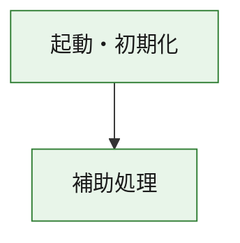
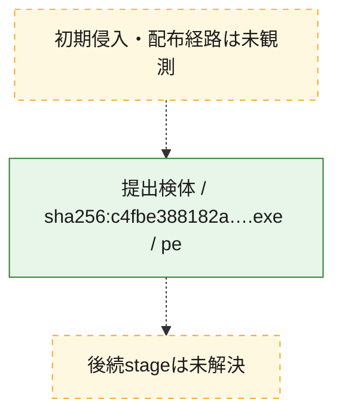
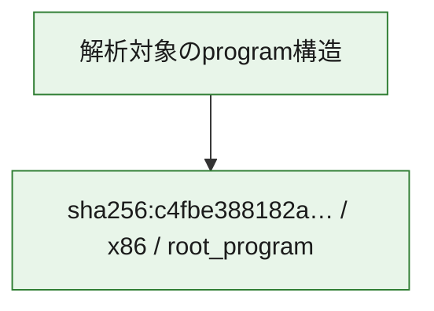

# 全体ロジック：c4fbe388182a7a282850abe962d6cc57ad5c6080d7f7a7dadd2be431d51b9252

代表関数の静的証跡から、起動・初期化の処理群を確認しました。

## 読み方

- phaseの掲載順は解析上の整理順です。observed_call_edgesがない段階間の実行順を断定しません。
- 図の実線は静的に観測した関係、点線と黄色のノードは未観測・未解決の関係を示します。
- 図は静的な要約であり、動的実行を再現するものではありません。
- 詳細な関数解説とfingerprintは[STATIC-LOGIC.md](STATIC-LOGIC.md)を参照してください。

## 静的可視化

### 実行フロー

### 感染チェーン

### モジュール関係

## 処理段階

### 1. 起動・初期化

entry pointから初期化と後続処理への移行を確認します。
確度: `confirmed_static_function_evidence`

- `c4fbe388182a7a282850abe962d6cc57ad5c6080d7f7a7dadd2be431d51b9252:ghidra:180001010` — 初期化と主要処理への分岐を行う入口関数です。 状態: `succeeded`、選定理由: `entry_point`, `meaningful_symbol_name`, `reviewed_call_centrality:22`, `role:entrypoint`, `small_program_complete_context`

### 2. 補助処理

主要処理を支える一般内部関数またはlibrary処理を確認します。
確度: `confirmed_static_function_evidence`

- `c4fbe388182a7a282850abe962d6cc57ad5c6080d7f7a7dadd2be431d51b9252:ghidra:180001240` — 検体内部の一般処理を実装する関数です。 状態: `succeeded`、選定理由: `context_representative`, `reviewed_call_centrality:2`, `small_program_complete_context`
- `c4fbe388182a7a282850abe962d6cc57ad5c6080d7f7a7dadd2be431d51b9252:ghidra:180001350` — 検体内部の一般処理を実装する関数です。 状態: `succeeded`、選定理由: `context_representative`, `reviewed_call_centrality:25`, `small_program_complete_context`
- `c4fbe388182a7a282850abe962d6cc57ad5c6080d7f7a7dadd2be431d51b9252:ghidra:180003780` — 検体内部の一般処理を実装する関数です。 状態: `succeeded`、選定理由: `context_representative`, `reviewed_call_centrality:2`, `small_program_complete_context`
- `c4fbe388182a7a282850abe962d6cc57ad5c6080d7f7a7dadd2be431d51b9252:ghidra:1800038e0` — 検体内部の一般処理を実装する関数です。 状態: `succeeded`、選定理由: `context_representative`, `reviewed_call_centrality:2`, `small_program_complete_context`

## 観測したcall関係

- `c4fbe388182a7a282850abe962d6cc57ad5c6080d7f7a7dadd2be431d51b9252:ghidra:180001010` → `c4fbe388182a7a282850abe962d6cc57ad5c6080d7f7a7dadd2be431d51b9252:ghidra:180001240` （`startup` → `support`）
- `c4fbe388182a7a282850abe962d6cc57ad5c6080d7f7a7dadd2be431d51b9252:ghidra:180001010` → `c4fbe388182a7a282850abe962d6cc57ad5c6080d7f7a7dadd2be431d51b9252:ghidra:180001350` （`startup` → `support`）
- `c4fbe388182a7a282850abe962d6cc57ad5c6080d7f7a7dadd2be431d51b9252:ghidra:180001350` → `c4fbe388182a7a282850abe962d6cc57ad5c6080d7f7a7dadd2be431d51b9252:ghidra:180001240` （`support` → `support`）
- `c4fbe388182a7a282850abe962d6cc57ad5c6080d7f7a7dadd2be431d51b9252:ghidra:180001350` → `c4fbe388182a7a282850abe962d6cc57ad5c6080d7f7a7dadd2be431d51b9252:ghidra:180003780` （`support` → `support`）
- `c4fbe388182a7a282850abe962d6cc57ad5c6080d7f7a7dadd2be431d51b9252:ghidra:180001350` → `c4fbe388182a7a282850abe962d6cc57ad5c6080d7f7a7dadd2be431d51b9252:ghidra:1800038e0` （`support` → `support`）
- `c4fbe388182a7a282850abe962d6cc57ad5c6080d7f7a7dadd2be431d51b9252:ghidra:180003780` → `c4fbe388182a7a282850abe962d6cc57ad5c6080d7f7a7dadd2be431d51b9252:ghidra:1800038e0` （`support` → `support`）
- `ghidra-function:4bec787577fce213930701c0` → `ghidra-function:083cdd2195e876454ecb2321` （`unclassified` → `unclassified`）
- `ghidra-function:63820572f39688ed8d162318` → `ghidra-external:08a907d622bf4ebbe1cc04ba` （`unclassified` → `unclassified`）
- `ghidra-function:63820572f39688ed8d162318` → `ghidra-external:11294a08e805b7c62894ae94` （`unclassified` → `unclassified`）
- `ghidra-function:63820572f39688ed8d162318` → `ghidra-external:1daea3182d5265a195b8c4fa` （`unclassified` → `unclassified`）
- `ghidra-function:63820572f39688ed8d162318` → `ghidra-external:2d93e51e49de64e26a2f7239` （`unclassified` → `unclassified`）
- `ghidra-function:63820572f39688ed8d162318` → `ghidra-external:2f34dedc1254c92387255f87` （`unclassified` → `unclassified`）
- `ghidra-function:63820572f39688ed8d162318` → `ghidra-external:345cbb37fd1a9800c0341f01` （`unclassified` → `unclassified`）
- `ghidra-function:63820572f39688ed8d162318` → `ghidra-external:563324d2e4e0a81f10531557` （`unclassified` → `unclassified`）
- `ghidra-function:63820572f39688ed8d162318` → `ghidra-external:56546940ad1e00ced567fda8` （`unclassified` → `unclassified`）
- `ghidra-function:63820572f39688ed8d162318` → `ghidra-external:6dfed36590db29ec638fb0e7` （`unclassified` → `unclassified`）
- `ghidra-function:63820572f39688ed8d162318` → `ghidra-external:7b2683efd59f174831fff12f` （`unclassified` → `unclassified`）
- `ghidra-function:63820572f39688ed8d162318` → `ghidra-external:a7388f68b9aeebcf0449a5a5` （`unclassified` → `unclassified`）
- `ghidra-function:63820572f39688ed8d162318` → `ghidra-external:aeaa490e11b2497502af4093` （`unclassified` → `unclassified`）
- `ghidra-function:63820572f39688ed8d162318` → `ghidra-external:ca6c09f0b097095877b0ff84` （`unclassified` → `unclassified`）
- `ghidra-function:63820572f39688ed8d162318` → `ghidra-external:cd3c671df157ae06e46a047b` （`unclassified` → `unclassified`）
- `ghidra-function:63820572f39688ed8d162318` → `ghidra-external:d0a7f4387d375bc3e6ad7b1a` （`unclassified` → `unclassified`）
- `ghidra-function:63820572f39688ed8d162318` → `ghidra-external:d2b8d0bad634668affa4b38b` （`unclassified` → `unclassified`）
- `ghidra-function:63820572f39688ed8d162318` → `ghidra-external:daae5f56ffdd0afa6bb87c21` （`unclassified` → `unclassified`）
- `ghidra-function:63820572f39688ed8d162318` → `ghidra-external:dadb09d7830bbc4952030f67` （`unclassified` → `unclassified`）
- `ghidra-function:63820572f39688ed8d162318` → `ghidra-external:f2ddb9833104cb03756f025a` （`unclassified` → `unclassified`）
- `ghidra-function:63820572f39688ed8d162318` → `ghidra-external:fd91e0852c50163d616a7e3a` （`unclassified` → `unclassified`）
- `ghidra-function:63820572f39688ed8d162318` → `ghidra-external:ff50d443a089d90cd2ef508f` （`unclassified` → `unclassified`）
- `ghidra-function:63820572f39688ed8d162318` → `ghidra-function:083cdd2195e876454ecb2321` （`unclassified` → `unclassified`）
- `ghidra-function:63820572f39688ed8d162318` → `ghidra-function:4bec787577fce213930701c0` （`unclassified` → `unclassified`）
- `ghidra-function:63820572f39688ed8d162318` → `ghidra-function:db17f63683cd0e3a8aecdb89` （`unclassified` → `unclassified`）
- `ghidra-function:eb25b30694cb06ef5c5de913` → `ghidra-function:0de7ae9b9ea7361f40327fe4` （`unclassified` → `unclassified`）
- `ghidra-function:eb25b30694cb06ef5c5de913` → `ghidra-function:150d0fcbe0b304c5174e02e2` （`unclassified` → `unclassified`）
- `ghidra-function:eb25b30694cb06ef5c5de913` → `ghidra-function:3cfc3a79c26dba4496919b38` （`unclassified` → `unclassified`）
- `ghidra-function:eb25b30694cb06ef5c5de913` → `ghidra-function:446aa9c13cb504632e91d111` （`unclassified` → `unclassified`）
- `ghidra-function:eb25b30694cb06ef5c5de913` → `ghidra-function:63820572f39688ed8d162318` （`unclassified` → `unclassified`）
- `ghidra-function:eb25b30694cb06ef5c5de913` → `ghidra-function:8e96d3af5f8ff5dcecd1fcfb` （`unclassified` → `unclassified`）
- `ghidra-function:eb25b30694cb06ef5c5de913` → `ghidra-function:8f9026a51433665b2352faec` （`unclassified` → `unclassified`）
- `ghidra-function:eb25b30694cb06ef5c5de913` → `ghidra-function:9a2e8158d5a22d0a02157bb5` （`unclassified` → `unclassified`）
- `ghidra-function:eb25b30694cb06ef5c5de913` → `ghidra-function:9f1e621133dcd467edcf935a` （`unclassified` → `unclassified`）
- `ghidra-function:eb25b30694cb06ef5c5de913` → `ghidra-function:a95b2d9d1db3263a4b0b16fd` （`unclassified` → `unclassified`）
- `ghidra-function:eb25b30694cb06ef5c5de913` → `ghidra-function:db17f63683cd0e3a8aecdb89` （`unclassified` → `unclassified`）
- `ghidra-function:eb25b30694cb06ef5c5de913` → `ghidra-function:f34322b34925ee7d40121494` （`unclassified` → `unclassified`）

## 解析範囲と制約

- 選定外関数は全体inventoryへ残しますが、関数本体の個別解説対象にはしていません。
- indirect call、難読化、packer、VM、壊れたcontrol flowによりcall関係が欠落する場合があります。
- 文書は静的解析に基づき、検体実行や外部通信による動的確認は行っていません。
