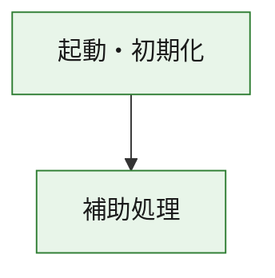
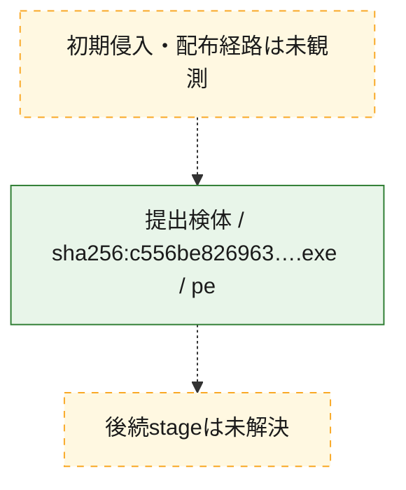
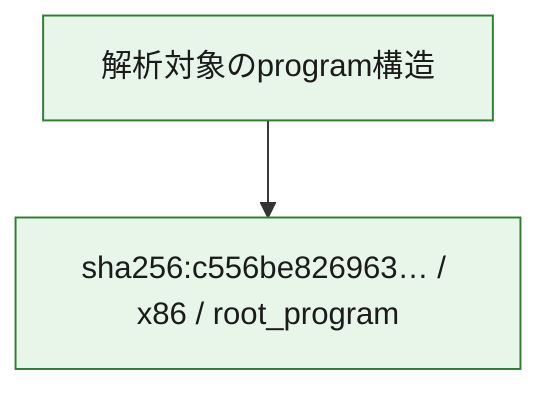

# 全体ロジック：c556be826963de2d9c75ef07cb15cdd54c8ae081cd23699b38c53a6eb93df89e

代表関数の静的証跡から、起動・初期化の処理群を確認しました。

## 読み方

- phaseの掲載順は解析上の整理順です。observed_call_edgesがない段階間の実行順を断定しません。
- 図の実線は静的に観測した関係、点線と黄色のノードは未観測・未解決の関係を示します。
- 図は静的な要約であり、動的実行を再現するものではありません。
- 詳細な関数解説とfingerprintは[STATIC-LOGIC.md](STATIC-LOGIC.md)を参照してください。

## 静的可視化

### 実行フロー

### 感染チェーン

### モジュール関係

## 処理段階

### 1. 起動・初期化

entry pointから初期化と後続処理への移行を確認します。
確度: `confirmed_static_function_evidence`

- `c556be826963de2d9c75ef07cb15cdd54c8ae081cd23699b38c53a6eb93df89e:ghidra:180001010` — 初期化と主要処理への分岐を行う入口関数です。 状態: `succeeded`、選定理由: `entry_point`, `meaningful_symbol_name`, `reviewed_call_centrality:22`, `role:entrypoint`, `small_program_complete_context`

### 2. 補助処理

主要処理を支える一般内部関数またはlibrary処理を確認します。
確度: `confirmed_static_function_evidence`

- `c556be826963de2d9c75ef07cb15cdd54c8ae081cd23699b38c53a6eb93df89e:ghidra:180001240` — 検体内部の一般処理を実装する関数です。 状態: `succeeded`、選定理由: `context_representative`, `reviewed_call_centrality:2`, `small_program_complete_context`
- `c556be826963de2d9c75ef07cb15cdd54c8ae081cd23699b38c53a6eb93df89e:ghidra:180001350` — 検体内部の一般処理を実装する関数です。 状態: `succeeded`、選定理由: `context_representative`, `reviewed_call_centrality:25`, `small_program_complete_context`
- `c556be826963de2d9c75ef07cb15cdd54c8ae081cd23699b38c53a6eb93df89e:ghidra:180003780` — 検体内部の一般処理を実装する関数です。 状態: `succeeded`、選定理由: `context_representative`, `reviewed_call_centrality:2`, `small_program_complete_context`
- `c556be826963de2d9c75ef07cb15cdd54c8ae081cd23699b38c53a6eb93df89e:ghidra:1800038e0` — 検体内部の一般処理を実装する関数です。 状態: `succeeded`、選定理由: `context_representative`, `reviewed_call_centrality:2`, `small_program_complete_context`

## 観測したcall関係

- `c556be826963de2d9c75ef07cb15cdd54c8ae081cd23699b38c53a6eb93df89e:ghidra:180001010` → `c556be826963de2d9c75ef07cb15cdd54c8ae081cd23699b38c53a6eb93df89e:ghidra:180001240` （`startup` → `support`）
- `c556be826963de2d9c75ef07cb15cdd54c8ae081cd23699b38c53a6eb93df89e:ghidra:180001010` → `c556be826963de2d9c75ef07cb15cdd54c8ae081cd23699b38c53a6eb93df89e:ghidra:180001350` （`startup` → `support`）
- `c556be826963de2d9c75ef07cb15cdd54c8ae081cd23699b38c53a6eb93df89e:ghidra:180001350` → `c556be826963de2d9c75ef07cb15cdd54c8ae081cd23699b38c53a6eb93df89e:ghidra:180001240` （`support` → `support`）
- `c556be826963de2d9c75ef07cb15cdd54c8ae081cd23699b38c53a6eb93df89e:ghidra:180001350` → `c556be826963de2d9c75ef07cb15cdd54c8ae081cd23699b38c53a6eb93df89e:ghidra:180003780` （`support` → `support`）
- `c556be826963de2d9c75ef07cb15cdd54c8ae081cd23699b38c53a6eb93df89e:ghidra:180001350` → `c556be826963de2d9c75ef07cb15cdd54c8ae081cd23699b38c53a6eb93df89e:ghidra:1800038e0` （`support` → `support`）
- `c556be826963de2d9c75ef07cb15cdd54c8ae081cd23699b38c53a6eb93df89e:ghidra:180003780` → `c556be826963de2d9c75ef07cb15cdd54c8ae081cd23699b38c53a6eb93df89e:ghidra:1800038e0` （`support` → `support`）
- `ghidra-function:4fb1a82ccddefa600b76c5cb` → `ghidra-function:295daf56b3903be43b61ce8a` （`unclassified` → `unclassified`）
- `ghidra-function:4fb1a82ccddefa600b76c5cb` → `ghidra-function:46a1d3eb921729e985063fa7` （`unclassified` → `unclassified`）
- `ghidra-function:4fb1a82ccddefa600b76c5cb` → `ghidra-function:4e97adcf823de31435cf6c0f` （`unclassified` → `unclassified`）
- `ghidra-function:4fb1a82ccddefa600b76c5cb` → `ghidra-function:5e71c0b7b1408e3b74e66bc5` （`unclassified` → `unclassified`）
- `ghidra-function:4fb1a82ccddefa600b76c5cb` → `ghidra-function:72be392dcc3fde4548db0b01` （`unclassified` → `unclassified`）
- `ghidra-function:4fb1a82ccddefa600b76c5cb` → `ghidra-function:75dfd8c23de1fad6d6046371` （`unclassified` → `unclassified`）
- `ghidra-function:4fb1a82ccddefa600b76c5cb` → `ghidra-function:8c267f3ff5ac9755aa262d3f` （`unclassified` → `unclassified`）
- `ghidra-function:4fb1a82ccddefa600b76c5cb` → `ghidra-function:8d507b6d2fa645cb366394b5` （`unclassified` → `unclassified`）
- `ghidra-function:4fb1a82ccddefa600b76c5cb` → `ghidra-function:9b7c425ca783826e42fb4dc1` （`unclassified` → `unclassified`）
- `ghidra-function:4fb1a82ccddefa600b76c5cb` → `ghidra-function:ce2439e378b2c11685e5ae07` （`unclassified` → `unclassified`）
- `ghidra-function:4fb1a82ccddefa600b76c5cb` → `ghidra-function:d5f68ee9622eb5011aa1e046` （`unclassified` → `unclassified`）
- `ghidra-function:4fb1a82ccddefa600b76c5cb` → `ghidra-function:d845b201a2e9ca2a703e68f4` （`unclassified` → `unclassified`）
- `ghidra-function:5e71c0b7b1408e3b74e66bc5` → `ghidra-external:0b8d31e0cd4d2f5793cb798e` （`unclassified` → `unclassified`）
- `ghidra-function:5e71c0b7b1408e3b74e66bc5` → `ghidra-external:194873ed5d55dab38b40bfc6` （`unclassified` → `unclassified`）
- `ghidra-function:5e71c0b7b1408e3b74e66bc5` → `ghidra-external:19af86b36870ea8756b57efb` （`unclassified` → `unclassified`）
- `ghidra-function:5e71c0b7b1408e3b74e66bc5` → `ghidra-external:1c24caf0d7ff213a5718e0e0` （`unclassified` → `unclassified`）
- `ghidra-function:5e71c0b7b1408e3b74e66bc5` → `ghidra-external:1d2f2a3154c00d98298df3b5` （`unclassified` → `unclassified`）
- `ghidra-function:5e71c0b7b1408e3b74e66bc5` → `ghidra-external:2a33c6a0500d629822959764` （`unclassified` → `unclassified`）
- `ghidra-function:5e71c0b7b1408e3b74e66bc5` → `ghidra-external:374d08044732f9f1d6f04fe2` （`unclassified` → `unclassified`）
- `ghidra-function:5e71c0b7b1408e3b74e66bc5` → `ghidra-external:448499846b756b21063bde34` （`unclassified` → `unclassified`）
- `ghidra-function:5e71c0b7b1408e3b74e66bc5` → `ghidra-external:486b75f87732389da51833a7` （`unclassified` → `unclassified`）
- `ghidra-function:5e71c0b7b1408e3b74e66bc5` → `ghidra-external:51a7ebb7561302402362b6a3` （`unclassified` → `unclassified`）
- `ghidra-function:5e71c0b7b1408e3b74e66bc5` → `ghidra-external:575e708b90b0c7477abfc720` （`unclassified` → `unclassified`）
- `ghidra-function:5e71c0b7b1408e3b74e66bc5` → `ghidra-external:591e0c07f6396eab57eae49b` （`unclassified` → `unclassified`）
- `ghidra-function:5e71c0b7b1408e3b74e66bc5` → `ghidra-external:76ea0725051d37c95164c46d` （`unclassified` → `unclassified`）
- `ghidra-function:5e71c0b7b1408e3b74e66bc5` → `ghidra-external:7efbd7de3bc206bb18ca8c35` （`unclassified` → `unclassified`）
- `ghidra-function:5e71c0b7b1408e3b74e66bc5` → `ghidra-external:a43d5574ddff7de16b5d2b67` （`unclassified` → `unclassified`）
- `ghidra-function:5e71c0b7b1408e3b74e66bc5` → `ghidra-external:a802be25defd24c19628d0b1` （`unclassified` → `unclassified`）
- `ghidra-function:5e71c0b7b1408e3b74e66bc5` → `ghidra-external:ad319b22e216700b13752158` （`unclassified` → `unclassified`）
- `ghidra-function:5e71c0b7b1408e3b74e66bc5` → `ghidra-external:cff3df12e23be1ea592607aa` （`unclassified` → `unclassified`）
- `ghidra-function:5e71c0b7b1408e3b74e66bc5` → `ghidra-external:e6ebefcff8fe08ad2a4e11dd` （`unclassified` → `unclassified`）
- `ghidra-function:5e71c0b7b1408e3b74e66bc5` → `ghidra-external:ec38802c977bf883d40e32a8` （`unclassified` → `unclassified`）
- `ghidra-function:5e71c0b7b1408e3b74e66bc5` → `ghidra-external:f55f13b4685b8ca68886bc6b` （`unclassified` → `unclassified`）
- `ghidra-function:5e71c0b7b1408e3b74e66bc5` → `ghidra-function:91e0d059e8632bfd6d121204` （`unclassified` → `unclassified`）
- `ghidra-function:5e71c0b7b1408e3b74e66bc5` → `ghidra-function:9b7c425ca783826e42fb4dc1` （`unclassified` → `unclassified`）
- `ghidra-function:5e71c0b7b1408e3b74e66bc5` → `ghidra-function:eae2a71c49351aad4abb4811` （`unclassified` → `unclassified`）
- `ghidra-function:eae2a71c49351aad4abb4811` → `ghidra-function:91e0d059e8632bfd6d121204` （`unclassified` → `unclassified`）

## 解析範囲と制約

- 選定外関数は全体inventoryへ残しますが、関数本体の個別解説対象にはしていません。
- indirect call、難読化、packer、VM、壊れたcontrol flowによりcall関係が欠落する場合があります。
- 文書は静的解析に基づき、検体実行や外部通信による動的確認は行っていません。
